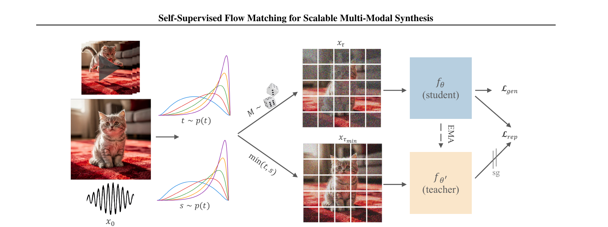
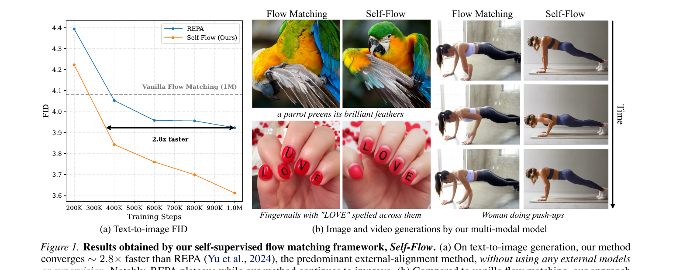
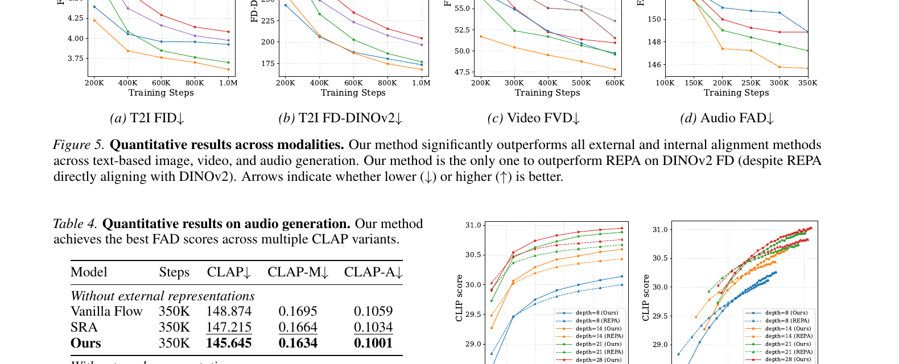
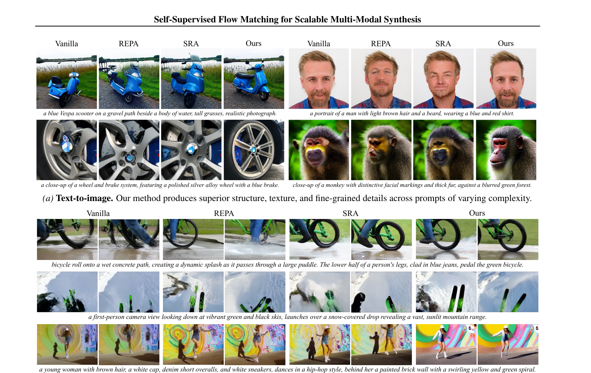

# Self-Flow 解读

**论文**: Self-Supervised Flow Matching for Scalable Multi-Modal Synthesis  
**机构**: Black Forest Labs + MIT  
**发表**: ICML 2026 (arXiv 2603.06507)  
**代码**: [Self-Flow](https://github.com/black-forest-labs/self-flow) | [推理代码](https://huggingface.co/Hila/Self-Flow)

---

## 1. 一句话定位

把自监督表示学习直接融入 flow matching 训练框架:通过 **Dual-Timestep Scheduling** 在 token 之间制造信息不对称,驱动模型自发学习语义表示,**无需任何外部编码器**,在图像/视频/音频多模态生成中全面超越 REPA,收敛速度提升 2.8×。

---

## 2. 要解决的问题(动机)

标准 flow matching 的去噪目标对所有 token 施加相同噪声级别,只需解决局部相关性即可完成去噪,**模型没有动力学习全局语义表示**。

现有解法——外部对齐(REPA 用 DINOv2)——有三个根本缺陷:

| 缺陷 | 具体表现 |
|------|---------|
| **Scaling law 失效** | 更强的编码器(DINOv3-H+)反而降低生成质量(Fig 2a),形成瓶颈 |
| **多模态泛化差** | 视频用 V-JEPA2、音频用 Depth Anything 3 对齐,实验结果比 vanilla FM 更差 |
| **训练目标错位** | 外部编码器为判别任务训练,其表示空间与生成目标天然不对齐 |

---

## 3. 与前作的关系

```
                    表示对齐方法
                        │
          ┌─────────────┴─────────────┐
          ▼                           ▼
    外部对齐 (External)          内部对齐 (Internal)
    REPA (DINOv2)               SRA / LayerSync
    SigLIP2                           │
    V-JEPA2 / MERT                    │
          │                    使用模型自身中间层特征
    依赖冻结判别模型               无需外部模型
    scaling 失效                  效果弱于外部对齐
          │                           │
          └─────────────┬─────────────┘
                        ▼
                  Self-Flow (本文)
                  自监督 + 双时间步
                  超越外部对齐 + 无需外部模型
```

**与 SRA/LayerSync 的关键区别**: 后者只做被动特征对齐,没有显式自监督目标;Self-Flow 通过 Dual-Timestep Scheduling 主动创造信息不对称,强迫模型从噪声 token 推断干净 token 的表示。

---

## 4. 核心算法

### 4.1 Flow Matching 基础

数据路径:

$$
\mathbf{x}_t = (1-t)\mathbf{x}_0 + t\mathbf{x}_1, \quad t \in [0,1]
$$

其中 `x_0` 为纯噪声(t=1 对应噪声),`x_1` 为干净数据(t=0),模型学习速度场最小化:

$$
\mathcal{L}_{\text{gen}} = \mathbb{E}_{\mathbf{x}_0, \mathbf{x}_1, t} \lVert f_\theta(\mathbf{x}_t, t) - (\mathbf{x}_1 - \mathbf{x}_0) \rVert^2
$$

### 4.2 Dual-Timestep Scheduling



> Fig 3: 同一输入用两个时间步制造噪声异质性——student 看到混合噪声 `x_τ`,teacher(EMA)只看较干净的 `x_{τ_min}`,迫使 student 从部分污染的视角重建 teacher 的语义表示。

三步操作:

1. **采样两个时间步** `t, s ~ p(t)`,相互独立
2. **采样 mask** `M = {i ∈ {1,...,N} | u_i < R_M}`,`u_i ~ U(0,1)`,`R_M ≤ 0.5`
3. **构建 per-token 时间步向量** `τ ∈ R^N`:

$$
\tau^i = \begin{cases} s & \text{if } i \in M \\ t & \text{otherwise} \end{cases}
$$

$$
\mathbf{x}_\tau = \text{diag}(1-\tau)\mathbf{x}_0 + \text{diag}(\tau)\mathbf{x}_1
$$

Teacher 看到的是更干净版本:`τ_min = min{t, s}`,即所有 token 用两个时间步中较小(噪声较少)的那个。

> 📌 **关键设计权衡**: 全遮挡(t=1 的 mask diffusion)引入 train-inference gap(推理时不出现全遮 token);独立 per-token 噪声(mask ratio=1)破坏边际分布。Dual-Timestep 是二者的平衡点:保持每 token 边际分布不变,同时引入全局语义压力。

### 4.3 Self-Flow 自监督损失

$$
\mathcal{L}_{\text{rep}} = -\mathbb{E}_{\mathbf{x}_0, \mathbf{x}_1, \tau} \cos\!\left(h_\theta^{(l)}(\mathbf{x}_\tau, \tau),\ f_{\theta'}^{(k)}(\mathbf{x}_{\tau_{\min}}, \tau_{\min})\right)
$$

- `h_θ^(l)`: student 网络第 `l` 层输出,接 MLP 投影头(表浅层)
- `f_θ'^(k)`: EMA teacher 网络第 `k` 层输出(较深层,无梯度 stop-gradient)
- 固定超参:EMA decay=0.9999,`l = 0.3D`(layer 8/28),`k = 0.7D`(layer 20/28)

**总损失**:

$$
\mathcal{L} = \mathcal{L}_{\text{gen}} + \gamma \cdot \mathcal{L}_{\text{rep}}, \quad \gamma = 0.8
$$

### 4.4 多模态实现细节

| 模态 | 自编码器 | 序列长度 | Mask 比例 `R_M` | 时间步分布 |
|------|---------|---------|----------------|-----------|
| 图像 | SD-VAE / FLUX.2 AE | 256 tokens (16D) | 0.25 | uniform / logit-normal α=4.63 |
| 视频 | WAN2.2 AE | ~3k tokens (48D) | 0.10 | logit-normal α=2.95 |
| 音频 | Songbloom AE | 250 tokens (64D) | 0.50 | logit-normal α∈{0.75,1.0} |

视频 `R_M=0.1` 较小,因为视频帧间冗余度高,过大的 mask 比例会鼓励 copy-across-frames 的捷径而不是学习语义。

---

## 5. 关键代码位置

代码仅包含 ImageNet 推理部分(训练代码为 BFL 内部实现),但 inference 代码清晰体现了模型结构和采样逻辑。

### 5.1 模型结构 — `src/model.py`

**核心类层次**:

```
SelfFlowDiT (line 282)
  ├── PatchedPatchEmbed      # Linear patchify
  ├── TimestepEmbedder       # 正弦嵌入 → MLP(256→D→D)
  ├── LabelEmbedder          # 类标签嵌入,dropout for CFG
  ├── blocks: List[DiTBlock] # adaLN-Zero 条件块
  ├── final_layer: FinalLayer
  ├── projector: SimpleHead  # 自蒸馏投影头
  └── pos_embed              # 2D sincos 固定位置编码

SelfFlowPerTokenDiT(SelfFlowDiT) (line 417)  ← 实际使用
  ├── blocks: List[PerTokenDiTBlock]  # 替换!
  └── final_layer: PerTokenFinalLayer # 替换!
```

**SelfFlowDiT._forward() (line 368)**: 标准 DiT 前向

```python
def _forward(self, x, t, y, return_features=False, return_raw_features=False):
    x = self.x_embedder(x) + self.pos_embed   # (B, T, D)
    t = self.t_embedder(t)                     # (B, D) — 单一时间步
    y = self.y_embedder(y, self.training)      # (B, D)
    c = t + y                                  # (B, D) — 全局条件

    for i, block in enumerate(self.blocks):
        x = block(x, c)
        if (i + 1) == return_features:
            zs = self.projector(x)             # 📌 投影头在指定层插入
        elif (i + 1) == return_raw_features:
            zs = x

    x = self.final_layer(x, c)
    if return_features or return_raw_features:
        return x, zs
    return x
```

> 📌 `return_features=8` 表示在第 8 层后提取 student 特征;`return_raw_features=20` 在第 20 层后提取 teacher 原始特征。训练时对 student/teacher 分别调用,推理时不使用。

**SelfFlowDiT.forward() (line 391)**: 时间步翻转与速度符号

```python
def forward(self, x, timesteps, vector, ...):
    timesteps = 1 - timesteps   # 📌 BFL 约定:输入 t∈[0,1] 翻转为 (1-t)
    x, zs = self._forward(x=x, t=timesteps, y=vector, ...)
    x = self.shufflechannel(x)  # 重排 patch 通道顺序
    return -x, zs               # 📌 速度方向翻转:ICPlan 约定 v = x1-x0
```

**SimpleHead (line 232)**: 投影头,MLP with SiLU

```python
class SimpleHead(nn.Module):
    def __init__(self, in_dim, out_dim):
        self.linear1 = nn.Linear(in_dim, in_dim + out_dim)   # D → 2D (扩张)
        self.linear2 = nn.Linear(in_dim + out_dim, out_dim)  # 2D → D
        self.act = nn.SiLU()

    def forward(self, x):
        x = self.linear1(x)
        x = self.linear2(self.act(x))  # 先激活再第二层
        return x
```

**SelfFlowPerTokenDiT._convert_to_per_token_blocks() (line 441)**: 权重保留转换

```python
def _convert_to_per_token_blocks(self, ...):
    new_blocks = nn.ModuleList()
    for original_block in self.blocks:
        new_block = PerTokenDiTBlock(hidden_size, num_heads, mlp_ratio)
        new_block.load_state_dict(original_block.state_dict())  # 📌 保留所有权重
        new_blocks.append(new_block)
    self.blocks = new_blocks

    new_final = PerTokenFinalLayer(hidden_size, patch_size, out_channels)
    new_final.load_state_dict(original_final.state_dict())  # 同样保留
    self.final_layer = new_final
```

> 📌 这是关键设计:先用标准 DiT block 初始化(可以加载标准权重),再转换为 PerToken 版本。`PerTokenDiTBlock` 继承 `DiTBlock` 所有权重(adaLN_modulation, attention, mlp),只有 forward 逻辑不同。

**SelfFlowPerTokenDiT._forward() (line 455)**: per-token 时间步嵌入

```python
def _forward(self, x, t, y, return_features=False, ...):
    x = self.x_embedder(x) + self.pos_embed
    batch_size, seq_len, hidden_dim = x.shape

    if t.ndim == 1:
        # 推理时:单一时间步广播给所有 token
        t_emb = self.t_embedder(t).unsqueeze(1).expand(-1, seq_len, -1)  # (B,T,D)
    elif t.ndim == 2:
        # 训练时:每个 token 的时间步 τ ∈ R^(B×N)
        t_flat = t.reshape(-1)              # (B*T,)
        t_emb_flat = self.t_embedder(t_flat)  # (B*T, D)
        t_emb = t_emb_flat.reshape(batch_size, seq_len, -1)  # (B, T, D)

    y_emb = self.y_embedder(y, self.training).unsqueeze(1).expand(-1, seq_len, -1)
    c = t_emb + y_emb  # (B, T, D) — 每个 token 独立的条件向量
    ...
```

> 📌 训练时传入 `t.shape = (B, N)` 的 dual-timestep 张量;推理时传入 `t.shape = (B,)` 的全局时间步。`TimestepEmbedder` 的正弦嵌入可以接受任意 batch 维度的输入。

**PerTokenDiTBlock.forward() (line 174)**: 核心修改

```python
def forward(self, x, c):
    # c: (N, T, D) — per-token conditioning (vs 标准 DiT 的 (N, D))
    batch_size, seq_len, hidden_dim = c.shape
    c_flat = c.reshape(-1, hidden_dim)            # (N*T, D)
    modulation_flat = self.adaLN_modulation(c_flat)  # (N*T, 6D) — SiLU+Linear
    modulation = modulation_flat.reshape(batch_size, seq_len, -1)  # (N, T, 6D)

    shift_msa, scale_msa, gate_msa, shift_mlp, scale_mlp, gate_mlp = \
        modulation.chunk(6, dim=-1)  # 每个: (N, T, D)

    # modulate_per_token: x * (1+scale) + shift — 无需 unsqueeze
    x = x + gate_msa * self.attn(modulate_per_token(self.norm1(x), shift_msa, scale_msa))
    x = x + gate_mlp * self.mlp(modulate_per_token(self.norm2(x), shift_mlp, scale_mlp))
    return x
```

> 📌 与标准 `DiTBlock` 的区别只在于 conditioning `c` 的形状从 `(N,D)` 变为 `(N,T,D)`,相应地 `modulate()` 改为 `modulate_per_token()`(去掉 `unsqueeze`)。Attention 操作本身没有变化,仍是标准 self-attention,**不是** per-token 独立 attention。

### 5.2 采样逻辑 — `src/sampling.py`

**线性插值路径 ICPlan (line 79)**:

```python
class ICPlan:
    def compute_alpha_t(self, t): return t, 1       # x_1 系数 = t, 导数 = 1
    def compute_sigma_t(self, t): return 1-t, -1    # x_0 系数 = 1-t, 导数 = -1
    # x_t = (1-t)*x_1 + t*x_0  (BFL 约定:x_0=噪声, x_1=数据)
```

**denoise_loop() (line 440)**: 推理主入口

```python
def denoise_loop(*, model, num_steps, cfg_scale=None, mode="ODE", ...):
    transport = create_transport(...)

    if mode == "SDE":
        sampler = FixedSampler(transport)
        sample_fn = sampler.sample_sde(num_steps=num_steps, ...)
    else:
        raise NotImplementedError("Only SDE mode is currently supported")
        # 📌 ODE 路径未实现!仅支持 SDE 采样

    def model_fn(x, t, **kwargs):
        t = 1 - t if reverse else t  # 时间轴翻转
        if apply_cfg:
            # CFG: 复制 batch 做条件/无条件两次推断
            x = torch.concat((x[bs//2:], x[bs//2:]))

        pred = model(x, timesteps=t, **kwargs).to(torch.float32)

        if apply_cfg:
            pred = vanilla_guidance(pred, cfg_val=cfg_scale)  # x_u + w*(x_c - x_u)
            pred = torch.cat((pred, pred))

        return -pred if reverse else pred  # 反转推理时速度方向

    samples = sample_fn(model_kwargs.pop("x"), model_fn, **model_kwargs)[-1]
    return samples
```

> 📌 **双重翻转**: `SelfFlowDiT.forward()` 已做一次 `1-t` 翻转,`denoise_loop` 的 `model_fn` 又做一次翻转并翻转速度符号。这是 BFL SDE 推理框架的约定:模型内部用 flow 方向的 t,外部 SDE 积分器用反向时间。

**SDE 积分器 `sde.__Euler_Maruyama_step` (line 268)**:

```python
def __Euler_Maruyama_step(self, x, mean_x, t, model, **model_kwargs):
    w_cur = torch.randn(x.size()).to(x)
    dw = w_cur * torch.sqrt(self.dt)
    drift = self.drift(x, t, model, **model_kwargs)      # 模型预测速度
    diffusion = self.diffusion(x, t)                     # σ_t (ICPlan: 1-t)
    mean_x = x + drift * self.dt
    x = mean_x + torch.sqrt(2 * diffusion) * dw         # 加扩散噪声
    return x, mean_x
```

### 5.3 位置编码与 token 处理 — `src/utils.py`

**prc_img() (line 37)**: 图像 patchify 后的 token 化

```python
def prc_img(x, ...):
    # x: (C, H, W) — 已经 patchify 的图像 latent
    c, h, w = x.shape
    x_coords = {"t": [0], "h": range(h), "w": range(w), "l": [0]}
    x_ids = torch.cartesian_prod(t, h, w, l)  # (H*W, 4) — (t,h,w,l) 位置ID
    x = rearrange(x, "c h w -> (h w) c")      # (H*W, C) — token 序列
    return x, x_ids
```

**prc_vid() (line 18)**: 视频 token 化

```python
def prc_vid(x, t_coord=None, ...):
    c, t, h, w = x.shape
    x_ids = torch.cartesian_prod(t_coord, h_arange, w_arange, l_arange)  # (T*H*W, 4)
    x = rearrange(x, "c t h w -> (t h w) c")
    return x, x_ids
```

> 📌 统一的 `(t, h, w, l)` 4D 位置 ID 设计使得图像/视频/音频可以用同一个模型处理:图像的 `t=0`, 音频的 `h=w=0`。这是多模态统一框架的基础。

**scatter_ids() (line 150)**: token → 空间格式(推理后重组)

```python
def scatter_ids(x, x_ids):
    for data, pos in zip(x, x_ids):
        t_ids = pos[:, 0]; h_ids = pos[:, 1]; w_ids = pos[:, 2]
        t_ids_cmpr = compress_time(t_ids)           # 稀疏时间索引 → 连续
        flat_ids = t_ids_cmpr * w * h + h_ids * w + w_ids
        out = torch.zeros((t*h*w, ch), device=data.device)
        out.scatter_(0, flat_ids.unsqueeze(1).expand(-1, ch), data)  # GPU 友好
        x_list.append(rearrange(out, "(t h w) c -> 1 c t h w", ...))
```

### 5.4 完整推理流程 — `sample.py`

```python
# load_model (line 93): SiT-XL/2 配置
config = dict(input_size=32, patch_size=2, in_channels=4,
              hidden_size=1152, depth=28, num_heads=16,
              num_classes=1001, learn_sigma=True)
model = SelfFlowPerTokenDiT(**config)

# sample_batch (line 141):
# Step 1: 采样噪声并 patchify
noise = torch.randn(B, 4, 32, 32)  # latent space
noise_patched = rearrange(noise, "b c (h p1) (w p2) -> b (c p1 p2) h w", p1=2, p2=2)
# → (B, 16, 16, 16)  (C*P*P=4*2*2=16 channels, H/P=W/P=16 tokens per dim)

# Step 2: token 化
x, x_ids = batched_prc_img(noise_patched.cpu())  # x: (B, 256, 16)

# Step 3: CFG 准备 (scale > 1.0 时)
x = torch.cat([x, x])                     # 双倍 batch
class_labels = torch.cat([null_labels, class_labels])

# Step 4: SDE 去噪 (bfloat16 autocast)
samples = denoise_loop(model=model, num_steps=250, mode="SDE",
                       x=x, x_ids=x_ids, vector=class_labels)

# Step 5: 重组 + unpatchify
samples = scattercat(samples, x_ids)     # (B, 16, 16, 16)
samples = rearrange(samples, "b (c p1 p2) h w -> b c (h p1) (w p2)", p1=2, p2=2)
# → (B, 4, 32, 32)

# Step 6: VAE decode → RGB
images = vae.decode(samples / 0.18215).sample   # SD-VAE scale factor
```

---

## 6. 关键配置项

**模型 (ImageNet 实验)**:

| 参数 | 值 | 说明 |
|------|-----|------|
| Architecture | SiT-XL/2 | hidden_size=1152, depth=28, heads=16 |
| Patch size | 2×2 | 32×32 latent → 256 tokens |
| Per-token conditioning | ✅ | 训练时每 token 独立时间步嵌入 |
| `learn_sigma` | True | 输出 `4*2=8` 通道(速度+sigma) |

**训练 (非公开,从论文和 README 推断)**:

| 参数 | 值 | 说明 |
|------|-----|------|
| EMA decay | 0.9999 | Teacher 权重更新速率 |
| γ | 0.8 | 表示损失权重 |
| Student layer `ℓ_θ` | 0.3D = layer 8 | 较浅层,捕获中级语义 |
| Teacher layer `ℓ_{θ'}` | 0.7D = layer 20 | 较深层,有更成熟表示 |
| Mask ratio `R_M` | 0.25 (img) / 0.50 (audio) / 0.10 (video) | |
| Optimizer | AdamW, max_norm=1 | 梯度裁剪 |
| Mixed precision | bfloat16 | |

**推理**:

| 参数 | 值 | 说明 |
|------|-----|------|
| Steps | 250 (ImageNet eval) / 50 (其他) | |
| Mode | SDE (Euler-Maruyama) | ODE 路径未实现 |
| CFG scale | 1.0 (论文定量结果均无 CFG) | |
| VAE | SD-VAE (sd-vae-ft-ema), scale=0.18215 | |

---

## 7. 定量结果



> Fig 1: Self-Flow 在 200K 步时 FID 已低于 REPA 的 1M 步终态,无需任何外部模型。右侧图像/视频示例显示文字渲染和时序连贯性均有提升。



> Fig 5: 在 T2I FID、T2I FD-DINOv2、视频 FVD、音频 FAD 四个指标上,Self-Flow 全面超越外部对齐(REPA/SigLIP2)和内部对齐(SRA)基线。

**ImageNet 256×256 (Tab. 1)**:

| 方法 | Steps | FID↓ | sFID↓ | IS↑ |
|------|-------|------|-------|-----|
| Vanilla Flow (SiT-XL/2) | 7M | 8.3 | 6.30 | 130.57 |
| SRA | 4M | 7.27 | 2.57 | 143.06 |
| **Ours** | **4M** | **5.70** | **4.97** | **151.40** |
| REPA | 4M | 5.89 | 5.73 | 157.66 |

**Text-to-Image (Tab. 2)**:

| 方法 | FID↓ | FD-DINOv2↓ | CLIP↑ |
|------|------|-----------|-------|
| Vanilla Flow | 4.08 | 204.49 | 30.66 |
| REPA | 3.92 | 173.35 | 30.67 |
| SigLIP 2 | 3.97 | 196.75 | 30.68 |
| **Ours** | **3.61** | **167.98** | **30.88** |

**Video (Tab. 3)**:

| 方法 | FVD↓ | FID↓ |
|------|------|------|
| w/ DINOv2 | 49.59 | 9.39 |
| w/ Depth Anything 3 | 51.52 | 9.85 |
| **Ours** | **47.81** | **8.92** |



> Fig 10: 在 Vespa 摩托、人脸、轮毂等细粒度结构上 Self-Flow 质量更优;视频帧(下)Self-Flow 保持跨帧时序一致性。

---

## 8. 争议与权衡

| 问题 | 分析 |
|------|------|
| **两次前向传播** | 每步训练需要 student + teacher 各一次前向,显存开销翻倍。论文声称由于收敛加速,总 FLOPs 实际减少 |
| **训练代码未开源** | 只有 ImageNet 推理代码,训练框架留在 BFL 内部;无法直接复现多模态实验 |
| **ODE 采样未实现** | `sample.py` 里 `mode="ODE"` 会直接 `raise NotImplementedError`,只能用 SDE |
| **层选择敏感性** | `ℓ_θ=0.3D`, `ℓ_{θ'}=0.7D` 是固定超参;从 Fig 4b 的 linear probing 看,早层和中层提升最显著,深层 layer 20+ 提升有限 |
| **R_M 差异巨大** | 图像 0.25 vs 视频 0.10 vs 音频 0.50,说明最优 mask 比例高度模态相关,需要独立调参 |
| **Scaling 上界** | 对 RAE(另一种 representation autoencoder)的改善较小(FID 3.24→2.95),说明方法本身的提升空间受限于 backbone 容量 |

---

## 9. 一句话总结

Self-Flow 用一个优雅的训练技巧——在 token 间制造噪声等级差异——把自监督表示学习免费嵌入 flow matching,无需外部模型即实现 2.8× 收敛加速,是首个在 ImageNet 上纯自监督方法超越外部对齐(REPA/DINOv2)的工作,且对图像/视频/音频统一有效。
