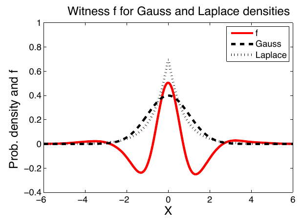
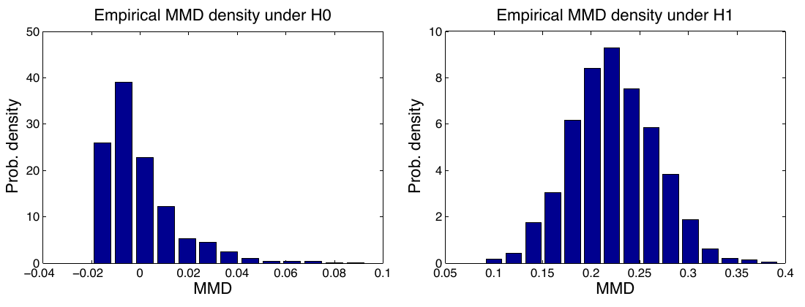
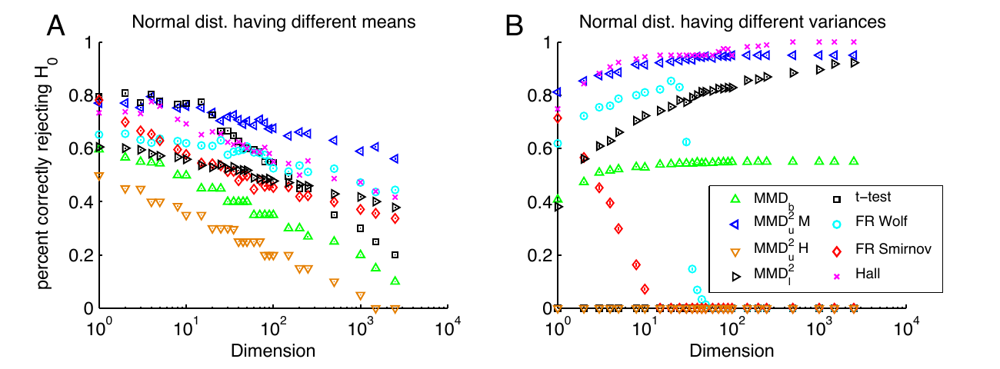
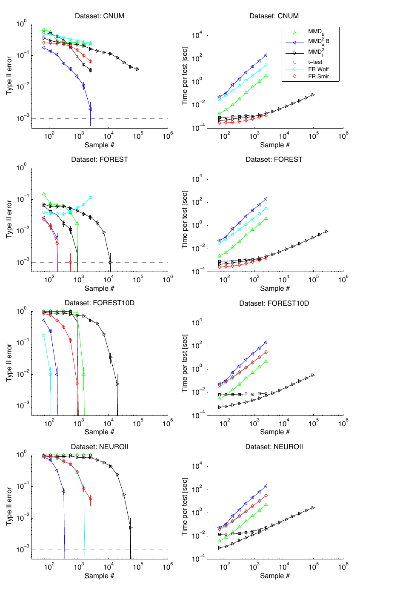

# A Kernel Method for the Two-Sample Problem（MMD 两样本检验）

**论文**: [arXiv:0805.2368v1](https://arxiv.org/abs/0805.2368)（cs.LG，2008-05-15，43 页：正文 1–31 页，附录 A 31–34 页，附录 B 34–38 页，参考文献 38–43 页）
**作者**: Arthur Gretton（MPI for Biological Cybernetics，Tübingen）、Karsten M. Borgwardt（University of Cambridge，工作在 LMU München 期间完成）、Malte J. Rasch（Graz University of Technology）、Bernhard Schölkopf（MPI Tübingen）、Alexander Smola（National ICT Australia）
**版本**: 这是 JMLR 格式的预印本。页眉的 "JMLR 1 (2008) 1-10"、"Published 04/08"、"Editor: TBA" 是模板占位符，不代表 2008 年已发表。论文自述它综合并扩展了 Gretton et al. 2007a（NIPS）、2007b 等前作；定稿后来以 *A Kernel Two-Sample Test* 为题发表在 JMLR 2012。**本笔记只针对 arXiv v1。**
**代码**: 论文里没有代码链接

---

## 1. 一句话定位

**MMD 把"两个分布是否相同"变成"两个分布在 RKHS 里的均值嵌入 `μ_p`、`μ_q` 离多远"：`MMD = ‖μ_p − μ_q‖_H`，只用核函数的样本平均就能算出来，不需要密度估计。** 在这个统计量上，论文给了三个两样本检验和一个线性时间版本：

| 检验 | 统计量 | 阈值怎么来 | 计算量 | 实验里的表现 |
|---|---|---|---|---|
| ① McDiarmid 界（Cor 16） | 有偏 `MMD_b` | 与分布无关的有限样本界 | `O((m+n)²)` | 太保守：Table 1 四组"分布不同"的数据里有三组几乎从不拒绝 |
| ② Hoeffding 界（Cor 18） | 无偏 `MMD²_u` | 与分布无关的有限样本界 | `O(m²)` | 更保守：Table 1 里**一次都没拒绝过** |
| ③ 渐近零分布（Thm 19） | 无偏 `MMD²_u` | bootstrap 或 Pearson 曲线拟合零分布分位数 | bootstrap `O(m²)`/次，Pearson `O(m³)` | 前三个里真正能用的是这一个 |
| ④ 线性时间（Cor 22） | `MMD²_l` | 正态近似 | `O(m)`，`O(1)` 内存 | 每个样本的信息少，要多得多的数据 |

📌 **这篇在本仓库值得读，是因为 MMD 已经出现在好几篇生成模型笔记里**：[ViRDM](../../video_generation/virdm/analysis.md) 的训练 loss 就是本文 Eq. 6 的平方（有偏估计，高斯 RBF 核，中位数带宽）；[Mask Forcing](../../video_generation/mask_forcing/analysis.md) 的 CMMD / VMMD 是 CLIP / V-JEPA2 特征上的 MMD；图像评测里的 KID 用的是无偏的 `MMD²_u`（保留全部交叉项的版本，本文说它与 Eq. 5 "几乎相同"）。读懂这篇，就知道这些数字的偏置、方差和盲区从哪来（§9）。

🔴 **我逐式核对后的几个结论**：
1. **核心恒等式都对**：Lemma 4/5、Eq. 6、Eq. 13 的非负性、脚注 9 的"`α=0.05` 时 `m ≥ 12` 起 McDiarmid 阈值更紧"、Parzen 窗 L2 距离等于有偏 MMD（论文 §7.1），我都复算过。
2. **有 5 处文字或公式与推导对不上**（见本笔记 §8）：
   - 论文 §6 把 `σ_u²` 描述成 *"average conditional variance"*，公式实际是条件期望的方差；
   - Example 2 的概率下界 `> 1 − e⁻¹ > 0.63` 在 `m ≥ 9` 时不成立，极限是 `e^{−1/2} ≈ 0.607`；
   - 脚注 10 的峰度定义（减 3）与所引 Wilkins 下界不自洽；
   - 附录 B.1 交叉项的归一化系数写错；
   - 论文 §8.1 把"维度超过样本数"写反了。
   这些都不影响主要结论。
3. **两个 distribution-free 检验在实际样本量下几乎没用**。按 RBF 核（`K = 1`）算，`m = 250` 时 Hoeffding 检验要 `MMD²_u > 0.438` 才拒绝（RBF 核下 `MMD²` 最大是 2），McDiarmid 检验要 `MMD_b > 0.308`（我按 Cor 16/18 算的，§4.3）。
4. **带宽只用了中位数启发式**，论文自己说 *"the optimum choice of kernel size is an ongoing area of research"*。
5. 📌 **Example 2 的构造就是一个"背下 `m²` 条训练样本、再均匀重放"的生成器**。按它的计算，这种模型在 `m` 个测试样本下**任何两样本检验都几乎分不出来**：`α = 0.05` 时功效最多约 42%，是我按 Example 2 推的（§4.1）。所以 MMD / KID / CMMD 这一类分布距离，原理上不能用来排除"模型只是在复述训练集"。

📌 **站得住的部分**：理论框架干净，把 KS、Wasserstein、bounded-Lipschitz 都统一成"不同函数类上的 MMD"（§3.4）；实验如实报告了对自己不利的数字（bootstrap 在 Subtype 上 Type I 远离设计值、H 检验从不拒绝）；Table 1/2 的百分比在各自的重复次数下都可达（粒度核对，§8）。

---

## 2. 要解决的问题

**两样本问题（homogeneity）**：给定 `X = {x_1..x_m} ~ p` 与 `Y = {y_1..y_n} ~ q`，判断 `p ≠ q`。论文举的应用：不同实验室的 microarray 数据能不能合并分析、两种癌症亚型是否可区分、数据库字段自动匹配（Wage 与 Salary 是不是同一个属性）。

**对函数类 `F` 的两个相反要求**：
- 要**足够丰富**，使得总体 MMD 为 0 当且仅当 `p = q`；
- 要**足够受限**，使得经验估计收敛得快，检验才有一致性。

论文的选择是**universal RKHS 的单位球**（Steinwart 2001；高斯核、Laplace 核都是 universal），并证明它同时满足这两点。

---

## 3. 定义与估计量

### 3.1 MMD 的定义（Eq. 1）

$$
\mathrm{MMD}[\mathcal{F}, p, q] := \sup_{f \in \mathcal{F}} \Big( \mathbb{E}_{x \sim p}[f(x)] - \mathbb{E}_{y \sim q}[f(y)] \Big)
$$

Müller (1997) 称之为 integral probability metric。**Theorem 3**：`F` 取紧度量空间上 universal RKHS 的单位球时，`MMD = 0 ⟺ p = q`。证明思路是 universal RKHS 在 `C(X)` 里按 `L∞` 稠密，而 `C(X)` 能区分任意两个 Borel 概率测度（Lemma 1，出自 Dudley）。

⚠️ Theorem 3 要求**紧**定义域；`R^d` 上高斯核的一致性要靠论文结论里提到的、当时刚出现的 **characteristic kernel**（Fukumizu et al. 2008、Sriperumbudur et al. 2008）。

### 3.2 RKHS 里的闭式（Lemma 4、Lemma 5）

**Lemma 4**：记 `μ_p := E_p[φ(x)]`，则 MMD 就是均值嵌入之差的 RKHS 范数：

$$
\mathrm{MMD}[\mathcal{F}, p, q] = \sup_{\|f\|_{\mathcal{H}} \le 1} \langle \mu_p - \mu_q, f \rangle_{\mathcal{H}} = \|\mu_p - \mu_q\|_{\mathcal{H}}
$$

**Lemma 5**：展开范数，只剩三个核期望：

$$
\mathrm{MMD}^2[\mathcal{F}, p, q] = \mathbb{E}_{x,x' \sim p}\, k(x,x') - 2\,\mathbb{E}_{x \sim p,\, y \sim q}\, k(x,y) + \mathbb{E}_{y,y' \sim q}\, k(y,y')
$$

**两个经验估计**（都是 `O((m+n)²)`）：

$$
\mathrm{MMD}^2_u = \frac{1}{m(m-1)} \sum_{i \ne j} h(z_i, z_j),\qquad h(z_i,z_j) = k(x_i,x_j) + k(y_i,y_j) - k(x_i,y_j) - k(x_j,y_i)
$$

$$
\mathrm{MMD}_b = \left[ \frac{1}{m^2}\sum_{i,j=1}^{m} k(x_i,x_j) - \frac{2}{mn}\sum_{i,j=1}^{m,n} k(x_i,y_j) + \frac{1}{n^2}\sum_{i,j=1}^{n} k(y_i,y_j) \right]^{1/2}
$$

- `MMD²_u` 是单样本 U-statistic（这里假设 `m = n`，`z_i = (x_i, y_i)`）。论文指出它不是最小方差的，因为丢掉了 `O(n)` 个交叉项 `k(x_i, y_i)`，但差别很小。它**可以是负数**；把被去掉的对角项加回来就一定非负（Eq. 13，我按 `Σ_{i,j} h = m²‖μ_X − μ_Y‖²` 核对过）。
- `MMD_b` 是 V-statistic（含 `i = j` 项），有向上的偏置。

📌 **偏置到底多大**（我按期望展开推的，论文只在 Theorem 15 里给了 `p = q` 的特例）：

$$
\mathbb{E}\big[\mathrm{MMD}_b^2\big] = \mathrm{MMD}^2 + \frac{1}{m}\Big(\mathbb{E}_p k(x,x) - \mathbb{E}_p k(x,x')\Big) + \frac{1}{n}\Big(\mathbb{E}_q k(y,y) - \mathbb{E}_q k(y,y')\Big)
$$

`p = q`、`m = n` 时它恰好等于 Theorem 15 里的 `B_1(F,p)² = (2/m)·E_p[k(x,x) − k(x,x')]`，两处对得上。对生成模型有两个直接推论：
- **做评测时，有偏估计会偏袒多样性低的模型。** RBF 核下 `k(x,x) = 1`，模型一侧的偏置是 `(1/m)(1 − E_p k(x,x'))`；样本越相似，`E_p k(x,x')` 越接近 1，偏置越小。所以小样本比较不同模型时应该用无偏的 `MMD²_u`，KID 就是这么做的。
- **做训练 loss 时，两者几乎没区别。** RBF 核的对角项是常数，不产生梯度；`1/B²` 与 `1/(B(B−1))` 的归一化差别，相当于把样本间的排斥项乘上 `(1 − 1/B)`。ViRDM 用的是有偏形式；按它每次更新 64 条样本算，这个系数是 0.984。

### 3.3 Witness function（§2.3、Fig 1）

使 MMD 取到上确界的函数就是两个均值嵌入之差：

$$
f(x) \propto \mathbb{E}_{x' \sim p}\, k(x, x') - \mathbb{E}_{x' \sim q}\, k(x, x')
$$

> **Fig 1**：零均值、单位方差的高斯（虚线）与 Laplace（点线），红线是 witness `f`（缩放后画出，`2×10⁴` 个样本，高斯核 `σ = 0.5`）。`f` 在中心（Laplace 更尖）和 `|x|` 约 3 附近的尾部（Laplace 尾更厚）为正，在 `x ≈ ±1.3` 附近（高斯密度更大）为负。**`f` 平滑，且幅度大致反映了一个密度比另一个高出多少**，这就是"在光滑函数约束下，两个分布差在哪里"的直观形式。

### 3.4 其他函数类（§2.4–2.5）

**Theorem 7**：只要 `F` 的"星"（非负伸缩）在 `C(X)` 里稠密，MMD 就是一个度量；否则是伪度量。**Theorem 8**：`F` 上的任何一致收敛界都能直接给出 `MMD_b` 的偏差界。换函数类就得到经典度量：

| 函数类 `F` | 对应的 MMD |
|---|---|
| universal RKHS 的单位球 | 本文的核 MMD |
| 有界连续函数 `C(X)` | 能区分任意分布（Lemma 1），但太大，无法估计 |
| 全变差 ≤ 1 的函数（`X = R`） | Kolmogorov-Smirnov：`‖F_p − F_q‖∞`（Prop 10） |
| Lipschitz 半范数 ≤ 1 | Wasserstein-1 / Earth Mover（Kantorovich-Rubinstein，Thm 12） |
| bounded-Lipschitz 范数 ≤ 1 | Dudley 的 bounded Lipschitz metric（Def 13） |

📌 **Remark 9（归约到二分类）**：任何有一致收敛界的分类器，都能用来比较两个分布——给 `X` 标 +1、`Y` 标 −1，看能分得多开（神经网络、决策树、boosting 都行）。**这与后来的 classifier two-sample test、GAN 判别器是同一个想法。**

---

## 4. 四个检验

### 4.1 背景与一个否定结论（§3）

检验比较统计量与阈值：超过阈值就拒绝 `H0: p = q`。level `α` 是 Type I error 的上界；一致的检验在大样本下 Type II error 趋于 0。

**Example 2（否定结论）**：从 `p` 抽 `m²` 个样本，令 `q` 为这 `m²` 个点上的均匀离散分布，再从 `q` 抽 `m` 个样本。只要这 `m` 个样本没有重复，它们的分布就和"从 `p` 独立抽 `m` 个"完全一样，**任何检验都分不出来**。所以不对 `p − q` 的形式做假设，就不可能在固定样本量下保证 Type II error。

⚠️ **论文给的概率下界不对。** 不重复的概率是 `Π_{i<m}(1 − i/m²)`，论文写它 `> 1 − e⁻¹ > 0.63`。我逐个 `m` 算了：`m = 8` 时 0.634，`m = 9` 时 0.631，已经低于 `1 − e⁻¹ = 0.632`；之后单调下降到 `e^{−1/2} ≈ 0.607`（`m = 100` 时 0.609）。正确的下界是 `> e^{−1/2} > 0.6`（用 `log(1−x) ≥ −x − x²` 可以证明对所有 `m` 成立）。结论本身不变。

📌 **这个构造对生成模型评测很关键**（下面是我的推论）：
- **`q` 就是一个背下 `m²` 条训练样本、再均匀重放的生成器。** 在"不重复"的事件上，测试样本的分布与 `H0` 完全相同，拒绝概率 ≤ `α`；所以功效 ≤ `α·P(不重复) + P(重复)`。`α = 0.05` 时约为 `0.05×0.607 + 0.393 ≈ 0.42`。
- **记住的样本越多越难发现。** 若背下的是 `m³` 条，`P(不重复) → 1`，功效趋于 `α`。
- ⇒ **分布距离类指标（FID / KID / CMMD / MMD）原理上无法排除"模型在复述训练集"**，要排除这一点得另做训练集最近邻检索。

### 4.2 检验 ①：有偏统计量 + McDiarmid（§4.1）

假设 `0 ≤ k ≤ K`。**Theorem 14**（不论 `p` 是否等于 `q`）：

$$
\Pr\Big\{ \big|\mathrm{MMD}_b - \mathrm{MMD}\big| > 2\big((K/m)^{1/2} + (K/n)^{1/2}\big) + \epsilon \Big\} \le 2\exp\!\left( \frac{-\epsilon^2 m n}{2K(m+n)} \right)
$$

它保证了一致性：Type II error 以 `O(m^{−1/2})` 的速率降到 0。**Theorem 15**（`p = q`、`m = n`）把偏置界收紧为 `B_2 = (2K/m)^{1/2}`，由此得到 **Corollary 16** 的接受域：

$$
\mathrm{MMD}_b < \sqrt{2K/m}\,\Big(1 + \sqrt{2\log \alpha^{-1}}\Big)
$$

我核对了推导：令 `exp(−ε²m/(4K)) = α`，解出 `ε = √(2K/m)·√(2 log α⁻¹)`，再加上偏置界 `√(2K/m)`。

### 4.3 检验 ②：无偏统计量 + Hoeffding（§4.2）

**Theorem 17**（Hoeffding 1963 的 U-statistic 界，`m_2 = ⌊m/2⌋`）：`Pr{MMD²_u − MMD² > t} ≤ exp(−t² m_2 / (8K²))`。**Corollary 18** 的接受域：

$$
\mathrm{MMD}^2_u < \frac{4K}{\sqrt{m}}\sqrt{\log \alpha^{-1}}
$$

- 把 Cor 16 的阈值平方后与 Cor 18 比：前者按 `m⁻¹` 下降，后者按 `m^{−1/2}`，所以样本够多时 McDiarmid 更紧。**脚注 9 说 `α = 0.05` 时从 `m ≥ 12` 起成立，我复算了**：`m = 11` 时 2.161 > 2.087，`m = 12` 时 1.981 < 1.999 ✅。
- 论文也承认 Theorem 17 很松：它和线性时间统计量的界（Theorem 21）一模一样，而 `MMD²_u` 用的数据多得多。

📌 **这两个阈值在实际样本量下有多大**（我按 `K = 1` 即 RBF 核、`α = 0.05` 算的）：

| `m` | Cor 16：`MMD_b` 阈值（平方后） | Cor 18：`MMD²_u` 阈值 |
|---|---|---|
| 50 | 0.690（0.476） | 0.979 |
| 250 | 0.308（0.095） | 0.438 |
| 1000 | 0.154（0.024） | 0.219 |

RBF 核下 `MMD² ≤ 2`。`m = 250` 时要 `MMD²_u > 0.438` 才拒绝，只有差别极大的分布才过得了，这就是 Table 1 里 H 检验从不拒绝的原因。

### 4.4 检验 ③：渐近零分布（§5、附录 B）

**Theorem 19**：
- **`H1` 下**，`MMD²_u` 渐近正态：

$$
\sqrt{m}\,\big(\mathrm{MMD}^2_u - \mathrm{MMD}^2\big) \xrightarrow{D} \mathcal{N}(0, \sigma_u^2),\qquad \sigma_u^2 = 4\Big(\mathbb{E}_z\big[(\mathbb{E}_{z'} h(z,z'))^2\big] - \big[\mathbb{E}_{z,z'} h(z,z')\big]^2\Big)
$$

- **`H0` 下** U-statistic 退化（`E_{z'} h(z, z') = 0`），收敛到加权卡方和：

$$
m\,\mathrm{MMD}^2_u \xrightarrow{D} \sum_{l=1}^{\infty} \lambda_l\,\big(z_l^2 - 2\big),\qquad z_l \sim \mathcal{N}(0, 2)\ \text{i.i.d.}
$$

  `λ_l` 是中心化核 `k̃` 关于 `p` 的特征值。这正是比较 `MMD²_u` 与零分布 `1 − α` 分位数的依据。

**两种求分位数的办法**：
- **bootstrap**：在合并样本上重采样（Arcones & Giné 1992）。每次重采样 `O(m²)`；论文 §8.3 用了 150 次，其余实验没写次数。
- **Pearson 曲线**：用前几阶矩拟合零分布，`O(m³)`。
  - 二、三阶矩有闭式（Eq. 11、12，附录 B.2），我核对过展开：

$$
\mathbb{E}\big[(\mathrm{MMD}^2_u)^2\big] = \frac{2}{m(m-1)}\,\mathbb{E}_{z,z'}\big[h^2(z,z')\big],\qquad \mathbb{E}\big[(\mathrm{MMD}^2_u)^3\big] = \frac{8(m-2)}{m^2(m-1)^2}\,\mathbb{E}_{z,z'}\big[h(z,z')\,\mathbb{E}_{z''}\big(h(z,z'')\,h(z',z'')\big)\big] + O(m^{-4})
$$

  - 四阶矩太贵（`O(m⁴)`），改用 Wilkins (1944) 的峰度下界 `kurt ≥ skew² + 1` 代替。⚠️ 这个下界与脚注 10 的定义不自洽，见本笔记 §8。

> **Fig 2**：左：`p`、`q` 都是单位方差高斯，各 50 个样本，2000 次重复。分布右偏、有负值，峰在 0 略左，正是"退化 U-statistic 收敛到加权卡方和减常数"的形状。右：`p` 为单位标准差的 Laplace，`q` 为标准差 `3√2` 的 Laplace，各 100 个样本，分布近似正态、中心约 0.22。⚠️ 横轴写的是 "MMD"，但左图有负值，画的其实是 `MMD²_u`。

### 4.5 检验 ④：线性时间统计量（§6）

把样本两两配对、不重叠地用一次（**Lemma 20**），得到 `O(m)` 时间、`O(1)` 内存、可用于数据流的无偏估计：

$$
\mathrm{MMD}^2_l = \frac{1}{m_2}\sum_{i=1}^{m_2} h\big((x_{2i-1}, y_{2i-1}),\,(x_{2i}, y_{2i})\big),\qquad \sqrt{m}\,\big(\mathrm{MMD}^2_l - \mathrm{MMD}^2\big) \xrightarrow{D} \mathcal{N}\Big(0,\ 2\big[\mathbb{E}\,h^2 - (\mathbb{E}\,h)^2\big]\Big)
$$

📌 **两个方差差在哪**。把 `h` 的方差按 `z` 分解：

$$
\mathrm{Var}_{z,z'}[h] = \underbrace{\mathbb{E}_z\,\mathrm{Var}_{z'}\big[h(z,z') \mid z\big]}_{\text{avg. conditional variance}} + \underbrace{\mathrm{Var}_z\,\mathbb{E}_{z'}\big[h(z,z') \mid z\big]}_{\sigma_u^2/4}
$$

- `σ_u²` 是**第二项**的 4 倍（条件期望的方差）；`σ_l²` 是**整个** `Var[h]` 的 2 倍。
- ⚠️ 论文 §6 末段说 Theorem 19 里是 *"the average conditional variance E_z Var_z′[h(z,z′)|z]"*，**这是第一项，与它自己的公式不符**。
- **`H0` 下差距更大**：`σ_u² = 0`，`MMD²_u` 的涨落是 `O(1/m)`（Eq. 11），`MMD²_l` 仍是 `O(1/√m)`。所以检测小差异时，二次统计量每个样本带来的信息多得多，这就是 Fig 5 里线性检验要多看两三个数量级数据的原因。

论文 §6 末尾还提了一句 **Gram 矩阵低秩近似**（Nyström 等）可以把代价降到 `O(md)`，但 *"it remains to be determined what effect this approximation would have on the distribution of the test statistic under H0"*。[ViRDM](../../video_generation/virdm/analysis.md) 的吸引项就用了 4,096 个 landmark 的 Nyström 近似；它是当训练 loss 用、不做检验，所以零分布的问题不适用，但 loss 已经不是精确的 MMD 了。

---

## 5. 与其他度量的关系（§7）

| 联系 | 内容 |
|---|---|
| **Parzen 窗 L2 距离**（§7.1） | 两个核密度估计的 L2 距离，恰好是核取 `k(x − y) = ∫κ(x − z)κ(y − z)dz` 时的有偏 `MMD_b²`（Eq. 15–16，我核对过展开）。区别在于做密度估计时带宽要随 `m` 缩小，Type II error 的收敛率降为 `m^{−1/2} h_m^{−d/2}`（Anderson et al. 1994）；MMD 用固定核，保持 `m^{−1/2}` |
| **集合核 / 分布间的核**（§7.2） | Multi-instance 学习里的集合核 `k(X_i, X_j) = (1/(m_i m_j)) Σ k(x_iu, x_jv)`，就是两个经验均值嵌入的内积 |
| **核独立性度量**（§7.3） | 联合分布与边缘乘积之间的 MMD，在乘积核下等于 cross-covariance 算子的 Hilbert-Schmidt 范数（Theorem 23），即 HSIC；经验估计为 `m⁻² tr(HKHL)`，偏置 `O(m⁻¹)`（Theorem 24） |
| **按分布抽 witness**（§7.4） | Shawe-Taylor & Dolia 的"对随机测试函数取平均差"，在旋转不变的 `r(f)` 下只差 MMD 的一个常数倍（Lemma 25） |
| **离群点检测**（§7.5） | 第二个样本只有一个点的两样本问题 |

---

## 6. 实验设置

| 项 | 设置 |
|---|---|
| 被比较的检验 | `MMD_b`（Cor 16 阈值）、`MMD²_u H`（Cor 18 阈值）、`MMD²_u B`（bootstrap）、`MMD²_u M`（Pearson 曲线）、`MMD²_l`（线性时间） |
| Baselines | 多元 t 检验（协方差加 ridge，最大/最小特征值比 ≤ 2）；Friedman-Rafsky 的 Wald-Wolfowitz 推广（Wolf）与 Kolmogorov-Smirnov 推广（Smir）；Biau-Györfi（只用于低维）；Hall-Tajvidi（Hall）。图数据上只有 MMD 适用 |
| 核与带宽 | 向量数据用高斯 RBF，**`σ` 取合并样本两两距离的中位数**（论文自称启发式）；蛋白质图用 Borgwardt et al. (2005) 的图核 |
| 显著性水平 | 全部 `α = 0.05` |
| 论文 §8.1 两个高斯 | `m = 250`，维度到 2500，每点 100 次重复。均值不同：均值欧氏距离取 0.05–50 之间对数均匀的 20 个值；方差不同：`N(0, I)` vs `N(0, σ²I)`，`σ` 取 `10^0.01`–10 之间对数均匀的 20 个值；报告的是在这 20 个值上平均的正确拒绝率 |
| 论文 §8.2 数据整合 | Neural I：4000 个样本，63 维，100 次重复；Neural II：1000，100 维，1200 次；Health status：25，12,600 维，1000 次；Subtype：25，2,118 维，1000 次 |
| 论文 §8.3 计算代价 | CNUM、FOREST（1 维）、FOREST10D、NEUROII；bootstrap 150 次重采样 |
| 论文 §8.4 属性匹配 | BIO：377 个样本，1 维，6 个属性，100 次重复；FOREST：538，1 维，10 个，100 次；CNUM：386，1 维，13 个，100 次；FOREST10D：1000，10 维，2 张表，100 次。Hungarian 匹配另加 ENZYMES（50 个样本，6 类，50 次）、PROTEINS（200，2 类，50 次） |
| **没给** | 计时用的硬件；论文 §8.2 与 §8.4 的 bootstrap 次数；代码 |

---

## 7. 结果

### 7.1 两个高斯随维度的变化（Fig 4）

> **Fig 4**：纵轴是正确拒绝 `H0` 的比例（标注为 percent，实际取值 0–1），横轴是维度（1–2500），`m = 250`。
> **(A) 均值不同**：t 检验（黑方块）在低维最好，维度上百后明显下滑；`MMD²_u M`（蓝左三角）在高维一直最好（约 0.55–0.7）；`MMD_b`（绿）与 `MMD²_u H`（橙倒三角）最差，H 在最高维降到 0。
> **(B) 方差不同**：Hall（品红）与 `MMD²_u M` 接近 1；FR Smirnov（红菱形）在 10 维左右就降到 0，FR Wolf（青）在约 50 维后也归零；`MMD²_u H` 全程为 0；线性 `MMD²_l`（黑右三角）从 0.4 升到约 0.9，最高维时接近 `MMD²_u`。

📌 **两张图趋势相反，原因在备择假设本身，不在 MMD**（我的解释）：
- **(A) 中功效随维度下降。** 20 个均值差是按欧氏距离固定的，而中位数带宽随维度按 `√d` 增长，同样的均值差相对核尺度越来越小。
- **(B) 中功效随维度上升。** 方差比作用在每一维上，维度越高，组内与组间距离分得越开（测度集中），问题本身在变容易。
- 所以论文 §7.1 用 (B) 说明"MMD 在维度远超样本数时仍然好用"，需要打个折扣。后来 Ramdas 等人（AAAI 2015）专门分析过均值差固定时核检验功效随维度衰减的问题。

⚠️ 正文 §8.1 写 t 检验 *"severely weakened when the number of samples exceeds the number of dimensions"*，又说 `MMD²_u M` *"comparable to the t-test for low sample sizes … outperforms all other methods for larger sample sizes"*。**这张图里样本数固定为 250，变的是维度**；t 检验失效是因为维度超过了样本数，两句都应该把"样本"换成"维度"。

### 7.2 数据整合（Table 1）

表中是接受 `H0` 的百分比。"Same" 行越接近 95% 越好（100 − α），"Different" 行越接近 0 越好（即 Type II error）。

| 数据集 | 属性 | `MMD_b` | `MMD²_u H` | `MMD²_u B` | `MMD²_u M` | t-test | Wolf | Smir | Hall |
|---|---|---|---|---|---|---|---|---|---|
| Neural Data I | Same | 100.0 | 100.0 | 96.5 | 96.5 | 100.0 | 97.0 | 95.0 | 96.0 |
| | Different | 38.0 | 100.0 | **0.0** | **0.0** | 42.0 | **0.0** | 10.0 | 49.0 |
| Neural Data II | Same | 100.0 | 100.0 | 94.6 | 95.2 | 100.0 | 95.0 | 94.5 | 96.0 |
| | Different | 99.7 | 100.0 | 3.3 | 3.4 | 100.0 | **0.8** | 31.8 | 5.9 |
| Health status | Same | 100.0 | 100.0 | 95.5 | 94.4 | 100.0 | 94.7 | 96.1 | 95.6 |
| | Different | 100.0 | 100.0 | 1.0 | **0.8** | 100.0 | 2.8 | 44.0 | 35.7 |
| Subtype | Same | 100.0 | 100.0 | 99.1 | 96.4 | 100.0 | 94.6 | 97.3 | 96.5 |
| | Different | 100.0 | 100.0 | **0.0** | **0.0** | 100.0 | **0.0** | 28.4 | 0.2 |

（加粗按原表，标的是 Type II error 最小的格。）

- **正文结论核对得上**：渐近 MMD 检验只在 Neural Data II 上输给 Wolf（3.3 / 3.4 vs 0.8），在 Health status 上赢它（1.0 / 0.8 vs 2.8），其余两组都是 0 错误。
- **论文自己点出了对自己不利的一条**：Subtype 上 bootstrap 的 Type I error 只有 0.9%（99.1），远低于设计值 5%，说明样本量 25 时 Pearson 曲线的阈值更准；样本多时 bootstrap 更便宜（`O(m²)` vs `O(m³)`），应优先用。
- **两个 distribution-free 检验基本没用**：`MMD²_u H` 在四组"Different"上全是 100.0（一次都没拒绝）；`MMD_b` 只在样本最多的 Neural I 上拒绝过一部分（38.0）。
- ⚠️ **t 检验的"Same"全是 100.0**，即 Type I error 为 0，说明加了 ridge 之后它已经不在设计水平上，这一点论文没评论。

### 7.3 线性 vs 二次的代价（Fig 5）

> **Fig 5**：四行是 CNUM、FOREST、FOREST10D、NEUROII。左列是 Type II error 随样本数的变化（对数纵轴，虚线表示 0），右列是每次检验的耗时。
> - **`MMD²_u B`（蓝）在四组里有三组最早（或并列最早）降到 0 错误**，FOREST10D 上略慢于 FR Wolf（论文原话）。读图：CNUM 约 2000 个样本、NEUROII 约 300 个样本归零；耗时随样本数二次增长，2,500 个样本时约 100 秒量级。
> - **`MMD²_l`（黑右三角）同样样本量下耗时低好几个数量级，但要多看两三个数量级的数据**。读图：NEUROII 约 6×10⁴ 个样本才归零，此时耗时与 `MMD²_u B` 在 300 个样本时相近，都在 1 秒左右，与正文 *"about the same cost"* 一致；CNUM 到 10⁵ 个样本仍有约 4% 的错误。

- 论文的建议是：**数据少时用 `MMD²_u B`，把每个样本用足；数据多时用线性统计量，每个点只看一次**。它还建议先跑一个 t 检验，只有 t 检验接受 `H0` 时再跑非参数检验。
- 计时硬件没写，所以秒数只能看相对量级。

### 7.4 属性匹配（Table 2、Table 3）

**Naive 匹配**（所有属性两两检验，结果按属性合并）：

| 数据集 | 属性 | `MMD_b` | `MMD²_u H` | `MMD²_u B` | `MMD²_u M` | t-test | Wolf | Smir | Hall | Biau |
|---|---|---|---|---|---|---|---|---|---|---|
| BIO | Same | 100.0 | 100.0 | 93.8 | 94.8 | 95.2 | 90.3 | 95.8 | 95.3 | 99.3 |
| | Different | 20.0 | 52.6 | **17.2** | 17.6 | 36.2 | **17.2** | 18.6 | 17.9 | 42.1 |
| FOREST | Same | 100.0 | 100.0 | 96.4 | 96.0 | 97.4 | 94.6 | 99.8 | 95.5 | 100.0 |
| | Different | 3.9 | 11.0 | **0.0** | **0.0** | 0.2 | 3.8 | **0.0** | 50.1 | **0.0** |
| CNUM | Same | 100.0 | 100.0 | 94.5 | 93.8 | 94.0 | 98.4 | 97.5 | 91.2 | 98.5 |
| | Different | 14.9 | 52.7 | 2.7 | **2.5** | 19.17 | 22.5 | 11.6 | 79.1 | 50.5 |
| FOREST10D | Same | 100.0 | 100.0 | 94.0 | 94.0 | 100.0 | 93.5 | 96.5 | 97.0 | 100.0 |
| | Different | 86.6 | 100.0 | **0.0** | **0.0** | **0.0** | **0.0** | 1.0 | 72.0 | 100.0 |

- **CNUM 上 MMD 的优势最大**（2.5 / 2.7，次好的 Smir 是 11.6），与正文一致。
- **正文点名的 "Wolf 在 BIO 上 Type I error 9.7%"** ✅（100 − 90.3）。正文又说 MMD 在 BIO 上 *"without compromising the designed Type I performance"*，但 `MMD²_u B` 的 Type I 是 6.2%，也略高于 5%。按 6 个属性 × 100 次 = 600 次同分布检验算（这是我对"合并"的理解），6.2% 与 5% 差约 1.3 个标准误，说"没破坏"大体成立。
- `MMD_b` 在 FOREST10D 上几乎检测不出差别（86.6），论文自己也说 *"surprisingly"*。

**Hungarian 匹配**（把属性分配当作线性指派问题，代价矩阵是各属性对之间的 MMD²；Theorem 26 证明"最优坐标匹配后的 MMD 和"是半度量）：

| 数据集 | 类型 | 属性数 | 样本量 | 重复次数 | 正确匹配 % |
|---|---|---|---|---|---|
| BIO | 单变量 | 6 | 377 | 100 | 90.0 |
| CNUM | 单变量 | 13 | 386 | 100 | 99.8 |
| FOREST | 单变量 | 10 | 538 | 100 | 100.0 |
| FOREST10D | 多变量 | 2 | 1000 | 100 | 100.0 |
| ENZYME | 图 | 6 | 50 | 50 | 100.0 |
| PROTEINS | 图 | 2 | 200 | 50 | 100.0 |

在两组图数据上，论文称这是**第一个能用的两样本检验**，其他方法都无法直接用于图。

---

## 8. 数字与推导核对

**核对通过的**：

| 项 | 结果 |
|---|---|
| Lemma 4 / 5、Eq. 6 | ✅ |
| Eq. 13（`MMD²_u` 加回对角项后非负） | ✅，由 `Σ_{i,j} h = m²‖μ_X − μ_Y‖² ≥ 0` 得到 |
| `E[MMD_b²]` 的偏置 = Theorem 15 的 `B_1²`（`p = q`、`m = n`） | ✅（我的推导，§3.2） |
| Cor 16 / Cor 18 的阈值由 Thm 15 / Thm 17 推出 | ✅ |
| 脚注 9：`α = 0.05` 时 `m ≥ 12` 起 McDiarmid 阈值平方后更紧 | ✅ |
| Theorem 17 与 Theorem 21 的界相同 | ✅ |
| 附录 B.2 的二、三阶矩 | ✅ |
| 论文 §7.1：Parzen 窗 L2 距离 = 有偏 MMD² | ✅ |
| Table 1 / 2 百分比的粒度 | ✅ 例如 Neural I 只有 100 次重复，却出现 96.5，说明 "Same" 每次重复做了 A-A 与 B-B 两次检验、共 200 次（我按粒度反推，论文没写）；Neural II 的 3.3 / 3.4 / 0.8 / 31.8 / 5.9 在 1200 次下分别对应 40 / 41 / 10 / 382 / 71 次 |
| 正文对 Table 1 / 2 的文字描述（Wolf 9.7%、CNUM 优势、BIO 并列最好 17.2 等） | ✅ |

**对不上的**：

| # | 位置 | 问题 |
|---|---|---|
| 1 | 论文 §6 末段 | 说 Theorem 19 的方差是 *"average conditional variance E_z Var_z′[h\|z]"*，但 `σ_u²` 的公式是 `4·Var_z E_{z'}[h\|z]`（条件期望的方差），两者是 `Var[h]` 分解里不同的两项（见本笔记 §4.5） |
| 2 | Example 2 | 下界 `> 1 − e⁻¹ > 0.63` 在 `m ≥ 9` 时不成立；不重复概率的极限是 `e^{−1/2} ≈ 0.607`（见本笔记 §4.1） |
| 3 | 脚注 10 与正文 | 脚注把 kurt 定义为超额峰度（四阶矩比减 3）。偏度—峰度的经典不等式是对非超额峰度 `β₂ = μ₄/σ⁴` 成立的 `β₂ ≥ skew² + 1`，换成超额峰度应写 `kurt ≥ skew² − 2`；正文写的 `kurt ≥ skew² + 1` 是非超额峰度的写法。两处必有一处不对，实现里用的是哪个没说 |
| 4 | 附录 B.1 | 前两项用 `1/m` 归一化，交叉项却写成 `1/(m(m−1))`；按后者这一项会趋于 0，得不到文中的 `2Σλ_l y_l z_l`，应为 `1/m`。同一段的第二个样本记号也在 `x′` 与 `y` 之间来回换 |
| 5 | 论文 §8.1 | "样本数超过维度"应为"维度超过样本数"；"low / larger sample sizes"应为维度（见本笔记 §7.1） |
| 小 | 论文 §4 开头 | 把两个两样本检验说成 *"two statistical tests of independence"* |
| 小 | Fig 2 / Fig 4 | Fig 2 横轴标 "MMD"，实际画的是 `MMD²_u`（左图有负值）；Fig 4 纵轴标 "percent"，实际取值 0–1 |
| 小 | Table 2 | CNUM 的 t 检验写成 19.17，其余格都是一位小数 |

---

## 9. 从今天看：局限与它在生成模型里的用法

**局限**（多数论文自己也承认）：
- **核怎么选没解决**：只用中位数启发式；`σ → 0` 和 `σ → ∞` 时经验 MMD 都趋于 0，中位数只是折中。后来 Gretton et al.（NIPS 2012）、Sutherland et al.（ICLR 2017）都在做"为功效优化核"。
- **一致性只在紧定义域上证明**；`R^d` 要靠 characteristic kernel 的后续结果（结论里已提到）。
- **零分布近似有代价**：bootstrap 每次 `O(m²)`，Pearson 曲线 `O(m³)` 且依赖一个有问题的峰度下界（§8 #3）。
- **高维下的"好用"要看备择假设**：均值差固定时功效随维度下降（Fig 4A）。
- **Example 2**：没有任何检验能在固定样本量下保证功效（§4.1）。

**MMD 在本仓库相关工作里的三种用法**（背景，非本文内容）：

| 用法 | 例子 | 这篇论文告诉你要注意什么 |
|---|---|---|
| **训练 loss** | GMMN（Li, Swersky, Zemel 2015）、MMD-GAN（Li et al. 2017）；表示空间里的 RDM / [ViRDM](../../video_generation/virdm/analysis.md) | 有偏 / 无偏对梯度几乎无影响（§3.2）；带宽决定"看多细"；Nyström 近似改变了目标本身（§4.5） |
| **评测指标** | KID（Bińkowski et al. 2018，Inception 特征 + 多项式核 + 无偏估计）、CMMD（CLIP 特征 + 高斯核）、[Mask Forcing](../../video_generation/mask_forcing/analysis.md) 的 CMMD / VMMD | 小样本下用无偏估计，否则偏袒低多样性模型（§3.2）；两个模型的差要和 `σ_u/√m` 量级的抽样误差比（Thm 19）；**分不出"复述训练集"**（Example 2） |
| **两样本检验本身** | 判断生成分布与真实分布是否可区分 | 用 bootstrap / 置换得到阈值，不要用 Cor 16 / 18 那两个过于保守的界 |

---

## 10. 一句话总结

**这篇 2008 年的预印本定义了 MMD：两个分布在 RKHS 里均值嵌入之差的范数，等于 universal RKHS 单位球上"期望差"的上确界；它只要核函数的样本平均就能算，给出有偏的 `MMD_b`、无偏的 `MMD²_u` 与线性时间的 `MMD²_l` 三种估计，并据此构造了两个 distribution-free 检验和一个基于渐近零分布（加权卡方和，用 bootstrap 或 Pearson 曲线求分位数）的检验。** 它把 KS、Wasserstein、Parzen 窗 L2 距离、HSIC 都统一进同一个框架，实验覆盖高维小样本的 microarray 和图数据。核心恒等式和界我都复算过，是对的；🔴 但两个 distribution-free 检验在实际样本量下几乎从不拒绝（`m = 250` 时要 `MMD²_u > 0.438`），带宽只有中位数启发式，文中还有五处与推导不符的笔误（方差的文字描述、Example 2 的下界、峰度定义、附录交叉项系数、论文 §8.1 的维度 / 样本颠倒）。📌 对今天做生成模型的人，最有用的三点是：评测用无偏估计并看抽样误差；训练 loss 用有偏还是无偏无所谓，带宽才重要；Example 2 说明任何分布距离都识别不了"背下训练集再重放"的模型。

---

## 11. 在仓库图谱里的位置

| | 关系 |
|---|---|
| **[ViRDM](../../video_generation/virdm/analysis.md)** | 📌 它的训练 loss（Eq. 3）就是本文 Eq. 6 的平方：有偏 V-statistic，高斯 RBF 核（视觉项 × 文本项的乘积核），带宽用参考集上的中位数启发式——这个启发式出自本文 §8。吸引项用 Nyström 低秩近似，本文 §6 提过这条路，但只说"对零分布的影响有待研究"；ViRDM 不做检验，只是 loss 不再是精确的 MMD |
| **[Mask Forcing](../../video_generation/mask_forcing/analysis.md)** | 收敛曲线上的 CMMD / VMMD 就是 CLIP / V-JEPA2 特征上的 MMD。那篇笔记已经指出它们和 DMD 的训练目标同源；本文补上的是统计侧：曲线间的差距要和 `σ_u/√m` 量级的抽样误差比较 |
| **[五篇横向对照](../../video_generation/dmd_few_step_ar/analysis.md)** | 那篇 §5.2 指出 Mask Forcing 的 CMMD / VMMD 与 DMD 目标同源；这里补的是它们作为 MMD 估计量的偏置与方差该怎么读（§3.2、§4.4） |
| **[RWTD](../../image_generation/rwtd/analysis.md)** | 同为"冻结特征空间里的分布匹配"，但 RWTD 用二次代价的熵正则 OT（Sinkhorn）+ 逐样本回归，本文的 MMD 是均值嵌入之差。本文 §2.5 用 Kantorovich-Rubinstein 把 W1 写成 Lipschitz 函数类上的 MMD；RWTD 的二次代价 OT 更接近 W2，不在这个框架里 |

⚠️ **仓库缺口**：MMD 在生成模型里的直接后继——GMMN、MMD-GAN、KID（*Demystifying MMD GANs*）、CMMD（*Rethinking FID*）、图像侧的 RDM——都还没有笔记；本文定稿版 JMLR 2012 *A Kernel Two-Sample Test* 与 HSIC 原文也没有。

---

## Q&A

*(后续对话中产生的问答追加于此)*
