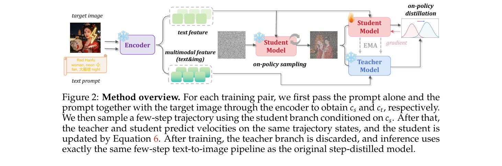
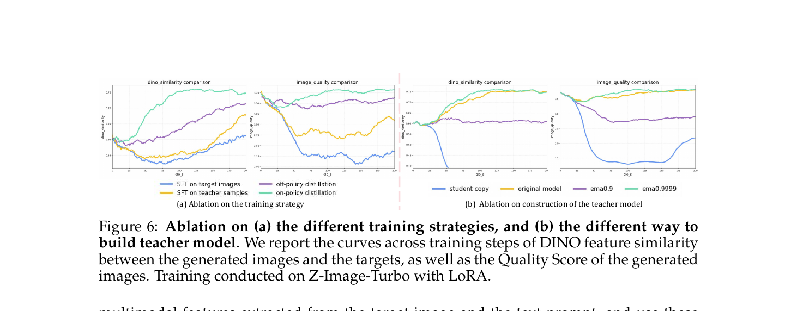

# D-OPSD 阅读笔记

**论文**: D-OPSD: On-Policy Self-Distillation for Continuously Tuning Step-Distilled Diffusion Models  
**arXiv**: 2605.05204 | **GitHub**: https://github.com/vvvvvjdy/D-OPSD  
**项目页**: https://vvvvvjdy.github.io/d-opsd/  
**机构**: HKUST + Z-Image Team (Alibaba) + UCSD + CUHK  
**时间**: 2026-05-06 (v1), v3 2026-05-26

---

## 1. 一句话定位

Few-step 蒸馏模型(Z-Image-Turbo、FLUX.2-klein)用普通 SFT 微调会破坏原有的 few-step 推理能力。D-OPSD 发现这类模型的 LLM/VLM encoder 具有**涌现的 in-context 能力**(输入 text+image 就能生成目标概念/风格的变体,无需额外训练),并以此为锚:训练时让同一模型同时扮演 student(仅 text 条件,模拟推理路径)和 teacher(multimodal 条件,提供目标监督),在 student 的 on-policy rollout 上对齐两者的 velocity 预测,从而实现无奖励函数的自监督 continual fine-tuning。

---

## 2. 要解决的问题(动机)

| 方法 | 问题 |
|------|------|
| **Vanilla SFT** | 对 noisy target image 做流匹配监督 → query states 是从目标加噪得来的 off-policy 状态,few-step sampler 从未访问这些 states → 轻微扰动即破坏 few-step 动态 |
| **Online RL** | 在 on-policy rollout 上训练,不破坏 few-step;但需要奖励函数 → 对没有奖励的 concept/style 定制场景不适用 |
| **期望解** | on-policy 采样 + 仅用 image-text pair 就能提供监督 |

D-OPSD 同时满足两个条件,且不引入任何外部模块。

---

## 3. 与前作关系

```
LLM OPSD (on-policy self-distillation for text generation)
  └── 同模型 student/teacher 双角色,student 在 on-policy 序列上学习更强 teacher 分布
      (teacher context = demonstrations/in-context examples)
      ↓ 本文直接借鉴框架
D-OPSD (本文)
  └── 把 OPSD 迁移到扩散模型
      关键问题:diffusion 里无法直接 append target image 到 token 序列
      解决方案:利用 LLM/VLM encoder 的 multimodal in-context 能力,
                target image 以 conditioning feature 形式注入 teacher branch,
                student branch 维持推理时的 text-only 路径 → student rollout 不受影响
```

相关方法对比:

| 方法 | on-policy? | 需要奖励? | 保留 few-step? |
|------|-----------|----------|---------------|
| Vanilla SFT | ✗(off-policy states) | ✗ | ✗ |
| Dreambooth | ✗ | ✗ | ✗ |
| PSO | ✓(部分) | 偏好对 | △(过拟合训练集) |
| **D-OPSD** | ✓ | ✗ | ✓ |

---

## 4. 核心方法

### 4.1 关键观察:涌现的 in-context 能力

现代 few-step 模型(Z-Image-Turbo、FLUX.2-klein)用 LLM/VLM 做 encoder。当把 text prompt + target image 的 multimodal 特征作为 conditioning 时,模型**无需额外训练**就能生成保留目标概念/风格的变体图像(图 1 中 gen w/text+img 列)。这说明 target image 可以作为 in-context supervision 注入 teacher branch,而不会污染 student 的推理路径。

### 4.2 D-OPSD 框架

对每个训练对 `(x_0, y)`,从相同 encoder 构造两种条件:

$$
c_s = f_\text{text}(y), \quad c_t = f_\text{mm}(y, x_0)
$$

`c_s` 仅编码 text prompt(推理时完全相同);`c_t` 同时编码 text + target image(teacher 专用)。

**Student rollout**(on-policy 采样,与推理完全一致):

$$
x^s_{t_{k-1}} = \Phi(x^s_{t_k},\, t_k,\, t_{k-1},\, v_\theta(\cdot,\cdot, c_s)), \quad k = K, \ldots, 1
$$

**在同一 on-policy 状态上计算两路 velocity**:

$$
u^s_k = v_\theta(x^s_{t_k}, t_k, c_s), \quad u^t_k = v_{\bar\theta}(x^s_{t_k}, t_k, c_t)
$$

`θ̄` 为 teacher 参数(EMA 更新,momentum=0.9999)。

**训练目标**:

$$
\mathcal{L}_\text{D-OPSD} = \mathbb{E}_{(x_0,y)}\!\left[\frac{1}{K}\sum_{k=1}^{K}\lVert u^s_k - \mathrm{sg}(u^t_k)\rVert_2^2\right]
$$

`sg(·)` 为 stop-gradient。Loss 是 velocity MSE 而非 token-level KL(流匹配模型无离散分布,MSE 扮演 KL 在 LLM OPSD 中的角色)。

### 4.3 为什么 on-policy 能保留 few-step 能力

- Student rollout 访问的 states = 推理时 few-step sampler 实际走过的 states
- 损失定义在这些 states 上 → 优化方向与 test-time 动态完全对齐
- Teacher 提供目标监督但不影响 states(teacher 仅在 forward pass 上,gradient 被 stop)
- 与 SFT 对比:SFT 的 noisy target states 从 `x_0 + noise` 得来,是 few-step sampler 不会经过的外部 states

### 4.4 Teacher 的构建

对 teacher 参数 `θ̄` 的消融:

| Teacher 方案 | DINO 相似度 | Quality Score |
|-------------|------------|---------------|
| Student copy (直接用 student 参数) | 训练崩溃 | 崩溃 |
| Original model (冻结基础模型) | 稳定但较慢 | 次优 |
| EMA momentum=0.9 | 需要高 momentum 才稳定 | 中等 |
| **EMA momentum=0.9999** | **最高** | **最好** |

high-momentum EMA 既能平滑高方差对齐目标,又能跟踪 student 的进步传递更好的 distillation 信号。

---

## 5. 图解



> **Fig 2 逐段解读**:
>
> **(左) Encoder 双路输出**——同一个 encoder 接受 text prompt(橙色卷轴)和 target image(左上图像)。上路输出 text feature(`c_s`,浅绿色 token 块);下路输出 multimodal feature(`c_t`,深绿色 token 块,text+img 合并)。雪花图标表示 encoder 冻结。
>
> **(中) Student Model + on-policy sampling**——Student Model(粉红)接受 noise(`x_{t_K} ~ N(0,I)`)和 `c_s`,跑完整 few-step ODE 轨迹。灰色方块序列代表依次生成的 on-policy latent states。这条路径与推理时完全一致。
>
> **(右) On-policy distillation**——在每个 on-policy state 上,Student Model 和 Teacher Model(浅蓝,EMA 维护)分别计算 velocity。红色虚线 = gradient flow 仅流向 student;Teacher 通过 EMA 从 student 慢速跟新参数。右侧双峰分布图示意:on-policy distillation 把 student 分布(红)向 teacher 分布(蓝)拉近。
>
> **训练后**:teacher branch 被丢弃,推理走左半部分的 text-only few-step pipeline,与原始 step-distilled 模型完全相同。



> **Fig 6 逐面板解读**:
>
> **(a) 训练策略消融**(左两图):横轴=训练步数,纵轴左=DINO similarity(越高越好),纵轴右=Image Quality Score。
> - **SFT on target images**(蓝):DINO 缓慢上升,但 Quality Score 持续下降 → 学到了目标但破坏了 few-step。
> - **SFT on teacher samples**(橙):off-policy distillation,DINO 上升慢于 on-policy 版本。
> - **Off-policy distillation**(紫):稳定但收敛慢于 on-policy。
> - **On-policy distillation / D-OPSD**(绿):DINO 上升最快,Quality Score 始终维持高位 → 既学目标又不破坏 few-step。
>
> **(b) Teacher 构建消融**(右两图):
> - **Student copy**(蓝):DINO 崩溃,Quality 崩溃 → 自我对齐退化成恒等映射。
> - **Original model**(橙):稳定但 DINO 上升平缓 → teacher 不随 student 进步,监督逐渐过时。
> - **EMA 0.9**(紫):DINO 上升较快但 Quality 波动较大。
> - **EMA 0.9999**(绿):DINO 上升最快且 Quality 最高 → high-momentum EMA 既平滑又跟随 student。

---

## 6. 实验结果

**骨干**: Z-Image-Turbo 6B 和 FLUX.2-klein 4B。

**指标说明**:
- `DINO-D↓ / LPIPS-D↓`:生成图与 target 的距离(越小越相似,衡量学习能力)
- `VLM-J↑`:VLM 对主体/风格一致性的判断
- `CLIP-S↑`:CLIP 相似度(泛化能力)
- `Quality-S↑ / Aesthetic-S↑`:奖励模型打分的生成质量(衡量 few-step 是否保留)
- `GenEval↑ / DPG↑`:指令跟随能力(衡量先验知识是否保留)

### LoRA 定制(少量样本,DreamBooth 数据集)

| Method | DINO-D↓ | LPIPS-D↓ | VLM-J↑ | CLIP-S↑ | Quality-S↑ | Aesthetic-S↑ |
|--------|---------|---------|--------|---------|-----------|-------------|
| Z-Image Base-Model | 0.2373 | 0.7520 | 1.0000 | 0.3043 | 3.5088 | 2.9667 |
| Vanilla SFT | 0.2212 | 0.6501 | 1.3293 | 0.3095 | 2.4236 | 2.3582 |
| SFT+LoRA on distilled | 0.1588 | 0.7243 | 1.8525 | 0.3201 | 3.6081 | 3.0027 |
| Dreambooth | 0.0902 | 0.6424 | 3.0625 | 0.3328 | 2.5582 | 2.3755 |
| PSO | **0.0570** | **0.4974** | 3.3333 | 0.2893 | 3.3422 | 3.0820 |
| **D-OPSD (ours)** | 0.0823 | 0.5803 | **3.3333** | **0.3664** | **3.7965** | **3.1710** |

📌 PSO 的 DINO-D/LPIPS-D 更低但 CLIP-S 最差:PSO 对训练集过拟合,丧失了对未见 prompt 的泛化能力。D-OPSD CLIP-S 最高说明学到的概念能更好地在不同场景下泛化。

### 全量微调(anime 域适配,大规模数据集)

| Method | FID↓ | DINO-D↓ | LPIPS-D↓ | Quality-S↑ | Aesthetic-S↑ | GenEval↑ | DPG↑ |
|--------|------|---------|---------|-----------|-------------|---------|-----|
| Z-Image Base | 48.69 | 0.1274 | 0.7036 | 3.7626 | 3.5218 | **0.7543** | **84.76** |
| Vanilla SFT | 82.20 | 0.1896 | 0.6787 | 2.6121 | 2.4852 | 0.1588 | 69.97 |
| PSO | 88.43 | 0.1716 | 0.6530 | 2.8653 | 2.6424 | 0.2475 | 72.36 |
| **D-OPSD (ours)** | **40.49** | **0.1088** | 0.6419 | **3.8438** | **3.6195** | 0.7170 | 84.11 |

D-OPSD FID 40.5 比 Base-Model 还低 8 点(适配了目标域),Quality/Aesthetic 最高;GenEval/DPG 轻微下降是因为适配到了 anime 域,原域基准测出偏差,作者认为属于 distribution trade-off 而非真实能力退化。SFT 和 PSO 两项 GenEval 崩溃到 0.16/0.25 说明它们严重破坏了原有能力。

---

## 7. 争议与权衡

| 维度 | 分析 |
|------|------|
| **4× FLOPs** | on-policy rollout + teacher inference 使每步约 4× FLOPs,2× 训练时间。但若考虑"SFT 破坏后需要重新蒸馏"的成本,D-OPSD 反而更高效 |
| **依赖 LLM/VLM encoder** | 方法的前提是 model 有 multimodal in-context 能力。如 teacher 无法在 text+img 条件下生成概念一致的图,training 失效(图 7:teacher sample 语义错误 → 监督信号错误) |
| **DINO-D 略逊于 PSO** | PSO 靠近 training pair 但丧失泛化;D-OPSD 换取了更好的 CLIP-S(泛化)和 Quality-S(few-step 保留) |
| **只用 MSE 而非 KL** | 流匹配模型在每步预测的是连续 velocity field,不像 LLM 有词表级概率分布,故无法直接算 KL;MSE 在同一 on-policy states 上做 velocity 对齐,功能等同 |

---

## 8. 一句话总结

D-OPSD 的核心洞见是:LLM/VLM encoder 赋予了现代 few-step 扩散模型一种**涌现的 in-context 能力**,把 target image 以 conditioning feature 而非 noised latent 的方式注入 teacher branch,就能在不污染 student on-policy rollout 的前提下提供目标监督——无需奖励函数、无需额外模块,是 OPSD 从 LLM 到扩散模型的直接迁移。

---

## Q&A

**Q: 为什么 target image 不能直接插入 denoising 轨迹(类似 teacher forcing)?**

A: 流匹配训练时的 query states 是 `z_t = α_t·x_0 + σ_t·ε`(对 target image `x_0` 加噪)。这和 student 推理时的 query states(从 `N(0,I)` 出发跑 few-step ODE 访问的 latent states)是完全不同的分布。直接把 noisy target image 注入轨迹,等于把训练退化回 off-policy SFT,正是需要解决的问题。D-OPSD 的解决方案:通过 LLM/VLM encoder 的 multimodal feature 把 target image 信息带给 teacher 的 conditioning 空间,而 student rollout 的 trajectory 本身不受影响。

---

**Q: D-OPSD 和 DiffusionOPSD(2608.24646)的关系和区别?**

A: 名字相似但目标完全不同:
- **D-OPSD(本文)**:解决 few-step 模型的 continual fine-tuning 问题,使用 image-text pair 作为监督,无奖励函数。核心是把 LLM OPSD 框架迁移到扩散模型,利用 multimodal encoder 的 in-context 能力充当 teacher。
- **DiffusionOPSD(2608.24646)**:解决扩散模型的 reward alignment 问题,有专设奖励函数,用 on-policy rollout 的中间状态 `z_q` 沿奖励梯度构造 `y+/y-` 目标来做 RL 后训练。
两篇都叫"on-policy",但 D-OPSD 的 on-policy 是指"在 student 自己的 few-step rollout 上做监督",DiffusionOPSD 的 on-policy 是指"用 EMA rollout 轨迹的中间状态而非前向加噪 state 来构造 RL query"。
