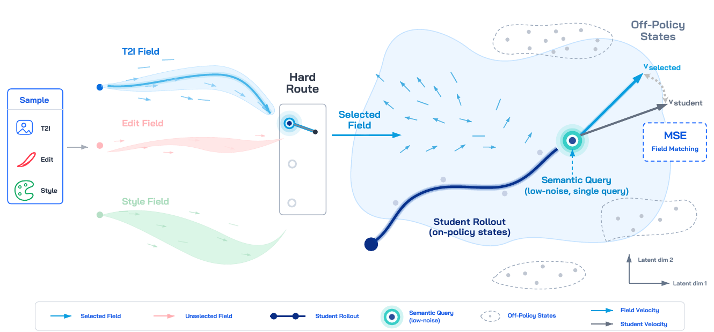
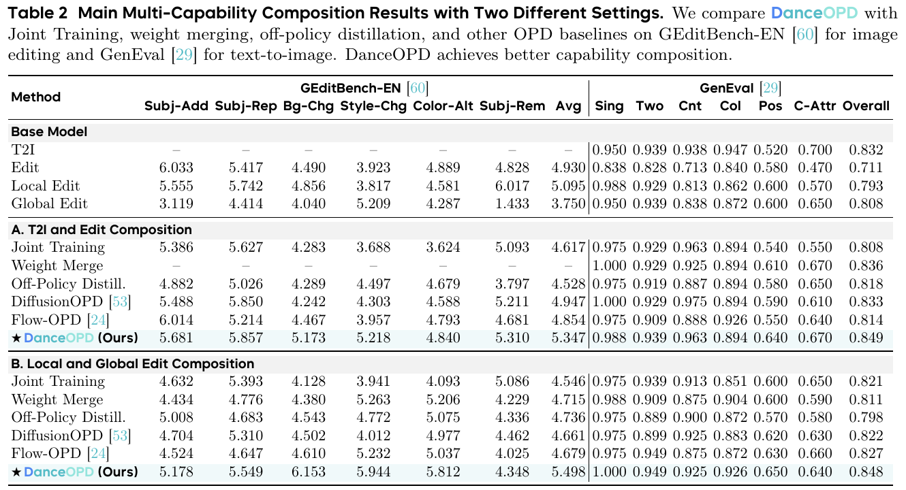
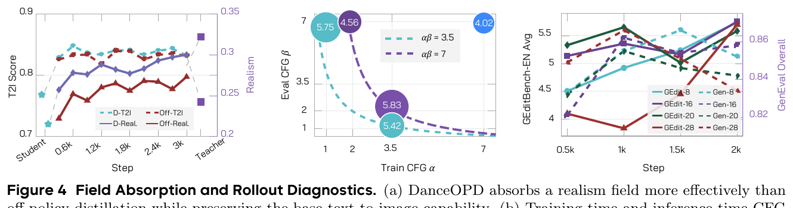
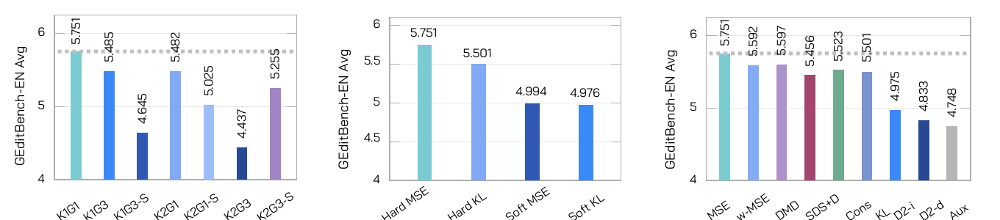
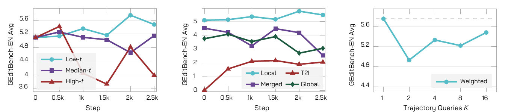
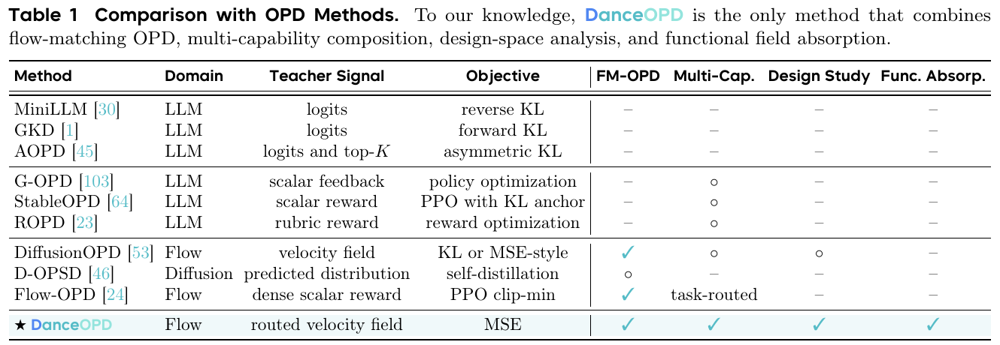

# DanceOPD: On-Policy Generative Field Distillation

> Wei Zhou¹²‡, Xiongwei Zhu¹, Zelin Xu¹, Bo Dong¹, Lixue Gong¹, Yongyuan Liang³, Meng Chu⁴, Leigang Qu², Lingdong Kong², Wei Liu¹†, Tat-Seng Chua²  
> ¹**ByteDance Seed** ²NUS ³UMD ⁴HKUST · ‡ 在 ByteDance Seed 实习期间完成 · † 通讯作者  
> [arXiv:2606.27377v3](https://arxiv.org/abs/2606.27377)（v3 戳记 2026-08-15，正文 Date 写的是 2026-06-26）  
> [project](https://danceopd.github.io/) · [code](https://github.com/worldbench/DanceOPD) · **无权重、无数据集链接**

---

## 1. 一句话定位

**把每个冻结的能力模型看成同一个 flow 状态空间上的一个速度场，然后让 student 在自己走过的状态上、逐样本硬路由地去匹配其中一个场。**

方法本身极其简单（Algorithm 1 只有 6 行）：

1. **路由**：按样本的任务身份，硬分配到**恰好一个**能力场（T2I / Edit / Local / Global / CFG），路由概率 `π` **均匀且不调**
2. **查询**：跑一条 16 步 student rollout，从中采**一个**低噪声状态，**stop-gradient**
3. **匹配**：在该状态上算 student 速度与被路由场速度的**朴素 MSE**

论文把能力组合重述成一个 **field-query 问题**，对应三个设计选择与三个失败模式：

| 设计选择 | 对应的失败模式 | DanceOPD 的答案 |
|---|---|---|
| 哪个场来监督这个样本？ | **target-field ambiguity** | 硬路由到单个场 |
| 在哪个状态查询？ | **state-distribution mismatch** | student 自己 rollout 的状态 |
| 从轨迹上取几个状态？ | **trajectory-query correlation** | **只取 1 个**（低噪声端） |

核心问句（论文居中独立排版）：

> *How should a model effectively compose multiple generative capabilities?*

📌 **一个顺带的好处**：CFG 也是一个（算子定义的）速度场 `v_α = v_∅ + α(v_cond − v_∅)`，所以可以用同一个 MSE 目标**吸收进 student**。

⚠️ **但这篇的定位有一处需要交叉核对的地方**——它把 [Flow-OPD](../flow_opd/analysis.md) 刻画成「dense scalar reward + PPO clip-min」，而 Flow-OPD 的 Eq.(7)+Eq.(15) **恰恰就是「路由选中的速度场 + 时间加权 MSE」**。我下载原文逐条核了，详见 §7.1。

---

## 2. 要解决的问题

论文列举的、一个部署模型被期望同时具备的能力：**T2I / 局部编辑 / 全局编辑 / 风格化生成 / 局部属性编辑**，外加两类可"吸收"的场：**写实度场**、**CFG 算子场**。

它们**天然不兼容**：

> *"T2I rewards open-ended visual quality and prompt following; local editing requires preserving the input while applying precise changes; and global editing intentionally changes broad appearance statistics such as style, color, or layout."*

对现有做法的批评（每条都有原句）：

| 做法 | 缺陷 |
|---|---|
| **数据混合 / 联合训练** | *"tends to **dilute** capability-specific supervision and can suffer from multi-task **gradient conflict**"* |
| **参数空间合并 / adapter 组合** | *"typically yield **compromise solutions**"* |
| **推理期 score 组合** | *"leaves the composition **external to the deployed student**"* |
| **soft multi-teacher 平均** | *"such an averaged target may **no longer correspond to any well-defined capability query**"* |

📌 **"generative field" 这个提法要看清**：它**在数学上就是 flow matching 的 velocity field，没有任何新东西**。区别纯粹在视角——把不同来源（预训练模型 / 微调模型 / 任务分支 / **算子**）都当成定义在**同一 shared state space** 上的速度场，从而把"能力组合"重述为"查哪个场、在哪查、查几次"。

⚠️ 论文自己也承认这个抽象的前提很强（§6）：*"the sources are built from the **same backbone family, latent representation, scheduler convention, and velocity parameterization**."*

---

## 3. 方法

> **Fig 3 逐区解读**：
>
> **最左 `Sample` 框**：三个图标 T2I（蓝）/ Edit（红笔刷）/ Style（绿调色板）。
>
> **中左三条"场带"**：**T2I Field**（蓝，带高亮主曲线）、**Edit Field**（粉，淡化）、**Style Field**（绿，淡化）——粉绿的淡化表示"未被选中"。
>
> **中部竖立的 `Hard Route`**：三个圆孔，**只有最上面一个被青色高亮**，下面两个是空心灰圈。
>
> **右侧大块浅蓝区域** = student 实际访问到的状态支撑集，内部密布**蓝色小箭头 = Field Velocity**；一条**深藏蓝 S 形粗曲线 = `Student Rollout (on-policy states)`**；曲线中段有一个**青色同心圆靶标 = `Semantic Query (low-noise, single query)`**。从靶标发出**粗青色 `v_selected`** 与**灰色 `v_student`** 两条箭头，右侧蓝虚线框 **`MSE / Field Matching`**。
>
> 📌 **四周三个灰色虚线椭圆 = `Off-Policy States`，被刻意画在浅蓝区域之外**——这是全图的论点：off-policy 查询落在 student 根本不会访问的地方。

### 3.1 硬路由（sample 级）

$$
m \sim \pi(m), \qquad (x, c) \sim \mathcal{D}_m, \qquad u_m(z,t,c) = v_m(z,t,c)
$$

📌 **粒度是 sample 级**（§3.2 标题就叫 "Hard-Routed **Sample-Wise** Field Matching"）——**不是 step 级、不是 timestep 级、不是 token 级**。

📌 **`π` 不调**：*"We do **not tune** π; unless otherwise stated, it is **uniform**"*。两桶 = 1:1，三桶 = 1:1:1。**没有可学习的 router、没有 gating 网络。**

📌 **能力组合是"跨更新统计地"实现的**：*"Capability composition is therefore achieved **statistically across routed updates**"*——不是在单个 step 内组合。

### 3.2 on-policy 查询 + stop-gradient

$$
z^\theta_{0:T} = \mathrm{Rollout}(v_\theta;\, z_T,\, c), \qquad z_T \sim p_T
$$

采一个语义坐标 `s`，取 `t = t(s)`，查询状态 `z̄_t = sg(z_t^θ)`。

⚠️ **`sg` 的含义要看清**：*"the update differentiates the **local velocity prediction, not the entire rollout solver**."* ——整条 16 步 rollout 不回传梯度，只有那一次局部速度预测带梯度。

### 3.3 语义端单次查询（K = 1）

$$
K = 1, \qquad s \sim q_{\mathrm{sem}}(s), \qquad t = t(s)
$$

**为什么只取一个**——这是本文相对 dense 监督最实质的论证：

> *"multiple states from one rollout are **correlated**: they share the same initial noise, prompt, conditioning, student dynamics, and path history. Thus, their gradients are **not independent**, and adding more states does not necessarily provide more independent supervision."*

附录给了形式化（Eq 45）：

$$
\mathrm{Var}\Big(\frac{1}{K}\sum_{i=1}^{K} b_i\Big) = \frac{\sigma_b^2}{K}\big(1 + (K-1)\rho\big)
$$

📌 **`ρ > 0` 时，增大 `K` 的方差收益被相关性吃掉。** 并给出可证伪的预言：如果 dense 退化真是相关性造成的，那么**用 SDE 注噪去相关应该能部分救回来**——Eq (47) 给了相关性的指数衰减界，§5.3 有对应实验。

**为什么取低噪声端**：

> *"High-noise states can contain coarse structure, but they are often dominated by **generic denoising** and have a lower density of capability-specific signal. Low-noise states are closer to the final image and concentrate **style, aesthetics, local attributes, and task-specific edit information**."*

实现上 `s ~ Beta(5, 2)`（均值 ≈ 0.714，偏向 clean 端）。

### 3.4 目标函数与 CFG 吸收

$$
\mathcal{L}_{\mathrm{DanceOPD}} = \mathbb{E}\Big[\big\lVert v_\theta(\bar z_t, t, c) - v_m(\bar z_t, t, c)\big\rVert_2^2\Big]
$$

附录 §7.1 给了 KL–MSE 等价：两个转移核共享同一各向同性协方差时，

$$
D_{\mathrm{KL}}(p_m \| p_\theta) = \frac{\Delta t^2}{2\sigma_t^2}\big\lVert v_\theta(z_t,t,c) - v_m(z_t,t,c)\big\rVert_2^2
$$

📌 **这个推导与 [Flow-OPD](../flow_opd/analysis.md) §4.4 的 KL 塌缩是同一件事**（共享协方差 → 迹项与行列式项消掉 → 只剩速度场差）。

⚠️ 论文自己对这条做了限定：*"This statement is limited to the **local velocity-matching subproblem** and should not be interpreted as an information-theoretic ceiling on downstream task metrics."*

**CFG 吸收**：

$$
v_\alpha(z_t,t,c) = v_\varnothing(z_t,t) + \alpha\big(v_{\mathrm{cond}}(z_t,t,c) - v_\varnothing(z_t,t)\big)
$$

把它当作又一个能力场用同样的 MSE 匹配即可。推理时 student 自身再用 `β` 做 CFG，**有效强度约为 `αβ`**（Eq 44）。

---

## 4. 配置

| 项 | 值 |
|---|---|
| **Backbone** | **Z-Image**（single-stream DiT）；realism 吸收用 **SD3.5-M** |
| **可训练模块** | **只有 DiT LoRA，rank 128**；backbone 与全部 teacher 冻结 |
| **student 初始化** | **attribute-edit SFT LoRA**（= Local Edit）← 📌 这一条在 §7.2 很关键 |
| rollout | **16 步 Euler ODE** |
| `K` / `G` | **1 / 1** |
| timestep 采样 | **Beta(5, 2)** 偏低噪声 |
| Optimizer / lr | AdamW / **2e-4** |
| grad accumulation | 4 |
| 评测 | GEditBench-EN **28 步 CFG 7.0**；GenEval **28 步 CFG 3.5** |

**teacher 来源**：T2I = Z-Image 原模型；Edit / Local / Global = Z-Image Edit 在 OmniEdit **全量 / attribute 子集 / style 子集**上各训 **1 epoch**；realism teacher = SD3.5-M 全参训 **100k steps, lr 1e-5, batch 16**；CFG = 算子构造。

⚠️ **大量关键项没给**：**GPU 型号 / 卡数 / 训练总时长 / 训练数据量 / 训练分辨率 / 主表用的 checkpoint 步数 / batch size / warmup / weight decay / LoRA alpha** —— 全部缺失。另有两个被 disable 的机制 **"extrapolation scale" 和 "delta clipping" 全文无定义**。

---

## 5. 实验

### 5.1 主结果

> **Table 2 读法**：**全表无 bold、无 underline、无最优标记**，DanceOPD 行只有浅青底纹 + ★。

**A. T2I + Edit 组合**（GEdit Avg ↑ / GenEval Overall ↑）：

| Method | GEdit Avg | GenEval Overall |
|---|---|---|
| *Edit teacher* | *4.930* | *0.711* |
| *T2I teacher* | *–* | *0.832* |
| Joint Training | 4.617 | 0.808 |
| **Weight Merge** | **–** | 0.836 |
| Off-Policy Distill. | 4.528 | 0.818 |
| DiffusionOPD | 4.947 | 0.833 |
| Flow-OPD | 4.854 | 0.814 |
| **★ DanceOPD** | **5.347** | **0.849** |

**B. Local + Global Edit 组合**：

| Method | GEdit Avg | GenEval Overall |
|---|---|---|
| *Local Edit teacher* | *5.095* | *0.793* |
| *Global Edit teacher* | *3.750* | *0.808* |
| Joint Training | 4.546 | 0.821 |
| Weight Merge | 4.715 | 0.811 |
| Off-Policy Distill. | 4.736 | 0.798 |
| DiffusionOPD | 4.661 | 0.822 |
| Flow-OPD | 4.679 | 0.827 |
| **★ DanceOPD** | **5.498** | **0.848** |

**论文宣称的百分比我逐条复核，全部与表一致**：A 块 +8.1%（vs DiffusionOPD）、+8.5%（vs Edit source）、+2.0%（vs T2I source）；B 块 +16.1%（vs Off-Policy）、+7.9%（vs Local source）。

⚠️ **但逐类看，DanceOPD 在 5 个子类上低于自己的 teacher**：

| | DanceOPD | teacher | 差 |
|---|---|---|---|
| A: Subj-Add | 5.681 | Edit **6.033** | −5.8% |
| A: Color-Alt | 4.840 | Edit **4.889** | −1.0% |
| B: Subj-Add | 5.178 | Local **5.555** | −6.8% |
| B: Subj-Rep | 5.549 | Local **5.742** | −3.4% |
| **B: Subj-Rem** | **4.348** | **Local 6.017** | **−27.7%** |

📌 **所以 §2.1 那句 *"even achieving performance beyond individual teachers"* 只在 Avg / Overall 两个聚合指标上成立**。B 块的 Subj-Rem 不但比 teacher 低 27.7%，在该块 6 个方法里**只排第 3**（Joint Training 5.086、DiffusionOPD 4.462 都更高）。论文正文只字未提。

⚠️ **另一处**：A 块 Weight Merge 的 GEdit **整行是 "–"**（完全不产生可评测的编辑结果），却被当作 GenEval 侧"最强 composition baseline"来算那个 +1.6%。这个对比基本没有信息量。

### 5.2 CFG 与写实度吸收

> **Fig 4 逐面板解读**：
>
> **(a) 写实度吸收**——双 y 轴：左 `T2I Score` 0.7–0.9，右 `Realism`（紫）0.2–0.35；x 轴 `Student, 0.6k, …, 3k, Teacher`。四条线：`D-T2I`（青虚）/ `Off-T2I`（暗红虚）/ `D-Real.`（紫实）/ `Off-Real.`（暗红实）。两条 Realism 实线**全程分离**（紫高约 0.025–0.03）；两条 T2I 虚线在 0.6k 后重合。
>
> ⚠️ **一个反常**：Teacher 的 T2I ≈ **0.754**，**低于** Student anchor 的 ≈0.765。而论文说向这个 teacher 蒸馏后 student 的 T2I **提升 7.6%**。纯 velocity-MSE 回归到一个 T2I 更差的 teacher 却让 T2I 涨，论文没有给任何解释。
>
> **(b) CFG 组合**——x = `Train CFG α`，y = `Eval CFG β`，气泡大小/数字 = GEdit Avg。5 个气泡：(1,7)=5.75、(2,7)=4.56、(7,7)=4.02、**(3.5,2)=5.83（最大）**、(3.5,1)=5.42。两条虚线是 `αβ=3.5` 与 `αβ=7` 的等值双曲线。
>
> ⚠️ **气泡配色不符合自己的图例**：图例定义青=αβ3.5、紫=αβ7，但 (1,7) 的 αβ=**7** 画成青色、(2,7) 的 αβ=**14** 画成紫色、(7,7) 的 αβ=**49** 用了图例里根本没有的第三种蓝色。**5 个气泡里 3 个配色与图例语义不符。**
>
> **(c) rollout 步数**——GEdit-28 在 1k 触底 3.838 后陡升至 2k 的 5.697；GEdit-20 在 1k 达峰 5.650 后跌落；GEdit-16 全程最稳、2k 收于 5.751。

**CFG 吸收的结论**（Table 6）：适度组合最好——`α=3.5, β=2`（有效 αβ=7）得 **5.833**，比纯训练期吸收（α=3.5,β=1）的 5.422 高 **+7.6%**，比纯推理期 CFG（α=1,β=7）的 5.751 高 +1.4%；而过度叠加（α=7,β=7，αβ=49）掉到 **4.015（−31.2%）**。

⚠️ **CFG 吸收理论上能把 2 次前向降到 1 次，但论文没有测量任何加速比**——全文无 latency / FLOPs / 显存数字。

### 5.3 消融

> **Fig 8 逐面板解读**（y 轴均为 `GEditBench-EN Avg`）：
>
> **(a) 密集查询与同步累积**：7 根柱，灰色点虚参考线 ≈5.75。**K1G1 = 5.751（唯一触线）**；K1G3 = 5.485；**K1G3-S = 4.645**；K2G1 = 5.482；K2G1-S = 5.025；**K2G3 = 4.437（全图最矮）**；K2G3-S = 5.255。（`-S` = SDE）
>
> **(b) 路由 × 目标函数 2×2**：**Hard MSE = 5.751**、Hard KL = 5.501、**Soft MSE = 4.994**、Soft KL = 4.976。硬/软的落差在视觉上非常明显。
>
> **(c) 九种目标函数**：MSE **5.751** / w-MSE 5.592 / DMD 5.597 / SDS+D 5.456 / Cons 5.523 / KL 5.501 / D2-i 4.975 / D2-d 4.833 / **Aux 4.748**。
>
> ⚠️ **注意 (c) 的前 6 根柱高度肉眼几乎无差**（5.456–5.751，跨度 5.4%），而论文据此下"plain MSE 最稳最好"的结论——**全文无方差、无多 seed、无 error bar**，这个量级完全可能是噪声。

> **Fig 9 逐面板解读**：
>
> **(a) timestep 查询位置**——x 到 **2.5k**，三条线 Low-t（青圆）/ Median-t（紫方）/ High-t（暗红三角）。
> - ⚠️ **关键：0.5k 处 High-t（≈5.42）反而最高，Low-t（≈5.14）最低**；
> - 1k–1.5k High-t 崩到 4.04 / 3.72；
> - **2k 处 Low-t 冲到峰值 5.751，而 Median-t 恰好触底 4.649**——论文的 "+23.7%" 正是从这一个点取的；
> - 2.5k 三条全部回落。
>
> **(b) 初始化**——Local（青）/ T2I（暗红）/ Merged（紫）/ Global（深绿）。**T2I 曲线在 step 0 从 0.00 起步**（该模型根本不会编辑），全程 < 2.2。@2k：Local **5.751** / Merged **4.193** / Global 2.702 / T2I 1.889。
>
> **(c) 轨迹查询数 K**——单条青线 + 灰虚参考线 ≈5.72。K=1 在参考线上，K=2 骤降到 ≈4.93，K=4 ≈5.34，K=8 ≈5.19，**K=16 又升到 ≈5.44**。
>
> ⚠️ **这一格与 Table 7 直接矛盾**：表里 K=16 weighted = **5.127**，**低于** K=4（5.330）和 K=8（5.218）；而图上 K=16 **高于**两者。正文的 "+12.2%" 与**表**一致（5.751/5.127），与**图**不一致（5.751/5.44 只有 +5.7%）。其余 4 个点（K=1/2/4/8）图表都吻合，**唯独 K=16 对不上**。

**逐条消融结论（数字都复核过）**：

| 轴 | 结论 | 数字 |
|---|---|---|
| **硬路由 vs 软混合** | 硬路由更好 | MSE：5.751 / 4.994 = **+15.2%**；KL：5.501 / 4.976 = +10.6% |
| **timestep 位置** | low-t 最好 | @2k vs Median **+23.7%**、vs High **+19.5%** |
| **同 step 多 teacher 累积** | 变差 | K1G3 −4.6%；K2G3 **−22.8%** |
| **SDE 去相关（诊断）** | **部分救回 dense 压力场景，印证了相关性假说** | K2G3+SDE 5.255 vs 4.437 = **+18.4%**（Subj-Rem +62.0%）；但仍低于单查询默认 8.6% |
| **查询数 K** | K=1 最好 | vs K=2 +16.6%、K=4 +7.9%、K=8 +10.2%、K=16 +12.2% |
| **目标函数** | plain MSE 最好 | vs 次优仅 **+2.8%**；vs AuxFeat +21.1% |
| **初始化** | 用目标能力最强的 ckpt | @2k vs Merged **+37.2%**、vs Global +112.8%、vs T2I +204.4% |
| **rollout 步数 N** | 16 步够用 | @2k vs N=8 仅 +0.2%、N=20 +3.0%、N=28 +0.9% |

📌 **SDE 那条值得单独记**：它是论文自己提出的**可证伪预言**——"如果 dense 退化源于轨迹相关性，那么注噪去相关应该能部分修复"。结果 K2G3 从 4.437 回到 5.255（+18.4%），**预言被验证了**。这是全文方法论上最扎实的一处。

---

## 6. 与 Flow-OPD 的关系（我做的交叉核对）

**这是本篇最需要单独拿出来说的部分。**

> **Table 1 读法**：10 行方法 × 8 列。⚠️ **三档符号 ✓ / ◦ / – 全文没有定义**，且 Flow-OPD 的 Multi-Cap. 格子填的是文字 `task-routed` 而非符号，**同一列混用两种编码**。

论文据此宣称：

> *"To our knowledge, DanceOPD is the **only** method that combines flow-matching OPD, multi-capability composition, design-space analysis, and functional field absorption."*

其中对 [Flow-OPD](../flow_opd/analysis.md) 那一行的刻画是：

| Method | Teacher Signal | Objective | Multi-Cap. |
|---|---|---|---|
| Flow-OPD [24] | **dense scalar reward** | **PPO clip-min** | **task-routed** |
| ★ DanceOPD | **routed velocity field** | **MSE** | ✓ |

### 6.1 我把 Flow-OPD 原文（arXiv:2605.08063）重新核了一遍

**Flow-OPD 的 Eq.(7)**：

$$
v_{\mathrm{target}}(x_t,t,c) = v_{\phi_k}(x_t,t,c), \qquad k = R(c)
$$

即**由确定性任务路由函数 `R(c)` 选中的 teacher 速度场**。

**Flow-OPD 的 Eq.(15)**：

$$
\nabla_\theta \mathcal{L}_{\mathrm{Flow\text{-}OPD}} = \nabla_\theta \mathbb{E}_{x_t \sim \mathrm{SDE}_\theta}\Big[w(t)\big\lVert v_\theta(x_t,t,c) - \mathrm{SG}\big(v_{\mathrm{target}}(x_t,t,c)\big)\big\rVert^2\Big]
$$

即**带 stop-gradient 的时间加权 MSE**。而 Flow-OPD 原文明写：

> *"we can **entirely bypass** the high-variance PG estimator, the log πθ computations, and **PPO surrogate bounds**. Fundamentally, directly minimizing this exact MSE loss in flow models is mathematically strictly equivalent to executing the Policy Gradient OPD in LLMs, but effectively **reduces the gradient variance to zero**."*

📌 **也就是说：DanceOPD 在 Table 1 里声称自己独有的「routed velocity field + MSE」，逐字就是 Flow-OPD 的 Eq.(7) + Eq.(15)。**

### 6.2 公平地说，这个刻画有其依据

**Flow-OPD 的推导框架确实是 RL 式的**（§5.1.1 原话）：

> *"instead of directly minimizing the distance between vector fields via supervised regression, we **derive the exact continuous-time KL divergence and utilize it as a dense reward signal to guide policy exploration via PG**."*

而且它的最终损失被写成 *"the negative of the **surrogate objective** −J(θ)"*，Flow-OPD 也**确实使用 group 采样**（实现细节里 group size **G = 24**）。

📌 **所以准确的表述是**：DanceOPD 的 Table 1 描述的是 Flow-OPD 的**中间推导框架**，而不是它的**最终形式**——而 Flow-OPD 的头号卖点恰恰就是"最终塌缩成 MSE、把 PPO 那一套删掉"。

### 6.3 更值得注意的是正文与表格的不一致

📌 **Table 1 里 Flow-OPD 的 Multi-Cap. 明确写着 `task-routed`**——**论文在表格里承认了"Flow-OPD 也做任务路由"**，没有隐瞒。

⚠️ **但 §2.2 的散文只有一句** *"Flow-OPD uses dense reward optimization with PPO-style clipping"*，**完全没有讨论"多 teacher + 硬路由"这一层的重叠**。

> **表格里承认了重叠，叙述里回避了重叠。**

### 6.4 那么真正的差异化在哪

剥掉表述问题后，DanceOPD 相对 Flow-OPD **确实有三处实质增量**：

| | Flow-OPD | DanceOPD |
|---|---|---|
| **轨迹监督密度** | **dense，K = N**（全轨迹逐步） | **K = 1**（单次低噪声查询） |
| **组合对象** | reward 领域专家（文字 / 空间 / 美学） | **能力场**（T2I / 编辑 / 写实 / **CFG 算子**） |
| **设计空间研究** | 无 | 路由 × 目标 × 查询位置 × K 的系统扫描 |

📌 **`K=1` vs `K=N` 是最实在的一条**，而且论证有意思（同一 rollout 的多状态共享初始噪声/prompt/路径历史 → 梯度不独立 → 加状态 ≠ 加监督），还配了可证伪的 SDE 去相关验证。

**所以本文的 novelty 落点应当是"把路由对象从 reward 换成速度场、把 dense 换成单查询、外加设计空间研究与算子场吸收"，而不是"首次提出硬路由 OPD"。**

### 6.5 这个刻画还传导到了成本比较

附录 §8.1 对 Fig 1 的计时做了分解，给 Flow-OPD 记了两笔额外开销：

1. **FlowGRPO group 因子 `γ_flow = ⌈16/8⌉ = 2`**，*"This approximately **doubles** the wall-clock cost"*
2. *"additional smaller overhead from SDE sampling, **cached log-probabilities, and PPO clipping**"*

⚠️ 第 1 条站得住（Flow-OPD 确实用 group，实际 G=24 比这里假设的 16 还大）；**第 2 条则是把开销记给了一个明确声明删掉了 logprob 与 PPO 的方法**。而 Fig 1 右图的气泡大小就是 per-step wall-clock——**Flow-OPD 被画成全图最大的圆**。

---

## 7. 争议与权衡

### 7.1 初始化不一致，而论文自己的消融证明它的影响远大于方法差异

**这是全文最严重的问题。**

- **DanceOPD**：*"The student is initialized from the **attribute-edit SFT LoRA**"*（§8.5）= **Local Edit 初始化**
- **Flow-OPD 复现**：*"uses two active capability buckets and **merge initialization** for both composition blocks"*（§8.3）= **merged 初始化**

而**论文自己的 Table 8** 测出：@2k 步，**Local Edit 初始化 = 5.751，Merged 初始化 = 4.193，差 +37.2%**。

⚠️ **而 DanceOPD 对 Flow-OPD 宣称的优势只有 +10.2%（A 块）和 +17.5%（B 块）——完全被初始化带来的 37.2% 覆盖。** 在当前配置下，这组对比不具解释力。

📌 其余四个 baseline（DiffusionOPD / Joint Training / Weight Merge / Off-Policy）的**初始化方式论文根本没说**。

### 7.2 两个 OPD baseline 都是作者自己实现或改造的

- **DiffusionOPD**：*"the code **was not open-sourced** at the time of our experiments, we implemented a paper-faithful reproduction"*
- **Flow-OPD**：*"We **adapt** the official Flow-OPD code and recipe to our Z-Image setting"*，且**关掉了 MAR（β=0）**，理由是 *"We do not have a compatible Z-Image MAR teacher"*

⚠️ **即跑的不是完整的 Flow-OPD**——而 MAR 正是 Flow-OPD 用来防止硬路由导致美学退化的那个全数据锚。

### 7.3 DiffusionOPD 的复现配置恰好踩中本文消融里最差的两个设定

复现用 **K=16（dense 全轨迹）+ `Δt²/2` 时间步加权**。而本文消融显示：**dense K=16 weighted = 5.127（−12.2%）**、**timestep-weighted = 5.592（−2.8%）**。

⚠️ **所以 Table 2 里 "DanceOPD vs DiffusionOPD" 的差距，相当一部分其实是 "K=1 vs K=16" 的差距。**

### 7.4 SDE 对这个 setup 有系统性伤害，而 Flow-OPD 依设计必须用 SDE

Table 7 显示 SDE rollout 在两个 control 设定上分别 **−15.3%** 和 **−8.3%**。而 Flow-OPD 的 KL 推导建立在 SDE 转移核上，**结构性地必须用 SDE**（复现里 η=0.7）。

📌 **三条加起来（初始化劣势 + MAR 被关 + 被迫用 SDE），Flow-OPD 在这套实验环境里是三重不利的。**

### 7.5 消融的 "best" 全部取在 2k 这一个 checkpoint

Fig 9(a) 画得很清楚：

- **0.5k 处 Low-t（5.136）是三者中最差的，High-t（5.420）最好**
- 1.5k 处 Low-t 只比 Median-t 高 2.6%
- **唯独 2k 处 Low-t 冲到峰值 5.751 而 Median-t 恰好触底 4.649** → 造出 +23.7%

同样地，Table 9 里 N=8 在 1k/1.5k 的 GenEval（0.866）**高于任何 16 步结果**，N=20 在 1k 的 GEdit（5.650）**高于 16 步在 1k 的 5.357**——论文只比 2k。

⚠️ **这是系统性的 checkpoint 选点**，而曲线本身强烈非单调。

### 7.6 绝大多数消融不报 anchor 指标

论文的核心主张是 *"strengthening target capabilities **while preserving anchor generation quality**"*。

⚠️ **但 Table 7（25 行）和 Table 8（26 行）只报 GEditBench-EN，完全不报 GenEval。** 只有 Table 9 同时报了两者。**也就是说，绝大多数设计选择根本没有测过它们对 anchor 的影响。**

### 7.7 写实度那一节是全文最弱的

- **所有数字（+9.9%、85.3% gap closure、+7.6%、within 0.1%）没有任何表格**，只能从 Fig 4(a) 读图
- 按像素读图：Student ≈0.213、Teacher ≈0.322、DanceOPD@3k ≈0.297 → gap closure ≈ **76%**，**与正文的 85.3% 对不上**（读图误差 ±0.005 仍够不到）
- **"T2I Score" 这个指标全文从未定义**（§8.6 只定义了 GenEval 和 GEditBench-EN）
- reward model 是**自家专有的**，*"Our reward model is proprietary… and we only use it for evaluation"* —— ⚠️ **但这句只覆盖 DanceOPD 阶段，不覆盖 realism teacher 是怎么训出来的**。如果该 teacher 的训练数据是用同一个 reward model 筛的，指标与训练信号就是间接同源。**论文没说 teacher 的训练数据与目标函数。**
- **外部不可复现、不可验证**

### 7.8 其它内部矛盾

**① Fig 9(c) 与 Table 7 的 K=16 对不上**（图 ≈5.44 vs 表 5.127，且排序相反）。见 §5.3。

**② Fig 4(b) 的气泡配色不符合自己的图例**（5 个里 3 个不符）。见 §5.2。

**③ Fig 9(a)(b) 画到 2.5k 并含 step 0 的点，但 Table 8 只报 500–2000**，§8.5 也说 *"we report checkpoints from 500 to 2000 steps"`。**2.5k 的数据点没有任何表格支撑。** Fig 10 更画到 4000 步。

**④ Fig 11 caption 说 *"the competing methods all fail"*，但按图核对不成立**：(d) 那一行 **Off-Policy 给出了一个看起来完全可用的 2×3 六连衣裙网格**；(a) 行 DiffusionOPD 也产出了较完整的平铺（只缺上衣）。

**⑤ 同一组数在 4 张表里出现 5 次**（Table 7 首行 = Table 6 第 2 行 = Table 8 的 Low-t@2k = Table 8 的 Local-Edit@2k = Table 9 的 N=16@2k，都是 Avg 5.751）。论文 §10 做了免责说明，但读者容易误当成多次独立验证。

**⑥ Eq (7) 与 Eq (42) 是同一条 CFG 公式编了两个号。**

**⑦ 正文 Date（2026-06-26）与 arXiv v3 戳记（2026-08-15）不一致。**

### 7.9 其它

- ⚠️ **无任何方差 / 多 seed / error bar。** 而 Fig 8(c) 里前 6 种目标函数的跨度只有 5.4%，据此下"MSE 最稳最好"的结论证据偏薄。
- ⚠️ **GEditBench-EN 是 VLM 判分 benchmark，但 judge 模型与 prompt 数全文未披露。** 不同 judge 会系统性改变分数。
- ⚠️ **没有任何外部已发布的多能力统一模型作对照**（Qwen-Image-Edit / FLUX.1 Kontext / Step1x-Edit / Seedream 全无），所有对照都是作者在同一 Z-Image 上自造的。
- ⚠️ **Self-OPD、DiffusionNFT、DanceGRPO 全部未引用**。特别是本文叫 "Dance**OPD**"、同为字节系，却完全没提 DanceGRPO。
- ⚠️ **引用可疑**：用 *"AI for Auto-Research: Roadmap & User Guide"*（arXiv:2605.18661）来支撑 "rollout position affects OPD stability and efficiency" 这个具体技术论断，**而该文第一作者 Lingdong Kong 正是本文作者之一**。

### 7.10 正面

**① teacher 的能力上限被完整报告。** Table 2 顶部 "Base Model" 块给了四个 teacher 的全部 14 列数值，Fig 4(a) 也画了 realism teacher 的端点。**这让"是否真的超越 teacher"可以被读者自己核算**——这一点做得比多数论文规范（虽然核算结果对论文不完全有利，见 §5.1）。

**② on-policy vs off-policy 是干净的单变量对照。** §8.4 明确说 Off-Policy baseline 与 DanceOPD **只差查询状态分布**（route set、route 概率、MSE、K=1、Beta 采样全部相同）。A 块 +18.1%、B 块 +16.1% 因此是可信的。

**③ SDE 去相关是一个被验证的可证伪预言。** 先从 Eq (45) 推出"相关性会吃掉 K 的方差收益"，再预言"注噪去相关应能部分修复 dense 退化"，然后实测 K2G3 从 4.437 回到 5.255（+18.4%）。**这种"先预言后验证"的结构在应用论文里不常见。**

**④ 实现审计诚实。** §7.6 主动说明 DMD-EMA 变体用的是 *"a **passive** EMA reference rather than a separately trained fake-distribution critic"*、consistency 变体是 *"a simplified diagnostic"*，并明确说 *"These audits are the reason we present the non-MSE objectives as **ablations rather than as replacements**"*。**主动交代自己的对照组是弱化版，值得肯定。**

**⑤ 用的是第三方 benchmark**（GEditBench-EN / GenEval），不是自家 benchmark（realism 那节除外）。

**⑥ 自我限定写得克制**：*"does **not claim global Pareto optimality**"*、*"should **not** be interpreted as an information-theoretic ceiling"*。

---

## 8. 一句话总结

DanceOPD 把多能力组合重述成一个 **field-query 问题**（查哪个场、在哪查、查几次），给出三个对应的答案——**逐样本硬路由到单个冻结能力场**、**在 student 自己 rollout 的状态上 stop-gradient 查询**、**只取一个低噪声语义端状态**——再用**朴素 velocity MSE** 匹配，顺带把 CFG 这类算子场也用同一目标吸收进 student；Z-Image + rank-128 LoRA 上，GEdit Avg 5.347/5.498、GenEval 0.849/0.848 双双超过各自的 teacher（聚合层面），且论文自己提出并验证了一个可证伪预言（dense 退化源于轨迹相关性 → SDE 去相关能部分修复，实测 +18.4%）；⚠️ **但它在 Table 1 里把 Flow-OPD 刻画成「dense scalar reward + PPO clip-min」，而 Flow-OPD 的 Eq.(7)+Eq.(15) 逐字就是「路由速度场 + 时间加权 MSE」且明确声明弃用了 PPO——表格里承认了 `task-routed` 的重叠、叙述里却回避了；更实质的是 Flow-OPD 复现用 merged 初始化而 DanceOPD 用 local-edit 初始化，论文自己的 Table 8 测出这一项差 37.2%，完全覆盖了它宣称的 10–17% 方法优势，再加上 MAR 被关、SDE 在本 setup 有 8–15% 的系统性劣势；此外逐类看有 5 个子能力低于 teacher（B 块 Subj-Rem 低 27.7%）、消融的 best 全取在曲线非单调的 2k 单点、绝大多数消融不报 anchor 指标、写实度一节的数字只在图里且 gap closure 读图只有 ≈76% 而非 85.3%。**

---

## Q&A

**Q: 它和 Flow-OPD 到底谁先谁后、差在哪？**

A: **Flow-OPD 在前（2605，2026-05），DanceOPD 在后（2606 首版 / 2608 v3）。真正的差异是"监督密度"和"组合对象"，不是"硬路由"。**

| | [Flow-OPD](../flow_opd/analysis.md) | DanceOPD |
|---|---|---|
| 路由 | **prompt/任务硬路由**（`k = R(c)`） | **sample 级硬路由**（`m ~ π`） |
| teacher 信号 | **路由选中的速度场** | **路由选中的速度场** |
| 最终损失 | **时间加权 MSE**（KL 塌缩而来） | **朴素 MSE**（KL 塌缩而来） |
| **轨迹监督密度** | **dense，K = N** | **K = 1（低噪声端）** |
| 采样 | **SDE**（KL 推导需要） | **ODE** |
| 组合对象 | reward 领域专家（文字/空间/美学） | **能力场**（T2I/编辑/写实/**CFG 算子**） |
| 防退化机制 | **MAR**（全数据美学锚） | 无（靠 anchor capability 的数据本身） |
| 设计空间研究 | 无 | **有**（路由×目标×位置×K） |

📌 **两者的 KL→MSE 推导是同一个**：共享各向同性协方差 → 高斯 KL 塌缩成速度场加权 L2。DanceOPD 的附录 §7.1 与 Flow-OPD 的 §4.4 讲的是一回事。

📌 **所以"谁更新"的正确表述是**：Flow-OPD 先把"多 teacher 硬路由 + 速度场 MSE"这套建立起来；DanceOPD 的增量是**把 dense 换成单次低噪声查询**（并给出相关性论证与 SDE 验证）、**把组合对象从 reward 专家换成能力场/算子场**、**外加设计空间的系统扫描**。

⚠️ **但 §7.1 那个初始化问题意味着**：Table 2 里 DanceOPD vs Flow-OPD 的具体数字**目前没法用来判断这些增量值多少**。要判断，需要的是**同初始化、同 MAR 设置下的 K=1 vs K=N 对照**——论文有 K 的消融（5.751 vs 5.127），但那是在 DanceOPD 自己的配置里做的，不是在 Flow-OPD 的完整配置里。

---

**Q: "只查一个低噪声状态" 这个设计，证据有多强？**

A: **论证链条完整，而且有一个被验证的可证伪预言——这是全文最扎实的部分。**

**三步**：

1. **理论**（Eq 45）：`Var(1/K · Σbᵢ) = σ²/K · (1 + (K−1)ρ)` —— `ρ > 0` 时增大 K 的方差收益被相关性吃掉。相关性的来源写得很具体：*"they share the same initial noise, prompt, conditioning, student dynamics, and path history."*

2. **实测**：K=1 的 5.751 优于 K=2（4.931）、K=4（5.330）、K=8（5.218）、K=16（5.127）。⚠️ **但注意 K 并非单调**——K=2 反而是最差的，这个非单调性论文没有解释。⚠️ **而且 Fig 9(c) 的 K=16 点与表格矛盾**（见 §5.3）。

3. **可证伪预言 + 验证**：*"If dense-query degradation is partly caused by trajectory correlation, then **decorrelating the rollout should partially mitigate** this failure in dense-query stress cases."* → 实测 K2G3 加 SDE 噪声后从 **4.437 → 5.255（+18.4%）**，Subj-Rem 更是 +62.0%。**预言成立。**

📌 **第 3 步是关键**——它把"K=1 更好"从一个经验观察升级成了一个有机制解释且机制被独立验证的结论。

**至于"为什么是低噪声端"**，论证偏描述性（*"Low-noise states … concentrate style, aesthetics, local attributes, and task-specific edit information"*），证据是 Table 8 的三档 Beta 对比。⚠️ **而这个对比恰恰是 §7.5 说的 checkpoint 选点问题最严重的地方**——0.5k 时 High-t 反而最好。

---

**Q: 它在仓库的 OPD 簇里处在什么位置？**

A: **它是这一簇里"组合对象"最特别的一篇——别人组合的是 reward 或 teacher，它组合的是"能力"，而且把算子也算成一种能力。**

| | 组合什么 | 怎么给监督 | 取几个状态 |
|---|---|---|---|
| **DanceOPD** | **能力场**（T2I/编辑/写实/**CFG 算子**） | 路由速度场 MSE | **1（低噪声）** |
| [Flow-OPD](../flow_opd/analysis.md) | reward 领域专家 | 路由速度场 MSE | **N（全轨迹）** |
| [Self-OPD](../self_opd/analysis.md) | **不路由**——多 reward 融合成单标量只用于给分支排序 | 自参考分支的拉/推 | 局部 SDE 分叉 |
| [DiffusionOPSD](../diffusion_opsd/analysis.md) | 三个单奖励 LoRA teacher | 沿奖励梯度构造有界 y⁺/y⁻ 后 detach | 中间状态 `z_q` |
| [D-OPSD](../d_opsd/analysis.md) | 同模型双角色（text-only / multimodal） | velocity MSE | — |
| [DiffusionNFT](../diffusion_nft/analysis.md) | **不用 teacher** | reward 切正负两集导出改进方向 Δ | 前向加噪单点 |
| [OPSD-V](../../video_generation/opsd_v/analysis.md) | **teacher 的上下文**（真实视频 cache） | velocity MSE | — |

📌 **一条贯穿的共识**：**这一簇最终都落到"velocity MSE + stop-gradient"**。Flow-OPD 和 DanceOPD 都从 KL 塌缩推到 MSE，DiffusionOPSD 和 OPSD-V 直接就用 MSE，DiffusionNFT 的两支也是速度平方误差。**差别全在"目标速度怎么构造"和"在哪个状态上算"。**

⚠️ **而 [OPSA](../../llm/opsa/analysis.md)（LLM 域）对整条线提出了一个还没人回答的质疑**：它证明在 LLM 的 OPD 里，teacher 的具体监督内容可以被"对低概率 token 施加负信号"完全复现。**搬到这里对应的问题是：如果把 DanceOPD 的 teacher 速度场换成某个固定方向的信号，性能会掉多少？** 本文有 9 种目标函数的消融，但**没有一种是"去掉 teacher 的具体取值、只保留方向"**。

📌 **另一个跨篇观察**：DanceOPD **没有引用 Self-OPD、DiffusionNFT、DanceGRPO**。而 Self-OPD 的核心攻击点恰恰是"硬路由会导致只满足被路由那个目标"——这正是 DanceOPD 在 §5.1 逐类结果里暴露出来的（B 块 Subj-Rem 比 teacher 低 27.7%）。**两篇本该对话。**

---

**Q: 想用，有什么可以直接拿走的？**

A: **三个设计判断可以直接抄，两件事要自己补。**

**可以拿走的**：

1. **硬路由 > 软加权**，而且原因清楚：Eq (40) 证明 soft-teacher MSE 在梯度上**等价于回归到混合速度 `v̄`**，而 `v̄` 可能不对应任何良定义的能力查询。实测差 **+15.2%（MSE）/ +10.6%（KL）**。
2. **单次低噪声查询 > 全轨迹密集监督**，而且便宜得多（每步梯度评估从 K=N 降到 K=1）。论证与 SDE 验证都在（见上一问）。
3. **初始化从"目标能力最强的 checkpoint"出发，不要用 merged。** @2k 差 **37.2%**。📌 **这条讽刺的是它同时也是本文最大的公平性问题**（§7.1）——但作为工程建议本身是有效的。

**顺带一个便宜的技巧**：**CFG 可以当作一个能力场被吸收**（`v_α = v_∅ + α(v_cond − v_∅)`），且最优是**训练期与推理期适度分摊**（`α=3.5, β=2`，有效 αβ=7）而非单边极端。⚠️ 但论文**没有测过吸收后的实际加速比**。

**要自己补的**：

- ⚠️ **训练成本完全没给**（GPU 型号/卡数/时长/数据量/分辨率/checkpoint 步数全缺），**无法估算复现代价**。
- ⚠️ **"extrapolation scale" 和 "delta clipping" 两个被 disable 的机制全文无定义**，照着配置文件走会卡住。
- ⚠️ **只在 Z-Image 上做过能力组合**（SD3.5-M 只用于 realism 吸收且不做组合），**backbone 泛化性未验证**。而方法的前提是所有源"同 backbone 家族、同 latent、同 scheduler、同速度参数化"——这个前提本身就限制了适用面。
