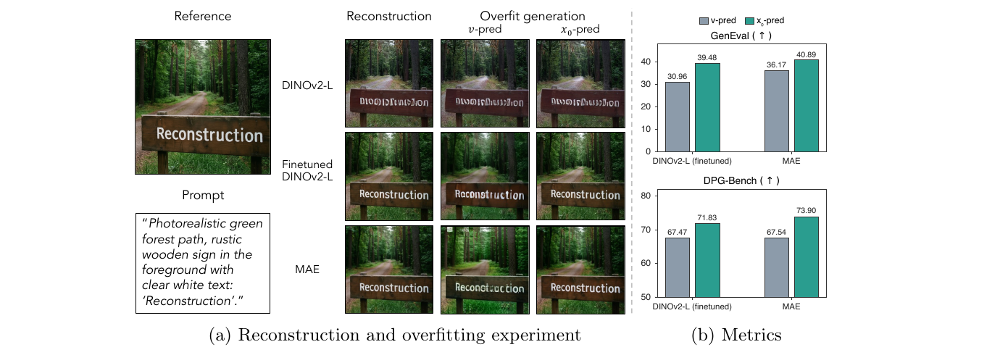
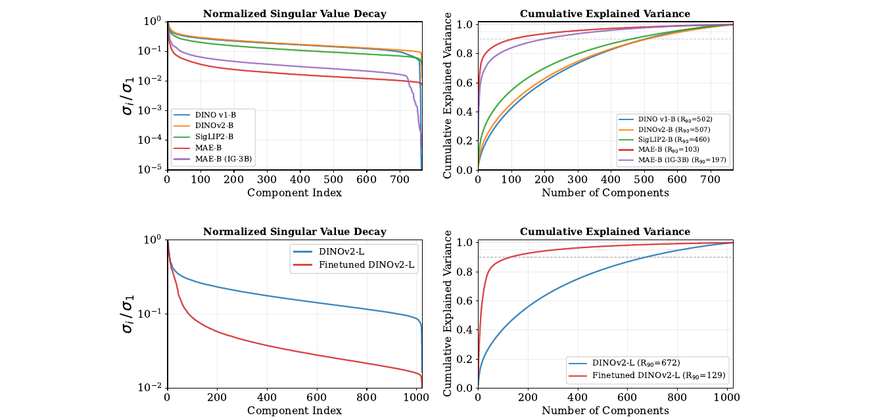
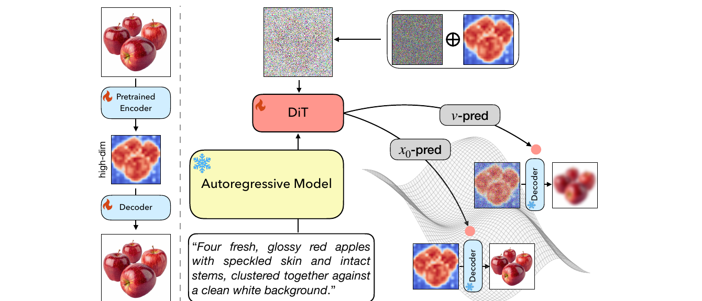
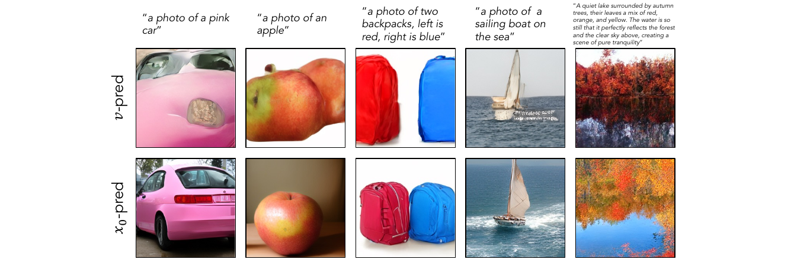

# On the Diffusibility of High-Dimensional Latents

**论文**: [arXiv:2609.28473v1](https://arxiv.org/abs/2609.28473) (cs.CV, 2026-09-23, 26 页含附录)
**作者**: Chao Feng, Zhiyang Xu, Bowei Chen, Yuanjun Xiong, Xiyao Wang, Jui-Hsien Wang, Richard Zhang, Zhe Lin, Andrew Owens, Yijun Li — **Cornell + Adobe + Virginia Tech + UW + UMD**
**项目页**: [cfeng16.github.io/on_the_diffusibility](https://cfeng16.github.io/on_the_diffusibility/)
**代码**: 未发布（项目页与 PDF 中都没有代码仓库链接）
**任务**: 文生图；latent 用 RAE（表示自编码器）的高维特征，扩散模型是 1B 的 Lumina-Next DiT

---

## 1. 一句话定位

**把语义编码器（DINOv2、MAE）为重建而微调后，特征的"有效维度"会塌缩 —— 1024 维里 90% 的方差只需 129 个主成分；在这种几何下，标准 v-prediction 要额外拟合流形外的正交噪声方向，于是训不动。解法是改用 x0-prediction（直接预测干净 latent，但仍用 v-loss），把 JiT 在像素空间的论证搬到高维表示 latent 空间。**

| | 结论 | 证据强度 |
|---|---|---|
| 为重建微调会让有效维度塌缩 | DINOv2-L 的 R90 从 **672 → 129**；以重建为预训练目标的 MAE-B 只有 **103** | ✅ 在 4 个数据集上一致（Table 1 + Table 6） |
| 塌缩后 v-pred 训不动，x0-pred 能修 | 微调 DINOv2-L：GenEval **30.96 → 39.48**、FID **29.97 → 16.80**；MAE-B：GenEval **36.17 → 40.89** | ✅ 两个 tokenizer 方向一致；⚠️ 单种子 |
| 修好之后，高维重建 latent 能超过冻结语义 latent | 微调 + x0（39.48）vs 冻结 DINOv2-L + v（37.63） | ⚠️ 同时换了两个变量（见下） |

🔴 **但有三件事论文要么没做、要么没在摘要里说**：
1. **缺决定性对照：冻结 DINOv2-L（有效维度高）+ x0-pred。** 没有它，既无法证明 x0 的收益是"有效维度塌缩"特有的（JiT 本来就主张 x0 在高维空间普遍更好），"重建有助于生成"也混着"微调编码器 + 换预测目标"两个变量（见 [§7.1](#71-table-2微调-dinov2-l)）。
2. **被它当作"会丢信息"而要取代的 32 维压缩方案，在 GenEval 与 DPG-Bench 上都比高维 x0 更好**（40.99 vs 39.48、73.04 vs 71.83），高维 x0 只赢 FID（16.80 vs 17.64）。论文在 §4.3 正文里承认了这一点，但摘要与贡献列表没提。
3. **"正交分量主导目标能量"只在取 R90 当内禀维度时成立**：取 R99（726）时，正交噪声能量 `h − l = 298` 反而小于流形部分 `l = 726`（见 [§4.3](#43-几个论文没点破的地方)）。另外附录 A.3 显示微调后的编码器**线性探测从 84.5% 掉到 63.9%** —— "继承语义信息"打了很大折扣。

---

## 2. 要解决的问题

**RAE 路线**（[RAE](https://arxiv.org/abs/2510.11690)、[Scale-RAE](https://arxiv.org/abs/2601.16208)）直接在冻结的 DINOv2 / SigLIP2 特征空间里做扩散，语义好、收敛快，**但这些编码器不是为重建训的**，文字、细纹理、小物体会丢。

> **Fig 1 逐段解读**：
>
> **(a) 左 · Reference / Prompt** —— 参考图是一条林间小路，前景木牌上写着 "Reconstruction"；prompt 明确要求牌上有白字 'Reconstruction'。**这张图专门挑了文字，因为文字是语义编码器最容易丢的高频细节。**
>
> **(a) 中 · 三行 × 三列** —— 行是三种 tokenizer：冻结 **DINOv2-L**、**Finetuned DINOv2-L**、**MAE**；列是 `Reconstruction`（编码再解码）、`Overfit generation · v-pred`、`Overfit generation · x0-pred`（在这一张图上过拟合训练扩散模型后生成）。
> - **DINOv2-L 行**：重建出来木牌上就已经是乱码，v 和 x0 两种过拟合结果也都是乱码 —— **上限卡在重建**，换预测目标救不了。
> - **Finetuned DINOv2-L 行**：重建清晰；**v-pred 过拟合后个别字母变形**（按 400 DPI 看，"e"、"s" 走样），**x0-pred 过拟合结果清楚**。
> - **MAE 行**：重建清晰；v-pred 结果**中段字母错乱，且整幅画面明显偏亮偏绿**，x0-pred 清楚且色调与参考一致。
>
> **(b) 右 · Metrics** —— 两张柱状图，灰 = v-pred，绿 = x0-pred。GenEval：微调 DINOv2-L **30.96 → 39.48**，MAE **36.17 → 40.89**；DPG-Bench：**67.47 → 71.83**、**67.54 → 73.90**。与 Table 2 / 3 的数一致。⚠️ DPG-Bench 那张子图**纵轴从 50 开始**，差距在视觉上被放大了。
>
> 📌 **这张图其实已经包含"冻结 DINOv2-L + x0"这个组合**（左上第三格）—— 但只在单图过拟合里，文生图的定量表里没有它。

**矛盾所在**：为重建微调编码器（AlignTok 等做法）能把细节找回来，但作者发现**在微调后的高维特征上，标准 v-prediction 的扩散很难训**，连单图过拟合都收敛得慢。以往的规避办法是再加一个 adapter 把特征压到低维（例如 32 维）再做扩散 —— 论文认为这会丢信息，想直接在 1024 维上扩散。

---

## 3. 与前作的关系

| 前作 | 做了什么 | 本文取了什么 |
|---|---|---|
| **JiT**（Li & He, [arXiv:2511.13720](https://arxiv.org/abs/2511.13720)） | 论证在**像素空间**这类高维空间里，干净图像位于低维流形附近、而噪声不在，所以应直接预测 x0 | **核心论证与 loss 形式整个沿用**（x0-pred + v-loss、t 截断到 0.05） |
| **RAE**（Zheng, Ma, Tong, Xie, [arXiv:2510.11690](https://arxiv.org/abs/2510.11690)） | 冻结 DINOv2 / SigLIP2 当 latent，配更宽的扩散头与偏移后的噪声调度 | MAE-B-RAE 的 decoder checkpoint；时间偏移的 `n = 4096` |
| **Scale-RAE**（Tong et al., [arXiv:2601.16208](https://arxiv.org/abs/2601.16208)） | 把 RAE 扩到文生图（SigLIP2） | Table 4 的参考对手（作者自己重实现了 SFT） |
| **AlignTok**（Chen et al., [arXiv:2509.25162](https://arxiv.org/abs/2509.25162)） | 三阶段微调语义编码器以兼顾重建与语义，但**在低维 latent 上做扩散** | 编码器微调配方（语义保持 + L1 + 感知 + 对抗损失）；它的作者里有本文的 Bowei Chen 与 Yuanjun Xiong |
| **[84]**（Zhang et al., arXiv:2512.17909） | 同样主张"语义与重建都重要"，用 adapter 降维 | 被本文当作"降维会丢信息"的代表 |

📌 **本文真正新增的是"把 JiT 的几何论证接到 RAE 上"这一环**：JiT 的前提是"数据在低维流形上"，而像素图像天然如此；本文补的是**表示特征什么时候满足这个前提** —— 答案是"为重建训练或微调过的编码器才满足"，冻结的语义编码器（DINOv2、SigLIP2）有效维度仍很高。

---

## 4. 方法

### 4.1 有效维度：先量出"塌缩"

从 ImageNet 随机取 20 万个 patch，提取**逐 patch ℓ2 归一化**的特征、减均值后做 SVD，得到奇异值 `σ_1 ≥ … ≥ σ_D`。前 k 个分量解释的方差比例（Eq. 3）与有效维度（Eq. 4）：

$$
C(k) = \frac{\sum_{i=1}^{k}\sigma_i^2}{\sum_{j=1}^{D}\sigma_j^2},\qquad R_\tau = \min\Big\{\,k \;\Big|\; C(k) \ge \frac{\tau}{100}\,\Big\}
$$

**Table 1**（ImageNet 验证集；重建为 PSNR）：

| Tokenizer / Encoder | 训练数据 | 维度 | R90 | R95 | R99 | 重建 PSNR |
|---|---|---|---|---|---|---|
| DINOv1-B | IN-1k | 768 | 502 | 595 | 701 | — |
| DINOv2-B-RAE | LVD-142M | 768 | 507 | 611 | 726 | 18.85 |
| SigLIP2-B-RAE | WebLI | 768 | 460 | 578 | 715 | 19.10 |
| **MAE-B-RAE** | IN-1k | 768 | **103** | 252 | 578 | **28.13** |
| MAE-B-IG-3B\* | Instagram-3B | 768 | 197 | 348 | 595 | 27.67 |
| DINOv2-L | LVD-142M | 1024 | 672 | 811 | 965 | 17.34 |
| **Finetuned DINOv2-L** | —（decoder 在 IN-1k 上训） | 1024 | **129** | 302 | 726 | **29.12** |

（\* 作者自己为 MAWS 的 MAE-B 训了 decoder。我按 300 DPI 渲染核对过全部数字。）

**读法**：以语义为目标的编码器（DINOv1/v2、SigLIP2）R90 都在全维的 60% 以上；**凡是以重建为目标预训练（MAE）或为重建微调过（Finetuned DINOv2-L）的，R90 都骤降到全维的 13%–26%**，同时 PSNR 高出 10 dB 左右。附录 Table 6 在 ImageNet-21k、BLIP3o、CC12M 上重复了这张表，趋势完全一致（例如微调 DINOv2-L 的 R90 在三个数据集上是 124 / 114 / 121）。

> **Fig 3 逐段解读**：
>
> **上排 · 768 维的五个编码器** —— 左图是按 `σ_1` 归一化的奇异值（对数纵轴）。DINOv1-B、DINOv2-B、SigLIP2-B 三条线在 `10⁻¹` 附近缓慢下降，几乎平行；**MAE-B（红）在前几十个分量内就掉到 `10⁻¹` 以下、之后贴着 `10⁻²` 走**；MAE-B（IG-3B，紫）介于两者之间。所有曲线在最后几个分量处都骤降（数值尾部）。右图是累计解释方差：MAE-B 用约 100 个分量就到 0.9，三个语义编码器要 460–507 个。
>
> **下排 · DINOv2-L 冻结 vs 微调** —— 左图里微调版（红）在约 80 个分量处就掉到 `10⁻¹`，之后平滑降到约 `1.5×10⁻²`；冻结版（蓝）始终在 `10⁻¹` 以上。右图里红线在 129 个分量处穿过 0.9 的虚线，蓝线要到 672。
>
> 📌 **一个与理论假设有关的细节**：微调后的曲线是**平滑地拖出一条长尾**，并不是"前 l 维之后骤降到 0"。§4.2 的子空间模型假设数据**恰好**落在一个 l 维线性子空间里（正交补上方差为 0），而实际的正交补里仍有 R90 之外那 10% 的方差 —— **重建分数提高的那部分高频细节，很可能恰恰就编码在这条长尾里。**

### 4.2 为什么 v-pred 在塌缩的空间里训不动

**标准 flow matching**（论文 Eq. 1，`t = 1` 是纯噪声）：

$$
z_t = (1-t)\,x_0 + t\,\epsilon,\qquad v = \epsilon - x_0,\qquad \mathcal{L} = \mathbb{E}\,\big\lVert v_\theta(z_t, t) - v \big\rVert^2
$$

**x0-pred + v-loss**（JiT 的写法，Eq. 2）：网络输出 `x_θ`，再换算成速度 `v_θ = (z_t − x_θ)/t` 去对 v 目标：

$$
\mathcal{L} = \mathbb{E}\left\lVert \frac{z_t - x_\theta}{t} - \frac{z_t - x_0}{t} \right\rVert^2 = \mathbb{E}\left\lVert \frac{x_0 - x_\theta}{t} \right\rVert^2
$$

两种写法的**最优解相同**，区别只在网络的原始输出要表示什么函数。

**子空间模型**（§3.2 + 附录 A.5）：设高维特征 `x_0 = Q c_0`，其中 `Q ∈ R^{h×l}` 的列是 l 维子空间的正交基（`QᵀQ = I_l`），`P⊥ = I − QQᵀ`。把噪声分解成子空间内的 `ε_l = Qᵀε` 与正交分量 `ε⊥ = P⊥ε`，两者独立，于是：

$$
z_t^h = Q\underbrace{\big((1-t)\,c_0 + t\,\epsilon_l\big)}_{z_t^l} + t\,\epsilon_\perp,\qquad P_\perp z_t^h = t\,\epsilon_\perp
$$

**v-pred 的 Bayes 最优解**（Eq. 5 / 17）多出一项正交分量：

$$
v^{h,*}(z_t^h, t) = Q\,v^{l,*}\big(Q^\top z_t^h, t\big) + \frac{1}{t}\,P_\perp z_t^h
$$

**x0-pred 的 Bayes 最优解**（Eq. 7 / 19）则完全落在子空间里：

$$
x^{h,*}(z_t^h, t) = \mathbb{E}\big[Q c_0 \mid Q z_t^l\big] = Q\,x^{l,*}\big(z_t^l, t\big)
$$

**直觉**：v-pred 的网络必须把输入里幅度只有 `t` 的正交分量**放大 `1/t` 倍**再原样输出（这就是那 `h − l` 维的噪声 `ε⊥`）—— t 越小越病态；x0-pred 的目标在正交方向上恒为 0，网络只需把这部分**投影掉**，是一个有界操作。论文用能量说明这一项的分量：`E‖ε⊥‖² = h − l`，而流形部分是 `l + E‖c_0‖²`；以 R90 作内禀维度代入微调 DINOv2-L（`h = 1024, l = 129`），正交部分约是流形噪声的 7 倍。

📌 **注意这一项并不增加不可约误差** —— 它是 `z_t` 的确定性线性函数，Bayes 最优的 v 预测器照样能达到最优；论文说的"低效"是**函数逼近与优化意义上的**难，不是信息论意义上的。本文的 DiT 隐藏宽度是 1536，大于 token 维度 1024（RAE 强调过"扩散头要比 latent 宽"），所以这里的困难也不是单纯的宽度不够。

### 4.3 几个论文没点破的地方

**① "正交分量主导"依赖于选 R90。** 附录明说 *"Using R90 as an empirical proxy for the intrinsic dimension"*。按我代入 Table 1 的计算（只比较噪声能量 `h − l` 与 `l`，不计 `E‖c_0‖²`）：

| | R90 下 `(h−l) / l` | R99 下 `(h−l) / l` |
|---|---|---|
| Finetuned DINOv2-L | 895 / 129 = **6.94** | 298 / 726 = **0.41** |
| MAE-B-RAE | 665 / 103 = 6.46 | 190 / 578 = 0.33 |
| DINOv2-L（冻结） | 352 / 672 = 0.52 | 59 / 965 = 0.06 |

**相对结论对 τ 是稳健的**（无论取哪个 τ，微调后的比值都约为冻结版的 7 倍）；**但"正交分量主导目标能量"这个绝对说法只在 R90 下成立**，取 R99 时三者的比值都小于 1。

**② 子空间模型把长尾当成零方差。** 见 Fig 3 的图解：真实特征的正交补里有 10%（R90 口径）的方差，而且正是重建细节所在。x0-pred 的目标里仍然要包含这部分（它是 `x_0` 的一部分），只是幅度小 —— 这对"高维 x0 能不能把细节生成出来"是有影响的，论文没讨论。

**③ 有效维度是在"逐 patch ℓ2 归一化"后的特征上量的**，而 DiT 实际扩散的 latent 采用什么归一化，论文没交代 `[待补]`。归一化方式会改变奇异值谱，两者未必一致。

### 4.4 文生图框架

> **Fig 4 逐段解读**：
>
> **(a) 左 · Tokenizer** —— 苹果图 → `Pretrained Encoder`（🔥，编码器**解冻**参与训练）→ 高维 latent（标 `high-dim`，可视化成一张热力图）→ `Decoder`（🔥）→ 重建图。**这一步就是 AlignTok 式的编码器微调**：解冻 DINOv2-L，和 decoder 一起按重建目标训练。
>
> **(b) 右 · 文生图** —— `Autoregressive Model`（❄ 冻结，实际是 Qwen3-VL-2B-Instruct）读入 prompt（"Four fresh, glossy red apples …"），通过可学习的 query token 把文本条件交给 `DiT`（🔥，随机初始化）。DiT 的输入是噪声与 latent 的混合（右上 `⊕`）。**右下是示意图**：一张网格曲面代表"信号流形"，`x0-pred` 的输出落在曲面上，经冻结的 `Decoder` 解码成清晰的苹果；`v-pred` 的输出偏离曲面（示意为一张带噪的 latent），解码成模糊的苹果。
>
> ⚠️ 右下是概念示意，不是实测：v-pred 采样最终也是积分 ODE 得到终点 latent，图里"v-pred 输出落在流形外"是对 §4.2 论证的形象化。

**损失**（Eq. 8）：RAE 特征 `h_i = g(I_i)` 当 latent，`h_{i,t} = (1−t)h_{i,0} + tε`，DiT 条件于文本嵌入 `y_i` 预测干净特征：

$$
\mathcal{L}_{\mathrm{Diff}} = \mathbb{E}_{t,\,h_{i,0},\,\epsilon}\left\lVert \frac{h_{i,0} - x_\theta(h_{i,t},\,t,\,y_i)}{t} \right\rVert^2,\qquad t \ge 0.05
$$

**编码器微调损失**（Eq. 10 / 11）：语义保持项让微调后的特征贴近原版 DINOv2-L 的特征，另加像素 L1、感知损失与对抗损失（权重 `ω_sp = 1, ω_p = 1, ω_g = 0.5`，沿用 AlignTok）：

$$
\mathcal{L}_{\mathrm{FT}} = \omega_{sp}\big\lVert g'(I) - g(I) \big\rVert^2 + \mathcal{L}_{\mathrm{L1}} + \omega_{p}\,\mathcal{L}_{\mathrm{perceptual}} + \omega_{g}\,\mathcal{L}_{\mathrm{GAN}}
$$

**时间偏移**（Eq. 9，沿用 RAE）：`t_m = α t_n / (1 + (α−1) t_n)`，`α = √(m/n)`，`m` = token 数 × token 维度，`n = 4096`。代入本文的 16×16 个 token：微调 DINOv2-L（1024 维）得 `α = 8`，MAE-B（768 维）得 `α ≈ 6.93`（我按论文公式计算）。

---

## 5. 关键代码位置

**未发布代码**（项目页与 PDF 里都没有仓库链接；PDF 中唯一的 GitHub 链接是参考文献里的 FLUX）。因此以下实现细节无法核对：DiT 实际使用的 latent 归一化方式、x0-pred 分支是否另有 loss 加权、单图过拟合实验的步数与收敛判据 —— 均为 `[待补]`。

---

## 6. 实验设置

| 项 | 值 |
|---|---|
| 条件编码 | **Qwen3-VL-2B-Instruct**（冻结）+ 64 个可学习 query token（MetaQuery / BLIP3-o 式） |
| DiT | **Lumina-Next 1B**：24 层、24 头、隐藏维度 **1536**、SwiGLU；随机初始化；CFG dropout 0.1 |
| latent | 微调 DINOv2-L：**1024 × 16 × 16**；MAE-B：**768 × 16 × 16** |
| 优化 | AdamW，lr 1e-4 → 1e-5 cosine，warmup 0.003，β = (0.9, 0.999)，global batch **1024**，梯度裁剪 1.0 |
| 数据 | BLIP-3o 公开预训练集的 **34M 子集**（全集 39.3M，主要是 CC12M、SA-1B、JourneyDB 等网络数据并重写 caption） |
| 训练量 | **90k 步**，分辨率 **256×256** |
| 时间调度 | 均匀采样 + RAE 式偏移（`n = 4096`） |
| 采样 | **100 步 Euler** |
| 评测 | GenEval、DPG-Bench、COCO-30k FID |
| 硬件 | 64×A100 或 32×H200；训练时长未给 `[待补]` |
| tokenizer | ① 冻结 MAE-B + RAE 的 ViT-XL decoder（均在 IN-1k 上训）；② 解冻 DINOv2-L、在 IN-1k 上与 SD-VAE 式 decoder 一起按重建目标微调 |
| 种子 / 误差棒 | ⚠️ **全文没有**（"seed" 出现 0 次） |

---

## 7. 结果

### 7.1 Table 2：微调 DINOv2-L

| Tokenizer | 维度 | 预测 | GenEval ↑ | DPG-Bench ↑ | COCO-30k FID ↓ | 重建 PSNR ↑ |
|---|---|---|---|---|---|---|
| FT-DINOv2-L-low-dim | 32 | v | **40.99** | **73.04** | <ins>17.64</ins> | <ins>25.83</ins> |
| DINOv2-L（冻结） | 1024 | v | 37.63 | 70.21 | 18.34 | 17.34 |
| FT-DINOv2-L | 1024 | v | 30.96 | 67.47 | 29.97 | **29.12** |
| **FT-DINOv2-L** | 1024 | **x0** | <ins>39.48</ins> | <ins>71.83</ins> | **16.80** | **29.12** |

（加粗 = 最优，下划线 = 次优，对应论文的粗体 / 蓝色；我按 300 DPI 渲染核对过，**全部标注正确**。）

**它证明了什么**：
- 📌 **同一个微调 tokenizer，只换预测目标**：GenEval **+8.52**、DPG **+4.36**、FID **−13.17**。这是全文最干净、也最大的一个效应。
- 📌 **为重建微调、但仍用 v-pred，三项全面变差**（相对冻结 DINOv2-L：GenEval −6.67、FID +11.63）—— 与 §4.2 的预测一致。

**它没有证明什么**：
1. 🔴 **"重建有助于生成"混着两个变量。** 论文 §4.3 *"Reconstruction still matters for generation"* 拿"微调 + x0"（39.48）去比"冻结 + v"（37.63），得出 +1.85 GenEval。**但编码器和预测目标同时变了**；缺的那一格"冻结 DINOv2-L + x0"才能把两者拆开。
2. 🔴 **同一个缺口也让核心机制无法证实。** 论文的解释是"x0 之所以有效，是因为有效维度塌缩了"。要验证它，需要在**有效维度高**的编码器（冻结 DINOv2-L、SigLIP2-B-RAE）上也跑 x0 vs v —— 如果 x0 在那里也有同等提升，"塌缩"就不是必要解释（JiT 的主张本来就是 x0 在高维空间普遍更好）。**全文没有任何一个高有效维度编码器的 x0 文生图结果**；唯一出现过的"冻结 DINOv2-L + x0"是 Fig 1 里的单图过拟合定性结果。
3. ⚠️ **低维压缩方案并没有被打败。** 32 维 + v 在 GenEval（+1.51）和 DPG（+1.21）上都优于 1024 维 + x0，后者只赢 FID（−0.84）与重建（+3.29 dB）。论文 §4.3 正文承认了这一点（*"While the low-dimensional bottleneck achieves stronger text-alignment metrics … this compression comes at the cost of image quality"*），**但引言把降维描述成"can discard important information"、摘要只说 x0 "consistently improves"** —— 读者不看表很难知道压缩方案在对齐指标上仍然更好。

> **Fig 5 逐列对比**（上 v-pred，下 x0-pred，同一微调 DINOv2-L tokenizer）：
>
> - **"a photo of a pink car"** —— v-pred 只剩一片粉色的车身局部、中间一块无法辨认的团块，**整体几何没成形**；x0-pred 是一辆完整的粉色掀背车。
> - **"a photo of an apple"** —— v-pred 是两个粘连、边缘发虚的苹果（prompt 只要一个）；x0-pred 是一个完整的苹果。
> - **"two backpacks, left is red, right is blue"** —— 两者颜色与左右位置都对；v-pred 的背包像两团没有结构的色块，x0-pred 有拉链、背带等细节。
> - **"a sailing boat on the sea"** —— v-pred 的船体下方海面上出现一串**类似文字的伪影**；x0-pred 的船与浪花清楚。
> - **长 prompt（秋日湖面倒影）** —— v-pred 倒影与岸线混成一片、偏暗；x0-pred 色彩与倒影层次更清楚。
>
> 总结：v-pred 的失败主要是**全局结构没成形**（团块状、粘连），而不是细节模糊 —— 这与"训练没收敛到信号流形上"的解释一致；这些都是挑出来的样例，定量证据以 Table 2 为准。

### 7.2 Table 3：MAE-B-RAE（冻结，以重建为预训练目标）

| Tokenizer | 维度 | 预测 | GenEval ↑ | DPG-Bench ↑ | COCO-30k FID ↓ |
|---|---|---|---|---|---|
| MAE-B-RAE | 768 | v | 36.17 | 67.54 | 22.20 |
| **MAE-B-RAE** | 768 | **x0** | **40.89** | **73.90** | **17.24** |

x0 相对 v：GenEval **+4.72**、DPG **+6.36**、FID **−4.96**。📌 **这组数其实比论文强调的更有意思**：一个**冻结的、语义能力公认弱于 DINOv2 的 MAE-B**，配上 x0-pred 之后，**GenEval 40.89 与 DPG 73.90 都高于 Table 2 里的任何一个高维配置**（包括微调 DINOv2-L + x0 的 39.48 / 71.83），DPG 甚至超过 32 维方案的 73.04。⚠️ 但两张表的 decoder 不同（MAE 用 RAE 的 ViT-XL decoder，微调 DINOv2-L 用 SD-VAE 式 decoder），跨表比较只能当参考。

### 7.3 Table 4：扩到 90M 数据 + SFT

| 方法 | DiT | 训练数据 | latent 维度 | 分辨率 | GenEval ↑ | DPG-Bench ↑ |
|---|---|---|---|---|---|---|
| Ours | 1B | 90M | 1024 | 256 | 43.84 | 76.15 |
| Ours | 1B | 90M + SFT 60k | 1024 | 256 | 78.62 | 80.13 |
| **Ours (512)** | 1B | 90M (256) + SFT 60k (512) | 1024 | 512 | **79.69** | **81.15** |
| Scale-RAE\* | 2.4B | 64M + SFT 60k | 1152 | 224 | 77.43 | 78.47 |

（\* 作者自己实现的 SFT。数字按 300 DPI 核对无误。）

⚠️ **这张表不能当作 x0 方法在规模上的证据**：
- **扩规模之后没有 v-pred 对照**，测的已经不是 x0 vs v。
- **SFT（BLIP3o-60k）一步就带来 +34.78 GenEval**（43.84 → 78.62），远大于 x0 vs v 的 +8.52 —— 最终数字主要由 SFT 数据决定。
- **与 Scale-RAE 的比较不受控**：模型规模（2.4B vs 1B）、预训练数据（公开 64M vs **内部 90M**）、分辨率（224 vs 256）、latent 维度（1152 vs 1024）全不同，且对手的 SFT 是作者自己重实现的。论文也只把它列为 *"as a reference"*。

### 7.4 附录 A.3：微调后的编码器还剩多少语义

ImageNet-1k 线性探测：**原版 DINOv2-L 84.5%，微调后 63.9%**（掉 20.6 个点），而 PSNR 从 17.34 升到 29.12。论文在附录里坦承 *"How to preserve good understanding capability and improve reconstruction performance for a single tokenizer is future research"*。📌 **这对正文的叙述是个重要限定**：§3.2 说要用"also inherit semantic information"的强重建编码器，但语义保持损失（Eq. 10）实际只保住了一部分语义。

---

## 8. 数字核对

**核对通过的**（我逐项复算或按 300 DPI 渲染对照）：

| 项 | 结果 |
|---|---|
| Table 1 全部 R90 / R95 / R99 / PSNR；与 Fig 3 图例的 R90（502 / 507 / 460 / 103 / 197 / 672 / 129）一致 | ✅ |
| Table 2 的加粗与蓝色（次优）标注 | ✅ 全部正确 |
| Table 3 的加粗 | ✅ |
| Table 4 全部数字与加粗 | ✅ |
| Fig 1(b) 柱上数字 = Table 2 / 3 对应格 | ✅ |
| §4.3 "low-dim 的 FID 17.64 更差、x0 的 FID 16.80 更好" | ✅ |

**需要打折的叙述**：
1. ⚠️ **"Prior work compresses the latents … but this can discard important information"**（引言）与 Table 2 的对齐指标相反（见 §7.1）。
2. ⚠️ **"正交分量主导"依赖 R90**（见 §4.3）。
3. ⚠️ **"x0-prediction consistently improves"** —— "consistently" 覆盖的是 2 个低有效维度 tokenizer × 3 个指标，**没有高有效维度的对照**，也没有种子重复。
4. ⚠️ Fig 1(b) 的 DPG-Bench 子图**纵轴从 50 起**。
5. 小瑕疵：Table 1 里微调 DINOv2-L 的训练数据写成"—"，而 §4.1 写明 decoder 在 IN-1k 上训练。

---

## 9. 争议与权衡

**站得住的**：
- 📌 **"为重建而训的编码器，有效维度会塌缩"是一个干净、可复现的测量**：7 个编码器 × 4 个数据集，趋势一致，而且与 PSNR 的高低对得上。
- 📌 **在同一个塌缩的 tokenizer 上，x0 相对 v 的提升很大**（GenEval +8.52、FID −13.17），两个 tokenizer 方向一致。**对"想在高维重建 latent 上直接扩散"的人，这是一个零成本、应当默认打开的改动。**
- 📌 **理论推导简单、正确**，而且把 JiT 的直觉落到了一个可以量的量（R_τ）上。

**需要打折的**：
- 🔴 **缺高有效维度编码器上的 x0 对照** —— 核心机制（塌缩 → x0 有效）与"重建有助于生成"都因此无法证实（§7.1）。
- 🔴 **没有证明"直接在高维扩散"优于"先压到低维"**：32 维方案在 GenEval / DPG 上仍然更好（§7.1）。
- ⚠️ **"正交分量主导"对 τ 敏感**；子空间模型把含 10% 方差的长尾当作零（§4.3）。
- ⚠️ **单种子、无误差棒**；关键比较里有 1.5–1.9 分的 GenEval 差距（例如 39.48 vs 37.63、40.99 vs 39.48），没有重复就难以判断是否显著。
- ⚠️ **受控实验只在 256×256、90k 步**；扩规模（Table 4）时既换了数据（内部 90M）又加了 SFT，且没有 v-pred 对照。
- ⚠️ **微调编码器的语义大幅退化**（线性探测 −20.6 点），只在附录出现。
- ⚠️ **没有代码**，latent 归一化等细节无法核对。

---

## 10. 一句话总结

**这篇论文先测出一个干净的现象：语义编码器一旦为重建而训练或微调（MAE、按 AlignTok 配方解冻的 DINOv2-L），特征的有效维度就会塌缩 —— 1024 维的 DINOv2-L，R90 从 672 降到 129，同时重建 PSNR 从 17.34 升到 29.12；再用一个线性子空间模型说明，在这种几何下 v-prediction 的最优解里多出一项 `(1/t) P⊥ z_t`，网络得把输入中幅度只有 t 的正交分量放大 1/t 倍输出，而 x0-prediction 的最优解完全落在子空间内，只需把正交部分投影掉。** 据此把 JiT 的 x0-pred + v-loss 搬到 RAE 的高维 latent 上：同一个微调 DINOv2-L tokenizer，只换预测目标就让 GenEval 从 30.96 升到 39.48、COCO FID 从 29.97 降到 16.80，冻结 MAE-B 上也有 +4.72 GenEval。🔴 **但它最想证明的两件事都还缺一格对照**：没有在有效维度高的编码器（冻结 DINOv2-L、SigLIP2）上跑 x0，所以既不能说明 x0 的收益来自"塌缩"而非"x0 在高维普遍更好"，"重建有助于生成"（39.48 vs 37.63）也同时换了编码器和预测目标两个变量；**被它当作"会丢信息"而要取代的 32 维压缩方案，在 GenEval 和 DPG-Bench 上仍然更好**（40.99 vs 39.48、73.04 vs 71.83），高维 x0 只赢 FID；"正交分量主导"的论证只在取 R90 作内禀维度时成立，取 R99 时方向就反了；微调后的编码器线性探测从 84.5% 掉到 63.9%；全文单种子、无代码。📌 **对实践最有用的结论是一句话：在任何低有效维度的高维 latent 上做扩散，先把 v-pred 换成 x0-pred 再说。**

---

## 11. 在仓库图谱里的位置

| | 关系 |
|---|---|
| **[RF](../../multimodal/rf/analysis.md)** | 📌 **同一个 JiT 方案、不同的空间**：RF 在**像素 patch** 上用 x-prediction + velocity loss（其笔记的 `L_FM`），本文把同样的参数化搬到**高维表示 latent** 上，并补了"什么样的表示满足低维流形前提"这一环（为重建训过的才满足） |
| **[SenseNova-U1.5](../../multimodal/sensenova_u15/analysis.md)** | 同样在**像素空间**用 x-prediction flow matching。仓库里现在有两篇像素空间 + 一篇表示空间的 x0-pred，**三篇都没有做"高有效维度空间里 x0 vs v"的对照** |
| **[VideoFlexTok](../../multimodal/videoflextok/analysis.md)** | 📌 **一个值得检验的联系**：VideoFlexTok 观察到"凡让重建变好的设计（完整注意力、1D 平坦结构），下游生成都变差"，它给的解释是这些 token "更难预测、缺少足够的结构" —— 与本文的 diffusibility 是同一个方向的描述；本文 Table 2 的 v-pred 那两行给出同样的现象（重建 PSNR 17.34 → 29.12，FID 18.34 → 29.97），**但换成 x0-pred 后现象反转**（FID 16.80）。这提示"重建—生成此消彼长"至少有一部分可能来自 **v-parameterization 在低有效维度 latent 上的优化困难**，而不是 latent 本身不可生成 —— 这是我的推测，VideoFlexTok 的设置（视频、AR + flow decoder）与本文不同，需要实验验证 |
| [Self-Flow](../../flow_matching/self_flow/analysis.md) | 其笔记记录了它在 RAE 上的改善较小（FID 3.24 → 2.95）。RAE 系 latent 上的训练技巧，本文是仓库里第二篇 |

⚠️ **仓库缺口**：本文的三个直接前作 **JiT**（arXiv:2511.13720）、**RAE**（arXiv:2510.11690）、**Scale-RAE**（arXiv:2601.16208），以及它沿用编码器微调配方的 **AlignTok**（arXiv:2509.25162），仓库里都没有专篇。

---

## Q&A

*(后续对话中产生的问答追加于此)*
