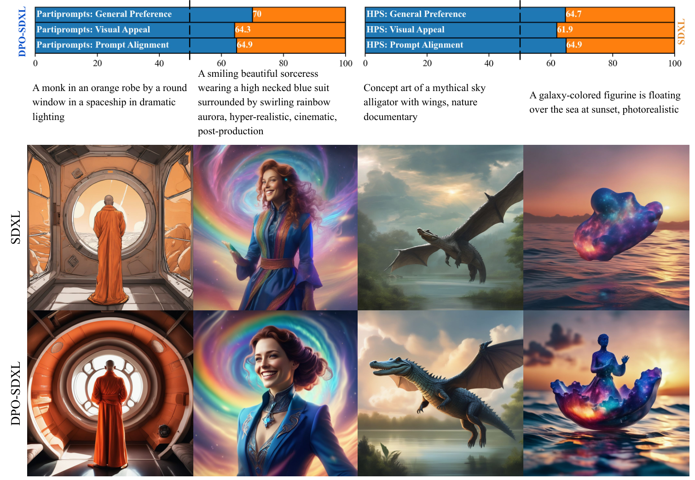
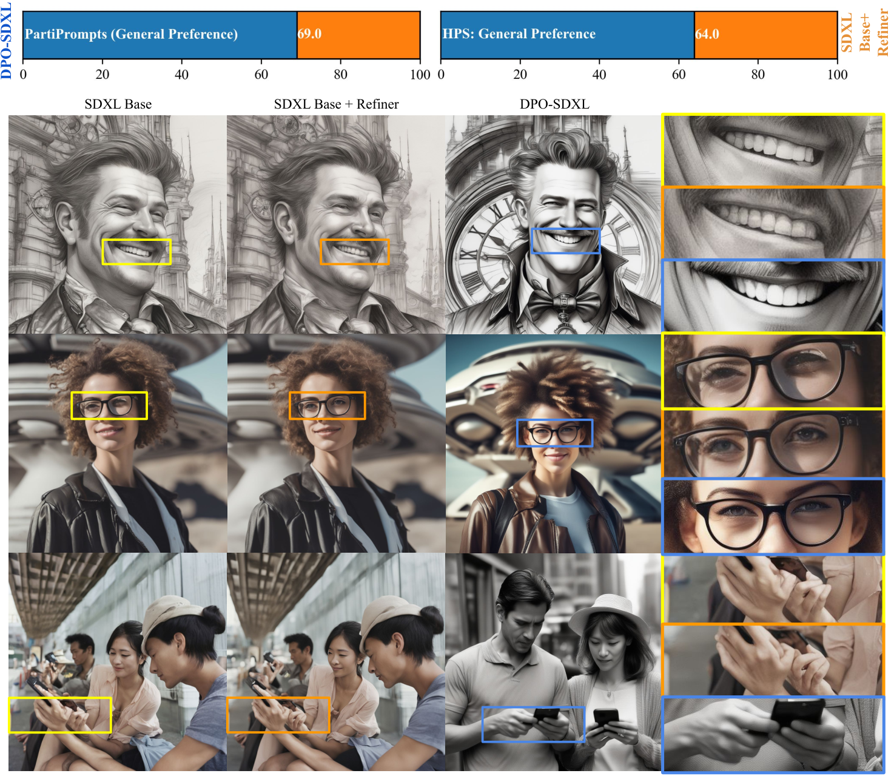
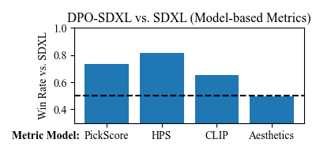

# Diffusion Model Alignment Using Direct Preference Optimization (Diffusion-DPO)

**论文**: [arXiv 2311.12908](https://arxiv.org/abs/2311.12908)
**机构**: Salesforce AI Research + Stanford
**时间**: 2023-11（NeurIPS 2023 workshop；CVPR 2024 正式发表）
**数据集**: Pick-a-Pic v2（851K 偏好对，58.96K unique prompt）

---

## 0. 先读懂原版 DPO（LLM 侧）

DPO（Rafailov et al., NeurIPS 2023）把 RLHF 的两步（先学 reward model，再做 PPO）合并成**一步闭式优化**。

### 出发点

RLHF 的目标：

$$
\max_{p_\theta} \mathbb{E}_{c,x_0\sim p_\theta}[r(c,x_0)] - \beta D_\text{KL}[p_\theta(x_0|c) \| p_\text{ref}(x_0|c)]
$$

这个带 KL 约束的 RL 目标有**闭式最优解**：

$$
p^*(x_0|c) = \frac{p_\text{ref}(x_0|c)\exp(r(c,x_0)/\beta)}{Z(c)}
$$

反解 reward：

$$
r(c,x_0) = \beta \log \frac{p^*(x_0|c)}{p_\text{ref}(x_0|c)} + \beta\log Z(c)
$$

代入 Bradley-Terry 偏好模型 `P(x_w ≻ x_l) = σ(r(x_w) - r(x_l))`，`Z(c)` 相消，得到 **DPO loss**：

$$
\mathcal{L}_\text{DPO}(\theta) = -\mathbb{E}\left[\log\sigma\!\left(\beta\log\frac{p_\theta(x_w|c)}{p_\text{ref}(x_w|c)} - \beta\log\frac{p_\theta(x_l|c)}{p_\text{ref}(x_l|c)}\right)\right]
$$

**直觉**：拉高 preferred 样本相对 ref 的 log-prob，压低 rejected 样本相对 ref 的 log-prob，两者之差用 sigmoid 套成概率，最大化该差就是最大化偏好概率。

### LLM 侧可行的关键

`p_θ(x|c)` 对 LLM 是可算的——自回归 token 序列，log-prob = 每步 logit 之和。

---

## 1. 一句话定位

**Diffusion-DPO 解决的核心问题**：扩散模型生成过程是 1000 步 Markov chain，`p_θ(x_0|c)` 没有闭式（需积掉所有中间 latent），**log-prob 算不出来，DPO 没法直接用**。

解决方案：在 path 空间上展开，用 ELBO 替代 intractable likelihood，把 DPO loss 推导成**每步去噪误差之差**——最终形式和标准扩散训练 loss 几乎相同，但比较的是在 preferred vs rejected 图像上的噪声预测误差。

---

## 2. 与前作关系

| 方法 | 类型 | 主要问题 |
|------|------|----------|
| DDPO / DPOK | online RL，RLHF | 需可微 reward，不泛化到 open vocab |
| DRaFT / AlignProp | 直接反传 reward 梯度 | 无 KL 约束，易 mode collapse；CLIP reward 会让 prompt alignment 变差 |
| SFT on preferred | 监督微调 | 忽略 rejected 侧信息，在此实验中实际**降低了性能** |
| **Diffusion-DPO** | offline preference learning | 只需偏好对数据，无需可微 reward，有 KL 约束 |

---

## 3. 核心推导

### 3.1 Path 空间扩展

把 reward 定义在完整 path `x_{0:T}` 上，路径 KL 展开：

$$
\max_{p_\theta}\;\mathbb{E}[r(c,x_0)] - \beta D_\text{KL}[p_\theta(x_{0:T}|c) \| p_\text{ref}(x_{0:T}|c)]
$$

路径 KL 分解（Markov 性）：

$$
D_\text{KL}[p_\theta(x_{0:T}|c) \| p_\text{ref}(x_{0:T}|c)] = \sum_{t=0}^{T-1}\mathbb{E}_{x_t}\left[D_\text{KL}[p_\theta(x_{t-1}|x_t,c) \| p_\text{ref}(x_{t-1}|x_t,c)]\right]
$$

对应的 DPO loss（path 期望版）：

$$
\mathcal{L}(\theta) = -\mathbb{E}\left[\log\sigma\!\left(\beta\,\mathbb{E}\!\left[\log\frac{p_\theta(x_w^{0:T})}{p_\text{ref}(x_w^{0:T})} - \log\frac{p_\theta(x_l^{0:T})}{p_\text{ref}(x_l^{0:T})}\right]\right)\right]
$$

内层期望**不可交换到 σ 外面**（非线性），用 Jensen 不等式得上界：

$$
\mathcal{L}(\theta) \leq -\mathbb{E}\left[\log\sigma\!\left(\beta T\left[\log\frac{p_\theta(x_w^{t-1}|x_w^t)}{p_\text{ref}(x_w^{t-1}|x_w^t)} - \log\frac{p_\theta(x_l^{t-1}|x_l^t)}{p_\text{ref}(x_l^{t-1}|x_l^t)}\right]\right)\right]
$$

其中 `t` 从每个 step 均匀采样。

### 3.2 ELBO 替代 intractable reverse KL

reverse 分布 `p_θ(x_{t-1}|x_t)` tractable（高斯），但**在 preferred/rejected 轨迹上采样很贵**（需要完整前向 rollout）。

用**前向过程** `q(x_{t-1}|x_0, t)` 代替 reverse 过程采样（ELBO 技巧）：

每步 KL 差展开（preferred - ref，rejected - ref）：

$$
\mathcal{L}(\theta) = -\mathbb{E}\!\left[\log\sigma\!\left(-\beta T\!\left[
\underbrace{D_\text{KL}(q(x_w^{t-1}|x_w^0,t)\|p_\theta(x_w^{t-1}|x_w^t))}_{\text{preferred denoising error}}
- D_\text{KL}(q\|p_\text{ref})_w
- D_\text{KL}(q(x_l^{t-1}|x_l^0,t)\|p_\theta)
+ D_\text{KL}(q\|p_\text{ref})_l
\right]\right)\right]
$$

### 3.3 最终简化 loss（Eq. 14）

对扩散模型，`p_θ(x_{t-1}|x_t)` 等价于**预测噪声** `ε_θ(x_t, t)`，上面的 KL 退化为 MSE：

$$
\boxed{\mathcal{L}_\text{DPO-Diffusion}(\theta) = -\mathbb{E}\left[\log\sigma\!\left(-\beta T\,\omega(\lambda_t)\Big[
\underbrace{\|\varepsilon_w - \varepsilon_\theta(x_w^t,t)\|^2 - \|\varepsilon_w - \varepsilon_\text{ref}(x_w^t,t)\|^2}_{\text{preferred: model 应比 ref 更好去噪}}
- \underbrace{\|\varepsilon_l - \varepsilon_\theta(x_l^t,t)\|^2 + \|\varepsilon_l - \varepsilon_\text{ref}(x_l^t,t)\|^2}_{\text{rejected: model 应比 ref 更差去噪（即不拟合）}}
\Big]\right)\right]}
$$

其中：
- `x_t = α_t x_0 + σ_t ε`，即从 clean image 加噪得到训练用的 `x_t`（**不需要实际 rollout**）
- `λ_t = α_t²/σ_t²` 是信噪比，`ω(λ_t)` 是 timestep weighting（实践中取常数）
- **`T` 因子**：对应 Jensen 步骤引入，用来平衡不同 T 下的 β 尺度

📌 **形式解读**：整个 loss 就是**两组噪声预测 MSE 之差的 sigmoid**。preferred 图：让 `‖ε_θ - ε_w‖²` < `‖ε_ref - ε_w‖²`（模型比 ref 去噪更准）；rejected 图：让 `‖ε_θ - ε_l‖²` > `‖ε_ref - ε_l‖²`（模型比 ref 去噪更差）。

### 3.4 与标准扩散 loss 的关系

标准扩散训练 loss：

$$
\mathcal{L}_\text{DM} = \mathbb{E}\left[\omega(\lambda_t)\|\varepsilon - \varepsilon_\theta(x_t,t)\|^2\right]
$$

Diffusion-DPO loss 可以看作：把两个图像的标准去噪 loss 对比，去掉绝对值，只优化**相对质量差**。这使得：

- 无需 reward model（只需偏好对标签）
- 无需 rollout（直接用 clean image + 加噪得 `x_t`）
- 有 KL 约束（通过 ref model 隐式实现）

---

## 4. 实现细节

### 4.1 训练流程

```
for (x_w, x_l, c) in preference_pairs:
    t ~ Uniform(0, T)
    ε ~ N(0, I)
    x_w_t = α_t * x_w + σ_t * ε  # 直接对 clean preferred 加噪
    x_l_t = α_t * x_l + σ_t * ε  # 直接对 clean rejected 加噪
    
    ε_θ_w = model_θ(x_w_t, t, c)
    ε_θ_l = model_θ(x_l_t, t, c)
    ε_ref_w = model_ref(x_w_t, t, c)  # ref model 冻结
    ε_ref_l = model_ref(x_l_t, t, c)
    
    # 计算隐式 reward（相对 ref 的去噪改善量）
    reward_w = ‖ε - ε_θ_w‖² - ‖ε - ε_ref_w‖²   # 负值好（模型比 ref 更准）
    reward_l = ‖ε - ε_θ_l‖² - ‖ε - ε_ref_l‖²   # 正值好（模型比 ref 更差）
    
    loss = -log σ(-β * T * ω_t * (reward_w - reward_l))
```

### 4.2 关键超参

| 参数 | SD1.5 | SDXL |
|------|-------|------|
| β | 2000 | 5000 |
| 学习率 | `2000/β × 2.048e-8` | 同左（β 越大 lr 越小，保持有效步长不变） |
| 有效 batch size | 2048 对 | 2048 对 |
| 梯度累积 | 128 步 | 128 步 |
| GPU | 16× A100 | 16× A100 |
| warmup | 25% linear | 25% linear |

📌 **β 和 lr 的缩放关系**：`lr ∝ 1/β`，因为 loss 中 β 越大梯度越大，反向缩小 lr 保持训练稳定。

---

## 5. 实验结果

### 5.1 主要结果



> **Fig 3 逐区域解读**：
>
> **顶部两栏（win-rate 条形图）**——左侧 PartiPrompts，右侧 HPSv2，均为 DPO-SDXL（蓝）vs SDXL-base（橙）。
> - General Preference：70%（PartiPrompts），64.7%（HPS）——在综合偏好上显著领先
> - Visual Appeal：64.3% / 61.9%——美学提升
> - Prompt Alignment：64.9% / 64.9%——文本对齐同时提升（这是 DRaFT 等方法做不到的）
>
> **底部定性对比（上行 SDXL，下行 DPO-SDXL）**——4 列 prompt：
> - **列 1（spaceship monk）**：DPO 版光线更戏剧化，环境构图更完整；
> - **列 2（sorceress rainbow aurora）**：DPO 版人物五官更精确，aurora 更细腻；
> - **列 3（sky alligator）**：DPO 版翅膀结构更清晰，自然纪录片氛围更强；
> - **列 4（galaxy figurine sunset）**：DPO 版海面倒影和银河质感都更精细。
>
> 📌 两类提升同步出现（美学 + 文本对齐），而非互相 trade-off——这是 Diffusion-DPO 相比纯 reward 最大化方法的关键优势。

### 5.2 vs SDXL Base + Refiner



> **Fig 4 逐区域解读**：
>
> **顶部 win-rate**：DPO-SDXL 69%（PartiPrompts）/ 64%（HPS）击败 SDXL Base+Refiner pipeline。
>
> **底部 3×3 对比（3 个 prompt，3 列：Base / Base+Refiner / DPO-SDXL，右侧 crop 放大）**：
> - **行 1（smiling man sketch）**：Base 的牙齿（黄框）有轻微失真；Refiner（橙框）略改善；DPO-SDXL（蓝框）牙齿最整洁，背景时钟细节也更丰富；
> - **行 2（woman with glasses）**：Base 的眼镜（黄框）透镜形状不对称；Refiner 改善有限；DPO-SDXL 眼镜结构最正确，背景飞碟也更真实；
> - **行 3（couple on phone）**：Base 的手机（黄框）边缘虚化；Refiner 稍清晰；DPO-SDXL 手机屏幕细节最清晰，人物关系表达更自然。
>
> **关键数字**：DPO-SDXL 只用 base（53% 参数），赢了 base+refiner（100% 参数）完整 pipeline。说明偏好对齐带来的增益超过了 refiner 的细化效果。

### 5.3 HPSv2 leaderboard（当时）

DPO-SDXL reward score **28.16**，HPSv2 leaderboard 第一（超过 DALL-E 3、Midjourney v6 等）。

### 5.4 从 AI 反馈学习（Fig 6）



用 PickScore / CLIP / Aesthetics / HPSv2 生成伪标签训练 SD1.5，评测用四种指标：

- PickScore 伪标签训练：General Preference **59.8% → 63.3%**（vs 只用 human labels 的 baseline）
- 不同 reward 可混合，泛化性好（CLIP reward 训练后，CLIP 评估上赢；Aesthetics reward 训练后画质涨）
- **SFT（只用 preferred 图监督微调）对所有指标都降低**——说明 rejected 对信息必不可少

---

## 6. 争议/权衡

| 维度 | 说明 |
|------|------|
| Offline 数据质量上限 | 模型只能学到数据集里的偏好，无法自我改进（不像 online RL） |
| Jensen 不等式上界 | Eq. 12 是上界非等式，实际优化的并非严格 DPO 目标 |
| β 很大（2000–5000）| LLM 侧 β 通常在 0.1–0.5，这里大三个量级；原因是 diffusion loss 的 `T=1000` 因子已经放大梯度，β 要跟着调大保持比例 |
| 无 rollout = 无探索 | 用前向加噪替代 reverse rollout，节省了显存，但只在固定数据上优化，受 Pick-a-Pic 数据分布限制 |
| Flow-GRPO 是后续工作的起点 | [Flow-GRPO](../flow_grpo/analysis.md) 在 flow matching 模型上用 online RL（SDE 采样）克服了 offline 的限制 |

---

## 7. DPO vs Diffusion-DPO 完整类比

| | 原版 DPO（LLM）| Diffusion-DPO |
|--|----------------|----------------|
| 可行性前提 | `log p_θ(x|c)` 可算（自回归 sum） | `log p_θ(x_0|c)` 不可算（需积掉 T 步） |
| 解决方案 | 直接用 log-prob | Path 空间 + Jensen + ELBO（用加噪代替 rollout） |
| 隐式 reward | `β log(p_θ/p_ref)` | `β·T·ω_t·(‖ε - ε_ref‖² - ‖ε - ε_θ‖²)` |
| Loss 形式 | `σ(β·Δlog-prob)` | `σ(-β·T·ω·Δnoise-MSE)` |
| KL 约束 | ref model 提供 | ref model 提供（同样隐式） |
| 数据 | token 序列偏好对 | 图像偏好对（Pick-a-Pic） |
| β 量级 | 0.1–0.5 | 2000–5000（`T=1000` 因子补偿） |

**最核心的类比**：DPO 把 reward 表达为 `Δlog-prob`；Diffusion-DPO 把 reward 表达为 `Δ噪声预测 MSE`（相对 ref model 的去噪改善量）。两者的 `Z(c)` 都靠 preferred-rejected 相消而消掉，不用估计归一化常数。

---

## 8. 一句话总结

Diffusion-DPO 用 path 空间 Jensen + ELBO 把 LLM 侧的 DPO 搬到扩散模型：最终 loss 就是 preferred/rejected 图像去噪 MSE 对比（model 相对 ref 的改善量之差），训练无需 rollout、无需可微 reward，在 SDXL 上同时提升美学和文本对齐，并奠定了后续 Flow-GRPO / Flow-OPD 整条扩散 RL 路线的数学基础。

---

## Q&A

**Q: 为什么 β 要取 2000–5000，比 LLM 侧大三个数量级？**

A: Diffusion-DPO loss 里有显式的 `T` 因子（`T=1000`）和 `ω(λ_t)`（通常 ~1），所以 loss 中 β 的有效贡献已经被放大了 `T` 倍。为了让有效 KL 强度与 LLM 侧类似（β 在 loss 里的"真实作用"是控制 KL 权重），就需要把名义 β 调到同等量级。

论文用 `lr ∝ 1/β` 来补偿：β 大了，梯度自然大，lr 等比缩小，保证参数更新步长相当。

---

**Q: 为什么 SFT on preferred 反而变差？**

A: SFT 直接在 preferred 图上做监督，等价于把模型朝那些图 push，但没有 rejected 信息作为对照。Pick-a-Pic 的 preferred 图只是**相对**被选中，不代表绝对质量高。当训练集分布偏向某类风格时，SFT 会过拟合并破坏原始模型的泛化能力。

而 DPO 的 loss 是**差值**（preferred 相对 rejected 的改善），对整体质量的绝对拉扯更小，同时利用了 rejected 图的负样本信息。

---

**Q: 这篇和 Flow-GRPO 是什么关系？**

A: Diffusion-DPO 是**offline** preference learning：拿一批固定的偏好对训练，不自己生成新样本，数据分布固定。Flow-GRPO 是**online** RL：模型自己生成，靠 reward 打分，通过 policy gradient 更新。

两者在本仓库笔记里的关系：
- Diffusion-DPO 奠定了"diffusion 上隐式 reward = Δ噪声误差"这个框架
- [Flow-GRPO](../flow_grpo/analysis.md) 用 SDE 采样让 policy 可算密度，从而做 online PPO/GRPO
- [Flow-OPD](../flow_opd/analysis.md) 继承 Flow-GRPO 的闭式 KL，但把 reward 换成 teacher 速度场（OPD）

图像对齐方向的演化：Diffusion-DPO（offline BT 偏好）→ Flow-GRPO（online policy gradient）→ Flow-OPD/Self-OPD（去掉标量 reward，改用密集速度场监督）。
