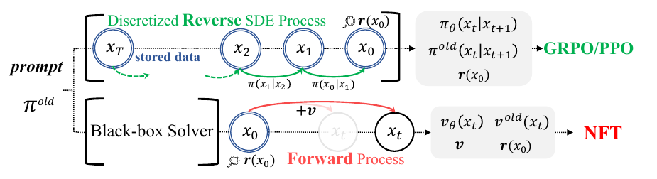
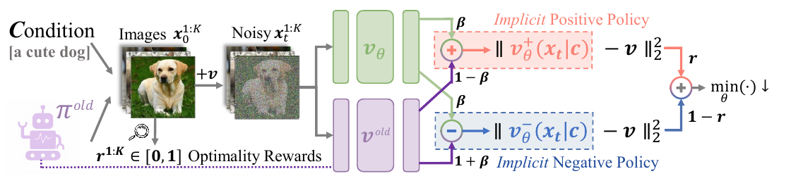
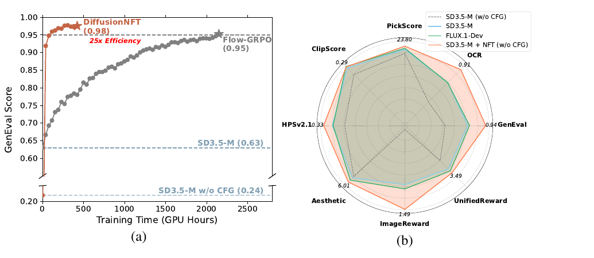
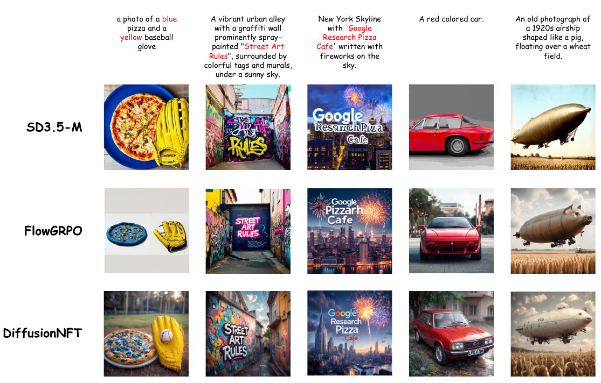
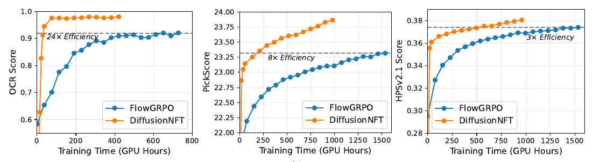
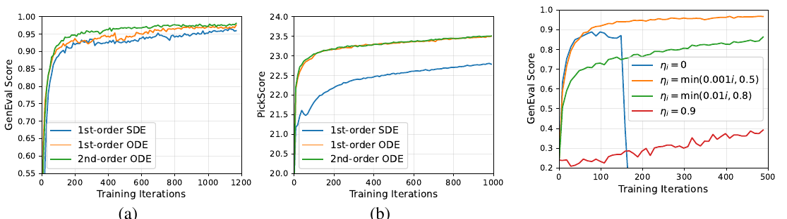
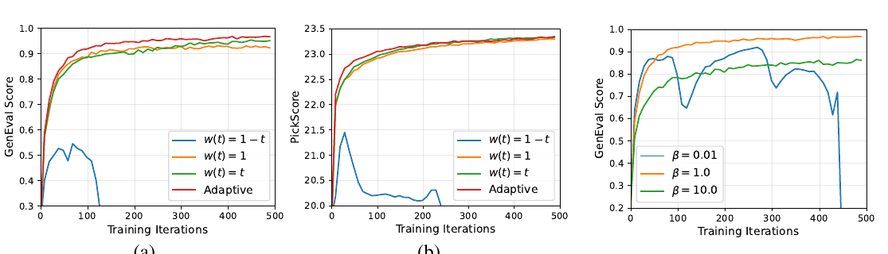

# DiffusionNFT: Online Diffusion Reinforcement with Forward Process

> Kaiwen Zheng¹²*, Huayu Chen¹²*, Haotian Ye²³, Haoxiang Wang², Qinsheng Zhang², Kai Jiang¹, Hang Su¹, Stefano Ermon³, Jun Zhu¹†, Ming-Yu Liu²  
> ¹清华大学 ²NVIDIA ³Stanford · **ICLR 2026** · [arXiv:2509.16117](https://arxiv.org/abs/2509.16117) · [project](https://research.nvidia.com/labs/dir/DiffusionNFT)

---

## 1. 一句话定位

**扩散模型有一个前向过程,却有无数个反向过程(不同采样器)——那为什么非要在反向过程上做 RL?**

DiffusionNFT 把 online RL 整个搬到**前向(加噪)过程**上:用 reward 把生成样本切成"正/负"两个隐式数据集,由此定义一个**对比式的改进方向 `Δ`**,再用一个**隐式参数化**技巧把这个方向直接烤进单个策略模型——训练目标就是**标准的 flow matching loss**,只是多了一支负样本。

结果是**四个包袱一次性全部卸掉**:不需要似然、不需要存轨迹、不限采样器、天然 off-policy。SD3.5-M 上 GenEval **0.24 → 0.98**(1k 步,全程 CFG-free),而 FlowGRPO 要 5k+ 步且要开 CFG 才到 0.95。

📌 **这篇是仓库里 RL 那一簇的关键拼图**——已经被 9 篇笔记引用却一直没有专篇。[RVM](../../video_generation/rvm/analysis.md) 证明它是自己框架的特例,[Self-OPD](../self_opd/analysis.md)、[Flow-OPD](../flow_opd/analysis.md)、[DiffusionOPSD](../diffusion_opsd/analysis.md) 都拿它当主要对照。

---

## 2. 要解决的问题

Policy gradient 假设模型似然可精确计算。**自回归模型成立,扩散模型天然不成立**——似然只能靠昂贵的概率流 ODE 或 SDE 的变分界去近似。

[Flow-GRPO](../flow_grpo/analysis.md) 那条线的绕法是**把反向采样过程离散化**,让相邻步之间的转移变成可解析的高斯,于是 GRPO 能直接套用。但论文指出这条路有**三个根本性缺陷**:

| 缺陷 | 具体含义 |
|---|---|
| **① Forward inconsistency**(前向不一致) | 只盯着反向采样过程,就**破坏了对前向扩散过程的遵守**,模型有退化成"级联高斯"的风险 |
| **② Solver restriction**(采样器受限) | 数据收集被绑死在**一阶 SDE 采样器**上,用不了 flow 模型默认的 ODE 或高阶 solver——而后者恰恰是生成效率的关键 |
| **③ 复杂的 CFG 集成** | 扩散模型严重依赖 CFG,而 CFG 要同时训条件和无条件两个模型,导致后训练变成**一个别扭且低效的双模型优化** |

论文由此提出全文的核心问题:

> **一个扩散策略只有一个前向(加噪)过程,却有多个反向(去噪)过程(不同采样器)。那么——能不能在前向过程上做 RL,而不是反向?**

> **Fig 2 逐行解读**:这张图把两条路线的**数据流差异**画得非常直白。
>
> **上半(GRPO/PPO 路线)**——标题是绿色的 `Discretized **Reverse** SDE Process`。从 `x_T` 开始,经 `x_2 → x_1 → x_0` 一路去噪,**每一步之间都标着转移概率** `π(x_1|x_2)`、`π(x_0|x_1)`,而且左边有一条绿色虚线注明 **`stored data`** —— **整条轨迹都得存下来**。右侧灰框里列出它需要的量:`π_θ(x_t|x_{t+1})`、`π_old(x_t|x_{t+1})`、`r(x_0)` —— 也就是**两个策略在每一步的转移似然**。
>
> **下半(NFT 路线)**——左边是一个 **`Black-box Solver`** 方框(强调"任意采样器都行"),它**只吐出一个 `x_0`**。然后一条**红色箭头 `+v`** 把 `x_0` 沿 **`Forward Process`** 推到 `x_t`——注意中间那个 `x_t` 是**灰色虚化**的,表示轨迹上的中间态**根本不需要**。右侧灰框里需要的量只有:`v_θ(x_t)`、`v_old(x_t)`、`v`、`r(x_0)` —— **全是速度,没有一个似然**。
>
> **两行对比的三个信息**:① 上面存整条轨迹,下面只存一张干净图;② 上面的 solver 被锁死(必须能算转移概率),下面是黑盒;③ 上面要似然,下面只要速度。

---

## 3. 核心方法

### 3.1 问题设定：把连续 reward 变成"正/负"二元划分

给定预训练策略 `π_old` 和 prompt 集。每次迭代对 prompt `c` 采 `K` 张图,用标量 reward `r ∈ [0,1]` 打分——**把它解释成"最优性概率"** `r(x_0, c) := p(o=1 | x_0, c)`。

📌 **这一步是全文的枢纽**:它把连续 reward 变成了一个**二元划分的桥梁**。收集到的数据可以被随机切成两个**想象中的**子集——一张图以概率 `r` 落进正集 `D+`,否则落进负集 `D−`。样本无限时,这两个子集的底层分布分别是:

$$
\pi^{+}(x_0 \mid c) = \frac{r(x_0,c)}{p_{\pi^{\mathrm{old}}}(o=1\mid c)}\,\pi^{\mathrm{old}}(x_0\mid c), \qquad
\pi^{-}(x_0 \mid c) = \frac{1 - r(x_0,c)}{1 - p_{\pi^{\mathrm{old}}}(o=1\mid c)}\,\pi^{\mathrm{old}}(x_0\mid c)
$$

**可以证明 `π⁺ ≻ π_old ≻ π⁻` 恒成立**(`≻` 表示期望 reward 更高)。

所以最直接的改进就是取 `π* = π⁺`——这正是 **Rejection FineTuning (RFT)** 的做法:**只在 `D+` 上训**。

⚠️ **但论文的立场是负反馈不可或缺**,而且在扩散上尤其如此。脚注写得很直接:**"We find that finetuning only on the positive data leads to collapse"**(§4.4 有实验)。这与 LLM 那边形成对比——在 LLM 里 RFT 仍是很强的 baseline。

### 3.2 Reinforcement Guidance：改进方向 Δ

不把 `π⁺` 当成优化终点,而是**用正负两边共同导出一个改进方向 `Δ`**。训练目标定义成:

$$
v^{*}(x_t, c, t) := v^{\mathrm{old}}(x_t, c, t) + \frac{1}{\beta}\,\Delta(x_t, c, t)
$$

📌 **这个式子形式上就是 CFG**——`Δ` 称作 **reinforcement guidance**,`1/β` 是 **guidance strength**。论文后面会把这个类比用到底(见 §3.4 的 CFG-free 讨论)。

**Theorem 3.1(Improvement Direction)** 给出了 `Δ` 的具体形式——关键在于**正方向和负方向是成比例的**:

$$
\Delta := \big[1-\alpha(x_t)\big]\big[v^{\mathrm{old}} - v^{-}\big] = \alpha(x_t)\big[v^{+} - v^{\mathrm{old}}\big]
$$

其中系数

$$
\alpha(x_t) := \frac{\pi_t^{+}(x_t\mid c)}{\pi_t^{\mathrm{old}}(x_t\mid c)}\,\mathbb{E}_{\pi^{\mathrm{old}}(x_0\mid c)}\,r(x_0,c) \;\in [0,1]
$$

**这个等式的意义**:"从 `v_old` 推向 `v⁺`"和"从 `v⁻` 推离"是**同一个方向的两种度量**。于是取 `β = α(x_t)` 就精确地得到 `v* = v⁺`,即 `π* = π⁺ ≻ π_old`,**改进有保证**。

### 3.3 隐式参数化：一个模型同时扮演正负两支

有了目标 `v*`,怎么直接优化 `v_θ → v*`?这里是全文最巧的一步。

> **Fig 4 逐区域解读**:
>
> **左侧(数据侧)**——条件 `[a cute dog]` + `π_old` 机器人图标 → 生成 `Images x_0^{1:K}`(一只金毛),下方标 **`r^{1:K} ∈ [0,1] Optimality Rewards`**。中间一条 `+v` 箭头把干净图**前向加噪**成 `Noisy x_t^{1:K}`(噪声化的狗)。
>
> **中间(两个模型)**——绿色的 `v_θ`(可训练)和紫色的 `v_old`(冻结),**同一个 `x_t` 同时喂给两者**。
>
> **右侧(两支对偶目标)**——这是重点:
> - **上支(红框,Implicit Positive Policy)**:`v_θ` 乘 **`β`**、`v_old` 乘 **`1−β`**,相加得到 `v_θ⁺`,再算 `‖v_θ⁺(x_t|c) − v‖²`,**乘以权重 `r`**。
> - **下支(蓝框,Implicit Negative Policy)**:`v_θ` 乘 **`−β`**、`v_old` 乘 **`1+β`**,相加得到 `v_θ⁻`,再算 `‖v_θ⁻(x_t|c) − v‖²`,**乘以权重 `1−r`**。
> - 两支在最右侧汇合成 `min(·) ↓ θ`。
>
> 📌 **注意 `v_θ` 在两支里的符号是相反的(`+β` vs `−β`)**——这就是"负样本推开"的全部机制。而且**只有一个可训练模型**:不是训两个独立的 `v_θ⁺` 和 `v_θ⁻`,而是让它们都**由同一个 `v_θ` 与冻结的 `v_old` 线性组合而成**。

**Theorem 3.2(Policy Optimization)** 的目标函数:

$$
\mathcal{L}(\theta) = \mathbb{E}_{c,\,\pi^{\mathrm{old}}(x_0|c),\,t}\left[\, r\big\lVert v_\theta^{+}(x_t,c,t) - v\big\rVert_2^2 + (1-r)\big\lVert v_\theta^{-}(x_t,c,t) - v\big\rVert_2^2 \,\right]
$$

$$
v_\theta^{+} := (1-\beta)v^{\mathrm{old}} + \beta v_\theta, \qquad v_\theta^{-} := (1+\beta)v^{\mathrm{old}} - \beta v_\theta
$$

**在无限数据和模型容量下,最优解是**

$$
v_{\theta^{*}}(x_t,c,t) = v^{\mathrm{old}}(x_t,c,t) + \frac{2}{\beta}\,\Delta(x_t,c,t)
$$

也就是说:**优化这个纯监督式目标,收敛点自动就是"沿改进方向走了 `2/β` 步"的策略**。不需要 policy gradient、不需要 importance ratio、不需要 clipping。

### 3.4 四条由此白拿的好处

论文把优势拆成四条,每条都直接对应 §2 的某个缺陷:

**① Forward Consistency。** 定义的是**前向过程上的标准扩散 loss**,所以模型的概率密度始终满足 Fokker-Planck 方程——**`x_t` 与 `x_0` 通过联合分布 `π_θ(x_t,x_0) = π_θ(x_0)π_{t|0}(x_t|x_0)` 正确耦合**。反向过程 RL 没有这个保证。

**② Solver Flexibility。** 训练与采样**完全解耦** → 数据收集可以用**任意黑盒 solver**(包括高阶 ODE),而且**只需要存干净图 + reward,不用存轨迹**。

**③ Implicit Guidance Integration。** 直觉上是"定义一个 guidance 方向再施加到 `v_old` 上",但**不学一个独立的 `Δ_θ` 再做 guided sampling**,而是用隐式参数化**把 reinforcement guidance 直接烤进被学的那个策略里**——这对 online RL 是关键,因为可以在**单个策略模型**上持续迭代。

**④ Likelihood-Free。** 完全绕过似然近似,因此没有那些方法固有的系统性估计偏差。

📌 **另外它是原生 off-policy 的**:采样策略 `π_old` 与训练策略 `π_θ` 天然解耦,**不需要 importance sampling**。

### 3.5 CFG 的重新解释

论文对 CFG 的理解值得单独记:

> 把 **CFG 解释成一种离线形式的 reinforcement guidance**(Eq.4)——**条件模型对应正信号,无条件模型对应负信号**。

既然 DiffusionNFT 已经在做在线的 reinforcement guidance,那 CFG 就是多余的。于是**全程丢掉 CFG,策略只用条件模型初始化**。

⚠️ 代价是初始化点差很多:CFG-free 的 SD3.5-M GenEval 只有 **0.24**(带 CFG 是 0.63)。但论文观察到性能会**迅速反超 CFG 基线**——**CFG 的功能可以被 RL 后训练学出来或替代掉**。

---

## 4. 实现细节（Algorithm 1）

四个设计选择,每个都影响实际能不能训起来:

**① Optimality Reward——把连续 reward 压成 `[0,1]`**

$$
r(x_0,c) := \frac{1}{2} + \frac{1}{2}\mathrm{clip}\!\left(\frac{r^{\mathrm{raw}}(x_0,c) - \mathbb{E}_{\pi^{\mathrm{old}}}r^{\mathrm{raw}}}{Z_c},\, -1,\, 1\right)
$$

组内均值用 `K` 个样本估计,`Z_c` 通常取全局 reward std。**注意这个映射把 `r=0.5` 定为"组内平均"**——所以 `r` 既是"最优性概率"也是"相对组内的好坏"。

**② Soft Update——EMA 更新采样策略**

因为是 off-policy,不必每轮硬更新 `π_old ← π_θ`,而是

$$
\theta^{\mathrm{old}} \leftarrow \eta_i\,\theta^{\mathrm{old}} + (1-\eta_i)\,\theta
$$

`η` 控制**学习速度与稳定性的权衡**:严格 on-policy(`η=0`)初期快但**极易灾难性崩溃**;接近离线(`η→1`)稳但慢得不实用。

**③ Adaptive Loss Weighting——借 DMD 的自归一化**

不手调 `w(t)`,而是把速度损失换成 `x_0` 空间的自归一化回归:

$$
w(t)\big\lVert v_\theta - v\big\rVert_2^2 \;\longleftarrow\; \frac{\big\lVert x_\theta(x_t,c,t) - x_0\big\rVert_2^2}{\mathrm{sg}\big(\mathrm{mean}\,\mathrm{abs}(x_\theta(x_t,c,t) - x_0)\big)}
$$

📌 **这个分母正是 DMD 的 normalizer**——仓库里 [TDM](../../inference_acceleration/tdm/analysis.md) 的 `weighting_factor` 是同一个东西。

**④ CFG-Free**——见 §3.5。

**超参(Appendix C)**:大部分对齐 FlowGRPO —— 每 epoch 48 组、group size **24**、LoRA `α=64 / r=32`、lr **3e-4**、SD3.5-M **512×512**。数据收集用**二阶 ODE sampler**,默认开自适应时间加权。单 reward 对比时固定 **10 步**采样以保证公平,多 reward 训练用 **40 步**保证数据质量;评测统一 **40 步一阶 ODE**。默认 `β=1`、`η_i = min(0.001i, 0.5)`;OCR 因为 reward 100 步内就冲到 1 但不稳,改用更保守的 `η_max = 0.999`。

---

## 5. 实验结果

### 5.1 多 reward 联合训练（Table 1）

从 **CFG-free** 的 SD3.5-M 出发,联合优化 GenEval、OCR、PickScore、ClipScore、HPSv2.1 五个 reward;**域外**评测用 Aesthetic、ImageReward、UnifiedReward。

| 模型 | #Iter | GenEval | OCR | PickScore | ClipScore | HPSv2.1 | Aesthetic | ImgRwd | UniRwd |
|---|---|---|---|---|---|---|---|---|---|
| SD-XL‡ | — | 0.55 | 0.14 | 22.42 | 0.287 | 0.280 | 5.60 | 0.76 | 2.93 |
| SD3.5-L‡(8B) | — | 0.71 | 0.68 | 22.91 | 0.289 | 0.288 | 5.50 | 0.96 | 3.25 |
| FLUX.1-Dev(12B) | — | 0.66 | 0.59 | 22.84 | 0.295 | 0.274 | 5.71 | 0.96 | 3.27 |
| **SD3.5-M(w/o CFG)** | — | **0.24** | 0.12 | 20.51 | 0.237 | 0.204 | 5.13 | −0.58 | 2.02 |
| + CFG | — | 0.63 | 0.59 | 22.34 | 0.285 | 0.279 | 5.36 | 0.85 | 3.03 |
| + FlowGRPO† | >5k | **0.95** | 0.66 | 22.51 | 0.293 | 0.274 | 5.32 | 1.06 | 3.18 |
| **+ Ours** | **1.7k** | 0.94 | **0.91** | **23.80** | 0.293 | **0.331** | **6.01** | **1.49** | **3.49** |

**一个 2.5B 的 CFG-free 模型,在多数指标上打过了带 CFG 的 SD3.5-L(8B)和 FLUX.1-Dev(12B)。**

> **Fig 1 逐面板解读**:
>
> **(a) 与 FlowGRPO 在 GenEval 上的正面对比**——横轴 **Training Time (GPU Hours)**,纵轴 GenEval Score。**橙红曲线(DiffusionNFT)在极左侧就冲到 0.98**,标注 `25x Efficiency`;**灰色曲线(FlowGRPO)一路缓慢爬到约 2500 GPU-h 才到 0.95**。底下两条虚线是 `SD3.5-M (0.63)`(带 CFG)和 `SD3.5-M w/o CFG (0.24)`。
>
> ⚠️ **注意纵轴在 0.20–0.60 之间做了截断**(图上有断轴标记),所以视觉上的陡峭程度被放大了。
>
> **(b) 八维雷达图**——四条线:**灰虚线** `SD3.5-M (w/o CFG)`(最内,形状很扭曲)、**蓝线** `SD3.5-M`(带 CFG)、**绿线** `FLUX.1-Dev`、**橙线** `SD3.5-M + NFT (w/o CFG)`。蓝线与绿线**几乎完全重合**(2.5B 带 CFG ≈ 12B 的 FLUX),而**橙线在八个维度上都是最外层包络**,标注值 PickScore 23.80 / OCR 0.91 / GenEval 0.94 / UnifiedReward 3.49 / ImageReward 1.49 / Aesthetic 6.01 / HPSv2.1 0.33 / ClipScore 0.29。
>
> 📌 **这张图的真正卖点不是"分高",而是"CFG-free 却更高"**:推理时省掉 CFG = **省一半 NFE**,而分数反而超过带 CFG 的更大模型。

> **Fig 5 逐列解读**:五列 prompt(取自 GenEval / OCR / DrawBench),三行 SD3.5-M / FlowGRPO / **DiffusionNFT**。**我按图逐列核对如下,论文的优势并非每列都成立**。
>
> - **列 1(蓝披萨 + 黄棒球手套)**——考属性绑定。SD3.5-M 披萨是**正常颜色**(蓝的是盘子,属性绑错);FlowGRPO 蓝披萨 + 黄手套都对,但画面**扁平白底、像剪贴画拼贴**;**DiffusionNFT 属性对且有户外景深和真实光影**。✅ 优势成立。
> - **列 2("Street Art Rules" 涂鸦墙)**——三者都写对了字。FlowGRPO 把巷道**塌成一条暗色隧道 + 一块发光招牌**;DiffusionNFT 保住了 prompt 要的"colorful tags and murals, sunny sky"。✅ 优势成立。
> - **列 3("Google Research Pizza Cafe" + 烟花)**——SD3.5-M 写成 "Google ResearchPizza Cafe"(粘连);**FlowGRPO 直接写错成 "Google Pizzarh Cafe",丢了 "Research"**;DiffusionNFT 写出 "Google Research Pizza"(Cafe 较淡)。✅ 优势成立,且这里 FlowGRPO 是三者最差。
> - **列 4(红色汽车)**——⚠️ **这一列 FlowGRPO 并不差**:它有完整的街道背景;反而是 **SD3.5-M 才是纯灰影棚背景**。DiffusionNFT 与 FlowGRPO 在这列**难分高下**。
> - **列 5(1920 年代猪形飞艇)**——⚠️ **这一列 FlowGRPO 反而更贴 prompt**:它的飞艇有**清晰的猪头和猪耳**;DiffusionNFT 的飞艇猪形特征弱得多,更像普通飞艇。
>
> 📌 **真实的横向结论**:FlowGRPO 的失效模式集中在**"背景退化成纯色/单调平面"(列 1、2)和文字拼写(列 3)**,这与 [Flow-GRPO 笔记](../flow_grpo/analysis.md)里说的"reward hacking 表现为画质塌"一致。但**列 4、5 说明这不是普遍现象**——挑图有选择性,不宜据此下"全面胜出"的结论。

### 5.2 单 reward 正面对比（Fig 6）

> **Fig 6 逐面板解读**:三个子图,横轴统一是 **Training Time (GPU Hours)**,蓝色 FlowGRPO / 橙色 DiffusionNFT。
>
> 每张图上都有一条**灰色虚线 = FlowGRPO 的最终收敛值**,加速比就是"两条曲线各自穿过这条线的 GPU-h 之比"。
> - **(a) OCR**——虚线在 ≈0.92。橙线**约 30 GPU-h 就穿过**并继续爬到 0.98;蓝线要 **≈700 GPU-h**。标注 **`24× Efficiency`**。
> - **(b) PickScore**——虚线在 ≈23.30。橙线 **≈190 GPU-h** 穿过并升到 23.87;蓝线到 **≈1500 GPU-h** 才够。标注 **`8× Efficiency`**。
> - **(c) HPSv2.1**——虚线在 ≈0.375。橙线 **≈450 GPU-h** 穿过并升到 0.381;蓝线 **≈1350 GPU-h**。标注 **`3× Efficiency`**。
>
> 📌 **三张图的加速比差异很大(24× / 8× / 3×)**,论文摘要只说"up to 25×"。**加速幅度与 reward 类型强相关**:规则型 reward(OCR)提升最猛,人类偏好型(HPSv2.1)最温和。

**附录 Table 2** 给了单 reward 训练的完整八项评测,里面有一条值得注意的负面结果:

| 模型 | #Iter | GenEval | OCR | PickScore | HPSv2.1 | Aesthetic |
|---|---|---|---|---|---|---|
| SD3.5-M(w/o CFG) | — | 0.24 | 0.12 | 20.51 | 0.204 | 5.13 |
| + FlowGRPO(GenEval) | 4k | 0.97 | 0.30 | 21.78 | 0.248 | 5.15 |
| **+ Ours(GenEval)** | **1k** | **0.98** | 0.36 | 21.92 | 0.251 | 5.33 |
| + FlowGRPO(OCR) | 1k | 0.66 | 0.96 | 21.94 | 0.257 | 5.18 |
| **+ Ours(OCR)** | **150** | 0.54 | **0.97** | 21.63 | 0.246 | 5.19 |
| + FlowGRPO(PickScore) | 4k | 0.54 | 0.60 | 23.62 | 0.295 | 6.42 |
| **+ Ours(PickScore)** | **2k** | 0.53 | 0.64 | **24.03** | **0.315** | 6.17 |

⚠️ **单 reward 训练的跷跷板在两边都存在**:OCR 训练把 GenEval 从 0.24 拉到 0.54/0.66 但**远不如专门训 GenEval**;而且 caption 明说 **"training exclusively on the OCR reward impairs generalization to other metrics; to compensate, we enable CFG when evaluating non-OCR rewards for OCR-trained models"** —— **为了补偿泛化损失,评测时把 CFG 开回来了**,这与"全程 CFG-free"的主张有张力。

### 5.3 消融（Fig 7–10）

> **Fig 7(左两格)——数据收集用什么采样器**:三条线 **蓝=1st-order SDE / 橙=1st-order ODE / 绿=2nd-order ODE**。
> - **(a) GenEval**:绿(二阶 ODE)≈0.98 最高,橙(一阶 ODE)≈0.97,**蓝(SDE)≈0.96 且曲线明显更抖**。差距不算大,但方向一致。
> - **(b) PickScore**:差距拉开——橙绿两条 ODE **几乎完全重合**收在 23.5,而**蓝(SDE)一路低约 0.7 分**,1000 步只到 22.8 且仍未收敛。论文的解释是 **PickScore 对噪声敏感**。
>
> 📌 **这组消融是"solver flexibility"这条卖点的直接兑现**:FlowGRPO 被结构性地锁死在一阶 SDE 上,而这里显示 SDE 恰恰是三个选项里最差的那个。
>
> **Fig 8(右一格)——soft update 策略**:四条 `η` 曲线。
> - **`η_i = 0`(严格 on-policy,蓝线)**:初期最快,130 步冲到 0.87,但随即在**约 160 步断崖式崩塌**到 0.25 附近再也起不来。
> - **`η_i = 0.9`(红线,接近离线)**:**几乎学不动**,500 步还在 0.25~0.40 之间爬。
> - **`η_i = min(0.01i, 0.8)`(绿线)**:稳,但 500 步只到 0.87。
> - **`η_i = min(0.001i, 0.5)`(橙线)**:**又快又稳**,平滑升到 0.97——论文采用的方案。
>
> 结论:**从小 `η` 起步、随迭代逐渐增大并封顶**,在收敛速度与稳定性之间取得平衡。两个极端(纯 on-policy 崩、纯离线不动)都不可用。

> **Fig 9(左两格)——时间加权策略**:四条线 `w(t)=1−t` / `w(t)=1` / `w(t)=t` / `Adaptive`。
> - **`w(t) = 1−t`(蓝线)在两个任务上都直接崩溃**——GenEval 上 120 步就跌到 0,PickScore 上一路在 20 附近震荡。
> - `w(t)=1`、`w(t)=t`、`Adaptive` 三者接近,**Adaptive(红线)始终略优**。
>
> 📌 **这里有个可操作的经验**:`w(t)=1−t` 是给**小 `t`(低噪声)** 更高权重,而它崩了;反过来给**大 `t`(高噪声)** 更高权重才稳。论文的原话是 "stability improves when the flow-matching loss is given higher weight at larger t"。
>
> **Fig 10(右一格)——guidance 强度 `β`**:三条线 `β=0.01` / `1.0` / `10.0`。
> - **`β=0.01`(蓝线)**:前期爬得快,但**震荡剧烈**,在约 450 步**彻底崩塌**跌到 0.2 以下。
> - **`β=1.0`(橙线)**:**最稳最高**,平滑升到 0.97。
> - **`β=10.0`(绿线)**:稳但明显更低,收在 0.87。
>
> 结论:`β` 在 1 附近稳定,实践中取 **1 或 0.1**(后者换更快的 reward 上升)。

**最重要的一条消融没有图,只有一句话**:

> **Negative Loss.** 去掉 `v_θ⁻` 那一支的负策略损失后,**"rewards collapse almost instantly during online training"**。

📌 **论文特意指出这与 LLM 的观察相反**——在 LLM 里 RFT(只用正样本)仍是很强的 baseline,而在扩散上只用正样本会直接崩。**这是"negative-aware"这个名字的全部理由**,可惜没有给曲线。

---

## 6. 争议与权衡

**① "25× 效率"是三个任务里的最大值,不是普遍水平。** Fig 6 里三个任务分别是 **24× / 8× / 3×**,而摘要和标题反复出现的是 25×。加速幅度与 reward 类型强相关:规则型(OCR、GenEval)最猛,人类偏好型(HPSv2.1)只有 3×。**对做偏好对齐的人,3× 才是更相关的数字。**

**② 起点不公平地低,放大了曲线的观感。** DiffusionNFT 从 **CFG-free 的 0.24** 出发,FlowGRPO 的对照曲线也从同一起点开始(Table 2 注明"both initialized from CFG-free base model"),这点是公平的。**但 Fig 1(a) 的纵轴在 0.20–0.60 之间断轴**,再加上"0.24 → 0.98"这个跨度本身就比"0.63 → 0.95"大,视觉冲击被放大了。

**③ OCR 那一行自己破了 CFG-free 的规矩。** Table 2 的 caption 明说:单独训 OCR 会损害其它指标的泛化,**"to compensate this, we enable CFG when evaluating non-OCR rewards for OCR-trained models"**。也就是说**评测时把 CFG 开回来了**。这与全文"deliberately operates in a CFG-free setting"的主张直接冲突,而且只在附录 caption 里交代。

**④ 最关键的消融没有图。** "去掉负损失会瞬间崩溃"是 **negative-aware 这个核心设计的唯一证据**,却只有一句文字描述,**没有曲线、没有数字**。相比之下 sampler / soft-update / weighting / β 四个次要设计都有完整曲线。

**⑤ reward 与评测指标同源的问题依然存在。** GenEval 打分器即 reward、OCR reward 即 metric、PickScore 既是 reward 又是评测列——这一点与 [Flow-GRPO](../flow_grpo/analysis.md) 完全一样,**论文没有提供额外的独立评测轴**(没有 T2I-CompBench++、没有用户研究)。Table 1 里域外的三项(Aesthetic / ImageReward / UnifiedReward)算是部分缓解,但它们与 PickScore/HPSv2.1 在训练目标上高度相关。

**⑥ `α(x_t)` 是不可计算的。** Theorem 3.1 里的 `α(x_t) = (π_t⁺/π_t^old)·E[r]` **包含两个边际密度的比值**——这正是全文极力避免的那类量。论文的处理是:**不去估计它,而是把 `β` 当超参调**。这在工程上完全合理(Fig 10 显示 `β≈1` 稳定),**但意味着"改进有保证"这个理论结论只在 `β = α(x_t)` 时成立,而实际训练时并不成立**。论文对这个落差没有讨论。

**⑦ 最优解是 `v_old + (2/β)Δ` 而不是 `v_old + (1/β)Δ`。** Theorem 3.2 的结论比 Eq.(3) 的定义多了个因子 2。论文没有解释这个 2 从哪来、以及它对"改进保证"的影响。虽然只是常数(会被 `β` 吸收),但两处定义不一致会让读者对着推导发懵。

**⑧ 只在 SD3.5-M / 512×512 / T2I 上验证。** 没有更大 backbone、没有更高分辨率、**没有视频**。而 RL 后训练在视频上的难点(rollout 更贵、多 reward 冲突)恰恰是最需要"高效率"的场景。

**⑨ Fig 5 的定性对比是挑过的。** 我逐列核对后发现:五列里有两列(红色汽车、猪形飞艇)FlowGRPO **并不比 DiffusionNFT 差**,猪形飞艇那列 FlowGRPO 的 prompt 遵循甚至更好。真正成立的优势集中在**背景退化**(列 1、2)和**文字拼写**(列 3)。论文没有给失败案例。

**⑩ 正面:理论与工程的对应关系非常干净。** §2 列的三个缺陷(前向不一致 / solver 受限 / CFG 复杂)在 §3.4 被逐条对应地解掉,而且**每一条都有实验支撑**——solver flexibility 有 Fig 7(且证明 SDE 确实最差)、CFG-free 有 Fig 1、forward consistency 有理论论证。这种"问题—方案—验证"的一一对应在这类论文里不常见。

**⑪ 正面:附录 B.1 顺手澄清了 Flow-GRPO 的一个"未解释超参"。** FlowGRPO 的 `g_t = a√(t/(1−t))` 里那个 `a` 一直没解释来源;本文从标准扩散 SDE 出发推出 `g_t = λ_t√(2t/(1−t))`,**指出 `a = √2·λ_t` 只是插值参数 `λ_t ∈ [0,1]` 的缩放版,`a = √2` 对应最大方差 SDE**。顺带指出 DanceGRPO 用固定方差"在图像模型上更差、在视频模型上更稳"。这段对读 Flow-GRPO 很有帮助。

---

## 7. 一句话总结

DiffusionNFT 的洞察是**"扩散模型只有一个前向过程,却有无数个反向过程——那 RL 就该做在前向上"**:用 reward 当最优性概率把生成样本切成隐式正负两集,由 Theorem 3.1 得到一个正负成比例的改进方向 `Δ`,再用**隐式参数化**(让 `v_θ` 以 `+β` 和 `−β` 两种符号同时扮演正负策略)把这个方向直接烤进单个模型——于是训练目标退化成**带负样本分支的标准 flow matching loss**,似然、轨迹存储、采样器限制、CFG 双模型四个包袱一次卸干净;代价是理论保证依赖一个不可计算的 `α(x_t)`(实际靠调 `β` 替代),而"25×"是三个任务里的最好情况(另两个是 8× 和 3×)。

---

## Q&A

**Q: "在前向过程上做 RL"到底是什么意思?**

A: **意思是训练损失定义在"加噪"这个方向上,而不是"去噪"那个方向上。**

对照着看最清楚(Fig 2):

| | 反向过程 RL(GRPO 系) | **前向过程 RL(NFT)** |
|---|---|---|
| 训练信号定义在 | 相邻去噪步的**转移概率** `π(x_{t−1}\|x_t)` | 加噪后的**速度回归** `‖v_θ(x_t) − v‖²` |
| 需要什么数据 | **整条采样轨迹** | **一张干净图 `x_0` + 它的 reward** |
| 采样器 | 必须是能算转移概率的**一阶 SDE** | **任意黑盒**(包括高阶 ODE) |
| 与预训练目标的关系 | 不同(是 RL 目标) | **完全相同**(就是 flow matching loss) |

**关键在于"前向过程只有一个"**:`x_t = α_t x_0 + σ_t ε` 是唯一确定的,而反向过程可以有无数种(DDIM、DPM-Solver、SDE、二阶……)。**把 RL 挂在唯一的那个上,自然就不受采样器约束了。**

副作用是**"forward consistency"**:因为损失就是标准扩散损失,模型的概率密度始终满足 Fokker-Planck 方程,`x_t` 与 `x_0` 保持正确耦合。而只优化反向转移的方法,论文警告有**退化成"级联高斯"**的风险——即模型学会了每一步的转移,但这些转移拼起来不对应任何合法的扩散过程。

---

**Q: 隐式参数化到底巧在哪?为什么不直接训两个模型?**

A: **因为 online RL 需要在单个策略上持续迭代,而"两个模型 + guided sampling"没法迭代。**

朴素做法是:学一个 guidance 模型 `Δ_θ`,采样时用 `v_old + (1/β)Δ_θ` 做 guided sampling。问题是:

1. **推理要跑两个模型**(像 CFG 一样),成本翻倍;
2. **更致命的是没法迭代**——下一轮 RL 时,`π_old` 应该是"`v_old + guidance`"这个组合策略,但它不是一个单一模型,没法当作新的初始化。

隐式参数化的做法是**把组合关系写进 loss 而不是写进推理**:

$$
v_\theta^{+} := (1-\beta)v^{\mathrm{old}} + \beta v_\theta, \qquad v_\theta^{-} := (1+\beta)v^{\mathrm{old}} - \beta v_\theta
$$

训练时用这两个**组合量**去拟合速度目标,但**梯度只流向 `v_θ`**。收敛后 `v_θ` 本身就是 `v_old + (2/β)Δ`——**guidance 已经烤进权重里了,推理时只有一个模型、不需要任何 guidance**。

📌 注意 `v_θ` 在两支里的系数是 **`+β` 和 `−β`**。所以正样本把 `v_θ` 往 `v` 拉的同时,负样本把 `v_θ` 往 `v` 的**反方向**推——**同一个模型,同一个 batch,一正一反**。

---

**Q: 为什么扩散上只用正样本会崩,而 LLM 上 RFT 却是强 baseline?**

A: **论文明确指出了这个反差,但没有给出机制解释——这是它留下的一个开放问题。**

事实层面:
- 论文脚注:"We find that finetuning only on the positive data leads to collapse"
- §4.4:去掉 `v_θ⁻` 那一支后,**"rewards collapse almost instantly during online training"**
- 并注明:"This phenomenon is divergent from observations in LLMs, where RFT remains a strong baseline"

⚠️ **但这条最重要的消融只有文字、没有曲线**(而次要的 sampler/β/weighting 都有完整图),证据强度是全文最弱的一环。

我的猜测(**论文没说**):扩散的输出空间是连续高维的,只用正样本做回归相当于**无约束地往高 reward 区域塌缩**——没有任何力量阻止它退化到少数几个模式;而 LLM 的输出受词表和语言先验约束,塌缩空间小得多。负样本项在这里起的是**排斥/支撑**作用,类似 [Self-OPD](../self_opd/analysis.md) 里的 push 项和 [RVM](../../video_generation/rvm/analysis.md) 里 `r<0` 的推开机制。**三篇论文都独立发现负样本不可或缺,这个共识值得注意。**

---

**Q: 它和 RVM、Self-OPD、Flow-OPD 的关系是什么?**

A: **DiffusionNFT 是这几篇的共同参照点,而 RVM 证明了它是自己的特例。**

| | 与 DiffusionNFT 的关系 |
|---|---|
| [RVM](../../video_generation/rvm/analysis.md) | **证明 DiffusionNFT 是 RVM 的特例**:取 `v_anc =` EMA 速度、`r_rvm = 2r_nft − 1`、`β(r_rvm) = β̄ − r_rvm`,两者的 loss 只差与 θ 无关的常数。RVM 还从统一视角读出一个原论文看不到的性质——**DiffusionNFT 的 reach 把带符号 reward 除以了 `β̄`,所以 `2r_nft − 1 > β̄` 时回归目标会过冲到 `v^i` 之外** |
| [Self-OPD](../self_opd/analysis.md) | 同样是"正拉负推的速度回归",但**监督来自自参考 + 局部 SDE 分叉**而非全局 reward 划分;把 DiffusionNFT 列为 teacher-free 对照组 |
| [Flow-OPD](../flow_opd/analysis.md) | 用 QwenVL Score 论证 **DiffusionNFT 存在 reward hacking**(文字对了但手部畸形、纹理塑料感),4.05 vs 3.74 |
| [DiffusionOPSD](../diffusion_opsd/analysis.md) | 主要效率对照,声称比 DiffusionNFT 省 40%/63% GPU-hours |
| [Flow-GRPO](../flow_grpo/analysis.md) | **本文的主要攻击对象**;反过来本文附录 B.1 又澄清了 Flow-GRPO 那个"未解释的 `a`" |

📌 **一条清晰的脉络**:Flow-GRPO 打通链路(ODE→SDE + 闭式 KL)→ **DiffusionNFT 指出反向过程这条路本身有结构缺陷,把 RL 搬到前向** → RVM 进一步指出连"正负两支"这个形式都可以简化成单项 reward 加权回归,并证明 NFT/RAM 都是它的特例 → Self-OPD 则去掉 teacher、改用自参考分支。

**四篇共享的技术内核是同一个**:`v_θ` 减去一个 stop-gradient 的目标速度再取平方,差别只在那个目标怎么构造。

---

**Q: 想用它,最需要注意什么?**

A: **四个坑,前两个会直接让训练崩掉。**

1. **不能只训正样本。** 去掉负支会"almost instantly collapse"。这是硬性的。
2. **时间加权不能给低噪声端更高权重。** `w(t) = 1−t` 在两个任务上都崩了(Fig 9)。要么用 `w(t)=1`、`w(t)=t`,要么用论文的自适应方案(DMD 式自归一化)。
3. **`β` 取 1 左右。** `β=0.01` 会在 450 步崩塌,`β=10` 收敛点明显更低。论文实践取 **1 或 0.1**。
4. **`η` 要从小往大调。** 严格 on-policy(`η=0`)150 步就崩;`η=0.9` 太慢。用 `η_i = min(0.001i, 0.5)`;若 reward 上升过快(如 OCR),把 `η_max` 提到 0.999。

另外两条**白拿的好处**别浪费:

- **数据收集用二阶 ODE**,不要用 SDE(Fig 7 显示 SDE 在 PickScore 上差近 1 分)。
- **训练时就把 CFG 关掉**,推理也不用开——省一半 NFE,而分数反而更高。
