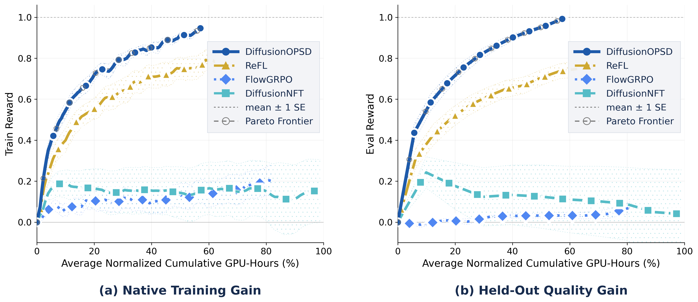
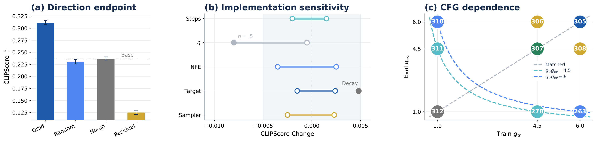
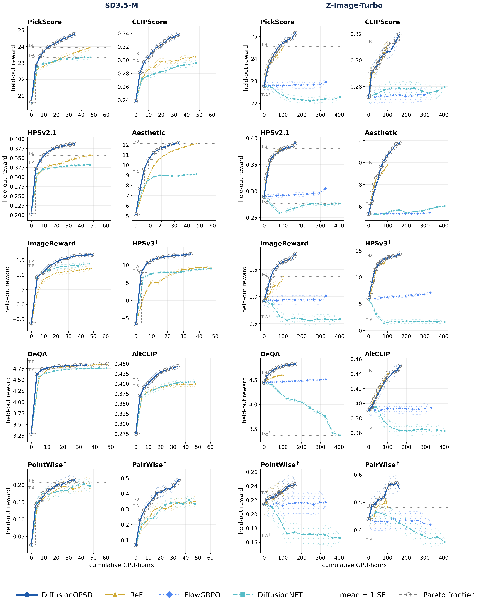

# DiffusionOPSD 阅读笔记

**论文**: On-Policy Self-Distillation in Diffusion Models  
**arXiv**: 2608.24646 | **GitHub**: https://github.com/worldbench/DiffusionOPSD  
**机构**: ByteDance Seed Vision Team + NUS + UC San Diego  
**时间**: 2026-08

---

## 1. 一句话定位

在扩散模型上做 on-policy RL 奖励对齐:用冻结的行为策略在线采样轨迹,在低噪声查询状态处沿奖励梯度方向构造有界正负目标(OPA),再用分离后的目标拟合当前策略。两阶段 pipeline 最后把三个单奖励 LoRA teacher 蒸馏成一个 Open3 student。19/20 个测试设置上好于所有 baseline。

---

## 2. 要解决的问题(动机)

现有扩散 RL 方法(ReFL、FlowGRPO、DiffusionNFT)的共性痛点:

| 问题 | 典型表现 |
|------|----------|
| **Off-policy query state** | 用前向加噪 `z_q = α*x_0 + σ*ε` 而非真实去噪轨迹上的中间状态;奖励梯度估计带有 stale-target bias |
| **梯度传播不稳** | 通过长轨迹反传奖励梯度,中间激活占显存且链式微分数值不稳 |
| **多奖励扩展成本高** | 每加一个奖励目标就要单独 RL,没有统一的合并机制 |

DiffusionOPSD 的核心主张:
- 用**on-policy rollout**的中间状态作 query,消除 off-policy bias;
- 构造好 `y+/y-` 后**彻底 detach**,策略拟合不通过奖励计算图;
- 用**Open3**把多个单奖励 LoRA 合并为一个 student,无需多奖励联合 RL。

---

## 3. 与前作关系

```
ReFL (2022)
  └── 直接对齐,前向加噪 query → off-policy
FlowGRPO (2025)
  └── group-relative policy optimization;仍 off-policy query
DiffusionNFT (2025)
  └── 近似 on-policy + trust-region;compute 基线(本文对比主要对手)
      └── DiffusionOPSD (2026)
          ├── 严格 on-policy EMA rollout query
          ├── 奖励梯度而非 residual 做方向(Grad 比 Residual 强)
          └── Open3 多奖励蒸馏(Stage 2)
```

---

## 4. 核心方法

### 4.1 整体流程

```
Outer loop (behavior policy refresh via EMA)
│
├── [Stage 1: DiffusionOPSD] × 100 updates
│   ├── 用冻结 v_old 跑完整 28-step rollout,拿轨迹中间状态 z_q (σ_q≈0.278)
│   ├── OPA: 计算锚点 y0 = z_q - σ_q * v_old
│   ├── 信任域奖励上升: y+ = TR_ascent(y0, reward, ρ=0.10, n=2)
│   ├── 信任域奖励下降: y- = TR_descent(y0, reward, ρ=0.10)
│   ├── 分离目标,用 MSE-like loss 拟合当前策略 v_θ → y+/y-
│   └── EMA 刷新 v_old
│
└── [Stage 2: Open3] × 300 updates (3 teacher LoRA → 1 student)
    └── 10-step flow ODE; 每步 transition_mean MSE 加权平均 3 个 teacher
```

### 4.2 OPA — On-Policy target 构造

**On-policy query state**

行为策略 `v_old`(EMA 冻结)跑 28-step Euler ODE,取第 `t_q` 步的中间潜变量 `z_q`。`σ_q = 0.278` 对应轨迹中段偏低噪声区域——奖励可计算(已接近 clean image),梯度方向可信。

**锚点 clean 输出**

$$
y_0 = z_q - \sigma_q \cdot v_{\text{old}}(z_q)
$$

即在 query 状态处,用冻结策略预测的 clean latent。

**信任域奖励上升 (n_ascent 步迭代)**

budget 限制到 `y0` 的 `ρ` 倍范数:

$$
\text{budget} = \rho \cdot \lVert y_0 \rVert_2, \quad \text{step} = \frac{\eta \cdot \text{budget}}{n_{\text{ascent}}}
$$

每步沿归一化梯度方向移动,并投影回球:

```
y ← y + step * (∂reward/∂y) / ‖∂reward/∂y‖
d ← y - y0
y ← y0 + d * clamp(budget / ‖d‖, max=1.0)
```

对应代码 `scripts/train_opsd_ri_sd3.py:265-307`。

负样本 `y-` 沿反方向(下降)做对称操作(`opa_dual_neg=1`)。

### 4.3 策略拟合损失

目标 `y+/y-` 构造完成后彻底 detach,不再通过奖励函数或解码器。

$$
v^{\text{pos}} = \beta \cdot v_\theta + (1-\beta) \cdot v_{\text{old}}, \quad y^{\text{pos}}_\theta = z_q - \sigma_q \cdot v^{\text{pos}}
$$

$$
v^{\text{neg}} = (1+\beta) \cdot v_{\text{old}} - \beta \cdot v_\theta, \quad y^{\text{neg}}_\theta = z_q - \sigma_q \cdot v^{\text{neg}}
$$

📌 `β` 控制当前策略在混合输出中的占比:正样本里 `v_θ` 占 `β`,负样本里 `v_θ` 贡献 `-β`(推离负目标方向)。`β=0.1` 时变化温和,不会让策略偏离行为策略过远。

归一化 MSE 损失(用绝对残差幅度做 per-pixel weight,防止某些维度主导):

$$
w^+ = \lVert y^{\text{pos}}_\theta - y^+ \rVert_1,\quad \mathcal{L}^+ = \frac{(y^{\text{pos}}_\theta - y^+)^2}{w^+ + \epsilon}
$$

$$
\mathcal{L}_{\text{OPA}} = r_1 \cdot \mathcal{L}^+ + (1-r_1) \cdot \mathcal{L}^-
$$

代码: `scripts/train_opsd_ri_sd3.py:1532-1575`。

### 4.4 Open3 — 多 teacher 流蒸馏 (Stage 2)

**为什么用 transition mean 而非 velocity**

直接对 `v_θ ≈ v_teacher` 做 MSE 等权对待每个 step;而不同 step 的 `dt` 不同,velocity 误差对 latent 轨迹的影响是 `O(dt²)`。Transition mean 用 `z + v * dt` 把 dt 正确加权进去。

$$
\text{transition\_mean}(z_t, v, \sigma_t, \sigma_{t-1}) = z_t + v \cdot (\sigma_{t-1} - \sigma_t)
$$

三个 teacher 对应三个奖励(如 PickScore、CLIPScore、HPSv2.1),student 做加权 MSE:

$$
\mathcal{L}_{\text{Open3}} = \frac{1}{3 \cdot T} \sum_{j=1}^{3} \sum_{t} w_j \cdot \lVert \text{tm}(z_t, v_\theta, \cdot) - \text{tm}(z_t, v_{j}, \cdot) \rVert_2^2
$$

T=10 步,梯度累积下 `/ (sum(w) * T * grad_accum)`。代码: `opd/opd_common.py`。

---

## 5. 关键代码位置

| 功能 | 文件 | 行号 |
|------|------|------|
| OPA 信任域奖励上升/下降 `_opa_tr_step` | `scripts/train_opsd_ri_sd3.py` | 265–307 |
| 主训练循环,rollout + OPA 组装 | `scripts/train_opsd_ri_sd3.py` | 1254–1580 |
| 策略拟合损失 `pos_loss / neg_loss` | `scripts/train_opsd_ri_sd3.py` | 1532–1575 |
| `flow_transition_mean` 和 Open3 loss | `opd/opd_common.py` | — |
| 默认超参 `SD35M_OPSD_DEFAULT` | `config/opsd_defaults.py` | — |

**`_opa_tr_step` 核心片段**

```python
# scripts/train_opsd_ri_sd3.py:265-307
budget = (rho * x0.flatten(1).norm(dim=1)).view(-1,1,1,1)
step_len = eta * budget / max(n_ascent, 1)
for _i in range(n_ascent):
    g = autograd.grad(reward.sum(), x)[0]      # 奖励梯度
    gn = g.flatten(1).norm(dim=1).view(-1,1,1,1) + 1e-12
    x = x.detach() + direction * step_len * (g / gn)
    d = x - x0
    dn = d.flatten(1).norm(dim=1).view(-1,1,1,1)
    x = (x0 + d * clamp(budget/(dn+1e-12), max=1.0)).detach()
```

**策略拟合损失核心片段**

```python
# scripts/train_opsd_ri_sd3.py:1532-1575
v_pos = config.beta * v_theta + (1 - config.beta) * v_old
v_neg = (1.0 + config.beta) * v_old - config.beta * v_theta
y_pos = zq - sig_q * v_pos
y_neg = zq - sig_q * v_neg
wf_p = abs(y_pos - y_plus).mean(dim=rd).clip(min=1e-5)
wf_n = abs(y_neg - y_minus).mean(dim=rd).clip(min=1e-5)
pos_loss = (accp * (y_pos - y_plus)**2 / wf_p).mean(dim=rd)
neg_loss = (accm * (y_neg - y_minus)**2 / wf_n).mean(dim=rd)
opa_policy = (r1 * pos_loss + (1-r1) * neg_loss).mean() * config.train.adv_clip_max
```

---

## 6. 关键超参

| 参数 | 默认值 | 含义 |
|------|--------|------|
| `opa_rho` | 0.10 | 信任域 budget = ρ·‖y0‖ |
| `opa_query_sigma` | 0.278 | query 状态噪声水平(轨迹中段) |
| `opa_n_ascent` | 2 | 信任域梯度步数 |
| `opa_eta` | 1.0 | step 放缩系数 |
| `opa_dual_neg` | 1 | 是否同时构造负样本 |
| `opa_cert` | 0 | 0=无验证快路径;1=DPM-2 后缀验证 |
| `opa_dir_mode` | `"grad"` | 方向端点:grad/random/residual/noop |
| `opa_state_mode` | `"rollout"` | query state 来源:rollout(on-policy) vs forward |
| `opa_target_mode` | `"replace"` | 精化目标策略:replace/aux |
| `beta` | 0.1 | 当前策略在混合输出中的占比 |
| `beta_open3` | 0.1 | Open3 蒸馏阶段 β |
| Stage 1 updates | 100 | 单奖励 RL 更新步数 |
| Stage 2 updates | 300 | Open3 蒸馏步数 |
| backbone | SD3.5-M / Z-Image-Turbo | 支持两种骨干 |

---

## 7. 实验结果与消融

### 7.1 主结果

10 个 held-out 奖励 × 2 backbone = 20 设置,DiffusionOPSD 在 **19/20** 上为最优。

计算效率对比(达到相同 held-out reward 的 GPU-hours):

| backbone | vs DiffusionNFT |
|----------|----------------|
| SD3.5-M | **−40%** GPU-hours |
| Z-Image-Turbo | **−63%** GPU-hours |



> **Fig 训练曲线逐图解读**:
>
> **(左) SD3.5-M backbone**——DiffusionOPSD(深蓝实线)在所有 10 个 held-out 奖励上最终值均高于或持平于 DiffusionNFT(青色)、FlowGRPO(黄色)和 ReFL(橙色)。横轴 cumulative GPU-hours 约 50,DiffusionOPSD 仅需 ~30 GPU-hours 达到 DiffusionNFT 的最终水平。
>
> **(右) Z-Image-Turbo backbone**——横轴 ~400 GPU-hours 下,DiffusionOPSD 在 100 GPU-hours 处即超过 DiffusionNFT 400 GPU-hours 的最终水平,节省约 63%。T-B = Training-Base,T-A = Training-Achieved 参考线。
>
> **关键结论**:on-policy rollout query 和 detached fitting 的组合让每次更新的信息利用率更高,无需更多计算就能更快收敛。

### 7.2 消融 — 方向端点



> **Fig 消融逐面板解读**:
>
> **(a) Direction endpoint**——四种方向对比,纵轴 CLIPScore。`Grad`(奖励梯度方向,蓝)远高于其他所有方向;`Random`(灰)和 `No-op`(深灰,保持 y0 不变)均接近 Base;`Residual`(棕,用 reward residual 近似)最差,说明精确梯度方向对 OPA 有效性至关重要,随机扰动等价于完全不 ascent。
>
> **(b) Implementation sensitivity**——对 Steps(ascent 步数)、η(step 放缩)、NFE(ODE 步数)、Target mode(replace vs aux)、Sampler 五个轴做 ±扰动,CLIPScore 变化幅度均在 ±0.005 以内(灰色参考线)。唯一显著的正向变化是 EMA Decay 增大。表明 OPA 对超参鲁棒,不需要精细调节。
>
> **(c) CFG dependence**——散点图中横轴为训练 CFG `g_tr`,纵轴为评估 CFG `g_ev`。颜色表示 PickScore 相对 baseline 变化幅度。最好结果集中在训练和评估 CFG 匹配(对角线附近)的区域(`g_tr = g_ev = 4.5` 或 `6.0`)。Train-eval CFG mismatch 会导致明显下降。

### 7.3 综合结果图



> **Fig held-out quality 逐行解读**:
>
> 5行×2组 = 10 个奖励指标(PickScore、CLIPScore、HPSv2.1、Aesthetic、ImageReward、HPSv3†、DeQA†、AltCLIP、PointWise†、PairWise†),横轴均为 cumulative GPU-hours。
>
> - **深蓝圆点** = DiffusionOPSD(本文);**黄三角** = ReFL;**蓝菱形** = FlowGRPO;**青方块** = DiffusionNFT。
> - SD3.5-M(左侧两列)横轴量级约 50 GPU-hours;Z-Image-Turbo(右侧两列)约 400 GPU-hours,后者训练成本更高但 DiffusionOPSD 优势更明显。
> - 带 `†` 的奖励(HPSv3、DeQA、PointWise、PairWise)在 T-A† 参考线上方表示"训练目标以外的 held-out 泛化"。
> - FlowGRPO 在 Z-Image-Turbo 上部分奖励随时间下降(过优化);DiffusionNFT 收敛慢;DiffusionOPSD 曲线上升快且不反弹。

---

## 8. 争议与权衡

| 维度 | 分析 |
|------|------|
| **on-policy 成本** | 每次 OPA 需要完整的 28-step rollout(行为策略推理),比 forward-noised query 多一个推理 pass。作者用 EMA + `opa_cert=0` 快路径控制开销 |
| **单步 query** | 只在 `t_q` 处构造目标,不是全轨迹 RL;理论上可能遗漏其他 timestep 的奖励信号 |
| **detach 的隐含假设** | 认为"拟合当前策略到 y+ 附近"等价于奖励上升,这需要 y+ 不超出分布。信任域 budget=ρ·‖y0‖ 正是为了保证这一点 |
| **Open3 蒸馏质量** | 三个 teacher 在同一 style 空间内的不同奖励方向可能有冲突,加权 transition mean MSE 是软折中而非 Pareto 最优 |
| **CFG 匹配需求** | 训练评估 CFG 必须对齐,增加了超参敏感性的一个新维度 |

---

## 8. 一句话总结

DiffusionOPSD 的关键洞见是:**只要 query state 来自真实去噪轨迹(on-policy),奖励梯度方向就可信** ——构造好 `y+/y-` 后 detach 再拟合,既避免了通过奖励函数反传的不稳定,又通过 Open3 把多 teacher 融合到单 LoRA,整体在 19/20 测试配置上以更少算力击败所有 baseline。

---

## Q&A

**Q: 为什么 `opa_query_sigma = 0.278` 而不是更大或更小?**

A: 这是一个经验折中。σ 太大(高噪声)时奖励函数对 clean latent 的依赖变强,梯度方差大且 y0 的质量本身很差;σ 太小(接近 0)时虽然 y0 已经接近最终输出但轨迹上的 query state 很少,EMA rollout 的"on-policy"特性优势也减弱。0.278 约对应 28-step Euler ODE 的第 8-10 步左右,处于已有明显结构、奖励梯度信号可靠的窗口。

---

**Q: `opa_cert=1` 是什么?和 `opa_cert=0` 有什么区别?**

A: `opa_cert=1` 会在构造 `y+` 之后再跑一段 DPM-2 采样后缀来"验证"精化后的 clean 输出是否确实提升了奖励,如果没有提升则回退到 `y0`。这提供了一种保守的认证机制,但代价是每次 OPA 多一次 DPM-2 推理。默认 `opa_cert=0` 走无验证快路径,在 20/20 测试设置里结果同等好,因此论文将 cert=0 作为 canonical 配置。

---

**Q: Open3 的 transition mean 和直接对 velocity 做 MSE 有什么本质区别?**

A: 直接 velocity MSE 对每个 step 同等权重,但不同 step 的 `dt` 不同——大 dt 的 step 上 velocity 误差造成的 latent 轨迹偏差是 `O(dt²)`,远超小 dt step。Transition mean `z + v * dt` 把 dt² 因子折进损失,误差天然按步长加权。换句话说:teacher 在大 dt step 上的优势能更强地传给 student,而非被小 dt step 的噪声平摊掉。这使 10-step 蒸馏能有效模仿 teacher 的全局轨迹走向。
