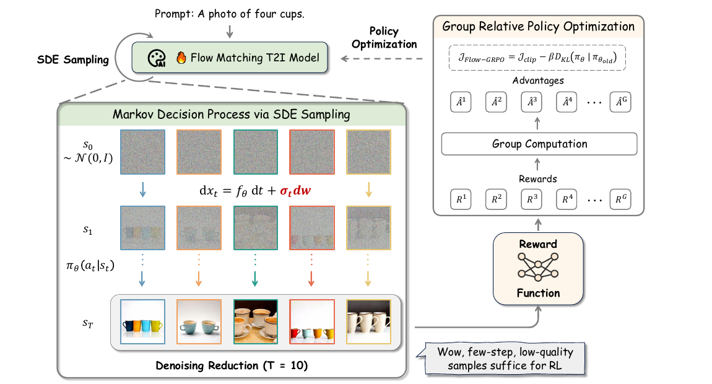
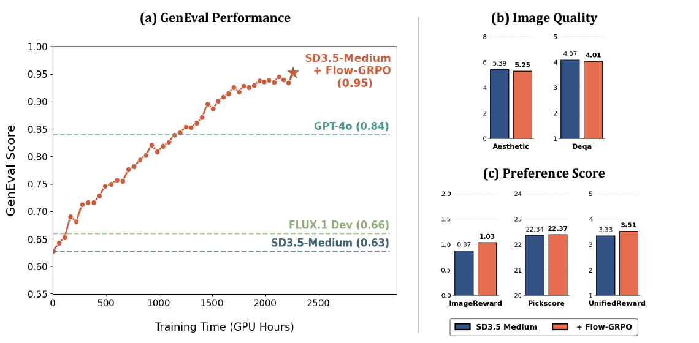
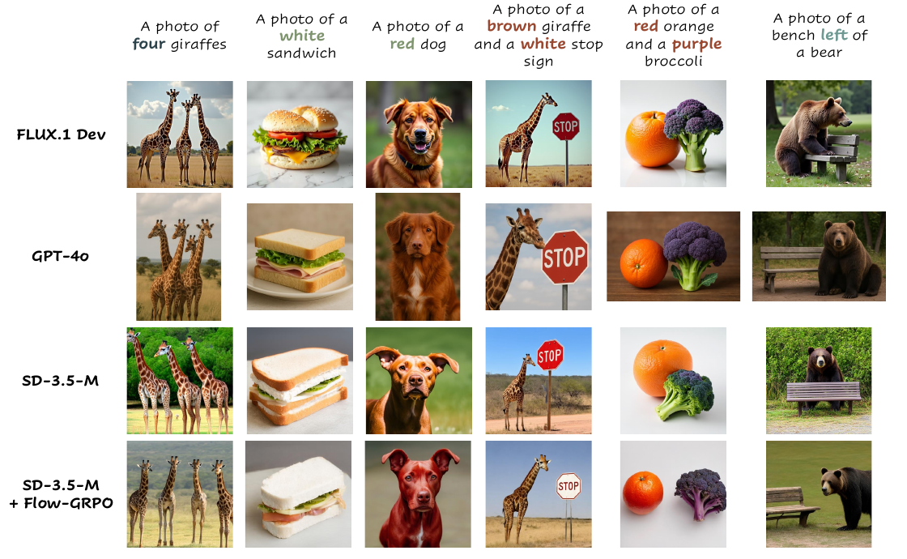
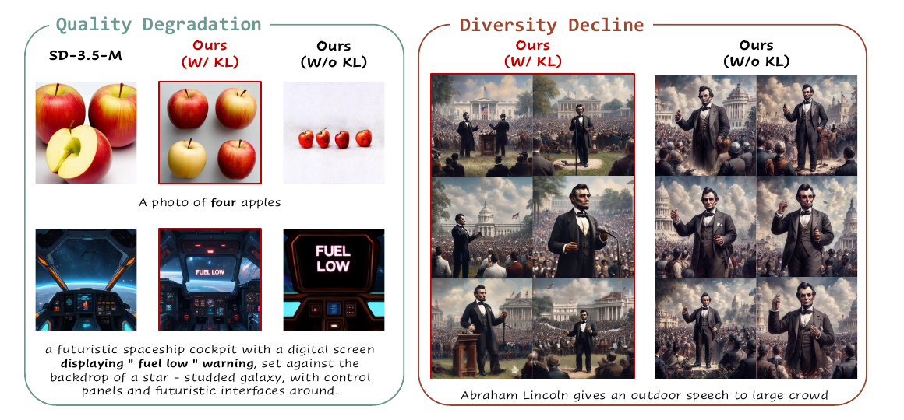
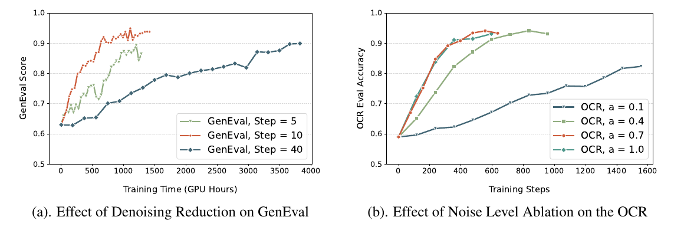
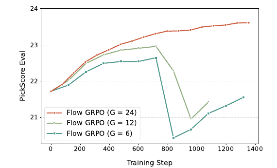
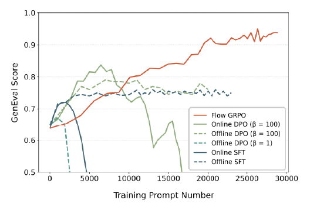

# Flow-GRPO: Training Flow Matching Models via Online RL

> Jie Liu 等 · 港中文 MMLab + 清华 + 快手 Kling + 南大 + 上海 AI Lab  
> **NeurIPS 2025** · [arXiv:2505.05470](https://arxiv.org/abs/2505.05470) · [github](https://github.com/yifan123/flow_grpo)(MIT,含 3 个 HF checkpoint)

---

## 1. 一句话定位

**这是整条"扩散/flow 模型 online RL"线的源头。** 核心动作只有两个:

1. **把确定性 ODE 采样改写成边缘分布等价的 SDE 采样** —— 于是 policy 变成各向同性高斯,`p(x_{t-1}|x_t)` 有闭式、KL 有闭式,GRPO 的 importance ratio 才算得出来,同时也拿到了 RL 探索必需的随机性;
2. **Denoising Reduction:训练只采 10 步、推理仍用 40 步** —— 数据收集提速约 4×,而 GRPO 只依赖组内**相对**偏好,低质量样本照样给出有效信号。

SD3.5-M 上 GenEval **0.63 → 0.95**。

📌 **仓库里的 [RVM](../../video_generation/rvm/analysis.md)、[Self-OPD](../self_opd/analysis.md)、[Flow-OPD](../flow_opd/analysis.md)、[CM-GRPO](../../video_generation/raven/analysis.md)、DanceGRPO 全部把它当 baseline 或攻击对象**,读完这篇再回去看那几篇会顺很多。

---

## 2. 要解决的问题

Flow matching 已是 SD3.5 / FLUX / Wan / Hunyuan 的主流 backbone,但**在组合场景(多物体、属性绑定、空间关系)和文字渲染上很弱**。LLM 那边 online RL 早已证明有效,但生成模型侧此前主要是**早期 diffusion 上的 RL(DDPO)**和 **flow 上的 offline RL(DPO 类)**。

搬过来有两个硬障碍:

**① 确定性 ODE 与 RL 需要的随机采样冲突。** 论文拆成两层:

- **算不出来**:GRPO 的 importance ratio 需要 `p(x_{t-1}|x_t, c)`,而"确定性动力学下这个量因为要估 divergence 而计算昂贵"(要算 Jacobian 的迹)。
- **更要命的是探索**:"确定性采样除了初始 seed 之外没有任何随机性,这尤其成问题"——没有随机性就没有 exploration,RL 无从谈起。

**② 采样效率。** online RL 靠采样收集数据,而 flow 模型生成一张图要迭代很多步,模型越大越明显。

**与并发工作的区分**:F5R-TTS 也把 GRPO 用到 flow matching,但走的是"把 velocity prediction 改成预测高斯的均值+方差",**需要重训预训练模型**;Flow-GRPO 既不改模型也不重训。

---

## 3. 核心方法

> **Fig 2 逐区域解读**:
>
> **顶部**——"Prompt: A photo of four cups." 向下进入绿底框 **"🎨🔥 Flow Matching T2I Model"**(火焰 = 可训练)。框左侧一条回环箭头标 **"SDE Sampling"**,右侧一条**黑色虚线**从右往左指回模型,标 **"Policy Optimization"**——这两条箭头构成 on-policy 闭环。
>
> **左下(MDP via SDE Sampling)**——三行 5 列图像网格,代表 group 里 5 条并行轨迹:
> - 第一行 `s_0 ~ N(0,I)`:5 张纯噪声,**边框用蓝/橙/青/红/黄区分轨迹**;
> - 中间写着 `dx_t = f_θ dt + σ_t dw`,其中 **`σ_t dw` 用红色加粗**——这是全文新加的那一项;
> - 第二行 `s_1`:隐约有杯子轮廓;
> - 第三行 `s_T`:5 张风格各异的成品杯子图。
> - 框底标注 **"Denoising Reduction (T = 10)"**。
>
> **右侧(GRPO)**——自下而上:成品图 → 米黄色 **Reward Function** → 一排 `R¹…R^G` → **Group Computation** → 一排 `¹…Â^G` → 顶部目标函数框。
>
> **右下角有个对话气泡:"Wow, few-step, low-quality samples suffice for RL"** ——这句大白话就是 Denoising Reduction 的全部直觉。
>
> ⚠️ **图里的目标函数写的是 `D_KL(π_θ | π_θ_old)`,而 Eq.3/Eq.5 写的是 `π_ref`**。这两者在 `num_inner_epochs=1` 的严格 on-policy 下差别很大(前者是上一轮采样策略,后者是原始预训练模型),代码实现的是后者(关掉 LoRA)。**Figure 2 写错了。**

### 3.1 ODE → SDE：让 policy 有闭式密度

**目标 SDE**:

$$
dx_t = \left[v_t(x_t) - \frac{\sigma_t^2}{2}\nabla \log p_t(x_t)\right]dt + \sigma_t\, dw
$$

推导分四步(Appendix A),其中**第二步是关键技巧**:

- **Step 1**:ODE 的边缘密度满足连续性方程 `∂_t p_t = −∇·[v_t p_t]`;通用 SDE 满足 Fokker-Planck `∂_t p_t = −∇·[f p_t] + ½∇²[σ_t² p_t]`。令两者相等。
- **Step 2(消项技巧)**:用 `∇p = p∇log p` 把**二阶项转成一阶散度**(见下式),于是等式两边都成了 `−∇·[(·)p_t]` 的形式,**散度算子可以整体去掉**,直接读出漂移项 `f_SDE = v_t + (σ_t²/2)∇log p_t`。
- **Step 3**:套 Anderson 反时 SDE,`v_t + σ²/2·∇log p − σ²·∇log p = v_t − σ²/2·∇log p`。**这就是 `+σ²/2` 变成 `−σ²/2` 的来源。**
- **Step 4**:对 rectified flow(`α_t = 1−t`,`β_t = t`)把 score 用 velocity 表达,得 `∇log p_t = −x/t − ((1−t)/t)·v_t`,代回即得

Step 2 用到的恒等式:

$$
\nabla^2\big[\sigma_t^2 p_t\big] = \sigma_t^2\,\nabla\cdot\big(p_t\,\nabla \log p_t\big)
$$

最终得到:

$$
dx_t = \left[v_t(x_t) + \frac{\sigma_t^2}{2t}\big(x_t + (1-t)v_t(x_t)\big)\right]dt + \sigma_t\, dw
$$

Euler-Maruyama 离散后就是实际实现的更新式,**噪声调度取 `σ_t = a·√(t/(1−t))`,`a = 0.7`**。

**由此白拿的两个好处**:

- `π_θ` 是各向同性高斯 → **log-prob 有闭式**,importance ratio 算得出;
- **KL 也有闭式**,而且退化成对 velocity 的加权 L2:

$$
D_{\mathrm{KL}}(\pi_\theta \Vert \pi_{\mathrm{ref}}) = \frac{\lVert x_{t+\Delta t,\theta} - x_{t+\Delta t,\mathrm{ref}}\rVert^2}{2\sigma_t^2 \Delta t} = \frac{\Delta t}{2}\left(\frac{\sigma_t(1-t)}{2t} + \frac{1}{\sigma_t}\right)^2 \big\lVert v_\theta - v_{\mathrm{ref}}\big\rVert^2
$$

📌 **这个闭式 KL 是后续一系列工作的共同起点**:[Flow-OPD](../flow_opd/analysis.md) 把 `v_ref` 换成 teacher 速度场就得到了它的 OPD loss;[Self-OPD](../self_opd/analysis.md) 把它换成分支速度并加 advantage 权重;两者的"KL 塌缩成速度场 L2"都是从这里来的。

⚠️ `σ_t = a√(t/(1−t))` 在 `t→1`(纯噪声端)**发散**。论文没提这个奇点,代码用 `sigma_max = sigmas[1]` 替换 `t=1` 的情况来避免除零。

### 3.2 GRPO 目标

组内归一化 advantage(reward 只在终点给,**所以整条轨迹共享同一个 `Â`**):

$$
\hat{A}^i_t = \frac{R(x^i_0, c) - \mathrm{mean}\big(\{R(x^j_0,c)\}_{j=1}^{G}\big)}{\mathrm{std}\big(\{R(x^j_0,c)\}_{j=1}^{G}\big)}
$$

目标函数是标准的 clipped PPO 形式加 KL:

$$
f = \frac{1}{G}\sum_{i=1}^{G}\frac{1}{T}\sum_{t=0}^{T-1}\left[\min\Big(r^i_t(\theta)\hat A^i_t,\ \mathrm{clip}\big(r^i_t(\theta), 1-\varepsilon, 1+\varepsilon\big)\hat A^i_t\Big) - \beta D_{\mathrm{KL}}(\pi_\theta \Vert \pi_{\mathrm{ref}})\right]
$$

选 GRPO 而非 PPO 的理由很实际:**不需要 value network,省显存**。

### 3.3 Denoising Reduction

**训练采样 `T = 10`,推理/评测 `T = 40`。**

直觉:10 步 SDE 采出来的图确实有 artifact(色偏、细节糊),**但 GRPO 只依赖组内相对偏好**——低质量样本照样能排出好坏,而轨迹短了就大幅省 wall-clock。

---

## 4. 实验结果

**设置**:SD3.5-M,**512 分辨率**,LoRA(`r=32, α=64`),`G=24`,`a=0.7`,KL `β=0.04`(GenEval/OCR)或 `0.01`(PickScore),**24 × A800**。

**三个任务**:
- **组合生成**:GenEval 官方 pipeline 当 reward;训练 prompt 用 GenEval 官方脚本按模板生成;**按 base model 初始各子任务准确率设定 prompt 配比** `Position : Counting : Attr : Colors : Two Obj : Single Obj = 7:5:3:1:1:0`(Single Object 权重为 0,因为 baseline 已 0.98)。
- **文字渲染**:模板 `A sign that says "text"`,GPT-4o 生成 20K 训练 + 1K 测试 prompt;reward = `max(1 − 编辑距离/字符数, 0)`。
- **人类偏好**:PickScore 当 reward。

### 4.1 GenEval 主结果（Table 1）

| 模型 | Overall | Single | Two Obj | Counting | Colors | Position | Attr. |
|---|---|---|---|---|---|---|---|
| SD3.5-M | 0.63 | 0.98 | 0.78 | 0.50 | 0.81 | 0.24 | 0.52 |
| FLUX.1 Dev | 0.66 | 0.98 | 0.81 | 0.74 | 0.79 | 0.22 | 0.45 |
| SD3.5-L | 0.71 | 0.98 | 0.89 | 0.73 | 0.83 | 0.34 | 0.47 |
| SANA-1.5 4.8B | 0.81 | 0.99 | 0.93 | 0.86 | 0.84 | 0.59 | 0.65 |
| Janus-Pro-7B | 0.80 | 0.99 | 0.89 | 0.59 | 0.90 | 0.79 | 0.66 |
| **GPT-4o** | 0.84 | 0.99 | 0.92 | 0.85 | **0.92** | 0.75 | 0.61 |
| **SD3.5-M + Flow-GRPO** | **0.95** | **1.00** | **0.99** | **0.95** | **0.92** | **0.99** | **0.86** |

**Position 从 0.24 → 0.99 是提升最夸张的一项**(它也恰好是 prompt 配比里权重最高的 7)。

> **Fig 1 逐面板解读**:
>
> **(a) GenEval Performance**(左)——横轴 **Training Time (GPU Hours)** 0→2500,纵轴 GenEval Score。橙红曲线从 0.628 单调爬升,**约 1150–1200 GPU-h 处穿过 GPT-4o 的 0.84 虚线**,最后在 **≈2250 GPU-h** 处以五角星收在 **0.95**。三条水平虚线是 GPT-4o(0.84)、FLUX.1 Dev(0.66)、SD3.5-M(0.63)。
>
> **(b) Image Quality**(右上)——两组柱:Aesthetic **5.39 → 5.25**,DeQA **4.07 → 4.01**。⚠️ **两个都是下降的**,而 caption 写的是 "remain essentially unchanged"。
>
> **(c) Preference Score**(右下)——ImageReward 0.87 → **1.03**,PickScore 22.34 → 22.37(几乎持平),UnifiedReward 3.33 → **3.51**。
>
> 📌 **这张图有一条容易被略过的信息:达到 0.95 需要约 2250 A800 小时。** 对一个 2.5B 模型做 LoRA 而言这个代价相当可观,而正文和摘要都没提总成本,只以横轴形式藏在曲线里。

> **Fig 3 逐列解读**:六列 prompt(关键词高亮),四行方法(FLUX.1 Dev / GPT-4o / SD-3.5-M / **+Flow-GRPO**)。
>
> - **列 1(four giraffes)**——FLUX 四只但拥挤;**GPT-4o 只画了 3 只(错)**;SD-3.5-M 4–5 只有重叠残影;Flow-GRPO 清晰 4 只并排。
> - **列 3(a red dog)**——前三行都是**棕狗**;只有 Flow-GRPO 画出明显红色的狗。
> - **列 4(brown giraffe + white stop sign)**——**FLUX / GPT-4o / SD-3.5-M 的 stop sign 全是红色**(错);Flow-GRPO 画出白色的。
> - **列 5(red orange + purple broccoli)**——SD-3.5-M 的西兰花是绿的(错);Flow-GRPO 红橙子 + 紫西兰花都对。
> - **列 6(bench left of a bear)**——只有 Flow-GRPO 的长椅明确在左、熊在右。
>
> 📌 这组图很能说明 GenEval 那 0.95 是**怎么来的**:提升集中在 Counting / Colors / Attribute Binding / Position 这四类**规则可判定**的属性上——而它们恰好就是 reward 打分器检查的东西。

### 4.2 KL 正则与 reward hacking（Table 2）

| 任务 | 配置 | Task Metric | Aesthetic | DeQA | ImgRwd | PickScore | UniRwd |
|---|---|---|---|---|---|---|---|
| — | SD3.5-M | — | 5.39 | 4.07 | 0.87 | 22.34 | 3.33 |
| 组合生成 | w/o KL | **0.95** | **4.93** | **2.77** | **0.44** | **21.16** | **2.94** |
| 组合生成 | w/ KL | **0.95** | 5.25 | 4.01 | 1.03 | 22.37 | 3.51 |
| 文字渲染 | w/o KL | 0.93 | 5.13 | 3.66 | 0.58 | 21.79 | 3.15 |
| 文字渲染 | w/ KL | 0.92 | 5.32 | 4.06 | 0.95 | 22.44 | 3.42 |
| 人类偏好 | w/o KL | 23.41 | 6.15 | 4.16 | 1.24 | 23.56 | 3.57 |
| 人类偏好 | w/ KL | 23.31 | 5.92 | 4.22 | 1.28 | 23.53 | 3.66 |

**组合生成那一行是最强的证据**:去掉 KL 后 task metric 一样是 0.95,但 **DeQA 从 4.07 崩到 2.77、ImageReward 从 0.87 崩到 0.44** —— 分数刷满了,图彻底坏了。

> **Fig 6 逐框解读**:左右两个框对应 reward hacking 的两种表现形态。
>
> **左框(Quality Degradation)**,三列 SD-3.5-M / **Ours (w/ KL)** / Ours (w/o KL):
> - 行 1("four apples"):SD-3.5-M 画了 3 个(错);w/ KL 清晰 4 个大苹果;**w/o KL 画了 4 个但极小、扁平、塑料感**——数量对了,画毁了。
> - 行 2(太空舱屏幕显示 "fuel low"):w/ KL 是驾驶舱 + 屏幕显示文字;**w/o KL 整张图退化成一块黑底霓虹大字 "FUEL LOW",驾驶舱几乎消失** —— 这是最典型的 reward hacking:OCR reward 只看文字对不对,那就把整张图变成一块招牌。
>
> **右框(Diversity Decline)**,同一 prompt("林肯户外演讲")各出 6 张:
> - **w/ KL 侧构图各异**(背对镜头、正面演讲、远景、近景讲台);
> - **w/o KL 侧 6 张高度雷同**——全是正面半身、右手抬起、同样的模糊人群背景。**不同 seed 出几乎一样的图。**
>
> 📌 这两种形态值得分开记:**GenEval/OCR 上的 hacking 表现为画质塌**,**PickScore 上的 hacking 表现为多样性塌**(画质反而不掉,因为 PickScore 本身就是偏好指标)。论文对后者的解释是"reward 与评测指标重叠"。

### 4.3 Denoising Reduction 与噪声水平（Fig 7）

> **Fig 7 逐面板解读**:
>
> **(a) Denoising Reduction**(横轴 **GPU Hours**)——
> - **Step = 10**(橙红)**最快最稳**:250 GPU-h 到 0.75、850 到 0.90、1350 收在 0.94。
> - **Step = 40**(深蓝)**明显最慢**:1000 GPU-h 才 0.75、3800 结束时**只到 0.90**。
> - **Step = 5**(浅绿)波动大,末端能到 0.94 但中途有掉到 0.85 的抖动。
>
> 达到 0.90 所需 GPU-h:Step=40 约 3800,Step=10 约 850 → **约 4.5×**。
>
> ⚠️ **但要注意 Step=40 那条曲线到 3800 GPU-h 还在上升、从未收敛。** 所以论文说的"少步不影响最终 reward"在这张图里**并没有被证明**——图上反而是少步更高,而这恰恰意味着训练分布与测试分布不一致带来的影响并非中性,论文没有讨论。
>
> **(b) Noise Level `a`**(OCR 任务,横轴 Training Steps)——
> - `a = 0.1`(深蓝)**最慢**,1550 step 才到 0.825 —— 探索不足。
> - `a = 0.4`(浅绿)850 step 到 0.943。
> - `a = 0.7`(橙红)**最快**,570 step 就到 0.945。
> - `a = 1.0`(青绿)前段与 0.7 **几乎完全重合**,末端 0.92 略低。
>
> 结论:探索强度存在一个甜点,`0.7` 之后收益饱和。论文另称再加大 `a` 会"degrades image quality, resulting in zero reward and failed training",**但这句没有任何数据支撑**。

### 4.4 Group Size（Fig 5）

> **Fig 5 解读**:PickScore 任务,横轴 Training Step 0→1400。
> - **G = 24**(橙红):21.72 起步,**平滑单调**升到 1340 step 的 ≈23.62,全程稳定。
> - **G = 12**(浅绿):720 step 到峰值 22.95,然后**急剧下跌**到 960 step 的 20.95(**低于起点**),之后小幅回升。
> - **G = 6**(青绿):720 step 到 22.63,**更陡地崩塌**到 840 step 的 20.45。
>
> 论文的解释是小 group 的 advantage 估计不准、方差大、导致训练崩溃。📌 **实践含义很直接:group size 是这套方法的硬性成本下限**——`G=24` 意味着每个 prompt 要采 24 条完整轨迹,想省这笔钱会直接崩。

### 4.5 与其它对齐方法对比（Fig 4）

> **Fig 4 逐条解读**:横轴 **Training Prompt Number**(作者说为了公平,因为 DPO 用了不同 batch size),纵轴 GenEval。
> - **Flow-GRPO**(橙红)单调爬升,29000 prompt 结束于 ≈0.94,**全程最终最高**。
> - **Online DPO (β=100)**(浅绿实线)快速上冲到 7000 处峰值 ≈0.82,**之后持续下滑**,16500 后跌破 0.5 出图。
> - **Offline DPO (β=100)**(浅绿虚线)平台在 0.75–0.78,一直延伸到 23000。
> - **Offline DPO (β=1)**(青绿虚线)2500 处**直接崩塌**。
> - **Online SFT**(深蓝实线)1500 处到 0.72 后崩塌。
> - **Offline SFT**(深蓝虚线)平台 ≈0.75。
>
> ⚠️ **正文说 "Online DPO also surpasses its offline counterpart" 是有条件的**:online DPO 只在**峰值**上超过 offline,最终崩塌到远低于 offline。而且正文这段还提到"对 online DPO 的 β 做了网格搜索",但**图里的 β 网格是在 offline DPO 上做的**(β=1 vs 100),图上根本没有第二个 online DPO 设置——真正符合那段描述的是附录 Figure 8。

### 4.6 泛化性（Table 3/4）

**跨 benchmark 零样本迁移(T2I-CompBench++,用的是 GenEval 训出来的那个模型)**:

| 模型 | Color | Shape | Texture | 2D-Spatial | 3D-Spatial | Numeracy | Non-Spatial |
|---|---|---|---|---|---|---|---|
| SD3.5-M | 0.7994 | 0.5669 | **0.7338** | 0.2850 | 0.3739 | 0.5927 | 0.3146 |
| **+Flow-GRPO** | **0.8379** | **0.6130** | 0.7236 | **0.5447** | **0.4471** | **0.6752** | **0.3195** |

📌 **2D-Spatial 0.285 → 0.545 是最大增益**,说明空间关系的提升确实迁移出去了。⚠️ **但 Texture 从 0.7338 退化到 0.7236,是唯一下降的一列,正文只字未提**;Non-Spatial 也几乎没动(+0.0049)。

**类别与数量泛化**:训 60 类评 20 个未见类,Overall 0.64 → 0.90;只教 2/3/4 个物体,**5–6 个 0.13 → 0.48,12 个 0.02 → 0.12**。

---

## 5. 争议与权衡

**① 评测协议高度自利:训练 reward 与测试 metric 同源。** 这是最需要警惕的一条。

- **GenEval**:reward 就是 GenEval 打分器本身,训练 prompt 用 **GenEval 官方脚本按同样模板生成**,测试集**只按"物体顺序"去重**(`a photo of A and B` vs `B and A`),**没有按物体类别/属性组合去重**。所以 0.63→0.95 里多少是能力提升、多少是过拟合到同一模板 + 同一检测器,**无法分离**。
- **OCR**:论文明说 "This reward **also serves as our metric** of text accuracy" —— reward 与 metric 是同一个函数。
- **PickScore**:既是 reward 又出现在 Table 2 的 Preference Score 一栏,论文自己也承认"likely due to overlap between PickScore and evaluation metrics"。

**真正独立的证据只有 T2I-CompBench++ 和 DrawBench 上那 4 个质量指标**——而前者里 Texture 是退化的。

**② "超过 GPT-4o" 不是同条件比较。** Flow-GRPO 用 GenEval 打分器当 reward、在 GenEval 模板 prompt 上直接训练;**GPT-4o 是零样本通用模型**。这句话在摘要和 intro 都出现,容易误导。Table 1 里所有非 SD3.5-M 的数字也都是从别处摘的,分辨率/步数/seed/CFG 均不受控。

**③ 论文公式与开源实现有算法层面的差异(不是笔误)。** 这一条对想复现的人最关键:

| | 论文 | 代码 |
|---|---|---|
| log-prob 归约 | 按 Eq.5 应是 sum | **对 latent 全部 65536 维取 `mean`** → importance ratio 实际是真实似然比的 **65536 次方根** |
| PPO clip `ε` | **正文与附录都没给数值** | `clip_range = 1e-4`(极小,正好呼应上一条) |
| advantage 分母 | Eq.4 写组内 std | `global_std=True`,用**整个 batch(1152 样本)的 std**;mean 还是该 prompt 的历史累计 |
| KL loss | 除以 `2σ²Δt` | 只除 `2σ²`(少了 `Δt`,会被 β 吸收) |
| CFG | **全文一次未提** | 训练与采样都开 `guidance_scale = 4.5` |

**按论文字面复现会得到完全不同的行为。** 尤其 CFG:开了 CFG 之后"策略"严格说已经不是 `p_θ` 了,importance ratio 的理论依据被破坏。

**④ Contribution 第 3 条与自家表格矛盾。** 论文声称"With a proper KL we can **match** the high reward of the KL-free version",但三个任务里只有 GenEval 成立(0.95 vs 0.95);**OCR 是 0.92 vs 0.93,PickScore 是 23.31 vs 23.41,都没 match**。

**⑤ 与 baseline 对比的横轴选择不一致,且都选了对自己有利的那个。** Figure 4 和附录 Figure 8 上面板用 "Training Prompt Number"(作者说是为公平),但 Figure 8 **下面板**(vs ReFL / DDPO)却换成 "Training Steps"。**ReFL 每步只在单个 late timestep 回传一次梯度,Flow-GRPO 每步要采 10 步 SDE + 对 10 个 timestep 各做一次 forward/backward(还要多跑一次 ref 模型)——单步成本差一个量级。** 用 Training Steps 作横轴系统性美化了自己。

**⑥ baseline 的超参搜索深度不对等。** DPO 的 β 只试了 {1, 100},SFT 没提任何超参;而 Flow-GRPO 自己的 β 是**按任务分别调过**的(0.04 / 0.01)。DDPO 还是作者**自己移植**到 flow 上的,移植质量无从检验,它的崩塌可能只是学习率没调。

**⑦ "少步不影响最终性能"未被证明。** Fig 7(a) 里 Step=40 那条到 3800 GPU-h 只有 0.90 且**仍在上升**——对照组根本没跑到收敛。图上反而是少步更高,这说明 train/test 步数不一致的影响并非中性,论文没讨论。

**⑧ 画质确实小幅下降,被表述成"essentially unchanged"。** Aesthetic 5.39→5.25、DeQA 4.07→4.01;FLUX 上 DeQA 也是 4.31→4.24。方向都是负的,只是幅度小。

**⑨ 泛化数字很弱却被称作 "strong generalization"。** Table 4 caption 如此写,但 **12 objects 只从 0.02 到 0.12——88% 的情况仍然失败**。

**⑩ 缺几个关键 ablation。**
- 没有 **"ODE 采样 + 只靠不同初始 seed 探索"** 的对照——而这正是动机 ①(b) 的直接验证。
- 没有 `σ_t` 调度**形状**的消融(只调了标量 `a`)。
- 没有 "T=10 训练 / T=10 推理" 的对照,无法判断 40 步推理的收益是否来自 train-test mismatch。
- **没有报告 zero-std ratio**(组内 reward 全同、advantage 恒为 0 的 prompt 比例)——代码里明明记录了这个量,而它是 GRPO 最关键的诊断指标。

**⑪ 论文写 24 卡 A800,开源 config 是 32 卡**,且按 24 卡代入会触发 assert 失败。另有 4 组完全重复的参考文献条目、Sec.3 的 MDP 下标自相矛盾、Table 5 的数值量级(28.79–29.89)与全文 PickScore(21.72–23.97)完全对不上。

**⑫ 正面:开源质量高,这是它影响力的真正来源。** MIT 协议、代码完整、放了 3 个 HF checkpoint。**方法本身的数学是已知结果(Song et al. 的 probability-flow ODE ↔ SDE 对偶)在 rectified flow 上的特化**,但它把链路真正打通并可复现,于是被后续大量工作直接拿去当 baseline。

---

## 6. 一句话总结

Flow-GRPO 的真正贡献是**工程上打通了 flow matching + online policy-gradient RL 的链路**——ODE→SDE 让 policy 有闭式高斯密度(顺带白拿一个闭式 KL,这个 KL 后来成了 Flow-OPD / Self-OPD 整条 OPD 线的共同起点),Denoising Reduction 让数据收集成本可承受;数学本身是已知的 ODE↔SDE 对偶在 rectified flow 上的特化,而 63%→95% 主要说明"**用 metric 当 reward 能把 metric 刷到接近饱和**",跨 benchmark 的真实增益(T2I-CompBench++、DrawBench)要温和得多、且有个别退化项——它之所以成为这条线的源头,更多是因为**开源质量高、可复现**。

---

## Q&A

**Q: 为什么非得把 ODE 改成 SDE?用不同初始 seed 做探索不行吗?**

A: **论文给了两个理由,但只有第一个是硬的。**

**硬理由(算不出来)**:GRPO 需要 importance ratio `p_θ(x_{t-1}|x_t)/p_θ_old(...)`。确定性 ODE 下,状态转移是一个 delta 分布,要算密度就得算 Jacobian 的 divergence(trace),**在 65536 维 latent 上不可行**。改成 SDE 后转移核是各向同性高斯,log-prob 和 KL 都有闭式,这一步是**必需的**。

**软理由(探索)**:论文说"确定性采样除了初始 seed 之外没有随机性,尤其成问题"。但这条**没有被实验直接验证**——论文没有做"ODE 采样 + 不同初始 seed"的对照组。Figure 10 只对比了 SDE 下的 same/different initial noise(不同初始噪声略好,23.62 vs 23.40),**不能替代那个缺失的对照**。

所以更准确的说法是:**ODE→SDE 首先是为了让密度可算,探索只是顺带的好处**,而后者的必要性论文没证。

---

**Q: Denoising Reduction 为什么能成立?训练和推理步数不一致不会有问题吗?**

A: **论文的理由是"GRPO 只吃相对偏好",但代价被低估了。**

理由本身站得住:10 步采出来的图确实有 artifact,但 GRPO 用的是**组内 24 张图的相对排序**——只要好坏关系保持,绝对质量差一点不影响梯度方向。Figure 2 右下角那句大白话说得很清楚:"few-step, low-quality samples suffice for RL"。

⚠️ **但"不影响最终性能"这个说法在 Fig 7(a) 里并没有被证明**:Step=40 的对照组跑到 3800 GPU-h 只有 0.90 且**仍在上升**,从未收敛。图上反而是 **Step=10 更高**(0.94)。

这个"反而更高"值得琢磨——如果少步真的更好,说明 train/test 分布不一致带来的不是中性影响,而是**训练时的低质量样本反而提供了更有区分度的相对信号**(高质量样本可能大家都差不多、advantage 趋近 0)。论文没有讨论,而这其实是个有意思的假设。

顺带:代码里记录了 `zero_std_ratio`(组内 reward 全同、advantage 为 0 的 prompt 比例)却**没有报告**——这个量正好能验证上面的猜想。

---

**Q: KL 到底防的是什么?为什么三个任务表现不一样?**

A: **KL 防的是 reward hacking,但 hacking 在不同任务上长得不一样。**

| 任务 | 去掉 KL 后的 hacking 形态 | 表现 |
|---|---|---|
| GenEval / OCR | **画质塌** | 数量对了但苹果变得又小又扁;整张图退化成一块写着 "FUEL LOW" 的招牌 |
| PickScore | **多样性塌** | 画质**反而不掉**(Aesthetic 6.15 > w/ KL 的 5.92),但不同 seed 出几乎一样的图 |

PickScore 上画质不掉,论文的解释是 **reward 与评测指标重叠**——PickScore 本身就是偏好指标,优化它当然不会让"偏好分"下降。所以那里的 hacking 只能靠**多样性**才看得出来(Fig 6 右框)。

📌 **实践含义**:如果你的 reward 和评测指标同源,**画质指标不掉不等于没 hacking**,必须另外看多样性。

论文还强调 "KL regularization is not empirically equivalent to early stopping"(Figure 12)——即不能靠"早点停"来代替 KL,代价是训练更长。

---

**Q: 想复现的话,最需要注意什么?**

A: **别照论文的公式写代码,去看仓库。** 差异是算法层面的,不是笔误:

1. **log-prob 取 mean 而非 sum**(对 65536 维取平均)。这让 Eq.5 的 ratio 实际变成真实似然比的 65536 次方根,也解释了为什么 `clip_range = 1e-4` 这么小——而**论文全文根本没给 ε 的数值**。
2. **advantage 分母是 `global_std`**(整个 batch 1152 样本),不是 Eq.4 写的组内 std;mean 还是该 prompt 的历史累计。
3. **训练和采样都开了 CFG(4.5)**,论文一次没提。开 CFG 后策略已不是 `p_θ`,importance ratio 的理论依据是破的。
4. KL loss 少了 `Δt` 因子(会被 β 吸收,但公式对不上)。
5. **论文写 24 卡,config 是 32 卡**,按 24 卡代入会触发 assert 失败。

另外几个论文没给的:learning rate(代码 `3e-4`)、optimizer(AdamW)、batch size、训练总步数、GenEval 训练 prompt 数量。

---

**Q: 它和仓库里那几篇 OPD / RL 论文是什么关系?**

A: **它是源头,后面几篇要么继承它的数学,要么攻击它的缺陷。**

| | 与 Flow-GRPO 的关系 |
|---|---|
| [Flow-OPD](../flow_opd/analysis.md) | **继承那个闭式 KL**,把 `v_ref` 换成 teacher 速度场;并攻击 Flow-GRPO 的"标量奖励在多任务下不可扩展"(逐个叠加奖励 GenEval 0.94→0.73) |
| [Self-OPD](../self_opd/analysis.md) | 同样继承闭式 KL,但**连 teacher 也不要**,改用自参考 + 局部分支;反过来又攻击 Flow-OPD 的场级别路由 |
| [RVM](../../video_generation/rvm/analysis.md) | **主张 likelihood 那一整套都不必要**——直接 reward 加权速度回归。它的实验里 **Flow-GRPO 在两个视频设置上都把 base model 训坏了** |
| [CM-GRPO](../../video_generation/raven/analysis.md) | 认为 Flow-GRPO 的 ODE→SDE **把 train-test gap 从历史域搬到了采样器域**,改用 consistency sampler 自带的高斯核当策略接口 |
| [PDD](../../video_generation/pdd/analysis.md) / [TDM](../../inference_acceleration/tdm/analysis.md) | 不同赛道(蒸馏提速),但常与 Flow-GRPO 类方法串联使用:先对齐再蒸馏 |

📌 **一条清晰的演化脉络**:Flow-GRPO 打通链路(ODE→SDE + 闭式 KL)→ 大家发现标量奖励在多目标下不可扩展 → OPD 系用**密集速度场监督**替代稀疏标量(Flow-OPD 用 teacher,Self-OPD 用自参考)→ RVM 更激进,主张连 policy gradient 框架都可以拆掉。

**而这几篇共享的那个数学起点——"KL 塌缩成速度场的加权 L2"——就是本文 §3.1 推出来的。**
