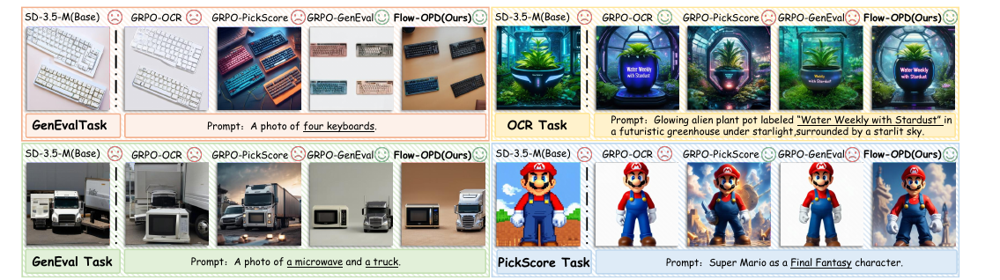
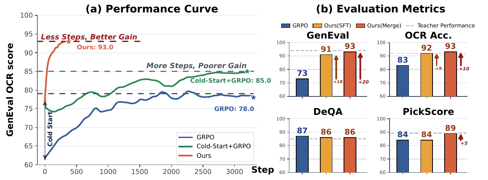
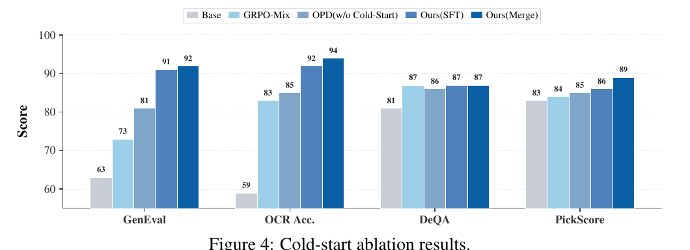
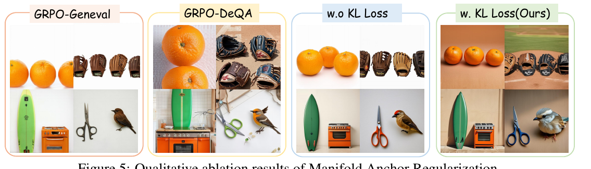
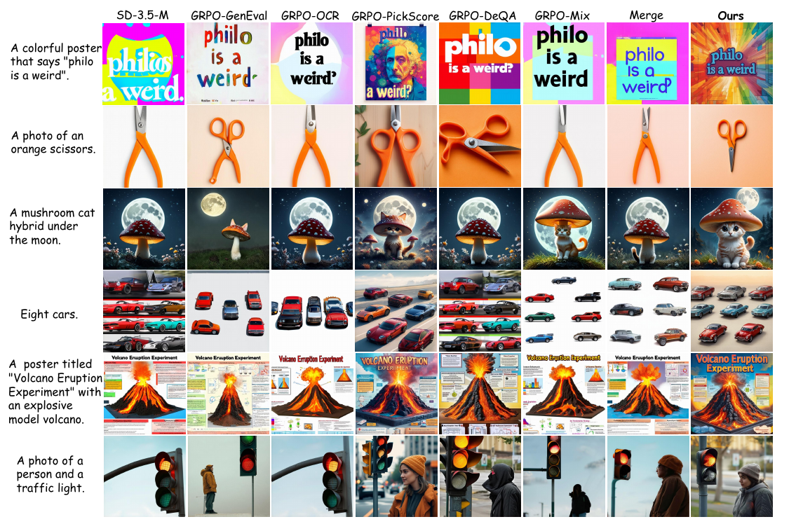

# Flow-OPD: On-Policy Distillation for Flow Matching Models

> Zhen Fang¹*, Wenxuan Huang*†, Yu Zeng¹, Yiming Zhao¹, Shuang Chen², Kaituo Feng³, Yunlong Lin³, Lin Chen¹, Zehui Chen¹, Shaosheng Cao⁴, Feng Zhao¹  
> ¹中国科学技术大学 ²UCLA ³香港中文大学 ⁴小红书 · arXiv:2605.08063v5 · 2026-05-24 · [project](https://costaliya.github.io/Flow-OPD/) · [github](https://github.com/CostaliyA/Flow-OPD)

---

## 1. 一句话定位

**多目标对齐的问题不在 RL 算法本身,而在"标量奖励"这个信息瓶颈。** Flow-OPD 的做法是:先用单奖励 GRPO 把每个能力各自训到天花板(得到一批**领域专家 teacher**),再把学生放进 on-policy 采样循环——**按 prompt 硬路由到对应的 teacher,拿 teacher 的速度场当逐步的密集监督**。

关键推导是:student 和 teacher 的 SDE 转移核**共享同一个各向同性协方差**(由噪声调度决定),于是高斯 KL 塌缩成马氏距离、再塌缩成**速度场之间的加权 L2**——因此 LLM 那边必须用的 policy gradient(高方差)在这里**可以整个绕过,直接反传 MSE,梯度方差为零**。

SD3.5-Medium 上 GenEval 0.63→0.93、OCR 0.59→0.93,并观察到 **teacher-surpassing**(学生在某些 case 上超过所有单个老师)。

---

## 2. 要解决的问题

论文用三个递进的问题组织动机,这个结构写得很清楚。

### Q1:GRPO 为什么有效?

标准 FM 是离线重建,性能被静态数据集质量锁死,且无法优化不可微偏好。GRPO 靠**在线探索**突破:从当前策略采 `G` 个输出,用 group-relative advantage `A = (r − μ)/σ` 驱动策略梯度。**对自身动态分布的持续探索让模型能发现新的高奖励轨迹**,从而打破离线 SFT 的天花板。

### Q2:GRPO 为什么在多任务上失败?

单奖励 GRPO 会**严重损害正交能力**。论文给了一阶 Taylor 展开的解释:目标任务 `T₁` 驱动的参数更新 `Δθ`,对某个**未被监控**的能力 `T_k` 的附带影响是

$$
\Delta J_k \approx \langle \nabla_\theta J_k,\, \Delta\theta \rangle \;\propto\; \mathbb{E}_{x \sim \pi_\theta}\!\left[A_1(x)\,\big\langle \nabla_\theta J_k,\, \nabla_\theta \log \pi_\theta(x \mid c)\big\rangle\right]
$$

高维空间里任务梯度经常冲突(`⟨∇J_k, ∇J₁⟩ < 0`)。**由于 `T_k` 没有监督信号,优化器会激进地榨取这些"无人看管的自由度"来最大化 `A₁`**,拆掉预训练好的能力协同,导致 manifold collapse。

> **Fig 2 逐组解读**:四组任务,每组五列——SD-3.5-M(Base)、GRPO-OCR、GRPO-PickScore、GRPO-GenEval、**Flow-OPD(Ours)**,列头上用 😊/😞 标注该方法在这个任务上是否合格。
>
> - **左上(GenEval 任务:"A photo of four keyboards")**——考计数。Base 😞 摆了一堆键盘但数量不对;GRPO-OCR 😞 同样错;GRPO-PickScore 😞 画面漂亮但数量仍不对;**GRPO-GenEval 😊 正好四个**;Ours 😊 也是四个。
> - **右上(OCR 任务:发光外星植物盆栽,标签 "Water Weekly with Stardust")**——考文字渲染。Base 😞 没有文字;**GRPO-OCR 😊 文字正确**;GRPO-PickScore 😞 文字糊;GRPO-GenEval 😞 文字缺;Ours 😊 文字清晰且场景完整。
> - **左下(GenEval:"A photo of a microwave and a truck")**——考双物体。Base 只有卡车 😞;GRPO-OCR 😞;GRPO-PickScore 只有卡车 😞;**GRPO-GenEval 😊 微波炉 + 卡车都在**;Ours 😊。
> - **右下(PickScore 任务:超级马里奥的最终幻想风格)**——考美学。Base 😞 平面卡通;GRPO-OCR 😞;**GRPO-PickScore 😊 精致的 3D 渲染**;GRPO-GenEval 😞 回到平面;Ours 😊。
>
> **这张图的排版本身就是论点**:每一列的 😊 只出现在**它自己被训练的那一行**,其余全是 😞。**只有最后一列 Ours 四行全 😊。** 论文用视觉直接展示了"专家各自封顶、彼此不通"这个现象。

### Q3:那把多个奖励混在一起训不就行了?

不行。论文在 SD3.5-M 上做了受控实验,**逐个叠加**四个奖励:

| 模型 | GenEval | OCR |
|---|---|---|
| SD-3.5-M | 0.63 | 0.59 |
| +GenEval | **0.94** | 0.65 |
| +OCR | 0.89(↓5%) | **0.91** |
| +PickScore | 0.82(↓7%) | 0.86(↓5%) |
| +DeQA | **0.73**(↓9%) | 0.83(↓3%) |

📌 **每加一个新奖励,已有能力就掉一截**。GenEval 从 0.94 一路掉到 0.73。论文的判断是:**把多维冲突压缩成一个标量 advantage,等于强行制造一个零和博弈**——比如为了迁就美学风格化(PickScore),会激进地覆写掉精确的几何表示。所以**标量奖励混合从根本上不可扩展**,这是一个**稀疏信息瓶颈**。

**结论**:需要一种**同时是 on-policy(保留探索)且密集解耦(防止干扰)**的监督信号。

---

## 3. 与前作的关系

**方法上直接对标 LLM 的 On-Policy Distillation**(GKD → Thinking Machines 的 OPD,仓库里有 [GKD 笔记](../../llm/gkd/analysis.md))。Flow-OPD 自称是**第一个把 OPD 引入 flow matching 后训练**的框架。

**RL 侧的对照**:Flow-GRPO(本文所有 baseline 的实现基准)、DiffusionNFT。

📌 **仓库内横向——这条线现在很完整了**:

| | 是否需要 teacher | 多目标怎么融合 | 监督密度 |
|---|---|---|---|
| Flow-GRPO / GRPO-Mix | ❌ | **标量奖励加权求和**(参数空间) | 终点稀疏 |
| **Flow-OPD(本文)** | ✅ 每任务一个专家 | **场级别**:按 prompt 硬路由到对应 teacher | **逐步密集** |
| [diffusion_opsd](../diffusion_opsd/analysis.md) | 部分 | 多 teacher 蒸馏成一个 student | 逐步密集 |
| [Self-OPD](../self_opd/analysis.md) | ❌ | **奖励级别**:标量分数只用来给分支排序 | 逐步密集 |
| [RVM](../../video_generation/rvm/analysis.md) | ❌ | 加权求和 reward | 端点单点 |

⚠️ **Self-OPD(2026-08)正是冲着本文来的**:它认为"把问题拆成若干专用 teacher 再在场级别路由合并"**从根本上背离了多目标对齐的目的**——我们要的是**同一张图**在所有目标上都拿高分,而不是**不同的图**各自在不同评价器下出彩。两篇的正面交锋见文末 Q&A。

---

## 4. 核心方法

Flow-OPD 是**两阶段**:① 用单奖励 Flow-GRPO 训出领域专家 teacher;② cold start 初始化后,做多 teacher 在线蒸馏。

### 4.1 Cold Start：两种初始化

为保证稳定初始化 `θ₀`、防止早期 rollout 轨迹发散,论文给了两条路:

- **SFT-based**:沿用 Flow-GRPO 的 SFT 协议,但**用专家 teacher 采样出的轨迹**做训练数据,让学生一开始就继承专家级的知识分布。
- **Model merging**:把不同 teacher 的**各向异性先验直接在参数空间叠加**成一个统一状态。这种"merging-as-initialization"把学生放到 loss landscape 的高能力区域,**多任务协同已经初具雏形,而且零额外训练成本**。

### 4.2 On-Policy 采样

把确定性 PF-ODE 转成等价 SDE 以注入探索所需的随机性:

$$
dx_t = \left[v_\theta(x_t, t) + \frac{\sigma_t^2}{2t}\big(x_t + (1-t)v_\theta(x_t, t)\big)\right]dt + \sigma_t\, dw
$$

Euler-Maruyama 离散后,学生的转移行为就是一个**局部各向同性高斯策略**:

$$
\pi_\theta(x_{t-\Delta t} \mid x_t, c) = \mathcal{N}\!\big(\mu_\theta(x_t, t),\; \sigma_t^2 \Delta t\, I\big)
$$

每个 prompt 采 `G` 条独立轨迹,得到 on-policy 边际分布 `x_t ~ ρ_θ^t(·|c)`。

### 4.3 任务路由的 teacher 标注

在每个被探索到的状态 `x_t`,学生向专家集合查询局部监督。**为消除跨域梯度干扰,用的是硬路由** `𝟙_{T(c)=k}`:把文本条件 `c` 映射到**唯一**的领域专家 `k`,**只激活一个 teacher**:

$$
v_{\mathrm{target}}(x_t, t, c) = v_{\phi_k}(x_t, t, c), \qquad k = R(c)
$$

`R(·)` 是确定性的 task-to-teacher 路由函数。于是得到目标转移策略 `π_target = N(μ_target, σ_t²Δt I)`。

### 4.4 关键推导：KL 塌缩成速度场的 L2

这是全文最漂亮的一段。学生策略 `π_θ` 和目标策略 `π_target` 都是 `d` 维多元高斯,而且**共享完全相同的各向同性协方差** `Σ_t = σ_t²Δt·I`(由前向 SDE 噪声调度严格决定,与模型无关)。

一般两个高斯的 KL 是

$$
D_{\mathrm{KL}}(\mathcal{N}_1 \Vert \mathcal{N}_2) = \frac{1}{2}\left[\mathrm{tr}(\Sigma_2^{-1}\Sigma_1) - d + (\mu_1 - \mu_2)^\top \Sigma_2^{-1}(\mu_1 - \mu_2) + \ln\frac{\det\Sigma_2}{\det\Sigma_1}\right]
$$

因为 `Σ₁ = Σ₂ = Σ_t`:

- **迹项** `tr(I) = d`,和 `−d` **正好抵消**;
- **行列式比的对数** `ln(1) = 0`,**整项消失**。

于是**只剩马氏距离**,代入 `Σ_t^{-1} = (σ_t²Δt)^{-1} I`:

$$
D_{\mathrm{KL}}(\pi_\theta \Vert \pi_{\mathrm{target}}) = \frac{\lVert \mu_\theta(x_t,t) - \mu_{\mathrm{target}}(x_t,t)\rVert^2}{2\sigma_t^2 \Delta t}
$$

再把 Euler-Maruyama 的均值参数化代入:

$$
\mu_\theta(x_t,t) = x_t + \left[v_\theta(x_t,t,c) + \frac{\sigma_t^2}{2t}\big(x_t + (1-t)v_\theta(x_t,t,c)\big)\right]\Delta t
$$

减去 `μ_target` 时,**所有只依赖状态 `x_t` 的项完全相消**,KL 优雅地简化成**纯粹的速度场差异**:

$$
D_{\mathrm{KL}}(\pi_\theta \Vert \pi_{\mathrm{target}}) = \frac{\Delta t}{2}\left[\frac{\sigma_t(1-t)}{2t} + \frac{1}{\sigma_t}\right]^2 \big\lVert v_\theta(x_t,t,c) - v_{\mathrm{target}}(x_t,t,c)\big\rVert^2
$$

### 4.5 为什么可以整个绕过 policy gradient

LLM 那边,由于离散 token 词表**禁止梯度直接穿过采样过程**,OPD 必须用 score-function estimator:

$$
\nabla_\theta J_{\mathrm{LLM}} = \mathbb{E}_{s_t \sim \pi_\theta}\!\left[\nabla_\theta \log \pi_\theta(a_t \mid s_t)\cdot\big(-D_{\mathrm{KL}}(\pi_\theta \Vert \pi_{\mathrm{target}})\big)\right]
$$

这引入高方差,还要 logprob 追踪、importance sampling、PPO clipping 一整套来稳。

📌 **论文的核心论证**:由 log-derivative trick,**KL 的期望策略梯度在数学上等于期望 KL 的直接梯度**——

$$
\mathbb{E}\big[\nabla_\theta \log \pi_\theta \cdot (-D_{\mathrm{KL}})\big] \;\equiv\; \nabla_\theta(-D_{\mathrm{KL}})
$$

**这个直接梯度对离散 LLM 是解析不可行的,但在连续 flow 表述下有完全可微的闭式解。** 于是 policy gradient 估计器、`log π_θ` 计算、PPO surrogate bound **全部可以扔掉**,直接反传时间加权 MSE:

$$
\nabla_\theta \mathcal{L}_{\mathrm{Flow\text{-}OPD}} = \nabla_\theta\, \mathbb{E}_{x_t \sim \mathrm{SDE}_\theta}\, w(t)\big\lVert v_\theta(x_t,t,c) - \mathrm{SG}\big(v_{\mathrm{target}}(x_t,t,c)\big)\big\rVert^2, \qquad w(t) = \frac{\Delta t}{2}\left[\frac{\sigma_t(1-t)}{2t} + \frac{1}{\sigma_t}\right]^2
$$

论文的结论句:**"直接最小化这个 MSE,在数学上严格等价于在 LLM 里执行 policy gradient OPD,但把梯度方差降到了零。"**

### 4.6 Manifold Anchor Regularization（MAR）

激进优化功能性目标(精确文字、严格空间布局)常引发 reward hacking——表现为**视觉美感和生成多样性严重退化**。

MAR 的做法:**不是锚到一个通用预训练模型,而是维护一个冻结的"美学 teacher"**(用 DeQA 优化过的)来提供正则化速度场 `v_aesthetic`。由 §4.4 同样的推导,这个 KL 也是时间加权的 L2:

$$
\mathcal{L}_{\mathrm{Total}}(\theta) = \mathcal{L}_{\mathrm{Flow\text{-}OPD}}(\theta) + \lambda\, \mathbb{E}_{c,t,x_t \sim \rho_\theta^t}\, w(t)\big\lVert v_\theta(x_t,t,c) - v_{\mathrm{aesthetic}}(x_t,t,c)\big\rVert^2
$$

📌 **两项的分工很清楚**:第一项按 prompt 路由、**只有匹配的那个 teacher 出手**;第二项**对全部数据生效**、始终把学生拴在高质量视觉流形上。论文称之为"连续的弹性锚"。

---

## 5. 实验结果

**设置**:base 为 SD3.5-Medium,512 分辨率。GenEval / OCR / PickScore 三个 teacher **直接用 Flow-GRPO 的官方 checkpoint**;DeQA teacher 是把 DeQA 和 PickScore 奖励按 **4:6** 混合训出来的。训练在 **4 节点 × 8×H800**,评测单节点 8×H800。

**超参**:采样 timestep `T=10`,评测 `T=40`,group size `G=24`,噪声 `a=0.7`,分辨率 512,**MAR 的 `β=0.02`**,LoRA `r=32 / α=64`。

⚠️ **附录里 DeQA teacher 的混合比写的是 1:1**(正文写 4:6),两处不一致。

### 5.1 主结果（Table 2）

Avg 是四个 0-1 归一化指标的平均。**teacher 的分数加粗下划线表示性能天花板,不参与比较。**

| 模型 | GenEval | OCR Acc. | DeQA | PickScore | Avg |
|---|---|---|---|---|---|
| SD-3.5-M | 0.63 | 0.59 | 4.07 | 21.64 | 0.7165 |
| +GRPO-GenEval(teacher) | **0.94** | 0.65 | 4.01 | 21.53 | 0.8050 |
| +GRPO-OCR(teacher) | 0.64 | **0.92** | 4.06 | 21.69 | 0.8015 |
| +GRPO-DeQA(teacher) | 0.64 | 0.66 | **4.23** | 23.02 | 0.7578 |
| +GRPO-PickScore(teacher) | 0.51 | 0.69 | 4.22 | **23.19** | 0.7340 |
| GRPO-Mix | 0.73 | 0.83 | 4.33 | 21.84 | 0.8165 |
| SFT+GRPO-Mix | 0.85 | 0.86 | 4.29 | 21.79 | 0.8515 |
| Merge+GRPO-Mix | 0.84 | 0.86 | 4.18 | 21.87 | 0.8442 |
| **Ours (SFT)** | 0.91 | 0.92 | 4.29 | 21.83 | 0.8820 |
| **Ours (Merge)** | **0.93** | **0.93** | 4.31 | **23.05** | **0.9021** |

三个读法:

- **专家彼此严重互斥**:PickScore teacher 的 GenEval 只有 **0.51,比未对齐的 base(0.63)还低**。这是 §2 论点最强的证据。
- **Ours(Merge)几乎全面追平或超过各自的 teacher**:GenEval 0.93 vs teacher 0.94、OCR 0.93 vs 0.92(**超过**)、PickScore 23.05 vs 23.19。
- **Merge 初始化优于 SFT 初始化**(Avg 0.9021 vs 0.8820),且论文强调 merging **零额外训练成本**。

### 5.2 训练曲线与最终对比（Fig 1）

> **Fig 1 逐面板解读**:
>
> **(a) Performance Curve**——纵轴是 GenEval 与 OCR 的均分,横轴训练步(已归一化到 4 节点 H800 配置)。三条曲线:
> - **蓝色 GRPO**:从 63 起步,一路震荡爬升,约 2000 步后**在 78 附近就平了**,标注 `GRPO: 78.0`。
> - **绿色 Cold-Start+GRPO**:从 cold start 的 ~79 起步(图上有一条竖直的 `Cold Start` 箭头标出这一跃),缓慢爬到 **85.0**,标注 `More Steps, Poorer Gain`。
> - **红色 Ours**:同样从 cold start 起步,但**在约 400 步内就冲到 93.0** 然后走平,标注 `Less Steps, Better Gain`。
>
> **红线与绿线的对比是这张图的全部**:同一个起点,密集监督让曲线**又陡又高**,而稀疏标量奖励只能慢慢磨到更低的平台。
>
> **(b) Evaluation Metrics**——四个柱状子图,每个三根柱(蓝 GRPO / 黄 Ours-SFT / 红 Ours-Merge),灰色虚线是 **Teacher Performance**。
> - **GenEval**:73 → 91(+18)→ 93(+20),**红柱高过 teacher 虚线**。
> - **OCR Acc.**:83 → 92(+9)→ 93(+10),同样越过虚线。
> - **DeQA**:87 → 86 → 86,**三者基本持平且都在 teacher 线之上**。
> - **PickScore**:84 → 84 → 89(+5),只有 Merge 版明显提升并越线。
>
> ⚠️ 注意 **DeQA 那一格 GRPO 的 87 反而略高于 Ours 的 86**——这是四格里唯一 Ours 没赢的,论文正文没有提。

### 5.3 Cold Start 消融（Fig 4）

> **Fig 4 解读**:五根柱一组——Base / GRPO-Mix / OPD(w/o Cold-Start) / Ours(SFT) / Ours(Merge),四组指标。
>
> | 指标 | Base | GRPO-Mix | OPD 无 cold-start | Ours(SFT) | Ours(Merge) |
> |---|---|---|---|---|---|
> | GenEval | 63 | 73 | 81 | 91 | **92** |
> | OCR Acc. | 59 | 83 | 85 | 92 | **94** |
> | DeQA | 81 | 87 | 86 | 87 | 87 |
> | PickScore | 83 | 84 | 85 | 86 | **89** |
>
> **两个结论叠在一起**:① **即使不做 cold start,纯 OPD 也已经超过 GRPO-Mix**(GenEval 81 vs 73)——说明密集监督本身就是主要收益来源;② **cold start 再加 10 分左右**(81 → 91/92),说明好的初始化能显著抬高上限。
>
> ⚠️ **DeQA 那一组四个方法几乎没有差别**(86–87),说明这套框架在"画质"这一维上其实没什么提升空间,收益集中在 GenEval / OCR 这类**功能性**指标上。

### 5.4 MAR 消融（Fig 5）

> **Fig 5 逐组解读**:四组两两对照的四宫格(橘子/棒球手套/冲浪板+烤箱/剪刀+小鸟)。
>
> - **GRPO-GenEval**——物体数量和类别对,但**背景极度单调**(纯色平铺),这就是论文说的 **background mode collapse**:模型为了稳拿 GenEval 分,把背景退化成最安全的纯色。
> - **GRPO-DeQA**——画质和材质明显更好(橘子有光泽、手套有皮革纹理),但**指令遵循变差**。
> - **w.o KL Loss**——不加 MAR 的 Flow-OPD:物体对了,但仍然偏平、缺乏环境细节。
> - **w. KL Loss(Ours)**——**既保持了物体的正确性,又恢复了光影、材质和场景层次**(橘子有环境反射、剪刀有金属高光、小鸟站在有景深的枝头)。
>
> 这组图直接说明 MAR 解决的不是"分数"而是"**功能性优化的美学副作用**"。

### 5.5 定性对比（Fig 3）

> **Fig 3 逐行解读**:八列——SD-3.5-M / GRPO-GenEval / GRPO-OCR / GRPO-PickScore / GRPO-DeQA / GRPO-Mix / Merge / **Ours**,六行 prompt。
>
> - **行 1(海报写 "philo is a weird")**——考文字。Base 写成 "philo a werd.";GRPO-GenEval 拼成 "phiilo";多列末尾多出一个引号或问号("weird'"、"weird?");**Ours 拼写干净且配了放射状的海报设计**。
> - **行 2(橙色剪刀)**——简单 prompt,各列都能画对,差别在构图和材质。
> - **行 3(月下的蘑菇猫混合体)**——考概念融合。多数列画成了**蘑菇 + 月亮但没有猫**,或者猫和蘑菇分离;**Ours 给出了真正的猫-蘑菇一体化造型**。
> - **行 4("Eight cars")**——考计数。Base 堆了一片车但数不对;GRPO-GenEval 只有 4–5 辆;**Ours 排成整齐的阵列且数量可数**。
> - **行 5(火山爆发实验海报)**——考文字 + 复杂版面。多列的标题文字或版面结构失控;Ours 标题清晰、图文分区合理。
> - **行 6("a person and a traffic light")**——考双物体。**Base 只画了红绿灯,人不见了**;GRPO-OCR、GRPO-Mix 也只有灯;**Ours 人和灯都在且构图自然**。
>
> **论文声称的 "teacher-surpassing" 主要就体现在行 3 和行 6**:所有单个 teacher 都失败的 case,学生成功了。论文的解释是**跨知识的交叉授粉**——单个 teacher 受限于领域偏置,而同时接受多方密集指导迫使学生学到一个更整体、更平滑的表示。

### 5.6 域外泛化（Table 3，T2I-CompBench++）

| 模型 | Color | Shape | Texture | Complex | 3D-Spatial | Numeracy | Non-Spatial |
|---|---|---|---|---|---|---|---|
| SD3.5-M | 0.7994 | 0.5669 | 0.7338 | 0.3800 | 0.3739 | 0.5927 | 0.3146 |
| GRPO-mix | 0.7966 | 0.5803 | 0.7392 | 0.3677 | 0.3681 | 0.6388 | 0.3130 |
| Cold Start | 0.8173 | 0.6126 | 0.7342 | 0.3870 | 0.4249 | 0.6458 | 0.3145 |
| Cold Start+GRPO | 0.8031 | 0.5985 | 0.7409 | 0.3842 | 0.4017 | 0.6269 | 0.3136 |
| **Ours (Merge)** | **0.8298** | **0.6292** | **0.7446** | **0.3943** | **0.4565** | **0.6837** | **0.3163** |

📌 **最值得注意的一行是 `Cold Start+GRPO`**:它在 Shape(0.6126→0.5985)、3D-Spatial(0.4249→0.4017)、Numeracy(0.6458→0.6269)上**都比 cold start 本身更差**——**从同一个起点出发,继续跑 GRPO 反而把能力训没了**。这是"灾难性遗忘"最干净的证据。而 Ours 从同一起点出发全维度上升。

### 5.7 通用画质与偏好（Table 4）

| 模型 | ImageReward | Aesthetic | UnifiedReward | HPS-v2.1 | QwenVL Score |
|---|---|---|---|---|---|
| SD-3.5-M | 1.02 | 5.87 | 3.339 | 0.2982 | 3.45 |
| GRPO-DeQA | 1.33 | 5.97 | 3.456 | 0.2846 | 3.68 |
| GRPO-mix | 1.23 | 5.93 | 3.501 | 0.3101 | 3.88 |
| **w.o. MAR** | 1.26 | 5.89 | 3.518 | 0.2998 | 3.82 |
| **Ours (Merge)** | **1.36** | **6.23** | **3.659** | **0.3302** | **4.05** |

**`w.o. MAR` 这一行是 MAR 的定量证据**:去掉 MAR 后 Aesthetic 从 6.23 掉到 5.89(**低于 base 的 5.87 只差 0.02**),HPS-v2.1 从 0.3302 掉到 0.2998。**MAR 撑住的正是这两项。**

另有 Table 5:QwenVL Score 对比 DiffusionNFT,**4.05 vs 3.74**。论文用它论证 DiffusionNFT 存在 reward hacking(文字和目标元素对了,但手部畸形、多出无关物体、纹理塑料感),而这些**标准 benchmark 基本看不出来**。

---

## 6. 争议与权衡

**① 与 Self-OPD 的正面冲突。** Self-OPD(2026-08)的 Table 2 复现了本文,报告 Flow-OPD 的 GenEval strict **0.8594** / cont. **0.9203**、OCR 0.9392。本文报的是 **0.93**。**差异很可能来自 GenEval 的评分模式**——strict(全部子要求满足才给分)vs continuous(部分给分)。本文**没有说明用的是哪种模式**,而 0.93 更接近 continuous。这在跨论文对比时会造成实质误读。

**② 场级别路由的固有代价被 Self-OPD 抓住了。** 硬路由意味着**每个 prompt 只被一个 teacher 指导**。Self-OPD 的实测显示:DiffusionOPD/Flow-OPD 这类方法**在任务 prompt 上的偏好分明显低于在美学 prompt 上的**(DiffusionOPD 的 PickScore 位移 Δ=1.23)。也就是说**图满足了被路由到的那个目标,整体观感却没人管**。本文的 MAR 正是为了补这个洞——**但 MAR 是全数据的通用锚,不是逐 prompt 的联合优化**,能不能完全补上是存疑的。Table 2 里 Flow-OPD 的 PickScore 23.05 确实接近 teacher 的 23.19,这一点支持本文;但 Self-OPD 报的 Flow-OPD PickScore(same-images 协议)只有 23.43 而它自己是 23.87。

**③ 成本被系统性低估。** 论文的成本叙事集中在"学生训练收敛快"(Fig 1 红线 400 步),但**完全没有把 teacher 的训练成本算进去**。实际上需要:**4 个单奖励 GRPO teacher**(其中 3 个直接用了 Flow-GRPO 官方 checkpoint,**等于白拿了别人的算力**,DeQA teacher 要自己训)+ cold start(SFT 或 merge)+ 学生蒸馏。相比之下 Self-OPD 的 Fig 7 明确把 teacher 训练时间(85.75h,期间学生闲置)画进了对比。**本文的"Less Steps"只对学生阶段成立。**

**④ 要求 teacher 与 student 架构同构。** 论文自己在局限里承认:逐步的细粒度监督**要求 teacher 和 student 架构同质**。这限制了它跨模型族使用(未来工作里列了 Cross-Vocabulary Distillation)。

**⑤ 天花板由 teacher 决定,错误会被传播。** 论文局限里写明:当专家 teacher 合成语义错误的图像时,**这些错误会通过密集监督信号传播**,给蒸馏目标注入噪声。所谓 teacher-surpassing 是**涌现现象而非保证**,论文只用"知识交叉授粉"做了假设性解释(hypothesize),**没有任何机制性验证或量化**。

**⑥ 内部数字不一致两处。** ① DeQA teacher 的奖励混合比,正文 §6.1 写 **4:6**,附录写 **1:1**;② 摘要与 Fig 4 写 GenEval **92** / OCR **94**,而 Table 2 的 Ours(Merge) 是 **0.93 / 0.93**,Ours(SFT) 是 0.91/0.92——**Fig 4 的数与 Table 2 对不上**(Fig 4 的 92/94 应该是另一组设置或另一次运行)。

**⑦ DeQA 维度上没有优势。** Fig 1(b) 里 GRPO 的 DeQA 是 87 而 Ours 是 86;Fig 4 里四个方法在 DeQA 上都是 86–87。**这套框架的收益高度集中在功能性指标(GenEval/OCR),画质维度基本持平。** 论文没有讨论。

**⑧ 对 DiffusionNFT 的批评依赖自己引入的裁判。** 用 QwenVL Score(Qwen3-30B-A3B)论证 DiffusionNFT 的 reward hacking(4.05 vs 3.74),而这个指标是**本文自己选的、未与人类判断校准**的。论断本身(标准 benchmark 看不出局部结构失败)是合理的,但**证据链是自证的**。

**⑨ 代码已开源但论文正文未给仓库地址。** 实际在 [CostaliyA/Flow-OPD](https://github.com/CostaliyA/Flow-OPD)(298 stars,最后更新 2026-06-24),论文里只给了项目页 <https://costaliya.github.io/Flow-OPD/>,摘要末尾那句 "The codes" 被截断了。

**⑩ 正面:动机部分的实验设计很扎实。** Q1→Q2→Q3 三段递进,Table 1 的"逐个叠加奖励"受控实验(0.94→0.89→0.82→0.73)和 Table 3 里 `Cold Start+GRPO` 反而退化的那一行,都是**用实验而非论述**证明"标量奖励混合不可扩展"。这比直接宣称方法更好有说服力。

**⑪ 正面:KL 塌缩的推导干净且有实际后果。** 因为共享协方差而消掉迹项和行列式项,再因为均值参数化中状态项相消而只剩速度场差——**结论是"直接反传 MSE 严格等价于 policy gradient OPD,但梯度方差为零"**。这不是形式上的漂亮,而是直接省掉了 logprob 追踪、importance sampling 和 PPO clipping 一整套工程。

---

## 7. 一句话总结

Flow-OPD 的判断是**多任务对齐的瓶颈在"标量奖励"这个信息瓶颈而非 RL 算法本身**——把稀疏的终点标量换成"按 prompt 路由到领域专家、逐步给出速度场"的密集监督;而这一步之所以在 flow matching 上特别划算,是因为 student 与 teacher 的 SDE 转移核**共享同一个协方差**,高斯 KL 塌缩成速度场的加权 L2,于是 LLM 那边不得不用的高方差 policy gradient **可以整个绕过、直接反传 MSE**;代价是需要预先养一批专家 teacher(成本没算进它的"Less Steps"叙事)、要求架构同构、天花板与错误都由 teacher 决定,而硬路由带来的"只满足被路由那个目标"的副作用,只能靠一个全数据的美学锚(MAR)兜底——这一点正是三个月后 Self-OPD 的攻击点。

---

## Q&A

**Q: 为什么在 flow matching 上可以不用 policy gradient,而 LLM 上必须用?**

A: **因为"期望 KL 的直接梯度"在 LLM 上算不出来,在 flow 上有闭式解。**

由 log-derivative trick,下面两者数学上恒等:

$$
\mathbb{E}\big[\nabla_\theta \log \pi_\theta \cdot (-D_{\mathrm{KL}})\big] \;\equiv\; \nabla_\theta(-D_{\mathrm{KL}})
$$

**左边**是 policy gradient 估计器:蒙特卡洛采样、高方差、需要 logprob 追踪 + importance sampling + PPO clipping 来稳。
**右边**是直接对期望 KL 求梯度:如果能算,方差为零。

LLM 里离散 token 词表**禁止梯度穿过采样过程**,右边不可解析,所以只能走左边。

而 flow matching 里:
1. 转移核是**高斯**,KL 有闭式;
2. student 与 target **共享协方差**,KL 塌缩成均值差的马氏距离;
3. 均值由速度场**可微地**参数化。

三条加起来 → 右边完全可微、有闭式 → **直接反传 MSE 即可,梯度方差为零**。

📌 这个论证的意义不只是"更稳",而是**把一整套 RL 工程装置(logprob、IS、clipping)从流程里删掉了**。

---

**Q: 硬路由(一个 prompt 只找一个 teacher)不会有问题吗?**

A: **会,而且这正是 Self-OPD 攻击的点。**

硬路由 `𝟙_{T(c)=k}` 的好处是**彻底消除跨域梯度干扰**——每次更新只有一个监督来源,不存在方向合成。

问题在于:**一张图只被它被路由到的那个目标监督,其余维度无人看管。** 后果是"文字任务的图文字对了但不好看""构图任务的图构图对了但材质平"。

本文的补丁是 **MAR**:一个**任务无关、全数据生效**的美学锚。但要注意 MAR 和硬路由的粒度不同——

| | 作用范围 | 粒度 |
|---|---|---|
| 路由的 teacher 监督 | 只在匹配的 prompt 上 | 逐 prompt 精确 |
| MAR 美学锚 | **全部数据** | 通用、不区分 prompt |

所以 MAR 能保住"整体不难看",但**不能保证"这一张图在它的任务之外也最优"**。

[Self-OPD](../self_opd/analysis.md) 的做法正好相反:**不路由**,而是让所有 reward 打分后**融合成一个复合标量,只用来给候选分支排序**——于是被选中的分支**本来就落在所有 reward 都高的联合区域**。它用 same-test-images 协议量化了这个差别:场级别融合的方法在任务 prompt 上的偏好分会明显掉(Δ=1.23),而它自己几乎不掉(Δ=0.48)。

**两者的取舍**:Flow-OPD 有真实的领域专家可用(能力上限更高、监督更精确),Self-OPD 不需要养 teacher(成本低、但探索半径受限于当前策略的局部邻域)。

---

**Q: "teacher-surpassing" 可信吗?**

A: **现象有,但解释是假设性的,而且论文自己说了错误也会传播。**

**证据**:Table 2 里 Ours(Merge) 的 OCR 0.93 > OCR teacher 的 0.92;Fig 1(b) 里 GenEval 和 OCR 的红柱都越过了 teacher 虚线;Fig 3 的行 3(蘑菇猫)和行 6(人 + 红绿灯)是所有单 teacher 都失败而学生成功的 case。

**论文的解释**(原文用的是 "We hypothesize"):单个 teacher 受限于领域偏置,而**同时接受多方密集指导迫使学生学到更整体、更平滑的表示**,这种集体监督弥合了各自的认知缺口。

⚠️ **但这只是假设**,论文**没有做任何机制性验证**——比如没有测量学生表示与各 teacher 表示的关系、没有量化"平滑性"、也没有控制实验区分"是交叉授粉"还是"只是 cold-start + 更好的初始化带来的"。

而且论文在局限里明确承认了反面:**当 teacher 生成语义错误的图时,错误会通过密集监督传播**,给蒸馏目标注入噪声,阻碍学生突破 teacher 集合的固有限制。

所以更稳妥的表述是:**在多个专家的联合监督下,学生有可能在某些 case 上超过任一单个专家;但这既无保证,也无机制解释。**

---

**Q: 和 Self-OPD、diffusion_opsd、RVM 放在一起,该怎么选?**

A: **看你有没有现成的专家 teacher,以及在不在意"同一张图满足所有目标"。**

| | 需要 teacher | 多目标机制 | 适用场景 |
|---|---|---|---|
| **Flow-OPD**(本文) | ✅ 每任务一个 | 硬路由 + 全数据美学锚 | **已有各能力的专用 checkpoint**(比如 Flow-GRPO 官方放出的那批),想合并成一个通才 |
| [Self-OPD](../self_opd/analysis.md) | ❌ | 奖励级融合,复合分数只用于排序 | **没有 teacher、或目标之间冲突强**,需要同一张图同时满足所有标准 |
| [diffusion_opsd](../diffusion_opsd/analysis.md) | 部分 | 多 teacher 蒸馏 | 介于两者之间 |
| [RVM](../../video_generation/rvm/analysis.md) | ❌ | reward 加权求和 | 单/少目标,追求最低训练成本 |

三条实操判断:

1. **Flow-OPD 的隐含前提是"专家好拿"。** 本文三个 teacher 直接用了 Flow-GRPO 的官方 checkpoint——如果你的任务没有现成专家,得先付这笔训练成本,而论文的"Less Steps"叙事没算它。
2. **在意画质就一定要开 MAR。** Table 4 显示去掉 MAR 后 Aesthetic 6.23→5.89(几乎回到 base 的 5.87)、HPS-v2.1 0.3302→0.2998。
3. **初始化用 model merging 而不是 SFT。** Table 2 里 Merge 版全面优于 SFT 版(Avg 0.9021 vs 0.8820),而且**零额外训练成本**。
