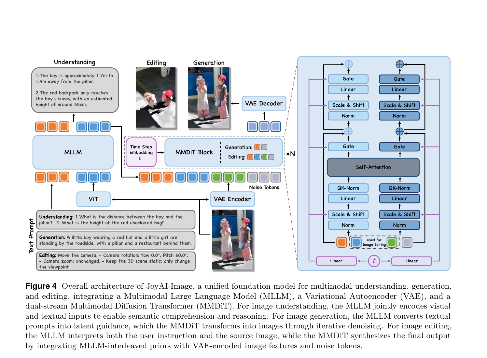
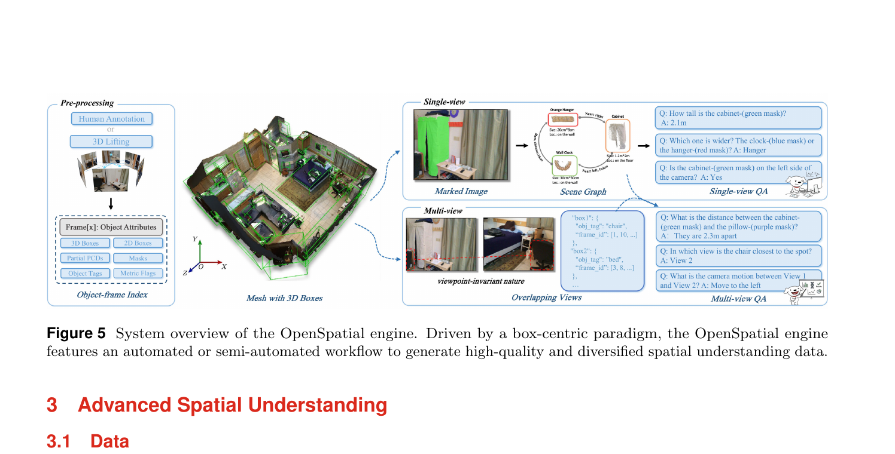
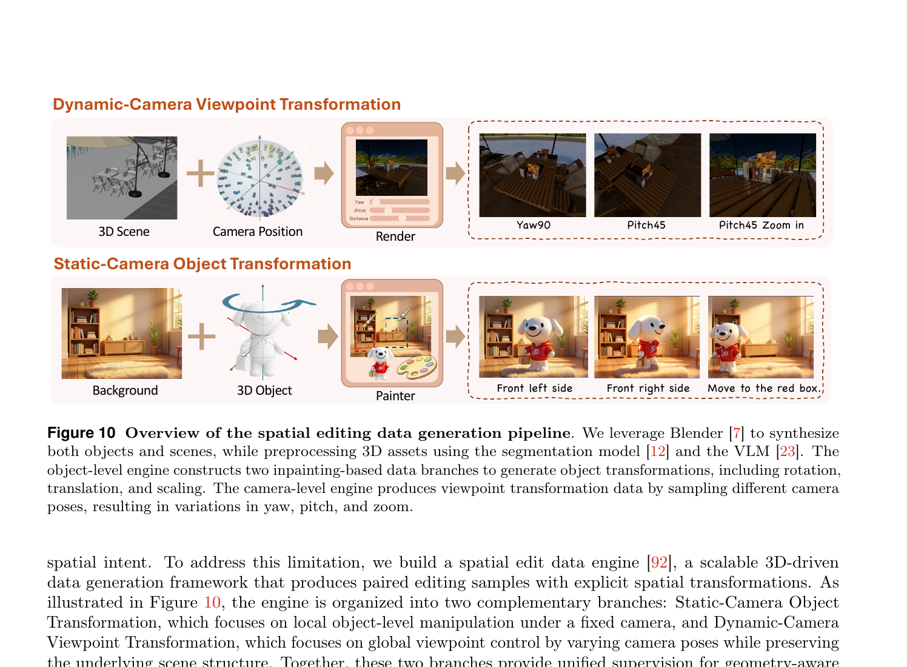
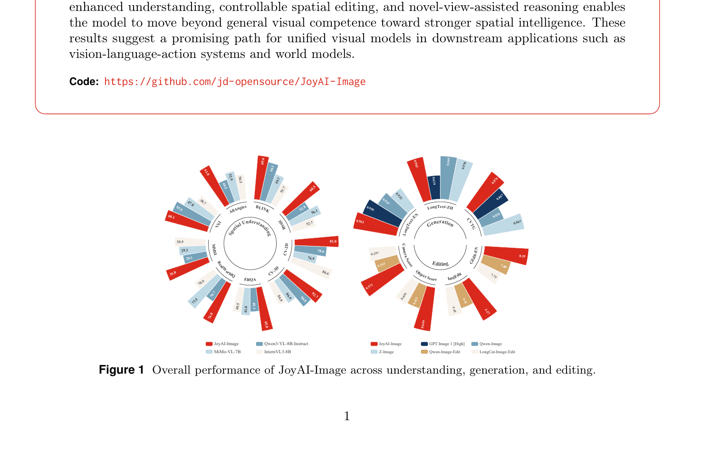
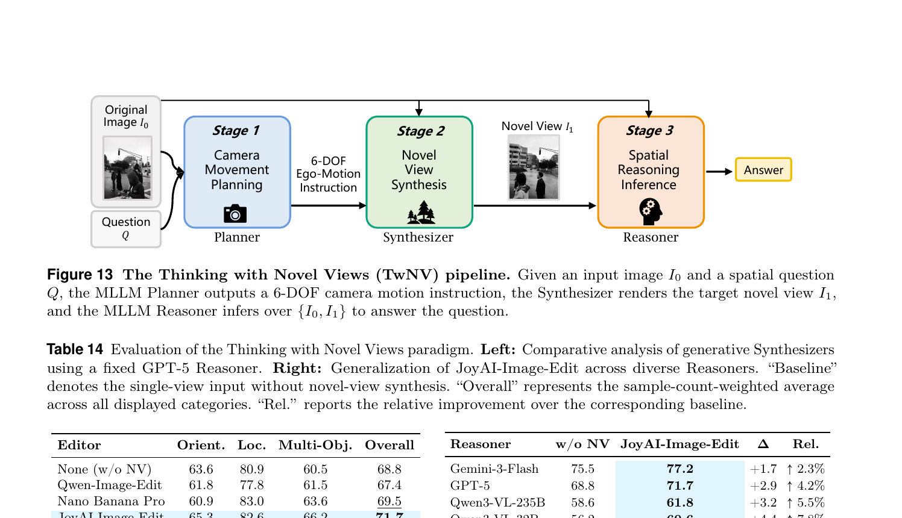

# JoyAI-Image 深度解读

> 论文:JoyAI-Image: Awakening Spatial Intelligence in Unified Multimodal Foundation Models  
> 机构:京东 AI Research（通讯:huanghaoyang.ocean@jd.com）  
> 代码:`/Users/wangsiyuan/workdir/code/JoyAI-Image`

---

## 1. 一句话定位

**统一理解 + T2I 生成 + 指令编辑三任务的多模态图像基础模型**,以"空间智能觉醒"为核心主张:用 Qwen3-VL-8B-Instruct(MLLM) + Wan-2.1-VAE + 16B MMDiT 三组件统一架构,借助 OpenSpatial-3M 空间数据集和 Blender 驱动的 3D 空间编辑数据引擎,让图像模型第一次能精确执行摄像机位移 / 物体旋转平移等几何变换,同时在通用编辑和长文本渲染上保持 SOTA。

---

## 2. 要解决的问题(动机)

当前多模态图像模型的痛点:

| 问题 | 表现 |
|------|------|
| 空间理解能力弱 | 即使是 Gemini-2.5-Pro,3D 场景 QA 均分也只有 59.1;8B 开源 MLLM 更差 |
| 图像编辑缺乏几何意识 | "把相机向右旋转 45°"指令,已有模型只能做近似外观变换,无法满足 3D 一致性 |
| 理解与生成割裂 | 大多数模型要么专注理解,要么专注生成,联合训练易互相干扰 |
| 长文本渲染质量差 | 中英双语图文混排时拼写错误、排版错乱常见 |

论文的核心判断:理解能力和生成/编辑能力之间存在**双向正反馈** —— 更好的空间理解直接改善几何编辑的监督信号质量,更高保真的空间编辑又能反过来为 MLLM 提供视觉反馈,解决仅凭单视角无法推断的遮挡 / 深度模糊问题。

---

## 3. 与前作的关系

| 前作 | 关系 |
|------|------|
| Qwen2.5-VL / Qwen3-VL | MLLM backbone 直接来自这一系列;JoyAI-Image 在其上做空间 SFT + KD |
| Wan 2.1 | VAE(causal 3D Conv)和 DiT 权重复用此框架;MMDiT 基于 WanX 调制机制 |
| InstructPix2Pix, MagicBrush 等图像编辑论文 | 现有编辑模型基线,JoyAI-Image-Edit 在 GEdit/ImgEdit 上全面超越 |
| LongCatImage-Edit, QwenImageEdit | 开源编辑模型中最强竞品;JoyAI 在 SpatialEdit-Bench 上大幅领先 |
| Cosmos 3 / Bernini | 同为统一多任务多模态框架,但聚焦视频生成;本文聚焦图像+空间智能 |

**核心 incremental claim**:空间智能是通过数据工程 + 训练设计从 unified model 中"激活(awaken)"出来的,而非模型结构本身的突破。

---

## 4. 核心算法 / 方法

### 4.1 整体架构



> Fig 4:JoyAI-Image 由 MLLM、VAE、MMDiT 三组件构成,分别对应语义理解 / 编码 / 扩散去噪三阶段。理解任务 MLLM 直接输出文本;生成任务 MLLM hidden states 作为 conditioning 送入 MMDiT;编辑任务 MMDiT 同时接收 MLLM priors、VAE 编码的源图 tokens 和噪声 tokens。

**三任务分工**:

```
理解(Understanding):
  输入 → MLLM (Qwen3-VL-8B-Instruct) → 文本输出
  [standalone mode: ViT 抽特征, LLM 直接生成 answer]

生成(T2I Generation):
  text prompt → MLLM → hidden states (最后层)
             → MMDiT(16B) → VAE Decoder → 图像
  [flow matching: z_t = (1-t)z_0 + t·z_1]

编辑(Instruction Editing):
  source image → VAE Encoder → img tokens (src)
  instruction → MLLM → hidden states
  noise tokens (target latent)
  全部拼接 → MMDiT → 去噪 → VAE Decoder → edited image
```

### 4.2 MMDiT 架构

**双流架构** — `MMDoubleStreamBlock` 是核心单元:

```
输入:img tokens (x_img) + txt tokens (x_txt)

[img stream]                  [txt stream]
  ↓ WanX modulate(t)            ↓ WanX modulate(t)
  Norm → Scale+Shift            Norm → Scale+Shift
     ↘                         ↙
    concat → Self-Attention (joint QKV, MRoPE) → split
     ↙                         ↘
  + Gate (residual)           + Gate (residual)
  Norm → Scale+Shift            Norm → Scale+Shift
  Linear → GELU → Linear       Linear → GELU → Linear
  Gate → +residual              Gate → +residual
```

**关键设计**:
- **QK-Norm** (RMSNorm per head):稳定大规模训练,Wan 系列惯例
- **MRoPE** (Multi-dimensional RoPE):时间(dim=16) + 高度(dim=56) + 宽度(dim=56) = 128 维;通过 `get_nd_rotary_pos_embed` 生成
- **WanX modulation**:timestep embedding 经 `adaLN-single` 风格 MLP 生成 scale/shift/gate,与 SD3/FLUX 的 `modulate` 类似
- **FlashAttention varlen**:多样本长度拼成一个 batch 处理,高效利用显存

**实际模型配置** (来自 `joyai_image_comfyui/configs/transformer/config.json`):

```json
{
  "hidden_size": 4096,
  "num_layers": 40,
  "num_attention_heads": 32,
  "in_channels": 16,       // VAE latent channels
  "patch_size": [1, 2, 2],
  "rope_dim_list": [16, 56, 56],
  "text_dim": 4096         // MLLM hidden states dim
}
```

> 参数量 ~16B,是 Wan2.1 量级的继承。

### 4.3 MLLM Dual Mode

MLLM (Qwen3-VL-8B-Instruct) 在推理时有两种模式:

| 模式 | 行为 | 使用场景 |
|------|------|----------|
| Standalone Understanding | 直接 LLM forward → 文本 token | 纯理解 QA |
| Generative Conditioning | 取最后一层 hidden states → MMDiT conditioning | T2I 生成 + 图像编辑 |

编辑时源图像通过 Qwen3-VL 的 ViT 编码,和指令文本一起送进 LLM,最后层的 hidden states 作为 key/value conditioning 注入 MMDiT 的 txt stream。

### 4.4 生成训练目标(Flow Matching)

$$
\mathcal{L}_{T2I} = \mathbb{E}_{t,z_0,z_1,y}\left[\lVert f_\theta(z_t, y, t) - (z_1 - z_0)\rVert^2\right]
$$

其中 `z_t = (1-t)z_0 + t·z_1`(线性插值),`z_0` 是 Gaussian 噪声,`z_1` 是 VAE 编码的真实图像 latent。模型预测速度场 `v = z_1 - z_0`。

### 4.5 理解训练目标(SFT + Online KD)

$$
\mathcal{L}_{UND} = \mathcal{L}_{SFT} + \lambda \cdot \mathcal{L}_{KL}
$$

- `λ = 10`
- `L_KL` 是对 frozen Qwen3-VL-8B teacher 的在线 KD,仅施加于**通用领域**(非空间理解任务)
- 空间 QA 任务不施加 KD —— 因为 teacher 在空间任务上能力也有限,强制对齐反而损害空间学习

这是本文一个很有意思的设计:有选择性的 KD,用领域标签区分"继承 teacher"vs"从头学"。

### 4.6 空间数据:OpenSpatial-3M



> Fig 5:OpenSpatial-3M 由两条下游支路组成:Single-view QA(从 3D 扫描 + 网络视频自动生成)和 Multi-view QA(跨视角一致性推理);3D box 为中心的统一表示是两条支路共享的语义锚点。

**OpenSpatial-3M 数据集设计**:
- 数据量:3M 条 QA
- 核心表示:3D bounding box(不依赖绝对坐标系,依赖相对几何关系)
- 5 大能力(5 Capabilities):

| 缩写 | 全名 | 含义 |
|------|------|------|
| SM | Spatial Measurement | 距离、尺寸估算 |
| SR | Spatial Relation | 前后左右上下关系 |
| CP | Camera Pose | 摄像机姿态估计 |
| MC | Multi-view Consistency | 跨视角内容一致性 |
| SAR | Spatial Aware Reasoning | 结合推理链的空间 QA |

两条数据支路:
1. **Single-view QA**:从 3D 扫描数据 + 网络视频抽取静态帧,用 3D box 标注后自动合成 QA;覆盖 SM / SR / SAR
2. **Multi-view QA**:从多视角渲染 / 视频序列构建跨帧 QA;覆盖 CP / MC;测试模型对摄像机运动的理解

### 4.7 空间编辑数据引擎



> Fig 10:两条 Blender 渲染支路分别生成"固定相机·物体变换"和"固定场景·相机变换"的成对编辑样本,共享统一指令模板(Fig 11);这是 open-domain 的视频派生编辑对难以提供几何精确标注的关键补充。

**两个引擎支路**:

```
Static-Camera Object Transformation
  3D 物体资产 → Blender 正则化朝向 → 施加变换(旋转/平移/缩放)
  → 合成到场景背景 → SAM 修复 inpainting → (src, tgt) 对
  覆盖:translation, rotation, scaling

Dynamic-Camera Viewpoint Transformation
  3D 场景资产 → 确定 focus 目标 → 采样摄像机姿态(yaw/pitch/distance)
  → Blender 渲染不同视角 → (src, tgt) 对
  覆盖:horizontal orbit, vertical tilt, zoom
```

统一指令模板使两条支路输出格式一致,支持语言指令和可视化界面引导两种形式。

### 4.8 编辑模型后训练:DiffusionNFT

编辑后训练使用 DiffusionNFT 代替简单 RLHF:

**奖励模型**:
- (1) Gemini-3-Flash:instruction-following + consistency
  - 先生成"edited image vs reference 的差异描述"再打分
  - 采用 IF 优先混合策略:IF 低时 consistency reward 被压制,确保 IF 是获得高奖励的必要条件
- (2) HPSv3:naturalness(感知真实感)

**DiffusionNFT 目标**:

$$
\mathcal{L}_{NFT} = \mathbb{E}_{c,\pi^{old}(x_0|c),t,\epsilon}\!\left[r\lVert v_\theta^+(x_r,x_t,c,t)-v\rVert_2^2 + (1-r)\lVert v_\theta^-(x_r,x_t,c,t)-v\rVert_2^2\right]
$$

其中 `r ∈ [0,1]` 是当前样本的最优概率(由奖励模型计算 advantage 后归一化),隐式正策略/负策略为:

$$
v_\theta^+ = (1-\beta)v^{old} + \beta v_\theta \quad \text{(implicit positive)}
$$

$$
v_\theta^- = (1+\beta)v^{old} - \beta v_\theta \quad \text{(implicit negative)}
$$

类比文本的 DPO —— 无需显式 positive/negative pair,通过 `r` 软权重在一个 batch 内同时优化 positive 和 negative 方向。

---

## 5. 关键代码位置

| 功能 | 文件 | 说明 |
|------|------|------|
| MMDiT 主模型 | `src/modules/models/mmdit/dit/models.py` | `Transformer3DModel`, `MMDoubleStreamBlock`, `WanTimeTextImageEmbedding` |
| WanX 调制 | `src/modules/models/mmdit/dit/modulate_layers.py` | `modulate()` 函数;scale/shift/gate |
| MRoPE 实现 | `src/modules/models/mmdit/dit/posemb_layers.py` | `get_nd_rotary_pos_embed` |
| VAE | `src/modules/models/mmdit/vae/wanvae.py` | Wan-2.1-VAE,causal 3D Conv |
| Attention 后端 | `src/modules/models/attention.py` | FA/SDPA 自动选择;varlen 支持 |
| 生成 Pipeline | `src/modules/models/pipeline.py` | 扩散推理入口 |
| 推理调度 | `src/modules/models/scheduler.py` | flow matching scheduler |
| 推理入口 | `src/infer_runtime/model.py:72` | `EditModel.infer()`;无 image → T2I,有 image → Edit |
| 推理入口(理解) | `inference_und.py` | standalone understanding mode |
| Prompt Rewrite | `src/infer_runtime/prompt_rewrite.py` | 调用 OpenAI API 做 prompt 增强(PE) |

**编辑推理关键细节** (`src/infer_runtime/model.py:83`):
```python
# 编辑任务输入格式 — Qwen3-VL chat template
prompts = [f"<|im_start|>user\n<image>\n{params.prompt}<|im_end|>\n"]
```
源图像通过 chat template 的 `<image>` token 注入 MLLM,MLLM 的 hidden states 随后作为 MMDiT 的 txt conditioning。

---

## 6. 关键配置项

```json
// joyai_image_comfyui/configs/transformer/config.json
{
  "hidden_size": 4096,       // 纸面 Table 1 一致
  "num_layers": 40,          // 双流 MMDiT blocks
  "num_attention_heads": 32, // head_dim = 4096/32 = 128
  "in_channels": 16,         // WAN-VAE 16通道latent
  "patch_size": [1, 2, 2],   // temporal×H×W
  "rope_dim_list": [16,56,56],// t/h/w RoPE 维度分配
  "text_dim": 4096            // MLLM最后层hidden dim
}
```

📌 `in_channels=16` vs Bernini 的 `z_channels=3584`:JoyAI-Image 使用 Wan-VAE 的 16 通道 latent 空间(连续扩散),Bernini 使用 ViT embedding 空间(离散化 MAR 范式)。这是两者核心架构差异之一。

📌 MLLM 用 Qwen3-VL-8B-Instruct(支持 thinking mode)而非较小的 Qwen2-VL-7B(Bernini 用此);更强的 MLLM 是空间理解提升的直接原因之一。

---

## 7. 争议 / 权衡

### 7.1 主要结果

**理解**:Spatial Avg 64.4(= Gemini-2.5-Pro,+5.3 over Qwen3-VL-8B base)

**生成**:

| Benchmark | JoyAI-Image | 第二名 | 说明 |
|-----------|-------------|-------|------|
| LongText-Bench EN | 0.963 | — | SOTA |
| LongText-Bench ZH | 0.963 | — | SOTA |
| CVTG-2K Word Acc | 0.8739 | — | SOTA |
| T2I-CoReBench Composition | 94.2 | — | SOTA |

**编辑**:

| Benchmark | JoyAI w/ PE | 次优 | 说明 |
|-----------|-------------|------|------|
| GEdit-Bench-EN G_O | 8.290 | 7.943 (FireRed) | 最优 |
| ImgEdit-Bench Overall | 4.57 | 4.56 (LongCat) | 最优 |
| SpatialEdit Object Overall | 0.649 | 0.439 (LongCat) | 大幅领先 |
| SpatialEdit Camera Error ↓ | 0.429 | 0.699 (LingBot-World 视频模型) | 最优 |



> Fig 1:左侧雷达图展示 JoyAI-Image (红色) 在空间理解多个子任务上碾压同量级开源 MLLM;右侧雷达图展示在生成与编辑维度同样处于最前沿。两图合并说明理解 + 生成 + 编辑三任务同时领先是可行的。

### 7.2 关键权衡和弱点

**Naturalness 是短板**:人类评测中,对比 Nano-Banana-2,JoyAI-Image-Edit 在 Naturalness 仅赢 24.7% vs 48.1%,Overall 输 33.1% vs 52.2%。感知真实感是当前版本最弱的维度。

**PE(Prompt Enhancement)依赖**:最强结果都标注"w/ PE",即用 OpenAI API 做 prompt 改写。去掉 PE 后各指标普遍下降约 0.1-0.2 分。这意味着生产环境需要额外的 LLM 服务。

**选择性 KD 的代价**:空间 QA 任务不用 KD,需要准确的领域标签区分空间 vs 通用 domain。若标签有误,可能导致部分空间数据错误接受 KD 而退化。

**DiffusionNFT vs Flow-GRPO**:生成端用 Flow-GRPO(见论文 §4.5),编辑端用 DiffusionNFT。两套后训练框架并存,工程复杂度较高。

### 7.3 Thinking with Novel Views (TwNV) 应用



> Fig 13:TwNV 将空间推理转化为三阶段动态过程 —— MLLM Planner 先"看"图预测最佳摄像机运动指令(6-DOF),Synthesizer(JoyAI-Image-Edit)渲染新视角,再让 MLLM Reasoner 联合原图与新视角回答问题。用"主动生成"代替"被动推断",从根本上解决了单视角的遮挡 / 深度歧义问题。

TwNV 结果:JoyAI-Image-Edit 作为 Synthesizer 将 GPT-5 准确率从 68.8% 提升到 71.7% (+4.2% rel),Qwen3-VL-32B 从 56.2% 提升到 60.6% (+7.8% rel)。**Small-Model Dividend**:能力较弱的模型从新视角中获益更多,因为它们单靠内部表示无法解析 3D 关系,外部视觉线索价值更高。

---

## 8. 一句话总结

JoyAI-Image 的核心洞察是:**空间智能不是架构问题,而是数据和训练问题** —— 用 OpenSpatial-3M(3M 条 3D box 中心 QA)激活 MLLM 的几何推理,用 Blender 驱动的 3D 空间编辑引擎(两路:固定相机物体变换 + 动态相机视角变换)为 MMDiT 提供可控几何监督,再加上 DiffusionNFT 后训练对齐人类偏好,最终让一个 8B+16B 的统一模型同时在理解 / T2I / 编辑三个赛道上达到开源 SOTA,其中空间编辑能力(SpatialEdit-Bench Object Overall 0.649)已超越所有视频世界模型基线。
