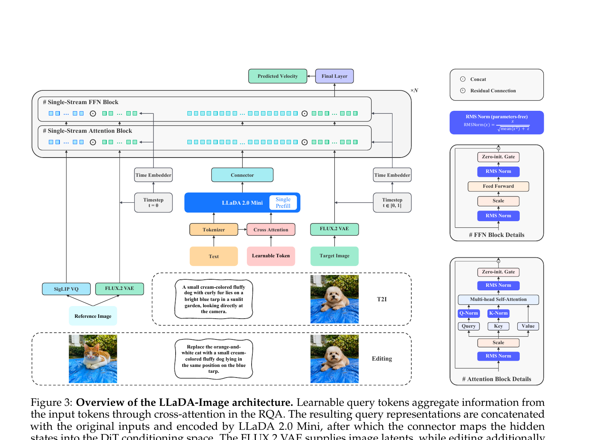
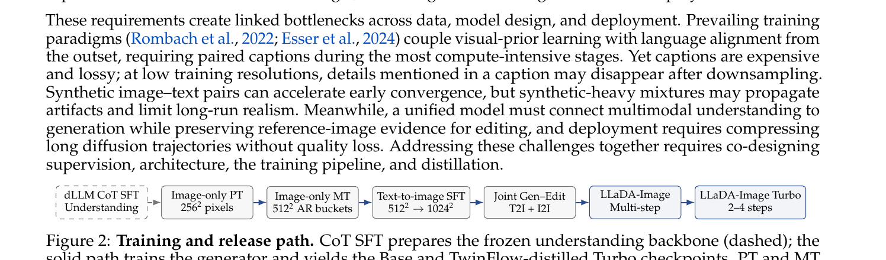
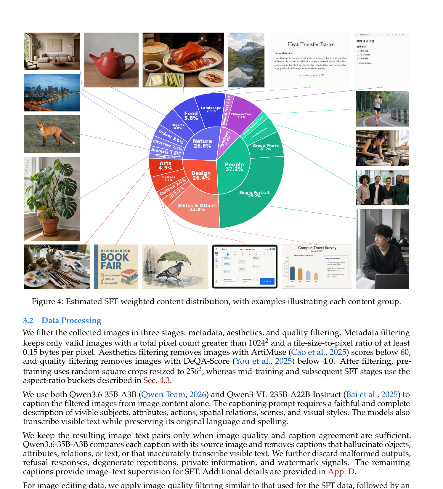
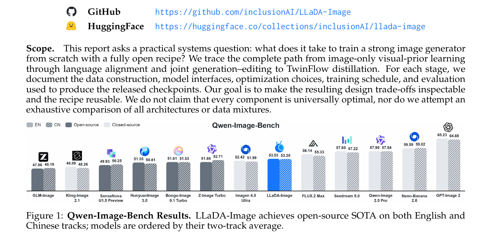

# LLaDA-Image 解读

**论文**: LLaDA-Image: Building Strong Image Generators with Fully Open Training Recipes  
**机构**: Inclusion AI (AGI Research Center), 2026-09  
**arXiv**: https://arxiv.org/abs/2609.03796  
**代码**: https://github.com/inclusionAI/LLaDA-Image  
**HuggingFace**: https://huggingface.co/collections/inclusionAI/llada-image

---

## 1. 一句话定位

用全开放食谱从头训练 6B DiT 做 T2I + 指令编辑：dLLM 理解骨干（LLaDA 2.0 Mini）通过 RQA + Connector 注入条件，98% 真实图片 + 图像-only 预训练打视觉先验，TwinFlow 蒸馏产出 2-4 步 Turbo 版，在 Qwen-Image-Bench 上拿到开源 SOTA（EN 53.53, CN 53.38）。

---

## 2. 要解决的问题

1. **早期配对数据依赖**：主流 T2I 训练（FLUX、SD3）从一开始就需要大量 image-text 对，低分辨率下 caption 描述内容在下采样后可能消失，导致 image-text alignment 质量受损。  
2. **理解与生成分离**：通用 VLM 能理解多模态，但不直接对接生成器的 conditioning space，需要定制 connector 桥接。  
3. **统一 checkpoint**：市面上 T2I 和 editing 通常靠两套 backbone；要在同一 checkpoint 里无缝支持文本生成 + 参考图编辑。  
4. **部署成本**：50 步 DiT 延迟高，需要蒸馏到 2-4 步且不损质量。

---

## 3. 与前作的关系

| 对比维度 | LLaDA-Image | FLUX.2 / SD3 | Janus-Pro / OmniGen |
|---------|-------------|--------------|---------------------|
| 理解骨干 | dLLM (LLaDA 2.0 Mini, 掩码扩散 LM) | T5 / CLIP 文本编码器 | AR-LLM |
| 生成骨干 | 单流 DiT (从零训) | 双流 + 单流 MM-DiT | VAE 上的 AR 或 DiT |
| 早期训练 | 图像-only 预训练 (无 caption) | 从一开始配对 | 配对 |
| 编辑方式 | 参考图像绕过 VLM，直走 SigLIP-VQ + VAE latent 旁路 | 需 ControlNet 或独立编辑模型 | 统一 context |
| 蒸馏 | TwinFlow (DMD 变体，2-4 步) | FLUX.1 Turbo (BFL) | — |

**关键创新点**：将 dLLM（本身也是扩散模型）作为理解骨干，形成"扩散 + 扩散"的统一范式；图像-only 自我条件化预训练（IOMM 思路）解耦视觉先验学习与语言对齐。

---

## 4. 核心方法

### 4.1 整体架构

系统由三部分串联：**dLLM-VLM（理解）→ U2G Connector（桥接）→ 单流 DiT（生成）**。



> **Fig 3 逐段解读**：
>
> **(中央上半部, T2I 路径)**——文本输入经 Tokenizer，再与 Learnable Token（RQA 可学习查询向量）一起通过 Cross Attention 注入 LLaDA 2.0 Mini（蓝色大方块）；整个 VLM 以 Single Prefill 方式运行（仅一次前向，不生成新 token），输出 hidden states 送入 Connector；右侧 Time Embedder 把 `t ∈ [0,1]` 的时间步编码注入 DiT；上方 N 个 Single-Stream Attention + FFN Block 循环处理，最终经 Final Layer 输出 Predicted Velocity（流匹配目标速度场）。
>
> **(中央下半部, Editing 路径)**——Reference Image 同时走两条支路：① SigLIP VQ（左下青色块）提取语义 token，经 DiT-specific embedder 得到 semantic features，与文本条件合并送入 DiT 条件流；② FLUX.2 VAE 编码为 clean latent，与噪声目标 latent `x_t` 直接拼接后进 DiT（像素级参考信号）。参考图完全绕过 VLM，保持 VLM 的通用理解能力不被参考内容污染。
>
> **(右侧方块详图)**——RMS Norm (parameters-free) 公式 `RMSNorm(x) = x / sqrt(mean(x²) + ε)`，无可学习的 scale/shift（Recipe #1）；FFN Block 结构：RMSNorm → Scale（来自 adaLN）→ FeedForward → Scale → Zero-init Gate → 残差连接；Attention Block 结构类似，QK 额外过 Q-Norm / K-Norm（参数无关 RMSNorm）后做 Multi-head Self-Attention。

### 4.2 dLLM 理解骨干

以 **LLaDA 2.0 Mini** 为核心，配备 **SigLIP-VQ** 视觉编码器。三种输入构型：

- **T2I**：`c = c_text = t(s_text)`，纯文本 token。  
- **图像-only 预训练**：`c = concat(c_aux, c̃_img)`，其中 `c̃_img = c_img ⊙ m`（随机掩码图像 patch，`m ∈ {0,1}^N`），强迫 VLM 补全被掩掉的视觉内容。  
- **Editing**：`c = c_text`（只有编辑指令），参考图不进 VLM。

### 4.3 U2G Connector（RQA + Transformer Connector）

VLM 和 DiT 工作在不同表示空间，需两步桥接（`transformer_llada_image.py` 中 `cap_embedder`，外部 `queryformer` + `text_projection` 模块）：

**Step 1 — Residual Query Adapter (RQA)**：

$$\mathbf{q}_\text{res} = q_\psi(\mathbf{q}_0, \mathbf{c})$$

可学习查询向量 `q_0` 通过 Cross Attention 从输入序列 `c` 里提炼生成相关信息，结果作为 residual 追加到 `c` 后面。之后 VLM 以 prefill 模式处理拼接序列：

$$\mathbf{h}_\text{vlm} = g(\text{concat}(\mathbf{c}, \mathbf{q}_\text{res}))$$

**Step 2 — Transformer Connector**：

$$\mathbf{h}_\text{cond} = c_\phi(\mathbf{h}_\text{vlm})$$

浅层 Transformer blocks 将 VLM 的 hidden states 投影到 DiT conditioning space（`cap_feat_dim=2560 → dim=3840`，见 `transformer_llada_image.py:LLaDAImageTransformer2DModel.__init__`）。

### 4.4 单流 DiT 细节

📌 **关键设计决策**（`transformer_llada_image.py`）：

```python
# 参数量
dim = 3840, n_layers = 30, n_heads = 30
# head_dim = 128 = 32(seq) + 48(H) + 48(W)  — 三轴 RoPE

# 参数无关 RMSNorm (Recipe #1)
self.attention_norm1 = RMSNorm(dim, eps=norm_eps, elementwise_affine=False)

# adaLN: 只预测 4 个量（比 DiT 原版的 6 个少）
nn.Linear(min(dim, ADALN_EMBED_DIM), 4 * dim)  # ADALN_EMBED_DIM=256
# 产生 scale_msa, gate_msa, scale_mlp, gate_mlp（无 shift）

# SwiGLU FFN (hidden = dim * 8/3)
self.w1 = nn.Linear(dim, hidden_dim)  # gate branch
self.w3 = nn.Linear(dim, hidden_dim)  # value branch
return self.w2(F.silu(self.w1(x)) * self.w3(x))
```

**per-token adaLN**（编辑时）：噪声 token 和干净参考 latent 各自有不同的 adaLN 调制，通过 `_select_per_token` 按噪声掩码逐 token 切换：

```python
def _select_per_token(noisy_val, clean_val, noise_mask, seq_len):
    noise_mask = noise_mask.unsqueeze(-1)
    return torch.where(noise_mask == 1,
        noisy_val.unsqueeze(1).expand(-1, seq_len, -1),
        clean_val.unsqueeze(1).expand(-1, seq_len, -1))
```

**Refiner blocks**（`n_refiner_layers=2`）：在主 DiT layers 之前有三组 refiner，分别精炼噪声 latent（`noise_refiner`，含 adaLN）、caption features（`context_refiner`，不含 adaLN）、SigVQ 语义特征（`sigvq_refiner`，不含 adaLN）。

**参考图编辑路径**（`pipeline_llada_image.py`）：

```python
# 参考图编码为 clean latent，与 noisy target latent 拼接
x_ref_latent = vae.encode(y_ref)                    # FLUX.2 VAE
x_edit = concat([x_t, x_ref_latent], dim=channel)  # 沿 channel 拼接进 DiT

# SigLIP-VQ 语义特征 → DiT-specific embedder（2层 Transformer）
f_ref = v(y_ref)           # SigLIP-VQ
h_ref = b_omega(f_ref)     # DiT embedder
h_joint = concat([h_cond, h_ref])  # 合并文本条件和参考语义
```

### 4.5 训练流程



> **Fig 2 逐阶段解读**：
>
> - **(虚线框) dLLM CoT SFT / Understanding**：仅训练理解骨干，不涉及生成 DiT。用掩码块扩散（block size b=32）在 Gen:Und:Text=9:9:2 混合数据上做 CoT 监督微调，增强 VLM 的多模态推理能力。
>
> - **(实线, Image-only PT, 256²)**：DiT + RQA + Connector 三件套从零初始化，用图像-only 数据训练。VLM frozen，条件由当前图的自我掩码特征提供（无 caption），学习视觉先验。优化器 Muon，lr=4×10⁻⁴。
>
> - **(Image-only MT, 512² AR buckets)**：分辨率升到 512²，引入 aspect-ratio 分桶，仍用图像-only 自我条件化，平滑过渡分辨率和 conditioning 方式的双重变化。
>
> - **(Text-to-image SFT, 512²→1024²)**：引入 image-text pairs（caption），先在 512² 做文本对齐，再升到 1024² 继续精化，lr 降至 3×10⁻⁵，引入 EMA（ratio=0.9995），使用 logit-normal 时间步采样（P_mean=0.8，偏向高噪声）。
>
> - **(Joint Gen-Edit, T2I + I2I)**：T2I 和 I2I（参考图编辑）以 1:1 比例混合训练，激活参考图旁路（SigVQ + VAE latent）。结束时对多个附近 checkpoint 做参数平均（checkpoint merging）。
>
> - **(TwinFlow 蒸馏, 2-4 steps)**：基于 DMD2 的分布匹配蒸馏，引入共享 DiT 的 fake-score 头（负时间 −t）和 generator 头（正时间 +t），4 步反向仿真对齐学生轨迹，再 TBSM RL 微调。

详细超参见表格（来自 Table 2）：

| 阶段 | 分辨率 | Batch Size | lr | EMA |
|------|--------|-----------|-----|-----|
| PT | 256² | 24,576 | 4×10⁻⁴ | — |
| MT | 512² (bucketed) | 6,400 | 2×10⁻⁴ | — |
| SFT 512² Align | 512² (bucketed) | 4,608 | 5×10⁻⁵ | — |
| SFT 512²→1024² | 1024² (bucketed) | 2,048 | 3×10⁻⁵ | 0.9995 |
| SFT Refine | 1024² (bucketed) | 2,880 | 3×10⁻⁵ | 0.9995 |
| Editing | 1024² (bucketed) | 2,688 | 3×10⁻⁵ | 0.9995 |
| Distillation | 1024² (bucketed) | 256 | 5×10⁻⁶ | 0.995 |

全程使用 **Muon 优化器**（非 AdamW）。

### 4.6 图像-only 自我条件化（Recipe #3）

核心观察：**图像本身已经包含了描述自己所需的全部高层语义**，冻结 VLM 可以直接从同一张图的可见 patch 中提取语义作为条件。

$$\tilde{\mathbf{c}}_\text{img} = \mathbf{c}_\text{img} \odot \mathbf{m}, \quad \mathbf{c} = \text{concat}(\mathbf{c}_\text{aux}, \tilde{\mathbf{c}}_\text{img})$$

其中 `c_aux = t(s_aux)` 是固定辅助 prompt（如 "Generate an image identical to the reference image."），`m ∈ {0,1}^N` 是随机掩码。这样 DiT 被训练成一个稀疏-to-dense 补全器，无需任何 caption。

**分辨率-aware 图像采样**：不把整张图下采样到 256²，而是随机从原图中裁一块原生分辨率为 256² 或略大的区域，再轻度缩放到 256²。这样 VLM 看到的是局部高分辨率细节，条件与实际要生成的目标完全一致。

### 4.7 流匹配训练目标

$$\mathcal{L}_\text{FM}(\theta, \phi, \psi) = \mathbb{E}_{\mathbf{y}, \mathbf{x}, \mathbf{z}, t, \mathbf{m}} \left[ \lVert F_\theta(\mathbf{x}_t, t, \mathbf{h}_\text{cond}) - (\mathbf{z} - \mathbf{x}) \rVert_2^2 \right]$$

其中 `z ~ N(0, I)`，插值 `x_t = (1-t)x + tz`，预测的是常数速度场 `z - x`。

---

## 5. 关键代码位置

| 模块 | 文件 | 关键内容 |
|------|------|---------|
| DiT 主体 | `src/models/transformer_llada_image.py` | `LLaDAImageTransformer2DModel` —— 所有 block、adaLN、refiner、RoPE、final layer |
| Transformer Block | 同上, `LLaDAImageTransformerBlock.forward` | per-token adaLN (`_select_per_token`)；无参数 RMSNorm |
| 推理 Pipeline | `src/pipelines/pipeline_llada_image.py` | `_encode_text` 展示 prompt 格式 `<role>HUMAN</role> Generate an image: {prompt}\n<role>ASSISTANT</role>\n<IMAGE1>`；`_patchify_latents` 做 2×2 空间 patchify |
| RQA | `src/models/` (`LLaDAImageQueryFormerModel`) | 可学习查询向量的 cross-attention prefill |
| Connector | `src/models/` (`LLaDAImageTextProjectionModel`) | VLM hidden states → DiT conditioning space |
| SigVQ | `src/models/` (`LLaDAImageSigVQModel`) | 参考图语义特征提取 + DiT embedder |

**Pipeline 组件加载顺序**（`model_cpu_offload_seq`）：  
`text_encoder → queryformer → text_projection → sigvq → transformer → vae`

**Prompt 格式**（`pipeline_llada_image.py:_encode_text`）：
```python
f"<role>HUMAN</role> Generate an image: {prompt}\n<role>ASSISTANT</role>\n<IMAGE1>"
# 无 prompt 时：
"<role>HUMAN</role> Generate an image.\n<role>ASSISTANT</role>\n<IMAGE1>"
```

---

## 6. 关键配置项

```python
# DiT 规格
dim = 3840          # 隐层维度
n_layers = 30       # 主 Transformer block 数
n_heads = 30        # 注意力头数 → head_dim = 128
n_refiner_layers = 2  # noise/context/sigvq refiner 各 2 层
in_channels = 128   # FLUX.2 VAE latent 通道数 (16 × 2×2 patchify)

# RoPE
rope_theta = 256.0
axes_dims = (32, 48, 48)     # seq + H + W 三轴维度，合计 = head_dim
axes_lens = (32768, 1024, 1024)  # 最大序列/H/W 位置数

# adaLN embedding
ADALN_EMBED_DIM = 256  # 时间步 embedding 压缩维度（节省参数）

# 推理
Sampling steps (Base): 50   Sampling steps (Turbo): 2-4
```

**数据过滤**：
- 最低像素数 `≥ 1024²`，file-size/pixel ratio `≥ 0.15 bytes/px`
- ArtiMuse 美学分 `≥ 60`，DeQA-Score `≥ 4.0`
- Caption 由 Qwen3.6-35B-A3B 生成并做 self-consistency 过滤

---

## 7. 争议与权衡

**真实数据 vs 合成数据**（Recipe #4 深挖）：报告明确指出真实图像主导（98% real, SFT 阶段 >70%）会让早期 benchmark 收敛更慢，但最终生成 realism 更强、长期能力上限更高。这与不少 closed-source 模型用大量合成 caption 快速堆分数的路线不同。

**Editing 的弱点**：GEdit-Bench Semantic Consistency（G_SC）在英文轨道达 8.043，与顶尖 editing 专模（SenseNova 8.172 overall）差距不在指令理解而在 Perceptual Quality（G_PQ 7.182），说明统一 checkpoint 的代价是编辑后图像的感知质量不如专门的编辑 backbone。

**Counting 弱点**：GenEval Counting 得分仅 0.53，远低于 SenseNova（0.85）和 Seedream（0.91），暴露了 DiT 在精确数量控制上的短板。

**RQA 的 prefill overhead**：RQA 的 prefill 需要处理 `concat(c, q_res)` 的整个序列，比直接用 T5 embedding 多一次 VLM 前向，但好处是 VLM 可以感知生成相关的 query 并调整输出，比静态 embedding 更灵活。

**Muon vs AdamW**：Muon（基于矩阵正交化的二阶类优化器）在所有生成阶段替代 AdamW，但 CoT SFT 理解阶段仍用 AdamW。Muon 对大 batch、大模型的稳定性有实践优势，但对超参敏感，文档里没有给出详细 Muon 特有超参。

---

## 8. 一句话总结

LLaDA-Image 用"dLLM 理解骨干 + 图像-only 预训练打视觉先验 + 渐进配对 SFT + TwinFlow 蒸馏"的完整开放食谱，在不依赖海量配对数据的前提下把 T2I + 指令编辑统一进一个 6B checkpoint，拿到开源 SOTA。

---

## 数据分布



> **Fig 4 解读**：饼图展示 SFT 阶段加权后的内容构成，外圈为细分子类。整体上 People（37.2% = 25.2% 单人 + 6.1% 群像 + 其他人物）和 Design（26.4% 海报/设计/Slides）占大头，反映了实际 T2I 主要需求；Nature（26.6%）是第三大类。合成内容（Synthetic，图中靠右浅色区域）占比被严格控制在少数，主要用于中文文字渲染（Chinese Text 7.7%）和 English Text（2.1%）的专项增强。周围示例图覆盖自然风光、食物、人像、设计海报、中文书法、UI 截图，说明数据来源的多样性。

---

## 实验结果

### Qwen-Image-Bench（主 benchmark）



> **Fig 1 解读**：横轴为各模型，纵轴为总分，每组有 EN（实心）和 CN（斜线）两条柱。LLaDA-Image（蓝色高亮）EN 53.53 / CN 53.38，是开源最高分，超过 Z-Image Turbo（EN 51.66）约 1.87 分。Seedream 5.0（57.80/57.22）和 Qwen-Image 2.0 Pro（57.90/57.84）虽更高，但均为闭源。GPT-Image 2 以 65.23/64.69 领先所有模型。

### 主要 benchmark 汇总

| Benchmark | LLaDA-Image | 开源最优竞品 | 说明 |
|-----------|------------|------------|------|
| Qwen-Image-Bench EN | **53.53** | Z-Image Turbo 51.66 | 开源 SOTA |
| Qwen-Image-Bench CN | **53.38** | Z-Image Turbo 52.71 | 开源 SOTA |
| LongText-Bench EN | 0.923 | Qwen-Image 2512: 0.956 | 长文字渲染 |
| LongText-Bench ZH | 0.913 | Boogu-Image 0.1 Base: 0.969 | |
| CVTG-2K Word Acc (avg) | 0.875 | SenseNova: 0.887 | 多区域文字 |
| CVTG-2K NED | 0.945 | SenseNova: 0.943 | |
| GenEval Overall | 0.85 | SenseNova: 0.89 | Counting 弱（0.53） |
| DPG-Bench Overall | 87.48 | LLaDA-Image Turbo: 88.55 | |
| GEdit-Bench EN | 7.336 | SenseNova: 8.172 | 编辑整体分 |
| GEdit-Bench CN | 7.294 | Seedream 4.5: 7.800 | |

---

## Q&A

**Q: 为什么编辑路径要让参考图完全绕过 VLM？**

A: 有两个原因。第一，直觉上 VLM 的角色是"理解指令/文本"，如果把参考图也喂进去，VLM 会同时看到"要做什么（指令）"和"参考内容（图像）"，但 VLM 是以 token-level 语义为目标训练的，不善于保持低频纹理、光照等像素级细节。第二，参考图若进 VLM，会与文本在同一序列里竞争注意力，可能干扰指令理解。解决方案是双流：语义流（SigLIP-VQ + 2层 Transformer embedder）负责"知道参考图长什么样"，像素流（FLUX.2 VAE clean latent 直接拼 `x_t`）负责"在不该改动的区域复制像素"。两流在进 DiT 主体之前合并，实现语义引导 + 像素保真的分离控制。

---

**Q: 图像-only 预训练和 IOMM 有什么关系？**

A: LLaDA-Image 的图像-only 预训练（§4.2）直接引用并扩展了 IOMM（Image-Only Training for Unified Multimodal Models, Sun et al. 2026c）。IOMM 的核心观察是：冻结 VLM 已经知道如何把图像理解成语义，因此可以用这个理解能力来自我条件化生成，无需 caption。LLaDA-Image 的贡献是把这个思路放入渐进训练流程（PT→MT→SFT），并加入分辨率-aware 局部裁剪策略（避免全图下采样破坏细节与条件的对应关系），以及在编辑阶段关掉图像-only 条件、转而用参考图旁路。

