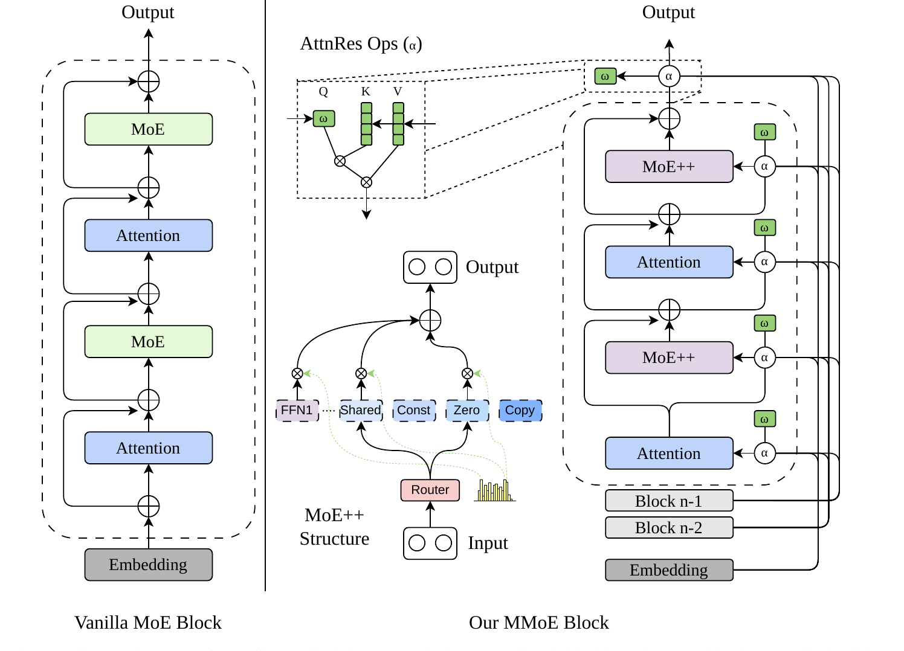
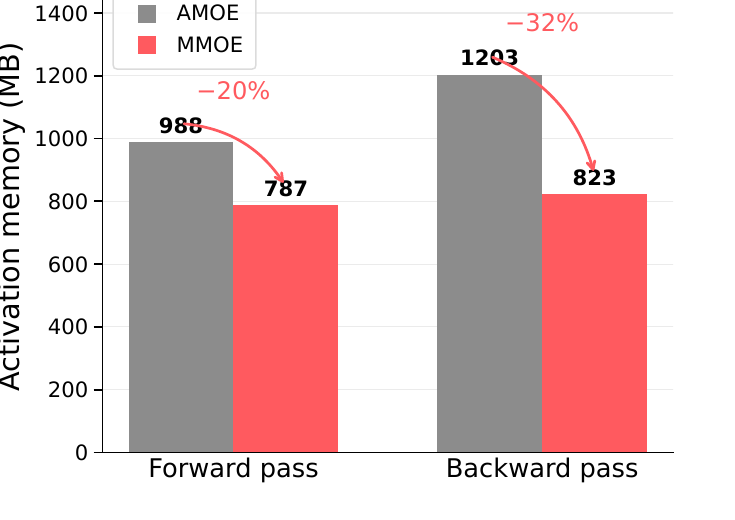
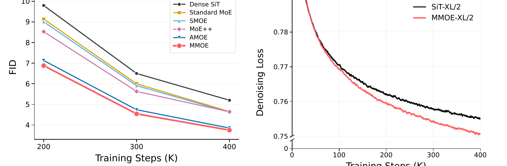

# MMOE: Modernizing Diffusion Transformers with Efficient Expert Design

- **机构**:南洋理工大学(NTU) + 中国电信人工智能研究院(TeleAI)
- **时间**:2026-07-27,arXiv:2607.24665v1(投 IEEE TVCG)
- **代码**:未开源(截至 2026-08)
- **别名**:ModernMOE

---

## 1. 一句话定位

**ConvNeXt 式的"现代化"研究,但对象是 DiT 的 MoE 化。**作者不发明新机制,而是把 LLM MoE 里已被验证的四件效率武器 —— routed experts、shared expert、MoE++ 轻量零计算专家 + gate-residual routing、attention-residual 跨深度复用 —— **逐个搬进 SiT backbone,在完全对齐的训练配方下一层层叠加**,看每一件到底值多少 FID、多少显存、多少 wall-clock。

全部实验固定在**单台 8×H100、batch 256、400k step** 的预算内,这是论文的核心叙事:**AFM 不该靠堆总参数量和稀疏比来 scale,而该像 LLM 那样靠效率机制来 scale。**

📌 **但这篇论文最有价值的信息藏在消融表里,而且和标题讲的不是同一件事** —— 见 §7.1。

---

## 2. 要解决的问题(动机)

LLM 侧的 MoE 之所以能落地,靠的是**一整套让"容量涨、单 token 成本不涨"的机制**:top-k 路由把激活计算与总容量解耦、zero-computation expert 让部分 token 跳过 MLP、gate-residual 让路由跨层稳定。

而扩散侧的 MoE 现状是**只学了"变大"这一半**:

| 工作 | 总参数 | 训练迭代 | batch |
|---|---|---|---|
| DiT-MoE | 4.1B(16B 版本另有) | 7M | 1024 |
| Race-DiT | 2.79B | 1.7M | 1024 |

这些工作把专家池和稀疏比往上推,却几乎没引入上面那套效率机制。而**扩散比 LLM 更吃这套机制** —— 因为采样要把整个 backbone 重复跑几十上百次,**路由开销、专家 dispatch、通信、负载均衡在每一步去噪都要重来一遍**。

于是问题变成:**LLM MoE 的哪些效率设计真的能迁移到扩散 transformer,组合起来又该怎么排?**

---

## 3. 与前作的关系

| 类别 | 代表 | MMOE 的态度 |
|---|---|---|
| DiT / SiT backbone | DiT、SiT | **直接作为 backbone,外部接口完全不改** |
| 扩散 MoE(堆规模) | DiT-MoE、Race-DiT、DSMoE | 靶子:只放大不提效 |
| 扩散 MoE(改路由) | EC-DIT(expert-choice)、Diff-MoE(时间/空间自适应)、DiffMoE(动态 token 选择) | 各自只动一个路由策略,MMOE 做的是**组合扫描** |
| LLM MoE 效率机制 | DeepSeekMoE(共享专家)、MoE++(零计算专家)、Mixture-of-Depths、Attention Residuals | **被搬运的对象** |
| 现代化方法论 | ConvNeXt | **方法论祖师爷** |

**Incremental claim**:不是"我提了个新路由",而是"**我把 LLM 的效率机制系统性地移植进扩散 transformer,并给出每一件的边际收益**"。论文明确说 MMOE 与 diffusion / flow matching 的选择正交 —— 它不动生成目标、不动条件接口、不动 sampler,**只改 transformer block 内部**。

> 📎 **与本仓库 [DAR](../dar/analysis.md) 强相关**:DAR 也是在做 DiT 的跨层信息路由(把固定权重残差换成 timestep-aware softmax 加权跨层聚合)。MMOE 的 attention-residual aggregation 本质是同一个方向的另一种实现 —— 而且如 §7.1 所示,**它才是 MMOE 涨点的真正来源**。两篇一起读能看清"跨深度信息复用"这条线在 2026 年被独立发现了两次。

---

## 4. 核心算法 / 方法



> **Fig 1 逐区域解读**:整图由竖线分成左右两半,左边是对照组,右边是 MMOE,右半又嵌了两个放大子图。
>
> **左半 — Vanilla MoE Block**:最朴素的形态。Embedding 进来,`Attention → ⊕ → MoE → ⊕ → Attention → ⊕ → MoE → ⊕` 一路向上。每个 ⊕ 只接**紧邻的上一层**输出(短残差),虚线框圈出一个 block 的范围。绿色 MoE 就是把 dense FFN 换成一小池 routed feed-forward experts,除此之外和标准 transformer 没有区别。
>
> **右上子图 — AttnRes Ops (α)**:放大展示 α 这个算子内部。左侧一路输入经绿色 `ω` 做投影产生 **Q**,右侧输入产生 **K** 和 **V**(K、V 画成竖着的多格方块,表示它们是**多个历史 block 状态堆叠而成的序列**)。Q 与 K 做 ⊗ 得到注意力权重,再与 V 做 ⊗ 得到聚合结果向下输出。关键点:**这里的"注意力"不是在 token 维度做的,而是在"历史 block 状态"这个维度上做的** —— 它在问"当前这一层该从之前哪几个 block 的输出里取信息"。
>
> **右中子图 — MoE++ Structure**:Input 进来先过红色 **Router**(右边的黄色柱状图表示路由 logits 的分布),Router 用绿色虚线箭头把权重分发给五类专家。五类专家从左到右是:**FFN1**(标准重专家,粉色,虚线框表示池中还有多个)、**Shared**(始终激活的共享专家)、**Const**(常量专家)、**Zero**(零专家)、**Copy**(拷贝专家)。被选中的专家输出经 ⊗ 乘上路由权重,再 ⊕ 求和成 Output。**核心设计在于后三类"轻量专家"根本不做 MLP 计算** —— Copy 是恒等、Zero 是置零、Const 是与一个可学常量做两路混合。
>
> **右半主图 — MMOE Block**:虚线框内是一个 block,内部顺序仍是 `Attention → ⊕ → MoE++ → ⊕ → Attention → ⊕ → MoE++ → ⊕`,但**每个子层前面都多挂了一个 α 圆圈和一个绿色 ω 方块**。看右侧那一大束折线:它们从 **Block n-1、Block n-2、… 一直到 Embedding** 拉出来,汇入每一个 α。也就是说,**每个 attention 子层和每个 MoE++ 子层在计算前,都会先用 α 从"所有已完成的历史 block 状态 + 当前部分状态"里做一次加权聚合**,而不是只拿紧邻的上一层输出。
>
> **左右对比的本质**:vanilla 版只有"纵向短残差";MMOE 版在纵向之外加了一整套"横向跨深度回看"。加上 MoE++ 的轻量路由,一个 block 的账变成:**该重算的地方(深层 MLP)可以偷懒,该回看的地方(跨深度信息)反而看得更远。**

### 4.1 MoE++ 专家层

隐状态 `H ∈ R^{B×T×D}` 先把 batch 和 token 维压平成 `N = BT` 个 token。路由是一个两层门控:

$$
g(h) = W_2 \tanh(W_1 h)
$$

其中 `h ∈ R^D`,`W_1 ∈ R^{8E×D}`,`W_2 ∈ R^{E×8E}`,`E` 是专家数。**注意隐藏层宽度是 `8E` 而不是 `E`** —— 路由器本身有一定容量,不是简单线性投影。

**gate-residual routing** 把上一层的路由倾向带下来:

$$
\ell_i = g(h_i) + A\, r_i^{\mathrm{prev}}
$$

`A ∈ R^{E×E}` 把上一层的 gate residual `r_i^prev ∈ R^E` 映射进当前 logit 空间,`ℓ_i` 既是本层路由依据,也作为下一层的 gate residual 往下传。**这一项是路由跨层稳定性的来源** —— 后面 Table X 里 1~3% 的极低 switch rate 主要靠它。

输出是 top-2 专家的加权和:

$$
\mathrm{MMOE}_{\mathrm{mlp}}(h_i) = \sum_{e \in \mathcal{T}_2(i)} p_{i,e}\, f_e(h_i)
$$

**专家池构成**(共 `E` 个):`E-4` 个标准 MLP 重专家 + **2 个 constant** + **1 个 copy** + **1 个 zero**。三类轻量专家的定义:

$$
f_{\mathrm{copy}}(h) = h, \qquad f_{\mathrm{zero}}(h) = 0
$$

$$
f_{\mathrm{const},j}(h) = \pi_{j,0}(h)\, h + \pi_{j,1}(h)\, a_j, \qquad \pi_j(h) = \mathrm{softmax}(W_j h)
$$

`a_j ∈ R^D` 是可学常量向量,`W_j ∈ R^{2×D}` 产生两路混合权重。也就是说 constant expert = **"原样保留"与"替换成一个固定语义向量"之间的自适应插值**,代价只有一次 `2×D` 的投影。

两个实现细节(论文脚注,很容易漏但影响复现):

1. **zero expert 被选中时,其权重在重归一化前被置 0**,剩余权重全给另一个专家 —— 所以这个 token 实际上**只被一个专家处理**。
2. 默认路由模式下,dispatch 出去的 token 特征**预先乘了 top-k 因子**,即专家实际吃到的是 `2h_i` 而非 `h_i`,输出再乘 `p_{i,e}`。

### 4.2 MMOE transformer block

沿用 SiT 的 adaLN-Zero,从条件向量 `c` 一次产出六个调制向量:

$$
(\Delta_{\mathrm{msa}}, S_{\mathrm{msa}}, G_{\mathrm{msa}}, \Delta_{\mathrm{mlp}}, S_{\mathrm{mlp}}, G_{\mathrm{mlp}}) = \mathrm{MLP}_{\mathrm{adaLN}}(c)
$$

attention 子层:

$$
z_{\mathrm{attn}} = z + G_{\mathrm{msa}} \odot \mathrm{Attn}\!\left(\mathrm{mod}\!\left(\mathrm{LN}(z), \Delta_{\mathrm{msa}}, S_{\mathrm{msa}}\right)\right)
$$

MLP 子层(注意 `r^prev` 进、`r^next` 出,就是 gate residual 的传递):

$$
m,\, r^{\mathrm{next}} = \mathrm{MMOE}_{\mathrm{mlp}}\!\left(\mathrm{mod}\!\left(\mathrm{LN}(z_{\mathrm{mlp}}), \Delta_{\mathrm{mlp}}, S_{\mathrm{mlp}}\right), r^{\mathrm{prev}}\right)
$$

$$
z_{\mathrm{out}} = z_{\mathrm{mlp}} + G_{\mathrm{mlp}} \odot m
$$

📌 **一个工程小心机**:block 把 `(Δ_mlp, S_mlp, G_mlp)` **缓存**下来,MLP 子层不再重新跑一遍 adaLN 投影。看起来是省一点点,但 adaLN 投影是 `D → 6D` 的大矩阵,在 28 层上累积不算小。

### 4.3 Attention-residual 前向过程

模型维护两个东西:**已完成 block 状态列表 `C`** 和**当前部分状态 `u`**。每个 attention 子层前、每个 MLP 子层前,各做一次聚合。若 `C` 非空:

$$
V = [s_1, \dots, s_M, u]
$$

$$
\alpha_i = \mathrm{softmax}_i\!\left(q^{\top} \mathrm{RMSNorm}(V_i)\right), \qquad \mathrm{AttnRes}(V) = \sum_i \alpha_i V_i
$$

`q` 是一个**可学的伪 query**,沿状态维度打分。attention 前和 MLP 前**各用一套独立的投影和 RMSNorm 参数**,所以每层有两次独立的"回看"机会。

**Algorithm 1 的分组机制**(这是最容易读漏的部分):

```
u ← PatchEmbed(x) + PosEmbed
c ← e_t(t) + e_y(y)
C ← [] ,  r ← None ,  h ← u
for block i = 1..L:
    z_attn ← u              if C 为空
             AttnRes_i^attn(C, u)  否则
    (u, cache) ← AttentionSubLayer_i(z_attn, c)
    z_mlp  ← u              if C 为空
             AttnRes_i^mlp(C, u)   否则
    (u, r)  ← MMOESubLayer_i(z_mlp, c, r, cache)
    h ← u
    if i 到达 block-group 边界:
        C.append(u)      # 把当前部分状态归档
        u ← 0            # 部分状态清零
return Unpatchify(FinalLayer(h, c))
```

- 边界间隔在实现里是 **`block_size / 2`**。
- 每到边界:**当前状态归档进 `C`,然后 `u` 清零**。清零之后,新一组的第一个子层聚合的是"历史归档 + 一个零占位"。
- 关键保护:**`h` 始终保存最新的 block 输出**,最终预测头用的是 `h` 而不是 `u`,所以边界清零**不会抹掉输出**。
- 这个设计的意图:避免让每一层都去 attend 所有中间层状态(那样代价是 `O(L²)`),同时又保留跨组回看的能力。

整个流程**不引入任何新的生成目标、条件分支或 sampler** —— 这是论文反复强调的"外部接口不变"。

---

## 5. 关键代码位置

**论文未开源。**可复现的锚点:

| 组件 | 参考实现 | 说明 |
|---|---|---|
| SiT backbone | `willisma/SiT` | MMOE 声明"外部接口完全不变",可直接在其 block 上改 |
| MoE++ 专家层 | MoE++ 官方实现(ICLR 2025) | copy/zero/const 专家 + gate residual 的原始出处 |
| adaLN-Zero | DiT / SiT 的 `DiTBlock` | 需额外缓存 `(Δ_mlp, S_mlp, G_mlp)` |
| AttnRes | 无现成实现 | 按 §4.3 的 `V=[s_1..s_M,u]` + 伪 query softmax 手写,注意两套独立参数 |

---

## 6. 关键配置项

### 训练配方(全部变体共享,这是"受控"的前提)

| 项 | 值 |
|---|---|
| 数据 / 分辨率 | ImageNet-256 class-conditional(另有 512 对照) |
| Latent | SD 风格 VAE,`32×32×4` |
| 生成公式 | linear interpolant + **velocity prediction** + uniform timestep |
| CFG dropout | class label dropout **p=0.1** |
| 硬件 | **单节点 8×H100** |
| batch / steps | **256 / 400k** |
| 优化器 | AdamW,lr **1e-4**,betas (0.9, 0.999),**no weight decay** |
| 精度 / 裁剪 | fp16 混合精度,max grad norm **1.0** |
| EMA | decay **0.9999**,全部报告 EMA checkpoint |
| MoE 辅助损失 | load-balancing loss 系数 **0.01** |

### 评测协议(注意不同表用了不同协议)

| 表 | sampler | 步数 | CFG | 样本数 |
|---|---|---|---|---|
| Table I(主对比)、V、VI、VII | ODE | 50 | 1.5 | 50k |
| Table III(模型尺度)、IX(guidance) | ODE | **250** | 1.0 / 1.5 | 50k |
| Table VIII(步数扫描) | ODE / SDE | 50~250 | — | **10k** |

📌 **协议不统一是读这篇论文最大的坑**。Table VII 明确显示同一个 checkpoint 在 10k 样本下 FID=6.64、50k 下 FID=3.75 —— **差了 1.8 倍**。而 Table VIII 的步数扫描全部基于 10k 样本,所以那张表只能当诊断,不能当结论。

### 专家池配置(1B 级 L/2 实验,Table IV)

- 8 个专家 = **4 标准 MLP + 2 constant + 1 copy + 1 zero**
- top-2 路由

---

## 7. 争议 / 权衡

### 7.1 📌 标题讲的是 expert design,但涨点的其实是 AttnRes

把 Table I 的 400k 那一行拆成边际增量:

| 步骤 | 变体 | FID@400k | Δ vs 前一步 | 训练时长 |
|---|---|---|---|---|
| 起点 | Dense SiT | 5.20 | — | **23h** |
| +routed experts | Standard MoE | 4.65 | **−0.55** | 54h |
| +shared expert | SMOE | 4.62 | −0.03 | 45h |
| +轻量专家/gate-residual | MoE++ | 4.64 | **+0.02(变差)** | 46h |
| +attention-residual | AMOE | 3.85 | **−0.79**(相对 SMOE) | **120h** |
| 全部组合 | **MMOE** | **3.75** | −0.10 | **67h** |

**四件搬来的武器里,只有两件真正改善 FID:标准 routed experts(−0.55)和 attention-residual(−0.79)。共享专家几乎无效(−0.03),MoE++ 轻量专家在 400k 时甚至略微变差(+0.02,与 SMOE 的 4.62 基本打平)。**

论文自己也承认这点:*"MoE++ helps mainly at the early and middle checkpoints and is essentially tied with SMOE at 400k (4.64 versus 4.62)"*。

那 MoE++ 的价值在哪?**在成本,不在质量**:

- AMOE(只加 AttnRes)要 **120h**;MMOE(AttnRes + 轻量专家)只要 **67h**,还顺带把 FID 从 3.85 压到 3.75
- Fig 4 显示同参数量下单 block 激活显存前向 **−20%**(988→787 MB)、反向 **−32%**(1203→823 MB)



> **Fig 4 逐柱解读**:两组柱子分别是前向和反向。**灰柱 = AMOE**(标准重专家 + AttnRes),**红柱 = MMOE**(轻量专家 + AttnRes)。两个配置用的是**同一个 XL/2 block、hidden width 1152、同为 42.5M 参数** —— 参数量对齐是这张图成立的前提,否则省显存毫无意义。
>
> **前向**:988 MB → 787 MB,红色标注 **−20%**。
> **反向**:1203 MB → 823 MB,**−32%**。反向省得更多,因为跳过的 MLP 不仅不存激活,连梯度计算图都不用建。
>
> **为什么能省**:Table X 显示 44.6%(早期 block)到 23.4%(后期 block)的路由槽位被 copy / zero / const 占据。这些路由**完全不执行 MLP**,对应的激活存储与梯度计算直接消失。
>
> **放到全模型的量级**:28 个 transformer block 累加,约省 **5.5 GB 前向 + 超过 10 GB 反向**激活显存。这才是"efficient expert design"这个标题真正兑现的地方。

**所以正确的一句话总结应该是:AttnRes 负责涨点,MoE++ 负责让 AttnRes 付得起。**标题只写了后者,这是个不太诚实的取名 —— 但论文正文的表述("attention-residual aggregation gives the largest single jump among the measured components")是准确的。

### 7.2 全部对比是 iso-step,不是 iso-compute

这是最需要警惕的一点。Table I 的横向比较全部固定在 **400k step**,但训练时长从 23h(dense)到 120h(AMOE)差了 5 倍。

**论文从来没做过"同 wall-clock 下 dense SiT 能跑到多少 FID"这个对比。**按 23h/400k 的速度,67h 大约够 dense SiT 跑 **1.17M step**。SiT 从 300k(6.50)到 400k(5.20)还在陡降,外推到 1.1M 未必到不了 3.75 附近。

论文的辩解是"实测是通信瓶颈"(`ncclAllReduce` 吃掉几乎全部 profiled 通信开销,`cudaStreamSynchronize` 占约一半 profiled 时间),暗示时长差距有工程优化空间。这个辩解成立,但**在优化之前,MMOE 的 wall-clock 优势不成立**。

📌 **读这篇论文的正确姿势:把它当成"架构消融报告",不要当成"训练效率报告"。**

### 7.3 与已发表 diffusion-MoE 的差距很大,而且论文明说了

Table II:

| 方法 | 总参数 | 激活参数 | 训练迭代 | FID |
|---|---|---|---|---|
| SiT-XL/2(自跑) | 676M | — | 400k | 4.91 |
| **MMOE-XL/2(自跑)** | **1.57B** | **≤770M** | **400k** | **3.60** |
| ProMoE-XL/2 | 1.57B | 675M | 500k | 4.11 |
| DiT-MoE-XL/2 | 4.1B | 1.5B | **7M** | **1.72** |
| Race-DiT-XL/2 | 2.79B | 710M | 1.7M | 2.06 |
| DyDiT-XL/2 | 678M | — | 7M + finetune | 2.07 |

MMOE 3.60 只在**同参数量预算(1.57B)且更少迭代**的 ProMoE 上占优。相对 DiT-MoE 的 1.72 差了一倍以上 —— 但对方跑了 **7M 迭代 @ batch 1024**,约是 MMOE 的**两个数量级**算力。

论文**明确声明不主张 SOTA FID**:*"We therefore do not claim state-of-the-art FID; the contribution of MMOE is the controlled modernization study."* 这个自我定位是诚实的。

### 7.4 步数扫描的反直觉结果没被解释清楚

Table VIII(MMOE-XL/2 @400k,10k 样本):

| 推理步数 | 50 | 100 | 150 | 200 | 250 |
|---|---|---|---|---|---|
| ODE FID | 6.64 | 6.66 | 6.63 | 6.62 | 6.63 |
| SDE FID | 6.49 | 6.33 | 6.48 | 6.41 | 6.58 |

**加步数完全不涨**,论文自己说 "mildly counterintuitive"。它给的解释是"可能与 guidance scale 或 10k 样本估计有 confound,需要在固定 guidance + 50k 样本下重跑"—— **也就是这张表实际上没有结论**。

但 Table IV 又说 1B 级 L/2 模型从 50 步加到 250 步 FID 从 5.81 降到 5.47。**同一篇论文里两张表结论相反**,论文的处理是"sampling-step sensitivity is checkpoint dependent",算是合理但偏弱的解释。

### 7.5 路由分析:结论可信,但只测了一个 checkpoint

Table X(收敛后的 MMOE-XL/2,10k 条去噪轨迹,50 步 ODE,无 guidance):

| Block 组 | Load Gini | Routing Entropy | 轻量路由占比 | Switch Rate |
|---|---|---|---|---|
| Early (0–8) | 0.7206 ± 0.0450 | 0.4324 ± 0.1118 | **44.57%** | **1.43%** |
| Middle (9–18) | 0.7198 ± 0.0302 | 0.4390 ± 0.0789 | 34.82% | 1.78% |
| Late (19–27) | 0.7115 ± 0.0414 | 0.4532 ± 0.0839 | **23.41%** | **2.71%** |

三个可靠的观察:

1. **深度特化**:Gini 稳定在 0.71~0.72,归一化负载熵 0.43~0.45 —— top-2 / E=8 的配置下,每个 block 实际有效使用约 **2.5 个专家**。不是单专家坍缩(主导专家最多占一半 dispatch),而是每个 block 学到了自己偏好的小专家子集。
2. **轻量路由随深度单调下降**:44.6% → 34.8% → 23.4%。**浅层大量走 copy/zero/const,深层才依赖标准 MLP 做精细化**。这正好印证了轻量专家的设计意图。
3. **去噪步间路由极稳**:相邻步只有 1.43% / 1.78% / 2.71% 的 token 改变 top-2 集合。这是 gate-residual 的直接效果,也意味着**路由缓存 / 跨步复用是可行的优化方向**(论文没做)。

论文自己的限制声明很到位:这只测了**收敛后的 XL checkpoint、50 步、无 guidance** 一个点,其他尺度 / guidance / 训练阶段是否保持同样模式未验证。

### 7.6 其他限制(论文自陈)

- 只做 class-conditional ImageNet,**没有 text-to-image**,所以对 AFM 主战场的迁移性未验证
- 所有基线都是**自己重新实现的**,与已发表结果不是 head-to-head
- 大部分 FID 是单次运行;seed 稳定性只在 XL/2 测过(Table V:SiT 5.16±0.04、SMOE 4.62±0.06、MMOE 3.72±0.05,**variant 间差距远大于 seed 方差**,所以排名可信)
- ImageNet-512 只做了 dense vs MMOE 的两点对比(200k:12.72 → 11.72;400k:6.58 → 6.03),完整现代化路径没在 512 上跑

### 7.7 尺度泛化是这篇论文比较扎实的部分

Table III(250 步 ODE,CFG 1.0,400k):

| 尺度 | SiT | MMOE | 相对降幅 |
|---|---|---|---|
| S/2 | 60.0 | **51.0** | −15% |
| B/2 | 37.2 | **26.9** | −28% |
| L/2 | 22.3 | **14.7** | −34% |

**降幅随规模单调扩大**,说明这套现代化不是 XL 特调。这是全文最干净的一组数据。



> **左图(Fig 2)— FID 收敛(XL/2,200k/300k/400k 三个检查点)**:六条线自上而下就是现代化路径的顺序。
>
> - **黑色 Dense SiT** 全程最高(9.80 → 6.50 → 5.20),是 baseline 天花板。
> - **黄色 Standard MoE / 浅蓝 SMOE** 几乎重合,两条线在 300k 之后差距缩到 0.09 以内 —— 视觉上就能看出**共享专家没带来实质增益**。
> - **紫色 MoE++** 在 200k(8.53)和 300k(5.63)明显低于 SMOE,但到 400k 被追平(4.64 vs 4.62)。**这条线的形状正是 §7.1 说的"轻量专家只在早中期有效"** —— 它前半段陡、后半段平。
> - **深蓝 AMOE 和红色 MMOE 在 200k 处就已经掉到 7.13 / 6.88**,比其他所有变体的 300k 成绩还差不了太多。两条线全程贴得很近,MMOE 略低。**这个"断层"是全图最重要的信息:AttnRes 一进来,曲线整体下移了一个台阶。**
>
> 注意 y 轴是线性 FID,所以视觉上的间距就是真实差距。三个采样点太稀疏,看不出是否已收敛。
>
> **右图(Fig 3)— 去噪损失(SiT-XL/2 vs MMOE-XL/2,0–400k 连续曲线)**:y 轴做了断轴处理并放大到 0.75–0.79 区间,所以**看起来巨大的间隔实际只有约 0.005 的绝对差**。
>
> - 两条线在 **0–70k 几乎完全重合**,之后红色(MMOE)开始持续低于黑色(SiT),到 400k 稳定在 ~0.751 vs ~0.755。
> - 意义在于**它是独立于 FID 的第二重证据**:FID 依赖 sampler、guidance、样本数(见 §6 的协议坑),而 denoising loss 是训练目标本身,不受这些影响。两个指标同向说明 FID 增益不是评测协议的产物。
> - 早期重合、后期分离这个形状,说明**AttnRes 的跨深度复用是在模型学到一定表示之后才开始发挥作用的** —— 一开始没有有意义的历史 block 状态可回看。

---

## 8. 一句话总结

**把 LLM MoE 的四件效率武器搬进 SiT,结果是:attention-residual 跨深度复用独自贡献了几乎全部 FID 增益(−0.79),MoE++ 轻量专家几乎不涨点但把这份增益的训练时长从 120h 压到 67h、激活显存降 20~32% —— 所以"现代化 DiT"真正该抄的是 cross-depth reuse,轻量专家只是让它付得起的配套。**

---

## Q&A

<!-- 后续对话中产生的有价值问答追加到这里 -->
