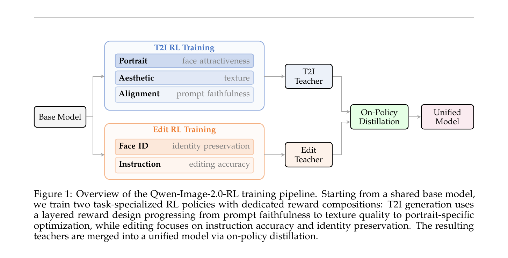
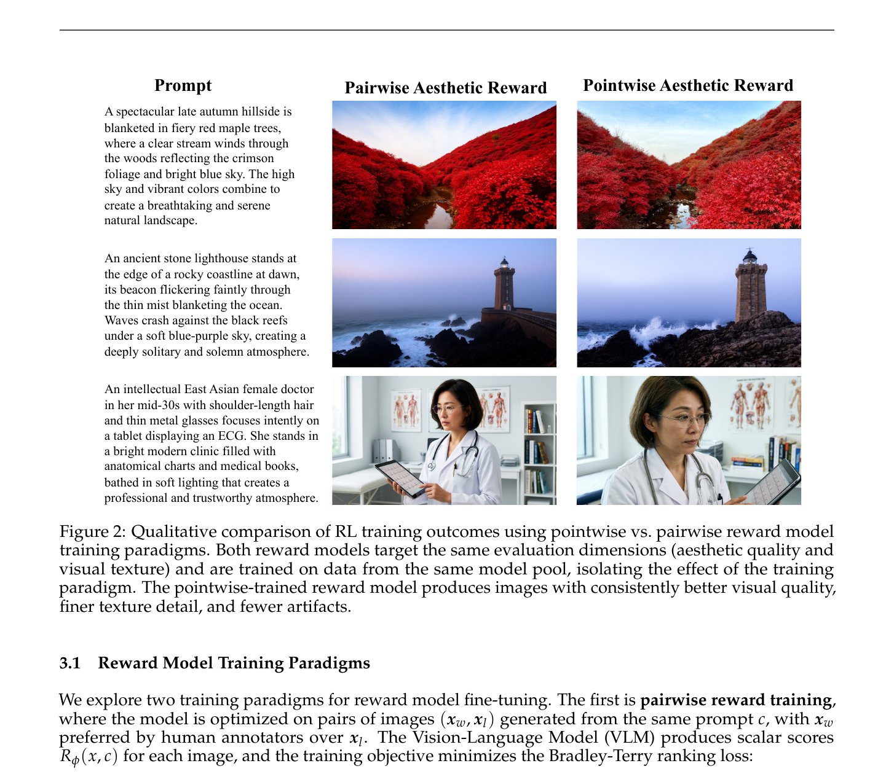
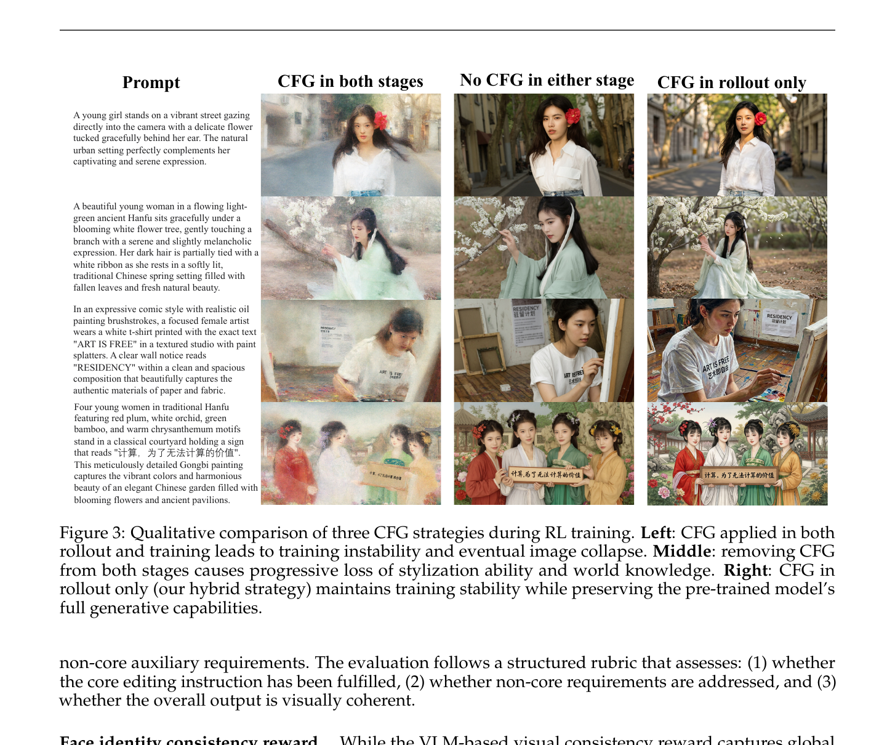
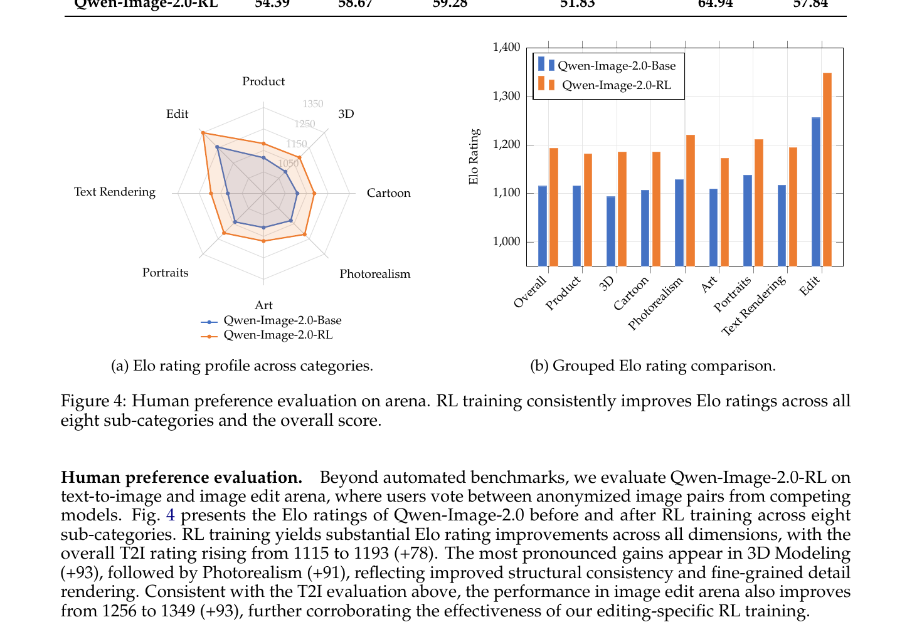
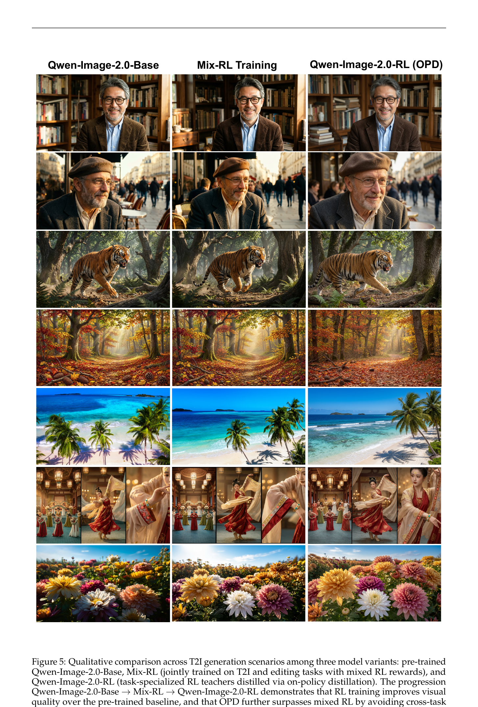
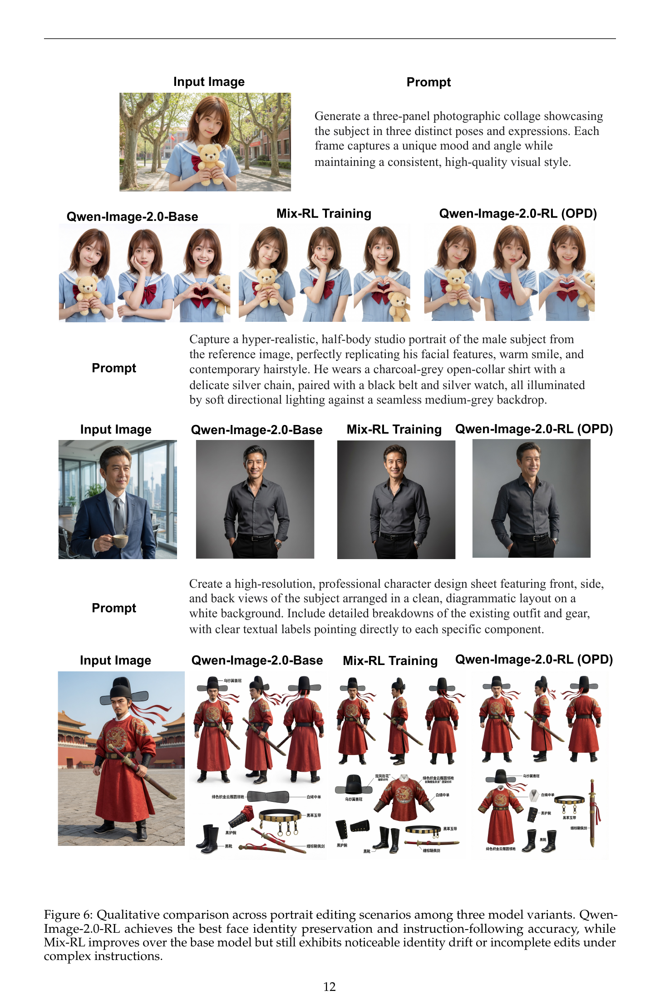

# Qwen-Image-2.0-RL: RLHF + On-Policy Distillation for Image Generation

**论文**: Qwen-Image-2.0-RL Technical Report  
**机构**: Qwen Team（阿里巴巴）  
**arXiv**: [2506.xxxxx]（技术报告，2026-06-29）  
**基础模型**: Qwen-Image-2.0（arXiv:2605.10730）

---

## 1. 一句话定位

**要解决的问题**：预训练扩散模型的监督损失（flow matching MSE）不直接捕捉人类偏好（构图、纹理、prompt 忠实度、人像真实感），导致预训练结果与用户审美存在持续 gap。多任务 RL（T2I 与图像编辑）同时训练会因奖励相互冲突导致次优 trade-off。

**核心解法**：**Qwen-Image-2.0-RL**——三阶段 post-training pipeline：
1. 构建任务专用 VLM-based 复合奖励模型（T2I 和 Edit 各自独立）
2. 基于 GRPO + 混合 CFG 策略分别训练 T2I Teacher 和 Edit Teacher
3. 用 On-Policy Distillation (OPD) 将两个 teacher 合并为单一 unified 模型



> **Fig 1 逐段解读**：
>
> **最左（Base Model）**——共享的 Qwen-Image-2.0 预训练基础模型，同时作为 T2I RL 和 Edit RL 的起点。不做任何预处理，两条训练路径均从同一权重初始化。
>
> **上支路（T2I RL Training，蓝色框）**——针对文本到图像生成的专项 RL，使用三层递进奖励：Alignment（prompt 忠实度）→ Aesthetic（纹理/构图）→ Portrait（人像吸引力）。奖励设计是分层的：只有 prompt 满足后才评估美学，只有美学达标才评估人像质量，形成优先级漏斗。训练完成后产出 **T2I Teacher**。
>
> **下支路（Edit RL Training，橙色框）**——针对图像编辑的专项 RL，两个奖励：Instruction（编辑指令执行准确度）+ Face ID（人脸身份保留）。编辑任务强调"改了该改的，保留不该改的"，与 T2I 纯生成质量目标不同，不能混合优化。训练完成后产出 **Edit Teacher**。
>
> **最右（On-Policy Distillation → Unified Model，绿色框）**——两个 teacher 通过 OPD 蒸馏到单一学生模型。学生在自己的推理轨迹上接受 teacher 的速度场监督，消除跨任务奖励冲突，同时不再依赖奖励模型。最终产出可部署的 **Unified Model**，单模型同时支持 T2I 和 Edit。

---

## 2. 与前作的关系

```
RLHF for 语言模型
    InstructGPT / PPO → 对话对齐
    GKD / OPD(Agarwal 2024) → on-policy 蒸馏替代多阶段 RL

RLHF for 扩散模型
    Flow-GRPO(Liu 2026) — 把多步去噪当 MDP 用 GRPO 优化，首次实现规模化 T2I RL
    DiffusionNFT(Zheng 2025) — 前向扩散过程作为策略优化
    GRPO-Guard(Wang 2025) — 正则化裁剪防止 RL 过优化
    AWM(Xue 2025) — 优势加权匹配，稳定 RL 预训练对齐
    → 这些方法都专注单任务或不区分任务奖励

奖励建模
    ImageReward / PickScore / HPSv2/v3 — 标量奖励，pairwise 训练
    UnifiedReward / RewardDance — 用 token 预测概率建模奖励，加入 CoT 推理
    → 本文：VLM finetune + pointwise 绝对分数训练，超越 pairwise 范式（Fig 2 实验）

On-Policy Distillation for 扩散
    Flow-OPD(Fang 2026) — OPD 用于流匹配，单任务 T2I teacher 蒸馏
    DiffusionOPD(Li 2026) — 从 KL 散度到速度场 MSE 的推导，单任务
    → 本文：multi-teacher OPD，两个专项 teacher → 单一 unified 模型；derivation 从 W₂ 距离出发
```

---

## 3. 核心算法

### 3.1 奖励模型：Pointwise vs. Pairwise

本文核心工程洞察之一：**pointwise 绝对分打分范式优于 pairwise 偏序比较**。

**Pairwise 训练**（对照）：给定同 prompt 的图对 `(x_w, x_l)`，VLM 输出标量分 `R_φ(x, c)`，用 Bradley-Terry ranking loss 训练：

$$\mathcal{L}_{\text{pair}} = -\sum_{(x_w, x_l, c)} \log \sigma\!\left(R_\phi(x_w, c) - R_\phi(x_l, c)\right)$$

**Pointwise 训练**（本文采用）：每张图独立打 1–5 Likert 分，奖励模型直接预测期望分：

$$\mathcal{L}_{\text{point}} = \sum_{(x, c, y)} \left(R_\phi(x, c) - y\right)^2$$

$$R_\phi(x, c) = \sum_{s \in \mathcal{S}} s \cdot p_\phi(s \mid x, c), \quad \mathcal{S} = \{1, 2, 3, 4, 5\}$$

奖励模型输出离散分布，用期望值作为奖励信号。



> **Fig 2 逐段解读**：同一组 prompt（秋山溪流、孤独灯塔、女医生），左列 Pairwise Aesthetic Reward，右列 Pointwise Aesthetic Reward。三行对比：
>
> - **行 1（秋日红枫山景）**：Pairwise 版本颜色偏灰暗，枫叶色彩饱和度低，远山偏白模糊；Pointwise 版本枫叶橙红鲜艳，溪水高光层次丰富，整体色彩校准更接近摄影作品。
> - **行 2（石质灯塔海岸）**：Pairwise 版本天色偏紫-蓝，灯塔轮廓模糊，礁石上的水花缺乏层次；Pointwise 版本灯塔质感坚实、礁石细节清晰，海浪泡沫与岩石形成鲜明对比，atmosphere 更符合"孤独肃穆"。
> - **行 3（女性医生诊室）**：Pairwise 版本面部比例偏宽，眼镜金属光泽不自然，背景书架形变；Pointwise 版本面部精细真实，玻璃镜片高光正确，手持平板与背景空间关系自然。
>
> 结论：Pointwise 的绝对分标注提供了更丰富的监督信号——不只是"A 比 B 好"，而是"A 在校准尺度上达到了某一绝对水平"，使奖励模型能学到更精确的质量标准，驱动 RL 生成质量更高的图像。

**T2I 奖励三层设计**（分层优先级，从内到外）：
1. **Alignment（prompt 忠实度）**——评估语义一致，检查对象存在性/数量、属性（颜色/形状/材质）、空间关系和动作准确性；prompt 不满足则强制压低总分
2. **Aesthetic（美学）**——在 prompt 满足后评估构图均衡、光照真实感、纹理保真度、艺术整体性
3. **Portrait（人像）**——专针对人脸：面部比例、皮肤与发丝真实感；内置常见失败模式检测（手指数量、身体比例）

**Edit 奖励两维设计**：
1. **Instruction-following reward**——将编辑指令拆解为"核心要求 + 非核心辅助要求"，三维评估：核心指令是否执行、辅助要求是否保留、输出是否视觉连贯
2. **Face identity consistency reward**——模型层 embedding 级别的人脸 ID 保留评分，弥补 VLM 层视觉一致性在精细 identity shift 上的不足

### 3.2 RL 训练框架

**基础框架**：Flow-GRPO，将多步去噪视为 MDP，GRPO 组级相对归一化优势：

$$A(x_0^{(i)}, c) = \frac{R(x_0^{(i)}, c) - \mu_c}{\sigma_c}$$

**多奖励加权优势**（参考 GDPO）：

$$A(x_0^{(i)}, c) = \sum_{k=1}^{K} w_k \cdot \frac{R_k(x_0^{(i)}, c) - \mu_k}{\sigma_k}$$

每个奖励维度在 prompt 组内独立归一化，再按权重 `w_k`（满足 `∑w_k = 1`）加权，避免量纲不同的奖励相互压制。

**混合 CFG 策略（核心工程细节）**：



> **Fig 3 逐列解读**：四行对应四个 prompt（都市女孩/汉服仕女/文字 T 恤画家/工笔四美图）× 三列（CFG in both stages / No CFG in either stage / CFG in rollout only）：
>
> - **左列（CFG in both stages）**——rollout 和训练目标同时用 CFG。行 1 人物面部过曝、轮廓发灰；行 2 汉服衣物和树枝完全融合；行 3 T 恤上的文字 "ART IS FREE" 和 "RESIDENCY" 完全消失；行 4 四位仕女面部变形。结论：CFG 引入条件分支和无条件分支同时参与梯度更新，优化目标相互冲突，导致训练不稳定并最终崩溃。
> - **中列（No CFG in either stage）**——rollout 和训练都不用 CFG。各行图像整体布局有了，但：行 1 城市街道背景消失，只剩人物单调背景；行 3 T 恤上的文字部分缺失；行 4 仕女的发饰和配色"卡通化"变淡。结论：去掉 CFG 后模型无法充分激活预训练中需要 CFG 才能表达的风格化和细节知识，导致世界知识和风格化能力进行性退化。
> - **右列（CFG in rollout only，本文策略）**——rollout 阶段用 CFG 生成候选图（充分激活预训练能力），训练目标只优化无条件分支（无 CFG）。行 1 人物表情自然，城市背景清晰；行 3 T 恤上 "ART IS FREE" 清晰可读、"RESIDENCY" 完整出现；行 4 四位仕女发型各异、工笔细节精细。稳定训练 + 保留预训练知识两者兼得。

三种策略系统对比：

| CFG 策略 | Rollout 阶段 | 训练目标 | 问题 |
|----------|------------|---------|------|
| CFG in both | ✅ | ✅ | 训练不稳定，图像崩溃 |
| No CFG | ❌ | ❌ | 风格化和世界知识退化 |
| **CFG in rollout only（本文）** | **✅** | **❌** | **稳定 + 保留预训练能力** |

**其他训练细节**：

- **异步奖励 pipeline**：奖励模型以远程 API 服务运行，推理完毕后异步提交打分；所有 rank 收到打分后同步聚合，计算优势并梯度更新。隐藏了奖励 latency，实现高效扩展。
- **Timestep 采样**：只在 rollout 的部分时间步（倾向 t→1 的高噪声步）上计算 RL 损失，避免在全 40 步都优化导致 reward hacking
- **Prompt curation（intra-group range 过滤）**：计算每个 prompt 组内奖励的最大-最小差，过滤掉奖励方差极低的 prompt（均质 prompt 梯度信号弱）
- **Per-category reward calibration**：按语义类别（人像/风景/字符/通用等）分配不同奖励权重向量，防止单一主导风格

### 3.3 On-Policy Distillation (OPD)

**动机**：T2I Teacher 和 Edit Teacher 分别针对各自任务优化，直接合并（Mix-RL，即在混合数据上联合优化多任务奖励）会引入跨任务奖励冲突。OPD 通过学生在自己的轨迹上接受各 teacher 速度场监督，消除奖励冲突并消除 reward model 依赖。

**推导**（附录 A，Wasserstein-2 上界）：

目标：最小化学生分布 `p_θ^0` 与 teacher 分布 `p_θ*^0` 的 W₂ 距离。

直接计算 W₂ 不可解，利用 Benton et al. (2023) 的速度场逼近误差与分布距离的关系，在流平滑性假设下得到：

$$W_2(p_\theta^0, p_{\theta^*}^0) \leq \left(\int_0^1 \mathbb{E}_{x_t \sim p_t^\theta} \lVert v_\theta(x_t, t) - v_{\theta^*}(x_t, t) \rVert^2 \mathrm{d}t\right)^{1/2} \cdot \exp\!\left(\int_0^1 L_t \,\mathrm{d}t\right)$$

指数因子 `exp(∫L_t dt)` 由 teacher 的 Lipschitz 常数决定，与 `θ` 无关，因此最小化 W₂ 上界等价于最小化速度场 MSE：

$$\mathcal{L}_{\text{OPD}}(\theta) = \mathbb{E}_{c, \mathbf{x}_{[1:N]} \sim \pi_\theta(\cdot|c)} \left[\sum_{n=1}^{N} \lVert v_\theta(x_{t_n}, t_n, c) - v_{\theta^*}(x_{t_n}, t_n, c) \rVert^2\right]$$

**与 LLM 蒸馏的类比**：LLM 蒸馏最小化 KL 散度（在 autoregressive 因式分解下可解），扩散模型的输出分布定义在 ODE 求解器上（路径测度），KL 不可解；W₂ 在速度场平滑假设下有上界，转化为可实现的轨迹级速度匹配。

**Multi-Teacher 蒸馏实现要点**：
- 只有当前 active teacher 加载到 GPU，inactive teacher offload 到 CPU，避免显存翻倍
- Teacher 推理时用 CFG；学生侧保持 no-CFG（与 OPD 后重新集成 CFG 的流程一致）
- 对每个训练 batch，根据任务类型选择对应的 teacher（T2I batch → T2I teacher，Edit batch → Edit teacher）

---

## 4. 关键实验结果

### 4.1 Qwen-Image-Bench（自动评测）

5 个一级维度，56 个三级子维度，Q-Judger（在 13W 人工标注对上训练的 judge 模型）评分，满分 100：

| 模型 | Quality | Aesthetics | Alignment | Real-world Fidelity | Creative Gen. | **Overall** |
|------|---------|-----------|-----------|-------------------|--------------|------------|
| GLM Image | 49.26 | 50.64 | 47.90 | 44.69 | 45.23 | 48.19 |
| Qwen Image 2512 | 51.76 | 54.74 | 52.72 | 47.00 | 50.19 | 52.06 |
| FLUX 2 Max | 53.64 | 56.85 | 57.35 | 49.35 | 56.50 | 55.33 |
| Seedream 5.0 | 52.55 | 58.40 | 58.90 | 51.92 | 65.29 | 57.22 |
| GPT Image 1.5 | 55.14 | 60.88 | 61.72 | 53.95 | 66.35 | 59.65 |
| GPT Image 2 | **58.65** | **67.53** | **65.85** | **57.38** | **75.23** | **64.69** |
| Qwen-Image-2.0-Base | 52.29 | 57.10 | 57.64 | 47.54 | 58.22 | 55.23 |
| **Qwen-Image-2.0-RL** | 54.39 | 58.67 | 59.28 | 51.83 | 64.94 | **57.84** |

RL 训练带来 +2.61 overall，最大提升来自 Creative Generation (+6.72) 和 Real-world Fidelity (+4.29)。

### 4.2 Arena 人类偏好评测（Elo 分）



> **Fig 4 逐段解读**：
>
> **左图（雷达图）**——8 个维度（Product/3D/Cartoon/Photorealism/Art/Portraits/Text Rendering/Edit）的 Elo 评分对比。蓝色多边形（Base）整体偏内缩，橙色多边形（RL）在 3D、Photorealism、Edit 三个维度扩展最明显；Portraits 和 Art 维度也有清晰外扩。整体形状更向外，说明 RL 在所有维度均有提升，没有明显偏科。
>
> **右图（分组柱状图）**——每个维度蓝（Base）+ 橙（RL）并排。整体 T2I Elo 从 1115→1193（+78），3D 涨幅最大（+93），Photorealism 次之（+91），说明 RL 对结构精确性和细节真实感的提升最显著。Edit arena 从 1256→1349（+93），与 T2I 涨幅相当，验证了 Edit 专项奖励的有效性。仅 Text Rendering 维度 base 分较高但 RL 涨幅相对较小（约 +60）。

### 4.3 OPD vs Mix-RL vs Base 定性对比



> **Fig 5 逐列对比**：7 行场景（书店老人/街头老人/林中老虎/秋日小路/热带海滩/汉服舞者/菊花花田）× 3 列（Base/Mix-RL/OPD）：
>
> - **列 1（Base）**——预训练结果，整体可用，但：书店老人的书架有透视变形；林中老虎身上条纹过于均匀缺乏动态感；海滩场景棕榈树影子角度错误；汉服舞者袖子动态不够流畅。
> - **列 2（Mix-RL）**——联合多任务 RL，质量比 Base 有所提升：老虎皮毛纹路增强，秋日小路光线分层更明显。但跨任务冲突有残影：书店老人面部轮廓比 Base 略软；汉服舞者多图拼贴中人物比例轻微变形。
> - **列 3（OPD）**——T2I Teacher + Edit Teacher → OPD 蒸馏。最佳：书店老人面部清晰，背景书架透视正确；老虎体态矫健，皮毛条纹动态自然；海滩棕榈树阴影方向一致；汉服舞者袖带飘逸流畅，多格构图平衡协调；菊花田色彩层次最丰富。Base→Mix-RL→OPD 的质量递进清晰验证了分任务 RL + OPD 合并策略的优越性。



> **Fig 6 逐场景解读**：3 组编辑任务（Portrait 拼贴/人像复刻/武将设计图）：
>
> - **场景 1（三格照片拼贴，女生）**：Base 版三格人物面容不一致，中间格笑容自然但左右格表情固定；Mix-RL 三格面部统一性提高但发型细节变化过大；OPD 三格人物相貌高度一致，姿势和表情各异且自然，充分保留 source 的发色、面型、服装（水手服+小熊玩偶）。
> - **场景 2（男性半身像复刻）**：Base 面部相似但细节（皱纹、笑纹、发际线）丢失；Mix-RL 整体接近但肤色偏暗；OPD 面部结构最接近 reference，笑纹和眼角细节复现度最高，背景虚化自然。
> - **场景 3（武将设计图，正侧背三视图+标注）**：Base 三视图比例大幅变形，标注线错乱，服饰配件丢失严重；Mix-RL 三视图比例改善，中文标注出现但不完整；OPD 三视图比例正确，服装细节（红袍、腰带、靴子）准确复现，中文标注（马蹄袖、绣花图案等）完整清晰，与武将手持武器的参考图高度吻合。

---

## 5. 关键配置项

| 参数 | 值 | 说明 |
|------|-----|------|
| 基础 RL 框架 | Flow-GRPO | 多步 MDP + 组级归一化优势 |
| Rollout ODE steps | 40 步 | 生成候选图的推理步数 |
| RL 训练时间步 | 高噪声子集 | 专注 t→1 端，防 reward hacking |
| 奖励评分维度 S | {1,2,3,4,5} | VLM 输出 5 级 Likert 分，期望值为奖励 |
| CFG 策略 | Rollout only | 仅 rollout 阶段用 CFG，训练目标无 CFG |
| 奖励 pipeline | 异步 API | reward scoring 与 GPU 推理解耦 |
| OPD 步数 N | 40 步（和 rollout 同） | 学生轨迹 = N 步 ODE 求解序列 |
| Teacher 内存 | CPU offload | inactive teacher offload，避免 GPU OOM |
| OPD 后 CFG | 重新集成 | OPD 训练 no-CFG，推理时 CFG 集成 |
| Prompt 过滤 | intra-group range 阈值 | 低方差 prompt 剔除，保留有梯度信号的样本 |
| Per-category 权重 | 人像/风景/字体/通用 | 不同类别奖励权重向量，防止单一风格主导 |

---

## 6. 争议/权衡

### 6.1 Pointwise 标注成本显著高于 Pairwise

Pointwise 需要标注员对每张图独立打绝对分，要求更好的标注一致性和培训；Pairwise 只需比较相对好坏。论文对此的选择是以更高标注成本换取更稳定的奖励信号，在大规模工业环境下可行，但对学术复现门槛更高。

### 6.2 OPD 需要两个独立 Teacher，显存和训练时间翻倍

分任务训练 T2I + Edit 两个 teacher 再做 OPD，训练总开销约是 Mix-RL 的 2-3 倍。CPU offload 策略缓解了显存问题，但训练时间代价仍然存在。权衡：OPD 最终模型质量明显优于 Mix-RL，工程代价被接受。

### 6.3 Hybrid CFG 的 "CFG in rollout only" 策略依赖预训练知识完整保留

Rollout 阶段用 CFG 是因为 Qwen-Image-2.0 base 的推理需要 CFG 才能激活风格化能力；如果未来出现无需 CFG 的 base 模型，这个策略的必要性会降低。此外，只优化无条件分支是否会在长期训练中导致条件分支与无条件分支的 drift，论文未充分讨论。

### 6.4 Prompt curation 过滤低方差样本的阈值选择

intra-group range 阈值选取对训练效率和最终质量影响较大：过高过滤率会让 prompt pool 太小，欠拟合；过低则混入过多无效梯度样本。论文未公开具体阈值，可重现性受限。

### 6.5 评测仍有 GPT Image 2 差距（57.84 vs 64.69）

Qwen-Image-2.0-RL 在 Creative Generation（64.94 vs 75.23）和 Alignment（59.28 vs 65.85）上与 GPT Image 2 差距较明显，说明 RL post-training 可以大幅提升 Base 模型，但 base 能力本身（预训练数据、架构）仍是上限。

---

## 7. 一句话总结

Qwen-Image-2.0-RL 的关键洞察是：**分任务专项 RL（T2I 用三层奖励，Edit 用 Face ID + 指令奖励）避免多任务奖励冲突，pointwise 绝对分标注提供比 pairwise 更强的监督，hybrid CFG 策略（rollout 有 CFG，训练无 CFG）让 RL 稳定训练同时保留预训练能力，最后用基于 W₂ 速度场匹配的 OPD 将两个专项 teacher 无缝合并为单一模型**——在 Qwen-Image-Bench 提升 +2.61、T2I arena +78 Elo、Edit arena +93 Elo，全维度改善人类偏好。
