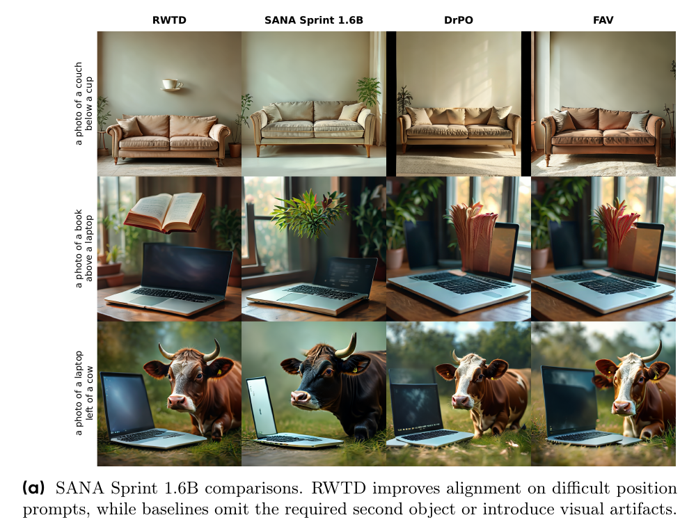
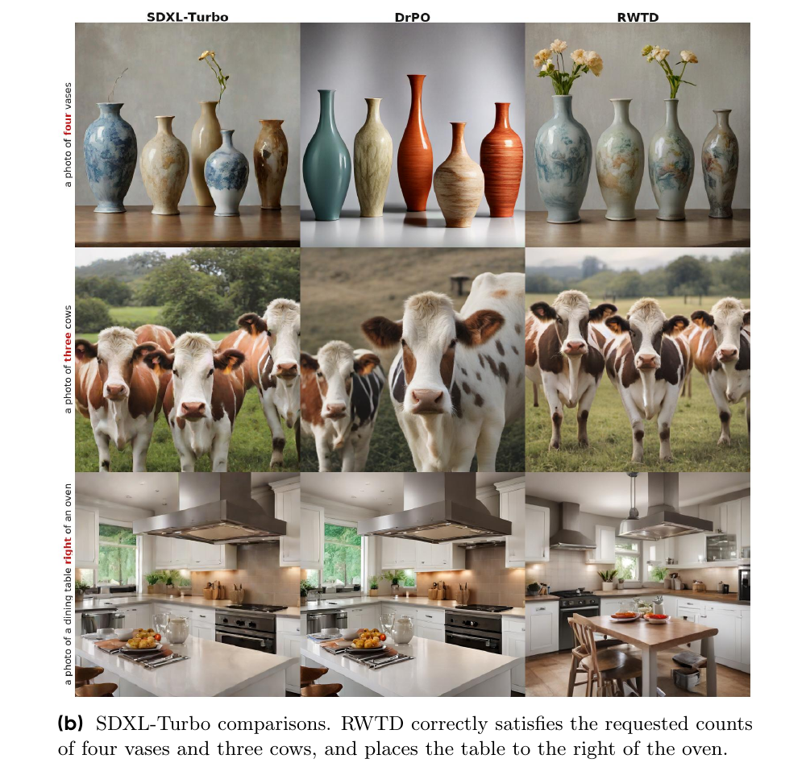
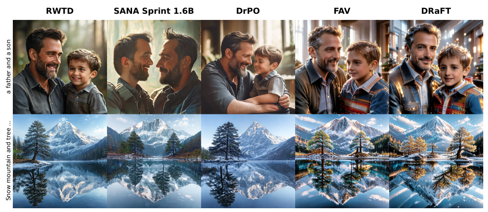
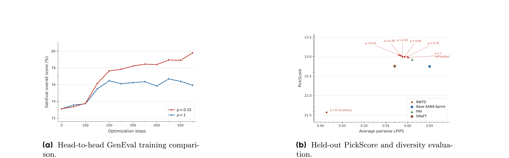

# RWTD: Aligning One-Step Generative Models with Reward-Weighted Transport Distillation

**论文**: [arXiv:2609.30840v1](https://arxiv.org/abs/2609.30840)（cs.LG，2026-09-25，23 页）
**作者**: Austin Wang, Ziheng Cheng, Lexing Ying — **ByteDance Seed**（Ziheng Cheng 同时署 UC Berkeley）
**底座**: 主实验 SANA-Sprint 1.6B（sCM + LADD 蒸出的一步 T2I，1024px），副实验 SDXL-Turbo；两者都只训 LoRA
**代码**: [github.com/austin-k-wang/Reward-Weighted-Transport-Distillation](https://github.com/austin-k-wang/Reward-Weighted-Transport-Distillation)（本笔记引用 commit [`0e69998`](https://github.com/austin-k-wang/Reward-Weighted-Transport-Distillation/tree/0e69998d7208948b26ad6f3b95b6c0436ea5d020)）—— 只含 SANA-Sprint 部分，GenEval / HPSv2 两个 LoRA adapter 在 HF。**SDXL-Turbo 实验和三个 baseline（DrPO / FAV / DRaFT）的实现都没有发布**；仓库根目录没有 LICENSE（vendored 的 `Sana/` 自带 Apache-2.0，HF adapter 标 apache-2.0）

---

## 1. 一句话定位

**给已经蒸好的一步生成器做 reward 对齐，只用"生成样本 + 标量 reward"。** 目标分布是两个 reward tilt 的混合：当前模型的 tilt 占 `1−ρ`，参考模型的 tilt 占 `ρ`。实现分两步。先在冻结的 DINOv2 特征空间里用 Sinkhorn 把每个当前样本指派到这个混合目标上。再把样本特征往指派结果回归一小步。整个过程不需要 likelihood、轨迹、reward 梯度、teacher 或 critic。

| 方法 | 需要什么 | 能否用于一般的一步生成器 |
|---|---|---|
| DRaFT（仓库无笔记） | reward 梯度 | 能 |
| [Diffusion-DPO](../diffusion_dpo/analysis.md) | likelihood 代理（ELBO） | 否 |
| [Flow-GRPO](../flow_grpo/analysis.md) | 多步 SDE 轨迹 + 逐步转移概率 | 否 |
| [DiffusionNFT](../diffusion_nft/analysis.md) | 前向加噪过程上的 velocity 回归 | 否（要扩散 / flow 结构） |
| [TDM-R1](../../inference_acceleration/tdm_r1/analysis.md) | 少步扩散的路径似然（另学一个 surrogate reward 扩散模型） | 否 |
| DI++ / DI* / DIDR | 扩散 teacher + reward 梯度 | 否 |
| FAV | KDE + reward 梯度（不可微时换零阶估计） | 能 |
| DrPO | 排序式 dipole 偏好场，免梯度 | 能 |
| **RWTD** | **样本 + 标量 reward + 一个冻结、可微的特征编码器** | **能** |

**头条结果有两个。** 第一，用不可微的 GenEval 打分器当 reward，SANA-Sprint 1.6B 的 GenEval 从 **0.73 升到 0.80**。第二，用 HPSv2 训练时，它是四个方法里**唯一五项偏好指标全涨、OOD GenEval 也涨（0.73 → 0.75）**的。理论部分给出了"混合 tilt 递推"不动点的闭式解。

🔴 **读完全文、查过开源代码并复算之后，我认为结论要收窄成下面五条：**

1. **GenEval 0.80 是直接在评测器上优化出来的。**
   - 训练 reward 用的就是官方评测器那一套：同一个 Mask2Former Swin-S 检测器、同一个 OpenCLIP ViT-L-14 颜色分类器、同样的阈值（检测 0.3、计数 0.9、方位 0.1），再加一项 `0.5 × 官方 correct` 的 bonus（§3.4、§5）。
   - 训练 prompt 这边做得干净：我查过，与 553 条评测 prompt 精确重合 **0 条**。
   - 问题出在对比对象。表 1 用来说"超过多步模型"的 FLUX.1 Dev / Playground v3 / SD3.5-L 都没在这个 reward 上训过。同一 reward 协议下做过 RL 的多步模型 [Flow-GRPO](../flow_grpo/analysis.md)（SD3.5-M）是 **0.95**。
2. **HPSv2 那组"五项全涨"靠的是 CLIP 上 +0.0008 的涨幅，而 RWTD 的超参是在测试集上挑的。**
   - β / ρ / η 按附录 Table 6 选定，Table 6 与主表 Table 2 用的是**同一套 PartiPrompts 评测**。baseline 则按 B.4 在 held-out validation 上调参。
   - RWTD 自己的 CLIP 随超参在 0.2749–0.2772 之间变化（Table 6 中 ρ>0 的各配置；base 是 0.2753），β=10 时就已经低于 base（§7.2）。
3. **代码里有五处论文没写、但会影响解读的实现（§3.4）：**
   - HPS reward 做了 z-score，用的均值和标准差取自 **PartiPrompts（评测集）上 8,160 张 base 生成图**；
   - GenEval 训练期的周期评测默认取**官方评测集里的 53 条 prompt**；
   - 当前粒子的权重里混了 10% 均匀质量（`mass_floor`）；
   - 训练和评测用的都是 **HPS v2.1**，不是 v2；
   - φ 是 DINOv2-base 最后一层的 `[CLS, patch 均值, patch 标准差]` 三块。

   另外，按 README 默认值跑 GenEval 复现命令，得到的是 β=4、1000 步，与 Table 4 的 β=2、550 步对不上。
4. **η 在 AdamW 下几乎不起作用。** 回归目标 `u + η(ū − u)` 每组只用一次，所以梯度恰好是 η=1 时的 η 倍。Adam 对梯度的整体缩放不敏感，只剩 ε 和梯度裁剪带来的微小差别。所以 Table 6(c) 里 η 从 0.2 调到 1.0、PickScore 最多只差 0.03，这是优化器决定的，**不能拿来印证 Prop 5.2 的"不动点与 η 无关"**（§4.4 ⑤）。
5. **推导本身是对的，我逐式核对过，也做了数值复现（§4）。** 但有三处限制：
   - 它只刻画了**理想化递推的不动点**，没有证明收敛。
   - 不动点存在要求 reward 有界，并且 `H` 在可行域边界处发散。连续高维空间里这一条不一定成立。不成立时，小 ρ 的不动点会在 reward 最大点上"凝聚"出一块奇异质量：我的数值例子里 ρ=0.15 时约为 69%。
   - 实际算法（minibatch + 熵正则 OT + barycentric 投影）在理论不动点处的期望更新**并不为零**（§4.4）。

📌 **站得住的部分：**
- 真的只需要标量 reward：GenEval 打分器不可微，而且在模型计算图之外。
- 成本与 DrPO 持平（GenEval 197 vs 194 GPU-h），是 FAV 的 1/2.2（GenEval）、DRaFT 的 1/2.6（HPSv2）。
- OT 指派与随机指派（RWR）的对照，直接证明了逐样本的几何配对有用。
- **ρ=0 会退化，这个负面结果给了完整数字**：PickScore 22.75 → 21.57，LPIPS 0.652 → 0.414。
- 代码和两个 adapter 都已公开，HF model card 上的分数与 Table 1/2 逐位一致。

---

## 2. 要解决的问题

一步生成器（SANA-Sprint、SDXL-Turbo，以及 Drifting、W-Flow、MeanFlow 这类原生一步模型）越来越强，但对它们做后训练缺一个通用接口。论文把现有方法的限制归为三类：

- **需要可微 reward**：DRaFT 直接反传 reward 梯度，DI++ / DI* / DIDR 还需要扩散 teacher。
- **需要 likelihood 代理或多步轨迹**：DPO 类方法、DDPO、Flow-GRPO。一般的一步生成器既没有可算的 likelihood，也没有去噪轨迹。
- **少数针对一步 / 少步的方法**各有各的依赖：FAV 要 KDE 加 reward 梯度（梯度方差大），DrPO 要一套专门构造的 rank-based dipole 偏好场。

RWTD 想要的接口是：**与生成器怎么预训练无关，并且兼容黑盒 reward。** 设定只有三样东西：可训练的 `G_θ(z,c)`、冻结的参考 `G_ref`、标量 `r(x,c)`。

---

## 3. 方法

### 3.1 目标分布：分别归一化的两个 tilt 的混合

标准做法是 exponential reward tilting：

$$
T_{\beta,r}[p]\,(x\mid c)=\frac{p(x\mid c)\,e^{\beta r(x,c)}}{Z_p(c)},\qquad Z_p(c)=\mathbb{E}_{x\sim p(\cdot\mid c)}\big[e^{\beta r(x,c)}\big]
$$

它正是 KL 正则 reward 最大化的最优解：

$$
T_{\beta,r}[p]=\arg\max_q\;\mathbb{E}_q[r]-\frac{1}{\beta}D_{\mathrm{KL}}(q\,\|\,p)
$$

📌 这正是 [Diffusion-DPO](../diffusion_dpo/analysis.md) 笔记 §0 里那个闭式最优解 `p* ∝ p_ref·exp(r/β)`。DPO 把它重参数化成 likelihood ratio，RWTD 则直接用样本去逼近它。

RWTD 的核心改动是换掉目标：

$$
Q_{\beta,\rho}[p_\theta]=(1-\rho)\,T_{\beta,r}[p_\theta]+\rho\,T_{\beta,r}[p_{\mathrm{ref}}]
$$

- `ρ=1` 是传统的 off-policy 目标，即对参考做一次 tilt。
- `ρ=0` 是纯 on-policy，即对当前模型再做一次 tilt。
- 中间值时，on-policy 分量负责吸收训练中发现的高 reward 区域，reference 分量负责"不断把丢掉的 mode 补回来"。

⚠️ **ρ<1 时，目标就不再是上面那个 KL 正则问题的最优解了**：它的不动点比 `T_{β,r}[p_ref]` 更尖，见 §4.4 ①。这是它和 DPO / RLHF 家族的本质区别。

### 3.2 粒子化 + 特征空间 OT

每个 prompt 采 N 个当前样本 `x_i = G_θ(z_i,c)` 和 M 个参考样本 `y_j = G_ref(z'_j,c)`，**两组分别做 softmax**：

$$
w_i^{\theta}=\frac{e^{\beta r(x_i,c)}}{\sum_{\ell=1}^{N}e^{\beta r(x_\ell,c)}},\qquad w_j^{\mathrm{ref}}=\frac{e^{\beta r(y_j,c)}}{\sum_{\ell=1}^{M}e^{\beta r(y_\ell,c)}},\qquad \hat Q=(1-\rho)\sum_i w_i^{\theta}\delta_{x_i}+\rho\sum_j w_j^{\mathrm{ref}}\delta_{y_j}
$$

分别归一化，保证两组粒子的总质量恰好是 `1−ρ` 和 `ρ`。接着在冻结编码器 φ 的特征空间做熵正则 OT。源是均匀的当前样本，目标是**当前 + 参考**的加权并集：

$$
C_{ik}=\|u_i-v_k\|_2^2,\qquad a=\tfrac{1}{N}\mathbf{1}_N,\qquad b=\big[(1-\rho)\,w^{\theta};\;\rho\,w^{\mathrm{ref}}\big],\qquad P_\epsilon=\mathrm{Sinkhorn}_\epsilon(C;a,b)
$$

其中 `u_i = φ(x_i)`，`v = [φ(x_1..N); φ(y_1..M)]`，`C ∈ R^{N×(N+M)}`。注意**当前样本自己也在目标集合里**：ρ=0.15 时，85% 的目标质量落在当前粒子上，高 reward 的当前样本会"吸走"低 reward 邻居的质量。

### 3.3 部分传输 + 不动点回归

每行 coupling 除以 `a_i` 就得到一个条件分布，取它的条件均值（barycentric 投影），再只走 η 的一段：

$$
\bar u_i=\frac{1}{a_i}\sum_{k=1}^{N+M}P_{\epsilon,ik}\,v_k,\qquad \tilde u_i=(1-\eta)\,u_i+\eta\,\bar u_i
$$

$$
\mathcal{L}_{\mathrm{RWTD}}(\theta)=\frac{1}{N}\sum_{i=1}^{N}\big\|\phi(G_\theta(z_i,c))-\mathrm{sg}(\tilde u_i)\big\|_2^2
$$

**梯度只沿 φ → 生成器这条路回传**，reward 权重、coupling、目标构造都不参与求导。每步都用当前模型重新构造目标，所以论文把它称作"不动点回归"。名字里的 "Distillation" 指把传输目标 amortize 进生成器，**不是 teacher 蒸馏**。

Algorithm 1 转写如下：

```
for t = 1..T:
    c ~ p_prompt;  z_1..z_N ~ p_z;  z'_1..z'_M ~ p_z
    x_i = G_θ(z_i, c)                  # 当前模型（LoRA 打开）
    y_j = G_ref(z'_j, c)               # 参考 = 同一网络关掉 LoRA
    w_θ   = softmax_i(β · r(x_i, c))
    w_ref = softmax_j(β · r(y_j, c))
    u_i = φ(x_i);   v = [u_1..u_N, φ(y_1)..φ(y_M)]
    a = 1/N;        b = [(1-ρ)·w_θ ; ρ·w_ref]
    C_ik = ‖u_i - v_k‖²;   P = Sinkhorn(C, a, b, ε, L_SK)
    ū_i = (1/a_i) · Σ_k P_ik · v_k;     ũ_i = (1-η)·u_i + η·ū_i
    L = (1/N) · Σ_i ‖φ(G_θ(z_i, c)) - sg(ũ_i)‖²
    θ ← θ - α ∇_θ L
```

### 3.4 代码里的实际实现（论文没写或写得不一样的）

下面是我对照 commit `0e69998` 核对的结果，permalink 见 §5。

| 项 | 论文 | 代码 | 影响 |
|---|---|---|---|
| reward → 权重 | `softmax(β r)` | `softmax(((r − μ)/σ)/τ)`，其中 `β = 1/τ`；μ、σ 是**冻结的全局统计量** | β 的数值要按校准后的尺度读 |
| HPS 的 μ、σ | 未提 | `0.30314 / 0.03406`，注释写明来自 **8,160 张 base 模型的 PartiPrompts 生成**（= 1,632 × 5，正是评测集） | 评测集只进入了 reward 尺度，泄漏程度低，但属于"用测试集定超参"。折算后每 1 个 HPS 点（×100 口径）对应的 β 约 1.47 |
| GenEval 的 μ、σ | 未提 | `0 / 1`，即直接用原始 hybrid reward（范围 `[0, 1.5]`） | β=2 时权重比上限约 `e^3 ≈ 20` |
| 当前粒子权重 | 纯 softmax | 混入 `mass_floor = 0.10` 的均匀质量（只作用于当前粒子，参考粒子不加） | 从不动点角度看，相当于把 ρ 从 0.15 换成约 0.164（§4.4 ④） |
| φ | "DINOv2" | `facebook/dinov2-base` 最后一层的 `cls` / `patch_mean` / `patch_std` 三块（各 768 维，等权）；输入按短边 256 缩放后**中心裁 224** | 代价是三块"逐维均方差"的平均；图像四周各 12.5% 的边框 φ 看不到 |
| Sinkhorn | Alg 2：100 次迭代 | log 域 + 容差 1e-5 早停，之后**最多再做 500 次 marginal 投影** | 边际更精确，论文没写 |
| ε | `max(0.1·median C, 1e-4)` | 同上，按 prompt 分别计算 | 一致 |
| 损失 | `‖·‖²` 求和 | `0.5 · mean` | 只差常数，Adam 下无影响 |
| 参考模型 | "frozen `G_ref`" | 同一网络 `disable_adapter()` + `no_grad` | 省显存 |
| 梯度路径 | Eq 10 | 两遍：先 no-grad 采样、打分、算目标，再用**同一份噪声**分 2 张一块重新生成并反传（穿过 DC-AE decoder 和 DINOv2） | 当前样本每步要生成两次 |
| HPS 版本 | "HPSv2 [52]" | 训练与评测都用 **`HPS_v2.1_compressed.pt`** | 表头的 "HPSv2" 实为 v2.1 |
| GenEval 训练期评测 | 未提 | 默认取**官方 `evaluation_metadata.jsonl` 里 53 条**（seed 1234），每 25 步评一次、每 10 步存一次 checkpoint，`max_train_steps` 默认 1000 | 550 步是怎么选出来的，论文没说 [待补] |
| SANA GenEval 的 β | Table 4：β=2.0 | 训练脚本默认 `REWARD_TEMPERATURE=0.25`（即 β=4），YAML 里是 0.5（β=2）；README 的 GenEval 复现命令不覆盖这个值 | 发布的 adapter 用的是哪个 β [待补] |
| 学习率调度 | 未提 | GenEval：cosine + 25 步 warmup；HPSv2：constant | —— |

📌 **GenEval reward 与评测器的对应关系**（这一点论文自己也写了"Following the official GenEval protocol"）：
- 训练打分服务 `geneval_reward_server.py` 加载的是 `mask2former_swin-s-p4-w7-224_lsj_8x2_50e_coco` 和 `open_clip ViT-L-14 (openai)`，阈值为 0.3 / 0.9；打分模块注释自称 "exact official parity"。
- 我对照了官方 `evaluate_images.py`（djghosh13/geneval@af4902f），检测器、CLIP 架构和三个阈值都相同。

---

## 4. 理论：逐步核对与假设清单

记 `s(x)=e^{βr(x)}`，`q_ref = T_{β,r}[p_ref] = p_ref·s/Z_ref`。论文分析的是理想化的全量递推 `p_{t+1} = Q_{β,ρ}[p_t]`（Eq 11）。

### 4.1 Prop 5.1（不动点刻画）：逐式核对

$$
H(\lambda)=\mathbb{E}_{x\sim q_{\mathrm{ref}}}\Big[\frac{1}{1-\lambda s(x)}\Big]=\frac{1}{\rho},\qquad p_\infty(x)=\frac{\rho\,q_{\mathrm{ref}}(x)}{1-\lambda s(x)}=\frac{\rho}{Z_{\mathrm{ref}}}\cdot\frac{p_{\mathrm{ref}}(x)\,e^{\beta r(x)}}{1-\lambda e^{\beta r(x)}}
$$

| 步 | 论文 | 我的核对 |
|---|---|---|
| ① 不动点方程 | (19) `p = (1−ρ)·p·s/Z_∞ + ρ·q_ref` | 直接代入 Eq 11 ✓ |
| ② 令 `λ = (1−ρ)/Z_∞` | (20) `p·(1−λs) = ρ·q_ref` | 移项 ✓ |
| ③ 分母为正 | "由 (19) 有 `p ≥ ρ q_ref`，所以 `1−λs > 0`（q_ref-a.e.）" | **这里要求 ρ>0**：在 `q_ref>0` 处右边大于 0，而 `p ≥ 0`，所以 `1−λs > 0` ✓ |
| ④ 闭式 (21) | `p = ρ q_ref/(1−λs)` | **这里用到了 `p ≪ p_ref`**。没有这个条件时，`p` 可以把质量放在 `q_ref = 0` 或 `λs = 1` 的集合上，(20) 两边都是 0 ✓ |
| ⑤ 归一化 (22) | `ρ·H(λ) = 1` | ✓ |
| ⑥ 唯一性 | H 严格递增 | `λ₁ < λ₂` 且 `s > 0` ⇒ `1/(1−λ₁s) < 1/(1−λ₂s)` ✓ |
| ⑦ 反方向 (23)–(28) | 满足 `H = 1/ρ` 的 λ 给出不动点 | `λ·E_{p_λ}[s] = ρ·E_q[λs/(1−λs)] = ρ(H−1) = 1−ρ`，所以 `λ = (1−ρ)/Z_λ`，代回得 `Q[p_λ] = λ·s·p_λ + ρq = p_λ` ✓ |
| ⑧ ρ=1 | λ=0，`p_∞ = q_ref` | `H(0) = 1` 且 H 严格递增 ✓ |
| A.2 (31) | `H′(λ) = E_q[s/(1−λs)²] > 0` | ✓ |
| A.2 (35) | `dλ/dρ = −1/(ρ²H′(λ))` | 对 `H(λ(ρ)) = 1/ρ` 做隐函数求导 ✓ |
| A.2 (37)(38) | 高低 reward 样本的相对质量比随 λ 单调增 | 对数导数为 `(s₁−s₂)/((1−λs₁)(1−λs₂)) > 0` ✓ |
| A.2 | "若 `p_0 ≪ p_ref`，则每个有限 t 都有 `p_t ≪ p_ref`" | 因为 `T[p] ≪ p`，所以成立 ✓。⚠️ **但极限不继承绝对连续**，见 §4.4 ② |

**数值复现**：有限状态空间，50 个状态，`p_ref` 取 Dirichlet 随机、`r ~ U(0,1)`、β=2。从 `p_0 = p_ref` 出发迭代 Eq 11，四个 ρ 都收敛到 Eq 13 的闭式解，最大误差 ≤ 1.2e-13，且 λ 与 `(1−ρ)/Z_∞` 前 6 位一致：

| ρ | 收敛迭代数 | λ | `E_{p∞}[r]` | `KL(p∞ ‖ p_ref)`（nats） |
|---|---|---|---|---|
| 1.0 | 1 | 0 | 0.671（= `T[p_ref]`） | 0.19 |
| 0.5 | 83 | 0.0974 | 0.765 | 0.44 |
| 0.15 | 1,104 | 0.1352 | 0.896 | 1.37 |
| 0.05 | 1,119 | 0.1365 | 0.961 | 3.22 |

（参考分布 `E[r] = 0.480`，`max r = 0.995`。）

### 4.2 Prop 5.2（部分传输不改变不动点）：逐式核对

$$
F_\eta[p]=\big((1-\eta)\,\mathrm{Id}+\eta\,T_p\big)_{\#}\,p,\qquad W_2\big(p,F_\eta[p]\big)=\eta\,W_2\big(p,Q_{\beta,\rho}[p]\big)
$$

- (42)–(43)：用 `(x, S(x))` 作 coupling，`E‖S(x)−x‖² = η²·E‖T(x)−x‖²` ✓
- (44)：用 `(S(x), T(x))` 作 coupling，`‖S−T‖ = (1−η)‖x−T‖` ✓
- (45)–(47)：三角不等式给出 `D ≤ ηD + (1−η)D = D`，所以等号全部成立，得到 (48) ✓。⇒ (51) ✓
- 注意：这里要求 `T_p` 是**最优**映射，否则 `E‖T−x‖²` 不等于 `W_2²`，这条链会断。证明本身没有问题。

### 4.3 假设清单（分开列）

**Prop 5.1 / A.1：**
- (A1) 条件 c 固定；总体层面（无限粒子）；每步**精确**实现 `p_{t+1} = Q[p_t]`，相当于 η=1 且没有函数逼近误差。
- (A2) `0 < ρ ≤ 1`。ρ=0 单独处理：`p_t ∝ p_0·e^{tβr}`，没有唯一不动点。
- (A3) 只讨论 `p_∞ ≪ p_ref` 的不动点。
- (A4) λ 在可行域内：`1 − λs > 0`（q_ref-a.e.）且 `H(λ) < ∞`。

**A.2（存在性）：**
- (A5) `s = e^{βr}` 在 q_ref 下本质有界，即 reward 有上界。⚠️ **reward 无上界时，任何 λ>0 都不可行，ρ<1 就没有 reference-dominated 不动点**。例如 Gaussian 参考配线性 reward：递推会一路漂向无穷。
- (A6) `λ ↑ 1/s_max` 时 `H(λ) → ∞`。状态空间有限且 `p_ref` 处处大于 0 时自动成立，连续空间里不一定成立（§4.4 ②）。

**Prop 5.2：**
- (B1) `p` 与 `Q[p]` 定义在 R^d 上，二阶矩有限。
- (B2) `p` 绝对连续，保证 Brenier 最优映射 `T_p` 存在。
- (B3) 用的是精确的二次代价 OT 映射，且 `(T_p)_# p = Q[p]`。

**理论到实际之间没覆盖的缺口（论文 §5 末段只笼统承认了一句"idealized"）：**
- (G1) 实际用的是熵正则 OT（`ε ≈ 0.1·median C`）加 barycentric 投影。`ū` 是条件均值，**不是把 p 推到 Q 的传输映射**。
- (G2) 每个 prompt 只有 24 + 24 个粒子，自归一化 softmax 权重有偏（SNIS bias）。
- (G3) OT 和回归都在 φ 空间里做，而 reward 定义在图像上。φ 不单射时，φ 空间的不动点确定不了图像分布。
- (G4) 每组目标只做一次 AdamW 更新（LoRA），谈不上"实现" `F_η[p]`，η 实际上也被优化器吸收了（§4.4 ⑤）。
- (G5) **没有收敛性结论**：论文只刻画不动点，没有证明 Eq 11 或实际算法会收敛过去。上面的数值例子能收敛，但不构成证明。
- (G6) 代码里的 `mass_floor` 改变了递推（§4.4 ④）。
- (G7) 报告的模型只训了 400–550 步，离任何不动点都很远。理论描述的是终点，实验看的是起步那一段。

### 4.4 我补的五个观察（论文里没有）

**① 不动点就是"多温度 tilt"的几何混合。** 把 `1/(1−λs)` 展开成级数（可行域内 `λs < 1`，展开合法）：

$$
p_\infty=\rho\,q_{\mathrm{ref}}\sum_{j\ge 0}(\lambda s)^j=\sum_{k\ge 1}\pi_k\,T_{k\beta,r}[p_{\mathrm{ref}}],\qquad \pi_k=\rho\,\lambda^{k-1}\frac{Z_k}{Z_1},\qquad Z_k=\mathbb{E}_{p_{\mathrm{ref}}}\big[e^{k\beta r}\big]
$$

`Σ_k π_k = ρ·H(λ) = 1`，而且 `π_1 = ρ` 恒成立。**论文所说的"有理放大"，就是以几何权重混合 β、2β、3β…… 的 tilt，ρ 恰好是"只 tilt 一次"那一份的权重。** 如果 T 是线性的，权重会是 `ρ(1−ρ)^{k−1}`，`E[k] = 1/ρ`（ρ=0.15 时约 6.7）。实际上归一化让越尖的分量每步多拿 `Z_{k+1}/Z_k` 倍的权重，所以更尖。在 §4.1 的玩具例子里，我按上式算得 `Σπ_k = 1.000000`，`E_π[k]` 分别为：ρ=0.5 时 2.26、**ρ=0.15 时 29.1**、ρ=0.05 时 599。**所以 ρ=0.15 的理论不动点远比"β=2 的一次 tilt"尖锐**；实验里多样性没有塌，更可能是因为只训了几百步。

**② (A6) 不成立时，不动点会在 argmax 上凝聚出奇异质量。** 设 `x*` 是 reward 的唯一最大点，且 `ρ·H(1/s_max) < 1`。可以直接验证下面的分布满足 Eq 11：

$$
p_\infty=\frac{\rho\,q_{\mathrm{ref}}}{1-s/s_{\max}}+\big(1-\rho\,H(1/s_{\max})\big)\,\delta_{x^\ast}
$$

验证思路：原子部分要求 `Z_∞ = (1−ρ)s_max`，把绝对连续部分与原子部分代回，`Z_∞` 正好等于 `s_max(1−ρ)`。它不属于 `p ≪ p_ref` 那一类，所以 Prop 5.1 只能给出"不存在 reference-dominated 不动点"；而离散化后的（唯一）不动点随网格加密，恰好收敛到这个凝聚态（见下面的数值）。**数学结构与 Bose–Einstein 凝聚相同。** 什么时候会发生：若 reward 在最大点附近是二次的、`p_ref` 在那里有有界正密度，那么 `1 − s/s_max ∝ ‖x−x*‖²`，`H(1/s_max)` 在 `d ≥ 3` 维时就是有限的。

数值例子：`[0,1]` 上 `p_ref` 取均匀分布，`r = −sqrt(1−x)`，β=2，算得 `H(1/s_max) = 2.044`，所以凝聚阈值是 `ρ < 0.489`。
- ρ=0.15 时，预测凝聚质量为 0.6935。网格加密到 10³ / 10⁴ / 10⁵ / 10⁶ 个格子时，顶格质量为 0.675 / 0.683 / 0.689 / 0.692。顶格在 `p_ref` 下的质量趋于 0，可是它在不动点里的质量不随网格变细而下降。
- ρ=0.5 时（高于阈值），顶格质量依次是 0.035 → 0.0086 → 0.0017 → 0.0002，没有凝聚。

⇒ **小 ρ 的多样性损失不只是"变尖"，在连续空间里还可能是真正的 mode collapse。** 论文的 Eq 32 就是在排除这种情况，但没说明它的物理含义。

**③ 在理论不动点处，实际更新并不为零。** 用 d=32 的玩具（`p_ref = N(0, I)`，`r = tanh(x₁)` 有界，β=2，N=M=24，`ε = 0.1·median C`，500 次试验取平均），当前粒子直接从**理论不动点**采样，再按 RWTD 算一次目标：

| | ρ=1 | ρ=0.15 |
|---|---|---|
| reward 轴上的平均位移（理想值 0） | −0.046 ± 0.012 | −0.007 ± 0.005 |
| 非 reward 维 `Var(ū)/Var(u)`，η=1（理想值 1） | 0.217 | 0.776 |
| 非 reward 维 `Var(ũ)/Var(u)`，η=0.2 | 0.714 | 0.946 |

reward 轴上的偏差主要来自 SNIS：M=24、β=1 的一维对照里，tilted 参考均值的估计是 0.90，而真值是 1.0。**方差收缩来自熵正则 OT 的 barycentric 平均：它每一步都把样本往邻居的均值拉。** 这是玩具量级，只说明方向，不代表 DINOv2 空间里的真实幅度。但它给 Table 7 里"所有 ρ>0 配置的 LPIPS 都比 base 低 8–11%"提供了一个机制上的候选解释。

**④ `mass_floor` 等价于换了一个 ρ。** 代码的当前权重是 `(1−m)·softmax + m/N`。在总体层面，均匀权重就是 `p` 自己，于是：

$$
Q_m[p]=(1-\rho)\big[(1-m)\,T_{\beta,r}[p]+m\,p\big]+\rho\,q_{\mathrm{ref}}
$$

它的不动点与 `Q_{β,ρ′}` 完全相同，其中 `ρ′ = ρ/(1−(1−ρ)m)`。移项后两边同除 `1−(1−ρ)m`，系数和恰好为 1。m=0.1、ρ=0.15 时 `ρ′ ≈ 0.164`。所以 floor 不改变不动点族，只减慢动力学。

**⑤ η 在 AdamW 下只是一个梯度缩放。** 第二遍用同一份噪声、同一组 θ 重新生成，所以 `φ(G_θ(z_i)) = u_i`（除了数值上的不确定性），于是

$$
\nabla_\theta\mathcal{L}\;\propto\;-\,\eta\sum_i J_i^{\top}\big(\bar u_i-u_i\big),\qquad J_i=\frac{\partial\,\phi(G_\theta(z_i,c))}{\partial\theta}
$$

梯度方向与 η 无关，模长与 η 成正比。每组目标只用一次，AdamW（`β1=0.9, β2=0.999, ε=1e-8`，无 weight decay）对梯度的常数倍缩放近似不变，只有梯度裁剪（max norm 1.0）在触发与不触发之间切换时才有差别。**Table 6(c) 的平坦恰好是这个结论的预期结果**：η 从 0.2 到 1.0，PickScore 在 23.01–23.04 之间，HPS 在 32.45–32.51 之间。论文把 η 解释成"保守更新、抵抗 coupling 噪声"的步长，这个解释只在 SGD 下、或对同一个目标做多步回归时才成立。

---

## 5. 关键代码位置

仓库 [`austin-k-wang/Reward-Weighted-Transport-Distillation`](https://github.com/austin-k-wang/Reward-Weighted-Transport-Distillation) 在 NVlabs/Sana 之上改造（vendored 在 `Sana/`），只覆盖 SANA-Sprint。以下均为 commit `0e69998`。

| 位置 | 内容 | 对应论文 |
|---|---|---|
| [`src/alignment/objectives/rwtd.py:36-66`](https://github.com/austin-k-wang/Reward-Weighted-Transport-Distillation/blob/0e69998d7208948b26ad6f3b95b6c0436ea5d020/src/alignment/objectives/rwtd.py#L36-L66) | `fixed_temperature_reward_masses`：先算 `(r − reward_mean)/reward_scale`，再做 `softmax(·/temperature)`，最后混入 `mass_floor` 的均匀质量 | Eq 6；校准与 floor 论文未提 |
| [`rwtd.py:69-147`](https://github.com/austin-k-wang/Reward-Weighted-Transport-Distillation/blob/0e69998d7208948b26ad6f3b95b6c0436ea5d020/src/alignment/objectives/rwtd.py#L69-L147) | `sinkhorn_plan`：log 域对偶更新 + 容差早停，之后最多 500 次 marginal 投影 | Alg 2 |
| [`rwtd.py:414-437`](https://github.com/austin-k-wang/Reward-Weighted-Transport-Distillation/blob/0e69998d7208948b26ad6f3b95b6c0436ea5d020/src/alignment/objectives/rwtd.py#L414-L437) | floor 只作用于当前粒子；`target_mass = cat((1−ρ)·w_θ, ρ·w_ref)` | Eq 7–8 |
| [`rwtd.py:443-465`](https://github.com/austin-k-wang/Reward-Weighted-Transport-Distillation/blob/0e69998d7208948b26ad6f3b95b6c0436ea5d020/src/alignment/objectives/rwtd.py#L443-L465) | 每个特征块的代价是 `.square().mean(dim=-1)`，三块按权重平均 | B.1 所说的 "weighted feature-space transport cost" |
| [`rwtd.py:475-487`](https://github.com/austin-k-wang/Reward-Weighted-Transport-Distillation/blob/0e69998d7208948b26ad6f3b95b6c0436ea5d020/src/alignment/objectives/rwtd.py#L475-L487) | `ε = max(s_OT · median(C), ε_min)`，按 prompt 计算 | B.1 |
| [`rwtd.py:516-547`](https://github.com/austin-k-wang/Reward-Weighted-Transport-Distillation/blob/0e69998d7208948b26ad6f3b95b6c0436ea5d020/src/alignment/objectives/rwtd.py#L516-L547) | barycentric 目标 `einsum(plan, support)/a`；`target = live + η·disp`；损失 `0.5·MSE` | Eq 9–10 |
| [`src/alignment/trainer.py:227-316`](https://github.com/austin-k-wang/Reward-Weighted-Transport-Distillation/blob/0e69998d7208948b26ad6f3b95b6c0436ea5d020/src/alignment/trainer.py#L227-L316) | 两遍式：no-grad 采样、打分、构造目标，再用**同一份噪声**分块重新生成并反传 | Eq 10 的 "from the original latents" |
| [`trainer.py:67-73`](https://github.com/austin-k-wang/Reward-Weighted-Transport-Distillation/blob/0e69998d7208948b26ad6f3b95b6c0436ea5d020/src/alignment/trainer.py#L67-L73) / [`:647-653`](https://github.com/austin-k-wang/Reward-Weighted-Transport-Distillation/blob/0e69998d7208948b26ad6f3b95b6c0436ea5d020/src/alignment/trainer.py#L647-L653) | AdamW + `clip_grad_norm_` | §4.4 ⑤ 的前提 |
| [`src/alignment/generators/sana_sprint.py:550-556`](https://github.com/austin-k-wang/Reward-Weighted-Transport-Distillation/blob/0e69998d7208948b26ad6f3b95b6c0436ea5d020/src/alignment/generators/sana_sprint.py#L550-L556) | 参考 = `disable_adapter()` + `torch.no_grad()` | `G_ref` |
| [`src/dinov2.py:175-182`](https://github.com/austin-k-wang/Reward-Weighted-Transport-Distillation/blob/0e69998d7208948b26ad6f3b95b6c0436ea5d020/src/dinov2.py#L175-L182) | 最后一层 `cls` / `patch_mean` / `patch_std` | φ |
| [`scripts/geneval_reward_server.py:90-111`](https://github.com/austin-k-wang/Reward-Weighted-Transport-Distillation/blob/0e69998d7208948b26ad6f3b95b6c0436ea5d020/scripts/geneval_reward_server.py#L90-L111)、[`:598-605`](https://github.com/austin-k-wang/Reward-Weighted-Transport-Distillation/blob/0e69998d7208948b26ad6f3b95b6c0436ea5d020/scripts/geneval_reward_server.py#L598-L605) | 训练 reward：Mask2Former Swin-S + OpenCLIP ViT-L-14，阈值 0.3 / 计数 0.9 | B.3 |
| 官方 [`evaluate_images.py:61-68, 286-290`](https://github.com/djghosh13/geneval/blob/af4902f24d3ca90ebbb446dd9891a59e0f82725f/evaluation/evaluate_images.py#L61-L68) | 评测侧：同一检测器、同一 CLIP 架构，阈值 0.3 / 0.9 / 0.1 | —— |
| [`scripts/train_sana_sprint_rwtd_geneval.sh:71`](https://github.com/austin-k-wang/Reward-Weighted-Transport-Distillation/blob/0e69998d7208948b26ad6f3b95b6c0436ea5d020/scripts/train_sana_sprint_rwtd_geneval.sh#L71)、[`:76-86`](https://github.com/austin-k-wang/Reward-Weighted-Transport-Distillation/blob/0e69998d7208948b26ad6f3b95b6c0436ea5d020/scripts/train_sana_sprint_rwtd_geneval.sh#L76-L86)、[`:92-95`](https://github.com/austin-k-wang/Reward-Weighted-Transport-Distillation/blob/0e69998d7208948b26ad6f3b95b6c0436ea5d020/scripts/train_sana_sprint_rwtd_geneval.sh#L92-L95)、[`:106-116`](https://github.com/austin-k-wang/Reward-Weighted-Transport-Distillation/blob/0e69998d7208948b26ad6f3b95b6c0436ea5d020/scripts/train_sana_sprint_rwtd_geneval.sh#L106-L116) | bonus 0.5；训练期评测取官方评测集的 53 条；`REWARD_TEMPERATURE=0.25`（β=4）、`MASS_FLOOR=0.10`；lr 3e-5、cosine、默认 1000 步 | Table 4 写的是 β=2、550 步 |
| [`scripts/train_sana_sprint_rwtd_hpsv2.sh:61`](https://github.com/austin-k-wang/Reward-Weighted-Transport-Distillation/blob/0e69998d7208948b26ad6f3b95b6c0436ea5d020/scripts/train_sana_sprint_rwtd_hpsv2.sh#L61)、[`:84-91`](https://github.com/austin-k-wang/Reward-Weighted-Transport-Distillation/blob/0e69998d7208948b26ad6f3b95b6c0436ea5d020/scripts/train_sana_sprint_rwtd_hpsv2.sh#L84-L91) | HPS v2.1；"Fixed HPS statistics from 8,160 base-model Parti-Prompts generations" | 论文未提 |
| [`README.md:295-305`](https://github.com/austin-k-wang/Reward-Weighted-Transport-Distillation/blob/0e69998d7208948b26ad6f3b95b6c0436ea5d020/README.md#L295-L305) | HPS 复现命令：temperature 0.2（β=5）、step 0.2、ref 0.15、400 步 | 与 Table 4 一致 |

---

## 6. 实验设置

| 项 | 值 |
|---|---|
| 底座 | SANA-Sprint 1.6B 1024px，1 步，CFG 4.5，TrigFlow 最大时刻 1.5708；SDXL-Turbo，1 步 |
| 可训参数 | LoRA。SANA 为 r=32 / α=32（`attn.qkv`、`attn.proj`、`cross_attn.{q_linear, kv_linear, proj}`）；SDXL-Turbo 为 r=16 / α=16 |
| 粒子 | 每个 prompt N=24 个当前样本 + M=24 个参考样本；每步 32 个 prompt，共 1,536 个粒子（8 卡 × 4 次累积 × 1 × 48；SDXL 是 4 卡 × 8 × 1 × 48） |
| φ | SANA：DINOv2-base 三块特征（§3.4）。SDXL-Turbo：MAE（沿用 DrPO 代码库），具体变体 [待补] |
| OT | `s_OT = 0.1`，`ε_min = 1e-4`，Sinkhorn 100 次迭代；论文称 ε 通常落在 0.03–0.05 |
| RWTD 超参 | SANA GenEval：β=2、ρ=0.15、η=0.2；SANA HPSv2：β=5、ρ=0.15、η=0.2；SDXL-Turbo GenEval：β=4、ρ=0.15、η=0.2 |
| 优化 | AdamW（β1 0.9，β2 0.999，wd 0），梯度裁剪 1.0。SANA GenEval：lr 3e-5、550 步；SANA HPSv2：lr 1e-4、400 步；SDXL-Turbo：lr 5e-5、300 步 |
| GenEval 训练 prompt | 用官方 GenEval 脚本生成 800 条。SANA 的配比是 color_attr 280 / colors 80 / counting 160 / position 140 / two_object 140；SDXL 每类 160。**两者都没有 single_object** |
| GenEval reward | dense 子句得分的均值 + `0.5·1[官方 correct]`；baseline 也用同一个 reward |
| HPS 训练 | Pick-a-Pic v2 经 SFW 过滤后的 15,485 条 prompt；HPS v2.1 |
| 评测 | GenEval：官方 553 条 prompt × 4 图，官方 seed。PartiPrompts：1,632 条 × 5 图，报 PickScore / HPS / CLIP / Aesthetics / ImageReward。多样性：200 条 PartiPrompts × 20 图，算平均两两 LPIPS |
| Baselines | SDXL：DrPO 用官方代码，只把 reward 换成 dense reward，训 800 步（RWTD 300 步）。SANA：DrPO 和 DRaFT **在作者自己的框架里重写**，FAV 用官方代码 + dense reward。方法特有的超参在 held-out validation 上调；论文称"at least the computational budget of RWTD" |
| GPU | 型号未写 [待补]（README 编译 mmcv 的例子针对 sm_90，即 H20 / H100 一类，但这不等于训练用卡） |
| 种子 / 误差棒 | 只写了 "random seeds are standardized"，**全文没有多种子实验，也没有误差棒** |

---

## 7. 结果

### 7.1 GenEval（Table 1）

| 方法 | NFE | Overall | Position | Counting | Color attr. | Single | Colors | Two obj. |
|---|---|---|---|---|---|---|---|---|
| FLUX.1 Dev | 50 | 0.66 | 0.22 | **0.74** | 0.45 | 0.98 | 0.79 | 0.81 |
| Playground v3 | – | 0.76 | 0.50 | 0.72 | 0.54 | 0.99 | 0.82 | **0.95** |
| SD3.5-L | 50 | 0.71 | 0.47 | 0.73 | 0.34 | 0.98 | 0.83 | 0.89 |
| SANA Sprint 4-step | 4 | 0.75 | 0.57 | 0.59 | 0.54 | **1.00** | **0.91** | 0.90 |
| SANA Sprint 1.6B | 1 | 0.73 | 0.54 | 0.59 | 0.51 | 0.99 | 0.89 | 0.88 |
| DrPO | 1 | 0.75 | 0.59 | 0.59 | 0.54 | 0.99 | 0.90 | 0.91 |
| FAV†（零阶梯度） | 1 | 0.73 | 0.53 | 0.60 | 0.50 | 0.99 | 0.89 | 0.89 |
| **RWTD** | 1 | **0.80** | **0.73** | 0.61 | **0.60** | **1.00** | 0.90 | **0.95** |
| *RWTD − base（我算）* | | *+0.07* | *+0.19* | *+0.02* | *+0.09* | *+0.01* | *+0.01* | *+0.07* |

SDXL-Turbo 那一侧（左表）：

| 方法 | NFE | Overall | Position | Counting | Color attr. | Single | Colors | Two obj. |
|---|---|---|---|---|---|---|---|---|
| SDXL | 50 | 0.55 | 0.11 | 0.43 | 0.21 | 0.98 | 0.88 | 0.71 |
| LAIR-SDXL（一作前作） | 50 | 0.59 | **0.14** | 0.40 | **0.28** | **1.00** | **0.91** | **0.83** |
| SDXL-Turbo | 1 | 0.55 | 0.09 | 0.48 | 0.20 | 0.99 | 0.87 | 0.68 |
| DrPO | 1 | 0.58 | 0.09 | 0.58 | 0.26 | **1.00** | 0.87 | 0.67 |
| **RWTD** | 1 | **0.61** | **0.14** | **0.63** | 0.25 | **1.00** | 0.89 | 0.75 |
| *RWTD − Turbo（我算）* | | *+0.06* | *+0.05* | *+0.15* | *+0.05* | *+0.01* | *+0.02* | *+0.07* |

- **SANA 上涨幅集中在 Position（+0.19）和 Color attr.（+0.09）**，与正文一致。SDXL-Turbo 上涨得最多的是 Counting（+0.15）。
- **噪声量级**：我按二项分布估算，Overall 的 1 个标准误在 0.008（按图像独立算，是下界）到 0.017（按 prompt 算，同 prompt 的 4 张完全相关，是上界）之间，两个模型之差的 SE 约 0.012–0.023。所以 SANA 的 +0.07 有 3–6 个 SE，稳；SDXL-Turbo 上 RWTD 对 DrPO 的 +0.03 只有 1.3–2.6 个 SE，而且都是单次运行。
- **"SOTA among SANA Sprint-based one-step generators"**：对比集只有作者自己跑的 DrPO 与 FAV。**"surpassing multi-step models of comparable scale"**：FLUX.1 Dev（12B）、SD3.5-L（8B）、Playground v3 都比 1.6B 大，也都没在 GenEval reward 上训过。同 reward 协议下，[Flow-GRPO](../flow_grpo/analysis.md) 的 SD3.5-M 是 0.95、[DiffusionNFT](../diffusion_nft/analysis.md) 是 0.98；[TDM-R1](../../inference_acceleration/tdm_r1/analysis.md) 在 4 NFE 的 Z-Image-Turbo 上把 0.73 做到 0.77，与本文量级相近。这些都是不同底座，只作为背景参考。
- 训练 prompt 与评测集的去重我核对过（§8）：精确 prompt 重合与 metadata 重合都是 0。但两者出自同一套模板、共用同一组 80 个 COCO 类，所以 counting 的 80 条评测 prompt 的物体类别全部在训练集出现过（这是模板决定的，无法避免）。



> **Fig 4a 逐段解读**：四列依次是 RWTD / SANA Sprint 1.6B / DrPO / FAV，三行都是 position 类 prompt。
>
> **第 1 行 "a photo of a couch below a cup"** —— RWTD 画了沙发，墙上**贴着一个带碟子的杯子**，悬在沙发上方；base、DrPO、FAV 都只有沙发、没有杯子。DrPO 那一格左右两侧还有**黑边**（letterbox 伪影）。
>
> **第 2 行 "a photo of a book above a laptop"** —— RWTD 的书**悬浮在半空**，位于笔记本上方；base 把"书"画成了一盆植物；DrPO 和 FAV 在屏幕后面长出一团红色、扇形的"书状物"。
>
> **第 3 行 "a photo of a laptop left of a cow"** —— 四列都满足"笔记本在牛左边"，区别只在画质。
>
> 📌 **RWTD 确实满足了判据，但满足的方式是"让物体悬空"。** GenEval 的方位规则只比较 bbox 中心，不管物理上是否合理，本文的 reward 正是这条规则的稠密版。前两行正是检测器 reward 会奖励的那种解。论文图注把它表述为 "improves alignment on difficult position prompts"。



> **Fig 4b 逐段解读**：三列依次是 SDXL-Turbo / DrPO / RWTD，prompt 中的数字和方位词用红字标出。
>
> **第 1 行 "four vases"** —— SDXL-Turbo 与 DrPO 都画了 **5 个**，RWTD 是 4 个 ✓。但 RWTD 的 4 个花瓶造型和釉色非常接近，两个还插了几乎一样的花。
>
> **第 2 行 "three cows"** —— DrPO 只有 2 头；SDXL-Turbo 前排 3 张脸，后面还有身体重叠，头数不好数；RWTD 是 3 头 ✓。
>
> **第 3 行 "a dining table right of an oven"** —— **SDXL-Turbo 与 DrPO 两格几乎逐像素相同**（同一 seed，DrPO 对这个样本几乎没改动）。画面是岛台厨房，没有明确的餐桌。RWTD 画出了一张带椅子的木餐桌，放在左侧烤箱的右边 ✓。
>
> 📌 第 3 行也说明对比是按 seed 对齐的；第 1 行的"四个几乎一样的花瓶"与 Table 7 的多样性下降方向一致，但单张图不构成证据。

### 7.2 HPSv2 偏好对齐（Table 2 + Table 8）

| 方法 | PS | HPSv2（in-domain） | CLIP | Aes. | IR | GenEval（OOD） |
|---|---|---|---|---|---|---|
| SANA Sprint 1.6B | 22.75 | 30.31 | 0.2753 | 6.565 | 1.148 | 0.73 |
| **RWTD** | **23.04**（+0.29） | 32.45（+2.14） | **0.2761**（+0.0008） | 6.800（+0.235） | **1.358**（+0.210） | **0.75**（+0.02） |
| DrPO | 22.90（+0.15） | 32.04（+1.73） | 0.2706（−0.0047） | 6.787（+0.222） | 1.291（+0.143） | 0.72（−0.01） |
| DRaFT | 22.76（+0.01） | **37.02**（+6.71） | 0.2573（−0.0180） | **7.252**（+0.687） | 1.312（+0.164） | 0.62（−0.11） |
| FAV | 22.93（+0.18） | 35.74（+5.43） | 0.2718（−0.0035） | 6.949（+0.384） | 1.322（+0.174） | 0.72（−0.01） |

括号里是我算的相对 base 的差值；粗体按原表。

- **最干净的对比是 RWTD 对 DrPO**：两者都免梯度，RWTD 六列全胜（PS +0.14、HPS +0.41、CLIP +0.0055、Aes +0.013、IR +0.067、GenEval +0.03）。但 DrPO 是作者重写的，重写代码没有发布。
- **"唯一五项全涨"要打折扣。** 成立的前提是 CLIP 上那 +0.0008，而 RWTD 自己在 Table 6 各配置下（不含 ρ=0）的 CLIP 在 0.2749–0.2772 之间变化，β=10 时是 0.2749，已经低于 base。**β / ρ / η 正是按 Table 6 选的，而 Table 6 与 Table 2 是同一套 PartiPrompts 评测**；baseline 则按 B.4 在 held-out validation 上调。
- **"更不容易 reward hacking"缺少同 reward 增益下的比较。** RWTD 的 HPS 只涨了 2.14，而 DRaFT 涨了 6.71、FAV 涨了 5.43。Table 8 想用早期 checkpoint 补这一点，可是最早的 step 100 checkpoint 上 DRaFT 的 HPS 已经是 34.87（FAV 是 34.21），**仍然远高于 RWTD 的 32.45**，没能对齐到同一 reward 增益。RWTD 自己把 β 调大也会拿 CLIP 换 HPS（β=5 → 10：HPS +0.24、CLIP −0.0012）。**目前的证据同样符合"RWTD 走得没那么远"这个解释。**
- OOD GenEval：RWTD +0.02，DrPO / FAV −0.01，两组之差约 1.3–2.6 个 SE，偏弱；DRaFT −0.11 是确定的退化。

| Table 8 | PS | HPSv2 | CLIP | Aes. | IR |
|---|---|---|---|---|---|
| SANA Sprint 1.6B | 22.75 | 30.31 | 0.2753 | 6.565 | 1.148 |
| RWTD（final） | **23.04** | 32.45 | **0.2761** | 6.800 | **1.358** |
| DRaFT（step 100） | 22.70 | 34.87 | 0.2655 | 7.089 | 1.291 |
| DRaFT（step 400） | 22.76 | **37.02** | 0.2573 | **7.252** | 1.312 |
| FAV（step 100） | 22.81 | 34.21 | 0.2711 | 6.844 | 1.281 |
| FAV（step 400） | 22.93 | 35.74 | 0.2718 | 6.949 | 1.322 |



> **Fig 2 逐段解读**：五列依次是 RWTD / SANA Sprint 1.6B / DrPO / FAV / DRaFT，两行 prompt 分别是 "a father and a son" 和 "Snow mountain and tree ..."（原图截断）。我在 450 DPI 下逐格放大看过。
>
> **第 1 行** —— base 画的是**两个年龄相仿、都留胡子的成年男人面对面**，没有"儿子"。RWTD、DrPO、FAV、DRaFT 都画出了父亲和小男孩。RWTD 与 DrPO 保持摄影质感（林间虚化、暖色室内）；FAV 更亮、更锐；**DRaFT 是明显的 HDR 与闪粉质感**：夹克反光、背景是灯点虚化，皮肤发"塑料"。
>
> **第 2 行** —— RWTD 岸上一棵松树，湖面倒影与岸上的树和山位置对应。base 岸上两棵树，**倒影里却有三棵**。DrPO 我没看出明显错误。FAV 大体能对上，但水色饱和成青绿色。**DRaFT 岸上是几棵金黄色的树，倒影里的大树位置和形状与岸上对不上**，整体高饱和。
>
> 📌 **与图注一致的部分**：梯度法（FAV / DRaFT）有明显的风格化；RWTD 的倒影几何是对的。**需要保留的部分**：图注说"baselines introduce spurious trees"，按我的观察，这对 base 与 DRaFT 成立，对 DrPO 不明显。而且全图只有两个 prompt，是挑过的样本。

### 7.3 ρ：混合目标 vs 传统 off-policy 目标（Fig 3、Table 6b、Table 7）



> **Fig 3 逐段解读**：
>
> **(a) 左图** —— 横轴是优化步数 0–550，每 50 步一个点；纵轴是 GenEval overall（%），范围 72–80。两条线都从 ≈73.1 出发，**前 100 步几乎重合**（≈73.8），到 150 步同时跳升（红 76.2 / 蓝 75.5），之后分开。红线（ρ=0.15）一路升到 550 步的 ≈79.8，**终点就是整条曲线的最高点**，而且还在上升。蓝线（ρ=1）在 76–76.7 之间横盘，最高点约 76.7（450 步），终点约 75.9。正文说 "off-policy RWTD plateaus near 0.77"，取的是它的峰值。以上数值均为读图估计。
>
> **(b) 右图** —— 横轴是平均两两 LPIPS（多样性），纵轴是 held-out PickScore。RWTD 在 ρ=0.15 到 ρ=1 的六个点挤在 LPIPS 0.580–0.601、PS 22.98–23.04 的小团里，标签靠引线拉开才看得清。**ρ=0（on-policy）的点单独掉在左下角 (0.414, 21.57)**。base 在 (0.652, 22.75)，FAV 在 (0.611, 22.93)，DRaFT 在 (0.571, 22.76)。**图里没有 DrPO**。
>
> 📌 **两张子图的证据强度差别很大。** (a) 里 ρ 的作用很大，约 3–4 分，但每条线只跑了一次；这些点在哪套 prompt 上评、550 步是怎么选的，论文都没说。代码默认的训练期评测是官方评测集里的 53 条，起点恰好也是 73.1，是否就是这条曲线 [待补]。(b) 里 ρ ∈ [0.15, 1] 的 PickScore 差只有 0.06，**与其说"适度混合最好"，不如说这一段 ρ 对 HPS 任务影响很小**，真正起作用的是"ρ 不能为 0"。

| ρ（Table 6b，HPSv2） | PS | HPSv2 | CLIP | Aes. | IR | LPIPS（Table 7） | LPIPS 相对 base |
|---|---|---|---|---|---|---|---|
| 0 | 21.57 | 28.50 | 0.2561 | **6.814** | 1.071 | 0.414 | −36.5% |
| 0.15 | **23.04** | **32.45** | 0.2761 | 6.800 | **1.358** | 0.580 | −11.0% |
| 0.30 | 23.03 | 32.05 | 0.2766 | 6.713 | 1.325 | 0.584 | −10.4% |
| 0.45 | 23.00 | 31.74 | **0.2772** | 6.719 | 1.296 | 0.588 | −9.8% |
| 0.60 | 23.00 | 31.72 | 0.2771 | 6.687 | 1.294 | 0.593 | −9.0% |
| 0.75 | 23.00 | 31.64 | 0.2769 | 6.685 | 1.287 | 0.599 | −8.1% |
| 1.0 | 22.98 | 31.52 | 0.2766 | 6.681 | 1.277 | 0.601 | −7.8% |
| base / FAV / DRaFT | 22.75 / 22.93 / 22.76 | | | | | 0.652 / 0.611 / 0.571 | 0 / −6.3% / −12.4% |

- **ρ 从 0.15 增到 1，训练 reward（HPS）单调从 32.45 降到 31.52，LPIPS 单调从 0.580 升到 0.601**：ρ 越小越尖、越不多样，方向与理论一致。
- ⚠️ **ρ=0 连训练 reward 本身都在掉**：HPS 从 30.31 降到 28.50，低于 base。理论（Eq 14）预言的是"集中到 reward 最高的 mode"，那 reward 应该上升才对。所以 ρ=0 的失败不只是"变尖"，更像训练发散或塌缩。训练集上的 HPS 曲线没有给出 [待补]。
- ⚠️ 正文 C.1 说 "ρ = 0.15 achieving the best PickScore, Aesthetics, and ImageReward"，但 Table 6(b) 里 Aesthetics 最高、加粗的是 **ρ=0**（6.814 > 6.800）。这句话只在 ρ>0 的范围内成立。
- ⚠️ "comparable diversity"：默认配置 ρ=0.15 的 LPIPS 比 base 低 11.0%，**比 FAV 低**（FAV 为 −6.3%），只比 DRaFT（−12.4%）略好。Table 7 里也没有 DrPO。

### 7.4 为什么要 OT（Table 3）

| 指标 | Barycentric（默认） | RWR（随机按权重指派） | Sampled（按 coupling 行抽样） |
|---|---|---|---|
| PS | **23.02** | 22.70 | 22.98 |
| HPSv2 | 31.92 | 31.39 | **31.96** |
| CLIP | 0.2768 | 0.2733 | **0.2769** |
| Aes. | 6.751 | **6.878** | 6.724 |
| IR | **1.322** | 1.297 | 1.316 |

- 📌 **Barycentric ≈ Sampled、两者都明显好于 RWR**：RWR 的 PS 与 CLIP 都跌破了 base（22.70 < 22.75，0.2733 < 0.2753）。这支持"逐样本的几何配对"才是关键，barycentric 平均本身不是。两种 OT 变体只差 0.04 PS，与"条件均值 = 抽样目标的期望"一致。
- ⚠️ **Table 3 的 Barycentric 一列与 Table 6(a) 的 β=2 那一行逐位相同**（23.02 / 31.92 / 0.2768 / 6.751 / 1.322），所以这组消融是在 **β=2** 下做的，不是默认的 β=5。正文说的是 "fixing all other hyperparameters"。
- 这里的 "RWR" 是特征回归版本（随机抽一个高 reward 目标去回归），不是经典的"按 reward 加权 likelihood"。

### 7.5 β 与 η（Table 6a / 6c）

| β | PS | HPSv2 | CLIP | Aes. | IR |
|---|---|---|---|---|---|
| 1 | 22.98 | 31.52 | **0.2769** | 6.696 | 1.289 |
| 2 | 23.02 | 31.92 | 0.2768 | 6.751 | 1.322 |
| 5（默认） | **23.04** | 32.45 | 0.2761 | 6.800 | 1.358 |
| 10 | 23.00 | **32.69** | 0.2749 | **6.824** | **1.366** |

| η | PS | HPSv2 | CLIP | Aes. | IR |
|---|---|---|---|---|---|
| 0.2（默认） | **23.04** | 32.45 | **0.2761** | 6.800 | **1.358** |
| 0.4 | 23.03 | 32.48 | 0.2756 | 6.817 | 1.357 |
| 0.6 | 23.02 | 32.47 | 0.2754 | **6.820** | 1.353 |
| 0.8 | 23.01 | **32.51** | 0.2758 | 6.805 | 1.344 |
| 1.0 | 23.03 | 32.45 | 0.2758 | 6.783 | 1.353 |

- β 的方向是干净的：β 越大，HPS、Aes、IR 越高，CLIP 越低。
- **η 五档之间的差异（PS ≤ 0.03，HPS ≤ 0.06）小于任何合理的评测噪声。§4.4 ⑤ 已经说明，这是 AdamW 下的预期结果**。论文把它读成"RWTD 对 η 稳健"，并用来呼应 Prop 5.2。
- 小事：Table 6(a) β=1 与 Table 6(b) ρ=1.0 两行的 PS（22.98）和 HPS（31.52）完全相同，其余三列不同。大概率是巧合 [待补]。

### 7.6 成本（Table 5，SANA-Sprint）

| Reward | 方法 | 每步 reward 调用 | reward 反传 | 步数 | GPU-h | GPU-h / 步（我算） |
|---|---|---|---|---|---|---|
| GenEval | RWTD | 1,536 | 否 | 550 | 197 | 0.358 |
| GenEval | DrPO | 768 | 否 | 600 | 194 | 0.323 |
| GenEval | FAV | 6,144 | 否 | 550 | 431 | 0.784 |
| HPSv2 | RWTD | 1,536 | 否 | 400 | 121 | 0.303 |
| HPSv2 | DrPO | 768 | 否 | 400 | 119 | 0.298 |
| HPSv2 | FAV | 768 | 是 | 400 | 123 | 0.308 |
| HPSv2 | DRaFT | 1,536 | 是 | 400 | 315 | 0.788 |

- FAV / RWTD = 431 / 197 = **2.19×**，与正文的 "≈2.2×" 一致；DRaFT / RWTD = 2.60×。
- GenEval 上 RWTD 总成本"≈ DrPO"，部分原因是 DrPO 多跑了 50 步。**按每步算，RWTD 贵 11%**。
- RWTD 每步都要在 24 个新的参考样本上重新打分。参考模型是冻结的，按 prompt 预先生成一个参考池就能省掉这一半 reward 调用和参考生成开销。这是工程上可以省的一块，论文没讨论。
- 1,536 个粒子 = 32 prompt × 48，与"每步 reward 调用 1,536"对得上：RWTD 对当前和参考样本都打分。

### 7.7 Teaser（Fig 1）


> **Fig 1 逐段解读**：4 × 3 网格，全部是 RWTD 后训练的 SANA-Sprint 一步生成。
>
> **第 1 行**：云海上的空中宫殿、穿华丽铠甲的拟人狐狸、红枫池边的日式楼阁、洞穴里的冰晶宫殿。**第 2 行**：地中海悬崖小镇与帆船、云上漂浮岛与玻璃温室、青色洞穴里的宇航员与发光花海、发光蘑菇森林与溪流。**第 3 行**：霓虹赛博武士、云雾梯田与塔、星空下挂灯的石拱桥、樱花山谷与瀑布。
>
> 📌 这是纯展示图：没有 base 对照，也没说用的是哪个 adapter [待补]。仓库里 `data/figure.txt` 有 16 条长 prompt，只和其中约一半画面对得上（天文台、发光森林、茶室、宇航员、地中海小镇、漂浮温室），所以不能确定它就是 Fig 1 的 prompt 表。整体高饱和、奇幻插画风，这是偏好类 reward 对齐后常见的画风，不能当作"保真"的证据。

---

## 8. 数字核对

我复算或逐项核对过的：
- ✅ **Table 1 每行的 Overall 都等于六项子分的均值**（误差在 ±0.005 的舍入带内），**唯一例外是 Playground v3**：子项均值 0.753，表中写 0.76，超出了舍入带，疑为照抄原文数字。
- ✅ **HF model card 与论文逐位一致**：GenEval adapter 为 0.80 / 0.73 / 0.61 / 0.60 / 1.00 / 0.90 / 0.95，HPSv2 adapter 为 PS 23.0464、HPS 0.32455、IR 1.35776、CLIP 0.27613、Aes 6.79856。
- ✅ **Table 2 base 的 HPSv2 30.31 = 代码里的校准均值 0.30314**：两者来自同一批 8,160 张图。
- ✅ **默认配置在五处一致**：Table 2 的 RWTD 行 = Table 6(a) β=5 = Table 6(b) ρ=0.15 = Table 6(c) η=0.2 = Table 8 的 RWTD（final）。
- ✅ **粒子数与 reward 调用数**：8 × 4 × 1 × 48 = 1,536（SDXL 为 4 × 8 × 1 × 48），RWTD 每步 reward 调用 1,536 = 32 × 48；FAV 的 GenEval 调用 6,144 = 4 × 1,536。
- ✅ **B.3 的 prompt 计数**：280 + 80 + 160 + 140 + 140 = 800，160 × 5 = 800，与仓库里两个 jsonl 的 tag 计数完全一致。
- ✅ **训练集与官方 553 条评测 prompt 去重**：精确 prompt 重合 0，metadata 结构重合 0。按"同类别集合"算，two_object 为 0/99、position 1/100、color_attr 9/100、colors 57/94、counting 80/80（后两类是单物体模板，重合无法避免）。
- ✅ HPS 训练 400 × 32 = 12,800 次 prompt 访问，而 prompt 共 15,485 条，**不到 1 个 epoch**（0.83）；GenEval 550 × 32 / 800 = 每条 prompt 被访问 22 次。
- ✅ Table 5：FAV / RWTD = 2.19×；每步成本 RWTD 0.358、DrPO 0.323 GPU-h。
- ✅ 理论部分：Prop 5.1、A.2、Prop 5.2 的每一步推导（§4.1–4.2）；有限状态下迭代收敛到闭式解（误差 ≤ 1.2e-13）。

发现的出入：
- ⚠️ Table 3 的 Barycentric 列 = Table 6(a) 的 β=2 行，所以该消融不是在默认 β=5 下做的。
- ⚠️ C.1 说 ρ=0.15 的 Aesthetics 最好，而表中加粗的是 ρ=0。
- ⚠️ "off-policy plateaus near 0.77"：读图峰值约 0.767，终点约 0.759。
- ⚠️ Table 4 中 SANA GenEval 的 β=2，训练脚本默认却是 β=4；README 的复现命令不覆盖这个值。
- ⚠️ 论文通篇写 "HPSv2"，代码与 HF card 都是 HPS v2.1。
- ⚠️ Table 7 与 Fig 3b 没有 DrPO；Table 6(a) β=1 与 Table 6(b) ρ=1.0 两行的 PS 与 HPS 相同。
- 小笔误：Table 2 标题 "PartiPrompt"（正文是 PartiPrompts）；B.1 "Sections B.1 B.2, and B.3" 少一个逗号。

---

## 9. 争议与权衡

**站得住的：**
- 📌 **接口确实通用**：只要生成器可微，再有一个冻结的可微编码器，reward 可以完全黑盒（GenEval 打分器在另一个 conda 环境里、通过 socket 调用）。不要轨迹、不要 likelihood，所以原生一步模型（Drifting / W-Flow / MeanFlow 一类）原则上也能用。这一条论文没有实测。
- 📌 **ρ 这个设计有真实效果**：GenEval 上 ρ=0.15 比 ρ=1 高约 3–4 分（单次运行）；ρ=0 的退化有完整数字。理论也给出了 ρ 的清晰含义：它就是"只 tilt 一次"那一份的质量，数值越小，不动点越尖。
- 📌 **OT 配对 vs 随机配对的消融设计得好**，隔离出了"逐样本几何指派"这一个变量。
- 📌 **成本与最便宜的免梯度 baseline 持平**，而 FAV 的零阶估计与 DRaFT 的 reward 反传都要贵 2–2.6 倍。
- 📌 **理论推导正确**，写得也坦率（§5 末段声明只提供直觉）；代码、adapter 与 HF card 的数字可核对。

**需要打折的：**
- 🔴 **GenEval 0.80 是"对评测器本身做优化"**（同一个检测器、同一个 CLIP、同样的阈值，外加官方 correct bonus）。它与未经 GenEval RL 的多步模型相比不公平；同协议下多步 RL 能到 0.95–0.98。而且训练期的周期评测默认取自官方评测集，550 步这个停止点怎么选的也没交代（§3.4、§7.3）。
- 🔴 **HPSv2 组的超参是在测试集上选的**（Table 6 与 Table 2 同为 PartiPrompts），baseline 却在 validation 上调。"唯一五项全涨"建立在 +0.0008 的 CLIP 上；"更不容易 hacking"缺少同 reward 增益下的比较（§7.2）。
- 🔴 **η 的消融与 Prop 5.2 的"呼应"不成立**：在 AdamW 下 η 只改变梯度的整体尺度（§4.4 ⑤）。
- ⚠️ **理论与实验之间隔着 G1–G7**：只刻画不动点、没证收敛；连续空间里小 ρ 可能出现凝聚（§4.4 ②）；实际更新在理论不动点处有偏（§4.4 ③）；报告的模型只训了几百步。**理论能解释"ρ 的方向"，解释不了具体数字。**
- ⚠️ **没写或写得不一致的实现有五处**（§3.4）：HPS 的校准统计来自评测集、GenEval 训练期评测取官方评测集子集、`mass_floor`、HPS v2.1、GenEval 的 β 与步数。
- ⚠️ **全文单种子、无误差棒**；Table 6 大多数相邻配置之间的差异都落在无法判定的范围内。
- ⚠️ **可复现性只覆盖一半**：SDXL-Turbo（MAE 特征）实验与三个 baseline 的实现都没发布；其中 DrPO 与 DRaFT 在 SANA 上是作者自己重写的。
- ⚠️ **梯度并没有消失，只是从 reward 换到了 φ 上**：对齐方向由 DINOv2 的 `[CLS, patch 均值, patch 标准差]` 决定。φ 看不到图像四周各 12.5% 的边框，也不编码精确的空间布局（全局统计量），这一点对 position 类 prompt 是否构成限制，论文没讨论。

---

## 10. 一句话总结

**RWTD 给一步生成器提供了一个只要"样本 + 标量 reward"的对齐接口，目标分布取当前模型的 reward tilt 与参考模型的 reward tilt 按 `1−ρ : ρ` 的混合。** 具体做法是：每个 prompt 采 24 个当前样本和 24 个参考样本，两组分别 softmax(βr)；在冻结的 DINOv2 特征里用 Sinkhorn 把当前样本指派到加权并集上；再把特征往 barycentric 目标回归一小步，梯度只经过 DINOv2 与 VAE 回到 LoRA。理论上，理想递推的不动点有闭式 `ρ·q_ref/(1−λe^{βr})`，我逐式核对无误。我补的展开显示，它等价于以几何权重混合 β、2β、3β…… 的 tilt。实验上，SANA-Sprint 1.6B 的 GenEval 从 0.73 升到 0.80；HPSv2 对齐时 RWTD 在免梯度方法里六列全胜 DrPO，成本与 DrPO 持平，只有 FAV 的 1/2.2。🔴 **但这些结论要这样读**：GenEval 的 reward 与官方评测器同一检测器、同一 CLIP、同样的阈值，"超过多步模型"比的是没做过 GenEval RL 的模型，同协议下多步 RL 能到 0.95；HPSv2 组的 β / ρ / η 按 Table 6 选，而 Table 6 与主表 Table 2 是同一套 PartiPrompts，"唯一五项全涨"建立在 +0.0008 的 CLIP 上；在 AdamW 下 η 只是梯度尺度，所以 η 消融的平坦不能印证 Prop 5.2；代码里还有论文没写的 reward 校准（统计量取自 PartiPrompts）、训练期取官方 GenEval 评测子集做周期评测、10% 的 `mass_floor`，以及 HPS v2.1。理论方面我另外发现两个边界：reward 在连续空间里有光滑唯一最大值时，小 ρ 的不动点会在 argmax 上凝聚出奇异质量；实际的 minibatch 熵正则 OT 更新即使在理论不动点处也有系统偏差（均值偏移 + 方差收缩）。所以它对 ρ 的方向有解释力，对具体数字没有。

---

## 11. 在仓库图谱里的位置

| 笔记 | 关系 |
|---|---|
| **[Flow-GRPO](../flow_grpo/analysis.md)** | 🔴 **GenEval-as-reward 协议的源头**：同样把官方打分器当 reward，同样用模板生成训练 prompt。本文把训练与评测 prompt 做到了精确去重（Flow-GRPO 那边只按物体顺序去重），但"超过多步模型"的比法与 Flow-GRPO 的"超过 GPT-4o"是同一类问题；而 SD3.5-M + Flow-GRPO 本身（0.95，约 2250 A800-h）就是同尺度、做过同 reward RL 的多步反例 |
| **[DiffusionNFT](../diffusion_nft/analysis.md)** | 📌 **同为"reward 加权的监督回归，不要 likelihood 和轨迹"**。NFT 的隐式目标 `π⁺ ∝ r·π_old` 是线性 tilt，`π_old` 软更新（相当于 ρ≈0 的 on-policy），靠负样本分支防塌；RWTD 用指数 tilt，靠 ρ 份 reference 质量防塌，没有负分支。两者都报告"只拉向高 reward 的在线回归会塌"：NFT 去掉负支后 "collapse almost instantly"（只有文字），RWTD 的 ρ=0 有完整数字。reward 标准化也相似：NFT 用全局 std，RWTD 代码用冻结的全局 μ、σ |
| **[Diffusion-DPO](../diffusion_dpo/analysis.md)** | Eq 2 与 DPO 推导起点的 KL 正则 RLHF 目标是同一个。**RWTD 在 ρ=1 时用样本直接逼近 DPO 用 likelihood ratio 表达的那个最优解**；ρ<1 时则离开了这个最优解，变成更尖的多温度混合（§4.4 ①） |
| [TDM-R1](../../inference_acceleration/tdm_r1/analysis.md) | 少步生成器 + 不可微 reward 的另一条路：学一个 surrogate reward 扩散模型，依赖少步扩散的路径结构。它在 4 NFE 的 Z-Image-Turbo 上把 GenEval 从 0.73 做到 0.77，量级与本文相近（不同底座，只作背景） |
| [D-OPSD](../d_opsd/analysis.md) | 同样是"对已蒸好的少步 / 一步模型继续调"，但 D-OPSD 不用 reward，靠 in-context teacher 自蒸馏；RWTD 是有 reward 的版本 |
| **[ViRDM](../../video_generation/virdm/analysis.md)** | 📌 **冻结编码器 + 特征空间分布匹配 + 不要 critic，两篇是一类**（都从 RDM [12] 这一支来）。区别在目标：ViRDM 对齐一份**固定的离线参考**（MMD），RWTD 对齐**随模型演化的 reward-tilted 混合**（OT + 逐样本回归）。两篇也都是开源代码暴露出论文没写、且与评测相关的细节：ViRDM 的光流正则等同于 VBench 判据，RWTD 的 HPS 校准统计取自 PartiPrompts、训练期评测取自官方 GenEval 评测集 |
| [decoupling_kl](../../llm/decoupling_kl/analysis.md) | 用那篇的 2×2 坐标读：RWTD 的**样本全部来自 student 自采（on-policy）**，但**回归目标有一部分是 reference 的 reward 加权样本（off-policy）**，比例由 ρ 连续调节，更接近其中"student 状态 + 外来 target"的 DAgger 格。这只是类比，一步生成器没有前缀 |
| [OPDVR](../../llm/opdvr/analysis.md) | reward 进入目标的方式不同：OPDVR 让 verifier 决定 teacher 信号的**符号**（ReLU 门），RWTD 让 reward 决定目标粒子的**权重**（softmax），完全没有负信号，防塌靠的是固定的 reference 锚 |
| [opd_then_rl](../../llm/opd_then_rl/analysis.md) | 那篇主张"先扩覆盖、后锐化，分阶段优于联合"。RWTD 恰好是**联合**：把 on-policy 锐化与 reference 锚固定比例混进同一个目标。**它没有试过 ρ 从 1 退火到 0 的分阶段方案**，那篇的结论提示这是值得补的对照 |
| [CTM](../../inference_acceleration/ctm/analysis.md) / [dmd_few_step_ar](../../video_generation/dmd_few_step_ar/analysis.md) | RWTD 的底座 SANA-Sprint 就是 sCM（连续时间 consistency）+ LADD 蒸出来的一步模型。RWTD 处在"蒸完之后"的阶段，不需要 teacher、轨迹或 critic；名字里的 Distillation 指把传输目标 amortize 进生成器 |

⚠️ **仓库缺口**：本文最直接的几个对手和前置工作都还没有笔记，包括 DrPO [23]、FAV [26]、W-Flow [17]、Drifting Models [9]、RDM [12]、SANA-Sprint [5]，以及一作的前作 LAIR [50]（Table 1 里的 LAIR-SDXL）。

---

## Q&A

*(后续对话中产生的问答追加于此)*
