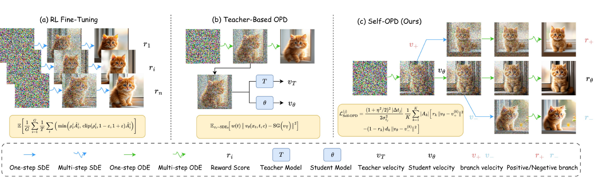
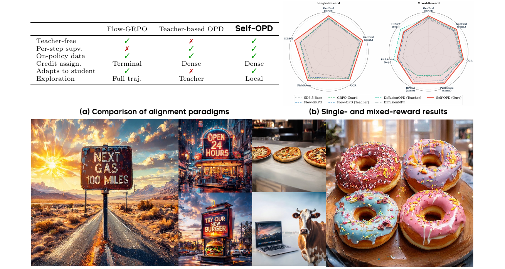
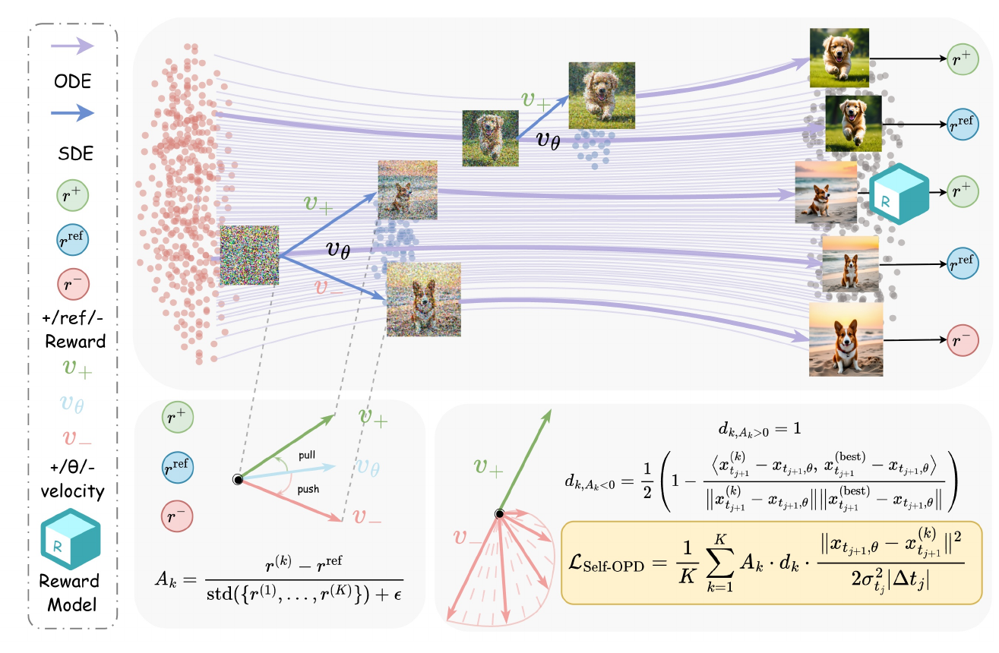
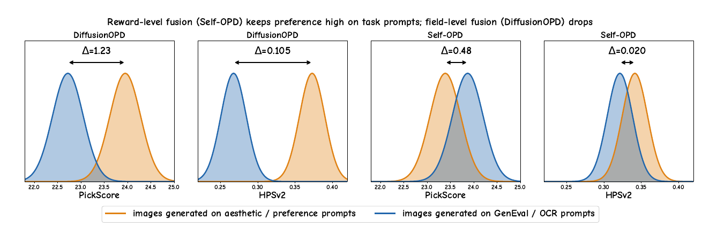
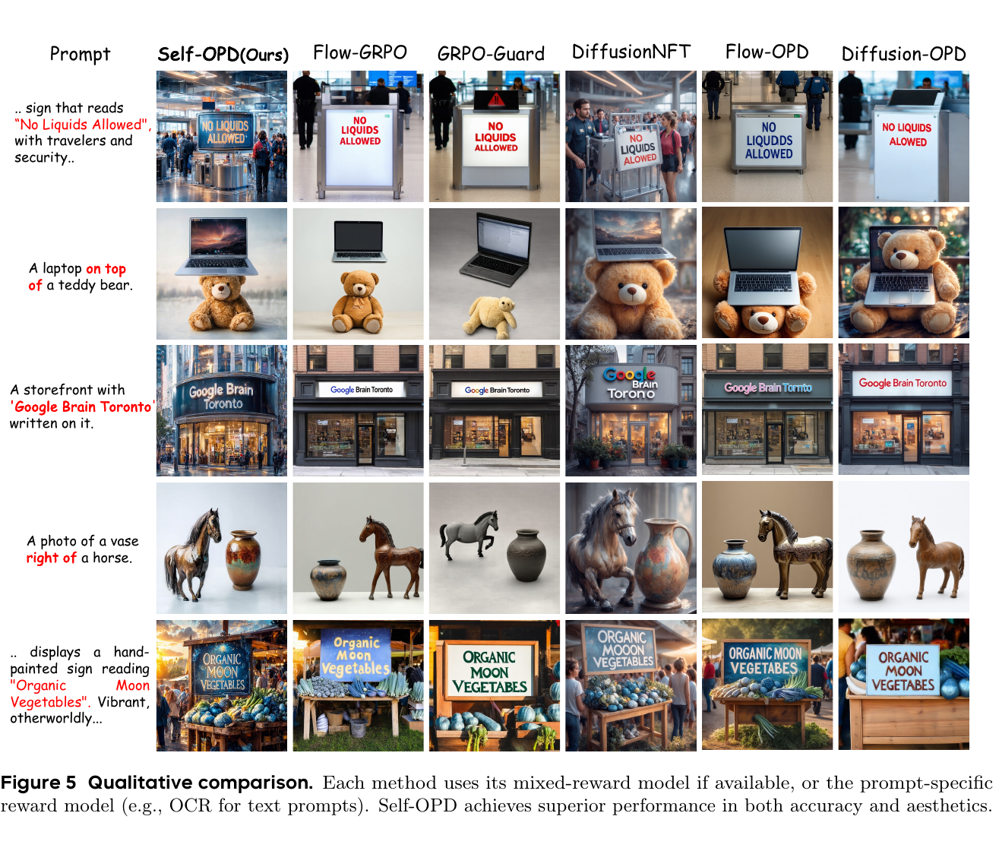
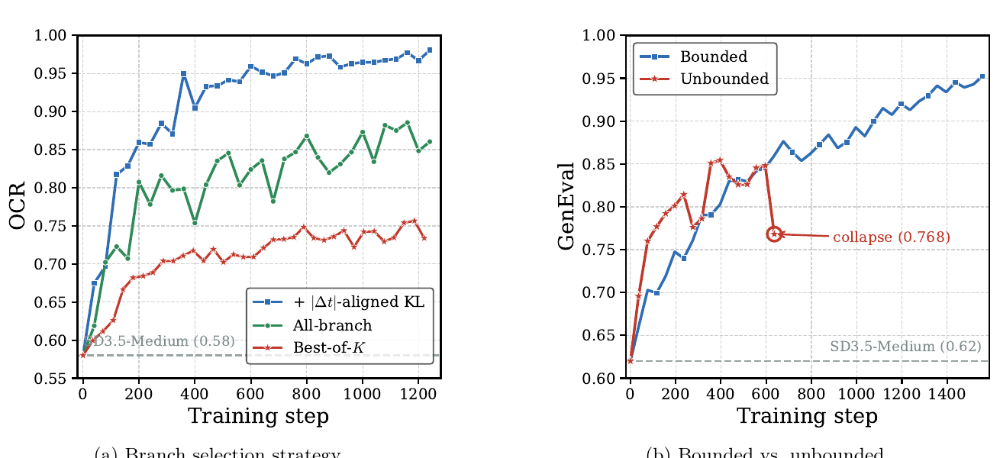
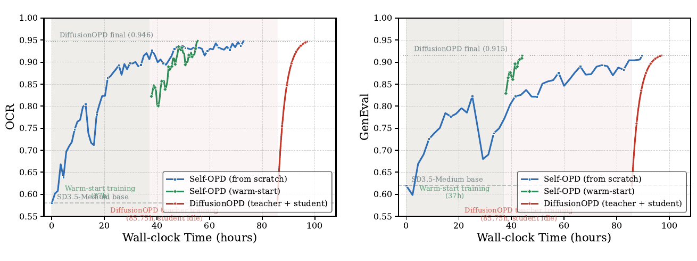

# Self-OPD: On-Policy Distillation for Flow Matching Models without Teacher

> Shiyi Zhang¹³*, Mushui Liu²³*, Yunze Tong², Wanggui He³, Siyu Zou³, Jinlong Liu³, Yunlong Yu², Jian Song¹, Hao Jiang³, Pipei Huang³, Bo Zheng³  
> ¹清华大学 ²浙江大学 ³阿里巴巴 · arXiv:2608.26872 · 2026-08-27 · [github](https://github.com/Shiy-Zhang/Self-OPD)

---

## 1. 一句话定位

**On-policy distillation 想要的是"逐步的密集监督",但那不一定非得来自 teacher。** Self-OPD 让 student 在自己轨迹的**每一步**上分叉出 `K` 条 SDE 候选,各自 ODE rollout 到干净图打分,再跟一条**纯确定性 ODE 自参考轨迹**比较得出 advantage;高分支拉、低分支推,配上**方向门控**和**SDE 方差归一化**,就得到了不需要任何 teacher 的逐步监督。

顺带把多目标对齐从"参数空间混合梯度"改成了"**奖励层面融合标量分数、只用来给分支排序**"——因此天然支持黑盒/不可微 reward,调权重不用重训。

---

## 2. 要解决的问题

### 2.1 两条现有路线的困境

> **Fig 2 逐面板解读**：三张并排的示意图,底部有统一图例(实线蓝=One-step SDE、虚线蓝=Multi-step SDE、实线绿=One-step ODE、虚线绿=Multi-step ODE、`r_i`=Reward Score、`T`=Teacher Model、`θ`=Student Model)。
>
> - **(a) RL Fine-Tuning(Flow-GRPO)**——从噪声出发的多条随机轨迹各自走到底(猫的图像),**只在终点拿到 `r_1 ... r_n`**。底下的公式是 GRPO 的 clipped ratio 目标。问题一眼可见:**reward 要沿着几十步往回分配信用**,梯度方差高。
> - **(b) Teacher-Based OPD(Flow-OPD)**——多了一个 `T`(Teacher)方框,它和 `θ`(Student)在**同一个中间状态**上各出一个速度 `v_T` / `v_θ`,底下公式是两者的 MSE。监督是**逐步密集**的,但**必须有一个预训练好的 teacher**。
> - **(c) Self-OPD(本文)**——从中间状态分叉出多条蓝色 SDE 短箭头,各自绿色 ODE 走到干净图,右侧标注 `r_+` / `r_θ` / `r_-`。**没有 `T` 方框**——密集监督来自分支之间的相对好坏,而不是外部老师。

具体的痛点是:

| 路线 | 优点 | 痛点 |
|---|---|---|
| **RL / GRPO 类**(Flow-GRPO、DanceGRPO、GRPO-Guard) | teacher-free | **只有终点奖励**,信用要回传几十步 → 梯度方差高;多目标对齐脆弱 |
| **Teacher-based OPD**(Flow-OPD、Diffusion-OPD) | 逐步密集监督,稳定、样本高效 | **每个新目标都要训一个专用 teacher**;学生被 teacher 的质量和偏置**封顶**;多 teacher 在**场级别**融合会产生**互相打架的更新方向** |

论文把问题提炼成一句话:**能不能保住 OPD 的密集逐步监督,同时把 teacher 拿掉?**

### 2.2 多目标的"跷跷板"

这是论文真正想打的靶子。Diffusion-OPD 那类方法处理多目标的方式是:**把问题拆成若干个各自训练的专用 teacher,再在速度场层面路由并合并**。论文认为这**从根本上背离了多目标对齐的目的**——

> 我们要的是**同一张图**在所有目标上都拿高分,而不是**不同的图**各自在不同的评价器下出彩。

场级别融合优化的是 `Σ_m λ_m L_m(θ)`,当两个目标不一致时 `⟨∇_θ L_i, ∇_θ L_j⟩ < 0`,每次更新都是一个**谁也不满足的折中**。

---

## 3. 与前作的关系

> **Fig 1 逐段解读**：
>
> **(a) 范式对比表**——六行对比 Flow-GRPO / Teacher-based OPD / Self-OPD:
>
> | | Flow-GRPO | Teacher-based OPD | **Self-OPD** |
> |---|---|---|---|
> | Teacher-free | ✓ | ✗ | **✓** |
> | 逐步监督 | ✗ | ✓ | **✓** |
> | On-policy 数据 | ✓ | ✓ | ✓ |
> | 信用分配 | Terminal | Dense | **Dense** |
> | 适应学生 | ✓ | ✗ | **✓** |
> | 探索 | 整条轨迹 | Teacher | **局部** |
>
> **Self-OPD 是唯一在"teacher-free"和"逐步监督"两栏同时打勾的**——这就是全文的定位。注意 "Adapts to student" 这一行:teacher-based OPD 打叉,因为 teacher 是固定的,不会随学生能力变化调整监督。
>
> **(b) 雷达图**——左图单奖励(5 维:GenEval strict/cont.、OCR、PickScore、HPSv2),右图混合奖励(7 维,preference 分 same/sep. 两套协议)。红色实线是 Self-OPD,**在两张图里都基本是最外层的包络**。灰色点线是未对齐的 SD3.5-Base(最内层)。
>
> **(c) 单个 Self-OPD 模型的生成样本**——四组图:"NEXT GAS 100 MILES" 路牌、"OPEN 24 HOURS" 霓虹招牌、"TRY OUR NEW BURGER" 广告牌、两张披萨/四个甜甜圈(计数)。**卖点是同一个模型同时做到:文字渲染准确 + 计数正确 + 画面有美感**,而不是各自需要一个专用模型。

**直接前作**:

- **GKD**(ICLR 2024,仓库里有[笔记](../../llm/gkd/analysis.md))——OPD 的原型,在 LLM 上让 student 在自采序列上接受 teacher 的逐 token 反馈。
- **Flow-OPD / Diffusion-OPD**——把 OPD 搬到 flow matching / diffusion,student 速度在每个去噪步回归到 teacher 预测。**Self-OPD 要拿掉的就是这个 teacher。**
- **Flow-GRPO / GRPO-Guard / DanceGRPO**——终点奖励的 policy gradient,teacher-free 但信用分配长。
- **DiffusionNFT**——在前向扩散轨迹上操作,把加噪过程当环境。
- **D-OPSD**(正文引用 [15],仓库里有[笔记](../d_opsd/analysis.md))——同属自蒸馏路线,但目标是**给 few-step 模型做持续微调**:用同一模型的 multimodal 分支当 teacher、text-only 分支当 student。Self-OPD 则完全不设 teacher 角色,监督来自分支之间的相对好坏。

📌 **仓库内横向**:本文与 [RVM](../../video_generation/rvm/analysis.md)(2026-08-24,比本文早 3 天)**结构上高度相似**——都是"reward/advantage 加权的速度回归,正拉负推"。核心差别在**监督信号从哪来**:RVM 把生成好的端点加一次噪得到 `v = ε - x₀`;Self-OPD 在当前 timestep 的**局部邻域**做 SDE 分叉。两篇互相没有引用。详见文末 Q&A。

---

## 4. 核心方法

> **Fig 3 逐区域解读**：左侧竖排图例——**紫色箭头 = ODE、蓝色箭头 = SDE**;三个圆形标签 `r⁺`(绿)/`r^ref`(蓝)/`r⁻`(红)对应正/参考/负的 reward;三个速度符号 `v₊`(绿)/`v_θ`(蓝)/`v₋`(红);蓝色立方体 `R` 是 Reward Model。
>
> **上半区(探索与打分)**——最左是噪声点云。student 用**一次**前向得到确定性预测,随后分叉出多条**蓝色 SDE 短箭头**;每个分支再用**紫色 ODE 长箭头**滚到干净图(图上是三只柯基/柴犬)。所有图送进右侧的 `R` 打分,得到 `r⁺` / `r^ref` / `r⁻`。**注意中间那条标 `v_θ` 的路径**——它是不加噪的纯 ODE 自参考轨迹,产出 `r^ref`。
>
> **左下区(advantage 与 pull-push)**——三个 reward 圆点汇聚到一个原点,画出三条速度向量:绿色 `v₊`、蓝色 `v_θ`、红色 `v₋`。标注 **`pull`(绿色,朝 `v₊`)和 `push`(红色,背离 `v₋`)**。底下是 advantage 公式:分子 `r^(k) − r^ref`,分母是 `K` 个分支 reward 的标准差。**关键是分母用分支间的 std、分子用相对自参考的差** —— 这就是"self-referenced"的含义。
>
> **右下区(方向门控与总 loss)**——顶部写明 `d_{k,A_k>0} = 1`(正分支不衰减);下面是负分支的 `d_k` 公式:`½(1 − cos⟨δ_k, δ_best⟩)`。左边的扇形图画了一束**红色的负分支向量**和一条**绿色的最佳分支** `v₊`——**越靠近绿色的红色分支,排斥被压得越狠**。黄色高亮框里是最终的 `L_Self-OPD`。

### 4.1 前置：SDE 分叉与"速度—状态"的仿射等价

flow matching 的概率路径是 `x_t = (1-t)x₀ + tε`。反向 ODE 增广成 SDE 后,Euler-Maruyama 离散的每一步分解成**确定性预测 + 各向同性扰动**:

$$
x_{t_{j+1}} = x_{t_{j+1},\theta} + \sigma_{t_j}\sqrt{|\Delta t_j|}\, z_j, \qquad z_j \sim \mathcal{N}(0, I), \qquad \sigma_{t_j} = \eta\sqrt{t_j/(1-t_j)}
$$

📌 **论文推导里最优雅的一步**:把 score 展开代进 SDE drift 后,`t_j` 和 `(1-t_j)` **恰好互相抵消**,只留下一个与时间步无关的常数 `1 + η²/2`。于是确定性预测与速度场之间是**干净的仿射关系**:

$$
x_{t_{j+1},\theta} = b_{t_j}(x_{t_j}) + c_{t_j}\, v_\theta(x_{t_j}, t_j), \qquad c_{t_j} = \left(1 + \tfrac{\eta^2}{2}\right)\Delta t_j
$$

**这个仿射等价保证了:在"转移空间"里写的任何蒸馏目标,都可以在"速度空间"里以相同的收敛性质最小化。** 后面所有推导都靠它在两个空间之间自由换算。

### 4.2 自参考评估与自探索

**SDE 分叉。** 在时刻 `t_j`,**只做一次** transformer 前向得到 `x_{t_j+1,θ}`,然后采 `K` 个独立高斯扰动:

$$
x_{t_{j+1}}^{(k)} = x_{t_{j+1},\theta} + \sigma_{t_j}\sqrt{|\Delta t_j|}\, z_k, \qquad k = 1, \ldots, K
$$

📌 **所有分支共享同一个基础预测**,所以**昂贵的 transformer 只算一次**,多样性来自轻量的 SDE 扰动。

**ODE rollout 与自参考。** 每个分支用确定性 ODE(`η=0`)滚到干净 latent、VAE 解码、reward 打分得 `r^(k)`。同时从**同一个父状态** `x_{t_j}` 跑一条完全确定的 ODE 轨迹,记其 reward 为 `r^ode`。分支 advantage 是:

$$
A_k = \frac{r^{(k)} - r^{\mathrm{ode}}}{\mathrm{std}\big(\{r^{(1)}, \ldots, r^{(K)}\}\big) + \epsilon}
$$

**正 advantage = 这个方向比 student 的默认轨迹好,负 = 该避开。** 这条纯确定性轨迹就是**不需要 teacher 的方差缩减 baseline**。

### 4.3 全分支 pull-push 蒸馏

不只回归到最好的那个分支,而是**用上整个探索邻域**。

**为什么需要方向门控?** 如果一个低奖励分支的方向**恰好和最佳分支差不多**,强排斥会**抵消掉本该有的吸引**。于是引入衰减系数:

$$
d_k =
\begin{cases}
1, & A_k \ge 0\\[4pt]
\dfrac{1}{2}\left(1 - \dfrac{\langle \delta_k, \delta_{\mathrm{best}}\rangle}{\lVert \delta_k\rVert\,\lVert \delta_{\mathrm{best}}\rVert}\right), & A_k < 0
\end{cases}
$$

其中 `δ_k = x^(k) - x_θ` 是相对确定性预测的位移。`d_k ∈ [0,1]`:**与最佳方向相反的负分支保留全部排斥;与最佳方向一致的负分支排斥被压制。**

**从转移空间换到速度空间。** 由仿射关系,每个分支对应一个**等效分支速度**:

$$
v^{(k)} = v_\theta - \frac{\sigma_{t_j}}{(1 + \eta^2/2)\sqrt{|\Delta t_j|}}\, z_k
$$

**也就是说,在转移空间注入高斯噪声,精确等价于对速度目标做扰动。** 最终的逐步目标(`r_k = 1[A_k ≥ 0]`):

$$
\mathcal{L}^{(j)}_{\text{Self-OPD}} = \frac{(1+\eta^2/2)^2 |\Delta t_j|}{2\sigma_{t_j}^2}\cdot\frac{1}{K}\sum_{k=1}^{K} |A_k|\left[\, r_k \lVert v_\theta - v_+^{(k)}\rVert^2 - (1-r_k)\, d_k \lVert v_\theta - v_-^{(k)}\rVert^2 \,\right]
$$

**与逐步 KL 的联系(Proposition 1)。** 设 `q_θ(·|x_{t_j}) = N(x_{t_j+1,θ}, σ²|Δt_j| I)`,`q* ∝ q_θ·exp(A(·)/τ)` 是 reward 倾斜后的目标分布,则

$$
\nabla_{x_{t_{j+1},\theta}} D_{\mathrm{KL}}(q^* \Vert q_\theta) = \frac{1}{\sigma_{t_j}^2 |\Delta t_j|}\, \mathbb{E}_{x_{t_{j+1}} \sim q^*}\!\left[x_{t_{j+1},\theta} - x_{t_{j+1}}\right]
$$

📌 **这个命题的价值在于:它把那个方差归一化因子从"超参"变成了"推导结果"。** 论文的原话是——`1/(σ²|Δt|)` 是**使每一步回归都成为同一个 KL 梯度的无偏估计的精度因子**;**用一个与时间步无关的尺度会让轨迹上不同步的权重系统性偏大或偏小**。Self-OPD 就是用 `K` 个分支做这个期望的蒙特卡洛估计,以 `A_k·d_k` 作为带符号的重要性权重。

**跨时间步聚合**:`L_total = Σ_j α_j L^(j)`,`α_j` 优先早中期时间步(建立全局语义布局),向 `t=0` 平滑衰减。

⚠️ **`α_j` 的具体函数形式论文没有给出**,只有定性描述。

### 4.4 奖励层面融合：本文最有价值的论证

设 `q*_m ∝ q_θ·exp(A_m/τ)` 是目标 `m` 的倾斜分布。**场级别融合**最小化 `Σ_m λ_m D_KL(q*_m ‖ q_θ)`,目标不一致时贡献相反的梯度。

论文的做法是考虑各目标倾斜的**几何平均**:

$$
q^*_{\mathrm{joint}}(x_{t_{j+1}} \mid x_{t_j}) \;\propto\; q_\theta(x_{t_{j+1}} \mid x_{t_j})\exp\!\left(\sum_{m=1}^{M}\frac{\lambda_m A_m(x_{t_{j+1}})}{\tau}\right)
$$

**每个比值 `q*_m/q_θ = exp(A_m/τ)/Z_m` 的归一化常数 `Z_m` 与 `x_{t_j+1}` 无关**,所以 `Π_m Z_m^{-λ_m}` 是个常数被 `∝` 吸收掉——**`M` 个互相竞争的倾斜塌缩成对 `q_θ` 的单个倾斜**,倾斜量是复合 advantage `Σ_m λ_m A_m`。

由于每个 `A_m` 对其归一化 reward 是仿射的,这个联合倾斜可以**精确地**通过融合 `M` 个 z-score 后的分数来实现:

$$
r^{(k)} = \sum_{m=1}^{M}\lambda_m \tilde{r}_m^{(k)}, \qquad \tilde{r}_m^{(k)} = \frac{r_m^{(k)} - \mu_m}{\sigma_m + \epsilon}
$$

📌 **关键论点:复合分数只通过"给分支排序"进入训练,从不被求导。** 于是训练目标始终是**一条具体的、已经在所有指标上都得分不错的轨迹速度**,而不是若干个逐指标梯度的和。

论文把这个差别总结为**"在采样之前融合" vs "在采样之后融合"**:

- 场级别融合在**参数空间**合并,目标打架时每次更新都是折中;
- 奖励级别融合在**轨迹空间**合并,**胜出的分支本来就落在所有 reward 都高的联合区域里**。

四条实际好处:① 没有目标间梯度冲突;② 支持黑盒/不可微打分器;③ **改 `λ_m` 不用重训**,运行时可组合;④ 绕过 teacher 天花板。

**实际权重**:OCR 任务用 `λ_OCR : λ_PickScore : λ_HPSv2 = 3 : 1 : 1`,GenEval 变体同理替换任务打分器;PickScore 和 HPSv2 作为**与 prompt 无关的质量护栏**防 reward hacking。另有**逐打分器否决**机制:显著低于自参考基线的分支被直接拒绝。

---

## 5. 关键配置

代码已开源([Shiy-Zhang/Self-OPD](https://github.com/Shiy-Zhang/Self-OPD),2026-08-28 更新)。论文正文给的配置很少:

| 项 | 值 |
|---|---|
| 基础模型 | **SD3.5-Medium**,512×512 |
| 微调方式 | LoRA(施加于 transformer) |
| 分支数 `K` | **8** |
| 噪声水平 `η` | **0.7**(⚠️ 但 §3.2 写的是 0.6,见 §6) |
| 每次更新的训练时间步数 | 2 |
| 优化器 | AdamW,lr `3e-4` |
| 奖励模型 | OCR 字符级准确率、GenEval、PickScore、HPSv2 |

📌 **算一下每次参数更新的采样开销**:`K=8` 个分支 + 1 条自参考 ODE = **9 次完整 ODE rollout + 9 次 VAE 解码 + 9 次 reward 打分**;再乘以"每次更新采 2 个时间步" ≈ **18 次完整采样**。transformer 主干虽然每步只算一次,但**rollout 和打分才是大头**——论文没有给出这部分的成本分解。

---

## 6. 实验结果

**基础模型**:SD3.5-Medium。**任务与奖励**:① 文字渲染(OCR 字符准确率)② 组合生成(GenEval)③ 美学与人类偏好(PickScore、HPSv2)。
**对照**:teacher-free RL(Flow-GRPO、GRPO-Guard、DiffusionNFT)+ teacher-based OPD(Flow-OPD、DiffusionOPD)。

### 6.1 单奖励训练（Table 1）

| 方法 | GenEval strict | GenEval cont. | OCR | PickScore | HPSv2 |
|---|---|---|---|---|---|
| **SD3.5-Medium(base)** | 0.5222 | 0.6219 | 0.5833 | 22.41 | 0.3004 |
| Flow-GRPO + GenEval | 0.9005 | 0.9470 | 0.6519 | 22.53 | 0.2792 |
| Flow-GRPO + OCR | 0.5420 | 0.6529 | 0.9253 | 22.51 | 0.2999 |
| Flow-GRPO + PickScore | 0.5081 | 0.5293 | 0.7033 | 23.57 | 0.3396 |
| GRPO-Guard + GenEval | 0.9155 | 0.9502 | 0.7032 | 22.20 | 0.2586 |
| GRPO-Guard + OCR | 0.5402 | 0.6870 | 0.9348 | 22.44 | 0.2912 |
| GRPO-Guard + PickScore | 0.4602 | 0.4037 | 0.6563 | 23.98 | 0.3453 |
| **Self-OPD + GenEval** | **0.9536** | **0.9676** | 0.6120 | 22.46 | 0.2741 |
| **Self-OPD + OCR** | 0.4186 | 0.5565 | **0.9745** | 22.11 | 0.2719 |
| **Self-OPD + PickScore** | 0.5303 | 0.5863 | 0.7416 | **24.47** | 0.3357 |
| **Self-OPD + HPSv2** | 0.4453 | 0.4722 | 0.7121 | 23.25 | **0.4099** |

**每个目标上 Self-OPD 都拿到该列最好**(GenEval 0.9536、OCR 0.9745、PickScore 24.47、HPSv2 0.4099)。

⚠️ **但这张表还说了另一件论文没提的事:Self-OPD 单奖励训练在非目标指标上的退化比 Flow-GRPO 更严重。**

- `Self-OPD + OCR` 的 GenEval strict **0.4186,比未对齐的 base(0.5222)还低 0.10**;
- `Self-OPD + HPSv2` 的 GenEval strict 0.4453,**同样低于 base**;
- 对照 `Flow-GRPO + OCR` 的 GenEval 是 **0.5420,高于 base**。

**也就是说 Self-OPD 的单目标优化更"狠",跷跷板效应也更明显。** 这恰好从反面强化了论文的主张(必须做多目标融合),但论文一句都没讨论。

### 6.2 混合奖励训练（Table 2，本文的主战场）

每个方法产出**一个模型**,在所有指标上评测。

| 方法 | Teacher-free | GenEval strict | GenEval cont. | OCR | PickScore(same) | HPSv2(same) | PickScore(sep.) | HPSv2(sep.) |
|---|---|---|---|---|---|---|---|---|
| SD3.5-Medium(base) | — | 0.5222 | 0.6219 | 0.5833 | 22.66 | 0.2824 | 22.41 | 0.3004 |
| Flow-OPD | ✗ | 0.8594 | 0.9203 | 0.9392 | 23.43 | 0.3042 | 23.13 | 0.3334 |
| DiffusionOPD | ✗ | 0.9150 | 0.9479 | 0.9464 | 22.72 | 0.2676 | **23.95** | **0.3729** |
| DiffusionNFT | ✓ | 0.8888 | 0.9277 | 0.9229 | 23.67 | **0.3206** | 23.18 | 0.3482 |
| **Self-OPD** | **✓** | **0.9521** | **0.9691** | **0.9597** | **23.87** | 0.3214 | 23.39 | 0.3415 |

两个协议的区别是关键:

- **same test images**:直接在 GenEval / OCR 基准的生成图上测偏好分——问的是"**满足任务的那些图,是不是同时也好看**"。
- **separate test set**:在一个独立的美学基准上测。

📌 **Self-OPD 在 same 协议上明显赢 DiffusionOPD**(PickScore 23.87 vs 22.72,HPSv2 0.3214 vs 0.2676),⚠️ **但在 sep. 协议上输**(23.39 vs 23.95,0.3415 vs 0.3729)。

论文的论证是:**same 协议才是多目标对齐真正要衡量的东西**,因为目标就是让同一张图满足所有标准。这个论点站得住,但**把"哪个协议是主要指标"的论证放在看到结果之后**,读起来有 post-hoc 的味道。

📌 另一个值得注意的观察:**DiffusionOPD 在 same 协议上的偏好分(22.72 / 0.2676)甚至低于 Flow-OPD(23.43 / 0.3042)**,而它的 GenEval/OCR 更高——这正是"路由到专用 teacher"的代价:图满足了被路由到的那个目标,但整体观感没人管。

> **Fig 4 解读**：四张分布图,左二属 DiffusionOPD、右二属 Self-OPD;每张里**橙色是在美学/偏好 prompt 上生成的图的 reward 分布,蓝色是在 GenEval/OCR 任务 prompt 上生成的图的分布**。看两个峰之间的位移 `Δ`:
>
> | | PickScore Δ | HPSv2 Δ |
> |---|---|---|
> | DiffusionOPD | **1.23** | **0.105** |
> | Self-OPD | 0.48 | 0.020 |
>
> DiffusionOPD 的两个分布**明显分离**——换到任务 prompt 上偏好质量就掉下来,这正是场级别融合的签名:**图只在"选中了那个 teacher 的 prompt 家族"上表现好**。Self-OPD 的两个分布**几乎重合**。
>
> ⚠️ **但这张图必须打个折扣**:caption 自己写明 "**the spread is illustrative and only serves to visualize the shift Δ**"——**分布的形状和宽度是画出来的,不是测出来的**,只有两个峰的位置来自 Table 2 的均值。所以它是一张**示意图**,而不是数据图,却用了数据图的视觉语言。`Δ` 本身是真的(就是 Table 2 两列相减),但"分布几乎重合"这个视觉印象没有数据支撑。

### 6.3 定性对比（Fig 5）

> **Fig 5 逐行解读**：七列——prompt、**Self-OPD(Ours)**、Flow-GRPO、GRPO-Guard、DiffusionNFT、Flow-OPD、Diffusion-OPD。prompt 里的考点用红字标出。
>
> - **第 1 行(机场标牌 "No Liquids Allowed",带旅客与安保)**——文字拼写上,**DiffusionNFT 写成 "ALOWED"、Flow-OPD 写成 "LIQUDDS"、Diffusion-OPD 也是 "ALOWED"**,三个 teacher-based/NFT 方法都拼错了。Flow-GRPO 和 GRPO-Guard 拼对了,**但画面只有一块孤零零的牌子,prompt 要求的"旅客与安保"没有出现**。只有 Self-OPD 既拼对、又给出了完整的机场场景。
> - **第 2 行(laptop **on top of** a teddy bear)**——考空间关系。Self-OPD 的笔记本明确悬在熊上方 ✓;**GRPO-Guard 把两者并排放 ✗**;**Diffusion-OPD 变成熊抱着笔记本 ✗**。
> - **第 3 行(店面写 "Google Brain Toronto")**——**DiffusionNFT 漏字母("Torono")、Flow-OPD 拼成 "Tormto"**。Self-OPD 不但拼对,还给了带街景和行人的深色店面,画面信息量明显高于其它几列的白墙店面。
> - **第 4 行(vase **right of** a horse)**——**Flow-OPD 和 Diffusion-OPD 把左右弄反了 ✗**,Flow-GRPO 也是马在右 ✗。Self-OPD、GRPO-Guard、DiffusionNFT 正确。
> - **第 5 行(手绘牌 "Organic Moon Vegetables")**——多数方法能写对词,但 Self-OPD 的画面是完整的市集场景。
>
> 📌 **这张图的关键不在"谁拼对了字"**——多数方法在自己擅长的那一维都不差——**而在"拼对字的那张图,画面本身是不是也好"**。Flow-GRPO / GRPO-Guard 是单奖励专家,文字对了但场景空洞;teacher-based 的两个方法场景尚可但文字出错。**只有 Self-OPD 在同一张图上同时满足文字、空间关系和画面丰富度**,这正是 §4.4 奖励层面融合想要的效果,也是 Table 2 里 same-images 协议偏好分领先的视觉解释。

### 6.4 消融（Fig 6）

> **Fig 6 逐面板解读**：
>
> **(a) 分支选择策略**(纵轴 OCR,横轴训练步)——三条曲线:
> - **红色 Best-of-K**:只回归到最好的那个分支。曲线**震荡、非单调**,1200 步才爬到 0.75 左右,**勉强超过 base 的 0.58**。论文归因于**目标频繁跳变导致的高梯度方差 + 完全没有负反馈**。
> - **绿色 All-branch**:全分支 pull-push。稳定上升到 0.85 左右。
> - **蓝色 + |Δt|-aligned KL**(完整 Self-OPD):加上 Proposition 1 的方差归一化,**收敛更快且最终最高**(接近 0.98)。
>
> **三条线的间距把两个设计的贡献分得很干净**:全分支比 Best-of-K 高约 0.10,方差归一化再高约 0.13。
>
> **(b) 排斥项是否有界**(纵轴 GenEval)——蓝色 `d_k ∈ [0,1]`(有界)单调上升到 0.95;**红色 `d_k ∈ [0,2]`(无界)在约 600 步时直接崩到 0.768**(图上用红圈标注 `collapse (0.768)`)。
>
> 📌 **论文把这个失败曲线原样画出来了**,而不是只说"我们加了个系数效果更好"。结论也说得明确:**方向感知系数必须纯粹作为衰减门,不能当梯度放大器。**

**时间步加权**:均匀加权最终能追平,但本文的加权**收敛更快**;而一个**过采样早期步的 TIS 变体反而掉到 base 以下**——说明即使 loss 权重偏向早期,**也必须持续暴露于轨迹的所有阶段**。

### 6.5 训练效率（Fig 7）

> **Fig 7 解读**：左 OCR / 右 GenEval,横轴**真实墙钟时间(小时)**。三条线:
> - **红色 DiffusionOPD**——在约 86 小时之前**完全是平的**(图上红色阴影区标注 "DiffusionOPD teacher training (85.75h, student idle)")。它需要三个 teacher 并行训练(GenEval 46.9h、OCR 33.2h、Aesthetics 85.8h),**学生在整个 teacher 训练期间干等**,之后再花 11.3h 蒸馏,总计 **97h**。
> - **蓝色 Self-OPD(from scratch)**——**从第 0 小时就开始爬**。约 62h 达到 DiffusionOPD 的 OCR 水平(0.946),约 90h 达到 GenEval 水平(0.915)。
> - **绿色 Self-OPD(warm-start)**——先并行训单奖励专家(灰色阴影 37h),再启动三奖励混合运行,**OCR 再花约 11h、GenEval 约 7h 收敛**,总计约 48h / 44h。
>
> **约 2× 快于 DiffusionOPD,且最终性能更高。**
>
> ⚠️ 但 caption 明写 "**All training times for DiffusionOPD are taken from the original report**"——**不是同硬件复现**。而且**全文没给 GPU 型号和数量**,所以这个 2× 只能当量级参考。

---

## 7. 争议与权衡

**① 正文数字与 Table 1 对不上。** 第 10 页正文写 "Self-OPD achieves top performance with a GenEval score of 0.95, OCR accuracy of 97.5%, **PickScore of 24.79, and HPSv2 score of 0.3665**"。但 Table 1 里 Self-OPD 的最好 PickScore 是 **24.47**、最好 HPSv2 是 **0.4099**。**两个数都对不上**(GenEval 和 OCR 是对的)。属于校对问题,但出现在最关键的结果陈述里。

**② `η` 前后矛盾。** §3.2 写 "The noise level `σ_{t_j}`, set by **η = 0.6** in our experiments";§4.1 实现细节写 "noise level **η = 0.7**"。`η` 直接决定探索半径和 loss 前因子 `(1+η²/2)²|Δt|/(2σ²)`,这个不一致对复现是实质性的。

**③ Fig 4 是示意图,却用了数据图的外观。** caption 承认分布的**宽度是"illustrative"**,只有均值是实测的。"两个分布几乎重合"这个最有说服力的视觉结论**没有数据支撑**——真正有数据的只是两个 `Δ` 值(而它们就是 Table 2 两列相减)。画成两组高斯曲线容易让读者以为看到了分布层面的证据。

**④ 单奖励训练的跷跷板比基线更严重,论文完全没提。** `Self-OPD + OCR` 的 GenEval strict 是 **0.4186,比未对齐的 base(0.5222)低 0.10**;`+ HPSv2` 是 0.4453,同样低于 base。而 `Flow-GRPO + OCR` 是 0.5420,**高于 base**。这说明 Self-OPD 的单目标优化更激进、对其他能力的破坏更大。虽然这从反面支持了"要做多目标融合"的主张,但**作为一个方法的固有性质应该被写出来**。

**⑤ 换个评测协议就输给 teacher-based 方法。** separate test set 上 Self-OPD 的 PickScore 23.39 / HPSv2 0.3415 都**输给 DiffusionOPD 的 23.95 / 0.3729**。论文论证 same 协议才是主要指标——这个论点本身有道理,但**在看到结果之后才确立主要协议**,方法论上不够干净。

**⑥ 每步的采样成本很高,且被回避了。** `K=8` 个分支 + 1 条自参考 = **每个训练时间步 9 次完整 ODE rollout + 9 次 VAE 解码 + 9 次 reward 打分**,再乘"每次更新 2 个时间步"。transformer 主干只算一次这件事被反复强调,**但 rollout 和打分才是大头**。Fig 7 给了端到端墙钟时间,但**没有 per-step 成本分解、没有 GPU 型号数量**,而 DiffusionOPD 的时间还是引用的。

**⑦ 没有 `K` 和 `η` 的消融。** `K` 直接决定每步成本与 advantage 估计质量,`η` 决定探索半径,**两个最核心的超参一个消融都没有**(`η` 甚至前后矛盾)。消融只做了分支选择策略、排斥有界性、时间步加权三项。

**⑧ `α_j` 的具体形式未给出。** 只有"优先早中期、向 t=0 平滑衰减"的定性描述。而 Fig 6(a) 显示时间步相关的归一化能带来约 0.13 的 OCR 提升,说明这类加权很敏感。

**⑨ 验证范围窄。** 只有 SD3.5-Medium、512×512、T2I。没有其他 backbone、没有更高分辨率、没有视频。而 OPD 这条线(Flow-OPD、Poly-OPD、Any-OPD)本身就是围绕 flow matching 通用性展开的。

**⑩ 正面:Proposition 1 把归一化因子从超参变成了推导结果。** 明确指出 `1/(σ²|Δt|)` 是使每步回归成为同一 KL 梯度无偏估计的**精度**,并说明"与时间步无关的尺度会系统性地误加权不同步"。Fig 6(a) 的蓝绿两线之差就是这个论断的实证。**理论与消融对得上,这在这类论文里不常见。**

**⑪ 正面:奖励层面融合的推导干净且有实践价值。** Eq. 17 证明 `M` 个倾斜的几何平均塌缩成单个复合倾斜,因此多目标可以在**采样之后**用标量分数排序完成,不必在参数空间混合梯度。由此得到的三条工程性质——**支持黑盒/不可微打分器、改 `λ` 无需重训、绕过 teacher 天花板**——都是实打实的。

**⑫ 正面:把失败曲线画出来了。** Fig 6(b) 里无界 `d_k` 在 600 步崩到 0.768 的曲线原样呈现,并给出结论"方向系数必须是衰减门而非放大器"。同样,TIS 变体掉到 base 以下的负面结果也被写了出来。

---

## 8. 一句话总结

Self-OPD 的核心动作是**用"自参考 + 局部分叉"替换掉 OPD 里的 teacher**:在轨迹的每一步分出 `K` 条 SDE 候选并各自 rollout 打分,以一条纯 ODE 轨迹作 baseline 得到 advantage,再做全分支的拉/推速度回归——其中排斥项要按与最佳方向的夹角做门控(否则会把吸引抵消掉,Fig 6(b) 直接崩),而方差归一化因子不是超参而是由逐步 KL 梯度推出来的精度;更进一步,它指出多目标对齐**不该在参数空间混合梯度,而该在采样之后用标量复合分数给分支排序**,因为 `M` 个 reward 倾斜的几何平均本来就塌缩成单个倾斜——这一步同时买到了黑盒 reward 支持和"改权重不重训"。

---

## Q&A

**Q: Self-OPD 和 RVM 看起来几乎是同一个东西,差在哪?**

A: **结构上确实高度相似——都是 advantage/reward 加权的速度回归、正拉负推——差别在"被回归的那个速度目标从哪来"。**

两篇几乎同时(RVM 2026-08-24,Self-OPD 2026-08-27),互相没有引用。

| | [RVM](../../video_generation/rvm/analysis.md) | Self-OPD |
|---|---|---|
| 速度目标 `v` 来自 | **端点**:生成完 `x₀` 后加一次噪,`v = ε − x₀` | **局部邻域**:当前时刻的 SDE 分叉,`v^(k) = v_θ − σ z_k /((1+η²/2)√\|Δt\|)` |
| 需要几次完整 rollout | 每个样本 **1 次**(生成时) | 每个训练时间步 **K+1 次**(分支 + 自参考) |
| reward 归一化 | 组内标准化 `(R − mean)/std` | **相对自参考 ODE 的差** / 分支间 std |
| 监督密度 | 每个样本一个随机时刻 | **每一步都有**(dense) |
| 稳定化手段 | 可选 anchor 项(主实验 `β = 0`) | **方向门控 `d_k`** + KL 精度归一化 |
| 前因子来源 | 无(直接 MSE) | **由 Proposition 1 推出**,不是超参 |
| 多目标 | 加权求和 reward | 同样是加权求和,但**明确论证了塌缩性质** |
| 验证 | SD3.5-M / Wan2.1 / SkyReels(含视频) | 仅 SD3.5-M(T2I) |

**成本的差别最实质**:RVM 一个样本只需一次生成 + 一次加噪;Self-OPD 每个训练时间步就要 `K+1 = 9` 次完整 rollout。**Self-OPD 用算力换监督密度。**

**理论侧 Self-OPD 更完整**:它给出了"为什么归一化因子必须是 `1/(σ²|Δt|)`"的推导,而 RVM 那边是把 ELBO-based policy gradient 里的 `w(t)` 直接**丢掉**。有意思的是两篇给出了相反的处理——RVM 认为时间权重可以扔,Self-OPD 认为它是必需的且必须是特定形式。**这个分歧值得后续关注。**

---

**Q: "自参考 baseline"比 GRPO 的组内均值好在哪?**

A: **它是同一个父状态下的确定性对照,消除了"这个 prompt 本身难不难"和"走到这一步运气好不好"两重方差。**

GRPO 的 advantage 是 `(R_i − mean_g R)/std_g R`,组内其他样本充当 baseline。但那些样本是**从头独立采样**的——它们和当前样本的差异既包含"这一步的选择好坏",也包含"整条轨迹的所有其他随机性"。

Self-OPD 的 `r^ode` 是**从同一个 `x_{t_j}` 出发、关掉噪声跑到底**的结果。所以 `r^(k) − r^ode` 干净地对应"**在这一步加了扰动 `z_k` 之后,结果比不加扰动好多少**"——父状态相同、后续采样都是确定性的,唯一的变量就是这一步的扰动。

代价是**多一条完整的 ODE rollout**(每个训练时间步)。

📌 注意分母用的是**分支间的 std**而不是包含 `r^ode` 的 std,所以这是个混合构造:分子是相对基线的偏移,分母是分支的离散度。论文没有解释为什么这样配。

---

**Q: 方向门控 `d_k` 到底在防什么?**

A: **防"排斥抵消吸引"。**

假设一个分支 reward 低但方向**和最佳分支几乎一样**(比如两者都朝正确方向走,只是这个走过头了)。如果照常施加全强度排斥,梯度会把 `v_θ` 往**远离最佳方向**的地方推——**低奖励分支的推,把高奖励分支的拉给抵消了**。

`d_k = ½(1 − cos⟨δ_k, δ_best⟩)` 正好处理这件事:

| `δ_k` 与 `δ_best` 的关系 | `cos` | `d_k` | 效果 |
|---|---|---|---|
| 完全反向 | −1 | **1** | 保留全部排斥 |
| 正交 | 0 | 0.5 | 半强度 |
| 完全同向 | +1 | **0** | **排斥归零** |

那个 `½` 是把 `d_k` 钉在 `[0,1]` 的关键。Fig 6(b) 显示,去掉它让 `d_k ∈ [0,2]` 之后,**约 600 步就崩到 0.768**——因为反向分支的排斥梯度可以放大到 2 倍,最终压过吸引项。论文的结论说得很干脆:**方向系数必须纯粹是衰减门,不能是梯度放大器。**

---

**Q: 为什么"奖励层面融合"能避免梯度冲突?这不是换个地方加权而已吗?**

A: **不是。差别在于加权发生在求导之前还是之后。**

**场级别融合**:`L(θ) = Σ_m λ_m L_m(θ)`,然后求 `∇_θ L`。如果 `⟨∇_θ L_i, ∇_θ L_j⟩ < 0`,合成的梯度是个**方向上的折中**——它既不是 `L_i` 想要的方向,也不是 `L_j` 想要的方向。参数沿着这个折中方向走,两个目标都只被部分满足。

**奖励级别融合**:复合分数 `r^(k) = Σ_m λ_m r̃_m^(k)` **只用来给 K 个分支排序**,**从不被求导**。训练目标是 `‖v_θ − v^(k)‖²`,其中 `v^(k)` 是**一条具体的、真实存在的轨迹速度**。

关键在于:**被选中的那个分支,是一张已经同时在所有指标上得分不错的真实图像所对应的方向**。所以梯度只有一个来源、一个方向,不存在合成。论文的说法是——**把联合最优的搜索从"梯度会互相干扰的参数空间"搬到了"一个样本就能同时满足所有 reward 的轨迹空间"**。

理论支撑是 Eq. 17:`M` 个 reward 倾斜的几何平均,其归一化常数与 `x_{t_j+1}` 无关而被吸收,于是**塌缩成对 `q_θ` 的单个倾斜**,倾斜量恰好是 `Σ_m λ_m A_m`。而 `A_m` 对归一化 reward 是仿射的,仿射映射保序 → **按复合分数排序 = 按联合倾斜排序**。

⚠️ 但这个论证有个前提:**联合高奖励区域非空**。如果两个目标在样本层面就是根本冲突的(比如"极简构图"和"元素丰富"),那 `K` 个分支里可能一个都不落在联合高分区,这时排序也救不了。论文没有讨论这个边界情形。

---

**Q: 这套方法和仓库里的 diffusion_opsd、PDD、TDM 怎么摆在一起?**

A: **它们分属"对齐"和"提速"两条不同的线,只在工程骨架上同构。**

| | 目标 | 监督来源 | 是否需要 teacher |
|---|---|---|---|
| **Self-OPD**(本文) | **对齐**(偏好/文字/组合) | 自参考 + 局部分支 reward | ❌ |
| Flow-OPD / DiffusionOPD | 对齐 | **预训练专用 teacher** 的逐步速度 | ✅ |
| [RVM](../../video_generation/rvm/analysis.md) | 对齐 | 端点 reward | ❌ |
| [diffusion_opsd](../diffusion_opsd/analysis.md) | 对齐 | 自蒸馏 + 多 teacher | 部分 |
| [d_opsd](../d_opsd/analysis.md) | 对齐(few-step 持续微调) | 同模型的 multimodal 分支 | 部分 |
| [PDD](../../video_generation/pdd/analysis.md) | **提速**(few-step) | teacher 的 Runge-Kutta 平均速度 | ✅ |
| [TDM](../../inference_acceleration/tdm/analysis.md) | **提速**(few-step) | teacher 的分布(反向 KL) | ✅ |

**工程上的同构很明显**:这六个最后都落到"`v_θ` 减去一个 stop-gradient 的目标速度再取平方"。差别只在那个目标速度怎么来——teacher 直给(Flow-OPD、PDD)、teacher 与 critic 之差(TDM)、reward 加权的端点方向(RVM)、还是自参考分支排序(Self-OPD)。

**实践上这两条线是正交可叠加的**:先用 Self-OPD/RVM 把模型对齐好,再用 PDD/TDM 蒸馏到 few-step。仓库里 RAVEN 和 Qwen-Image-RL 走的都是这个顺序。

---

**Q: 想复现的话,最需要注意什么?**

A: **三个坑,按严重程度排。**

1. **`η` 论文自相矛盾**(§3.2 说 0.6,§4.1 说 0.7)。它同时出现在探索半径 `σ = η√(t/(1−t))` 和 loss 前因子 `(1+η²/2)²|Δt|/(2σ²)` 里,取值不同会同时改变探索强度和步间加权。**以代码仓库为准**。
2. **`α_j` 的形式论文没给**,只有"偏向早中期、向 t=0 平滑衰减"的描述。而 Fig 6(a) 显示时间步相关的归一化值约 0.13 的 OCR 分,说明这块很敏感。
3. **算清成本再开跑**:每个训练时间步 `K+1 = 9` 次完整 ODE rollout + VAE 解码 + reward 打分,每次参数更新采 2 个时间步。**这才是主要开销,不是 transformer 前向。** 如果你的 reward 模型本身很重(比如 VLM 打分),这个乘数会很吓人。

另外两条经验性的:

- **`λ` 里一定要留 prompt-无关的质量护栏**。论文在 OCR 任务上用 `3:1:1`,PickScore 和 HPSv2 就是防 reward hacking 的护栏;还有一个**逐打分器否决**(显著低于自参考基线的分支直接丢掉)。
- **不要用单奖励训练然后指望别的能力不掉**。Table 1 里 `Self-OPD + OCR` 把 GenEval 从 0.5222 打到 0.4186,**比不训练还差**。这个方法的设计前提就是多目标一起做。
