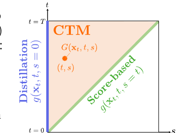
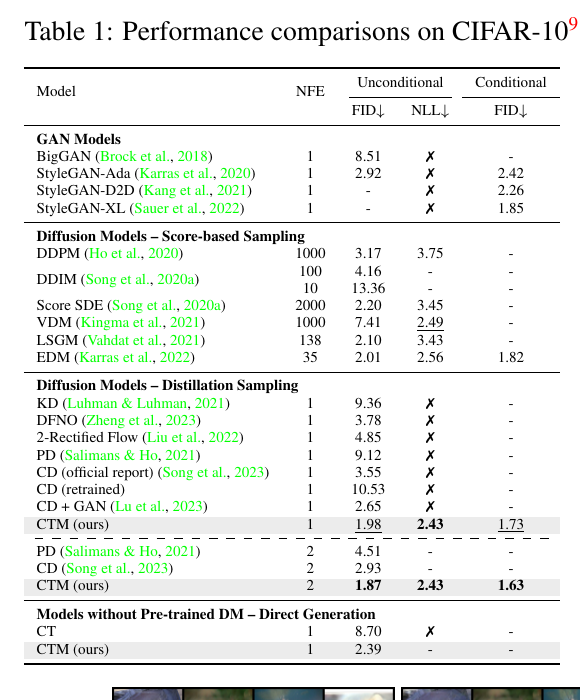
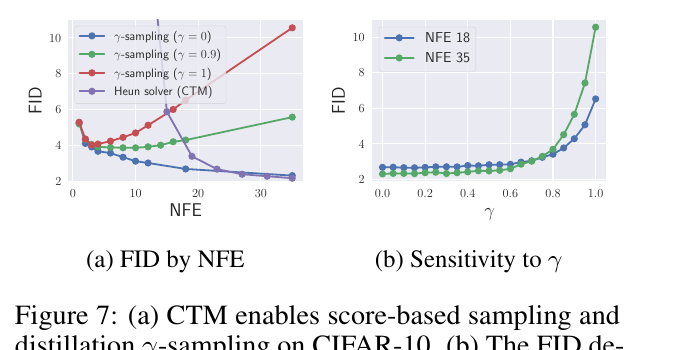
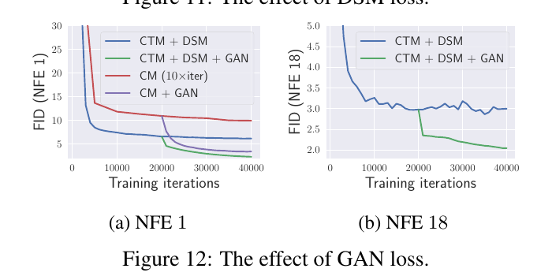

# CTM: Consistency Trajectory Models — Learning Probability Flow ODE Trajectory of Diffusion

- **arXiv**: [2310.02279v3](https://arxiv.org/abs/2310.02279)（2024-03-30，33 页）· **ICLR 2024**
- **机构**: Sony AI（东京）· CMU · Stanford
- **作者**: Dongjun Kim\*、Chieh-Hsin Lai\*（共同一作）… Yuki Mitsufuji、**Stefano Ermon**
- **代码**: [github.com/sony/ctm](https://github.com/sony/ctm)

> 📌 **这是一篇奠基性的老论文（2023/2024），不是 2026 的预印本。** 读它的价值在于：仓库里 few-step 蒸馏那一整簇（consistency distillation、DMD 系、[TDM](../tdm/analysis.md)、[PDD](../../video_generation/pdd/analysis.md)、以及视频侧 [ForgeWM](../../video_generation/forgewm/analysis.md) 的 Stage 2 因果一致性蒸馏）都建立在它和 Consistency Models 之上。

---

## 1. 一句话定位

**把"从 t 跳到 0"（consistency model）和"在 t 处估计 score"（diffusion）统一成同一个函数 `G_θ(x_t, t, s)` —— 从任意时刻 `t` 跳到任意时刻 `s ≤ t`。**

$$
G(\mathbf{x}_t, t, s) := \mathbf{x}_t + \int_t^s \frac{\mathbf{x}_u - \mathbb{E}[\mathbf{x}\mid \mathbf{x}_u]}{u}\,\mathrm{d}u
$$

即 **PF ODE 从 `t` 出发、在 `s` 时刻的解**。两个端点分别退化成已有的两类模型：



> **Fig 2 就是这篇论文的全部直觉**：纵轴 `t`、横轴 `s`，可行域是 `s ≤ t` 的上三角。
> - **左边缘 `s = 0`（蓝）= Distillation** —— `g(x_t, t, 0)` 就是 consistency model 的 `f(x_t, t)`；
> - **对角线 `s = t`（绿）= Score-based** —— `g(x_t, t, t) = E[x|x_t]`，即 denoiser，由此可反解 score `∇log p_t = (g_θ(x_t,t,t) − x_t)/t²`；
> - **整个内部（橙）= CTM** —— 前两者都只是它的边界。

**这个统一带来三件旧模型做不到的事**：① **NFE 可以真正地换质量**（CM 的多步采样不降反升 FID，CTM 的 γ=0 一路降到 NFE 35）；② **能算似然**（有 score 就能跑 RK45，CIFAR-10 NLL 2.43）；③ **能接现成的可控生成/引导方法**（有 score 就有引导）。

⚠️ **但读这篇最该知道的一件事在 [§5](#5-最该知道的一件事头条-fid-主要是-gan-给的)：它的头条单步 FID 主要来自那个辅助 GAN 损失，不是来自轨迹形式化本身。** 同超参对照下（Table 3），**去掉 GAN 后 NFE 1 的 FID 从 2.28 掉到 5.19** —— 比 CD 官方报的 3.55 还差。

---

## 2. 核心构造

### 2.1 `g_θ` 参数化：把约束优化变成无约束优化

直接学 `G` 会发散，所以论文把它拆开：

$$
G(\mathbf{x}_t,t,s) = \frac{s}{t}\mathbf{x}_t + \Big(1-\frac{s}{t}\Big)\, g(\mathbf{x}_t,t,s)
$$

网络只预测 `g_θ`。**好处是边界条件 `G_θ(x_t,t,t) = x_t` 自动满足**（论文原话："*for free*"），于是**训练从约束优化变成无约束优化**。

📌 **这两个系数 `s/t` 和 `1−s/t` 不是拍脑袋来的** —— 对 PF ODE 做一步 Euler 得到 `x_s = (s/t)x_t + (1−s/t)E[x|x_t]`，**把 `E[x|x_t]` 换成 `g` 就是上式**。附录 C.1 还证明了 Heun 解法器有同样的结构。

### 2.2 Soft Consistency Matching：CM 的局部匹配只是一个端点

$$
G_\theta(\mathbf{x}_t,t,s)\ \approx\ G_{\mathrm{sg}(\theta)}\big(\texttt{Solver}(\mathbf{x}_t,t,u;\phi),\,u,\,s\big),\qquad u \in [s,t)
$$

其中 `u` 在 `[s, t)` 内**随机**采样。`u` 控制"从 teacher 那里蒸多少"：

| `u` 取值 | 含义 |
|---|---|
| `u = s` | **global consistency** —— 学生在整个 `(s, t)` 区间上蒸 teacher |
| `u = t − Δt` | **local consistency** —— 只蒸一步；**且当 `s = 0` 时就退化成 CM 的目标** |
| `u ~ U[s, t)` | **本文的 soft matching** |

📌 **所以 CM = 「局部匹配」∧「s = 0」，CTM 在两个轴上同时放松。**

两边的预测都先被 stop-grad 的学生送回时刻 0 再比距离（`d` 实际用 **LPIPS**）：

$$
\mathbf{x}_{\mathrm{est}} := G_{\mathrm{sg}(\theta)}\big(G_\theta(\mathbf{x}_t,t,s),\,s,\,0\big),\qquad
\mathbf{x}_{\mathrm{target}} := G_{\mathrm{sg}(\theta)}\big(G_{\mathrm{sg}(\theta)}(\texttt{Solver}(\cdot),u,s),\,s,\,0\big)
$$

**梯度只从 `G_θ(x_t,t,s)` 这一个内层调用流过**，外层的送回时刻 0 也是 stop-grad 的。

**成本**（论文只给了相对值，无绝对数）：global 比 local 慢 **3×**，soft 比 global 快 **2×**。

### 2.3 总损失

$$
\mathcal{L}(\theta,\eta) = \mathcal{L}_{\mathrm{CTM}}(\theta;\phi) + \lambda_{\mathrm{DSM}}\,\mathcal{L}_{\mathrm{DSM}}(\theta) + \lambda_{\mathrm{GAN}}\,\mathcal{L}_{\mathrm{GAN}}(\theta,\eta)
$$

- **`L_DSM`** = 标准 denoising score matching，作用在对角线 `s = t` 上，**保住 score 这条能力**；
- **`L_GAN`** = 对 `x_est` 的判别器损失；
- **两个权重都是自适应的（VQGAN 式）**：`λ = ‖∇_{θ_L}L_CTM‖ / ‖∇_{θ_L}L_·‖`，`θ_L` 是 UNet 输出块的最后一层。⚠️ **这个自适应机制本身没有任何消融**（没有"固定 λ vs 自适应"的对照），论文只说它 *"significantly stabilizes the training"*。
- **EMA stop-grad target**：`sg(θ) ← stopgrad(μ·sg(θ) + (1−μ)θ)`，`μ = 0.999` 或 `0.9999`。
- **teacher** = 预训练 EDM（CIFAR-10）/ CM（ImageNet）的 checkpoint 上跑 **Heun** 解法器。
- **判别器不是普通判别器** —— 是 StyleGAN-XL 的那套，**内含两个冻结的 ImageNet 预训练特征提取器（EfficientNet + DeiT-base）**，输入上采样到 224×224，跨通道跨尺度混合，**总共 8 个判别器**。⚠️ **这一点在 §5 很关键。**

### 2.4 γ-sampling

```
for n = 0 … N−1:
    去噪:  x_{t̃} ← G_θ(x_{t_n}, t_n, √(1−γ²)·t_{n+1})
    加噪:  x_{t_{n+1}} ← x_{t̃} + γ·t_{n+1}·ε
```

- **γ = 0** → 直接跳到 `t_{n+1}`，不加噪，**纯确定性 PF ODE 长跳**，相邻跳之间**没有时间区间重叠**，所以蒸馏误差不累积；
- **γ = 1** → 一路去噪到 0 再重新加噪到 `t_{n+1}`，**这正是 CM 的多步采样**；
- **0 < γ < 1** → 推广了 EDM 的随机采样器。

📌 **与 EDM 随机采样器的差别只是先后顺序**：EDM 是"先加噪再 Heun 去噪"，CTM 是"先去噪再加噪"。
📌 **全文默认 γ = 0。**

---

## 3. 理论：证了什么、没证什么

| 命题 | 假设 | 真正保证了什么 |
|---|---|---|
| **Lemma 2**（统一） | score 可积 | `G = (s/t)x + (1−s/t)g` 的分解，以及 `s=0` → CM、`s→t` → denoiser 两个极限。**证明就是换元 + 微积分基本定理，是真证了，也很平凡。它不涉及 `G_θ`。** |
| **Prop 3 / 5**（收敛） | `G_θ` Lipschitz、解法器局部截断误差 `O((Δt)^{p+1})`、**损失恰好为 0** | 收敛到 **teacher 的经验 PF ODE `G(·,·,·;φ)`，不是真实 PF ODE**，且只到 teacher 解法器的离散化阶。Prop 5 那句"恢复 `p_data`"**额外要求 teacher 解法器精确**（Eq. 5），即一个 oracle teacher |
| **Prop 6**（轨迹不相交） | `G_{θ*}` 恰好等于 `G(·,t,s;φ)` | 最优 CTM 是 **bi-Lipschitz** 因而单射 —— 于是"中途施加引导会一直影响到 `t=0`" |
| **Prop 7**（γ 控制方差） | 同上 | 样本方差随 **γ²** 缩放 |
| **Thm 1**（2 步 TV 界） | 最优 CTM | `D_TV = O(√(T − √(1−γ²)t + t))`。⚠️ **这是上界不是下界** —— 它只说明 γ 越大保证越弱，**不能证明 γ=1 更差**。而引言写的是 *"Theorem 1 explains this inherent absence of speed-quality trade-off in CM's multistep sampling"*，属于对上界的过度解读 |
| **Prop 4、Theorem 8** | — | 🔴 **两个都没有证明**。附录 F 的证明清单里没有它们，正文只说 *"Similar argument applies"* |

⚠️ **一个更具体的问题**：正文说 γ=0 时 *"eliminating the error accumulation, resulting in only **O(√T)** error, see Appendix C.2"`。但 **Theorem 8 在 γ=0 时给的是 `Σ_n √(t_n − t_{n+1})`，均匀网格下约等于 `N·√(T/N) = √(NT)` —— 它随 N 增长，不是 `O(√T)`。** 而且 **附录 C.2 里根本没有误差分析**（那一节讲的是与 SDE 的对应关系和 EDM 采样器对比）。**交叉引用是死的，这条核心理论主张没有支撑。**

📌 **所有关于 γ-sampling 的定理都假设"恰好最优的 CTM"。** 训练出来的 `G_θ` 是否继承 Prop 6/7/9 的性质，论文没有证。

---

## 4. 结果



**CIFAR-10（无条件 FID↓ / NLL↓ / 条件 FID↓）**：

| 方法 | NFE | Uncond FID | NLL | Cond FID |
|---|---|---|---|---|
| EDM（teacher） | 35 | 2.01 | 2.56 | 1.82 |
| StyleGAN-XL | 1 | – | ✗ | 1.85 |
| CD（官方） | 1 | 3.55 | ✗ | – |
| **CD（本文复现）** | 1 | **10.53** | ✗ | – |
| CD + GAN | 1 | 2.65 | ✗ | – |
| **CTM** | **1** | **1.98** | **2.43** | **1.73** |
| **CTM** | **2** | **1.87** | **2.43** | **1.63** |
| CTM（从零训，无 teacher） | 1 | 2.39 | – | – |

**ImageNet 64×64**：CTM 的 **FID 1.92@NFE1 / 1.73@NFE2**，优于 ADM 2.07@250、StyleGAN-XL 2.09@1、EDM 2.44@79、CD 6.20@1。

⚠️ **但同一张表里 CTM 输掉两列**：
- **IS**：70.38 < StyleGAN-XL 的 **82.35**。论文把它重新框成优点（*"CTM most closely resembles the IS of validation data"*，验证集是 64.10）—— 这个论证本身合理，**但表头写的是 `IS↑` 而加粗给了 82.35，标记与论证互相矛盾**；按"接近验证集"的口径，真正的赢家是 CTM@NFE2 的 64.29，而它没有任何标记。
- 🔴 **Recall：0.57**，输给 EDM 0.67、PD@2 0.65、CD@2 0.64、ADM 0.63、CD@1 0.63、PD@1 0.62。**只赢了 StyleGAN-XL 0.52、BigGAN-deep 0.48、BOOT 0.36。** 论文承认是 *"an intermediate level of recall"*。**这是一个真实的多样性损失，而且它的位置（介于 GAN 与 diffusion 之间）正是"被 GAN 正则化过的蒸馏模型"该在的位置。** ⚠️ **Precision 一个字都没报。**

### 4.1 γ-sampling 与 NFE 缩放



> **(a) FID by NFE**（四条线：蓝 γ=0、绿 γ=0.9、红 γ=1、紫 Heun solver）：
> - **蓝（γ=0）单调下降** —— NFE 1 的 ≈4.1 一路降到 NFE 35 的 ≈2.25。**这是全文最核心的卖点：CM 做不到的"多花算力就能更好"。**
> - **红（γ=1，即 CM 的多步采样）单调上升** —— 从 ≈4 涨到 **10.5**。
> - 绿（γ=0.9）先平后涨，到 5.5。
> - ⚠️ **紫（CTM 自己的 Heun 解法器）在 NFE≥31 时反而略低于蓝线**（≈2.2 vs 2.25）。**论文的论点是 γ-sampling 避开了解法器的离散化误差 —— 在高 NFE 区这个优势已经消失甚至反转，论文没提。**
>
> **(b) 对 γ 的敏感性**：γ ∈ [0, 0.6] 时两条线都平（≈2.5–2.7），**γ > 0.7 后急剧恶化**，γ=1.0 时 NFE 18 ≈6.5、NFE 35 ≈10.5。📌 **注意 NFE 35（绿）比 NFE 18（蓝）更差** —— 误差累积的直接证据。
>
> ⚠️ **但这张图的 NFE-1 FID 是 ≈4.1，而 Table 1 的头条是 1.98** —— **Fig 7 用的显然不是带 GAN 的那个模型，而论文的 caption 和正文从未说明**，却用它来论证采样器的质量。

---

## 5. 最该知道的一件事：头条 FID 主要是 GAN 给的

**Table 3（论文明说"除 GAN 损失外超参完全相同"，CIFAR-10 无条件）**：

| | NFE 1 | NFE 18 |
|---|---|---|
| **CTM w/o GAN** | **5.19** | 3.00 |
| **CTM w/ GAN** | **2.28** | 2.23 |
| **Δ** | **−2.91（−56%）** | −0.77（−26%） |

🔴 **去掉 GAN，CTM 在 NFE 1 上是 5.19 —— 比 CD 官方报的 3.55 差，比 DFNO 的 3.78 差，离头条的 1.98 差得很远。** 也就是说：**在这个对照里，单靠轨迹形式化，CTM 在单步上打不过 CM。**



**Figure 12(a) 是唯一能把两者分开算账的地方**（40K 迭代，NFE 1）：

| 配置 | FID | 增量归属 |
|---|---|---|
| CM（本文复现，10× 迭代） | ≈9.9 | — |
| CTM + DSM（无 GAN） | ≈6.1 | **轨迹形式化 + DSM ≈ −3.8** |
| CM + GAN | ≈3.3 | — |
| **CTM + DSM + GAN** | **≈2.3** | **有 GAN 后，轨迹形式化只再值 ≈−1.0** |

📌 **结论：按论文自己的图，GAN 值约 3.8 FID（6.1→2.3），而 CTM 的轨迹形式化在已有 GAN 的前提下只值约 1.0 FID（3.3→2.3）—— GAN 的贡献大约是它的 4 倍。**

⚠️ **三条让这个判断更尖锐的注脚**：

1. **那个 CM 对照是本文自己复现的版本，NFE 1 只有 10.53，而 CM 官方报的是 3.55** —— 差了 3 倍。论文把两个数都列在 Table 1 里（这点诚实），**但所有消融图里的 CM 基线用的都是那个复现不出来的弱版本**。如果拿官方的 3.55 当对照，那么"CTM+DSM 无 GAN"的 5.19–6.1 **是输给 CM 的**。
2. **CD + GAN（Lu et al. 2023）在 NFE 1 上是 2.65**，而 CTM 在同超参消融里是 2.28 —— **"CM 式蒸馏 + GAN" 与 "CTM + GAN" 只差 0.37**。头条的 1.98 来自跑满 100K 迭代的完整配置，所以 1.98 vs 2.65 这个对比混了训练预算。⚠️ **而 Figure 15 那张 Pareto 图把 CD+GAN 这个点省掉了** —— 它恰恰是最该在图上的那个对照。
3. 🔴 **"去掉判别器"不等于"去掉 GAN 性"**：CTM 的判别器建在 **ImageNet 预训练的 EfficientNet 与 DeiT-base 特征**上，而 **FID 本身就是 ImageNet 预训练 Inception 的统计量**。论文**引用了 Kynkäänniemi et al. (2023)**（正是讲这种 FID↔ImageNet 类别耦合的那篇），然后用一句话驳回：*"our observations in Figure 14 indicates that, in the case of CTM, the improvement achieved through GAN is indeed perceptually discernible in **human judgement**"* —— **但论文没有做任何人类评测**，"human judgement" 指的是作者自己看了看蝴蝶图。**这是全文核心实证主张里最薄的一环。**

📌 **所以公允的表述是**：**CTM 真正独立于 GAN 的贡献是 ①「任意时刻到任意时刻」的形式化 —— 它带来了 NFE 缩放行为（Fig 7：一路降到 NFE 35，而 CM 在那里已经崩了）和 score 访问（NLL 2.43、可接引导），以及 ② DSM 项（Fig 11b：NFE 18 时值约 3.4 FID，6.3→2.9）。而单步 SOTA 的那个 FID 数字，是 GAN 的成果。**

---

## 6. 其它争议

- ⚠️ **迭代数自相矛盾**：p.8 写 *"all results in Tables 1 and 2 are achieved within **30K** training iterations, requiring only 5% of the iterations needed to train CM and EDM"*，**但同一页往上两段写的是 CIFAR-10 用 100K**，而 **Table 4 列的是 100K / 300K / 100K / 30K**。「全部在 30K 内」对四个设定里的三个都不成立。
- ⚠️ **Tweedie 公式在正文里少了一个平方**：p.3 写 `E[x|x_t] = x_t + t∇log p_t`，正确的是 `t²∇log p_t`（论文自己的证明 F.1 用的就是带平方的正确版本）。
- ⚠️ **batch size 与 per-GPU minibatch 对不上**：CIFAR-10 是 4 GPU × 16 = 64 vs 表里的 256（差 4×，未提梯度累积）；**ImageNet 是 8 × 11 = 88 vs 2048 → 23.27×，非整数**。
- ⚠️ **Figure 16 的 caption 写 CTM ImageNet 是 2.19@NFE1 / 1.90@NFE2，而 Table 2 是 1.92 / 1.73** —— 同一模型同一数据集两套数字（caption 里的 EDM 2.44 和 CM 6.20 倒是与 Table 2 对得上，所以不是换了统计口径）。Figure 8 的 NFE-1 点也画在 ≈2.3 而非 1.92。
- ⚠️ **GAN warm-up 长度对不上**：附录 D.1 说 CIFAR-10 上前 **50K** 迭代关掉 GAN，而 **Figure 12 里 GAN 分支明显在 20K 处分叉**。
- ⚠️ **摘要的 "FID 1.73" 是条件生成的数字，摘要没说"条件"**（无条件单步是 1.98）；而且 Table 1 里 1.73 是**下划线（第二好）**，最好的是 NFE 2 的 1.63。
- ⚠️ **零种子、零误差棒、零重复实验**，全文没有任何不确定性量化；**GPU-hours / 墙钟时间一个都没给**（只有 4×V100 / 8×A100 的配置和相对倍数）。
- ⚠️ **无 Limitations 章节**（全文唯一一次 "limitation" 是在说 CM 的局限）。
- ⚠️ **一批命名组件零消融**：自适应 λ 加权机制本身、`(s/t, 1−s/t)` 参数化 vs C.1 里推的替代形式、把两边预测送回时刻 0 这个技巧（⚠️ **而 Prop 4 说不送回去的变体有更紧的界 —— 理论与实践在这里指向相反，论文没查**）、LPIPS vs ℓ2、`u` 在 `[s,t)` 内的分布（soft matching 的"软"到底多软）、判别器设计（EfficientNet-only / DeiT-only / 两者）、GAN warm-up 长度（用了 50K/200K/10K 三个值，无研究）。
- 📌 **一处论文低估了自己的结果**：正文说 soft consistency *"performs comparable to global"*，但 **Figure 10(b) 里 NFE 18 时 soft（≈2.6）明显赢过 global（≈3.45），而且 global 是三者里最差的**。

---

## 7. 一句话总结

**CTM 把 consistency model 的「跳到 0」和 diffusion 的「在 t 估 score」统一成一个 `G_θ(x_t, t, s)`（任意 t 跳任意 s ≤ t），`s=0` 退化成 CM、`s=t` 退化成 denoiser，于是同时拿到三样 CM 没有的东西：NFE 真能换质量（γ=0 一路降到 NFE 35，而 CM 的 γ=1 反涨到 10.5）、能算似然（NLL 2.43）、能接引导；配套的 soft consistency matching（随机 `u ∈ [s,t)`）比 global 快 2× 且在 NFE 18 上更好，`(s/t, 1−s/t)` 参数化让边界条件自动满足从而把训练变成无约束优化。** ⚠️ **但头条的单步 FID 主要是辅助 GAN 给的 —— 同超参对照下去掉 GAN，NFE 1 从 2.28 掉到 5.19，比 CD 官方的 3.55 还差；而那个判别器建在 ImageNet 预训练特征上、FID 也是 ImageNet 统计量，论文引用了指出这一耦合的文献却只用"作者看图"来驳回。** 另外 ImageNet Recall 只有 0.57（输给几乎所有 diffusion 对照）、Prop 4 与 Theorem 8 没有证明、γ=0 的 `O(√T)` 主张与它自己的 Theorem 8 不符且交叉引用是死的、迭代数与 batch size 在正文/表/图之间多处对不上、零种子零误差棒、无 Limitations。

---

## 8. 在仓库图谱里的位置

📌 **这是仓库 few-step 蒸馏那一簇的上游。** 几乎所有后续工作都在它和 CM 划定的 `(t, s)` 平面上活动：

| | 关系 |
|---|---|
| **Consistency Models**（Song et al. 2023，仓库暂无笔记） | **本文的主要对照与被推广对象** —— CM = CTM 限制在 `s=0` + 局部匹配。CD/CT 在 Table 1/2 出现，CM 的 checkpoint 还是 ImageNet 的 teacher |
| [tdm](../tdm/analysis.md) / [tdm_r1](../tdm_r1/analysis.md) | 同为少步蒸馏。TDM 走的是轨迹分布匹配，**与 CTM 的"任意时刻跳"是同一平面上的不同路线** |
| [pdd](../../video_generation/pdd/analysis.md) | 并行解码蒸馏，切的是另一个维度 |
| [forgewm](../../video_generation/forgewm/analysis.md) | 🔴 **最直接的下游**：ForgeWM 的 **Stage 2「在线因果一致性蒸馏」就是 CTM/CM 这一路在因果视频模型上的实例**，而 [五篇横向对照](../../video_generation/dmd_few_step_ar/analysis.md) 的核心结论正是「**少步能力必须被显式训进去**」—— 那一步做的就是 CTM 式的一致性蒸馏 |
| [dmd_few_step_ar](../../video_generation/dmd_few_step_ar/analysis.md) | 五篇 DMD few-step AR 的横向对照。**它们流水线里的「② 少步化」那一格，祖宗就是这篇** |
| [rvm](../../video_generation/rvm/analysis.md) / [diffusion_nft](../../image_generation/diffusion_nft/analysis.md) | 扩散 RL 后训练。**与本文的共同点是都在 velocity/score 空间上做回归 + stop-grad**，但目标不同（一个压步数、一个对齐 reward） |
| [uno](../uno/analysis.md) | 同为"加速"，但 Uno 是 **LLM 解码侧**且**有精确保证**；CTM 这类蒸馏是**换掉模型本身**，没有任何分布保证 |

📌 **一条跨篇的呼应值得记**：**「辅助 GAN 损失扛走了大部分头条增益」这件事，在仓库里不止一次出现** —— [Mask Forcing](../../video_generation/mask_forcing/analysis.md) 批评过 DMD2 的 GAN head，[ForgeWM](../../video_generation/forgewm/analysis.md) 的 Stage 3 被测出是"用 paired 保真度换 per-frame 观感"。**CTM 是这条线最早也最干净的一个样本：Table 3 就把账算给你看了（5.19 → 2.28），只是论文没有把它放在显眼的位置。**
