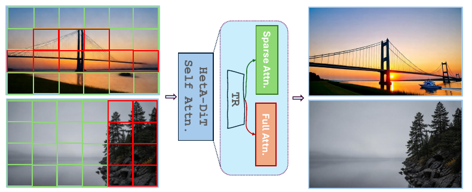
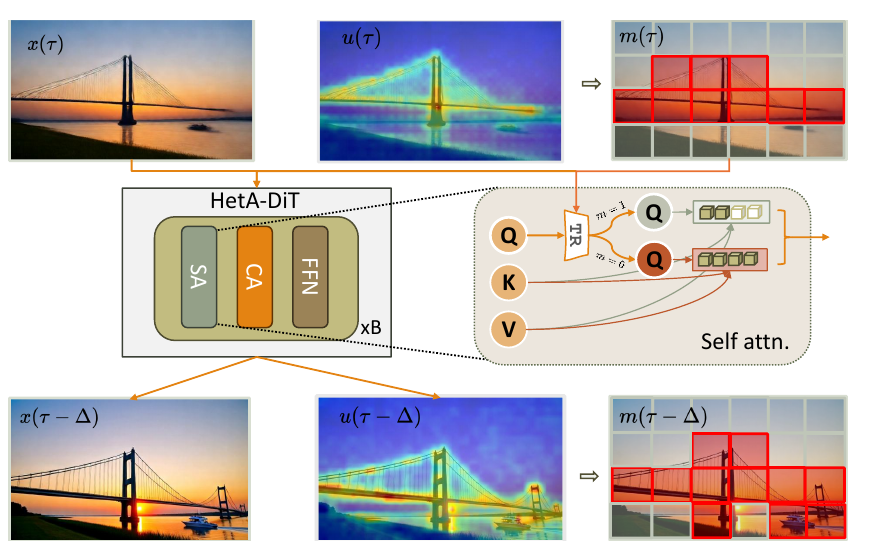
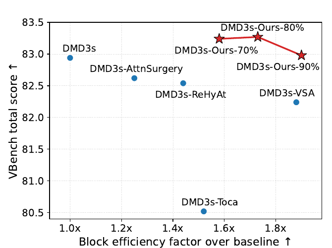
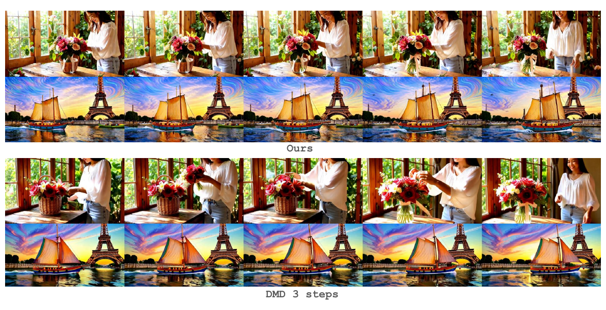
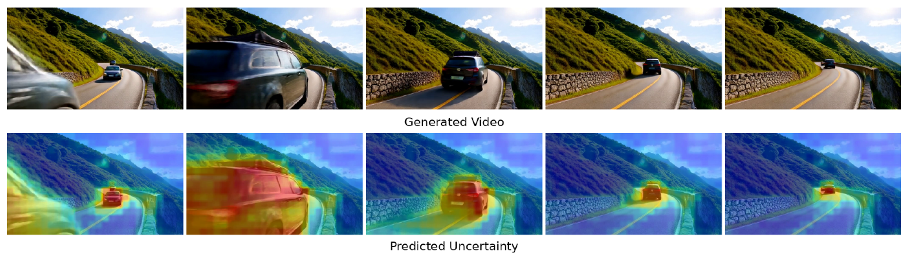

# HetA-DiT: Where Compute Matters — Heterogeneous Attention for Efficient Video Diffusion

**论文**: [arXiv:2609.31050v1](https://arxiv.org/abs/2609.31050) (cs.CV, 2026-09-25, 24 页：正文 10 页 + 参考文献 + 附录 A–D)
**作者**: Olga Zatsarynna¹², Denis Korzhenkov¹, Juergen Gall², Amir Habibian¹, Mohsen Ghafoorian¹ — ¹**Qualcomm AI Research**、²**University of Bonn**
**底座**: 作者自己蒸馏的 3 步 DMD 模型，分别基于 **Wan2.2-TI2V-5B**（论文写作 Wan2.2 5B，121×704×1280）与 **Wan2.1-T2V-1.3B**（81×480×832）；Table 5 另报了一行 Wan2.2-14B 的延迟，但没有任何质量结果
**代码**: 🔴 **没有**。PDF 里唯一的外链是 arXiv 自身；GitHub 仓库搜索 `HetA-DiT`、`heterogeneous attention video diffusion` 均为 0 结果（2026-09-29）。本笔记里的实现细节只能来自论文文字，查不到的一律标 `[待补]`

---

## 1. 一句话定位

**把视频 DiT 的每个 self-attention 层拆成两条路：约 20% 的 query token 做全局 dense attention，其余 80% 只在 11×11×11 的 3D 邻域里做 local attention；谁走哪条路由一个逐 token 的不确定度头决定，这个头用"高斯 NLL 版的 DMD 损失"训练。** 路由掩码用上一个去噪步的不确定度来建，所以推理时不需要额外的 Transformer 前向。

| | Dense DMD（3 步，Wan2.2-5B） | HetA-DiT（同底座，80% token 走 local） |
|---|---|---|
| VBench Total / Quality / Semantic | 82.94 / 83.56 / 80.43 | **83.28** / 83.71 / 81.52 |
| VBench-2.0 Total | **60.8** | 58.9（−1.9） |
| 人评（HetA 胜 / 平 / DMD 胜） | — | 32% / 32% / **36%** |
| Attention FLOPs 缩减 | 1× | 4.85× |
| Attention 实测延迟加速 | 1× | 1.84× |
| Transformer block 实测延迟加速 | 1× | 1.63× |
| Wan2.1-1.3B 上的 VBench Total | **83.61** | 83.10（−0.51） |

🔴 **我读完全文，把 8 张表按 300 DPI 渲染后逐格核对，又从两张雷达图的矢量路径里反解出各子维度分数。结论是头条要打四个折扣：**

1. **论文自己的消融撑不起"不确定度路由"本身的价值。**
   - 完全不用 dense attention 的 local-only 得 82.85，只比 dense 母模型低 0.09。
   - 去掉随机交换、只按不确定度路由时得 83.00，**低于零参数的固定均匀路由（83.13）**（Table 8 vs Table 6）。
   - 只有"不确定度 + 每层把约 35% 的 dense 名额随机换人"才比固定均匀路由高 0.15。
   - 引言说它 *"strictly outperforms random and fixed-pattern routing"*，这在 Quality 列就不成立（83.71 < 83.76）（§6.5）。
2. **VBench-2.0 上它比 dense 母模型低 1.9 分，损失集中在最需要全局信息的维度上。**
   - 我从 Fig 6 的矢量数据反解出 18 个子维度：**Dynamic Attribute −10.3、Motion Rationality −9.2、Multi-View Consistency −7.4、Diversity −6.9、Mechanics −4.1**。
   - 正文只说它"超过 50 步的 Wan2.2"（+0.86）。这 +0.86 全部来自 Multi-View Consistency 一个子项从 6.0 跳到 31.7。这个跳变是 DMD 母模型带来的（母模型为 39.1），HetA 反而丢回去 7.4 分（§6.2）。
3. **效率数字的口径有三处对不上。**
   - ① 注意力 FLOPs 缩减 4.85× 只兑现成 1.84× 的注意力延迟、1.63× 的 block 延迟。
   - ② 按 Eq. 14、`ρ = 0.2` 与真实 token 数 `N = 27,280`，9³ / 11³ / 13³ 窗口应为 4.52× / 4.18× / 3.78×，论文报的是 4.91× / 4.85× / 4.76×。**local 部分的 FLOPs 大约只按公式的 1/6 计。**
   - ③ 第一步没有"上一步的不确定度"，论文没说第一步怎么跑。若第一步是 dense，3 步平均的 block 延迟加速只剩约 1.35×（§6.4）。
4. **没有代码、没有种子与误差棒、没有 Limitations 段。**
   - 我还核出 5 处加粗 / 下划线标错、3 处表内数字不自洽（§7）。
   - 其中 Table 1 里 Wan2.2 的 Com. Sense 应为 65.1 而非 64.1，雷达图与子维度均值双重印证。

📌 **站得住的部分：**
- **路由信号零额外监督。** 论文把 DMD 梯度看成对伪目标的 MSE，再推广成逐 token 的高斯 NLL，不加任何监督就拿到了一个路由信号。我推了一下，**在最优点上 `u_i` 正比于该 token 上 DMD 修正量 `‖w(τ)(s_S − s_T)_i‖` 的大小**，也就是"teacher 与 critic 在这里分歧多大"（§3.1）。
- **推理零额外前向。** 掩码跨步复用上一步的不确定度。
- **一个旋钮调预算。** `c` 连续控制 dense 比例。
- **两个底座都做了。**
- **人评对 dense 母模型是 32% vs 36%**，统计上近似平手。
- **Table 5 的 block FLOPs 与 Wan 官方配置算出来的完全吻合。**
- **引言里一句无出处的数字成立。** 原文说"Wan2.2-A14B 在 720p 下 82% 算力在 self-attention、13% 在 FFN"，我按官方配置复算是 81.5% / 13.1%。

---

## 2. 要解决的问题

> **Fig 1 逐段解读**：
>
> **左 · 两帧带网格的中间结果** —— 上面是日落下的斜拉桥，下面是雾中湖岸与岩石上的松树。**绿框**是"容易"的 token（天空、水面、雾），**红框**是"难"的 token（桥塔与拉索、地平线、树与岩石）。⚠️ 这是示意图：一格对应的远不止一个 token（5B 的一帧 latent 是 22×40 = 880 个 token），红绿格也不是真实掩码。
>
> **中 · HetA-DiT Self Attn.** —— 放大后是一个梯形的 `TR`（token router），它把每个 token 分到上面绿色的 `Sparse Attn.`（正文叫 local attention）或下面红色的 `Full Attn.`。
>
> **右 · 生成结果** —— 两段视频的最终帧。
>
> 📌 **这张图只想说一件事：去噪难度在空间上不均匀，所以算力也不该均匀分配。** 图里没有任何可以核对的量。

**论文把现有方法分成四条路线**（§1、§2）。下表"缺陷"一栏是论文自己的说法：

| 路线 | 代表 | 论文指出的缺陷 |
|---|---|---|
| 均匀地把 attention 变便宜 | STA、VSA、SLA、SANA-Video、HLA、ReHyAt、Attention Surgery、M4V | 对每个 token 用同一个算子，不管难易 |
| 特征缓存 | ToCa、LiteAttention、Clockwork | 硬性的"缓存或重算"二选一；依赖多步冗余，少步蒸馏后冗余消失 |
| MoE DiT | DiT-MoE、Wan2.2 | 专家只放在 FFN，而视频 DiT 的瓶颈是 self-attention |
| 免训练自适应稀疏 | AdapTor、Astraea、SpargeAttn | 不用训练，但有可测的质量损失 |
| **本文** | HetA-DiT | 软性的、attention 层面的、与 DMD 兼容的逐 token 路由，微调成本约 12 GPU-days |

📌 **"瓶颈在 attention 不在 FFN"这句话我核过。**
- **原文与出处。** 论文写 *"in Wan2.2 A14B model at 720p resolution, 82% of the compute is spent at self-attention while only 13% goes to FFN"*，没给出处。
- **复算。** 我按 Wan2.2 官方配置（[`wan_t2v_A14B.py`](https://github.com/Wan-Video/Wan2.2/blob/1ea34ff48f87168174e12956e200b1d908b1c5ff/wan/configs/wan_t2v_A14B.py)：`dim=5120`、`ffn_dim=13824`、VAE stride `(4,8,8)`、patch `(1,2,2)`、默认 81 帧）复算。720p 下有 `N = 21×45×80 = 75,600` 个 token。按逐 block 的解析 FLOPs：
  - self-attention（含 QKVO 投影）占 **81.5%**；
  - FFN 占 **13.1%**；
  - cross-attention 占 5.4%。

  ✅ 与原文吻合。
- **帧数。** 换成 121 帧会变成 86.2% / 9.8%，所以论文指的是默认的 81 帧。

⚠️ **但这个比例只对 14B / 720p 成立。** 论文真正做实验的 5B 模型用的是 16× 压缩的 Wan2.2-VAE，704×1280、121 帧下只有 `N = 31×22×40 = 27,280` 个 token。按同样的算法，self-attention 含投影只占 block FLOPs 的 65%，其中会被稀疏化的核心部分（`QKᵀ` 与 `AV`）只占 **53%**（§6.4 表）。这就是 4.85× 的注意力 FLOPs 缩减到 block 层面只剩 1.73× 的原因。

---

## 3. 方法

### 3.1 Stage 1：把 DMD 改写成逐 token 的高斯 NLL

**Stage 1 的产物是一个逐 token 的"不确定度"，而按下面的推导，它学到的其实是 DMD 修正量的空间分布。** 具体做法是给 DiT 加一个"轻量"分支，对 patchify 之后的每个 token 输出一个非负标量 `u_i`（Eq. 7）。⚠️ 分支结构（接在哪一层、几层、参数量）全文没写，`[待补]`。

**第一步：DMD 梯度 = 对伪目标的 MSE。** 论文先把 DMD 梯度（Eq. 6）改写成对一个 stop-gradient 伪目标的 MSE（Eq. 8）：

$$
\hat{x}_0 = \mathrm{sg}\Big[\tilde{x}_0 - w(\tau)\big(s_S(\tilde{x}_\tau,\tau,y) - s_T(\tilde{x}_\tau,\tau,y)\big)\Big],\qquad \nabla_\theta \mathcal{L}_{\mathrm{DMD}} = \mathbb{E}\,\nabla_\theta \lVert \tilde{x}_0 - \hat{x}_0 \rVert^2
$$

**第二步：MSE → 逐 token 的高斯负对数似然**（Eq. 9–10）：

$$
-\log \mathcal{N}\big(\hat{x}_{0,i} \mid \tilde{x}_{0,i}, u_i\big) = \lambda_{\mathrm{rec}}\,\frac{\lVert \tilde{x}_{0,i} - \hat{x}_{0,i} \rVert^2}{u_i^2} + \lambda_{\log}\log u_i + \mathrm{const}
$$

- **两项的作用。** 第一项在 `u_i` 大的地方压低 MSE，第二项阻止 `u` 无限变大。
- **额外好处。** 论文说有了这个加权，**DMD 常用的逐样本归一化权重就不需要了**。

📌 **决定这个信号到底是什么的一步推导**（我自己算的，论文没点破）。记 `e_i = ‖x̃_{0,i} − x̂_{0,i}‖`，对 `u_i` 求极小：

$$
\frac{\partial}{\partial u_i}\Big[\lambda_{\mathrm{rec}}\frac{e_i^2}{u_i^2} + \lambda_{\log}\log u_i\Big] = 0 \;\Longrightarrow\; u_i^{\star} = \sqrt{2\lambda_{\mathrm{rec}}/\lambda_{\log}}\; e_i,\qquad e_i = w(\tau)\,\big\lVert (s_S - s_T)_i \big\rVert
$$

由此得到三点：
- **最优的 `u_i` 就是该 token 上 DMD 修正量的大小。** 换句话说，它是对"critic（fake score）与 teacher（real score）在这个 token 上分歧多大"的一个前馈预测。"不确定度"这个名字是贴上去的，它学的其实是 **DMD 信号的空间分布**。
- **它同时改了 Stage 1 的 DMD 本身。**
  - 对生成器的梯度是 `2λ_rec (x̃_{0,i} − x̂_{0,i}) / u_i²`，即**逐 token 除以 `u_i²`**，`u` 大的 token 梯度被压小。
  - 若 `u` 达到最优，梯度幅度正比于 `1/e_i`：修正越大的地方推得越轻。
  - 这就是"不再需要逐样本归一化"的原因。代价是 Stage 1 训出来的骨干已经不是原来那个 DMD 模型（§8 会用到这一点）。
- ⚠️ **`λ_rec`、`λ_log` 的取值没给，`[待补]`。** 二者不满足 NLL 的固定比例时，这已经不是严格的似然。

⚠️ **两处记号不一致：**
- **方差还是标准差。** Eq. 9 的文字说 *"with predicted variance"*，但 Eq. 10 的分母是 `u_i²`，附录 D 的 Eq. 15 也写 `x_0 ≈ x̂_0 + u·η`，两处都把 `u` 当**标准差**用。
- **`x̂_0` 与 `x̃_0` 互换。** 附录 D 里 `x̂_0` 指模型预测；正文里 `x̂_0` 是 DMD 伪目标，`x̃_0` 才是预测。

**附录 D 给的直觉**：把 `u` 当成预测误差的标准差，重新加噪到 `τ` 之后的有效信噪比是

$$
\mathrm{SNR}_{\mathrm{eff}}(\tau,u) = \frac{\alpha_\tau^2}{\sigma_\tau^2 + \alpha_\tau^2 u^2} = \frac{\alpha_{\tau'}^2}{\sigma_{\tau'}^2},\qquad \tau' \ge \tau
$$

即 `u` 越大，这个 token 就"相当于处在一个更吵的时间步 `τ'`"，所以应该给它更多全局计算。论文自己说这和金字塔 / 多尺度扩散里的 SNR 匹配是同一个思路（此处没给具体引用）。⚠️ 这只是动机层面的解释，正文没有任何实验检验"高 `u` 的 token 确实更像处在更吵的时间步"。

### 3.2 Stage 2：阈值、掩码、随机交换

**Stage 2 冻结不确定度分支，用阈值化后的掩码把每个 token 分到 local 或 dense，再用标准 DMD 微调其余全部参数。**

> **Fig 2 逐段解读**：
>
> **上排 · 时间步 `τ`** —— `x(τ)` 是当前的中间结果，桥的轮廓已经出来但偏糊。`u(τ)` 是不确定度热图：**桥塔、拉索、地平线与倒影发红，天空与水面发蓝**。`m(τ)` 是阈值化后的掩码，红框表示走 full attention 的 token（示意粒度）。
>
> **中 · HetA-DiT 结构** —— 左边是标准的 Wan block（`SA` → `CA` → `FFN`，×B）。右边放大 `SA`：`Q` 经过 `TR` 分成两路。`m = 1` 的 token 走上面灰色的 `Q`，只和一部分 KV 立方块做 local attention；`m = 0` 的 token 走下面红色的 `Q`，和全部 KV 做 dense attention。`K`、`V` 两路共用。
>
> **下排 · 时间步 `τ − Δ`** —— 用上一步的 `m(τ)` 跑完这一步，得到更清晰的 `x(τ − Δ)`。新的 `u(τ − Δ)` 更集中在细结构上（第二座桥塔、小船、拉索），`m(τ − Δ)` 的红框也移到了下方的小船与倒影附近。**这张图就是"掩码随时间步变化"的全部证据**：它只是一个样例，没有统计量。

**阈值与掩码**（Eq. 11–12）。均值与标准差是在**整段视频的全部 `N` 个 token** 上算的：

$$
T(\tau) = \mu_u(\tau) + c\,\sigma_u(\tau),\qquad m_i(\tau) = \mathbf{1}\big[u_i(\tau) < T(\tau)\big]
$$

`m_i = 1` 走 local，`m_i = 0` 走 dense。`c` 是唯一的质量–效率旋钮，默认 `c = 0.9`；论文说这平均对应 80% 的 token 走 local。

- ✅ **量级核对**：若 `u` 近似高斯，高于 `μ + 0.9σ` 的比例是 `1 − Φ(0.9) = 18.4%`，与"约 20% dense"一致。按同样的假设，70% / 90% local 大约对应 `c ≈ 0.52 / 1.28`。论文没给这两个 `c`，`[待补]`。
- ⚠️ **预算是全视频共享的，不是逐帧的**：一帧里突然出现一个占满画面的大物体（Fig 15 第 2 帧），它会从其他帧"抢"走 dense 名额。

**注意力更新**（Eq. 13）：

$$
z_i' = m_i\,\mathrm{Attn}_{\mathrm{local}}(i) + (1 - m_i)\,\mathrm{Attn}_{\mathrm{dense}}(i)
$$

每个 token 只走一条路。local 的邻域是以该 token 为中心的 11×11×11 立方（Table 7 默认值）。

**随机交换**（§3.2.2 末段 + 附录 B）：每个 block 里，把一部分"不确定"token 与随机挑出的"确定"token **互换**，dense 名额总数不变。
- **7% 是占全部 token 的比例。** 默认比例是 7%；Table 8 的 "20% (all)" 行表示全部 dense 名额都随机，由此可知 7% 是相对全部 token 而言的。
- 📌 **这意味着每一层都有 7 / 20 = 35% 的"不确定"token 被踢回 local。** 论文说 *"ensuring that uncertain tokens still receive full attention most of the time"*，按这个数，"most of the time" 就是 65% 的层。
- ✅ **附录的覆盖率核对通过**：`1 − (1 − 0.07)^30 = 0.887 ≈ 0.89`，`B = 30` 与 5B 的 `num_layers = 30` 一致。
- ⚠️ **小问题：覆盖率算得偏保守。** 随机名额是从约 80% 的"确定"token 里抽的，单个"确定"token 每层被抽中的概率是 `0.07 / 0.8 ≈ 0.0875`，覆盖率应为 ≈0.94，论文的 0.89 偏低。

### 3.3 算力：Eq. 14 与"local 其实不那么 local"

**11³ 的窗口只占全部 token 的 4–5%，但在时间轴上覆盖了三分之一到一半的视频；而且叠上 30 层之后，local-only 的感受野本来就是全局的。**

$$
\mathcal{O}\big(\rho N^2 d_h + (1-\rho)\,N M d_h\big),\qquad \rho = \frac{1}{N}\sum_i (1 - m_i),\quad M = |\mathfrak{N}(i)|
$$

论文说实验中 `ρ ≈ 0.2`。我按 Wan 官方配置（VAE stride × patch `(1,2,2)`）算出三种设置的 token 数：

| 设置 | latent 网格（T×H×W） | `N` | 11³ 窗口的 `M/N` | 11³ 在各轴的覆盖 |
|---|---|---|---|---|
| Wan2.2-5B，121×704×1280 | 31×22×40 | **27,280** | 4.9% | 时间 35%、高 50%、宽 28% |
| Wan2.1-1.3B，81×480×832 | 21×30×52 | 32,760 | 4.1% | 时间 52%、高 37%、宽 21% |
| Wan2.2-14B，81×480×832 | 21×30×52 | 32,760 | 4.1% | 同上 |

配置出处：
- [`wan_ti2v_5B.py`](https://github.com/Wan-Video/Wan2.2/blob/1ea34ff48f87168174e12956e200b1d908b1c5ff/wan/configs/wan_ti2v_5B.py)：`vae_stride=(4,16,16)`、`dim=3072`、`ffn_dim=14336`、`num_layers=30`、`frame_num=121`。
- [`wan_t2v_1_3B.py`](https://github.com/Wan-Video/Wan2.1/blob/9737cba9c1c3c4d04b33fcad41c111989865d315/wan/configs/wan_t2v_1_3B.py)：`vae_stride=(4,8,8)`、`dim=1536`、`ffn_dim=8960`、`num_layers=30`。

📌 **两个论文没讨论的推论**：
1. **11³ 的"局部"窗口在时间轴上覆盖了三分之一到一半的视频。** 5B 的 31 个 latent 帧对应 121 个视频帧，窗口的 11 个 latent 帧约等于 44 个视频帧。
2. **靠层数叠加，local-only 的感受野本来就是全局的。**
   - 每层的半径是 5 个 token（切比雪夫距离），5B 最长的一维（宽）是 40 个 token。因此 8 层以内，任意两个 token 之间就有信息通路，而网络有 30 层。
   - 所以论文 §3.1.1 说纯 local attention 会丢掉"对物体身份、遮挡、快速运动重要的全局信息"，这只在"单层直接可见"的意义上成立。
   - 这正好解释了为什么 local-only 在 VBench 上只比 dense 低 0.09（§6.5）。

### 3.4 训练与推理时掩码从哪来

**训练时掩码来自一次额外的全 dense 无梯度前向，推理时直接复用上一步（本身已稀疏化）的输出；两者来源不同，而且第一步怎么跑没说。**

| | 掩码来源 | 额外开销 |
|---|---|---|
| **Stage 2 训练** | 对随机采到的时间步，**先用全 dense 的学生在更早的时间步做一次无梯度前向**得到 `u`，再建当前步的掩码 | 每个 iteration 多一次 5B 前向 |
| **推理** | 直接复用上一去噪步（本身已是异构注意力）输出的 `u` | 无额外前向 |

⚠️ **三个没交代的地方**：
1. **第一步怎么办？** 第 1 步没有"上一步"。最自然的实现是第 1 步全 dense，那样 3 步里只有 2 步被加速。论文没说，`[待补]`。
2. **训练与推理的 `u` 来源不同。** 训练时由全 dense 的学生算，推理时由已经稀疏化的上一步算。Stage 2 里分支虽然冻结，但它的输入（骨干特征）一直在变。两种来源的 `u` 分布是否一致，论文没有任何分析。
3. **"更早的时间步"具体是哪一步、3 步推理用了哪几个时间步，全文都没写**，`[待补]`。

---

## 4. 代码与实现细节

🔴 **没有任何开源**（PDF 无链接，GitHub 搜索 0 结果）。复现所需的以下信息全部缺失：

| 缺什么 | 影响 |
|---|---|
| 不确定度分支的结构与接入位置 | 无法复现 Stage 1 |
| `λ_rec`、`λ_log` | 同上 |
| 第一步的处理方式 | 决定端到端加速是 1.63× 还是约 1.35×（§6.4） |
| FlexAttention 里 token 级掩码怎样映射到 block-sparse kernel：dense query 是否重排，BlockMask 是每层建还是每步建 | 如果 20% 的 dense token 原位散布，几乎每个 128-token 的 query 块里都有 dense token，block-sparse 会退化成 dense。所以必须重排，但怎么排没说 |
| 延迟基线用的 attention kernel（FlexAttention 还是 FlashAttention） | 直接决定 1.84× 的含义（§6.4） |
| 70% / 90% 变体的 `c`、3 步的时间步、DMD 基座本身的训练配方 | — |

---

## 5. 实验设置

**所有结果都是 3 步推理；训练只用 4 张 H100、prompt-only，但 DMD 基座怎么来的、数据子集多大都没交代。**

| 项 | 设置 |
|---|---|
| 底座 | 作者自己的 DMD 蒸馏模型：Wan2.2-TI2V-5B 有 2 步、3 步两个版本，Wan2.1-T2V-1.3B 只有 3 步。⚠️ 这些 DMD 基座怎么蒸出来的没交代 |
| 推理 | 全部 3 步；Wan2.2 系 121×704×1280，Wan2.1 系 81×480×832 |
| Stage 1 | 15k iter，每卡 batch 2 × 4 卡（全局 8）。学生 lr 1e-5、critic lr 5e-6，常数 lr + 10 步 warm-up；AdamW（wd 0.01，β = 0.9 / 0.999）；bf16。时间步从 shift = 5 的 shifted uniform 分布采样；teacher 的 guidance scale 为 5 |
| Stage 2 | 6k iter，每卡 batch 1 × 4 卡（全局 4）；shift = 1，其余同上。分支冻结，其余全部参数微调 |
| 硬件与成本 | 两阶段都用 4 × H100；引言称"约 12 GPU-days" |
| teacher | 原始预训练 Wan（非蒸馏版） |
| 数据 | prompt-only：给 VIPE1M 的一个子集生成 caption，论文说用的是 Qwen3。⚠️ 子集大小 `[待补]`。引用的 [45] 是纯文本 Qwen3 的技术报告，而给视频写 caption 通常需要 VL 模型，原文未说明具体用了哪个 |
| VBench | 扩展 prompt 全集；报 Total / Quality / Semantic |
| VBench-2.0 | 全部 prompt；报 5 个大维度 |
| 人评 | VBench 的 GPT 扩写长 prompt，左右位置随机，可选"无偏好"。19 人、1,248 次配对判断、1,082 个视频、667 个 prompt |
| 效率 | FLOPs 用 DeepSpeed 统计；延迟用 FlexAttention（block-sparse kernel）实测，含摊销后的 BlockMask 构建开销 |
| 对照组（附录 A.2） | 见下表 |

**附录 A.2 的对照组配置：**

| 对照组 | 是否训练 | 配置 |
|---|---|---|
| Attention Surgery | 需训练 | 20 个 hybrid block、hybrid rate 8（20×R8）；三阶段训练：逐 block 蒸馏 → flow matching 微调 → DMD2；线性分支用 2 次多项式 |
| ReHyAt | 需训练 | 全部 30 个 block 替换；chunk 为 3 个 latent 帧、重叠 1 帧；线性分支用 2 次多项式 |
| VSA | 需训练 | FastVideo 配方，稀疏率 0.8，tile 4×4×4 |
| Jenga | 免训练 | 稀疏率 0.8、阈值概率 0.9、tile 64 |
| ToCa | 免训练 | **只在 3 步中的第 2 步生效**；token refresh ratio 0.6，折合 FFN 有效刷新率约 89.7%、缓存率约 10.3% |

⚠️ **"12 GPU-days"无法从文中复算。**
- 4 卡跑 21k iteration，对应 72 小时墙钟，平均每步约 12.3 s。但论文没报单步耗时，也没说 12 GPU-days 是 5B 还是 1.3B 的数。
- *"four to five orders of magnitude below pretraining"* 需要 Wan 的预训练算力作分母（即 12 万到 120 万 GPU-days），论文没给这个分母的来源，`[待补]`。

---

## 6. 结果

### 6.1 VBench（Table 2、Table 3）

**HetA 在 Wan2.2 上 VBench Total 排第一，还比自己的 dense 母模型高 0.34；但在 Wan2.1 上它输给母模型 0.51。**

Table 2 下半部分（高效方法，704×1280）：

| 方法 | 类型 | Total | Quality | Semantic |
|---|---|---|---|---|
| STA（HunyuanVideo 底座） | — | 83.00 | **85.37** | 73.52 |
| DMD2s（2 步） | 步数蒸馏 | 82.48 | 83.05 | 80.22 |
| DMD3s（3 步，dense） | 步数蒸馏 | 82.94 | 83.56 | 80.43 |
| DMD3s-Attn. Surgery | 需训练 | 82.62 | 83.60 | 78.71 |
| DMD3s-ReHyAt | 需训练 | 82.55 | 82.78 | **81.61** |
| DMD3s-VSA | 需训练 | 82.24 | 82.71 | 80.38 |
| DMD3s-ToCa | 免训练 | 80.52 | 81.40 | 76.98 |
| DMD3s-Jenga | 免训练 | 82.72 | 83.58 | 79.22 |
| **DMD3s-HetA-DiT** | 需训练 | **83.28** | 83.71 | 81.52 |

参照：50 步的 Wan2.2-5B 是 83.28 / 85.03 / 76.28。

- **与 50 步 Wan2.2 只在 Total 上打平。** 两者 Total 都是 83.28，但构成完全不同：HetA 的 Quality 低 1.32、Semantic 高 5.24。论文说 "on par with the full Wan models"，只在 Total 这一个数上成立。
- 📌 **HetA 比 dense 母模型高 0.34，这很可能不是稀疏化的功劳。** 稀疏化本身不该让模型变好。更可能的解释是它比 DMD3s **多训了 21k 个 DMD iteration**，其中 15k 用的还是 §3.1 那个逐 token 重加权过的 DMD。论文没有"dense 模型多训同样步数"的对照。
- **Wan2.1-1.3B 上的结果更弱（Table 3）。**
  - HetA 输给 dense 母模型 0.51（83.10 vs 83.61），只与作者复现的 50 步 Wan2.1（83.10）打平。
  - 这张表唯一的对手是 VSA。⚠️ 这一行没有 "DMD3s-" 前缀，可能是 50 步模型，`[待补]`。

**从 Fig 5 雷达图反解的子维度。** 方法：我用 pdfplumber 读出 8 条折线的顶点坐标，按同心圆换算成分数。Quality / Semantic / Total 三个轴与 Table 2 的 7 个方法全部吻合到 ±0.01（Jenga 例外，见 §7）。

| 维度 | HetA | DMD3s | Δ |
|---|---|---|---|
| dynamic degree | 50.56 | 48.89 | +1.67 |
| multiple objects | 83.17 | 80.20 | +2.97 |
| spatial relationship | 85.84 | 81.61 | +4.23 |
| scene | 55.77 | 53.58 | +2.19 |
| subject consistency | 94.89 | 95.10 | −0.21 |
| motion smoothness | 98.32 | 98.64 | −0.32 |
| imaging quality | 71.33 | 70.64 | +0.69 |

📌 **从这张表能读出两点：**
- **Semantic 的 +1.09 主要来自 multiple objects 与 spatial relationship 两个维度。**
- **dynamic degree 没有下降。** VBench 上看不到 local attention 损伤运动的迹象，但 VBench-2.0 上看得到（§6.2）。

### 6.2 VBench-2.0（Table 1）

**VBench-2.0 上 HetA 比同为 3 步的 dense 母模型低 1.9，五个大维度全部更低；正文只报了它赢的两个比较。**

| 模型 | Total | Hum.Fid. | Creativ. | Contr. | Com.Sense | Phys. |
|---|---|---|---|---|---|---|
| Wan2.2-5B（50 步） | 58.1 | 79.4 | 57.7 | 36.8 | 64.1（应为 65.1，见 §7） | 51.3 |
| DMD2s（Wan2.2） | 57.9 | 76.9 | 54.2 | **37.9** | 59.9 | 60.9 |
| DMD3s（Wan2.2） | **60.8** | **80.7** | **58.7** | 36.2 | **64.5** | **63.9** |
| HetA-DiT | 58.9 | 79.8 | 55.0 | 35.9 | 62.5 | 61.4 |

- **正文的说法**：HetA *"outperforming both the full Wan2.2 model ... and the step-distilled DMD model, which uses 2 steps"*。这两个比较都对（+0.8、+1.0），但正文没提它比 dense 母模型低 1.9。
- **引言的说法**：在 VBench-2.0 上 *"matching the base models"*（复数）。⚠️ **Wan2.1 系根本没有 VBench-2.0 结果。**
- ⚠️ **表头分辨率不对**：表头写 "Res. 480 × 832"，但按 §4，Wan2.2 系是在 704×1280 下生成的。

**从 Fig 6 雷达图反解的 18 个子维度。** 方法同上；5 个大维度与 Total 和 Table 1 吻合到 ±0.1，唯一例外见 §7。下表只列变化最大的 10 项：

| 子维度（所属大维度） | HetA | DMD3s | Δ | Wan2.2（50 步） |
|---|---|---|---|---|
| Dynamic Attribute（Contr.） | 28.94 | 39.19 | **−10.26** | 35.90 |
| Motion Rationality（Com.Sense） | 36.21 | 45.40 | **−9.20** | 42.53 |
| Multi-View Consistency（Phys.） | 31.73 | 39.11 | **−7.38** | **6.03** |
| Diversity（Creativ.） | 55.30 | 62.19 | **−6.88** | 60.61 |
| Mechanics（Phys.） | 70.15 | 74.29 | −4.14 | 66.14 |
| Human Identity（Hum.Fid.） | 60.62 | 62.80 | −2.18 | 57.73 |
| Instance Preservation（Com.Sense） | 88.89 | 83.63 | +5.26 | 87.72 |
| Motion Order Understanding（Contr.） | 38.05 | 33.00 | +5.05 | 33.67 |
| Complex Landscape（Contr.） | 21.33 | 17.33 | +4.00 | 17.56 |
| Camera Motion（Contr.） | 37.65 | 37.65 | 0.00 | 47.84 |

📌 **这是全文信息量最大的一组数，而论文没给：**
1. **相对 dense 母模型，损失集中在动态与物理推理，以及多样性。**
   - 下降最多的是 Dynamic Attribute、Motion Rationality、Multi-View Consistency、Mechanics 和 Diversity，正是"需要跨帧全局信息"的那类能力。
   - VBench 的 dynamic degree 只测"动没动"，所以在 VBench 上看不到这种损失。
   - ⚠️ 这些子维度每项的 prompt 不多，论文也没有误差棒，单项 5–10 分的差里可能含有相当的噪声。
2. **"超过 50 步 Wan2.2"的 +0.86 全部来自 Multi-View Consistency。**
   - **算法。** Total 是 5 个大维度的均值，Physics 又是 4 个子项的均值。所以该子项的 +25.69 对 Total 的贡献是 `25.69 / 20 = +1.28`。去掉它，HetA 反而比 Wan2.2 低 0.42。
   - **来源。** 这个子项从 6.03 跳到 39.11 是 **DMD 带来的**。与此同时，Camera Motion 从 47.84 掉到 37.65，我推测是 DMD 基座的镜头运动变少，多视角一致性因此"变好"了。
   - **HetA 的作用。** HetA 又把这个子项丢回去 7.38。

### 6.3 人评（Table 4）

**人评里 HetA 对 dense 母模型是统计上的平手，对 DMD2s 和 Attention Surgery 明显更受偏好。**

| 对手 | HetA 胜 | 平 | 对手胜 |
|---|---|---|---|
| DMD2s（2 步） | **50%** | 26% | 24% |
| DMD3s（3 步，dense） | 32% | 32% | **36%** |
| DMD3s-Attn. Surgery | **68%** | 13% | 19% |

- ✅ **百分比自洽。** 三行各自加总为 100%。假设 1,248 次判断均分到三组（每组 416 次），三行百分比都能凑出整数次，例如 DMD3s 组为 133 / 133 / 150。
- **显著性（我按均分假设做的符号检验，去掉平局）：**
  - vs DMD2s：208 : 100，z ≈ 6.2，显著；
  - vs Attn. Surgery：283 : 79，z ≈ 10.7，显著；
  - **vs DMD3s：133 : 150，z ≈ −1.0，不显著**。这与论文 "almost as often" 的措辞一致。
  - ⚠️ 这只是量级判断：论文没报每组的次数和评审者一致性，我也没考虑 19 个人的聚类效应。
- ⚠️ **"1,248 pairs" 是判断次数，不是独立配对数。** 1,248 个互不相同的配对需要 2,496 个视频位，而全部只有 1,082 个视频，说明同一配对被多人重复评判了。
- ⚠️ **对手不全，底座未说明。** 人评只比了三个对手，**没有 VSA、ReHyAt、Jenga**；也没说用的是哪个底座（推测是 Wan2.2）。

### 6.4 效率（Table 5、Fig 4）

**block FLOPs 的数字与官方配置吻合，但注意力 FLOPs 本身复现不出 Eq. 14，实测延迟只兑现了 FLOPs 缩减的三到四成，而且"高分辨率更快"的解释与 token 数矛盾。**

下表里 "Attn FLOPs 缩减"、"Block FLOPs 缩减（论文）" 和两列延迟加速来自论文 Table 5；`N`、FLOPs 占比、Amdahl 推算和最后一列是我算的：

| 模型 | 分辨率 | `N` | 注意力核心占 block FLOPs（我算） | Attn FLOPs 缩减 | Block FLOPs 缩减（论文） | Block FLOPs 缩减（我按 Amdahl 算） | Attn 延迟加速 | Block 延迟加速 | 反推：dense 注意力占 block 延迟 |
|---|---|---|---|---|---|---|---|---|---|
| Wan2.1-1.3B | 480×832 | 32,760 | 69.9% | 4.87× | 2.25× | **2.25×** ✅ | 1.52× | 1.34× | 74% |
| Wan2.2-5B | 704×1280 | 27,280 | 53.1% | 4.85× | 1.73× | **1.73×** ✅ | 1.84× | 1.63× | **85%** |
| Wan2.2-14B | 480×832 | 32,760（81 帧） | 52.4% | 4.91× | 1.97× | 1.72× ✗ | 1.57× | 1.30× | 64% |
| Wan2.2-14B | 480×832 | 48,360（121 帧） | 61.9% | 4.91× | 1.97× | **1.97×** ✅ | 1.57× | 1.30× | 64% |

我用的 FLOPs 模型：

$$
R_{\mathrm{block}} = \frac{1}{(1 - f) + f / R_{\mathrm{attn}}},\qquad f = \frac{4N^2 d}{12Nd^2 + 4N^2 d + 4NLd + 4Ld^2 + 4Nd\,d_{\mathrm{ff}}}
$$

- **参数取值。** `d`、`d_ff` 取官方配置，文本长度 `L = 512`。
- **分母各项依次是：**
  - self-attn 的 QKVO 投影加 cross-attn 的 Q/O 投影；
  - self-attn 核心；
  - cross-attn 核心；
  - 文本侧 K/V 投影；
  - FFN。
- **最后一列的反推公式**：`(1 − 1/R_block) / (1 − 1/R_attn)`。

读法：
- ✅ **1.3B 与 5B 两行的 block FLOPs 与我按官方配置算的完全吻合。** 这说明 "Attn. FLOPs" 指的是 attention 核心（`QKᵀ` 与 `AV`），不含投影。
- 📌 **14B 那一行只有按 121 帧算才吻合（1.97×）。** 按 Wan2.2-A14B 的默认 81 帧算是 1.72×。论文没写 14B 用了几帧，也没有任何 14B 的质量结果；这一行更像是直接用掩码测的速度，是否训练过 `[待补]`。
- 🔴 **"高分辨率 latent 输入更长、所以加速更大"这个解释与 token 数矛盾。**
  - 正文说 *"they are particularly larger for high-resolution latents, where the increased input length creates an even more crucial compute bottleneck"*。
  - 但 5B 用的是 16× 压缩的 VAE，704×1280 下的 `N`（27,280）**比 1.3B 在 480×832 下的 `N`（32,760）还少 17%**。5B 加速最大，原因不在序列长度。
- ⚠️ **5B 那一行的延迟结构可疑。**
  - 按 Amdahl 反推，dense 注意力占 5B block 延迟的 85%，但按 FLOPs 只占 53%。1.3B 是 74% vs 70%，基本一致。
  - 这意味着 5B 基线里注意力的硬件效率明显低于同一 block 里的 GEMM。
  - 基线用的是 FlexAttention 还是 FlashAttention，论文没说。同为 Qualcomm 的 [Recency Forcing](../../video_generation/recency_forcing/analysis.md) 实测过，直接注入 bias 的 FlexAttention（70.34 ms）比它改写后的 FlashAttention 实现（6.06 ms）慢 11.76×。场景不同，但足以说明基线 kernel 的选择能左右这个加速比。`[待补]`
- ⚠️ **FLOPs 缩减只有一小部分兑现成了延迟。** 5B 上 4.85× 的 FLOPs 缩减只兑现成 1.84× 的注意力延迟（约 38%），1.3B 上是 1.52 / 4.87 ≈ 31%。

🔴 **Eq. 14 复现不出论文自己的 FLOPs**：

$$
\frac{\mathrm{FLOPs}_{\mathrm{dense}}}{\mathrm{FLOPs}_{\mathrm{HetA}}} = \frac{1}{\rho + (1-\rho)\,M/N}
$$

| 窗口 | `M = k³` | Eq. 14 预测（`ρ = 0.2`，`N = 27,280`） | 论文 Table 7 |
|---|---|---|---|
| 9×9×9 | 729 | 4.52× | 4.91× |
| 11×11×11 | 1,331 | 4.18× | 4.85× |
| 13×13×13 | 2,197 | 3.78× | 4.76× |

- **放宽假设也对不上。**
  - 按边界裁剪后的平均邻域算，预测值会略高（11³ 为 4.37×），但仍到不了 4.85×。
  - 若把 `ρ` 调到 0.166 让 11³ 对上 4.85×，那么 9³ 与 13³ 应为 5.33× 与 4.30×，与表中仍差很多。
- **反推 local 项。** 若 `ρ` 恰为 0.2，由论文三个数反推的 local 项（`1/R − 0.2`）是 0.0037 / 0.0062 / 0.0101。
  - 这三个数**大致正比于 `k³`**：1 : 1.69 : 2.75，而 `k³` 之比为 1 : 1.83 : 3.01。
  - **但比例常数只有 `0.8·k³/N` 的约 1/6。** 也就是说，论文统计 FLOPs 时，local attention 的成本大约只按 k³ 窗口的六分之一计。
- **Fig 4 用的是同一个口径。** 70% / 90% 两点的 block 效率是 1.58× / 1.90×，反推的注意力缩减是 3.24× / 9.31×，几乎就是 `1/ρ`。
- **我找不到能解释这个 6 倍的设定**，论文也没说 DeepSpeed 如何统计 FlexAttention，`[待补]`。

> **Fig 4 逐段解读**（坐标是用 pdfplumber 读出矢量点位、再按网格线换算的）：
>
> **横轴 "Block efficiency factor over baseline"** —— HetA-80% 的 1.73× 等于 Table 5 的 block **FLOPs** 缩减，而实测 block 延迟是 1.63×，所以横轴是 FLOPs 口径。正文却把它称作 *"1.73× speed-up"*。
>
> **三颗红星（HetA）** —— 70% local 在 (1.58×, 83.24)，80% 在 (1.73×, 83.27)，90% 在 (1.90×, 82.98)。90% 那一点的 VBench 已经回落到 dense DMD3s（82.94）的水平。
>
> **蓝点（对照组）** —— DMD3s (1.00×, 82.94)、Attn. Surgery (1.25×, 82.62)、ReHyAt (1.44×, 82.54)、ToCa (1.52×, 80.52)、VSA (1.88×, 82.24)。Jenga 与 STA 不在图里。
>
> ⚠️ **有三个横坐标对不上**：
> 1. **VSA**：稀疏率 0.8，注意力 FLOPs 至多缩减 5×；按 5B 的 FLOPs 结构，block 应在 ≈1.74×。画在 1.88× 需要 ≈8.5× 的注意力缩减。
> 2. **ToCa**：只在 3 步中的 1 步生效，只缓存约 10% 的 FFN token。即便那一步真有 1.52×，3 步平均的 block 效率也至多 ≈1.13×。
> 3. **HetA 自己**：若第 1 步是 dense，3 步平均是 `3 / (1 + 2/1.73) ≈ 1.39×`；而 VSA、Attn. Surgery、ReHyAt 每一步都生效。
>
> **这张图里各方法的横轴口径可能不同**，`[待补]`。

### 6.5 消融（Table 6、7、8 合并看）

**把三张消融表和 dense 母模型放进同一张表后，全部差异只有 0.58 分；而且纯不确定度路由输给了固定均匀路由。**

（Wan2.2-5B，3 步；除注明外都是 80% local、11³ 窗口。）

| 变体 | 出处 | Total | Quality | Semantic |
|---|---|---|---|---|
| Random routing（dense 名额全随机） | T6，即 T8 的 "20% (all)" | 82.78 | 83.37 | 80.45 |
| Local-only（**0 个 dense token**） | T6 | 82.85 | 83.56 | 79.99 |
| **Dense DMD3s（100% dense）** | T2 | 82.94 | 83.56 | 80.43 |
| 纯不确定度路由（0% 随机） | T8 | 83.00（按 Q/S 应为 83.03） | 83.48 | 81.25 |
| Fixed uniform routing（固定图案，无分支） | T6 | 83.13 | **83.76** | 80.58 |
| 不确定度 + 3% 随机 | T8 | 83.18 | 83.63 | 81.39 |
| **不确定度 + 7% 随机（默认）** | T6 / T7 / T8 | 83.28（T8 写 83.27） | 83.71 | **81.52** |
| 默认，窗口 9³ | T7 | 83.22 | 83.89 | 80.54 |
| 默认，窗口 13³ | T7 | **83.36** | **83.99** | 80.82 |

📌 **按这张表读，论文的消融支持的其实是另一个结论：**
1. **差异小于噪声量级。**
   - 整张表只跨 0.58 分（82.78–83.36），dense 母模型排在倒数第三。
   - 参照一：同一篇 Table 3 里，官方与复现的 50 步 Wan2.1 差 0.21。
   - 参照二：[五篇横向对照](../../video_generation/dmd_few_step_ar/analysis.md)记录过，同一个公开 checkpoint 在不同论文里的 VBench Total 能差 0.92（84.04–84.96）。
   - **全文没有种子，也没有误差棒。**
2. **完全去掉 dense attention 只掉 0.09 分。** 在这个区间里，VBench Total 对全局注意力几乎不敏感（§3.3 的感受野推论给了一个解释）。所以用 VBench 做路由策略的消融，分辨力本身就不够。
3. **单用不确定度信号，不如一个固定的均匀图案**（83.00 vs 83.13）。
   - 只有叠上"每层 35% 的名额随机分配"之后，它才反超 0.15。
   - **这说明"让 dense 覆盖更多不同的 token"至少和"挑对 token"一样重要。** 论文在附录 B 里自己也说，随机交换的作用是扩大覆盖。
4. 📌 **对实践最有用的一行是 Fixed uniform routing。** 它不需要 Stage 1 的 15k iteration，也不需要不确定度分支，得 83.13 分，只比完整方法低 0.15。

⚠️ **叙述问题**：
- **列名错。** Table 7 最后一列标题是 "Attn. Speedup"，但 11³ 那一格的 4.85× 就是 Table 5 的 **Attn. FLOPs Reduction**，不是延迟。
- **与表不符。** 正文说 11³ *"maintaining the highest speedup"*，而同一张表里 9³ 的 4.91× 更高，论文自己还把 4.91 加粗了。

### 6.6 定性结果与不确定度图

**定性图不能证明 HetA 保住了质量：主图对比的是两个模型各自的样本，而且两者有同样的时序缺陷；不确定度图说明信号是内容自适应的，但全是单样本。**

> **Fig 3 逐段解读**：
>
> **上两行 · Ours（HetA-DiT，3 步）** —— 第一行是窗边插花的女性，第二行是梵高式漩涡天空下、埃菲尔铁塔前的帆船，各 5 帧。
>
> **下两行 · DMD 3 steps（dense）** —— 同样两个 prompt。**两个模型给出的构图完全不同**（花篮与花瓶的位置、帆船的朝向）。所以这不是"同一个样本开不开稀疏"的配对对比，而是两个模型各自的样本。
>
> 📌 **放大到 300 DPI 看第一行：两个模型都在第 4 帧出现容器身份跳变**，前 3 帧是藤编花篮，后 2 帧变成系丝带的玻璃花瓶。这是 DMD 基座本身的时序一致性问题，HetA 没有修复，也没有加剧。因此这张图既不能说明 HetA 保住了质量，也不能说明全局注意力对"物体身份"有用。而后者正是论文 §3.1.1 要保留 dense attention 的理由之一。

**附录 Fig 7–11**：5 个 prompt × 8 个方法（Ours、Attn. Surgery、DMD 3、DMD 2、Jenga、VSA、ReHyAt、ToCa）× 5 帧。
- 在低分辨率下我只能看出构图和明显的时序问题。例如 Fig 9 "A person is playing flute" 里，DMD 3 的最后一帧像是切了镜头，DMD 2 的后两帧人物发虚。
- 细节差异看不出来。每个 prompt 只有一个样本，是否挑选过也没说。

> **Fig 15 逐段解读**（附录 D，`σ = 0.6` 时的不确定度）：
>
> **上排 · 生成视频** —— 山路上，一辆车从镜头左侧驶过（第 1 帧有运动模糊）；第 2 帧一辆 SUV 几乎占满画面；第 3–5 帧它沿弯道远去，越来越小。
>
> **下排 · 不确定度叠加** —— 天空和草坡始终是蓝色（低）。**高不确定度（红 / 橙）紧跟着车走，面积随车在画面中的大小变化**：第 2 帧几乎整个左半幅都是红的，第 5 帧只剩远处一个小红斑。车附近的路面与石墙呈黄绿色。热图有明显的块状结构，对应 token 粒度。
>
> 📌 **这张图最能说明"掩码是内容自适应的"。** 它同时也暴露了 §3.2 的那个问题：阈值是在整段视频上算的，第 2 帧那一大片红色会挤占其他帧的 dense 预算。

**Fig 12–16 的规律一致：**
- Fig 12 的航拍山路里，**纹理密集的树林是低不确定度，贯穿全画面的道路是高不确定度**。所以这个信号不是"高频纹理检测器"，更像"需要长程一致的结构"。
- Fig 13 里，刀、手与番茄的不确定度高，砧板低。
- ⚠️ 全部是单样本、单时间步，没有任何定量分析（例如不确定度与误差或运动幅度的相关性）。

---

## 7. 数字核对

**头条数字大体可复算，但我核出 5 处加粗 / 下划线标错、3 处表内不自洽，以及引言里两句与表格不符的总结。**

**核对通过的**（逐条复算或交叉勾稽）：

| 项 | 结果 |
|---|---|
| VBench Total = (4 × Quality + Semantic) / 5，覆盖 Table 2（22 行）、3、6、7、8 | 38 行中 36 行在舍入范围内 ✅；例外见下 |
| VBench-2.0 Total = 5 个大维度的均值：DMD3s、HetA、HunyuanVideo | 60.80、58.92、55.28 ✅ |
| VBench-2.0 大维度 = 子维度均值（Physics 4 项、Creativity 2 项、Commonsense 2 项、Controllability 7 项、Human Fidelity 3 项），用 Fig 6 反解值验证 | Wan2.2 / DMD3s / HetA 全部吻合 ✅（例：Wan2.2 Physics `(66.14+61.27+71.56+6.03)/4 = 51.25`） |
| Fig 5 雷达反解的 Quality / Semantic / Total vs Table 2 | 7 个方法吻合到 ±0.01 ✅（Jenga 例外） |
| Table 5 block FLOPs vs 按 Wan 官方配置的 Amdahl 推算 | 1.3B 2.250 vs 2.25、5B 1.728 vs 1.73 ✅；14B 仅在 121 帧下吻合 |
| 引言"A14B 720p 下 self-attention 占 82%、FFN 占 13%" | 按官方配置、81 帧：81.5% / 13.1% ✅ |
| "DMD 带来 >30× 加速" | 50 步 × CFG = 100 次前向 vs 3 次，≈33× ✅ |
| 附录 B `1 − (1 − 0.07)^30 ≈ 0.89` | 0.887 ✅（口径偏保守，见 §3.2） |
| `c = 0.9` 约对应 80% local | 高斯假设下为 81.6% ✅ |
| Table 4 各行加总 | 均为 100% ✅ |
| Table 6 的随机路由 = Table 8 的 "20% (all)" | 逐项相同 ✅ |
| Fig 4 中 HetA-80% 的点位 | (1.73×, 83.27)，与 Table 5 的 block FLOPs、Table 8 的 83.27 一致 ✅ |

**表内数字不自洽**：
1. 🔴 **Table 1 中 Wan2.2-5B 的 Com. Sense 写作 64.1，应为 65.1。**
   - 证据一：Fig 6 雷达图上该点是 65.12。
   - 证据二：Commonsense 两个子项的均值是 `(42.53 + 87.72)/2 ≈ 65.1`。
   - 证据三：只有 65.1 才能让该行 Total 等于表中的 58.1；用 64.1 算出来是 57.86。
   - 影响：修正后 HetA 在这一列对 50 步 Wan2.2 的差距从 −1.6 扩大到 −2.6。
2. ⚠️ **Table 2 的 Jenga 行与 Fig 5 不一致。** 表中是 82.72 / 83.58 / 79.22，按公式 Total 应为 82.71；雷达图反解是 82.75 / 83.53 / 79.67，且自洽。至少有一处错，但不影响排序。
3. ⚠️ **Table 8 的 0% 行 Total 写作 83.00**，由 83.48 / 81.25 算应为 83.03–83.04。另外，同一个默认配置在 Table 8 写 83.27，在 Table 2 / 6 / 7 写 83.28。
4. 小问题：
   - Table 1 中 DMD2s 的 Total 是 57.9，五维均值与雷达图都是 58.0。
   - 外部行 CogVideoX-1.5 的 Total 53.4 与五维均值 51.4 差 2.0；Wan2.1-1.3B 是 56.0 vs 56.1。这两行都没有引用出处，`[待补]`。

**加粗 / 下划线标错**（300 DPI 渲染后逐格核对；排名范围按各表自己的分块）：

| 表 | 列 | 标注 | 实际 |
|---|---|---|---|
| Table 1 | Contr. | DMD3s 36.2 加粗，DMD2s 37.9 下划线 | 37.9 更高，二者应互换 |
| Table 1 | Creativ.、Com. Sense | 第二名未标 | HetA（55.0、62.5）是下半表第二，漏了下划线 |
| Table 2 | Tot. | DMD3s 82.94 下划线（第二） | STA 83.00 更高；STA 在 Qual. 列参与了排名（85.37 加粗） |
| Table 3 | Semantic | DMD3s 78.78 加粗，HetA 78.55 下划线 | **VSA 79.47 最高**，HetA 其实是第三 |
| Table 7 | Quality | 11³ 83.71 下划线（第二） | 9³ 的 83.89 更高 |

📌 5 处里有 2 处（Table 3、Table 7）把本不属于 HetA 默认配置的标记给了它。

**叙述与呈现**：
- 🔴 **引言 *"strictly outperforms random and fixed-pattern routing at matched sparsity"* 不成立。** Quality 列输给 fixed uniform（83.71 < 83.76）；不带随机交换时，Total 也输（83.00 < 83.13）。
- 🔴 **引言说在 VBench 与 VBench-2.0 上都 *"matching the base models"*，也不成立。** Wan2.1 系没有 VBench-2.0 结果，Wan2.2 系比 dense 母模型低 1.9。
- ⚠️ "高分辨率输入更长所以加速更大"与 token 数矛盾（§6.4）。
- ⚠️ **FLOPs 被说成加速。** 正文把 1.73× 的 block FLOPs 缩减称作 "speed-up"；*"becomes 1.63× faster than the full DiT model"* 用的是 block 延迟，端到端延迟没有报。
- ⚠️ Table 7 的列名 "Attn. Speedup" 实为 FLOPs 缩减；说 11³ 有 "the highest speedup" 与表不符。
- ⚠️ Table 1 的表头 480×832 与 Wan2.2 系的 704×1280 不符。
- ⚠️ `u` 在 Eq. 9 里被称为方差，在 Eq. 10 / 15 里却当标准差用；附录 D 与正文的 `x̂_0` / `x̃_0` 记号互换。

---

## 8. 争议与权衡

**思路和工程都有可取之处，但核心论点"按不确定度挑 token 是关键"缺乏证据，效率口径也不透明。**

**站得住的**：
- 📌 **"DMD 梯度 = 对伪目标的 MSE → 推广成 NLL"这个观察很干净。**
  - 它零额外监督就拿到一个逐 token、逐时间步的信号。
  - 按 §3.1 的推导，这个信号有明确含义：预测 teacher 与 critic 在哪里分歧大。
  - 这个思路可以迁移到任何以 DMD 为最后一阶段的模型，例如给少步 AR 视频模型做空间自适应计算。
- 📌 **推理开销和调参都友好。** 掩码跨步复用，推理零额外前向；`c` 一个旋钮连续调预算，Fig 4 里从 70% 到 80% 几乎不掉分。
- 📌 **评测覆盖面够。** 两个底座、三类评测（VBench / VBench-2.0 / 人评）都做了；人评对 dense 母模型是统计上的平手。
- 📌 **Table 5 的 block FLOPs 数字本身是对的**，与官方配置复算一致；延迟是实测的，含 BlockMask 构建开销。
- 📌 **对照组是作者在同一个 DMD 底座上自己重训的**（Attn. Surgery、ReHyAt、VSA），配置写在附录 A.2，比直接抄数字公平。

**需要打折的**：
- 🔴 **路由信号的价值没被证明**（§6.5）：
  - local-only 与 dense 只差 0.09；
  - 纯不确定度路由输给固定均匀路由；
  - 完整方法对固定均匀路由的领先（0.15），小于同篇里官方与复现 Wan2.1 之间的差（0.21）；
  - 全部是单次评测。
- 🔴 **VBench-2.0 上比 dense 母模型低 1.9，损失集中在动态与物理推理子维度**；"超过 50 步 Wan2.2"完全靠 DMD 带来的 Multi-View Consistency（§6.2）。
- 🔴 **效率口径不透明**（§6.4）：
  - FLOPs 与 Eq. 14 对不上，local 成本约按 1/6 计；
  - 第一步怎么处理没说；
  - 延迟基线用哪个 kernel 没说，而 5B 的延迟结构提示基线注意力效率偏低；
  - Fig 4 里各方法的横轴口径可能不同。
- ⚠️ **HetA 比 dense 母模型多训了 21k 个 DMD iteration**，而且 Stage 1 的 DMD 是逐 token 重加权过的。它在 VBench 上反超母模型 0.34，分不清是稀疏化的功劳还是多训的功劳；论文缺"dense 模型多训同样步数"的对照。
- ⚠️ **"约 12 GPU-days"和"比预训练低四到五个数量级"都没有可核对的出处**；Stage 2 每个 iteration 还要多一次全 dense 的学生前向。
- ⚠️ **训练时用全 dense 前向算 `u`，推理时用稀疏化后的上一步算 `u`**，两者分布是否一致没有分析（§3.4）。
- ⚠️ **没有代码，也没有 Limitations 段**；复现需要的分支结构、`λ`、FlexAttention 的实现方式全缺（§4）。

---

## 9. 一句话总结

**HetA-DiT 在 3 步 DMD 蒸馏的 Wan 模型上，让 self-attention 逐 token 二选一。** 具体做法：
- 用一个"高斯 NLL 版 DMD"训出来的不确定度头打分；这个分数在最优点上正比于该 token 的 DMD 修正量。
- 整段视频中分数高于 `μ + 0.9σ` 的约 20% token 做 dense attention，其余在 11³ 邻域里做 local attention。
- 每层再把约 35% 的 dense 名额随机换人。
- 掩码沿用上一步的不确定度，推理不增加前向。

在 Wan2.2-5B（704p）上，VBench 为 83.28（dense 母模型 82.94），注意力 FLOPs 缩减 4.85×、实测注意力延迟加速 1.84×、block 延迟加速 1.63×。

🔴 **但它的核心论点"按不确定度挑 token 才是关键"没有被自己的消融撑住：**
- 完全不用 dense attention 只掉 0.09 分；
- 纯不确定度路由输给固定均匀图案；
- 全部差异在 0.6 分以内，且没有误差棒。

**另外三个问题：**
- VBench-2.0 上它比 dense 母模型低 1.9，损失集中在 Dynamic Attribute（−10.3）、Motion Rationality（−9.2）、Multi-View Consistency（−7.4）这类需要全局信息的子维度；
- FLOPs 复现不出 Eq. 14，第一步怎么跑没说；
- 没有代码。

**对实践最有用的反而是它的一个对照组**：固定均匀的 20% dense + 11³ local，不需要 Stage 1，VBench 只低 0.15。

---

## 10. 在仓库图谱里的位置

| | 关系 |
|---|---|
| **[VDN](../../video_generation/vdn/analysis.md)** | 📌 **"全局信息怎么给"的两种相反答案。** VDN 让**每个 token 都走两路**：±1 chunk 内的 exact softmax（外加首末帧 anchor），加上覆盖窗口外全部帧的线性 VDA 分支。HetA 让**每个 token 只走一路**：20% 拿精确的全局 softmax，80% 完全没有直接的全局通路。VDN 的全局是"人人有份但近似"，HetA 是"少数人精确" |
| **[SANA-Streaming](../../video_generation/sana_streaming/analysis.md)** | 异构的粒度不同。SANA-Streaming 是**层级**的：15 个 GDN 线性块 : 5 个 window+sink softmax 块，比例固定。HetA 是 **token 级**的，随内容与时间步变化 |
| **[PixVerse R2](../../world_model/pixverse_r2/analysis.md)** | 同为"内容自适应的稀疏注意力"。R2 按 **query 块**选 KV 块（块级相关性路由，稀疏度 >90%）；HetA 按 **query token** 在"局部 vs 全部"之间二选一。R2 博客没有任何速度数字，HetA 给了一个参照：FLOPs 缩减 4.85× 只兑现成 1.84× 的注意力延迟 |
| **[Recency Forcing](../../video_generation/recency_forcing/analysis.md)** | 同为 Qualcomm AI Research。Recency Forcing 的 BAR 专门绕开 FlexAttention（直接注入 bias 的 FlexAttention 比它改写后的 FlashAttention 实现慢 11.76×）；HetA 则把整个加速建立在 FlexAttention 的 block-sparse kernel 上，却没说 dense 基线用的是哪个 kernel |
| **[TeaCache](../teacache/analysis.md)** | 那篇笔记的结论是：缓存首尾步无法加速，因此"与 few-step 蒸馏模型互斥"。HetA 的 ToCa 对照是一个实测旁证：只在 3 步的中间一步缓存约 10% 的 FFN token，VBench 就掉了 2.4 分（82.94 → 80.52） |
| **[Vidu S2](../../video_generation/vidu_s2/analysis.md)** | 工业侧的另一种异构：按**层灵敏度**给不同层配不同近似（SageAttention / SpargeAttn / SLA）。HetA 是在每一层内部按 token 异构，二者正交 |
| **[五篇横向对照](../../video_generation/dmd_few_step_ar/analysis.md)** | 那篇记录了同一个公开 checkpoint 的 VBench Total 跨论文可差 0.92，而 HetA 全部消融只跨 0.58。另外，HetA 的底座是双向 3 步 DMD，不是那一簇的因果 AR。§3.1 那个"不确定度 ≈ DMD 修正量"的信号理论上可以直接搬到 AR 学生上，还没人试过 |
| [LongLive 2.0](../../video_generation/longlive2/analysis.md) | 同样用 FlexAttention 编译自定义 mask；那边编的是 SP-native 的 AR block-sparse mask |

⚠️ **仓库缺口**：
- 本文的全部对照（VSA、STA、SLA、Jenga、ToCa、Attention Surgery、ReHyAt）都没有专篇笔记，它依赖的 DMD / DMD2 也没有。
- Qualcomm 这一支的 PyramidalWan、Neodragon、MobileWan、HLA 同样没有。

---

## Q&A

*(后续对话中产生的问答追加于此)*
