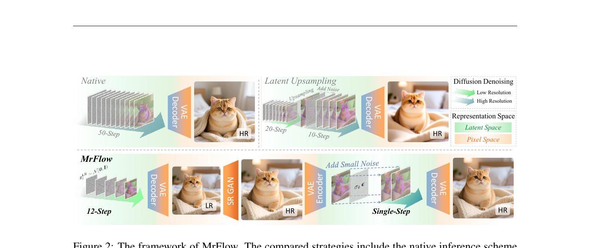
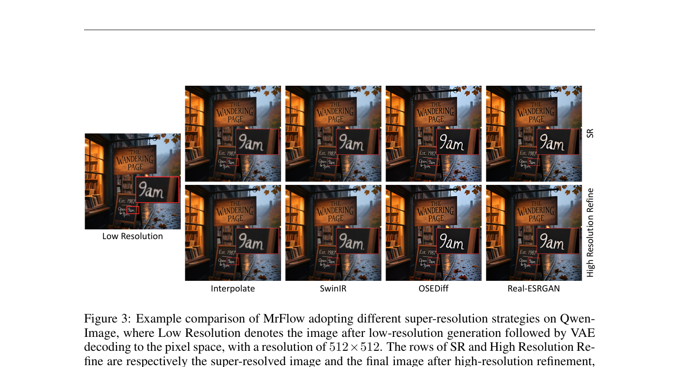
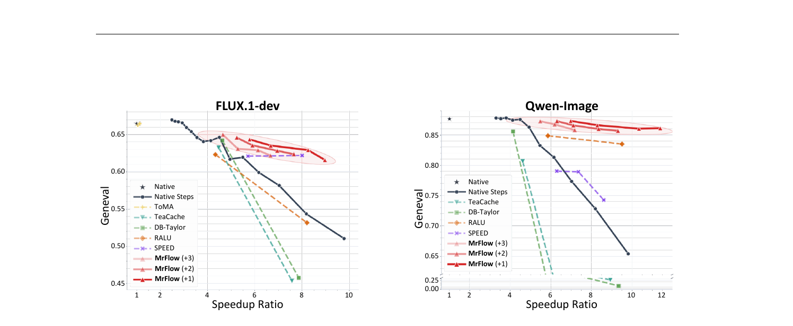
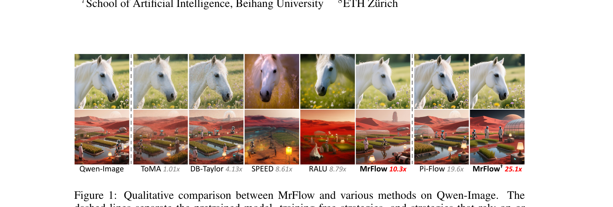

# MrFlow: Multi-Resolution Flow Matching

**论文**: Multi-Resolution Flow Matching: Training-Free Diffusion Acceleration via Staged Sampling  
**机构**: 北京航空航天大学 + 南洋理工大学 + 中科院计算所 + 中国科学技术大学 + ETH Zürich  
**arXiv**: [2607.01642](https://arxiv.org/abs/2607.01642)  
**代码**: [github.com/xliu-deep/MrFlow](https://github.com/xliu-deep/MrFlow)（含 ComfyUI 插件）  
**发表**: 2026 年 7 月

---

## 1. 一句话定位

**要解决的问题**：现有多分辨率训练-free 加速方案（LSSGen、RALU、SPEED）都在 latent 空间做 upsampling，无可避免地引入 artifacts 和 blurring；激进加速到 8× 以上时质量大幅崩塌。

**核心解法**：**MrFlow**——四阶段有序 pipeline，把"哪些工作在低分辨率做最省"和"哪些在像素空间做最安全"分开：低分辨率 latent 扩散 → 像素空间 GAN 超分 → 低强度噪声注入 → 高分辨率单步精修。训练-free，无需运行时动态统计，可直接叠加蒸馏模型进一步加速。

---

## 2. 与前作的关系

```
训练-free 特征缓存类
    TeaCache / DBCache+TaylorSeer (DB-Taylor) — 复用相邻步特征，约 4× 加速上限
    → 激进加速时质量骤降，无法有效扩展到 8×+

训练-free Token 压缩类
    ToMA — token merge，≤1.1× 加速，上限极低

训练-free 多分辨率类（latent 空间 upsampling）
    LSSGen — 训练一个轻量 latent upsampler（需要训练！），1.5× 保质，3.9× 开始崩
    RALU — nearest-neighbor latent 插值 + region-adaptive early-exit，4-5× 较好，8×+ 崩
    SPEED — 频域多分辨率，比 RALU 更强，Qwen-Image 激进配置下崩
    → 所有这些在 latent 空间做 upsampling，VAE encode 自然衰减高频→ artifacts/blurring

MrFlow（本文）
    — 低分辨率 latent 扩散：快速锁定全局结构（二次级 token 加速 + 低分步数优势）
    — 像素空间超分（Real-ESRGAN）：保留低频布局，补充高频；VAE encoder 作天然高频衰减
    — 低强度噪声注入：消除 SR 可能引入的错误高频（字符笔画偏移等）
    — 高分辨率单步精修：流轨迹近 clean 端极平，1 步足够

训练-dependent 对比
    SenseFlow / Pi-Flow — 4 步蒸馏，需要训练
    MrFlow† = MrFlow + Pi-Flow 权重（直接 plug-in，无需再训练）→ 25×
```

---

## 3. 核心算法

### 3.1 四阶段 Pipeline 总览



> **Fig 2 逐段解读**：
>
> **上排左（Native）**——50 步全程高分辨率 latent 扩散，经 VAE Decoder 输出 HR 图像。绿色表示低分辨率 denoising 步，蓝色为高分辨率步（这里全是蓝色）。表示空间为 Latent Space（绿底）。这是参考基线，质量上限，但最慢。
>
> **上排右（Latent Upsampling）**——先 20 步低分辨率 latent 扩散，在 latent 空间做 Upsampling + Add Noise，再 10 步高分辨率 latent 精修，最后 VAE Decoder。问题：latent 空间 upsampling 会破坏 VAE decoder 依赖的局部空间统计，产生网格状 artifacts；且 Add Noise 的强度需要覆盖低频误差时，会抹掉已有的有效结构。
>
> **下排（MrFlow）**——左侧浅绿块（12-Step）是低分辨率 latent 扩散；VAE Decoder 把低分辨率 latent 解码到像素空间（LR 像素图）；SR GAN（Real-ESRGAN ×2）在像素空间做超分，得到 HR 像素图；VAE Encoder 重新编码（注意：编码时 VAE 天然衰减像素域超出训练分布的高频）；Add Small Noise（`σ_t ε`，虚线框）在 latent 上注入低强度噪声以便高频重采样；最后 Single-Step 高分辨率扩散精修，VAE Decoder 输出最终 HR 图。橙色块代表像素空间操作，区别于绿色 latent 操作。

$$\text{Pipeline}:\quad z_1^{\text{LR}} \to z_0^{\text{LR}} \xrightarrow{\mathcal{D}} x_{\text{LR}} \xrightarrow{U} x_{\text{SR}} \xrightarrow{\mathcal{E}} z_0^{\text{SR}} \xrightarrow{+\sigma_t\epsilon} z_t^{\text{HR}} \xrightarrow{\Phi^{K_H}} z_0^{\text{HR}} \xrightarrow{\mathcal{D}} x_{\text{HR}}$$

### 3.2 阶段一：低分辨率结构生成

初始化低分辨率 latent 噪声：

$$\mathbf{z}_1^{\text{LR}} \sim \mathcal{N}(\mathbf{0}, \mathbf{I}), \quad \mathbf{z}_1^{\text{LR}} \in \mathbb{R}^{C \times H_L \times W_L}$$

`K_L` 步 Euler ODE 采样（flow matching 形式，`ż_t = v_θ`）：

$$\mathbf{z}_0^{\text{LR}} = \Phi^{K_L}_{\mathbf{v}_\theta,\mathbf{c}}(\mathbf{z}_1^{\text{LR}})$$

VAE 解码到像素空间：

$$\mathbf{x}_{\text{LR}} = \mathcal{D}(\mathbf{z}_0^{\text{LR}}), \quad \mathbf{x}_{\text{LR}} \in \mathbb{R}^{3 \times H_L^{\text{px}} \times W_L^{\text{px}}}$$

**为何低分辨率能用更少步数**：两个互补原因：
1. **Text-image attention mass 更高**：低分辨率时 image token 对 text key 的注意力权重（`T^(ℓ)`）显著高于高分辨率，语义信息利用率高，结构收敛快。
2. **ODE 路径更短**：低频分量占总路径长度约 58%，低分辨率只需走低频子路径。

典型配置 `K_L = 12`，高分辨率原生需要 50 步。

### 3.3 阶段二：像素空间超分辨率

$$\mathbf{x}_{\text{SR}} \leftarrow U(\mathbf{x}_{\text{LR}}), \quad \mathbf{x}_{\text{SR}} \in \mathbb{R}^{3 \times H_H^{\text{px}} \times W_H^{\text{px}}}$$

`U` 为预训练 Real-ESRGAN（×2 upsampling），**选择像素空间而非 latent 空间的关键理由**：

- 自然图像的纹理、边缘、功率谱先验本就建立在像素域；SR 模型预训练知识只能在像素域复用
- VAE encoder 会天然衰减超出训练分布的高频成分（像素域超分引入的高频），将结果映射回 latent 时自动提供鲁棒起点
- **GAN 优于 L2-SR（SwinIR）和插值**：GAN loss 放弃最小化均方误差换取局部视觉合理的高频细节，使残差误差主要集中在高频频带——恰好是后续低强度噪声注入能有效修正的区域；L2-SR 保留布局但留下持续的高频衰减和漫反射模糊，插值更差



> **Fig 3 逐段解读**：
>
> **左列（Low Resolution）**——512×512 低分辨率输出，书店招牌"The Wandering Page"和黑板上的"9am"字样均已生成，但模糊、字体细节不清晰。
>
> **上行（SR）**——四种超分策略放大到 1024×1024 的结果（未经 HR 精修）：Interpolate 放大后整体模糊，黑板字体仍不清晰；SwinIR 保留布局但高频衰减，字体边缘软；OSEDiff（扩散超分）引入字符笔画偏移，招牌文字出现错别字式变形；Real-ESRGAN 字体最清晰，黑板"9am"笔画锐利，布局保留完整。
>
> **下行（High Resolution Refine）**——经过单步 HR 精修后的结果：Interpolate 和 SwinIR 的模糊被精修纠正，但局部细节仍然欠佳；OSEDiff 的字符偏移错误也被精修部分修正，但低频错误已超出精修能力范围；Real-ESRGAN 精修后效果最佳，字体锐利、布局准确、招牌文字完整——证明 GAN SR 的错误主要在高频（可被精修纠正），而低频布局被完整保留。

### 3.4 阶段三：低强度噪声注入（高频重采样）

VAE 重编码超分图像，得到高分辨率 latent：

$$\mathbf{z}_0^{\text{SR}} = \mathcal{E}(\mathbf{x}_{\text{SR}})$$

在 flow matching 形式下注入低强度噪声：

$$\mathbf{z}_t^{\text{HR}} = (1 - \sigma_t)\,\mathbf{z}_0^{\text{SR}} + \sigma_t\,\epsilon, \quad \epsilon \sim \mathcal{N}(\mathbf{0}, \mathbf{I})$$

典型 `σ_t ∈ [0.1, 0.15]`。**设计动机**：`z_0^SR` 的低频结构由低分辨率阶段决定，应当保留；GAN SR 引入的错误主要在高频（字符笔画偏移等），低强度噪声降低高频 SNR，使后续精修步骤可以在高分辨率流先验下重采样高频成分，同时不破坏低频结构。

**噪声强度下界（Proposition）**：设 `λ_hf` 为干净 latent 高频分量的功率（方差），则：

$$\sigma_t \geq \sigma_t^* = \frac{\sqrt{\lambda_{\text{hf}}}}{1 + \sqrt{\lambda_{\text{hf}}}}$$

这一下界从可测量的干净 latent 高频功率推导，而非未知的 SR 误差范数。实测高频功率使 `σ_t ∈ [0.1, 0.15]` 即足够。

### 3.5 阶段四：高分辨率细节精修

以含噪 HR latent `z_t^HR` 为初始值，运行高分辨率扩散：

$$\mathbf{z}_0^{\text{HR}} = \Phi^{K_H}_{\mathbf{v}_\theta,\mathbf{c}}(\mathbf{z}_t^{\text{HR}}), \quad \mathbf{x}_{\text{HR}} = \mathcal{D}(\mathbf{z}_0^{\text{HR}})$$

默认 `K_H = 1`。**为何单步够用**：低强度 noising（`σ_t ∈ [0.1, 0.15]`）使初始点已在 clean image 附近；flow matching 在 clean 端的轨迹极平直，相邻步差异小，单步 Euler 离散误差可忽略。实测单步在 `s=0.1` 时 CLIP consistency = 0.9974，距 8 步 denoising 的 0.9999 仅差 0.0025。

---

## 4. 关键实验结果

### 4.1 主要定量结果（1024×1024，FLUX.1-dev & Qwen-Image）

**FLUX.1-dev 训练-free 对比**：

| 方法 | NFEs | 加速比 | GenEval↑ | DPG↑ | OneIG-En↑ |
|------|------|--------|---------|------|----------|
| FLUX.1-dev（原生） | 50 | 1× | 0.66 | 84.07 | 0.44 |
| TeaCache | 50 | 4.47× | 0.63 | 82.62 | 0.36 |
| DB-Taylor | 50 | 4.63× | 0.64 | **83.78** | **0.40** |
| SPEED | 3,2,7 | 5.71× | 0.62 | 83.55 | 0.37 |
| **MrFlow** | **20,1** | **5.78×** | **0.65** | 82.19 | 0.39 |
| TeaCache（激进） | 50 | 7.57× | 0.45 | 70.79 | 0.28 |
| RALU（激进） | 1,2,3 | 8.21× | 0.53 | 77.11 | 0.30 |
| **MrFlow** | **12,1** | **8.25×** | **0.63** | **81.65** | **0.36** |

**Qwen-Image 训练-free 对比（激进配置）**：

| 方法 | NFEs | 加速比 | GenEval↑ | OneIG-En↑ | OneIG-Zh↑ |
|------|------|--------|---------|----------|----------|
| Qwen-Image（原生） | 50×2 | 1× | 0.88 | 0.53 | 0.53 |
| TeaCache（激进） | 50×2 | 8.93× | 0.26 | 0.16 | 0.19 |
| RALU（激进） | 1,2,4 | 9.51× | 0.84 | 0.44 | 0.46 |
| SPEED（激进） | 1,1,5 | 8.61× | 0.74 | 0.44 | 0.46 |
| **MrFlow** | **(12,1)×2** | **10.3×** | **0.86** | **0.52** | **0.51** |

**与训练-dependent 方法对比（FLUX）**：

| 方法 | NFEs | 加速比 | GenEval↑ |
|------|------|--------|---------|
| SenseFlow（4 步蒸馏） | 4 | 11.1× | 0.63 |
| Pi-Flow（4 步蒸馏） | 4 | 9.49× | 0.68 |
| MrFlow†（MrFlow+Pi-Flow） | 4,1 | **11.3×** | **0.69** |
| FLUX-schnell（2 步蒸馏） | 2 | 20.4× | 0.69 |
| MrFlow†（MrFlow+FLUX-schnell） | 1,1 | **19.5×** | **0.71** |

**Qwen-Image 最高加速**：MrFlow + Pi-Flow = **25.1×**，GenEval = 0.85（原生 0.88，差距 <2%）。

### 4.2 速度-质量 trade-off 曲线



> **Fig 5 逐段解读**：
>
> **左图（FLUX.1-dev）**——横轴为端到端加速比，纵轴为 GenEval 分数。Native（★）为上界。所有虚线方法（TeaCache、DB-Taylor、RALU、SPEED）在加速比 >5× 后质量开始快速下滑，到 8-9× 时已全部崩塌到 GenEval ≈ 0.5 以下。MrFlow 三条红色实线（+1/+2/+3 HR steps）形成一个红色椭圆区域，始终位于所有其他方法的帕累托前沿之上：在 4-8× 区间，MrFlow 的 GenEval 显著高于同等加速比的其他方法，且随 HR steps 数增加可以灵活调节质量-速度平衡。
>
> **右图（Qwen-Image）**——同样的模式，但 Qwen-Image 原生 GenEval 更高（≈0.88），竞争方法在 6-8× 时已全部崩溃到 0.25-0.70 区间（TeaCache 暴跌至 0.25）。MrFlow 在 10× 附近仍保持 GenEval = 0.86，是唯一能在 >8× 激进配置下维持质量的训练-free 方法。不同 HR steps 对应的质量差异不大（+1 已足够），证明精修阶段对步数不敏感。

### 4.3 定性对比



> **Fig 1 逐列对比**：两行（白马/火星景观），七列方法（加速比用斜体标注）：
>
> - **Qwen-Image（原生）**——参考基准，白马毛发细腻、草地花卉清晰；火星景观大气层、植被和人物轮廓均准确。
> - **ToMA 1.01×**——几乎无加速，视觉结果与原生相差无几（保质不提速，意义有限）。
> - **DB-Taylor 4.13×**——4× 下质量尚可，白马细节略有损失，但布局正确；火星景观有轻微色偏。
> - **SPEED 8.61×**——8× 下白马头部比例出现变形，细节明显模糊；火星景观构图混乱，人物变形。
> - **RALU 8.79×**——白马整体变形较严重，背景花卉消失；火星景观色彩失真，建筑物轮廓错误。
> - **MrFlow 10.3×**——白马毛发、眼睛和鬃毛清晰，与原生非常接近；火星景观构图正确，人物比例自然，大气色调与参考一致——是列中唯一在 >10× 加速下维持参考品质的训练-free 方法。
> - **Pi-Flow 19.6×**（虚线后，training-dependent）——接近原生质量，但需要额外训练。
> - **MrFlow† 25.1×**——MrFlow 直接 plug-in Pi-Flow 权重，质量与 Pi-Flow 相当甚至更好，且比单独 Pi-Flow 快 1.3×，达到了训练-free 方法无法单独实现的速度区间。

---

## 5. 关键代码位置

代码结构简洁，核心逻辑在三个文件：

| 文件 | 内容 |
|------|------|
| `mrflow_utils.py:8` | `direct_sigma_schedule` context manager：monkey-patch scheduler，强制使用 `linspace(first_sigma, 0, steps+1)` 的 σ 调度，实现阶段三/四的低强度噪声注入和单步精修 |
| `qwen_image_mrflow.py:36-61` | 阶段一：`QwenImagePipeline` 在 `LOW_SIZE=512` 下跑 `LOW_STEPS=12` 步 |
| `qwen_image_mrflow.py:64-66` | 阶段二：`RealESRGAN(device, scale=2)` 超分到 1024，再 `resize((HIGH_SIZE, HIGH_SIZE))` |
| `qwen_image_mrflow.py:69-87` | 阶段三+四：`QwenImageImg2ImgPipeline` + `direct_sigma_schedule(REFINE_SIGMA=0.12, REFINE_STEPS=1)` 完成噪声注入和单步精修 |
| `flux1_mrflow.py` | FLUX.1-dev 版本，逻辑相同，调度器用 FlowMatchEulerDiscreteScheduler |

📌 **`direct_sigma_schedule` 是整个方法的关键胶水代码**：通过 monkey-patching scheduler 的 `set_timesteps`，将 σ 序列强制设定为从 `first_sigma`（= `REFINE_SIGMA` = 0.12）到 0 的均匀线段，跳过 scheduler 自己的时间步计划。这样 img2img pipeline 的 strength=1.0 + 自定义 σ 调度 = 精确控制噪声注入强度，而不依赖任何模型训练或额外 adapter。

```python
# mrflow_utils.py — 核心 sigma 调度控制
def set_timesteps(self, sigmas=None, device=None, **kwargs):
    sigmas = torch.linspace(first_sigma, 0.0, steps + 1, device=target_device)
    self.num_inference_steps = steps
    self.timesteps = sigmas[:-1] * self.config.num_train_timesteps
    self.sigmas = sigmas
```

---

## 6. 关键配置项

| 参数 | 典型值 | 说明 |
|------|--------|------|
| `LOW_SIZE` | 512 | 低分辨率边长，VAE downsampling factor 8 → 64×64 latent |
| `HIGH_SIZE` | 1024 | 高分辨率目标边长 |
| `LOW_STEPS` (K_L) | 12 / 20 | 低分辨率扩散步数，越多质量越好但越慢（12 步已接近 20 步质量） |
| `REFINE_STEPS` (K_H) | 1 | 高分辨率精修步数，默认 1；2 步边际收益极小 |
| `REFINE_SIGMA` (σ_t) | 0.12 | 噪声注入强度，`[0.1, 0.15]` 区间均可；低于 0.1 修正能力不足，高于 0.15 破坏低频 |
| SR 网络 | Real-ESRGAN ×2 | GAN-based；SwinIR/Interpolate 也可用但效果略差 |
| SR 倍率 | ×2（512→1024） | 超分后 resize 到目标分辨率 |
| FLUX guidance scale | 3.5 | 原生默认值 |
| Qwen true-CFG scale | 4.0 | 原生默认值，两次 CFG forward pass |
| MrFlow† seed 差异 | seed+1 for refine | 精修阶段用不同 seed 避免和低分辨率生成的噪声相关 |

---

## 7. 争议/权衡

### 7.1 VAE encode-decode 的额外开销

MrFlow 比 native 多一次 VAE decode（LR→pixel）+ Real-ESRGAN 超分 + 一次 VAE encode（SR→latent）。但论文指出这些额外开销相对扩散 forward pass 极小（VAE encode/decode 远快于 Transformer forward），端到端实测加速仍是 10×+。

### 7.2 对 SR 模型的依赖

MrFlow 依赖预训练 Real-ESRGAN，而 Real-ESRGAN 是在通用自然图像上训练的，对 AI 生成图像中的特殊风格（如手绘、抽象艺术）的适配性没有验证。字符 stroke 偏移（Fig 3 OSEDiff）的问题在 Real-ESRGAN 也有轻微残留，需要 HR 精修消除。

### 7.3 只在 FLUX / Qwen-Image 上验证

主要实验在 FLUX.1-dev 和 Qwen-Image-20B 上，两者都是 flow matching 模型。对 DDPM-based 扩散模型（如 SD1.5/SDXL）的适配需要调整噪声注入的时间步表达（`σ` vs `t`），代码有 FLUX 2 Klein 和 Z-Image-Turbo 的 examples 但结果未在主文展示。

### 7.4 与 TeaCache 等的正交性

MrFlow 和 feature caching 类方法理论上可以叠加（低分辨率阶段还可以用 TeaCache 进一步跳步），但论文未实验。MrFlow 与蒸馏模型的叠加（MrFlow†）已验证有效，说明 staged pipeline 与参数层面的加速正交。

### 7.5 低分辨率步数对质量的影响

GenEval 随低分辨率步数 K_L 单调提升，但 K_H（高分辨率步数）的影响很小。这说明整体质量瓶颈在低分辨率结构生成，而非高分辨率精修——意味着提高 K_L 是最有性价比的调节方式。

---

## 8. 一句话总结

MrFlow 的核心洞察是：**流匹配模型在低分辨率下天然拥有二次级 token 加速 + 更少步收敛两重红利，用 GAN 超分（而非 latent 插值）在像素空间扩大分辨率，再用低强度噪声让高分辨率流完成高频修正**——这条有序 pipeline 在完全无训练的情况下实现 10× 端到端加速（与原生 <2% GenEval 差距），并与蒸馏模型直接叠加达到 25×，彻底超出所有同类训练-free 方案的质量-速度帕累托前沿。
