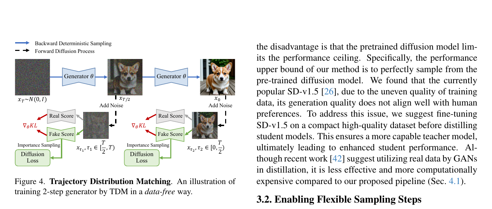
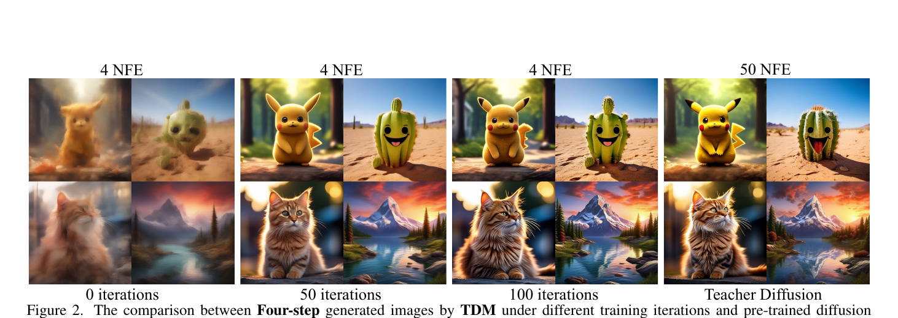
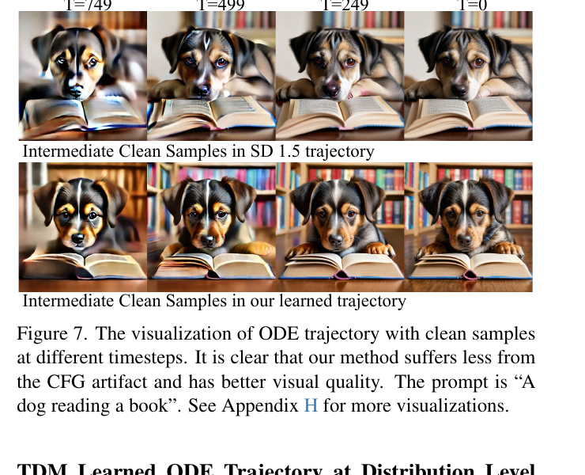
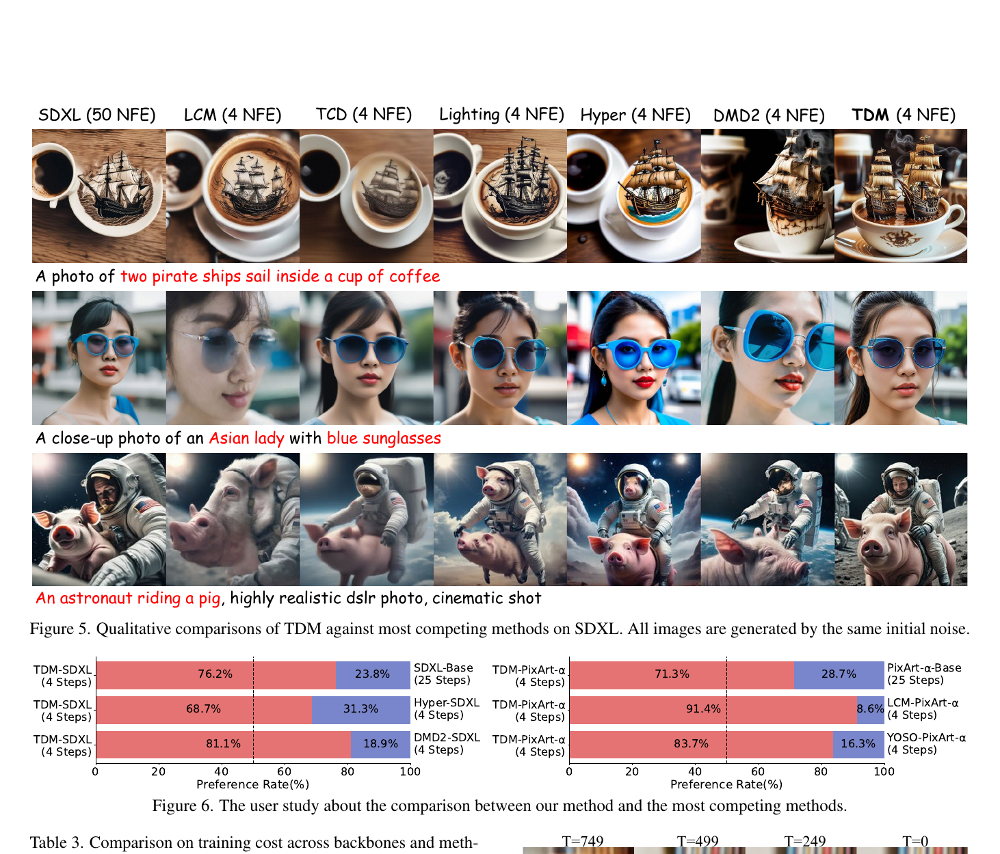
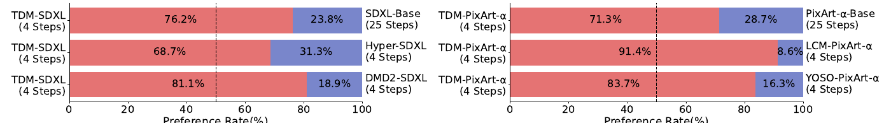
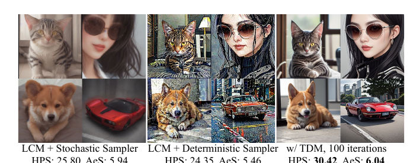
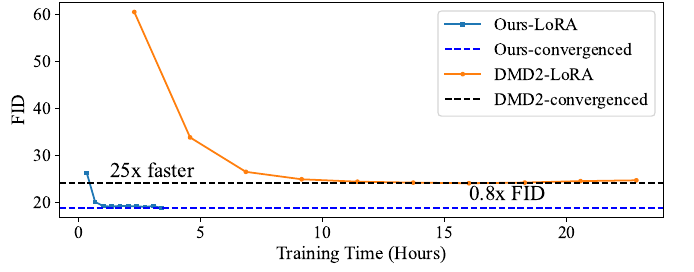

# TDM: Learning Few-Step Diffusion Models by Trajectory Distribution Matching

**论文**:Learning Few-Step Diffusion Models by Trajectory Distribution Matching  
**作者**:Yihong Luo, Tianyang Hu, Jiacheng Sun, Yujun Cai, Jing Tang (HKUST + Huawei Noah's Ark Lab + NUS)  
**发表**:ICCV 2025 · [arXiv:2503.06674](https://arxiv.org/abs/2503.06674)  
**代码**:https://github.com/Luo-Yihong/TDM  
**项目页**:https://tdm-t2x.github.io/

---

## 1. 一句话定位

在 trajectory 各时间步的**分布层面**对齐 student 和 teacher 的 ODE 轨迹,而非逐实例对齐——data-free、500 iter 就能让 4-step PixArt-α 超过 50-step teacher,SDXL 蒸馏只需 2 A800 天。

---

## 2. 要解决的问题(动机)

现有扩散蒸馏分两类,各有致命缺陷:

| 方法类型 | 代表 | 优点 | 缺陷 |
|---------|------|------|------|
| **Trajectory Matching** | CM, TCD, PeRFlow | 利用完整轨迹信息,质量较好 | 逐实例匹配 ODE 轨迹需数值求解,累积误差大;受限模型容量时效果差 |
| **Distribution Matching** | DMD, SiD, Diff-Instruct | data-free,1步性能强 | 只在单步优化分布,缺少多步灵活性;hard to add NFE |

TDM 的出发点:trajectory 信息 + distribution-level 对齐可以兼得——不在实例层面跑 ODE,而是在每个轨迹时间步的**边际分布**上做 KL divergence。

---

## 3. 与前作的关系

```
Diff-Instruct / VSD (distribution matching, 单步)
    │
    ├── DMD / DMD2 (distribution matching, 多时间步直接预测 x_0)
    │       ├── 每步独立优化 → 忽略轨迹中间阶段
    │       └── fake score 共享于所有步 → 偏置(本文 Eq.9 分析)
    │
    └── SiD (distribution matching, 1步)
    
CM / LCM (trajectory matching, 随机多步)
    └── 只支持随机 sampling,确定性效果差

TCD / PeRFlow (trajectory matching, 确定性)
    └── 实例级匹配 → 求解教师 ODE 耗时且有数值误差

TDM (本文): 把 trajectory 分解成 K 段,每段做 distribution matching
    → 无需求解教师 ODE(data-free)
    → 确定性采样天然好(比随机采样更 few-step 友好)
    → 支持灵活步数(TDM-unify:K 作为 conditioning)
```

---

## 4. 核心算法/方法

### 4.1 Trajectory Distribution Matching



> **Fig 4 逐段解读**：以 2-step generator 为例。
>
> **上方蓝色箭头(Backward Deterministic Sampling)**——student generator θ 做两步去噪：从 `x_T ~ N(0,I)` 出发，Generator θ 输出中间状态 `x_{T/2}`，再加噪，再过一次 Generator θ 得到 `x_0`。这条路径就是 student 的 ODE 轨迹。
>
> **黑色虚线箭头(Forward Diffusion Process)**——从 student 生成的干净图出发，往回加噪，得到对应各段的噪声样本 `x_{τ₁}` 和 `x_{τ₂}`。这是"扩散"方向，用于构造 distribution matching 目标所需的中间 latent 样本。
>
> **每段：Real Score - Fake Score → ∇θ KL**——对每个噪声样本 `x_τ`，分别查询 teacher score `s_φ(x_τ, τ)`（Real Score，绿色）和 fake score `s_ψ(x_τ, τ)`（Fake Score，灰色），两者之差即为梯度方向：把 student 样本向 teacher 分布推，同时用 fake score 归一化。
>
> **分段非重叠的设计**——左段 `τ₁ ∈ [T/2, T)`，右段 `τ₂ ∈ [0, T/2)`。两段不重叠，保证 fake score 可以用同一组参数无偏地建模各段分布，避免 DMD2 中 fake score 被多步分布混淆的问题。
>
> **Importance Sampling(绿色框)**——从 `q(x_τ|x_{t_i})` 采样后，用重要性权重 `q(x_τ|x_{t_i}) / q(x_τ|x̂_{t_i})` 修正 fake score 的训练信号，降低方差、确保无偏。

**核心目标(Eq. 5)**：把 student 在每段轨迹起点 `t_i` 出发、到区间 `[t_i, t_{i+1}]` 内各时间步 τ 的边际分布，与 teacher 的对应边际分布做 KL 散度：

$$
L(\theta) = \sum_{i=0}^{K-1} \sum_{\tau=t_i}^{t_{i+1}} \lambda_\tau \mathrm{KL}\!\left(p_{\theta,\tau|t_i}(\mathbf{x}_\tau) \;\Big\|\; p_{\phi,\tau}(\mathbf{x}_\tau)\right)
$$

梯度展开后等价的最小化 loss(Eq. 6):

$$
L(\theta) = \sum_{i=0}^{K-1} \sum_{\tau=t_i}^{t_{i+1}} \lambda_\tau \left\lVert \mathbf{x}_{t_i} - \mathrm{sg}(\hat{\mathbf{x}}_{t_i}) \right\rVert_2^2
$$

其中 `sg(·)` 是 stop-gradient，`x̂_{t_i}` 是对 student 样本沿 KL 梯度方向做一步修正得到的"修正目标":

$$
\hat{\mathbf{x}}_{t_i} = \mathbf{x}_{t_i} + \lambda_\tau \bigl[s_\phi(\mathbf{x}_\tau, \tau) - s_\psi(\mathbf{x}_\tau, \tau)\bigr] \frac{\partial \mathbf{x}_{t_i}}{\partial \theta}
$$

**📌 本质**：这和 DMD 的单步梯度形式完全相同(`real_score - fake_score`),只是 TDM 在 trajectory 上的 K 个区间内的每个 τ 都做一遍,而 DMD 只在一个特定 t 做。

### 4.2 Fake Score 学习与 Importance Sampling

Fake score `s_ψ` 通过对 student 生成样本进行去噪训练(Eq. 7):

$$
L(\psi) = \sum_{i=0}^{K-1} \mathbb{E}_{p_{\theta,t_i}} \mathbb{E}_{q(\mathbf{x}_\tau|\mathbf{x}_{t_i})} \omega_\tau \left\lVert f_\psi(\mathbf{x}_\tau, \tau) - \hat{\mathbf{x}}_{t_i} \right\rVert_2^2
$$

加入 importance sampling,用权重 `q(x_τ|x_{t_i}) / q(x_τ|x̂_{t_i})` 修正,使 fake score 的训练目标与 generator 的修正目标分布一致,降低方差。

**为什么非重叠区间是关键**:若区间重叠,同一 fake score `s_ψ` 必须同时建模 `p_{K₁}(x)` 和 `p_{K₂}(x)` 两个不同分布,其最优解退化为两者的混合(见 Eq. 9),引入偏置。非重叠保证每个 τ 只属于一个区间,fake score 对该时间步的分布无偏。

### 4.3 Sampling-Steps-Aware 目标(TDM-unify)

为支持推理时灵活选步数 K,将 K 注入为 student 和 fake score 的 conditioning 信号:

$$
\mathbb{E}_K \sum_{i=0}^{K-1} \sum_{\tau=t_i^K}^{t_{i+1}^K} \lambda_\tau \mathrm{KL}\!\left(p_{\theta,\tau|t_i^K}(\mathbf{x}_\tau \mid K) \;\Big\|\; p_{\phi,\tau}(\mathbf{x}_\tau)\right)
$$

其中 `t_i^K = T/K · i`。K 均匀采样自用户想支持的步数集合。训练时 K 同时输入 student DiT 和 fake score 网络作为额外条件。

消融结果:有 K-conditioning 时 1-step HPS 28.90,无时仅 26.11;4-step 同样有 +2 点收益。

### 4.4 Surrogate Training Objective(Pseudo-Huber)

受 Consistency Models(iCT)启发,把 L2 距离替换为 Pseudo-Huber metric:

$$
L(\theta) = \sum_{i=0}^{K-1} \sum_{\tau=t_i}^{t_{i+1}} \sqrt{\left\lVert \mathbf{x}_{t_i} - \mathrm{sg}(\hat{\mathbf{x}}_{t_i}) \right\rVert_2^2 + c^2} - c
$$

其中 `c = 0.00054√d`(d 为数据维度)。梯度中有归一化因子 `1 / sqrt(||·||² + c²)`,有效防止 `x - x̂` 大时梯度爆炸,稳定训练。

---

## 5. 极速收敛的直觉



> **Fig 2 逐列解读**：固定初始噪声,对比 4-step TDM 在 0/50/100 iter 和 50-step teacher 的生成结果。
>
> - **0 iter**：纯随机初始化,Pikachu 糊成一团,猫近乎噪声。
> - **50 iter**：Pikachu 已具备完整形体、颜色、背景;猫的构图和色调基本准确。质量已接近 teacher。
> - **100 iter**：细节进一步提升,与 teacher 50 NFE 视觉等价甚至更优(少 CFG artifact)。
>
> 快速收敛的原因:TDM 的蒸馏目标是**对准分布**,每步只需做局部 denoising 而非全程 ODE 推理;distribution-level 对齐的信息密度远高于实例级匹配,梯度方向更稳定。

---

## 6. ODE 轨迹质量



> **Fig 7 逐行解读**：以"A dog reading a book"为例,可视化各中间 timestep T=749/499/249/0 的"clean x₀ 预测"。
>
> - **上行(SD 1.5 teacher trajectory)**：T=749 时狗的轮廓模糊,面部有 CFG artifact(颜色过饱和、眼神不自然);逐步清晰但 CFG 带来的过度锐化始终存在。
> - **下行(TDM learned trajectory)**：T=749 时整体构图和光影已更自然;T=249 时细节完整度与 teacher T=0 相近;**全程几乎没有 CFG artifact**。
>
> 这解释了为何 TDM 4-step 能超越 teacher 50-step:teacher 用 CFG 加速收敛但引入饱和度偏移,TDM 在分布层面对齐避免了这一副作用。

---

## 7. 实验结果

### 定量(Table 1, SD-v1.5 / SDXL / PixArt-α)

⚠️ 原表的 HPS 列有 Animation / Concept-Art / Painting / Photo / **Average** 五个子列,下面一律取 **Average**。

| 方法 | Backbone | Steps | HFL | HPS avg↑ | AeS↑ | CS↑ | Image-Free? |
|------|---------|-------|-----|----------|------|-----|-------------|
| Base (CFG=3.5) | SD-v1.5 | 25 | No | 25.50 | 5.49 | 33.03 | — |
| Base + 微调 | SD-v1.5 | 25 | No | 29.86 | 5.85 | 33.68 | — |
| Hyper-SD | SD-v1.5 | 1 | **Yes** | 28.01 | 5.64 | 30.87 | ✗ |
| **TDM-unify-SFT** | SD-v1.5 | **1** | No | **28.90** | **6.02** | **32.12** | ✗ |
| LCM-dreamshaper | SD-v1.5 | 4 | No | 25.80 | 5.94 | 31.55 | ✗ |
| Hyper-SD | SD-v1.5 | 4 | **Yes** | 30.24 | 5.78 | 31.49 | ✗ |
| DMD2 | SD-v1.5 | 4 | No | 29.49 | 5.91 | 31.53 | ✗ |
| **TDM-unify-SFT** | SD-v1.5 | 4 | No | **31.31** | **6.08** | **32.77** | ✗ |
| Base-1024 (CFG=7.5) | SDXL | 25 | No | 33.19 | 6.17 | **36.28** | — |
| LCM | SDXL | 4 | No | 29.41 | 5.84 | 34.84 | ✗ |
| SDXL-Lightning | SDXL | 4 | No | 32.71 | 6.23 | 34.62 | ✗ |
| Hyper-SD | SDXL | 4 | **Yes** | 34.14 | 6.18 | 34.27 | ✗ |
| DMD2 | SDXL | 4 | No | 31.46 | 5.88 | 35.51 | ✗ |
| **TDM** | SDXL | 4 | No | **34.88** | **6.28** | 36.08 | **✓** |
| Base-1024 (CFG=3.5) | PixArt-α | 25 | No | 32.21 | 6.23 | 34.11 | — |
| YOSO-512 | PixArt-α | 4 | No | 30.60 | 6.23 | 31.83 | ✗ |
| LCM-1024 | PixArt-α | 4 | No | 30.55 | 6.17 | 33.49 | ✗ |
| **TDM-1024** | PixArt-α | 4 | No | **33.21** | **6.42** | 33.66 | **✓** |

- **PixArt-α 4-step TDM(33.21 / 6.42)全面超越 25-step teacher(32.21 / 6.23)。**
- 📌 **三张表里只有 TDM 是 Image-Free 的**(SDXL / PixArt-α 行),其余全部需要图像数据。
- ⚠️ SDXL 上 TDM 的 HPS 34.88 高于 Hyper-SD 的 34.14,但 **Hyper-SD 用了 human feedback learning(HFL)**,论文认为这可能人为抬高机器指标——下面 Table 2 的 FID 给出了佐证。

### LoRA 迁移到未见过的定制模型(Table 2)

在原始 SD-v1.5 上以 image-free 方式训 TDM-LoRA,再**直接挂到没见过的定制模型**上。这里的 FID 衡量的是**风格保持**(teacher 样本 vs student 样本之间的 FID)。

| 方法(Dreamshaper, 4 步) | HPS avg↑ | AeS↑ | **FID↓** |
|---|---|---|---|
| LCM | 28.59 | 5.98 | 25.36 |
| PeRFlow | 26.42 | 5.74 | 23.49 |
| TCD | 27.91 | 6.01 | 28.65 |
| Hyper-SD(**HFL**) | 30.82 | 6.13 | **38.70** |
| **TDM** | **31.37** | **6.22** | **20.44** |

📌 **Hyper-SD 的 HPS/AeS 有竞争力,但 FID 高达 38.70——风格保持极差。** 这正是"HFL 可能刷高机器指标"的实证:它把定制模型的风格改掉了,换来了偏好分。TDM 的 20.44 是全表最低。Realistic 模型上结论一致(TDM 20.23 vs Hyper-SD 37.83)。

### 训练成本对比(Table 3)

| 方法 | Backbone | 训练成本 |
|------|---------|---------|
| DMD2 | SD-v1.5 | 30+ A800 Days |
| **TDM-unify-GAN** | SD-v1.5 | **4 A800 Days** |
| **TDM-unify-SFT** | SD-v1.5 | **3 A800 Days** |
| LCM | SDXL | 32 A100 Days |
| DMD2 | SDXL | 160 A100 Days |
| **TDM** | SDXL | **2 A800 Days** |
| LCM / YOSO | PixArt-α | 14.5 / 10 A100 Days |
| **TDM** | PixArt-α | **2 A800 Hours (500 iter)** |

### 视频扩展(Table 4, CogVideoX-2B)

| 方法 | NFE | VBench Total↑ |
|------|-----|---------------|
| CogVideoX-2B (teacher) | 50 | 80.91 |
| **TDM** | 4 | **81.65** |

4 NFE TDM 超越 teacher 50 NFE。

### 定性对比



> **Fig 5 逐行对比**：3 个 prompt × 7 个方法(SDXL 50 NFE / LCM / TCD / SDXL-Lightning / Hyper-SD / DMD2 / TDM)。
>
> - **行 1("两艘海盗船在咖啡杯里")**：LCM/TCD 只生成 1 艘或形状错误;Hyper-SD 颜色偏冷;DMD2 质感还原度低;TDM 两艘船轮廓清晰,咖啡油脂纹理真实,接近 teacher。
> - **行 2("蓝色墨镜亚洲女性特写")**：LCM 面部细节糊;TCD/Lighting 肤色偏黄;DMD2 墨镜颜色正确但背景过曝;TDM 面部层次最自然,墨镜蓝色准确。
> - **行 3("宇航员骑猪,高写实电影感")**：LCM/TCD/Lighting 场景构图混乱;Hyper-SD 宇航员形变;DMD2 质感粗糙;TDM 动作自然,宇宙背景景深正确。

### 用户研究(Fig 6)



> **Fig 6 解读**:两组水平条形图,红色为 TDM 胜出比例。
>
> | 对比 | TDM 胜率 |
> |---|---|
> | TDM-SDXL(4 步) vs **SDXL-Base(25 步)** | **76.2%** |
> | TDM-SDXL(4 步) vs Hyper-SDXL(4 步) | 68.7% |
> | TDM-SDXL(4 步) vs DMD2-SDXL(4 步) | 81.1% |
> | TDM-PixArt-α(4 步) vs **PixArt-α-Base(25 步)** | **71.3%** |
> | TDM-PixArt-α(4 步) vs LCM-PixArt-α(4 步) | **91.4%** |
> | TDM-PixArt-α(4 步) vs YOSO-PixArt-α(4 步) | 83.7% |
>
> **两条与 25 步 teacher 的对比(76.2% / 71.3%)是全文最强的宣称**——4 步的学生在真人偏好上明显赢过 25 步的老师。
>
> ⚠️ 但样本量很小:Appendix G 说明只用了 **20 条 prompt**,共收集约 **40 份用户反馈**,论文没有报告统计显著性。

### 修复 LCM 的确定性采样(Fig 8)



> **Fig 8 逐面板解读**:三组 4 步生成结果,底下标注各自的 HPS 和 AeS。
>
> | 面板 | HPS | AeS | 现象 |
> |---|---|---|---|
> | LCM + **随机**采样器 | 25.80 | 5.94 | LCM 的正常工作模式 |
> | LCM + **确定性**采样器 | **24.35** | **5.46** | **直接崩**——画面发灰、结构松散 |
> | **w/ TDM, 100 iterations** | **30.42** | **6.04** | 不但修好,还大幅超过原始 LCM |
>
> 意义:**确定性采样对 few-step 是更优选择,但 LCM 这类模型用不了它。** TDM 只花 **100 次迭代**就把这个能力补了回来,并把质量拉到远超原模型的水平——这既是实用技巧,也侧面证明了 TDM 的收敛之快。

### 与 DMD2 的同条件收敛对比(Fig 9)



> **Fig 9 解读**:横轴训练时长(小时),纵轴 FID(teacher 样本 vs student 样本,衡量风格保持)。
>
> - **橙线 DMD2-LoRA**:从 FID 60+ 起步,4.5 小时降到 34,约 9 小时后趋平在 24 附近。
> - **蓝线 Ours-LoRA**:**1 小时内就砸到 19 附近**并保持平稳。
>
> 两个标注给出差距:**`25x faster`**(达到 DMD2 收敛 FID 所需时间只要 4%)和 **`0.8x FID`**(最终 FID 低 20%)。
>
> 📌 **这张图是同条件对照**(都在原始 SD-v1.5 上做 LoRA 蒸馏),比 Table 3 那种跨方法跨硬件的成本对比**更有说服力**。

---

## 8. 与 DMD2 的详细对比

| 维度 | DMD2 | TDM |
|------|------|-----|
| 训练目标 | 分布匹配,单步直接预测 x₀ | 分布层面轨迹匹配,K 段 |
| 是否利用轨迹中间阶段 | ❌ 忽略 | ✅ 每段 τ 都参与梯度 |
| Fake score | 共享于所有步(有偏) | 各段非重叠(无偏) + importance sampling |
| 确定性采样 | ✅ 支持 | ✅ 天然支持(更好) |
| 多步灵活性 | 需多阶段重训 | TDM-unify:K 作为 condition |
| 训练成本(SDXL) | 160 A100 Days | **2 A800 Days**(论文口径:DMD2 的 **1.25%**) |
| FID 收敛速度(同条件 LoRA) | baseline | 只需 DMD2 时间的 **4%**(即 **25× faster**,Fig 9) |
| 最终 FID(同条件 LoRA) | baseline | 比 DMD2 低 **20%**(0.8×,Fig 9) |
| fake score 每轮更新次数 | **10 次**(官方实现) | **1 次** |

⚠️ 注意两个"倍数"来源不同,别混:**1.25%(≈80×)** 来自 Table 3 的端到端训练成本(且跨 A800/A100,协议也不同);**25×** 来自 Fig 9 的同条件 LoRA 收敛对比。后者可信度更高。

---

## 9. 关键代码位置

代码仓库只有一个核心文件:**`train_tdm_demo.py`(1,272 行)**——2025/07 放出的 "most compact demo",跑 PixArt-512。⚠️ **SDXL / SD-v1.5 / CogVideoX 的训练脚本都没有开源**,而 Table 1/3 最亮眼的数字(SDXL HPS 34.88、2 A800 天)恰恰在那些配置上。

### 9.1 `Predictor` 工具类(`train_tdm_demo.py:978`)

| 方法 | 行号 | 作用 |
|---|---|---|
| `predict()` | `:990` | 前向一次,返回 `(score_pred, pred_latents)`,其中 `pred_latents` 是预测的 **x̂₀**(经 `predicted_origin`,`:137`) |
| `add_noise(samples, noise, t1, t2)` | `:1036` | **从 `t1` 扩散到 `t2`**:`x·α₂/α₁ + β·ε`,`β = sqrt(σ₂² − (α₂σ₁/α₁)²)`。即 Eq.(5) 里"把轨迹点再扩散到 τ" |
| `obtain_mixed_noise()` | `:1047` | 算等效混合噪声,供重要性采样权重使用 |
| `generate_new()` | `:59` | K 步确定性去噪,产生 `noisy_imgs_list`(整条轨迹) |

### 9.2 fake score 训练(`:1096–1134`)

```python
ind_t = torch.randint(1, 5, (bsz,))                    # 选轨迹上的第 i 个点(K=4)
timesteps_g   = ind_t * total_steps // 4 - 1           # → {249, 499, 749, 999}
timesteps_mid = timesteps_g - total_steps // 4 + 1     # → {  0, 250, 500, 750}
# τ 的采样区间:use_separate 决定是否"不重叠"
upt = timesteps_g[i] - 10 if args.use_separate else args.total_steps - 10
timesteps[i] = torch.randint(max(20, timesteps_mid[i]), upt, (1,))

# 重要性采样权重,对应 q(x_τ|x̂)/q(x_τ|x)
is_weight = torch.exp(-0.5 * (mixed_noise**2).view(bsz,-1).mean(1)) \
          / torch.exp(-0.5 * (rand_noise**2).view(bsz,-1).mean(1))
loss_score = F.mse_loss(fake_latents, model_latents, reduction="none")
snr = torch.stack([snr, 5 * torch.ones_like(timesteps)], dim=1).min(dim=1)[0]   # Min-SNR-5
loss_score = loss_score.mean(...) * snr * is_weight
```

📌 **`--use_separate`(`:446`)就是论文里"区间不重叠"那个设计的开关。** 关掉它,τ 会横跨整个 `[20, T-10]`,退化成共享 fake score 的有偏情形。

📌 **`snr` 被 clamp 到 5**(`:1132`)——这是 **Min-SNR-5 加权,论文正文完全没提**。

### 9.3 generator 训练(`:1139–1187`)

```python
# 修正样本 x̃:注意基准是 model_latents(student 的 x̂₀),不是 fake_latents
coop_samples = model_latents.detach().clone()                       # :1165
coop_samples = coop_samples + 1       * (sd_latents - fake_latents).detach() \
                            + (cfg-1) * (sd_latents - sd_latents_uncond).detach()   # :1174

# DMD 式的逐样本归一化
sd_latents_cfg   = sd_latents + (cfg-1) * (sd_latents - sd_latents_uncond)
weighting_factor = torch.abs(model_latents - sd_latents_cfg).mean(dim=[1,2,3], keepdim=True).detach()  # :1178

if args.use_huber:
    args.huber_c = 1e-3                                             # :1180 ← 硬编码
    loss_instruct = torch.mean(
        (torch.sqrt((model_latents - coop_samples.detach())**2 + args.huber_c**2)
         - args.huber_c) / weighting_factor)                        # :1181
else:
    loss_instruct = (F.mse_loss(model_latents, coop_samples.detach(),
                                reduction='none') / weighting_factor).mean()   # :1185
```

三个要点:

- **`coop_samples` 就是论文的 `x̃_{t_i}`**:`x̂₀ + [s_φ − s_ψ]`,而 CFG 以 `sd_latents + (cfg−1)(sd_latents − sd_latents_uncond)` 的形式**折进了 real score**。⚠️ **基准是 `model_latents`(student 自己的 x̂₀),而不是 `fake_latents`**——这一点容易看反,但它决定了整个 loss 的语义:回归目标是"student 当前预测 + 修正量",不是"critic 预测 + 修正量"。
- ⚠️ **`huber_c = 1e-3` 是硬编码的**,而论文写的是 `c = 0.00054·√d`。PixArt-512 的 latent 维度下两者对不上——demo 用了个固定值。
- **fake score 每次迭代只训 1 次**;对比 **DMD2 官方是 10 次**(论文 Appendix F.1 明说复现 DMD2 时按原文用了 10 次)。这是 25× 速度差的主要来源之一。

📌 **`--use_randmid`(`:443`)**:把 `timesteps_mid` 在 `[t_mid_ori, t_g-20]` 内随机化,代码注释写着 "This can regularize the generator"。**论文正文同样没提这个技巧。**

### 9.4 超参(Appendix D)

共享:AdamW,`β₁ = 0`、`β₂ = 0.999`。

| | SD-v1.5 | SDXL | PixArt-α |
|---|---|---|---|
| lr(generator) | 2e-6 | 1e-6 | 2e-6 |
| lr(fake score) | 2e-5 | 5e-6 | 2e-5 |
| 梯度裁剪 | 1.0 | 1.0 | 1.0 |
| batch size | 256 | 64 | 32 |
| CFG | 3.5 | 8 | 3.5 |
| 迭代数 | ~20k(unify)/ 3k(4 步专用) | 1k@512 + 1k@1024 | **500** |

- **SDXL 分两阶段**:先在 512 训 1k 步,再到 1024 训 1k 步(2.7B 参数直接在 1024 微调太贵);**两阶段的 fake score 都从预训练 SDXL 初始化**。
- 训练 prompt 全部来自 **JourneyDB**(只用 prompt,不用图)。

### 9.5 推理注意事项(README)

```python
pipe.load_lora_weights('Luo-Yihong/TDM_sd3_lora', adapter_name='tdm')
pipe.set_adapters(["tdm"], [0.125])        # ⚠️ LoRA scale 必须设成 0.125
pipe.scheduler.config['flow_shift'] = 6    # 可在 1~6 之间调
# num_inference_steps=4, guidance_scale=1.0
```

📌 **`0.125` 这个 scale 是硬性要求**(README 用大写 IMPORTANT 标注),不是默认的 1.0。

### 9.6 附录里的三个消融(Table 6/7/8)

| 消融 | 结果 |
|---|---|
| **Table 6**:训练/测试用不同 ODE solver | 训练用 DDIM 或 DPM 差别不大(31.35 / 31.30);**测试时用 DPM 都更好**。原因:训练只反传一个 ODE step,高阶 solver 的高阶信息用不上 |
| **Table 7**:匹配**带噪样本** `x_{t_i}` vs **干净样本** `x̂_{t_i}` | **31.35 vs 24.63** —— 差距巨大。匹配干净样本会让确定性采样出现明显伪影 |
| **Table 8**:用更贵的 Fisher 散度替代反向 KL | **31.70 vs 31.35** —— 还能再涨,说明框架对散度的选择是开放的 |

📌 **Table 7 是全文最重要的消融**:它说明"每步只做部分去噪、匹配轨迹上的带噪点"不是可有可无的细节,而是**支撑确定性采样的核心设计**——这也正是 TDM 与 DMD2(每步预测干净图)的分水岭。

---

## 10. 争议/权衡

**优点**:
- Data-free,只需 prompt,不需要配对图像数据
- 极快收敛:500 iter / 2 A800 hours 就能超越 PixArt-α teacher
- 确定性采样下性能远优于随机采样方法(LCM)
- TDM-unify 一个模型支持 1 / 2 / 4 步

**局限与需要打问号的地方**:

1. **性能天花板受 teacher 限制。** 论文 §3.1 自己写明 "the performance upper bound of our method is to perfectly sample from the pre-trained diffusion model"。所谓"超过 teacher"指的是超过 **teacher 用多步解 PF-ODE 的实际采样结果**(带数值误差),不是超过 teacher 所表示的那个分布。teacher 质量差(如 SD-v1.5)时还需先 fine-tune,那一步是**需要真实数据**的。

2. **用户研究规模很小。** 20 条 prompt、约 40 份反馈,却支撑了"4 步超过 25 步 teacher"这个最响的结论(76.2% / 71.3%),且未报统计显著性。

3. **论文与开源 demo 有三处对不上**(见 §9):`huber_c` 论文写 `0.00054·√d`、demo 硬编码 `1e-3`;demo 里还有两个论文完全没提的技巧——**Min-SNR-5 加权**和 **`--use_randmid`**。这些都会影响复现。

4. **只放了一个 PixArt-512 的 demo。** SDXL / SD-v1.5 / CogVideoX 的训练脚本都没有,而最亮的数字恰恰在那些配置上。放出来的是 LoRA 权重,不是复现路径。

5. **成本对比不是同硬件同协议。** Table 3 混用 A800 和 A100(如 "DMD2 SDXL 160 A100 天" vs "TDM 2 A800 天"),各方法的训练协议、batch size、收敛判据也不同。**相对可信的是 Fig 9**——那是同条件下的 LoRA 对照(25× / 0.8× FID)。

6. **对 Hyper-SD "HFL 刷分"的指控是双刃剑。** 用 Table 2 的 FID(38.70 vs TDM 20.44)佐证风格保持差,这个论证有力。但 **TDM 自己的 HPS 也是偏好指标**,而 TDM-unify-SFT 用 LAION-AeS-6.5+ 微调 teacher 本身也是在往人类偏好方向拉——**只是拉的方式不同(改 teacher vs 改 student)**。"我们没用 HFL 所以更干净"并不完全站得住。

7. **通用偏好任务上并无优势。** 主表用的是 HPS benchmark,而附录 D 的 DrawBench PickScore 任务里 TDM 反而最弱(PickScore 23.30,低于 PEPG 23.68 / DiffusionNFT 23.61 / FlowGRPO 23.50;Aesthetic 5.82 也是最低),论文只用一句 "remains competitive" 带过。**更准确的结论是:TDM 在需要强优化特定 reward 的任务(OCR、HPS)上很强,在通用偏好任务上并无优势。**

8. **Fake score 需与 generator 交替更新**,实现比单阶段方法复杂。

9. **视频扩展实验很薄**:只有 Table 4 一行数字,没有消融、没有与视频专用蒸馏方法(CausVid、Self-Forcing)的对比,分辨率和帧数也没写。**当作"可行性验证"而非"视频上的 SOTA 方案"更合适。**

10. **步数灵活性的实际范围有限。** TDM-unify 只在 `{1, 2, 4}` 步上做了评测,更多步数(8、16)的表现没有量化。

---

## 11. 一句话总结

TDM 把 distribution matching 扩展到 ODE trajectory 的每个时间段:data-free score distillation + 非重叠区间无偏 fake score + importance sampling + pseudo-Huber surrogate + K-step awareness,用 2 A800 天蒸馏出超越 teacher 的 4-step SDXL(端到端成本约为 DMD2 的 1.25%;同条件 LoRA 对照下收敛快 25×、FID 低 20%)。

---

## Q&A

**Q: TDM 和 DMD、CM 有什么区别？**

A: 三者都在解决"把慢扩散压缩成少步生成器"，但切入角度不同。

**CM（Consistency Models）**：在实例层面强制自洽——同一条去噪轨迹上任意两点对 x₀ 的预测必须一致。不需要 teacher 在线；代价是只支持随机采样，确定性采样效果差。

**DMD/SiD（Distribution Matching）**：在分布层面，让 student 的生成分布逼近 teacher，梯度方向是 `real_score - fake_score`。但只在**单个固定 timestep** t 做对齐，完全忽略轨迹中间阶段，增加 NFE 时没有额外信息可利用。

**TDM**：把 trajectory 分成 K 个非重叠区间，每段都做 distribution-level KL 对齐——梯度形式和 DMD 完全相同，只是覆盖整条轨迹而非单点。

| 维度 | CM / LCM | DMD / SiD | TDM |
|------|---------|---------|-----|
| 优化目标 | 自洽一致性(实例级) | 分布 KL(单点) | 分布 KL(多段轨迹) |
| 确定性采样 | ❌ 效果差 | ✅ 好 | ✅ 好 |
| 增加 NFE 能改善吗 | ✅(随机路径) | ⚠️ 困难 | ✅(每段都对齐) |
| 是否 data-free | ❌ | ✅ | ✅ |
| fake score 偏置 | N/A | ⚠️ 共享有偏 | ✅ 非重叠无偏 |
| 4-step SDXL HPS | 29.41(LCM) | 31.46(DMD2) | **34.88** |

类比：CM 靠内部自洽、DMD 只看终点分布、TDM 把终点分布对齐扩展到整条轨迹每一段——这是 TDM 比 DMD 快 25×、效果还更好的根本原因。

---

**Q: TDM 训练完了，4步可以任意选吗？**

A: 取决于用哪个变体训练。

| 版本 | 训练时的 K | 推理能否随意换步数 |
|------|-----------|-------------------|
| **TDM（基础版）** | 固定 K（如 K=4） | ❌ 不行。区间划分 `t_i^K = T/K · i` 按 K 固定，换 K 就换了整套区间，模型没训过 |
| **TDM-unify** | K 均匀采样自 {1,2,3,4}，同时作为 conditioning 注入 | ✅ 可以。推理时传不同 K，模型自动适配 |

TDM-unify 把 K 当成额外 condition 输入 DiT，模型学会"K=1 时一步到位；K=4 时每步只负责一段"的映射。消融（Table 5）：有 K conditioning 时 1-step HPS 28.90，无时仅 26.11——说明不同步数共享 fake score 有偏（Eq.9 证明其最优解是多分布的混合）。

与 LCM 的区别：LCM 也支持可变步数，但靠随机采样；TDM-unify 是**确定性采样下的可变步数**，1-step 确定性 HPS(30.42) 远超 LCM 确定性(24.35)。

实际使用：代码 `generate_new(steps=K)` 里直接传 K，但 **weights 必须是 TDM-unify 训练的**；若用固定 K=4 的权重改成 2 步，不会报错但质量下降——去噪区间和训练时不匹配。

---

**Q: "学生超过老师"是怎么可能的?**

A: **因为 TDM 的蒸馏目标不是 teacher 的采样结果,而是 teacher 所表示的那个分布序列。**

论文 §4.1 的解释是关键:TDM 对齐的是**预训练扩散分布序列 `p_{φ,t}(x_t)` 本身**。而多步扩散模型生成时是**用数值方法解 PF-ODE**,这个过程**不可避免地引入离散化误差**,所以 teacher 自己的 25/50 步采样结果**并没有完美地从那个分布序列里采样**。

TDM 的目标函数**根本不需要从 teacher 采样**——只需要 teacher 的 score(在任意 `(x_τ, τ)` 上前向一次)。于是 student 有可能比"teacher 的实际采样结果"更接近"teacher 的真实分布"。

Fig 7 的可视化直接支持这个解释:teacher 轨迹在 T=749 时有明显 **CFG 伪影**(过饱和、边缘发硬),而 TDM 学到的轨迹在同一时刻已经色彩自然。

⚠️ 但要说准:**上界仍然是"完美地从 teacher 分布采样"**。这不是无中生有的能力提升,而是**消除了 teacher 采样过程中的数值误差**。

---

**Q: 想复现,最需要注意什么?**

A: **三个坑,按严重程度排(细节见 §9)。**

1. **`huber_c` 论文与代码不一致**:论文 `0.00054·√d`,demo 硬编码 `1e-3`(`:1180`)。
2. **两个论文没提的技巧藏在 demo 里**:**Min-SNR-5 加权**(`:1132`,`snr` clamp 到 5)和 **`--use_randmid`**(`:443`,注释说能正则化 generator)。
3. **只有 PixArt-512 的训练脚本**,SDXL / SD-v1.5 / CogVideoX 都没开源,而最亮的数字在那些配置上。

另外两条容易踩的:

- **推理时 LoRA scale 必须设 0.125**(README 用 IMPORTANT 标注),默认 1.0 会出问题。
- **训练用 DDIM、测试用 DPM-Solver** 是主实验配置(Table 6 验证过这样最好),别搞反。

---

**Q: 它和仓库里那些 RL 后训练方法(RVM / Self-OPD / CM-GRPO)是什么关系?**

A: **分属两条线:TDM 是"提速"(压步数),那些是"对齐"(压偏好)。**

| | 目标 | 监督来源 | 需要 reward 模型 |
|---|---|---|---|
| **TDM**(本文) | **提速**(few-step) | teacher score 与 fake score 之差 | ❌ |
| [PDD](../../video_generation/pdd/analysis.md) | **提速**(few-step) | teacher 的 Runge-Kutta 平均速度 | ❌ |
| [RVM](../../video_generation/rvm/analysis.md) | 对齐 | 端点 reward | ✅ |
| [Self-OPD](../../image_generation/self_opd/analysis.md) | 对齐 | 自参考 + 局部分支 reward | ✅ |
| CM-GRPO([RAVEN](../../video_generation/raven/analysis.md)) | 对齐 | consistency 转移核上的 GRPO | ✅ |

**工程骨架上它们是同构的**:最后都落到"`x̂_θ`(或 `v_θ`)减去一个 stop-gradient 的目标再取平方"。差别只在那个修正量从哪来——

- TDM:`x̃ = x + λ[s_φ − s_ψ]`(teacher 与 critic 的 score 之差)
- PDD:teacher 的 RK 平均速度直给
- RVM:`r·‖v_θ − v‖²`,reward 当带符号权重
- Self-OPD:`A_k·d_k·‖v_θ − v^(k)‖²`,advantage 当权重 + 方向门控
- CM-GRPO:advantage 加权的转移核梯度

**实践上两条线正交可叠加**:先用 RVM / Self-OPD / GRPO 类方法把 base model 对齐好,再用 TDM / PDD 蒸馏到 few-step。RAVEN 和 Qwen-Image-RL 走的都是这个顺序。

顺带一提,**[TDM-R1](../tdm_r1/analysis.md) 正是在 TDM 之上接 RL 后训练**,是这两条线在同一个模型上串起来的具体例子。
