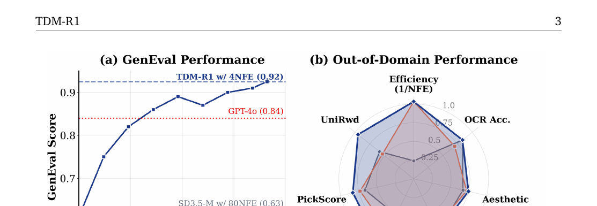
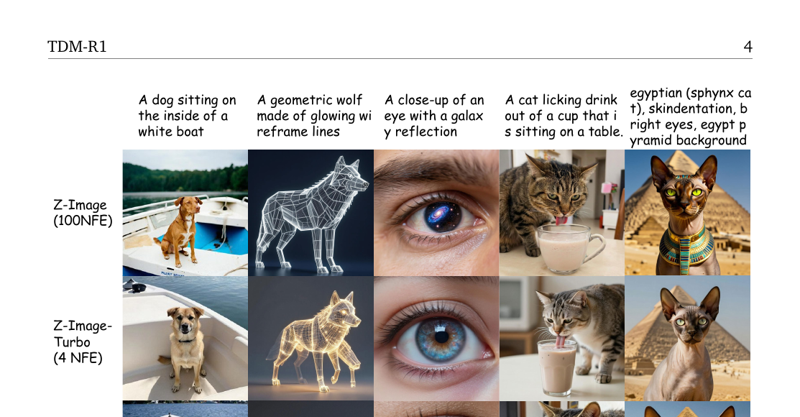
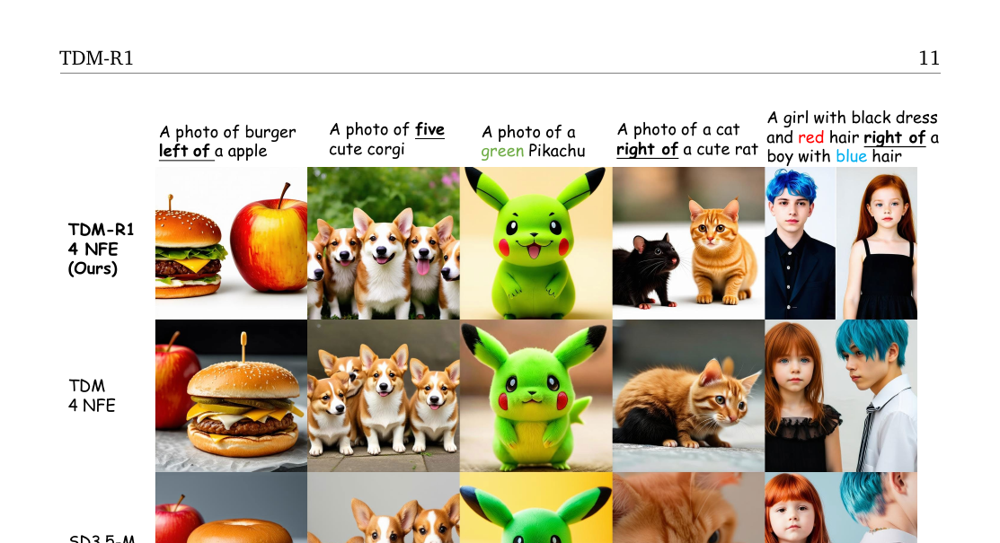

# TDM-R1: Reinforcing Few-Step Diffusion Models with Non-Differentiable Reward

**arxiv**: https://arxiv.org/abs/2603.07700  
**代码**: https://github.com/Luo-Yihong/TDM-R1  
**机构**: HKUST, CUHK-Shenzhen, Hi-Lab (Xiaohongshu)  
**作者**: Yihong Luo, Tianyang Hu, Weijian Luo, Jing Tang  

---

## 1. 一句话定位

在已蒸馏好的 TDM few-step 生成模型上做 RL post-training, 通过**解耦 Surrogate Reward 学习 + Generator 学习**两个优化目标, 首次实现了对**不可微奖励**（OCR 准确率、GenEval 得分、人类偏好打分）的有效利用——4 NFE 的生成质量超越 80 NFE 的 80%基础模型。

---

## 2. 要解决的问题

已有 few-step diffusion RL 方法（Reward-Instruct、Luo 2025a/b 等）都有同一假设：**奖励函数必须可微**, 才能把梯度从最终输出反传进生成网络。这把大量实用奖励信号拒之门外：

| 奖励类型 | 示例 | 能直接反传梯度？ |
|---------|------|----------------|
| 可微 reward | CLIP score、aesthetic | ✅ |
| 不可微 reward | OCR 模型（离散文字匹配）、GenEval（目标计数/空间关系）、人类二元偏好 | ❌ |

另一条思路是把标准扩散 RL（DGPO、Flow-GRPO 等）直接套到 few-step 模型上, 但实验证明行不通：标准扩散 RL 本质上是对去噪损失加权, 而 few-step 蒸馏的反 KL 正则与这个去噪目标内在矛盾, 导致输出模糊、性能降后退（Fig. 4 & 5 的 "TDM w/ direct RL loss"）。

---

## 3. 与前作的关系

TDM-R1 直接建立在 **TDM**（Trajectory Distribution Matching, Luo et al. 2025c）之上, 是同一第一作者的直接延伸。关系对比：

| 维度 | TDM | TDM-R1 |
|------|-----|--------|
| 目标 | 蒸馏：K步学生匹配教师轨迹分布 | RL post-training：在蒸馏好的模型上对齐 reward |
| 奖励信号 | 无（教师 score 做监督） | 任意（含不可微）reward 函数 |
| 训练数据 | 需要 prompt 数据集 | 需要 prompt 数据集（无需 GT 图像） |
| 训练方式 | 单次蒸馏 | 在 TDM 蒸馏权重基础上持续 RL 微调 |
| 与 DGPO | —— | DGPO 作用于 Surrogate Reward，而非直接作用于 Generator |

---

## 4. 核心算法 — 三组件分析

### 4.1 组件一：确定性轨迹 → 无偏逐步奖励估计

**动机**：奖励定义在干净图像 `x_0` 上, 而 few-step 采样从 `x_T` 出发, 中间步 `x_t` 上的奖励需要估计。

对任意时刻 `x_t`, 奖励的期望值为：

$$
r(\mathbf{x}_t, \mathbf{c}) = \int r(\mathbf{x}, \mathbf{c})\, p(\mathbf{x} | \mathbf{x}_t)\, d\mathbf{x} = \mathbb{E}_{p(\mathbf{x}|\mathbf{x}_t)}[r(\mathbf{x})]
\tag{Eq. 6}
$$

若用单样本蒙特卡洛估计这个期望, 方差取决于 `p(x|x_t)` 的分散程度。**ODE（确定性）采样**使 `p(x|x_t)` 退化为 Dirac delta（一条固定路径）, 方差为零, 每个中间步的奖励估计无偏且精确。SDE（随机）路径方差大, 收敛慢（Fig. 4 右图：TDM-R1 w/ stochastic sampling 明显落后）。

TDM 恰好采用确定性 ODE 轨迹, 因此直接复用其轨迹做 reward feedback。

### 4.2 组件二：Surrogate Reward 学习（DGPO 优化）

直接用不可微 reward 更新 generator 需要绕开梯度, 解决方案是学一个**可微的 Surrogate Reward** `r̃_φ(x_{t_k}, c)`。

**Surrogate Reward 的参数化**（由 RLHF 目标推导, Eq. 7）：

$$
\tilde{r}_\phi(\mathbf{x}_{t_k}, \mathbf{c}) \approx \beta\, \mathbb{E}_{q(\mathbf{x}_{t_k+1:T}|\mathbf{x}_{t_k})} \log \frac{p_\phi(\mathbf{x}_{t_k:T}|\mathbf{c})}{p_\text{ref}(\mathbf{x}_{t_k:T}|\mathbf{c})} + \beta \log Z(\mathbf{c})
\tag{Eq. 7}
$$

其中 `p_φ` 是待训练的 Surrogate Reward 扩散模型（独立 LoRA 适配器 `"dgpo"`）, `p_ref` 是参考模型（EMA 动态更新）。这个参数化把奖励信号嵌入扩散模型的路径对数似然比。

**训练目标 — 组级 Bradley-Terry（Eq. 8）**：

不使用 pairwise 正负样本对, 改用 Group-level 偏好优化（参考 DGPO, DeepSeek-R1 范式）：

$$
\min -\log p(\mathcal{G}_k^+ \succ \mathcal{G}_k^- | \mathbf{c}) = \log\!\left(1 + \exp\!\bigl(R(\mathcal{G}_k^-) - R(\mathcal{G}_k^+)\bigr)\right)
\tag{Eq. 8}
$$

其中组级奖励 `R(G) = Σ ω(x_{t_k}) r̃_φ(x_{t_k}, c)`, 权重 `ω(x_{t_k}) = |A(x_{t_k})|` 是标准化优势的绝对值。

**可处理上界（Eq. 9）**：展开后用 KL 散度表示：

$$
L(\phi) \leq \mathbb{E}_{(\mathcal{G}^+,\mathcal{G}^-)\sim\mathcal{D}, k} \mathbb{E}_{t,q(\mathbf{x}|\mathbf{x}_{t_k})} \log \sigma\!\left(-\beta(T-t_k)\!\!\left\{\sum_{\mathbf{x}_{t_k}\in\mathcal{G}_k^+}\!\!w(\mathbf{x}_{t_k})[\Delta\text{KL}_\phi(\mathbf{x}_t,\mathbf{x}_{t_k})] - \sum_{\mathbf{x}_{t_k}\in\mathcal{G}_k^-}\!\!w(\mathbf{x}_{t_k})[\Delta\text{KL}_\phi(\mathbf{x}_t,\mathbf{x}_{t_k})]\right\}\right)
\tag{Eq. 9}
$$

其中 `ΔKL_φ(x_t, x_{t_k}) = KL(q(x_{t-1}|x_t, x_{t_k}) || p_φ(x_{t-1}|x_t)) - KL(q(x_{t-1}|x_t, x_{t_k}) || p_ref(x_{t-1}|x_t))`。

**动态参考模型（EMA）**：不用冻结的参考模型（容易过强正则化）, 也不用定期硬更新（会过拟合到噪声）, 而是用 Surrogate Reward 的 EMA 作为动态 `p_ref`, 使正则化随着模型进步自适应放松。

```python
# scripts/train_tdmr1_pub.py:1571
ema_old_decay = min(config.ema_old_decay_max, config.ema_old_decay_min + 0.001 * global_step)
ema_old.step(dgpo_transformer_trainable_parameters, global_step, decay=ema_old_decay)
# decay 从 0.001 线性增加到 0.3 — 训练早期快速跟随，后期更稳定
```

### 4.3 组件三：Few-Step Generator 学习

生成器的学习目标（Eq. 10）：奖励最大化 + 反 KL 正则：

$$
L(\theta) = \mathbb{E}_{k, p_\theta(\mathbf{x}_{t_k})} \left[\tilde{r}_{sg(\phi)}(\mathbf{x}_{t_k}, \mathbf{c}) - \beta_g \,\text{KL}(p_{\theta,k}(\mathbf{x}_t) \,\|\, p_\psi(\mathbf{x}_t))\right]
\tag{Eq. 10}
$$

其中 `sg(φ)` 表示 stop-gradient（不传梯度到 Surrogate Reward）, `p_ψ` 是预训练教师。梯度展开为（Eq. 11）：

$$
\nabla_\theta L(\theta) = -\mathbb{E}\left[\beta\alpha_{t|t_k}(T-t_k)\nabla_{\mathbf{x}_t}\log\frac{p_\phi(\mathbf{x}_{t-1}|\mathbf{x}_t)}{p_\text{ref}(\mathbf{x}_{t-1}|\mathbf{x}_t)} + \beta_g\lambda_t\bigl(s_\text{fake}(\mathbf{x}_t) - s_\psi(\mathbf{x}_t)\bigr)\right]\frac{\partial\mathbf{x}_{t_k}}{\partial\theta}
\tag{Eq. 11}
$$

梯度由两项组成：**Surrogate Reward 项**（类似 DPO 风格的 score diff）+ **KL 正则项**（TDM 的 fake_score - teacher_score）。这与 TDM 原始梯度结构完全一致, 只是把前者替换为 Surrogate Reward。

**代码中的实际损失合并**（`scripts/train_tdmr1_pub.py:1616-1655`）：

```python
# Surrogate 目标 x̂ （Surrogate Reward提供方向）
dgpo_revised_x0 = (model_x0 + dgpo_x0 - dgpo_ref_x0).detach()

# KL 正则目标 x̂ （fake_score提供方向）
kl_revised_x0 = (model_x0 + 1 * (real_cond_x0 - fake_x0)).detach()

# CFG 奖励目标 x̂ （teacher CFG本身作为隐式奖励）
cfg_revised_x0 = (model_x0 + 3.5 * (real_cond_x0 - real_uncond_x0)).detach()

if j < trunc_steps:  # 有 RL 成分的步
    loss = tdm_weight * loss_cfg_reward + (1 - tdm_weight) * loss_reward + loss_kl
    # loss_reward: (dgpo_revised_x0 - model_x0)^2 / weighting_dgpo
    # loss_kl:     (kl_revised_x0 - model_x0)^2 / weighting_factor
else:                # 纯 TDM 步（不注入 RL 信号）
    loss = tdm_weight * loss_tdm
```

其中 `tdm_weight=0.3` 意味着：在注入 RL 信号的步中, 30% 来自 CFG 引导, 70% 来自 Surrogate Reward, 同时叠加 KL 正则。

### 4.4 Algorithm 1 全流程

```
输入: few-step 扩散模型 p_θ, Surrogate Reward r̃_φ, 奖励函数 r, 组大小 G=24, 步数 K=4
For n = 1 to N:
  1. 采样 prompt c ~ D_c
  2. 用 K 步确定性采样生成组 G = {x_0^(1), ..., x_0^(G)}
  3. 计算外部奖励 r_i = r(c, x_0^(i)) for i = 1, ..., G
  4. 用 Eq.9 (组级 BT) 更新 Surrogate Reward r̃_φ  ← "DGPO adapter"
  5. 用去噪 score matching 更新 fake score s_fake     ← "fake adapter"
  6. 用 Eq.10 (reward max + KL reg) 更新 Generator   ← "tdm adapter"
```

三个 LoRA 适配器（`"dgpo"`, `"fake"`, `"tdm"`）分别维护, 共享 SD3.5-M backbone。

---

## 5. 关键代码位置

| 文件 | 内容 |
|------|------|
| `scripts/train_tdmr1_pub.py:116` | `compute_group_dgpo_loss_allreduce()` — 组级 BT 损失（Eq. 9 实现） |
| `scripts/train_tdmr1_pub.py:1555` | DGPO adapter 梯度更新 |
| `scripts/train_tdmr1_pub.py:1616-1655` | Generator 综合损失（RL + KL + CFG） |
| `scripts/train_tdmr1_pub.py:1571` | EMA 动态参考模型更新（decay 0.001→0.3） |
| `flow_grpo/diffusers_patch/sd3_sde_with_logprob.py` | 带 log prob 的 SDE/ODE 步实现（支持 Surrogate Reward 计算） |
| `flow_grpo/diffusers_patch/sd3_pipeline_tdmr1.py` | 返回全部中间 latents + logprob 的推理管线 |
| `config/tdmr1_clean.py` | 全部超参配置 |

---

## 6. 关键配置项

| 参数 | 值 | 含义 |
|------|-----|------|
| `sample.num_steps` | 4 | 推理/训练步数（K=4 NFE） |
| `sample.num_image_per_prompt` | 24 | 每组生成图像数（G=24） |
| `train.tdm_weight` | 0.3 | CFG reward 权重，RL reward 权重为 0.7 |
| `train.beta` | 0.001 | KL 正则系数 β_g |
| `train.beta_dpo` | 10 (OCR) / 1 (default) | BT 损失的 β 系数 |
| `ema_old_decay_min/max` | 0.001 / 0.3 | 动态参考模型 EMA decay 范围 |
| `trunc_steps` | 4 (OCR) / 2 (HPS) | 注入 RL 信号的轨迹步数 |
| `rl_cfg` | 4.5 (OCR) / 2.5 (GenEval) | Surrogate Reward 推理时的 CFG scale |
| `t_min_dgpo` | 250-400（按任务） | DGPO 奖励估计的最小噪声时间步 |
| `train.lora_rank` | 32, alpha 64 | LoRA 微调规格 |
| `resolution` | 512 | 训练分辨率 |

---

## 7. 实验结果

### 7.1 SD3.5-M 上的 GenEval（组合生成）

| 模型 | NFE | GenEval Overall |
|------|-----|-----------------|
| SD3.5-M | 80 | 0.63 |
| Flow-GRPO (标准扩散 RL) | 80 | 0.95 |
| TDM-SD3.5-M | 4 | 0.61 |
| **TDM-R1 (Ours)** | **4** | **0.92** |
| GPT-4o（参考） | — | 0.84 |

📌 4步超越 80步基础模型（0.92 vs 0.63），并超越 GPT-4o。

### 7.2 Z-Image（6B 大模型）扩展性

| 模型 | NFE | HPSv3 | GenEval |
|------|-----|-------|---------|
| Z-Image | 100 | 7.32 | 0.66 |
| Z-Image-Turbo (DMDR) | 4 | 9.13 | 0.73 |
| **TDM-R1-Zimage (Ours)** | **4** | **9.90** | **0.77** |

### 7.3 域外泛化（Out-of-Domain）

训练时只用 GenEval reward，评测时在 Aesthetic、DeQA、ImageReward、PickScore、UniRwd 上全面提升——无奖励 hacking。

**意外发现**：在 GenEval 上训练，OCR 准确率也同步提升；在 OCR 上训练，GenEval 也提升。这说明 few-step 模型的 instruction-following 能力通过 RL 被系统性激活，有正向迁移。



> **Fig 2 逐段解读**：
>
> **(a) GenEval 性能曲线**——横轴为 GPU Hours，纵轴为 GenEval Score。TDM-R1（蓝色实线）从 0.61 起步，约 50 GPU Hours 后超过 GPT-4o（0.84），最终达到 0.92，远超同等效率的所有基线。SD3.5-M 80NFE（0.63）和 TDM-SD3.5-M 4NFE（0.61）均在底部水平线，说明未做 RL 时蒸馏不提升 instruction-following。
>
> **(b) 域外雷达图**——七维指标：Efficiency（1/NFE）、OCR Acc.、Aesthetic、DeQA、ImgRwd、PickScore、UniRwd。TDM-R1（蓝色）在 Efficiency 维度优势明显（4 NFE = 最外层），且在质量维度（Aesthetic、DeQA 等）全面优于 SD3.5-M 基线，与 TDM-SD3.5-M 的差距主要体现在 Aesthetic 和 DeQA 两维。



> **Fig 3 逐行对比**：五列对应五个 prompt，三行分别为 Z-Image 100NFE、Z-Image-Turbo 4NFE、TDM-R1 4NFE。
>
> - **列 1（白船上的狗）**：100NFE 狗清晰但背景过曝；Turbo 细节模糊；TDM-R1 光照自然，毛发细节完整。
> - **列 2（霓虹狼）**：TDM-R1 线框结构最清晰，边缘锐利。
> - **列 3（眼球 + 星系）**：TDM-R1 虹膜纹理与星系反光融合最自然。
> - **列 4（猫喝杯子）**：三行结果相似，TDM-R1 猫爪动作更生动。
> - **列 5（斯芬克斯猫 + 埃及背景）**：TDM-R1 构图最准确，金字塔背景清晰。

---

## 8. 关键图：定性指令跟随对比



> **Fig 6 逐行对比**（从上到下：TDM-R1 4NFE, TDM 4NFE, SD3.5-M 80NFE）：
>
> - **列 1（burger left of apple）**：TDM-R1 汉堡在左、苹果在右，空间关系正确。TDM 和 SD3.5-M 均倾向生成单独主体或位置错误。
> - **列 2（five cute corgi）**：TDM-R1 准确生成五只 Corgi。TDM 数量偏少（4只），SD3.5-M 约为 3只。
> - **列 3（green Pikachu）**：TDM-R1 颜色精准绿色。TDM 和 SD3.5-M 均生成黄色（标准颜色偏好压倒指令）。
> - **列 4（cat right of rat）**：TDM-R1 猫在右侧、鼠在左侧，对应正确。其他方法位置随机。
> - **列 5（multi-attribute binding）**：TDM-R1 准确绑定黑裙子、红发女孩 right-of 蓝发男孩，属性绑定全部正确。

---

## 9. 争议 / 权衡

**📌 Surrogate Reward vs. Generator 的两套优化器**：两者共享 SD3.5-M backbone, 分别有独立 LoRA (`dgpo` adapter、`tdm` adapter)，用不同学习率更新（`lr_fake=3e-4`, `lr=3e-4`, `lr_fake=1e-4` for GenEval）。这增加了显存占用但避免了两套目标的梯度冲突。

**📌 trunc_steps 的选择权衡**：OCR 任务 `trunc_steps=4`（全部步注入 RL），HPS/ImageReward `trunc_steps=2`（只对前两步注入 RL）。说明不同奖励类型需要不同的 RL 穿透深度，且 OCR 等强结构奖励需要更深度的 RL 干预。

**📌 Surrogate Reward 的上界宽松性**：Eq. 9 是 Jensen 不等式上界，理论上存在 gap。实验中 dynamic Surrogate（EMA reference）比 frozen well-trained reward 快得多且性能更高（Fig. 8），说明 distribution gap 比 bound tightness 更重要。

**📌 不能直接套标准扩散 RL 的根本原因**：标准扩散 RL（如 DGPO、Flow-GRPO）本质上在逐步 denoising 上做梯度，与 few-step 蒸馏的反 KL 正则（需要 student 对齐 teacher 而非逐步 denoising）方向冲突，训练后期必然退化为模糊输出。TDM-R1 的解法是只让 Surrogate Reward 用标准扩散 RL 逻辑，Generator 仍然保持 TDM 的反 KL 正则框架。

---

## 10. 一句话总结

TDM-R1 = TDM few-step 基础 + 独立 Surrogate Reward（用 DGPO 在扩散 LoRA 上学习组级偏好）+ Generator 损失（`tdm_weight × CFG奖励 + (1-tdm_weight) × Surrogate奖励 + KL正则`），靠 ODE 确定性轨迹消除中间步奖励估计的方差, 4 NFE 超越 80 NFE 基础模型。

---

## Q&A

（后续对话中追加）
