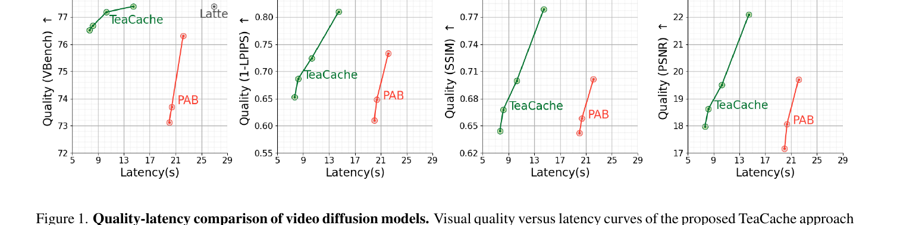
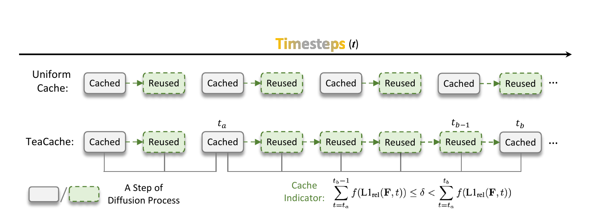
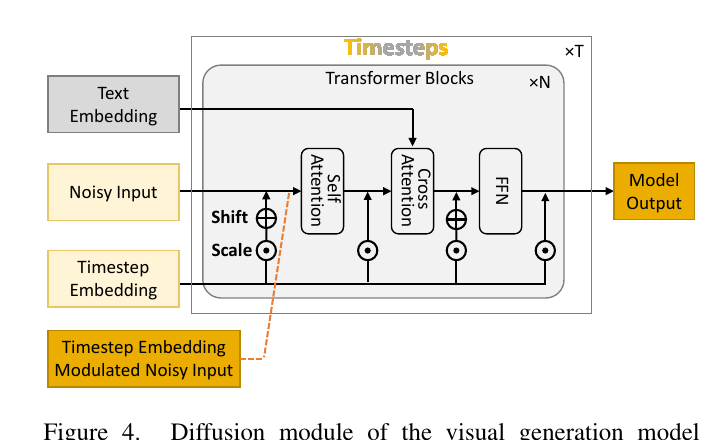
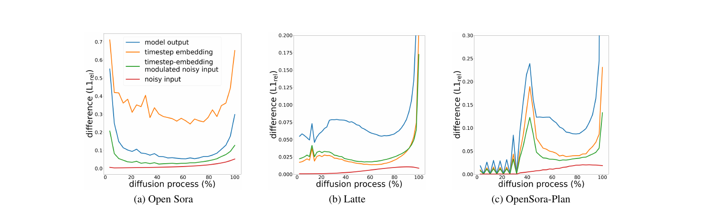
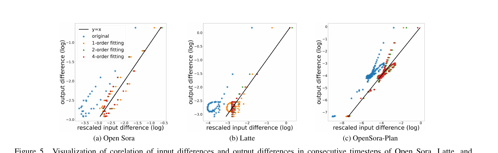
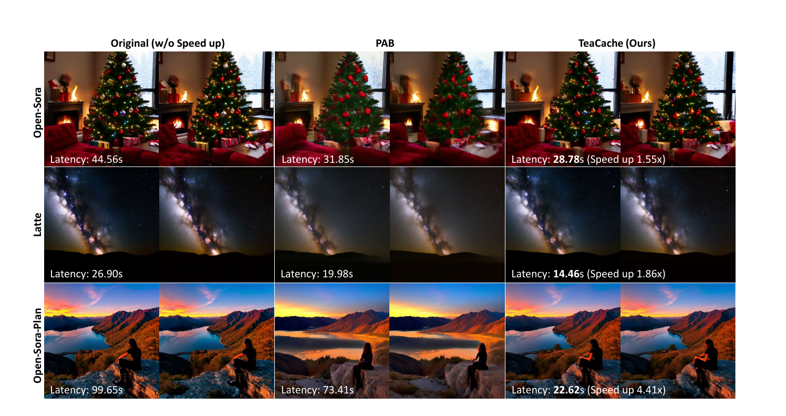

# TeaCache 论文与代码解读

> 论文:Timestep Embedding Tells: It's Time to Cache for Video Diffusion Model (CVPR 2025, UCAS + Alibaba Group + CAS + Fudan + NTU)
> 项目主页:https://liewfeng.github.io/TeaCache
> 代码:https://github.com/ali-vilab/TeaCache
> 任务:**training-free 扩散模型推理加速**(图像 + 视频 DiT 通用,本仓库以 Wan2.1 实现为主线精读)

## 一、一句话定位

TeaCache(**T**imestep **E**mbedding **A**ware **Cache**)= **一种免训练的扩散模型推理加速方法**:在去噪的相邻 timestep 之间,自适应地跳过 DiT 的计算、复用上一步的输出。核心创新是用一个**几乎零成本的输入侧信号**(timestep-embedding 调制后的 noisy input)来预测"这一步能不能跳",而不需要真的算出输出才知道。在 Open-Sora-Plan 上最高 **4.41× 加速**,VBench 仅掉 -0.07%。



> Fig 1:TeaCache vs PAB 的质量-延迟曲线(Latte,A800,16 帧 512×512)。同等延迟下 TeaCache(绿)在 VBench / 1-LPIPS / SSIM / PSNR 四个指标上全面压过 PAB(红)。

## 二、要解决的问题(动机)

扩散模型推理慢的根因:去噪是**串行**的,几十步每步都要过一遍完整 DiT,且不能并行解码。前人发现**相邻 timestep 的模型输出很相似**,于是提出 caching——缓存某步输出,后续步直接复用。

但已有的 caching(如 PAB)是**均匀缓存**:每隔固定步数复用一次。问题在于,**相邻步的输出差异不是均匀的**(见下文 Fig 3:Open-Sora 是 U 形、Latte 是反 L 形)。均匀策略要么在"变化大"处错误复用(掉质量),要么在"变化小"处白算(浪费效率)。

**理想方案**是"哪步变化小就跳哪步",但有个鸡生蛋问题:

> 要知道"这步输出和上步差多少",得先把这步输出算出来——可一旦算出来,缓存就没意义了。

TeaCache 的破局点:找一个**算之前就能拿到、且和输出差异强相关的输入侧信号**,用它来预测输出差异、决定是否复用。



> Fig 2:上排 = 传统均匀缓存(Cached/Reused 固定交替);下排 = TeaCache,根据累积指标动态决定连续复用几步(从 $t_a$ 到 $t_b$ 之间连续 Reused,到 $t_b$ 才刷新)。底部就是 cache indicator 公式(Eq 7)。

## 三、与前作的关系

扩散加速大致分两条路:

| 路线 | 代表 | 是否要训练 | TeaCache 的差异 |
|------|------|-----------|-----------------|
| 减少计算/采样步 | DDIM、ODE/SDE solver、蒸馏(LCM/DMD/CausVid)、量化、分布式 | 蒸馏/量化要 | TeaCache 不动模型,纯推理期缓存 |
| 特征/输出缓存 | DeepCache、FORA、Δ-DiT、PAB、AdaCache、FasterCache | ❌ training-free | 前人多为**均匀/固定层**缓存,TeaCache 是**输入感知的自适应**缓存 |

关键对比对象 **PAB**(Pyramid Attention Broadcast):按不同 attention block 特性,在固定 timestep 区间广播中间特征。**TeaCache 的 incremental claim**:不固定调度,而是用 timestep-embedding 调制输入的差异**动态**决定缓存时机,因此 quality-efficiency trade-off 更优(Fig 1)。

## 四、核心算法/方法

### 4.0 先看一眼 DiT 的三个输入



> Fig 4:DiT block 有三路输入——text embedding(走 cross-attention)、noisy input(主干)、timestep embedding(通过 AdaLN 的 **Shift / Scale** 去调制每个 block 的输入输出幅度)。橙色的 "Timestep Embedding Modulated Noisy Input" 就是 TeaCache 选中的信号。

为什么 timestep embedding 能当信号?因为 Eq.3 里 $\mathbf{T}_t = \text{MLP}(\text{sinusoidal}(t))$ 通过 AdaLN 的 shift & scale **直接调节 block 输出的幅度**,所以它和输出变化强相关。

### 4.1 Step 1:选哪个输入信号做 indicator

DiT 三个输入逐一分析:

- **text embedding**:整个去噪过程不变 → 无法衡量步间差异 ❌
- **noisy input**:相邻步几乎不变,且和输出相关性弱 ❌
- **timestep embedding**:随步变化,但和 noisy input / text 无关,信息不全 ⚠️
- **timestep-embedding modulated noisy input**(调制后的 noisy input):既随 timestep 变化、又含 noisy input 信息 → **和输出差异相关性最强** ✅



> Fig 3:四条曲线在三个模型上的相对 L1 差异。蓝(model output)与绿(timestep-embedding modulated noisy input)走势高度一致;红(noisy input)几乎贴 0、和输出无关。这就是选"绿色"信号的实证依据。注意输出差异是 **U 形 / 反 L 形**——两头大、中间小,正是均匀缓存的死穴。

### 4.2 Step 2:累积相对 L1 距离做指标(Naive Caching)

定义相对 L1 距离(Eq.4),衡量相邻步 embedding 的变化:

$$
L1_{\text{rel}}(\mathbf{O}, t) = \frac{\lVert \mathbf{O}_t - \mathbf{O}_{t+1} \rVert_1}{\lVert \mathbf{O}_{t+1} \rVert_1}
$$

策略:从上次真算的步开始,**累加**每步差异;累加值 $< \delta$(阈值)就继续复用缓存,一旦 $\geq \delta$ 就重新真算并清零累加器(Eq.5):

$$
\sum_{t=t_a}^{t_b-1} L1_{\text{rel}}(\mathbf{F}, t) \leq \delta < \sum_{t=t_a}^{t_b} L1_{\text{rel}}(\mathbf{F}, t)
$$

直觉:单步差异小没关系,但**误差会累积**,累到 $\delta$ 就必须刷新。$\delta$ 越大越激进、越快但质量越差(代码里 $\delta=0.1\approx 2\times$、$\delta=0.2\approx 3\times$)。

### 4.3 Step 3:多项式 rescale 修正(关键 trick)

问题:输入差异和输出差异虽然**趋势**相关,但有 **scaling bias**(Fig 5 散点偏离 $y=x$),直接拿输入差异当输出差异会选错 timestep。



> Fig 5:横轴 = 输入(调制 noisy input)差异,纵轴 = 输出差异(均 log)。蓝色 original 点偏离 $y=x$ 很远;经 1/2/4 阶多项式 rescale 后逐渐贴合对角线。论文称 4 阶饱和。

解法:两者都是标量,用一元多项式做映射(Eq.6),把输入差异 $x$ 重标定为输出差异估计 $y$:

$$
y = f(x) = a_0 + a_1 x + a_2 x^2 + \cdots + a_n x^n
$$

系数用 `numpy.poly1d` 离线拟合(论文用 70 个 T2V-CompBench prompt 标定)。最终 indicator(Eq.7)变成累加 $f(L1_{\text{rel}})$ 再和 $\delta$ 比较:

$$
\sum_{t=t_a}^{t_b-1} f\!\left(L1_{\text{rel}}(\mathbf{F}, t)\right) \leq \delta < \sum_{t=t_a}^{t_b} f\!\left(L1_{\text{rel}}(\mathbf{F}, t)\right)
$$

> ⚠️ **代价**:这串系数是**模型相关、分辨率相关**的——换 base model / 分辨率要重新离线标定多项式。这是它"training-free"的隐性成本(代码里 1.3B/14B、480P/720P 各一套系数)。

## 五、关键代码位置(Wan2.1 实现精读)

主文件:`TeaCache4Wan2.1/teacache_generate.py`,核心是 monkey-patch 进 DiT 的 `teacache_forward`(`:438`)。

### 5.1 缓存的是 residual,不是输出本身(`:552-568`)

```python
if self.is_even:
    if not should_calc_even:
        x += self.previous_residual_even          # 复用:当前输入 + 缓存残差
    else:
        ori_x = x.clone()
        for block in self.blocks:
            x = block(x, **kwargs)
        self.previous_residual_even = x - ori_x   # 缓存:blocks 带来的改变量
```

**为什么存残差而非输出?** DiT 的 transformer blocks 本质学的是**残差信号**(block 前后的差量)。每步输入 `x` 是变的,把"blocks 的改变量"加到当前输入上,比直接覆盖成旧输出更准。对应论文 Discussion 的 "only the residual signal is cached"。📌 高频深挖点,很多人答成"缓存输出"。

### 5.2 even/odd 两套缓存 = CFG 的 cond/uncond 分开(`:522-550`)

```python
if self.cnt % 2 == 0:   # even -> condition
    ...
else:                   # odd -> uncondition
    ...
```

每个采样步要跑两次 DiT(conditional + unconditional 做 CFG,见 `t2v_generate :178-181`),两者输入分布不同,所以**各维护一套**累加器 / previous_e0 / residual。`num_steps = sample_steps * 2`(`:872`)正因如此。

### 5.3 indicator 计算(`:529`)

```python
rescale_func = np.poly1d(self.coefficients)
self.accumulated_rel_l1_distance_even += rescale_func(
    ((modulated_inp - self.previous_e0_even).abs().mean()
     / self.previous_e0_even.abs().mean()).cpu().item())
if self.accumulated_rel_l1_distance_even < self.teacache_thresh:
    should_calc_even = False     # 跳过,复用残差
else:
    should_calc_even = True      # 真算
    self.accumulated_rel_l1_distance_even = 0
```

完全对应 Eq.4 + Eq.7:算相对 L1 → 过多项式 rescale → 累加 → 和 $\delta$(`teacache_thresh`)比较。`modulated_inp` 即 `e0`(time_projection 后,`:520`)。

### 5.4 头尾强制真算:ret_steps / cutoff_steps(`:524`、`:539`)

```python
if self.cnt < self.ret_steps or self.cnt >= self.cutoff_steps:
    should_calc_even = True
    self.accumulated_rel_l1_distance_even = 0
```

- **ret_steps(retention/warmup)**:开头几步永远真算。去噪早期 latent 离数据流形远、语义结构在快速成形,相邻步差异大,跳了严重掉质量(正对应 Fig 3 的 U 形左端)。
- **cutoff_steps**:结尾几步也真算,保最终细节。
- `use_ret_steps=True` 时 warmup 更长(`5*2` 步)、cutoff 拉到最后,README 称质量速度双优,是推荐配置。

### 5.5 系数硬编码(`:881-894`)

```python
if args.use_ret_steps:
    if '1.3B' in args.ckpt_dir:
        coefficients = [-5.21862437e+04, 9.23041404e+03, -5.28275948e+02, 1.36987616e+01, -4.99875664e-02]
    if '14B' in args.ckpt_dir:
        coefficients = [-3.03318725e+05, 4.90537029e+04, -2.65530556e+03, 5.87365115e+01, -3.15583525e-01]
    ret_steps    = 5*2
    cutoff_steps = args.sample_steps*2
```

5 个系数 = 4 阶多项式,1.3B / 14B 各一套,印证 §4.3 的"模型相关"结论。

> 注意:跳过的只是 `self.blocks`(计算量主体)。patch embed、time embed、head 每步都跑——它们便宜,且 head 依赖当前步的 `e`。

## 六、caching vs 减步数 + 实验结果


> Fig 6:Open-Sora 30 步(79.22)、直接减到 15 步(77.34,明显掉质量)、TeaCache 50% cache(78.88,几乎不掉)。说明"动态缓存"优于"均匀减步"。

论文 Discussion 把两者的区别讲透(都能砍一半计算):

1. **timestep 选择**:减步是**均匀变粗**($\alpha_t$ 间隔变大),TeaCache 是**动态挑变化小的步跳**。
2. **缓存对象**:TeaCache 缓存 residual(output − input),下一步 = 当前输入 + 缓存残差,**保留了输入更新**;减步相当于"下一步 = 当前步输出",输入不更新,所以更粗糙。
3. **参数 $\alpha_t$**:减步导致更粗的 $\alpha_t$,质量下降;TeaCache 不动 schedule。

主结果(论文 Table 1,A800):

| 模型 | 方法 | Speedup | VBench↑ | LPIPS↓ | SSIM↑ | PSNR↑ |
|------|------|---------|---------|--------|-------|-------|
| Latte (T=50) | baseline | 1× | 77.40 | - | - | - |
| | TeaCache-slow | **1.86×** | 77.40 | 0.1901 | 0.7786 | 22.09 |
| | TeaCache-fast | **3.28×** | 76.69 | 0.3133 | 0.6678 | 18.62 |
| Open-Sora 1.2 (T=30) | baseline | 1× | 79.22 | - | - | - |
| | TeaCache-slow | **1.55×** | 79.28 | 0.1316 | 0.8415 | 23.62 |
| | TeaCache-fast | **2.25×** | 78.48 | 0.2511 | 0.7477 | 19.10 |
| OpenSora-Plan (T=150) | baseline | 1× | 80.39 | - | - | - |
| | TeaCache-slow | **4.41×** | 80.32 | 0.2145 | 0.7414 | 21.02 |
| | TeaCache-fast | **6.83×** | 79.72 | 0.3155 | 0.6589 | 18.95 |

消融结论:① indicator 用 modulated noisy input 全面优于纯 timestep embedding(Table 2);② rescale 用 1 阶就比不 rescale 好 0.24% VBench,4 阶饱和(Table 3);③ 多卡 DSP 下相对 PAB 仍持续领先(Table 4)。

视觉对比:



> Fig 7:Original / PAB / TeaCache 三列(Open-Sora、Latte、Open-Sora-Plan 三行)。TeaCache 在更低延迟下视觉质量更接近原始。

## 七、关键配置项(`_parse_args` + `generate`)

| 配置 | 默认 | 含义 |
|------|------|------|
| `--teacache_thresh` | 0.2 | 即 $\delta$。0.1≈2× / 0.2≈3×,越大越快越糊 |
| `--use_ret_steps` | False | 开启后 warmup=5×2、cutoff 拉满,质量速度双优(推荐 True) |
| `ret_steps` | 1×2 或 5×2 | 开头强制真算的步数(×2 因 CFG) |
| `cutoff_steps` | `steps*2-2` 或 `steps*2` | 之后强制真算 |
| `coefficients` | 见 §5.5 | 多项式 rescale 系数,按模型/分辨率切换 |
| `num_steps` | `sample_steps*2` | cnt 计数上限(×2 因 CFG cond/uncond) |

## 八、争议点与权衡

1. **多项式系数要离线标定**,换 base model / 分辨率就得重拟合——不是真正即插即用,"training-free" 名下藏着一次性标定成本。
2. **阈值 $\delta$ 要手调**,质量-速度 trade-off 没自动化(对比 AdaCache 按内容动态调缓存)。
3. **首/尾步无法加速**,所以总步数很少时收益有限——**和蒸馏方法(CausVid/DMD 的 4-8 步模型)是互斥的**:TeaCache 救的是步数多的未蒸馏模型,对已蒸馏的 few-step 模型几乎没用武之地。这点在做技术选型时很关键。
4. **缓存残差对全序列 DiT 友好**,但对 autoregressive / 长视频分块生成需要额外适配。
5. **CFG cond/uncond 分开缓存**导致状态翻倍,且与"CFG 本身可缓存"(FasterCache 的角度)是正交但未联合优化的。

## 九、一句话总结

> **TeaCache = 用"timestep-embedding 调制后的 noisy input 的累积相对 L1 距离"(经多项式 rescale)当 indicator,training-free 地自适应跳过 DiT 计算、复用残差。** 它把 caching 从"均匀固定调度"升级成"输入感知的动态调度",免训练拿到 2–6× 加速且质量近乎无损。代价是多项式系数需离线按模型标定、阈值需手调,且与 few-step 蒸馏模型互斥——它的主战场是步数多的未蒸馏扩散模型。
