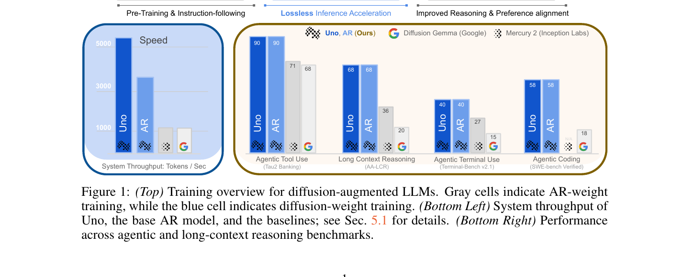
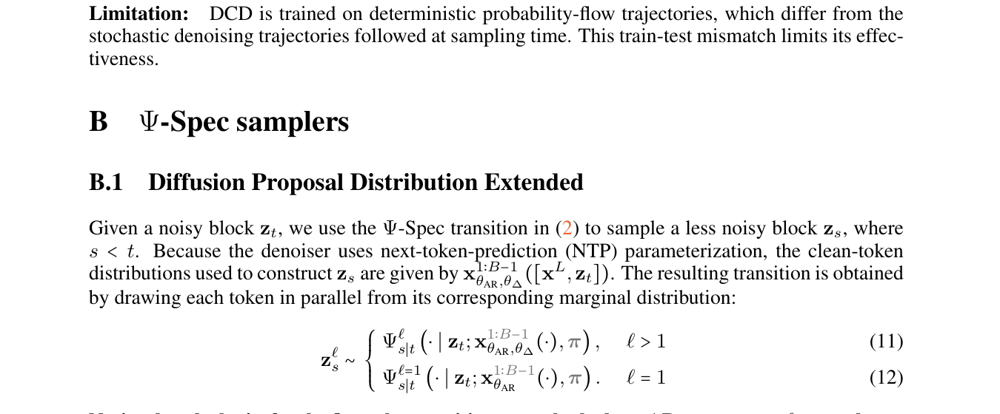
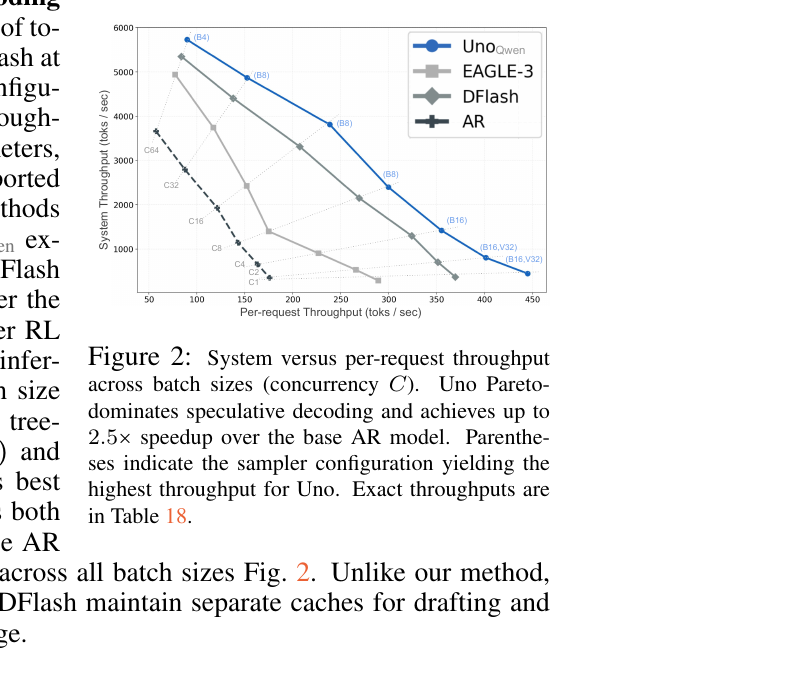

# Uno: Unlocking Lossless Speedups in LLMs via Discrete Diffusion

- **arXiv**: [2609.04010v1](https://arxiv.org/abs/2609.04010)（2026-09-03，38 页）
- **机构**: Institute of Foundation Models（MBZUAI）· UIUC · Cornell Tech · Harvard · **Cerebras Systems**
- **作者**: Subham Sekhar Sahoo（通讯）等 17 人，4 位 core contributor
- **项目页**: [s-sahoo.com/uno](https://s-sahoo.com/uno)（"We release code and checkpoints"）

---

## 1. 一句话定位

**把扩散当成"自己给自己写草稿"的工具：在同一个网络里加一组轻量 diffusion LoRA 权重并行出 B 个 token，再用没被改动过的 AR 权重做标准 speculative decoding 的验收 —— 不需要独立的 draft model，输出分布与原 AR 模型完全一致。**

三个词概括它与邻居的差别：

| | 要不要独立 draft 模型 | 改不改 base 权重 | KV cache | lossless？ |
|---|---|---|---|---|
| **Uno** | **不要**（同网络的 LoRA） | **不改**（θ_AR 冻结） | **1 份** | ✅ 靠拒绝采样保证 |
| 标准 speculative decoding | 要（一个小 AR 模型） | 不改 | 2 份 | ✅ |
| EAGLE-3 | 要（0.40B AR drafter） | 不改 | 2 份 | ✅ |
| DFlash | 要（1.05B diffusion drafter） | 不改 | 2 份 | ✅ |
| TiDAR / self-spec | 不要 | **改** | 1 份 | ❌ |
| LLaDA / Dream 这类 d-LLM | —（它本身就是扩散模型） | — | — | ❌ 牺牲质量 |

📌 **「lossless」是强意义的，这一点要先说清楚，否则容易误读**：它不是"质量接近"，而是**精确保持 AR 模型的采样分布**，靠的是 Leviathan et al. (2023) 那套标准的拒绝采样验收步骤 —— 与 speculative decoding 同一类保证。论文原话：*"Because θ_AR remains frozen and only the diffusion LoRA adapters are trained, **the base AR model provides an unchanged verifier** and enables lossless speculative speedups."*

⚠️ **但「provably preserves」这个词用得比论文的内容重**：全文 **没有任何 Theorem / Proposition / Lemma / Proof**（我 grep 过全部 38 页），"provably" 只出现一次，而证明是靠引用别人的推论来消化的。**保证本身是可信的（就是 speculative decoding 的保证），但它是被继承的，不是本文证明的。**

🔴 **而加速比的宣传严重超出了它自己的数据**（详见 [§5](#5-加速比宣传与实测的落差)）：摘要说 **"up to 3× speedups … including at the largest batch size supported by the device"**，而

- **Figure 2 自己的 caption 写的是 "up to 2.5×"**；
- **正文 §5.1.3 写的是"batch 1 时约 2.2×、batch 64 时 1.5×"**；
- 紧接着三行之后的 **Takeaway 1 框里又写 "over 2× higher throughput across all batch sizes"** —— 与它上面那句的 1.5× 直接矛盾。

> **Fig 1 三部分**：
> **(上)** 三段式训练流水线 —— 灰色 `NTP Training`（预训练+指令微调）→ **蓝色 `Diffusion Distillation`**（标着 `DROP-IN PHASE`，副标题 "**Lossless** Inference Acceleration"）→ 灰色 `RL Post-training`。**"drop-in" 是它的核心卖点：这一段插在现有流水线中间，不动前后两段。**
> **(左下)** 系统吞吐柱状图：Uno ≈5255 > AR ≈3577 > Mercury 2 ≈1200 > DiffusionGemma ≈1100。
> **(右下)** 四组 benchmark 柱状图，每组四根：Uno / AR / Mercury 2 / DiffusionGemma。
>
> ⚠️ **这张门面图有三处问题**：① **SWE-bench Verified 那一簇画的是 58，而 Table 1 写的是 68.4**（差 10.4 分）；② 标着 "Tau2 Banking" 的那一簇（90/90/71/68）其实是 **τ² Telecom** 的数字，Table 1 里没有 τ²-Banking 行；③ **左下速度面板漏掉了 Nemotron-Labs-Diffusion（2794 tok/s）** —— Table 7 里第二快的系统，却只画了最慢的两个。
>
> 📌 **另外右下面板把 AR 和 Uno 画成完全等高**，作为 lossless 的视觉证据 —— **但那些 AR 精度数字不出现在论文的任何一张表里**（见 [§3](#3-lossless-到底被验证到什么程度)）。

---

## 2. 方法

### 2.1 一个网络，两组权重

每一层同时挂着 **AR 权重 θ_AR**（完整的 base 模型，**全程冻结**）和 **diffusion 权重 θ_Δ**（挂在每个投影矩阵上的 LoRA）。

- **起草通路**：`θ_AR + θ_Δ`
- **验收通路**：`θ_AR` 单独

两条通路在**同一次前向**里分开，靠的是 **gated LoRA**（Samragh et al. 2025）—— 在 clean token 位置关掉 adapter，在 noisy token 位置打开。**于是只需要一份 KV cache**（EAGLE-3 / DFlash 都要两份），这是它显存优势的来源。

📌 **一个与常规 d-LLM 不同的关键参数化**：它保留 **NTP（next-token prediction）参数化** —— 每个位置的 logits 预测的是**下一个** clean token，而不是像 LLaDA / MDLM / SEDD 那样预测**当前位置**的 clean token。这让 diffusion 通路与 AR 通路的输出语义对齐，才可能直接拿 AR 权重去验收。

**参数量**：Uno_Qwen 的 adapter 是 **0.35B**（r=128, α=256，挂在所有投影上），少于 EAGLE-3 的 0.40B 和 DFlash 的 1.05B。

### 2.2 训练：Diffusion Distillation

$$
\mathcal{L}(\theta_\Delta;\theta_{AR},\alpha,\beta) = \mathbb{E}\big[\alpha\,\mathcal{L}_{\mathrm{DCD}} + \beta\,\mathcal{L}_{\mathrm{TV}}\big]
$$

两项都是**在同一次融合前向里**算的：把 `[x, z_1]`（干净序列 + 一整块随机 token）拼起来走 block-causal mask，teacher（θ_AR）的 logits 从 `x` 那半边取，student（θ_AR+θ_Δ）的从 `z_1` 那半边取，用 gated LoRA 分开。

- **`L_DCD`** = 分块的一步 Discrete Consistency Distillation，逐位置的 KL；
- **`L_TV`** = 逐位置的 L1 距离，*"following Corollary 3.6 of Leviathan et al. (2023)"* —— 因为 speculative decoding 的接受率由 TV 距离控制，所以直接优化 TV 就是直接优化接受率。**这一步是整个方法里最漂亮的设计。**

⚠️ **但消融显示 DCD 那一项基本没用**：Uno_Qwen 的默认配置是 **α = 0**（纯 TV），而 Table 12 里 `0.01·KL + TV` 拿到 2.40、纯 TV 拿到 2.39 —— **论文花了大篇幅论证 DCD 适合这个任务，最后自己把它关掉了，它最多值 +0.01 TPF。**

### 2.3 采样：Ψ-Spec

> **算法读法**：① 采一整块 B−1 个随机 token 作为占位；② **一次前向**同时得到 `q0`（θ_AR 单独给的第一个位置）与 `q`（θ_AR+θ_Δ 并行给的后 B−1 个位置）；③ 从 `q0` 采出一个 clean token（**这个是白送的，永远被接受**）；④ 从 `q` 并行采 B−1 个草稿；⑤ **用 θ_AR 单独跑一次验收前向**得到 `p`；⑥ 标准拒绝采样：`n = min{i : r_i > min(1, p_i/q_i)}`，被拒的位置从 `Norm([p_n − q_n]_+)` 重采。

**每轮两次前向**（起草 + 验收），所以 **TPF（每次前向接受的 token 数）的上界是 `(B+1)/2`**，下界是 1。

📌 **两个 sampler**：**Linear**（每位置取一个候选，系统吞吐最优，大 batch 用）与 **Tree**（每位置 top-K + 按 log-prob 剪枝保留 top-V 前缀，单请求延迟最优，Medusa/EAGLE-3 式的树形注意力并行验收）。

⚠️ **一个被论文自己的附录架空的设计**：它花了大力气论证要用 **uniform-state prior（π = 1/K）**而不是 masked prior，理由是"原生支持自我纠错、少步生成、更好的 inference-time scaling"。**但附录 A.4 自己推出：在 (s=0, t=1) 这个一步起草的设定下，masked 与 uniform 两种形式都退化成同一个 `Cat(·; x_θ(z_1))`。** 而**全部实验都是一步起草**。所以 **prior 的选择对论文里任何一个数字都没有影响**，整套 Ψ-sampler / 扩散轨迹的机器在 T=1 时是装饰性的 —— 实际发生的事情就是"对一块随机占位 token 跑一次带 gated LoRA 的前向，然后做 Leviathan 拒绝采样"。**论文没有做 prior 的消融。**

---

## 3. 「lossless」到底被验证到什么程度

**结论：它是"在噪声底之下没被证伪"，而不是"被证明成立"。**

**唯一一张能检验它的表是 Table 10**（Uno_Qwen 一个 epoch，linear sampler B=16，temp=1，10 个种子，95% CI）：

| Benchmark | Qwen3 AR | Uno | 是否完全一致 |
|---|---|---|---|
| GSM8K | 96.0±0.2 | 96.0±0.2 | ✅ |
| MATH500 | 96.2±0.3 | 96.2±0.3 | ✅ |
| AIME-24 | 77.7±3.0 | 77.7±2.8 | ✅（均值） |
| **AIME-25** | 70.7±4.2 | **69.7±3.2** | ❌ −1.0 |
| **AIME-26** | 67.7±3.9 | **67.0±3.3** | ❌ −0.7 |
| **LCBv6** | 50.9±1.2 | **50.1±1.4** | ❌ −0.8 |
| HumanEval / MBPP / GPQA / GPQA-D / IFEval | — | — | ❌ 各差 0.1–0.2 |
| MMLU-Pro | 74.7±0.7 | 74.7±0.7 | ✅ |
| **平均** | **76.6±0.4** | **76.4±0.4** | ❌ **−0.2** |

**12 个 benchmark 里 8 个对不上，平均低 0.2 分。** 这不构成"有损"的证据（偏差都在 CI 内），论文的立场也写得很清楚：*"Following standard practice, we do not report accuracy for lossless methods because **any differences arise from sampling randomness and numerical nondeterminism**."* —— 这个立场是合理的，因为如果分布真的相同，精度差异只能来自采样随机性。

⚠️ **但有三件事值得记**：

1. **噪声底大到足以藏住真实的损失。** 论文自己的 Table 16 就是证据：**DFlash 也是 lossless 方法，它的 AIME-25 在 B=4 时是 60.00、B=16 时是 73.33** —— 同一个目标分布、同一个温度，**13.3 分的摆动纯粹来自采样噪声**。在这个噪声底下，Table 10 的 ±3–5 分 CI 根本区分不开 lossless 与轻微 lossy。**真正能证明的做法是 token 级的输出分布相等性检验（KL / χ²），论文没做。**
2. **从零训练的那个 Uno 完全没有与它的 AR base 做过精度对照。** Table 1 里没有 AR 这一列。Figure 1 画了 AR 与 Uno 相等的柱子，**但那些 AR 数字不出现在任何表里**。正文只说 *"Uno **qualitatively** matches the base AR model"* —— "qualitatively" 这个词承担了全部重量。
3. ⚠️ **temp=0 的情况论文没交代。** Algorithm 1 只写了随机采样版的接受规则。而 Table 3 和整个 Table 17(a) 报的都是 **temp=0** 的结果。**论文自己拿这一点指控过 I-DLM**：*"its sampler performs greedy drafting, but its rejection-sampling verification procedure is not adjusted accordingly. As a result, **the sampler does not preserve the claimed losslessness property**."* —— **同样的问题它自己没有回答。** temp=0 时目标是一个点质量，正确的规则是 exact-match（Stern et al.），而论文在附录 A.3 里明确区分过 exact-match 与 exact sampling 这两种保证。

📌 **另外论文自己给「lossless」加过一次限定，这句写得很诚实**（附录 C.7）：*"This quality difference does not contradict losslessness: enabling thinking changes the chat template and hence **the target-model distribution that the speculative decoder preserves**."* —— **lossless = 保住"你给的那个目标分布"，不等于保住"质量"。**

---

## 4. 速度结果

> **Fig 2**：横轴单请求吞吐、纵轴系统吞吐，七条虚线是等并发线（C1…C64）。**蓝色 Uno 在每一个并发点上都同时高于 EAGLE-3（浅灰方块）、DFlash（深灰菱形）和 AR（深蓝虚线）**，四条曲线不相交。蓝线上标注了每点的最优配置：C64 用 `(B4)`、中段用 `(B8)`、C1 用 `(B16,V32)`。
>
> 📌 **注意 caption 写的是 "achieves up to **2.5×** speedup over the base AR model"** —— 而摘要写的是 3×。

**Table 18 的完整并发扫描**（Uno_Qwen，1K 输入 / 8K 输出，单张 H200）：

| 并发 C | Uno 最优 | AR | **加速比** |
|---|---|---|---|
| 1 | 445 | 176 | **2.53×** |
| 2 | 803 | 352 | 2.28× |
| 4 | 1420 | 653 | 2.17× |
| 8 | 2397 | 1144 | 2.10× |
| 16 | 3814 | 1933 | 1.97× |
| 32 | 4873 | 2796 | 1.74× |
| **64（最大可行）** | **5733** | **3662** | **1.57×** |

📌 **这张表是全文最诚实的一张，而且论文主动做了正确的事**：它在 §1 里专门批评了同行"加速比在大 batch 下消失"的问题，说 *"practical acceleration should be evaluated at realistic batch sizes"*，然后真的把 C=1…64 全扫了一遍并公布。**这个方法论态度值得肯定。**

⚠️ **但结论与它自己的宣传相反**：加速比**单调衰减**，在真正决定服务成本的最大 batch 上只有 **1.57×**（从零训练的那个 Uno 在 Table 7 里是 5255/3577 = **1.47×**）。

⚠️ **而且相对真正强的 baseline，优势很薄**：C=64 时 Uno 5733 vs **DFlash 5351 = 1.07×**；C=32 时 4873 vs 4407 = 1.11×。Table 2 里 τ 的大比分（3.89 vs 2.07）**不会传导到吞吐**，因为 **Uno 的起草是一次完整的 8B 前向，而 DFlash/EAGLE-3 用的是小得多的独立 drafter**。📌 **论文对这个指标陷阱是诚实的**：*"this metric does not account for differences in drafter size and can therefore be misleading, particularly because the baseline drafters are smaller than ours."*

⚠️ **一个反向的读数**：**单请求吞吐（batch 1）上 Uno 是输的** —— Table 7 里 Uno 383 vs DiffusionGemma **836**（2.18×）、Mercury 2 **769**（2.01×）。论文用一句 *"DiffusionGemma is faster at batch size 1 but has substantially lower accuracy"* 带过，**而 Figure 1 的速度面板只画系统吞吐、不画单请求吞吐**。

---

## 5. 加速比宣传与实测的落差

🔴 **同一篇论文里，同一个量有四个不同的说法**：

| 出处 | 说法 | 核对 |
|---|---|---|
| **摘要** | "delivers **up to 3×** speedups over the base AR model, **including at the largest batch size** supported by the device" | 🔴 **3× 在全文任何一处测量里都不存在**；而"包括最大 batch"与 1.57× 直接矛盾 |
| **Conclusion §7** | "up to a **3×** speedup … while retaining **up to a 2×** speedup at the largest batch size" | 🔴 两半都不成立（最大 batch 是 1.47× / 1.57×） |
| **Contribution 4（§1）** | "up to a **2×** speedup at the largest batch size" | 🔴 实测 1.47× / 1.57× |
| **Figure 2 caption** | "up to **2.5×**" | ✅ 与 Table 18 的 2.53× 吻合 |
| **正文 §5.1.3** | "batch 64 时 **1.5× faster**…batch 1 时约 **2.2× faster**" | ✅ 与 Table 7 吻合（383/176=2.18、5255/3577=1.47） |
| **Takeaway 1 框（§5.1.3，紧接上一行之后）** | "delivering **over 2× higher throughput across all batch sizes**" | 🔴 **与它正上方三行的 1.5× 直接矛盾** |

📌 **最讽刺的一点**：论文在 §1 花了整整一段论证"只报 batch-size-1 的加速比是误导的、必须在现实 batch 下评测"，**然后把一个在任何 batch 下都不存在的 3× 写进了摘要。**

**另外两个被 Takeaway 框写错的**：

- 🔴 **Takeaway 2："Uno outperforms open-weight d-LLMs on every benchmark"** —— **Table 1 的 AA-Omniscience 上 Uno 14.3，输给 Mercury 2 的 20 和 DiffusionGemma 的 17.7。**
- 🔴 **Avg. TPF 那一行：Uno 1.9/2.7 vs DiffusionGemma 17.56、Nemotron-Labs-Diffusion 5.41** —— 在 d-LLM 文献最常报的这个指标上 Uno 差了 **6.5×**（这本身不是缺陷，因为 TPF 高的那些是 lossy 的；但 DiffusionGemma 的 17.56 是该列最高却没被加粗）。

---

## 6. 争议与权衡

### 6.1 吞吐测量的两个公平性问题

🔴 **① AR baseline 跑在 Nano-vLLM 上，不是生产级推理栈。** 论文明说 *"All experiments reported in this paper were conducted using our **Nano-vLLM** implementation"*（一个"from scratch 的轻量 vLLM 复刻"）。**全文不出现 CUDA graphs、torch.compile、FlashAttention/FlashInfer、paged attention、chunked prefill、continuous batching、tensor parallelism 中的任何一个词。** 而手写的 AR 解码循环正是 per-step Python / kernel launch 开销最大的地方 —— **这种开销会被"一次前向出多个 token"摊薄，于是系统性地放大所有 speculative 方法的相对加速比。** 论文引用了 TensorRT-LLM 的 benchmark 规范来说明自己的方法论，却没有用 TensorRT-LLM / vLLM / SGLang 中的任何一个来测量。**这是全文最大的未回应的公平性问题。**

⚠️ **② 吞吐是半合成的，不是端到端的。** 原话：*"we first measure the average number of accepted tokens per forward pass (TPF)… We then run ⌈n/TPF⌉ decoding steps, **constraining each method to accept TPF tokens per step on average**."* —— **接受数被按均值强制施加，而不是每步真实采样。** 在 batch > 1 时这是实质性的乐观简化：真实的批量 speculative decoding 里，一个 batch 内各序列每步接受的 token 数不同，批次推进速度由接受数的**分布**和调度器的重打包能力决定，而不是均值。**方差导致的参差批次停顿、重打包、cache 碎片全部被构造性地消掉了 —— 而 AR baseline 本来就没有这种方差，所以拿不到这份好处。** 论文没有讨论这一点。

### 6.2 训练成本的记账不对称

- **Uno 的扩散阶段**：60 小时 × 8 节点 × 8 GPU = **约 3,840 H200-GPU-hours**，7B token。**Uno_Qwen**：32 小时 × 32 GPU = **约 1,024 H200-GPU-hours**，14.7B token。
- 摘要称这是 *"**negligible overhead** to existing LLM training pipelines"*，§7 说 *"orders of magnitude fewer tokens than the AR weights"*（7B vs 23T ≈ 3,300×，token 口径成立）。
- ⚠️ **但分母从未给出** —— 那个 23T token 的 AR 预训练用了多少 GPU-hours、什么卡、多少节点，**一个字都没有**。所以"negligible"无法核验。
- ⚠️ **而 baseline 的训练成本完全没测**：只有一句结构性论证（*"DFlash requires a training context length of B·L, whereas our method always uses 2·L… This makes DFlash significantly more expensive to train"*），**没有小时数、没有 token 数、没有卡数**，而自己的 14.7B token 倒是披露了。

### 6.3 其它

- ⚠️ **"8B" 名不副实**：论文自己的架构段写 **6.95B 主体 + 约 2.05B 未绑定词表矩阵 ≈ 9.0B**，而摘要的对比句是"our **8B** Uno model outperforms … the **26B** DiffusionGemma"。
- ⚠️ **Figure 1 有两处硬错**：① SWE-bench Verified 那一簇画的是 **58**，而 Table 1 写的是 **68.4**（差 10.4）；② 标着 "Tau2 Banking" 的那一簇数字（90/90/71/68）其实是 Table 1 的 **τ² Telecom** 行 —— Table 1 里根本没有 τ²-Banking 这一行（它有的是 τ³-Banking，25.8/9）。
- ⚠️ **Figure 1 的速度面板漏掉了 Nemotron-Labs-Diffusion（2794 tok/s）** —— Table 7 里第二快的系统，却只画了最慢的两个（1197、1136），视觉上把领先幅度放大了约一倍。
- ⚠️ **无 Limitations 章节。** 全文唯一一处 "Limitation" 是在说**别人的** DCD 的局限。
- ⚠️ **Table 1、2、3、6、7、8 等大多数表没有误差棒、没有种子数**。只有 Table 10（10 seeds）、Table 9（±，种子数未说）、Table 18（3 次重复取中位数）有。
- ⚠️ **Table 6 自己给出的最大吞吐（5190 / 379）与 Table 1、7 印的（5255 / 405、5255 / 383）对不上**，而 Table 6 的 caption 明说它报的就是各配置里的最优。**405 这个数字在别处找不到出处。**
- ⚠️ **Medusa 和 vanilla speculative decoding 从未作为 baseline 跑过**。对 Medusa 的处理是一句传递性推断：*"Li et al. (2026b) showed that speculative decoding with a separately trained draft model is faster than these approaches. We further show that Uno outperforms speculative decoding methods and, **consequently**, these MTP methods."*
- ⚠️ **§4.3 宣传的 inference-time scaling（T > B 的多步去噪）零实验** —— *"We leave a systematic exploration of this quality-compute tradeoff to future work."* 而它是 Contribution 2 的一半。
- ⚠️ **自引用未披露**：90 篇参考里 **9 篇（10%）有一作 Sahoo**，其中**两个承重组件都是他自己的前作** —— DCD 来自 Sahoo et al. 2025a（The Diffusion Duality），而**本文核心贡献命名所本的 Ψ-sampler 来自 Deschenaux, Gulcehre & Sahoo 2026**。两处都用第三人称引用，不标注自引。📌 **这不违规，但它意味着本文真正的新意是"组合"（LoRA + gated LoRA + 冻结验收器），而不是组件本身** —— 而"组合"恰恰是它相对自己前作 Eso-LM/TiDAR 那条线最干净的增量：**把 AR 权重冻住、把所有适配限制在 LoRA 里，就把一个有损的 AR↔diffusion 混合体变成了无损的起草器。**

---

## 7. 一句话总结

**Uno 用一组挂在冻结 AR 模型上的轻量 diffusion LoRA（0.35B）并行起草 B 个 token，再用没被动过的 AR 权重做标准拒绝采样验收 —— 不需要独立 draft model、只需要一份 KV cache，因此输出分布与原模型精确一致（lossless 是 speculative decoding 那一类的强保证，不是"质量接近"）；训练上把 TV 距离直接当损失（因为接受率由 TV 控制）是最漂亮的一笔，显存也确实赢（118–122 GiB vs 129–130）。** ⚠️ **但摘要的「up to 3×，包括最大 batch」在全文任何测量里都不存在** —— Figure 2 的 caption 是 2.5×、正文是"batch 1 约 2.2× / batch 64 是 1.5×"、Takeaway 1 框又写"所有 batch 都超过 2×"（与它正上方三行矛盾）；**加速比随并发单调衰减 2.53× → 1.57×，相对 DFlash 在最大 batch 上只剩 1.07×**；**AR baseline 跑在手写的 Nano-vLLM 上且全文不提任何 kernel/编译优化**，吞吐又是按平均接受数强制施加的半合成测量；**Takeaway 2「每个 benchmark 都赢」被自家 Table 1 的 AA-Omniscience 证伪**；lossless 只被验到"在噪声底之下没被证伪"（12 个 benchmark 里 8 个对不上、平均低 0.2），而 temp=0 的接受规则从未交代 —— **这恰恰是它指控 I-DLM 的那一条**；uniform prior 的整套论证在一步起草下被自家附录证明与 masked prior 等价，因而对任何数字都无影响。

---

## 8. 在仓库图谱里的位置

| | 关系 |
|---|---|
| [tdm](../tdm/analysis.md) / [tdm_r1](../tdm_r1/analysis.md) | 同为少步/加速方向，但那边是**扩散图像模型的步数蒸馏**，这边是**用扩散给 AR 语言模型当起草器** —— 方向相反：TDM 把多步压成少步，Uno 把扩散塞进 AR 当并行提案 |
| [teacache](../teacache/analysis.md) / [mrflow](../mrflow/analysis.md) | 同为推理加速，但走的是缓存复用 / 多分辨率，**都不保证输出一致**；Uno 这类"带验收的加速"是**唯一一类有精确保证的** |
| [pdd](../../video_generation/pdd/analysis.md) | Parallel Decoding Distillation，同样是"并行出多个 token/patch 再蒸馏"，但没有验收步骤 |
| [llada_image](../../image_generation/llada_image/analysis.md) | LLaDA 那条离散扩散线在图像侧的实例。**本文引用了 LLaDA 但把它归为 lossy 的 d-LLM** |
| [sensenova_u15](../../multimodal/sensenova_u15/analysis.md) | 同期的统一模型。📌 **有意思的对照**：那篇用 **on-policy distillation 把四个 RL 专家合并进一个模型**（velocity MSE + stop-grad），本文用 **distillation 训一个并行起草头**（TV + KL）—— **两边都是"蒸馏出一个更便宜的执行体"，但一个蒸能力、一个蒸速度** |

📌 **这篇填的是仓库里一块真空**：`inference_acceleration/` 之前四篇全是**扩散侧**的加速（TDM / TDM-R1 / TeaCache / MRFlow），**没有一篇是 LLM 解码侧的**。Uno 把 speculative decoding 这条线接了进来，而且接的方式恰好与扩散有关 —— **它是仓库里第一篇"离散扩散被当成工具而不是被当成生成范式"的论文。**

⚠️ **一个仓库还缺的对照**：本文的 baseline **EAGLE-3 和 DFlash 都没有笔记**，而它们是这条线上最直接的竞争者。**要判断 Uno 的 1.07× 优势值不值，需要先读那两篇。**
