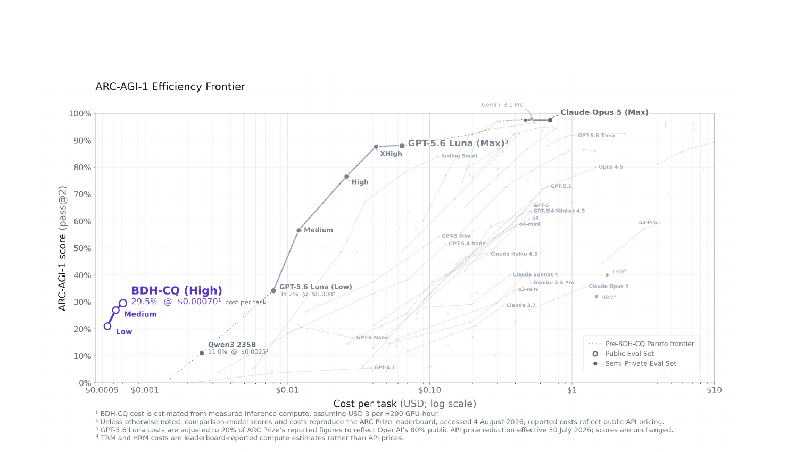
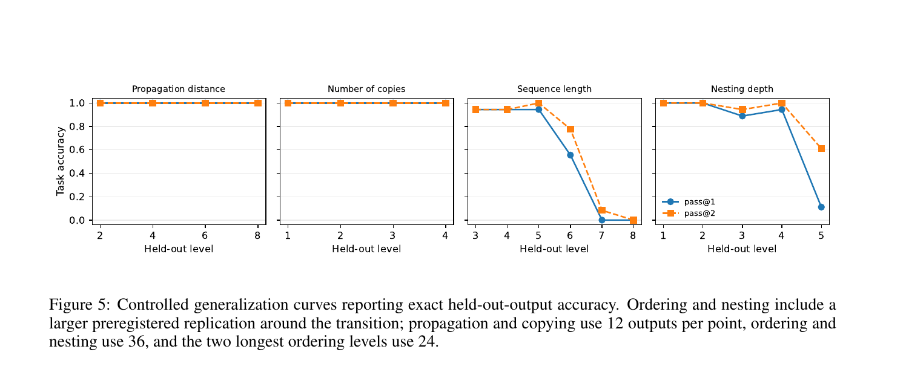

# BDH-CQ: In-Context Learning with Recurrent Latent Reasoning

**论文**: BDH-CQ: In-Context Learning with Recurrent Latent Reasoning
**作者**: Björn Engdahl, Adrian Kosowski, Jan Chorowski, Zuzanna Stamirowska, Przemysław Uznański, Junlin Jiang, Rohan Phadke, Remigiusz Kinas, Richard Zhong
**机构**: Pathway (pathway.com/research) + Bielik AI + New York University
**时间**: 2026-08-10

---

## 1. 一句话定位

把 **in-context learning**（演示逐步更新循环记忆 `S_t`）与 **recurrent latent reasoning**（在连续 workspace `H_r` 上迭代计算而非 token-by-token 输出中间步）组合成同一 150M 参数系统（BDH-CQ），在 ARC-AGI-1 公开评测上以 **$0.00070/task 达到 29.5% pass@2**，打破此前所有已报告系统的 cost-accuracy Pareto 前沿。

---

## 2. 要解决的问题（动机）

两个已有能力各自有缺陷：

| 能力 | 代表系统 | 局限 |
|------|---------|------|
| **In-context learning (CoT/LLM)** | GPT-5.6 Luna、Gemini 3.1 Pro | 中间状态必须 verbalize（token 消耗 + 延迟 + 串行），且 inference 时 context 随 demonstration 数线性增长 |
| **Latent/recurrent reasoning** | HRM、TRM、Looped Transformers | 推理在 latent 空间迭代，但任务信息来自优化（backward pass）或任务 ID，而**不是**来自 inference 时的 demonstration ——无法对未见变换做 in-context 泛化 |

BDH-CQ 的目标：demonstration 在 inference 时更新 **recurrent memory S**，query 再在这个已绑定任务的 S 上进行 **latent iterative computation**——不需要 verbalization，不需要任务特定优化，不需要任务 ID。

---

## 3. 与前作的关系

```
ARC 解法谱系
│
├── Task-specific optimizers（用 backward pass 绑定任务）
│   ├── HRM/TRM — 演示对 embedding 做梯度更新，在 latent 空间递归，$1.48/$1.76/task
│   └── 其它 ARC transductive solvers — 测试时优化、augmentation voting
│
├── LLM + CoT（serial token reasoning）
│   ├── GPT-5.6 Luna, Gemini 3.1 Pro — 最高 ~90%+ pass@2，$0.008–$10/task
│   └── Abstract-CoT (Ramji et al. 2026) — compressed autoregressive tokens，10×+ 少
│
├── Latent reasoning（不 verbalize，但无 in-context 绑定）
│   ├── Coconut (Hao et al. 2024) — Transformer 最终 hidden state 喂回输入，continuous-thought
│   ├── Looped Transformers (Saunshi et al. 2025; Zhu et al. 2026) — 共享权重迭代块
│   └── Recurrent depth models (Geiping et al. 2025) — 一个块反复应用
│
└── **BDH-CQ** (本篇)
    ├── 上游架构：BDH (Dragon Hatchling, Kosowski et al. 2025, arXiv:2509.26507)
    │           "post-Transformer sequence model: high-dim positive activations,
    │            low-rank communication, recurrent associative state"
    ├── BDH-CQ 新增：
    │   ├── recurrent memory S_t — in-context 绑定（如 fast weights）
    │   └── latent workspace H_r — per-query 迭代推理（如 recurrent depth）
    └── 特点：inference 时无 backward pass，无 task ID，无 verbalization
```

BDH-CQ 与 HRM/TRM 的关键差异：HRM/TRM 需要 backward pass 把 demonstration 信息写进模型（测试时优化），BDH-CQ 在 forward pass 内完成同样的操作，因此不需要对每个新任务重新优化。代价是绑定能力（从 demonstration 中归纳变换规则的精度）弱于专门优化过的方案。

---

## 4. 核心方法

### 4.1 两层状态空间

系统有两个功能不同的状态：

**S_t（记忆，Contextual Memory）**

$$
S_t = U_\theta(S_{t-1},\, D_t), \quad t = 1,\ldots,K
$$

- `D_t`：第 t 个 demonstration（输入-输出对）的内容
- `θ` 固定（inference 时无参数更新）
- 顺序处理每个 demonstration，后续演示可以利用更早演示积累的关联
- 类比：linear attention 的 KV 矩阵、fast weights、in-context 关联记忆

**H_r（推理 Workspace）**

$$
H_0 = E_\theta(x^*, S_K), \quad H_{r+1} = F_\theta(H_r, S_K), \quad \hat{y} = G_\theta(H_R)
$$

- 在所有 K 个 demonstration 处理完后才开始
- 以 query `x*` 和最终记忆 `S_K` 初始化
- 迭代 R 步在高维连续空间中精化推理
- 最终一步 decode 输出网格 `ŷ`，中间步骤**从不 verbalize**
- 类比：recurrent depth、looped transformer

两者角色分工：`S_t` 负责"学会这个任务要做什么"（从 demonstration 归纳），`H_r` 负责"把这个任务执行到 query 上"（计算）。

### 4.2 BDH 层（基础架构）

BDH（Dragon Hatchling）层的核心特征（来自 Kosowski et al. 2025）：
- **高维正激活**（ReLU-low-rank 变换）
- **低秩通信**（low-rank projection 用于信息传递）
- **循环关联状态**（recurrent associative state，类 linear attention 的联想记忆）
- GPU 友好：大 neuron / feature 空间内的线性 attention

📌 论文声明"Dimensions, exact update rules, and implementation details remain proprietary."—— 只知道大体原理，不知道具体实现。

### 4.3 训练数据混合

150M 参数模型在以下混合数据上训练（训练 recipe 保密）：

| 数据集 | 类型 |
|--------|------|
| ARC-AGI-1 training set (Chollet 2019) | 公开 ARC 训练集 |
| RE-ARC (Hodel 2024) | ARC 过程式生成扩展 |
| ConceptARC (Moskvichev et al. 2023) | 概念组织的 ARC 变体 |
| ARC-Heavy (Li et al. 2025) | 更难的 ARC 样本 |
| ARC-GEN100K (Moffitt 2025) | 大规模生成 ARC 数据 |
| 额外增广 | 未披露 |

⚠️ ConceptARC 在训练混合中——第 6 节对 ConceptARC 的行为分析因此不是完全 OOD 评测。

### 4.4 推理与候选生成

- 模型生成最多 **2 个候选答案**（pass@2 convention），任一正确即计分
- 有 3 个 **reasoning effort levels**（LOW / MEDIUM / HIGH），训练时已暴露，推理时可选
- 完全确定性：相同输入字节级完全重现（两次运行 419/419 完全匹配）

---

## 5. 关键实验结果

### 5.1 ARC-AGI-1 成本-精度 Pareto 前沿



> **Fig 2 解读**：横轴（对数尺度）为每 task 计算成本（USD），纵轴为 ARC-AGI-1 pass@2 分数。灰色点为公开评测集结果，黑色点为 semi-private 评测集。虚线为 BDH-CQ 之前的 Pareto 前沿（所有系统的上包络）。
>
> BDH-CQ (High) 标注为左侧蓝色圆圈（$0.00070，29.5%）。这个点**穿越了原有的虚线 Pareto 前沿**：在其价位上，所有此前已报告系统都达不到 29.5%；在 29.5% 分数线上，所有此前系统成本都更高。
>
> BDH-CQ 三个 effort 点（Low/Medium/High）形成一条从左下到右上的路径（$0.00022→$0.00063→$0.00070，21%→27%→29.5%），表明 effort 可以灵活按需调配。
>
> GPT-5.6 Luna (Low)：34.2% @ $0.008（图中 BDH-CQ 右侧），即 BDH-CQ 在同等精度区间约 11× 更便宜（按调整后 API 价格，BDH-CQ 约 57× 便宜于未调整价格下的 Luna Low）。
>
> 右侧高精度区：Gemini 3.1 Pro（接近 100%）和 Claude Opus 5 (Max) 主导，但成本 $0.1–$10+。HRM 和 TRM 标注为 $1+ 区间，精度约 40%–50% 区间（TRM 较高，HRM 较低）。

| 系统 | pass@2 | 成本/task | 成本口径 |
|------|--------|---------|---------|
| BDH-CQ (High) | **29.5%** | **$0.00070** | 实测 GPU 秒 × $3/H200-hr |
| GPT-5.6 Luna (Low) | 34.2% | $0.008 | ARC Prize 报告价调整 20% |
| Qwen3 235B | 11.0% | $0.0025 | 公开 API 价 |
| HRM | ~38% | ~$1.48 | leaderboard 估算 |
| TRM | ~50%+ | ~$1.76 | leaderboard 估算 |

### 5.2 推理 effort 与成本（Table 5）

| Effort | Pass@2 | 成本（相对 MAX） |
|--------|--------|----------------|
| HIGH | 29.5% | 0%（基准） |
| MEDIUM | 27% | -11% |
| LOW | 21% | -22% |

LOW→MEDIUM：+6pp 准确率，-11% 成本（性价比较好）。MEDIUM→HIGH：+2.5pp，-11% 成本（收益递减）。McNemar test 对 LOW vs STANDARD：p=0.167（**统计上不显著**）——LOW 的 4 个 endpoint 点估计都输但无法排除噪声。

### 5.3 ConceptARC 概念分布（Table 2）

160 任务，16 个概念族，每族 10 任务 30 测试对。strict-task pass@2（3 个测试输入全对才算）：

**最高**（8–9/10）：FilledNotFilled、TopBottom2D、ExtendToBoundary、CleanUp
**最低**（2/10）：Copy、Order

Copy 有一个有趣的解离：test-pair accuracy 19/30（63%），但 strict-task 2/10——对很多单个输入对 copy 变换，但无法稳定地对所有 3 个输入一致应用。这揭示"能输出正确答案"与"能一致应用规则"之间的分离。

语义 ID vs 不透明 ID：95 vs 96 strict tasks，374 vs 374 测试对——**完全无差异**，排除 task ID 语义利用的可能。

### 5.4 受控泛化实验（Fig 5 + Table 3）

冻结模型后用确定性 Python 生成器产生新任务，每族单变量变化：



> **Fig 5 四个子图解读**：蓝色实线为 pass@1（第一候选），橙色虚线为 pass@2（任一候选）。横轴为受控变量的 held-out 等级（训练演示范围内 demonstrations，测试 held-out 超出分布的 query）。
>
> **Propagation distance（传播距离，2–8）**：两条线均持平在 1.0——距离 2–8 全部 48/48 完美，无任何衰减，演示完全决定传播方向和范围，模型无限外推。
>
> **Number of copies（复制份数，1–4）**：同样完美，1.0 全程——将颜色图案复制到多个锚点，task-specific 颜色映射完全由上下文绑定，份数增加不影响精度。
>
> **Sequence length（排序序列长度，3–8）**：在长度 5–6 处急剧断崖：5 约 0.8，6 约 0.2，7–8 接近 0.0。注意 pass@1 和 pass@2 在断崖处基本重合（第二候选也答不对）。失败特征：输出有正确尺寸但 cell 值错误——是输出构造失败（execution capacity），而非规则归纳失败。
>
> **Nesting depth（嵌套深度，1–5）**：深度 1–4 保持接近 1.0，在深度 5 降到约 0.1（pass@1）/0.6（pass@2），pass@2 比 pass@1 明显更高说明系统知道答案在"正确方向"但需要第二次尝试。

**Table 3 关键对照**（同一 24 个 held-out 输入，两种上下文）：

| 任务族 | 上下文类型 | Output p@1 | Output p@2 |
|--------|----------|-----------|-----------|
| Ordering (length 8) | Short（演示止于 length 4） | 0/24 | 0/24 |
| Ordering (length 8) | Supported（一个 length-8 演示） | 12/24 | 13/24 |
| Nesting (depth 5) | Short（演示止于 depth 3） | 15/24 | 19/24 |
| Nesting (depth 5) | Supported（一个 depth-5 演示） | 16/24 | **24/24** |

📌 **这是全文最重要的一组数字**：
- **Nesting 断崖 = 外推失败，不是执行失败**：Supported 上下文完全消除断崖（24/24），说明当 depth-5 的结构出现在演示中，模型能完美执行——纯粹是它无法从 depth-4 以内的演示外推到 depth-5 关系。
- **Ordering 断崖 = 部分是执行失败**：Supported 上下文只恢复 13/24，仍有一半错误——即便展示了 length-8 的例子，模型也无法可靠生成 length-8 的有序序列（output construction bottleneck）。

### 5.5 合成操作的组合（Table 4）

3×3 motif 家族，72 输出/条件：

| 操作 | 单独 | + Relocation |
|------|------|-------------|
| Relocation | 72/72 | — |
| Rotation | 72/72 | **72/72（完美组合）** |
| Reflection | 72/72 | 47/72（颜色布局依赖） |
| Color swap | 26/72（只在固定布局家族获得） | **0/72（从不组合）** |

Color swap 尤其显著：模型在固定颜色布局的原始家族里学会了它，但完全无法与 relocation 组合（0/72）。两次 shuffled 家族各 1/24，说明 Color swap 的"学会"完全依赖固定颜色布局的归纳捷径，而非真正学到颜色交换规则。Rotation 的完美组合（72/72）表明几何变换被学成可组合的操作符，而 color 操作不是。

---

## 6. 独立评测与可重复性

- Bielik AI + NYU 联合进行了**黑盒审计**（无访问模型权重），在文档化协议下重现了 29.5% pass@2。
- 审计报告额外在 ConceptARC 和一个手工构造评测集上测试（Remigiusz Kinas 2026；Richard Zhong 2026）。
- 独立评测**只验证了输出分数，没有验证训练数据组成或内部机制**。

---

## 7. 争议与权衡

| 维度 | 现状 |
|------|------|
| **大量技术细节保密** | "Dimensions, exact update rules, and implementation details remain proprietary." 无代码，训练配方保密，S_t 的具体更新规则、H_r 的具体迭代机制均未披露——只知道顶层设计，无法复现 |
| **ConceptARC 训练污染** | ConceptARC 在训练混合中，所以 §6.1 的 ConceptARC 行为分析部分是 in-distribution；受控生成实验（§6.2-6.5）更干净，但任务是 GPT-5.6 从 prompt 生成的，机制标签 82.9% 准确率且有重叠，24% 需去重 |
| **成本口径不统一** | BDH-CQ 成本 = 实测 GPU 秒 × $3/H200-hour；大多数对比系统用 API 标价；GPT-5.6 Luna 被调整为原报价的 20%（反映 OpenAI 80% 降价）。所有调整明确说明，但跨系统比较仍需注意口径差异 |
| **Effort level 统计不显著** | LOW vs STANDARD 的 McNemar test p=0.167，无法排除噪声；文章诚实报告了这一点 |
| **pass@2 在 opaque ConceptARC 中退化** | opaque 执行中 75/480 单候选记录已在 rank 1 正确，pass@2 在这些记录上实际等于 pass@1 |
| **排序执行瓶颈** | length-8 排序在 supported 上下文下仍只 13/24——算法上无法解决，且外推 + 执行双重失败在更难 ARC-AGI-2 任务上会更突出 |
| **绝对分数较低** | 29.5% 在整个排行榜中属中下游（Claude Opus 5 Max ~99%+，GPT-5.6 Luna Max ~85%），Pareto 优势仅在极低成本区间 |

---

## 8. 一句话总结

BDH-CQ 是第一个把 inference-time demonstration 绑定（循环记忆 S_t，无 backward pass）和 latent iterative reasoning（workspace H_r，不 verbalize 中间步）结合成单一 forward-pass 系统的实证工作，150M 参数在 ARC-AGI-1 以 $0.00070/task 达到 29.5% pass@2 建立新的 cost-accuracy Pareto 点；受控实验揭示系统的三层边界：传播/复制无上限、嵌套深度是外推失败（上下文覆盖可修复）、排序是执行失败（上下文覆盖不能完全修复），组合能力强依赖操作的表示形式（几何变换可组合，颜色操作不可靠）。

---

## Q&A

