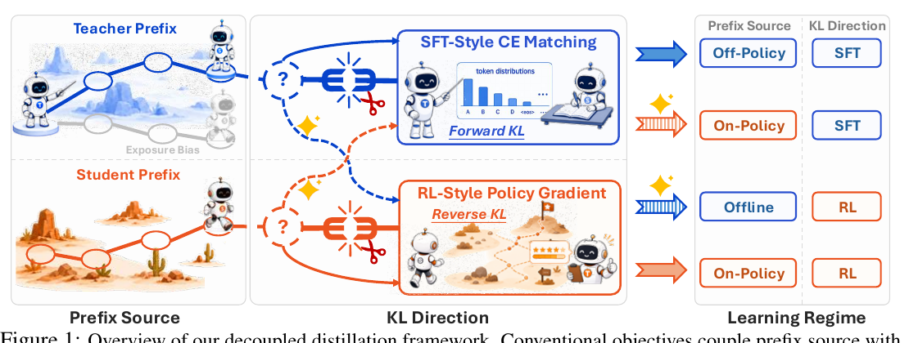

# Decoupling KL and Trajectories: A Unified Perspective for SFT, DAgger, Offline RL, and OPD in LLM Distillation

- **arXiv**: [2605.16826v1](https://arxiv.org/abs/2605.16826)（2026-05-16，23 页）
- **机构**: 宁波东方理工大学 · 香港理工大学 · 上海交通大学 · 香港科技大学（广州）
- **作者**: Anhao Zhao、Haoran Xin、Yingqi Fan、Junlong Tong、Wenjie Li、Xiaoyu Shen（通讯）

---

## 1. 一句话定位

**现有的 off-policy 蒸馏与 on-policy 蒸馏（OPD）其实各自把两个正交的选择捆在了一起 —— 「前缀从谁那来」和「token 级 KL 往哪个方向」。把这两个轴解耦，得到 2×2 四个目标，而且每一个都对应一个早已成熟的训练范式。**

> **Fig 1 三栏**：
> **左「Prefix Source」** —— 上半蓝色是 **Teacher Prefix**（冰原上一条既定路径，标注 **Exposure Bias**），下半橙色是 **Student Prefix**（学生自己在沙漠里走出来的路）。
> **中「KL Direction」** —— 上蓝框 **SFT-Style CE Matching / Forward KL**，下橙框 **RL-Style Policy Gradient / Reverse KL**。
> **右「Learning Regime」** —— 四行组合：(Off-Policy, SFT) / (On-Policy, SFT) / (Offline, RL) / (On-Policy, RL)。

| | **Forward KL**（SFT 式交叉熵） | **Reverse KL**（RL 式策略梯度） |
|---|---|---|
| **Teacher 前缀**（off-policy） | **off-policy SFT** —— 就是在 teacher 轨迹上做 SFT（DeepSeek-R1 / s1 / OpenThinker 那一路） | **offline-RL 式蒸馏** ⬅ **对角线外，没人系统研究过** |
| **Student 前缀**（on-policy） | **DAgger 式 on-policy SFT** ⬅ **对角线外，没人系统研究过** | **OPD**（MiniLLM / Thinking Machines 那一路） |

**论文的原话很干脆**：*"this coupling is **not intrinsic**"* —— 现有实践只用了主对角线上的两格，另外两格 *"are equally well-defined but **have not been systematically studied**"*。

📌 **这篇对本仓库最重要的，是它给 OPD 那一簇补上了一个坐标系。** 之前的笔记（[gkd](../gkd/analysis.md)、[opsa](../opsa/analysis.md)、[opdvr](../opdvr/analysis.md)、[opd_then_rl](../opd_then_rl/analysis.md)）都在讨论"OPD 怎么改"，而这篇先问了一句**"OPD 到底是 2×2 里的哪一格，另外三格长什么样"**。

🔴 **而且它牵出一条归属问题 —— [OPDVR](../opdvr/analysis.md) 的核心改写，这篇早三个月就发表了**（详见 [§3.2](#32-归属opdvr-的核心改写在这篇里已经有了)）。

---

## 2. 解耦的来源：序列级 KL 的自回归分解

teacher 与 student 的回复分布都按自回归分解，记 `s_t = (x, y_<t)` 为第 t 步的前缀（生成状态），`d_t^T` 与 `d_t^S` 分别是 teacher 生成与 student 生成所诱导的前缀分布。把自回归分解代入序列级 KL：

$$
\mathrm{KL}(p_T \Vert q_\theta)(x) = \sum_{t=1}^{L} \mathbb{E}_{s_t \sim d_t^{T}}\Big[\mathrm{KL}\big(p_T(\cdot \mid s_t) \Vert q_\theta(\cdot \mid s_t)\big)\Big]
$$

$$
\mathrm{KL}(q_\theta \Vert p_T)(x) = \sum_{t=1}^{L} \mathbb{E}_{s_t \sim d_t^{S}}\Big[\mathrm{KL}\big(q_\theta(\cdot \mid s_t) \Vert p_T(\cdot \mid s_t)\big)\Big]
$$

📌 **捆绑就是从这里来的**：**forward 序列 KL 自动把「teacher 前缀」和「token 级 forward KL」配成一对；reverse 序列 KL 自动把「student 前缀」和「token 级 reverse KL」配成一对。** 而一旦你在 token 级上直接定义目标，这两个选择就可以自由组合 —— **前缀源决定"在哪里施加监督"，KL 方向决定"怎么比较两个分布"。**

---

## 3. Proposition 1：两个方向各自对应什么

**固定前缀 `s_t`，把 `p_T(·|s_t)` 当作与 θ 无关，`q_θ(·|s_t)` 可微。**

### 3.1 两条恒等式

**(i) Forward KL → SFT 式交叉熵**

$$
\nabla_\theta\, \mathrm{KL}\big(p_T(\cdot \mid s_t) \Vert q_\theta(\cdot \mid s_t)\big) = -\,\mathbb{E}_{y \sim p_T(\cdot \mid s_t)}\big[\nabla_\theta \log q_\theta(y \mid s_t)\big]
$$

**即 forward KL 在梯度上等价于「用 teacher 软标签做交叉熵匹配」，而在 teacher 采样 token 上做 SFT 就是它的蒙特卡洛硬标签形式。**

**(ii) Reverse KL → REINFORCE 式策略梯度**

$$
\nabla_\theta\, \mathrm{KL}\big(q_\theta(\cdot \mid s_t) \Vert p_T(\cdot \mid s_t)\big) = \mathbb{E}_{y \sim q_\theta(\cdot \mid s_t)}\Big[\big(\log q_\theta(y \mid s_t) - \log p_T(y \mid s_t)\big)\,\nabla_\theta \log q_\theta(y \mid s_t)\Big]
$$

论文的原话：

> *"minimizing reverse KL gives a **REINFORCE-style ascent direction with dense reward** `r(s_t, y) = log p_T(y|s_t) − log q_θ(y|s_t)`, treating r as scalar feedback, i.e., **stopping gradients through r**."*

**也就是：**

$$
r(s_t, y) = \log \frac{p_T(y \mid s_t)}{q_\theta(y \mid s_t)}
$$

📌 **四格的学习范式归属由此定下**：前缀源定 policy regime（teacher 前缀 = off-policy，student 前缀 = on-policy），KL 方向定目标形式（forward = SFT，reverse = RL）。

### 3.2 归属：OPDVR 的核心改写，在这篇里已经有了

🔴 **[OPDVR](../opdvr/analysis.md)（arXiv:2608.24696，2026-08）把「sampled-token OPD 的隐式 token reward 是 `log(π_T/π_θ)`」当作它的第一个核心贡献**（*"We first revisit sampled-token OPD from an RLVR perspective and provide a mathematical reformulation of sample-token OPD's reward"*）。

**而本篇（2026-05-16，早三个月）的 Proposition 1(ii) 就是同一个式子**，连 stop-gradient 都明确写了。两者的差别只有一处：本篇写的是**完整 token 级 reverse KL 的期望形式**，OPDVR 用的是**单样本 MC 估计**（sampled-token）—— **后者就是前者的单样本实现，不是不同的结果。**

⚠️ **但要把账算公道，这里有三层**：

1. **这篇自己并没有把这条恒等式当作新结果。** 它的原创性声明写得很克制 —— *"The two off-diagonal objectives … have **not, to our knowledge, been systematically studied**"*，新意在**2×2 解耦与实证研究**，不在梯度恒等式。
2. **它把「OPD 视作 dense-reward on-policy RL」这个视角明确归给了 Thinking Machines 的博客**（*"student-prefix reverse KL yields OPD, viewed as dense-reward on-policy RL **[27]**"*，[27] 就是[那篇博客](../on_policy_distillation/blog_zh.md)），而 reverse-KL 蒸馏的策略梯度推导底子来自 **MiniLLM**（Gu et al., ICLR 2024，本文的 [11]，在 §1 和 §2.2 都被引作 OPD 的源头之一）。
3. 🔴 **OPDVR 真正新的那一步，这篇确实没有**：本篇**全文不出现** "unbounded"、"sign of"、"correctness"、"verifiable"（我逐个 grep 过，全是 0 次）。**「这个 reward 的符号只由谁更自信决定、与轨迹对错无关，因此违反 RLVR 约定」这个观察，以及由它导出的 ReLU 门，是 OPDVR 的。**

📌 **所以准确的表述是**：**OPDVR 的「改写」本身不是新的** —— 本篇早它三个月，而底子可追到 MiniLLM（ICLR 2024）与 Thinking Machines 的博客；**OPDVR 真正新的是「RLVR 对齐」那一步和那个 ReLU 门。**

⚠️ **而 OPDVR 把 OPD 的出处记错了层级**（我核过它的参考文献）：它既没引本篇，也**没引 GKD、没引 MiniLLM、没引 Thinking Machines 博客** —— 它在 §2 把 OPD 归给了**四个用了 OPD 的模型技术报告**（DeepSeek-V4、MiMo-V2-Flash、Qwen3、GLM-5）。**把一个范式的出处记成"谁在用它"而不是"谁提出/形式化了它"，是它那条改写读起来像原创的直接原因。**

---

## 4. 三个 tradeoff（全文的实证主体）

**设置**：teacher 是 **Qwen3-4B / Qwen3-8B**，student 是 **Qwen3-0.6B**，数学推理；评测 **AIME24 / AMC23 / MATH500 / GSM8K** 的 **Avg@k / Pass@k / 平均回复长度**。每个目标都在**两种情形**下考察：① 单独作为蒸馏方法；② 作为后续 RL（GRPO）的初始化。

### 4.1 KL 方向 → 精度与熵的权衡

> **reverse KL 提高 Avg@k，但会锐化学生分布 —— 降多样性、削 Pass@k，并让后续 RL 变得不可靠；forward KL 保住熵，支持更稳的 RL 提升。**

**Table 1（128-token 蒸馏，student 前缀，Qwen3-4B teacher）能一眼看出这个形状**：

| | GSM8K Avg / Pass / Len | MATH500 | AMC23 | AIME24 |
|---|---|---|---|---|
| **Forward** | 62.83 / 77.26 / **1396** | 34.31 / **55.60** / 3876 | 19.00 / 45.00 / 6173 | 0.00 / 0.00 / 7838 |
| **Reverse** | **66.06** / **79.08** / 521 | **42.65** / 55.34 / 2482 | **26.50** / **47.50** / 4464 | **2.67** / **6.67** / 7101 |

📌 **reverse KL 的 Avg@k 全面更高，回复长度却全面更短**（GSM8K 521 vs 1396，差 2.7×）—— 这正是"分布被锐化"的直接读数。而 **Pass@k 在 MATH500 上已经反过来了**（55.34 < 55.60）。

🔴 **而 RL 跟进的结果是全文最重要的一段**（§4.1，原文）：

> *"reverse KL can produce a **stronger pre-RL model**, but its reduced entropy constrains exploration and can lead to accuracy degradation, whereas **forward KL is a more reliable initialization** for continued policy optimization."*

**具体数字**（4096-token 蒸馏 + Qwen3-4B teacher，MATH500 准确率）：

| 初始化 | 进 GRPO 前 | 出 GRPO 后 |
|---|---|---|
| **student-prefix reverse KL（= OPD）** | **≈45%**（最强起点） | 🔴 **掉到 ≈36%** |
| **student-prefix forward KL（= DAgger）** | ≈40%（起点更低） | ✅ **涨到 ≈45%** |

Qwen3-8B teacher 在 128-token 设定下是同样的形状：reverse 起点更高但收在 ≈36%，forward 从 ≈31% 涨到 ≈36%，且全程熵更高。

📌 **一句话：最强的单独蒸馏目标，不一定是最好的 RL 起点。**

### 4.2 前缀源 → 质量与算力的权衡

- **同训练步数下 student 前缀更好**：平均 **Avg@k +1.80、Pass@k +2.11**；4096-token 长程下差距拉大到 **+3.55 / +2.95**。理由就是 on-policy 的老理由 —— 监督施加在学生真正会走到的状态上。
- ⚠️ **但同 FLOPs 下 teacher 前缀可能更划算**：teacher 前缀能**复用离线轨迹和缓存的 teacher logits**，而 student 前缀每步都要在线生成。
- 📌 **一个干净的分工结论**：*"student prefixes improve the quality of the distilled initialization, but **KL direction largely determines downstream RL trainability**."* —— **前缀源管质量，KL 方向管 RL 能不能接着训。**

### 4.3 训练长度 → 精度与稳定性的权衡

- 128 → 4096 token，平均 **Avg@k +2.56、Pass@k +1.88**。
- **但增益分布不均**：forward KL 从长程中获益更多（Avg@k +3.80 vs reverse 的 +1.32）；student 前缀在长程下优势更明显（128 时两种前缀几乎打平）。
- ⚠️ **长程 + reverse KL 会把熵压到接近 0，并造成严重的长度膨胀。**

---

## 5. 两个方法

### 5.1 KL Mixing

$$
\mathcal{L}_\lambda(s_t) = \lambda\,\mathrm{KL}\big(q_\theta(\cdot \mid s_t) \Vert p_T(\cdot \mid s_t)\big) + (1-\lambda)\,\mathrm{KL}\big(p_T(\cdot \mid s_t) \Vert q_\theta(\cdot \mid s_t)\big)
$$

在 student 前缀 + 4096-token + Qwen3-4B 这个"矛盾最尖锐"的设定上测。

📌 **结论是不对称的，而且反直觉**：*"**Surprisingly, the forward-heavy mixture preserves most of the reverse-KL accuracy, and can even match or slightly exceed it**, while increasing entropy and stabilizing length."* 而 reverse-heavy 与均衡的混合虽然比纯 reverse 熵高，**仍然有长度膨胀**。

**→ 长程蒸馏的 KL 混合应该是 forward-heavy 的：reverse KL 提供迁移信号，但 forward KL 必须占足够权重来稳住熵和长度。**

### 5.2 Entropy-Gated Length Curriculum

从短训练长度 `L_0` 起步，**只在留出集上的平均逐 token 预测熵 `H_m ≥ H_min` 时才把训练长度从 `L_m` 提到 `L_{m+1}`**；不满足就停在最后一个稳定长度。

**对照固定 4096-token 训练（Table 3）**：

| teacher | Avg@k | Pass@k | 平均长度 |
|---|---|---|---|
| Qwen3-4B | 36.4 → **40.0**（+3.6） | 48.3 → **54.1**（+5.8） | 8185 → **2688**（**3.0×**） |
| Qwen3-8B | 36.6 → **40.2**（+3.6） | 49.2 → **51.8**（+2.6） | 8190 → **2793**（2.9×） |

✅ **摘要的三个头条数字我逐个核过，全部对得上**（40.0−36.4 = 3.6；54.1−48.3 = 5.8；8185/2688 ≈ 3.0×）。**MATH500 上增益最大 —— 两个 teacher 的 Avg@k 都涨约 14 分，长度从接近生成上限掉到约 1000 token。**

📌 **这是全文最实用的一条**：它同时改善了精度、Pass@k 和成本，**而不是在三者之间做交换** —— 因为它消灭的是"长程 reverse KL 把熵压死"这个纯粹的副作用。

---

## 6. 争议与权衡

- ⚠️ **规模很小，而且只有一个学生。** student 固定是 **Qwen3-0.6B**，teacher 只有 4B / 8B 两个。**能力差距、模型家族、更大的学生全都没扫过。** 0.6B 的学生在 AIME24 上 forward KL 拿 0.00 —— 在这个量级上讨论"推理蒸馏"，很多结论未必能外推。
- ⚠️ **只有数学一个域。** 三个 tradeoff 全部建立在数学推理上，没有代码、没有逻辑、没有通用指令。对照 [opd_then_rl](../opd_then_rl/analysis.md) 特意用了 logic + math 两个 teacher 强弱不同的任务族 —— **本篇缺这个维度，而它的结论恰恰可能对"teacher 在该域有多强"敏感。**
- ⚠️ **RL 跟进的证据是曲线读数，不是表。** §4.1 那段决定性的结论（45%→36% vs 40%→45%）是从 Figure 3 / 5 上读出来的数字，**论文没有给对应的表**。
- ⚠️ **KL mixing 只在一个设定上测过**（student 前缀 + 4096 + Qwen3-4B），而且 **Figure 7 只有曲线、没有表**，`λ` 的具体取值与逐点数字都没给。"forward-heavy 更好"这个结论目前只有一个设定的曲线支撑。
- ⚠️ **entropy-gated curriculum 的两个关键超参没给敏感性分析**：熵阈值 `H_min` 取多少、长度阶梯 `L_0 → L_1 → …` 怎么排。**而这两个恰恰是要复现它必须知道的。**
- ⚠️ **两个对角线外的目标是这篇的卖点，但论文没有为它们单独辩护。** DAgger 式 on-policy SFT 在 RL 跟进上赢了，这是个好结果；但 **teacher-prefix reverse KL（offline-RL 式）在全文里基本没有出彩之处**，它更像是为了把 2×2 填满而存在的一格。
- 📌 **正面：对照设计是干净的。** *"all objectives use matched training steps, optimizer, and hyperparameters"* —— 四个目标同步数同优化器同超参，这是 2×2 研究最容易翻车的地方。另外它同时报了**同步数**与**同 FLOPs** 两种口径（§4.2），这比只报一种诚实。
- 📌 **正面：原创性声明克制。** 它没有把 Proposition 1 当新结果卖，明确把新意限定在"两个对角线外的目标未被系统研究过"，并把 dense-reward 视角归给了 Thinking Machines 博客、把 reverse-KL 蒸馏归给 MiniLLM。**对照 [OPDVR](../opdvr/analysis.md) 把同一条改写当作核心贡献，这里的对比很说明问题。**

---

## 7. 一句话总结

**这篇指出 off-policy 蒸馏与 OPD 各自捆绑了两个本可独立的选择 —— 前缀从 teacher 还是 student，token 级 KL 走 forward 还是 reverse —— 而捆绑只是序列级 KL 自回归分解的副产物，不是本质。解耦后的 2×2 恰好对应四个成熟范式（off-policy SFT / DAgger 式 on-policy SFT / offline-RL 式蒸馏 / OPD），其中两个对角线外的从没被系统研究过。Proposition 1 给出桥梁：forward KL 在梯度上等于 teacher 软标签的交叉熵，reverse KL 等于以 `log(p_T/q_θ)` 为稠密奖励、带 stop-gradient 的 REINFORCE。** 实证给出三个权衡：**KL 方向管精度↔熵**（reverse 提 Avg@k 但压熵削 Pass@k，**且做 RL 起点时会从 45% 掉到 36%，而 forward 从 40% 涨到 45%**）、**前缀源管质量↔算力**（student 前缀同步数下 +1.8~3.6 分，teacher 前缀同 FLOPs 下更省）、**训练长度管精度↔稳定**。两个方法：**KL mixing 必须 forward-heavy**（反直觉地几乎不损精度却稳住熵与长度），**entropy-gated 长度课程**相对固定 4096 训练同时拿到 **Avg@k +3.6、Pass@k +5.8、长度降 3×**。⚠️ **但学生只有 Qwen3-0.6B 一个、只有数学一个域、决定性的 RL 结论只有曲线没有表、KL mixing 只在一个设定上测过、课程的熵阈值与长度阶梯无敏感性分析。**

---

## 8. 在仓库 OPD 谱系里的位置

📌 **这篇应该被当作这一簇的坐标系来读 —— 它是唯一一篇先问"OPD 是哪一格"的。**

| 笔记 | 在这个 2×2 里的位置 / 关系 |
|---|---|
| [gkd](../gkd/analysis.md) | **GKD 其实同时动了两个轴**：它把学生自采序列（student 前缀）与推广的散度（forward KL / reverse KL / JSD(β)）都做了。📌 **本篇的 2×2 可以看成把 GKD 的设计空间正交化并补全** —— 但 ⚠️ **本篇没有引 GKD**（它引的 OPD 源头是 MiniLLM 与 Thinking Machines 博客） |
| [on_policy_distillation](../on_policy_distillation/blog_zh.md) | **本篇把「OPD = dense-reward on-policy RL」这个视角明确归给了它** |
| [opdvr](../opdvr/analysis.md) | 🔴 **归属问题**：OPDVR 的核心改写在本篇（早三个月）已有，见 [§3.2](#32-归属opdvr-的核心改写在这篇里已经有了)。OPDVR 新的是 RLVR 对齐与 ReLU 门 |
| [opsa](../opsa/analysis.md) | OPSA 论证 OPD 的收益来自"压制低概率 token"而非 teacher。📌 **用本篇的坐标读：OPSA 动的是 reverse-KL 那一格里的 reward 取值，而不是格子本身** |
| [opsd](../opsd/analysis.md) | Self-Distilled Reasoner —— **teacher 换成"看了答案的同模型"，即动的是第三个轴（teacher 从哪来），本篇的 2×2 不覆盖它** |
| [opd_then_rl](../opd_then_rl/analysis.md) | **见下，两篇有实质张力** |

### 🔴 与 [opd_then_rl](../opd_then_rl/analysis.md) 的张力

**两篇都研究"蒸馏之后接 RL"，结论表面上相反**：

| | [opd_then_rl](../opd_then_rl/analysis.md)（2609.04108） | **本篇**（2605.16826） |
|---|---|---|
| 推荐的冷启动 | **OPD**（*"OPD provides a stronger cold start than SFT"*） | **forward KL**（*"forward KL is a more reliable initialization"*） |
| OPD 做起点的结果 | 跨过 teacher 线并持续上升 | **从 45% 掉到 36%** |
| 机制叙事 | OPD **扩**覆盖（抬 pass@k），RL 再锐化 | reverse KL **已经**在锐化，压熵、削 Pass@k |

📌 **但这两个结论其实可以调和，而调和的方式恰恰揭示了各自的盲点**：

1. **对照组不同。** opd_then_rl 的 SFT baseline 是 **off-policy SFT**（teacher 轨迹 + 拒绝采样 + 硬标签）—— 即 2×2 的**左上格**。而本篇的赢家是 **student-prefix forward KL（DAgger）** —— **右上格，opd_then_rl 从未测过**。所以「OPD > off-policy SFT」与「DAgger > OPD」可以同时成立。
2. **pass@k 的参照系不同。** opd_then_rl 比的是 OPD **vs 未训练的学生**（OPD 抬 pass@k ✓）；本篇比的是 reverse KL **vs 同数据上的 forward KL**（reverse 削 pass@k ✓）。**两者都对，而合起来才是完整的：OPD 相对基座抬覆盖，但相对 forward-KL 蒸馏是在收窄覆盖。**
3. **长度设定不同。** 本篇的退化案例是 **4096-token 长程**蒸馏，而它自己 §4.3 就说 reverse KL 在长程下才会把熵压到接近 0。opd_then_rl 的 Reasoning Gym 最大回复长度是 4096、DeepMath 是 8192 —— **同一个量级，但它没有报熵是否塌到本篇那种程度**（它的 Fig 3 panel 4 显示 OPD-then-RL 的 H(p_S) 最终约 0.025，**已经很接近塌了**，只是它没把这当风险）。

🔴 **所以把两篇拼起来，得到一个比任何一篇都完整的判断**：

> **「OPD-then-RL」之所以在 opd_then_rl 里能work，可能恰恰是因为它在 60 步就切走了 —— 没给 reverse KL 足够时间把熵压死。而本篇证明：让 reverse KL 训满长程，它会把 RL 的空间提前烧掉。**

📌 **而两篇各自的处方其实指向同一件事**：opd_then_rl 的解法是**早点切走**（S=60），本篇的解法是**用 forward KL 兑掉一部分 reverse KL**（forward-heavy mixing）或**用熵阈值卡住长度**（entropy-gated curriculum）。**三者都是在控制同一个量 —— reverse KL 对熵的侵蚀。**

⚠️ **一个具体的开放实验**：**把本篇的 DAgger 格（student 前缀 + forward KL）放进 opd_then_rl 的分阶段框架里** —— 即 "DAgger-then-RL" vs "OPD-then-RL"。**两篇都没做，而它正好落在两篇的交集上**：本篇测了 DAgger 但接的是朴素 GRPO，opd_then_rl 测了分阶段但只用 reverse KL 那一格。
