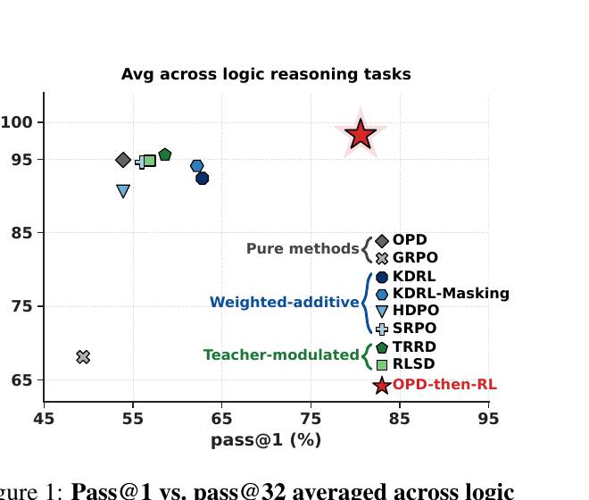
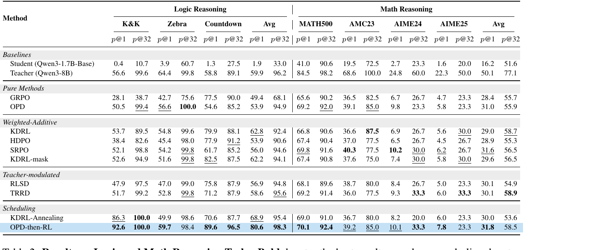
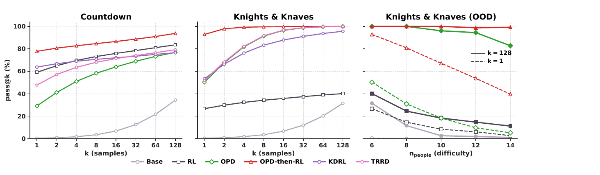

# Sequential Beats Joint: On the Interplay between On-Policy Distillation and RLVR

- **arXiv**: [2609.04108v2](https://arxiv.org/abs/2609.04108)（2026-09-04，19 页）
- **机构**: University of Alberta · NYU / NYU Shanghai · University of Chicago · University of Waterloo · Amii
- **作者**: Boyan Li¹\*, Bingsen Chen²³\*, Chenghao Yang⁴, Ping Nie⁵, Chen Zhao²³‡, Xi Ye¹⁶‡（\* 共同一作，‡ 通讯）

---

## 1. 一句话定位

**别把 OPD 和 RLVR 揉在一个 step 里，分两段做：先 OPD 训 60 步，再切纯 GRPO。**

这篇把现有的 OPD×RLVR 融合方法统一成一个 token 级 policy-gradient 视角，归成两类范式，然后用一个「朴素到没人认真试过」的 baseline —— **OPD-then-RL** —— 把它们全部打过去。机制解释是一句很干净的话：

> **OPD 扩张学生对「teacher 支持的解」的覆盖（pass@k），RL 在这个覆盖内部做锐化（pass@1）；联合优化把这两个角色混在一起，于是互相干扰。**

📌 **对本仓库而言，这篇的位置很特殊 —— 它正面撞上 [OPDVR](../opdvr/analysis.md)。** OPDVR 提出的恰恰是一个 **joint 的门控组合**，而本文把「joint」整类拿来做对照组并宣称 sequential 更好。两篇同期（2608.24696 vs 2609.04108）、**互不引用**。详见 [§7](#7-与-opdvr--opsa-的关系两篇同期互不引用)。

⚠️ **但先划清结论的适用范围**，这是读这篇最重要的一件事：

- **Logic 任务上它赢得非常干净** —— K&K 的 pass@1 从次优的 53.7 拉到 **92.6**，logic 平均领先其它组合方法 **11.7–26.7 分**。
- **Math 任务上它基本是平手** —— 论文自己的附录 bootstrap 检验（Table 7）显示：**相对纯 OPD 的差异不显著**（p@1 的 95% CI 是 `[−0.47, +2.13]`，含 0），相对 SRPO、KDRL-mask 也不显著；9 个对照里只有 6 个显著。
- **而摘要写的是** *"consistently outperforms pure OPD, pure RLVR, and all such joint baselines **across logic and math reasoning benchmarks**"* —— **「across ... math」这半句与它自己的 Table 7 对不上。**

> **Fig 1**：横轴 pass@1、纵轴 pass@32，每个点是一个后训练算法。图例按本文的分类分成三组：**Pure methods**（OPD 灰菱形 / GRPO 灰叉）、**Weighted-additive**（KDRL、KDRL-Masking、HDPO、SRPO，蓝色系）、**Teacher-modulated**（TRRD、RLSD，绿色系），以及**红星 OPD-then-RL**。
>
> 红星在 **(≈80.6, ≈98.3)**，右上角孤零零一个；其余方法全挤在 pass@1 53–63 / pass@32 93–96 的一小团里；GRPO 单独掉在 (≈49, ≈68)。
>
> 🔴 **但看标题**：**"Avg across logic reasoning tasks"** —— **这张 teaser 只画了 logic 那一半**，也就是它赢 26.7 分的那一半。math 的对应图不存在。

---

## 2. 统一视角：所有组合方法只差在怎么混合两个信号

论文先把所有方法写成同一个 token 级 policy-gradient 更新（省略 importance ratio 与 PPO clipping）：

$$
\nabla_\theta J^{\mathrm{alg}}(\theta) = \mathbb{E}\left[\sum_{i,t} A_t^{\mathrm{alg},(i)}\, \nabla_\theta \log \pi_\theta\big(y_t^{(i)} \mid h_t^{(i)}\big)\right]
$$

两个纯方法分别是 `A^GRPO = Â^(i)`（轨迹级 verifier advantage）和 `A^OPD = d_t^(i)`（token 级蒸馏 advantage）。**于是所有组合方法的差别，只在于怎么把 `Â` 和 `d_t` 混成一个 `A_t`。**

### 范式 I：Weighted-Additive（加权相加）

$$
A_t^{\mathrm{add},(i)} = w_R^{(i,t)}\,\hat{A}^{(i)} + w_T^{(i,t)}\, d_t^{(i)}
$$

`w_R, w_T ≥ 0`。📌 **关键性质：`A_add` 的符号可以相对 `Â` 翻转** —— 当 teacher 与 verifier 意见相左时，teacher 项能把整个更新方向掰过来。

| 方法 | 做法 |
|---|---|
| **KDRL**（Xu et al. 2025） | 规范实例：每个 token 都加一个常数权重的蒸馏项 |
| **KDRL-mask** | **在正确的 rollout 上丢掉蒸馏项**，只在错误 rollout 上加 |
| **SRPO**† | 按正确性在两个信号之间**切换**：对了用 reward advantage，错了用蒸馏项 |
| **HDPO**† | **只在「一组 rollout 全错」时**才激活 teacher |

### 范式 II：Teacher-Modulated（教师只调幅度）

既然加性项会掰方向，那就改成用一个**恒正、带 trust-region clip 的因子**去缩放 reward advantage：

$$
A_t^{\mathrm{mod},(i)} = m\big(d_t^{(i)}\big)\cdot \hat{A}^{(i)}, \qquad m\big(d_t^{(i)}\big) > 0
$$

于是 `sign(A_mod) = sign(Â)` —— **`d_t` 退化成 token 级的 credit assignment，而不是一个竞争性的目标**：verifier 与 teacher 一致的地方放大，不一致的地方缩小。

| 方法 | 做法 |
|---|---|
| **TRRD**（Zhang et al. 2026b） | 把 teacher 信号折进 importance ratio 当 trust-region 正则，抑制偏离 teacher 的更新 |
| **RLSD**†（Yang et al. 2026） | 直接用一个 clip 过的 teacher 因子缩放 advantage 的幅度 |

> † 标记的方法原本是在 self-distillation 设定下提出的，本文沿用其组合规则但把 teacher 换成外部模型。

### 本文的替代方案：OPD-then-RL

$$
A_t^{\mathrm{alg},(i)} =
\begin{cases}
d_t^{(i)}, & \text{training step} \le S \\[4pt]
\hat{A}^{(i)}, & \text{otherwise}
\end{cases}
$$

**就是一个硬切换**，`S = 60` 步。没有新超参（除了 `S`），没有权重需要调。

📌 **另外还有一个中间形态做对照**：**KDRL-Annealing** —— 把 KDRL 的 `β` 从 0.2 线性退火到 0.002，相当于「软切换版的 OPD-then-RL」。论文特意把它放进来，用于区分「分阶段」和「硬切换」哪个是关键。

---

## 3. 实验设置

| 项 | 值 |
|---|---|
| **Student** | **Qwen3-1.7B-Base** |
| **Teacher** | **Qwen3-8B** |
| **Logic 任务** | ReasoningGym 的 **Knights & Knaves (K&K)**、**Zebra Puzzles**、**Countdown**，各自独立训练与评测 —— **teacher 在这类任务上先验暴露有限** |
| **Math 任务** | 训练用 **DeepMath-103K**，评测 **MATH500 / AMC23 / AIME24 / AIME25** —— **teacher 在数学上被重度后训练过** |
| **指标** | **pass@1（avg@32）** 与 **pass@32** |
| **切换点** | `S = 60` 步（消融见 §5.3） |
| **公平性** | 📌 **"All methods are trained under the same total step budget for fair comparison."** |
| **调参** | weighted-additive 对 `β` 高度敏感，**按任务做了针对性消融取最优 `β`**（Fig 6） |

📌 **两个任务族的选择是有意设计的**：论文明说选 K&K（**OPD 强于 GRPO**）和 Countdown（**GRPO 强于 OPD**）两种情况，*"ensuring our findings hold regardless of which stage is the stronger contributor"*。**这一点做得很规范。**

---

## 4. 结果

**Logic 平均（pass@1 / pass@32）**：

| 方法 | p@1 | p@32 |
|---|---|---|
| Student (Qwen3-1.7B-Base) | 1.9 | 33.0 |
| *Teacher (Qwen3-8B)* | *59.9* | *96.2* |
| GRPO | 49.4 | 68.1 |
| OPD | 53.9 | 94.9 |
| KDRL | 62.8 | 92.4 |
| SRPO | 56.0 | 94.6 |
| TRRD | 58.6 | 95.6 |
| KDRL-Annealing | 68.9 | 95.4 |
| **OPD-then-RL** | **80.6** | **98.3** |

📌 **两个很硬的读数**：① **OPD-then-RL 的 logic 平均 pass@1 (80.6) 超过了 teacher 的 59.9** —— 学生显著超过老师；② **pass@32 98.3 也超过 teacher 的 96.2**。

**Math 平均**：

| 方法 | p@1 | p@32 |
|---|---|---|
| *Teacher (Qwen3-8B)* | *50.1* | *77.1* |
| OPD | 31.0 | 55.9 |
| SRPO | 31.6 | 56.5 |
| **TRRD** | 30.1 | **58.9** |
| **KDRL** | 29.0 | **58.7** |
| **OPD-then-RL** | **31.8** | 58.5 |

⚠️ **这里的形势完全不同**：
- **pass@1 31.8 确实是最高**，但只比 SRPO 的 31.6 高 0.2、比纯 OPD 的 31.0 高 0.8；
- 🔴 **pass@32 的 58.5 排第三** —— **TRRD 58.9、KDRL 58.7 都更高**（论文表格自己把 TRRD 的 58.9 加粗了，诚实）；
- **所有方法离 teacher 的 50.1 / 77.1 都还很远** —— 数学上没有任何方法接近老师。

**全表 18 列的完整战绩：赢 11、平手赢 2、输 5。** 输的五列是：

| 列 | OPD-then-RL | 输给 |
|---|---|---|
| **Zebra p@32** | 98.4（第 6） | **纯 OPD 100.0**、SRPO/KDRL-mask/TRRD 99.8、KDRL 99.6、KDRL-Anneal 98.6、HDPO 98.0 |
| AMC23 p@1 | 39.2 | SRPO 40.3 |
| AMC23 p@32 | 85.0 | KDRL 87.5 |
| AIME24 p@1 | 10.1 | SRPO 10.2 |
| **AIME25 p@32** | 23.3（并列第 6） | TRRD 33.3、KDRL 30.0、KDRL-mask 30.0、SRPO 26.7、HDPO 26.7 |

⚠️ **Zebra p@32 这一列尤其值得注意**：**纯 OPD 拿到 100.0，而加了 RL 阶段之后反而掉到 98.4。** 按论文自己的机制叙事（OPD 扩覆盖、RL 锐化），这正是 **RL 阶段把覆盖压回去了** —— 是机制的反例。**论文正文对这五处失利一处都没提。**

⚠️ **还有一句正文断言与表对不上**：§4.2 写 *"On logic reasoning tasks, **every method that combines OPD and RL matches or exceeds both pure baselines**"* —— **在 Logic-Avg pass@32 上，六个 joint 方法里有四个低于纯 OPD 的 94.9**（HDPO 90.6、KDRL 92.4、KDRL-mask 94.1、RLSD 94.8）。这句话只在 Logic-Avg pass@1 上成立（而且 HDPO 是 53.9，与 OPD **打平**而非超过）。

### 4.1 论文自己的显著性检验（Table 7，附录）—— 全文最该读的一张表

**这篇做了 paired problem-level bootstrap，给出 95% 置信区间**，在这一路文献里算是罕见的严谨。math 上「OPD-then-RL 减去对照方法」的 CI：

| 对照 | p@1 的 95% CI | p@32 的 95% CI |
|---|---|---|
| **OPD** | `[−0.47, +2.13]` | `[−1.58, +7.10]` |
| **SRPO** | `[−0.81, +1.21]` | `[−2.09, +6.45]` |
| **KDRL-mask** | `[−0.06, +4.77]` | `[−3.10, +7.27]` |
| TRRD | `[+0.54, +2.97]` ✳ | `[−5.12, +4.26]` |
| RLSD | `[+0.57, +3.01]` ✳ | `[−0.70, +8.21]` |
| HDPO | `[+0.74, +5.43]` ✳ | `[−2.52, +9.08]` |
| KDRL | `[+0.51, +5.25]` ✳ | `[−5.75, +5.34]` |
| GRPO | `[+1.06, +6.03]` ✳ | `[−3.05, +8.94]` |
| KDRL-Annealing | `[+0.81, +2.89]` ✳ | `[+0.19, +9.93]` ✳ |

（✳ = 区间不含 0，即显著）

🔴 **三条结论**：
1. **在 math 上，OPD-then-RL 相对纯 OPD 没有统计显著的优势**（p@1 与 p@32 的 CI 都含 0）。**也就是说：数学任务上，后面那段 RL 加不加，测不出差别。**
2. **相对 SRPO 和 KDRL-mask 也不显著。** 论文正文诚实地写了 *"a statistical tie with the three strongest"*。
3. **pass@32 上只有相对 KDRL-Annealing 是显著的**，对其余 8 个方法全部是平手。

📌 **这张表同时也支持了论文的另一句话**：正文说 *"On pass@32, **no method is significantly ahead of** OPD-then-RL on either task family"* —— 措辞是「没有人显著领先它」而不是「它领先所有人」，**与 CI 一致，是准确的**。

### 4.2 机制：覆盖扩张 vs 分布锐化

> **Fig 2 三面板**（图例：灰圆 Base / 黑方 RL / 绿 OPD / **红 OPD-then-RL** / 紫 KDRL / 粉 TRRD）：
>
> - **左（Countdown）**：横轴 k = 1→128（log 刻度），纵轴 pass@k。**红线全程最高**（k=1 时 ≈78，k=128 时 ≈94）；灰色 Base 最低（k=1 近 0 → k=128 约 35）。
> - **中（K&K）**：红线从 k=1 的 ≈92 一路贴近 100；**黑色 RL 线全程被压在 27→40 的低位**，与其它方法差距极大。
> - **右（K&K OOD）**：横轴换成难度 `n_people`（6→14），**实线 = k=128，虚线 = k=1**。红色实线在全部难度上稳定在 100；绿色（OPD）实线从 100 降到 ≈83；红色虚线从 ≈93 降到 ≈40。
>
> 📌 **论文的机制论证就在这张图上**：*"OPD lifts the entire pass@k curve above the base model on both tasks, with the largest gain at large k. Looking at the pass@128−pass@1 gap, **OPD widens it by enlarging the set of solvable problems, while RL narrows it by redistributing probability mass toward pass@1**."*
>
> **翻译成一句话：OPD 把「能解的题」的集合做大（抬 pass@k），RL 把概率质量往对的答案上挪（抬 pass@1、压缩 pass@k 与 pass@1 的差）。顺序做，两件事各自到位；混着做，互相抵消。**

**论文还给了两类 joint 方法各自的失效方式（这段很有信息量）**：

| 范式 | 在 logic 上 | 在 math 上 |
|---|---|---|
| **Weighted-additive** | 把 RL 梯度直接注入蒸馏训练，推向 reward 驱动的锐化：pass@1 比纯 OPD **高 4.8**，但 **pass@32 掉 2.0** | teacher 的蒸馏信号更可靠，于是这种对冲**反而把 pass@1 压到纯 OPD 之下（−1.2）** |
| **Teacher-modulated** | 只放大/抑制、不改方向，**性能贴着纯 OPD**：保住了 OPD 的高 pass@32，pass@1 小幅改善 | **对 OPD 的高 pass@1 的破坏也比 weighted-additive 小** |

📌 **「Teacher-modulated 会把性能钉在纯 OPD 附近」这个实测结论，请记住它 —— [§7](#7-与-opdvr--opsa-的关系两篇同期互不引用) 会用到。**

---

## 5. 实用结论

### 5.1 切换点 `S` 怎么定

论文用三个 checkpoint（step 20 / 60 / 100）做了对照，结论很简洁：

> **「切换时刻的 OPD 验证分数，基本决定了后续 RL 能到哪」**（*"the OPD score at the switch is what propagates into RL"*）。

- **K&K 与 Zebra**：OPD 到 step 100 还在涨 → **切得越晚越好**（100 > 60 > 20）。
- **Countdown**：OPD 的验证分在 step 20 就饱和 → **三个切换点最后收敛到几乎一样**。

📌 **可操作的判据**：**盯着 OPD 的验证曲线，在它「快速上升期结束」的地方切。** 论文主实验取 60 就是这个位置 —— 拿到了大部分 OPD 收益，又给 RL 留了足够预算。**继续把 OPD 训好能抬高天花板，提前切则把上限锁死。**

📌 **一处对自己不利的诚实**：这个消融显示 **K&K 和 Zebra 上 S=100 比 S=60 更好**，而主表用的是 S=60 —— **也就是说主表里的 OPD-then-RL 并不是它自己最优的配置**。论文没有借此邀功，但读的时候要知道这个方向是保守的。

### 5.1b ⚠️ Table 8 的「+7.2」是对着一个欠训练的 OPD 算的

论文用 Table 8 论证「OPD 比 SFT 是更好的冷启动」，正文写：*"on average p@32 by **7.2 points (51.3 → 58.5)**"*。

🔴 **但 Table 8 的 caption 写明：「OPD results are reported at the switch point (step 60)」** —— 那个 51.3 是**训到一半的 OPD**，不是满预算的 OPD。对照 Table 2 里跑满 120 步的纯 OPD（math Avg **31.0 / 55.9**）：

| 对照基准 | p@1 增益 | p@32 增益 |
|---|---|---|
| Table 8 的「OPD only」（step 60，51.3） | +1.5 | **+7.2** |
| **Table 2 的满预算 OPD（55.9）** | **+0.8** | **+2.6** |

**同一个 OPD-then-RL，换一个诚实的对照基准，p@32 的增益从 7.2 缩到 2.6。** caption 确实披露了 step-60 这件事，所以不算隐瞒；但正文把 51.3→58.5 当作头条增益来引用，而读者很容易把 51.3 读成「OPD 的水平」。**这是全文最容易误读的一个数字。**

### 5.2 OPD 比 SFT 是更好的 RL 冷启动

同一个 teacher 下，论文对比了 OPD 与它的 off-policy 对应物（SFT on teacher traces），结论是 **OPD 提供更强的冷启动**。理由与 GKD 那条线一致：SFT 学的是 teacher 分布上的轨迹，而推理时学生从自己的分布采样，存在 exposure bias。

⚠️ **但这个"SFT"只是四种可能里的一种 —— 补记（2026-09 复核）**：按 [Decoupling KL and Trajectories](../decoupling_kl/analysis.md)（2605.16826）的 2×2 坐标，**「前缀从谁来」与「KL 往哪个方向」是两个独立的轴**：

| | Forward KL | Reverse KL |
|---|---|---|
| **Teacher 前缀** | **本文的 SFT baseline**（off-policy SFT） | offline-RL 式蒸馏 |
| **Student 前缀** | **DAgger 式 on-policy SFT ⬅ 本文从未测过** | **本文的 OPD** |

🔴 **而那篇测出来的赢家恰恰是本文没测的那一格**：4096-token 蒸馏后接 GRPO，**student-prefix reverse KL（= OPD）从 45% 掉到 36%，而 student-prefix forward KL（= DAgger）从 40% 涨到 45%**。它的结论是 *"reverse KL can produce a stronger pre-RL model, but its reduced entropy constrains exploration… **forward KL is a more reliable initialization**"*。

📌 **两篇不矛盾，因为对照组不同** —— 本文比的是 OPD vs **off-policy** SFT（左上格），那篇比的是 reverse vs forward KL **在同一个 student 前缀下**（右下 vs 右上）。**「OPD > off-policy SFT」与「DAgger > OPD」可以同时为真。**

⚠️ **但那篇给本文的结论加了一个真实的风险提示**：它发现 **长程 reverse KL 会把熵压到接近 0，从而提前烧掉 RL 的探索空间**。回看本文 Fig 3 的第四个面板 —— **OPD-then-RL 的 `H(p_S)` 最终约 0.025，已经很接近塌了**，只是本文没把它当风险。📌 **一个可能的调和是：本文的 OPD-then-RL 之所以有效，恰恰因为它在第 60 步就切走了，没给 reverse KL 足够时间压死熵。** 而 §5.1 的消融显示 **K&K/Zebra 上 S=100 比 S=60 更好** —— **如果继续往后推，那篇预测的退化应该会出现；本文没有测到 S 更大的区间。**

---

## 6. 争议与权衡

### 6.1 摘要的适用范围比正文宽

| 出处 | 措辞 | 核对 |
|---|---|---|
| **摘要** | *"consistently outperforms pure OPD, pure RLVR, and all such joint baselines **across logic and math reasoning benchmarks**"* | 🔴 **math 上不成立** —— Table 7 显示相对纯 OPD、SRPO、KDRL-mask 都是统计平手；Math Avg 的 pass@32 还排第三（58.5 < TRRD 58.9 < KDRL 58.7） |
| **§7 结论** | *"matches or surpasses every joint variant ... **with no variant ahead of it on either axis**"* | ⚠️ 如果「两个轴」指 Fig 1 的 pass@1/pass@32 **且只算 logic**，成立；按 math 的 Avg p@32 读则不成立 |
| **§4.2 正文** | *"attains the highest average pass@1 on both task families ... **On math, where all methods sit closer together**, ... significant against six of the nine ... and a **statistical tie with the three strongest**"* | ✅ **准确**，与 Table 7 完全一致 |
| **§4.2 正文** | *"On pass@32, **no method is significantly ahead of** OPD-then-RL on either task family"* | ✅ **准确**（是"没人显著领先它"，不是"它领先所有人"） |

📌 **所以这篇的问题不是造假，而是「摘要 + teaser 只呈现赢得漂亮的那一半」**：Fig 1 明写 "Avg across logic reasoning tasks"，而 math 的同款图不存在。**正文和附录都是诚实的。**

### 6.2 结论对「teacher 与任务的相对强弱」高度敏感 —— 而这恰恰是最有价值的一条

论文自己把两个任务族按 **teacher 的先验暴露程度**设计：logic 是"teacher 没怎么见过"，math 是"teacher 被重度后训练过"。结果：

- **teacher 弱先验（logic）→ 分阶段大赢**（+11.7~26.7）
- **teacher 强先验（math）→ 分阶段与纯 OPD 打平**

📌 **反过来读，这给出了一条比论文标题更有用的判据**：**当 teacher 在目标任务上已经很强时，OPD 本身就吃掉了大部分收益，后面那段 RL 加不加区别不大；当 teacher 对任务相对陌生时，OPD 只能扩覆盖、必须靠 RL 去锐化，这时分阶段的价值才显现。** 论文没有把这条提炼成结论，但它是全文数据支持最强的模式。

### 6.3 「teacher 天花板」这个机制只在 K&K / Zebra 上成立

§5.2 的核心机制论证是：*"OPD and all joint methods plateau below the teacher's 56.6 p@1 line, while the two scheduling methods cross it"* —— 持续的 OPD 信号把学生拽回 teacher 分布，挡住了 RL 的锐化。Fig 3 画的正是 K&K。

⚠️ **但在 Countdown 上这条完全不成立**：teacher 的 p@1 是 **58.8**，而 **八个方法都超过了它** —— GRPO 77.5、KDRL-mask 82.5、KDRL 79.9、HDPO 77.9、RLSD 75.8、TRRD 71.2、KDRL-Annealing 70.6、SRPO 61.7。**在 teacher 本来就不擅长的任务上，连纯 GRPO 都能轻松越过所谓的天花板。**

📌 **所以准确的表述是**：「teacher 天花板」是 **OPD 信号在 teacher 相对强势的任务上**才会形成的约束，不是 OPD×RLVR 组合的普遍性质。这与 [§6.2](#62-结论对teacher-与任务的相对强弱高度敏感--而这恰恰是最有价值的一条) 是同一件事的两个侧面。

### 6.4 跨模型族的泛化（Table 6）比主表弱得多

用 OLMo-3.1-32B-Instruct 当 teacher、OLMo-3-7B-Instruct-SFT 当 student：

| | MATH-500 p@1 | MATH-500 p@32 | AIME25 p@1 | AIME25 p@32 | K&K p@1 | K&K p@32 |
|---|---|---|---|---|---|---|
| OPD-then-RL | 86.8 | 97.2 | **26.4** | 50.0 | **84.0** | 100.0 |
| **纯 OPD** | **86.9** | **97.4** | 25.3 | **53.3** | 78.4 | 100.0 |
| joint baseline | 84.4 | 97.0 | 25.4 | 50.0 | 81.5 | 100.0 |

⚠️ **纯 OPD 在 6 列里赢了 3 列**（MATH-500 两列 + AIME25 p@32）。论文自己的 caption 也承认只有 K&K p@1 和 MATH-500 p@1（相对 joint）显著，*"all other differences are ties"*。
⚠️ 而且这张表里的 **"joint baseline" 在不同列上是两个不同的算法**（math 用 SRPO、K&K 用 KDRL-Annealing），且 KDRL-Annealing 在主表里被归在 **Scheduling** 而不是 joint。
⚠️ **Table 5（0.6B 学生）也缩减了对照集** —— 把 HDPO、RLSD 和 KDRL-Annealing（主表 logic 的第二名）都拿掉了，没有说明理由。

### 6.5 其它

- ⚠️ **只有一个 student/teacher 组合**（Qwen3-1.7B-Base ← Qwen3-8B）。规模、家族、能力差距都没有扫描。论文在 Limitations 里承认了 teacher-student 配置的局限（只覆盖"外部更强 teacher"这一种），并把 task-specific teacher、多 teacher、self-distillation 列为 future work。
- ⚠️ **`S = 60` 的消融只有三个点**（20 / 60 / 100），且是在 logic 任务上做的。math 上切换点的敏感性没测。
- ⚠️ **pass@k 作为主指标有一个已知的解释风险**：大 k 的 pass@k 与**采样多样性/熵**强相关，而 OPD（reverse KL）和 RL 对熵的影响方向不同。论文用 pass@k 的变化来论证"覆盖扩张"，但**没有把"覆盖真的变大"与"只是熵变高、碰运气碰到了"分离开**。Fig 2 右图（OOD 难度）部分缓解了这个担心，因为难度上升时红线仍然稳在 100。
- ⚠️ **weighted-additive 的 `β` 按任务调到最优，而 OPD-then-RL 的 `S` 用的是固定 60**。这个方向对 baseline 有利（不是对自己有利），**属于公平性上的加分项**。
- ✅ **总步数预算对齐**（"All methods are trained under the same total step budget"），这是这类对照最容易翻车的地方，论文明确写了。全表 batch 128 × G=8，每步 1024 条 rollout，所以 optimizer step 与 rollout token 两个口径都是齐的。
- 📌 **而且算力方向其实对论文不利，它自己没说**：joint 方法要在全部 150 步里都跑 teacher 前向，而 OPD-then-RL 只在前 60 步跑 —— **它在 FLOPs 上严格更便宜，却赢了**。这是它手上最强的公平性论据，论文一个字都没提。（反过来 GRPO 完全不需要 teacher，所以真按 FLOP 对齐应该给 GRPO 更多步数 —— 两个方向都没讨论。）
- ⚠️ **但 math 上的 joint baseline 完全没调参**："we adopt the values reported in their respective papers **without further tuning**"。而论文自己发现 *"weighted-additive methods are highly sensitive to β"* —— **在一个新数据集上用别人论文的 β，是实打实的不公平**，而 math 恰恰是它领先最薄、输掉 4 列的地方。（logic 上倒是按任务扫了 β，但 TRRD 的 α 和 RLSD 的 λ/ε 全程固定未调。）
- ⚠️ **Reasoning Gym 的评测是同分布的程序生成数据**：训练 20,000 条（seed 1）、评测 512 条（seed 42），**同一个生成器、同一套难度配置、同样的模板**，论文没有做任何去重或污染检查。
  🔴 **而论文自己知道这个风险** —— 它在 §C.2 用这条理由解释为什么不在 Reasoning Gym 上做 SFT 对照：*"Reasoning Gym puzzles are procedurally generated from fixed templates… SFT can reach high in-distribution accuracy largely by **memorizing question–answer patterns** rather than by acquiring transferable reasoning skills, which would **unfairly inflate the SFT baseline**."* **同样的论证对 Table 2 里那个 26.7 分的 logic 头条战绩同等适用，论文却没有应用。** 唯一的 OOD 探针是 Fig 2 右图，而那张图把所有 joint baseline 都省掉了。
- ⚠️ **没有训练种子、没有重复运行**。Table 7 的 bootstrap 是**在题目上重采样**，只覆盖评测噪声，**不覆盖训练轮次间的方差**。
- ⚠️ **硬件与算力完全没给**（GPU 型号/卡数/时长/FLOPs 全无），只能从致谢推出用了 Digital Research Alliance of Canada 与 NYU 的集群。
- ⚠️ **参考文献的 arXiv 覆盖停在 2605（5 月）**，而这篇是 9 月 4 日的 v2。**[OPSA](../opsa/analysis.md)（2608.31046）与 [OPDVR](../opdvr/analysis.md)（2608.24696）两篇 8 月的直接竞争工作都不在参考文献里** —— 而论文的分类学声明是穷尽式的（*"every combination"*、*"existing methods cleanly split into two paradigms"*）。另外 §7 列了 7 个 joint 工作但只实现了 5 个，所以 *"outperforms all of them"* 也多算了两个。
- ✅ **有 Limitations 章节、有 bootstrap 置信区间、有致谢与资助声明、所有 baseline 都是自己重跑的（没有一个数字是抄来的）。** 在仓库的 OPD 那一簇里，**这仍然是方法学最规范的一篇**。

---

## 7. 与 OPDVR / OPSA 的关系（三篇同期，互不引用）

### 7.1 🔴 OPDVR 恰好属于本文判定为「较弱」的那一类

**[OPDVR](../opdvr/analysis.md)（arXiv:2608.24696）的核心机制是**：

$$
R_{\mathrm{OPDVR}}(o_t) = \mathrm{sign}(R)\cdot \mathrm{ReLU}\left(R \cdot \log \frac{\pi_T(o_t \mid q, o_{<t})}{\pi_\theta(o_t \mid q, o_{<t})}\right)
$$

用 OPDVR 笔记里的话说就是 **「verifier 决定方向，teacher 决定幅度」**。

**而本文范式 II（Teacher-Modulated）的定义是**：

$$
A_t^{\mathrm{mod},(i)} = m\big(d_t^{(i)}\big)\cdot \hat{A}^{(i)},\qquad m > 0,\quad \mathrm{sign}(A^{\mathrm{mod}}) = \mathrm{sign}(\hat{A})
$$

原话：*"uses the teacher signal only to **modulate the magnitude** of the RLVR advantage, leaving the **sign determined entirely by the verifiable reward**."*

📌 **这两个是同一个东西。** OPDVR 的 `ReLU(·)` 就是那个非负的 `m`，`sign(R)` 就是 `sign(Â)`。

⚠️ **但要说准一处差别**：本文写的是 `m > 0`（严格正），而 **OPDVR 的 ReLU 会取到 0** —— 它把约一半的 token 梯度直接清零，而 TRRD / RLSD 只是缩放。**所以 OPDVR 是范式 II 的极限情形（允许调制因子归零），不是被本文直接测过的那两个实例。** 本文测的是 TRRD 和 RLSD，**没有引用也没有测 OPDVR**。

### 7.2 两篇独立地得到了同一个结论

**这是这组对照里最值得记的一点。**

| | 路径 | 结论 |
|---|---|---|
| **我在 [OPDVR 笔记](../opdvr/analysis.md) 里的推导** | 从门控结构推不动点：正确轨迹上 `π_θ ≥ π_T`、错误轨迹上 `π_θ ≤ π_T` 构成一个**单向棘轮区域**，梯度在 `π_θ = π_T` 处归零 → **teacher 是硬上界** | OPDVR 在三张主表里平均分**从未超过 teacher** |
| **本文的实测** | 直接测 teacher-modulated 这一类：*"keeping the performance **close to pure OPD**"* —— 保住 OPD 的高 pass@32、pass@1 只小幅改善 | 范式 II **被钉在纯 OPD 附近** |

📌 **两条完全不同的路径（一条是从 loss 结构推、一条是跨方法实测）指向同一件事：teacher-modulated 这类设计的天花板就是 OPD/teacher 本身。** 这比任何单篇的自述都更有说服力。

🔴 **而最锋利的一条证据是「学生有没有超过老师」**：

| | 学生 vs teacher |
|---|---|
| **[OPDVR](../opdvr/analysis.md)** | 三张主表**平均分从未超过 teacher**（49.1 vs 50.4、22.8 vs 30.9、49.4 vs 50.4） |
| **本文 OPD-then-RL（logic）** | **pass@1 80.6 vs teacher 59.9、pass@32 98.3 vs 96.2 —— 两个轴都反超** |
| **本文 OPD-then-RL（math）** | 31.8 / 58.5 vs teacher 50.1 / 77.1 —— **远未反超** |

⚠️ **注意 math 那行**：分阶段在数学上同样超不过 teacher。**所以"反超 teacher"这件事不是 sequential 这个形式带来的，而是"teacher 在 logic 上本来就不强"带来的**（见 [§6.2](#62-结论对teacher-与任务的相对强弱高度敏感--而这恰恰是最有价值的一条)）。**但它至少证明了：撤掉 teacher 之后的纯 RL 阶段，确实能把学生推到 teacher 之上 —— 这是 OPDVR 那种"teacher 始终在 loss 里"的结构做不到的。**

⚠️ **而本文给出的出路正好是 OPDVR 结构上做不到的那件事**：**换阶段，而不是换权重。** OPD 阶段把覆盖做大，然后**完全撤掉 teacher**、让纯 RL 去锐化 —— 一旦 teacher 不在 loss 里，"teacher 是上界"这个约束就自动解除了。对照 [OPDVR 笔记 Q2](../opdvr/analysis.md) 里我给的另一条出路（用 ExOPD 式的 reward extrapolation 把幅度增益推到 1 以上），**本文这条更简单也更彻底**。

### 7.3 与 OPSA 的关系

[OPSA](../opsa/analysis.md)（arXiv:2608.31046）论证 **OPD 的收益来自"压制学生自采的低概率 token"而非 teacher 的具体监督**。把三篇摆在一起：

| | 对 OPD 的判断 | 处方 |
|---|---|---|
| **OPSA** | 收益来自负信号压低概率 token，teacher 可以整个换掉 | advantage 全为负、只训 logp 最低 20% 的 token |
| **OPDVR** | 收益来自 teacher，只是符号用错了 | ReLU 门让 verifier 定符号（= 本文的范式 II） |
| **本文** | OPD 负责**扩覆盖**、RL 负责**锐化**，两者角色不同不能混 | 分两段做 |

📌 **本文的"覆盖扩张 / 锐化"二分，给 OPSA 和 OPDVR 的分歧提供了一个可能的调和**：OPSA 观察的是 pass@1 类指标下 OPD 的行为，本文指出 **OPD 真正的贡献在 pass@k 那一侧**。如果成立，那么"OPD 不 distill"与"OPD 有用"可以同时为真 —— **OPD 的作用不是把 teacher 的知识搬过来，而是把学生的解分布摊开**。

⚠️ **这是我的综合，三篇论文都没这么写过**，而且三篇的指标口径不同（OPSA 用 Avg@32，本文用 pass@1/pass@32），**要当结论用需要在统一设定下重测**。

📌 **一个具体的开放实验**：把本文的 pass@k 分析直接套到 OPSA 的 OPSA-trained 模型上 —— 如果"OPD 扩覆盖"成立，那么 OPSA（零 teacher 监督、纯负信号）应该**也**能抬 pass@k。**这一个实验能同时检验三篇。**

---

## 8. 一句话总结

**把 OPD 和 RLVR 分两段做（OPD 训 60 步再切纯 GRPO），比现有所有「在同一个 step 里融合两者」的方法都好** —— 论文先把这些融合法统一成 token 级 advantage 的两类（**weighted-additive** 会掰翻更新方向、**teacher-modulated** 只调幅度不改符号），再用 pass@k 给出机制：**OPD 扩张"可解题集合"、RL 在其中重分配概率质量，混着优化会互相干扰**；logic 上领先其它组合方法 11.7–26.7 分且学生 pass@1 80.6 反超 teacher 的 59.9。⚠️ **但摘要的 "across logic and math" 与它自己的附录 bootstrap 对不上 —— math 上相对纯 OPD / SRPO / KDRL-mask 全是统计平手（相对纯 OPD 的 p@1 CI 是 [−0.47, +2.13]），Math Avg 的 pass@32 还排第三；Fig 1 那张 teaser 只画了 logic。** 📌 而真正可迁移的判据论文没提炼出来：**teacher 在目标任务上越强，分阶段的增量越小**。方法学上它是仓库 OPD 簇里最规范的一篇（步数预算对齐、bootstrap CI、有 Limitations）。

---

## 9. 在仓库 OPD 谱系里的位置

| 层次 | 笔记 | 与本文的关系 |
|---|---|---|
| **范式源头** | [gkd](../gkd/analysis.md)、[on_policy_distillation](../on_policy_distillation/blog_zh.md) | 本文引用二者作为 OPD 的来源；§5.2 的"OPD 比 SFT 冷启动好"复用了 GKD 的 exposure-bias 论证 |
| **OPD 的机制批判** | [opsa](../opsa/analysis.md) | ⚠️ **未引用**。三篇对 OPD 收益来源给出三种解释（见 §7.3） |
| **joint 组合（本文的对照组）** | [opdvr](../opdvr/analysis.md) | 🔴 **未引用，但 OPDVR 正属于本文的范式 II**（见 §7.1）。两篇同期、结论相反 |
| **teacher 的来源** | [opsd](../opsd/analysis.md) | 本文 Limitations 明确把 self-distillation 列为未覆盖的配置 |
| **扩散侧同构** | [danceopd](../../image_generation/danceopd/analysis.md)、[flow_opd](../../image_generation/flow_opd/analysis.md)、[diffusion_nft](../../image_generation/diffusion_nft/analysis.md)、[rvm](../../video_generation/rvm/analysis.md) | 连续域上的对应问题。📌 **本文的"分阶段而非混合"在扩散侧还没有对应工作** —— 那边的 RL 后训练（如 [SenseNova-U1.5](../../multimodal/sensenova_u15/analysis.md) 的四专家 RL → OPD 蒸馏）其实**已经是分阶段的**，只是顺序相反（先 RL 再蒸馏） |

📌 **最后这条对比值得单独记**：本文主张 **OPD → RL**（先扩覆盖、后锐化），而 [SenseNova-U1.5](../../multimodal/sensenova_u15/analysis.md) 的后训练是 **RL（四个专家）→ OPD（蒸馏合并）**。**两者顺序正相反，但目的不同** —— 后者的 OPD 是用来「把多个专家合并成一个模型」，不是用来扩覆盖的。**「OPD 放在 RL 前面还是后面」在两个域里各有一种做法，而没有人对比过。**
