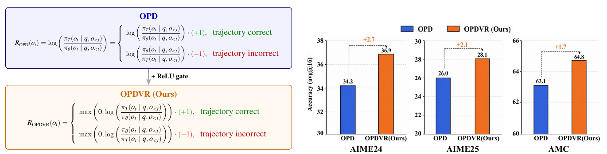
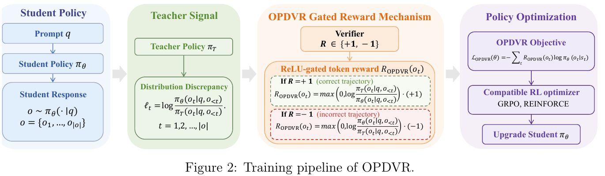
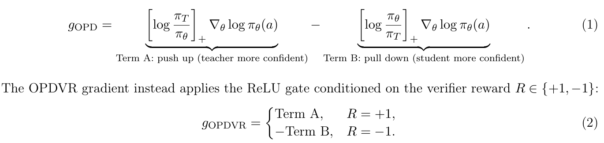
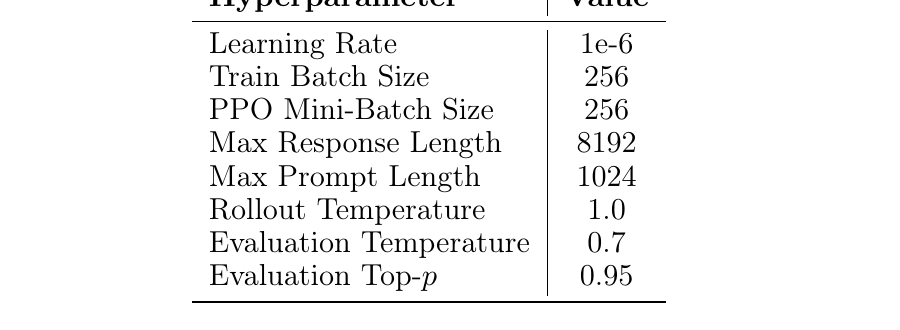
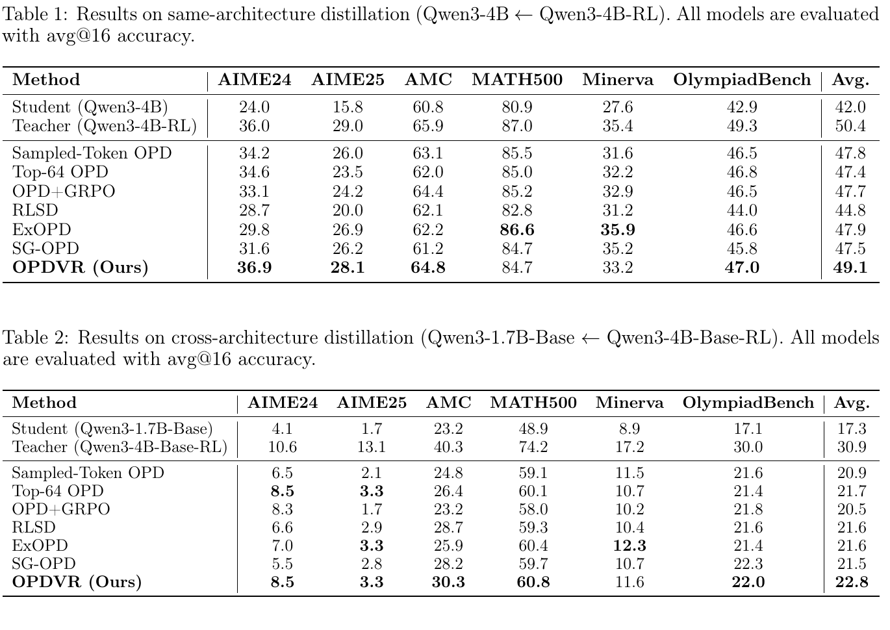
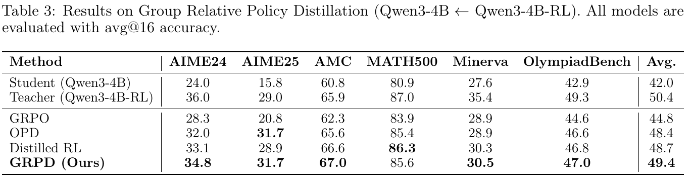
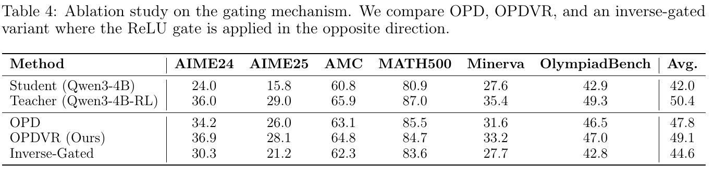
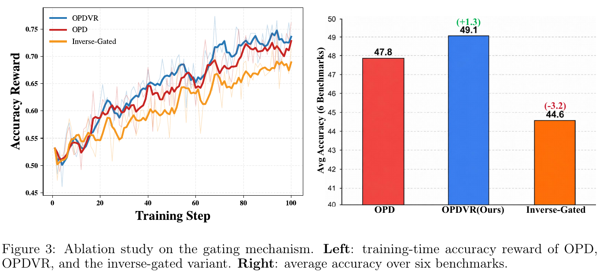
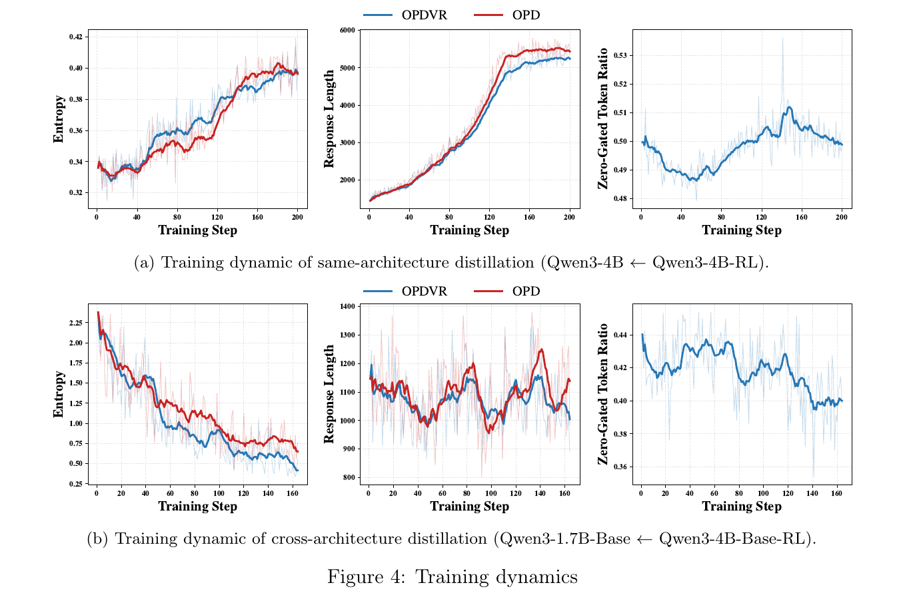

# On-policy Distillation with Verifiable Reward (OPDVR)

- **arXiv**: [2608.24696v3](https://arxiv.org/abs/2608.24696)（2026-09-06，17 页）
- **机构**: LeapLab, Tsinghua University · Qiuzhen College, THU · Beihang University · SMS, Peking University · NLPLab, THU
- **作者**: Wenze Lin / Jiale Zhao / Xitai Jiang（共同一作）… Gao Huang
- **代码**: [github.com/LeapLabTHU/OPDVR](https://github.com/LeapLabTHU/OPDVR)

---

## 1. 一句话定位

**这篇的全部内容是一个 ReLU：把 sampled-token OPD 的隐式 token reward 套一层 `max(0, ·)`，让它的符号由 verifier 而不是 teacher-student 概率比决定，零新增超参。**

它的贡献不在于方法复杂度（方法只有一行），而在于**推导**：sampled-token OPD 的梯度与 RLVR 的梯度形状完全相同，只是 reward 系数被换成了 `log(π_T/π_θ)`。一旦把它读成 RLVR，就能看出这个隐式 reward 违反了 RLVR 的基本约定（正确轨迹的 token 拿非负 advantage、错误轨迹拿非正），而修复方式就是一个门。修完之后 OPD 变成了合法的 RLVR，于是可以直接和 GRPO 复合 —— 论文把这个复合叫 **GRPD**。

⚠️ **但要先说清楚结果的量级**：OPDVR 在论文自己的三张主表里**平均分从来没有超过 teacher**（49.1 vs 50.4、22.8 vs 30.9、49.4 vs 50.4），而摘要批评 OPD 的原话恰恰是「limiting its performance to that of the teacher」。相对最强 baseline 的领先只有 **1.1–1.2 分**，**没有 seed、没有误差棒、没有方差**，**全文没有 Limitations 章节**。

> **左**：OPD 的隐式 reward `R_OPD(o_t) = log(π_T/π_θ)`，按轨迹正确性拆成 `log(π_T/π_θ)·(+1)`（正确）与 `log(π_θ/π_T)·(−1)`（错误）—— 两支都是**无界且符号与正确性无关**的。**加一个 ReLU gate** 后变成 OPDVR：正确轨迹只剩非负、错误轨迹只剩非正。
> **右**：同架构设定（Qwen3-4B ← Qwen3-4B-RL）上 AIME24 34.2→36.9（+2.7）、AIME25 26.0→28.1（+2.1）、AMC 63.1→64.8（+1.7）。

---

## 2. 背景：OPD 与 RLVR 的互补缺陷

| | 信号密度 | 信号来源 | 主要缺陷 |
|---|---|---|---|
| **RLVR** | 稀疏（每条轨迹一个标量） | verifier（答案对不对） | credit assignment 困难，中间步骤没有监督 |
| **OPD** | 稠密（每个 token 一个标量） | teacher 分布 | 目标纯分布性，**完全不看轨迹对错**；最优解是 `π_θ = π_T`，天花板是 teacher |

论文引用的已有复合方案（§2「Combining OPD with RLVR」）都属于「把两个 loss 摆在一起再调权重」：

- **OPD+GRPO**（Xiao et al. 2026, MiMo-V2-Flash, [arXiv:2601.02780](https://arxiv.org/abs/2601.02780)）：`L = L_OPD + L_GRPO`，1:1 等权。
- **Distilled RL**（Wang et al. 2026, [arXiv:2607.17247](https://arxiv.org/abs/2607.17247)）：按 advantage 符号切换 —— 正 advantage 用 OPD，负 advantage 用 GRPO。
- **Hubotter et al. 2026**（[arXiv:2601.20802](https://arxiv.org/abs/2601.20802)）：直接加权两个目标。

这些都要引入额外的权重超参或启发式开关。OPDVR 的卖点是**不需要**：门是结构性的，没有系数。

📌 **另外有一条直接的「前作」线，论文自己在 §2 单开了一节承认**（「Identifying the Misalignment between Teacher and Verifier」），这一点值得表扬，参见 [§7 争议](#7-争议与权衡) 的 ⑩：

| 工作 | 处理粒度 | 做法 |
|---|---|---|
| **Uni-OPD**（Hou et al. 2026, [2605.03677](https://arxiv.org/abs/2605.03677)） | prompt 级 | teacher 在正/负轨迹上的 sequence-level reward gap 小于安全 margin 就丢弃整条 prompt |
| **RG-OPD**（Akhondzadeh et al. 2026, [2607.04037](https://arxiv.org/abs/2607.04037)） | 轨迹级 | teacher 信号与 verifier 不一致的整条轨迹直接丢 |
| **SG-OPD**（Xu et al. 2026b, [2606.09304](https://arxiv.org/abs/2606.09304)） | **token 级** | 一致的 token 外推、冲突的 token 用标量系数**插值缩小** |
| **OPDVR（本文）** | **token 级** | 冲突的 token **直接置零** |

**SG-OPD 是最近的对手，也确实进了 Table 1/2 的 baseline 列表**（外推系数 1.8、插值系数 1.0，按原论文最优配置复现）。所以本文的 novelty 边界是清楚的：**「token 级 + 消除（而非缩小）冲突信号」**，窄，但论文没有假装它宽。

---

## 3. 核心推导：把 sampled-token OPD 读成一个 RLVR

### 3.1 梯度形状对齐 → 隐式 token reward

sampled-token OPD（业界最常用的那个变体，用单样本 MC 近似 reverse KL）的 per-token loss 是

$$
\ell_t = \log \frac{\pi_\theta(o_t \mid q, o_{<t})}{\pi_T(o_t \mid q, o_{<t})}
$$

log-ratio 带 stop-gradient，所以序列 loss 的梯度是

$$
\nabla_\theta \mathcal{L}^{\text{sample}}_{\text{OPD}}
= \sum_{t=1}^{|o|} \log \frac{\pi_\theta(o_t \mid q, o_{<t})}{\pi_T(o_t \mid q, o_{<t})}
\cdot \nabla_\theta \log \pi_\theta(o_t \mid q, o_{<t})
$$

而 RLVR（REINFORCE 形式，`R ∈ {+1, −1}`）的梯度是

$$
\nabla_\theta \mathcal{L}_{\text{RLVR}} = -R \cdot \sum_{t=1}^{|o|} \nabla_\theta \log \pi_\theta(o_t \mid q, o_{<t})
$$

**两者形状完全一样**，对齐 `∇log π_θ` 前面的系数就得到

$$
R_{\text{OPD}}(o_t) = -\log \frac{\pi_\theta(o_t \mid q, o_{<t})}{\pi_T(o_t \mid q, o_{<t})}
= \log \frac{\pi_T(o_t \mid q, o_{<t})}{\pi_\theta(o_t \mid q, o_{<t})}
$$

📌 **这一步是整篇的关键，而且它是精确的、不是类比**：OPD 的 stop-gradient 实现让 log-ratio 变成了一个逐 token 的常数系数，这个系数在数学上占据了 RLVR 里 reward 的位置。**OPD 不是「像」RL，它就是一个 token 级 reward 由 teacher 给的 policy gradient。**

### 3.2 两类冲突 token

把 `R_OPD` 按轨迹正确性重写：

$$
R_{\text{OPD}}(o_t) =
\begin{cases}
\log \dfrac{\pi_T(o_t \mid q, o_{<t})}{\pi_\theta(o_t \mid q, o_{<t})} \cdot (+1), & \text{trajectory correct} \\[8pt]
\log \dfrac{\pi_\theta(o_t \mid q, o_{<t})}{\pi_T(o_t \mid q, o_{<t})} \cdot (-1), & \text{trajectory incorrect}
\end{cases}
$$

⚠️ **先说清楚一件容易被这个写法误导的事**：上面这个 piecewise **是一个恒等式**，两支在数学上完全相同（`x = (−x)·(−1)`）。`R_OPD` 本身跟轨迹对错没有半点关系，拆成两支只是为了摆成 RLVR 的形状好做对比。Figure 1 左半边把它画成分段函数，容易让人误以为 OPD 的 reward 依赖对错 —— 论文后文其实承认了「sign 只由 ratio 决定」，但图的呈现方式是有误导性的。

问题在于：**两支的符号都由 `π_T` 与 `π_θ` 谁大决定，与轨迹对错无关**。论文原话：

> on correct trajectories, a negative value of `log(π_T/π_θ)` penalizes valid token behaviors, while on incorrect trajectories, a negative value of `log(π_θ/π_T)` encourages erroneous token predictions.

于是有两类 token 的更新方向与 verifier 相反（§4.3）：

| 类型 | 条件 | OPD 干了什么 | 为什么是错的 |
|---|---|---|---|
| **Type I** | 轨迹**正确** 且 `π_θ > π_T` | 施加**负**梯度，把这个正确 token 的概率往下拉去匹配 teacher 更低的置信度 | ① 学生的高置信度与正确结果是**一致**的；② 在正确答案上降低置信度是一种与任务表现无关的分布扭曲 |
| **Type II** | 轨迹**错误** 且 `π_T > π_θ` | 施加**正**梯度，把这个错误轨迹上的 token 概率往上推 | ① teacher 的高置信度在这里并没有伴随一条正确轨迹；② 提升错误轨迹上 token 的概率等于强化 verifier 已判错的推理模式 |

---

## 4. 方法：一个 ReLU gate

### 4.1 OPDVR

$$
R_{\text{OPDVR}}(o_t) =
\begin{cases}
\max\left(0, \log \dfrac{\pi_T(o_t \mid q, o_{<t})}{\pi_\theta(o_t \mid q, o_{<t})}\right) \cdot (+1), & \text{trajectory correct} \\[10pt]
\max\left(0, \log \dfrac{\pi_\theta(o_t \mid q, o_{<t})}{\pi_T(o_t \mid q, o_{<t})}\right) \cdot (-1), & \text{trajectory incorrect}
\end{cases}
$$

$$
\mathcal{L}_{\text{OPDVR}}(\theta) = -\sum_{t=1}^{|o|} R_{\text{OPDVR}}(o_t) \cdot \log \pi_\theta(o_t \mid q, o_{<t})
$$

**verifier 决定方向（推高还是压低），teacher 决定幅度（log-ratio 的绝对值）。** 零新增超参 —— 这是它相对 SG-OPD（外推 1.8 / 插值 1.0）、ExOPD（外推系数 1.25）最实在的优势。

> 四段式：学生自采 response → teacher 打 per-token log-ratio → verifier 的 `R ∈ {+1,−1}` 决定用哪一支 ReLU → 得到 `R_OPDVR` 后按 `L = −Σ R·log π_θ` 反传，兼容 GRPO / REINFORCE。

### 4.2 梯度视角：Term A / Term B 的单边保留

论文 §4.3 把这个门重新表述成一个**条件 token mask**，这是理解它最快的方式：

$$
g_{\text{OPD}} = \underbrace{\left[\log \frac{\pi_T}{\pi_\theta}\right]_{+} \nabla_\theta \log \pi_\theta(a)}_{\text{Term A}} - \underbrace{\left[\log \frac{\pi_\theta}{\pi_T}\right]_{+} \nabla_\theta \log \pi_\theta(a)}_{\text{Term B}}
$$

Term A 是「teacher 更自信 → 推高」，Term B 是「学生更自信 → 压低」。任何实数都能拆成正部减正部，所以这个分解是恒等的。OPDVR 做的事是：

$$
g_{\text{OPDVR}} =
\begin{cases}
\ \ \ \text{Term A}, & R = +1 \\
-\text{Term B}, & R = -1
\end{cases}
$$

📌 **翻译成人话：正确轨迹上只往上推、绝不往下压；错误轨迹上只往下压、绝不往上推。**

### 4.3 一个论文没有明说、但由此直接得到的结论：OPDVR 的不动点是一个区域，不是一个点

- **OPD 的不动点**是 `π_θ = π_T`（reverse KL 的唯一极小），学生从两边被拉向 teacher。
- **OPDVR 的不动点集合**是：对所有正确轨迹上的 token 满足 `π_θ ≥ π_T`，且对所有错误轨迹上的 token 满足 `π_θ ≤ π_T`。这是一整个**单向棘轮区域** —— 学生在正确 token 上被推到 teacher 的水平后梯度归零、**不会再被推更高**；已经高于 teacher 的地方梯度本来就是零。

**推论：OPDVR 可以超过 teacher，但只能靠「保住学生原本就领先的地方」，没有任何机制去「创造」新的领先。** 这正好解释了三张主表里 OPDVR 平均分始终低于 teacher 的现象 —— 这不是训练不足，是目标函数的结构决定的。

### 4.4 附录 A 的理论：说了什么、没说什么

附录 A 有三个小节，**前两个是恒等式改写，第三个是一个构造**：

- **A.1（Proposition A.1，验证器对齐）**：`⟨Δ_OPDVR, Δ_RLVR⟩ = ReLU(R·r_t)‖u_t‖² ≥ 0`，而 `⟨Δ_OPD, Δ_RLVR⟩ = r_t R‖u_t‖²`，在 `r_t R < 0` 时为负。
- **A.2（Proposition A.2，冲突分解）**：`Δ_OPD = Δ_OPDVR + Δ_conflict`，其中 `Δ_conflict = r_t·1(r_t R < 0)·u_t`，且它在 verifier 梯度上的投影恒非正。

⚠️ **这两条按 ReLU 的定义就成立，是对「门确实去掉了反向分量」的形式化陈述，不是新信息，也不能推出「去掉之后一定更好」。** 它们是描述性的，不是预测性的。

- **A.3（简化 token 级分析）**：这一节声称 OPDVR「can strictly outperform the teacher」。构造是：固定 prefix `s`，两个候选 token（`a1` 正确、`a2` 错误），记 `π_θ(a1|s) = q`、`π_T(a1|s) = p`，**假设 teacher 次优 `p < 1/2`，且学生初始已经比 teacher 强 `q₀ > p`**。结论是 OPD 收敛到 `q = p`（reverse KL 极小），而 OPDVR **梯度恰好为 0**（两支 ReLU 都被门掉），所以 `q` 停在 `q₀`，于是 `J_OPDVR = 2q₀ − 1 > 2p − 1 = J_OPD = J_teacher`。

⚠️ **这个「超过 teacher」是退化意义上的**：OPDVR 赢是因为它**不动**，而起点已经赢了。它证明的其实是「OPDVR 不会把学生已有的优势蒸掉」，而不是「OPDVR 能造出新的优势」—— 与 §4.3 的棘轮结论完全一致。而且这是**单 token、固定 prefix、二元动作空间、且假定 teacher 在关键 token 上劣于随机（`p < 1/2`）**的构造，离一般性结论还很远。

### 4.5 GRPD：把二元 R 换成 group-relative advantage

既然 OPDVR 已经是合法 RLVR，就能把 `R ∈ {+1,−1}` 换成 GRPO 的组内归一化 advantage `Â_{i,t}`：

$$
R_{\text{GRPD}}(o_{i,t}) = \text{sign}(\hat{A}_{i,t}) \cdot \text{ReLU}\left(\text{sign}(\hat{A}_{i,t}) \cdot \log \frac{\pi_T(o_{i,t} \mid q, o_{i,<t})}{\pi_\theta(o_{i,t} \mid q, o_{i,<t})}\right)
$$

📌 **但这里有一个论文自己没算清楚的事**：公式里只用了 `sign(Â_{i,t})`，**advantage 的幅度被完全丢弃**，幅度仍然全部由 teacher 的 log-ratio 提供。而 GRPO 用的是 `R_i ∈ {0,1}`，组内均值就是这一组的正确率，于是在 `0 < mean < 1` 时

$$
\text{sign}(\hat{A}_{i,t}) = \text{sign}(R_i - \overline{R}) = \begin{cases} +1, & R_i = 1 \\ -1, & R_i = 0 \end{cases}
$$

**——这与 OPDVR 的二元 `R` 逐 token 完全等价。** 所以论文 §4.4 里「replace this coarse binary signal with a **more nuanced**, group-relative advantage estimate」的说法在数学上站不住：GRPD 相对 OPDVR 的实际差别只有两条：

1. **退化组被排除**：组内全对或全错时 `std = 0`、`Â` 未定义（公式只给了 `Â > 0` 和 `Â < 0` 两支，`Â = 0` 没定义），这些 prompt 实际上被跳过 —— 这是一个 **prompt 级过滤**，恰好就是论文在 §2 批评 Uni-OPD「粒度太粗」的那种操作。
2. **长度归一化**：`L_GRPD` 带 `(1/G)·(1/|o_i|)`，而 `L_OPDVR`（上面的公式）**对 t 直接求和、不除以 `|o|`**。两个 loss 的长度偏置不一致，论文没有解释。

⚠️ 而且 **Table 3 里没有 OPDVR 这一行**（只有 GRPO / OPD / Distilled RL / GRPD），训练集又换成了 DAPO-Math-17K，所以**「GRPD 比 OPDVR 好」这件事在论文里从来没被测过**。

---

## 5. 实验设置

| 项 | 同架构（Table 1/3/4） | 跨架构（Table 2） |
|---|---|---|
| **Student** | Qwen3-4B-nonthinking | Qwen3-1.7B-Base |
| **Teacher** | Qwen3-4B + GRPO on DeepMath | Qwen3-4B-Base + GRPO 3 epoch |
| **训练集** | DeepMath-103k 过滤子集，**57k 条，难度 ≥ 6** | DAPO-Math-17k |
| **训练轮数** | [待补]（Table 1/2 未给；Fig 4 显示 200 / ~165 步） | 3 epoch |
| **评测** | AIME24 / AIME25 / AMC / MATH500 / Minerva / OlympiadBench，**avg@16** | 同左 |

Table 3（GRPD）额外说明：训练集换成 **DAPO-Math-17K**（刻意与 teacher 的 DeepMath 训练集区分开），**组大小 G = 8**。

框架是 **Verl / HybridFlow**（Sheng et al. 2025）。lr `1e-6`、train batch 256、PPO mini-batch 256（即 **on-policy，一个 batch 只更新一次**）、max response 8192、rollout temperature 1.0、评测 temperature 0.7 / top-p 0.95。

**baseline 复现配置（Appendix B.2）**：OPD+GRPO 用 1:1 等权；RLSD 组大小 8 且把原文的 privileged self-model teacher 换成与 OPD 相同的 teacher（为公平）；ExOPD 外推系数 1.25；SG-OPD 外推 1.8 / 插值 1.0。**都取各自原论文报告的最优设置，这一点做得规范。**

⚠️ **硬件（Appendix C）全文只有一句**：「All experiments in this paper are conducted on NVIDIA GeForce RTX 5090 GPUs.」**没有卡数、没有时长、没有 token 预算。** OPD 类方法的核心卖点之一是省算力（Thinking Machines 的博客给的是 9–30× vs RL），这篇一个成本数字都没有。

---

## 6. 结果

### 6.1 Table 1 / Table 2：主结果

**同架构（Qwen3-4B ← Qwen3-4B-RL）**：Student 42.0 → OPD 47.8 → **OPDVR 49.1**，Teacher 50.4。
**跨架构（Qwen3-1.7B-Base ← Qwen3-4B-Base-RL）**：Student 17.3 → OPD 20.9 → **OPDVR 22.8**，Teacher 30.9。

把它换成「student → teacher 这段差距被填掉了多少」更能看清楚（下面是我自己按表算的）：

| 设定 | student→teacher 差距 | OPD 填掉 | OPDVR 填掉 | 增量 |
|---|---|---|---|---|
| 同架构 | 8.4 分 | 5.8 → **69.0%** | 7.1 → **84.5%** | **+15.5 pp** |
| 跨架构 | 13.6 分 | 3.6 → **26.5%** | 5.5 → **40.4%** | **+13.9 pp** |

📌 **这个口径下两个设定高度一致（+15.5 pp / +13.9 pp），是这篇最扎实的一条证据** —— 比论文自己用的「+1.3 / +1.9 分」更能说明 gate 的效果不是某一个设定的偶然。

⚠️ 但同一张表也给出了三条反面事实：

1. **OPDVR 的平均分低于 teacher**（49.1 vs 50.4；22.8 vs 30.9）。论文批评 OPD 的原话是「limiting its performance to that of the teacher」，而 OPDVR 也没突破这条线 —— 它只是从 2.6 分的差距缩到 1.3 分。同架构逐项看，**6 项里 5 项低于 teacher**，唯一超过的 AIME24（36.9 vs 36.0）只有 0.9 分。跨架构 **6 项全部低于 teacher**。
2. **逐列不是全胜**。Table 1 里 OPDVR 的 **MATH500 84.7 排第 5**（ExOPD 86.6、OPD 85.5、OPD+GRPO 85.2、Top-64 85.0 都更高）、**Minerva 33.2 排第 3**（ExOPD 35.9、SG-OPD 35.2 更高）。Table 2 里 **Minerva 11.6 输给 ExOPD 12.3**、**OlympiadBench 22.0 输给 SG-OPD 22.3**。
3. **相对最强 baseline 的领先只有 1.1~1.2 分**，而且这个「最强 baseline」的数字本身有算术问题（见 §7 的对照表）。

### 6.2 Table 3：GRPD

GRPO 44.8 < OPD 48.4 < Distilled RL 48.7 < **GRPD 49.4**（Teacher 50.4）。

📌 **这张表最有信息量的其实不是 GRPD 赢了，而是纵向的排序**：**纯 GRPO（只有 verifier，无 teacher）44.8，纯 OPD（只有 teacher，无 verifier）48.4。** 在这个设定下，**teacher 的稠密信号比 verifier 的稀疏信号值钱得多（+3.6 分）**，而把 verifier 的符号加回去只再值 +1.0 分（49.4）。这与论文「两者互补、缺一不可」的叙事并不矛盾，但**权重严重不对等**，论文没有指出来。

⚠️ 另外三点：

- §5.3 说 GRPD「consistently outperforms all baselines **across all six benchmarks**」，**不成立**：MATH500 上 GRPD **85.6 < Distilled RL 86.3**（论文自己把 86.3 加粗了）；AIME25 上 GRPD **31.7 = OPD 31.7**，是平手不是超越。
- **纯 OPD 在 AIME25 上拿到 31.7，高于 teacher 的 29.0。** 论文的动机前提是「OPD 的性能被 teacher 卡死」，**这个前提被它自己表里的 OPD 行推翻了**。
- **Table 3 没有 OPDVR 行**，训练集又换成了 DAPO-Math-17K，所以 GRPD 与 OPDVR 谁更好，论文没测。

### 6.3 Table 4 / Figure 3：反向 gate 消融（全文唯一的消融）

把 OPDVR 保留/丢弃的两组 token **精确对调**（论文明说「keeping the masking ratio and everything else unchanged」）：

| | Avg | vs OPD |
|---|---|---|
| OPD | 47.8 | — |
| **OPDVR** | **49.1** | **+1.3** |
| **Inverse-Gated** | **44.6** | **−3.2** |

**这是一个方向性对照，而且结论很干净**：反向 gate 在**全部六个** benchmark 上都低于 vanilla OPD（30.3<34.2、21.2<26.0、62.3<63.1、83.6<85.5、27.7<31.6、42.8<46.5），说明**门的方向确实是对的、搞反了比不加还差**。

⚠️ 但要注意三点：

1. **Fig 3 左图并不支持「三条曲线单调分离」这个说法。** OPDVR（蓝）与 OPD（红）在 step 66–70 附近**红反超蓝**，终点 step 100 是 0.736 vs 0.728 —— **两条基本缠在一起**。真正明确分离的只有 Inverse-Gated（橙，0.689）。**换句话说：训练曲线区分不开 OPDVR 和 OPD，只有最后的 benchmark 数字能。**
2. **Fig 3 右图的 y 轴从 40 起**，视觉上放大了 +1.3 / −3.2。
3. 论文说「even the inverse-gated variant still improves over the initial model」—— **OlympiadBench 上 42.8 < Student 42.9**，不成立（平均 44.6 > 42.0 成立）。

📌 **最重要的缺失对照：随机符号门。** Inverse-Gated 是一个**反相关**对照（故意挑最坏的一半 token），不是**无关**对照。因为 gate 会丢掉约一半的 token 梯度（下节），必须有一个「随机丢同样比例」的对照，才能排除「收益来自梯度稀疏化 / 类 dropout 正则」这个解释。**论文没做。**

### 6.4 Figure 4：训练动态 —— 这张图信息量最大

**(a) 同架构，200 步**：entropy 0.337 → 0.397（两条终点重合）；response length **≈1450 → OPD ≈5450、OPDVR ≈5250**；**zero-gated token ratio 全程 0.487–0.512**。
**(b) 跨架构，≈165 步**：entropy **2.35 → OPDVR ≈0.42 / OPD ≈0.66**；response length 全程在 980–1250 之间震荡无趋势；**zero-gated token ratio 0.40–0.44**。

三条读数：

**① 大约一半的 token 梯度被直接扔掉，而结果反而更好。** 4B 学生 ≈50%、1.7B 学生 ≈40–44%，两个设定下都稳定，从不退化到「全丢」或「全留」。论文的解读是「与 verifier 冲突的 token 是数据中持续存在的一部分」。这个数字本身是这篇最有价值的实测量 —— 它说明 **sampled-token OPD 的梯度里有一半在和任务目标对着干**。

**② OPDVR 在两个设定下都比 OPD 熵更低、回复更短，而论文完全没提。** 同架构差距小（终点重合），**跨架构非常明显：终点 entropy 0.42 vs 0.66**。低熵意味着探索能力下降，是 RLVR 的已知失效模式之一。§5.5 把 entropy/length 的差异全部归因于「取决于具体的 teacher-student 组合」，**但 OPDVR 一致地低于 OPD 这一条是跨设定成立的**，属于被叙事掩盖掉的系统性副作用。

**③ §5.5 的正文与这张图对不上。** 正文写「response length inflates by **more than four times, from roughly 1.6k to over 6.7k tokens**」—— 图里 y 轴上限就是 6000，两条曲线起点 ≈1450、终点 ≈5450/5250，**倍数约 3.7×，没有任何曲线接近 6.7k**。三个数字全对不上。

⚠️ 顺带一个论文没讨论的代价：**response length 涨了约 3.7×，推理成本同比例上涨**。表里所有方法都是 avg@16 accuracy，没有任何一条固定推理预算下的对比。

---

## 7. 争议与权衡

### 7.1 论文与自己的表/图对不上的地方（逐条已核对原图）

| # | 论文原话 | 表/图里的事实 |
|---|---|---|
| ① | Intro：「both OPDVR and GRPD consistently outperform OPD **across all benchmarks**」 | Table 1 **MATH500：OPDVR 84.7 < OPD 85.5**。（Abstract 措辞更松，只说 "consistently outperforms standard OPD"，按平均勉强成立） |
| ② | §5.3：「GRPD consistently outperforms all baselines **across all six benchmarks**」 | Table 3 **MATH500：85.6 < Distilled RL 86.3**；**AIME25：31.7 = OPD 31.7**（平手） |
| ③ | Table 2 把 OPDVR 的 OlympiadBench **22.0 加粗**为最优 | **SG-OPD 是 22.3，更高且未加粗**。§5.2 的文字还特意挑了 OPD+GRPO 的 21.8 来比（「22.0 vs. 21.8 for OPD+GRPO」），**绕开了 22.3** |
| ④ | §5.2：「outperforming the next best method (**ExOPD, 47.9**) by **1.2** points」 | Table 1 ExOPD 六项之和 288.0，**均值应为 48.0**，表中印的是 47.9；修正后领先是 **1.1** 分 |
| ⑤ | §5.2：「outperforming the strongest baseline (**Top-64 OPD, 21.7**) by 1.1 points」 | Table 2 ExOPD 六项之和 130.3，**均值应为 21.7**（表中印 21.6）；修正后 ExOPD 与 Top-64 **并列**最强，"the strongest baseline" 的表述失真 |
| ⑥ | §5.5：「response length ... from roughly 1.6k to **over 6.7k** tokens」 | Fig 4a 中面板 y 轴上限 6000，起点 ≈1450、终点 ≈5450/5250，**≈3.7×** |
| ⑦ | §5.4：「The three variants ... **separate monotonically** throughout training」 | Fig 3 左图 step 66–70 **红（OPD）反超蓝（OPDVR）**，终点 0.728 vs 0.736，两条基本缠绕 |
| ⑧ | §5.4：「even the inverse-gated variant **still improves over the initial model**」 | Table 4 **OlympiadBench 42.8 < Student 42.9** |

📌 **④⑤ 值得单独说一句**：其余所有行的 Avg 都能对上（个别是 x.x5 的四舍五入边界），**只有 ExOPD 这一行在两张表里都低了 0.1，且两次都恰好让论文的对比措辞更好看**。单看每一处都可以是排版失误，但方向一致这件事需要记一笔。

### 7.2 方法与实验设计上的问题

**① OPDVR 自己也没突破 teacher 上限 —— 而这正是它批评 OPD 的那条。** 三张主表里平均分全部低于 teacher（49.1/50.4、22.8/30.9、49.4/50.4）。**这不是训练不足，是目标函数的结构决定的**（见 §4.3 的棘轮论证：门让梯度在 `π_θ = π_T` 处归零，OPDVR 没有任何机制把学生推到 teacher 之上）。附录 A.3 标题写「OPDVR Can Strictly Outperform the Teacher」，但那个构造里 OPDVR 的**梯度恰好为 0** —— 它赢是因为它不动，而起点已经赢了。**理论和实验其实是一致的，只是标题的读法反了。**

**② 两个最关键的对照组一个都没做。**
- **随机符号门**（保持 ~50% 掩码率，符号随机）：不做就无法排除「收益来自梯度稀疏化」。
- **常数幅度**（把保留 token 的 reward 从 `max(0, log(π_T/π_θ))` 换成常数 1）：这是**唯一**能验证「teacher 提供幅度」这条核心叙事的实验。论文反复宣称「The teacher still controls the magnitude of the update via the log-ratio」，**零实证**。

其余没做的：噪声/弱 verifier 的鲁棒性、不同 gate 函数（hard mask / clip / softplus）、teacher 规模或质量的扫描、GRPD 的组件拆解。全文**只有一个消融**。

**③ 边际太小，且没有任何方差信息。** 领先最强 baseline 1.1–1.2 分，**没有 seed、没有重复实验、没有误差棒**（全文 0 次 "seed"）。作为参照：AIME24 按惯例 30 题、avg@16 即 480 次 rollout，「超过 teacher」的那 0.9 分**约等于 4 个 rollout 的差异**。（论文未写各 benchmark 的题量，30 题是 AIME 的常识数值。）

**④ checkpoint 怎么选的没写。** 全文 0 次 "checkpoint"。Fig 3 画到 step 100 而同架构主实验 Fig 4a 画到 step 200，但 Table 4 的 OPD/OPDVR 行与 Table 1 **完全一致**（说明用的是 200 步的结果）—— 那 Fig 3 的曲线是被截断了，还是 Inverse-Gated 只训了 100 步？论文没解释。

**⑤「cross-architecture」名不副实。** Qwen3-1.7B-Base ← Qwen3-4B-Base-RL 是**同族跨尺寸**：同 tokenizer、同词表、同架构族。而 OPDVR **必须**把 student 采样出的 token id 直接喂给 teacher 打分，**跨词表根本没验证过**。全文 0 次出现 "tokenizer"。§5.2 却写「highlighting its robustness to both architectural differences」。

**⑥「unbounded」这条批评只修了一半。** Intro 的原话是两个 log-ratio「are **unbounded** and can be either positive or negative」。ReLU 只在**下界**截到 0，**上界依然无界** —— 正确轨迹上 `max(0, log(π_T/π_θ))` 可以任意大。论文把「无界」写进了动机，却只解决了「正负不定」。

**⑦ 实现层面有两个歧义。** ㈠ **stop-gradient 的位置**：§3.2 两次明说 sampled-token OPD 的 log-ratio 要 stop-gradient，但 §4.2 的 `L_OPDVR` 和 §4.4 的 `L_GRPD` 里 `R` 内部含 `π_θ`，**论文从头到尾没说这一项也要 detach**（按 RLVR 框架显然必须，否则 ReLU 会对 `π_θ` 反传出额外项）。Figure 2 的流程图也没标。㈡ **长度归一化不一致**：`L_OPDVR` 对 t 直接求和不除 `|o|`，`L_GRPD` 却带 `1/|o_i|`。Fig 4a 里 response length 涨 3.7× 与此可能有关，论文未讨论。

**⑧ 承重假设没有证据。** 整篇的支点是这一句：

> a key empirical principle shared by mainstream RLVR algorithms is that **all tokens leading to a correct final outcome should receive non-negative advantages, while tokens leading to an incorrect outcome should receive non-positive advantages.**

只给了 PPO / DeepSeek-R1 / DeepSeekMath 三个引用，**没有实验、也没有引文里的定理支撑**。而且这条「原则」并不像论文说的那么公认 —— 见 §7.3 与 OPSA 的对照。

**⑨ 训练信号与评测指标同源，且论文自己知道。** 训练 reward 是「数学答案对不对」（Fig 3 的 y 轴就叫 Accuracy Reward），评测是六个数学 benchmark 的 accuracy，**同一类判定函数**；论文从未说明训练 verifier 的实现（无 math_verify / 规则 / equivalence checker 的任何描述）。更明确的是：同架构设定里 **teacher 的 RL 训练集就是蒸馏集（都是 DeepMath）**，teacher 在这些 prompt 上已经 RL 过，`π_T` 会格外自信，gate 的统计量会被这个共现放大。**论文在 §5.3 专门为 GRPD 换成 DAPO-Math-17K，理由写的就是「distinct from the teacher's DeepMath training data」—— 说明作者知道这个问题，但只在 Table 3 修了，Table 1 / Table 4 没修。**

**⑩ baseline 的调参预算不对称，且直接竞争者缺席。** ExOPD（1.25）、SG-OPD（1.8/1.0）用的是**各自原论文的最优值**而非在本文设定下重调；OPD+GRPO 直接写死 1:1 权重，没做搜索。更重要的是：§2 专门开了一段批评 **Uni-OPD** 和 **RG-OPD**，**两者都没进任何一张表**；被 Intro 点名的 H²SD、sample routing、Hubotter et al. 同样没做 baseline。另外 **RLSD 被实质改造**（原方法的核心 privileged self-model teacher 被换成与 OPD 相同的 teacher，理由是「公平」），改造后它是 Table 1 里**最差**的方法（44.8）。

**⑪ 没有 Limitations 章节，也没有 Future Work。** Conclusion 全部是正面陈述。成本数字一个都没有：硬件只有一句「All experiments in this paper are conducted on NVIDIA GeForce RTX 5090 GPUs」，**没有卡数、没有时长、没有 GPU-hours、没有 token 预算**，也没有 OPDVR vs OPD 的 wall-clock 对比。OPD 这一路的主要卖点之一就是省算力，这篇一个数都没给。

**⑫ 与仓库里 OPD 那一簇几乎完全脱节。** 全文 37 条参考文献里，**GKD、MiniLLM、Thinking Machines 的 OPD 博客、OPSD（Self-Distilled Reasoner）、OPSA 一篇都没引**，扩散/视频侧（Flow-OPD、DanceOPD、DiffusionOPD、DiffusionNFT）自然更不会有。唯二的 OPD 机制分析类引用是 Fu et al. 2026（[2603.25562](https://arxiv.org/abs/2603.25562)，OPD 的失效模式）和 Li et al. 2026b（[2604.13016](https://arxiv.org/abs/2604.13016)，OPD 的现象学与机制），**各只给了半句话**，没有任何实质对话。

### 7.3 与 [OPSA](../opsa/analysis.md) 的正面张力（两篇同期，互不引用）

**这是这篇笔记里最值得展开的一条**：OPSA（[2608.31046](https://arxiv.org/abs/2608.31046)，2026-08）与 OPDVR（2026-08/09）同期、同主题、**互不引用、没有任何 head-to-head**，而两者对「OPD 的哪部分信号有用」给出了几乎相反的处方。

| | OPSA | OPDVR |
|---|---|---|
| 诊断 | OPD 的收益**不来自 teacher**，来自「压制学生自采的低概率 token」 | OPD 的收益来自 teacher，只是**符号**用错了 |
| 处方 | advantage **全程为负**，只更新 logp 最低 20% 的 token | 符号由 verifier 定，正确轨迹上**只剩正**、错误轨迹上**只剩负** |
| 关键实证 | 固定 `A = +0.2` **40 步内崩溃**（长度→0、梯度爆炸、输出乱码）；固定 `A = −0.5` 就能追平标准 OPD | 反向 gate 掉 3.2 分；正向 gate 涨 1.3 分 |
| teacher 消融 | 有（换噪声 teacher / 去掉 teacher 都做了） | **完全没有** |

**两者是否直接矛盾？我的判断是「不矛盾，但重叠得足够多，值得实测」**：

- OPSA 的负信号打的是 **student logp 排名最低的 20% token**；OPDVR 的 Type I 门掉的是 **`π_θ > π_T` 的 token**（学生比 teacher 更自信）。**两个集合大体互补** —— 低 logp 的 token 更可能 `π_θ < π_T`，在 OPDVR 里反而被保留成**正向推高**。所以严格说不是同一批 token。
- 但 OPSA 明确说过「**在正确轨迹内部也对低概率 token 施加负 advantage，这一点对性能提升很重要**」，而 OPDVR 的 Type I 门**正是在正确轨迹内部删掉所有负向更新**。两者在「正确轨迹内部要不要负信号」这个问题上是直接对立的。
- 一个粗算（我按 Fig 3 + Fig 4 估的，假设 gate 比例在正确/错误轨迹上大致相同）：训练末期 accuracy reward ≈ **0.73**，即 ~73% 的轨迹正确；存活下来的 token 里约 **73% 拿正 reward、27% 拿负 reward**。**这是一个正信号主导的梯度**，与 OPSA 的「全负」处方正好相反 —— 而它没崩。

📌 **为什么没崩？我认为关键在幅度自限**：OPSA 的 `A = +0.2` 是常数，永远不消失，所以能一路把学生推到崩；OPDVR 的正向幅度是 `max(0, log(π_T/π_θ))`，**学生一追上 teacher 就归零**。换句话说，**OPDVR 用「以 teacher 为上界的正信号」替换了 OPSA 眼里「必须为负」的信号，靠的是自限而不是符号。** 这条如果成立，是对两篇的一个统一解释，也是最值得做的后续实验：

> 把 OPDVR 正确轨迹那一支的幅度换成常数（去掉自限），看它是不是会像 OPSA 的 `A=+0.2` 一样崩。

**这个实验同时也正好是 §7.2 ② 里缺的「常数幅度」对照 —— 一个实验能回答两个问题。**

---

## 8. 一句话总结

**把 sampled-token OPD 的梯度系数 `log(π_T/π_θ)` 套一个由 verifier 定符号的 ReLU，就得到一个零新增超参的 RLVR —— 正确轨迹上只推高、错误轨迹上只压低，训练中约一半的 token 梯度被直接扔掉，同架构 47.8→49.1、跨架构 20.9→22.8（按 student→teacher 差距填充率算是 +15.5 pp / +13.9 pp，两个设定高度一致）；但这个门的结构决定了 teacher 是上界（梯度在 `π_θ = π_T` 处归零），所以三张主表里 OPDVR 的平均分从来没超过 teacher，而这恰恰是它批评 OPD 的那一点。** ⚠️ 缺随机符号门与常数幅度两个关键对照、边际 1.1–1.2 分且无 seed 无误差棒、无 Limitations、无任何成本数字、「cross-architecture」实为同族跨尺寸，且论文有 8 处与自己的表/图对不上。

---

## Q&A

### Q1：它和 SG-OPD 到底差在哪？值得单独发一篇吗？

**差在「缩小」与「清零」。** SG-OPD 对一致的 token 外推、对冲突的 token 用一个标量系数**插值缩小**（复现配置 1.8 / 1.0）；OPDVR 对冲突的 token **直接置零**。novelty 很窄。

但两点让它站得住：**㈠ 它把「窄」说清楚了** —— §2 专门开了一节承认 Uni-OPD / RG-OPD / SG-OPD 在做同一件事，并且 **SG-OPD 真的进了 Table 1/2 的 baseline**（按原论文最优配置复现）。这在最近这批 OPD 论文里算是少见的诚实。**㈡ 零超参是真的**：SG-OPD 有两个系数、ExOPD 有一个外推系数、OPD+GRPO 有权重，OPDVR 的门槛固定在 0。

⚠️ 但 Table 1 的实际差距是 **49.1 vs 47.5（+1.6）**、Table 2 是 **22.8 vs 21.5（+1.3）**，都在**没有误差棒**的情况下给出。而且 Table 2 的 OlympiadBench 上 **SG-OPD 22.3 反而高于 OPDVR 的 22.0**（论文还把 22.0 加粗了）。

### Q2：为什么 OPDVR 超不过 teacher？能修吗？

**因为门把 teacher 变成了一条硬天花板。** 展开说（这是 §4.3 的推论，论文没写）：

- OPD 的不动点是 `π_θ = π_T`（reverse KL 唯一极小）；
- **OPDVR 的不动点是一整个区域**：正确轨迹上 `π_θ ≥ π_T`、错误轨迹上 `π_θ ≤ π_T`。这是一个**单向棘轮** —— 学生被推到 teacher 的水平后梯度归零，**不会再被推更高**。

所以 OPDVR 能「超过 teacher」，但**只能靠保住学生原本就领先的地方，没有任何机制创造新的领先**。附录 A.3 的玩具证明就是这个 —— 那里 OPDVR 的梯度**恰好为 0**，赢是因为不动。

**要修的话，方向是给幅度一个超过 1 的增益**，也就是 ExOPD 的 reward extrapolation（系数 1.25）在做的事。有意思的是 Table 1 里 **ExOPD 的 MATH500 86.6 逼近 teacher 的 87.0、Minerva 35.9 已经超过 teacher 的 35.4**，两项都是方法组里最高 —— 而 OPDVR 在这两列分别是 84.7 和 33.2。**外推确实在这两列上比 gate 管用。****gate 和外推是正交的，论文没试过合起来。**

### Q3：这篇和仓库里扩散侧的 OPD 一簇怎么对上？

**对得上，而且这篇补的是「符号」这一格。** 仓库里 [DiffusionNFT](../../image_generation/diffusion_nft/analysis.md)、[Flow-OPD](../../image_generation/flow_opd/analysis.md)、[DanceOPD](../../image_generation/danceopd/analysis.md)、[Self-OPD](../../image_generation/self_opd/analysis.md)、[OPSD-V](../../video_generation/opsd_v/analysis.md) 这一簇最后都收敛到同一个形状：**stop-gradient 的标量系数 × 一个 score/velocity 方向项**，区别只在系数怎么构造、在哪个 state 上求值。OPDVR 是这个模式在**离散 token 域**的实例，系数 = `ReLU(R · log(π_T/π_θ))`。

**能不能照搬到 diffusion？我的判断是能，但需要换一个「谁更自信」的定义**（下面是我的外推，论文没有任何跨模态内容）：

在共享各向同性协方差的高斯假设下，一个 denoising step 的逐步隐式 reward 是

$$
R(x_{t-1}) = \log \frac{\pi_T(x_{t-1} \mid x_t)}{\pi_\theta(x_{t-1} \mid x_t)}
= \frac{\lVert x_{t-1} - \mu_\theta \rVert^2 - \lVert x_{t-1} - \mu_T \rVert^2}{2\sigma^2}
$$

因为 `x_{t−1}` 是从 `π_θ` 采的、不等于 `μ_θ`，**这个量的符号是不定的** —— 它取决于采样点离谁的均值更近。所以 ReLU gate 可以原样搬过去，「per-token」变成「**per-denoising-step**」，verifier 换成 reward model / GenEval 式的判定再二值化。

⚠️ **但有两个现成的坑**：㈠ 扩散侧的 reward 通常是连续的（美学分、HPS、GenEval 通过率），二值化的阈值就是一个**新超参**，OPDVR 最大的卖点（零超参）当场失效；㈡ [OPSA](../opsa/analysis.md) 笔记里已经汇总过，[Self-OPD](../../image_generation/self_opd/analysis.md) 去掉排斥项会在 600 步崩、[DiffusionNFT](../../image_generation/diffusion_nft/analysis.md) 去掉负支会「almost instantly collapse」、[RVM](../../video_generation/rvm/analysis.md) 也靠 `r<0` 的推开机制 —— **扩散侧已有三篇独立工作指向「负信号不可或缺」**。而 OPDVR 在正确轨迹上把负信号全删了。搬之前先做一个「只保留正支会不会崩」的小实验。

### Q4：如果只抄一条，抄哪条？

**抄 §4.1 的那个改写，不是抄那个 ReLU。**

$$
R_{\text{OPD}}(o_t) = \log \frac{\pi_T(o_t \mid q, o_{<t})}{\pi_\theta(o_t \mid q, o_{<t})}
$$

**sampled-token OPD 就是一个 token 级 reward 由 teacher 给的 policy gradient** —— 这不是类比，是 stop-gradient 实现下的精确等式。一旦接受这个视角，很多问题会自动变形：

- 「OPD 和 RL 怎么结合」→ 变成「这个 reward 该怎么设计」；
- 「要不要加 KL 正则」→ 变成「reward 的尺度对不对」；
- 「哪些 token 该训」→ 变成「哪些 token 的 reward 可信」（这正好是 [OPSA](../opsa/analysis.md) 的 logp 排名门控、[Xing et al. 2026 的 trust-region OPD](https://arxiv.org/abs/2606.01249)、[Jin et al. 2026 的 entropy-aware OPD](https://arxiv.org/abs/2603.07079) 在各自回答的问题）。

**ReLU 本身反而是最不重要的部分** —— 它只是「reward 该怎么设计」这个问题下最简单的一个答案，而且论文自己的 Table 1 显示它只值 1.3 分。

### Q5：要复现的话，哪些地方会卡住？

按论文给的信息，**至少四处要自己猜**：

| 卡点 | 状况 |
|---|---|
| `R_OPDVR` 内部的 `π_θ` 要不要 detach | **论文没写**。按 RLVR 框架必须 detach，但 §4.2 / §4.4 / Figure 2 都没标 |
| 每个 prompt 采几条 rollout | **论文没写**（只有 GRPD 的 `G = 8`）；`Train Batch Size 256` 是 prompt 数还是 sequence 数也没说 |
| 训练总步数 / checkpoint 怎么选 | **正文没写**，只能从 Fig 4 目测（同架构 ≈200 步、跨架构 ≈165 步） |
| verifier 的具体实现 | **论文没写**（全文 0 次 "math_verify"） |
| optimizer / lr schedule / warmup / 精度 | **论文没写**（Table 5 只有 8 项，全是 lr、batch、长度、温度） |

已知的部分：框架是 **Verl / HybridFlow**，lr `1e-6`，train batch 256，PPO mini-batch 256（即 **严格 on-policy，一个 batch 只更新一次**），max response 8192，rollout temperature 1.0，评测 temperature 0.7 / top-p 0.95。代码在 [LeapLabTHU/OPDVR](https://github.com/LeapLabTHU/OPDVR) —— **上面这些大概率要去代码里找。**

### Q6：这篇在仓库的 OPD 谱系里该放在哪？

放在「**给 OPD 的 token-level reward 做手术**」这一支，和 [OPSA](../opsa/analysis.md) 并列，两篇是同一个问题的两种相反答案（见 §7.3）。

| 层次 | 代表 | 处理对象 |
|---|---|---|
| **范式** | [GKD](../gkd/analysis.md)、[Thinking Machines 的 OPD 博客](../on_policy_distillation/blog_zh.md) | 「学生自采 + teacher 逐 token 打分」这个框架本身 |
| **teacher 的来源** | [OPSD](../opsd/analysis.md)（同模型 + context engineering）、RLSD（privileged self-model） | teacher 从哪来 |
| **token reward 的构造** | **OPDVR（本篇）**、[OPSA](../opsa/analysis.md)、SG-OPD、ExOPD、Uni-OPD、RG-OPD | 系数怎么算、哪些 token 该训 |
| **换到连续域** | [DiffusionNFT](../../image_generation/diffusion_nft/analysis.md)、[Flow-OPD](../../image_generation/flow_opd/analysis.md)、[DanceOPD](../../image_generation/danceopd/analysis.md)、[Self-OPD](../../image_generation/self_opd/analysis.md)、[D-OPSD](../../image_generation/d_opsd/analysis.md)、[DiffusionOPSD](../../image_generation/diffusion_opsd/analysis.md)、[OPSD-V](../../video_generation/opsd_v/analysis.md) | token → velocity / score |

📌 **第三行现在已经挤了六篇以上，而它们互相之间基本不引用。** OPDVR 不引 OPSA、不引 GKD、不引 OPSD；OPSA 也不引 SG-OPD。**这一格最缺的不是第七篇方法，是一次统一设定下的横向对照。**

---

### 🔴 补记（2026-09）：本篇属于一篇同期工作判定为「较弱」的那一类

[Sequential Beats Joint](../opd_then_rl/analysis.md)（arXiv:2609.04108，2026-09-04）把所有 OPD×RLVR 的融合方法统一成 token 级 advantage 的两类，其中**范式 II「Teacher-Modulated」的定义是**：

$$
A_t^{\mathrm{mod},(i)} = m\big(d_t^{(i)}\big)\cdot \hat{A}^{(i)},\qquad m > 0,\quad \mathrm{sign}(A^{\mathrm{mod}}) = \mathrm{sign}(\hat{A})
$$

原话是 *"uses the teacher signal only to modulate the magnitude of the RLVR advantage, leaving the sign determined entirely by the verifiable reward"* —— **这正是本篇 §4.1 的「verifier 定符号、teacher 定幅度」。**

⚠️ **一处需要说准的差别**：那篇写的是 `m > 0`（严格正），而 **OPDVR 的 ReLU 会取到 0**（约一半 token 被清零）。所以 **OPDVR 是范式 II 的极限情形**，而不是它直接测过的实例（它测的是 TRRD 和 RLSD）。**两篇同期、互不引用。**

📌 **但它的实测结论与本篇 §4.3 的推导是同一件事**：那篇测出 teacher-modulated 这一类 *"keeping the performance **close to pure OPD**"*，而本篇是从门控结构推出 **teacher 是硬上界（单向棘轮）**。**一条从 loss 结构推、一条跨方法实测，指向同一个天花板。**

🔴 **最锋利的对照是「学生有没有超过老师」**：OPDVR 三张主表**平均分从未超过 teacher**；而 OPD-then-RL 在 logic 上 **pass@1 80.6 vs teacher 59.9、pass@32 98.3 vs 96.2，两个轴都反超**。⚠️ 不过那篇在 math 上同样超不过 teacher（31.8 vs 50.1），**所以反超与其说来自 sequential 这个形式，不如说来自"teacher 在 logic 上本来就不强"**。

📌 **它给出的出路正好是本篇结构上做不到的那件事**：**换阶段，而不是换权重** —— OPD 阶段把覆盖做大，然后**把 teacher 整个撤出 loss**、让纯 RL 去锐化。一旦 teacher 不在 loss 里，§4.3 那个"梯度在 `π_θ = π_T` 处归零"的约束就自动解除了。这比 [Q2](#q2为什么-opdvr-超不过-teacher能修吗) 里我提的 ExOPD 式 reward extrapolation 更彻底。
