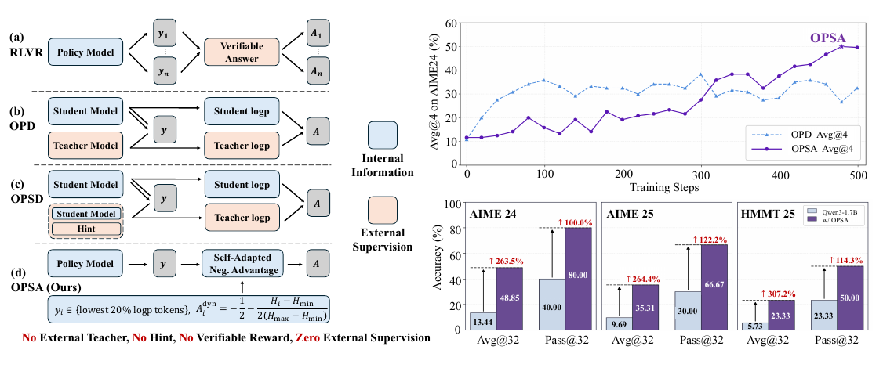
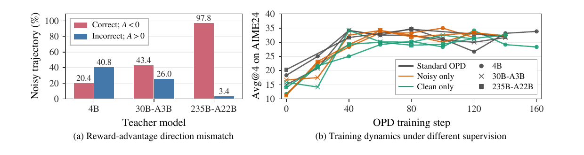
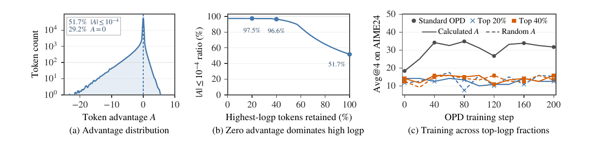
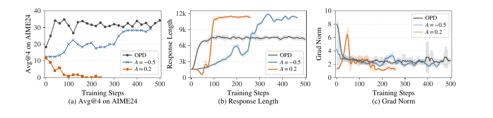
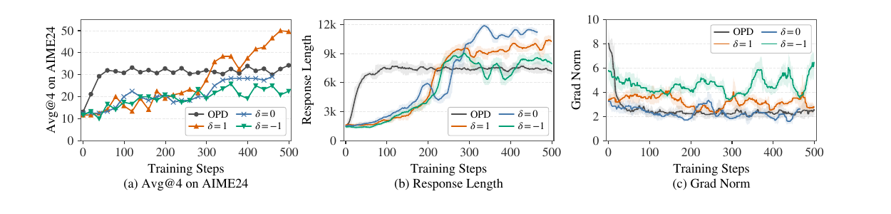
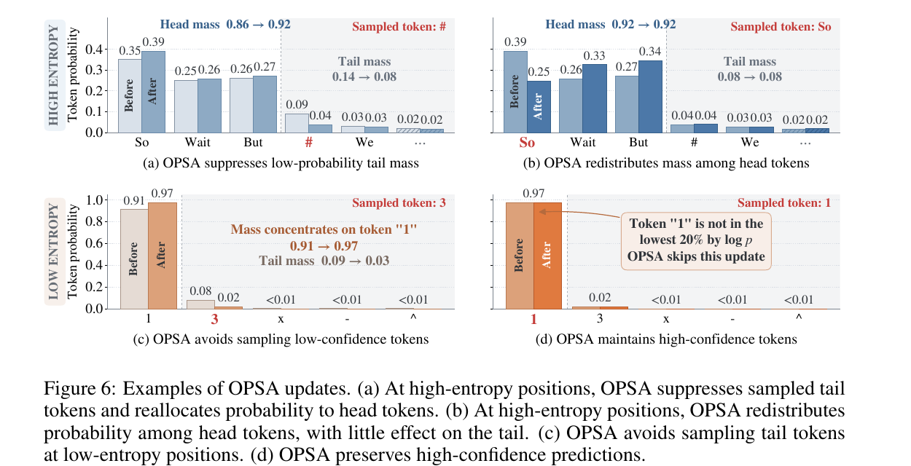

# Does On-Policy Distillation Really Distill? From Noisy Teacher to Self-Improvement

> Yi Ding, Ruqi Zhang · **Purdue University, Department of Computer Science**  
> [arXiv:2608.31046](https://arxiv.org/abs/2608.31046)(2026-08-31) · 有 Hugging Face 与 GitHub 链接  
> 方法名：**OPSA (On-Policy Self-Adaptation)**

---

## 1. 一句话定位

**这篇是对整条 on-policy distillation 路线的釜底抽薪：它声称 OPD 的收益根本不来自"向 teacher 学"，而来自"压低学生自己采到的低概率 token"——而后者不需要 teacher。**

三步拆解，一步比一步狠：

1. **teacher 的监督高度噪声，且 teacher 越大越噪**——4B teacher 噪声率 30.6%，235B teacher **50.6%**；
2. **学生对这种噪声完全不敏感**——只用噪声轨迹训、只用干净轨迹训、标准 OPD 三者**收敛到相当的性能**；
3. **把 OPD 的全部 advantage（正的负的一起）换成一个固定负值，性能与标准 OPD 相当**。

由此提出 **OPSA**：只更新学生 logp 最低的 20% token、给它们**负 advantage**、**幅度按 token 熵自适应**。**不需要 teacher、不需要可验证 reward、不需要 hint——零外部监督。**

Qwen3-1.7B 上 AIME24 Avg@32 **13.44 → 48.85**（+263%），比 OPD 高 **16.77** 分；三个基准的 Pass@32 全部翻倍以上。

📌 **这篇是仓库 OPD 那一簇缺失的批判性视角**——[GKD](../gkd/analysis.md)、[on_policy_distillation 博客](../on_policy_distillation/blog_zh.md) 立论，[Flow-OPD](../../image_generation/flow_opd/analysis.md)、[Self-OPD](../../image_generation/self_opd/analysis.md)、[DiffusionOPSD](../../image_generation/diffusion_opsd/analysis.md)、[D-OPSD](../../image_generation/d_opsd/analysis.md) 把它搬到扩散模型上，而**这篇直接质疑这条线赖以成立的机制**。

⚠️ **但要注意它的适用边界**：全部实验在 **LLM 数学推理**上，**没有触及扩散/视觉模型**。它对仓库里那些扩散 OPD 工作的冲击是**类比性的，不是直接的**（§6 详述）。

---

## 2. 背景与要解决的问题

论文把 on-policy 后训练的三条路线摆在一起对比：

| 方法 | 密集信号 | 无需可验证 reward | 无需外部 teacher | 无需 hint |
|---|---|---|---|---|
| **RLVR**（GRPO / DAPO） | ✗ | ✗ | ✓ | ✓ |
| **TTRL** | ✗ | ✓ | ✓ | ✓ |
| **OPD** | ✓ | ✓ | **✗** | ✓ |
| **OPSD** | ✓ | ✓ | ✓ | **✗** |
| **OPSA（本文）** | ✓ | ✓ | ✓ | ✓ |

**RLVR 的问题**：response 级 reward 对长程推理来说**粗糙且稀疏**；而且**当一组内的 response 正确性相同时，归一化后的 advantage 直接消失**，学习信号变弱、训练不稳甚至崩溃。

**OPD 的问题**：需要**共享词表 + 白盒访问 teacher logits**，严重限制 teacher 的选择。

**OPSD 的问题**：用"policy 自己 + hint（如参考答案）"替代外部 teacher，但**构造 hint 仍需额外采样或标注，且有信息泄漏风险**。

📌 **但论文真正的攻击点比上面三条都根本**：

> **OPD 和 OPSD 共享同一个 advantage 分配范式——让 teacher 去给"对它自己而言本质上是 off-policy 的、由学生采样的前缀"打分。**

这引出全文的核心疑问：**teacher 在这种 off-policy 情形下还能提供可靠监督吗？**

> **Fig 1 逐面板解读**：
>
> **左半（算法对比）**——四行，每行展示一种范式的信息流：
> - **(a) RLVR**：`Policy Model` → 采多个 `y₁…yₙ` → `Verifiable Answer` → 得到 `A₁…Aₙ`。
> - **(b) OPD**：`Student Model` 出 `Student logp`，`Teacher Model` 出 `Teacher logp`，两者对同一条 `y` 得到 `A`。右侧标 **`Internal Information`**。
> - **(c) OPSD**：结构同 OPD，但下面那个 `Student Model` **带一个 `Hint` 输入**——它扮演 teacher。右侧标 **`External Supervision`**。
> - **(d) OPSA（本文）**：只有一个 `Policy Model`，`y` 直接产出 **`Self-Adapted Neg. Advantage`**，下方写明规则 `y_i ∈ 最低 20% logp tokens`，`A_i^dyn = −1/2 − (1/2)(H_i−H_min)/(H_max−H_min)`。
> - 底部一行红字：**`No External Teacher, No Hint, No Verifiable Reward, Zero External Supervision`**。
>
> **右上（训练曲线）**：横轴 `Training Steps` 0–500，纵轴 `Avg@4 on AIME24 (%)`。**浅色 OPD 曲线**在 ~35 附近震荡趋平；**深紫 OPSA 曲线**持续上升到 **~50**。
>
> **右下（三个基准的柱状对比）**：AIME24 / AIME25 / HMMT25，每个基准两组（Avg@32 / Pass@32），浅色 Qwen3-1.7B、深色 w/ OPSA，柱上标着相对增幅：
>
> | 基准 | Avg@32 | Pass@32 |
> |---|---|---|
> | AIME24 | 13.44 → 48.85（**↑263.5%**） | 40.00 → 80.00（↑100.0%） |
> | AIME25 | 9.69 → 35.31（**↑264.4%**） | 30.00 → 66.67（↑122.2%） |
> | HMMT25 | 5.73 → 23.33（**↑307.2%**） | 23.33 → 50.00（↑114.3%） |

**OPD 的形式化**（用 K1 估计器算 reverse KL）：

$$
\mathrm{KL}(\pi_s \,\|\, \pi_t) = \mathbb{E}_{y\sim\pi_s(\cdot|x)}\sum_{i=1}^{|y|}\Big[\log \pi_s(y_i \mid x; y_{<i}) - \log \pi_t(y_i \mid x; y_{<i})\Big]
$$

实际训练中它提供 token 级 advantage：

$$
\mathcal{L}_{\mathrm{OPD}} = -\mathbb{E}\left[\frac{1}{|y|}\sum_{i=1}^{|y|} A_i \log \pi_s(y_i \mid x; y_{<i})\right], \qquad A_i = \log\frac{\pi_t(y_i \mid x; y_{<i})}{\pi_s(y_i \mid x; y_{<i})}
$$

---

## 3. 第一击：teacher 的监督高度噪声，且越大越噪

### 3.1 噪声的定义

📌 **论文对"噪声"的定义很克制，值得注意**：之前的工作通常在**轨迹级**衡量监督噪声，但**中间推理步骤的质量难以定量评估**——因为逐 token 的"监督应该是什么"通常没有参考。

所以论文**只看 `\boxed{}` 里的可验证最终答案 token**：

> **当 teacher 给出的 advantage 在这些 token 上的符号与可验证 reward 相悖时，就称监督是"噪声"的**——即**错误答案得到正 advantage，或正确答案得到负 advantage**。

**实验设置**：学生用 **Qwen3-1.7B（thinking 关闭）**，teacher 分别用 **Qwen3-4B / 30B-A3B / 235B-A22B-Instruct**。从 **DAPO-17k 的 500 道题**里，每题从学生采**一条正确 + 一条错误**的 response。

### 3.2 结果

> **Fig 2(a) 逐柱解读**：横轴三个 teacher，纵轴 `Noisy trajectory (%)`。**红柱 = 正确轨迹却拿到 A < 0**，**蓝柱 = 错误轨迹却拿到 A > 0**。
>
> | Teacher | 正确→A<0（红） | 错误→A>0（蓝） | **总噪声率** |
> |---|---|---|---|
> | **4B** | 20.4% | 40.8% | **30.6%** |
> | **30B-A3B** | 43.4% | 26.0% | **34.7%** |
> | **235B-A22B** | **97.8%** | 3.4% | **50.6%** |
>
> **Fig 2(b) 解读**：横轴 `OPD training step` 0–160，纵轴 `Avg@4 on AIME24` 10–40。三种线型（**灰=Standard OPD / 橙=Noisy only / 绿=Clean only**）× 三种 marker（**●=4B / ✕=30B-A3B / ■=235B-A22B**），共九条曲线。
>
> **九条曲线在 40 步之后全部挤在 28–35 的窄带里，彼此缠绕、无法区分。**

📌 **235B teacher 那一栏还有个更极端的数字**：论文正文指出它**给 97.8% 的正确答案 token 和 96.6% 的错误答案 token 都赋了负 advantage**——也就是说，**这个 teacher 对答案对错几乎完全无差别地一律给负分**。

论文的归因：**随着 teacher 能力变强，学生与 teacher 的分布错配越来越大，学生生成的轨迹从 teacher 视角看越来越 off-policy。**

### 3.3 学生对噪声不敏感

把轨迹按"是否含噪声信号"划分，对比三种训练：标准 OPD（全部轨迹）/ **只用含噪声的** / **只用干净的**。

> 结论：**三者在相近的梯度步数后收敛到相当的性能。即使训练被限制在含噪声 advantage 的轨迹上，学生的提升速度也与标准 OPD 相当。**

论文由此提出全文的驱动性问题：

> **Research Question**：OPD 在 teacher 监督高度噪声时仍能提升学生。这说明收益可能**不来自知识迁移——而知识迁移正是 OPD 赖以建立的机制**。那么，究竟是什么在驱动 OPD 里的学生提升？

---

## 4. 第二击：收益来自哪里？

### 4.1 哪些 token 有贡献？

从 logit 级梯度出发（`z_t^v` 是 token `v` 在上下文 `y_{<t}` 下的 logit）：

$$
-\frac{\partial \mathcal{L}_{\mathrm{OPD}}}{\partial z_t^v} \propto
\begin{cases}
A_t\big(1 - \pi_s(v \mid x; y_{<t})\big), & v = y_t\\[4pt]
-A_t\,\pi_s(v \mid x; y_{<t}), & v \neq y_t
\end{cases}
$$

（上式第一行是**采样到的** token，第二行是**未采样的** token。）

📌 **梯度在两种情形下消失**：`|A_t|` 很小时，或采样 token 的 `π_s(y_t)` 接近 1 时。**落在这两个区域的 token 对训练几乎没有影响。**

> **Fig 3 逐面板解读**（Qwen3-1.7B 学生 + 4B-Instruct teacher）：
>
> **(a) advantage 分布**：横轴 `Token advantage A`（−20 到 +10），纵轴 `Token count`（对数轴，10⁰–10⁴）。分布**极度集中在 0 附近**，标注 **`51.7% |A| ≤ 10⁻⁴`** 和 **`29.2% A = 0`**。左侧有一条延伸到 −20 的长尾（负 advantage 占多数）。
>
> **(b) 近零 advantage 集中在高 logp token**：横轴 `Highest-logp tokens retained (%)` 0–100，纵轴 `|A| ≤ 10⁻⁴ ratio (%)`。曲线从**最高 logp 那一端的 97.5% / 96.6%** 单调下降到全量时的 **51.7%**。
>
> 📌 **机制解释很直白**：当学生对某个 token 极度自信时，teacher 在同一个学生生成的前缀下**往往也给它很高的概率**，两者 logp 差极小 → advantage 接近零。
>
> **(c) 只训 top-logp token**：横轴 `OPD training step` 0–200，纵轴 `Avg@4 on AIME24`。图例 `Standard OPD / Top 20% / Top 40%` × `Calculated A / Random A`。
> - **只在高 logp token 上训练，AIME24 性能没有可见提升**；
> - ⚠️ **即使把原始 advantage 换成 [−1,1] 均匀采样的随机值，性能也基本不变**。
>
> 结论：**高 logp token 在 on-policy 训练中不提供任何有效学习信号，且几乎与赋给它们什么 advantage 无关。**

### 4.2 哪种信号在起作用？

因为 reverse KL 是在学生采样的轨迹上算的（**对 teacher 而言本质 off-policy**），teacher 会给很多采样 token 更低的概率，**导致 advantage 以负为主**——这与 Fig 3(a) 的分布一致。

论文借鉴 **NSR（Negative Sample Reinforcement）** 的观察（只从负信号学也能提升 policy），提出假设：**OPD 的收益主要由它大量的负 advantage 驱动，而不是 teacher 提供的具体监督。**

**对照实验**：三种 advantage 分配方案，**都只训 logp 最低的 20% token**：
- 标准 OPD（4B-Instruct teacher 算的）
- **固定 A = −0.5**（teacher-free）
- **固定 A = +0.2**（teacher-free）

> **Fig 4 逐面板解读**：横轴统一 `Training Steps` 0–500，三条线 `OPD` / `A = −0.5` / `A = 0.2`。
>
> - **(a) Avg@4 on AIME24**：**OPD 与 A=−0.5 两条线一路缠绕上升到 ~35**；**A=0.2 的线在开头就掉到 0 并保持**。
> - **(b) Response Length**：OPD 与 A=−0.5 都从 3k 逐步升到并稳定在 **~12k**；**A=0.2 在前 40 步内直线跌到近 0**。
> - **(c) Grad Norm**：OPD 与 A=−0.5 平稳在低位；**A=0.2 的梯度范数爆炸**。
>
> 📌 **两个关键结论**：
> 1. **OPD 限制在最低 20% logp token 上，性能与全 token OPD 相当**——进一步支持 §4.1。
> 2. **固定负 advantage 单独就能稳定提升学生**，且**响应长度增长的动态与标准 OPD 一致**（都稳定在 ~12K）。
> 3. ⚠️ **固定正 advantage 导致策略崩溃**：前 40 步内响应长度跌到近零、梯度范数爆炸，崩溃后模型输出**大量随机或乱码 token**。

> **Takeaway（论文原文）**：*"OPD gains may arise not from distilling teacher knowledge, but from **suppressing low-probability tokens sampled by the student itself**, an operation that requires no teacher at all."*

---

## 5. 方法：OPSA

### 5.1 熵决定负信号的大小

**为什么 logp 不够用**——论文指出 logp 低有两种完全不同的成因：

| 情形 | 含义 |
|---|---|
| **policy 不确定** | 概率质量分散在很多合理 token 上，**连 head token 的 logp 都相对低** |
| **policy 很确定但采到了尾巴** | 学生分布尖锐地集中在少数几个 token 上，而**采样恰好落在了这个自信分布的尾部** |

**logp 无法区分这两种情况，但熵可以。** 借鉴"高熵 token 在 RL 中作用重要、可能受益于更强学习信号"的既有发现，论文对比两种熵自适应方案：

$$
A_i^{\mathrm{dyn}} = A_i^{\mathrm{fix}} - \frac{1}{4}\,\delta\, r_i, \qquad r_i = 2\,\frac{H_i - H_{\min}}{H_{\max} - H_{\min}} - 1
$$

`H_min`、`H_max` 是**每条 response 内部、最低 20% logp 位置上**的最小/最大熵，所以 `r_i ∈ [−1, 1]` 衡量的是**一个 token 相对于它自己那次 rollout 的熵**。

`δ` 控制 advantage 幅度与熵的关系：**`δ=1` 给高熵 token 更大幅度的负 advantage，`δ=−1` 反过来，`δ=0` 退化回固定负 advantage。**

> **Fig 5 逐面板解读**：横轴 `Training Steps` 0–500，四条线 `OPD` / `δ=0` / `δ=1` / `δ=−1`。
>
> - **(a) Avg@4 on AIME24**：**`δ=1` 稳步上升到 50.0%**，显著超过**标准 OPD 的 35.13%**；`δ=0`（固定负）居中；**`δ=−1` 在 350–450 步之间不稳定**，最终**略低于固定负 advantage 基线**。
> - **(b) Response Length**：几条线都从 3k 升到 9–12k 区间。
> - **(c) Grad Norm**：**`δ=−1` 全程维持明显更高的梯度范数**。
>
> 结论：**把更强的学习信号集中到高熵 token 上，对有效且稳定的 on-policy 训练很关键。**

### 5.2 OPSA 的最终形式

取 **`A_fix = −3/4`、`δ = 1`**，并把更新限制在 `S_lowest20`（logp 最低的 20% token）：

$$
\mathcal{L}_{\mathrm{OPSA}} = -\mathbb{E}\left[\frac{1}{|S_{\mathrm{lowest20}}|}\sum_{i \in S_{\mathrm{lowest20}}} A_i^{\mathrm{dyn}} \log \pi_\theta(y_i \mid x; y_{<i})\right]
$$

$$
A_i^{\mathrm{dyn}} = -\frac{1}{2} - \frac{H_i - H_{\min}}{2\,(H_{\max} - H_{\min})}
$$

📌 **注意这个 advantage 的值域是 `[−1, −0.5]`**——**全程为负**，最低熵位置得 −0.5，最高熵位置得 −1。

📌 **效率上的直接收益**：OPSA **不需要 teacher 的前向传播**，advantage 直接从学生自己的 token 级熵导出，**开销可忽略**，可以把更多 GPU 分配给 rollout 和优化。

### 5.3 为什么有效？四种情形

> **Fig 6 逐面板解读**——按 `token 熵` × `采样到的是 head 还是 tail` 分四格，每格是更新前后的 token 概率柱状图（浅色 Before / 深色 After）。
>
> **(a) 高熵 + 采到 tail（采样 token `#`）**：
> - head 三个（`So` 0.35→0.39、`Wait` 0.25→0.26、`But` 0.26→0.27）都**微升**
> - **被采样的 `#` 从 0.09 掉到 0.04**
> - 标注 **`Head mass 0.86 → 0.92`**、**`Tail mass 0.14 → 0.08`**
> - 📌 **压制尾部、把质量还给 head**
>
> **(b) 高熵 + 采到 head（采样 token `So`）**：
> - **`So` 从 0.39 降到 0.25**，而 **`Wait` 0.26→0.33、`But` 0.27→0.34 都上升**
> - 标注 **`Head mass 0.92 → 0.92`**、**`Tail mass 0.08 → 0.08`** —— **两者都没变**
> - 📌 **这是防止多样性坍塌的关键**：负 advantage 加在 head token 上时，**质量是在竞争的 head token 之间重新分配**，而不是把分布进一步尖锐到单个预测上，**尾部几乎不受影响**
>
> **(c) 低熵 + 采到 tail（采样 token `3`）**：
> - **`1` 从 0.91 升到 0.97**，`3` 从 0.08 掉到 0.02
> - 标注 **`Mass concentrates on token "1" 0.91 → 0.97`**、**`Tail mass 0.09 → 0.03`**
> - 📌 **在低熵位置避免采到低置信 token**
>
> **(d) 低熵 + 采到 head（采样 token `1`）**：
> - **Before 与 After 完全一样**（0.97 → 0.97）
> - 橙色批注框写明：**`Token "1" is not in the lowest 20% by log p — OPSA skips this update`**
> - 📌 **高置信预测被完整保留**——因为它根本不在被更新的 token 集合里
>
> **四格合起来就是 OPSA 的完整行为**：在高熵分叉处保持多样性、在低熵处提升精度、对已经很自信的位置不动。

📌 **一个额外的观察**：论文发现**高 token 熵与自反思推理行为密切相关**——在高熵位置，模型更可能生成 `wait`、`but` 这类**标志反思或自我纠正**的 token。OPSA 提升高熵位置 head token 集合的**总概率质量**，同时在集合内部**更均匀地重分配**，**使得多样的反思分支更容易被探索到**。

---

## 6. 实验

**设置**：Qwen3-1.7B / Qwen3-4B / Qwen3.5-9B，**全部在 non-thinking 模式下训练与评测**（除非另说）。训练集 **DAPO-17k，只用问题、不用标签和标准答案**。

| 超参 | 值 |
|---|---|
| 框架 | **slime 0.2.4** + Megatron 0.16.0rc0 + SGLang 0.5.14 |
| GPU | **8× H100**（部分实验 H200） |
| 学习率 | **1e-6** |
| rollout batch / global batch | **64 / 64** |
| **n samples per prompt** | **1** |
| 训练解码 | T=1.0, top-k −1, top-p 1.0, max 12000 |
| 评测解码 | T=0.7, top-k 20, top-p 0.8, max 32768，**每 prompt 32 条** |
| checkpoint 选择 | 每 20 步存/验，按**验证集 Avg@4** 选最优 |

**评测**：域内 **AIME24 / AIME25 / HMMT25**（全是数学），域外 **MBPP+**（代码）、**GPQA-Diamond**（问答）。

### 6.1 主结果（Table 2）

| 模型 | AIME24 avg@32 / pass@32 | AIME25 | HMMT25 | MBPP+ | GPQA-D |
|---|---|---|---|---|---|
| Qwen3-1.7B | 13.44 / 40.00 | 9.69 / 30.00 | 5.73 / 23.33 | 58.24 | 27.92 |
| **+ OPSA** | **48.85 / 80.00** | **35.31 / 66.67** | **23.33 / 50.00** | **59.44** | **32.40** |
| Δ | +35.41 / +40.00 | +25.62 / +36.67 | +17.60 / +26.67 | **+1.20** | **+4.48** |
| Qwen3-4B | 23.33 / 56.67 | 20.52 / 56.67 | 13.13 / 33.33 | 66.93 | 38.46 |
| **+ OPSA** | **62.08 / 83.33** | **58.44 / 83.33** | **37.40 / 60.00** | **68.35** | **41.29** |
| Δ | +38.75 / +26.66 | +37.92 / +26.66 | +24.27 / +26.67 | **+1.42** | **+2.83** |
| Qwen3.5-9B | 76.35 / 93.33 | 56.04 / 93.33 | 44.48 / 86.67 | 77.33 | 70.53 |
| **+ OPSA** | **87.81 / 96.67** | **76.98 / 96.67** | **67.40 / 93.33** | **79.27** | **73.70** |
| Δ | +11.46 / +3.34 | +20.94 / +3.34 | +22.92 / +6.66 | **+1.94** | **+3.17** |

⚠️ **注意域内与域外的量级差**：域内数学涨 263–307%，**域外 MBPP+ 只涨 ~2%**（+1.20 / +1.42 / +1.94），GPQA-D 涨 7–16%。"generalize beyond training domain"技术上成立，**但幅度完全不在一个量级**。

### 6.2 与各路 baseline 对比（Table 3）

| 方法（Qwen3-1.7B） | AIME24 | AIME25 | HMMT25 | **平均 avg@32 / pass@32** |
|---|---|---|---|---|
| Base | 13.44 / 40.00 | 9.69 / 30.00 | 5.73 / 23.33 | 9.62 / 31.11 |
| + GRPO | 33.96 / 70.00 | 25.31 / 50.00 | 15.10 / 43.33 | 24.79 / 54.44 |
| + **TTRL** | 19.90 / **30.00** | 9.79 / 30.00 | 5.73 / 23.33 | 11.81 / **27.78** |
| + OPD | 32.08 / 73.33 | 20.52 / 50.00 | 13.85 / 40.00 | 22.15 / 54.44 |
| + OPSD | 33.33 / 73.33 | 22.50 / 53.33 | 14.90 / 43.33 | 23.58 / 56.67 |
| **+ OPSA** | **48.85 / 80.00** | **35.31 / 66.67** | **23.33 / 50.00** | **35.83 / 65.56** |
| Δ vs 最优 baseline | +14.89 / +6.67 | +10.00 / +13.34 | +8.23 / +6.67 | **+11.04 / +8.89** |

📌 **两条对 baseline 的观察值得记**：
- **TTRL 的 Pass@32 反而低于 base**（27.78 vs 31.11）——论文归因于**它基于自一致性的训练把分布尖锐到局部最优附近**。
- **OPSD 只在"学生关 thinking、teacher 开 thinking"时才有明显收益**——论文指出这**在第一个 token 位置就制造了巨大的分布错配**。⚠️ 这是对 OPSD 那条线的一个尖锐观察。

**Thinking 模式下**（Table 3 下半）：

| | AIME24 | AIME25 | HMMT25 | 平均 |
|---|---|---|---|---|
| Qwen3-1.7B Thinking | 46.56 / 80.00 | 36.25 / 73.33 | 22.92 / 60.00 | 35.24 / 71.11 |
| **+ OPSA** | 52.50 / 83.33 | 42.79 / **73.33** | 26.85 / **60.00** | 40.71 / 72.22 |

⚠️ **这里有个必须点出的弱点**：**thinking 模式下 Pass@32 在 AIME25 和 HMMT25 上一分没涨**（73.33→73.33、60.00→60.00）。**论文自己在 limitation 里承认了这点**（"relatively modest improvements in thinking-mode Pass@k"）。这说明在已经开启 thinking 的强设定下，**OPSA 更像是在锐化已有能力，而不是扩展能力边界。**

### 6.3 开销（Table 6）

| 方法 | 训练每步(s) | 推理 token 数 | 推理时间(s) | Avg@32 |
|---|---|---|---|---|
| Qwen3-1.7B | — | 4457 | 1.78 | 13.44 |
| + GRPO | 186.2 | 19108 | 5.27 | 33.96 |
| + OPD | 61.2 | 15286 | 5.73 | 32.08 |
| **+ OPSA** | **46.3** | **23205** | **6.58** | **48.85** |
| Qwen3.5-9B + OPSA | 214.7 | 9695 | 6.31 | 87.81 |

📌 **训练侧确实最快**（46.3s/步，是 GRPO 的 1/4、OPD 的 3/4）——不需要 teacher 前向、也不需要为构造 response 组做大量 rollout。

⚠️ **但推理侧代价很大且论文的框架是正面的**：**响应长度从 4457 涨到 23205（5.2×）**，推理时间 1.78 → 6.58s（**3.7×**）。论文把这解释为"steers the policy toward more reflective reasoning branches"。

### 6.4 消融与额外分析

**① 训练 token 比例（Fig 10）**：
- **最低 10% 明显更差**——论文分析这些 token **几乎全是 top-1 预测之外的低概率尾巴**，只对它们施加负 advantage 会**过度锐化分布、导致熵显著下降**；
- **20% / 30% / 40% 都能把 Avg@4 推到 45 以上**。
- 结论：**对 token 选择比例不敏感，20% 已足够。**

**② 掩掉 fork token（Fig 8）**——这是对提出机制的直接检验：把"head token 集合里含反思词"的 fork 位置**排除出训练**。
- 结果：**响应长度和准确率的增长基本消失**，且**响应长度在约 300 步时崩溃**。
- **反思词表**：`wait`、`however`、`but`、`alternatively`、`hmm`、`perhaps`、`check`、`might`、`actually`。
- 📌 **这条消融直接支撑了"收益主要来自 fork 位置的概率重分配"这个论断。**

**③ 多样性（Fig 9）**：用 **Jaccard 距离**衡量（32 条 response/题）。随生成 token 数增加，**OPSA 与 base 的 JD 差距逐渐收窄并趋近于零**——即**长程响应的多样性与 base 相当**，没有坍塌。

**④ 与 NSR 对比（Table 7）**：

| | AIME24 | AIME25 | HMMT25 | 平均 |
|---|---|---|---|---|
| GRPO | 33.96 / 70.00 | 25.31 / 50.00 | 15.10 / 43.33 | 24.79 / 54.44 |
| **NSR** | 32.08 / 73.33 | 24.17 / 60.00 | 16.15 / 43.33 | 24.13 / 58.89 |
| **OPSA** | **48.85 / 80.00** | **35.31 / 66.67** | **23.33 / 50.00** | **35.83 / 65.56** |

📌 **与 NSR 的关键区别**：NSR 需要可验证 reward（把轨迹拆成正确/错误，给错误轨迹的**每个 token** 固定负 advantage）；**OPSA 完全不需要监督信号，且在"正确轨迹内部"也对低概率 token 施加负 advantage**——论文强调后者对性能提升很重要。

**⑤ 熵不是探索能力的可靠指标（Fig 11）**：**OPSA 的训练熵显著低于 GRPO 和 NSR，但 Pass@32 却一致更高。**

> 论文的结论很有价值：**"aggregate entropy alone is not a reliable indicator of a model's exploration ability. Effective exploration depends more critically on how uncertainty is allocated across token positions."**（聚合熵本身不是探索能力的可靠指标；有效探索更取决于**不确定性如何在 token 位置之间分配**。）

**⑥ token 预算对齐的对照（Table 8）**——为了排除"收益只是因为响应更长"：给 GRPO/OPD 的响应去掉末尾 `\boxed{}`、追加一个 `wait` token 再续写，并加最小长度约束使其长度逼近 OPSA。

| 方法 | token 数 | Avg@32 |
|---|---|---|
| GRPO | 19108 | 33.96 |
| **GRPO("wait")** | 23261 | **32.81**（反降） |
| OPD | 15286 | 32.08 |
| **OPD("wait")** | 23472 | **31.67**（反降） |
| **OPSA** | 23205 | **48.85** |

📌 **在相当的响应长度下 baseline 不但没提升反而略降**——这个对照做得扎实，**"收益只是因为更长"这个替代解释被排除了。**

**⑦ OPSA 作为 GRPO 的冷启动（§C.4）**：用 OPSA 训好的 Qwen3-4B 初始化再跑 GRPO，**40 步后验证集 Avg@4 再涨约 9 分**，训练曲线平滑无崩溃迹象。

---

## 7. 争议与权衡

**① "噪声随 teacher 规模增长"这个论断有定义上的微妙之处。** 235B teacher **给 97.8% 的正确答案和 96.6% 的错误答案都赋负 advantage**——它在这个轴上**几乎没有任何判别力**。按论文的噪声定义（正确却负 / 错误却正），此时**噪声率 ≈ 正确答案的比例**（采样是 500 正 + 500 错，所以 ≈ (0.978+0.034)/2 = 50.6%）。**也就是说"50.6% 噪声率"主要反映的是"teacher 一律给负分"，而不是"teacher 在正误之间判断错误"。** 论文正文诚实地描述了这个现象（"consistently tends to assign negative advantages"），**但"noise rate increases with teacher scale"这个提法把"判别失效"和"一律为负"两件事混在了一起。**

**② 噪声只在 `\boxed{}` 答案 token 上测量，结论却推广到全部监督。** 论文自己说明了为什么只能这么测（中间推理步骤没有逐 token 参考），这个自限是诚实的。**但摘要里"teacher supervision ... find substantial noise"是对全部 token 级监督的陈述，而实测覆盖的只是最终答案那几个 token。** 二者之间有一步没被证明的外推。

**③ 模型家族其实只有一个。** 声称"generalizes across model families"，实际用的是 **Qwen3-1.7B / Qwen3-4B / Qwen3.5-9B**——**Qwen3 与 Qwen3.5 是同一谱系**。**没有 Llama、Gemma、Mistral 或任何非 Qwen 模型。**

**④ 域外泛化的幅度与域内差两个数量级。** 域内数学 +263~307%，**域外 MBPP+ 只有 +2.1%**。而 §5.2 的小标题写的是"OPSA Consistently Improves Different Models"、正文说"demonstrating its ability to generalize beyond the training domain"——**技术上没错，但把 +1.20 分与 +35.41 分并列陈述会让人高估外推能力。**

**⑤ `A_fix` 从 −0.5 变成 −3/4 没有解释也没有消融。** §3.2 的对照用的是固定 **−0.5**，§4.1 的 Eq (4) 引入 `A_fix`，§4.2 的最终方法直接取 **−3/4**。**中间既没说明为什么改，也没有对 `A_fix` 取值的敏感性分析。** `δ` 也只测了 `{−1, 0, 1}` 三个点，**没有中间值、没有 >1 的值**。

**⑥ OPD baseline 只用了 4B teacher。** Table 3 里"OPD uses Qwen3-4B-Instruct as the teacher"——**而 §2.2 恰恰显示 4B 是噪声率最低的那个**。虽然 Fig 2(b) 显示三种规模 teacher 的 OPD 收敛相近，**但主对比表只报一个 teacher 规模，读者无法确认更大 teacher 下的 OPD 是否更强。**

**⑦ 推理成本增长被正面化叙述。** 响应长度 **4457 → 23205（5.2×）**、推理时间 **3.7×**。这在训练成本表（Table 6）里以中性方式给出，正文的解读是"steers the policy toward more reflective reasoning"。**Table 8 确实排除了"长度本身带来提升"，但没有回答"在固定推理预算下 OPSA 是否仍然更优"**——那需要的是限制 OPSA 的输出长度，而不是拉长 baseline 的。

**⑧ thinking 模式下 Pass@32 基本不涨。** AIME25 和 HMMT25 上**完全没变**（73.33、60.00）。论文在 limitation 里承认了，态度可取，**但这也划定了方法的边界：在已经具备强推理能力的设定下，OPSA 更像是锐化而非扩展。**

**⑨ 机制只有现象学解释，没有理论。** 论文自己在 limitation 里写：*"This finding calls for a reexamination of the mechanism underlying OPD with the K1 estimator and motivates further theoretical analysis to identify the true source of OPD's performance gains."* **这是诚实的自我定位——但也意味着"OPD 不 distill"目前是一个有力的经验论断，不是被证明的结论。**

**⑩ 正面：§2–§4 的分析链条是我在这类论文里见过最干净的之一。** 每一步都是一个可证伪的对照，且**层层递进地剥掉 OPD 的组件**：先剥掉"teacher 的正确性"（噪声不敏感），再剥掉"高 logp token"（无梯度），再剥掉"teacher 本身"（固定负值即可），最后剥掉"正 advantage"（正值直接崩）。**每一步都有对应的实验，没有跳步。**

**⑪ 正面：Table 8 的 token 预算对照是主动做的自我攻击。** "会不会只是因为响应更长"是这类结果最自然的质疑，论文**主动构造了一个 baseline 增强实验**（追加 `wait` 续写至等长）来排除它，**而且结果显示 baseline 反而略降**。这种主动设防在实验设计上值得肯定。

**⑫ 正面：Fig 11 的发现有独立价值。** **训练熵更低、但 Pass@32 更高**——这直接挑战了"用聚合熵衡量探索能力"这个常见做法。**"探索能力取决于不确定性如何在 token 位置间分配，而非总量"**这个判断可以脱离 OPSA 本身单独引用。

**⑬ 正面：Fig 6 的四格分析把机制讲透了。** 尤其 (b) 那格——**负 advantage 加在高熵位置的 head token 上时，head mass 和 tail mass 都不变（0.92/0.08 → 0.92/0.08），质量只在 head 内部重分配**。这解释了"为什么压制尾部却不会导致多样性坍塌"，是全文最关键的一步说理，且有具体数字支撑。

---

## 8. 一句话总结

这篇用三级递进的对照实验拆解 OPD：**teacher 监督高度噪声（4B 30.6% → 235B 50.6%）→ 学生对噪声完全不敏感（只训噪声/只训干净/标准 OPD 三者收敛相当）→ 把全部 advantage 换成固定负值也能追平**，由此论断 **OPD 的收益来自"压制学生自采的低概率 token"而非"向 teacher 学"**；顺势提出 **OPSA**——只更新 logp 最低 20% 的 token、给全为负的 advantage、**幅度按 token 熵在 [−1, −0.5] 间自适应**，机制是**在高熵 fork 处于 head token 间重分配质量（保多样性）、在低熵处压尾（提精度）、对高置信 token 直接跳过**，**零外部监督**下 Qwen3-1.7B AIME24 Avg@32 13.44→48.85、比 OPD 高 16.77 分；⚠️ **代价与边界是：响应长度涨 5.2×、域外只涨 ~2%、thinking 模式下 Pass@32 基本不涨、模型只覆盖 Qwen 一个谱系、`A_fix=−3/4` 无消融，且"OPD 不 distill"目前是有力的经验论断而非被证明的结论（论文自己也这么说）。**

---

## Q&A

**Q: "OPD 不 distill"这个结论有多可靠？**

A: **在它测量的范围内证据链很扎实，但有两处外推需要打折。**

**扎实的部分**——四步剥离，每步都有对照：

| 剥掉什么 | 实验 | 结果 |
|---|---|---|
| teacher 的**正确性** | 只训噪声 / 只训干净 / 全部（Fig 2b） | **三者收敛相当** |
| **高 logp token** | 只训 top-logp（Fig 3c） | **无提升，且换成随机 advantage 也一样** |
| **teacher 本身** | 固定 A=−0.5（Fig 4） | **与标准 OPD 相当，且响应长度动态一致** |
| **正 advantage** | 固定 A=+0.2（Fig 4） | **40 步内崩溃**（长度→0，梯度爆炸，输出乱码） |

**需要打折的两处**：

1. ⚠️ **噪声只在 `\boxed{}` 答案 token 上测。** 论文诚实说明了原因（中间步骤没有逐 token 参考），但**"OPD 监督高度噪声"这个陈述覆盖的范围大于实测**。
2. ⚠️ **"噪声随规模增长"混了两件事。** 235B teacher 给 97.8% 正确 + 96.6% 错误的答案 token 都打负分——它是**一律为负**，不是**判别错误**。按论文的定义，此时噪声率≈正确率，是个定义副产品。

📌 **最稳妥的表述是**：**在 K1 估计器 + 数学推理这个设定下，OPD 的增益可以被"对低 logp token 施加负信号"完全复现，因此 teacher 的具体监督内容不是增益的必要条件。** 论文自己的 limitation 也是这个口径——它呼吁对 K1 估计器下的 OPD 机制做重新审视，**没有宣称已经给出理论证明**。

---

**Q: OPSA 压制尾部 token，为什么不会导致多样性坍塌？**

A: **关键在 Fig 6(b)：负 advantage 加在高熵位置的 head token 上时，质量只在 head 内部重分配，head mass 和 tail mass 都不变。**

看具体数字：

| 情形 | head mass | tail mass | 发生了什么 |
|---|---|---|---|
| **(a) 高熵 + 采到 tail `#`** | 0.86 → **0.92** | 0.14 → **0.08** | 尾部被压，质量还给 head |
| **(b) 高熵 + 采到 head `So`** | 0.92 → **0.92** | 0.08 → **0.08** | **两者都不变**：`So` 0.39→0.25，而 `Wait` 0.26→0.33、`But` 0.27→0.34 |
| **(c) 低熵 + 采到 tail `3`** | — | 0.09 → **0.03** | 质量集中到 `1`（0.91→0.97） |
| **(d) 低熵 + 采到 head `1`** | — | — | **跳过**（不在最低 20% logp 里） |

📌 **(b) 是全文最关键的一格**：**在高熵位置采到 head token 时，负 advantage 的效果不是"把分布进一步尖锐到单个预测"，而是"把质量匀给竞争的其它 head token"。** 这正好保住了在推理分叉处的探索能力。

而 **(d)** 说明**低熵位置的高置信 token 根本不参与训练**——因为它们的 logp 太高，进不了最低 20%。**所以"该确定的地方"不会被扰动。**

三条独立证据支持没有坍塌：
- **Jaccard 距离**（Fig 9）：随响应变长，OPSA 与 base 的差距**趋近于零**
- **Pass@32 全面提升**（Table 2）：坍塌的话 Pass@k 会掉（对比 TTRL 的 Pass@32 反而低于 base）
- **Fig 11**：训练熵更低但 Pass@32 更高

📌 **反过来，Fig 10 的 10% 消融正好显示了坍塌长什么样**：只训最低 10% 的 token（几乎全是 top-1 之外的尾巴）会**过度锐化分布、熵显著下降**，性能明显更差。**所以 20% 这个比例是在"压尾"和"保多样"之间的平衡点。**

---

**Q: 这对仓库里那些扩散模型的 OPD/OPSD 工作意味着什么？**

A: **是一记严肃的警告，但不是直接的反驳——因为两边的机制条件不一样。**

**可以类比的部分**：

| 本文的发现 | 扩散 OPD 那边的对应物 |
|---|---|
| teacher 在**学生采样的轨迹**上打分是 off-policy 的 | [Flow-OPD](../../image_generation/flow_opd/analysis.md)、[DiffusionOPSD](../../image_generation/diffusion_opsd/analysis.md) 同样在**学生 rollout 的中间状态**上取 teacher 速度场 |
| **负信号是主要驱动力**，正信号可有可无甚至有害 | 📌 **这条呼应得极强**——[Self-OPD](../../image_generation/self_opd/analysis.md) 发现去掉排斥项会在 600 步崩，[DiffusionNFT](../../image_generation/diffusion_nft/analysis.md) 发现去掉负支会"almost instantly collapse"，[RVM](../../video_generation/rvm/analysis.md) 也靠 `r<0` 的推开机制。**四篇独立工作 + 本篇，五处都指向"负信号不可或缺"。** |
| teacher 越强，分布错配越大、监督越不可靠 | [Flow-OPD](../../image_generation/flow_opd/analysis.md) 的多 teacher 硬路由、[DiffusionOPSD](../../image_generation/diffusion_opsd/analysis.md) 的 EMA teacher 都是在缓解同一个错配问题 |

**不能直接搬的部分**：

1. ⚠️ **本文的核心机制依赖"离散 token 上的 logp 排序"和"token 熵"** ——扩散模型的连续速度场里**没有对应的 token 级 logp，也没有 top-20% 这个筛选维度**。
2. ⚠️ **本文的 KL 是 K1 估计器算的 reverse KL**，而 [Flow-OPD](../../image_generation/flow_opd/analysis.md) 那条线的 KL **因为 student/teacher 共享同一协方差而塌缩成速度场加权 L2**——**是闭式的，不存在"估计器带来的偏差"这一层**。
3. ⚠️ **扩散那边的 teacher 通常是同源的**（EMA 自身、或从同一 base 微调出的专家），分布错配天然比"1.7B 学生 vs 235B teacher"小得多。

📌 **所以最有价值的迁移不是结论，而是方法论**：

> **本文的拆解范式——逐步剥掉 teacher 的正确性、剥掉低梯度样本、剥掉 teacher 本身、剥掉正信号——是可以直接照搬到扩散 OPD 上的实验设计。**

具体地，**扩散 OPD 那边现在缺的正是这类对照**：
- 把 teacher 速度场换成"沿某个固定方向的负信号"，性能会掉多少？
- 只在"学生与 teacher 速度差最大的那部分 latent 位置"上训，够不够？
- teacher 的具体取值有多重要，还是只有符号重要？

**据我所读，仓库里这几篇都没做过这组消融。** 如果有人做出来了，那才是对"扩散 OPD 到底 distill 不 distill"的直接回答。

---

**Q: 想复现或用它，哪些点最关键？**

A: **五个点，前两个决定成败。**

1. **`δ = 1`（高熵给更大幅度负值）是必须的方向。** `δ=−1` 会在 350–450 步不稳定、梯度范数全程更高、最终还不如固定负值。**方向搞反比不做还差。**
2. **token 比例取 20%，不要取 10%。** 10% 几乎全是 top-1 之外的尾巴，**过度锐化导致熵崩**。20/30/40% 都能到 45+，**对比例不敏感，但下界很硬**。
3. **advantage 必须全程为负。** 固定 +0.2 会在 **40 步内**崩掉（长度→0、梯度爆炸、输出乱码）。OPSA 的值域是 `[−1, −0.5]`，**没有正的部分**。
4. **熵的归一化是 per-response 的。** `H_min`/`H_max` 取的是**这条 response 内、最低 20% logp 位置上**的最小/最大熵——**不是全局的、也不是 batch 级的**。这决定了 `r_i` 衡量的是"相对于它自己那次 rollout"。
5. **训练时关 thinking、评测时可以开。** 论文的 rollout 全程 `enable_thinking=false`。有意思的是**关 thinking 的 OPSA 模型达到了 base 开 thinking 的水平**，而**给 OPSA 模型再开 thinking 还能继续涨**——两者的收益是互补的。

**两个成本要预算进去**：
- ⚠️ **响应长度会涨到约 5×**（4457 → 23205 token），推理时间 3.7×。
- ✅ **训练侧反而最快**（46.3s/步 vs GRPO 186.2、OPD 61.2），因为不需要 teacher 前向、也不需要为构造 response 组做大量 rollout（`n_samples_per_prompt = 1`）。

📌 **还有一个便宜的用法**：§C.4 显示 **OPSA 可以当 GRPO 的冷启动**——用 OPSA 训好的 4B 初始化再跑 GRPO，40 步再涨约 9 分且曲线平滑。**因为 OPSA 完全不需要标注，这一步几乎是白拿的。**
