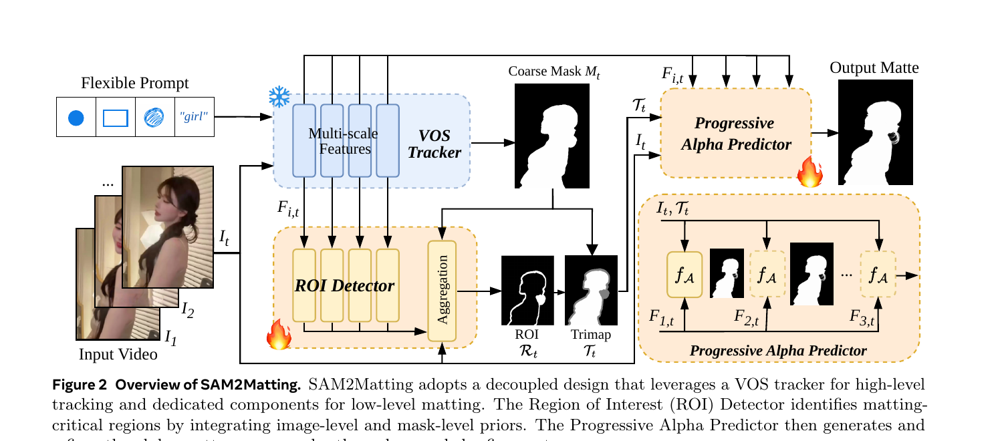
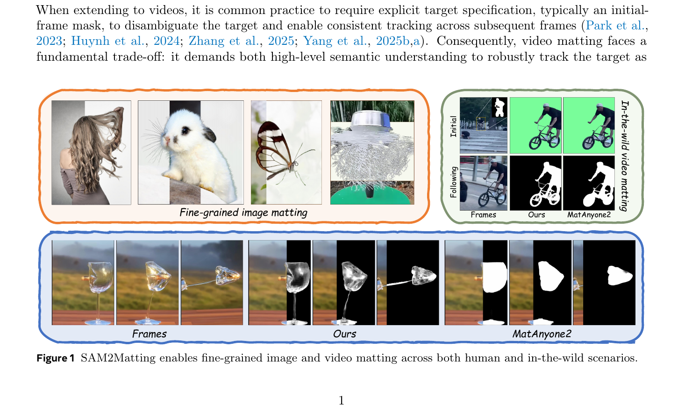
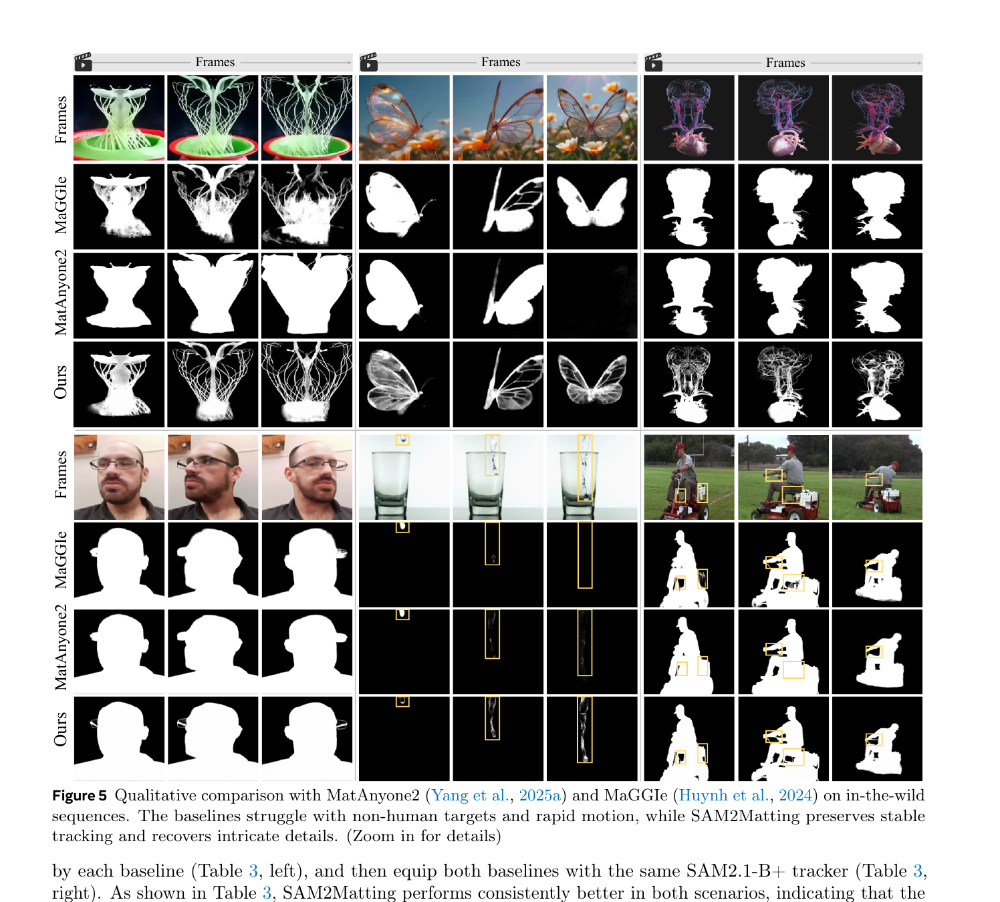
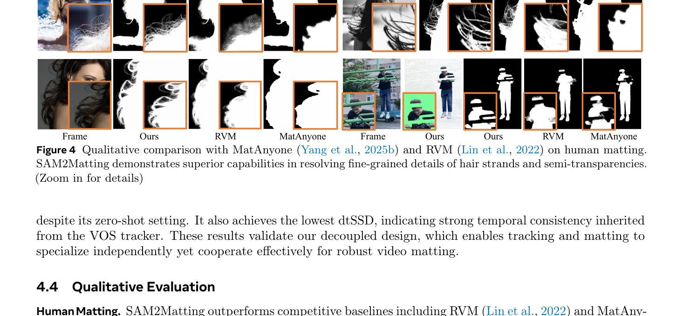

# SAM2Matting: Generalized Image and Video Matting

**机构**: Fudan University (1), Shanghai University of Finance and Economics (2)  
**作者**: Ruiqi Shen, Guangquan Jie, Chang Liu, Henghui Ding  
**代码**: [GitHub](https://github.com/FudanCVL/SAM2Matting) | **网站**: [henghuiding.com/SAM2Matting](https://henghuiding.com/SAM2Matting)

---

## 1. 一句话定位

**Tracker-to-Matting(hence "2")** 范式:冻结 VOS 追踪器(SAM2/SAM3)负责时序一致性,仅在图像抠图数据上训练轻量 ROI Detector + Progressive Alpha Predictor,实现零样本视频抠图的新 SOTA,并以 <5GB VRAM 实现实时(40 FPS @ 1080p)。

---

## 2. 要解决的问题(动机)

视频抠图需要同时满足两个相互矛盾的要求:

| 子任务 | 要求 | 现有解法 |
|-------|------|---------|
| **高级追踪** | 帧间语义一致性、跨遮挡目标识别 | VOS 模型(SAM2 等)在大规模数据上预训练 |
| **低级抠图** | 像素级 alpha 值、细发丝/半透明细节 | 图像抠图数据集上的专用网络 |

现有视频抠图方法的困境:
- 在专用视频抠图数据集上训练 → 数据集昂贵且以人为中心,泛化差
- 在 VOS 预训练模型上 fine-tune → 损害追踪鲁棒性(见 Table 6 & Fig. 10)
- 规则化 ROI 生成(形态学膨胀/腐蚀) → 无法捕获发丝、半透明边界(见 Fig. 3)

**核心洞察**: 追踪和抠图是可以**解耦**的——追踪交给 VOS 处理,抠图专注于图像级精细细节。

---

## 3. 与前作的关系

| 方法 | 范式 | 局限 |
|------|------|------|
| RVM (Lin et al., 2022) | 端到端视频抠图 | 训练数据少、泛化差 |
| MatAnyone/MatAnyone2 (Yang et al., 2025) | VOS mask → 形态学 ROI → 抠图 | 规则化 ROI 丢失细节;域外场景失败 |
| MaGGIe (Huynh et al., 2024) | mask-guided 梯度方法 | 基于人体专用数据,野外失败 |
| **SAM2Matting** | **解耦:追踪器冻结 + 仅在图像数据训练** | 无视频标注依赖,零样本推理 |

**关键 incremental claim**:
1. VOS 追踪器完全冻结 → 追踪能力不受损
2. 训练数据全是**图像**抠图集 → 无需昂贵视频抠图标注
3. 学习型 ROI Detector 替代规则化形态学操作 → 精准捕获半透明/细节区域

---

## 4. 核心算法/方法

### 4.1 整体流程



> Fig. 2: 蓝色冻结模块(VOS Tracker)处理时序追踪;黄色可训练模块(ROI Detector + Progressive Alpha Predictor)处理精细抠图。两组件共享 Tracker 的多尺度特征 `F_{i,t}`。

```
每帧 t:
  Input: I_t(帧) + Flexible Prompt(首帧 mask/点/框/文本)
  
  Step 1: VOS Tracker (冻结)
    → Coarse Mask M_t ∈ {0,1}^{H×W}
    → Multi-scale Features F_{i,t}, i∈{1,...,n}
  
  Step 2: ROI Detector (可训练)
    → ROI R_t ∈ {0,1}^{H×W}  (matting-critical 区域)
  
  Step 3: Pseudo-Trimap 生成
    → T_t: M_t 的确定前/背景 + R_t 标记的未知区域(0.5)
  
  Step 4: Progressive Alpha Predictor (可训练)
    → A_t ∈ (0,1)^{H×W}  (最终 alpha matte)
```

### 4.2 ROI Detector(关键创新)

将 ROI 检测重新定义为**像素级二分类**任务。每个尺度 `i∈{1,...,n}` 的卷积 ROI 头:

$$
L_{t,i} = f_{R,i}(F_{t,i},\; M_{t,i},\; I_{t,i})
$$

其中输入 `F_{t,i}` 是 VOS 的多尺度图像特征,`M_{t,i}` 是 resize 后的 mask,`I_{t,i}` 是 resize 后的原图。各尺度 logit 图上采样后拼接,经层级卷积聚合网络融合:

$$
L_t = f_\varphi\!\left(\left[U(L_{t,1}),\, U(L_{t,2}),\, \cdots,\, U(L_{t,n})\right]\right)
$$

最终 ROI 二值预测(阈值 `θ=0.65`):

$$
\mathcal{R}_t = \mathbf{1}\!\left[\sigma(L_t) \geq \theta\right]
$$

📌 **代码实现**(`sam2/modeling/sam2matting_base.py:95-165`):
- `unknown_region_predictor` 有三个尺度模块:`scale_64`(输入 dim=32+1+3)、`scale_128`(dim=64+1+3)、`scale_256`(dim=256+1+3)
- 各产生 64-dim 特征图,上采样到最大尺度后拼接(64×3=192)
- `unknown_fusion`: Conv 192→64→32→1,输出 ROI logit

### 4.3 Pseudo-Trimap 生成

将 VOS mask `M_t` 与学习型 ROI `R_t` 融合为 pseudo-trimap:

$$
\mathcal{T}_{t,(h,w)} = \begin{cases} M_{t,(h,w)}, & \text{if } \mathcal{R}_{t,(h,w)} = 0 \\ 0.5, & \text{if } \mathcal{R}_{t,(h,w)} = 1 \end{cases}
$$

📌 **代码实现**(`sam2/modeling/sam2matting_base.py:230-232`):
```python
ste_mask = (unknown_region_inputs.sigmoid() > 0.65).float()
ste_mask = ste_mask * 0.5 + (1 - ste_mask) * mask_inputs
```

### 4.4 Progressive Alpha Predictor

粗到细的多尺度级联 alpha 估计,n=3 个尺度。各尺度输入 `X_{t,i}`:

$$
X_{t,i} = \begin{cases} [F_{t,1},\; \mathcal{T}_{t,1},\; I_{t,1}], & i = 1 \\ [F_{t,i},\; \mathcal{T}_{t,i},\; I_{t,i},\; U(\mathcal{A}_{t,i-1})], & i \geq 2 \end{cases}
$$

各尺度先经 projection 层 `g_{A,i}` 映射到固定维度,再经 matting head `f_{A,i}` 预测:

$$
\mathcal{A}_{t,i} = \sigma\!\left(f_{A,i}(g_{A,i}(X_{t,i}))\right), \quad \mathcal{A}_{t,i} \in (0,1)^{H_i \times W_i}
$$

📌 **代码实现**(`sam2/modeling/sam2matting_base.py:238-255`):
```python
# Scale 1 (最粗 64×): features[2] + mask_64 + img_8
alpha1 = alpha_pred1(unknown_alpha_predictor["scale_64"](m_f_img1))
# Scale 2 (128×): features[1] + mask_128 + img_4 + alpha1(上采)
alpha2 = alpha_pred2(unknown_alpha_predictor["scale_128"](m_f_img2))
# Scale 3 (256×): features[0] + mask_256 + img_2 + alpha2(上采)
alpha3 = alpha_pred3(unknown_alpha_predictor["scale_256"](m_f_img3))
```

### 4.5 训练目标

**ROI Detector 损失**(focal + smoothness):

$$
\mathcal{L}_\mathcal{R} = \mathcal{L}_{\text{focal}}(L_t, \mathcal{R}_t^{\text{GT}}) + \mathcal{L}_{\text{sm}}(L_t, \mathcal{R}_t^{\text{GT}})
$$

GT ROI 由 alpha matte 在 `[α, β]=[0.15, 0.5]` 阈值+膨胀腐蚀生成:
`δ_t = 1{α ≤ A_t^GT ≤ β}`, `R_t^GT = Dilate(δ_t) - Erode(δ_t)`

**Progressive Alpha Predictor 损失**(多尺度深度监督 + 一致性):

$$
\mathcal{L}_{\text{alpha}} = \sum_{i=1}^{n} \lambda_i \left(\mathcal{L}_{L_1}(\mathcal{A}_{t,i}, \mathcal{A}_{t,i}^{\text{GT}}) + \mathcal{L}_{\text{lap}}(\mathcal{A}_{t,i}, \mathcal{A}_{t,i}^{\text{GT}})\right)
$$

损失权重 `λ_1=0.3, λ_2=0.6, λ_3=1.2`(细尺度权重更大)。

**Matte-Mask 一致性惩罚**(防止 alpha 在 mask 前景内出现空洞):

$$
\mathcal{L}_{\text{con}} = \mathcal{L}_{\text{seg}}(\mathcal{A}_t, M_t), \quad \mathcal{L}_\mathcal{A} = \mathcal{L}_{\text{alpha}} + \mathcal{L}_{\text{con}}
$$

**总损失**: `L = L_R + L_A`

---

## 5. 关键代码位置

| 组件 | 文件 | 关键位置 |
|------|------|---------|
| SAM2Matting 模型基类 | `sam2/modeling/sam2matting_base.py` | 全文 |
| ROI Detector 构建 | `sam2matting_base.py` | `_build_unknown_region_predictor()` L95-140 |
| Alpha Predictor 构建 | `sam2matting_base.py` | `_build_unknown_alpha_predictor()` L142-190 |
| ROI 检测前向 | `sam2matting_base.py` | `_detect_unknown_region()` L192-215 |
| Alpha 前向+Pseudo-Trimap | `sam2matting_base.py` | `_forward_alpha_heads()` L217-260 |
| 图像推理入口 | `inference_image_sam2.py` | 全文 |
| 视频推理入口 | `inference_video_sam2.py` | 全文 |
| SAM3 推理 | `inference_image_sam3.py`, `inference_video_sam3.py` | 全文 |
| 模型 config (Base+) | `sam2/configs/sam2matting-sam2.1base+.yaml` | 全文 |

---

## 6. 关键配置项

| 配置 | 值 | 来源 |
|------|----|------|
| VOS Tracker 选项 | SAM2.1-Tiny / SAM2.1-Base+ / SAM3 | 3 variants |
| Alpha Predictor 尺度数 n | 3 | Paper §4.1 |
| ROI 阈值 θ | 0.65 | Paper §4.1 |
| Alpha GT 阈值 [α, β] | [0.15, 0.5] | Paper §3.5 |
| 损失权重 [λ1, λ2, λ3] | [0.3, 0.6, 1.2] | Paper §4.1 |
| 训练 epoch | 5 | Paper §4.1 |
| 训练 GPU | 4 × NVIDIA A6000 | Paper §4.1 |
| batch size | 32 | Paper §4.1 |
| 优化器 | AdamW | Paper §4.1 |
| 训练数据 | 8 个图像抠图数据集(无视频数据) | Paper §4.1 |
| 视频推理模式 | **零样本** | Paper §4.3 |
| SAM2.1-T 推理速度 | 40 FPS @ 1080p, 3.08 GB VRAM | Table 7 |
| SAM2.1-B+ 推理速度 | 30 FPS @ 1080p-2160p, 3.42-6.45 GB VRAM | Table 7 |
| mask input 编码 | `logit = mask > 0 ? 20 : -10` (binary → logit space) | `inference_image_sam2.py:35` |

---

## 7. 实验结果

### Table 1: Image Matting (P3M-500-NP)

| Method | MAD↓ | MSE↓ | Grad↓ | Conn↓ |
|--------|------|------|-------|-------|
| MAM (Li et al., 2024b) | 15.40 | 9.20 | 14.22 | 25.82 |
| **SAM2Matting (SAM2.1-T)** | **3.92** | **1.07** | **8.66** | **5.34** |
| **SAM2Matting (SAM2.1-B+)** | **3.81** | **1.00** | **8.78** | **5.97** |
| **SAM2Matting (SAM3)** | 3.83 | 0.97 | 8.48 | 5.84 |

### Table 2: Video Matting (零样本评估)

| Method | V-HIM60-Medium MAD↓ | V-HIM60-Hard MAD↓ | VideoMatte-SD MAD↓ | dtSSD↓ |
|--------|---------------------|-------------------|--------------------|--------|
| MatAnyone2 (supervised) | 15.12 | 5.86 | 15.30 | 1.12 |
| **SAM2Matting (SAM2.1-T)** | **13.76** | **4.28** | **18.58** | **1.22** |
| **SAM2Matting (SAM2.1-B+)** | **13.71** | **4.24** | **18.20** | **1.15** |
| **SAM2Matting (SAM3)** | **11.77** | **4.37** | **14.37** | **1.11** |

SAM3 变体在 V-HIM60-Medium 上大幅超越 MatAnyone2(11.77 vs 15.12)并且以零样本实现;dtSSD 最低说明时序一致性最强。

### 消融实验结论(Table 4, 5)

| 组件 | 去掉后影响 |
|------|----------|
| 学习型 ROI Detector | MAD 从 18.20 → Morphological 29.82 / Mask-only 20.07 |
| Progressive Scaling (多尺度) | MAD 19.43 vs 18.20 |
| Matte-Mask Consistency Loss | 前景内出现空洞(Fig. 9) |
| Smooth Loss | 边缘出现锯齿(Fig. 9) |

---

## 8. 关键定性结果



> Fig. 1: 左侧:SAM2Matting 在细发丝、兔毛、半透明蝴蝶翅膀等图像抠图场景表现出色。右上:自行车视频追踪 SAM2Matting 正确保留车架细节而 MatAnyone2 失败。右下:动态倒水的透明杯子,MatAnyone2 退化为粗轮廓,SAM2Matting 保留半透明细节。



> Fig. 5: 与 MaGGIe/MatAnyone2 对比。非人类目标(植物结构、蝴蝶翅膀半透明、心脏解剖模型)和快速运动场景中,SAM2Matting 稳定追踪并恢复细节,而两个 baseline 均显著失败。



> Fig. 4: 与 MatAnyone/RVM 的人像抠图对比。SAM2Matting 在飞散发丝和半透明区域(烟雾效果)细节精度显著更高。

---

## 9. 争议/权衡

| 问题 | 分析 |
|------|------|
| **依赖 VOS Tracker 质量** | Tracker 失败时 ROI Detector 可以部分纠错(以 mask 为一个 cue 而非硬约束),但严重遮挡仍可能导致追踪中断 |
| **仅在图像训练的局限** | 视频内跨帧特征聚合完全依赖 VOS 的 memory attention,alpha 分支无显式时序建模 |
| **视频 fine-tuning 两难** | Table 6 证明在 V-HIM2K5 上 fine-tune 可改善域内 benchmark 但损害域外泛化和追踪鲁棒性 |
| **对比 baseline 不够多** | 未与 TempoMaster、FramePack 等新型长视频处理方案对比(不同赛道) |
| **alpha 分辨率限制** | 最终 alpha 输出为 256×256 scale 后 upsample 到原图,超高分辨率细节可能损失 |
| **SAM3 显著优于 SAM2** | V-HIM60-Medium: 11.77 vs 13.71(B+),说明 Tracker backbone 质量对最终抠图影响大 |

---

## 10. 一句话总结

SAM2Matting 的关键洞察是:视频抠图中的**追踪**和**细节提取**是可分离的,VOS 追踪器不需要接触 pixel-level alpha 数据就能提供可靠的时序追踪,而学习型 ROI Detector 替代规则形态学操作精准定位需要 alpha 估计的边界/半透明区域,整套系统仅用图像数据训练即可零样本实现视频 SOTA。

---

## Q&A 占位符

> **Q: Pseudo-Trimap 如何保证 ROI 检测错误不污染最终 alpha?**  
> A: ROI Detector 的输出仅决定哪些区域为"unknown",Tracker mask 作为确定前/背景的锚;同时 Matte-Mask Consistency Loss `L_con` 约束 alpha 在 mask 前景区域内不出现空洞,两者共同缓解 ROI 误检影响。

> **Q: 为什么视频推理是零样本而图像推理不是?**  
> A: 训练数据是图像集,模型本身在图像 matting 上有监督学习;视频 matting 的时序维度完全由冻结的 VOS Tracker 负责,不需要额外视频标注,因此视频 benchmark 上的评估是零样本的。

> **Q: mask_input 为什么编码为 logit 空间(20/-10)?**  
> A: SAM2 的 mask decoder 期望输入的是未经 sigmoid 的 logit 值,±10 对应 sigmoid 后约 0.999/0.00005,相当于 hard binary mask 的 logit 表示(见 `inference_image_sam2.py:35`)。
