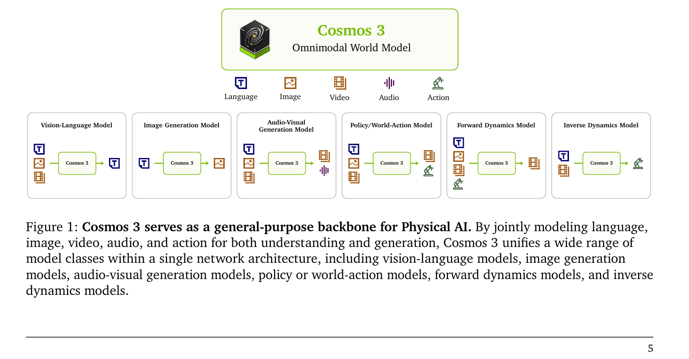
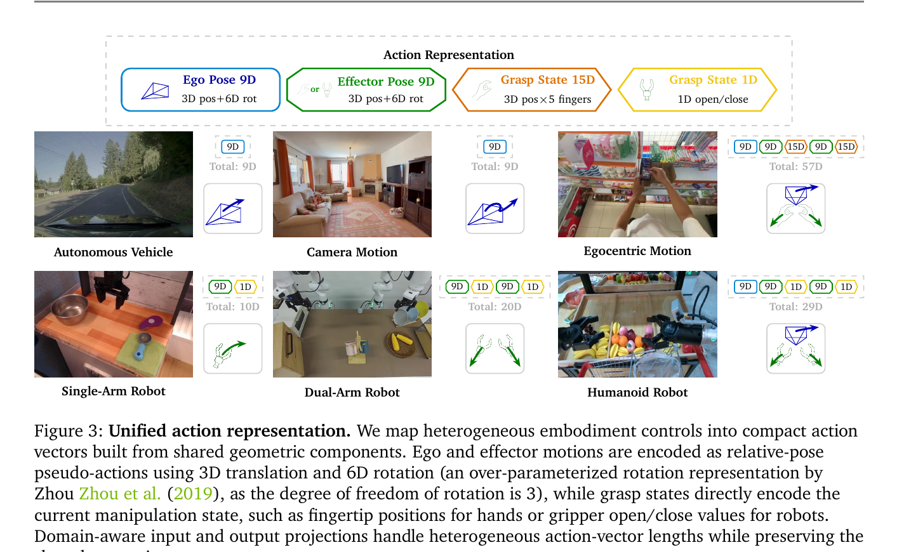
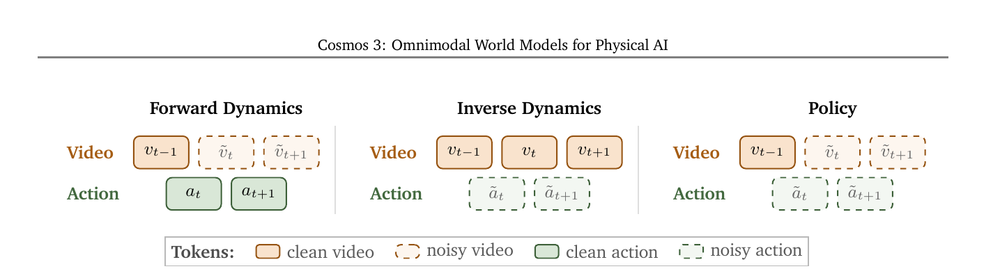
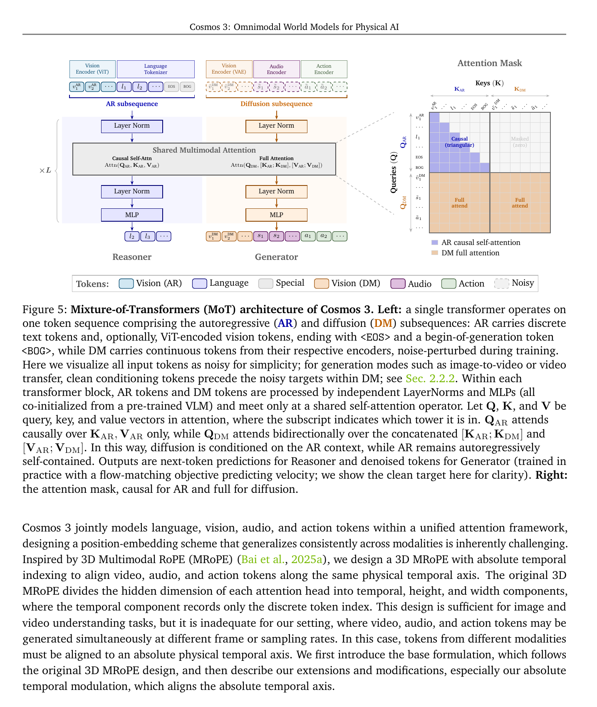
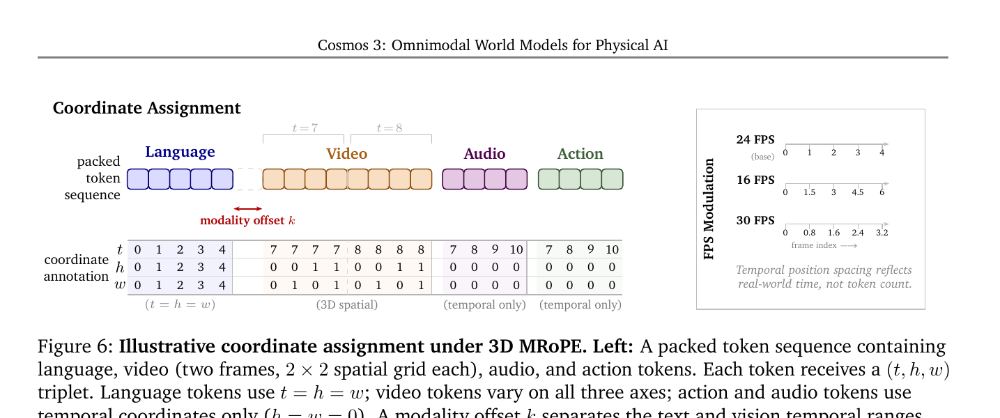
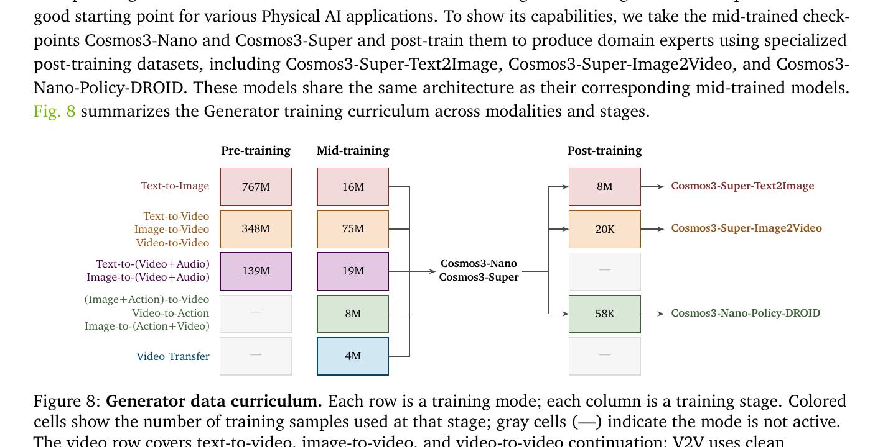
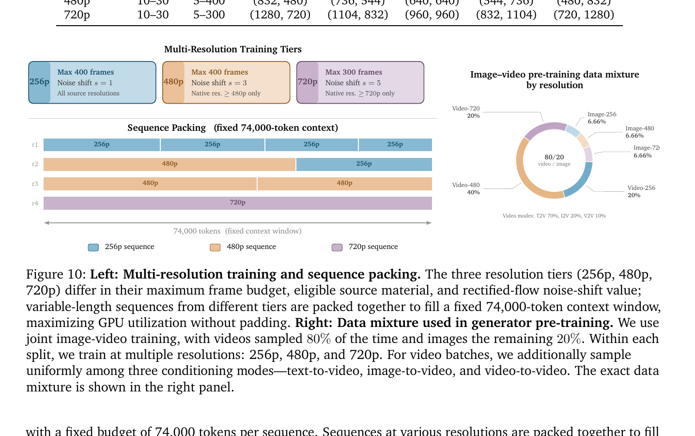
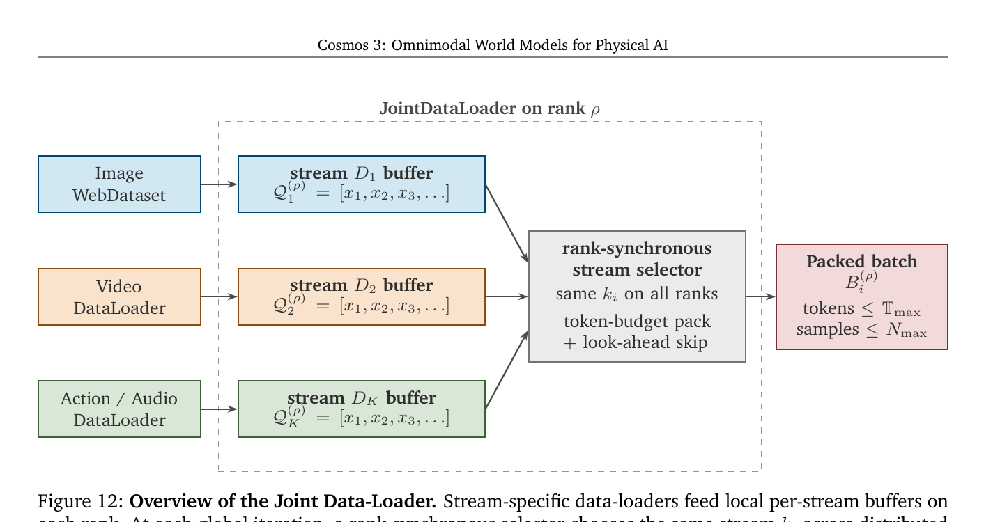

# Cosmos 3 论文与代码解读

> 论文:Cosmos 3: Omnimodal World Models for Physical AI (arXiv 2606.02800v1, NVIDIA, 2026-06)
> 项目主页:https://research.nvidia.com/labs/cosmos-lab/cosmos3
> 代码:https://github.com/nvidia/cosmos + https://github.com/nvidia/cosmos-framework
> 模型权重:https://huggingface.co/collections/nvidia/cosmos3
> 任务:**Physical AI 通用基础模型**(理解 + 生成 + 动作,跨 5 模态)

## 一、一句话定位

Cosmos 3 = **NVIDIA 的"机器人/具身智能基础模型"**。把 VLM + 视频生成 + 世界模拟 + 动作策略合并成**一个 Mixture-of-Transformers(MoT)双塔架构**,五种模态(语言/图/视/音/动作)共用 backbone,根据 token 排列自动切换 AR 模式(reasoner)或 Diffusion 模式(generator)。Cosmos3-Super (64B) 在 Artificial Analysis 评测里 T2I + I2V 双开源第一,Cosmos3-Nano-Policy-DROID 在 RoboArena 上是策略模型第一。



> Fig 1:**Cosmos 3 同时充当 6 类传统专用模型的能力**。顶端的"Omnimodal World Model"接收语言/图像/视频/音频/动作五种模态作为 input 候选(顶部 5 个图标),底下 6 个 box 是它能扮演的角色:
> - **Vision-Language Model**:输入语言+图+视,输出语言 → 经典 VLM 多模态问答
> - **Image Generation Model**:输入语言,输出图 → T2I
> - **Audio-Visual Generation Model**:输入语言,**同时输出视频+音频** → 视音联合生成(注意 Veo-3.1 的核心能力)
> - **Policy / World-Action Model**:输入语言+图+视,**同时输出视频+动作** → 联合 policy
> - **Forward Dynamics Model**:输入语言+图+视+动作,输出视频 → 给动作模拟未来
> - **Inverse Dynamics Model**:输入语言+视频,输出动作 → 从观察反推动作
>
> 核心点:这 6 种能力**不是 6 个 adapter / 6 个 head 拼起来**,而是 1 套 weights + 不同的 token 排列(详见 §4.2)。这就是 "omnimodal" 的实义。

## 二、要解决的问题(动机)

Physical AI agent 需要两个底层能力:**Understanding**(从局部观测推断潜在世界状态)+ **Generation**(预测未来、模拟动作后果)。当前 paradigm 把这两件事拆成多个独立模型:

| 模型类 | 干什么 | 缺什么 |
|--------|--------|--------|
| VLM | 看懂场景,出文字 plan | 不会生成未来视频 |
| Video Generator / Forward Dynamics | 模拟未来 | 不会理解 task 语义 |
| VLA / World-Action Model | 输出控制信号 | 通常是端到端黑盒,缺世界模型 |

论文核心论点:**理解和生成本质耦合** —— 理解需要预测未来,生成需要结构化世界表示。把它们 unify 成一个模型才是正确路线。

举例:家用机器人收拾餐桌,当前 paradigm 要拼一堆模型(VLM 找盘子 + VLA 出动作 + Forward Dynamics 模拟结果),fragmented architecture + 计算浪费。Cosmos 3 的目标是 **一个网络全部包了**。

## 三、与前作的关系

Cosmos 3 跨 6 个相关领域,但最相关的是 omnimodal 统一架构这条线:

| 路线 | 代表 | Cosmos 3 的差异 |
|------|------|----------------|
| **VLM-only** | Qwen3-VL, Gemma-4, Gemini 3.1 | + 生成能力,+ 动作模态 |
| **Video Gen-only** | Wan2.x, Veo, Sora, Self-Forcing, LongLive 2.0 | + 理解能力(物理常识、CoT)+ 动作 |
| **VLA / WAM** | RT-2, OpenVLA, π0, MolmoAct, Cosmos-WAM | + 高质量 video gen + 多 embodiment 动作统一 |
| **Unified gen+und** | Chameleon, Emu, Deng et al. 2025 | + Physical AI 数据特化 + MoT 双塔(而非单塔) |

incremental claim:Cosmos 3 是**第一个工业级的、跨 5 模态的 Physical AI 统一基础模型**,且每个细分任务都达到/超过该领域 SOTA。

## 四、核心算法/方法

### 4.0 整体架构鸟瞰

```
            [Language] [Image-ViT] [Image-VAE] [Audio] [Action]
                │          │           │         │        │
                ▼          ▼           ▼         ▼        ▼
              ─── AR subsequence ───  ─── DM (diffusion) subsequence ───
                       │                          │
                       ▼                          ▼
              ┌──── Reasoner Tower ────┐ ┌──── Generator Tower ────┐
              │ LN + MLP + (Q,K,V proj)│ │ LN + MLP + (Q,K,V proj) │  × L layers
              │     (独立参数)          │ │      (独立参数)          │
              │            \____________│_│____________/            │
              │            Shared Multimodal Self-Attention         │
              │              Q_AR causal / Q_DM full bidirectional  │
              └────────────────────────┘ └────────────────────────┘
                       │                          │
                       ▼                          ▼
                  next-token pred            denoised tokens (flow matching)
```

四个核心设计:**Encoders(2.1)** → **Token Arrangement(2.2)** → **MoT 双塔(2.3)** → **3D MRoPE 绝对时间(2.4)**。

### 4.1 Encoders:每模态一个,**视觉走两路**

每种模态用独立 encoder 编码,且**每个非语言模态加一个 learnable modality embedding** 帮 backbone 区分身份。

| 模态 | Encoder | 训练状态 |
|------|---------|---------|
| **Vision-AR**(理解) | 预训练 ViT,16×16 patch + 2 层 MLP + 2×2 token merge,DeepStack 多层聚合 | 跟 backbone 联合训练 |
| **Vision-DM**(生成) | Wan2.2-TI2V-5B VAE(4× temporal, 32×32 spatial) | **frozen** |
| Audio | Audio VAE(Lee et al. 2025b),48kHz/1920 hop → 25 token/sec | frozen |
| Action | Domain-aware linear 投影(每 embodiment 一对 W_in/W_out) | 跟 backbone 联合 |
| Language | Standard text tokenizer | — |

📌 **关键设计 #1:视觉拆两个 encoder**。理解和生成的目标本质冲突 —— ViT(vision-language 对齐)语义强、reconstruction 弱;VAE(reconstruction 训练)像素质量好、语义浅。Cosmos 3 直接放弃 unified encoder,**在 backbone 里用 MoT 双塔分别处理**两套 token。Chameleon/Emu 的"单一 encoder"路线 trade off 不够干净,Cosmos 3 是工程务实选择。

#### 4.1.1 Action representation(论文最值得专门读的子节)

跨 embodiment 的动作空间(关节轨迹 vs 转向 vs body pose vs camera transform)用**共享几何成分**统一:



> Fig 3:**6 种异质 embodiment 怎么映射到同一个动作 token 空间**。最上方的图例展示了 4 种基础"积木"——蓝色 Ego Pose 9D(主观察坐标的 3D 位移+6D 旋转)、绿色 Effector Pose 9D(末端执行器的 3D+6D)、橙色 Grasp State 15D(5 指×3D 指尖位置,用于人手)、黄色 Grasp State 1D(夹爪 open/close)。下方 6 个 embodiment 各自拼装:
> - **Autonomous Vehicle**:只有 ego pose 9D(车不抓东西)→ 总 9D
> - **Camera Motion**:ego 9D + effector 9D(相机有平移+旋转)→ 总 9D
> - **Egocentric Motion**(头戴+双手):头 ego 9D + 双 wrist 各 9D + 双手 grasp 各 15D → 总 57D
> - **Single-Arm Robot**:effector 9D + 1D grasp → 总 10D
> - **Dual-Arm Robot**:2× (effector 9D + 1D grasp) → 总 20D
> - **Humanoid Robot**:头 ego 9D + 双臂 effector + 双手 grasp 15D → 总 57D
>
> 注意 humanoid 和 egocentric 总维度都是 57D 但**结构不同**(humanoid 有 ego,human 也有 ego 但语义不同),所以仍需 domain-aware I/O 投影做区分。

三个核心成分:

| 成分 | 含义 | 维度 |
|------|------|------|
| **Ego Pose** | agent 主观察坐标系的运动 | 9D = 3D translation + 6D rotation |
| **Effector Pose** | 末端执行器(夹爪/手腕)的运动 | 9D = 3D translation + 6D rotation |
| **Grasp State** | 当前抓握状态(直接编码,**非 delta**) | 1D(夹爪 open/close)或 15D(5 指 × 3D 指尖位置) |

几个设计要点:
- **Pose 用相对变换(delta)**:$\Delta T_t = T_{t-1}^{-1} T_t$,避免依赖具体 PID 参数或 actuator 接口
- **6D 旋转**(Zhou et al. 2019):自由度 3 但表达 SO(3) 时连续,比四元数/欧拉角更易学
- **Grasp state 直接编码当前状态**,不做 delta —— 抓握/松开是离散事件,delta 没意义
- **拼装规则**:不同 embodiment 维度不同(车 10D,humanoid 57D 精简到 29D),**domain-aware I/O 投影**:

$$
z = W_{\text{in}}^{(k)} x + b_{\text{in}}^{(k)}, \quad x = W_{\text{out}}^{(k)} z + b_{\text{out}}^{(k)}
$$

每个 embodiment $k$ 一对 $(W_{\text{in}}^{(k)}, W_{\text{out}}^{(k)})$,**MoT backbone 完全共享**。6D rotation 解码时用 SVD 还原成 3×3 SO(3)。

### 4.2 Token Arrangement + Generation Mode

任意任务的 token 序列都分**两段**:

```
[ ── AR 子序列 ── | ── DM 子序列 ── ]
   language + ViT       VAE + Audio + Action
   走 Reasoner Tower    走 Generator Tower
   causal attention     full bidirectional attention
   next-token pred      flow matching denoising
```

**子序列内部规则**:
- AR 在前,DM 在后
- DM 内每模态:clean conditioning token 在前,noisy target 在后
- 模态顺序:vision → audio → action

#### 6 种 generation mode(纯靠 token 排列切换,架构不变)

| 模式 | 序列结构 |
|------|---------|
| **Language**(VLM) | 只用 AR,DM 参数不激活 |
| **T2I** | $[S_{\text{AR}}, \tilde{v}_1]$ |
| **T2V (+Audio)** | $[S_{\text{AR}}, \tilde{v}_{1:N}, \tilde{s}]$ |
| **I2V / V2V (+Audio)** | $[S_{\text{AR}}, v_{1:P}, \tilde{v}_{P+1:N}]$,P 帧 clean conditioning |
| **Video Transfer** | $[S_{\text{AR}}, v^{\text{ctrl}}_{1:N}, \tilde{v}_{1:N}]$,depth/edge/seg 当 control |
| **Action**(3 子模式) | Forward Dyn / Inverse Dyn / Policy(见下图) |

其中 $S_{\text{AR}} = [l_1, \ldots, l_n, \langle\text{EOS}\rangle, \langle\text{BOG}\rangle]$,`<BOG>` 是 "begin-of-generation"。



> Fig 4:**同一段 (video, action) 数据**,纯靠选择"哪个 token clean 哪个 noisy"切出三种训练任务。图例:橙色实线 = clean video,橙色虚线 = noisy video,绿色实线 = clean action,绿色虚线 = noisy action。三个 case 共用一个 local 时间窗口 $\\{v_{t-1}, v_t, v_{t+1}, a_t, a_{t+1}\\}$,其中 $a_t$ 连接 $v_{t-1} \\to v_t$:
> - **Forward Dynamics**(左):动作全 clean,**未来两帧视频 $\tilde{v}_t, \tilde{v}_{t+1}$ 是 noisy 目标** → 给定动作,模型学"未来视频应该长什么样"
> - **Inverse Dynamics**(中):视频全 clean,**两个动作 $\tilde{a}_t, \tilde{a}_{t+1}$ 是 noisy 目标** → 给定连续视频,反推动作序列
> - **Policy**(右):仅历史视频 $v_{t-1}$ clean,**未来视频和未来动作都 noisy** → 同时预测"我接下来要怎么动"+"动完世界长什么样",这是 unified policy 的核心
>
> 这三种是 mid-training 阶段 "Action 25% 占比" 的具体分解形式,共享同一份 video-action 数据,只是 attention mask 模式不同。这就是 unified 模型的精髓:**任务 = token 状态的组合**,而不是独立的 task head。

### 4.3 Mixture-of-Transformers 双塔架构



> Fig 5:**这是论文最核心的一张图**。左半边展示 dual-tower 数据流,右半边展示 attention mask。
>
> **左侧 - 数据流**:
> - 顶部:5 种 encoder(Vision-ViT、Language tokenizer、Vision-VAE、Audio、Action)各自把 raw input 编码成 token,在序列中 token 分两段拼接 ——
>   - **AR subsequence**:$v_1^{\text{AR}}, v_2^{\text{AR}}, \ldots, l_1, l_2, \ldots, \langle\text{EOS}\rangle, \langle\text{BOG}\rangle$(ViT 视觉 token + 语言 token + 两个特殊 token 收尾)
>   - **DM subsequence**:$\tilde{v}_1^{\text{DM}}, \tilde{v}_2^{\text{DM}}, \ldots, \tilde{s}_1, \tilde{s}_2, \ldots, \tilde{a}_1, \tilde{a}_2, \ldots$(VAE 视觉 + 音频 + 动作 token,~ 表示加噪)
> - 中间(× L 重复 L 层):**每层** AR token 走左边 Reasoner 塔(LayerNorm → 进 attention → LayerNorm → MLP),DM token 走右边 Generator 塔。**两塔的 LayerNorm 和 MLP 参数完全独立**,从同一个 VLM 权重 init 但训练时分叉
> - 中间的 **Shared Multimodal Attention** 是**唯一的跨塔交互点** ——两塔的 Q/K/V 进同一个 attention,attention 公式:
>   - $O_{\text{AR}} = \text{Attn}(Q_{\text{AR}}, K_{\text{AR}}, V_{\text{AR}})$(只在 AR 内部 self-attend)
>   - $O_{\text{DM}} = \text{Attn}(Q_{\text{DM}}, [K_{\text{AR}}; K_{\text{DM}}], [V_{\text{AR}}; V_{\text{DM}}])$(DM 看 AR 也看自己)
> - 底部:Reasoner 输出下一个 language/vision-AR token,Generator 输出 denoised vision-DM/audio/action token
>
> **右侧 - Attention Mask**:Q 索引在纵轴,K 索引在横轴。AR Q(上半)对 AR K 是**蓝色三角因果**(只看前面),对 DM K 是**深灰 masked**(完全屏蔽,防止 DM 污染语言);DM Q(下半)对 AR K 和 DM K 都是**橙色 full attend**(全看)。这个 mask 严格保证 AR 自回归性 + DM 双向条件化。
>
> 底部图例:Vision(AR)蓝、Language 浅蓝、Special 灰、Vision(DM)橙、Audio 紫、Action 绿、Noisy 黄圈点。颜色编码贯穿整篇论文。

#### Dual-Stream Joint Attention(关键)

虽然两塔参数独立,但 attention 共享,通过 mask 规则实现单向跨流:

$$
O_{\text{AR}} = \text{Attn}_{\text{causal}}\!\left(Q_{\text{AR}}, K_{\text{AR}}, V_{\text{AR}}\right)
$$

$$
O_{\text{DM}} = \text{Attn}_{\text{full}}\!\left(Q_{\text{DM}}, [K_{\text{AR}}; K_{\text{DM}}], [V_{\text{AR}}; V_{\text{DM}}]\right)
$$

→ **AR 不被 DM 污染**(语言生成纯净),**DM 看得到 AR**(prompt + 历史给生成提供上下文)。

Attention mask 长这样:
```
              K_AR        K_DM
        ┌──────────┬──────────┐
Q_AR    │ 三角 causal │ 全 mask  │
        ├──────────┼──────────┤
Q_DM    │ 全看到    │ 全看到    │
        └──────────┴──────────┘
```

📌 **关键设计 #2:为什么是 MoT 双塔而非单一 transformer**。一套参数难以同时擅长"next-token prediction"(理解)和"flow matching denoising"(生成),两者的 loss landscape 和 token 分布都不同。双塔让每条路径有自己的 weights,只在 attention 层 fuse —— 既避免互相干扰,又保留跨模态条件化能力。

### 4.4 Multimodal Position Embedding(3D MRoPE + 绝对时间)

借鉴 Qwen3-VL 的 **3D MRoPE**(每个 attention head 的 hidden dim 切成 t/h/w 三段,各自 RoPE),但 Cosmos 3 加上**绝对时间索引**改造,关键 motivation:**视频/音频/动作可能同时生成,但各自 sampling rate 不同**,必须对齐到物理时间轴。



> Fig 6:这张图把"为什么需要绝对时间调制"讲透。
>
> **左侧 - Coordinate Assignment**:packed token 序列依次是 Language 5 个(蓝)→ Video 8 个(橙,2 帧 × 2×2 spatial)→ Audio 4 个(紫)→ Action 4 个(绿)。每个 token 拿到一个 $(t, h, w)$ 三元组:
> - **Language**:$t = h = w = 0, 1, 2, 3, 4$ —— 三轴同步,退化成 1D RoPE
> - **modality offset $k$**:从 language 末尾到 video 开头有一个红色双箭头标的 jump。论文中这个 gap = **15000**,实测能消除大模型生成时的 over-saturation 和 checkerboard artifacts
> - **Video**:$t \in \{7, 7, 7, 7, 8, 8, 8, 8\}$(同帧 4 个 token 共享 t),$h \in \{0, 0, 1, 1\}$、$w \in \{0, 1, 0, 1\}$(2×2 spatial 网格)
> - **Audio**:只用 t = 7, 8, 9, 10,$h = w = 0$(纯时间维,没有空间)
> - **Action**:同 audio,只用 t = 7, 8, 9, 10
>
> 注意 audio 和 action 的 t 起点(=7)跟 video 的最后一帧对齐 —— 因为它们都在描述"同一段时间发生的事",必须共享时间轴。
>
> **右侧 - FPS Modulation**:三个 FPS 的 frame index 在物理时间轴上的间距对比:
> - 24 FPS(基准):0, 1, 2, 3, 4 五帧均匀分布
> - 16 FPS:0, 1.5, 3, 4.5, 6 ——**间距拉宽** 1.5×(因为单帧物理时长更长)
> - 30 FPS:0, 0.8, 1.6, 2.4, 3.2 ——**间距压缩** 0.8×(单帧物理时长更短)
>
> 三条数轴**末端长度不同**,但代表的是同样的"5 帧序列"。如果不做 modulation,30 FPS 视频的 5 帧和 16 FPS 视频的 5 帧在 RoPE 上占同样的 position 范围(都是 0~4),但物理时长差近 2 倍 —— 模型完全分不清"快"和"慢"。绝对时间调制就是为了对齐这个差异。

#### Position 分配规则

| Token 类型 | $(t, h, w)$ |
|-----------|-------------|
| Language | $t = h = w$ = monotone counter(等于 1D RoPE) |
| ViT 视觉(AR) | 同帧共享 t,h/w 按空间网格 |
| Diffusion 视频 | t 跟帧索引,h/w 跟空间;**每段 vision 从 0 起算**(绝对 within-video 坐标) |
| Image | 当作单帧视频,只变 h/w |
| Audio | 只有 t($h = w = 0$),t 跟 audio hop 走 |
| Action | 只有 t,t 跟 sampling step 走 |

📌 **AR / DM margin 陷阱**:论文发现"直接让 DM 第一帧紧跟 AR 末位 → 大模型(Super) 出现 over-saturation + checkerboard artifacts"。猜测原因:最后一个 language token 跟第一个 vision token 的 temporal embedding 几乎一样,模型分不清。**解法:AR 和 DM 之间硬塞一个固定 15000 的 temporal gap**,纯加 buffer 不改架构。

#### 绝对时间调制公式

定义 TPS(Temporal-steps Per Second):

| Modality | TPS 计算 | 例 |
|----------|---------|----|
| Video | FPS / VAE_temporal_compression | 24 FPS / 4 = 6 |
| Audio | sample_rate / hop_size | 48000 / 1920 = 25 |
| Action | sampling frequency | 任意 |

选基准 $\text{TPS}_{\text{base}} = 24/4 = 6$(24 FPS 视频对应)。每个 token 的实际 temporal increment:

$$
\delta t = \frac{\text{TPS}_{\text{base}}}{\text{TPS}}
$$

→ 16 FPS 视频 $\delta = 1.5$(走快 50%);30 FPS 视频 $\delta = 0.8$(走慢 20%)。同样 1 秒真实时长,无论用 16/24/30 FPS 编码,**RoPE 上占同样的 position 范围**。

### 4.5 模型变体

所有变体都是 MoT 双塔(每层 2 套参数),"总参数 ≈ 2× LLM 参数":

| Variant | LLM Layers | Hidden | Attn / KV Heads | Head Dim | FFN | 总参数 | 初始化 |
|---------|-----------|--------|-----------------|----------|-----|--------|--------|
| **Edge** | 28 | 2,048 | 16 / 8 | 128 | 9,216 | 4B | 从头训 (Qwen3-1.7B 风格,去 QK norm,ReLU² FFN) |
| **Nano** | 36 | 4,096 | 32 / 8 | 128 | 12,288 | 16B | Qwen3-VL-8B |
| **Super** | 64 | 5,120 | 64 / 8 | 128 | 25,600 | 64B | Qwen3-VL-32B |

### 4.6 训练目标:Rectified Flow Matching

整个 Generator 用统一的 rectified flow,**比传统 DDPM 简单**:

$$
x_\sigma = \sigma \cdot \epsilon + (1 - \sigma) \cdot x_0
$$

$$
v_\theta(x_\sigma, \sigma, c) \to v^* = \epsilon - x_0
$$

Loss = masked MSE,conditioning token 不计入。

Per-modality time sampling:每模态独立采 $\sigma$。图/音/动作用 **logit-normal**,视频用 **mode sampling**。再过一次 shift reparameterization:

$$
\sigma = \frac{s \cdot \bar{t}}{1 + (s - 1) \cdot \bar{t}}, \quad \bar{t} = 1 - t
$$

$s \geq 1$ 偏向高噪声。$s$ 按分辨率调:256p $s = 1$,480p $s = 3$,720p $s = 5$(pre-train),mid-train 涨到 3 / 5 / 10。

## 五、数据与训练流程

整体两大阶段:**Reasoner 先训(语言/视觉理解)→ 用 Reasoner 初始化 Generator,然后 Generator 三阶段渐进训练**。

### 5.1 Reasoner Data + Training

| 阶段 | 样本 | 关键设计 |
|------|------|---------|
| Pre-Training | **22M** | Nemotron Nano 2 + 自有 2.3M,**两阶段 curation**:① Qwen3-VL-Embedding-8B 做 K-means + cosine 去重(去 4.23%),② Gemma-4-31B 当 AI judge,三维度 (Faithfulness / Completeness / Correctness) 打 1-5 分,min-threshold ≥ 2 保留 78% |
| SFT | **2.2M** | importance-aware sampling,**保留 20% pre-training data 防遗忘**(1:4 比例),三大 Physical AI 域:AV、Robotics、Smart Infra |

Pre-train hyperparams:lr 5e-5 (LLM/projector) + 5e-6 (ViT,小 10×),cosine decay,10% warmup,2 epoch,**square-root normalized per-token loss**(平衡长短序列)。

📌 **不做 alignment-only 阶段**:不像 Qwen 那样先冻 LLM 训 projector,直接所有组件一起从头训,论文说效果更好。

### 5.2 Generator Data + Training



> Fig 8:**Generator 三阶段渐进训练的全景**。表格三列对应 Pre/Mid/Post 三阶段,每行一种训练模式,格子里数字是该 mode 在该阶段的样本量,空格 / "—" 表示该阶段不参与:
> - **Text-to-Image**:Pre 767M → Mid 16M → Post 8M(成为 **Cosmos3-Super-Text2Image**)。pre-train 的图量是 video 的 2 倍多,先打牢图像基础
> - **T2V / I2V / V2V**(三种 video mode 合行展示):Pre 348M → Mid 75M → Post 20K(**Cosmos3-Super-Image2Video**)
> - **Video+Audio**(T2、I2、V2 三种 audio 联合):Pre 139M → Mid 19M → **Post 不做**(直接由 mid-trained Nano / Super 提供)
> - **Image+Action → Video / V2A / I2(A+V)** 三种 action 模式合行:**Pre 阶段完全空白**,Mid 阶段才 8M 引入,Post 58K → 成 **Cosmos3-Nano-Policy-DROID**
> - **Video Transfer**:Pre 空白,Mid 4M,Post 空白
>
> 关键观察:
> 1. **Action / Transfer 完全跳过 pre-train,只在 mid-train 引入** —— 论文逻辑:必须先有强视觉生成基础(Pre 接近 1B 视觉样本),再加 action conditioning 才有意义。否则模型还没学会"什么是真实视频"就被迫学"动作怎么映射到视频",会很糟
> 2. **Audio 在 post-train 直接 truncate**(没有 post-train 列)—— 论文判断 audio 不需要单独 specialization
> 3. Post-train 三个箱子用样本量极少(K 量级 vs Pre 的 M 量级),**post-train 是 fine-tune 不是再训** —— 仅做 task-specific 校准
>
> 三个 post-train 产物对应三个领跑成绩:T2I 91.26 UniGenBench、I2V 第一、RoboArena 第一。

#### 5.2.1 Pre-Training(31T tokens for Nano)



> Fig 10:**左侧 - Multi-Resolution Training Tiers**:三个分辨率 tier 横排,每 tier 一个标题块写明:
> - **256p**:Max 400 帧,Noise shift $s = 1$,All source resolutions(全数据都吃)
> - **480p**:Max 400 帧,Noise shift $s = 3$,Native res ≥ 480p only(只吃原生 480p+ 数据,保住"高清"语义)
> - **720p**:Max 300 帧(因为太大,只能少 100 帧),Noise shift $s = 5$,Native res ≥ 720p only
>
> Noise shift 用 rectified-flow shift 公式 $\sigma = s \bar{t}/(1+(s-1)\bar{t})$,$s$ 越大 σ 分布越偏高噪声,**分辨率越高、信号越复杂,需要把训练时间多分配到高噪声区段**(高噪声是"打底"阶段,决定大尺度结构)。
>
> 左下 - **Sequence Packing**:固定 74,000-token 上下文窗口里挤进 4 行示例,每行一个 packed batch:
> - r1:全 256p,4 个样本挤一行(分辨率低,单样本 token 少)
> - r2:1 个 480p + 1 个 256p,2 个样本
> - r3:1 个 480p + 1 个 480p,2 个样本
> - r4:1 个 720p 单独占满
>
> **完全不 padding**——把每条 mini-batch 都填到接近 74,000 token,GPU 利用率最大化。这是 Joint Data-Loader §6 的基础。
>
> **右侧 - Image-Video Pre-Training Data Mixture by Resolution**:饼图分两层,
> - 外层 80/20 划分:**video 80% + image 20%**
> - image 分三档:Image-256 / Image-480 / Image-720 各 6.66%
> - video 分三档:Video-256 20% / Video-480 **40%**(最大块,因为 480p 是 sweet spot)/ Video-720 20%
> - 饼图右下角注:Video modes = T2V 70% + I2V 20% + V2V 10%
>
> 这套比例是 pre-train 阶段的"配方"。Mid-train 重新配比(action 25%、transfer 25% 等)。

**4 种训练模式**(按 $T_{\text{cond}}$ 区分,采样比例 20:56:16:8):
- **T2I**: $T = 1$,纯 image
- **T2V**: $T_{\text{cond}} = 0$,全 noisy
- **I2V**: $T_{\text{cond}} = 1$,首帧 clean
- **V2V**: $T_{\text{cond}} = 2$,前 5 帧(2 个 latent 帧)clean

**关键**:**只更新 Generator 参数,Reasoner 冻结**,保证理解能力不退化。

📌 **训练规模**:
- Nano: **31.05T tokens on 1024 × NVIDIA GB200**
- Super: **17.86T tokens on 2048 × NVIDIA GB200**

#### 5.2.2 Mid-Training(关键阶段,引入 action 和 transfer)

Data mixture(Table 6):

| 流 | 模式 | 比例 |
|----|------|------|
| Image | T2I | 10% |
| Video | T2V/I2V/V2V | 32% |
| Video + Audio | T2(V+A)/I2(V+A)/V2(V+A) | 8% |
| **Action** | Forward dyn / Inverse dyn / Policy | **25%** |
| **General Transfer** | Edge / blur / depth / segmentation | **20%** |
| Driving Transfer | World-scenario-map controls | 5% |

Action loss × 10×(因为 action vector 已 normalize,per-element MSE 比图像小)。

训练规模:Nano 2.4T tokens / 1024 GB200,Super 1.9T tokens / 2048 GB200。

#### 5.2.3 Post-Training:三个特化案例

| 模型 | 关键超参 | 战绩 |
|------|---------|------|
| **Cosmos3-Super-Text2Image** | 两阶段 SFT(20k step broad + 2k step refinement),470K ultra-high-quality 配对 | UniGenBench **91.26**,Artificial Analysis 开源第一 |
| **Cosmos3-Super-Image2Video** | 10k iter @ lr 1e-5,~50B token,目标 480p × 189 帧 ≈ 8 秒 | Artificial Analysis I2V 开源第一 |
| **Cosmos3-Nano-Policy-DROID** | 76K 轨迹,32 个未来 joint position + RGB 辅助,15 Hz,**action lr × 5×** | RoboLab + RoboArena 双第一 |

📌 **Reasoner 全程冻结**:Generator 训练时 Reasoner 的 K, V 仍参与 attention(被 DM query 看到),所以 inference 也要 load 整个 Reasoner —— 用空间换"理解能力不退化"。

## 六、Infrastructure 重点:Joint Data-Loader

Cosmos 3 训练涵盖 5 模态,**单条样本 token 数差 2 个数量级**(单条文本 vs 720p 视频)。传统 LLM data loader 失效:
- 等 sample 数 → padding 爆炸、负载不均、NCCL timeout
- 等 token 数(各 rank 独立) → 各 rank 模态分布不同 → attention FLOPs 不均(O(n²))



> Fig 12:**单 GPU rank ρ 上的 Joint Data-Loader 数据流**。左到右四个阶段:
>
> 1. **Stream-specific sources(最左 3 个色块)**:每种数据源有自己的底层 loader——
>    - Image 走 WebDataset 格式(蓝色)
>    - Video 走自定义 DataLoader(橙色)
>    - Action / Audio 走另一个 DataLoader(绿色)
>
> 2. **Per-stream buffers(中左,虚线框内)**:每个 stream 在每个 rank 都有自己的 prefetch buffer $\mathcal{Q}_k^{(\rho)} = [x_1, x_2, x_3, \ldots]$,异步预取藏 I/O 延迟。这一步保证"流水线不饿死"
>
> 3. **Rank-synchronous stream selector(中间灰块)**:这是论文最关键的工程贡献。在每个 global iteration $i$,**所有 rank 用 globally seeded 选 $k_i$,同时刻吃同一个 stream**(全员选 image / 全员选 video,绝不能跨 rank 不一致)。
>    - 块里两行说明 "same $k_i$ on all ranks" + "token-budget pack + look-ahead skip"
>    - 为什么必要:不同 rank 选了不同 modality → token 数差几十倍 → attention FLOPs(O(n²))差几百倍 → NCCL all-reduce 等慢的 → 训练阻塞
>    - 实测**单这一项提升训练吞吐 54%**
>
> 4. **Packed batch(最右红块)**:rank ρ 最终输出的 $B_i^{(\rho)}$,两个 budget 约束:
>    - $\text{tokens} \leq \mathbb{T}_{\max}$(主要约束,= 74,000)
>    - $\text{samples} \leq N_{\max}$(防御性约束,防止单 batch 塞太多样本)
>
> 结合 look-ahead packing(Fig 13,本笔记没截入):**额外 +8% effective sequence length**。两者叠加是 Cosmos 3 能在 5 模态 + 2048 GPU 上稳跑的工程根基。

四个核心机制:
1. **Token-budgeted packing**:严格 token budget $T_{\max}$,greedy pack,**完全不 padding**
2. **Joint Data-Loader**:每 stream 独立 prefetch buffer,joint loader 复用
3. **Rank-synchronous stream selection**:globally seeded selector,**所有 rank 同步选同一个 stream**,保证 NCCL 步时一致 → **+54% 吞吐**
4. **Look-ahead packing**:遇到放不下的样本放进 lookaside buffer,继续往后找小样本填洞 → **+8% effective sequence length**

其他基建亮点:
- **HSDP + CP** 组合(Hybrid Sharded Data Parallelism + Context Parallelism),前者 shard params/grads,后者 shard 长 sequence
- **Selective Activation Checkpointing**、**Torch Compile**、**Async checkpointing**(off-critical-path)
- **On-the-fly VAE encoding**(不预计算 latent,边训边算)
- **Serving**:Reasoner 用 vLLM / TensorRT-LLM,Generator 用自研 **vLLM-Omni**

## 七、关键代码/资源位置

| 资源 | 链接 |
|------|------|
| Cosmos GitHub(主仓库 + cookbooks) | github.com/nvidia/cosmos |
| Cosmos-Framework(训练 + 推理 framework) | github.com/nvidia/cosmos-framework |
| Cosmos3-Nano 权重 | huggingface.co/nvidia/Cosmos3-Nano |
| Cosmos3-Super 权重 | huggingface.co/nvidia/Cosmos3-Super |
| Cosmos3-Super-Text2Image | huggingface.co/nvidia/Cosmos3-Super-Text2Image |
| Cosmos3-Super-Image2Video | huggingface.co/nvidia/Cosmos3-Super-Image2Video |
| Cosmos3-Nano-Policy-DROID | huggingface.co/nvidia/Cosmos3-Nano-Policy-DROID |
| Cosmos-HUE benchmark | huggingface.co/datasets/nvidia/Cosmos-HumanEval-v1 |
| 5 个 SDG synthetic datasets | huggingface.co/datasets/nvidia/PhysicalAI-WorldModel-Synthetic-* |
| Cookbook(用户示例 + 架构图) | cookbooks/cosmos3/ |

## 八、争议点与权衡

1. **不是 data-free,数据成本极高**:5 个自建 SDG synthetic dataset + 22M reasoner data + 767M+348M 生成数据,中小团队复现不可能。Cosmos 3 走的是工业级 unified 路线,跟 Self-Forcing(data-free)的研究路线完全不同
2. **总参数 ≈ 2× LLM 参数**:MoT 双塔每层 2 套 weights,部署内存大。对边端不友好(所以 Edge 变体设计成 4B 总规模)
3. **三种 generation mode 在同一架构里**(VLM / Diffusion / Policy)**inference 时 Reasoner 始终 load**,不能只跑 Generator 节省内存
4. **AR / DM gap = 15000 是工程 hack**:论文坦诚承认大模型有 over-saturation/checkerboard 问题,靠加 buffer 解决,但没有架构层面的根本修复
5. **跟 Gemini 3.1 Pro 在 General reasoning 上仍有 4 分差距**(73.7 vs 77.5),开源 + 强 verticals,但通用 general 还差一点
6. **统一 action 表示对长 horizon 操作的局限性**:9D pose + grasp 这套表示在抓握/接触富的任务上是否够,论文只在 DROID 桌面操作上验证

## 九、个人补充:几个值得反复琢磨的设计

### A. 为什么 Reasoner 和 Generator 都从同一个 VLM 初始化

**两塔都从 Qwen3-VL 权重 init**,这看似冗余,但有两个好处:
- Generator 一开始就有强的视觉理解能力(VAE token 之外还能看 ViT token),不是从 scratch 学 conditioning
- Reasoner 和 Generator 在 attention 共享层面接得平滑(共享 K/V 空间初始对齐)

代价:训练前 64B 的内存需求(两塔都是 32B)。

### B. Token Arrangement 的"约定胜于配置"

整个 Cosmos 3 的灵活性建立在一个简单约定:**AR token 在前,DM token 在后,DM 内 clean 在前 noisy 在后,模态顺序 vision → audio → action**。所有 6 种 generation mode 都是这套约定的不同实例化,**没有任何架构开关**。

这是一个**unified model 的设计美学** —— 用 token 排列 + attention mask 把任务编码到数据流里,而不是用 head/adapter 编码到参数里。

### C. Flow Matching 选择的背后

Rectified flow 在整篇里全用,**不是 DDPM 不是 EDM 不是 v-prediction**。原因:
- 训练目标极简:`v = ε - x_0`,直线插值,常速度
- 推理:Euler 步直接积分
- 跟 LLM 训练栈集成天然(只是一个 MSE 回归)

2024-2026 大趋势:**简化训练 + 工业化训练栈**,Flow Matching 在大规模生产模型里成为默认选择。

### D. Action 表示的"几何抽象"

不直接用 joint position(机器人特定)或 motor command(底层硬件特定),而是上升到 **ego pose + effector pose + grasp state** 这个**任何 embodiment 都能映射**的抽象层。这跟 LLM 用 BPE token 抽象掉具体语言相似 —— **抽象层选择是 unified model 成败的关键**。

## 十、一句话总结

> **Cosmos 3 = MoT 双塔架构(Reasoner + Generator)× 5 模态(语言/图/视/音/动作)× 3 训练阶段(Pre/Mid/Post),NVIDIA 用 2048 张 GB200 训出来的 Physical AI 通用基础模型**。关键工程贡献:
> 1. **MoT Dual-Tower + Shared Attention** —— 每层两套独立 params,attention 层 fuse,理解和生成互不干扰
> 2. **3D MRoPE + Absolute Temporal Modulation** —— 不同 FPS / 不同模态 token 对齐到物理时间轴
> 3. **统一 Action Representation** —— 9D pose + grasp 跨 5 种 embodiment
> 4. **三阶段 curriculum** —— 渐进引入模态(视觉 → +音频 → +动作 → +控制)
> 5. **Joint Data-Loader** —— rank-sync stream selection (+54%) + look-ahead packing (+8%)
>
> 思想上最重要的一点:**"理解"和"生成"在 Physical AI 里本质耦合,unify 比 fragment 强**。Artificial Analysis T2I / I2V 双开源第一 + RoboArena 第一,是这个 unify 哲学的实证。
