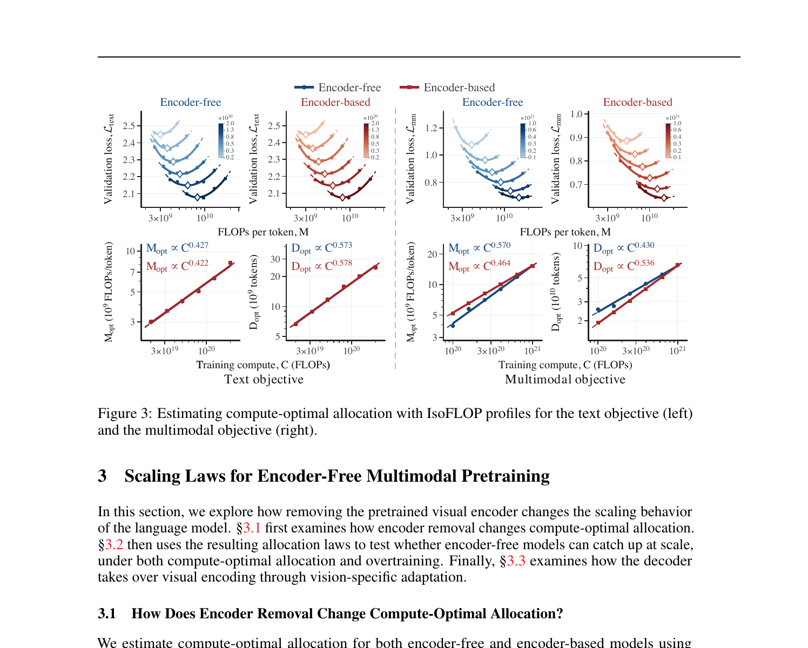
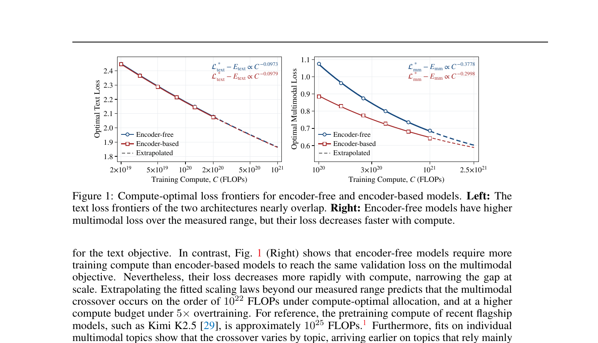
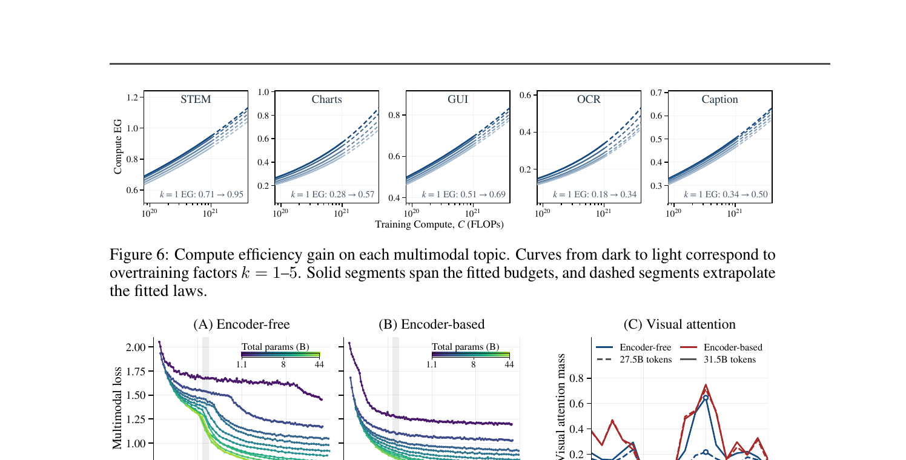
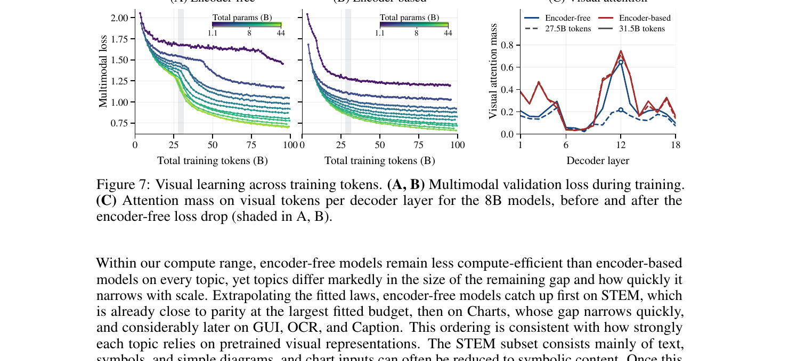

# How Far Are We from Removing the Visual Encoder? Scaling Laws for Encoder-Free Multimodal Pretraining

> Lin Chen, Bolin Ni, Qi Yang, Lan Jiang, Kun Ding, Xiaoran Fan, Hower Yang, Ying Wang, Shiming Xiang  
> CASIA / UCAS / Tencent Foundation Model Department, 2026-09  
> arXiv: 2609.35457

---

## 1. 一句话定位

首个受控 scaling 实验，量化 encoder-free 与 encoder-based MLLM 的效率差距：文本目标两者几乎等价；多模态目标上 encoder-free 目前落后，但拟合的 scaling law 预测交叉点在 ~10^22 FLOPs（远低于旗舰模型的 10^25），并阐明 decoder 如何通过三种视觉专化机制自主"接管"视觉编码功能。

---

## 2. 要解决的问题

Encoder-free MLLM（直接把 image patch 投影进 decoder，不依赖预训练 ViT）结构更简洁、统一，但它的 scaling 行为从未被系统量化过：

- 去掉 ViT 后，compute-optimal 模型大小/数据量如何变化？
- 在多大计算预算下 encoder-free 能追上 encoder-based？
- 没有显式视觉编码器，decoder 靠什么学到视觉表示？

---

## 3. 与前作的关系

| 工作 | 关系 |
|------|------|
| Chinchilla (Hoffmann et al., 2022) | IsoFLOP profile + compute-optimal allocation law 方法论 |
| SAIL (Lei et al., 2025) | 首个在单 Transformer 内研究 encoder-free 的 scalability |
| MAI-Thinking-1 (2026) | 引入 compute efficiency gain (`EG^C`) 指标的先驱 |
| Fuyu / EVE / SOLO | 早期 encoder-free MLLM 可行性验证；本文系统比较 |
| NaViL (Tian et al., 2026) | 数据约束下 native MLLM scaling；本文重点在 compute-optimal vs 过训练 |

---

## 4. 核心方法

### 4.1 实验设施

**模型梯子（matched ladder）**：11 个 sparse MoE 模型，总参数 1.1B–44B，非嵌入激活参数 71M–2.4B，共享相同数据混合、优化设置、visual-token 粒度。

**两种架构**（见 Fig 2）：

```
Encoder-based:
  image → SiGLIP 2 ViT (ConvPool) → projector → [visual tokens]
         ↓
  decoder: causal attn over all tokens

Encoder-free:
  image patches → patch projection → [visual tokens]
  decoder: bidirectional attn within visual tokens, causal elsewhere
```

MoE 稀疏度：8/256 expert activation ratio，使 M 近似正比于激活参数数。

**计算量公式**（Decoder FLOPs/token）：

$$
M_o^{(s)} = M_{\text{base}} + M_{\text{attn}}^{(s)} \cdot \ell_o, \quad C_o^{(s)} = M_o^{(s)} \cdot D_o
$$

其中 `s ∈ {free, based}`，`o ∈ {text, mm}`，`ℓ_o` 为 packed 平均序列长。两类 `M_attn` 不同（visual token 的 attention mask 不同）。

### 4.2 Scaling Law 拟合

**IsoFLOP profile**（Chinchilla 方法论）：固定 budget C，扫 M（模型大小），令 D = C/M，用 validation loss 关于 log M 拟合二次函数找 `M_opt(C)` 和 `D_opt(C)`。

**Compute-optimal allocation law**：

$$
M_{\text{opt}}(C) \propto C^a, \quad D_{\text{opt}}(C) \propto C^b, \quad a + b = 1
$$

**Compute-optimal frontier**：

$$
\mathcal{L}^*(C) = E + K C^{-\gamma}
$$

**效率增益指标**（目标：encoder-free，参照：encoder-based）：

$$
\text{EG}^C_{\text{tar} \leftarrow \text{ref}}(\lambda) = C_{\text{ref}}(\lambda) / C_{\text{tar}}(\lambda) \quad \text{（compute efficiency gain）}
$$

$$
\text{EG}^M_{\text{tar} \leftarrow \text{ref}}(\lambda) = M_{\text{ref}}(\lambda) / M_{\text{tar}}(\lambda) \quad \text{（model efficiency gain）}
$$

值 > 1 表示 target（encoder-free）更高效；< 1 表示 encoder-free 在该点使用更大模型/更多计算。

### 4.3 过训练分析

固定模型大小 `M = M_opt(C_base)`，用 k 倍 token 训练，actual compute = `k × C_base`。Scaling law 在过训练下退化为：

$$
\mathcal{L}(C_{\text{base}}, k) = E + g(k) \cdot K C_{\text{base}}^{-\gamma}
$$

`g(k)` 只与 k 有关，故可单独从较小模型拟合（大幅减少实验成本）。

---

## 5. 三大发现

### 发现 1：Compute-optimal 分配朝更大模型偏移（§3.1）



> **Fig 3 逐段解读**：
>
> **(左两列：Text objective)**——上行是 IsoFLOP 曲线，每条曲线对应一个 compute budget（颜色深 = budget 大）；曲线最低点给出该 budget 下的 `M_opt`。下行把各 budget 的 `M_opt` 和 `D_opt` 对 C 作 log-log 线性拟合，斜率就是 a 和 b。Encoder-free（蓝）a=0.427，encoder-based（红）a=0.422——几乎相同，说明去掉视觉编码器对文本最优分配没有影响。
>
> **(右两列：Multimodal objective)**——encoder-free 的 `M_opt` 斜率从 0.464 升至 0.570（相差 0.106），而 encoder-based 保持 0.464/0.536。这意味着 encoder-free 在多模态预训练时需要分配更多计算给模型大小（而非更多数据）来支撑视觉表示学习。双向 vs 因果注意（Tab. 1：0.570/0.557）结论一致，排除注意掩码伪影。

| 目标 | Encoder-free `a` | Encoder-based `a` | 差值 |
|------|---------|---------|------|
| Text | 0.427 | 0.422 | +0.005 |
| Multimodal (bidirectional) | 0.570 | 0.464 | **+0.106** |
| Multimodal (causal) | 0.557 | 0.464 | **+0.093** |

📌 **物理含义**：decoder 必须同时学语言建模 + 视觉表示，两个目标竞争容量；更大的模型能更好地分离这两个子任务，故最优配比向大模型倾斜。

### 发现 2：预测在 ~10^22 FLOPs 追上（§3.2）



> **Fig 1 逐段解读**：
>
> **(左：Text objective)**——encoder-free（蓝圆）和 encoder-based（红方）的 optimal text loss 曲线几乎完全重叠（loss 指数分别 -0.0973 vs -0.0979），拟合外推虚线也不发散。EG^C 平均 ≈ 0.985，EG^M ≈ 0.997——文本任务两架构等价，视觉编码器对纯文本没有帮助。
>
> **(右：Multimodal objective)**——在测量范围（10^20 到 2.5×10^21 FLOPs）内，encoder-free 的 multimodal loss 始终高于 encoder-based，但下降更快（指数 -0.3778 vs -0.2998）。两条外推虚线将在更高 budget 处交叉——这就是预测交叉点。

**计算最优分配下的追赶**：
- 交叉点估计：6.1×10^21 FLOPs（bootstrap 80% CI：[4.2×10^21, 1.0×10^22]）
- 当前缺口：EG^M ≈ 0.80（encoder-free 需要 ~1.25× 的 FLOPs/token）
- 参照系：Kimi K2.5 预训练 ≈ 10^25 FLOPs，比预测交叉点高约 3 个数量级

**过训练下的追赶**（k=5）：
- 交叉点推迟到约 1.2×10^22 FLOPs（CI：[8.4×10^21, 2.0×10^22]）
- EG^C 从 0.62 降至 0.52，EG^M 从 0.80 降至 0.74（encoder-free 在固定模型尺度下多训 token 收益减少，因其需要更大模型）



> **Fig 6 逐列解读**：五列对应五个多模态主题，纵轴是 EG^C（值越高 = encoder-free 越接近 encoder-based）。每列内从深到浅对应过训练因子 k=1–5。
>
> - **STEM**：k=1 时 EG 从 0.71 上升到 0.95——在测量范围内已接近追上，因为 STEM 主要靠文字、符号和简单图表，可被 tokenizer 直接处理。
> - **Charts**：k=1 从 0.28→0.57，追赶较快，但仍需外推。
> - **GUI**：k=1 从 0.51→0.69，追赶中等速度。
> - **OCR**：k=1 从 0.18→0.34，需要精细空间-文字感知，预训练视觉先验优势大。
> - **Caption**：k=1 从 0.34→0.50，自然图像描述对视觉表示要求最高，追赶最慢。
>
> 规律：主题对预训练视觉先验的依赖程度越高，encoder-free 的劣势持续越久。

### 发现 3：Decoder 通过三种机制接管视觉编码（§3.3）



> **Fig 7 逐段解读**：
>
> **(A) Encoder-free 训练曲线**——多模态 loss 呈现两段：前 ~25B token 缓慢下降（"bootstrapping"阶段），之后出现急剧下降（灰色阴影区）。各模型大小（1.1B 紫色→44B 绿色）均有此形态，大模型下降幅度更大。
>
> **(B) Encoder-based 训练曲线**——loss 从一开始就平滑单调下降，没有"bootstrapping"阶段——因为 ViT 已提供强视觉先验，decoder 无需自举。
>
> **(C) Per-layer 视觉注意力质量（8B 模型）**——纵轴是 visual token 接收的注意力质量（attention mass）随 decoder 层数（横轴 1–18）的变化。实线 = 27.5B token（bootstrapping 前），虚线 = 31.5B token（急剧下降后）。Encoder-free（蓝）在 bootstrapping 后于第 12 层出现峰值，从 0.217 上升到 0.645，接近 encoder-based（红）的水平——这正是 decoder 在浅层完成视觉编码后高层聚焦的信号。

**三种视觉专化机制**：

| 机制 | 现象 | 类比编码器 |
|------|------|----------|
| 双向注意力增强 | Layer 12 visual attention 0.217→0.645 | ViT bidirectional patch contextualization |
| 浅层早期处理 | Visual token cos-sim to input 在浅层迅速偏离（encoder-based 几乎不变） | ViT 把 patch → semantic representation 的转换 |
| 专家路由集中 | Visual token 专用的 MaxVio 显著高于 encoder-based | ViT 的专用 visual capacity |

📌 **"Bootstrapping"假说**：loss 只施加在文本 token 上，所以 visual token 只有当文本 attend 它们时才获得梯度信号。初期 visual token 信息量低被忽略，信号弱；逐渐有用后 attention 增加，梯度增强，形成正反馈，触发急剧下降。

---

## 6. 关键配置

| 配置 | 值 |
|------|-----|
| 模型梯子 | 11 个 sparse MoE，1.1B–44B total，71M–2.4B active non-embedding |
| Expert 激活比 | 8/256 |
| Visual encoder（encoder-based） | SiGLIP 2 ViT（fixed size across scales） |
| Visual token 数 | 两者相同粒度（等价 visual token count） |
| Compute range measured | ~10^19 – 2.5×10^21 FLOPs |
| IsoFLOP 每个 budget | 扫不同 M，D=C/M，二次拟合 |
| Overtraining k | 1–5 |
| Bidirectional 变体 | encoder-free 内额外对比因果 vs 双向 visual attention |

---

## 7. 争议与局限

**方法层面**：
- **ViT 固定尺寸**：encoder-based 的 ViT 在所有 decoder 规模下保持相同大小，不随 decoder 扩大——这系统性低估了 encoder-based 的扩展潜力（联合扩展两者可能延迟交叉点）
- **外推范围大**：测量范围（~10^19–10^21）比预测交叉点（~10^22）低约一个数量级，拟合外推不确定性大（80% CI 跨一个数量级）
- **只看验证 loss**：没有 downstream task 评测；loss 与任务性能的关系非线性，交叉点时间可能与实际能力追赶时间不一致

**结论层面**：
- 文本目标几乎等价这一结论符合预期（ViT 对纯文本无帮助），但 encoder-based 训练中 ViT 参数也在更新——若 ViT 吸收了部分文本信号，则对比不完全公平
- "Bootstrapping"机制基于 attention mass 的间接证据，无法排除其他解释（如 MoE routing 动态变化）

---

## 8. 一句话总结

用 11 档 sparse MoE 梯子量化了 encoder-free MLLM 的 scaling 规律：文本完全追平，多模态预测在 ~10^22 FLOPs（远低于现有旗舰）追上；encoder-free decoder 通过双向注意力涌现、浅层早期视觉处理、专家路由集中三种机制自主接管 ViT 的角色——但 ViT 固定尺寸和巨大外推范围令交叉点估计存在相当不确定性。

---

## Q&A

