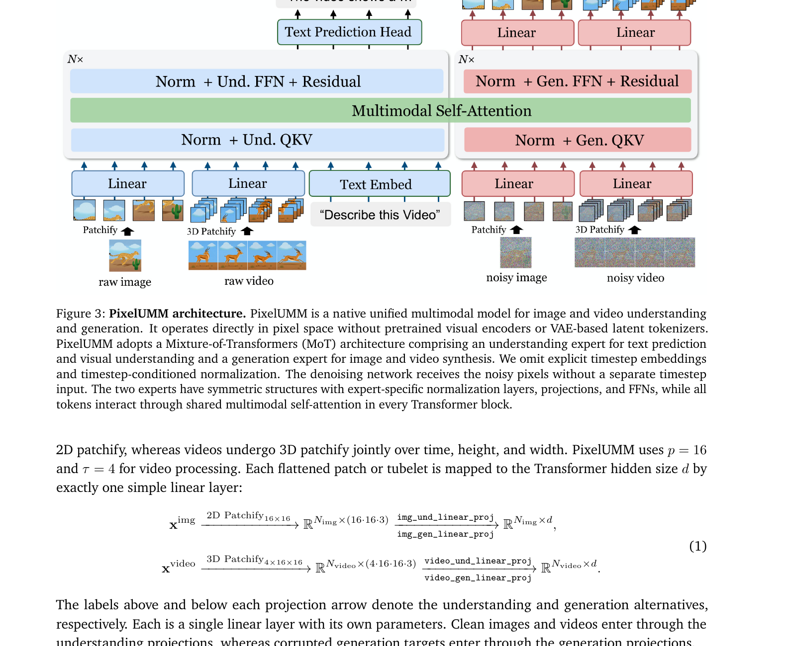
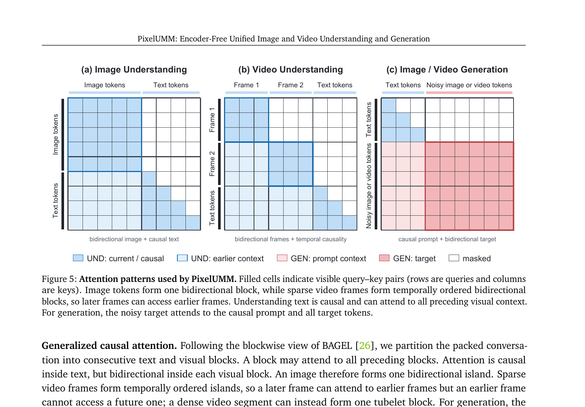
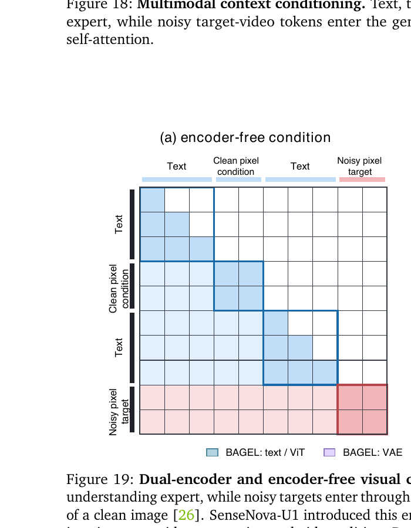

# PixelUMM: Encoder-Free Unified Image and Video Understanding and Generation

> Cong Wei, Xuanchi Ren, Bryan Chu, Weiming Ren, Huan Ling, Jiahui Huang, Laura Leal-Taixé, Sanja Fidler, Wenhu Chen, Zian Wang, Jay Zhangjie Wu  
> NVIDIA / University of Waterloo, 2026-09-29  
> arXiv: 2609.38597 | [Project](https://nv-tlabs.github.io/PixelUMM/)

---

## 1. One-Line Summary

PixelUMM is an encoder-free unified model for image and video understanding and generation entirely in pixel space — no ViT, no VAE, no discrete tokenizer — using 2D spatial patches for images and 3D spatiotemporal tubelets for video, connected to a Mixture-of-Transformers (MoT) backbone through single-layer linear projections.

---

## 2. Problem and Motivation

Unified Multimodal Models (UMMs) that handle both understanding and generation typically rely on **two separate visual interfaces**:
- A **ViT** (e.g., SigLIP) for semantic understanding features
- A **VAE** (e.g., Wan2.2) for reconstruction-oriented latents for generation

This dual-encoder design doubles the visual context length per conditioning image (ViT tokens + VAE tokens), complicates integration with VLM pretraining pipelines, and is particularly costly for multi-turn conversations with growing image/video context. Moreover, video understanding and video generation historically use different temporal representations (per-frame encoders vs causal 3D VAEs), making a shared interface non-trivial.

**PixelUMM's question**: Can a single raw-pixel interface — with no pretrained visual encoder — jointly support image understanding, video understanding, image generation, and video generation?

---

## 3. Relation to Prior Work

| Work | Relation |
|------|----------|
| JiT (2025) | Clean-pixel prediction without VAE for T2I; PixelUMM extends to video and understanding |
| PixelDiT (2025) | Pixel-space image generation; image-only, no understanding |
| TUNA / TUNA-2 | Encoder-free unified image understanding + generation; PixelUMM adds video |
| SenseNova-U1 | Introduced encoder-free visual conditioning (clean → understanding, noisy → generation); PixelUMM extends to video |
| BAGEL | Dual-encoder (ViT + VAE) unified model; PixelUMM removes both encoders |
| Qwen3 | PixelUMM's backbone (decoder-only transformer) |

---

## 4. Core Method

### 4.1 Native Pixel Interface

Images and videos bypass all pretrained encoders. The only transformations between raw pixels and the backbone are:

$$
\mathbf{x}^{\text{img}} \xrightarrow{\text{2D Patchify}_{16\times16}} \mathbb{R}^{N_{\text{img}} \times (16\cdot16\cdot3)} \xrightarrow{\text{img\_und/gen\_linear\_proj}} \mathbb{R}^{N_{\text{img}} \times d}
$$

$$
\mathbf{x}^{\text{video}} \xrightarrow{\text{3D Patchify}_{4\times16\times16}} \mathbb{R}^{N_{\text{video}} \times (4\cdot16\cdot16\cdot3)} \xrightarrow{\text{video\_und/gen\_linear\_proj}} \mathbb{R}^{N_{\text{video}} \times d}
$$

- Image: patch size `p=16`, each patch = 768-dim raw RGB vector → projected to hidden dim `d`
- Video: tubelet size `τ×p×p = 4×16×16`, each tubelet = 3072-dim → projected to `d`
- **Two separate linear projections** per modality: one for understanding (clean inputs), one for generation (noisy inputs)
- Output heads are also single linear layers (RMSNorm + linear), zero-initialized before multimodal training

No VAE encoder, no ViT, no discrete visual tokenizer.

### 4.2 Mixture-of-Transformers (MoT) Architecture

> **Fig 3 walkthrough**:
>
> **Left side (blue — Understanding expert)**: Raw image patches go through 2D Patchify and `img_und_linear_proj`; raw video frames go through 3D Patchify and `video_und_linear_proj`. Text tokens use a text embedding. All three streams enter the understanding expert's `Norm + Und. QKV` → shared `Multimodal Self-Attention` → `Norm + Und. FFN`. The text prediction head outputs the next text token.
>
> **Right side (pink — Generation expert)**: Noisy images and noisy videos enter through their respective generation linear projections, pass through `Norm + Gen. QKV` → same shared `Multimodal Self-Attention` → `Norm + Gen. FFN` → linear output heads that predict clean pixels.
>
> **Shared attention, separate parameters**: The green `Multimodal Self-Attention` layer is the only shared component. Each expert has its own QKV projections, FFN, and normalization layers. This is token-level hard routing: text and clean visual tokens → understanding expert; noisy visual tokens → generation expert.
>
> **No explicit timestep**: Unlike most diffusion models, PixelUMM omits timestep embeddings. The network infers the noise level directly from the pixel values of the noisy input.

### 4.3 Unified Sequence Modeling and Attention

> **Fig 5 walkthrough**:
>
> **(a) Image Understanding** — Image tokens form one bidirectional block (all image tokens can see each other). Text tokens use causal attention and can attend to all preceding image tokens. Clean image → understanding expert.
>
> **(b) Video Understanding** — Each frame forms its own bidirectional island. Temporal causality is enforced across frames: Frame 2 can attend to Frame 1, but not vice versa. Text sees all visual context causally.
>
> **(c) Image/Video Generation** — Text prompt tokens attend causally. Noisy image/video target tokens attend to the full causal prompt context and bidirectionally within the target block itself (the full red square). Crucially, clean conditioning cannot "see into" the noisy target — the target block is masked from the prompt direction.

**Positional encoding**: Three-axis Native RoPE (temporal, height, width). Half of attention heads encode the temporal axis; one quarter each for height and width. `θ_H = θ_W = 10^4`, `θ_T = 10^6`. Text tokens advance only temporally (`H = W = 0`).

**Video understanding modes**:
- `dense_mode`: input ≥4 FPS → 3D tubelet blocks (`τ=4`)
- `sparse_mode`: input <4 FPS → 1 FPS sampling, each frame projected independently via `img_und_linear_proj`

### 4.4 Training Objectives

**Text objective** (cross-entropy on assistant tokens, square-root sequence-length normalization):

$$
\mathcal{L}_{\text{CE}}
$$

**Pixel objective** (JiT-style clean-pixel prediction, v-parameterization):

$$
\mathbf{z}_t = (1-t)\mathbf{x} + t\boldsymbol{\epsilon}, \quad \boldsymbol{\epsilon} \sim \mathcal{N}(\mathbf{0},\mathbf{I})
$$

$$
\mathbf{v}_\theta = (\mathbf{z}_t - \hat{\mathbf{x}}_\theta) / \tilde{t}, \quad \mathbf{v}^* = (\mathbf{z}_t - \mathbf{x}) / \tilde{t}, \quad \tilde{t} = \max(t, 0.05)
$$

Squared velocity error averaged over active pixels and active visual tokens.

**Joint objective**:

$$
\mathcal{L} = \lambda_{\text{CE}}\mathcal{L}_{\text{CE}} + \lambda_{\text{img}}\mathcal{L}_{\text{img}} + \lambda_{\text{vid}}\mathcal{L}_{\text{vid}}
$$

### 4.5 Training Pipeline (6 Stages)

| Stage | What trains | Resolution | Steps | Key tasks |
|-------|-------------|------------|-------|-----------|
| Joint Stage 1 | Both branches | 256² | 150K | Text + I2T + T2I |
| Gen Stage 1 | Gen only | 256² | 200K | T2I + T2V |
| Und Stage 1 | Und only | Native | 100K | Text + I2T (native res) |
| Und Stage 2 | Und only | 224² (video) | 20K | + V2T |
| Und Stage 3 | Und only | 448² (video) | 15K | + V2T higher res |
| Joint Stage 2 | Both branches | 512² | 20K | All tasks at full res |

### 4.6 Multimodal Context Conditioning

> **Fig 19 walkthrough**:
>
> **(a) PixelUMM encoder-free condition** — A clean reference image enters through the understanding expert (blue block). It can attend to and be attended by all preceding text and visual context. The noisy generation target (pink) attends causally to the prompt (including the clean reference) and bidirectionally within itself — but the clean condition cannot see the noisy target (masked cells). This gives the generation expert access to reference-image features via shared attention.
>
> **(b) BAGEL dual-encoder condition** — Each conditioning image contributes two streams: ViT tokens (semantic, blue-purple) + VAE tokens (reconstruction, purple). Both token types roughly double the visual context per image. PixelUMM's single-stream design eliminates this duplication at the cost of relying on the decoder to learn visual representations from scratch.

This single-stream conditioning supports image-to-video generation and video editing (F7 study, Table 2-3).

---

## 5. Empirical Studies (8 Ablation Families)

The paper conducts 8 systematic ablation families (F1–F8) before evaluating the final model:

| Family | Variable | Key Finding |
|--------|----------|-------------|
| **F1**: Image patch size | 16×16 vs 32×32 | 16×16 achieves lower generation loss despite processing 4× fewer images/step — stronger spatial compression makes generation harder to learn |
| **F2**: Video patch size | p32/t4 → p32/t1 | Less spatiotemporal compression (p32/t1: 4,096 pixels/token) achieves lowest T2V loss; model adopts p16/t4 (1,024 px/token) to match video VAE convention |
| **F3**: Output decoder head | Linear vs PixelShuffle vs Wan-style Up+Conv | Linear head: 133 GFLOPs, 12.6M params, causes grid artifacts at CFG>6; PixelShuffle (T-S, F3-R03): 1,279 GFLOPs, 52.9M params, best training loss–artifact trade-off |
| **F4**: Pixel-space vs VAE-space | Flow matching in pixels vs latents | Similar gradient norms; VAE-space loss ~4.3× larger in magnitude (different units); pixel-space has occasional loss spikes |
| **F5**: Model size | 1.7B vs 8B | 8B reaches comparable loss in ~1/3 the training steps (3× step-efficiency) |
| **F6**: Compute scaling | 8 GPUs vs 128 GPUs | CE loss reaches 1.0 in ~2K vs 17.5K steps (9× fewer steps); MSE in 17K vs 23K (1.3× fewer) — text benefits much more from data parallelism than generation |
| **F7**: Visual conditioning | Without vs with multi-task conditioning fine-tuning | Video benchmarks improve +0.89 to +3.49 pts; image shows mixed results (some benchmarks regress). Conclusion: visual conditioning does not systematically degrade understanding |
| **F8**: Video understanding modes | `dense_mode` (4 FPS tubelets) vs `sparse_mode` (1 FPS per-frame) | No consistent improvement from 4 FPS temporal compression over 1 FPS sparse sampling |

---

## 6. Benchmark Results

### Image Understanding (Table 5, Joint Stage 2)

| Benchmark | PixelUMM (8B MoT) | BAGEL (7B MoT) | TUNA-2 (7B+5B) | Qwen3-VL-Inst. (8B) |
|-----------|-------------------|----------------|-----------------|----------------------|
| MMMU | 41.67 | 55.30 | 50.70 | **69.60** |
| RWQA | 71.63 | **72.80** | 67.70 | 71.50 |
| AI2D | 80.12 | **89.20** | 79.60 | 85.70 |
| DocVQA | 90.42 | — | — | **95.20** |
| CountBench | **94.30** | 82.50 | 81.70 | 89.80 |
| MME | 1809.54 | **2388.00** | — | — |

PixelUMM is competitive with TUNA/TUNA-2 (other unified models) but trails dedicated VLMs on reasoning-heavy benchmarks (MMMU gap: 41.67 vs 69.60).

### Video Understanding (Table 6, sparse\_mode)

| Benchmark | PixelUMM (8B MoT) | InternVL-3.5 (8B) | Qwen3-VL (8B) |
|-----------|-------------------|-------------------|----------------|
| MVBench | 70.53 | 72.10 | — |
| Video-MME (w/o sub.) | 57.33 | 65.90 | **73.00** |
| LongVideoBench | 59.61 | 62.40 | **68.00** |
| LVBench | 40.41 | 44.50 | **58.00** |

### Image Generation (Table 7)

| Model | Size | GenEval Overall | DPG-Bench Overall |
|-------|------|-----------------|-------------------|
| FLUX.1 [dev] | 12B | 0.82 | 84.00 |
| **PixelUMM** | 8B MoT | **0.77** | **85.74** |
| TUNA | 7B+5B | 0.90 | 86.76 |
| BAGEL | 7B MoT | 0.77 | 85.07 |
| Lance | 3B MoT | **0.90** | 84.67 |

Among unified models (no separate generation head), PixelUMM is competitive. Notably surpasses T2I-only models like FLUX.1 on DPG-Bench.

📌 **Key note**: The released checkpoint uses linear output heads (F3-R01), not the PixelShuffle heads that reduce patch artifacts. Grid-boundary artifacts are visible in smooth regions at CFG > 6.

---

## 7. Disputes and Limitations

**Missing visual prior**: Without a pretrained ViT, PixelUMM must learn visual representations from scratch via the pixel-space objective. This explains large gaps on semantic benchmarks (MMMU: −28 pts vs Qwen3-VL-Inst.), particularly those requiring fine-grained visual reasoning.

**Patch artifacts**: The linear output head (released model) introduces grid-aligned intensity discontinuities in low-texture regions at high CFG scales. Convolutional (PixelShuffle) heads reduce this but require additional training.

**Timestep-free denoising**: Omitting explicit timestep conditioning is unusual — the model must infer corruption level from pixel values alone. This works but may limit robustness compared to AdaLN-based approaches.

**Video generation quality**: The paper does not show comprehensive comparisons against specialized video generation models (Wan2.2, HunyuanVideo). The empirical focus is on architecture exploration rather than SOTA claims.

**Dense vs sparse video — no benefit**: Despite temporal tubelets being the paper's novel contribution for video, F8 shows no consistent improvement from 4 FPS tubelet input over 1 FPS per-frame sparse sampling on four benchmarks.

**Training data not released**: Data mixtures are described (FineVision, VideoChat-Flash, LLaVA-Video-178K) but specific proportions and cleaning procedures are not detailed.

---

## 8. One-Line Summary

PixelUMM unifies image and video understanding and generation in a single encoder-free pixel-space model — eliminating ViT, VAE, and discrete tokenizers — with a MoT backbone initialized from Qwen3; it achieves competitive performance among unified models but shows meaningful gaps to dedicated VLMs on semantic understanding, and reveals eight practical insights about patch size, decoder design, and conditioning for future pixel-space unified models.

---

## Q&A

