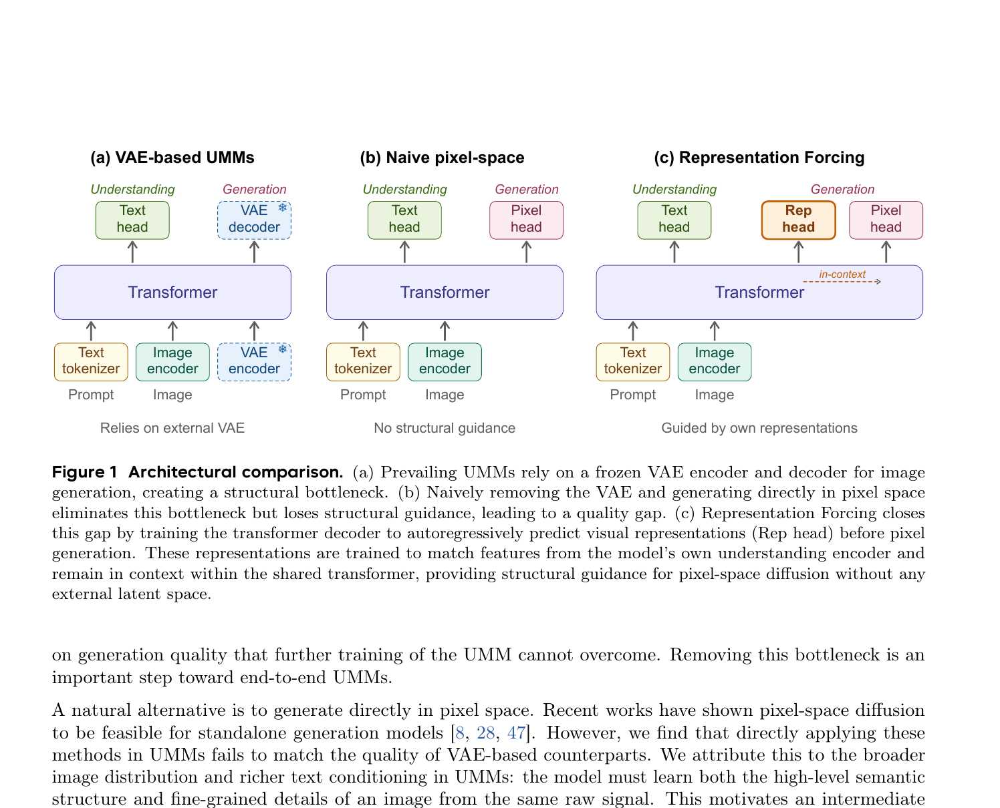
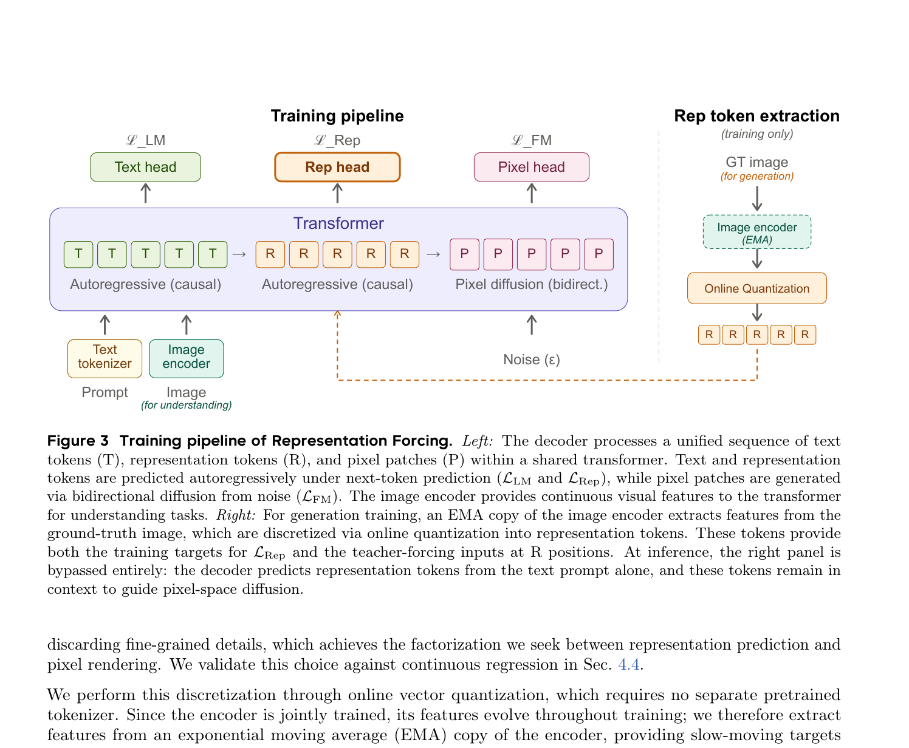
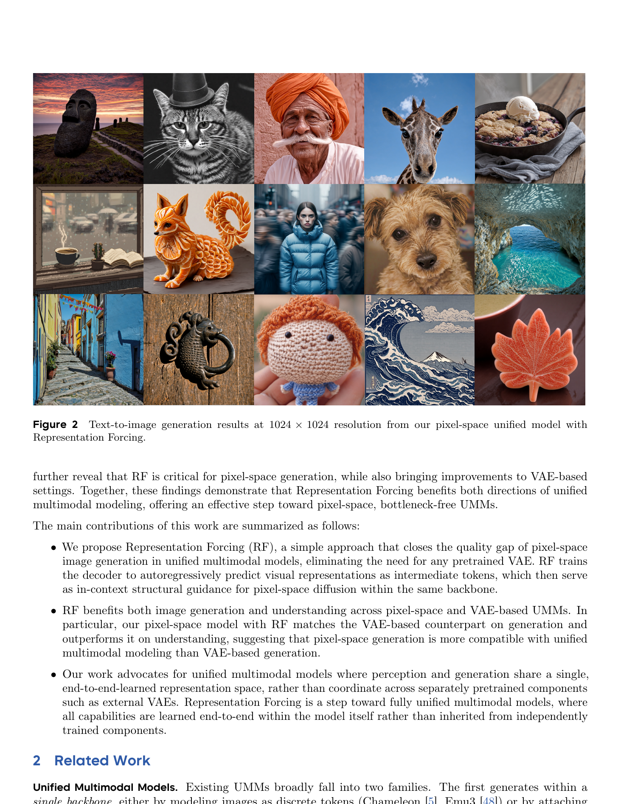
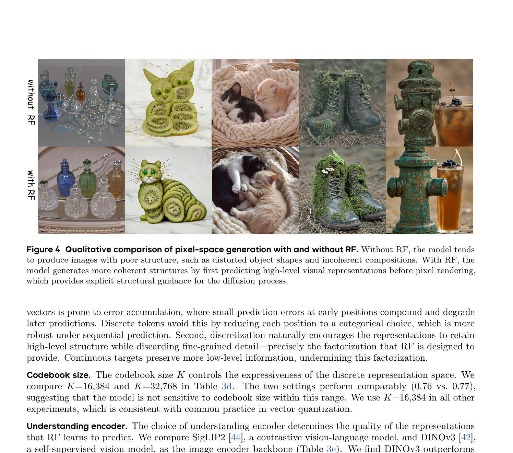

# RF: Representation Forcing for Bottleneck-Free Unified Multimodal Models

**论文**: Representation Forcing for Bottleneck-Free Unified Multimodal Models  
**机构**: 香港大学 + ByteDance Seed + 香港中文大学 + 南京大学 + 清华大学  
**arXiv**: [2605.31604v3](https://arxiv.org/abs/2605.31604)  
**项目页**: [yuqingwang1029.github.io/RepresentationForcing](https://yuqingwang1029.github.io/RepresentationForcing)  
**发表**: 2026 年 6 月

---

## 1. 一句话定位

**要解决的问题**：现有统一多模态模型（UMM）在图像生成路径上必须依赖一个冻结的、预训练好的 VAE，这个外部 VAE 的隐空间是为重建优化的，而非为 UMM 整体目标优化——它的有损压缩给生成质量设了一个无论怎么继续训练都突破不了的上限（structural bottleneck）。直接去掉 VAE 改做像素空间生成，结构感知完全缺失，GenEval 只有 0.25。

**核心解法**：**Representation Forcing（RF）**——让解码器在生成像素之前，先自回归地预测模型自身理解编码器（understanding encoder）提取的视觉表示，将其离散化为"表示 token"，作为 in-context 条件保留在序列中，引导同一 Transformer 主干内的像素空间扩散。这样既无需外部 VAE，又为像素生成提供了显式的语义结构支撑。



> **Fig 1 逐段解读**：
>
> **(a) VAE-based UMMs**——理解和生成共用同一个 Transformer 主干。理解路径：图像经 Image encoder 编码后送入 Transformer，输出经 Text head 变成文字答案。生成路径：图像经冻结的 VAE encoder（雪花图标表示不参与训练）压成 latent，Transformer 在 latent 空间做扩散，最后用冻结的 VAE decoder 还原成像素。问题在于：VAE 的 latent space 是为重建优化的，与 UMM 的整体目标不一致，其有损压缩给生成质量设了死上限——继续训练 UMM 也突破不了。
>
> **(b) Naive pixel-space**——把 VAE encoder 和 VAE decoder 整体移除，生成路径直接接 Pixel head 输出像素。理解侧不变（Image encoder + Text head）。这消除了外部 VAE 瓶颈，但生成时模型面对同一批原始像素信号，必须同时学高层语义布局和低层纹理细节，两个任务相互干扰，实验中 GenEval 只有 0.25。底部标注"No structural guidance"点明症结。
>
> **(c) Representation Forcing**——在 Transformer 之上新增 **Rep head**，生成路径变成两步：先让解码器自回归预测 rep token 序列（对应模型自己的理解编码器产生的离散视觉表示），再把这些 rep token 留在序列里作为 in-context 条件（虚线箭头"in-context"）引导 Pixel head 生成像素。理解编码器（Image encoder）联合训练、非冻结，表示空间与生成目标共同演化。整个过程无需任何外部 VAE，底部标注"Guided by own representations"概括了这一设计哲学。

---

## 2. 与前作的关系

### UMM 谱系

```
单主干内生成（离散 token）
    Chameleon / Emu3 — 图像作为 VQVAE token，纯 AR
    → 生成质量受限于 codebook 分辨率

单主干内生成（VAE latent + 扩散）
    Transfusion / Show-o / JanusFlow / BAGEL [11]
    → RF 的直接对比基线，VAE 冻结=结构瓶颈

LLM + 外部扩散模块
    Emu2 / SEED-X / BLIP3-o / MetaQuery
    → LLM 预测 CLIP/DINOv2 特征，外部扩散 decoder 渲染
    → 两个独立训练组件，联合优化受限

像素空间生成（并发工作）
    SenseNova-U1 / Tuna-2 — 丢弃视觉编码器，从原始 patch 生成
    → RF 保留联合训练的理解编码器，理解能力更强

使用冻结外部表示空间引导生成
    Latent Forcing [1] — 冻结 DINOv2 隐变量 + 独立噪声调度
    RAE [62] — 冻结 DINOv2/SigLIP 替换 VAE
    REPA [58] — 辅助对齐损失，不在序列内
    → 所有这些依赖"固定的外部表示空间"；RF 解冻它、在线离散化，让它成为模型的内生能力
```

**RF 的新贡献**：
1. 把理解编码器的表示"变成生成目标"——representation prediction 成为模型的原生能力
2. 在序列内保留 rep token 作为像素扩散的 in-context 条件（而非辅助 loss / 外部 cross-attention）
3. 在 pixel-space UMM 上首次匹配 VAE-based 同类，同时在理解上超过 VAE 版本

---

## 3. 核心算法



> **Fig 3 逐段解读**：
>
> **左侧（Training pipeline）**——Transformer 内部处理一条统一的 token 序列，分三段：
> - `T T T T T`（文本 token）：因果自回归注意力，受 `L_LM`（交叉熵）监督。Prompt 经 Text tokenizer 进入，Image encoder 处理输入图像（用于理解任务）。
> - `R R R R R`（表示 token）：同样是因果自回归注意力，受 `L_Rep`（交叉熵）监督。**这是 RF 新增的中间段**——解码器必须在看到任何像素之前，先从文本和上下文中预测出整张图的高层视觉结构。虚线箭头表示 R 段的输出留在序列中、向后传递给 P 段。
> - `P P P P P`（像素 patch）：P 之间双向注意力（扩散解码），对 T 和 R 段是因果注意力，从 Gaussian noise `ε` 出发，受 `L_FM`（flow matching velocity loss）监督。
>
> **右侧（Rep token extraction，training only）**——这条侧路只在训练时存在，推理时完全绕过：GT 图像（生成任务的 ground-truth）送入 **EMA 版本的 Image encoder**（与主干同架构但参数做 EMA 平滑，防止 VQ 目标随训练剧烈抖动），提取 patch 级连续特征；再经 **Online Quantization**（cosine similarity + Sinkhorn-Knopp 归一化 + EMA codebook 更新）离散化为 rep token 序列。这批离散 token 承担双重职责：① 作为 `L_Rep` 的训练目标；② 作为 R 位置的 teacher-forcing 输入送入解码器（训练阶段用 GT rep token 填 R 位，保证 P 段的扩散得到正确的结构引导）。推理时，右侧整条路径不存在，解码器完全凭自回归从文本预测 rep token。

### 3.1 整体序列结构

```
生成时的 token 序列：
[T₁, T₂, ..., Tₙ] [R₁, R₂, ..., Rₙ] [P₁, P₂, ..., P₄ₙ]
     文本 tokens        表示 tokens        像素 patches

注意力模式：
- T（文本）：因果注意力（标准 AR）
- R（表示）：因果注意力（标准 AR next-token prediction）
- P（像素）：P 之间双向注意力，对 T+R 因果注意力（扩散）

2×2 pooling：N 个 rep token 对应 4N 个 pixel patch（同一空间布局）
```

### 3.2 表示 Token 的提取与离散化（训练期）

**来源**：EMA 版本的理解编码器（防止目标剧烈漂移）

**在线 VQ（算法 1）**：

```python
Z = f_ema(X).view(B*L, D)          # EMA 编码器提取 patch 级特征
Z = normalize(Z, dim=1)             # L2 归一化
score = Z @ C.T / τ                 # 与 K 个 prototype 的 cosine sim（τ=0.5）
score = softmax(score, dim=1)       # 行归一化
score = softmax(score, dim=0)       # 列归一化（Sinkhorn-Knopp 1 步，防 codebook 塌缩）
A = argmax(score, dim=1)            # 离散分配 (B*L,)

# 动量更新 codebook
C_new = scatter_add(Z by A)
C = m * C + (1-m) * normalize(C_new / N_k)   # m=0.9999
```

关键细节：
- 不依赖任何预训练 tokenizer；codebook K=16384，与 codebook 大小不敏感（K=32768 差异 <0.01 GenEval）
- 用 EMA 编码器（不是在线编码器）提取特征，让 VQ 目标稳定
- Sinkhorn-Knopp 防止 codebook 塌缩（替代 commit loss / EMA reset）

### 3.3 Representation Forcing 的双向作用

训练时：
- EMA 编码器 → 离散 rep token → 提供 `L_Rep` 的 ground-truth 和 teacher-forcing 输入
- `L_Rep`：解码器预测 rep token 的交叉熵损失

推理时：
- EMA 编码器完全不参与（仅训练时用）
- 解码器仅凭文本 prompt 自回归生成 rep tokens（top-k 采样，`w_rep=2.0` CFG）
- 生成的 rep tokens 留在序列中，pixel patches 通过共享 self-attention 与之交互

名字的两层含义：
- 理解编码器的 representations "强迫"解码器学习相同的高级视觉结构
- 解码器预测的 representations "强迫"像素生成过程遵循预期的语义布局

### 3.4 训练目标

$$\mathcal{L} = \mathcal{L}_{LM} + \mathcal{L}_{FM} + \mathcal{L}_{Rep}$$

- `L_LM`：文本 next-token 交叉熵
- `L_Rep`：rep token next-token 交叉熵
- `L_FM`：像素 patch 的 flow matching 损失（x-prediction，velocity loss）

流匹配公式（x-prediction，JiT [28] 方案）：

$$z_t = t\,x + (1-t)\,\epsilon,\quad t\in[0,1]$$

$$\mathcal{L}_{FM} = \mathbb{E}\,\left\|v_\theta - v\right\|^2,\quad v = x-\epsilon,\quad v_\theta = \frac{x_\theta - z_t}{1-t}$$

CFG：文本条件和 rep token 序列各自以 0.1 概率独立 drop。

### 3.5 架构细节

**主干**：Mixture-of-Transformers（MoT，BAGEL [11] 设计）
- 所有 token 共享 multi-head self-attention
- 按 token 类型路由到三组模态专家 FFN：理解 / 表示预测 / 像素生成
- 初始化自 Qwen3-A3B（MoE LLM，每 token 激活 3B 参数）

**图像编码器**：DINOv3 ViT-H+/16（联合训练，非冻结）
- NaViT 风格变分辨率支持
- 训练阶段动态采样分辨率，NaViT packing

**Rep token embedding**：每个 rep token = 2D 空间位置 embedding + token identity embedding（按 codebook ID 索引，K×D 表中）

**三阶段训练**：

| 阶段 | 操作 | 分辨率 | 迭代 |
|------|------|--------|------|
| ① Alignment | 只训练 MLP connector，backbone+encoder 冻结 | — | 10K |
| ② Joint pre-training | 全部解冻，联合优化 | ≤256 | 50K |
| ③ Continued training | 高分辨率扩展 | ≤1024 | 20K |

优化器：AdamW（β₁=0.9，β₂=0.95，ε=1e-8，weight decay=0.1，gradient clip=1.0）  
学习率：5e-5（阶段 1-2），2.5e-5（阶段 3）；新增生成参数用 4× 倍率  
序列长度：每 GPU 32768 tokens（NaViT packing）

**推理两阶段**：
1. 文本 → rep tokens：top-k 自回归采样，`w_rep=2.0` CFG
2. rep tokens + 文本 → 像素：25 步 flow matching + 动态 timestep shifting，`w_pix=3.0` CFG
3. 使用 EMA 模型参数（decay=0.9999）做推理

---

## 4. 关键实验结果



> **Fig 2 逐段解读**：RF-Pixel 在 1024×1024 分辨率下的文生图样本，全程无 VAE。图中展示了五类典型主题：猫（毛发/皮毛纹理、动态姿势）、老人肖像（皮肤细节、头巾布纹）、长颈鹿（斑纹图案、颈部结构）、泰迪熊（毛绒质感、面部表情）、食物特写（表面光泽、散景背景）。值得关注的是复杂纹理（猫毛、头巾纹路）和精细边缘（睫毛、胡须）的还原质量——这些正是像素空间生成模型相比 VAE latent 方案理论上更有优势的地方（无压缩信息损失），但历来也是其难点（需同时学高低层信号）；RF 通过 rep token 在解码器序列中提供结构骨架，让像素扩散专注于低层渲染，最终达到与 VAE-based 方案相当的生成质量。

### 4.1 RF 对像素空间生成的效果（消融基准对比）

| 设置 | GenEval↑（256分辨率） |
|------|----------------------|
| Pixel（无 RF） | 0.25 |
| VAE（无 RF） | 0.52 |
| Pixel + RF | **0.76** |
| VAE + RF | 0.77 |

**结论**：RF 让像素空间从 0.25 跳到 0.76，与 VAE-based 持平；RF 也让 VAE 版从 0.52→0.77，但像素空间提升更显著。

### 4.2 RF vs REPA（同样的像素空间 UMM，同一 DINOv3 编码器）

| 方法 | GenEval↑ |
|------|---------|
| 无引导 | 0.25 |
| REPA（辅助对齐 loss） | 0.43 |
| RF（in-context 序列内） | **0.76** |

RF 大幅优于 REPA，关键差异：REPA 中对齐特征在推理时不显式条件化生成；RF 中 rep token 直接在序列里，像素 patch 通过 self-attention 直接获取结构信息。

### 4.3 离散 vs 连续 rep token

| 方案 | GenEval↑ |
|------|---------|
| 无 RF | 0.25 |
| 连续回归（因果 diffusion head） | 0.26（无效果） |
| 离散 token（本文） | **0.76** |

连续回归失效原因：(1) AR 预测高维连续向量误差累积；(2) 连续目标保留了细粒度细节，破坏了"表示预测 / 像素渲染"的职责分离。



> **Fig 4 逐列对比**：上行 without RF，下行 with RF，五列对应五个 prompt：
>
> - **列 1（香水瓶）**：无 RF 时多个玻璃瓶形态混乱、瓶身轮廓模糊粘连；有 RF 时瓶身独立清晰、形态各异，玻璃透明质感和光晕渲染明显更准确。
> - **列 2（猕猴桃猫）**：无 RF 时猫脸五官位置错乱、猕猴桃切片拼贴凌乱；有 RF 时猫的身体轮廓正确，猕猴桃切片有序排布、截面纹理清晰。这一列最直观地体现了 rep token 对"物体空间布局"的约束效果。
> - **列 3（猫在篮中）**：无 RF 时猫和篮子边界融合、毛发杂乱；有 RF 时猫蜷缩姿势自然、篮子编织纹理规整，毛皮颜色分界清楚。
> - **列 4（苔藓靴子）**：无 RF 时靴子形态松散、苔藓分布无逻辑；有 RF 时靴子皮革细节和蕾丝孔可辨，苔藓/蘑菇生长位置符合实物逻辑。
> - **列 5（消防栓+饮品）**：无 RF 时消防栓结构缺失零件、杯子位置悬浮感强；有 RF 时消防栓螺栓和锈斑有层次，杯中液体和气泡的光线关系更真实。
>
> 总结：RF 的核心作用是给像素扩散注入了"先验的空间骨架"——rep token 预测阶段已经确定了物体位置、边界、整体构图，后续像素扩散只需填充细节，而不必同时解决"应该在哪里"和"应该长什么样"两个问题。

### 4.4 主要结果（1024 分辨率）

| 模型 | GenEval Overall↑ | DPG-Bench↑ |
|------|-----------------|-----------|
| BAGEL（VAE-based UMM） | 0.82 | 85.07 |
| **RF-Pixel（ours）** | **0.84** | **84.15** |
| RF-Pixel†（LLM rewriter） | **0.88** | — |
| Janus-Pro-7B | 0.80 | 84.19 |
| BLIP3-o | 0.84 | 81.60 |

RF-Pixel（像素空间，无任何预训练 VAE）在 GenEval 上超过 BAGEL（VAE-based），与 BLIP3-o 持平，DPG-Bench 与 SOTA VAE-based UMM 相当。

### 4.5 理解能力（4 个变体 × 8 个 benchmark）

| 变体 | MMMU | HalluBench | MME* | BLINK | RealWorldQA | AI2D | DocVQA | ChartQA |
|------|------|-----------|------|-------|------------|------|--------|---------|
| VAE | 51.0 | 55.7 | 71.3 | 52.2 | 65.2 | 90.7 | 90.0 | 78.8 |
| VAE+RF | 49.6 | 61.3 | 79.3 | 52.9 | 66.6 | 87.8 | 88.3 | 80.5 |
| Pixel | 49.9 | 63.7 | 76.6 | 49.4 | 63.1 | 85.8 | 90.0 | 81.7 |
| **Pixel+RF** | **54.2** | 64.8 | **80.2** | **53.0** | **65.8** | **90.3** | 88.0 | 81.3 |

- RF 对高层视觉理解（MMMU、MME、BLINK、AI2D）有显著提升
- DocVQA/ChartQA 轻微下降（fine-grained 文字/图表解析，rep token 不擅长）
- **Pixel+RF 在 6/8 benchmark 优于 VAE+RF**：去掉外部 VAE 让理解和生成共享同一表示空间，协同更紧密

---

## 5. 关键代码位置

无官方开源代码。核心逻辑对应：

```python
# 1. 训练时 rep token 提取（Appendix B Algorithm 1）
Z = ema_encoder(X).view(B*L, D)          # EMA 编码器
Z = F.normalize(Z, dim=1)
score = Z @ codebook.T / temperature     # cosine sim
score = softmax(softmax(score, 1), 0)   # Sinkhorn-Knopp (1 step)
token_ids = score.argmax(1)             # 离散化

# 2. 生成时注意力模式（Sec 3.2）
# - text tokens: causal mask
# - rep tokens: causal mask（AR next-token prediction）
# - pixel patches: bidirectional to each other, causal to text+rep

# 3. 推理两阶段（Appendix A）
rep_tokens = model.ar_decode(text_tokens, top_k=..., cfg_w=2.0)   # stage 1
pixels = model.flow_denoise(noise, text+rep_tokens, steps=25, cfg_w=3.0)  # stage 2
```

---

## 6. 争议/权衡

### 6.1 离散化的信息损失是否可控？

Rep token 是有损离散化（K=16384 codebook），设计上刻意丢弃细粒度细节。这在实验中被验证为正确选择——连续回归反而更差。但当生成任务需要精确纹理还原时（如人脸、复杂场景细节），离散 rep token 能提供的结构指导是否充分，尚无系统性分析。

### 6.2 只在静态图像验证

论文明确承认："我们聚焦于静态图像生成，不扩展到视频或其他时序模态。" 视频扩展需要处理时序一致性问题，rep token 的自回归长度将大幅增长（从 N 到 N×T），是否仍然有效是开放问题。

### 6.3 与 SenseNova-U1 / Tuna-2 的路线之争

两条像素空间 UMM 路线：
- **RF 路线**：保留理解编码器 + rep token 中间层，理解能力更强
- **SenseNova-U1 / Tuna-2 路线**：丢弃视觉编码器，从原始 patch 直接生成，更激进的端到端

RF 在理解任务上有优势（保留了 DINOv3 的丰富特征），但不如后者"纯粹"（仍然有编码器这个独立组件，只是联合训练而非冻结）。

### 6.4 训练规模有限

三阶段共约 80K 迭代，从预训练 LLM（Qwen3-A3B）热启动，而非从头多模态预训练。论文承认从头训练可能带来更好的联合表示，是未来方向。当前结果是"在相同训练预算下与 VAE 版本对比"，不是绝对性能上限。

### 6.5 Rep token 序列长度与生成成本

以 256² 图像、patch_size=16、pooling=2×2 为例：
- pixel patches = 256²/16² = 256 个
- rep tokens = 256/4 = 64 个

1024² 时 rep tokens 约 1024 个，AR 生成这 1024 个 rep token 也有一定开销；相比直接做 VAE latent 扩散（无 AR 阶段），RF 的推理多出一次序列级 AR。

---

## 7. 关键配置项

| 参数 | 值 | 说明 |
|------|----|------|
| Codebook 大小 K | 16,384 | K=32,768 差异 <0.01 GenEval，不敏感 |
| Spatial pooling | 2×2 | N rep tokens 对应 4N pixel patches |
| Pixel patch size | 16×16 | x-prediction + velocity loss |
| EMA decoder | decay=0.9999 | 推理用 EMA 参数 |
| EMA encoder（VQ 用） | — | 防 VQ 目标漂移，与 EMA 模型分开 |
| Sinkhorn-Knopp | 1 iter, τ=0.5 | 防 codebook collapse |
| CFG drops | 0.1 | 文本条件和 rep token 各自独立 drop |
| CFG weights | w_rep=2.0, w_pix=3.0 | 推理时两级 CFG |
| 推理步数 | 25 | flow matching + 动态 timestep shifting |
| AdamW | β₁=0.9, β₂=0.95, ε=1e-8, wd=0.1, clip=1.0 | |
| LR | 5e-5 / 2.5e-5 | 阶段 1-2 / 阶段 3；新参数 4× |
| 序列长度 | 32768 tokens/GPU | NaViT packing |
| 理解编码器 | DINOv3 ViT-H+/16 | 自监督，空间特征丰于 SigLIP2 |

---

## 8. 一句话总结

RF 的核心洞察是：**UMM 自身的理解编码器已经学到了像素生成需要的高层结构——把它的表示离散化成 rep token，让解码器在生成前先自回归预测这些 token，它们作为 in-context 条件在序列中引导像素扩散**——这一机制让像素空间 UMM 的 GenEval 从 0.25 跳到 0.84（匹配 VAE-based 同类），同时因共享了同一表示空间，理解能力也超过了 VAE 版本，是"去掉外部 VAE、还能维持甚至提升质量"的简洁解法。
