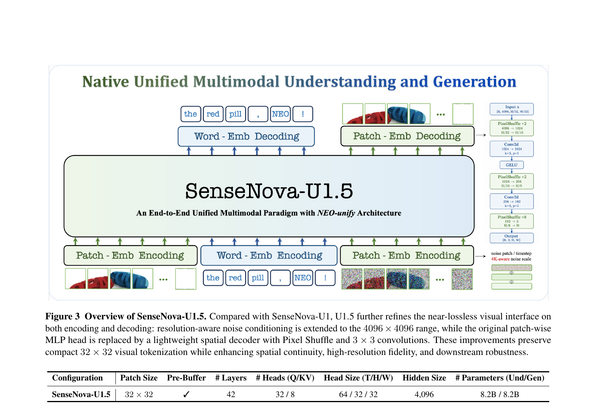
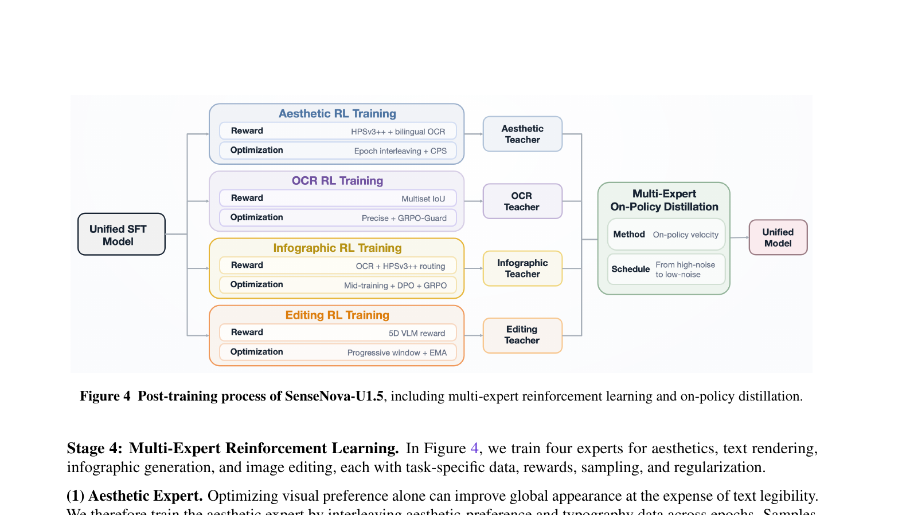

# SenseNova-U1.5: Towards Native Unified Visual Intelligence

**商汤日日新（SenseTime），2026-09 | [arXiv](https://arxiv.org/abs/2609.11929) | [GitHub](https://github.com/OpenSenseNova/SenseNova-U1) | [Demo](https://unify.light-ai.top/)**

---

## 1. 一句话定位

在 encoder-free + VAE-free 的原生统一框架里，用 8B-MoT 一个模型同时完成图像理解/推理/生成/编辑/交错输出；核心贡献是两点：**空间联合重建**（用 PixelShuffle 解码器取代独立 patch MLP，消除高分辨率拼缝）+ **专业化再统一**（4 个 RL 专家独立培养后通过 on-policy 蒸馏合并）。

---

## 2. 要解决的问题

**问题 1：独立 patch 解码的拼缝问题**

前代 SenseNova-U1（NEO-unify）用 MLP 把每个 32×32 patch 的 hidden state 独立映射成像素，patch 之间没有信息交换。低分辨率时不明显，高分辨率（>1K）时邻近 patch 的颜色/纹理无法协调，产生网格状拼缝、纹理不连续、几何不一致。

**问题 2：多任务 RL 奖励相互干扰**

审美奖励倾向于牺牲文字清晰度换取整体画面感；文字渲染奖励与图文排版目标不同尺度；editing 需要同时兼顾修改区域和保留区域。把这些目标塞进同一个 RL 流程会互相掣肘，难以同时达到各维度最优。

---

## 3. 与前作的关系

| 模型 | 架构路线 | 生成方式 | 统一方式 |
|------|---------|---------|---------|
| SenseNova-U1 | NEO-unify encoder-free | flow matching（pixel space） | MoT，patch MLP 解码 |
| RF（Representation Forcing） | encoder-free，无 VAE | AR pixel + diffusion | rep token 作 in-context 引导 |
| **SenseNova-U1.5** | NEO-unify 扩展 | flow matching（pixel space，至 4K） | MoT + **空间联合重建** + 4 专家 RL→蒸馏 |

U1.5 的理解/生成骨干参数量完全相同（均为 8.2B），从 SenseNova-U1 的预训练权重继续训练，不引入外部 encoder/VAE。

---

## 4. 核心方法

### 4.1 模型架构



> **Fig 3 逐段解读**：
>
> **(左侧主框：统一 Transformer 主干)**——SenseNova-U1.5 的核心是一个 42 层 Transformer（hidden=4096，32/8 Q/K 头，Head Size 64/32/32 T/H/W）。理解流（左下：干净图像 + 文本）和生成流（右下：noisy 图像 + 文本）的 token 交织在同一序列中，走同一个 Transformer，但每层各自保留独立的 attention projection/norm/FFN（MoT 设计）。图中大方框的标注 "An End-to-End Unified Multimodal Paradigm with NEO-unify Architecture" 强调无任何外部模态转换模块。
>
> **(右侧细节：Patch-Emb Decoding 解码器结构)**——这是 U1.5 相比 U1 的关键改进。从 backbone 输出 `H ∈ R^{B×4096×h×w}` 开始，经三级 PixelShuffle 上采样（×2 → ×2 → ×8，各级之间插入 Conv2d 3×3 + GELU）恢复到原始分辨率像素。每次 PixelShuffle 把通道折叠为空间（4096→1024→256→3），3×3 卷积让相邻 patch 边界处的像素可以互相参考，消除 U1 独立 MLP 解码产生的拼缝。
>
> **(下方表：模型规格)**——Patch Size 32×32，Pre-Buffer 设计，42 层，32 Q 头 / 8 KV 头（GQA），Head Size T/H/W = 64/32/32，hidden=4096，理解和生成分支各 8.2B 参数（共享主干，独立路由）。
>
> **(右下角：4K 感知噪声嵌入)**——`σ̄_R = σ_R(H,W)/σ_max`（`σ_max` 对应 4096×4096 参考分辨率），经 NSEmb(·) 编码后与 diffusion timestep embedding 相加，使模型在不同分辨率下的去噪行为自适应调整。

**Native MoT Attention 规则**（不在图中，但是机制核心）：

```
文本 token        → 因果单向 attention
干净图像 token    → 块内双向 + 看所有干净 context
Noisy 生成 token  → 块内双向 + 看所有干净 context（反向被掩）
```

生成 token 可以读取理解 token 积累的语义表示，但理解 token 看不到 noisy 状态，保证理解路径干净。

**统一训练损失**：

$$
\mathcal{L} = \lambda_{\text{AR}} \mathcal{L}_{\text{AR}} + \lambda_{\text{Flow}} \mathcal{L}_{\text{Flow}} + \lambda_{\text{Perc}} \mathcal{L}_{\text{Perc}}
$$

- `L_AR`：自回归语言建模（条件似然）
- `L_Flow`：x-prediction flow matching，分辨率自适应噪声轨迹 `z_t = tx + (1-t)σ_R(H,W)ε`
- `L_Perc`：LPIPS 感知损失（从 Stage 1-III 起，权重 0.1）

在 Stage 2 起，`λ_AR : λ_Flow = 0.1 : 1.0`（生成目标权重高 10×）。

### 4.2 训练流程

共 5 个阶段：

```
Stage 1: Generation Pre-Training（3 phases）
   Phase I   180K 步  256²–1024²   纯 T2I，理解分支冻结
   Phase II  100K 步  512²–4096²   纯 T2I，引入原生 4K
   Phase III 185K 步  512²–4096²   加入 editing + interleaved，引入 LPIPS
Stage 2: Unified Mid-Training（80K 步）
   理解分支解冻，联合训练；数据: 30%理解+40%T2I+20%editing+10%interleaved
Stage 3: Unified SFT（10.5K 步）
   高质量指令数据，巩固 instruction following
──────── 后训练 ────────
Stage 4: Multi-Expert RL（4 个专家独立训练）
Stage 5: Multi-Expert On-Policy Distillation（统一模型）
```

### 4.3 后训练：专业化再统一



> **Fig 4 逐段解读**：
>
> **(左：Unified SFT Model)**——Stage 3 产出的统一 SFT 模型是所有 4 个专家的共同起点。
>
> **(中：4 条并行 RL 训练路径)**——4 个专家各自独立分叉，互不干扰梯度：
> - **Aesthetic**（蓝色）：HPSv3++ + 双语 OCR 奖励按 epoch 路由（不混合尺度），CPS 采样（η=0.7）保留有限随机探索
> - **OCR**（灰色）：Multiset IoU 奖励（容忍乱序/重复），Precise 采样（η=1.5）+ GRPO-Guard 抗稀疏奖励崩溃
> - **Infographic**（黄色）：3 阶段（OCR 热身 → DPO 审美偏好对齐 → OCR+aesthetic 交替 GRPO），奖励按 prompt 类型分流
> - **Editing**（橙色）：5 维 VLM 奖励取最小值（bottleneck 聚合，暴露最弱维度），Progressive window（粗到细），用 EMA 替代 SDE 避免残留噪声
>
> **(右：Multi-Expert On-Policy Distillation)**——4 个冻结专家作为 teacher，统一学生模型根据每个训练样本的能力标签被路由到对应 teacher：`L_OPD = E[||v_θ(sg(x̂_{θ,t}), t, c) − v_m(sg(x̂_{θ,t}), t, c)||²₂]`。调度从高噪声到低噪声（`t_e ~ Beta(2+3n/N, 5-3n/N)`），确保模型先学全局结构再学细节和文字。

**4 个专家的关键设计对比**：

| 专家 | 奖励函数 | 采样策略 | 特殊处理 |
|------|---------|---------|---------|
| Aesthetic | HPSv3++ ‖ OCR（路由，非求和） | CPS η=0.7 | 冻结最后 1 个生成 Transformer block |
| OCR | `R_ocr = Σmin(g_t,o_t)/Σmax(g_t,o_t)` | Precise η=1.5 + GRPO-Guard | 60K 双语 + 40K 长文本 |
| Infographic | OCR → DPO → OCR‖aesthetic 路由 | DPO β=10 + GRPO | 3 阶段递进，120K DPO 偏好对齐 |
| Editing | `min({R_inst, R_exec, R_visual, R_pres}) ∪ {R_text}` | ODE + EMA（无 SDE） | Progressive window，4×10^-5 LR |

---

## 5. 数据构建

| 数据集 | 规模 | 特点 |
|--------|------|------|
| 图像生成 | U1 基础上增加约 59M 对（78 来源） | 88.2% >1024²，64.4% >2048²；多粒度双语 caption |
| 图像编辑 | ~38M 样本 | 43% 通用+42% 信息图空间控制+15% reference-conditioned；最多 10 张参考图 |
| 交错数据 | — | 44% 生活场景轨迹 + 29% 信息图 + 19% 视频衍生 + 8% 推理密集 |
| RL 美学 | ~280K prompt | HPSv3++ + Pick-a-Pic + Cosmos3PE + 内部数据 |
| RL OCR | ~60K（+~40K 扩增） | 双语均衡；Flow-GRPO 长文本 prompt 扩写 |
| RL Editing | ~120K | 3 阶段筛选：去噪/重排→验证文字与视觉属性→质量评估 |

---

## 6. 关键实验结果

### 图像生成

| Benchmark | U1.5（8B）| 最强开源对比 | 说明 |
|-----------|-----------|------------|------|
| GenEval | **0.92** | HiDream-O1-Image 0.90 | 开源第一，超 Nano-Banana-2.0 等 |
| Qwen-Image-Bench-EN | 60.22（w/ PE）/ 52.82 | LLaDA-Image 53.53 | 开源第一 |
| Qwen-Image-Bench-ZH | 60.13（w/ PE）/ 52.43 | — | 开源第一 |
| DPG-Bench | **88.11** | Qwen-Image 20B 88.32 | 紧咬 20B 模型 |
| CVTG-2K（多区域文字）| **0.948** | SenseNova-U1 0.940 | 5 区域词准确率 0.954，超闭源 Seedream-4.5 |
| LongText-Bench EN/ZH | **0.988/0.989** | Emu3.5 32B 0.976/0.928 | 开源第一，超所有闭源 |
| WISE（知识驱动生成）| **0.81**（CoT） | NEO-unify 0.72 | 生物/化学/文化知识最强 |

### 图像编辑

| Benchmark | U1.5（8B）| 最强开源对比 |
|-----------|-----------|------------|
| ImgEdit Overall | **4.59** | FireRed-Image-Edit 4.56 |
| GEdit-Bench-EN/ZH | **8.26/8.24** | FireRed 7.88/7.88 |
| WeEdit Overall | **7.46** | FireRed 5.87 |
| OmniRef-Bench（MLLM）| **8.15**（w/ PE） | FLUX.2 klein 6.49 |
| RISEBench（推理编辑）| **38.6**（CoT）/ 33.6 | — |

### 交错生成 & 多模态理解

| Benchmark | U1.5（8B）| 说明 |
|-----------|-----------|------|
| OpenING Overall | **9.18**（CoT） | 超所有闭源（Nano-Banana-Pro 8.85） |
| VBVR-Pro-Bench ID/OOD | **68.2/68.9** | 超 GPT-Image-2（50.7/58.7），OOD 泛化强 |
| RealUnify-GEU | **56.3** | 生成辅助理解（认知导航/注意聚焦） |
| MMLU-Pro | 86.67 | 统一训练未损害语言推理 |
| IFEval | 93.35 | instruction following 提升 |

---

## 7. 争议与权衡

**弱点**

1. **零消融**：spatially joint reconstruction 是最核心的架构贡献，但全文无任何 w/o 对照实验，无法判断提升中有多少来自更多训练数据 vs 解码器改进
2. **Prompt Enhancement 依赖显著**：GenEval2 w/ PE → 0.71，w/o PE → 0.55（差距 16pp）；IGenBench I-ACC 仅 0.08（即便 PE），信息图推理链验证极弱
3. **仅图像，无视频**：对比同期 PWM、H3-World 等交互式视频方向，生成能力仍局限在静态图
4. **闭源数据量大**：生成数据来自 78 个来源含大量内部合成，训练数据构成不透明，难复现
5. **推理强化仍有天花板**：RISEBench 因果/时间推理 CoT 能力比 GPT-Image-1.5（闭源）仍有明显差距

**真正的贡献层**

- 📌 **Specialize-then-unify** 范式：把「多任务 RL 奖励相互干扰」的问题转化为「先专业化再蒸馏」，从架构外解决，而不是设计更复杂的联合奖励函数。蒸馏时 query 时间步调度（Beta 分布从高噪→低噪）是实现细节里最细腻的部分
- 📌 **多集 IoU 作为 OCR 奖励**：`R_ocr = Σmin(g_t,o_t)/Σmax(g_t,o_t)` 对遗漏/重复对称惩罚，且在稠密多行中文 layout 下读取顺序不固定时仍然有效——这是一个比精确匹配更合理的 proxy
- 📌 **Editing 5 维 bottleneck 奖励**：取最小值而非加权和，使得强保留能力不能掩盖弱执行能力，是针对 editing RL 常见的"单维过优化"的直接设计对策

---

## 8. 一句话总结

SenseNova-U1.5 把 8B 原生统一模型推到了开源图像生成/编辑/交错生成的前沿，真正的技术增量是两点：解码器从独立 patch MLP 换成空间联合 PixelShuffle 解决高分辨率拼缝，以及"专业化再统一"的 RL 后训练范式让四个相互干扰的能力维度可以分而治之；但缺零消融、PE 依赖大、无视频，是需要注意的上限。

---

## Q&A

*（后续问答追加于此）*
