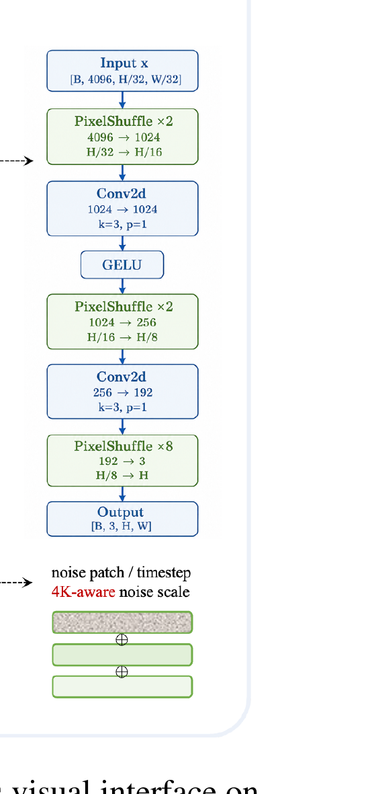
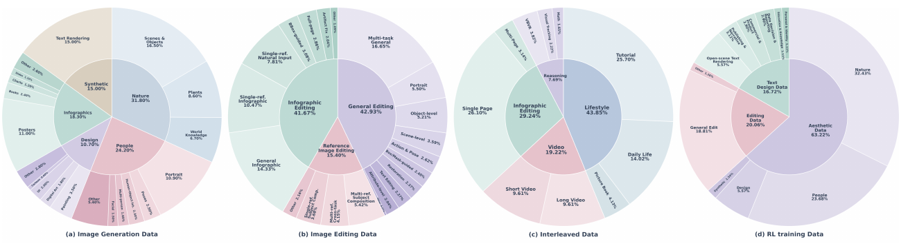

# SenseNova-U1.5: Towards Native Unified Visual Intelligence

**arXiv:2609.11929v1，2026-09-10，35 页 | [arXiv](https://arxiv.org/abs/2609.11929) | [GitHub](https://github.com/OpenSenseNova/SenseNova-U1) | [Demo](https://unify.light-ai.top/) | [HF](https://huggingface.co/collections/sensenova/sensenova-u15)**

> 67 位贡献者（§7 Contributors）：Project Sponsor and Advisor 林达华；Senior Project Lead 杨蕾、吕乐伟、王泉、龚睿昊、孙文秀、刘子纬；Project Lead 刁海文、王佳豪。
>
> ⚠️ **论文正文里没有任何机构署名** —— 标题页只有标题、摘要和四个 URL，全文不出现 "SenseTime"/"商汤"/"上海人工智能实验室" 等字样。「商汤」这个归属来自 HuggingFace 组织名与 NEO-unify 博客，不是论文自述。
> ⚠️ GitHub 链接指向的是 **`SenseNova-U1`（前代）的仓库**，不是 U1.5。摘要承诺开源的是**训练代码**（SFT / RL / OPD），不含权重。

---

## 1. 一句话定位

在 encoder-free + VAE-free 的原生统一框架里，用 MoT 架构一个模型同时完成图像理解/推理/生成/编辑/交错输出；核心贡献是两点：**空间联合重建**（用 PixelShuffle 解码器取代独立 patch MLP，消除高分辨率拼缝）+ **专业化再统一**（4 个 RL 专家独立培养后通过 on-policy 蒸馏合并）。

📌 **对本仓库而言，这篇最值得读的不是榜单，是 §2.3** —— 它是仓库里第一篇**同时点名 Flow-OPD / DiffusionOPD / DanceOPD / DiffusionOPSD / MOPD / GKD / Thinking Machines 博客**的论文，把 OPD 那一簇从 LLM 域正式接到了工业级统一模型的后训练流程里（详见 [§9](#9-在仓库-opd-谱系里的位置)）。它的蒸馏 loss 就是那个反复出现的形状：**velocity MSE + stop-gradient，在学生自己走到的状态上求值**。

⚠️ **但先说清楚三件事，它们决定了这篇该怎么读**：

1. **「8B」是生成分支的参数量，不是 checkpoint 大小。** Table 1 写明理解分支 8.2B + 生成分支 8.2B ≈ **16.4B**。每张表的 `# Params` 列都注明了"生成组件的参数量"，所以表格本身没问题，但摘要的 "an 8B-MoT … model" 读起来像一个 8B 模型。
2. **全文零消融。** "ablat" 这个词根在 35 页里出现 **0 次**，没有任何消融表或消融图。上面那两个「核心贡献」没有任何一个被单独验证过 —— 唯一的对照是 U1 vs U1.5，而那把架构、数据、RL、蒸馏四件事全混在一起。
3. **零硬件信息、零误差棒、零去污染说明、无 Limitations 章节。** "GPU"/"H100"/"H800"/"node" 全文不出现；23 张表约 1800 个数字全是单点估计。

---


> **Fig 1（p.2）**：约 19 张生成图的四行拼贴 —— 电影海报、中英双语旅游海报、杂志式编辑排版、"HELLO, CALL ME IF YOU NEED ME" 猫咪海报、日文动漫封面、"MASTERING POP ART" 教学图等。第二行正中那张**中英双语信息图本身就在介绍这篇论文的方法**："Four Experts. One Unified Model. 训练时各有所长，交付时合而为一"，四象限对应 EXPERT 1–4。
>
> ⚠️ 这张图里的模型名写作 **"SenseNova U1.5-Lite"**，而这个变体在全文其它任何地方都没出现过。（它是模型生成的图像内容，不算正式宣称，但出现在论文的门面图里。）

---

## 2. 要解决的问题

**问题 1：独立 patch 解码的拼缝问题**

前代 SenseNova-U1（NEO-unify）用 MLP 把每个 32×32 patch 的 hidden state 独立映射成像素，patch 之间没有信息交换。低分辨率时不明显，高分辨率（>1K）时邻近 patch 的颜色/纹理无法协调，产生网格状拼缝、纹理不连续、几何不一致。

**问题 2：多任务 RL 奖励相互干扰**

审美奖励倾向于牺牲文字清晰度换取整体画面感；文字渲染奖励与图文排版目标不同尺度；editing 需要同时兼顾修改区域和保留区域。把这些目标塞进同一个 RL 流程会互相掣肘，难以同时达到各维度最优。

---

## 3. 与前作的关系

| 模型 | 架构路线 | 生成方式 | 统一方式 |
|------|---------|---------|---------|
| SenseNova-U1 | NEO-unify encoder-free | flow matching（pixel space） | MoT，patch MLP 解码 |
| RF（Representation Forcing） | encoder-free，无 VAE | AR pixel + diffusion | rep token 作 in-context 引导 |
| **SenseNova-U1.5** | NEO-unify 扩展 | flow matching（pixel space，至 4K） | MoT + **空间联合重建** + 4 专家 RL→蒸馏 |

U1.5 的理解/生成骨干参数量完全相同（均为 8.2B），从 SenseNova-U1 的预训练权重继续训练，不引入外部 encoder/VAE。

---

## 4. 核心方法

### 4.1 模型架构


> **Fig 3 逐段解读**：
>
> **(左侧主框：统一 Transformer 主干)**——SenseNova-U1.5 的核心是一个 42 层 Transformer（hidden=4096，32/8 Q/K 头，Head Size 64/32/32 T/H/W）。理解流（左下：干净图像 + 文本）和生成流（右下：noisy 图像 + 文本）的 token 交织在同一序列中，走同一个 Transformer，但每层各自保留独立的 attention projection/norm/FFN（MoT 设计）。图中大方框的标注 "An End-to-End Unified Multimodal Paradigm with NEO-unify Architecture" 强调无任何外部模态转换模块。
>
> **(右侧细节：Patch-Emb Decoding 解码器结构)**——这是 U1.5 相比 U1 的关键改进。三级 PixelShuffle 上采样（×2 → ×2 → ×8）把通道折叠成空间，卷积让相邻 patch 边界处的像素可以互相参考，消除 U1 独立 MLP 解码产生的拼缝。



> **⚠️ 按 400 DPI 放大原图逐层核对，实际结构与"每级都插 Conv+GELU"的直觉不同**：
>
> ```
> Input x          [B, 4096, H/32, W/32]
> PixelShuffle ×2  4096 → 1024,  H/32 → H/16
> Conv2d           1024 → 1024,  k=3, p=1
> GELU
> PixelShuffle ×2  1024 → 256,   H/16 → H/8
> Conv2d           256  → 192,   k=3, p=1        ← 注意这里收窄了通道
> PixelShuffle ×8  192  → 3,     H/8  → H        ← 最后一级没有 conv、没有 GELU
> Output           [B, 3, H, W]
> ```
>
> 📌 **三个容易记错的点**：① 通道链是 **4096 → 1024 → 1024 → 256 → 192 → 3**，中间有一个 `1024→1024` 的等宽卷积和一个 `256→192` 的收窄卷积；② **全程只有 2 个 Conv2d、1 个 GELU**，不是每级一套；③ 最后的 ×8 上采样**直接出 RGB**，没有任何卷积做收尾 —— 也就是说"让相邻 patch 互相参考"这件事全部发生在 H/16 和 H/8 两个尺度上，最后一跳（H/8 → H，放大 8 倍）仍然是纯 PixelShuffle 的通道折叠。
>
> 正文的措辞是 *"Between successive upsampling stages, 3 × 3 convolutions enable information exchange across neighboring token regions"*，与图一致（卷积在"级间"），但读者容易误以为三级各有一套。
>
> **(下方表：模型规格 = Table 1)**——Patch Size 32×32，Pre-Buffer 设计，42 层，32 Q 头 / 8 KV 头（GQA），Head Size T/H/W = 64/32/32，hidden=4096，理解和生成分支各 **8.2B** 参数（共享主干，独立路由）。
>
> ⚠️ **Table 1 及其 caption 里的 "Pre-Buffer" 和 "native RoPE" 在全文从未被定义或解释过** —— 是从 NEO / SenseNova-U1 继承下来的术语，想搞清楚得去翻前作。
>
> 📌 **编码侧的规格**（正文 p.6，图里没画）：两层带 GELU 的卷积投影分别下采样 **16× 和 2×**，合起来让每个 32×32 图像区域出一个 visual token；二维正弦位置编码保留空间坐标，`` / `</img>` 特殊 token 界定图像块。
>
> **(右下角：4K 感知噪声嵌入)**——`σ̄_R = σ_R(H,W)/σ_max`（`σ_max` 对应 4096×4096 参考分辨率），经 NSEmb(·) 编码后与 diffusion timestep embedding 相加，使模型在不同分辨率下的去噪行为自适应调整。

**Native MoT Attention 规则**（不在图中，但是机制核心）：

```
文本 token        → 因果单向 attention
干净图像 token    → 块内双向 + 看所有干净 context
Noisy 生成 token  → 块内双向 + 看所有干净 context（反向被掩）
```

生成 token 可以读取理解 token 积累的语义表示，但理解 token 看不到 noisy 状态，保证理解路径干净。论文原话：*"The reverse path is explicitly masked, preventing clean representations from accessing stochastic generation states."*

📌 **MoT 到底共享了什么，需要看准**：论文说理解与生成"retain **separate attention projections, normalization layers, and feedforward modules**，按 token 类型在每层动态路由"，而 **"Shared attention therefore serves as the interface for cross-stream communication"**。也就是说 **Q/K/V/O 投影是各自一套，真正共享的只有"在拼接序列上做注意力"这个运算本身** —— 两条流通过同一次 attention 互相看见，但用的是不同的投影矩阵。这也是为什么参数量是 8.2B × 2 而不是共享一份。

**统一训练损失**：

$$
\mathcal{L} = \lambda_{\text{AR}} \mathcal{L}_{\text{AR}} + \lambda_{\text{Flow}} \mathcal{L}_{\text{Flow}} + \lambda_{\text{Perc}} \mathcal{L}_{\text{Perc}}
$$

- `L_AR`：自回归语言建模（条件似然）
- `L_Flow`：x-prediction flow matching，分辨率自适应噪声轨迹 `z_t = tx + (1-t)σ_R(H,W)ε`
- `L_Perc`：LPIPS 感知损失（从 Stage 1-III 起，权重 0.1）

在 Stage 2 起，`λ_AR : λ_Flow = 0.1 : 1.0`（生成目标权重高 10×）。

### 4.2 训练流程

共 5 个阶段。**Table 2 的完整配方**（❄ 冻结 / 🔥 可训）：

| | **S1-I** | **S1-II** | **S1-III** | **S2 Mid-Training** | **S3 Unified SFT** |
|---|---|---|---|---|---|
| 训练步数 | 180K | 100K | 185K | 80K | 10.5K |
| Peak LR | 2e−4 | 1e−4 | 1e−4 | 2e−5 | 2e−5 |
| Min LR | 2e−4 | 1e−4 | 2e−5 | 2e−5 | 0 |
| LR schedule | Constant | Constant | Cosine | Constant | Cosine |
| 序列长度 | **8,196** | 20,480 | 20,480 | 32,768 | 32,768 |
| Optimizer | AdamW (β₁=0.9, β₂=0.95, ε=1e−8)，全阶段一致 | | | | |
| 理解分支 | ❄ | ❄ | ❄ | 🔥 | 🔥 |
| 生成分支 | 🔥 | 🔥 | 🔥 | 🔥 | 🔥 |
| λ_AR : λ_Flow : λ_Perc | 0 : 1 : 0 | 0 : 1 : 0 | 0.1 : 1 : 0.1 | 0.1 : 1 : 0.1 | 0.1 : 1 : 0.1 |
| 生成分辨率 | 256²–1024² | 512²–4096² | 512²–4096² | 512²–4096² | 512²–4096² |
| 理解数据 | 0.00 | 0.00 | 0.00 | 0.30 | 0.30 |
| T2I 数据 | 1.00 | 1.00 | 0.60 | 0.40 | 0.40 |
| 编辑数据 | 0.00 | 0.00 | 0.30 | 0.20 | **0.30** |
| 交错数据 | 0.00 | 0.00 | 0.10 | 0.10 | 0.10 |

⚠️ **这张表有两个问题**：
1. **Stage 3 的数据配比加起来是 1.10**（0.30+0.40+0.30+0.10）。Stage 2 那列正确求和为 1.00。正文对 Stage 3 只说 *"following a task composition similar to Stage 2"*，没给数字，所以无法判断哪一格印错了。
2. **序列长度写作 "8,196"**，几乎肯定是 8,192 的笔误 —— 而且它在 Table 2 和正文 p.9 **出现了两次**，是一致的笔误而非排版噪声。

📌 **一个值得记的节奏**：`λ_AR : λ_Flow = 0.1 : 1.0`，即**生成目标的权重是语言目标的 10 倍**，而且从 Stage 1 Phase III 一直保持到 SFT 结束不变；LPIPS 也是在 Phase III 才引入、权重固定 0.1。理解分支在前三个 phase（共 465K 步）全程冻结，直到 Stage 2 才解冻。

### 4.3 后训练：专业化再统一


> **Fig 4 逐段解读**：
>
> **(左：Unified SFT Model)**——Stage 3 产出的统一 SFT 模型是所有 4 个专家的共同起点。
>
> **(中：4 条并行 RL 训练路径)**——4 个专家各自独立分叉，互不干扰梯度：
> - **Aesthetic**（蓝色）：HPSv3++ + 双语 OCR 奖励按 epoch 路由（不混合尺度），CPS 采样（η=0.7）保留有限随机探索
> - **OCR**（灰色）：Multiset IoU 奖励（容忍乱序/重复），Precise 采样（η=1.5）+ GRPO-Guard 抗稀疏奖励崩溃
> - **Infographic**（黄色）：3 阶段（OCR 热身 → DPO 审美偏好对齐 → OCR+aesthetic 交替 GRPO），奖励按 prompt 类型分流
> - **Editing**（橙色）：5 维 VLM 奖励取最小值（bottleneck 聚合，暴露最弱维度），Progressive window（粗到细），用 EMA 替代 SDE 避免残留噪声
>
> **(右：Multi-Expert On-Policy Distillation)**——4 个冻结专家作为 teacher，统一学生模型根据每个训练样本的能力标签被路由到对应 teacher：`L_OPD = E[||v_θ(sg(x̂_{θ,t}), t, c) − v_m(sg(x̂_{θ,t}), t, c)||²₂]`。调度从高噪声到低噪声（`t_e ~ Beta(2+3n/N, 5-3n/N)`），确保模型先学全局结构再学细节和文字。

**4 个专家的完整超参对比**（论文给出的全部数值；"—" = 论文没给）：

| | **Aesthetic** | **OCR** | **Editing** | **Infographic** |
|---|---|---|---|---|
| 算法 | GRPO | GRPO + GRPO-Guard | GRPO 系（未点名） | GRPO → DPO → GRPO |
| Reward | HPSv3++ ⇄ PaddleOCR 双语 OCR，**按 epoch 路由** | multiset IoU | **5 维 VLM reward，取最小值** | OCR ⇄ HPSv3++ 路由 |
| Rollout / 组大小 | **16** | **16** | **24** | **16** |
| 轨迹步数 | 30 | 30 | — | 30 |
| Guidance scale | **4.0** | **4.0** | — | 仅 rollout 采样时用 CFG，**policy 目标只用条件预测** |
| Timestep shift | **3** | **3** | — | — |
| 采样器 | **CPS，η = 0.7** | **Precise，η = 1.5** | 不用 SDE，**noise scale 0.7** | CPS，η 未给 |
| 时间窗 | 从前 10 步里取连续 **5 步窗** | 同左 | **progressive 滑窗**（粗到细，无 schedule/窗宽/步数） | DPO 阶段从第 1–20 步取 1 步 |
| LR | **2e−5 常数** | **2e−5 常数** | **4e−5 常数** | **5e−6 (DPO) / 2e−5 (GRPO)** |
| KL 系数 | **0.01** | **0.02** | **0.01** | **0.01** |
| DPO β | – | – | – | **10** |
| EMA | 未提 | 未提 | **用（decay 未给）** | 未提 |
| 冻结模块 | **最后 1 个生成 block + flow-matching 输出头 + 其输出归一化层** | 同左 | — | — |

⚠️ **`(3) Editing Expert` 与 `Infographic Expert` 之间编号断了** —— 论文写了 (1)(2)(3) 三个专家，第四个 Infographic 没有编号。另外那一段里有句重复的笔误：*"trained with a constant learning rate of **learning rate of** 4 × 10⁻⁵"*。

⚠️ **Editing 的 5 维 reward 用的是哪个 VLM，全文从未点名** —— 只说 *"We utilize a VLM-based reward framework"*。这一条在 [§7](#7-争议与权衡) 会再提：编辑类 benchmark 全是 MLLM 当 judge，而 reward 模型型号不公开，读者没法排除同源。

**Stage 5 的蒸馏细节**（这是全文给得最完整的一个阶段）：

$$
\mathcal{L}_{\mathrm{OPD}} = \mathbb{E}\left[\big\lVert v_\theta(\mathrm{sg}(\hat{x}_{\theta,t}),\, t,\, c) - v_m(\mathrm{sg}(\hat{x}_{\theta,t}),\, t,\, c)\big\rVert_2^2\right]
$$

- **800 个 optimizer step，global batch 128，梯度累积 1，每个 domain 25,600 条样本**
- AdamW，lr **2e−5**，β=(0.9, 0.999)，weight decay **1e−4**，max grad norm 1，BF16
- **冻结：理解分支 + 生成分支最后 3 层 + 生成输出头**
- 固定 **30 步确定性 ODE**，每条轨迹只查询 **1 个 timestep**，且**采到查询点就立即终止**，不算后面用不到的轨迹尾巴（省算力的小技巧）
- **CFG 直接进蒸馏目标**：aesthetic / OCR / infographic 用 **s = 4**（配 global-norm clipping），editing 用 **s = 1**
- **每个 epoch 只用一个能力分区 + 它对应的冻结专家，按固定顺序轮转**（不是混 batch）
- T2I 分辨率：面积从 `{1024², 1536², 2048², 3072², 4096²}` 采，宽高比从 9 种里采，保面积并取整到 32 的倍数

⚠️ **总 epoch 数 `N` 从未给出**，所以 `Beta(2+3n/N, 5−3n/N)` 这个 schedule 的终点在实践中是不确定的。

---

## 5. 数据构建

| 数据集 | 规模 | 特点 |
|--------|------|------|
| 图像生成 | U1 基础上增加约 59M 对（78 来源） | 88.2% >1024²，64.4% >2048²；多粒度双语 caption |
| 图像编辑 | ~38M 样本 | 43% 通用+42% 信息图空间控制+15% reference-conditioned；最多 10 张参考图 |
| 交错数据 | — | 44% 生活场景轨迹 + 29% 信息图 + 19% 视频衍生 + 8% 推理密集 |
| RL 美学 | ~280K prompt | HPSv3++ + Pick-a-Pic + Cosmos3PE + 内部数据 |
| RL OCR | ~60K（+~40K 扩增） | 双语均衡；Flow-GRPO 长文本 prompt 扩写 |
| RL Editing | ~120K | 3 阶段筛选：去噪/重排→验证文字与视觉属性→质量评估；80% 局部 / 20% 全局，训练分辨率 512²–2048² |
| RL DPO 偏好对 | ~120K | 取自 **Linear-DPO 语料**，portrait/非 portrait 与中英各自均衡 |



> **Fig 5 逐盘读数**（四个双环 sunburst，标注直接画在图上，无图例）：
>
> - **(a) 图像生成**：Nature 31.80% / People 24.20% / Infographics 18.30% / Synthetic 15.00% / Design 10.70%（和为 100.00）。📌 **Synthetic 那 15.00% 只有一个子类：Text Rendering** —— 也就是说合成数据全部用在文字渲染上。
> - **(b) 图像编辑**：General 42.93% / Infographic 41.67% / Reference 15.40%。📌 信息图编辑几乎与通用编辑平分秋色，这是它 BizGenEval / IGenBench 成绩的数据来源。Reference 里最大的一块是 Multi-ref. Subject Composition 5.42%。
> - **(c) 交错数据**：Lifestyle 43.85%（其中 Tutorial 25.70）/ Infographic Editing 29.24% / Video 19.22%（长短视频各 9.61）/ Reasoning 7.69%。🔴 **Reasoning 里有一个 `VBVR` 分区占 3.82%** —— 而 Table 22 评测的正是 VBVR-Pro-Bench，见 [§7.4](#74-训练信号与评测指标同源)。
> - **(d) RL 训练数据**：Aesthetic 63.22% / Editing 20.06% / Text Design 16.72%。
>
> ⚠️ **(d) 与正文的绝对数对不上**：正文给 aesthetic ~280K、OCR ~60K、editing ~120K，比例应为 60.9% / 13.0% / 26.1%，与图上的 63.22% / 16.72% / 20.06% 不符 —— 加不加那 120K DPO 偏好对都对不上。

⚠️ **两个数据侧的缺口**：① **绝对总量从未给出** —— 生成数据只说"在 U1 基础上**增加**约 59M 对"，交错数据连绝对数都没有；② **全文没有任何去污染或 train/test 划分声明**（"decontamination"/"held-out"/"leakage" 零出现），而 OCR RL 的 prompt 取自 Flow-GRPO、审美 RL 的 prompt 取自 HPSv3++ 与 Pick-a-Pic、交错语料里有 VBVR 分区。

---

## 6. 关键实验结果

### 图像生成

| Benchmark | U1.5（8B）| 对比 | 核对后的说明 |
|-----------|-----------|------|------|
| GenEval | **0.92** | 闭源最高 GPT-Image-2 0.89；开源次高 U1 0.91 | ✅ 开源第一且超全部闭源。但**子列 3 胜 4 负**：Two Object 0.97<HiDream-O1 0.99、Colors 0.92<OneCAT 0.94、Position 0.92<HiDream-O1 0.93、Attribute Binding 0.81<LLaDA-Image 0.84 |
| Qwen-Image-Bench-EN | 60.22（w/ PE）/ **52.82**（w/o） | LLaDA-Image 6B **53.53** | ⚠️ **"开源第一"只在带 PE 时成立**；不带 PE 时 52.82 **输给 6B 的 LLaDA-Image**。ZH 同理（52.43 < 53.38） |
| DPG-Bench | 88.11 | Qwen-Image 20B **88.32**、Z-Image 6B **88.14** | ⚠️ **开源第三，不是"紧咬 20B"** —— 一个 **6B** 模型也在它前面。且相对自家 U1 在 Global(86.54<88.74)、Attribute(91.52<92.43)、Other(92.13<92.50) 三列**倒退** |
| CVTG-2K | **0.948** | 闭源最高 Seedream 4.5 0.899 | ✅ Average 确为全表第一。但**对自家 U1 有三处倒退**：CLIPScore 0.819<0.825、2 区域 0.933<0.945、3 区域 0.941<0.954 —— 论文措辞很小心，只说提升了 NED 和 "high-region" 词准确率 |
| LongText-Bench EN/ZH | 0.988 / **0.989** | Seedream 4.5 **0.989** / 0.987 | ⚠️ **ZH 确实超全部闭源；EN 的 0.988 输给 Seedream 4.5 的 0.989**（差 0.001）。"超所有闭源"只对 ZH 成立 |
| OneIG-EN | 0.552 | Emu3.5 32B **0.564**、ERNIE-Image 8B **0.554** | 🔴 **开源第三，一列都没赢**（连 Text 0.988 都低于 Emu3.5 的 0.994） |
| OneIG-ZH | 0.536 | Qwen-Image 20B **0.548** | 🔴 **开源第二**，只赢 Text 一列（0.985 全表最高） |
| WISE（知识驱动生成）| **0.81**（CoT）/ 0.70 | 闭源 Nano-Banana-Pro 0.87 | CoT 版超 GPT-Image-1(0.80) 与 Seedream 4.0(0.78)，但**只赢 Physics 一列** |
| GenEval2 | **0.71**（w/ PE）/ 0.55 | GPT-Image-2 0.81 | PE 带来 **+0.16**。Attribute 0.99 是全表最高 |
| IGenBench | Q-ACC **0.76**（w/ PE）/ 0.62 | Nano-Banana-Pro 0.90 | 论文诚实承认 *"a gap to the strongest proprietary systems remains"* |
| BizGenEval | **72.2 / 88.4**（w/ PE，hard/easy）/ 51.4 / 70.2 | GPT-Image-2 82.1 / 92.5 | 🔴 **全文 PE 依赖最极端的一格：Knowledge(hard) 从 4.8 涨到 72.0，15 倍**（见 §7） |

📌 **OneIG 的 Diversity 那一列值得单独看**：U1.5 拿 **0.159(EN) / 0.165(ZH)**，在 14 行里接近垫底（BAGEL 0.251、FLUX 0.238、SD3.5 0.225 都远高），而且**比自家 U1 的 0.166 / 0.176 还降了**。这是 preference-reward RL 的典型代价 —— 分布收窄。**论文没有讨论这一列。** 仓库里 [DiffusionNFT](../../image_generation/diffusion_nft/analysis.md)、[Self-OPD](../../image_generation/self_opd/analysis.md)、[RVM](../../video_generation/rvm/analysis.md) 都各自碰到过"RL 后训练压多样性"这个问题，**这里是它在一个工业级统一模型上的可见读数**。

### 图像编辑

| Benchmark | U1.5（8B）| 对比 | 核对后的说明 |
|-----------|-----------|------|------|
| ImgEdit Overall | **4.59** | UniWorld-V2 4.49 | ✅ 开源第一。但**9 个子类里只赢 2 个**（Background、Hybrid），平 2 个，**输 5 个**（Add / Extract / Remove / Style / Action）。正文说 *"improvements are consistent across categories"*，**这句不成立** |
| GEdit-Bench-EN/ZH | 8.26 / 8.24 | GPT-Image-2 **8.73/8.76**、Seedream 5.0 Pro 8.53、Qwen-Image-3.0 8.40/8.49、Qwen-Image-2.0 8.37/8.35 | 🔴 **正文写 "SenseNova-U1.5 achieves the strongest overall performance"，这句是错的** —— **4 个闭源模型在两列上都更高**。这一段是全文唯一一处漏掉 "open-source" 限定词的结论句。另外 **G_PQ 7.79 在 17 行里倒数第三**，正文却称 *"maintains competitive perceptual quality"* |
| WeEdit Avg | **7.46** | 闭源 Gemini-3-Pro-Image **8.84** | ✅ 开源第一、且超 4 个闭源里的 3 个。但 Overall-IA 6.81 远低于 Gemini 的 8.58；**Translate-IA 只有 2.19、Reasoning-IA 只有 1.84**，是它最差的两格 |
| OmniRef-Bench | 0.68 / **8.15**（w/ PE） | Nano-Banana-Pro 0.70 / 8.50 | ⚠️ **只有 w/ PE 这一行，没给 w/o PE**，无法判断模型本身的水平。正文说增益集中在 style 和 **background preservation**，但 **Background 0.88 不是最高**（两个 0.89 在它上面） |
| RISEBench | **38.6**（CoT）/ 33.6 | GPT-Image-1.5 50.0 | 只赢 VP 一列（95.2，而且是 **不带 CoT** 的那一行）。⚠️ **CoT 反而拉低了 Spatial（49.0 → 42.0）和 VP（95.2 → 94.8）** |

### 交错生成 & 多模态理解

| Benchmark | U1.5（8B）| 核对后的说明 |
|-----------|-----------|------|
| OpenING Overall | **9.18**（CoT） | ✅ 8 列赢 7 列，超全部闭源（Nano-Banana 8.85）。⚠️ **但开源对照组全是 2023–2024 的老模型**（Show-o / Anole / SEED-X / SEED-LLaMA / VILA-U / MiniGPT-5 / NExT-GPT），没有 Emu3.5、没有 BAGEL、没有任何 2025–2026 的交错模型。⚠️ 且**只给了 w/ CoT 一行** |
| VBVR-Pro-Bench | **68.2**（ID 67.6 / OOD 68.9） | 13 列赢 9 列，领先幅度是全文最大（vs Nano-Banana-Pro 56.4）。🔴 **但这是全文同源问题最严重的一张表**，见 §7 |
| RealUnify-GEU | **56.3** | ✅ 赢。**但同一张 Table 23 的另一半 Uni-MMMU-GaU 只有 29.6，输给自家前代 SenseNova-U1-SFT 的 35.0**，且 Jigsaw(86.0<87.3) / Maze(17.3<28.6) / Geometry(15.0<24.2) **四列全输**。论文措辞是 "remaining competitive"，**实际是 −5.4 的倒退**；而表里把 29.6 加粗、正下方的 35.0 不加粗 |
| MMLU-Pro | **86.67** | ✅ 该列最高（超 Qwen3.5-9B 的 82.50）。C-Eval 90.41 同样最高 |
| IFEval | 93.35 | ⚠️ **Gemma4-12B 是 97.20**，U1.5 不是第一；IFBench 69.00 也输给 Gemma4 的 74.00 |

⚠️ **Table 3（理解）整张表没有任何加粗**，读者拿不到"谁赢"的视觉线索。按列核对：**U1.5 在 19 个 benchmark 里只有 5 个第一**（MathVista / MMBench-EN / AI2D / MMLU-Pro / C-Eval）。**相对自家 U1 有 7 项倒退**：MMMU −0.92、MMMU-Pro −1.22、MathVision −2.27、MMStar −0.74、OCRBench-v2 −2.23、MMLU-Redux −1.28、SuperGPQA −0.12。而正文说 *"preserves or improves performance on most benchmarks"* 并点名 MMMU 和 MMStar "competitive" —— **这两个恰好都在倒退名单里**。

📌 **Table 3 里有一个值得注意的复现模式**：全表唯一带 `*`（作者用 VLMEvalKit 自行复现）的是 **Gemma4-12B 这一列**，19 行里复现了 13 行。而 Gemma4-12B 正是"另一个 encoder-free 模型"，是这篇论点最直接的竞争者。**它在被复现的行里大多输，在没被复现、直接引用原报数字的行里大多赢**（MathVision 79.70、InfoVQA 88.40、IFEval 97.20、IFBench 74.00、MMMU-Pro 69.10）。论文没给复现协议、prompt 模板或 think budget。

---

## 7. 争议与权衡

### 7.1 论文与自己的表对不上的地方（逐条已核对原表）

| # | 论文原话 / 表格呈现 | 表里的事实 |
|---|---|---|
| ① | §5.3：「In Table 17, SenseNova-U1.5 achieves **the strongest overall performance**」 | 🔴 **不成立。GPT-Image-2（8.73/8.76）、Seedream 5.0 Pro（8.53/8.53）、Qwen-Image-3.0（8.40/8.49）、Qwen-Image-2.0（8.37/8.35）四个闭源模型在两列上都高于 U1.5 的 8.26/8.24。** 这是全文唯一一处漏掉 "open-source" 限定词的结论句 —— 大概率是编辑疏漏，但按印出来的字面是错的 |
| ② | §5.3：ImgEdit「The improvements are **consistent across categories**」 | 🔴 **9 个子类里输 5 个**（Add / Extract / Remove / Style / Action），赢 2 平 2 |
| ③ | §5.3：GEdit「maintains **competitive** perceptual quality」 | 🔴 G_PQ **7.79 在 17 行里倒数第三**，只比 LLaDA-Image(7.18) 和 BAGEL(6.83) 高 |
| ④ | §5.1：「U1.5 **preserves or improves** performance on most benchmarks」，并点名 MMMU、MMStar "competitive" | ⚠️ **19 项里 7 项相对 U1 倒退**，而被点名的 MMMU（−0.92）与 MMStar（−0.74）**恰好都在倒退名单里** |
| ⑤ | Table 23 把 U1.5 的 GaU Avg **29.6 加粗** | 🔴 正下方自家 **SenseNova-U1-SFT 是 35.0**，不加粗。四个子列 U1.5 全输 |
| ⑥ | Table 8 / 9 / 10 把 U1.5 的 Overall 加粗 | ⚠️ OneIG-EN 0.552 < Emu3.5 0.564 / ERNIE 0.554；OneIG-ZH 0.536 < Qwen-Image 0.548；DPG 88.11 < Qwen-Image 88.32 / Z-Image 88.14。**全是开源模型，且都列在它上面** |
| ⑦ | §5.2：「both the English and Chinese subsets of **Open-Image-Bench**」 | ⚠️ Table 4/5 和参考文献 [63] 都叫 **Qwen-Image-Bench**，正文写错了 benchmark 名字 |
| ⑧ | Table 2 的 Stage 3 数据配比 | ⚠️ **加起来是 1.10**（0.30+0.40+0.30+0.10）；Stage 2 那列正确求和为 1.00 |
| ⑨ | Table 2 + 正文 p.9 的序列长度 | ⚠️ **写作 "8,196"**，两处一致，几乎肯定是 8,192 |
| ⑩ | Table 3 的 IFBench 引用 [155] | ⚠️ **引错文献** —— [155] 是 *"If-bench: … for **infrared images** …"*，一个红外图像基准，不是 instruction-following 基准 |
| ⑪ | §5.3：OmniRef「gains are particularly pronounced in style consistency and **background preservation**」 | ⚠️ Background **0.88 不是最高**（两个 0.89 在上面），MLLM-Background 8.37 是 3 行里的第 2。style ✅ 成立 |

📌 **关于加粗要说清一件事**：这篇的加粗约定是**「无条件给自家模型的名字、参数量和 Overall 格加粗」**，不是「每列最优加粗」。所以 ⑤⑥ 严格说不算"造假"，但**对快速扫表的读者有实质误导** —— 尤其 Table 23 那个 29.6 加粗、35.0 不加粗、两行紧挨着。

### 7.2 零消融 —— 这是全文最大的方法学缺口

🔴 **35 页里 "ablat" 这个词根出现 0 次，没有任何消融表、消融图。** 被命名为贡献的东西，一个都没有被单独验证：

| 未被验证的贡献 | 为什么该验 |
|---|---|
| **空间联合 PixelShuffle 解码器** | 这是**第一大架构贡献**，动机是"高分辨率下的拼缝与网格伪影"。**没有与 MLP 头的对照，没有拼缝度量，没有任何 4K 质量数字，连定性 before/after 都没有** |
| **噪声条件从 2048² 扩到 4096²** | 两个量程都没测过 |
| **LPIPS 感知损失（λ=0.1）** | Phase III 才引入，权重 0.1 无依据、无对照 |
| **「专业化再统一」范式** | 这是**第二大贡献**。论文的核心论断是"联合优化会让目标互相纠缠、稀释各自增益"，**但全文没有任何"单一策略联合优化"的 baseline** —— 这个论断只被断言，从未被演示 |
| **多专家 on-policy 蒸馏本身** | **没有任何"专家 vs 蒸馏后学生"的对比**。四个专家各自的分数一个都没报，所以读者无法知道蒸馏是保住了、提升了还是损失了各项能力 |
| **Beta(2+3n/N, 5−3n/N) 渐进时间步调度** | 没有与均匀采样或固定 Beta 的对照 |
| **min 聚合的 5 维编辑 reward** | 论文专门论证了"取最小值优于加权和"，**没有测过** |
| **multiset IoU 优于精确匹配** | 同样是论证，没有测量 |
| **按 epoch 路由 reward 而非混合** | 同上 |
| **RL 时冻结最后一个生成 block / 输出头** | 说是为了抑制 "reward-induced drift"，没测 |
| **CPS vs Precise vs SDE 的按专家选型** | 逐专家断言，从未对比 |
| **4K 训练阶段（Phase II，100K 步）** | **全文没有任何 4K 评测** —— 整篇论文的架构动机（高分辨率拼缝）自始至终没有被量化过 |

**全文唯一的结构化对照是 U1 vs U1.5，而它把架构、数据、RL、蒸馏四件事全混在一起。**

### 7.3 Prompt Enhancement：全文最大的分数杠杆，却从未被定义

**PE 在 5 张表里作为独立行出现，带来的增益是：**

| 表 | w/o PE | w/ PE | Δ |
|---|---|---|---|
| Qwen-Image-Bench-EN | 52.82 | 60.22 | **+7.40** |
| Qwen-Image-Bench-ZH | 52.43 | 60.13 | **+7.70** |
| GenEval2 | 0.55 | 0.71 | **+0.16** |
| IGenBench Q-ACC | 0.62 | 0.76 | +0.14 |
| IGenBench I-ACC | 0.08 | 0.17 | **×2.1** |
| BizGenEval Avg (hard) | 51.4 | 72.2 | **+20.8** |
| **BizGenEval Knowledge (hard)** | **4.8** | **72.0** | 🔴 **×15** |
| OmniRef-Bench | **没给** | 0.68 / 8.15 | **无法判断** |

🔴 **三个问题叠在一起**：

1. **PE 是什么，全文从未说明。** 没有模型、没有流程、没有 prompt 模板、没有延迟/成本。它只在表格行名和一句话里出现过。**如果 PE 模块是一个外部 LLM（甚至闭源 API），那么所有带 PE 的行都不再是"一个 8B 开源模型"的成绩。**
2. **没有任何 baseline 被标注使用了 PE。** 所以"开源第一"这类结论是"U1.5 带 PE" vs "其它开源模型不带 PE"。**去掉 PE，Qwen-Image-Bench 两个子集的开源第一就没了**（都输给 6B 的 LLaDA-Image）。
3. **BizGenEval 的 Knowledge(hard) 从 4.8 涨到 72.0 是 15 倍** —— 这个量级不可能来自模型本身，只能是 PE 模块在做知识检索与结构化。而正文的解读是 *"SenseNova-U1.5 substantially improves over SenseNova-U1… The gains are especially clear in knowledge-intensive cases"*，**把 PE 的效果记在了模型账上**。

📌 **相对公平的是 CoT**：WISE 和 RISEBench 里，SenseNova-U1-SFT、NEO-unify、BAGEL 都有各自的 w/ CoT 行，**这两处的对比是对等的**。OpenING 只给了 w/ CoT 一行，部分对等。

### 7.4 训练信号与评测指标同源

**(a) OCR reward = PaddleOCR ⇄ 基于 OCR 的文字 benchmark。**
OCR 专家用 GRPO、16 rollout、直接最大化**与 PaddleOCR 转写结果的 multiset IoU**。而 U1.5 全文最强的成绩恰恰全在 OCR 类指标上：CVTG-2K 的 NED 0.977 / 4 区域 0.955 / 5 区域 0.954（全表最高）、LongText-Bench-ZH 0.989（超全部闭源）、OneIG-Text 0.988/0.985。**而 CVTG-2K 的 word accuracy 与 NED、LongText-Bench 的 accuracy，本身都是 OCR 识别指标。** 论文**从未说明这些 benchmark 用的是哪个 OCR 引擎**，所以无法排除 RL 的 reward 模型与评测器是同一个 PaddleOCR checkpoint。

⚠️ **叠加一层**：OCR RL 的 ~60K prompt 里，**~20K 直接取自 Flow-GRPO**，另外 ~40K 是对它们的改写扩写。论文没有任何一句说这些与 CVTG-2K / LongText-Bench 的 prompt 不重叠。

**(b) 编辑 reward 的 VLM 型号不公开 ⇄ 编辑 benchmark 全是 MLLM judge。**
编辑 reward 的五个维度是 instruction fulfillment / edit execution / overall visual quality / text-editing quality / unedited-region preservation。而评测它的 benchmark：WeEdit 的 **IA / TC / BP**（Instruction Adherence / Text Clarity / Background Preservation）、OmniRef 的 MLLM 评测（Subject / Background / Style / Lighting / Aesthetics / **Instruction**）、GEdit 的 **G_SC / G_PQ** —— **维度几乎一一对应**。**因为 reward 模型型号完全不公开，读者无法排除它与 judge 同族。**

📌 **一个支持这个怀疑的读数**：U1.5 在 GEdit 上 **G_SC 9.15/9.06（开源第一，逼近闭源）但 G_PQ 7.79（倒数第三）**。正文把它说成"更好的平衡"，但这个形状更像"语义一致性这个 judge 被优化了，感知质量没有"。

**(c) VBVR-Pro-Bench 与作者重叠，且训练数据里就有 VBVR 分区。**
- Table 22 用的 benchmark 与本文**至少重叠 12 位作者**（含 Project Lead 刁海文、Senior Project Lead 王泉/刘子纬、Sponsor 林达华）。
- 两个 baseline 之一直接叫 **"VBVR-SenseNova-U1"**，即由 benchmark 作者调过的 SenseNova 模型。
- **Fig 5(c) 显示交错训练语料里有一个 "VBVR" 分区，占 3.82%。**
- 这是全文领先幅度最大的一张表（68.2 vs 56.4），也是唯一说 "new state-of-the-art" 的地方。

⚠️ **在没有任何去污染声明的前提下，这张表应该当作 in-house 结果读，不能当泛化证据。** 表里的 ID/OOD 划分是 benchmark 作者自己的划分，**不是相对 SenseNova 训练语料的 train/test 划分**。

📌 **顺带一个反向读数**：**HPSv3++ 是审美 reward，但它不作为任何一张表的指标出现** —— 这一条是干净的。但反过来看也意味着：**RL 投入最大的那根轴（人类偏好/审美），论文一个分数都没报**（没有 HPS、没有 PickScore、没有 ImageReward、没有 Aesthetic Score）。

### 7.5 其它

- 🔴 **零硬件信息**："GPU"/"H100"/"H800"/"node"/"cluster" 全文不出现。没有卡数、没有时长、没有 GPU-hours、没有训练 token 总量。对一篇 465K+ 步、训到 4K 分辨率的工作，这很不寻常。
- 🔴 **零误差棒、零种子**。23 张表约 1800 个数字全是单点估计。而多个头条边际都在采样噪声量级内：DPG-Bench 四个模型挤在 88.05–88.32（跨度 0.27）、LongText-Bench-EN 差 0.001、OneIG-ZH 相对自家 U1 差 0.001、ImgEdit 差 0.03。
- 🔴 **零去污染说明**。"decontamination"/"contamination"/"held-out"/"leakage" 全文不出现。考虑到 (a) 交错语料含 VBVR 分区而 Table 22 测 VBVR-Pro-Bench、(b) OCR RL prompt 取自 Flow-GRPO、(c) 审美 RL prompt 取自 HPSv3++ 与 Pick-a-Pic，这个缺失很严重。
- 🔴 **无 Limitations / Future Work 章节**，Conclusion 全是正面陈述。
- ⚠️ **评测端设置一个都没给**：没有 CFG scale、没有采样步数、没有 sampler、没有评测分辨率。
- ⚠️ **σ_R(H,W) 这个"分辨率感知噪声调度"的函数形式从未给出** —— 只给了归一化 `σ̄_R = σ_R/σ_max` 和它怎么进 embedding。这一条不可复现。
- ⚠️ **多个 Average 列无法从分列重算**，而论文从不说明加权方式：CVTG-2K 的 0.948（全 6 列均值 0.930、4 列词准确率均值 0.946，都对不上）、IGenBench Q-ACC（10 列均值 0.781，印 0.76）、WISE、RISEBench、WeEdit 的 Overall-IA（8 类均值 6.544，印 6.81）。**Table 22 最夸张**：三个闭源行的 OOD Avg 与其分列均值差 6–7 分，而 SenseNova 自己只差 2.1 分。
- ⚠️ **数据总量只给了增量**："约 59M **additional** text–image pairs，来自 78 个来源" —— **绝对总量从未给出**；交错数据连绝对数量都没有，只有百分比。
- ⚠️ **Fig 5(d) 的 RL 数据占比与 §4.4 的绝对数对不上**：正文给 aesthetic ~280K / OCR ~60K / editing ~120K，比例应是 60.9% / 13.0% / 26.1%，图里是 63.22% / 16.72% / 20.06%。加不加那 120K DPO pair 都对不上。
- ⚠️ **Janus / Janus-Pro 和 Transfusion 全文零引用** —— 对一篇通篇讲"原生统一模型"的论文，这两个漏得很显眼。
- ⚠️ **[73] 和 [74] 是同一篇 Flow-GRPO 的重复条目**，正文两个编号都在用。

### 7.6 真正的贡献层（这部分同行的判断我认同，补了出处）

- 📌 **Specialize-then-unify 范式**：把「多任务 RL 奖励相互干扰」从"设计更复杂的联合奖励函数"转成"先分头专业化、再蒸馏合并"，是从架构外解决。⚠️ **但要注意论文自己把这个思路的源头记给了 MOPD**（[85]，*Multi-teacher on-policy distillation for capability integration in LLM post-training*，arXiv:2606.30406）—— §2.3 原话是 MOPD *"extends OPD to multi-teacher capability integration, where independently optimized domain experts supervise the student's on-policy rollouts"*。**本文的增量是把它从 LLM 搬到像素空间的统一模型，并保住每个专家各自的条件/引导/分辨率策略**，论文自述为 *"hard-route their supervision into a single native pixel-space model"*。
- 📌 **多集 IoU 作为 OCR 奖励**：`R_ocr = Σmin(g_t,o_t)/Σmax(g_t,o_t)` 对遗漏/重复对称惩罚，在稠密多行中文 layout、读取顺序不固定时仍然有效 —— 比精确匹配更合理的 proxy。
- 📌 **Editing 的 min 聚合 reward**：取最小值而非加权和，使得"强保留能力"不能掩盖"弱执行能力"。论文还补了一条细则：**没有任何可见修改时，edit-execution 分数直接置零**。
- 📌 **蒸馏时的时间步调度**：`Beta(2,5) → Beta(5,2)`，先学高噪声段的全局结构、后学低噪声段的细节与文字。配合"采到查询点就终止轨迹"，是这一段里最见工程手感的地方。

---

## 8. 一句话总结

SenseNova-U1.5 把一个 encoder-free + VAE-free 的原生统一模型（理解 8.2B + 生成 8.2B，表里按生成分支记作 8B）推到了开源图像生成/编辑/交错生成的前沿，技术增量是两点：**解码器从独立 patch MLP 换成三级 PixelShuffle + 两个卷积的空间联合重建**（4096→1024→1024→256→192→3，只有 2 个 conv、1 个 GELU），以及 **「四专家 RL → on-policy 蒸馏合并」的专业化再统一**（蒸馏 loss 就是 velocity MSE + stop-gradient，在学生自采状态上求值，800 步 / batch 128 / 每域 25.6K 样本）；GenEval 0.92、CVTG-2K 0.948、ImgEdit 4.59、LongText-Bench-ZH 0.989 都是实打实的开源第一；⚠️ **但全文零消融（两个核心贡献都没被单独验证，4K 这个架构动机自始至终没被量化过）、零硬件信息、零误差棒、零去污染说明、无 Limitations；PE 从未被定义却值最多 15 倍（BizGenEval Knowledge 4.8→72.0）且没有 baseline 被标注用了 PE；OCR reward 用 PaddleOCR 而最强成绩全在 OCR 类指标上、编辑 reward 的 VLM 型号不公开而编辑榜全是 MLLM judge、VBVR-Pro-Bench 与作者重叠 12+ 人且训练语料里就有 VBVR 分区；GEdit 那句 "the strongest overall performance" 按字面是错的（4 个闭源更高），OneIG 两个榜和 DPG 都不是开源第一，Uni-MMMU-GaU 还输给自家前代 5.4 分。**

---

## 9. 在仓库 OPD 谱系里的位置

📌 **这是这篇对本仓库最大的价值 —— 它是第一篇把 OPD 那一簇正式接进工业级统一模型后训练的论文。** §2.3 逐一点名了：

| 引用 | 仓库里的笔记 | 论文怎么定位它 |
|---|---|---|
| [1] Agarwal et al., ICLR 2024 | [gkd](../../llm/gkd/analysis.md) | OPD 的源头之一 |
| [81] Thinking Machines Lab 博客 | [on_policy_distillation](../../llm/on_policy_distillation/blog_zh.md) | OPD 的源头之二 |
| [85] **MOPD**（arXiv:2606.30406） | — | **多教师 OPD，本文范式的直接前作** |
| [36] **Flow-OPD**（arXiv:2605.08063） | [flow_opd](../../image_generation/flow_opd/analysis.md) | 沿学生自采去噪轨迹、用 teacher-consistency 信号蒸馏 |
| [64] **DiffusionOPD**（arXiv:2605.15055） | — | 同上，用 transition matching |
| [162] **DanceOPD**（arXiv:2606.27377） | [danceopd](../../image_generation/danceopd/analysis.md) | 同上，用 velocity-field regression |
| [161] **DiffusionOPSD**（arXiv:2608.24646） | [diffusion_opsd](../../image_generation/diffusion_opsd/analysis.md) | 去掉外部 teacher，用可微 reward 梯度构造有界自蒸馏目标 |

**论文对自己的定位写得很清楚**：*"rather than forcing all tasks into a shared distillation recipe, we retain four task-specialized external experts and hard-route their supervision into a single native pixel-space model."*

📌 **而它的蒸馏 loss 落在了那个熟悉的形状上** —— 整个 OPD 簇（不论 LLM 侧还是扩散侧）最后都收敛成 **stop-gradient 的标量/向量目标 + 在学生自采状态上求值的回归**：

$$
\mathcal{L}_{\mathrm{OPD}} = \mathbb{E}\left[\big\lVert v_\theta(\mathrm{sg}(\hat{x}_{\theta,t}),\, t,\, c) - v_m(\mathrm{sg}(\hat{x}_{\theta,t}),\, t,\, c)\big\rVert_2^2\right]
$$

**注意 `sg(x̂_θ,t)` 这个参数在两边是同一个** —— 学生和教师在**同一个学生自己走到的状态**上求值，差别只在"谁来给方向"。这正是 [OPSD-V](../../video_generation/opsd_v/analysis.md) 总结的那条原则：**学生决定在哪里施加监督，教师决定往哪个方向走**。

⚠️ **没有引用的**：DiffusionNFT、[RVM](../../video_generation/rvm/analysis.md)、[OPDVR](../../llm/opdvr/analysis.md)、[OPSA](../../llm/opsa/analysis.md)，以及 DMD/DMD2 这一整条步数蒸馏线 —— 后者尤其值得一提，因为**它的 OPD loss 在形式上离 DMD 式目标非常近**（都是在学生自采状态上做 velocity 回归），却没有任何讨论。

📌 **一个交叉验证的机会**：[RVM](../../video_generation/rvm/analysis.md) 的 Theorem 3.1 给了一个"共享回归形式" `c(r)/2 · ‖v_θ − v_anc − A(r)(v^i − v_anc)‖²`，用 (anchor, scale, reach) 三元组统一了 RAM 和 DiffusionNFT。**把本文的 OPD loss 套进那个模板，就是 `v_anc = 教师速度场 v_m`、`A(r) = 0`、`c = 2`** —— 也就是说 **OPD 是"reach 为零"的退化情形：完全回归到锚点，不朝 flow-matching 目标 `v^i` 走任何一步**。而 RL 类方法把锚点当参考、按 reward 决定朝 `v^i` 走多远。

⚠️ **这是我自己的外推，两篇论文都没有这么写过** —— RVM 的定理只覆盖 RAM 和 DiffusionNFT 两个 RL 目标，不涉及 OPD。但如果这个对应成立，它给"为什么 OPD 的天花板是 teacher"提供了一个很干净的解释：**reach = 0 意味着学生没有任何超出锚点的机制**，这与 [OPDVR](../../llm/opdvr/analysis.md) 笔记里从门控结构推出的"单向棘轮、teacher 是硬上界"是同一件事的两种说法。

---

## Q&A

**Q: 「空间联合重建」到底解决了什么？值不值得抄？**

A: **思路值得抄，但这篇论文没给你任何数字去判断它值多少。**

**问题是真的**：前代 SenseNova-U1 用 MLP 把每个 32×32 patch 的 hidden state 独立映射成像素，patch 之间零信息交换。低分辨率时看不出来，>1K 时相邻 patch 的颜色/纹理无法协调，出网格状拼缝。

**做法也确实便宜**：三级 PixelShuffle（×2/×2/×8）把通道折叠成空间，中间插两个 3×3 卷积让边界像素互相参考。整个解码器只有 **2 个 Conv2d、1 个 GELU**，相对 42 层 8.2B 的主干可以忽略。

⚠️ **但要看清三件事**：
1. **零消融** —— 没有与 MLP 头的对照，没有拼缝度量，**连一张 before/after 的定性图都没有**。
2. **最后一跳没有卷积**。`192 → 3, H/8 → H` 是纯通道折叠放大 8 倍，所以"让相邻像素互相参考"只发生在 H/16 和 H/8 两个尺度上。**8× 这一跳内部的 patch 内结构仍然是独立预测的。**
3. **全文没有任何 4K 评测**。整篇论文的架构动机是"高分辨率拼缝"，训练也训到了 4096²，**但 23 张表全是常规分辨率 benchmark**。这个贡献从头到尾没被量化过。

📌 **要自己验证的话，最小对照是**：同一 backbone、同样训练量，一边 MLP 头一边 PixelShuffle 头，在 2K/4K 上测拼缝（比如 patch 边界处的梯度不连续性）+ 人评。论文缺的就是这个。

---

**Q: 「四专家 RL → 蒸馏合并」这套值得抄吗？**

A: **范式值得，但它不是这篇的原创，而且这篇没证明它比联合优化好。**

**范式本身**：论文自己在 §2.3 把源头记给了 **MOPD**（多教师 OPD，用于 LLM 后训练的能力整合）。本文的增量是把它搬到像素空间的统一模型，并**保住每个专家各自的条件/引导/分辨率策略**（hard routing，每个 epoch 只用一个能力分区 + 它的专家，固定顺序轮转）。

**为什么这个思路有道理**：四个目标确实互相打架 —— 审美 reward 会牺牲文字清晰度换整体画面感；文字 reward 与图文排版的目标尺度不同；editing 要同时兼顾"改对"和"别乱改"。分头训能各自到位。

🔴 **但论文的核心论断没有被验证**：「联合优化会让目标互相纠缠、稀释各自增益」这句话**没有任何"单一策略联合优化"的 baseline**。而且 **四个专家各自的分数一个都没报** —— 所以你无法知道蒸馏这一步是保住了、提升了、还是损失了各项能力。**这恰恰是抄之前最想知道的那个数。**

📌 **可以直接拿走的工程细节**（这些是实打实的）：
- 蒸馏时**冻结理解分支 + 生成分支最后 3 层 + 输出头**，只训中间；
- **CFG 直接进蒸馏目标**（s=4 配 global-norm clipping；editing 用 s=1），让训练与推理对齐；
- **时间步查询从 Beta(2,5) 渐进到 Beta(5,2)**，先全局结构后细节文字；
- **采到查询点就终止轨迹**，不算用不到的尾巴 —— 30 步轨迹只前向到采样点，省掉大半算力。

---

**Q: 这篇的榜单成绩，哪些能信、哪些要打折？**

A: **按「是否被 RL reward 直接优化」+「PE 依赖」两条筛一遍。**

**相对可信**：
- **GenEval 0.92** —— 超全部闭源，不带 PE，且 GenEval 的评测器（目标检测）与它的任何 reward 都不同源。这是最干净的一个。
- **ImgEdit 4.59 / WeEdit 7.46** —— 开源第一成立。⚠️ 但编辑 reward 的 VLM 型号不公开，与 MLLM judge 的同源性无法排除。
- **MMLU-Pro 86.67 / C-Eval 90.41** —— 语言侧没被 RL 动过，"统一训练没把语言能力训坏"这个结论成立。

**要打折**：
- **所有 OCR 类成绩**（CVTG-2K、LongText-Bench、OneIG-Text）—— OCR 专家在直接最大化 PaddleOCR 的一致性，而这些榜本身就是 OCR 识别指标，论文没说它们用什么引擎评测。
- **所有带 PE 的行** —— PE 从未被定义，且没有 baseline 用它。尤其 BizGenEval。
- **VBVR-Pro-Bench** —— 作者重叠 12+ 人，训练语料里有 VBVR 分区，无去污染声明。

**是错的 / 被叙述掩盖的**：
- GEdit「strongest overall performance」（4 个闭源更高）。
- DPG-Bench 的 88.11 **不是开源第一**（Qwen-Image 88.32、Z-Image 6B 88.14）。
- OneIG **两个语种都不是开源第一**，EN 甚至一列没赢。
- Uni-MMMU-GaU **输给自家前代 5.4 分**，而表里把自己加粗了。

---

**Q: 相对前代 U1，到底进步了多少？**

A: **生成/编辑侧进步明显，理解侧是净倒退，而且论文没承认后者。**

| 方向 | U1 → U1.5 |
|---|---|
| 图像生成 | GenEval 0.91 → **0.92**；Qwen-Image-Bench-EN 48.28 → **52.82**（w/o PE，+4.5）；BizGenEval 39.7 → **51.4**（hard） |
| 文字渲染 | CVTG-2K 0.940 → **0.948**；LongText-ZH 0.962 → **0.989** |
| 编辑 | GEdit-EN 7.47 → **8.26**；ImgEdit 有大幅提升 |
| 交错 | OpenING 9.07 → **9.18**；RealUnify-GEU 47.5 → **56.3** |
| **理解** | ⚠️ **19 项里 7 项倒退**（MMMU −0.92、MMMU-Pro −1.22、MathVision −2.27、MMStar −0.74、OCRBench-v2 −2.23、MMLU-Redux −1.28、SuperGPQA −0.12）；但 MMLU-Pro +5.23、C-Eval +6.01、IFEval +2.22 是实打实的涨 |
| **统一推理** | 🔴 **Uni-MMMU-GaU 35.0 → 29.6，四列全输** |
| **多样性** | ⚠️ OneIG Diversity EN 0.166 → **0.159**、ZH 0.176 → **0.165** |

📌 **合起来看是一个很典型的形状**：**RL 后训练把"有 reward 能打"的维度（文字、审美、编辑、指令遵循）拉得很高，而没有 reward 的维度（通用理解、统一推理、多样性）小幅退化。** 这与仓库里 RL 后训练那一簇的观察一致 —— [DiffusionNFT](../../image_generation/diffusion_nft/analysis.md) 与 [RVM](../../video_generation/rvm/analysis.md) 都记录过多样性代价，[OPSA](../../llm/opsa/analysis.md) 记录过域外只涨 ~2%。**论文没有讨论这个 trade-off，也没有 Limitations 章节去承认它。**
