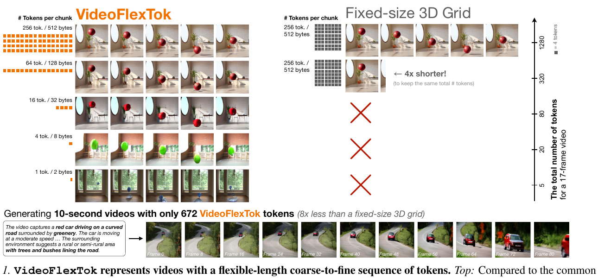
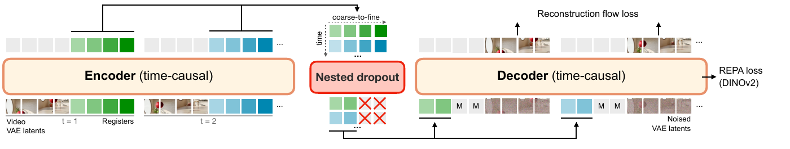
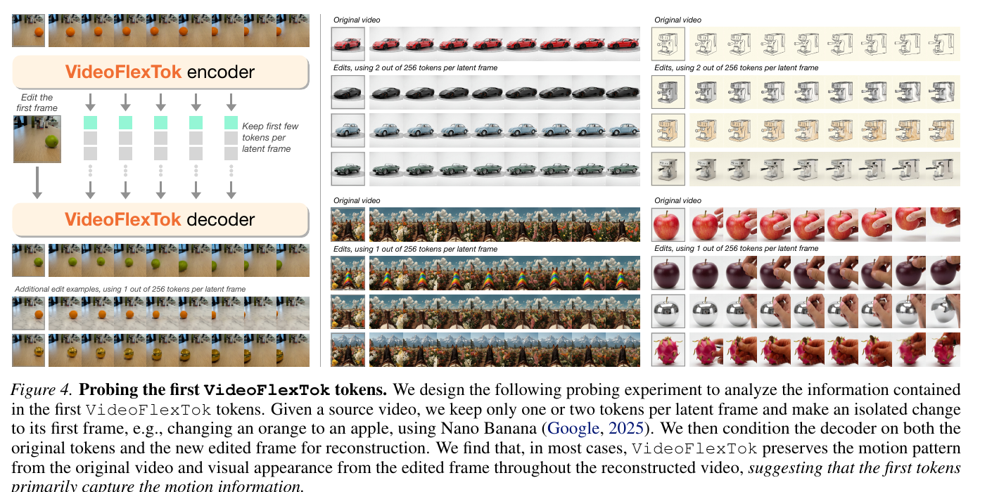
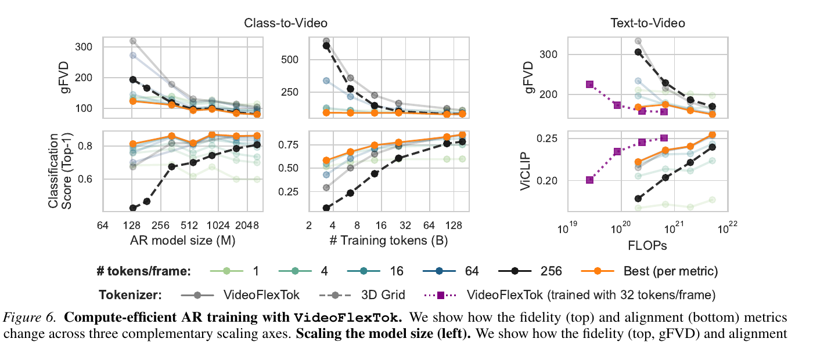
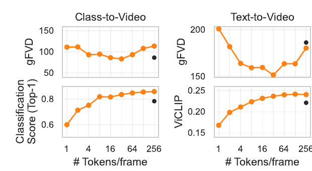

# VideoFlexTok: Flexible-Length Coarse-to-Fine Video Tokenization

> Andrei Atanov¹²*, Jesse Allardice¹*, Roman Bachmann², Oğuzhan Fatih Kar¹², Devon Hjelm¹, David Griffiths¹, Peter Fu¹, Afshin Dehghan¹, Amir Zamir²  
> ¹**Apple** ²**EPFL** · [arXiv:2604.12887](https://arxiv.org/abs/2604.12887)(2026-04-14) · [project](https://videoflextok.epfl.ch)  
> *Equal contribution

---

## 1. 一句话定位

**把视频从"固定 3D 网格"改成"可变长度、由粗到细的一维序列"——前几个 token 涌现地编码语义和运动，后面的 token 才补细节。**

于是 token 数不再由视频长度决定，而是**由内容复杂度和下游需求决定**。同一段 17 帧视频可以用 1 / 4 / 16 / 64 / 256 tok/frame 表示，解码器（一个生成式 rectified flow 模型）**从任意 token 数都能解出逼真视频**。

📌 **最直观的收益**：训一个 T2V 模型生成 **10 秒 81 帧视频只用 672 token**，而同等的 3D 网格 tokenizer 需要 **5376 个**（8× 差距）。类到视频任务上，**用 5–10× 更小的 AR 模型或 5–10× 更少的训练 token 就能追平 3D 网格**（1.1B vs 5.2B）。

⚠️ **但有一个必须先说清的取舍：像素级重建指标大幅落后。** Table 8 里 VideoFlexTok 的 **PSNR 只有 19.67**（Omnitokenizer 是 30.01），**LPIPS 0.185**（对比 0.097）——而 **rFID 4.97 / rFVD 20.53 却是全表最好**。这不是 bug，是设计的直接后果：**它的解码器在"生成合理的视频"，不在"忠实还原原视频"**。用在需要保真的场景（重建、编辑、压缩）会踩坑。

📌 这是仓库里**第一篇专门讲 video tokenizer 的笔记**。方法上是 **FlexTok**（图像，同组作者）到视频域的扩展 + **REPA** 语义偏置。

---

## 2. 要解决的问题

论文的立论从一句话展开：**tokenizer 不只是压缩，它还决定"保留什么信息"和"如何组织这些信息"。**

**当前的事实标准是 3D 网格**：把视频表示成时空 token 网格，每个 token 编码原信号里对应的局部信息。问题在于：

> 这**要求消费这些 token 的下游模型（比如 T2V）去学着"逐像素"预测所有低层细节，而不管视频本身的内在复杂度**，导致很高的学习复杂度。

**而且 3D 网格调整序列长度的唯一方式是缩短视频**（见 Fig 1 右半）——要维持同样的总 token 数，只能把视频砍到 1/4 长。

> **Fig 1 逐行解读**——这张图是全文最重要的一张，因为它同时展示了卖点和代价。
>
> **左半 VideoFlexTok**：同一段视频（红球从桌上滚落的室内场景）在五个 token 预算下的重建，左侧橙色方块直观显示 token 数量：
>
> | 预算 | 重建结果 |
> |---|---|
> | **256 tok / 512 bytes** | ✅ 完整还原：红球、白色椭圆镜、绿植、砖墙、木凳 |
> | **64 tok / 128 bytes** | ✅ 主要内容都在，细节略变 |
> | **16 tok / 32 bytes** | ⚠️ 红球在、镜子在，但**背景已经开始变**（出现蓝绿色块） |
> | **4 tok / 8 bytes** | ⚠️ **球变成绿色气球**，场景变成砖墙+木椅 |
> | **1 tok / 2 bytes** | ⚠️ **完全是另一个场景**：绿树、窗户、深色小物体 |
>
> 📌 **必须诚实读这张图**：**只有运动模式（物体从上往下、向右移动）在五个预算下是一致的**。**外观、颜色、场景在低预算下完全不保留。** 论文的措辞是准确的——"a few tokens **emergently** capture **abstract** information, such as **semantics and motion**"——它说的是抽象信息和运动，**没有说外观保真**。但配合"512 bytes → 2 bytes"这种压缩率对比，读者很容易误读成"2 字节还能还原这段视频"。
>
> **右半 Fixed-size 3D Grid**：同样是 `256 tok / 512 bytes` 两行，第二行标着 **`← 4x shorter!` (to keep the same total # tokens)**，下面三行是**红色叉**——**3D 网格根本没有更低预算这个选项**。右侧纵轴 `The total number of tokens for a 17-frame video` 标着 1280 / 320 / 80 / 20 / 5。
>
> **底部**：`Generating 10-second videos with only 672 VideoFlexTok tokens (8x less than a fixed-size 3D grid)`——红车在乡间弯路上行驶的 10 帧采样。

---

## 3. 核心方法

VideoFlexTok 是个 **autoencoder**，把视频编码成由粗到细的可变长度 token 序列。

> **Fig 3 逐段解读**（从左到右四段）：
>
> - **最左**：`Video VAE latents`（红球场景的 patch 缩略图）与 **`Registers`**（绿色渐变方块，颜色越深表示越靠后）**沿时间维交错**，标着 `t = 1`、`t = 2`（第二段是蓝色渐变方块）。灰色方块是 VAE latent，彩色方块是 register。
> - **`Encoder (time-causal)`**（橙色框）：输出上方画出一个**二维表示**——纵轴标 **`time`**，横轴标 **`coarse-to-fine`**，格子按行是绿色/蓝色渐变。📌 **这就是"2D 表示"的可视化：一维是时间，一维是由粗到细。**
> - **`Nested dropout`**（红框）：下方显示每行末尾的 token 被**红色叉**掉——随机丢掉每个 latent frame 最后的若干 register。
> - **`Decoder (time-causal)`**（橙色框）：输入是**保留的 register + `M` 掩码标记 + 加噪的 VAE latent 交错**。输出上方两个箭头标 **`Reconstruction flow loss`**，右侧一个箭头标 **`REPA loss (DINOv2)`**。
>
> 📌 **注意 decoder 输入的构造**：`[r̂₁, x̃₁, r̂₂, x̃₂, …]`——**register 与噪声 latent 也是按时间交错的**，不是 register 全部前置。

### 3.1 编码：register token + 时间因果注意力

给定 3D 时空 VAE latent `p ∈ ℝ^{T×HW×D}`（沿空间维 flatten 后）和可学习的 register token `r ∈ ℝ^{T×K×D}`，**沿时间维交错**构造输入序列：

$$
\big[\,p_1,\; r_1,\; \dots,\; p_T,\; r_T\,\big]
$$

`p_t` 称作一个 **latent frame**，`K` 是**每个 latent frame 的最大 token 数**（论文用 **K = 256**）。

**然后过带时间因果注意力掩码的 encoder**——`{p_t, r_t}` 只能注意过去的 latent frame `{p_i, r_i}_{i<t}`。

📌 **这个设计与 LARP 的关键区别**，论文强调了两点收益：

> LARP 用**完整 self-attention**、把视频表示成**平坦的 1D 序列**；VideoFlexTok 的设计**保留了原信号的时间因果结构**。这使得：
> 1. **tokenization 兼容流式**——帧可以顺序处理，不需要访问未来帧；
> 2. **下游生成性能更好**（§4.5 有实验）。

register token 内部也用因果 self-attention 掩码，论文说试过别的掩码模式都没更好。

**离散化**：因为下游是 GPT 式 AR Transformer + 交叉熵损失，对 register 输出做 **FSQ 量化**（levels `[8,8,8,5,5,5]`，**codebook 64000**），得到视频表示 `r̂`。

**Nested dropout**：解码前，对 `r̂` 的**第二维**（coarse-to-fine 维）施加 nested dropout——**随机选 `1 ≤ k ≤ K`，把每个 `r̂_t` 的最后 `K − k` 个 token 掩掉**。

> 📌 **这是"由粗到细"结构的唯一来源**——没有任何直接监督规定哪一层该编码什么信息，**层级语义完全是由可变压缩机制涌现出来的**。

### 3.2 生成式解码器 + 语义偏置损失

把掩码后的 register `r̂` 与加噪 VAE latent `x̃ = α·ε + (1−α)·x` **沿时间维交错**，过 DiT decoder，施加 rectified-flow 损失。

$$
\mathcal{L}(\theta) = \mathcal{L}_{\mathrm{Flow}} + \lambda \cdot \mathcal{L}_{\mathrm{REPA}}
$$

`θ` 含 encoder、decoder、REPA head、以及 encoder 的 register token query。

**为什么需要 REPA**——论文的推理链条很清楚：

> **单靠 nested dropout 虽然能诱导出层级结构，但以重建为中心的目标倾向于优先低层细节**，导致**前几个 token 学不到语义有意义的信息**。因此引入**语义偏置**：从预训练视觉编码器蒸馏特征。

具体做法是 **REPA**：在 decoder 的**（早期）某一层**加一个小 readout head 预测**自监督 DINOv2 特征**，施加余弦相似度损失。

📌 **两个值得注意的细节**：
- REPA 原本是为提升 diffusion decoder 训练效率提出的，这里**借用它作为语义偏置**。
- **DINOv2 是自监督训练的，所以整个流程没有任何语义标签监督**。论文特意声明了这点。

### 3.3 时间因果解码器 = 一个隐式的未来预测任务

📌 **这是全文最漂亮的一个观察，值得单独记。**

decoder 也用时间因果注意力掩码。**时间因果 encoder + 时间因果 decoder + nested dropout 三者合起来，构成了一个预测式自监督目标**：

> 每个 `r̂_t` 不仅要编码重建**当前帧 `p_t`** 所需的信息，**还要能预测所有未来帧 `{p_i}_{i>t}`**——而这正是被证明有效的自监督目标（VideoMAE、V-JEPA、Rajasegaran et al.）。

论文由此假设：**这个设计让前几个 register token 捕获"更多"语义信息**。§C.2 的 Fig 10 验证了这个假设（见 §5.3）。

### 3.4 下游 AR 生成与长视频

**下游模型**是 LLaMA 式 Transformer。类条件：class embedding 加到 `[SOS]` token；文本条件：**T5 编码 + 交叉注意力层**。

📌 **AR 顺序用 time-first**：**先预测所有时间步的第 1 个 token，再预测第 2 个，以此类推**。这个顺序是关键——它使得**同一个训好的模型可以在推理时自由选择生成多少 token**。（对比 depth-first：先出第 1 帧的全部 token，则每个 token 预算都得单独训一个模型。）

**长视频的处理**（跟 ARLON 类似）：
1. 把视频切成固定长度的 chunk，**带 `n` 帧重叠**，各自独立编码；
2. 解码时第一个 chunk 正常解，**后续 chunk 把 flow decoder 条件在前一个 chunk 最后 `n` 帧生成的结果上**。

> ⚠️ **为什么必须这样**：**从少量 token 解码时，decoder 需要"填补"token 里没有的细节，而这些填补出来的内容必须在后续 chunk 里保持一致。** 这个挑战在低 token 预算下尤其突出。

---

## 4. 实现细节

| 项 | 值 |
|---|---|
| **底层 VAE** | **VidTok 3D VAE**（`vidtok_kl_causal_488_16chn`），**C = 16 通道**，下采样 `f = (4, 8, 8)` |
| **register 数** | 每 latent frame **256** 个，最大 `K = 5 × 256 = 1280` |
| **Transformer 形状** | `depth = d`，`width = 64d`，`num_heads = d` |
| **Kinetics-600 配置** | `d_enc = d_dec = 18` |
| **Panda 配置** | `d_enc = 18`，`d_dec = 28`，**额外 `[1,2,2]` patchify** VAE latent 以缩短序列 |
| **消融配置** | `d12-d12`（84.9M + 84.9M）+ 201M / depth-16 AR 模型 |
| **d18-d28 参数量** | encoder **286.7M**，decoder **1.1B**（+adaLN 1.1B） |
| **nested dropout 模式** | 从 `{1, 2, 4, …, 256}` **均匀采样**，每个 latent frame 相同 |
| **FSQ** | `[8,8,8,5,5,5]` → **64000 词表** |
| **REPA** | **DINOv2-L**，**接在第 1 层**，projection 是 depth-2 的时间因果 Transformer，**loss weight 1.0** |
| **训练量** | Kinetics 100B token；Panda **400B** token；lr **1.124e-3** cosine，warmup 4B |
| **数据** | C2V: **Kinetics-600** @ 128×128；T2V: **Panda70M 30M 子集**（合成详细 caption）@ 256×256。**都用 17 帧 4 秒 clip**（§4.4 用 81 帧 10 秒） |

📌 **一个后置的微调阶段值得注意**（§F.1）：训完后**冻结 encoder，单独微调 decoder**，此时**改用完整注意力**（论文说这带来更好的时序一致性和整体保真度），并**以 p=0.5 的概率随机提供第一帧的干净 VAE latent**，从而获得帧条件能力。

> ⚠️ **注意这里的微妙之处**：论文强调"**微调时必须冻结 encoder，因为训练时用完整注意力会导致更差的性能**"（Table 3 的结论）。也就是说——**完整注意力对重建更好，但会破坏 token 的可预测结构；所以只在最后阶段、encoder 冻结后才用它。**

**评测指标**分两个方面：
- **保真度**：**FVD**（生成 gFVD / 重建 rFVD）
- **条件对齐**：C2V 用在 Kinetics-600 上微调过的 **UMT-L** 分类器测类-视频对齐（用前 16/17 帧）；T2V 用 **ViCLIP-InternVid-10M-FLT** 测文-视频对齐（**时间步长 2 采 8/17 帧**）。都插值到 224×224。

📌 **论文特意强调"不只看 FVD，还要看条件任务解得好不好"**——这个立场是对的，因为 FVD 只衡量分布相似度，不衡量是否听懂了 prompt。

---

## 5. 实验结果

### 5.1 前几个 token 到底编码了什么？（Fig 4 探针实验）

> **Fig 4 实验设计解读**——这个探针设计得很巧：
>
> 1. 取一段源视频，**只保留每个 latent frame 的 1 或 2 个 token**；
> 2. 用 **Nano Banana**（Gemini 2.5 Flash Image）对**第一帧做一个孤立的修改**，例如把橙子换成苹果；
> 3. **把 decoder 同时条件在"原视频的 token"和"编辑后的第一帧"上**做重建。
>
> **图上的四组例子**（每组：`Original video` 一行 + `Edits, using 1 or 2 out of 256 tokens per latent frame` 若干行）：
> - **橙子→苹果**（左上）：原视频是橙子在台面上滚动，编辑后变苹果，重建保住了**滚动的运动模式** + **苹果的外观**
> - **汽车**（中上，用 2 tok）：黑白照片风格的车 → 换成红色/银色车，运动轨迹保持
> - **人群/建筑**（左下，用 1 tok）：场景整体换掉，相机运动保持
> - **厨具/搅拌机**（右侧）：多组器物替换，运动一致
>
> **结论**：*"VideoFlexTok preserves the motion pattern from the original video and visual appearance from the edited frame throughout the reconstructed video, suggesting that the first tokens primarily capture the motion information."*
>
> 📌 **这个实验回答了 Fig 1 遗留的问题**：低 token 预算下"外观全变了"不是缺陷而是必然——**前几个 token 主要编码运动，外观信息根本不在里面**。外观由 decoder 从第一帧条件（或凭生成先验）填补。
>
> 📌 **顺带的副产品**：这天然就是一个**视频运动迁移/编辑**的接口——改第一帧 + 保留原 token = 换外观保运动。论文没有把这当成一个卖点展开，但工程上很有用。

### 5.2 下游效率（Fig 6 / Fig 7）

> **Fig 6 逐面板解读**——三个互补的 scaling 轴。图例：`# tokens/frame` 用 1(浅绿) / 4 / 16 / 64 / 256(黑) 五档 + **橙色 `Best (per metric)`**；tokenizer 用**灰实线 VideoFlexTok** / **灰虚线 3D Grid** / **紫虚线 VideoFlexTok(用 32 tok/frame 训练)**。
>
> **左（C2V，扫 AR 模型规模 64M→2048M）**：
> - **上排 gFVD**：所有曲线都随规模下降并在 ~1024M 处收敛到 ~90。**橙色 Best 线全程压在最低位**（128M 处就已是 ~120，而黑色 256-token 线在 128M 是 ~190）。
> - **下排 Classification Score**：**差距最明显**——橙线在 **128M 就到 0.79**，而**黑色虚线（3D Grid）在 128M 只有 0.42**，要到 **2048M 才追到 0.81**。
> - 📌 **这就是"5–10× 更小的模型"的来源**：128M 的 VideoFlexTok ≈ 2048M 的 3D Grid（对齐分数）。
>
> **中（C2V，扫训练 token 数 2B→128B，固定 1.3B AR 模型）**：
> - **上排 gFVD**：**橙线几乎是一条平线**（约 100，从 4B 起就稳定）；灰实线和黑虚线从 550+ 一路下降。
> - **下排 Classification Score**：橙线在 **4B token 就到 0.55**，黑虚线在 4B 只有 ~0.12，要到 **128B 才到 0.80**。
> - 📌 **论文由此得出一个实用结论**：**不需要为每个序列长度单独训 AR 模型**——这个实验用完整序列训练，而模型**在训练早期就已经能很好地生成短序列**。
> - ⚠️ **但也点出了饱和**：短序列（1–4 tok/frame）的对齐性能**最终会饱和**，长序列（64–256）则持续上升。
>
> **右（T2V，compute-optimal 扫 FLOPs 10¹⁹→10²²）**：
> - 模型 400M→5.2B，按 `D ≈ 20N` 配训练量。
> - **紫色虚线（用 32 tok/frame 训练的模型）位置最左**——即**计算量低一个数量级**，ViCLIP 在 ~10²⁰ FLOPs 就到 0.24，而黑虚线要 ~5×10²¹ 才到 0.24。
> - 橙线在最大计算量处 ViCLIP 达 ~0.255，**超过黑虚线**。

> **Fig 7 解读**：横轴 `# Tokens/frame`（1/4/16/64/256），橙线 VideoFlexTok，**黑点是 3D Grid**（只有 256 一个点，因为它没有别的选择）。
>
> | | gFVD（越低越好） | 对齐（越高越好） |
> |---|---|---|
> | **C2V** | 橙线在 4–64 区间约 100–110，256 处升到 ~135；3D Grid 点约 ~100 | 橙线从 1 tok 的 0.63 升到 16 tok 的 0.83 并持平；3D Grid 约 0.81 |
> | **T2V** | 橙线在 16–64 区间最低（~150），256 处升到 ~195；3D Grid 约 ~195 | 橙线从 0.16 升到 256 处的 ~0.25；3D Grid 约 0.25 |
>
> 📌 **有一个反直觉的现象论文点了出来**：**gFVD 在 token 数最多时反而变差**（C2V 从 100 升到 135）。论文的解释是**"AR 模型生成的信息量"与"flow decoder 补的信息量"之间存在保真度权衡**，并建议**在 AR 和 flow 两个生成模型之间平衡算力可能是更高效的策略**。§E 的 Fig 12 证实了这点——**在所有 AR 规模和推理预算下，生成少于 256 tok/frame 再多跑几步 flow 解码，性能都更好**。

### 5.3 系统级对比与消融

**Table 1（Kinetics-600 C2V，每个 tokenizer 配一个 2.2B AR 模型训 164B token）**：

| Tokenizer | # Tokens | rFVD↓ | gFVD↓ | Cls. Score↑ |
|---|---|---|---|---|
| VidTok FSQ | 1280 | 84.1 | 131.7 | 0.799 |
| Cosmos-DV | 1280 | 220.5 | 187.6 | 0.825 |
| Omnitokenizer | 1280 | 63.6 | 102.6 | **0.858** |
| LARP | 1024 | **42.1** | 87.5 | 0.739 |
| **VideoFlexTok** | **5–1280** | 48.7† | **80.0†** | 0.833† |

†= 用 **160 token** 的结果。📌 **即"用 6–8× 更少的 token，拿到最好的 gFVD 和第二好的对齐分"**——唯一超过它的是 Omnitokenizer 的对齐分（0.858 vs 0.833）。

⚠️ **Table 8（MSR-VTT 5k 视频重建，全部用同一 decoder 架构）——这张表是本文最重要的警示**：

| Tokenizer | # Tok. | MAE↓ | MSE↓ | **PSNR↑** | **LPIPS↓** | rFID↓ | rFVD↓ |
|---|---|---|---|---|---|---|---|
| VidTok FSQ | 1280 | 0.0276 | 0.00270 | 25.64 | **0.0967** | 5.26 | 35.47 |
| LARP | 1024 | 0.0476‡ | 0.00760‡ | 21.21‡ | 0.1111‡ | 5.50‡ | 28.33‡ |
| Omnitokenizer | 1280 | **0.0206** | **0.00100** | **30.01** | 0.1199 | 7.43 | 38.67 |
| Cosmos-DV | 1280 | 0.0287 | 0.00284 | 25.46 | 0.122 | 8.51 | 47.20 |
| **VideoFlexTok d18-d28** | 5–1280 | **0.0607†** | **0.01079†** | **19.67†** | **0.18545†** | **4.97** | **20.53** |

†= 用 **1280 token**（即满预算）；‡= 在 128×128 分辨率评测。

📌 **必须看清这张表的分裂**：**即使在满 token 预算下**，VideoFlexTok 的**像素级指标是全表最差**——PSNR 19.67 比 Omnitokenizer 低 **10.3 dB**，MSE 高 **10.8×**，LPIPS 高 **1.9×**。但**分布级指标是全表最好**（rFID 4.97、rFVD 20.53）。

> **这个分裂正是"生成式解码器"的定义**：它产出**看起来对、统计上对**的视频，而不是**逐像素还原**的视频。对下游生成建模这是好事；对任何需要保真的用途这是硬伤。⚠️ **论文没有在正文里讨论这个取舍**——Table 8 在附录，正文只说 rFVD 好。

**四个消融**：

| 消融 | 结论 | 数字 |
|---|---|---|
| **Table 2：1D 平坦 vs 2D 时间因果 register** | **1D 重建更好但下游生成更差** | rFVD: 48.9 vs 69.9；**gFVD: 352.1 vs 287.6** |
| **Table 3：decoder 完整 vs 时间因果注意力** | 同样的分裂 | rFVD: 58.3 vs 80.9；**gFVD(32 tok): 211.5 vs 175.1** |
| **Fig 9：REPA loss** | **在少 token 区间显著提升保真度和对齐分** | 无具体数字 |
| **Table 4：AR 顺序 time-first vs depth-first** | **全 token 时无显著差异**（246.6 vs 242.6），但 time-first **允许推理时调整 token 数**从而拿到更好性能（4 tok 时 gFVD 151.1） |
| **Fig 10：decoder 注意力对对齐分的影响** | **时间因果在少 token 时对齐分更高**，支持"前几个 token 语义更强"的假设 | 无具体数字 |

📌 **Table 2 和 Table 3 呈现同一个模式，很值得记**：**凡是让重建变好的选择（完整注意力、1D 平坦结构），下游生成都变差。** 论文的解释是**这些 token"更难预测"，可能因为缺少足够的结构**。这是个反复出现的规律——**tokenizer 的重建质量不是下游生成质量的好代理**。

**Fig 11（§D，同序列长度 1280 下的层级 vs 光栅顺序）**：两个 tokenizer 用**同样的 256 tok/frame**，唯一差别是 token 结构和 nested dropout。结论：
1. VideoFlexTok 的**文本对齐分在所有规模上都更好**；
2. 📌 **VideoFlexTok 对 CFG 的依赖小得多**——**不用 CFG 时 gFVD 显著更低**。论文假设**层级式由粗到细生成把问题拆成了一串更简单的问题**，类似文本/类条件对保真度的作用。

### 5.4 长视频生成（Fig 8）

训一个 **3.2B** 模型在 **10 秒 81 帧**视频上（比前面实验长 ~5×），用 **32 tok/frame → 每视频仅 672 token**（3D 网格需 5376），训 **~55B token，总计 ~10²¹ FLOPs**（在 scaling 实验的中段）。

结果：**能生成连贯的、大体遵循文本条件的 10 秒视频，且没有超出短视频模型的算力预算和上下文长度。**

---

## 6. 争议与权衡

**① 像素级重建大幅落后，而这个事实被放在附录。** Table 8 显示即使满 token 预算下 PSNR 也只有 19.67（比 Omnitokenizer 低 10.3 dB），MSE 高 10.8×，LPIPS 高 1.9×。正文只报 rFVD/rFID（这两项确实最好）。**这不是造假——生成式解码器本来就该这样——但把一个方法级的硬约束放在附录 Table 8，读者容易误判它的适用范围。**

**② Fig 1 的"512 bytes → 2 bytes"呈现方式有误导性。** 按图核对，**1 tok / 2 bytes 那一行重建出的是一个完全不同的场景**（绿树+窗户 vs 原本的室内红球）。论文的文字表述是准确的（"abstract information, such as semantics and motion"），但**把字节数并排列出来，很容易被读成"2 字节表示这段视频"**。实际保留的只有运动模式。

**③ gFVD 在满 token 时反而变差，机制未被查清。** Fig 7 显示 C2V 的 gFVD 从 4 tok 的 ~100 升到 256 tok 的 ~135。论文提出的解释（AR 与 flow decoder 之间的保真度权衡）是合理的猜测，**但没有实验去分离两者的贡献**。§E 只是证明"少 token + 多 flow 步"更好，没有解释为什么多 token 会变差。

**④ 只在 17 帧（4 秒）上做主要实验，81 帧只有一个定性例子。** §4.4 的长视频实验**只训了一个 3.2B 模型、只给了 Fig 1 和 Fig 8 两张定性图**——**没有任何长视频的量化指标**（没有 81 帧的 gFVD/ViCLIP，也没有与 3D 网格在同等长度上的对比）。而"长视频"是摘要里的主要卖点之一。

**⑤ 分辨率偏低。** C2V 是 **128×128**，T2V 是 **256×256**。当代 T2V 的常规是 480p–720p。**在更高分辨率下，"少数 token 编码语义+运动"这个性质是否还成立，未知**——高分辨率意味着更多细节需要 decoder 填补，而 Fig 1 已经显示低预算下 decoder 的填补是"另编一个场景"。

**⑥ Table 1 的对比条件不完全齐。** LARP 那一行注明"看到同样数量的视频但 token 数略少（因为压缩率更高）"，Table 8 里 LARP 又是**在 128×128 评测**而其它在 256×256。**跨行比较需要留意。**

**⑦ 长视频的 chunk 拼接是个开放风险。** 方法是"带 `n` 帧重叠切 chunk，后续 chunk 条件在前一 chunk 最后 `n` 帧上"。⚠️ **但论文自己指出这个挑战"在低 token 预算下尤其突出"，因为 decoder 填补的细节必须跨 chunk 保持一致**——而**没有任何实验量化这个一致性**（没有跨 chunk 的漂移曲线，没有对 `n` 的消融，`n` 的取值都没给）。

**⑧ 与 ElasticTok 的差异只有一句话。** §2 说"不像 ElasticTok，我们的 tokenizer 压缩率高得多，并展示了压缩之外的收益"——**没有实验对比**。ElasticTok 是最接近的可变长度视频 tokenizer。

**⑨ 正面：Fig 4 的探针实验设计得很干净。** "只保留 1–2 个 token + 编辑第一帧 + 让 decoder 同时条件在两者上"——这个设计**把"运动信息在 token 里、外观信息不在"这件事直接可视化了**，比任何指标都有说服力。而且它顺带给出一个**视频运动迁移**的实用接口（改第一帧 = 换外观保运动），论文自己都没展开。

**⑩ 正面："时间因果 encoder + 时间因果 decoder + nested dropout = 隐式未来预测任务"这个观察很漂亮。** 每个 `r̂_t` 既要能重建当前帧又要能预测所有未来帧，这恰好是 VideoMAE/V-JEPA 那条自监督线证明有效的目标。**而它在这里是三个独立设计选择组合出来的副产品，不是刻意设计的。** Fig 10 还验证了它带来的语义增益。

**⑪ 正面：Table 2/3 揭示了一个可迁移的规律。** 两张表指向同一个结论——**让重建变好的设计（完整注意力、1D 平坦结构）会让下游生成变差**，因为 token"更难预测"。**"tokenizer 的 rFVD 不是下游 gFVD 的好代理"这个教训，对任何做 tokenizer 的人都有用。**

**⑫ 正面：time-first AR 顺序解决了一个真问题。** Table 4 显示 time-first 与 depth-first 在满 token 时没有显著差异（246.6 vs 242.6），但**time-first 让同一个训好的模型能在推理时自由选 token 预算**。depth-first 则要为每个预算单独训一个模型。**这是"可变长度"这个卖点能真正落地的前提。**

**⑬ 正面：对 CFG 依赖更小是个被低估的发现。** Fig 11 显示同序列长度下，VideoFlexTok **不用 CFG 时的 gFVD 显著低于 3D 网格**。CFG 意味着推理时算力翻倍，**能少用 CFG 是实打实的效率收益**——但论文只在附录 §D 提了一句。

---

## 7. 一句话总结

VideoFlexTok 把视频 tokenizer 从"固定 3D 网格"改成"**时间 × 由粗到细**的二维 register 序列"：时间因果 encoder 把 VAE latent 与 register 交错编码、**nested dropout 涌现出层级**、**REPA(DINOv2) 提供语义偏置防止前几个 token 只学低层细节**，而**时间因果 encoder + decoder + nested dropout 三者组合意外地构成一个隐式未来预测任务**；解码器是生成式 rectified flow，**任意 token 数都能解出逼真视频**，配上 time-first 的 AR 顺序使**单个训好的模型能在推理时自选预算**——于是 C2V 上 **128M 模型的对齐分追平 2048M 的 3D 网格**，T2V 上省一个数量级算力，10 秒 81 帧视频**只用 672 token（8× 少）**；⚠️ **代价是像素级保真度大幅落后（满预算下 PSNR 19.67 vs 30.01、LPIPS 0.185 vs 0.097，这张表在附录），低 token 预算下重建的是"运动一致但外观全变"的另一个场景，长视频只有定性结果，分辨率只到 256×256。**

---

## Q&A

**Q: "前几个 token 涌现地编码语义和运动"——这个说法可信吗？**

A: **可信，但要精确理解"语义和运动"指什么——它明确不包括外观。**

三条证据，强度递减：

1. **Fig 4 的探针实验（最强）**：只保留 1–2 tok/frame + 用 Nano Banana 编辑第一帧（橙子→苹果）→ decoder 同时条件在原 token 和编辑帧上 → **重建保住了原视频的运动模式 + 编辑帧的外观**。这直接证明了**运动在 token 里、外观不在**。

2. **Fig 10（§C.2）**：时间因果 decoder 在**少 token 时**对齐分更高，支持"前几个 token 语义更强"。

3. **Fig 9（§C.1）**：加 REPA 后**少 token 区间**的保真度和对齐分都显著提升 —— 即语义偏置确实起作用。

⚠️ **但 Fig 1 显示的代价必须一起记住**：1 tok/frame 时重建出的是**完全不同的场景**（绿树+窗户 vs 原本的室内红球），4 tok 时球从红变绿。**保留的只有"物体从上往下、向右移动"这个运动模式。**

📌 **所以准确的表述是**：前几个 token 编码的是**运动模式 + 抽象语义类别**，外观、颜色、具体场景**不在其中**——这些由 decoder 从生成先验（或额外的帧条件）填补。

**这个性质决定了它的适用边界**：
- ✅ **适合**：下游生成建模（AR 模型只需预测抽象信息，细节交给 flow decoder）
- ✅ **适合**：运动迁移/编辑（改第一帧 + 保留 token）
- ❌ **不适合**：需要保真的重建、压缩、精确编辑

---

**Q: 为什么"重建更好"的设计会让"下游生成更差"？**

A: **因为 tokenizer 的两个目标在这里是冲突的：token 要好重建 vs token 要好预测。**

论文有两组消融指向同一模式：

| 设计选择 | 重建（rFVD↓） | 下游生成（gFVD↓） |
|---|---|---|
| **1D 平坦 register**（LARP 式） | **48.9** ✅ | 352.1 ❌ |
| **2D 时间因果 register**（本文） | 69.9 | **287.6** ✅ |
| **完整注意力 decoder** | **58.3** ✅ | 211.5 ❌ |
| **时间因果 decoder**（本文） | 80.9 | **175.1** ✅ |

**论文的解释**：完整注意力/1D 平坦的 token **"更难预测，可能因为缺少足够的结构"**。

我的理解（**论文没有明确这么说**）：完整注意力让 encoder 可以自由地把信息打散到任意 token 上，重建时拼回来即可；但 AR 模型是**顺序预测**的，它需要 token 之间有**可利用的结构**（时间因果性、由粗到细的层级）才好预测。**结构对重建是约束，对预测是帮助。**

📌 **这条规律的实用推论**：**评估一个 tokenizer 时，rFVD/PSNR 不是下游 gFVD 的好代理。** 如果你在挑 tokenizer 做生成，得真的去训一个下游模型量一下，不能只看重建榜。

⚠️ **注意本文自己也用了个折中方案**（§F.1）：最后有一个**冻结 encoder、只微调 decoder** 的阶段，此时**改用完整注意力**——既拿到完整注意力的重建收益，又不破坏 encoder 产出的 token 结构。**"训练时因果、微调时完整、但必须冻 encoder"这个配方值得抄。**

---

**Q: 8× / 5–10× 这些效率数字，具体是在什么条件下成立的？**

A: **三个不同的轴，来源和强度都不同，别混着用。**

| 宣称 | 来源 | 具体条件 |
|---|---|---|
| **8× 更少 token** | §4.4 | 10 秒 81 帧视频：**672 vs 5376 token**。这是个**纯计数对比**（32 tok/frame × 21 latent frames vs 3D 网格的固定尺寸），⚠️ **没有配对的质量指标** |
| **5–10× 更小模型 / 更少训练 token** | Fig 6 左+中 | **C2V（Kinetics-600, 128×128）**，看的是**Classification Score**。128M 的 VideoFlexTok(0.79) ≈ 2048M 的 3D Grid(0.81) |
| **1.1B vs 5.2B（5×）** | 摘要 + Fig 6 右 | **T2V（Panda70M, 256×256）**，gFVD 和 ViCLIP 都"comparable" |
| **6–8× 更少 token 下拿最好 gFVD** | Table 1 | Kinetics-600 C2V，2.2B AR 模型，**160 token vs 1024–1280 token** |

⚠️ **要注意的三点**：

1. **对齐分的增益远大于保真度的增益。** Fig 6 下排（Classification/ViCLIP）的差距非常大（128M 时 0.79 vs 0.42），上排（gFVD）的差距小得多且在大模型处收敛。**"更小的模型"主要指"更小的模型就能听懂条件"，不是"更小的模型画质一样好"。**
2. **训练算力省了，推理算力要还一部分回去。** 生成更少 token 意味着 flow decoder 要多跑几步。§E 的 Fig 12 说在所有预算下这个交换都是划算的，但**这是个 trade-off 不是净省**。
3. **8× 那个数字没有配对的质量对比**——它只是"我们用 672 个 token，3D 网格需要 5376 个"。**没有"3D 网格用 5376 token 训出来的 10 秒视频质量如何"这个对照。**

---

**Q: 这份工作对我（游戏资产/视频生成）实际有多大用？**

A: **作为 tokenizer 直接用要谨慎；但里面有三个可以直接拿走的工程判断。**

**可以直接拿走的**：

1. **"tokenizer 的重建指标不是下游生成质量的代理"**（Table 2/3）。挑 tokenizer 时必须训个下游模型实测，光看 rFVD/PSNR 榜会挑错。
2. **"训练时因果注意力、微调时完整注意力、但必须冻结 encoder"**（§F.1 + Table 3）。这个配方同时拿到两边的好处，可以直接抄。
3. **time-first AR 顺序**（Table 4）。如果你想让一个模型支持多个 token 预算，**必须按"先所有时间步的第 1 个 token，再第 2 个"的顺序训**，而不是"先第 1 帧的全部 token"。后者每个预算都得单独训模型。

**顺带一个可能有用的副产品**：

4. **Fig 4 的探针接口就是一个运动迁移工具**——保留源视频的少数 token + 提供编辑后的第一帧 = **换外观、保运动**。论文没把它当卖点，但对游戏资产的"同一动作换角色/换材质"这类需求很对路。

**要谨慎的**：

- ⚠️ **不要当保真 tokenizer 用。** 满 token 预算下 PSNR 19.67、LPIPS 0.185（Table 8，在附录）。任何需要"还原原素材"的环节都不行。
- ⚠️ **分辨率只验证到 256×256。** 高分辨率下 decoder 需要填补的细节更多，而 Fig 1 已经显示它在信息不足时会"另编一个场景"。
- ⚠️ **长视频只有定性结果。** 81 帧那部分没有任何量化指标，chunk 拼接的一致性也没被量化（连重叠帧数 `n` 都没给）。
- ⚠️ **权重/代码状态未知**——只有 project 页，论文没有明确的 release 承诺。

📌 **最实际的判断**：如果你的场景是**"AR 模型 + 生成式 decoder"这种两段式架构**，这套思路值得认真考虑——**让 AR 只负责抽象信息、细节交给 decoder**，确实能大幅降低 AR 侧的学习复杂度和算力。但如果你需要 tokenizer 同时承担保真重建的职责，这条路不适合。

---

**Q: 它和仓库里的其它工作是什么关系？**

A: **它是仓库里第一篇 tokenizer 专篇，但与好几条线在"抽象空间建模"这个点上相通。**

| | 关系 |
|---|---|
| **FlexTok**（Bachmann et al., ICML 2025） | 📌 **直接前身**——同组作者的图像版。VideoFlexTok 沿用它的 register + nested dropout + 生成式 flow decoder，扩展到视频（2D register、时间因果掩码、VidTok VAE） |
| [RF (Representation Forcing)](../rf/analysis.md) | **同方向的反面**——RF 主张**去掉 VAE、直接在像素空间生成**（bottleneck-free），VideoFlexTok 则**在 VAE latent 之上再加一层更抽象的压缩**。两篇对"该不该有中间表示"的答案相反 |
| [PDD](../../video_generation/pdd/analysis.md) | 都在降低生成的序列/步数成本，但**切的维度不同**：PDD 降**去噪步数**（并行解码 L 个 mean velocity），VideoFlexTok 降**token 数**。⚠️ 两者原则上可以叠加 |
| [Cosmos 3](../cosmos3/analysis.md) | Table 1 里的 **Cosmos-DV** 是本文的 baseline（rFVD 220.5，全表最差）。Cosmos 那条线用的正是本文批评的固定 3D 网格 |
| [SolarWM](../../world_model/solarwm/analysis.md) | 都在做"**换掉表示层**"的工作。SolarWM 换的是**数据契约**（统一多源），VideoFlexTok 换的是**token 结构**。📌 SolarWM 的 model view 命名空间正好是为"换 VAE/tokenizer 不改数据选择"设计的 |
| [MLLM-DiT Fusion](../../video_generation/mllm_dit_fusion/analysis.md) | 都在扫"表示如何进入生成模型"的设计空间 |

📌 **一条更大的脉络**：论文 §2 把自己放在"**在抽象空间做视频建模**"这一支里——与 **V-JEPA 2**、**Pyramidal Flow**、**ARLON** 同族，即**先预测抽象 token、再解码到像素**。本文的差异化是**这个抽象空间的紧凑程度可变**，而不是用预训练模型的固定尺寸表示。

⚠️ **一个跨篇的提醒**：本文的"时间因果 encoder+decoder+nested dropout = 隐式未来预测"与 [ABot-World-0](../../world_model/abot_world_0/analysis.md)、[RAVEN](../../video_generation/raven/analysis.md) 那条 teacher-forcing / self-forcing 线**处理的是不同的因果性问题**——前者是**表示学习**里的因果结构（让 token 更好预测），后者是**推理时**的因果性（避免 exposure bias）。**别混为一谈。**
