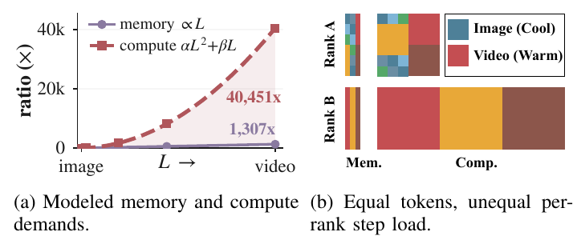
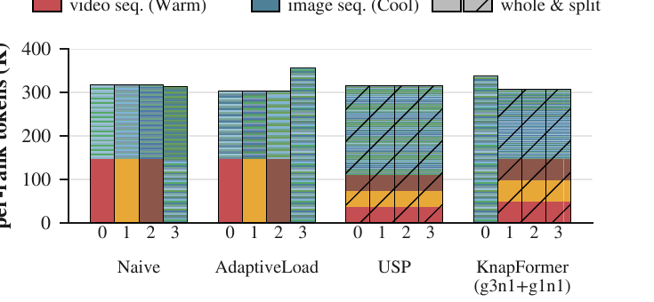
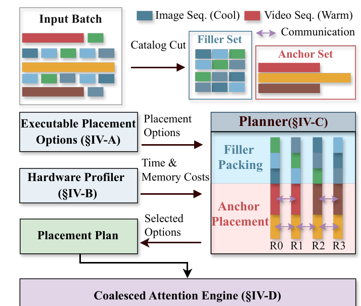
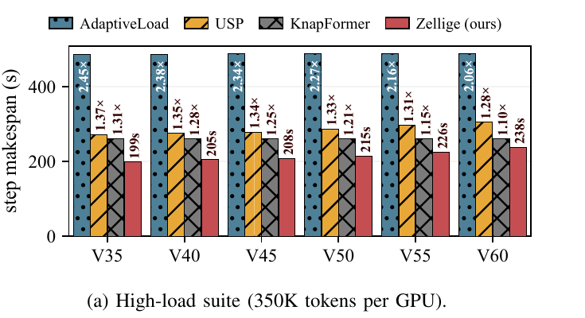
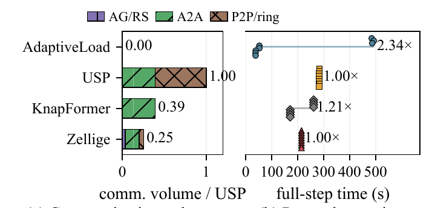

# Zellige: Moldable Sequence Placement for Mixed Image-Video DiT Training

- **机构**:香港科技大学(广州)+ 哈工大(深圳)+ 香港科技大学
- **时间**:2026-08-02,arXiv:2608.01150v1(cs.DC)
- **代码**:未开源(截至 2026-08)
- **类型**:分布式训练系统论文 —— 不改模型、不改数学、不影响精度

---

## 1. 一句话定位

图文混训的视频 DiT,一个 batch 里既有 256p 图片(几百 token)又有 15 秒 1080p 视频(**49.7 万 token**),现有并行方案要么让长视频卡住某张卡,要么把小图片也强行切开白白通信。Zellige 把这件事**形式化成 moldable task 调度问题**,先用两条定理证明"预设不相交 rank 组"(KnapFormer 路线)存在**无法回避的二选一**,再给出一套 profiler + 两阶段 CP-SAT planner + coalesced attention engine 的系统实现。

结果:**33–119 ms 内为每个 batch 求出放置方案**,相对联合求解参考的 makespan 误差 ≤0.32%;端到端在 16×A800 上比 KnapFormer 快 **1.12–1.48×**,32×A6000 上快 **1.27–1.54×**。

📌 **这篇论文的核心洞察一句话**:短图片不该被切,长视频不该不切,而这两件事**必须允许 rank 集合互相重叠**才能同时做到 —— 恰恰是所有 disjoint-group 方案做不到的。

---

## 2. 要解决的问题(动机)

### 2.1 token 数相等 ≠ 计算量相等

> **Fig 1 逐面板解读**:
>
> **(a) 建模的显存与计算需求**——横轴从 image 到 video(即序列长度 `L` 增长),纵轴是相对倍率(注意最大刻度 40k)。**紫色实线 = 显存,标注 ∝L,终点 1,307×**;**红色虚线 = 计算,标注 αL²+βL,终点 40,451×**,底下填了淡红色阴影强调这个鸿沟。
>
> 关键在于两条线的**形状差异**:在 memory-efficient attention(FlashAttention)下,显存随 `L` 近似线性增长,而 dense self-attention 要算 `L²` 个 token 对,计算随 `L` 二次增长。从 256p 图片到 10 秒 1080p 视频,显存只涨 1,307 倍,计算却涨 **40,451 倍** —— **差了 31 倍**。这就是为什么"按 token 数配平"必然失败。
>
> **(b) 相同 token 数,不同 per-rank 步时**——两行分别是 Rank A 和 Rank B,每行有 **Mem.** 和 **Comp.** 两个横条。色块含义:**蓝色 = 图像序列(Cool)**,**红/橙/棕 = 视频序列(Warm)**。
>
> - **Rank A** 拿了很多细碎的图像 + 少量视频:Mem. 条上色块很多很窄,Comp. 条上这些色块的宽度基本没变(图像的计算本来就小)。
> - **Rank B** 拿了三段长视频:Mem. 条上只有几个窄条(显存不高),但 **Comp. 条上三个大色块几乎占满整行** —— 同样的 token 总数,计算量炸开。
>
> **对比 Mem. 与 Comp. 两列的宽度变化就是这张图的全部信息**:Rank A 和 Rank B 的 Mem. 条长度接近(token 数配平了),Comp. 条却严重不等。**因为一个同步步要等最慢的 rank,Rank B 决定了整步的 makespan。**

Wan 的 VAE + patch 配置下,一段 15 秒 1080p 视频产出 **497,760 token** 的序列。这种量级的序列必须多卡切分,而切分方式的选择就是这篇论文的战场。

### 2.2 四条现有路线各自的死穴

> **Fig 2 逐组解读**:场景固定为**3 段 720p 10 秒视频 + 228 张 720p 图片,分配到 4 张卡(rank 0–3)**。每根柱子是一个 rank,柱内堆叠它承担的序列。**暖色(红/橙/棕)= 视频,冷色(蓝/绿)= 图像**;**带斜线阴影 = 该序列被切分(split shard)**,无阴影 = 整条跑在这个 rank 上。纵轴是 per-rank token 数(K)。
>
> **Naive(朴素 DP)**——rank 0、1、2 各拿一段完整视频(底部大块暖色)+ 一些图像,rank 3 只有图像。四根柱子高度都在 315K 左右,**token 数配得很平**。但 rank 0–2 每张卡上都压着一整段视频的 `L²` 注意力,rank 3 只有一堆小图 —— **计算严重不平**。实测四卡 max/mean 步时比 **1.27–1.31×**。
>
> **AdaptiveLoad**——计算感知的 DP,按估计的序列计算量动态调整每卡 batch size。可以看到 rank 3(纯图像卡)柱子明显更高(约 355K),rank 0–2 略降到 300K 左右 —— **它把更多图像塞给了没有视频的那张卡**。但**每段长视频仍然整条跑在单卡上**,依旧是 straggler。max/mean 只降到 **1.25–1.27×**,离理想的 1.0× 还差 25–27%。
>
> **USP**——**所有柱子全都带斜线阴影**,意味着每一条序列(包括 228 张小图)都被切到全部 4 张卡上。四根柱子高度完全一致(315K),**平衡是完美的**。代价是小图片本来一张卡就能跑完,现在被迫参与 all-to-all / ring 通信。实测:256p 下**通信占注意力时间的 57.3–71.0%**,1080p 下仍有 17.7–33.8%。
>
> **KnapFormer(g3n1+g1n1 布局)**——rank 0 是一个单卡组(柱子无阴影的部分较多,高度 340K),rank 1–3 组成一个 3 卡组(带阴影,各约 305K)。它允许"整条跑"和"3 卡切分"在同一步内共存,是四者里最灵活的。但**组边界不可跨越**:一个组过载时另一个组闲着也帮不上;而且被路由进 3 卡组的图片会**继承该组的并行配置**,明明能整条跑却被迫通信。
>
> **一句话**:Naive/AdaptiveLoad 是"切得太少",USP 是"切得太多",KnapFormer 是"切得对但边界锁死"。

### 2.3 缺口

**混合 image-video batch 需要更灵活的 per-sequence 放置:每条序列独立选择并行配置和参与 rank 集合,并且允许不同序列的 rank 集合互相重叠**,这样短序列才能整条跑在某些卡上、同时与长视频的分片共享这些卡。

---

## 3. 与前作的关系

| 方法 | 做法 | 死穴 |
|---|---|---|
| Naive DP | 按 token 数配平,整条分配 | 计算不平,1.27–1.31× |
| **AdaptiveLoad** | 计算感知 DP,动态 per-rank batch size | 长视频仍不可分,1.25–1.27×;15 秒视频直接 **OOM** |
| **USP**(xDiT) | 全局统一 CP,每条都切到所有 rank | 小图白白通信,256p 下通信占 57–71% |
| **KnapFormer** | 预设不相交 rank 组,组内 CP + 组间 DP | 组边界不可跨越;短序列继承组配置 |
| **Zellige** | **per-sequence 选配置 + 可重叠 rank 集合** | 需要一次性 profiling;solver 有 ms 级开销 |

相邻领域:
- **长上下文 LLM 系统**:FlexSP(disjoint Ulysses 组上的带宽感知 MILP)、HotSPa(按长度分组后顺序切换并行策略,而非并发执行重叠放置)、ByteScale(动态 per-sequence mesh,但只在显存需要时才切且用 ring)、DCP(细粒度 block co-location,优化 hypergraph connectivity-minus-one 通信量而非 step makespan)
- **扩散系统**:多数优化推理或 model-stage placement,不做 per-sequence attention placement

**Incremental claim**:(1) **首次证明** disjoint-group 放置存在负载不均 vs 通信冗余的根本权衡;(2) 提出允许 rank 集合重叠的 moldable 放置;(3) 两阶段 planner 让这个更大的搜索空间在毫秒级可解。

---

## 4. 核心算法 / 方法

### 4.1 放置问题的形式化

一个同步步内,`R = {1,...,N}` 是 worker rank,`S` 是 minibatch 序列集。每条序列 `s` 有一组**合法可执行放置选项** `C_s`。一个选项 `c = (θ_c, R_c)` 由两部分组成:

- **并行配置** `θ_c = (q_c, h_c, k_c)` —— 分别是 query 轴、head 轴、key/value 轴的切分因子
- **参与 rank 集合** `R_c`

切分度 `λ_c = q_c · h_c · k_c = |R_c|`。配置在 rank 分配**之前**就固定了原语组成与因子分解。

放置 `x` 用二元变量 `x_{s,c}` 表示序列 `s` 是否选项 `c`。该选项给 rank `r` 贡献时间 `A_{s,c,r}` 和显存 `M_{s,c,r}`(在 `R_c` 之外均为 0)。**因为同步步要等所有 rank 完成,step makespan 是最大 rank 时间**:

$$
T^{\star}_{\mathcal{X}} = \min_{x \in \mathcal{X}} \max_{r \in R} \sum_{\substack{s \in S \\ c \in \mathcal{C}_s}} x_{s,c} A_{s,c,r}
$$

$$
\text{s.t.} \quad \sum_{c \in \mathcal{C}_s} x_{s,c} = 1 \ \ \forall s, \qquad
x_{s,c} \in \{0,1\}, \qquad
\sum_{\substack{s \in S \\ c \in \mathcal{C}_s}} x_{s,c} M_{s,c,r} \le M_{\mathrm{cap}} \ \ \forall r
$$

**匹配的联合松弛** `X_joint := ∏_{s∈S} C_s` —— 每条序列独立选任意合法选项,不受"必须共享不相交组"约束。这是 Zellige 的动作空间,也是理论分析的参照系。

**Disjoint-group 放置**则限制 `X` 通过 `G = {(G_1,θ_1),...,(G_J,θ_J)}`,rank 集合两两不交且覆盖 `R`。纯 DP(每组单 rank)和纯 CP(单个全 rank 组)是这个族的两个端点。

### 4.2 定理 1 — 组间负载不均

在**理想计算模型**下(`N ≥ 2`,零通信开销,显存不绑定):令 `w = (w_s)` 是工作量向量,`W = Σ w_s`,`w_max = max_s w_s`,`g_max = max_j g_j`,`φ = w_max/W`。

联合放置能达到平均负载下界 `T*_joint = W/N`(把每条序列都放到全 rank 选项上)。Disjoint-group 的最优是

$$
T^{\star}_{\mathrm{disj}}(\mathcal{G}; \mathbf{w}) = \min_{y \in \mathcal{Y}(\mathcal{G})} \max_j \frac{\sum_s y_{s,j} w_s}{g_j}
$$

定义比值 `Γ(w,G) = T*_disj / T*_joint = N·T*_disj/W`,则

$$
\max\left\{1,\ \frac{N}{g_{\max}}\phi\right\} \;\le\; \Gamma(\mathbf{w}, \mathcal{G}) \;\le\; \frac{N}{g_{\max}}
$$

**证明思路**:平均负载给出 `Γ ≥ 1`;最大的那条序列最多占 `g_max` 个 rank,故 `Γ ≥ (N/g_max)φ`;把整个 batch 塞给最大的组给出 `Γ ≤ N/g_max`。单序列 workload 让上下界相等,证明最坏情况紧。

📌 **这个定理的杀伤力在推论**:要保证**任意** batch 都能 `Γ = 1`,必须 `g_max = N` —— 也就是**单个全 rank 组,即纯 CP,而纯 CP 会切分每一条序列**。

### 4.3 定理 2 — 组内通信冗余

同一理想模型下。序列在 `λ_c > 1` 时被切分并触发通信。在**相同 makespan** 的放置里,disjoint-group 相对 joint 的额外切分次数即为通信冗余。

**构造**:每条序列在每个 rank 上都有合法的整条选项,且所有序列共享一个合法全 rank 配置。取任意整数 `p ≥ 1`,一个工作量 `Nu` 的巨型序列 + `m = Np` 个工作量 `δ > 0` 的 filler。选 `u > (N-1)pδ`,令 `F = u + pδ < Nu/(N-1)`。

- 总工作量 `Nu + mδ = NF`,故 makespan 至少 `F`
- **joint 放置**:把巨型序列 `N` 路切开,每个 rank 放 `p` 个 filler,`Nu/N = u` 恰好配平 → **只需 1 次切分**
- **disjoint 放置**:要达到 `F`,巨型序列所在组的大小 `g` 不能小于 `N`(否则 `Nu/g ≥ Nu/(N-1) > F`),故 `g = N`。但组不相交,全 rank 组占满了所有 rank,**没有 rank 留给另一个非空组** → 所有 `m` 个 filler 也必须进这个组并被切分 → **最少 m+1 次切分**

固定 `N` 让 `p` 增长,冗余 `m = Np` **无界**。

📌 **两条定理构成一把钳子**:定理 1 说"要完美平衡就得 `g_max = N`",定理 2 说"`g_max = N` 就得把所有小序列也切开,冗余无界"。**disjoint-group 这个设计选择本身就是死路** —— 这是 Zellige 允许 rank 集合重叠的全部理由。

> ⚠️ **理论的边界要说清楚**:两条定理都建立在"零通信开销 + 显存不绑定"的理想模型上。也就是说,**它们证明了权衡在原理上存在,但没有量化真实通信下这个权衡有多大**。真实数字全靠第 5 节的实测。

### 4.4 Zellige 系统设计

> **Fig 4 逐区域解读**:整图是一条从上到下的数据流,四个带 §编号的方框对应论文的四个小节。
>
> **顶部 — Input Batch → Catalog Cut**:左边灰框里是原始 batch,横条长短不一,**蓝色系 = 图像序列(Cool),红/橙/棕 = 视频序列(Warm)**,长度差异一眼可见。中间的 **Catalog Cut** 箭头把它一分为二:
> - **Filler Set(蓝框)**——一堆短小的图像和短片段,画成小方块矩阵,表示数量多但每个都轻
> - **Anchor Set(红框)**——三条长横条(红/橙/棕),即长视频。**注意 Anchor Set 里的条明显更长** —— 这就是"计算重"的直观表达
>
> 右上角图例里的**双向紫色箭头 = Communication**,后面会用到。
>
> **中层左侧 — 三个输入方框**:
> - **Executable Placement Options (§IV-A)** —— 为每条序列枚举"并行配置 × 合法 rank 集合"的候选清单,输出 "Placement Options"
> - **Hardware Profiler (§IV-B)** —— 一次性实测,输出 "Time & Memory Costs"
> - 两条箭头都指向右边的 Planner
>
> **中层右侧 — Planner (§IV-C)**:这是整图最关键的部分,内部**上下分成两层**,横轴是四个 rank(R0–R3):
> - **下半部(粉色底)Anchor Placement**——三条 anchor(红/橙/棕)被切成分片铺在 R0–R3 上,**分片之间画着紫色双向箭头 = 它们之间要通信**。这一层先做,因为 anchor 是 straggler 的来源。
> - **上半部(蓝色底)Filler Packing**——短序列(蓝/绿小块)**整块**堆在 anchor 之上,**注意它们身上没有任何紫色通信箭头** —— 这就是"filler 保持整条,零通信"。
> - **两层堆叠后四根柱子高度接近**:这张图在视觉上表达的就是"先用可切分的 anchor 把地基铺平,再用不可切的 filler 填缝"。
>
> Planner 输出 "Selected Options" 回到左边的 **Placement Plan(绿框)**。
>
> **底部 — Coalesced Attention Engine (§IV-D)(紫框)**:接收 Placement Plan,负责把"同一 rank 上既有整条序列、又有分布式注意力分片"这件事高效执行掉,而不产生大量碎小 kernel。
>
> **为什么是这个顺序**:anchor 先放是因为它们决定 makespan 下界且必须切分;filler 后放是因为它们可以任意塞进剩余缝隙。反过来做的话,filler 会先占满 rank,anchor 无处安放。

#### A. 可执行放置选项

三个基础原语,一个切分轴一个(Table II):

| 原语 | 配置 | 通信 | 常驻 K/V |
|---|---|---|---|
| all-gather | `(q,1,1)` | 一次性 gather K/V,`L·kv` | **复制**,`L·kv` |
| Ulysses | `(1,h,1)` | head 维 all-to-all **×2**,`L·kv/h` | 分片,`L·kv/h` |
| ring | `(1,1,k)` | 流式传 K/V **×(k−1)**,`L·kv/k` | 分片,`L·kv/k` |

**配置 `(1,1,1)` = 整条跑,不激活任何注意力通信** —— 这是 filler 的归宿。多轴配置组合这些原语,但只保留满足执行器合法性约束的(例如 Ulysses degree 必须整除注意力头数)。

#### B. 硬件 Profiler

**每个训练配置跑一次**,测量每个 (bucket, configuration) 对的 per-rank 执行时间。每次测量都包含注意力计算、通信、kernel fusion、overlap、launch overhead、packing —— **不假设这些可分离**。扣掉与放置无关的 host 开销后,存下 per-participating-rank 价格 `P_{b,θ}`,然后

$$
A_{s,c,r} = P_{b(s),\,\theta_c} \quad (r \in R_c), \qquad A_{s,c,r} = 0 \quad (r \notin R_c)
$$

**显存则用解析模型**,基于常驻张量形状与生命周期:

$$
M_{s,c,r} = M^{\mathrm{act}}_{s,c,r} + M^{\mathrm{KV}}_{s,c,r} + M^{\mathrm{buf}}_{s,c,r}
$$

`M^act` 取决于模型几何、深度、checkpointing 模式、局部分片长度;`M^KV` 和 `M^buf` 取决于原语怎么存和搬 Q/K/V。校准后 `M_cap = M_usable − M_base`。

#### C. Anchor/Filler 两阶段 planner

**Catalog cut**:按 profiled 整条时间 `w_b = P_{b,whole}` 非降序排列 catalog buckets,选使 `log w_i` 组内离散度最小的连续切点:

$$
k^{\star} = \arg\min_{1 \le k < B_{\mathrm{cat}}} \left[ \sum_{i \le k} \bigl(\log w_i - \mu_{\mathrm{fill}}(k)\bigr)^2 + \sum_{i > k} \bigl(\log w_i - \mu_{\mathrm{anc}}(k)\bigr)^2 \right]
$$

**取对数是为了捕捉乘性差异,并让指标对统一价格缩放不变** —— 视频和图像的耗时差几个数量级,线性方差会被大数完全主导。平局时取最小的 `k`。

**Stage 1 — Anchor Placement**(ε-约束的次级目标):

$$
T^{\star}_{\mathrm{anc}} = \min_{(z,u) \in \mathcal{F}_{\mathrm{ECF}},\, T \ge 0} T
\quad \text{s.t.} \quad L_r \le T,\ \ H_r \le M_{\mathrm{cap}} \ \ \forall r
$$

$$
K^{\star}_{\mathrm{anc}} = \min_{(z,u) \in \mathcal{F}_{\mathrm{ECF}}} K
\quad \text{s.t.} \quad L_r \le (1+\epsilon)\, T^{\star}_{\mathrm{anc}},\ \ H_r \le M_{\mathrm{cap}} \ \ \forall r
$$

先最小化最大 anchor 负载,再在**允许该最优值上浮至多 `ε`** 的前提下最小化被切分 anchor 的数量。论文取 `ε = 1e-3`,即第二次求解最多允许 **0.1%** 的超出。**这样做的意义是把平衡界限显式保留,避免把切分次数折算成某个人为的代价系数。**

**Exact Compact Formulation (ECF)** —— 这是 solver 能做到毫秒级的关键。直接建模会给每个 (序列, 选项) 对一个二元变量,而 DiT 的 bucket catalog 很小、很多序列共享完全相同的选项和系数,**只在序列身份上不同,产生大量置换对称解**。ECF 把 solver-等价的序列分组(同 bucket、同长度、同选项集、同系数)成 `E`,用**有界整数计数**替代可互换的二元变量:

- `z_{g,j}` = 组 `g` 中选择配置 `j` 的序列数
- `u_{g,j,B}` = 其中分配到 rank 集合 `B` 的序列数

$$
z_{g,j},\, u_{g,j,B} \in \{0,\dots,n_g\}, \qquad
\sum_{j \in \mathcal{J}_g} z_{g,j} = n_g \ \ \forall g, \qquad
\sum_{B \in \mathcal{B}_{g,j}} u_{g,j,B} = z_{g,j} \ \ \forall g,j
$$

由 `u` 导出每 rank 的负载、显存、切分数:

$$
\eta_{g,j,r}(u) = \!\!\sum_{\substack{B \in \mathcal{B}_{g,j} \\ r \in B}}\!\! u_{g,j,B}, \qquad
L_r = \sum_{g,j} p_{g,j}\, \eta_{g,j,r}(u), \qquad
H_r = \sum_{g,j} m_{g,j}\, \eta_{g,j,r}(u), \qquad
K = \sum_{g,j} \xi_{g,j}\, z_{g,j}
$$

`ξ_{g,j} = 1{λ_{g,j} > 1}` 是切分指示。**ECF 的精确性**:聚合任意具体放置得到可行的 `(z,u)`;反过来,展开这些计数总能给出一个合法放置 —— **只有组内成员的置换被消去,可行的 rank 负载/显存向量和切分数完全保留**。

**Stage 2 — Filler Packing**(贪心,不进 solver):

从解码出的 anchor 放置初始化 per-rank 账本 `C_r ← L_r`、`M_r ← H_r`。**每个 filler 保持整条**,按 profiled 整条价格 `p_s` 降序处理。定义零通信负载地板 `F = Σ_s P_{b(s),whole} / N`,当前计算/显存余量 `h^C_r = F − C_r`、`h^M_r = M_cap − M_r`,则

$$
r^{\star}(s) = \arg\max_{r \in \mathcal{R}_s} \min\!\left\{\rho^C_{s,r},\ \rho^M_{s,r}\right\}
$$

$$
\rho^C_{s,r} = \frac{h^C_r - p_s}{F}, \qquad
\rho^M_{s,r} = \frac{h^M_r - M_{s,\mathrm{whole},r}}{M_{\mathrm{cap}}}, \qquad
\mathcal{R}_s = \{r : h^M_r \ge M_{s,\mathrm{whole},r}\}
$$

📌 **这个打分函数的设计很讲究**:`min{ρ^C, ρ^M}` 取的是**放置之后计算余量和显存余量里更紧的那个**当瓶颈,再最大化这个瓶颈。效果是**把序列放到"更紧的那种资源在别处被平衡掉"的 rank 上**,而不是单看计算或单看显存。两种资源都归一化了(分别除以 `F` 和 `M_cap`),所以可比。

两个阶段都成功才返回放置方案,否则报 planning failed。

#### D. Coalesced Attention Engine

一个放置方案会让某个 rank 上**同时存在整条序列和来自分布式注意力组的分片**。分开执行会产生大量小 kernel launch 和 collective。这个引擎负责在**不混合跨序列注意力**的前提下把兼容段合并。

- 每个 rank 用序列的全局 token range **只物化自己被分配到的 token**,并绑定选中的执行器。Process group 按 rank 集合缓存,跨步复用。
- **段的排序规则:按切分度降序,全局放置顺序破平局。**
  - *为什么*:先发起更宽的 collective,避免在不相交 rank 组上串行化工作;同时保证参与的 rank 以**相同顺序**发起 collective(否则死锁)。
- **两种合并**:
  1. 分配到同一 rank 的**整条序列**打包进**一次 block-diagonal FlashAttention 调用**
  2. 共享同一配置和 rank 集合的**纯 Ulysses 序列**批成**一次 QKV-packed all-to-all + 一次 block-diagonal attention + 一次逆 all-to-all**
- ring 分片执行器保留其原生的通信-计算重叠;block-diagonal attention 保证序列之间互不可见,且输出顺序与输入的 rank-local 顺序一致

---

## 5. 关键代码位置

**论文未开源。**实现锚点:

| 组件 | 依赖 | 说明 |
|---|---|---|
| 训练原型 | **Wan2.1-1.3B** + `modelscope/DiffSynth-Studio` | 用了 DiffSynth-Studio 的 block 结构与 attention path,开启 activation checkpointing |
| Solver | **OR-Tools CP-SAT** | ECF 用 bounded integer count 变量;跑在 Intel Xeon Platinum 8358P 上 |
| USP 基线 | `xdit-project/xDiT` | 适配到训练路径,exact backward |
| KnapFormer 基线 | KnapFormer 原始 `SequenceBalancer` | 原 workload model + Ulysses executor |
| AdaptiveLoad 基线 | **无公开实现,论文自行复现** | 复现了 compute-aware DP 策略并在本机拟合负载模型 |

---

## 6. 关键配置项

### 测试床

| 项 | 配置 A | 配置 B |
|---|---|---|
| GPU | **16 × Tesla A800**(2 节点 × 8) | **32 × RTX A6000**(4 节点 × 8) |
| 互连 | InfiniBand | InfiniBand |
| CPU(跑 solver) | Intel Xeon Platinum 8358P | 同左 |

### Workload

- 模型:**Wan2.1-1.3B**
- 图像 **256p–1080p**,视频 **480p–1080p**(参照 Wan / HunyuanVideo 的训练设置与 OpenVid-1M / Koala-36M)
- **video-token share 从 35% 扫到 60%**(即 V35 / V40 / V45 / V50 / V55 / V60 六个 workload)
- 10 秒视频:high-load **350K tokens/GPU**,low-load **125K tokens/GPU**
- 15 秒视频:16-A800 用 **350K**,32-A6000 用 **175K**

### Planner

| 项 | 值 |
|---|---|
| ε(anchor 二次求解松弛) | **1e-3**(0.1%) |
| Solver | OR-Tools CP-SAT + ECF |
| 每 batch 求解时间 | **33–119 ms** |

---

## 7. 争议 / 权衡

### 7.1 Profile 精度与 solver 效率:这篇论文最扎实的两块

**Profile 精度**在 21 个 plan composition 上评估。18 个 mixed plan 组成一个 rotation array(每个含 1 个 480p + 1 个 720p + 1 个 1080p 视频 + 固定 50 张图),18 个 profiled 并行配置每 plan 分三个并跨分辨率轮转,**保证每个"分辨率 × 配置"组合恰好被执行一次**;另外 3 个是全整条的角落 plan。

| 指标 | MAE | MAPE |
|---|---|---|
| Step makespan | 2.5 s | **3.4%** |
| Peak allocated memory | 0.4 GiB | **1.5%** |

**Solver 效率**(Table III,六个 high-load workload):

| Planner | V35 | V40 | V45 | V50 | V55 | V60 | mean |
|---|---|---|---|---|---|---|---|
| Joint | 600 s 内无解 | | | | | | — |
| Joint + ECF | 8.1 | 5.5 | 4.6 | 63.8 | 7.9 | 89.0 | 29.8 s |
| Two-stage | 0.053 | 0.075 | 0.107 | 0.171 | 0.231 | 0.247 | 0.147 s(**203×**) |
| **Two-stage + ECF** | **0.033** | **0.039** | **0.037** | **0.043** | **0.116** | **0.119** | **0.065 s(458×)** |
| makespan 超出 | 0.00% | 0.00% | 0.02% | 0.00% | 0.32% | 0.24% | **0.10%** |

📌 **这张表有两个独立的结论,别混在一起读**:
1. **ECF 单独就是决定性的** —— 没有它,联合求解 600 秒都出不来结果;有了它,29.8 秒能出。ECF 消除的对称性是这个问题真正的复杂度来源。
2. **两阶段分解几乎不损失质量** —— 相对联合参考的 makespan 超出**均值 0.10%、最坏 0.32%**,却快 458×。也就是说"anchor 先放、filler 后贪心"这个启发式在这个问题上**近乎无损**。

### 7.2 端到端加速:数字漂亮,但要看清衰减趋势

> **Fig 5(a) 逐组解读**:六组柱子对应 V35→V60(video-token share 从 35% 涨到 60%),每组四根:**蓝点纹 = AdaptiveLoad,黄斜纹 = USP,灰交叉纹 = KnapFormer,红色 = Zellige**。柱顶白字/黑字标注的是**相对 Zellige 的倍数**,Zellige 自己标绝对秒数。
>
> - **AdaptiveLoad(蓝)全部顶到 480s 以上被截断**,倍数从 **2.45× 降到 2.06×**。它是唯一一个"长视频完全不切"的方案,所以 straggler 效应最严重。倍数随 video share 上升反而**下降**,是因为高 video share 下所有方案都变慢,分母变大。
> - **USP(黄)从 1.37× 降到 1.28×**:它平衡完美但每条都切,通信是固定税。video share 越高,小图越少,这份税越划算 —— 所以它相对 Zellige 的劣势在收窄。
> - **KnapFormer(灰)从 1.31× 降到 1.10×**:**这是最需要注意的一条趋势线。**
> - **Zellige(红)绝对值从 199s 涨到 238s**,涨幅平缓。
>
> **柱子高度的横向变化本身也有信息**:USP 的柱子从 273s 涨到 305s(+12%),KnapFormer 几乎不变(约 260s),Zellige 从 199 涨到 238s(+20%)。**Zellige 在低 video share 时优势最大,因为那时有大量 filler 可以整条塞进缝隙;video share 越高,可 co-locate 的 filler 越少,它退化得越接近 KnapFormer。**

汇总所有端到端结果:

| 场景 | vs KnapFormer | vs USP | vs AdaptiveLoad |
|---|---|---|---|
| 10s high-load(350K,8×A800) | 1.10–1.31×(**1.22× 均值**) | 1.33× 均值 | 2.28× 均值 |
| 10s low-load(125K,8×A800) | 1.08–1.22×(1.14× 均值) | — | 5.33–7.19× |
| **15s(16×A800,350K)** | **1.12–1.48×(1.25×)** | 1.63–2.06×(1.76×) | **全部 OOM** |
| **15s(32×A6000,175K)** | **1.27–1.54×(1.42×)** | 1.72–2.45×(1.95×) | **全部 OOM** |

📌 **两个方向相反的趋势值得对照**:
- **同一 workload 内,video share 越高,Zellige 相对 KnapFormer 的优势越小**(1.31× → 1.10×)。V60 那一格只剩 10%,已经接近测量噪声。
- **但换到 15 秒视频,优势反而扩大到 1.27–1.54×**。原因是 15 秒视频的显存足迹超过单卡上限,**切分从"可选优化"变成"强制要求"**,此时能不能灵活选切分度就成了硬约束 —— AdaptiveLoad 在这里全线 OOM 就是证明。

**所以这套方法的价值区间很明确:序列长度分布跨度大、且长序列已经顶到单卡显存上限的场景。**如果你的 batch 全是同质长视频,KnapFormer 就够了。

### 7.3 通信量与平衡度可以同时拿到,这是最有说服力的一张图

> **Fig 6 逐面板解读**:
>
> **(a) 通信量(归一化到 USP)**——横条按 collective 类型分色:**紫 = AG/RS(all-gather / reduce-scatter),绿 = A2A(all-to-all),棕 = P2P/ring**。
> - **AdaptiveLoad = 0.00**:没有任何跨 rank 注意力数据 —— 它压根不切序列。
> - **USP = 1.00**:绿(A2A)+ 棕(ring)各占约一半,是基准。
> - **KnapFormer = 0.39**:只有绿色 A2A,因为它用 Ulysses executor。
> - **Zellige = 0.25**:同样只有绿色,但**条更短**。
>
> **(b) per-rank 完整步时(8 个点 = 8 张卡)+ max/average 比值**——
> - **AdaptiveLoad 的 8 个点散得最开**,最右边那个点拖到 480s,比值 **2.34×** —— 长视频不可分导致的极端 straggler,图上用一条横线把最快点和最慢点连起来,视觉上非常刺眼。
> - **USP 的点几乎重合在一起,1.00×** —— 完美平衡,这是全切的回报。
> - **KnapFormer 1.21×**,点有轻微分散 —— 组边界导致的残余不均。
> - **Zellige 的点也几乎重合,1.00×**。
>
> 📌 **把两个面板合起来看才是重点**:**Zellige 用 USP 四分之一的通信量(0.25 vs 1.00)拿到了和 USP 一模一样的完美平衡(1.00×)**;相对 KnapFormer 则是通信量 64.9%、平衡度从 1.21× 改善到 1.00×。**这正是定理 1 和定理 2 所说的那个"二选一"被绕开的直接证据** —— 而绕开它的唯一手段就是允许 rank 集合重叠。

### 7.4 论文没说的成本:profiling 本身

Profiler 要覆盖"**每一个受支持的 bucket–configuration 对**"。从 §7.1 可知光是校准精度就用了 18 个并行配置 × 多种分辨率。但**论文全文没有报告 profiling 的 wall-clock 开销**,只说"每个训练配置跑一次"。

这在实践中是个真实的问号:
- 换模型要重跑、换 GPU 要重跑、换 catalog(新增分辨率档位)要重跑
- catalog × configuration 是组合量级,配置数随 rank 数增长

**如果 profiling 要几十分钟,对长训练任务无所谓;如果要几小时,对短期实验就是负担。**论文该报这个数字但没报。

### 7.5 其他限制

| 问题 | 说明 |
|---|---|
| **只在 Wan2.1-1.3B 上验证** | 更大的 DiT 会改变计算/显存比、activation checkpointing 策略、以及 `M^act` 解析模型的准确度。1.3B 的结论未必外推 |
| **AdaptiveLoad 是自行复现的** | 原实现不可得,复现保真度无法核实。它又恰好是被打得最惨的基线(2.28×、7.19×、OOM),这个数字要打折扣看 |
| **理论模型抽掉了通信** | 定理 1/2 假设零通信、显存不绑定 —— 而通信恰恰是系统要优化的东西。定理只证明权衡"存在",不给量级 |
| **没有精度验证** | 纯系统工作、exact attention、放置不改数学,理论上不影响精度。但论文**从未展示 loss 曲线与基线一致**,严格说少了一道 sanity check |
| **solver 时间随负载增长** | V35 的 33 ms 到 V60 的 119 ms,**3.6×**。当前 step 时间约 200 s,占比 <0.1% 可忽略;但若模型更小或 GPU 更快导致 step 时间降到秒级,这个开销就不能忽略了 |

---

## 8. 一句话总结

**混合图文 DiT 训练里"完美负载均衡"和"不给小序列做无谓通信"在预设不相交 rank 组的框架下被证明是二选一;Zellige 通过让每条序列独立选并行配置、且允许 rank 集合互相重叠,再配上一次性 profiler + ECF 消对称的两阶段 CP-SAT planner(33–119 ms/batch),同时拿到了 USP 的 1.00× 完美平衡和它四分之一的通信量。**

---

## Q&A

<!-- 后续对话中产生的有价值问答追加到这里 -->
