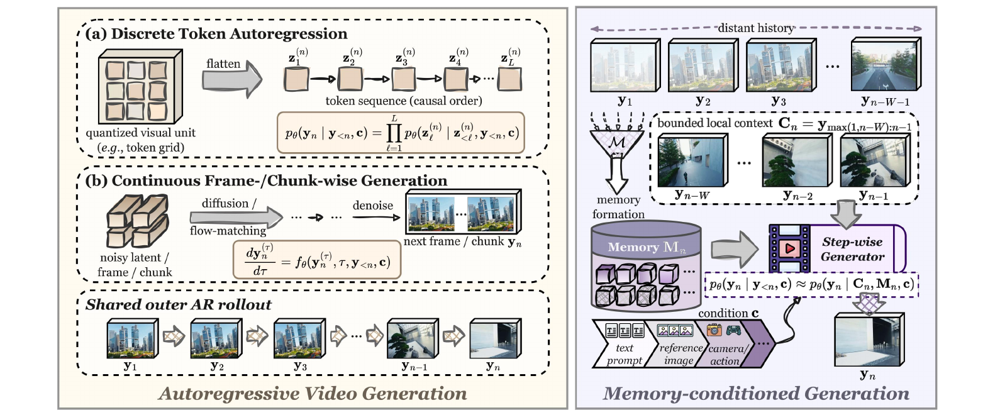
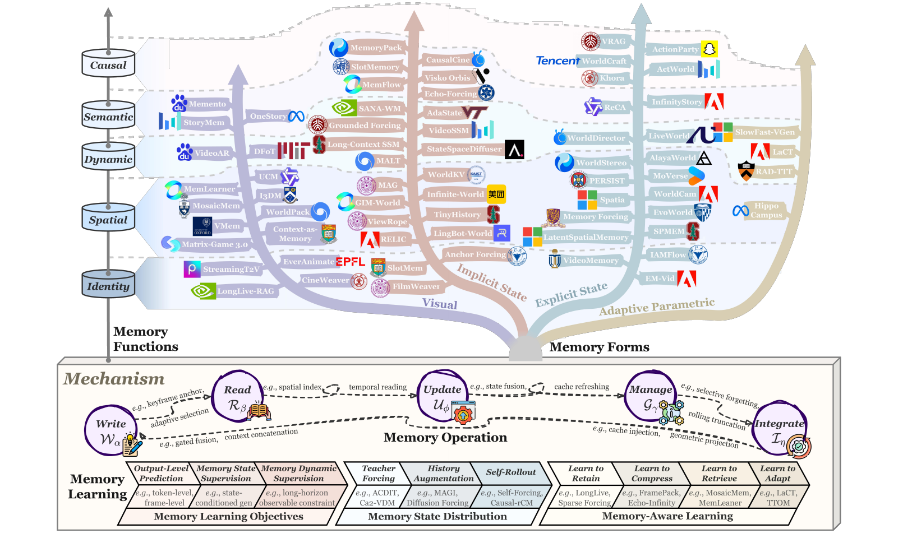
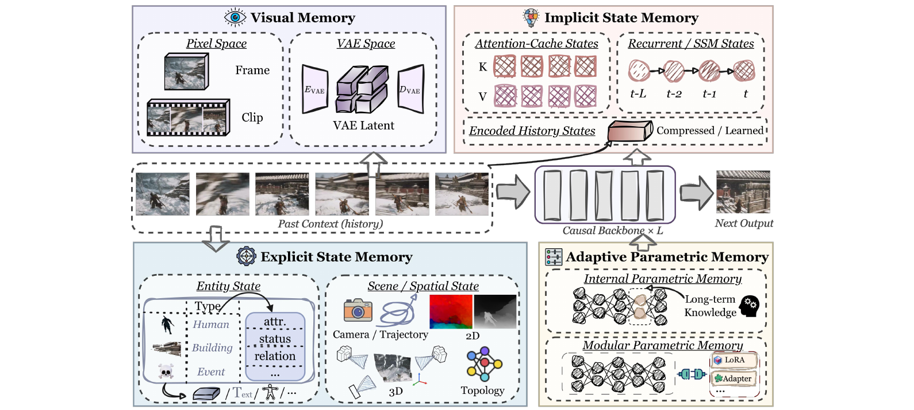
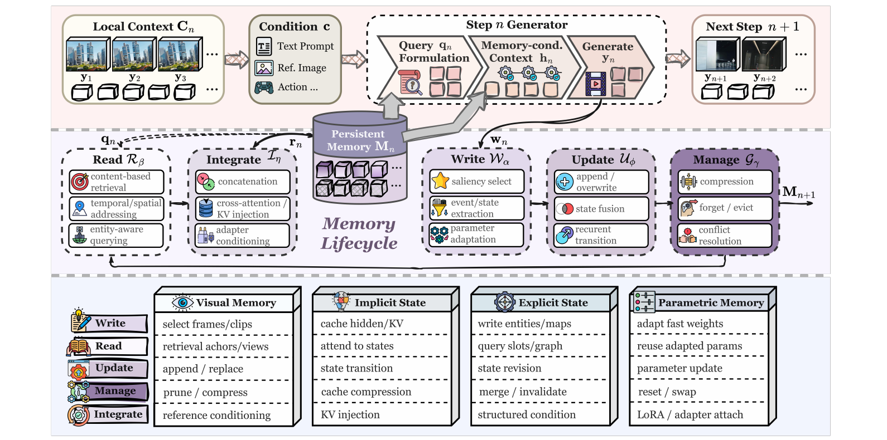
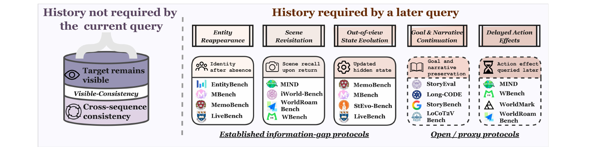
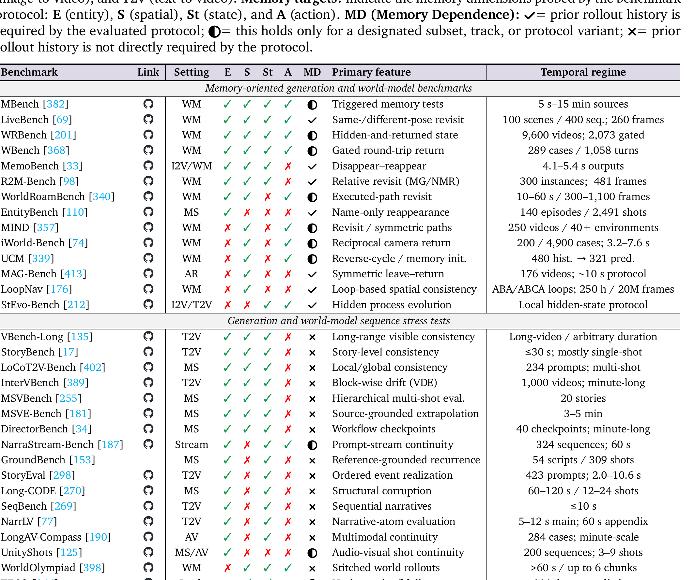
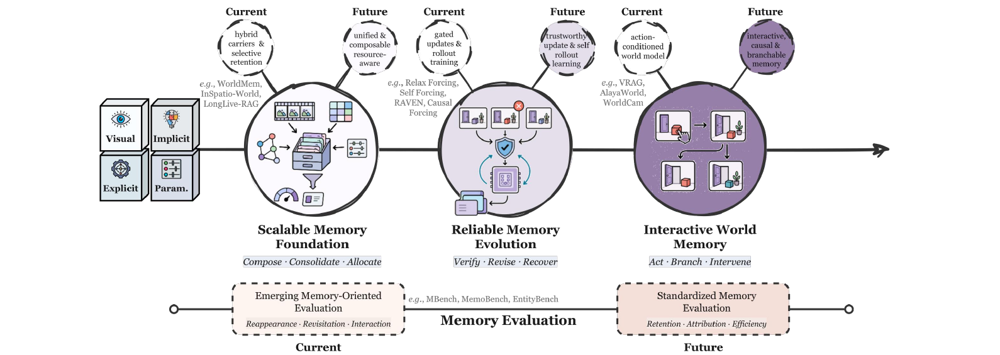

# The Past Frames the Future: Memory for Autoregressive Video Generation — A Survey

**论文**: [arXiv:2609.28466v1](https://arxiv.org/abs/2609.28466) (cs.CV, 2026-09-23)，**110 页**（正文约 78 页 + 417 条参考文献）
**作者**: Harold Haodong Chen, Rongjin Guo, Disen Lan, Wen-Jie Shu, Hongfei Zhang（5 位核心贡献者，按字母序）等共 25 人 —— HKUST、CityUHK、FDU、CMU、NYU、HKUST(GZ)、NUS、Georgia Tech、PKU、MBZUAI、NVIDIA、NTU、UC Merced 等 16 家机构
**配套论文清单**: [github.com/HaroldChen19/Awesome-AR-Video-Memory](https://github.com/HaroldChen19/Awesome-AR-Video-Memory)（只是 paper list，无代码）

---

## 1. 一句话定位

**这是第一篇专门讨论"自回归视频生成里的记忆"的系统综述。** 它先给记忆下了一个**操作性、可检验**的定义，再从五个互补视角整理约四百篇工作：**载体**（记忆存成什么）、**功能**（要守住什么）、**操作**（怎么写、读、更新、管理、融合）、**学习**（在闭环 rollout 下怎么训）、**评测**（怎样的实验才算证明了记忆）。

作者的核心论点是：**有效的记忆不等于容量大** —— 被保留下来的状态必须同时是**准确的、访问得到的、并且真的影响了后续生成的**。

📌 **对本仓库的价值，按分量排序**：
1. **§7 评测一章可以直接当审稿清单用。** 它给出一条硬标准：只有当"正确输出依赖于早先获得、且当前条件里已经拿不到的信息"时，评测才算在测记忆。**按这条标准，VBench / VBench-Long / FVD 都只测可见一致性，不构成记忆证据** —— 而仓库里绝大多数长视频笔记（Recency Forcing、ViRDM、Mask Forcing、RAVEN……）报的正是这些。
2. **它的 `q_TF / q_aug / q_θ` 三分法**（teacher forcing / 历史增强 / self-rollout 各自诱导出的记忆状态分布），把仓库里反复出现的几个问题统一成一件事：OPSD-V 的 teacher 上下文、Avatar-Forever 的 RRT、Recency Forcing 的 KV eviction mismatch，都是"训练时的记忆状态分布不等于部署时的"（见 [§3.4](#34-学习闭环下的记忆状态分布)）。
3. **我借它核出了 AlayaWorld 笔记的两个新问题**：AlayaWorld 唯一的定量依据 iWorld-Bench **每条样本只有 3.2–7.6 秒**；它 Table 3 里六个 baseline 的分数**与 iWorld-Bench 原文逐字相同**，是直接引用而非重跑（见 [§5.2](#52-借它核出的仓库问题alayaworld)）。

⚠️ **作为综述，它的短板也清楚**：没有任何定量汇总或元分析；分类表里"可解释性 / 可编辑性 / 模型耦合"三列是作者的主观三档评级；**覆盖有明显缺口** —— Helios（2026-03）、ABot-World-0（2026-07）、Matrix-Game 2.0、Genie 3 都不在 417 条参考文献里，而 9 月 17 日才挂上 arXiv 的 Recency Forcing 却收了（见 [§5.1](#51-收录与遗漏)）。

---

## 2. 定义与形式化

### 2.1 什么算"记忆"

> ➤ **Memory Definition.** *Memory is a persistent representation of past observations, generated states, or established world states and semantic commitments that is maintained across autoregressive steps and systematically conditions subsequent generation. Operationally, a state functions as memory **when its removal or modification can affect later outputs after the corresponding evidence is no longer directly available in the immediate context**.*

📌 **这个定义的好处是可以被实验检验**：它不按模块名（"memory bank"、"cache"）或窗口大小来划界，而是一个干预式判据 —— 拿掉或改掉这个状态，在原始证据已经离开当前上下文之后，后续输出会不会变。作者也明确说**记忆与长上下文之间没有固定边界**：每一步都被密集使用的近期帧是"活跃上下文"；一旦历史被选择性保留、压缩、检索、合并或修订，它就从上下文走向了"持久记忆"。静态条件（比如开头的文本 prompt）本身不算记忆，除非系统从中派生并在 rollout 中维护了演化的状态。

### 2.2 形式化

> **Fig 2 逐段解读**：
>
> **左 · Autoregressive Video Generation** —— 三个虚线框。**(a) Discrete Token Autoregression**：量化后的视觉单元被 flatten 成 `z_1 … z_L` 的因果 token 序列，公式框是逐 token 的条件分解。**(b) Continuous Frame-/Chunk-wise Generation**：带噪的 latent / 帧 / chunk 经 diffusion 或 flow matching 去噪成下一帧或下一 chunk `y_n`，公式框是内层的 `dy_n^(τ)/dτ = f_θ(y_n^(τ), τ, y_<n, c)`。底部 **Shared outer AR rollout**：`y_1 → y_2 → … → y_n`。**要点是两种范式的"内层"合成方式不同，但共享同一个"外层"因果 rollout** —— 综述里所说的"自回归"始终指外层。
>
> **右 · Memory-conditioned Generation** —— 顶部虚线箭头 *distant history* 横跨 `y_1 … y_{n−W−1}`；中间虚线框是 **bounded local context `C_n = y_{max(1,n−W):n−1}`**（最近 W 个单元）。远端历史经漏斗形的 `𝓜`（*memory formation*）汇入圆柱形的 **Memory `M_n`**，它与局部上下文、以及底部的 **condition c**（text prompt / reference image / camera, action …）一起送进 **Step-wise Generator**。公式 `p_θ(y_n | y_<n, c) ≈ p_θ(y_n | C_n, M_n, c)` 就是全篇的核心近似。

外层 rollout 的分解与有界上下文（论文 Eq. 1、4）：

$$
p_\theta(y_{1:N} \mid c) = \prod_{n=1}^{N} p_\theta(y_n \mid y_{<n}, c),\qquad C_n = y_{\max(1,\,n-W):\,n-1}
$$

加入持久记忆状态 `M_n` 后，用它来逼近全历史条件（Eq. 6、9）：

$$
p_\theta(y_{1:N} \mid c) = \prod_{n=1}^{N} p_\theta(y_n \mid C_n, M_n, c),\qquad p_\theta(y_n \mid y_{<n}, c) \approx p_\theta(y_n \mid C_n, M_n, c)
$$

**记忆的生命周期**被写成六个算子（Eq. 10–15）—— 生成前读取并融合，生成后写入、更新、管理：

$$
q_n = \mathcal{Q}_\theta(C_n, c),\qquad r_n = \mathcal{R}_\beta(q_n, M_n),\qquad h_n = \mathcal{I}_\eta(C_n, r_n, c),\qquad y_n \sim p_\theta(\cdot \mid h_n)
$$

$$
w_n = \mathcal{W}_\alpha(y_n, C_n, c),\qquad \tilde M_{n+1} = \mathcal{U}_\phi(M_n, w_n),\qquad M_{n+1} = \mathcal{G}_\gamma(\tilde M_{n+1};\ B)
$$

依次是：查询构造 `𝒬`、读取 `ℛ`、融合 `ℐ`、写入 `𝒲`、更新 `𝒰`、在预算 `B` 下管理 `𝒢`。这与经典的可微记忆架构（NTM / DNC 一类）同构，作者也引了它们。**这套记号不假设任何具体载体** —— FIFO latent 队列、KV cache 刷新、循环隐状态、检索库、结构化场景状态都能套进来。

### 2.3 六种"无记忆 rollout"的失效模式

| 失效模式 | 典型症状 |
|---|---|
| **实体遗忘** | 离开画面的物体或角色再出现时被省略、重复、换了属性，或被一个外观相似的实例替换 |
| **外观漂移** | 即使一直可见，纹理、颜色、光照、风格也在递归中逐步偏离 |
| **空间不一致** | 回到看过的区域时，布局、背景几何、物体位置对不上 |
| **动态退化** | 单步转移看起来合理，长 rollout 却出现运动冻结、相位错乱、接触违规 |
| **语义漂移** | 已确立的事件、角色关系、未完成目标离开上下文后被重复或违背 |
| **因果 / 状态不一致** | 打开的门又关上、挪开的物体回到原位 |

📌 **作者在这里的克制值得记一笔**：他们明确写道 *"These symptoms are not uniquely caused by missing memory"* —— 这些症状同样可能来自动态建模、控制执行或渲染本身的缺陷，归因问题留到 §7 专门处理。**这正是后面评测一章的出发点。**

---

## 3. 五个视角

> **Fig 1 逐段解读**：
>
> **上半 · 一棵"载体 × 功能"的树** —— 从底部 *Memory Forms* 长出四根主干：**Visual**（淡紫）、**Implicit State**（浅红）、**Explicit State**（浅蓝）、**Adaptive Parametric**（浅棕），分别对应 §3 的四类载体。左侧竖轴 *Memory Functions* 自下而上是 **Identity → Spatial → Dynamic → Semantic → Causal**，对应 §4 的五种功能；每个方法按"用什么载体、主要守什么"挂在对应的高度，旁边是所属机构的 logo（Tencent、NVIDIA、MIT、Stanford、Adobe、美团……）。例如 Matrix-Game 3.0、MosaicMem、VMem 挂在 Visual 主干的 Spatial 层；LongLive-RAG、StreamingT2V 挂在 Identity 层；AlayaWorld、WorldCam、EvoWorld 挂在 Explicit State 主干上。
>
> **下半 · Mechanism 面板** —— **Memory Operation** 一行是 Write → Read → Update → Manage → Integrate 的循环，每条箭头旁标了代表性做法（keyframe anchor、spatial index、state fusion、cache refreshing、selective forgetting、rolling truncation、geometric projection……）；**Memory Learning** 一行把 §6 的三轴并排：*Memory Learning Objectives*（输出级预测 / 记忆状态监督 / 记忆动态监督）、*Memory State Distribution*（Teacher Forcing / History Augmentation / Self-Rollout）、*Memory-Aware Learning*（学会保留 / 压缩 / 检索 / 适应）。
>
> 📌 **这张图最有用的读法**：同一个功能（比如 Spatial）可以由四种载体中的任意一种实现，同一种载体也能服务多个功能 —— 作者一再强调"载体"与"功能"是两个正交的维度，混为一谈正是这个领域术语混乱的来源。

### 3.1 载体（Forms）：记忆存成什么

> **Fig 3 逐段解读**：
>
> **中间一条** —— *Past Context (history)* 的一串游戏截帧 → **Causal Backbone × L** → *Next Output*。四个方向的空心箭头表示历史可以沉淀成四类载体，再回头条件化同一个因果骨干。
>
> **左上 · Visual Memory** —— *Pixel Space*（Frame / Clip）与 *VAE Space*（`E_VAE` → VAE Latent → `D_VAE`）。**特点是能追溯到某个具体的历史观测。**
>
> **右上 · Implicit State Memory** —— *Attention-Cache States*（一排排 K、V 格子）、*Recurrent / SSM States*（`t−L … t−2, t−1, t` 的链式状态）、*Encoded History States*（*Compressed / Learned*）。**特点是没有与观测一一对应的结构，也没有预先设计的语义或几何模式。**
>
> **左下 · Explicit State Memory** —— *Entity State*（一张 Type = Human / Building / Event 对应 attr. / status / relation 的表）与 *Scene / Spatial State*（Camera / Trajectory、2D 的深度与光流图、3D 点云、Topology 图）。**特点是可解释、可直接编辑。**
>
> **右下 · Adaptive Parametric Memory** —— *Internal Parametric Memory*（骨干内的 fast weight，标 *Long-term Knowledge*）与 *Modular Parametric Memory*（挂在外面的 LoRA / Adapter）。

| 载体 | 子类 | 代表方法（综述 Table 2–3） | 存储增长 |
|---|---|---|---|
| **视觉** | 像素空间 / VAE 空间 | FramePack、WorldMem、Context-as-Memory、VMem、MosaicMem、Matrix-Game 3.0、LongLive-RAG | 多为 Bounded 或 **Linear** |
| **隐式状态** | 注意力 KV cache | LongLive、Rolling Forcing（sink + 滚动窗口）；RELIC、Context Forcing（近处高保真、远处压缩）；PackForcing、Anchor Forcing（多层 cache） | 多为 Bounded |
| | 循环 / 状态空间 | VideoSSM、MALT、Hybrid Forcing、StateSpaceDiffuser | **Fixed** |
| | 编码后的历史 | TinyHistory、Infinite-World、GIM-World、WorldCrafter | Fixed 或 Linear |
| **显式状态** | 实体中心 | VideoMemory、ActionParty、ReCA | Linear / Fixed |
| | 空间与几何 | PERSIST、Voyager、Memory Forcing、EvoWorld、WorldStereo、Spatia | **Scene-scaled** |
| **自适应参数** | 内部（fast weight / TTT） | LaCT、RAD-TTT、ISPA | Fixed |
| | 模块化（LoRA 等） | SlowFast-VGen、HippoCampus | Fixed |

📌 **两条值得记的界定**：
- **KV cache 什么时候算记忆**：只用来加速推理的临时 cache 不算；只有当历史状态被**跨步维护和管理**、并在对应证据已不在活跃上下文时仍影响生成，才算（论文 §3.2.1）。
- **参数什么时候算记忆**：*"an adapter, LoRA module, or fast-weight layer is not parametric memory merely by architectural form; it qualifies when its adapted parameter state persists and carries information used by later generation."* 普通预训练或任务级微调得到的参数是"一般模型知识"。**按这条标准，[Avatar-Forever](../avatar_forever/analysis.md) 离线训出来的 RRT LoRA 不是参数记忆**，只是一次任务级微调；真正的参数记忆是 SlowFast-VGen 那种在推理时从 rollout 里在线更新的 LoRA。

### 3.2 功能（Functions）：要守住什么

作者把"记忆功能"定义为*"原始证据已不在有界上下文之后，一个持久状态所承担的具体生成职责"*，并提出一个贯穿全章的要求 —— **selective invariance（选择性不变）**：记忆要守住应当不变的属性，同时放行位姿、光照、运动、关系与世界状态上的合理变化。**"保持"不等于"冻结"。**

| 功能 | 对应的失效模式 | 代表方法（综述 Table 4–5） |
|---|---|---|
| **身份保持** | 实体遗忘、外观漂移 | StreamingT2V、LongLive-RAG、Anchor Forcing、VideoMemory、IAMFlow |
| **空间保持** | 空间不一致 | WorldMem、Context-as-Memory、VMem、MosaicMem、Matrix-Game 3.0、ReWorld、RELIC、**AlayaWorld** |
| **动态保持** | 动态退化 | DFoT、MALT、VideoSSM、SANA-WM、RAD、LiveWorld |
| **语义保持** | 语义漂移 | StoryMem、OneStory、ShotStream、MemoryPack、ReCA |
| **因果保持** | 因果 / 状态不一致 | VRAG、WorldDirector、ActionParty、ActWorld、Khora |
| *跨类别的 rollout 可靠性* | *（不存具体世界事实）* | *Self Forcing、Causal Forcing、Rolling Forcing、LongLive、Infinity-RoPE、CausVid、FramePack、MAGI-1* |

📌 **最后一行的处理是对的**：Self Forcing、Causal Forcing 这一类解决的是"递归生成不崩"，而不是"记住某个具体事实"，所以作者不给它们打任何功能勾。**这正好对应仓库 [五篇横向对照](../dmd_few_step_ar/analysis.md) 里那一整簇 DMD 补丁的定位** —— 它们是 rollout 可靠性工作，不是记忆工作。

⚠️ **归类抽查**：我按 300 DPI 渲染 Table 4 核对了仓库里有笔记的几行。**AlayaWorld** 勾的是空间 + 动态、载体标为显式 + 隐式 + 视觉三类混合 —— 载体判断准确（几何缓存是显式、压缩时序历史是隐式、sink 帧与 warp 图是视觉），但 AlayaWorld 原文把 sink 帧明确定义为 *"a global identity/appearance anchor"*，**没勾身份一列可以商榷**。**ReWorld** 是"位姿索引的 landmark 记忆"、载体隐式，与仓库笔记一致。

### 3.3 操作（Operations）：写、读、更新、管理、融合

> **Fig 6 逐段解读**：
>
> **上层（粉色带）** —— `Local Context C_n`（几帧 + latent 块）→ `Condition c`（Text Prompt / Ref. Image / Action）→ 虚线框 **Step n Generator**，内部三段：*Query `q_n` Formulation* → *Memory-cond. Context `h_n`* → *Generate `y_n`* → `Next Step n+1`。
>
> **中层（紫色带）** —— 中央圆柱 **Persistent Memory `M_n`**（下方大字 *Memory Lifecycle*）。左边两个框在生成**前**：**Read `ℛ_β`**（content-based retrieval / temporal-spatial addressing / entity-aware querying）→ **Integrate `ℐ_η`**（concatenation / cross-attention、KV injection / adapter conditioning），`q_n` 与 `r_n` 两条箭头在圆柱与它们之间往返。右边三个框在生成**后**：**Write `𝒲_α`**（saliency select / event-state extraction / parameter adaptation）→ **Update `𝒰_φ`**（append、overwrite / state fusion / recurrent transition）→ **Manage `𝒢_γ`**（compression / forget、evict / conflict resolution）→ 输出 `M_{n+1}`，底部一条回流线接回 Read。
>
> **下层（表格）** —— 五行操作 × 四列载体，给出每种组合的典型实现：例如 Visual Memory 的 Manage 是 *prune / compress*、Implicit State 的 Integrate 是 *KV injection*、Explicit State 的 Update 是 *state revision*、Parametric Memory 的 Manage 是 *reset / swap*。（图里 *retrieval achors/views* 是 "anchors" 的笔误。）

每个操作下面作者都归纳出了**会反复出现的失败方式**，这是本章最有复用价值的部分：

| 操作 | 机制谱系 | 三类风险 |
|---|---|---|
| **写入** | 全量准入 / 锚点准入 / 按效用选择 / 事件触发写入；外加**结构化绑定**（按实体、坐标、事件寻址） | **遗漏**（将来要用的没存）· **污染**（存进了冗余或不可靠的自生成内容）· **错绑**（证据对了但挂错了地址） |
| **读取** | 时间就近 / 按内容检索 / 语义寻址 / 空间索引 / 按状态检索 / 注意力路由 | 检索错位：取回的是"看起来像"而非"真相关"的历史 |
| **更新** | 只追加 / 循环合并 / cache 刷新与重映射 / 结构化状态更新 / 世界状态转移 / **纠错式修订** | **更新不足**（世界变了，记忆没跟）· **过度更新**（抹掉了应当保留的承诺）· **错误更新**（把噪声或错配证据固化进持久状态） |
| **管理** | 滚动截断 / 锚点与多层保留 / 按效用保留 / 压缩合并 / **按有效性遗忘** | 在覆盖、保真、成本、有效性之间取舍 |
| **融合** | 上下文拼接 / 注意力条件化 / KV 注入 / 自适应调制与门控 / 几何对齐条件化 / 结构化语义条件化 | 取回了但没被用上 |

📌 **"按有效性遗忘"与"纠错式修订"是仓库里还没人做过的方向**：前者删掉被判为不可靠的历史（如 StableWorld 识别几何退化的生成帧并移出历史），后者在发现不一致时改写记忆内容（如 TokenTrim 估计生成 token 的漂移、剔除不稳定位置后重生成）。**仓库里所有长视频笔记的记忆都是"只增或只按时间淘汰"的** —— 没有一篇会主动判断某段历史已经变坏。

⚠️ **一处表格与实情的出入**：Table 7 把 [AlayaWorld](../../world_model/alayaworld/analysis.md) 的管理策略记为"锚点与多层保留 + 滚动截断 + 压缩"。这对它的 **token 上下文**成立（sink + 6 帧压缩历史 + 最近帧）；**但它的空间缓存 `B` 是只增不删的** —— 我在 AlayaWorld 笔记里核过，全文没有任何淘汰策略，检索开销随 rollout 线性增长。**这一点表里看不出来。**

### 3.4 学习：闭环下的记忆状态分布

作者把 exposure bias 从"生成输出"推广到了"持久记忆状态"。在 teacher forcing 与自回归部署下，记忆分别这样演化（Eq. 56）：

$$
M^{\mathrm{TF}}_{n+1} = \mathcal{F}\big(M^{\mathrm{TF}}_n, y_n, a_n\big),\ \ y_n \sim p_{\mathrm{data}};\qquad M^{\mathrm{AR}}_{n+1} = \mathcal{F}\big(M^{\mathrm{AR}}_n, \hat y_n, a_n\big),\ \ \hat y_n \sim p_\theta(\cdot \mid C_n, M^{\mathrm{AR}}_n, a_n, c)
$$

两者诱导出不同的记忆状态分布；历史增强则是用一个变换核去扩展 teacher-forcing 分布（Eq. 57–58）：

$$
q_{\mathrm{TF},n} \neq q_{\theta,n},\qquad q_{\mathrm{aug},n}(M) = \int K_\psi(M \mid M')\, q_{\mathrm{TF},n}(M')\, dM'
$$

| 训练状态从哪来 | 细分 | 代表方法 | 离 `q_θ` 多远 |
|---|---|---|---|
| **Teacher Forcing** | 真值历史 | ACDiT、Ca2-VDM、GPDiT；Causal Forcing 的初始化阶段 | 最远 |
| **历史增强** `q_aug` | 无序扰动 | GameNGen、MAGI、DFoT、Diffusion Forcing | 预设的错误模式 |
| | 时间有序扰动 | Rolling Diffusion、AR-Diffusion、SkyReels-V2、Diagonal Distillation | 预设的恶化曲线 |
| | **模型导出扰动** | Resampling Forcing；**Stable Video Infinity 的 error bank** | 来自模型自己的错，但仍从真值初始化 |
| **Self-Rollout** `q_θ` | rollout 的组织方式 | Self Forcing、RAVEN、Rolling Forcing、BAgger | 最近 |
| | rollout 状态上的监督 | Self Gradient Forcing、Causal-rCM、Self-Forcing++、**OPSD-V**、**Alaya-EVOKE** | 最近 |

作者的判断句写得很准：

> *"If training follows the same generation, memory-update, and memory-access procedures as deployment, the resulting states are samples from the deployment-time distribution `q_θ,n`; truncated rollouts or mismatched procedures instead provide only an approximation."*

📌 **用这套记号能把仓库里几个看似无关的问题统一起来**：
- [Avatar-Forever](../avatar_forever/analysis.md) 的 RRT —— 扰动最早的真值 chunk、再让模型 rollout K 步 —— 落在"模型导出扰动"与"self-rollout"之间；**而且做 rollout 的是 30 步 base，不是部署的 4 步学生**，用这里的记号说，它逼近的是 base 的 `q_θ`，不是学生的。
- [AlayaWorld](../../world_model/alayaworld/analysis.md) 的抗漂移 = Helios 式预设退化 + error bank，正好是这张表里"时间无序扰动 + 模型导出扰动"两格的组合。
- [OPSD-V](../opsd_v/analysis.md) 与 Matrix-Game 3.5、AlayaWorld 争的"DMD 时 teacher 看到什么上下文"，本质是：**学生状态取自 `q_θ`，打分时的条件却可能换成了 `q_TF`**。

**§6.3 "记忆感知学习"又单列了第二种失配**：即使训练历史的来源对了，**训练时看到的是完整历史，部署时却受容量、压缩与访问规则约束**。作者用一个带预算 `B = (B_act, B_cmp, B_ret)` 的接口来形式化它（Eq. 59–60）。📌 **这正是 [Recency Forcing](../recency_forcing/analysis.md) 命名的 *KV eviction mismatch*** —— 但综述只在 §5.5 讲"调制式融合"时把它放进了一个括号，没有在这一节提它。

⚠️ **一处归类不完整**：Fig 7 把 **Causal Forcing** 只放在 "Teacher Forcing" 一格，§6.2.1 也只描述了它的初始化。而 Causal Forcing 原文附录写明，它的最后一阶段是 *"the standard asymmetric DMD … strictly following the setting of Self Forcing"* —— 即 self-rollout。只看到了它的前半程。

---

## 4. 评测：怎样的实验才算证明了记忆

这一章是全篇最有用的部分。作者先立一条原则：

> *"**A memory-revealing evaluation must make prior history necessary, verify the queried behavior, and rule out non-memory explanations.**"*

展开是三层意思：
1. **必须制造信息缺口** —— 通过消失、回访、隐藏演化、延迟交互，或受控地改变早先的历史。**光是时长长不算**：只要当前条件仍然暴露了答案，再长的 rollout 也不在测记忆。
2. **"保留了状态"与"成功表达出来"要分开**：模型可能记住了却没能执行动作、没把相机转回目标视角；反过来，输出对了也可能只是因为答案就写在 prompt 里，或者被先验猜中了。
3. 所以必须**双向控制**：执行对照（确认被查询的行为本身做得出来）+ 成对历史（确认输出真的依赖那段历史）。

> **Fig 9 逐段解读**：
>
> **左 · History not required by the current query** —— 一个圆柱分两层：*Target remains visible*（**Visible-Consistency**）与 *Cross-sequence consistency*。**目标一直可见，所以这只是基线**：能暴露误差累积，但不证明记忆。
>
> **右 · History required by a later query** —— 五列协议，每列下面是代表性基准。左三列标 *Established information-gap protocols*：**Entity Reappearance**（*Identity after absence*：EntityBench、MBench、MemoBench、LiveBench）、**Scene Revisitation**（*Scene recall upon return*：MIND、**iWorld-Bench**、**WorldRoamBench**、WBench）、**Out-of-view State Evolution**（*Updated hidden state*：MemoBench、MBench、StEvo-Bench、LiveBench）。右两列是**虚线框**、标 *Open / proxy protocols*：**Goal & Narrative Continuation**（StoryEval、Long-CODE、StoryBench、LoCoT2V-Bench）与 **Delayed Action Effects**（MIND、WBench、**WorldMark**、WorldRoamBench）。
>
> 📌 **虚线框是作者在承认**：目标与叙事延续、动作的延迟后果这两类，**现有基准只能提供代理指标或协议组件，还没有真正标准化的"制造信息缺口"的测法**。

**Table 8 · 基准按"记忆依赖（MD）"分级**（节选；按 300 DPI 渲染原表读图标，✓ = 协议本身要求先前历史，◐ = 仅指定子集或变体要求，✗ = 不要求）：

| 基准 | 目标（E 实体 / S 空间 / St 状态 / A 动作） | MD | 协议 | 时间尺度 | 与仓库的关系 |
|---|---|---|---|---|---|
| LiveBench | E S St A | ✓ | 同 / 异位姿回访 | 100 场景、400 序列、260 帧 | —— |
| MemoBench | E S St | ✓ | 消失再出现 | 4.1–5.4 s | —— |
| **iWorld-Bench** | S A | **◐** | 相机往返 | **200 / 4,900 个样例；3.2–7.6 s** | [AlayaWorld](../../world_model/alayaworld/analysis.md) 唯一的定量依据 |
| **WorldRoamBench** | E S A | **◐** | 按执行路径回访 | 10–60 s / 300–1,100 帧 | [ABot-World-0](../../world_model/abot_world_0/analysis.md) 作者自建且未披露 |
| **WorldMark** | S A | **◐** | 动作与回访测试 | 500 个样例；20 / 40 / 60 s | AlayaWorld 承诺了却没报结果；作者与 AlayaWorld 有 6 人重合 |
| **VBench-Long** | E S St | **✗** | 长程**可见**一致性 | 任意时长 | 仓库里多数长视频笔记的主表 |

⚠️ **分组与 MD 列不完全一致**：iWorld-Bench 与 WorldMark 的目标（S + A）和 MD（◐）完全相同，前者却被归入"记忆导向基准"，后者被归入"序列压力测试"。正文对 WorldMark 的理由是 *"without isolating memory under their default protocols"* —— 这条理由对 iWorld-Bench 同样成立（它也只有记忆子集才依赖历史）。

**§7.3 · 没有哪个分数本身是"记忆专属"的**。作者的例子很清楚：相邻帧之间的 DINO 相似度量的是可见一致性，**同一个分数放在"消失再出现"之后**才量的是延迟的身份保持。**协议决定一个分数为什么与记忆相关，被查询的状态决定该量什么。** 由此给出了一套分目标的建议（Table 9）：实体先验证"确实再出现了"再比身份；回访要同时量外观（PSNR / SSIM / LPIPS）与几何（位姿闭合、重投影误差、Chamfer 距离）；隐藏状态演化要先证明模型在可见时能生成这个转移；以及**所有分数都应画成"历史与查询之间的间隔"的函数曲线**，而不是只报一个端点值。

**§7.4 · 四类归因控制**：

| 控制 | 回答的问题 | 做法 |
|---|---|---|
| **成对历史** | 输出真的依赖先前历史吗？ | 当前观测与查询固定，**只改早先的相关历史**；输出应随相关历史变、对无关变化保持稳定。作者指出*"few generation benchmarks currently implement the strict paired-history intervention"* |
| **前置条件检查** | 被查询的行为做得出来吗？ | 回访要先确认相机真的离开、又回到可比位姿；动作延迟效果要先确认动作本身执行成功 |
| **组件级干预** | 是哪个机制在承载记忆？ | 禁用、删除、替换或破坏某块记忆，**在容量与计算匹配的条件下**看是否选择性掉点 |
| **评测器可靠性** | 失败被可靠地量到了吗？ | 报告时间采样与失败覆盖率，用人评或受控损坏去校准自动评分 |

> *"No single control is sufficient on its own; credible memory evaluation requires these sources of evidence to agree."*

---

## 5. 核查

### 5.1 收录与遗漏

我把仓库里与自回归视频记忆相关的笔记逐一在综述里查了一遍（名称 + arXiv 号双重检索）：

| 状态 | 仓库笔记 |
|---|---|
| **进了分类表** | [AlayaWorld](../../world_model/alayaworld/analysis.md)（Table 4、7）、[ReWorld](../reworld/analysis.md)（Table 4）、Matrix-Game 3.0（Table 2、4） |
| **只在正文中出现** | [RAVEN](../raven/analysis.md)、[OPSD-V](../opsd_v/analysis.md)、[Alaya-EVOKE](../../world_model/evoke/analysis.md)（均在 §6.2.3 self-rollout）；[WorldCrafter](../../world_model/worldcrafter/analysis.md)（§3.2 编码后的历史）；[PWM](../../world_model/pwm/analysis.md)（§5.3 世界状态转移）；[LongLive 2.0](../longlive2/analysis.md)（§6.3 压缩） |
| **只作旁证引用** | [Matrix-Game 3.5](../../world_model/matrix_game_35/analysis.md)（一句"patch 式设计按目标视角选局部几何单元"后面的引用，未进任何表）；[Recency Forcing](../recency_forcing/analysis.md)（§5.5 一个括号） |
| **未收录** | **[Helios](../helios/analysis.md)**（arXiv:2603.04379，2026-03）、**[ABot-World-0](../../world_model/abot_world_0/analysis.md)**（2607.19191，2026-07）、[ForgeWM](../forgewm/analysis.md)、[Avatar-Forever](../avatar_forever/analysis.md)、[Mask Forcing](../mask_forcing/analysis.md)、[SolarWM](../../world_model/solarwm/analysis.md)、[minWM](../minwm/analysis.md)；另外 **Matrix-Game 2.0 与 Genie 3** 都不在参考文献里（Genie 只引了初代） |

⚠️ **"太新"解释不了这些缺口**：综述 9 月 23 日提交，却收了 9 月 17 日才挂上 arXiv 的 Recency Forcing；而 Helios 早了半年、ABot-World-0 早了两个月。**Helios 尤其不该缺** —— 它的 Frame-Aware Corrupt 正是 §6.2.2"历史增强"的典型，它的多级记忆 patch 化压缩也正是 §3.2 "编码后的历史"。

⚠️ **EVOKE 的归类不完整**：它的 World State Bank 是一个典型的**显式点云状态记忆**（有 Read / Write 接口、跨 chunk 维持几何），但综述只在学习一章提到它的 Self-Forced DMD，**没放进载体与功能两张表**。

📌 **综述对已收录工作的描述，我抽查的几条都准确**：OPSD-V 是*"保留学生部署时的采样器与 KV cache 更新，从一个更干净、自回归一致的 teacher cache 导出稠密速度目标"*；RAVEN 是*"把每条 self-rollout 重排成完全去噪的历史终点与带噪中间态的交错序列"*；EVOKE 是*"用重新设计的 teacher 在延长的 rollout 上做长程分布匹配"*；PWM 是*"在持久全局状态上执行显式转移规则，包括画面外"* —— 都与仓库笔记一致。

📌 背景信息：LongLive、LongLive-RAG、LongLive-2.0 三篇都有综述的共同作者署名（Shuai Yang、Yukang Chen、Ying-Cong Chen）。这在综述里很常见，我没有发现明显的偏向，只作说明。

### 5.2 借它核出的仓库问题：AlayaWorld

综述 Table 8 给出的 iWorld-Bench 时长（3.2–7.6 s）是二手信息，我回到 [iWorld-Bench 原文（arXiv:2605.03941）](https://arxiv.org/abs/2605.03941) 核对，结果牵出两件 AlayaWorld 笔记里没写到的事：

1. **iWorld-Bench 的样本是几秒钟的短片段。** 原文写明轨迹被 *"partitioned into standardized 81-frame clips"*，记忆类任务是*"constructing cyclic paths, requiring the model to visit the same location during a **single inference**"*，共 200 个；它自己的 Table 14 列出被测模型的生成时长，从 **3.2 s（HY-World 1.5）到 7.6 s（CameraCtrl 等）**。而 AlayaWorld 摘要写的是 *"On iWorld-Bench, AlayaWorld achieves the **best performance over long-horizon generation**"* —— **在一个每条只有 3–8 秒的基准上，这句话不成立。**
2. **AlayaWorld Table 3 里的 baseline 分数是从 iWorld-Bench 论文直接抄来的，不是重跑的。** 我把 AlayaWorld 表里 HY-World 1.5 的 8 个分数（0.6675 / 0.8051 / 0.7819 / 0.6634 / 0.9921 / 0.7472 / 0.8481 / 0.6776）与 Matrix-Game 2.0 的 8 个分数，在 iWorld-Bench 原文里逐一检索，**全部逐字出现在它的结果表中**；两篇的六个 baseline 也完全相同（Cosmos、HunyuanVideo-1.5、WAN 2.2、YUME 1.5、Matrix-Game 2.0、HY-World 1.5）。**这也顺带解释了 AlayaWorld 笔记里记下的两个疑点**：为什么 WAN 2.2 是表里一整列、却不在 AlayaWorld 自己的对比模型清单里；为什么 Matrix-Game 2.0 的分数低得不合常理（它在 iWorld-Bench 里就是以 640×352、3.4 秒的配置被测的）。而 AlayaWorld 自己用了"自动的、保语义的 prompt 改写"，**这些抄来的 baseline 必然没有享受同样的待遇**。

---

## 6. 用 §7 的标准审仓库里的世界模型笔记

下面只用各篇笔记里已经核实过的事实，不补任何笔记没有的信息：

| 笔记 | 信息缺口协议 | 成对历史 | 组件级干预（针对记忆组件） |
|---|---|---|---|
| [AlayaWorld](../../world_model/alayaworld/analysis.md) | iWorld-Bench 记忆子集（◐，单次推理 3–8 s） | ✗ | ✗（"ablat" 全文 0 次） |
| [Matrix-Game 3.5](../../world_model/matrix_game_35/analysis.md) | revisit SSIM（SANA-WM 一分钟基准，比较近乎同一相机位姿） | ✗ | ✗（"ablat" 全文 0 次，Patch Memory 未被单独验证） |
| [WorldCrafter](../../world_model/worldcrafter/analysis.md) | 745 段含闭环重访的视频（MEt3R / LPIPS / PSNR / SSIM）；📌 **还画了重访 LPIPS 随重访间隔（到 1360 帧）变化的曲线** —— 正是 §7.3 推荐的间隔曲线 | ✗ | ✓（去掉 memory encoder、冻结 encoder、去掉位姿读出三组消融） |
| [ReWorld](../reworld/analysis.md) | revisit SSIM | ✗ | ✓（Table 7：MRoPE 与动作注入的取舍，revisit SSIM 0.3898 → 0.3376） |
| [ABot-World-0](../../world_model/abot_world_0/analysis.md) | WorldRoamBench（◐，作者自建且未披露） | ✗ | 仅 LongForcing（不是记忆组件） |
| [SolarWM](../../world_model/solarwm/analysis.md) | 全文零量化结果 | ✗ | ✗ |
| [Recency Forcing](../recency_forcing/analysis.md) | VBench-Long（✗，只测可见一致性）+ 5 分钟定性失败案例 | ✗ | ✓（截断 vs 衰减、`L_recent` 等），但量的仍是 VBench-Long |

📌 **结论很直白：仓库里没有一篇做过成对历史控制**，能拿出"信息缺口协议 + 记忆组件消融"两样的只有 WorldCrafter 与 ReWorld，**其中只有 WorldCrafter 报了间隔曲线**。**按这篇综述的标准，这一簇工作里"记忆有效"的证据普遍偏弱** —— 多数只能说明"长时间生成不崩"，不能说明"记住了"。

---

## 7. 开放问题（论文 §8）

> **Fig 10 逐段解读**：
>
> **上方主线** —— 左端四个方块（Visual / Implicit / Explicit / Param.）→ 三个大圆，每个圆上方一对 *Current* / *Future* 气泡。**Scalable Memory Foundation**（Compose · Consolidate · Allocate）：从"混合载体 + 选择性保留"（e.g. WorldMem、InSpatio-World、LongLive-RAG）走向"统一、可组合、资源感知"。**Reliable Memory Evolution**（Verify · Revise · Recover）：从"门控更新 + self-rollout 训练"（e.g. Relax Forcing、Self Forcing、RAVEN、Causal Forcing）走向"可信更新 + 自 rollout 学习"。**Interactive World Memory**（Act · Branch · Intervene）：从"动作条件的世界模型"（e.g. VRAG、**AlayaWorld**、WorldCam）走向"交互、因果、可分支的记忆"。
>
> **下方评测线** —— *Current*：Emerging Memory-Oriented Evaluation（Reappearance · Revisitation · Interaction，e.g. MBench、MemoBench、EntityBench）→ *Future*：Standardized Memory Evaluation（**Retention · Attribution · Efficiency**）。

| 方向 | 现状的核心局限 | 作者建议 |
|---|---|---|
| **统一、可组合的记忆** | 多种载体只是松散拼接：实体 ID、时间参照、坐标系、访问与更新规则互不兼容 | 不追求单一表示，而是**共享接口**：统一的实体 ID、时间戳、坐标系、来源、置信度与有效期 |
| **资源感知的记忆** | 写入时无法预知未来效用；按当下显著性做的决策会丢掉稀有但关键的事件 | 把分配当成**前瞻的效用问题**；存储、访问、检索延迟与计算要和记忆性能**一起报告** |
| **可信的记忆更新** | 自生成的新证据未必可信，局部伪影会被固化；锚点太"硬"又会压制合理变化 | **区分"存下的证据"与"当前认定有效的状态"**；局部、可回滚的修订 |
| **Self-rollout 学习** | 训练与部署的记忆状态分布仍有差距；远期失败难以归因到具体的写 / 压缩 / 更新 / 检索决策 | 覆盖"既可能出现又影响大"的状态；干预记忆条目来定位失败 |
| **交互与因果记忆** | 能执行动作 ≠ 能记住动作的后果（门又关上、物体回到原位） | 把"由干预引起的状态转移"当成一等公民记忆；支持回滚与分支 |
| **可比的评测协议** | 覆盖集中在身份再现与空间回访；纠错、矛盾消解、过期状态失效、回滚几乎没人测 | 从端点分数走向**分阶段的能力画像**：信息是否被保留、状态是否正确、是否访问得到、访问后是否真的影响了生成 |

---

## 8. 争议与局限

**站得住的**：
- 📌 **操作性的记忆定义与 §7 的评测原则，是这篇综述对领域最实在的贡献。** 它把"长视频不崩"和"记住了"这两件常被混为一谈的事拆开了，而且给出了可执行的判据。
- 📌 **`q_TF / q_aug / q_θ` 的记号**把 exposure bias 推广到了记忆状态，又把"部署时的访问规则失配"单列出来，概念上干净。
- 📌 **失败方式的归纳**（写入的遗漏 / 污染 / 错绑，更新的不足 / 过度 / 错误）可以直接当设计检查清单用。
- 📌 **对已收录工作的描述，我抽查的都准确**；Table 8 给出的 iWorld-Bench 时长也经原文核实无误。

**需要打折的**：
- ⚠️ **没有任何定量汇总。** 四百篇工作里没有一张跨方法的数字对比、没有元分析；作者自己也承认"不同系统难以比较"，但这意味着读者拿不到"哪类载体在哪类任务上更好"的结论。
- ⚠️ **覆盖缺口明显**（§5.1）：Helios、ABot-World-0、Matrix-Game 2.0、Genie 3 不在参考文献里；EVOKE 的显式状态记忆没进载体表。
- ⚠️ **分类表的三档评级是主观的**：Table 2–3 的"可解释性 / 可编辑性 / 模型耦合"用低 / 中 / 高图标表示，**没有给出评级依据**。
- ⚠️ **个别归类可商榷**：AlayaWorld 没勾身份保持；Causal Forcing 只被放在 Teacher Forcing；AlayaWorld 的管理策略没反映出空间缓存只增不删（§3.2–3.4）。
- ⚠️ **Table 8 的分组与自己的 MD 列不一致**：iWorld-Bench 与 WorldMark 目标、MD 完全相同，却分在两组（§4）。
- ⚠️ **它把"信息缺口"定义为评测的必要条件，却没有追问被列入"记忆导向"组的基准在时长上是否够长** —— iWorld-Bench 的记忆任务每条只有 3–8 秒，本身就很难构成真正的"证据离开上下文"。
- 排版小瑕疵：Fig 6 的 "retrieval achors/views"（应为 anchors）；配套仓库的描述标题（*"Memory Mechanisms for Autoregressive Video Generation"*）与论文标题不完全一致。

---

## 9. 一句话总结

**这篇 110 页、417 条参考文献的综述，第一次把"自回归视频生成里的记忆"当成一个独立的设计问题来整理**：它用一个干预式定义界定记忆（"在对应证据离开当前上下文之后，拿掉或改掉这个状态仍会改变后续输出"），用有界上下文 `C_n` 加持久状态 `M_n` 的形式化和"查询—读取—融合—写入—更新—管理"六算子生命周期统一了各种机制，再从载体（视觉 / 隐式 / 显式 / 参数）、功能（身份 / 空间 / 动态 / 语义 / 因果）、操作、学习（`q_TF / q_aug / q_θ` 三种记忆状态分布）、评测五个视角归类。**最有价值的是评测一章**：只有制造了信息缺口、验证了被查询的行为、并排除了非记忆解释的实验才算证明了记忆 —— **按这条标准，VBench / VBench-Long 只测可见一致性，仓库里没有一篇做过成对历史控制，能同时拿出信息缺口协议与记忆组件消融的只有 WorldCrafter 与 ReWorld**。⚠️ 作为综述它没有任何定量汇总，覆盖也有明显缺口（Helios、ABot-World-0、Matrix-Game 2.0、Genie 3 都没收）。📌 借它的 Table 8 回查 iWorld-Bench 原文，我还核出 AlayaWorld 的"长时最佳"建立在每条只有 3–8 秒的基准上，且它 Table 3 的六个 baseline 分数是逐字从 iWorld-Bench 论文抄来的。

---

## 10. 在仓库图谱里的位置

| | 关系 |
|---|---|
| **[五篇横向对照](../dmd_few_step_ar/analysis.md)** | 那五篇 DMD 补丁在本综述里属于"跨类别的 rollout 可靠性"或"self-rollout 学习"，**不是记忆工作** —— 它们解决的是递归生成不崩，而不是记住某个具体事实 |
| **[AlayaWorld](../../world_model/alayaworld/analysis.md)** | 被收进 Table 4 / 7（空间 + 动态；显式 + 隐式 + 视觉）。本笔记借综述回查出它的两个新问题（§5.2） |
| **[Matrix-Game 3.5](../../world_model/matrix_game_35/analysis.md)** / [WorldCrafter](../../world_model/worldcrafter/analysis.md) / [ReWorld](../reworld/analysis.md) / [EVOKE](../../world_model/evoke/analysis.md) | 分别对应综述里的 patch 式视觉记忆、编码后的历史、位姿索引的隐式记忆、显式点云状态 —— **仓库里的长时记忆路线正好覆盖了它的四类载体中的三类**（参数记忆一篇都没有） |
| **[Recency Forcing](../recency_forcing/analysis.md)** | 它命名的 *KV eviction mismatch* 正是综述 §6.3 "记忆感知学习"单列的第二种失配 |
| **[Avatar-Forever](../avatar_forever/analysis.md)** | 按 §3.4 的界定，它的 RRT LoRA 不是参数记忆；RRT 本身落在"模型导出扰动"与"self-rollout"之间，且逼近的是 base 而非学生的 `q_θ` |
| **[OPSD-V](../opsd_v/analysis.md)** / [RAVEN](../raven/analysis.md) | 综述 §6.2.3 self-rollout 的两个代表，描述与仓库笔记一致。RAVEN 弃用 VBench Dynamic Degree 的做法，也正合 §7"没有哪个分数本身是记忆专属的"的立场 |
| [AI for Games 综述](../../world_model/ai_for_games/analysis.md) | 仓库里另一篇综述；两者互补：那篇讲游戏场景的整体版图，这篇只讲自回归视频里的记忆 |

⚠️ **仓库缺口**：综述里被反复当作样板的几条线，仓库都还没有笔记 —— 视觉记忆的 **WorldMem、Context-as-Memory、VMem、FramePack**；显式状态的 **Voyager、Memory Forcing**；参数记忆的 **LaCT、SlowFast-VGen**；以及它推荐的记忆导向基准 **MemoBench、LiveBench、WBench**。

---

## Q&A

*(后续对话中产生的问答追加于此)*
