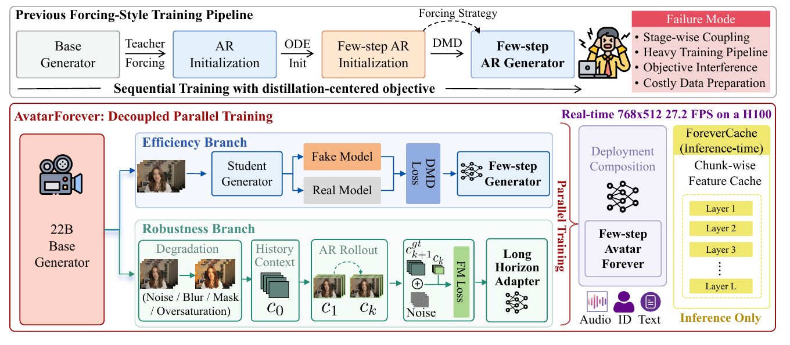
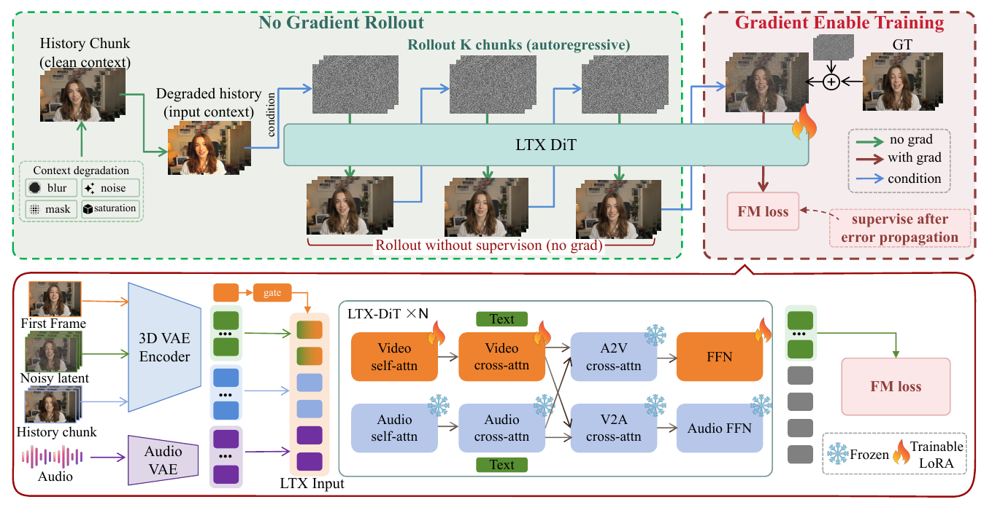
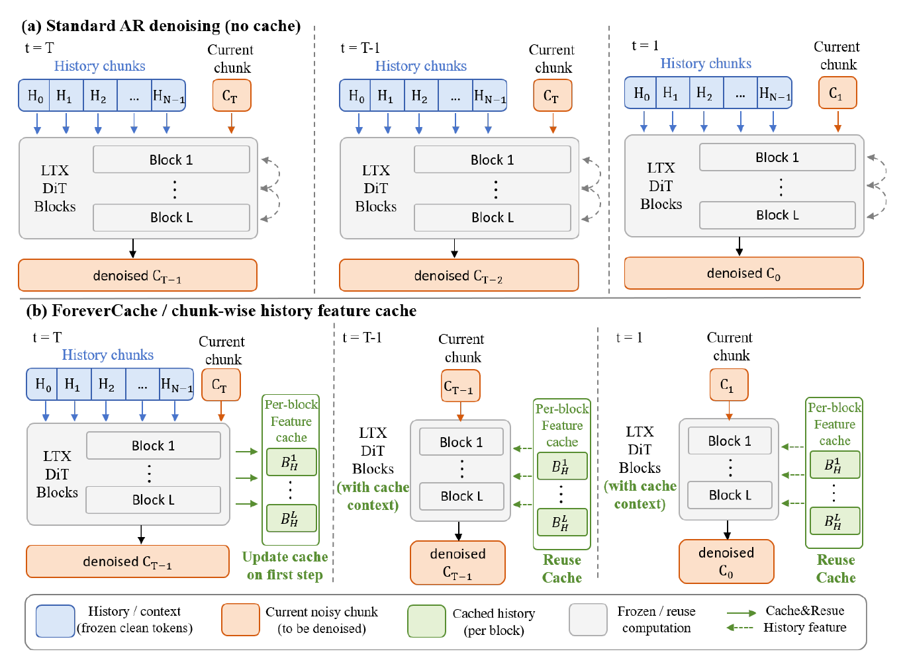
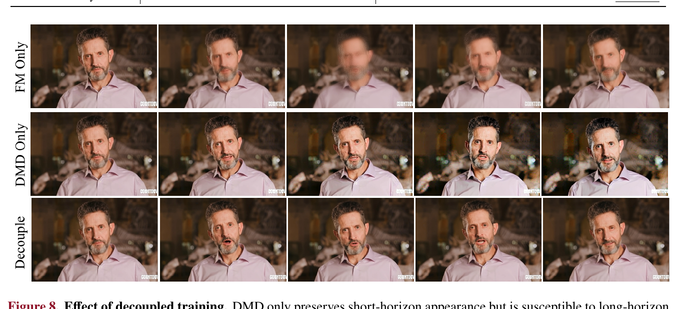
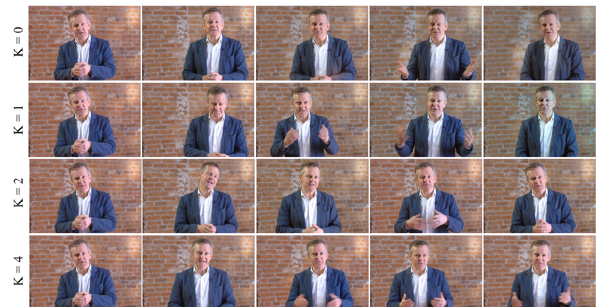
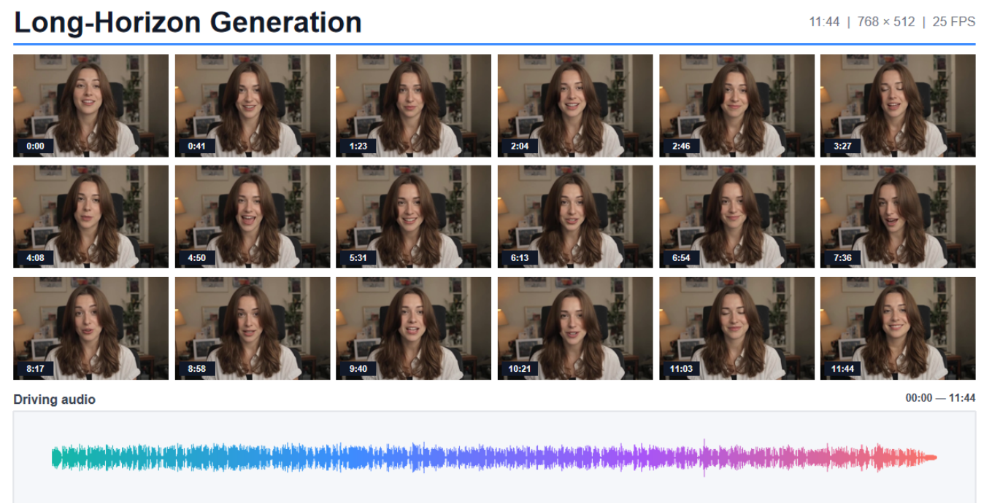

# Avatar-Forever: Decoupled Parallel Training for High-Quality Real-Time Infinite Avatars

**论文**: [arXiv:2608.12107v1](https://arxiv.org/abs/2608.12107) (cs.CV, 2026-08-12, PolyU VCLab Preprint, 24 页含附录)
**作者**: Ruibin Li★, Tao Yang, Zhiyuan Ma, Fangzhou Ai, Shilei Wen, Lei Zhang† — **香港理工大学 + ByteDance + AMD**（★ 字节实习期间完成，† 通讯作者）
**底座**: **LTX-2.3 22B**（联合音视频基础模型，**保留音频分支**）；文本编码器 Gemma-3-12B
**项目页**: [leeruibin.github.io/avatarforever-project-page](https://leeruibin.github.io/avatarforever-project-page/)
**代码**: [github.com/leeruibin/avatarforever](https://github.com/leeruibin/avatarforever)（本笔记引用 commit [`4dfc42b`](https://github.com/leeruibin/avatarforever/tree/4dfc42b0e2dbbded4d148387d186219bd7601279)）—— **只有推理代码 + 合并后的 22B 权重，训练代码与训练数据均未发布**

---

## 1. 一句话定位

**音频驱动的实时无限时长数字人。核心主张是：少步生成的效率和长时 rollout 的鲁棒性是两种不同的能力，不该塞进同一条串行蒸馏流水线里，而应该从同一个 base 出发分两路并行训练，部署时把权重直接相加。**

| 分支 | 训什么 | 怎么训 | 产物 |
|---|---|---|---|
| **效率分支** | 少步生成 | **全参 DMD**，30 步 → 4 步；**完全不碰 AR、不碰历史上下文** | `Δθ_DMD`（稠密） |
| **鲁棒分支** | 从累积误差里恢复 | **RRT**：扰动最早的历史 chunk → 让模型自回归 rollout K 个 chunk（无梯度）→ 只在第 K+1 个 chunk 上算标准 flow matching | `Δθ_RRT`（**视频侧 LoRA，rank=alpha=128**） |
| **部署** | —— | `θ★ = θ0 + Δθ_DMD + Δθ_RRT` | 4 步 AR 生成器 |
| **推理加速** | —— | **ForeverCache**：每个 chunk 只在第一个去噪步算一次历史特征，后三步复用 | 30 秒视频 38.85 s → 26.71 s |

头条数字：**768×512、单卡 H100、端到端（含 VAE 解码）27.2 FPS**。

🔴 **但读完全文 + 核对开源代码后，我认为这篇真正被实验支持的结论比标题窄得多**：
- **"并行优于串行"从没被测过。** Table 3 只有 `DMD only` / `FM only` / `DMD + RRT` 三行，**没有任何串行或联合训练的对照**。
- **它实际证明的是一件更窄、也更耐人寻味的事**：**在 30 步 base 模型 rollout 上训出来的长时 LoRA，直接加到 4 步 DMD 学生身上也管用**（FID 39.5 → 35.0、FVD 1080 → 902）。而 RRT 训练时从没见过学生自己的误差分布 —— **这件事为什么成立，论文给的理由（"在模型自己的 rollout 上学恢复"）恰恰解释不了**（见 [§8](#8-争议与权衡)）。
- **"分两路训、部署时组合"这个结构也不是首创**：[LongLive 2.0](../longlive2/analysis.md) 早三个月就把少步能力做成了与主训练分离的 DMD-LoRA 旁路（分工与本篇互换）。本篇引了它，但只当作"误差累积"的例子（见 [§10](#10-在仓库图谱里的位置)）。
- **"实时"必须开 ForeverCache，而 ForeverCache 是近似** —— 论文正文一次都没说，**开源代码的 docstring 自己承认了**（见 [§3.4](#34-forevercache代码自承是近似论文没说)）。按论文自己的 25 fps 输出，不开缓存的 `Ours` 生成 30 秒只有 **19.3 FPS**，达不到实时。

---

## 2. 要解决的问题：串行蒸馏流水线

> **Fig 1 逐段解读**：
>
> **上半 · Previous Forcing-Style Training Pipeline** —— 从左到右：`Base Generator` →（Teacher Forcing）→ `AR Initialization` →（ODE Init）→ `Few-step AR Initialization` →（DMD，上方虚线箭头标 *Forcing Strategy*）→ `Few-step AR Generator`。**这正是仓库 [五篇横向对照](../dmd_few_step_ar/analysis.md) 里那条"① 因果化 → ② 少步初始化 → ③ on-policy DMD"流水线。** 最右的红框 *Failure Mode* 列了四条指控：*Stage-wise Coupling*、*Heavy Training Pipeline*、*Objective Interference*、*Costly Data Preparation*。⚠️ **这四条在全文都是断言，没有任何一条被实验量过。**
>
> **下半左 · Efficiency Branch（蓝）** —— 一段视频 → `Student Generator` → 分别送进 `Fake Model`（橙）和 `Real Model`（灰）→ `DMD Loss` → `Few-step Generator`。**注意输入只是普通视频片段，没有任何历史 chunk** —— 这一路是纯粹的 T2V/I2V 少步蒸馏。
>
> **下半左 · Robustness Branch（绿）** —— `Degradation`（Noise / Blur / Mask / Oversaturation）→ `History Context c₀` → `AR Rollout c₁ … c_k`（虚线回环表示自回归）→ 把真值 `c_{k+1}^{gt}` 加噪后与 `c_k` 一起进 `FM Loss` → `Long Horizon Adapter`。两路都从左侧同一个 `22B Base Generator` 分出来，中间竖排大字 *Parallel Training*。
>
> **下半右** —— `Deployment Composition` 把两路合成 `Few-step Avatar Forever`，输入 Audio / ID / Text；最右黄框 `ForeverCache (Inference-time)`，逐层（Layer 1 … Layer L）缓存特征，标 *Inference Only*。顶部紫字 *Real-time 768x512 27.2 FPS on a H100*。
>
> 📌 **这张图最值得注意的是鲁棒分支的 rollout 由谁来做**：图里它从 `22B Base Generator` 出发，而正文 §5.1 写明 *"Rollout uses the default **30-step** denoising schedule **without CFG**"* —— **做 rollout 的是 30 步的 base 模型，不是最终部署的 4 步学生。** 这是后面所有问题的根。

**论文对串行范式的指控**（§1 原文）：*"distribution shifts introduced at earlier stages affect later optimization, making it hard to diagnose and obscuring the contribution of each stage"*，以及 Remarks 框里的 *"Few-step efficiency and long-horizon stability operate on different temporal scales. Coupling them as one distillation objective entangles speed with robustness"*。

📌 **"两种能力作用在不同时间尺度上"这个直觉本身是有道理的**：少步化管的是**一个 chunk 内部**的去噪轨迹能不能压到 4 步，长时鲁棒管的是**跨 chunk** 的误差会不会滚雪球。仓库里 [LongLive 2.0](../longlive2/analysis.md) 也是从"流水线太重"出发做简化的，但方向刚好相反（见 [§10](#10-在仓库图谱里的位置)）。

---

## 3. 方法

### 3.1 效率分支：不带任何 AR 的 DMD

标准 DMD（论文 Eq. 1），把 30 步 base 压成 4 步：

$$
\nabla_\theta \mathcal{L}_{\mathrm{DMD}} = -\,\mathbb{E}_{t,\epsilon,c}\left[\left(s_{\mathrm{real}}(\tilde x_t) - s_{\mathrm{fake}}(\tilde x_t)\right)\frac{\partial G_\theta(\epsilon, c)}{\partial \theta}\right]
$$

其中 `x̃_t` 是对学生样本 `G_θ(ε, c)` 前向加噪的结果。**这一路被刻意做得"很干净"**，原文：*"This branch is responsible only for few-step efficiency. We do **not** introduce autoregressive rollout, corrupted history, or long-horizon objectives during distillation."* 训练时每个样本随机当作 T2V 或首帧条件的 I2V，以保住 base 的两种能力。

📌 **这和仓库里其它 DMD 路线的根本区别**：Self-Forcing 一系（仓库无专篇；同系的 [Mask Forcing](../mask_forcing/analysis.md)、[OPSD-V](../opsd_v/analysis.md) 见 [五篇横向对照](../dmd_few_step_ar/analysis.md)）的 DMD 都是**在学生自己的多 chunk rollout 上**做的 —— 少步化和抗漂移本来就在同一个目标里。**本篇把 rollout 从 DMD 里彻底拿掉了。**

⚠️ 小瑕疵：DMD 在 §3.1 引的是 [44]（*Improved DMD*，即 DMD2），在 §5.1 引的是 [43]（原版 DMD）。同一个组件两处引了两篇论文，用的到底是哪一个不清楚。

### 3.2 鲁棒分支：Recovery-oriented Rollout Training (RRT)

> **Fig 2 逐段解读**：
>
> **上半左 · No Gradient Rollout（绿虚线框）** —— 左上 `History Chunk (clean context)` 经 `Context degradation`（四个小图标：blur / noise / mask / saturation）变成 `Degraded history (input context)`，作为 condition 送进中间横贯的 `LTX DiT`。上排三个噪声块是 *Rollout K chunks (autoregressive)* 的初始噪声，下排三个是 rollout 出来的 chunk；**蓝色箭头（condition）把每个生成的 chunk 接到下一个的条件上**，形成自回归链。整段底部红字：*Rollout without supervison (no grad)*。
>
> **上半右 · Gradient Enable Training（红虚线框）** —— 真值 `GT` 加噪（⊕）后，与 rollout 的最后一个 chunk 作条件，一起过 DiT（🔥 表示此处开梯度），得到 `FM loss`，旁注 *supervise after error propagation*。图例：绿箭头 no grad / 红箭头 with grad / 蓝箭头 condition。
>
> **下半 · LTX 内部** —— 左侧四路输入：`First Frame` 经 3D VAE 编码后走一条带 `gate` 的通道（橙）**只加到目标 token 上**；`Noisy latent`（绿）是目标；`History chunk`（蓝）**作为同一序列里的 in-context token**；`Audio` 经 `Audio VAE`（紫）。拼成 `LTX Input` 进 `LTX-DiT ×N`。每个 block 分视频流与音频流：**视频流的 `Video self-attn`、`Video cross-attn`（接 Text）、`FFN` 挂可训练 LoRA（🔥）；`A2V cross-attn`（❄）以及整条音频流 —— `Audio self-attn` / `Audio cross-attn` / `V2A cross-attn` / `Audio FFN` —— 全部冻结。** 输出端只有绿色的目标 token 进 `FM loss`，灰色的历史/音频 token 丢弃。
>
> 📌 **两点设计取舍**：① 历史以**干净 token 前缀 + 双向注意力**进模型，与 [AlayaWorld](../../world_model/alayaworld/analysis.md)、[Helios](../helios/analysis.md) 同构，**不是** causal KV cache —— 这直接决定了 §3.4 的 ForeverCache 为什么只能是近似；② **音频通路整条冻结、LoRA 只在视频侧** —— 负责口型对齐的 A2V cross-attn 本身不训练（视频侧 self-attn 的 LoRA 仍可能间接影响口型）。

**三步**（论文 Eq. 2–5）：

**① 只扰动最早的历史**。把训练视频切成 `{c_0, c_1, …, c_K, c_{K+1}}`：

$$
\hat c_0 = \mathcal{D}(c_0)
$$

`D` 从一组轻量退化里随机采样（光度失真 / 加噪 / 降分辨率 / 局部 latent mask / 恒等），**"Inspired by Helios [21]"**。实现细节：**扰动只以 0.5 的概率施加**，另一半样本 `c_0` 保持干净，漂移完全来自 rollout 本身。

**② 无梯度自回归 rollout K 个 chunk**，每个 chunk 从纯噪声跑满 T 步：

$$
\hat c_{k,t} = \mathrm{sg}\!\left(G_\theta\!\left(\hat c_{k,t+1};\ \hat c_{k-1,0},\ r,\ a_k,\ y\right)\right),\qquad t = T-1,\dots,0
$$

`r` 是首帧参考（门控通道注入，全程固定），`a_k` 是与第 k 个 chunk 对齐的音频，`y` 是文本，`sg` 是 stop-gradient。**K = 4，T = 30，无 CFG。**

**③ 只在第 K+1 个真值 chunk 上算标准 flow matching**，条件是 rollout 出来的（已漂移的）`ĉ_K`：

$$
c_{K+1,\sigma} = (1-\sigma)\,c_{K+1} + \sigma\,\epsilon
$$

$$
\mathcal{L}_{\mathrm{RRT}} = \mathbb{E}\left[\left\lVert v_\theta\!\left(c_{K+1,\sigma},\ \sigma;\ \hat c_{K,0},\ r,\ a_{K:K+1},\ y\right) - \left(\epsilon - c_{K+1}\right)\right\rVert_2^2\right]
$$

（只在目标 token 上算，历史 `ĉ_{K,0}` 保持干净不加噪。中间 K 个 chunk **不施加任何监督**。）

**论文的核心论点**（原文 Insight 框）：*"We do not supervise immediate local reconstruction from a degraded context; we supervise recovery **after degradation has propagated through autoregressive rollout**."* —— 与 Helios 式"退化一次、当场重建"（即 K = 0）的区别，在于**让模型自己把错误放大 K 轮之后再教它恢复**。

📌 **一个论文没讨论的隐含假设**：监督目标 `c_{K+1}` 是**原视频**的第 K+1 段，而条件 `ĉ_K` 是**模型漂过之后**的第 K 段 —— 两者在姿态、位置上未必衔接得上。对"机位固定、漂移主要表现为外观和色偏"的说话人像，"拉回真值"正是想要的；**但若漂移发生在姿态上，这个目标等于教模型在 chunk 边界上跳回真值轨迹。** 这与 DAgger 不同：DAgger 的标签是"专家在**学生的状态**上会怎么做"（参见 [decoupling_kl](../../llm/decoupling_kl/analysis.md) 的前缀来源 × 标签来源划分），而 RRT 的标签**无视学生状态**，直接取原轨迹的下一步。

### 3.3 部署：权重直接相加

两路都从同一个 `θ0` 初始化，所以可以直接合并（论文 Eq. 6）：

$$
\theta^\star = \theta_0 + \Delta\theta_{\mathrm{DMD}} + \Delta\theta_{\mathrm{RRT}}
$$

这是 task arithmetic 式的组合：`Δθ_DMD` 是 5,000 步全参更新，`Δθ_RRT` 是 3,000 步的 rank-128 LoRA。**发布的权重 `avatarforever-ltx-2.3-22b.safetensors` 是已经合好的单个文件**，无法从中分离两路。

⚠️ **合并系数、两路的相对尺度、先合后调（例如在合并模型上再做短暂 RRT）这些显而易见的变量，一个都没测。**

### 3.4 ForeverCache：代码自承是近似，论文没说

> **Fig 3 逐段解读**：
>
> **(a) Standard AR denoising (no cache)** —— 三列对应去噪步 `t = T`、`t = T−1`、`t = 1`。每一步都把全部历史 chunk `H_0, H_1, …, H_{N−1}`（蓝）和当前带噪 chunk `C_t`（橙）一起送进 `LTX DiT Blocks`（Block 1 … Block L），右侧灰色虚线回环表示每层都完整重算。**历史 token 在每个去噪步都被重复前向一遍** —— 这就是论文说的冗余。
>
> **(b) ForeverCache** —— 只在 `t = T` 做一次全窗口前向，同时把**每个 block 的历史特征**写进右侧绿框 `Per-block Feature cache`（`B_H^1 … B_H^L`），标 *Update cache on first step*。之后 `t = T−1 … 1` 都**只喂当前 chunk**，历史改由缓存从侧面注入（绿色虚线箭头，标 *Reuse Cache*），DiT 标 *(with cache context)*。图例区分：蓝 = History / context (frozen clean tokens)，橙 = Current noisy chunk，绿 = Cached history (per block)。
>
> ⚠️ **图文不一致**：图里画的是 **N 个**历史 chunk `H_0 … H_{N−1}`，而正文 §3.3 写的是 *"a compact history window `H_k = {c_0, c_{k−1}}`, consisting of the first and most recent generated chunks"*，**只有两个**（开源代码默认也确实是 sink 首 chunk + 1 个历史 chunk，见 [§4](#4-关键代码位置发布的推理仓库)）。

**形式化**（论文 Eq. 8–9）—— 第一步全量前向并采集 L 个 block 的历史特征：

$$
v_{k,T},\ \mathcal{C}_k = v_\theta^{\mathrm{populate}}\!\left([H_k,\ c_{k,T}],\ \sigma_T;\ r,\ a_{H_k:k},\ y\right),\qquad \mathcal{C}_k = \{\mathcal{C}_k^{\ell}\}_{\ell=1}^{L}
$$

之后只前向当前 chunk：

$$
v_{k,t} = v_\theta^{\mathrm{reuse}}\!\left(c_{k,t},\ \sigma_t;\ \mathcal{C}_k,\ r,\ a_k,\ y\right),\qquad t = T-1,\dots,0
$$

每个新 chunk 都重置缓存。

🔴 **这不是精确变换 —— 论文的论证把"输入不变"和"特征不变"混为一谈了。** 论文的理由是 *"c_{k,t} changes throughout denoising, **whereas the historical chunks remain fixed clean context**"*。**历史 chunk 的输入确实不变，但它们在深层的特征会变**：窗口内是**双向注意力**，第 ℓ 个 block 输入端的历史 hidden state `h_hist^ℓ(t)` 在前 ℓ−1 层里 attend 过当前 chunk，因此随去噪步 `t` 变化。**ForeverCache 在所有步上都用 `h_hist^ℓ(T)`，也就是当前 chunk 还是纯噪声那一刻的值** —— 只有第一个 block 的输入是精确的。

**开源代码把这件事写得清清楚楚**（[`ar_feature_cache.py:10-14`](https://github.com/leeruibin/avatarforever/blob/4dfc42b0e2dbbded4d148387d186219bd7601279/packages/ltx-core/src/ltx_core/model/transformer/ar_feature_cache.py#L10-L14)）：

> *"Approximate per-block history features for **experimental** AR inference caching. These tensors intentionally cache intermediate history features rather than exact K/V states. **This is an approximation because bidirectional attention would normally let history tokens change when the current chunk changes.**"*

而窗口的 attention mask 确实是全通的：[`autoregressive.py` 的 `_prepend_attention_mask` / `_append_attention_mask`](https://github.com/leeruibin/avatarforever/blob/4dfc42b0e2dbbded4d148387d186219bd7601279/packages/ltx-pipelines/src/ltx_pipelines/utils/autoregressive.py#L95-L125) 对前缀/后缀一律填 `torch.ones`，**history ↔ current 双向可见**。

📌 **这个近似在数据里看得见**：如果 ForeverCache 是精确的，`w/ FC` 与 `Ours` 应当只差采样噪声；**实际上 LLM Overall 在 6 个（数据集 × 时长）格子里 6 次全降**，FID 6 格里 5 格变差，最严重的 EMTD 5 秒 FID 从 **38.37 → 48.76（+27%）**（见 [§6.3](#63-forevercache-的质量代价)）。**方向一致，是系统性的。**

📌 **对照仓库里另一个"零开销推理变换"**：[Recency Forcing 的 BAR](../recency_forcing/analysis.md) 把 attention bias 搬出 softmax，那是**恒等变形**，我逐项验过分子分母；ForeverCache 则是**有损近似**，论文却用了同样的"去冗余"叙事。**两者在仓库里可以当一对正反例来记。**

---

## 4. 关键代码位置（发布的推理仓库）

仓库只放了推理（`uv` workspace：`ltx-core` + `ltx-pipelines` 两个包，改自 LTX-2 官方实现）。README 的 Release Status 里 **Training code / Training data / Interactive demo 三项都未勾选**。以下均为 commit `4dfc42b`。

| 位置 | 内容 | 对应论文 |
|---|---|---|
| [`inference.py:59`](https://github.com/leeruibin/avatarforever/blob/4dfc42b0e2dbbded4d148387d186219bd7601279/inference.py#L59) | `--frame-rate` 默认 **25.0** | 论文正文从未写帧率，只有 Fig 7 页眉写了 25 FPS |
| [`inference.py:60-65`](https://github.com/leeruibin/avatarforever/blob/4dfc42b0e2dbbded4d148387d186219bd7601279/inference.py#L60-L65) | sigma 表 `(1.0, 0.98125, 0.909375, 0.421875, 0.0)` → **4 步** | §3.1 的 4 步生成器 |
| [`inference.py:69-72`](https://github.com/leeruibin/avatarforever/blob/4dfc42b0e2dbbded4d148387d186219bd7601279/inference.py#L69-L72) | chunk = 4 latent frames；历史 1 个 chunk；`--ar-sink-first-chunk` 默认开；相对位置编码默认开 | §3.3 的 `H_k = {c_0, c_{k-1}}` |
| [`inference.py:73`](https://github.com/leeruibin/avatarforever/blob/4dfc42b0e2dbbded4d148387d186219bd7601279/inference.py#L73) | 🔴 **`--ar-history-feature-cache` 默认 `False`** | **发布的默认配置不开 ForeverCache** —— 而 27.2 FPS 必须开它才达得到（见 [§6.2](#62-实时性25-fps-下只有开-forevercache-才实时)） |
| [`inference.py:96-105`](https://github.com/leeruibin/avatarforever/blob/4dfc42b0e2dbbded4d148387d186219bd7601279/inference.py#L96-L105) | 首帧通道条件：`gated` 模式、`zero` 初始化 | §5.1 "zero-initialized gated module applied only to target denoising tokens" |
| [`ar_feature_cache.py:10-14`](https://github.com/leeruibin/avatarforever/blob/4dfc42b0e2dbbded4d148387d186219bd7601279/packages/ltx-core/src/ltx_core/model/transformer/ar_feature_cache.py#L10-L14) | 🔴 docstring 自承 **"This is an approximation because bidirectional attention would normally let history tokens change"** | 论文从未说是近似 |
| [`transformer.py:502-511`](https://github.com/leeruibin/avatarforever/blob/4dfc42b0e2dbbded4d148387d186219bd7601279/packages/ltx-core/src/ltx_core/model/transformer/transformer.py#L502-L511) | populate：缓存的是每个 block 里历史位置的 **AdaLN 调制后 hidden state**（`norm_vx`），`detach` 后存下；**不是 K/V** | §3.3 Eq. 8 |
| [`transformer.py:300-313`](https://github.com/leeruibin/avatarforever/blob/4dfc42b0e2dbbded4d148387d186219bd7601279/packages/ltx-core/src/ltx_core/model/transformer/transformer.py#L300-L313) | reuse：**只有当前 chunk 当 query**，key/value 取 `[缓存的历史 hidden ; 当前 hidden]` | §3.3 Eq. 9 |
| [`autoregressive.py:95-125`](https://github.com/leeruibin/avatarforever/blob/4dfc42b0e2dbbded4d148387d186219bd7601279/packages/ltx-pipelines/src/ltx_pipelines/utils/autoregressive.py#L95-L125) | 前缀/后缀的 attention mask 一律 `torch.ones` → **窗口内全双向** | 论文未说明窗口用什么 mask |
| [`autoregressive.py:551`](https://github.com/leeruibin/avatarforever/blob/4dfc42b0e2dbbded4d148387d186219bd7601279/packages/ltx-pipelines/src/ltx_pipelines/utils/autoregressive.py#L551) | 每个 chunk 新建一个 `ARFeatureCache` | §3.3 "The cache is reset for each autoregressive chunk" |

📌 **缓存 hidden state 而不是 K/V 的后果**：reuse 时每一步仍要对历史 token 重做 K/V 投影（`O(N_hist · d²)`），省下的是历史 token 作为 **query** 的注意力、以及历史 token 的 FFN。所以它省的比"标准 KV cache"少。（5 秒与 30 秒省下的比例不同 —— 19.1% vs 31.2% —— 这**不是**缓存粒度造成的：每个 chunk 的窗口大小与视频总长无关。更可能是固定开销在短视频里占比更大：首个 chunk 没有历史可缓存、文本编码与 VAE 解码有一次性成本。这是我的推断，论文没有拆分这些项。）

---

## 5. 实验设置

| 项 | 值 |
|---|---|
| Backbone | **LTX-2.3 22B**（[6] = LTX-2, arXiv:2601.03233，出处正确），**带音频分支**；文本编码器 Gemma-3-12B（README） |
| 输出 | **768×512 @ 25 fps**（Fig 7 页眉 + README + `inference.py:59`；**论文正文未写帧率**） |
| chunk | 4 个 latent frame（LTX VAE 时间压缩 8×，约 32 帧 ≈ 1.28 s —— 按帧数须为 `8n+1` 推算，非论文原文） |
| 效率分支 | 全参 DMD，30 → 4 步，**5,000 步** |
| 鲁棒分支 | 视频侧 LoRA，**rank = alpha = 128**，**3,000 步**；**K = 4**；rollout **30 步、无 CFG**；历史退化以 **0.5** 概率施加（noise / blur / saturation / latent masking） |
| 训练上下文 | **4 个 latent frame 作 context，监督随后 4 个**；context 起点随机取首帧或后面某处（§5.1） |
| 推理上下文 | sink 首 chunk + 1 个历史 chunk（`inference.py:70-71`）—— ⚠️ **比训练时多一个 sink chunk**，论文没讨论这个差异 |
| 优化器 | AdamW，lr = 1e-5，global batch = 256（两路相同） |
| 训练数据 | **全合成**：MDD 对话语料 → GPT 过滤改写 → LTX 格式 prompt → LTX-2.3 base 多步生成 → 过滤（ImageBind / CLAP / Unified Reward / Gemini + 帧间运动筛除静止与纯相机运动）。⚠️ **规模（条数、时长）全文没给** |
| 评测集 | TalkVid / EMTD / HDTF，各建 **5 秒** 与 **30 秒** 两个 split，**每个 split 40 个样本** |
| baseline | OmniAvatar、InfiniteTalk、LiveAvatar、SoulX-FlashTalk，"follow the official inference configuration whenever available"。⚠️ **各 baseline 的 backbone、参数量、推理硬件全没交代** |
| 指标 | **Gemini-Flash-3.5** 当 judge：A-V / Visual / Motion 各给 1–5 **整数**，Overall = 0.35 / 0.35 / 0.30 加权；另报 FID、FVD、Q-Align IQA / ASE、Sync-C / Sync-D |
| 人评 | 20 人，只在 EMTD 30 秒 split 上 |
| 训练算力 | ⚠️ **完全没报**（全文 "H100" 只出现在推理吞吐里） |
| 种子 / 误差棒 | ⚠️ **无** |

📌 **RRT 的训练开销值得单独算一下**（按论文自己的数，是我的推算）：每个样本要做 `K × T = 4 × 30 = 120` 次**无梯度**的 22B 前向（外加 1 次带梯度的），再乘 global batch 256、3,000 步。**这一路本身并不"轻"** —— "lightweight" 只指它训的是 LoRA。论文不报算力，这个量级无从核对。

---

## 6. 结果

### 6.1 主表（Table 1，每格为 5 秒 / 30 秒）

| 数据集 | 方法 | A-V↑ | Visual↑ | Motion↑ | Overall↑ | IQA↑ | ASE↑ | Sync-C↑ | Sync-D↓ | FID↓ | FVD↓ | 延迟 (s)↓ |
|---|---|---|---|---|---|---|---|---|---|---|---|---|
| **EMTD** | OmniAvatar | 3.77/2.92 | 3.81/1.83 | 3.06/2.00 | 3.57/2.26 | 4.15/2.98 | 2.84/2.42 | 5.57/6.83 | 9.47/8.59 | 61.62/115.84 | 979.07/1834.79 | 850.00/> 1 h |
|  | InfiniteTalk | 3.58/4.17 | 3.71/4.00 | 2.81/3.67 | 3.39/3.96 | 4.40/4.79 | 3.11/3.64 | 6.73/6.81 | 8.00/7.95 | 39.25/37.63 | 786.25/1125.80 | 51.50/309.20 |
|  | LiveAvatar | 3.74/4.25 | 4.06/4.08 | 3.06/4.00 | 3.65/4.12 | 4.38/4.59 | 3.07/3.57 | 6.67/6.62 | 8.45/8.08 | 39.23/61.17 | 795.87/1373.52 | 53.01/320.95 |
|  | SoulX | 3.87/4.08 | 3.97/4.08 | 3.13/3.75 | 3.68/3.98 | 4.44/4.55 | 3.14/3.45 | 6.83/6.83 | 7.97/7.96 | 38.91/33.46 | 785.20/868.38 | 25.43/125.26 |
|  | **Ours w/ FC** | 3.81/4.33 | 4.00/4.25 | 3.13/4.00 | 3.67/4.23 | 4.77/4.84 | 3.28/3.70 | 7.11/6.68 | 8.39/8.01 | 48.76/34.52 | 759.78/905.97 | 4.24/26.71 |
|  | **Ours** | 3.90/4.42 | 4.16/4.50 | 3.32/4.08 | 3.82/4.32 | 4.80/4.88 | 3.33/3.73 | 7.56/6.85 | 7.95/7.94 | 38.37/33.33 | 775.11/858.06 | 5.24/38.85 |
| **HDTF** | OmniAvatar | 3.73/3.80 | 3.75/3.70 | 2.88/3.00 | 3.48/3.53 | 4.01/4.03 | 2.70/3.06 | 6.14/7.30 | 9.14/7.61 | 21.31/24.01 | 390.61/956.60 | 850.00/> 1 h |
|  | InfiniteTalk | 3.34/4.00 | 3.58/3.80 | 2.47/3.00 | 3.16/3.63 | 4.03/4.15 | 2.75/3.16 | 8.14/7.43 | 7.06/7.60 | 26.71/19.48 | 390.69/793.74 | 51.50/309.20 |
|  | LiveAvatar | 3.90/3.80 | 3.95/3.80 | 3.08/3.00 | 3.67/3.56 | 4.19/4.07 | 2.74/3.23 | 7.39/6.23 | 8.39/8.45 | 23.42/95.35 | 426.26/1675.81 | 53.01/320.95 |
|  | SoulX | 3.82/4.00 | 3.80/3.70 | 2.95/3.20 | 3.55/3.66 | 4.05/4.17 | 2.75/3.20 | 8.48/7.50 | 7.10/7.54 | 21.14/19.41 | 401.39/1066.36 | 25.43/125.26 |
|  | **Ours w/ FC** | 3.73/4.10 | 3.88/3.90 | 3.15/3.20 | 3.61/3.80 | 4.42/4.42 | 3.38/3.38 | 8.56/7.56 | 7.06/7.56 | 20.19/17.37 | 393.92/686.96 | 4.24/26.71 |
|  | **Ours** | 3.90/4.00 | 4.03/4.10 | 3.25/3.40 | 3.75/3.82 | 4.30/4.38 | 2.89/3.33 | 8.68/7.56 | 6.94/7.50 | 20.91/17.19 | 378.17/593.92 | 5.24/38.85 |
| **TalkVid** | OmniAvatar | 3.66/4.00 | 3.71/3.80 | 2.84/3.50 | 3.43/3.78 | 3.68/4.12 | 2.41/3.13 | 4.45/6.49 | 9.77/8.94 | 48.15/64.70 | 618.67/1064.48 | 850.00/> 1 h |
|  | InfiniteTalk | 3.25/4.10 | 3.13/3.90 | 2.60/3.40 | 3.01/3.82 | 3.51/4.30 | 2.31/3.26 | 5.48/6.35 | 8.87/8.90 | 53.10/52.09 | 669.80/1074.68 | 51.50/309.20 |
|  | LiveAvatar | 3.65/4.00 | 3.58/3.90 | 2.95/3.40 | 3.41/3.79 | 3.79/4.35 | 2.48/3.35 | 4.91/6.07 | 9.11/8.64 | 47.47/70.21 | 668.96/1308.11 | 53.01/320.95 |
|  | SoulX | 3.63/4.20 | 3.65/4.20 | 2.90/3.50 | 3.42/3.99 | 3.70/4.17 | 2.45/3.20 | 5.61/6.60 | 8.89/8.24 | 47.58/51.41 | 720.48/1066.36 | 25.43/125.26 |
|  | **Ours w/ FC** | 3.78/4.30 | 3.83/4.40 | 3.23/3.80 | 3.63/4.19 | 3.90/4.47 | 2.59/3.35 | 5.68/6.51 | 8.81/8.29 | 49.56/53.06 | 543.87/998.75 | 4.24/26.71 |
|  | **Ours** | 3.85/4.30 | 3.85/4.40 | 3.35/3.90 | 3.70/4.22 | 3.96/4.51 | 2.62/3.38 | 6.01/6.62 | 8.61/8.23 | 47.43/49.82 | 554.00/994.42 | 5.24/38.85 |

（数字由脚本从论文抽取、再与 300 DPI 渲染的原表逐块核对；论文的加粗/下划线未搬，关键比较见下。）

**读法**：
- **LLM Overall：6 个格子全是 `Ours` 第一**，30 秒平均领先最强 baseline 5.0%（我复算：EMTD +4.85% vs LiveAvatar、HDTF +4.37% vs SoulX、TalkVid +5.76% vs SoulX）。
- **30 秒的 FID / FVD 三个数据集都是 `Ours` 最好**，但 **EMTD 上几乎是平手**：FID 33.33 vs SoulX 33.46（差 0.4%），FVD 858.06 vs 868.38（差 1.2%）。**40 个样本、无误差棒**，这种差距不足以下结论。HDTF 上才拉得开（FVD 593.92 vs 793.74，−25.2%）。
- ⚠️ **FVD 与感知分数经常对不上**：EMTD 5 秒 FVD 最好的是 `w/ FC`（759.78），而它的 LLM Overall 只有 3.67，**低于 SoulX 的 3.68**。
- ⚠️ **backbone 混杂**：`Ours` 用的是 22B 的 LTX-2.3，而论文没交代任何 baseline 的底座。**主表的差距里混着底座差异，不能全归给"解耦并行训练"** —— 能隔离训练方法的只有 Table 3，而 Table 3 里没有串行对照。

### 6.2 实时性：25 fps 下只有开 ForeverCache 才实时

论文只报延迟、不报每个方法的 FPS。用它自己的 25 fps 换算（5 秒按 125 帧、30 秒按 750 帧；按 `8n+1` 取整只改变第三位有效数字）：

| 方法 | 5 秒延迟 → FPS | 30 秒延迟 → FPS | ≥ 25 fps？ |
|---|---|---|---|
| OmniAvatar | 850.00 s → 0.15 | > 1 h → < 0.21 | ✗ |
| InfiniteTalk | 51.50 s → 2.43 | 309.20 s → 2.43 | ✗ |
| LiveAvatar | 53.01 s → 2.36 | 320.95 s → 2.34 | ✗ |
| SoulX-FlashTalk | 25.43 s → 4.92 | 125.26 s → 5.99 | ✗ |
| **Ours w/ FC** | 4.24 s → **29.5** | 26.71 s → **28.1** | ✅ |
| **Ours** | 5.24 s → **23.9** | 38.85 s → **19.3** | 🔴 **✗** |

🔴 **结论：质量最好的 `Ours` 不是实时的**（30 秒只有 19.3 FPS，比播放速度慢 23%）；**实时的 `w/ FC` 是掉质量的那个近似**（§6.3）。而摘要写的是 *"while maintaining identity consistency, motion coherence, and visual fidelity, **enabling** an end-to-end throughput … at 27.2 FPS"* —— **把两个配置的优点合在了一句话里。**

⚠️ 另两点：
- **27.2 FPS 本身的测量条件没给**，也无法从 Table 1 反推（按 25 fps，`w/ FC` 在 30 秒上是 28.1、5 秒上是 29.5）。
- **两个 baseline 的标题都自称实时** —— LiveAvatar 是 *"Streaming real-time audio-driven avatar generation with infinite length"*，SoulX-FlashTalk 是 *"Real-time infinite streaming of audio-driven avatars"* —— **但在这张表的 30 秒测量里只有 2.3 和 6.0 FPS**。论文没说 baseline 跑在什么硬件、几张卡上，所以 *"approximately 4.7× faster than the fastest prior method"* 不一定反映对手本来的部署配置。

### 6.3 ForeverCache 的质量代价

同一表里 `Ours` → `Ours w/ FC` 的变化：

| | EMTD 5s | EMTD 30s | HDTF 5s | HDTF 30s | TalkVid 5s | TalkVid 30s |
|---|---|---|---|---|---|---|
| **LLM Overall ↑** | 3.82 → 3.67 🔻 | 4.32 → 4.23 🔻 | 3.75 → 3.61 🔻 | 3.82 → 3.80 🔻 | 3.70 → 3.63 🔻 | 4.22 → 4.19 🔻 |
| **FID ↓** | 38.37 → **48.76** 🔻 | 33.33 → 34.52 🔻 | 20.91 → 20.19 ✅ | 17.19 → 17.37 🔻 | 47.43 → 49.56 🔻 | 49.82 → 53.06 🔻 |
| **Sync-C ↑** | 7.56 → 7.11 🔻 | 6.85 → 6.68 🔻 | 8.68 → 8.56 🔻 | 7.56 → 7.56 = | 6.01 → 5.68 🔻 | 6.62 → 6.51 🔻 |
| **FVD ↓** | 775.11 → 759.78 ✅ | 858.06 → 905.97 🔻 | 378.17 → 393.92 🔻 | 593.92 → **686.96** 🔻 | 554.00 → 543.87 ✅ | 994.42 → 998.75 🔻 |

**LLM Overall 6 / 6 下降、FID 5 / 6 变差、Sync-C 5 / 6 变差（1 格持平）、FVD 4 / 6 变差** —— 方向一致，与 §3.4 从代码推出的"近似"对得上。

🔴 **论文对这组数的描述是** *"ForeverCache preserves most quality gains of the standard model: it remains **competitive** across perceptual, synchronization, and distributional metrics on short videos"*。**但 EMTD 5 秒 FID 的 48.76 比四个 baseline 里的三个都差**（InfiniteTalk 39.25、LiveAvatar 39.23、SoulX 38.91），只好过 OmniAvatar；**开了缓存，这一格的优势不但没了，还倒退到倒数第二。** 附录 B 又写 *"AvatarForever with ForeverCache **closely matches** the base AvatarForever"* —— 与这张表不符。

📌 **公平地说**，长视频上的损失确实比短视频小（30 秒 LLM Overall 只降 0.02–0.09），而且 `w/ FC` 在 30 秒 LLM Overall 上仍然三个数据集都是第二、都高于所有 baseline。**问题不在于它不能用，而在于论文没把它当成一个有代价的近似来写。**

### 6.4 人评（Table 2，EMTD 30 秒，20 人，1–5 分归一化到 0–100）

| 方法 | Audio-Visual ↑ | Visual ↑ | Motion ↑ | Overall ↑ |
|---|---|---|---|---|
| OmniAvatar | 57.5 | 32.5 | 29.0 | 40.20 |
| InfiniteTalk | 68.0 | 51.5 | 45.0 | 55.33 |
| LiveAvatar | 70.0 | 54.5 | 47.0 | 57.68 |
| SoulX-FlashTalk | 71.0 | 56.5 | 52.0 | 60.23 |
| **Ours w/ ForeverCache** | 73.0 | 76.5 | 75.0 | 74.83 |
| **Ours** | **74.0** | **78.0** | **76.0** | **76.00** |

- Overall 列 **6 / 6 恰好等于三个分项的 0.35 / 0.35 / 0.30 加权**（我逐行复算，误差 < 0.005）—— 说明**用户只评了三个维度，Overall 是算出来的**。⚠️ 所以 §5.2 那句 *"rate anonymized videos on the same **four** perceptual dimensions"* 是错的；§5.1 写的是 *"the same **three** perceptual criteria"*，**两处自相矛盾**。
- 📌 **人评的差距远大于自动指标**：`Ours` 对 SoulX 在 Visual 上 78.0 vs 56.5、Motion 上 76.0 vs 52.0，而同一个 split 上 FID 只差 0.4%。论文的解释是 *"aspects of temporal naturalness that are not fully captured by automatic evaluation"*，**这个解释合理，但也意味着头条结论主要落在一个 20 人、无置信区间、无每格样本数的人评上。**

### 6.5 解耦训练消融（Table 3）—— 全文唯一能隔离训练方法的表

| 设置 | A-V ↑ | Visual ↑ | Motion ↑ | Overall ↑ | IQA ↑ | ASE ↑ | Sync-C ↑ | Sync-D ↓ | FID ↓ | FVD ↓ |
|---|---|---|---|---|---|---|---|---|---|---|
| **Decoupled DMD + RRT** | **4.250** | **4.267** | **3.750** | **4.105** | **4.851** | **3.684** | **6.694** | **8.032** | **34.978** | **901.811** |
| DMD only | 4.083 | 4.167 | 3.583 | 3.962 | 4.793 | 3.671 | 6.427 | 8.085 | 39.515 | 1080.230 |
| FM only | 2.750 | 1.917 | 2.250 | 2.308 | 3.409 | 2.590 | 2.031 | 10.760 | 76.577 | 1071.200 |

> **Fig 8 逐行对比**（同一个人物、同一条音频，五列为从早到晚均匀采样）：
>
> - **FM only（上）** —— 第 3、4 列脸部**严重糊掉**，五官几乎不可辨，第 5 列才部分恢复。这是"长时 adapter 装在未蒸馏的 base 上"。
> - **DMD only（中）** —— 前两列正常，**从第 3 列起对比度和锐化越来越重**：到第 4、5 列皮肤纹理被夸张成颗粒状、明暗反差拉满、背景偏亮。**这是 DMD 学生典型的长程失效形态**（过锐、过饱和的累积），而不是模糊。
> - **Decouple（下）** —— 五列的肤色、清晰度、明暗基本一致。
>
> 📌 **这张图其实暴露了本篇最有意思、也最没被解释的地方**：`DMD only` 的失效是 **DMD 特有的**（过锐过曝），而鲁棒分支的 LoRA 是在 **30 步 base 模型的 rollout** 上训的 —— 两个模型的误差分布没有理由相同（这一行显示 4 步 DMD 学生往过锐、高对比方向漂；**论文没有展示 base 模型自己 rollout 会漂成什么样**，所以两者差多少无从比较）。**一个没见过"过锐漂移"的 LoRA，为什么合进去之后能压住过锐漂移？** 论文的理由是 RRT *"trains recovery under model-induced context drift"* —— 但诱发漂移的那个模型，并不是部署的这个模型。

**它证明了什么**：
- `DMD + RRT` 相对 `DMD only`：LLM Overall +3.6%、Sync-C +4.2%、FID −11.5%、FVD −16.5%（我复算四个百分比全对）。**"只做少步蒸馏，长时会漂"这一点是清楚的。**
- 📌 **一个有意思的反差**：`FM only` 的 FVD（1071.2）反而**好于** `DMD only`（1080.2），尽管它的 FID 是 76.6、LLM Overall 只有 2.3。**FVD 奖励的是时间一致性而不是单帧质量** —— 这恰好与"RRT 管跨 chunk、DMD 管 chunk 内"的分工说法一致，是这张表里对作者论点最有利、作者自己却没指出的一条。

🔴 **它没有证明什么**：
1. **没有"串行"或"联合"对照。** 标题和摘要的核心主张是 *"learned in parallel, rather than in a complicated sequential manner"*，而表里三行分别是"只有 A"、"只有 B"、"A+B"。**这只能说明两个组件都有用，不能说明并行优于串行。** 最直接的对照 —— 在 4 步 DMD 学生上用它自己的 4 步 rollout 做 RRT（即串行版），或者把 RRT 损失和 DMD 损失放进同一个训练 —— 一个都没有。
2. **`FM only` 用几步采样没说。** 如果是 4 步，它的模糊只是"未蒸馏模型硬跑 4 步"的必然结果，**这一行就没有信息量**；如果是 30 步，那它的 FID 76.6 意味着 RRT 单独用会大幅伤画质，这应该被讨论。
3. 🔴 **这张表不是在 Table 1 的评测集上算的。** 论文说 *"Unless otherwise specified, ablations are conducted on EMTD"*，但 `Decoupled DMD + RRT` 就是完整模型，**它的数和 Table 1 里 EMTD 的 `Ours` 在 5 秒、30 秒两列都对不上**（例如 Overall 4.105 vs 3.82 / 4.32，FID 34.978 vs 38.37 / 33.33）。我用"judge 给整数分 → 均值必为 `k/n`"做了检验：**Table 3 的 9 个 LLM 分项在 n = 40 下只有 4 个可能成立，在 n = 60 下 9 个全部成立**（n = 12 或 24 下 8 / 9）。**所以消融用的是一个不同的、未交代的样本集**，其规模与 split 都不得而知。

### 6.6 RRT 的 rollout 步数 K（Fig 9）—— 只有一组定性图

> **Fig 9 逐行对比**（四行起点相同，五列从早到晚）：
>
> - **K = 0（第 1 行）** —— 相当于 Helios 式"退化后立刻监督"。到第 5 列墙面发白、整体褪色。论文描述为 *"spot-like artifacts and global color drift"*。
> - **K = 1（第 2 行）** —— 第 5 列**整体偏冷发灰**：砖墙泛青、脸色发白，是四行里偏色最重的一格。论文描述为 *"partially exposes the model to self-generated errors, but visible appearance fluctuations remain"*。
> - **K = 2（第 3 行）/ K = 4（第 4 行）** —— 五列的砖墙暖色、肤色基本保持，K = 4 最稳。
>
> 📌 **我对这张图做了粗略的像素统计**（按 400 DPI 裁出首列与末列，四行首帧几乎相同，可作共同基线）：
>
> | | 冷暖漂移 Δ(R−B) | 色度损失 |
> |---|---|---|
> | K = 0 | −13.4 | −0.088 |
> | **K = 1** | **−22.9** | −0.082 |
> | K = 2 | −7.1 | −0.035 |
> | K = 4 | −3.1 | −0.026 |
>
> **图支持"K ≥ 2 明显好于 K ≤ 1"，但不支持正文暗示的"随 K 单调改善"** —— K = 1 的冷暖偏移反而比 K = 0 更重。（统计含姿态、手势变化的干扰，只能当粗读数。）

🔴 **这是 RRT 最核心的变量，却只有这一组、一个样本、零数字。** "RRT 优于 Helios 式局部重建（K = 0）"这个贡献点，在全文没有任何一个定量对照支撑。

### 6.7 11 分钟（Fig 7）

> **Fig 7 解读** —— 页眉 **`11:44 | 768 × 512 | 25 FPS`**（这是全文唯一交代输出帧率的地方）。三行共 18 帧，从 `0:00` 到 `11:44` 均匀采样（间隔约 41 秒），底部是整段驱动音频的波形（颜色从青到红的渐变示意时间进程）。同一位女性在书房背景前说话：发型、肤色、背景书架与台灯的位置在 18 帧里肉眼看不出漂移，表情与头部姿态有变化。
>
> ⚠️ **只有一条样本，且没有任何指标随时长的曲线。** 定量评测最长只到 30 秒，11 分钟是展示性证据。📌 但它比仓库里多数"无限时长"论文走得更远：[AlayaWorld](../../world_model/alayaworld/analysis.md) 最长展示 60 秒，[Recency Forcing](../recency_forcing/analysis.md) 主评测 60 秒、失败案例到 5 分钟。**说话人像是长时生成里相对容易的场景**（机位固定、背景静止、运动集中在面部和上身），这一点在横向比较时要记得。

---

## 7. 数字核对

**核对通过的**（我逐条复算）：

| 论文声明 | 复算 |
|---|---|
| 5 秒 LLM Overall 平均 +4.6%、IQA +5.1%、ASE +5.6%、Sync-C +6.7%、Motion 最多 +13.6% | 4.62% / 5.07% / 5.60% / 6.73% / 13.56% ✅ |
| 30 秒 LLM Overall 平均 +5.0%、Visual 平均 +7.6%、Motion 最多 +11.4% | 4.99% / 7.65% / 11.43% ✅ |
| 30 秒 FID 平均 −5.0%、HDTF 上 FVD −25.2% | 4.97% / 25.17% ✅ |
| ForeverCache：5 秒延迟 −19.1%、吞吐 +23.6%、比最快 baseline 快 6.0×；30 秒 −31.2%、+45.5%、快 4.7× | 19.08% / 23.58% / 6.00× / 31.25% / 45.45% / 4.69× ✅ |
| `w/ FC` 30 秒 LLM Overall 平均领先最强 baseline 3.8% | 3.84% ✅ |
| Table 3：Overall +3.6%、Sync-C +4.2%、FID −11.5%、FVD −16.5%；对 FM only：+77.9%、+229.6%、−54.3% | 全部 ✅ |
| Table 2 的 Overall = 三分项 0.35 / 0.35 / 0.30 加权 | 6 / 6 ✅ |

**对不上的**：

1. 🔴 **Table 1 的 LLM Overall 有 4 格不满足论文自己的加权公式**（超出两位小数舍入所能解释的 ±0.005）：

   | 格子 | 报告值 | 按三分项加权 | 差 |
   |---|---|---|---|
   | EMTD 30s · Ours w/ FC | 4.23 | 4.203 | +0.027 |
   | EMTD 30s · Ours | 4.32 | 4.346 | −0.026 |
   | HDTF 30s · Ours w/ FC | 3.80 | 3.760 | +0.040 |
   | HDTF 30s · Ours | 3.82 | 3.855 | −0.035 |

   **4 格全在 `Ours` 与 `Ours w/ FC` 这两个相邻行的 30 秒列上，方向成对相反。** 两个可能的来源：① 附录 A.1 的 prompt 让 **Gemini 自己算** `overall_score`（*"Compute the overall_score using the following weights … Round to two decimal places"*），LLM 的逐样本算术误差会让"Overall 的均值"偏离"分项均值的加权"；② 相邻两行抄录错位 —— **把 EMTD 30 秒这两行的 Motion 互换（4.08 ↔ 4.00），两行就同时精确成立**（4.322 → 4.32，4.227 → 4.23）。我无法从 PDF 判断是哪一种。**不影响排序**：两种读法下 `Ours` 都高于 `w/ FC`，二者都高于所有 baseline。
2. ⚠️ **5 秒 split 的样本数与描述不完全吻合**：30 秒三个 split 的 54 个分项全部符合"40 样本 × 整数分"；5 秒的 54 个里只有 41 个符合，其中 **EMTD 5 秒 6 行里 5 行不可能是 40 个整数分的均值**（例如 InfiniteTalk 的 Motion 2.81：40 个整数的均值只能是 2.800 或 2.825）。可能是个别样本生成失败被剔除、或重复评测后取均值 —— 论文没说。
3. ⚠️ **SoulX-FlashTalk 的 FVD 在 HDTF 30s 与 TalkVid 30s 上都是 1066.36** —— 两个不同数据集、同一个数精确到两位小数。已按 300 DPI 原表确认不是抽取错误，疑为抄录重复。
4. ⚠️ **"ForeverCache 让长时生成吞吐 +23%"**（引言、贡献列表各一次明确写 long-horizon；README 头条也写 23%）**用的是短视频的数**：§5.2 自己写得很清楚，23.6% 是 5 秒，30 秒是 **+45.5%**。这个笔误朝着"低报"的方向，罕见。
5. ⚠️ 人评"four perceptual dimensions"（§5.2）与"three perceptual criteria"（§5.1）自相矛盾（见 §6.4）。
6. ⚠️ Fig 3 画 N 个历史 chunk，正文说 2 个（见 §3.4）。
7. ⚠️ Table 1 的并列标注不一致：EMTD 30 秒 Sync-C 有两个 6.83（OmniAvatar 与 SoulX），**只给 SoulX 标了下划线**；而同表 Motion 列的并列两个都标了。
8. 排版：Fig 1 的文字层里残留一句**不可见**的 Office 公式占位符「在此处键入公式。」（渲染后看不见，复制或检索时会出现）；DMD 两处引了不同文献（§3.1）；§2.2 "foring" 应为 "forcing"。

---

## 8. 争议与权衡

**站得住的**：

- 📌 **"少步效率"与"长时鲁棒"分开优化这个直觉是有价值的**，而且 Table 3 + Fig 8 至少证明了：**一个在 base 模型 rollout 上训的长时 LoRA，可以直接叠到一个从没见过 AR 上下文的 DMD 学生上起作用**。少步方向上 LongLive 2.0 已报告过"单独训的 LoRA 可以组合"，**长时方向上这是仓库里第一次**，是一个可复用的现象。
- 📌 **RRT 的目标函数非常朴素** —— 就是标准 flow matching，没有 DMD、没有 reward、没有额外正则。**"先让错误传播 K 轮再监督"是唯一的新东西**，这种简单性本身是优点。
- 📌 **开源了推理代码和合并后的权重**，而且代码写得诚实（docstring 直说 ForeverCache 是近似、默认关闭）—— 这让我能核实论文没说的那部分。
- 📌 **百分比声明全部算得对**；**有 Limitations 段落**（虽然只有两句：还没为消费级硬件优化、在更广泛视频生成上"观察到良好泛化"）。

**需要打折的**：

- 🔴 **标题主张"并行优于串行"零对照**（§6.5）。
- ⚠️ **"两种能力分开训、推理时组合"的结构并非首创**：LongLive 2.0 已有少步 DMD-LoRA 旁路，本篇引了它却没当作前作讨论。**本篇的增量应当收窄为：把分离的那一路换成"长时鲁棒"，并给出 RRT 这个具体训法**（§10）。
- 🔴 **"实时"与"最佳质量"来自两个不同配置**：不开缓存的 `Ours` 在 25 fps 下只有 19.3 FPS；开了缓存才实时，而缓存是论文没披露的近似，在 EMTD 5 秒上让 FID 差于四个 baseline 中的三个（§6.2、§6.3）。**作者自己发布的推理脚本默认也是关着的**（`inference.py:73`）。
- 🔴 **RRT 的理论依据与实际部署错位**：论文的全部论证是"在**模型自己**诱发的漂移上学恢复"，但做 rollout 的是 30 步、无 CFG 的 base 模型，部署的是 4 步 DMD 学生 + LoRA。**它有效（Table 3），但论文给的理由解释不了它为什么有效。** 最该补的实验恰恰是：用 4 步学生自己的 rollout 做 RRT，看会不会更好 —— 那就是它批评的"串行"。
- 🔴 **RRT 的核心变量 K 只有一组定性图**，"优于 Helios 式局部重建"没有任何数字（§6.6）。
- 🔴 **Table 3 用了一个未交代的评测集**，其完整模型行与 Table 1 对不上（§6.5）。
- ⚠️ **backbone 混杂**：22B LTX-2.3 对不知底座的四个 baseline，主表差距不能全归给训练方法（§6.1）。
- ⚠️ **训练上下文与推理上下文不一致**：训练用 4 个 latent frame 作 context，推理默认 sink 首 chunk + 1 个历史 chunk（§5）。
- ⚠️ **RRT 的监督目标无视学生状态**：取原视频的下一段而非"从漂移状态出发的合理延续"，对姿态漂移可能教出边界跳变（§3.2）。
- ⚠️ **训练算力、合成数据规模、种子、误差棒、置信区间 —— 全部没有**；评测每个 split 仅 40 个样本；人评 20 人、只有一个 split。
- ⚠️ **合成数据的音频也是 LTX-2.3 生成的**（prompt 里写了 *"speech content"*，由联合音视频 base 一并生成），而评测用真实语音驱动 —— 训练与测试的音频域不同，论文没讨论。
- ⚠️ **训练代码与数据未发布**，RRT 无法复现，只能复现推理。

---

## 9. 一句话总结

**Avatar-Forever 把"少步生成"和"长时抗漂移"拆成两条从同一个 22B LTX-2.3 出发的并行分支：一路全参 DMD 把 30 步压到 4 步、完全不碰 AR 上下文；另一路训一个 rank-128 的视频侧 LoRA（RRT）—— 扰动最早的历史 chunk，让 30 步 base 模型无梯度地自回归 rollout 4 个 chunk，再只在第 5 个真值 chunk 上算标准 flow matching —— 部署时把两路权重直接相加；推理端的 ForeverCache 每个 chunk 只在第一个去噪步算一次历史特征、后三步复用。** 在 TalkVid / EMTD / HDTF 的 30 秒 split 上 LLM Overall 全部第一（平均领先最强 baseline 5.0%），人评 76.00 对 SoulX-FlashTalk 的 60.23，还有一条 11 分 44 秒的定性样本；所有百分比声明我复算全对，推理代码与合并权重已开源。🔴 **但它最响亮的两句话都站不住**：**"并行优于串行"没有任何串行对照**，Table 3 只证明了"两个组件都有用"（而且"分两路训、部署时组合"的结构 LongLive 2.0 早三个月就以少步 LoRA 旁路的形式做过，只是分工互换）；**"27.2 FPS 实时 + 保持画质"来自两个配置** —— 按论文自己的 25 fps，质量最好的 `Ours` 在 30 秒上只有 19.3 FPS，实时的 `w/ FC` 则是一个**论文没披露、开源代码 docstring 自承的近似**（窗口内是双向注意力，历史特征被冻在当前 chunk 还是纯噪声的那一刻），LLM Overall 因此 6 / 6 格下降、EMTD 5 秒 FID 从 38.37 退到 48.76；作者发布的推理脚本也默认把它关着。📌 **它真正值得记住的是一个没被解释的现象**：**在 30 步 base 模型 rollout 上训的长时 LoRA，直接叠到从没见过 AR 上下文的 4 步 DMD 学生上也能压住后者特有的过锐漂移** —— 为什么成立，论文"在模型自己的漂移上学恢复"的理由恰恰解释不了。此外核出 Table 1 有 4 格 Overall 不满足自己的加权公式、Table 3 用的是一个未交代的评测集、RRT 的核心变量 K 只有一组定性图。

---

## 10. 在仓库图谱里的位置

| | 关系 |
|---|---|
| **[五篇横向对照](../dmd_few_step_ar/analysis.md)** | 🔴 **它对那条"① 因果化 → ② 少步初始化 → ③ on-policy DMD"流水线给出了第四种、也是最激进的答案**：前三种是"② 独立成阶段"（ForgeWM）、"② 并进因果化阶段"（SolarWM / Matrix-Game 3.5）、"② 并进 DMD 目标"（AlayaWorld）；本篇是**① 和 ② 都不要**（DMD 直接在双向 base 上做、不带 rollout），**长时能力整个挪到一个并行训练的 LoRA 里**。Fig 1 上半画的就是那条流水线。⚠️ 同样零对照 |
| **[LongLive 2.0](../longlive2/analysis.md)** | 📌 **镜像关系**：两篇都从"流水线太重"出发做减法，但分工正好相反 —— **LongLive 2.0 是全参训长时（真长视频 teacher forcing）+ LoRA 训少步（4 → 2 步）；本篇是全参训少步（DMD）+ LoRA 训长时（RRT）**。两者都把第二种能力当成可插拔的旁路。⚠️ **这也意味着"两种能力分开训、推理时组合"这个结构并非本篇首创** —— LongLive-2.0（arXiv:2605.18739，早三个月）已经把少步能力做成与主训练分离的 DMD-LoRA 旁路。Avatar-Forever 引用了它（[22]），但只在引言里当作"误差累积"的例子，没有把它作为"解耦"的前作讨论。（LongLive 2.0 的 DMD-LoRA 是挂在原始 base 还是长视频微调后的模型上，我那篇笔记的写法有歧义 `[待补]`：若是前者，它就是完全意义上的并行。） |
| **[AlayaWorld](../../world_model/alayaworld/analysis.md)** | 📌 **同一个底座、同一个血统、相反的组织方式**：都基于 LTX-2.3（AlayaWorld 去掉音频分支剩约 13B，本篇保留音频用满 22B），都把历史当**干净 token 前缀 + 双向注意力**，抗漂移都源自 Helios 的退化算子。但 AlayaWorld 是**串行**的（Stage 2b 抗漂移训练 → Stage 3 DMD 蒸馏，学生是冻结 backbone 上的 LoRA），本篇是**并行**的。AlayaWorld 用 error bank 回放模型的一步残差，本篇用 K 轮 rollout 传播扰动 —— **两种"用模型自己的错"的实现，都零定量对照** |
| **[Helios](../helios/analysis.md)** | RRT 的退化算子 *"Inspired by Helios [21]"*；**K = 0 就是 Helios 式局部重建**。本篇声称 K ≥ 2 才够，但只有一组定性图（§6.6） |
| **[Recency Forcing](../recency_forcing/analysis.md)** | 📌 **一对正反例**：两者都是"推理期去冗余"的招数。BAR 把 attention bias 搬出 softmax，**恒等**，我逐项验过；ForeverCache 冻结历史特征，**近似**，代码自承、论文未说。另外，Recency Forcing 的 Table 4 测过"硬截断上下文 vs 连续衰减"，本篇的窗口只有 sink + 1 个历史 chunk，属于极端的硬截断 |
| **[TeaCache](../../inference_acceleration/teacache/analysis.md)** | 同属"跨去噪步复用计算"。TeaCache 在相邻 timestep 之间**复用上一步的整网输出**，并用**累积相对 L1 距离与阈值 δ** 决定何时重算；ForeverCache 复用的是历史 token 的逐层特征，**固定在每个 chunk 的第一步算一次**。**两者都是近似**，但 TeaCache 有显式的误差判据与可调阈值，ForeverCache 没有 |
| [Mask Forcing](../mask_forcing/analysis.md) / [OPSD-V](../opsd_v/analysis.md) | 都在 DMD 的 self-rollout 里做文章（改 rollout 注入什么 / 改 teacher 看到的上下文）；本篇则把 rollout 从 DMD 里**整个拿走** |
| [decoupling_kl](../../llm/decoupling_kl/analysis.md) | 用它的"前缀来源 × 标签来源"看 RRT：前缀取自学生（rollout），**标签却取自原轨迹而非"专家在学生状态上的动作"**，所以不是 DAgger（§3.2） |
| [JoyAI-Echo](../joyai_echo/analysis.md) | 同为长时音视频联合生成（我那篇笔记判断其底层是 LTX-2，原论文未明说），走的是跨模态记忆 + SFT + RLHF + DMD 的多阶段路线 |

⚠️ **仓库缺口**：本篇对照的四个 baseline（OmniAvatar、InfiniteTalk、LiveAvatar、SoulX-FlashTalk）以及它点名的串行代表 StreamAvatar、LPM 1.0 都没有笔记；**这是仓库里第一篇音频驱动数字人**。

---

## Q&A

*(后续对话中产生的问答追加于此)*
