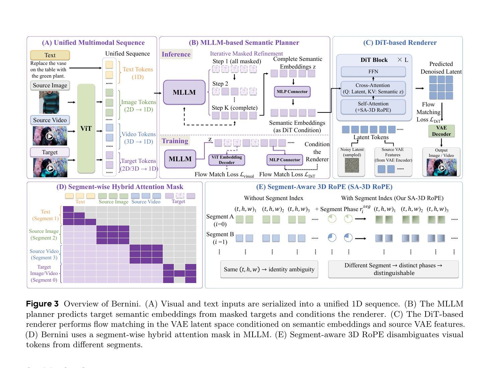
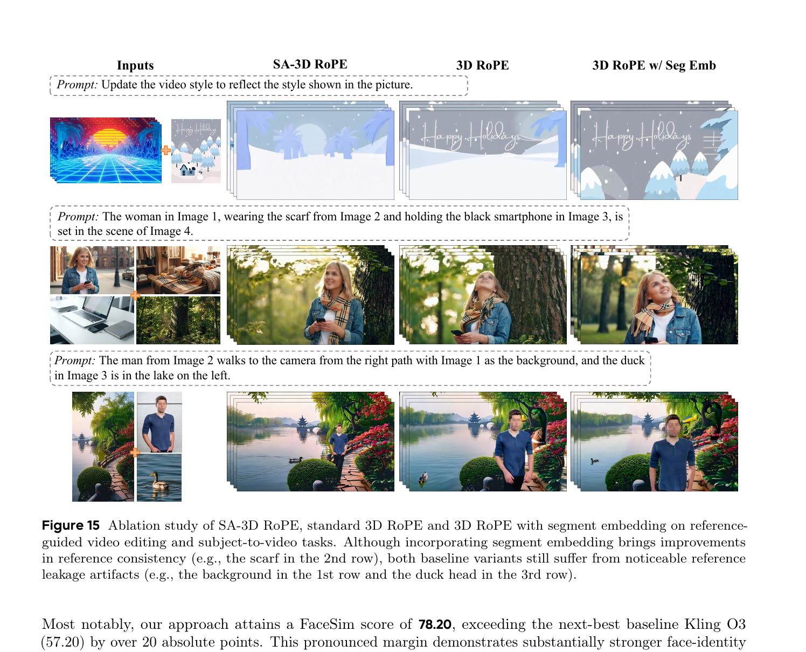
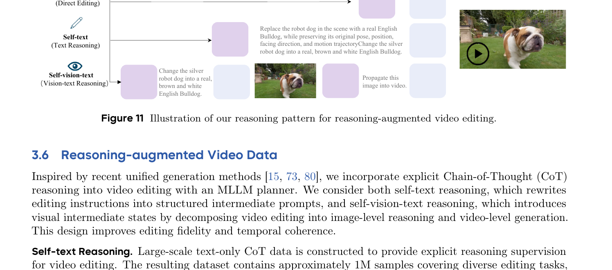
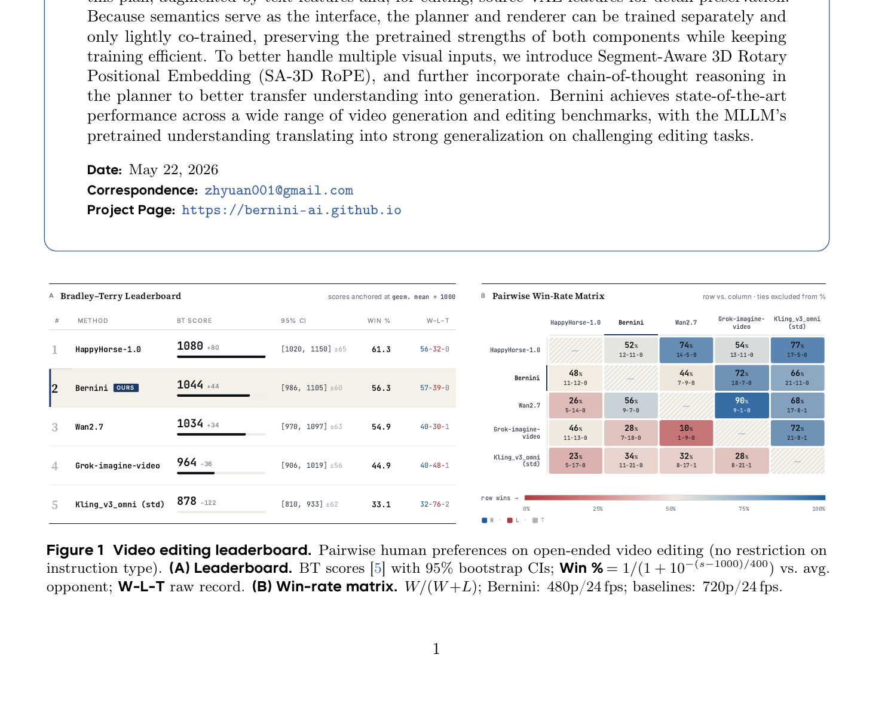
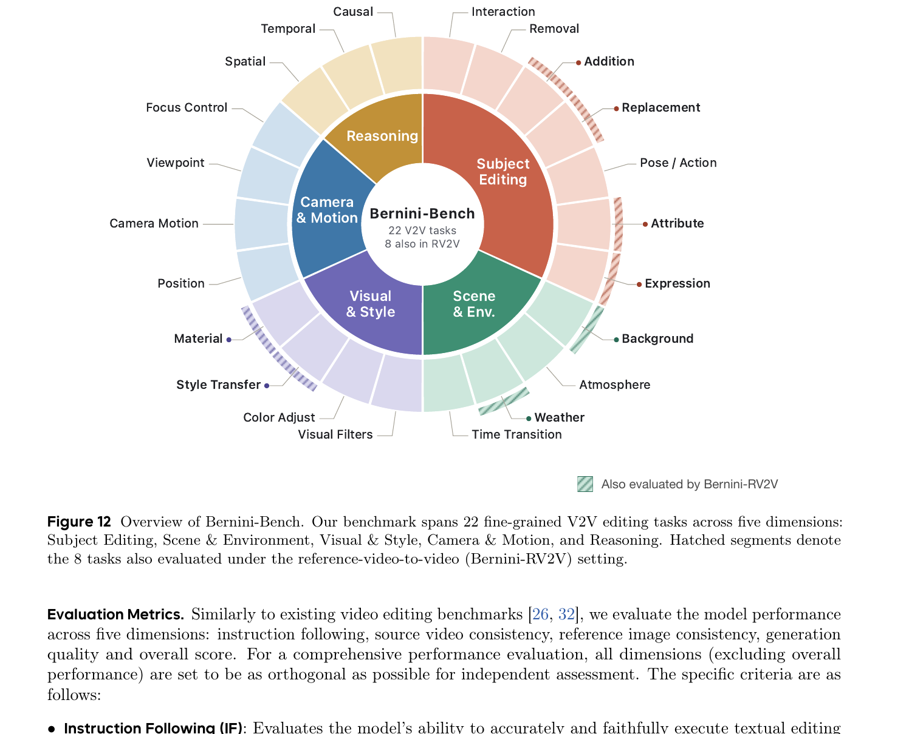
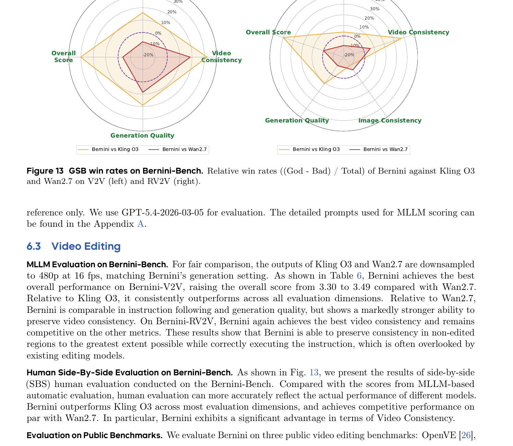

# Bernini: Unified MLLM-Planner + DiT-Renderer Video Generation and Editing

> 论文:Bernini: A Scalable Unified Framework for Video Generation and Editing (ByteDance, May 22, 2026)
> 项目主页: https://bernini-ai.github.io | 代码: `ByteDance/Bernini-Diffusers`
> 作者:Chenchen Liu, Junyi Chen, Lei Li, Lu Chi†(Project Lead), Mingzhen Sun, Zhuoying Li 等

---

## 1. 一句话定位

Bernini = **MLLM semantic planner**(Qwen2.5-VL-7B 在 ViT embedding 空间规划编辑目标) + **DiT pixel renderer**(Wan2.2-A14B 在 VAE latent 空间 flow matching 生成像素),以 ViT 语义 embedding 为接口解耦双组件训练,引入 SA-3D RoPE 消除多段视觉输入的位置歧义,并以 Chain-of-Thought 推理迁移 MLLM 的语言理解能力;在视频编辑公开榜单人工评测中排名第 2(BT score 1044),S2V 任务 FaceSim 78.20 超越第二名 20 分以上。

---

## 2. 要解决的问题(动机)

视频编辑同时需要**语义理解**和**像素生成**两种相互矛盾的能力:

- **语义理解**(MLLM 擅长):理解复杂的自然语言指令、识别目标对象、推断编辑意图;
- **像素生成**(DiT 擅长):保持未编辑区域的时间一致性,生成高质量视频帧。

现有方法的困境:

| 路线 | 代表 | 问题 |
|------|------|------|
| 纯 DiT 编辑 | VACE, SANA-Streaming | 缺乏 MLLM 级语义理解,复杂指令失败 |
| MLLM → hidden states → DiT | UniVideo, VinO | 宽接口需联训,破坏双方预训练能力 |
| MLLM + 离散 token | Show-o, Janus | 离散化丢失视觉细节 |

Bernini 的核心洞察:**MLLM 的 ViT embedding 空间是天然的语义接口**——让 MLLM 在此低噪声语义空间做规划,DiT 接受稠密 ViT 嵌入序列而非文字描述。ViT embedding 与 MLLM 的视觉编码器对齐,携带完整的空间语义,同时比像素空间维度低得多。这样两个组件可以**基本独立预训练**,联合 co-training 只需轻量适配。

---

## 3. 与前作的关系

**站在两块巨人肩上:**

- **Qwen2.5-VL-7B**:MLLM planner 的基座,原始模型的视觉理解 + 语言推理能力全量继承;
- **Wan2.2-A14B**:DiT renderer 的基座,原生视频生成质量基本保留(VBench Bernini 84.64 vs Wan2.2 84.79)。

**关键 incremental claim:**

1. **接口选择**:论文证明 ViT embedding 接口比 MLLM hidden states 接口更干净(后者存在 reference leakage),比离散 token 保留更多细节;
2. **SA-3D RoPE**:比加性 segment embedding 更根本地解决多段视觉输入的身份混淆(消融 Fig 15);
3. **任务统一**:单一模型统一 V2V / RV2V / S2V / T2I / I2I 等 22 类任务,而非多个专用模型;
4. **推理可泛化**:CoT 推理让模型处理训练集之外的编辑类型(运动变化、焦点切换、因果推理)。

---

## 4. 核心算法/方法

### 4.1 整体架构



> **Fig 3 逐段解读**
>
> **(A) 统一多模态序列** — 文本、源图像 ViT tokens (2D→1D)、源视频 ViT tokens (3D→1D)、目标 MASK tokens (2D/3D→1D) 拼为一条序列,送入 MLLM。ViT 把原始视觉信号压缩到语义 embedding 空间;MASK token 是 MLLM 要"填写"的目标占位。
>
> **(B) MLLM Planner** — 上半部分是推理路径:Step 1 全 mask → Step K 逐步 unmask(MAR-style 迭代解码,共 25 步),最终输出完整 semantic embedding z。下半部分是训练路径:同时训 ViT Embedding Decoder(辅助 loss `L_visual`)和 MLP Connector → DiT renderer(`L_DiT`)。MLLM 一次 forward 同时为两条损失提供梯度。
>
> **(C) DiT Renderer block** — 标准 DiT block(Self-Attention + Cross-Attention + FFN)。Cross-Attention 的 KV 来自 MLP Connector 输出的 semantic z,再叠加 source VAE features 和 T5 text features。SA-3D RoPE 同样作用于 DiT 的 self-attention,区分 source latent 和 target latent 的时空身份。右侧是 VAE Decoder,将 denoised latent 映射回像素。
>
> **(D) Segment-wise Hybrid Attention Mask** — MLLM 内的段级混合注意力掩码。纵轴=query,横轴=key。Target (Segment 0) 可 attend 所有 token(全连接行);Source tokens 和 Text token 只能 attend 自身段(类 causal 限制)。这防止 source 信息过度聚合到 target 以外的位置。
>
> **(E) SA-3D RoPE** — 左侧:标准 3D RoPE,不同段的 token 共享相同 `(t,h,w)` 坐标导致身份混淆;右侧:SA-3D RoPE 为每个段 `i` 附加段相位 `r_i^seg`,使相同 `(t,h,w)` 的不同段 token 在注意力点积中产生不同相位偏移 → 可区分。

---

整体数据流:

```
文本指令 + 源图/视频 + 参考图(可选)
          │
    [ViT Encoder]  → 源/参考 ViT tokens
          │
    [MLLM Planner]  (Qwen2.5-VL-7B)
    统一序列 + SA-3D RoPE + MAR 迭代解码 (25 steps)
    输出: 目标 ViT embedding z (3584d)
          │                   │
    [MLP Connector]    [ViT Embedding Decoder]
    zero-init → 4096d   (DiffLoss_FM, 辅助 L_visual)
          │
    [DiT Renderer]  (Wan2.2-A14B)
    cross-attn: semantic z + source VAE + T5 text
    flow matching (60/40 steps)
    + Multi-source CFG
          │
    [VAE Decoder] → 输出像素
```

---

### 4.2 MLLM Planner 与 MAR-style 训练

**输入序列构造:**

```
[SYS][Text Tokens][Source Image ViT Tokens][Source Video ViT Tokens][MASK Tokens]
```

所有 token 在同一 1D 序列里,段间分隔由 SA-3D RoPE 和 Hybrid Attention Mask 编码。

**训练时 mask ratio 采样** — 不同任务用不同 Beta 分布控制"难度":

| 任务 | α | β | 倾向 |
|------|---|---|------|
| T2I | 5 | 1.1 | 高 mask ratio(从文本生成全部内容) |
| V2V | 12 | 0.9 | 极高 mask ratio(源视频变化大) |
| I2I (变化 >30%) | 1.5 | 1.1 | 中等 mask ratio |
| T2V | 5 | 1.1 | 高 mask ratio |

**训练目标:**

$$
\mathcal{L} = \lambda_\text{text} \mathcal{L}_\text{ntp} + \lambda_\text{visual} \mathcal{L}_\text{visual} + \lambda_\text{DiT} \mathcal{L}_\text{DiT}
$$

- `L_ntp`:文本 next-token prediction(保持 MLLM 语言能力)
- `L_visual`:通过 ViT Embedding Decoder 重建 ViT embedding 的 flow matching loss
- `L_DiT`:DiT 在 VAE latent 空间的 flow matching loss

📌 关键:MLLM 一次 forward 同时为 `L_visual` 和 `L_DiT` 提供梯度,前者督促 MLLM 在 embedding 空间准确规划,后者督促 connector 传递有效信号给 DiT。

**推理时迭代解码:** Step 1 将全部目标 token 置为 MASK,每步根据 MLLM 置信度 unmask 一部分,迭代 25 步后获得完整 embedding z。

---

### 4.3 SA-3D RoPE

标准 3D RoPE 为每个 token 分配坐标 `(t,h,w)`,多段视觉输入时不同段共享相同坐标 → 注意力点积无法区分段身份。

SA-3D RoPE 引入**段索引条件的相位调制**:

$$
\tilde{r}_{t,h,w,i} = r_{t,h,w} \odot r_i^\text{seg}
$$

其中 `r_{t,h,w}` 是标准 3D RoPE 旋转矩阵,`r_i^{seg}` 是段 index `i` 对应的固定旋转矩阵(训练时学习或固定)。两个 token 的注意力 score 为 `q·k^T`,展开后包含段相位差 → 不同段的 token 产生不同的相位偏移,即使 `(t,h,w)` 相同也可区分。

**消融验证(Fig 15):**



> **Fig 15 逐段解读**
>
> 四列对比:Inputs / SA-3D RoPE(Ours) / 3D RoPE / 3D RoPE w/ Seg Emb。三行对应三个 reference-guided 场景。
>
> **第 1 行(风格迁移)**:输入是赛博朋克风格源视频 + 圣诞节贺卡参考图。SA-3D RoPE 正确应用了贺卡的冬日卡通风格到源视频;标准 3D RoPE 把参考图的文字("Happy Holidays")也 leak 进了输出背景;加性 Seg Emb 有所改善但仍有文字 artifact。
>
> **第 2 行(多参考图合成)**:4 张参考图分别提供人物、围巾、手机、背景场景。SA-3D RoPE 准确将围巾从参考图 2 迁移到人物身上;标准 3D RoPE 和 Seg Emb 都无法正确区分 4 张参考图的身份。
>
> **第 3 行(S2V 生成)**:3 张参考图(背景、人物、鸭子)合成一段视频。SA-3D RoPE 鸭子正确出现在湖里;3D RoPE 变体在第 3 行右下角出现"鸭头"串到人物身上(reference leakage artifact)。
>
> 结论:加性 Seg Emb 改善了参考一致性,但仍有跨段 leakage;SA-3D RoPE 在相位层面彻底解耦段身份,leakage 消除。

---

### 4.4 DiT Renderer 与 Multi-source CFG

**DiT 每个 block 的 cross-attention KV 来自三路条件:**

```
KV = [MLLM hidden states via zero-init MLP connector (4096d)]
   + [source VAE features (时序像素细节)]
   + [T5 text features (文本语义)]
```

Zero-init connector(`gen_head_type: "zerolinear"`)保证训练初期 connector 输出为零 → DiT 行为等价于预训练阶段,避免随机初始化破坏 Wan2.2 的预训练能力。

**Multi-source CFG(4 路增量引导):**

$$
\hat{\epsilon} = \epsilon_{\emptyset,\emptyset,\emptyset,\emptyset}
+ \omega_\text{vid} \Delta_\text{vid}
+ \omega_\text{img} \Delta_\text{img}
+ \omega_\text{txt} \Delta_\text{txt}
+ \omega_\text{tgt} \Delta_\text{tgt}
$$

其中 `Δ_X = ε_{X,...} - ε_{\emptyset,...}` 是依次增量打开各路条件的差值。四路引导分别控制源视频、参考图像、文本、目标语义的强度,可在推理时独立调整,灵活平衡一致性和编辑程度。

---

### 4.5 Chain-of-Thought 推理



> **Fig 11 逐段解读**
>
> 图中展示三种推理模式(从上到下)。
>
> **Direct Editing(顶行)**:原始 prompt 直接送入 → 输出编辑视频。最简单但对复杂指令理解不足。
>
> **Self-text Reasoning(中行)**:MLLM 先把原始 prompt ("把银色机器狗替换成真实英国斗牛犬") 改写为详细结构化描述("Replace the robot dog in the scene with a real English Bulldog, while preserving its original pose, position, facing direction, and motion trajectory…"),再执行编辑。改写后的 prompt 包含约束(保持姿势/位置/方向/运动轨迹),避免模糊指令导致的错误编辑。
>
> **Self-vision-text Reasoning(底行)**:MLLM 先对单帧图像做 CoT 编辑得到中间结果图(图中的斗牛犬图片),再以这张中间图为参考,调用 propagation pipeline 将编辑效果传播到整段视频。视觉中间态提供了空间约束,确保编辑结果在时序上的一致性。
>
> 消融(Table 10)验证:+Self-text → OS 从 3.12→3.33;+ GPT-5.4 PE → OS 3.49 IF 3.66;+ Self-visual-text → OS 3.52,VC 3.54。视觉推理对视频一致性(VC)的提升最显著。

---

### 4.6 数据管道

| 数据类型 | 规模 | 构建方法 |
|---------|------|---------|
| V2V pretraining | 20M 视频对 | X-CLIP 相似度筛选 (0.65–0.95),Qwen3-VL 生成 dense prompt |
| I2I | 30M 图像对 | 教程/商业图像编辑网站 + 图像编辑器 |
| 传播式编辑 | — | 专用传播模型 → 扩展至视频帧级编辑对 |
| Motion-aware 编辑 | — | 双分支 I2V + V2V 融合(Eq.4 加权 CFG) |
| R2V / RV2V | — | MLLM 替换 3-5 个对象;人物 R2V 利用身份递归 |
| CoT reasoning | ~1M | GPT-5.4 生成 self-text;单帧编辑图生成 self-vision-text |

---

### 4.7 三阶段训练

```
Stage I  ──► MLLM Planner 独立预训练
             256p / ~50M 图像对(I2I + T2I) + ~1M CoT
             优化: L_ntp + L_visual

Stage II ──► DiT Renderer 独立预训练
             480p / V2V + R2V + T2V + ...
             优化: L_DiT(无 MLLM 参与)

Stage III──► 轻量联合 co-training
             480p / 所有任务混合
             优化: L_ntp + L_visual + L_DiT
             更新 connector + adapter,双基座权重基本冻结
```

独立预训练使两个大型模型各自在最擅长的任务上收敛,Stage III 的联合 co-training 只微调接口,避免"灾难性遗忘"。

---

## 5. 关键代码位置

| 文件:行号 | 内容 |
|----------|------|
| `bernini/models/bernini.py:51` | `MLPConnector` — gen branch (→DiT 4096d,zero-init) + vit branch (→ViT 3584d) |
| `bernini/models/bernini.py:241` | `BerniniModel.__init__` — MLLM + DiT + connector + ViT Embedding Decoder 组装 |
| `bernini/models/bernini.py:279` | `self.mask_tokens = nn.Parameter(...)` — MLLM 的 learnable MASK token(4096 个,3584d) |
| `bernini/models/bernini.py:437` | `post_process_input_embeds` — 将目标 ViT token 位置替换为 MASK token(训练/推理分支) |
| `bernini/models/bernini.py:473` | `feat_from_planner_to_renderer` — MLLM hidden states 经 connector 传给 DiT |
| `bernini/models/modeling_qwen2_5_vl.py` | Qwen2.5-VL 改造版 — SA-3D RoPE + segment ID + 变长多帧 position ID |
| `bernini/attention.py:34` | `_select_backend` — FA3 → FA2 → SDPA 后端自动选择(一次 probe,全局缓存) |
| `bernini/models/diffloss_fm.py` | `DiffLoss_FM` — ViT Embedding Decoder(flow match,辅助 MLLM 的 `L_visual`) |
| `bernini/models/wan_diffusion.py` | `GEN_Wanx22` — Wan2.2 DiT renderer |
| `bernini/models/transformer_wan.py` | `WanRotaryPosEmbed` — SA-3D RoPE 的位置 embedding 实现 |
| `configs/bernini/config.json` | 主配置 — `use_src_id_rotary_emb`, `num_mask_token`, connector dims, `switch_dit_boundary` |

---

## 6. 关键配置项

从 `configs/bernini/config.json` 挖出的论文正文未明说的细节:

| 配置项 | 值 | 含义 |
|--------|-----|------|
| `num_mask_token` | 4096 | MLLM learnable MASK token 数量;决定最大目标序列长度 |
| `clip_diff_cfg.z_channels` | 3584 | ViT embedding 维度(与 Qwen2.5-VL-7B ViT 隐层维度一致) |
| `clip_diff_cfg.width` | 4096 | ViT Embedding Decoder 的 MLP 宽度 |
| `connector_cfg.out_dim_for_gen` | 4096 | connector → DiT cross-attn context 维度 |
| `connector_cfg.gen_head_type` | `"zerolinear"` | connector 最后一层 zero-init → 训练初期输出为零,保护 DiT 预训练 |
| `connector_cfg.out_dim_for_vit` | 3584 | ViT 预测分支输出维度 |
| `switch_dit_boundary` | 0.875 | Wan2.2 双 DiT 分支切换边界(timestep ≥0.875 走 high-noise DiT,<0.875 走 low-noise DiT) |
| `t5_combine_type` | `"concat_with_zero_init"` | T5 features 拼接到 DiT cross-attn,拼接 adapter zero-init |
| `t5_max_sequence_length` | 512 | T5 text encoder 序列最大长度 |
| `target_fps` | 16 | 生成视频帧率(Bernini 所有任务统一 480p@16fps) |
| `cotrain` | true | 启用 Stage III 联合训练 |
| `max_trained_src_id` | 5 | 训练时最多 5 个视觉段;超出则在 [1,5] 内线性插值映射 |

---

## 7. 实验结果

### 7.1 开放视频编辑榜单



> **Fig 1 逐段解读**
>
> **(A) Bradley-Terry 排行榜**:基于 pairwise 人工偏好的 BT 模型评分(平均锚定 1000)。Bernini BT=1044,Win%=56.3,W-L-T=57-39-0,排名第 2,仅次于 HappyHorse-1.0(BT=1080,Win%=61.3)。注:HappyHorse-1.0 生成分辨率为 720p/24fps,而 Bernini 为 480p/24fps,分辨率差距不可忽视。
>
> **(B) Pairwise Win-Rate 矩阵**:行为 query 方,列为对手,每格显示行方胜率。Bernini 对 Wan2.7 胜率 44%(劣势),对 Grok-imagine-video 胜率 72%,对 Kling_v3_omni 胜率 66%。说明 Bernini 在像素生成质量上与 Wan2.7 有差距,但在编辑精确性和一致性上超越商业竞品。

---

### 7.2 Bernini-Bench 专项评测



> **Fig 12 逐段解读**
>
> 环形图展示 Bernini-Bench 的 22 个 V2V 任务分布于 5 个维度(内环标注)。
>
> - **Subject Editing(红色)**:主体编辑,包含 Addition、Replacement、Pose/Action、Attribute、Expression 5 类 — 最多任务,覆盖对象操作核心场景;
> - **Scene & Env.(绿色)**:场景和环境,包含 Background、Weather、Atmosphere、Time Transition 4 类 — 考验全局风格一致性;
> - **Visual & Style(紫色)**:视觉风格,包含 Material、Style Transfer、Color Adjust、Visual Filters 4 类 — 考验低层视觉属性控制;
> - **Camera & Motion(蓝色)**:相机和运动,包含 Camera Motion、Position、Viewpoint、Focus Control 4 类 — 考验时序和几何一致性;
> - **Reasoning(深蓝)**:推理编辑,包含 Spatial、Temporal、Causal、Interaction、Removal 5 类 — 考验高层语义理解。
>
> 斜线填充的扇形(8 个任务)同时出现在 Bernini-RV2V 评测中。总计 300 个测试样本。



> **Fig 13 逐段解读**
>
> 雷达图展示 Bernini vs Kling O3 / Wan2.7 的 GSB(God-Bad/Total)相对胜率,正值代表 Bernini 更优,负值代表对手更优。
>
> **左图(V2V)**:Bernini 在 Video Consistency(视频一致性)轴上对两个对手均有显著正优势 — 这是 Bernini 架构的核心优势(源 VAE features 直接条件化保持未编辑区域)。Overall Score 对 Kling O3 正优,对 Wan2.7 略负。Generation Quality 对两者均略负(Wan2.7 像素质量强)。
>
> **右图(RV2V)**:引入参考图后,Bernini 在 Image Consistency(参考图一致性)和 Video Consistency 上均有正优势,说明 SA-3D RoPE + ViT 语义接口有效传递了参考图的外观特征。

**Bernini-Bench 定量结果(Table 6):**

| 方法 | V2V OS | V2V IF | V2V VC | RV2V OS | RV2V IF | RV2V VC |
|------|--------|--------|--------|---------|---------|---------|
| UniVideo | 2.94 | 3.07 | 3.03 | 2.80 | 3.07 | 3.11 |
| VINO | 3.26 | 3.42 | 3.24 | 3.25 | 3.41 | 3.30 |
| Kling O3 | 3.29 | 3.54 | 3.20 | 3.31 | 3.55 | 3.20 |
| Wan2.7 | 3.30 | 3.54 | 3.31 | 3.26 | 3.46 | 3.32 |
| **Bernini** | **3.49** | **3.66** | **3.51** | **3.50** | **3.75** | **3.51** |

OS=Overall Score,IF=Instruction Following,VC=Video Consistency。Bernini 在 VC 上领先最多,与论文主张的"一致性优先"架构设计一致。

---

### 7.3 公开 Benchmark 结果

**OpenVE-Bench(Table 7,Gemini 2.5 pro 评估):** Bernini Overall 4.04 vs VINO 3.18(第二名),Background Change、Local Change、Camera Edit 分项全面领先。

**EditVerse(Table 8):** Bernini Editing Quality 8.02(最高),Pick Score 20.26(最高)。

**VBench T2V(Table 11):** Bernini 84.64 vs Wan2.2-A14B 84.79 — 基本持平,说明 unified framework 对基础 T2V 能力几乎无损。

**OpenS2V-Eval(Table 12):**

| 方法 | Total | FaceSim |
|------|-------|---------|
| Kling O3 | 59.19 | 57.20 |
| RefAlign-14B | 60.42 | 55.23 |
| **Bernini** | **62.94** | **78.20** |

📌 FaceSim 78.20 超越第二名(57.20)超过 20 个绝对分,面部身份一致性远超所有对手 — SA-3D RoPE 在多参考图 S2V 任务上的核心优势。

---

## 8. 争议/权衡

**明显优势:**

- ViT embedding 接口让双组件独立预训练,联训 overhead 低;
- SA-3D RoPE 彻底消除 reference leakage,面部/外观一致性大幅领先;
- 单一模型统一 22 类任务,工程部署成本低;
- CoT 推理让模型泛化到训练集之外的编辑类型(运动/焦点/因果)。

**局限(论文 Sec.8 披露):**

- 复杂指令仍依赖 LLM rewriter(GPT-5.4)提供详细结构化描述,MLLM 自身 25 步规划不完全自足;
- 像素生成质量(Generation Quality)低于专用 Wan2.7,说明 unified framework 对纯生成质量有轻微代价;
- 推理开销:25 步 MLLM 规划 + 60 步 DiT 采样(T2V),串行两大模型 → 延迟高;
- 受基座模型上限制约,更强的 MLLM + DiT 基座可直接提升结果。

**和竞品的真实差异:**

- vs VINO(同为 MLLM + DiT):Bernini ViT embedding 接口比 MLLM hidden states 接口更"干净",且独立预训练策略更好保留预训练能力;
- vs Wan2.7(纯 DiT):Bernini 用 MLLM 规划换取语义一致性,牺牲少量纯生成质量;
- vs 离散 token 统一模型(Show-o 等):连续 ViT embedding 保留更多视觉细节,S2V FaceSim 的巨大优势即源于此。

---

## 9. 一句话总结

Bernini 最有价值的一句话:**把 MLLM 的 ViT embedding 空间作为语义接口,让 MLLM 在 embedding 空间规划"编辑后应该长什么样",DiT 在 VAE latent 空间负责"怎么把规划画出来"** — 接口比 hidden states 更纯净,比离散 token 更稠密,加上 SA-3D RoPE 解耦多段视觉身份,使两个大型预训练模型能够协同而不相互干扰。
