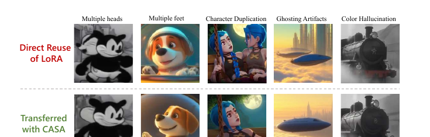
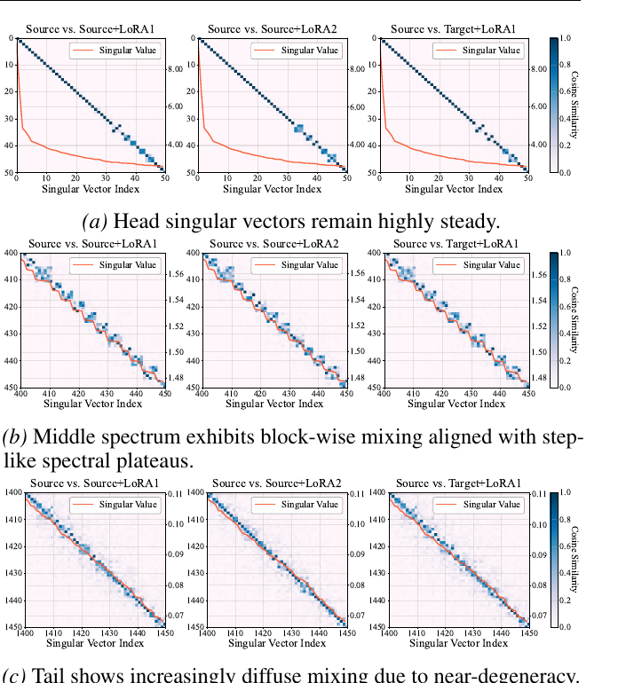
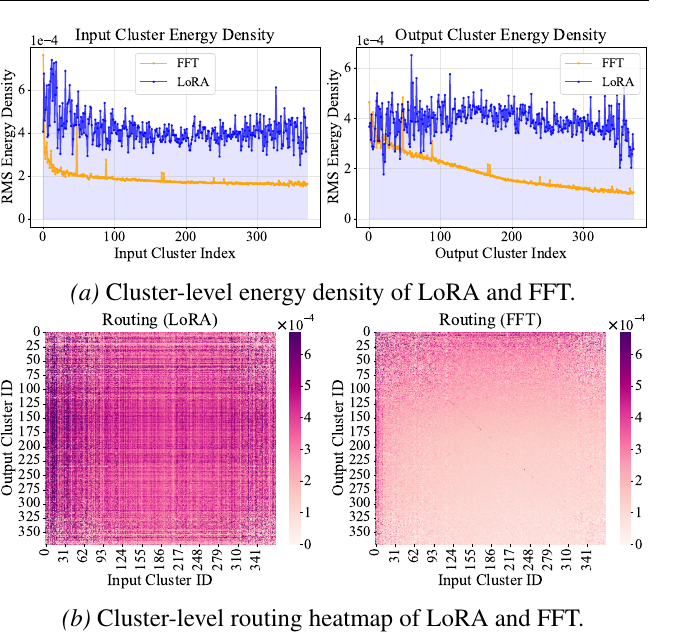
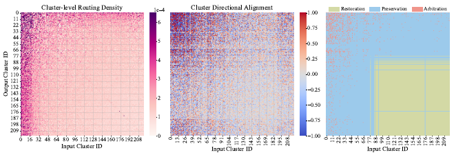

# Exploring Data-Free LoRA Transferability for Video Diffusion Models（CASA）

**论文**: [arXiv:2605.01929v1](https://arxiv.org/abs/2605.01929)（2026-05-03，**ICML 2026**，PMLR 306，22 页含附录）
**作者**: Yuchen Wang, Wenliang Zhong, Lichen Bai, Zikai Zhou, Shitong Shao, Bojun Cheng, Shuo Chen, Shuo Yang, Zeke Xie（通讯）— **港科大（广州）+ 南京大学 + 哈工大（深圳）**
**代码**: [github.com/Noahwangyuchen/CASA](https://github.com/Noahwangyuchen/CASA)（本笔记引用 commit [`d7c8310`](https://github.com/Noahwangyuchen/CASA/tree/d7c8310e57352b48f9dbc8028cdc0eb2643f5f4e)）—— 核心算法只有 `transfer.py` 一个文件（267 行），另附 Rolling Forcing 与 Krea 的推理集成
**后续工作**: [DART](../dart/analysis.md)（2026-09）把本篇作为唯一的外部 baseline

---

## 1. 一句话定位

**在 base 视频扩散模型上训的 LoRA，直接挂到它的蒸馏版本（步数蒸馏、因果蒸馏）上会出现多头、多脚、角色重复、鬼影、偏色。本文从权重空间解释原因，并给出一个免数据、免训练、只做矩阵运算的迁移方法 CASA。**

| | 内容 |
|---|---|
| **观察** | 蒸馏（全参微调，FFT）与 LoRA 都几乎不改奇异值（相对变化 ≤ 0.3%），变化全在**奇异子空间的旋转**上 |
| **诊断** | 用路由矩阵 `C = Uᵀ Δ V` 看"哪个输入奇异方向把信息送到哪个输出奇异方向"：**FFT 的路由能量集中在头部少数簇，LoRA 均匀散开**；两者在共享簇里同号叠加就"过载"，异号就"抵消" |
| **方法** | 按 FFT 路由密度把簇分成主导 / 非主导：非主导区域把 LoRA 的路由"补回来"，主导区域里对同号高风险的位置只保留两者中较大的幅度 |
| **成本** | 每个 LoRA 约 5 秒（1.3B）/ 约 1 分钟（14B），单卡 RTX 4090；另有一次性的 SVD 与漂移投影预处理 |
| **结果** | Table 1 共 8 组设置 × 2 个指标 = 16 格，CASA 赢 13 格；风格相似度 CSD 平均提升 1.3B +2.15、14B +0.95 |

🔴 **读完全文、核对代码之后，需要补充的几件事**：
1. **"恢复 LoRA 路由"在数学上就是把蒸馏在非主导区域的改动整个撤回**：那部分权重回到"源模型 + LoRA"（见 [§4.3](#43-它实际做了什么把三条规则合起来看)）。论文附录 B.2.1 量过这个代价，在默认阈值附近不大（FastWan 的 VideoAlign 2.30 → 2.25）。
2. **CSD 的提升几乎全部来自这一步回退**（Table 2：只开 R，CSD +2.63 / +1.98；只开 A，CSD 反而 −0.67 / −0.61）。而 CSD 的参照恰好是"源模型 + LoRA"的输出 —— **只要把目标模型往源模型改，CSD 就会涨，与 LoRA 迁移得好不好无关**。论文没有做"只回退、不挂 LoRA"时的 CSD 对照，所以两部分分不开（见 [§9](#9-争议与权衡)）。
3. **只测了风格类 LoRA**（Steamboat Willie、Jinx、Film-Noir、Retro-Anime），CSD 只取**每条视频的第一帧**。在 [DART](../dart/analysis.md) 以运动 / 运镜类 LoRA 为主的评测里，CASA 的平均质量与功能保留率都不如直接挂载。
4. **代码里有几处论文没写的实现**：输出统一截断到**秩 32**（原 LoRA 是 16 / 128 / 32 / 64）；非方阵层（FFN）不做 90% 能量截断；SVD 以 **bf16** 保存后再用来重建源权重、求蒸馏漂移（见 [§5](#5-关键代码位置)）。

---

## 2. 问题：直接复用的失效形态

> **Fig 1 逐列解读**（上行 *Direct Reuse of LoRA*，下行 *Transferred with CASA*，五列各是一种失效）：
>
> - **Multiple heads**（Steamboat Willie 风格的米老鼠）—— 直接复用时角色的主脸左侧又长出一个侧脸，**两个头左右并排**；CASA 后只剩一个头。
> - **Multiple feet**（戴宇航头盔的小狗）—— 上行画面下沿**露出了两对前爪**；下行只抬起一只爪子，姿态正常。
> - **Character Duplication**（Jinx）—— 上行画面里出现两个 Jinx 并排；下行只有一个。
> - **Ghosting Artifacts**（云海上的飞船）—— 上行飞船周围有半透明重影；下行轮廓清楚。
> - **Color Hallucination**（黑白火车，Film-Noir 风格）—— 上行本应是黑白画面，**火车底盘却出现了红色**；下行保持纯黑白。
>
> 📌 **五种失效里四种是结构性的**（多出身体部件、角色复制、重影），只有一种是颜色 —— 这正是本文把问题归结为"主导生成通路被过度激活"的出发点（附录 B.2.2 用人为放大头部路由块复现出了同类失效）。⚠️ 这是挑选的示例，不代表失效频率。

**为什么会发生**：步数蒸馏（FastWan）和因果蒸馏（Rolling Forcing、Krea Realtime）都是对 base 模型做**全参微调**，蒸馏后的权重 `W_t = W_s + Δ_fft`。LoRA 是在 `W_s` 上训的，直接加到 `W_t` 上时，`Δ_lora` 与 `Δ_fft` 在同一套权重里相互作用 —— 本文要回答的是这个相互作用具体长什么样。

---

## 3. 分析：蒸馏与 LoRA 在权重空间里做了什么

分析设置：源模型 Wan2.1-T2V-1.3B，目标模型 FastWan2.1-T2V-1.3B（步数蒸馏），LoRA 为 Jinx-v2 与 Steamboat-Willie-1.3B。

### 3.1 奇异值几乎不动（spectral rigidity）

逐层比较微调前后的奇异值（论文 Eq. 1）：

$$
\rho_2 = \frac{\lVert \mathbf{S}' - \mathbf{S} \rVert_2}{\lVert \mathbf{S} \rVert_2}
$$

**FFT 与 LoRA 的相对变化都不超过 0.3%**。论文特别指出这与 LLM 里的观察不同：LLM 的 LoRA 会引入与所有预训练奇异方向都几乎正交的 *intruder dimensions*，或显著放大头部奇异值；视频扩散模型里两者都没有出现。**既然奇异值不变，微调的作用只能体现在奇异子空间的变化上。**

### 3.2 奇异子空间的结构化扰动

> **Fig 3 逐行解读**（每格是 `|Uᵀ U′|`，颜色越深越相似；红线是该段的奇异值曲线，右轴刻度；三列分别是源模型对比"源 + LoRA1"、"源 + LoRA2"、"目标 + LoRA1"）：
>
> - **(a) 头部，第 0–50 个方向** —— 严格的对角线：前几十个奇异方向在微调后几乎一一对应、原地不动。右轴显示这一段奇异值从 ~8 快速降到 ~2，彼此间隔大。
> - **(b) 中部，第 400–450 个方向** —— 对角线变成一串**小方块**：相邻的几个方向彼此混合，而方块的边界正好对齐奇异值曲线上的"台阶"（奇异值在 1.56 → 1.48 之间分段平台）。**台阶内部可以互换，台阶之间基本不混。**
> - **(c) 尾部，第 1400–1450 个方向** —— 对角线周围是一条弥散的带子：这一段奇异值（0.11 → 0.07）几乎连续、间隔极小，方向之间可以大范围混合。
>
> 📌 **三列几乎一样** —— 换一个 LoRA、或者把 LoRA 挂到蒸馏模型上，结构都不变。论文用 Davis–Kahan 扰动定理解释：子空间的稳定性由局部谱间隔决定，间隔大的地方扰动局部、间隔小的地方扰动弥散。**"台阶内可互换"的这些方向组，就是后面方法里的"簇"。**

### 3.3 簇级路由：FFT 集中、LoRA 分散

对一个权重更新 `Δ`，在源模型的奇异基下定义路由矩阵 `C = Uᵀ Δ V`。`C(i, j)` 表示这次更新在"第 j 个右奇异方向（发送方）→ 第 i 个左奇异方向（接收方）"之间建立了多强的连接。把奇异方向按上面的混合关系聚成簇之后，论文先验证了簇内的路由方向高度一致、强度稳定（Fig 4，未收录），然后比较两种更新的簇级能量：

> **Fig 5 逐面板解读**：
>
> **(a) 簇级能量密度**（左：作为发送方；右：作为接收方；横轴是按奇异值从大到小排列的簇编号）—— **橙线 FFT** 在前几个簇处最高（约 3.5×10⁻⁴），随后单调衰减到约 1.6×10⁻⁴（发送侧）/ 1×10⁻⁴（接收侧）；**蓝线 LoRA** 则在约 4×10⁻⁴ 上下剧烈抖动，没有明显的头部集中。
>
> **(b) 簇对之间的路由热图**（纵轴接收簇、横轴发送簇）—— **LoRA（左）** 整张图都是深浅交错的连接，分布很广；**FFT（右）** 只有左上角和最左几列、最上几行颜色深，其余大片接近白色。
>
> 📌 **结论**：蒸馏把大部分改动押在少数头部簇上（论文认为这些簇决定了"有效生成子空间"），LoRA 则把改动撒在所有簇上。**两者在头部簇相遇时，同号叠加会"过载"，异号会"抵消"** —— §3.4 进一步显示，高交互区域集中在头部簇，而 LoRA 与 FFT 在这些位置的方向既有强同向也有强反向，没有全局偏向（Fig 6，未收录；与下文 Fig 7 前两块相同）。
>
> ⚠️ 这里的"FFT 路由能量"是 `C_fft = U_sᵀ (W_t − W_s) V_s`。按发布的预处理脚本，`W_s` 是由 **bf16 保存的 SVD 因子重建**出来的；bf16 的舍入误差在路由坐标里会按奇异值大小缩放、同样集中在头部。论文的分析图是否走了同一条管线，没有交代（见 [§9](#9-争议与权衡)）。

---

## 4. 方法：Cluster-Aware Spectral Arbitration（CASA）

### 4.1 把两种更新都投到源模型的奇异基上

源模型某层权重 `W_s = U_s S_s V_sᵀ`，LoRA 更新 `Δ_lora = BA`，蒸馏漂移 `Δ_fft = W_t − W_s`（论文脚注：直接用蒸馏权重减源权重）。二者的路由表示（Eq. 2）：

$$
\mathbf{C}_{\mathrm{lora}} = \mathbf{U}_s^{\top}\Delta_{\mathrm{lora}}\mathbf{V}_s,\qquad
\mathbf{C}_{\mathrm{fft}} = \mathbf{U}_s^{\top}\Delta_{\mathrm{fft}}\mathbf{V}_s
$$

**只在头部子空间里聚类**：取能量占比达到 90% 的最小 `k`（Eq. 3），

$$
\frac{\sum_{i=1}^{k}\sigma_i^2}{\sum_i \sigma_i^2} \ge 0.9
$$

再定义"预测旋转强度"（Eq. 4），**LoRA 的耦合强度除以两个方向的谱间隔**：

$$
\mathbf{R}(i,j) = \frac{\lvert \mathbf{C}_{\mathrm{lora}}(i,j) \rvert}{\lvert \sigma_i - \sigma_j \rvert + \epsilon}
$$

`R(i, j) > τ` 就把 `i`、`j` 连一条边，连通分量即簇 `{G_m}`。📌 这就是 §3.2 那个 Davis–Kahan 直觉的直接实现：耦合强、间隔小的方向会被 LoRA 混在一起，归为一簇。

### 4.2 三条规则

**① 找主导区域。** 用 FFT 在每个簇上的发送 / 接收密度（Eq. 5–6）：

$$
\rho_m^{\mathrm{send}} = \frac{1}{\lvert\mathcal{G}_m\rvert}\sum_{i\in\mathcal{G}_m}\lVert \mathbf{C}_{\mathrm{fft}}(:,i)\rVert_2,\qquad
\rho_m^{\mathrm{recv}} = \frac{1}{\lvert\mathcal{G}_m\rvert}\sum_{i\in\mathcal{G}_m}\lVert \mathbf{C}_{\mathrm{fft}}(i,:)\rVert_2
$$

密度超过分位数 `q_dom` 的簇为主导发送 / 接收簇；一个路由位置只要**接收方或发送方**落在主导簇里就算主导（Eq. 7）：

$$
\mathcal{D}(i,j) = \mathbb{I}\big[\, i \in \mathcal{G}^{\mathrm{recv}}_{\mathrm{dom}} \ \lor\ j \in \mathcal{G}^{\mathrm{send}}_{\mathrm{dom}} \,\big]
$$

**② 非主导区域：补回 LoRA**（Eq. 8）：

$$
\mathbf{C}_{\mathrm{casa}}(i,j) = \mathbf{C}_{\mathrm{lora}}(i,j) - \mathbf{C}_{\mathrm{fft}}(i,j),\qquad \mathcal{D}(i,j) = 0
$$

**③ 主导区域：只在"同号且高风险"的位置仲裁。** 局部交互只算同号的部分（Eq. 9），再乘上簇对之间的方向一致性（Eq. 10–13）：

$$
\mathbf{E}(i,j) = \max\big(0,\ \mathbf{C}_{\mathrm{lora}}(i,j)\,\mathbf{C}_{\mathrm{fft}}(i,j)\big)\cdot\mathcal{D}(i,j),\qquad
\mathbf{S}(i,j) = \mathbf{E}(i,j)\cdot\mathrm{Context}(i,j)
$$

`Context` 在头部子空间内取两个簇的路由块之间的余弦相似度，头部之外取 1。`S` 超过分位数 `q_act` 的位置（Eq. 14）：

$$
\mathbf{C}_{\mathrm{casa}}(i,j) = \max\big(\lvert\mathbf{C}_{\mathrm{lora}}(i,j)\rvert,\ \lvert\mathbf{C}_{\mathrm{fft}}(i,j)\rvert\big)\cdot\mathrm{sign}\big(\mathbf{C}_{\mathrm{lora}}(i,j)\big) - \mathbf{C}_{\mathrm{fft}}(i,j)
$$

主导区域的其余位置取 `C_casa = C_lora`。最后 `Δ_casa = U_s C_casa V_sᵀ`，再做低秩分解得到新的 `(B, A)`。

### 4.3 它实际做了什么：把三条规则合起来看

最终加到蒸馏模型上的是 `Δ_casa`，所以在源模型的奇异基下，**合成后的有效路由**是 `C_fft + C_casa`（这是我按上面公式推的，论文 §4.2 末段也写了目标是让 `C_fft + C_casa` 尽量还原 `C_lora`）：

$$
\mathbf{C}_{\mathrm{fft}} + \mathbf{C}_{\mathrm{casa}} =
\begin{cases}
\mathbf{C}_{\mathrm{lora}}, & \mathcal{D}(i,j)=0 \\
\mathrm{sign}(\mathbf{C}_{\mathrm{lora}})\,\max\big(\lvert\mathbf{C}_{\mathrm{lora}}\rvert,\lvert\mathbf{C}_{\mathrm{fft}}\rvert\big), & \mathcal{D}(i,j)=1,\ \mathbf{S}(i,j)>\mathrm{thr} \\
\mathbf{C}_{\mathrm{fft}} + \mathbf{C}_{\mathrm{lora}}, & \mathrm{otherwise}
\end{cases}
$$

| 位置 | 合成后的路由 | 通俗地说 |
|---|---|---|
| **非主导区域**（包括 90% 能量之外的全部尾部方向） | `C_lora` | 🔴 **蒸馏在这里的改动被整个撤回**，这部分权重回到"源模型 + LoRA" |
| 主导区域、同号高风险 | 两者中幅度较大的那个 | 同号时不再相加，只取较大者 —— 防"过载" |
| 主导区域、其余 | `C_fft + C_lora` | 与直接挂载完全相同 |

> **Fig 7 逐面板解读**：
>
> - **左 · Cluster-level Routing Density** —— FFT 的簇级路由密度，深色集中在最上面几行和最左边几列（头部簇），其余大片接近白色。
> - **中 · Cluster Directional Alignment** —— FFT 与 LoRA 在每个簇对上的方向余弦（−1 蓝到 +1 红），红蓝交错，头部区域的颜色最深：**既有强同向，也有强反向**。
> - **右 · CASA 的干预区域** —— 🟩 **Restoration**（右下角的大块，发送方与接收方都是非主导簇）；🟦 **Preservation**（主导行与主导列组成的"倒 L"形区域，直接相加）；🟥 **Arbitration**（散落在左上与左侧的红点，同号且高风险）。
>
> 📌 **面积上看，Restoration 在头部子空间里就占了右下的一大块，再加上头部之外的全部尾部方向** —— 也就是说，蒸馏的改动在绝大多数路由位置上都被撤回了，只在主导的"倒 L"区域里保留。

**这个撤回的代价，论文在附录 B.2.1 量过**：只去掉 FFT 在非主导区域的路由（Eq. 22 就是 `W_t − U_s((1−D_q)⊙C_fft)V_sᵀ`，与上面第一行同构，只是不加 LoRA），看蒸馏模型本身还剩多少质量（Tables 5–6）：

| | q = 0（原蒸馏模型） | 0.4 | **0.5（≈ 默认 q_dom）** | 0.6 | 0.7 | 0.8 | 0.9 |
|---|---|---|---|---|---|---|---|
| FastWan-1.3B · VideoAlign | 2.30 | 2.26 | **2.25** | 1.93 | 1.87 | 1.84 | 1.69 |
| FastWan-1.3B · VBench Imaging | 65.85 | 65.74 | **65.02** | 64.77 | 63.74 | 64.20 | 64.09 |
| Rolling Forcing · VideoAlign | 3.08 | 3.14 | **3.12** | 3.05 | 2.91 | 2.76 | 2.63 |
| Rolling Forcing · VBench Imaging | 67.56 | 66.36 | **65.85** | 63.85 | 61.80 | 61.80 | 59.19 |

📌 **在默认阈值附近代价确实不大**（FastWan 的 VideoAlign −0.05、Imaging −0.83；Rolling Forcing 的 VideoAlign 反而 +0.04、Imaging −1.71），这是支持 CASA 设计的一条好证据 —— 可惜只放在附录。论文的定性描述是 *"fine details and sharpness may decrease"*，但画面结构不崩。

---

## 5. 关键代码位置

以下均为 commit [`d7c8310`](https://github.com/Noahwangyuchen/CASA/tree/d7c8310e57352b48f9dbc8028cdc0eb2643f5f4e)。

| 位置 | 内容 | 与论文的关系 |
|---|---|---|
| [`transfer.py:7-13`](https://github.com/Noahwangyuchen/CASA/blob/d7c8310e57352b48f9dbc8028cdc0eb2643f5f4e/transfer.py#L7-L13) | 默认参数：`rotation_threshold=0.5`、`q_threshold=0.5`、`arbitrate_q=0.85`、**`target_rank=32`**；README 推荐的也是这组 | 论文没给 τ 的值，附录 D.1 说 τ 在 1–10 之间都不影响聚类 —— **推荐值 0.5 不在这个区间里**；`q_act` 论文只说"a high quantile"；**秩 32 论文没提** |
| [`transfer.py:42-48`](https://github.com/Noahwangyuchen/CASA/blob/d7c8310e57352b48f9dbc8028cdc0eb2643f5f4e/transfer.py#L42-L48) | **只有方阵才按 90% 能量取 top-k；非方阵层直接 `k = 全秩`** | ⚠️ 论文 Eq. 3 说一律取 90%；附录 D.1 还专门解释了为什么不能把近乎简并的尾部纳入聚类。FFN 的升 / 降维投影这类非方阵层，聚类用上了全部方向 |
| [`transfer.py:129-131`](https://github.com/Noahwangyuchen/CASA/blob/d7c8310e57352b48f9dbc8028cdc0eb2643f5f4e/transfer.py#L129-L131) | 先把所有位置设为 `Clora − Cfft`，再把主导区域改回 `Clora` | 即 §4.3 的"默认撤回、主导区域保留" |
| [`transfer.py:133-154`](https://github.com/Noahwangyuchen/CASA/blob/d7c8310e57352b48f9dbc8028cdc0eb2643f5f4e/transfer.py#L133-L154) | 主导且同号的位置按分位数 `arbitrate_q` 选出高风险项，取绝对值较大者减去 `Cfft` | Eq. 9–14 |
| [`transfer.py:160-165`](https://github.com/Noahwangyuchen/CASA/blob/d7c8310e57352b48f9dbc8028cdc0eb2643f5f4e/transfer.py#L160-L165) | **`torch.svd_lowrank(Clora_new, q=target_rank, niter=6)`** 后重建 `(B, A)` | ⚠️ 输出**截断到秩 32**，用的是随机化 SVD。非主导区域的 `Clora − Cfft` 可能是高秩的，截断后并不精确 —— 论文 Eq. 8 下方写的是 *"exactly restores LoRA-induced routing"* |
| [`examples/compute_svd_example.py:54-61`](https://github.com/Noahwangyuchen/CASA/blob/d7c8310e57352b48f9dbc8028cdc0eb2643f5f4e/examples/compute_svd_example.py#L54-L61) | fp32 做 SVD，**U / S / Vh 以 bf16 保存**（注释："to reduce storage"） | 论文未提精度 |
| [`examples/compute_cfft_example.py:30-34`](https://github.com/Noahwangyuchen/CASA/blob/d7c8310e57352b48f9dbc8028cdc0eb2643f5f4e/examples/compute_cfft_example.py#L30-L34) | **用 bf16 因子重建源权重** `W_wan = U diag(S) Vh`，再求 `C = Uᵀ(W_t − W_wan)Vhᵀ`，结果也存成 bf16 | ⚠️ 见 §9 的精度问题 |

**实验所用 4 个 LoRA 的原始秩**（我用 HTTP Range 只读了 Hugging Face 上 safetensors 文件的头部，没有下载权重）：

| LoRA | 原始秩 | CASA 输出秩 | LoRA 层数 |
|---|---|---|---|
| Steamboat-Willie-1.3B | 16 | 32（升秩） | 300 |
| Wan-LoRA-Arcane-Jinx-v2 | **128** | 32（**压到 1/4**） | 300 |
| Film-Noir（14B） | 32 | 32 | 480 |
| Steamboat-Willie-14B | **64** | 32（**压到 1/2**） | 400 |

📌 **一个值得记的规律**：Table 1 里 CASA 输给直接复用的 3 格，**全部出在被降秩的两个 LoRA 上**（Jinx-v2 在 Rolling Forcing 上的质量；Steamboat-Willie-14B 在 FastWan-14B 上的 CSD、在 Krea 上的质量）；没被降秩的两个 LoRA（Steamboat-Willie-1.3B 升秩、Film-Noir 同秩）**8 格全胜**。只有 4 个 LoRA，而且与模型规模混在一起（被降秩的里有一个是 14B），不能下结论 —— 但论文对秩的处理只字未提。（论文实验是否就用了代码默认的秩 32，也没有写 `[待补]`。）

---

## 6. 实验设置

| 项 | 值 |
|---|---|
| 源模型 | Wan2.1-T2V-1.3B、Wan2.1-T2V-14B；扩展实验用 HunyuanVideo-1.5-480P-T2V |
| 目标模型 | **步数蒸馏**：FastWan2.1-T2V-1.3B / 14B；**因果蒸馏**：Rolling Forcing（1.3B）、Krea Realtime Video（14B）；扩展：HunyuanVideo-1.5-480P-T2V-**CFG-Distill**（CFG 蒸馏） |
| LoRA | 全部来自 Hugging Face 的公开风格类 LoRA：Steamboat-Willie（1.3B / 14B）、Arcane-Jinx-v2、Film-Noir、Retro-Anime |
| 生成量 | **每个 LoRA 30 条视频**，prompt 由 Gemini-3-Flash 生成 |
| 质量指标 | VideoAlign（VLM 奖励模型）的 Visual Quality 与 Motion Quality 取平均 |
| 风格指标 | **CSD**：源模型与目标模型用同一 prompt 生成视频，**各取第一帧**，算 CSD 风格嵌入的余弦相似度再平均 |
| 超参 | `q_dom` 0.45–0.55，`q_act` 取高分位（代码默认 0.85），τ 未给（代码默认 0.5） |
| 硬件 | 计时在单卡 RTX 4090 上；附录另称可在昇腾 910B / 910C 上运行 |
| 种子 / 误差棒 | ⚠️ 无 |
| Limitations | ⚠️ 无 |

---

## 7. 结果

### 7.1 主表（Table 1）

| LoRA | 目标模型 | 方法 | Quality ↑ | CSD (%) ↑ | CASA − Direct |
|---|---|---|---|---|---|
| Steamboat-Willie-1.3B | FastWan2.1-T2V-1.3B | Direct Reuse | 1.27 | 78.35 | |
| | | **CASA** | **1.58** | **81.49** | +0.31 / +3.14 |
| | Rolling Forcing | Direct Reuse | 2.31 | 71.03 | |
| | | **CASA** | **2.45** | **71.81** | +0.14 / +0.78 |
| Jinx-v2 | FastWan2.1-T2V-1.3B | Direct Reuse | 1.46 | 68.17 | |
| | | **CASA** | **1.51** | **70.28** | +0.05 / +2.11 |
| | Rolling Forcing | Direct Reuse | **2.69** | 71.25 | |
| | | CASA | 2.67 | **73.80** | −0.02 / +2.55 |
| Film-Noir | FastWan2.1-T2V-14B | Direct Reuse | 1.90 | 60.18 | |
| | | **CASA** | **2.03** | **61.52** | +0.13 / +1.34 |
| | Krea Realtime Video | Direct Reuse | 2.92 | 66.08 | |
| | | **CASA** | **2.95** | **67.22** | +0.03 / +1.14 |
| Steamboat-Willie-14B | FastWan2.1-T2V-14B | Direct Reuse | 1.86 | **63.47** | |
| | | CASA | **1.95** | 62.56 | +0.09 / −0.91 |
| | Krea Realtime Video | Direct Reuse | **2.04** | 70.06 | |
| | | CASA | 2.00 | **72.27** | −0.04 / +2.21 |

（加粗按原表，300 DPI 核对无误；最后一列是我算的差值。）

**读法**：
- **16 格里 CASA 赢 13 格**。CSD 平均提升 **1.3B +2.15、14B +0.95**，与论文"14B 上提升较小"的说法一致；Quality 平均 +0.086。
- **质量分之间的比较只在同一目标模型内有意义**：FastWan 上的 Quality 普遍在 1.3–2.0，Rolling Forcing / Krea 上在 2.0–3.0，差异主要来自目标模型本身。
- ⚠️ **表里缺两条参照线**：一是**不挂 LoRA 的蒸馏模型**有多少分（附录 Table 5 给了 FastWan-1.3B 2.30、Rolling Forcing 3.08，但没进主表）；二是**源模型 + LoRA 在 50 步下**的质量 —— 这才是"LoRA 迁移得好不好"的上限。没有后者，无法判断 CASA 离理想还有多远。

### 7.2 消融（Table 2）：CSD 靠回退，质量靠仲裁

| R（恢复） | A（仲裁） | SW Quality | SW CSD | Jinx Quality | Jinx CSD |
|---|---|---|---|---|---|
| ✗ | ✗ | 1.27 | 78.35 | 1.46 | 68.17 |
| ✓ | ✗ | 1.23（−0.04） | 80.98（**+2.63**） | 1.45（−0.01） | 70.15（**+1.98**） |
| ✗ | ✓ | **1.60**（**+0.33**） | 77.68（−0.67） | 1.49（+0.03） | 67.56（−0.61） |
| ✓ | ✓ | 1.58（+0.31） | **81.49**（+3.14） | **1.51**（+0.05） | **70.28**（+2.11） |

（FastWan2.1-T2V-1.3B；括号是我算的相对第一行的差。）

📌 **两个组件分工非常清楚**：**CSD 的提升几乎全部来自 R**，而 R 就是 §4.3 里"把蒸馏在非主导区域的改动撤回"那一步；**质量的提升几乎全部来自 A**（Steamboat-Willie 上只开 A 的质量 1.60 甚至高于完整 CASA 的 1.58）。这个分解本身是很好的证据 —— 但它也让 §9 那个混杂问题变得更具体。

### 7.3 与 ProLoRA 对比（Table 3）

| 方法 | SW Quality | SW CSD | Jinx Quality | Jinx CSD |
|---|---|---|---|---|
| Direct Reuse | 1.27 | 78.35 | 1.46 | 68.17 |
| ProLoRA | 1.30 | 60.15 | **1.63** | 52.30 |
| **CASA** | **1.58** | **81.49** | 1.51 | **70.28** |

ProLoRA（为图像模型设计的免数据 LoRA 迁移，把 LoRA 拆到源模型的子空间与零空间再投影到目标）**CSD 掉了 16–18 个点**，基本丢掉了 LoRA 的风格；它在 Jinx 上的质量反而最高。论文的解释是：视频模型的主导路由对生成至关重要，均匀投影会破坏它。

### 7.4 扩展到 HunyuanVideo-1.5（Table 4）

| LoRA | 目标模型 | 方法 | Quality ↑ | CSD (%) ↑ |
|---|---|---|---|---|
| Retro-Anime | HunyuanVideo-1.5-480P-T2V-CFG-Distill | Direct Reuse | 1.77 | 75.83 |
| | | **CASA** | **1.82** | **77.52** |

附录 D.2 在这个家族上复现了 §3 的全部现象（奇异值刚性、头 / 中 / 尾三段扰动、头部簇高交互）。⚠️ **但这里的"蒸馏"是 CFG 蒸馏**，与正文的步数蒸馏、因果蒸馏是不同的东西；而且只有 1 个 LoRA。

### 7.5 超参与成本

- **敏感性**（Fig 8）：`q_dom` 在 0.45–0.50 附近质量与 CSD 平衡最好，偏小则干预过于保守、偏大则放过残余干扰；`q_act` 在 0.80–0.95 之间质量基本不变、CSD 小幅波动。
- **成本**（单卡 RTX 4090，不含加载）：

| 步骤 | 频率 | 1.3B | 14B |
|---|---|---|---|
| 源模型全部权重的 SVD | 每个源模型一次 | 几十秒 | 约 36 分钟 |
| 投影蒸馏漂移得到 `C_fft` | 每个源–目标对一次 | 几十秒 | 约 12 分钟 |
| **迁移一个 LoRA** | 每个 LoRA | **约 5 秒** | **约 1 分钟** |

📌 对照 [DART](../dart/analysis.md)：它每个 adapter 的转换要 **130.5 分钟 + 约 80 GiB 显存**（要在目标时间步上做成对前向）。**CASA 纯做矩阵运算，便宜两个数量级。**

---

## 8. 数字核对

| 项 | 结果 |
|---|---|
| Table 1–4 的数字与加粗 | 按 300 DPI 渲染核对，全部与原表一致 ✅ |
| "CASA consistently improves or maintains generation quality" | 16 格中 Quality 有 2 格下降（−0.02、−0.04），CSD 有 1 格下降（−0.91）；"maintains"对这两处小降幅勉强成立 ⚠️ |
| "14B 上提升较小" | 平均 ΔCSD 1.3B +2.15 vs 14B +0.95 ✅ |
| 附录 Tables 5–6 的趋势 | 随 q 增大质量总体下降，但不单调（FastWan 的 Imaging 在 q = 0.7→0.8 回升 63.74→64.20；Rolling Forcing 的 VideoAlign 在 q = 0.4、0.5 高于原模型） ⚠️ |
| 论文与代码的出入 | τ（论文：1–10 均可；代码与 README：0.5）；top-k（论文：一律 90%；代码：仅方阵）；输出秩（论文：未提；代码：32） ⚠️ |

---

## 9. 争议与权衡

**站得住的**：
- 📌 **权重空间分析做得细，而且可迁移**。奇异值刚性、头 / 中 / 尾三段不同的子空间扰动（与 Davis–Kahan 定理对得上）、FFT 路由集中于头部簇 —— 在 Wan 与 HunyuanVideo 两个家族上都复现了。**用 `Uᵀ Δ V` 看"谁把信息送给谁"这个视角，对分析任何两种权重更新的相互作用都有用**（例如 LoRA 合并、蒸馏 LoRA 叠加用户 LoRA）。
- 📌 **附录 B.2 给了因果性的证据**：只保留主导簇的蒸馏路由，画面结构不崩（B.2.1）；人为放大前 5% 的头部路由块，就能复现多头、肢体幻觉、漂浮物等与直接复用相同的失效（B.2.2）。
- 📌 **便宜、免数据、免训练**，代码很短，还给了 Rolling Forcing 与 Krea 的推理集成。
- 📌 **消融的分工清楚**（R 管风格、A 管质量），与 ProLoRA 的对比也说明"均匀投影"在视频模型上不行。

**需要打折的**：
- 🔴 **CSD 的提升与"回退到源模型"混在一起。** CSD 的参照是"源模型 + LoRA"的输出，而贡献了几乎全部 CSD 提升的 R，恰恰是把目标模型在非主导区域的权重改回源模型。**即使完全不管 LoRA，把目标模型往源模型拉也会让 CSD 上升。** 论文已经造出了"只回退、不挂 LoRA"的模型（附录 Tables 5–6 的 `W_t^(q)`），但只测了 VideoAlign 与 Imaging，**没有测它们与源模型之间的 CSD**，也没有报"不挂 LoRA 时源模型与目标模型之间的 CSD"这条基线。所以"CASA 恢复了 LoRA 的风格"与"CASA 把目标模型改得更像源模型"目前分不开。
- 🔴 **评测面窄**：只有风格类 LoRA（4 个 + HunyuanVideo 上 1 个），CSD 只看第一帧，每个 LoRA 30 条视频，单种子。**运动、运镜、角色一致性类 LoRA 都没测** —— 而 [DART](../dart/analysis.md) 恰好用这类 LoRA 测了 CASA：在 Wan2.2-I2V-A14B 40 步 → 4 步、6 个 LoRA（多为运动 / 运镜类）上，CASA 的平均质量 0.8918、功能保留率 −0.6071，**两项都不如直接挂载**（0.9029 / −0.4644）；按 DART 附录的口径去掉离群的 LoRA 01 重算（见 DART 笔记，是重算值而非其原文数字），CASA 的保留率为 +0.0757。DART 注明跑的是 *"CASA in its original training-free formulation"*。两篇的底座、LoRA 类型、指标都不同，不能直接比，但足以说明 CASA 在风格 LoRA 之外的表现是开放问题。
- ⚠️ **主导区域里的"相消"没有处理。** 摘要把失效归结为"constructive overload **or** destructive cancellation"两种，但方法只在主导区域处理了同号叠加（Eq. 9 的 `max(0, ·)` 把异号位置的风险记为 0），**异号位置照常直接相加**；"相消"只在非主导区域通过整体回退间接处理。
- ⚠️ **实现与论文有出入**：输出截断到秩 32（论文说 Eq. 8 能"exactly restore"，截断后并不精确；且被降秩的两个 LoRA 恰好包揽了主表里全部 3 格败绩）；非方阵层不做 90% 截断；τ 的推荐值不在论文声称的区间里。
- ⚠️ **一个需要排除的精度混杂**（我没有验证，因为验证需要下载模型权重）：发布的预处理把 SVD 因子存成 bf16，再用它们**重建源权重**来求蒸馏漂移 `C_fft`。bf16 的相对精度约 0.4%，而论文强调蒸馏改动很小（奇异值相对变化 ≤ 0.3%）；重建误差在路由坐标里会按奇异值大小缩放，**天然集中在头部** —— 与"FFT 路由能量集中在头部簇"的核心观察形态相近。论文 §3 的分析图是否也走了这条 bf16 管线，没有交代。**检查办法**：挑一层，用 fp32 的原始权重直接算 `U_sᵀ(W_t − W_s)V_s`，与 bf16 管线的结果比较簇级密度曲线。`[待补]`
- ⚠️ **无 Limitations 段**；Impact Statement 是模板句。

---

## 10. 一句话总结

**CASA 研究的是"base 上训的 LoRA 挂到蒸馏版视频模型上为什么会坏、怎么免训练地修"：它先证明视频扩散模型里蒸馏（全参微调）和 LoRA 都几乎不改奇异值（相对变化 ≤ 0.3%），变化全在奇异子空间的旋转上 —— 头部方向原地不动、中部按奇异值"台阶"成簇混合、尾部弥散；再用路由矩阵 `C = Uᵀ Δ V` 看出蒸馏把改动押在少数头部簇上、LoRA 则均匀撒开，两者在头部簇同号叠加就"过载"成多头、角色复制、鬼影。** 方法按蒸馏的路由密度把簇分成主导 / 非主导：非主导区域令 `C_casa = C_lora − C_fft`，主导区域里只对同号高风险位置取两者中幅度较大者，最后低秩重分解成新的 LoRA —— 每个 LoRA 只需几秒到一分钟，免数据免训练，代码已开源（ICML 2026）。风格 LoRA 上 16 格赢 13 格，附录还用"只留主导簇"和"放大主导簇"两个干预实验给出了因果证据。🔴 **但要看清它实际做了什么**：把三条规则合起来，非主导区域的有效路由就是 `C_lora` —— **蒸馏在那里的改动被整个撤回、回到"源模型 + LoRA"**（附录量过，默认阈值下对蒸馏模型本身的质量影响不大）；而消融显示 **CSD 的提升几乎全部来自这一步回退**，CSD 的参照又正是源模型的输出，所以"恢复了 LoRA 风格"与"把目标模型改得更像源模型"分不开，论文也没做能把二者分开的对照。评测只用了风格 LoRA、CSD 只看第一帧；到了 DART 以运动 / 运镜类 LoRA 为主的评测里，CASA 的平均质量与保留率都不如直接挂载。代码里还有论文没写的实现：输出统一截断到秩 32（原 LoRA 是 16 / 128 / 32 / 64，主表 3 格败绩全在被降秩的两个 LoRA 上）、非方阵层不做 90% 截断、SVD 以 bf16 保存后再用来重建源权重求漂移。

---

## 11. 在仓库图谱里的位置

| | 关系 |
|---|---|
| **[DART](../dart/analysis.md)** | 🔴 **直接后续**，把本篇当作唯一外部 baseline。两者都是"免数据把 base 上的 LoRA 搬到蒸馏模型"：本篇只做权重空间运算（每个 LoRA 数秒到一分钟），DART 额外在目标时间步上测通道响应、做闭式校准（每个 adapter 130.5 分钟 + 约 80 GiB）。本篇用完整的 `C_fft`，DART 用蒸馏增量的低秩 bridge。评测上本篇只测风格 LoRA、看首帧 CSD；DART 以运动 / 运镜类 LoRA 为主、用有符号的功能保留率 —— 在那套评测里本篇不如直接挂载 |
| **[Avatar-Forever](../avatar_forever/analysis.md)** | 📌 它的部署 `θ★ = θ0 + Δθ_DMD + Δθ_RRT` 正是本篇研究的场景：base 上训的 LoRA 直接加到蒸馏（DMD）模型上。那边直接相加就有效，本篇的路由视角可以拿来解释"什么时候直接加没问题" —— 例如恢复类 LoRA 的路由是否避开了 DMD 的主导簇 |
| [五篇横向对照](../dmd_few_step_ar/analysis.md) | 本篇的目标模型（FastWan、Rolling Forcing、Krea Realtime）都是那条少步 / 因果蒸馏流水线的产物；本篇处理的是它的下游问题：蒸馏之后，社区里现成的 LoRA 还能不能用 |
| [LongLive 2.0](../longlive2/analysis.md) | 本篇假设蒸馏是**全参微调**；若蒸馏本身就是一个 LoRA（如 LongLive 2.0 的少步 DMD-LoRA），`C_fft` 会是低秩的，本篇的簇级分析与主导区域划分是否仍然成立，没有测过 |

⚠️ **仓库缺口**：ProLoRA、LoRA-X、X-Adapter、Trans-LoRA 这条"跨模型 LoRA 迁移"的线都还没有笔记；本篇目标模型之一 Rolling Forcing 也没有专篇。

---

## Q&A

*(后续对话中产生的问答追加于此)*
