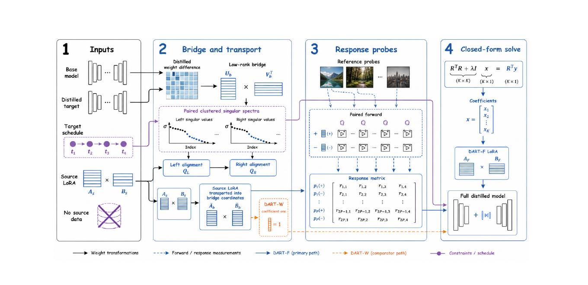
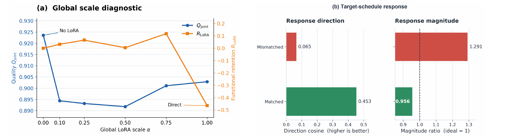
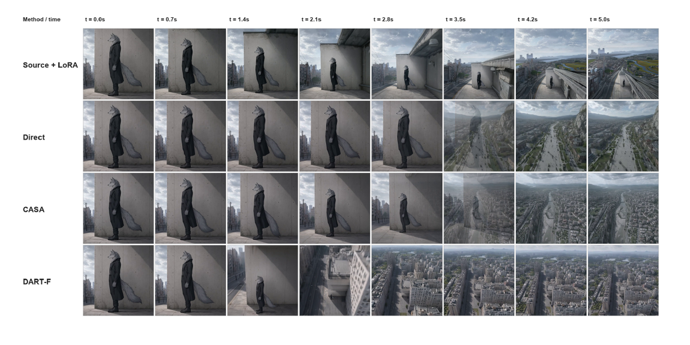
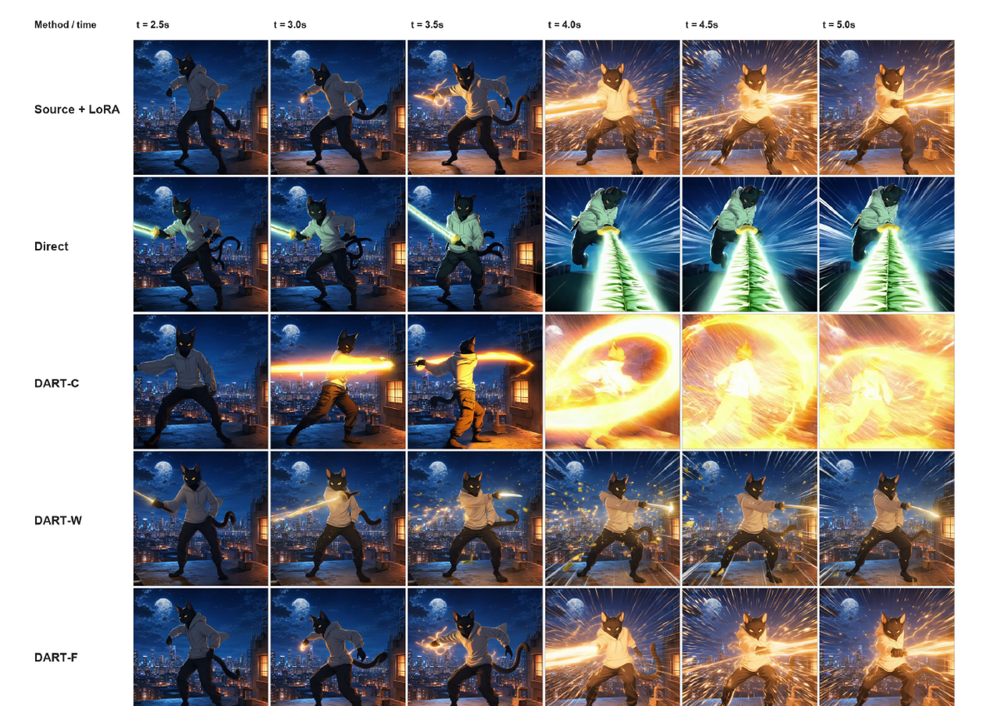
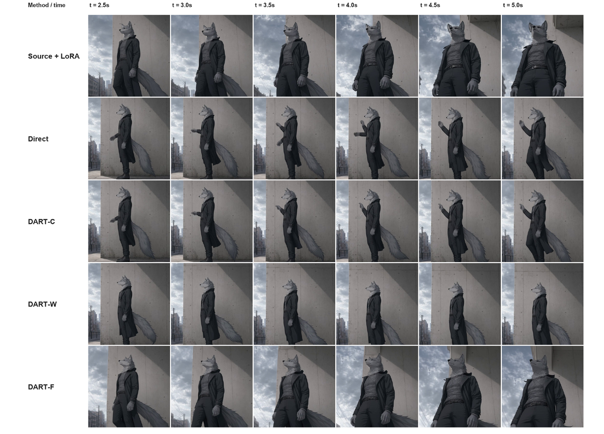

# DART: Distillation-Aware Reparameterization for Training-Free LoRA Reuse in Few-Step Video Diffusion Models

**论文**: [arXiv:2609.20051v1](https://arxiv.org/abs/2609.20051) (cs.AI, 2026-09-17, 24 页含附录)
**作者**: Shihong Li\*, Juntao Xu\*, Jin Cao, Maowen Tang, Jun Huang, Jintao Li — **电子科技大学 + 清华大学 + 哈尔滨工业大学 + 腾讯**（\* 共一）
**设定**: 源 = 40 步 **Wan2.2-I2V-A14B**，目标 = 它的一个 **4 步蒸馏版**（论文只写了"use bfloat16 inference and LightX2V"，**具体是哪个 checkpoint 没交代** `[待补]`）；图生视频（I2V）
**代码**: ⚠️ **未发布**（全文无任何代码或项目页链接）

---

## 1. 一句话定位

**把一个在 40 步 base 上训好的 LoRA，免训练地"改装"到 4 步蒸馏模型上继续用。** 做法分两步：先把 LoRA 旋转进一个"bridge"模型的奇异子空间坐标（coordinate transport），再把它拆成 32 个秩一通道，在目标调度的时间步上用成对前向量出每个通道的响应，最后用一个带恒等先验的岭回归解出每个通道的固定系数（response calibration）。整个转换不需要源训练视频，也不需要反传。

| 变体 | 坐标搬运 | 响应校准 | Qjoint ↑ | 功能保留率 `R_LoRA` ↑ |
|---|---|---|---|---|
| Direct（直接挂载） | ✗ | ✗ | 0.9029 | −0.4644 |
| CASA（前作） | — | — | 0.8918 | −0.6071 |
| DART-W | ✓ | ✗ | 0.8950 | −0.5347 |
| DART-C | ✗ | ✓ | 0.9200 | −0.2973 |
| **DART-F** | ✓ | ✓ | **0.9227** | **+0.1349** |
| *参照：目标不挂 LoRA* | — | — | *0.9236* | *0（按定义）* |

📌 **这篇最有价值的是它的评测协议和它自己在附录里交代的负面结果**，而不是头条数字。它明确区分了两件常被混为一谈的事："挂上 LoRA 后画质没坏"和"LoRA 的功能还在"，并且用有符号的指标记录"功能反向"。**直接把公开的 Wan2.2 LoRA 挂到 4 步蒸馏模型上，6 个里有 4 个的功能是反向的**（FGR < 0）——这本身就是一个对实际部署很有用的警示。

🔴 **但头条结论要收窄**（论文附录其实都给了数据）：
1. **质量提升完全来自一个 adapter。** 附录 E.1 原文：*"Excluding LoRA 01, the mean quality gain is −0.0006, compared with +0.0198 across all six adapters."* LoRA 01 的更新范数是 **52.29**，是其余 5 个（0.10–2.16）的 24–546 倍。
2. **"唯一正保留率"同样取决于 LoRA 01。** 按同一口径去掉 LoRA 01 重算，**CASA 变成 +0.0757，只做搬运的 DART-W 是 +0.1492，DART-F 是 +0.1656** —— 三者都为正，DART-F 对 DART-W 只多 0.016。逐 adapter 看，**DART-F 只在 6 个里的 2 个上最好**，在 LoRA 07 上是 5 个方法里最差的（见 [§5.3](#53-逐-adapter功能保留table-10)）。
3. **DART 实际上是逐通道的 0–1 门控，而且经常直接把 adapter 关掉。** 6 个 adapter 里 **3 个的 32 个系数全部接近 0**，所有系数都不超过 1。被关掉的那 3 个，DART-F 就等于"不挂 LoRA"—— Fig 2 里 DART-F 的上升镜头因此来自 prompt，而不是来自 adapter（见 [§5.7](#57-定性证据fig-2--3--6)）。

---

## 2. 问题与评测协议

**问题**：步数蒸馏改变了两样东西 —— 权重（`W_s → W_t`）和去噪轨迹（40 步 → 4 步）。一个为长轨迹训的 LoRA，在短轨迹上可能**失去原有效果**，也可能**破坏视频结构**。前作 CASA（Wang et al., 2026, [arXiv:2605.01929](https://arxiv.org/abs/2605.01929)）从权重空间解释这个问题：全模型与 LoRA 的更新大体保留奇异值，但奇异子空间内部的结构化旋转会造成"路由干扰"。

**本文的切入点**：静态的参数兼容性（权重几何）并不能决定 LoRA 在目标调度下**实际怎么起作用**。LoRA 的功能来自"参数更新 × 去噪器"在具体的 latent 状态、时间步、条件下的联合作用；蒸馏改变了这些条件。作者把"同一输入下，挂与不挂 adapter 时去噪器输出之差"称为 adapter 的 **incremental response**，并用它来指导迁移。

### 2.1 四锚点评测（Four anchors）

对 adapter `i` 设四个条件：

| 锚点 | 含义 |
|---|---|
| `A_i` | 源模型，不挂 LoRA |
| `B_i` | 源模型，挂原始 LoRA |
| `C_i` | 目标模型，不挂 LoRA |
| `D_{i,m}` | 目标模型，挂经方法 `m` 迁移后的 LoRA |

功能增益恢复率（论文 Eq. 1）：

$$
\mathrm{FGR}_{i,m} = \frac{\bar s(D_{i,m}) - \bar s(C_i)}{\bar s(B_i) - \bar s(A_i)}
$$

分母是 LoRA 在**源模型上**带来的功能增益，分子是迁移后的 LoRA 在**目标模型上**带来的增益；`s` 是按 adapter 选的功能代理分（LoRA 01 用风格相似度 CSD，LoRA 03–07 用 VideoMAE），**代理在看目标结果之前、只依据源锚点选定**。`s̄` 先在该 adapter 的全部评测样本上池化、再取比值（§3.1 写作 *"pools the eight prompts"*，§5.2 写作 *"pool the 88 prompt–image cases"*，指的是同一组 8 × 11 个样本）。宏平均（Eq. 9）：

$$
R_{\mathrm{LoRA}}(m) = \frac{1}{N}\sum_{i=1}^{N}\frac{\bar s(D_{i,m}) - \bar s(C_i)}{\bar s(B_i) - \bar s(A_i)}
$$

**读法**：`R = 1` 表示平均恢复了全部源增益；`0` 表示净增益为零；**负值表示迁移后的 LoRA 让目标模型在该代理分上变得比不挂还差** —— 即功能反向。

质量分（Eq. 8）：

$$
Q_{\mathrm{joint}}(m) = \tfrac{1}{2}\big(\mathrm{VBench\text{-}Q}(m) + \mathrm{I2V\text{-}Avg}(m)\big)
$$

`VBench-Q` 是 6 个质量维度的均值（Subject / Background Consistency、Temporal Flickering、Motion Smoothness、Aesthetic、Imaging），`I2V-Avg` 是 VBench-I2V 的两个维度（I2V-Subject、I2V-Background）的均值；**Dynamic Degree 被排除在外**。

📌 **这套协议的价值**：它把"画质"和"功能"拆成两个轴，并允许功能分为负。仓库里其它少步蒸馏论文几乎都只报画质类综合分。**它也暴露了一个结构性张力**（见 [§7](#7-争议与权衡)）：`Q_joint` 的 8 个维度里有 4 个是一致性类（Subject、Background、I2V-S、I2V-B），天然奖励"画面变化少"，另两个（Temporal Flickering、Motion Smoothness）对静止画面同样有利（[Recency Forcing](../recency_forcing/analysis.md) 的笔记里记录过"漂移成静止画面的视频会拿到很高的 smoothness / flickering / consistency"）；而 6 个 adapter 里 4 个（03 Fly、04 ArcShot、06 DroneShot、07 Turntable 360）的功能恰恰是**制造运动或运镜**。

### 2.2 探索性观察（§3）

- **目标不挂 LoRA 的质量均值 `Q_C = 0.9236`，直接挂载后 `Q_D = 0.9029`** —— 目标模型本身画质不差，是 LoRA 的挂载方式出了问题。
- **静态几何几乎不区分 adapter**：坐标缺陷（coordinate defect）在 2.635–2.652 ×10⁻³ 之间（约 0.27%），而直接挂载的 `Q_joint` 在 0.8045–0.9329、FGR 在 −1.2714 到 +0.3397 之间变化。⚠️ 但要注意：论文列的另两个"几何"指标 —— subspace alignment 0.999553、spectral alignment 0.999999658 —— **对 6 个 adapter 到第 9 位都完全相同**（Table 11），它们是模型对本身的性质，与 adapter 无关，**按构造就不可能区分 adapter**。真正随 adapter 变化的只有坐标缺陷一项。
- **全局缩放不是好出路**：缩到 `α = 0.75` 时保留率 0.1178，但质量掉到 0.9011（见 [§5.4](#54-全局缩放扫描table-12)）。
- **目标调度下的响应确实变了**：Table 3 里"branch mismatched"的 3 个观测，源-目标响应方向余弦只有 **0.0650**；"branch matched"的 9 个是 0.4529。⚠️ **"branch"一词在全文从未定义。** 结合附录 D 的 *"eight public LoRAs for the **high-noise branch** of Wan2.2-I2V-A14B"*，它最可能指 Wan2.2 A14B 的高噪 / 低噪双专家在源与目标调度下的路由是否一致 —— 这是我的推断 `[待补]`。

---

## 3. 与前作的关系

| 路线 | 代表 | 变换 / 匹配的对象 | 与 DART 的关系 |
|---|---|---|---|
| 权重空间迁移与合并 | TIES-Merging、KnOTS、**CASA** | 参数更新之间的干扰或兼容性 | DART 用坐标搬运提供"方向"，再用目标调度下的响应决定"权重" |
| 适配器重参数化 / 映射 | LoRA-X、X-Adapter | adapter 的因子或坐标，或新旧模型间的特征映射 | 论文承认"免训练跨模型迁移可行"不是自己的想法（LoRA-X 在先） |
| 函数空间对齐 | KD、FitNets、Trans-LoRA、LoRAHub | 模型输出 / 中间表示 / 少量样本上的行为 | DART 只匹配"adapter 引起的增量"，不要求目标模仿源的完整输出；LoRAHub 也是免梯度选系数，但粒度是"多个 LoRA 的组合权重" |

附录 F.4 的定位很克制：*"Our positioning is the specific combination of these choices, not a claim that coordinate alignment, response matching, or gradient-free fitting is individually new."* —— 贡献是**组合**，不是任何单个组件。

---

## 4. 方法

> **Fig 1 逐段解读**：
>
> **① Inputs** —— 四样输入：`Base model`、`Distilled target`、`Target schedule`（`t1 → t2 → t3 → t4`，紫色，即 4 个目标时间步）、`Source LoRA`（`A_s × B_s` 两个低秩因子）；最下方是被划掉的数据库图标 *No source data*。
>
> **② Bridge and transport** —— `Distilled weight difference`（蓝色热力图，即 `W_t − W_s`）→ `Low-rank bridge`（`U_b × V_bᵀ`，取蒸馏增量的低秩近似）；下面的紫色虚线框 *Paired clustered singular spectra* 画了左 / 右奇异值随 index 下降的曲线，颜色标出**奇异值相近的簇**；据此得到 `Left alignment Q_L` 与 `Right alignment Q_R`（簇内的正交旋转）。左下把 `A_s × B_s` 送进 *Source LoRA transported into bridge coordinates*，得到 `Ã_b × B̃_b`。橙色虚线分支 `DART-W` 标 *coefficient one "= 1"* —— 只搬运、不校准。
>
> **③ Response probes** —— 顶部三张 *Reference probes*（湖泊雪山、林间小路、城市街景）；*Paired forward* 两行，`+` 与 `−` 分别表示在 bridge 上加 / 减一个通道（`W_b ± εC_k`），在 4 个时间步上各做一次前向；汇总成 *Response matrix*，行是 `p1(+), p1(−), …, pP(+), pP(−)`，列是 4 个时间步。
>
> **④ Closed-form solve** —— 画的方程是 `(RᵀR + λI)x = Rᵀy`，解出系数 `x = [x1 … xK]`，组成 `DART-F LoRA`（`A_F × B_F`），挂到 `Full distilled model` 上。底部图例：黑实线 = 权重变换，蓝虚线 = 前向 / 响应测量，蓝实线 = DART-F 主路径，橙虚线 = DART-W 对照路径，紫色 = 约束 / 调度。
>
> ⚠️ **第 ④ 栏的方程与正文不一致**：图里是 `(RᵀR + λI)x = Rᵀy`，即**向 0 收缩**的普通岭回归；正文 Eq. 7 是 `(BᵀB + λI)⁻¹(Bᵀb + λa0)`，**向恒等 `a0 = 1` 收缩**。两者对"探针看不见的通道"给出相反的结果（前者归零，后者保持 1）。Table 14 里有 11–12 个通道恰好停在 1.0000，说明实现应以 Eq. 7 为准。图中记号（`Q_L / Q_R`、`x`、`R`、`y`、`K`）也与正文（`Q_U / Q_V`、`a`、`B_d`、`b_d`、`r_c`）不统一。

### 4.1 Bridge 与坐标搬运

只取蒸馏增量的一个低秩部分来做对齐（论文 Eq. 2）：

$$
W_b = W_s + \Pi_{r_b}(W_t - W_s),\qquad R = W_t - W_b
$$

`Π_{r_b}` 是秩 `r_b` 近似，`R` 是剩余漂移。**bridge 只用于对齐和测响应，部署用的是真正的 `W_t`**，所以 `R` 的影响一直存在（附录 B.7 给出了它与校准更新的交叉二阶项）。

在"聚类奇异子空间"里做分块正交 Procrustes 对齐，得到左右映射，搬运后的 adapter 为（Eq. 3 / 13）：

$$
\tilde C = P_U\, C\, P_V^{\top},\qquad P_U = U_b\, Q_U\, U_s^{\top},\qquad P_V = V_b\, Q_V\, V_s^{\top}
$$

**命题 1**：若 `P_U`、`P_V` 在 `C` 占据的行列空间上是等距映射，则 `C̃` 与 `C` 的秩、非零奇异值、Frobenius 范数都相同。论文紧接着强调：*"These invariants do not imply preservation of the generated adapter effect."* —— 搬运保"能量"，不保"效果"。

bridge 构造、模型权重 SVD、聚类、映射构造**对一个模型对只需做一次**（96 分钟），之后每个 adapter 复用。

### 4.2 通道与响应测量

把 `C̃` 拆成 `r_c` 个固定的秩一矩阵，每个通道一个系数（Eq. 4）：

$$
C_t(a) = \sum_{k=1}^{r_c} a_k C_k,\qquad C_t(a_0) = \tilde C,\qquad a_0 = \mathbf{1}
$$

实验里 `r_c = 32`（论文正文没写，是从 Table 14 的 *Channels 32* 读出的）。在 bridge 上、按目标时间步 `τ_j` 定义某个更新 `A` 的响应（Eq. 5）：

$$
\mathcal{R}_{t,j}(A;\,x) = f_{t,j}(W_b + A;\,x) - f_{t,j}(W_b;\,x)
$$

每个通道用中心差分估计局部响应（附录 Eq. 18），误差为 `O(ε²)`：

$$
\hat g_{d,j,k}(x) = \frac{f_{t,j}(W_b + \epsilon C_k;\,x) - f_{t,j}(W_b - \epsilon C_k;\,x)}{2\epsilon}
$$

把所有探针、所有时间步堆起来得到线性测量算子 `Ĝ_d`，它的秩称为 **schedule-visible rank** `r_vis`。**校准只能识别探针"看得见"的通道组合**；由秩-零化度定理，`r_c = r_vis + dim Null(Ĝ_d)`。

### 4.3 响应校准：一个带恒等先验的岭回归

正文把目标写成紧凑形式（Eq. 6），附录 B.4 展开为四项（Eq. 23；为避免与 LoRA 记号 `A`、`C` 混淆，我把论文里的"步均值算子 A"和"步偏差算子 C"改记为 `𝒜` 与 `𝒞`）：

$$
\mathcal{L}_d(a) = \big\lVert P_s^{\perp}\,\mathcal{A} G_d\, a \big\rVert_2^2 + \lambda_{\mathrm{mag}}\big(u_s^{\top}\mathcal{A} G_d\, a - \rho\,\lVert e_s\rVert_2\big)^2 + \lambda_{\mathrm{step}}\big\lVert \mathcal{C} G_d\, a \big\rVert_2^2 + \lambda_{\mathrm{id}}\,\lVert a - a_0\rVert_2^2
$$

| 项 | 作用 |
|---|---|
| 方向项 | 目标的**步均值响应**在源响应方向 `u_s = e_s/‖e_s‖` 之外的分量要小 |
| 幅度项 | 沿源方向的投影要等于 `ρ` 倍源响应幅度 |
| 步分配项 | 各个目标步的响应偏离步均值的部分要小 —— **即要求 adapter 在 4 个步上的作用尽量均匀** |
| 恒等项 | 系数不要离 `a0 = 1` 太远 |

闭式解（Eq. 7），正定，无需对去噪器反传：

$$
a_d^{\star} = \big(B_d^{\top} B_d + \lambda_{\mathrm{id}} I\big)^{-1}\big(B_d^{\top} b_d + \lambda_{\mathrm{id}}\, a_0\big)
$$

**命题 2**：`λ_id > 0` 时，最优修正 `a⋆ − a0` 在 `Ĝ_d` 零空间上的投影为 0（看不见的通道保持恒等）；若期望描述子不在 `B_d a0` 张成的方向上，任何单一全局缩放的描述子误差都严格为正（全局缩放够不到"改方向"）。

🔴 **这个目标函数有一个论文没点破的结构性倾向 —— 压向 0。** 方向项和步分配项**在 `a = 0` 时都恰好为 0**；只有幅度项（`ρ > 0` 时）与恒等项在阻止系数塌向 0。于是当某个 adapter 在目标调度下的响应方向与源方向几乎正交时（Table 3 里 mismatched 组余弦只有 0.065），想沿源方向凑出足够的投影就必须产生大量正交分量、被方向项重罚 —— 最优解会把系数整体压小。**Table 14 里 3 个 adapter 的 32 个系数全部接近 0，正是这个倾向的结果**，论文把它叫作 *"strong attenuation and mitigation of incompatible transfer"*。

⚠️ **步分配项的目标是"完全均匀"**：这等于假设一个 LoRA 在每个去噪步上的作用应当一样大。而风格类与运动类 adapter 通常在不同噪声段起作用（本文的 LoRA 本身就只作用于 high-noise 分支）。这个假设论文没有论证。

⚠️ **全部超参数都没给**：`r_b`、`ε`、`λ_mag`、`λ_step`、`λ_id`、`ρ`、步权重 `ω_j`，以及 4 个探针的 latent 状态从哪来、改了哪些层 —— 全文均未交代 `[待补]`。

**三个变体**：DART-W 只搬运（`a = a0`）；DART-C 不搬运、在原始通道坐标里直接校准；DART-F 两者都做。

---

## 5. 实验

### 5.1 设置

| 项 | 值 |
|---|---|
| 源 → 目标 | 40 步 Wan2.2-I2V-A14B → 4 步蒸馏目标（checkpoint 未指明 `[待补]`），bf16，LightX2V 推理 |
| LoRA | 8 个**公开** LoRA，**全部只作用于 Wan2.2-I2V-A14B 的 high-noise 分支**；因源侧功能增益接近 0（FGR 分母不稳）剔除 LoRA 02 KungFu 与 08 Paw Pose，**保留 6 个** |
| 评测规模 | 每个 adapter 8 个 prompt × 11 张首帧参考图 = **88 条视频 / 方法**；5 个方法 × 6 个 adapter = 2,640 条（不含源与不挂 LoRA 的锚点） |
| 视频规格 | 640×640，129 帧，16 fps |
| 校准探针 | **4 个**。原文 *"these probes are distinct from the 88-video evaluation count"* 只说明不计入这 88 条；**探针用的 prompt / 首帧是否与评测样本重叠没有交代** `[待补]` —— 若重叠，校准就是在测试分布上拟合的 |
| 质量指标 | VBench 6 个质量维度 + VBench-I2V 2 个维度；**排除 Dynamic Degree** |
| 功能指标 | FGR / `R_LoRA`，代理：LoRA 01 用 CSD，LoRA 03–07 用 VideoMAE |
| 种子 | ⚠️ 未做重复种子评测；Limitations 自陈 *"Robustness to probe count and repeated seeds remains unestablished"*、*"repeated-seed evaluation remain future work"* |
| 硬件 | ⚠️ 未写 GPU 型号（只报了峰值显存） |
| 代码 | ⚠️ 未发布 |

**6 个保留的 adapter**（附录 Table 7）：

| ID | 名称 | 功能 | 类型 |
|---|---|---|---|
| 01 | City the Animation | 弹性 2D 动画与次级运动 | 风格 |
| 03 | Fly | 起飞、悬停、俯冲、快速飞行 | 主体运动 |
| 04 | ArcShot | 带视差的弧线 / 环绕运镜 | 运镜 |
| 05 | Anime Lore | 赛璐璐外观、动漫光效、风格化动作特效 | 风格 |
| 06 | DroneShot | 上升、后退、俯视、下降、大范围航拍运镜 | 运镜 |
| 07 | Turntable 360 | 机位基本固定、主体自转 | 主体运动 |

### 5.2 主结果（Table 1 与 Table 5）

| 方法 | Qjoint ↑ | `R_LoRA` ↑ | VBench-Q ↑ | I2V-Avg ↑ |
|---|---|---|---|---|
| Direct | 0.9029 | −0.4644 | 0.8502 | 0.9556 |
| CASA | 0.8918 | −0.6071 | 0.8467 | 0.9369 |
| DART-W | 0.8950 | −0.5347 | 0.8465 | 0.9436 |
| DART-C | 0.9200 | −0.2973 | 0.8697 | 0.9702 |
| **DART-F** | **0.9227** | **+0.1349** | **0.8732** | **0.9721** |

**8 个维度的明细**（Table 5）：

| 方法 | Subj. | Bkg. | Flicker | Smooth | Aesthetic | Imaging | I2V-S | I2V-B |
|---|---|---|---|---|---|---|---|---|
| Direct | 0.8766 | 0.9218 | 0.9779 | 0.9872 | 0.6713 | 0.6666 | 0.9532 | 0.9580 |
| CASA | 0.8634 | 0.9153 | 0.9839 | 0.9909 | 0.6315 | 0.6955 | 0.9328 | 0.9409 |
| DART-W | 0.8640 | 0.9144 | 0.9844 | 0.9916 | 0.6375 | 0.6871 | 0.9396 | 0.9476 |
| DART-C | 0.9148 | 0.9393 | **0.9862** | 0.9916 | 0.6885 | **0.6978** | 0.9692 | 0.9713 |
| **DART-F** | **0.9247** | **0.9469** | **0.9862** | **0.9917** | **0.6932** | 0.6964 | **0.9718** | **0.9724** |

论文的读法："DART-F 在 7 个维度第一、Imaging 第二"——我逐格核对属实（Flicker 与 DART-C 并列）。**组件消融**（附录 Table 6）：校准贡献了大部分质量增益（DART-C 比 Direct +0.0171）；只搬运反而降质（DART-W −0.0079）；两者叠加再 +0.0027。

📌 **DART-F 相对 Direct 最大的单维增益是 Subject Consistency（+0.0481）**，其次是 Imaging（+0.0298）、Background（+0.0251）、Aesthetic（+0.0219）。一致性类维度的增益与"adapter 被衰减、画面变化变少"是同一方向（见 [§7](#7-争议与权衡)）；但因为聚合被 LoRA 01 主导（下一节），逐维的聚合增益无法干净归因。

### 5.3 逐 adapter：功能保留（Table 10）

| Adapter | Direct | CASA | DART-W | DART-C | DART-F |
|---|---|---|---|---|---|
| 01 City the Animation（CSD） | −1.2714 | **−4.0210** | **−3.9538** | −0.0043 | −0.0187 |
| 03 Fly | −0.5381 | −0.6924 | −0.5015 | −0.8025 | **−0.2578** |
| 04 ArcShot | −0.8459 | +0.3910 | +0.4910 | −0.8104 | **+0.5377** |
| 05 Anime Lore | +0.3004 | +0.4249 | **+0.5474** | +0.3467 | +0.5229 |
| 06 DroneShot | −0.7712 | −0.1317 | **−0.1266** | −0.8760 | −0.2527 |
| 07 Turntable 360 | +0.3397 | **+0.3866** | +0.3355 | +0.3629 | +0.2780 |
| **宏平均（6 个）** | −0.4644 | −0.6071 | −0.5347 | −0.2973 | **+0.1349** |
| **宏平均（去掉 LoRA 01，我算）** | −0.3030 | **+0.0757** | **+0.1492** | −0.3559 | +0.1656 |

（加粗为每行最优。）

🔴 **这张表支撑不了"DART-F 是唯一正保留率"这句话的一般性。** 6 个 adapter 的宏平均里，CASA 和 DART-W 被 LoRA 01 上的 −4.02 / −3.95 拖成了负数；**论文自己在附录 E.1 就用"去掉 LoRA 01"来检验质量增益**，按同一口径重算，三种带搬运的方法都为正，只搬运、不校准的 DART-W（+0.1492）与 DART-F（+0.1656）只差 0.016。

**逐 adapter 看**：DART-F 只在 03 和 04 上最好；05 上输给 DART-W，06 上输给 DART-W 和 CASA，**07 上是 5 个方法里最差的**（+0.2780，比直接挂载的 +0.3397 还低）。论文的 §5.4 如实写了 *"LoRAs 01, 03, and 06 remain negative"*、*"Positive macro retention therefore coexists with adapter-specific failures"*。

📌 **LoRA 04 是全文最有力的一个例子**：只校准（DART-C）的 −0.8104 几乎等于直接挂载的 −0.8459，只搬运（DART-W）就拉到了 +0.4910，两者叠加 +0.5377。**对这个 adapter，坐标搬运是必要的** —— 这是"搬运 + 校准互补"最干净的证据。

### 5.4 全局缩放扫描（Table 12）

| `α` | 0（不挂 LoRA） | 0.10 | 0.25 | 0.50 | 0.75 | 1.00（Direct） |
|---|---|---|---|---|---|---|
| 平均 Qjoint | **0.9236** | 0.8944 | 0.8932 | 0.8918 | 0.9011 | 0.9029 |
| `R_LoRA` | 0 | 0.0321 | 0.0657 | 0.0044 | **0.1178** | −0.4644 |

> **Fig 4 逐面板解读**：
>
> **(a) Global scale diagnostic** —— 横轴是全局 LoRA 缩放 `α`，蓝线（左轴）是 Qjoint，橙线（右轴）是 `R_LoRA`。蓝线从 `α = 0`（标注 *No LoRA*，0.924）**断崖式跌到 `α = 0.10` 的 0.894**，在 0.25、0.50 继续微降，然后在 0.75、1.00 回升；橙线在 0–0.75 间小幅波动（0.004–0.118），到 `α = 1`（标注 *Direct*）骤降到 −0.46。
>
> **(b) Target-schedule response** —— 左边是方向余弦（越高越好）：*Mismatched* 0.065（红），*Matched* 0.453（绿）；右边是幅度比（理想为 1，虚线）：Mismatched 1.291，Matched 0.956。
>
> ⚠️ **(a) 里的质量曲线不合常理，论文没有解释**：缩放越小本应越接近"不挂 LoRA"，但 `α = 0.1` 的质量反而比 `α = 1` 低 0.0085，**所有非零缩放里质量最好的恰恰是 `α = 1`**。我用 Table 4 的逐 adapter 数据做了个约束检验：从 `α = 0` 到 `0.1`，6 个 adapter 的平均质量掉了 0.029，总降幅需要 0.175；即便 LoRA 01 在 `α = 0.1` 时和直接挂载一样差（0.8045），也只贡献 0.12 —— **只靠 LoRA 01 解释不了这个断崖**。另外 `α = 0` 这一行取自四锚点评测（Table 9），不是扫描中的同一批运行。要么缩放的实现有问题，要么 Qjoint 本身噪声就有这么大 —— 两种情况都会削弱"DART-F 优于最佳全局缩放"的比较。
>
> ⚠️ **(b) 的幅度结论取决于怎么聚合**：mismatched 组的幅度比均值是 1.2912（> 1，论文据此说目标响应"更大"），但同表（Table 13）的范数列是目标 68.70、源 95.19，按均值之比只有 **0.72（< 1）**。只有 3 个观测，两种聚合给出相反的方向。

**DART-F 与全局缩放比**：`α = 0.75` 的保留率（0.1178）与 DART-F（0.1349）相当，但质量低 0.0216；而 `α = 0`（不挂 LoRA）的质量（0.9236）略高于 DART-F（0.9227）。**所以在测过的点里，没有哪个全局缩放同时在两个轴上胜过 DART-F** —— 这个结论成立，但前提是上面那条质量曲线可信。

### 5.5 两个附加目标（Table 2）

| 目标模型 | 方法 | Qjoint ↑ | `R_LoRA` ↑ |
|---|---|---|---|
| HunyuanVideo 1.5 | Direct | 0.8778 | −0.4372 |
| | CASA | 0.8897 | −0.2447 |
| | DART | **0.9014** | **+0.0771** |
| CausalWan2.2-I2V-A14B | Direct | 0.8976 | −0.4186 |
| | CASA | 0.9026 | −0.1843 |
| | DART | **0.9117** | **+0.1286** |

趋势与主设定一致。⚠️ **但这张表几乎没有上下文**：源模型是什么、用了哪些 / 多少个 LoRA、目标是哪个蒸馏版本、"DART"指哪个变体、目标不挂 LoRA 的质量是多少、逐 adapter 结果 —— 全都没写；**HunyuanVideo 1.5 与 CausalWan2.2-I2V-A14B 在参考文献里也没有条目** `[待补]`。没有不挂 LoRA 的锚点，就无法判断这里的 DART 是否同样只是在逼近"不挂"。

### 5.6 系数长什么样（Table 14）

| Adapter | 均值 | 范围 | 近 0（\|a\| < 0.05） | 近 1（\|a−1\| < 0.05） | ΔFGR（DART-F − Direct） |
|---|---|---|---|---|---|
| 01 | −0.0004 | [−0.0227, 0.0172] | **32** | 0 | +1.2527 |
| 03 | −0.0000 | [−0.0008, 0.0006] | **32** | 0 | +0.2803 |
| 04 | 0.4687 | [−0.0012, 1.0000] | 7 | 12 | +1.3836 |
| 05 | 0.4579 | [−0.0014, 1.0000] | 9 | 11 | +0.2225 |
| 06 | −0.0002 | [−0.0032, 0.0023] | **32** | 0 | +0.5185 |
| 07 | 0.4346 | [−0.0006, 1.0000] | 8 | 11 | −0.0617 |

📌 **三条读法**：
1. **没有任何系数大于 1**。DART 在这 6 个 adapter 上**从未放大过任何通道**，实际行为是逐通道的 0–1 门控。
2. **3 个 adapter 被整体关掉**（32 个系数全在 ±0.023 以内）。它们的"质量恢复"与"负迁移缓解"，本质上就是不挂这个 LoRA。论文的措辞是 *"consistent with strong attenuation and mitigation of incompatible transfer. They do not establish that the suppressed adapters retain their intended function."* —— 表述是诚实的。
3. **另 3 个 adapter 各有 11–12 个通道恰好停在 1.0000**。最可能的解释是命题 2：探针"看不见"的通道按构造保持恒等 —— 即这三个 adapter 大约三分之一的通道**根本没有被校准**。论文没有报告每个 adapter 的 `r_vis` `[待补]`。

📌 **由此能反推一个噪声地板（我的推断）**：若通道取的是 `C̃` 的奇异分量（论文没说明，但"固定秩一矩阵"最自然的取法就是这个），残余更新的 Frobenius 范数不超过 `max|a| · ‖C‖_F`。**LoRA 03 只有约 9×10⁻⁵** —— 比 6 个 adapter 里最小的完整更新（LoRA 07 的 0.0957）还小三个数量级，DART-F 在它上面应与"不挂 LoRA"几乎相同、FGR 应≈0。**实际 FGR 却是 −0.2578，Qjoint 比不挂 LoRA 低 0.0048。**（LoRA 06 的残余约 7×10⁻³、只比最小完整更新小 15 倍，是较弱的同向证据：FGR −0.2527。）一个"数值上近乎为零"的 adapter 能测出 −0.26 的 FGR，说明这个指标的运行间噪声（或 LoRA 加载路径带来的系统偏差）至少有这个量级 —— 而 Table 10 里很多方法间的差距（例如 LoRA 05 上 DART-W 0.5474 vs DART-F 0.5229）都小于它。

⚠️ 小瑕疵：Table 14 里 LoRA 05 / 07 的 Deviation 写成 `0.722507`、`0.832800`，LoRA 07 的均值写成 `0.434578`（6 位小数），其余是 4 位。

### 5.7 定性证据（Fig 2 / 3 / 6）

> **Fig 2 逐行对比**（LoRA 06 DroneShot，航拍上升运镜；8 列为 0.0–5.0 s；prompt：*"The drone shot starts with the main subject in the first frame and gradually ascends upwards, with a smooth and natural transition"*）：
>
> - **Source + LoRA** —— 狼头人身、穿黑色长大衣的角色站在混凝土墙边；镜头从 1.4 s 开始平稳上升，2.1–2.8 s 越过墙顶，3.5–5.0 s 变成城市与高架的鸟瞰，**角色一直以小人的形式留在屋顶上**。
> - **Direct / CASA** —— 0–2.8 s 几乎不动，**3.5 s 突然切到河谷鸟瞰，并残留一个半透明的人形"鬼影"**，之后是与起始场景无关的航拍。
> - **DART-F** —— 0.7 s 后开始变化，**2.1 s 就已是俯拍楼顶，2.8 s 起变成城市鸟瞰，角色从画面中消失**。
>
> 🔴 **这张图作为"功能保留"的证据有问题**：按 Table 14，**DART-F 在 LoRA 06 上 32 个系数的绝对值全部 ≤ 0.0032**，它基本就是"不挂 LoRA 的目标模型"。所以 DART-F 那一行的上升镜头**来自 prompt 本身**，而不是 adapter —— 图里恰好没有放"目标不挂 LoRA"这一行来对照。另外 DART-F 的上升比源模型快、且丢了主体。论文的注脚是 *"This example is descriptive, and the illustrated behavior does not override the negative primary FGR and quality decline for LoRA 06"*，但它仍被放在正文、标为 *"Representative effect comparison"*。

> **Fig 3 逐行对比**（LoRA 05 Anime Lore；6 列为 2.5–5.0 s；prompt：拔剑一挥，刀刃拖出能量光、风卷落叶、身后是汇聚的动漫速度线）：
>
> - **Source + LoRA** —— 夜景屋顶上穿白色连帽衫的黑猫角色，3.0–3.5 s 起剑、4.0–5.0 s 金色能量与放射状速度线铺满画面。
> - **Direct** —— 一开始就是一把过长的绿色光剑，4.0 s 起角色被抬离画面、脚下是巨大的绿色能量柱 —— 特效方向对，但形态和构图都错了。
> - **DART-C** —— 3.0 s 起能量被**过度放大**，4.0–5.0 s 变成吞没整个画面的黄色光环，角色几乎看不见。
> - **DART-W** —— 刀光局部化，只有零星的金色粒子与较弱的速度线。
> - **DART-F** —— 与 Source + LoRA **几乎逐帧一致**：同样的起剑动作、能量拖尾和 4.0–5.0 s 的速度线。
>
> 📌 **这是一个真正的正例**：LoRA 05 的系数有 9 个归零、11 个保持 1、其余居中（Table 14），FGR +0.5229。它也说明"只校准"（DART-C）会把效果调过头，搬运后再校准才稳。

> **Fig 6 逐行对比**（LoRA 04 ArcShot；6 列为 2.5–5.0 s；prompt：*"arc shot, the camera arcs low around the subject … looking upward for a heroic angle"*）：
>
> - **Source + LoRA** —— 低机位仰拍，天空占据画面上半，镜头随时间绕到角色正面下方，5.0 s 形成"英雄视角"。
> - **Direct / DART-C** —— 始终是**侧面平视**，镜头几乎不动，角色只做了抬手的动作 —— 运镜功能完全没有出来（FGR −0.8459 / −0.8104）。
> - **DART-W** —— 仍是侧面，只有轻微的机位漂移 —— 恢复了一部分（+0.4910）。
> - **DART-F** —— **低机位仰拍、天空入画**，与 Source + LoRA 的构图和走向最接近（+0.5377）。
>
> 📌 与 [§5.3](#53-逐-adapter功能保留table-10) 的 LoRA 04 数字一致：**搬运是这个 adapter 的必要条件**。

### 5.8 转换成本（Table 15）

| 方法 | 前向次数 / LoRA | 总耗时（分钟） | 扣除共享预处理后（分钟） | 峰值显存（GiB） |
|---|---|---|---|---|
| Direct | 0 | < 0.1 | < 0.1 | 0.00 |
| DART-W | 0 | 165.0 | 69.0 | 1.94 |
| DART-C | 528 | 158.0 | 62.0 | **80.71** |
| DART-F | 528 | 226.5 | 130.5 | 79.91 |

（总耗时含 96 分钟的模型对共享预处理；`N` 个 LoRA 的 DART-F 总成本 = `96 + 130.5N` 分钟。）

⚠️ **"免训练"不等于便宜**：DART-F 每个 adapter 要 **130.5 分钟 + 528 次 14B 前向**。**DART-C 的峰值显存 80.71 GiB 已超过一张 80 GB A100 / H100 的总容量（80 GiB），DART-F 的 79.91 GiB 也贴着上限**，论文又没写用的是什么 GPU `[待补]`。只做坐标搬运、0 次前向的 DART-W 每个 adapter 也要 69 分钟，原因未说明。528 次前向如何构成（32 通道 × ±ε × 4 探针 × 若干时间步）也没有给出 `[待补]`。

---

## 6. 数字核对

**核对通过的**（我逐项复算）：

| 项 | 结果 |
|---|---|
| Table 1：`Qjoint = (VBench-Q + I2V-Avg)/2`，5 个方法 | 全部 ✅（在两位小数舍入内） |
| Table 5 → Table 1：VBench-Q = 6 维均值、I2V-Avg = 2 维均值，5 个方法 | 全部 ✅；"DART-F 7 维第一、Imaging 第二"✅ |
| Table 4：`Q_C` 均值 0.9236、`Q_D` 0.9029、ΔQ −0.0207、Direct FGR −0.4644、坐标缺陷极差 0.017 | 全部 ✅ |
| Table 8：6 个 Qjoint 增益、均值 +0.0198、去掉 LoRA 01 后 −0.0006 | 全部 ✅（我算 −0.00056） |
| Table 10：5 个方法的宏平均 | 全部 ✅ |
| Table 13："All"行 = 两组按样本数加权（余弦、幅度比、两列范数） | 全部 ✅ |
| Table 14：6 个 ΔFGR | 全部 ✅ |
| Table 15：扣除共享预处理 = 总耗时 − 96 | 3 / 3 ✅ |
| 正文：DART-C +0.0171、DART-W −0.0079、叠加再 +0.0027、DART-F +0.0198 | 全部 ✅ |

**对不上或有问题的**：

1. 🔴 **Fig 1 的闭式解与 Eq. 7 不一致**：图里向 0 收缩，正文向恒等 `a0 = 1` 收缩（见 [§4](#4-方法)）。
2. 🔴 **全局缩放扫描的质量曲线不单调且无解释**，`α = 0` 行也不是同一批运行（见 [§5.4](#54-全局缩放扫描table-12)）。
3. ⚠️ **"branch"全文未定义**，而 Table 3 / 13 与 §3.4 的核心诊断就建立在它之上。
4. ⚠️ **三个"静态几何"指标里两个对 6 个 adapter 完全相同**（模型对常数），不能作为"几何相似、结果不同"的证据。
5. ⚠️ **Table 13 的幅度方向取决于聚合方式**（均值比 1.29 vs 范数比 0.72，n = 3）。
6. ⚠️ **附加目标（Table 2）缺少源模型、LoRA、目标版本、变体与不挂 LoRA 的锚点**，HunyuanVideo 1.5、CausalWan2.2-I2V-A14B、LightX2V 在参考文献里都没有条目。
7. ⚠️ Fig 1 的记号与正文不统一；Table 14 小数位数不统一。

---

## 7. 争议与权衡

**站得住的**：

- 📌 **四锚点 + 有符号 FGR 的评测协议是这篇最好的部分。** 它逼着读者分开看"画质没坏"和"功能还在"，并且记录"功能反向"。仓库里的少步蒸馏论文几乎都只报画质综合分。
- 📌 **一个对部署很有用的负面结果**：把公开的 Wan2.2 LoRA 直接挂到 4 步蒸馏目标上，**6 个里 4 个功能反向**（Direct FGR 在 −1.27 到 −0.54 之间）。只看画质会漏掉这件事 —— 这 4 个里有 3 个的 Direct 质量几乎没掉（LoRA 03 / 04 / 06 的 ΔQ 分别是 −0.0070 / −0.0027 / +0.0205）。
- 📌 **LoRA 04 给出了"搬运必要"的干净证据**，Fig 3 与 Fig 6 是真正的正例。
- 📌 **校准是闭式解、无需反传**；命题 2（全局缩放改不了方向、看不见的通道保持恒等）推导正确。
- 📌 **写得非常克制**：大量 *"does not establish"*，Limitations 自陈三个 adapter 没有正保留、一个 adapter 主导质量增益、种子与探针数的鲁棒性未验证；附录 E.1 主动给出"去掉 LoRA 01"的检验。论文末尾也声明使用了语言模型辅助写作与表格整理。

**需要打折的**：

- 🔴 **头条质量增益 = LoRA 01**（论文附录自认）；**"唯一正保留率" = LoRA 01 把基线拖负**，去掉后 CASA 与 DART-W 都为正（§5.3）。而 LoRA 01 的更新范数是其余的 24–546 倍，本身就是个离群样本。
- 🔴 **DART 实际上是 0–1 门控，3 / 6 的 adapter 被直接关掉**，并且这是目标函数的结构性倾向（方向项与步分配项在 `a = 0` 处为 0）。被关掉的 adapter 自然"质量恢复、负迁移消失"，但功能也没了。
- 🔴 **质量指标与运动类 adapter 的功能存在结构性张力**：`Q_joint` 排除了 Dynamic Degree、包含 4 个一致性维度，而 6 个 adapter 里 4 个是运动 / 运镜类。**衰减这类 adapter 会同时抬高质量分** —— 对它们来说，"质量升"与"功能降"部分是同一件事。📌 仓库里 [RAVEN](../raven/analysis.md) 因 VBench 的 Dynamic Degree 会把镜头抖动算成运动而弃用它、改用 reward model 打分；[ViRDM](../virdm/analysis.md) 反过来直接优化它的判定规则；本篇则干脆排除 —— 三种处理，各有代价。
- ⚠️ **缺关键基线**：没有"按探针响应决定是否丢弃 adapter"的门控基线（DART 在 3 个 adapter 上做的正是这件事）、没有逐 adapter 选缩放系数、也没有"在目标上重训 LoRA"作为上界与成本参照。唯一的对照是"所有 adapter 用同一个 `α`"。
- ⚠️ **噪声量级接近很多方法间的差距**：一个数值上近乎为零的 adapter 就能测出 −0.26 的 FGR（§5.6），而全文没有重复种子评测、只有 4 个探针。
- ⚠️ **步分配项要求 adapter 在各步作用均匀**，这个假设没有论证。
- ⚠️ **不可复现**：没有代码、没有任何超参数、4 步目标是哪个 checkpoint 都没写。
- ⚠️ **"免训练"不便宜**：每个 adapter 130.5 分钟 + 528 次 14B 前向，外加 96 分钟模型对预处理，峰值显存约 80 GiB。
- ⚠️ **bridge 与部署之间的误差只给了表达式（附录 B.7），没有测过**：响应是在 `W_b` 上测的，部署在 `W_t = W_b + R` 上。

---

## 8. 一句话总结

**DART 要解决的是"步数蒸馏之后，原来在 40 步 base 上训的 LoRA 还能不能用"：先把 LoRA 旋转进蒸馏增量低秩近似所定义的 bridge 的奇异子空间，再拆成 32 个秩一通道，在 4 步目标的时间步上用成对前向量出每个通道的响应，最后用一个带恒等先验、按"方向 / 幅度 / 步间均匀"三类描述子加权的岭回归闭式地解出通道系数 —— 不需要源数据、不需要反传。** 它最有价值的是评测协议：四个锚点把"画质"和"功能"拆开，有符号的 FGR 记录功能反向，由此暴露出**把公开的 Wan2.2 LoRA 直接挂到 4 步蒸馏模型上，6 个里 4 个功能是反向的**，而其中 3 个的画质几乎没掉。🔴 **但头条数字要收窄**：Qjoint 0.9029 → 0.9227 的提升**完全来自 LoRA 01**（附录自认，去掉后为 −0.0006），这个 adapter 的更新范数是其余的 24–546 倍；**"唯一正保留率"同样由 LoRA 01 决定**，按同一口径去掉它，CASA（+0.076）和只做搬运的 DART-W（+0.149）都为正，与 DART-F（+0.166）相差无几，逐 adapter 看 DART-F 只在 2 / 6 上最好。**系数表显示 DART 实际上是 0–1 门控**：从不放大任何通道，3 个 adapter 的 32 个系数全被压到 0 —— 这是目标函数的结构性倾向（方向项与步分配项在 `a = 0` 处为零）；因此 Fig 2 里 DART-F 的上升镜头来自 prompt 而不是 adapter。再加上质量分排除 Dynamic Degree、偏向一致性，天然奖励"把运动类 adapter 调弱"。📌 **最干净的正面证据是 LoRA 04**：只校准时功能仍反向（−0.81），只搬运就转正（+0.49），两者叠加 +0.54 —— 坐标搬运对它是必要的。无代码、无超参数、无重复种子评测，目标 checkpoint 未指明。

---

## 9. 在仓库图谱里的位置

| | 关系 |
|---|---|
| **[Avatar-Forever](../avatar_forever/analysis.md)** | 🔴 **同一个问题的正反两个数据点**。Avatar-Forever 的部署就是 `θ★ = θ0 + Δθ_DMD + Δθ_RRT` —— 一个**在 base 上训的 LoRA 直接叠到 DMD 学生上**，而且有效（FID 39.5 → 35.0）；本篇则报告公开的风格 / 运动 LoRA 直接叠到 4 步蒸馏模型上，**6 个里 4 个功能反向**。两处的差别可能在 LoRA 的性质（Avatar-Forever 的是"恢复 / 稳定"类、与 DMD 分支同源于 `θ0`，用 FID / FVD 衡量；本篇的是风格与运动类，用功能代理衡量），**两篇都没有解释"何时直接叠加可行"**。反过来，本篇的通道校准正好可以用来回答 Avatar-Forever 没测过的"合并系数"问题 |
| **[LongLive 2.0](../longlive2/analysis.md)** | 📌 **"蒸馏增量本身就是低秩"的现成例子**：LongLive 2.0 的少步能力是一个 rank-128 的 DMD-LoRA 旁路。本篇的 bridge 取的正是蒸馏增量 `W_t − W_s` 的秩 `r_b` 近似 —— 若目标恰好是"base + 一个蒸馏 LoRA"，`r_b` 不小于该秩时 bridge 能精确还原增量、剩余漂移 `R = 0`。这种形式并不罕见：本篇用的推理框架 LightX2V 在 Hugging Face 上**同时**发布了 `lightx2v/Wan2.2-Distill-Models`（完整权重）与 `lightx2v/Wan2.2-Distill-Loras`（LoRA）两种 Wan2.2 蒸馏版本。**本篇的目标是哪一个、`r_b` 取多少，都没有交代** `[待补]`。这时"用户 LoRA 叠在蒸馏 LoRA 上"就变成了经典的两个 LoRA 相互干扰问题（TIES / KnOTS 那一类） |
| **[五篇横向对照](../dmd_few_step_ar/analysis.md)** | 那五篇都在研究**怎么蒸馏出**少步因果模型；本篇研究的是**蒸馏之后**，原有定制化资产（LoRA）还能不能用 —— 是那条流水线的下游问题，此前仓库里没有一篇碰过 |
| [RAVEN](../raven/analysis.md) / [ViRDM](../virdm/analysis.md) | VBench Dynamic Degree 的三种处理：RAVEN 弃用、ViRDM 直接优化其判定规则、本篇排除（§7） |

⚠️ **仓库缺口**：CASA（本篇唯一的外部基线）、LoRA-X、X-Adapter、TIES-Merging、KnOTS 都没有笔记；这是仓库里第一篇研究"LoRA 跨蒸馏复用"的论文。

---

## Q&A

*(后续对话中产生的问答追加于此)*
