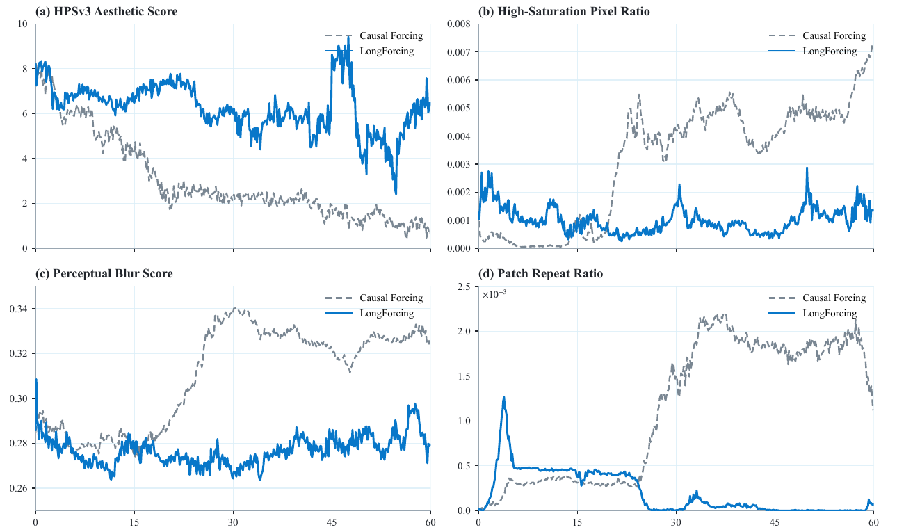
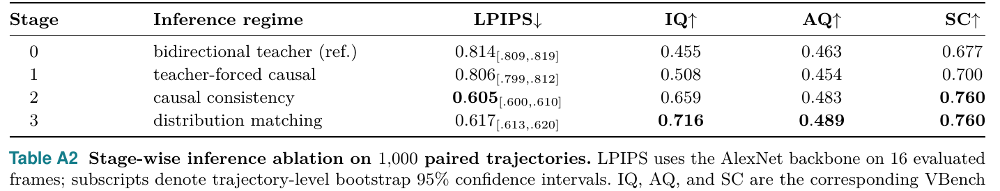

# 横向对照：五篇「给 DMD few-step 因果 AR 视频模型打补丁」的工作

> 这不是一篇论文的解读，是把仓库里五篇**共享同一条流水线、却互不对比**的工作放在一起核对。
> 涉及：[ForgeWM](../forgewm/analysis.md)（2608.14022）· [Mask Forcing](../mask_forcing/analysis.md)（2609.09123）· [OPSD-V](../opsd_v/analysis.md)（2607.08766）· [ABot-World-0](../../world_model/abot_world_0/analysis.md)（2607.19191）· [SolarWM](../../world_model/solarwm/analysis.md)（2609.02886）

---

## 0. 为什么要做这个对照

**五篇在 61 天内（2026-07-09 → 2026-09-08）发出来，共享同一条流水线的同一个假设，打在五个不同位置，而没有任何两篇做过直接对比。**

共享的假设只有一句：**DMD 的 teacher 是一个短片段的双向多步模型，它是 few-step 因果 AR 学生在长时程上的天花板。** 五篇全部接受这个前提，然后各自动手改流水线的一个部件。

- **三篇用的是同一个底座**（Wan2.1-T2V-1.3B）、**同一个步数预算**（NFE=4），其中 **Mask Forcing 与 OPSD-V 连基座模型都重合**（都建在 Self-Forcing / LongLive 上）—— **这两篇的 head-to-head 在工程上是现成可做的**，而 Mask Forcing 引用了 OPSD-V 却把它归进「被批评的一类」、不做对比。
- 另两篇（ABot-World-0 / SolarWM）是 5B–33B 的世界模型系统报告，底座是 Wan2.2 及更大，**与前三篇不可直接比数字**，但它们对**同一个阶段结构**给出了明确判断，而且 **ForgeWM 与 SolarWM 在「少步初始化要不要单独一个阶段」上给出了相反答案**。

---

## 1. 共同前提：一条被五篇共享的流水线

把五篇的做法剥掉命名，剩下的是同一条四段式流水线：

```
      双向多步 teacher（短片段，5–7 秒量级）
              │
    ① 因果化   │  teacher forcing：历史给干净的 GT latent，
              │  block-causal mask，训练分布 ≠ 推理分布
              ▼
      因果多步 student
              │
    ② 少步化   │  ODE 蒸馏 / consistency distillation：
              │  把多步去噪轨迹压成 1–4 步
              ▼
      因果少步 student
              │
    ③ on-policy│  DMD：学生自 rollout，用 real/fake score 之差
       分布匹配 │  做分布级对齐，第一次暴露「自生成的历史」
              ▼
      最终 few-step 因果 AR 模型
```

**五篇各自动的部件**：

| | 打在哪 | 具体改动 |
|---|---|---|
| **[ForgeWM](../forgewm/analysis.md)** | **阶段 ②**（并在前面加了一个 Stage 0） | 用**在线**因果一致性蒸馏做 ②（三个网络都吃干净因果历史，teacher 一步 Euler 即可，**不需要离线 ODE pair 数据集**）；另起一条并行分支做双向域适配，产出 ③ 的 frozen real denoiser |
| **[SolarWM](../../world_model/solarwm/analysis.md)** | **把 ① 和 ② 合并** | TF-AnyFlow：teacher forcing 的同时用 AnyFlow loss 监督**任意两个噪声水平之间的 flow map**，一步同时完成因果化与少步化，**声称可以整个删掉 ②** |
| **[ABot-World-0](../../world_model/abot_world_0/analysis.md)** | **③ 的 teacher 监督时域** | LongForcing：①②③ 全保留，只把 ③ 里 teacher 的监督横跨更长的 rollout |
| **[Mask Forcing](../mask_forcing/analysis.md)** | **③ 的 student 输入** | Dual-Noise Masking Rollout：在每个去噪步的输入里按 mask 混入一批**更低噪声**的 token，扰动学生轨迹去覆盖 teacher 更多的 mode |
| **[OPSD-V](../opsd_v/analysis.md)** | **③ 之后（并换掉 ③ 的目标）** | 学生完全 on-policy rollout 决定**在哪**监督；teacher 在**同一批状态**上评估、只把旧 KV cache 换成真实视频 chunk 来决定**往哪走**；loss 是**纯 velocity MSE，没有 DMD** |

📌 **结构上的关键分布**：**ForgeWM 与 SolarWM 争的是 ② 的存废（同一位置，只能二选一）；ABot / Mask Forcing / OPSD-V 打的是 ③ 的三个不同部件（teacher 的时域、student 的输入、teacher 的上下文），原则上可以叠加**——而没有一篇讨论过组合的可能。

---

## 2. 设定对照

| | [ForgeWM](../forgewm/analysis.md) | [Mask Forcing](../mask_forcing/analysis.md) | [OPSD-V](../opsd_v/analysis.md) | [ABot-World-0](../../world_model/abot_world_0/analysis.md) | [SolarWM](../../world_model/solarwm/analysis.md) |
|---|---|---|---|---|---|
| **arXiv / 日期** | 2608.14022 · 08-14 | 2609.09123 · 09-08 | 2607.08766 · 07-09 | 2607.19191 · 07-21 | 2609.02886 · 09-02 |
| **机构** | 腾讯 PCG + 港中文 + 复旦 + 上海 AI Lab | 港科大 + LIGHTSPEED + UCSD | 美团 + 港科大 + 港城大 | 阿里 AMAP CV Lab | 港中深 + NUS + NVIDIA 等 |
| **Backbone** | **Wan2.1-T2V-1.3B** | **Wan2.1-T2V-1.3B** | **Wan2.1-T2V-1.3B** | Wan2.2，**5B** | Wan2.2-5B/14B、LTX-2.5-22B、MiniMax-H3-33B |
| **训练方式** | 全参（四阶段） | 全参（插件接在已有训练里） | **只训 LoRA，base 冻结** | 全参微调 | 全参（三阶段） |
| **teacher 来源** | 自家 Stage 0 的**域适配双向模型** | **Wan2.1-T2V-14B 冻结**（真正更大的 teacher） | **学生 LoRA 的 EMA 副本**（decay 0.9999） | 自训双向 teacher | Stage 1 的双向 checkpoint |
| **步数** | **1 / 2 / 4**（三个预算特化 student） | 4 | 4 | few-step（**具体步数未明说**） | 4 |
| **训练数据** | GF-Minecraft 40k clips（+CrossFPS 65,246） | **VidProM，无需真实视频** | 自建 3,800 条 ×1 分钟 480p | ABot-World-Explorer（≈500h；规模论文自己没报） | 1.43M clips / 25.85 TB（实用 600,320 行） |
| **控制信号** | **6 维键盘 cross-attn KV + 2 维鼠标 concat+MLP** | 无（纯 T2V；附录有相机控制定性实验） | 无（纯 T2V） | **8 维键盘 multi-hot 打包 ×4 加性注入** | **标定 6-DoF 相机轨迹**（fused-PRoPE 折进 attention） |
| **训练成本** | **8 卡**（型号未给），阶段合计 42k 迭代 | **8 卡** ×~14 小时，~1500 步 | **24 × H800**，**200 步** | 未给（部署是单张 RTX 5090） | **全部未给** |
| **评测** | Minecraft 77 帧 rollout + CrossFPS | VBench + HPSv3，100-prompt；30s 长视频 | VBenchLong，1 分钟，240 prompt | WorldRoamBench（**自家做的**）+ 60s 曲线 | **无量化** |

📌 **三个直接可比的点**：

1. **ForgeWM / Mask Forcing / OPSD-V 三篇底座完全相同（Wan2.1-T2V-1.3B）、步数预算相同（4）**。
2. **Mask Forcing 与 OPSD-V 的基座模型也重合** —— 两篇都建在 **Self-Forcing 和 LongLive** 上（Mask Forcing 还多一个 Causal Forcing）。**它们打的位置正交（③ 的输入 vs ③ 之后），理论上可以叠加。**
3. **训练成本差了两个数量级**：OPSD-V 是 24×H800 / 200 步的 LoRA 后训练，Mask Forcing 是 8 卡 ×14 小时的插件，ForgeWM 是 8 卡 ×42k 迭代的完整四阶段重训。**"改一个部件"和"重训整条线"在这五篇里被放在同一个叙事层级上，成本差别没人提。**

---

## 3. 五个互不相同的诊断

**同一个现象（few-step 因果 AR 的长时程退化），五篇给出了五个不同的根因。**

| | 诊断 | 原文依据 |
|---|---|---|
| **ForgeWM** | 因果化**同时改变了输入分布和模型状态**（自生成历史 + KV cache / action cache 必须同步），少步会放大这些状态里的误差并沿 AR 传播 | *"causal generation changes both the input distribution and model state… Fewer denoising steps amplify errors in these states"* |
| **SolarWM** | ② 是个**多余的阶段** —— AnyFlow 目标本来就是少步采样需要的东西，不必先学多步 ODE 再压缩 | *"TF-AnyFlow removes the need for the additional Causal ODE and Causal Consistency Distillation (CD) initialization stages"* |
| **ABot-World-0** | 闭环 rollout 分布**漂出了 teacher 监督覆盖的时域区间** | *"long-horizon stability depends not only on accurate local transitions, but also on whether the closed-loop rollout distribution remains within the temporal region covered by teacher supervision"* |
| **Mask Forcing** | **reverse KL 的 mode-seeking** 让学生塌到 teacher 的高密度区（过饱和/过平滑），加上中间去噪步没有显式梯度 | *"The key contributing factor is the mode-seeking behavior of the reverse KL"* |
| **OPSD-V** | 瓶颈在**生成出来的 KV cache 本身**已经退化了 | *"degradation in the generated KV cache is a key bottleneck"* |

📌 **五个诊断里，只有 OPSD-V 和 ABot 给了直接的经验支撑**：

- **OPSD-V 的动机实验最便宜也最有说服力**——不训练、不改 sampler，只在**推理时**把 LongLive 的旧 KV cache 条目换成真实视频算的 KV，长时程稳定性就肉眼可见变好。


> ⚠️ 但它的证据强度有限：caption 只保证两行用同一个真实首 chunk，**没说同 seed / 同初始噪声**，而两行的内容演化明显不同。**作为因果证据偏弱，作为设计动机够用。**

- **ABot 的 LongForcing 对照是五篇里最干净的单个消融**：两个变体**都**在 student 自 rollout 上训、**都**在最终阶段用 DMD，**唯一差别是 teacher 监督的时域长短**，然后给了 60 秒逐帧的四条量化曲线。



> 四张图的共同结构是**差距在 15–25 秒之后才拉开**——正好印证"短时域监督覆盖不到的区间才是问题所在"。
> ⚠️ 但**蓝线自己也在下滑**（HPSv3 从 8 掉到 5–6，45 s 处还有一次深跌）。**LongForcing 减缓了退化，没有消除它。**

其余三篇的诊断都是论证式的：ForgeWM 的是问题陈述、SolarWM 的是推理链条（且零实验）、Mask Forcing 的 mode-seeking 说法**在实验上从未与"中间步无梯度"这第二个机制分离过**（摘要说单一主因，引言说两个主因）。

---

## 4. 三处真正的分歧

### 4.1 少步初始化阶段要不要单独存在（ForgeWM ↔ SolarWM）

**这是五篇里唯一一处正面冲突，而且目前只有一边有数据。**

| | 主张 | 证据 |
|---|---|---|
| **SolarWM** | ② 可以整个删掉，TF-AnyFlow 一步顶替 ①+② | **零** —— 没有 TF-AnyFlow vs (TF + Causal ODE) 的并排对照，连各阶段的训练步数都没给 |
| **ForgeWM** | ② 才是让少步采样成立的**决定性**阶段 | **Table A2**，带 bootstrap CI |



| Stage | 推理形态 | LPIPS↓ | IQ↑ |
|---|---|---|---|
| 0 | 双向 teacher（参考） | 0.814 [.809,.819] | 0.455 |
| 1 | teacher-forced causal | 0.806 [.799,.812] | 0.508 |
| **2** | **causal consistency** | **0.605** [.600,.610] | 0.659 |
| 3 | distribution matching (DMD) | 0.617 [.613,.620] | **0.716** |

**Stage 1→2 把 LPIPS 从 0.806 拉到 0.605，CI 不重叠，是全流程唯一的大跳。** 论文自己的结论是 *"causal consistency distillation, rather than teacher-forced causalization alone, is the stage that enables effective few-step sampling."*

📌 **但把两篇摆在一起后，正确的读法比「结论相反」更细一层**：

> **ForgeWM 证明的是「少步化这个*效果*是决定性的」，不是「它必须是一个*单独的阶段*」。SolarWM 主张的恰恰是「这个效果可以在 ① 里顺便拿到」。**
>
> **两篇其实指向同一件事 —— 少步能力必须被显式训进去，不能指望 ③ 的 DMD 顺手解决。分歧只在它要不要占一个独立阶段。**

而且这个细分的分歧**目前完全没有实验裁决**：ForgeWM 没试过 AnyFlow，SolarWM 没做对照。

⚠️ **另外 ForgeWM 自己这张表也有两个不能忽略的读点**：**Stage 0→1 的 CI 重叠**（[.809,.819] 与 [.799,.812] 在 [.809,.812] 相交），**而 Stage 1 占了整条 lineage 42k 迭代里的 20k = 48%**；以及 Table A2 是**累积式快照而非 leave-one-out**——没有 base→②（跳过 ①）、没有 ①→③（跳过 ②），**所以 "progressive" 这个命名贡献本身也没被验证**。

**我的判断**：**在有人补上对照之前，默认保留 ②。** 唯一的实测证据站在 ForgeWM 一边，而 SolarWM 那条是一个自洽但未经检验的推理。

### 🔴 补记（2026-09）：第六篇工作投了第三票，但证据格局没变

[Matrix-Game 3.5](../../world_model/matrix_game_35/analysis.md)（Riemann Dynamics）的蒸馏同样是**两阶段**，而且它的 Stage 1 明说：

> *"**This single objective simultaneously learns causal denoising and few-step generation**, yielding an efficient, high-quality causal initializer."*

它用的手段是 **teacher-forced 感知流匹配（PFM）** —— 在冻结 VAE 解码器 + 冻结 InternVideo2-1B 的**感知特征空间**里约束流匹配，而不是在 VAE latent 空间回归 velocity。**这是继 SolarWM 的 TF-AnyFlow 之后，第二条"把 ①② 合并"的技术路线。**

| | 立场 | 手段 | 证据 |
|---|---|---|---|
| **ForgeWM** | ② 决定性 | 在线因果一致性蒸馏 | ✅ **Table A2，带 bootstrap CI** |
| **SolarWM** | ② 可删 | TF-AnyFlow | ❌ 零消融 |
| **Matrix-Game 3.5** | ② 可删 | **PFM（感知特征空间）** | ❌ **零消融**（全文 "ablat" 0 次） |

📌 **按篇数 2:1，按证据仍是 1:0** —— ForgeWM 依然是唯一一篇为这个问题做过带置信区间对照的。

⚠️ **补记：[AlayaWorld](../../world_model/alayaworld/analysis.md) 给出了第三种形态。** 它既不是 ForgeWM 的独立一致性蒸馏阶段，也不是 SolarWM / Matrix-Game 3.5 的"合并进 teacher-forcing 阶段"，而是**把 consistency distillation 当作一项并进最后的 DMD 目标里**：

$$
\mathcal{L} = \mathcal{L}_{\mathrm{DMD}} + 0.5\,\mathcal{L}_{\mathrm{cm}}
$$

（`L_cm` 是在 50 级噪声网格上对自己 EMA 副本的 Huber 一致性损失，另配 self-forcing++ 的自 rollout）。**所以"少步化"这件事有三种放法：独立阶段 / 并进因果化阶段 / 并进 DMD 阶段 —— 而后两种都零消融。**

📌 **但这第三票强化了本节开头那个更细的读法**：**Matrix-Game 3.5 把少步能力显式写进了 Stage 1 的目标**（PFM 直接在少步设定下约束干净预测），而不是指望 ③ 的 DMD 顺手解决。**三篇合起来指向同一件事 —— 少步能力必须被显式训进去；分歧只在它要不要占一个独立阶段。**

### 4.2 DMD 该不该是最后一个阶段

**三篇独立指向同一个怀疑：③ 的 DMD 是在用 paired 保真度换 per-frame 观感。**

| | 对 DMD 的态度 | 依据 |
|---|---|---|
| **ForgeWM** | **是权衡，不是改进** | Table A2：Stage 3 把 LPIPS 从 0.605 推回 **0.617**（Stage 2 保持 −0.012 的 paired 优势，CI [−0.015,−0.008]），换来 IQ 0.659→**0.716**。论文自己的措辞：*"shifts the trade-off toward sharper per-frame appearance rather than improving paired reconstruction fidelity"* |
| **OPSD-V** | **直接换掉** | 指控 *"DMD itself may introduce side effects such as weakened dynamics and color drift"*，最终 loss 是**纯 velocity MSE，无 DMD / 无 reward / 无 adversarial** |
| **Mask Forcing** | **保留目标，绕过缺陷** | 承认 reverse KL 的 mode-seeking 是主因，但明确 *"Mask Forcing retains the original DMD objective and instead perturbs the student rollouts"* |
| **ABot / SolarWM** | 照用不误 | — |

📌 **这条是把五篇拼起来才看得到的**：单看 ForgeWM，"Stage 3 让 LPIPS 退化"只是一句诚实的自我披露；但它与 OPSD-V 的独立指控、Mask Forcing 的独立诊断放在一起，**三条来自不同团队、不同域、不同指标的证据都指向「DMD 在优化观感而不是保真度」**。

⚠️ **但要看清一个推论的边界**：ForgeWM 的 Table A2 意味着**按 paired 重建保真度，未发布的 Stage-2 中间 checkpoint 才是最强的**（0.605 优于主表任何一行），而正式产品 ForgeWM-4 是被 Stage 3 拉低后的版本，主表只报 Stage 3 的 students。这个结论只在 **4 步预算 + paired LPIPS** 这一个口径下成立——论文自己也承认 *"Its incremental effect at one- and two-step budgets is not isolated by this ablation."*

### 4.3 瓶颈在 student 的 cache 还是在 reverse KL（OPSD-V ↔ Mask Forcing）

**两篇底座相同、基座模型重合、打的都是 ③ 的 rollout，但方向正好相反。**

| | [OPSD-V](../opsd_v/analysis.md) | [Mask Forcing](../mask_forcing/analysis.md) |
|---|---|---|
| **动的是谁** | **teacher 的上下文**（换成真实视频 chunk） | **student 的输入**（混入低噪声 token） |
| **student 的 rollout** | **一个字都不动**，完全按推理时的 sampler 走 | **被刻意扰动** |
| **目标函数** | **换掉 DMD**，纯 velocity MSE | **保留 DMD** |
| **需要真实视频** | **需要**（3,800 条 ×1 分钟） | **不需要**（VidProM 即可） |
| **是不是插件** | 后训练阶段，LoRA 200 步 | 真正的零成本插件，接进现有训练 |
| **主要增益** | Dynamic Degree +17.52% / +5.66% | HPSv3 / instruction following / MQ 普遍提升 |

📌 **一个有意思的机制张力**：**OPSD-V 的 loss 是纯 MSE 回归到 teacher velocity —— 这是典型的 mean-seeking 目标，通常会降低多样性和锐度；但它的核心增益恰恰是 Dynamic Degree 上升。** 而 Mask Forcing 的整篇立论是"reverse KL 的 mode-seeking 有害，需要往 mode-covering 推"。**两篇在「该往哪个方向调散度」上给出了相反的直觉，而都拿到了正向结果。**

⚠️ **两边的增益指标都与训练信号同源，这是解释这个矛盾时必须先扣掉的**：

- **OPSD-V** 的训练数据是用 **optical flow 过滤**掉低运动样本得到的高运动子集，而 **Dynamic Degree 正是基于 RAFT 光流的运动幅度指标** —— 在高运动数据上做 velocity 回归，这个指标上升几乎是设计使然。
- **Mask Forcing** 的收敛曲线用 **CMMD / VMMD** 度量 student 与 **real-score teacher** 的分布距离，而 **DMD loss 的全部作用就是把 student 推向同一个 teacher** —— 这是训练目标的直接读数，不是独立的质量证据。

**我的判断**：**这两篇是最该被直接对比、也最容易被直接对比的一对**（同 backbone、同 NFE、同 base model），而且它们正交、可以叠加。Mask Forcing 引用了 OPSD-V 但归进被批评的一类、没做对比。**这是整个对照里最具体的一个开放实验。**

---

### 🔴 补记（2026-09）：一种不在这五篇坐标系里的打法

[Recency Forcing](../recency_forcing/analysis.md)（Qualcomm）同样是挂在 DMD few-step 因果 AR 上的补丁，**但它一个字没动这五篇争的那几件事** —— 不改蒸馏目标、不改 rollout 构造、不改阶段划分、不动 teacher/scorer 的上下文。**它只改 attention 从上下文读取时的权重分配**：给 history 段加一个非正的、随 denoising timestep 变化的 pre-softmax bias，让远帧在被 KV cache 逐出之前权重已近乎 0。

📌 **它对这五篇最直接的贡献是给了一个此前没人量过的数**：**硬截断上下文 vs 连续衰减上下文，在同一 backbone 同一评测下差 3.07 分**（VBench-Long Quality 81.10 vs 84.17，50 条互斥 prompt）。五篇里凡是用固定窗口/硬性驱逐的（[ABot-World-0](../../world_model/abot_world_0/analysis.md) 的有界 KV cache、[SolarWM](../../world_model/solarwm/analysis.md)），**这个数都直接相关，而此前没有任何一篇测过**。

⚠️ **它自称"与三大家族正交、可叠加"，但零组合实验** —— 所以"能不能和这五篇叠"仍然是开放的。

---

## 5. 五篇共有的方法学问题

### 5.1 训练时长 vs 评测时长

**只有 ForgeWM 是干净的，其余四篇的评测长度都超出训练长度，最多超了三个数量级。**

| | 训练长度 | 评测长度 | 比值 |
|---|---|---|---|
| **ForgeWM** | 81 帧 = **6.75 s** | 77 帧 = **6.42 s** | **0.95×** ✅ |
| **Mask Forcing**（相机控制附录） | **5 s** | ≈6.3 s（Fig 10 展示到 Frame 150） | **1.25×** |
| **OPSD-V** | 60 chunk ≈ **44.8 s** | **60 s** | **1.34×** |
| **ABot-World-0** | 未给 | 量化到 **60 s**，宣称 **24 小时** | **≈1440×**（对宣称而言） |
| **SolarWM** | **5 s** | 宣称 **1 小时** | **≈720×** |

⚠️ **ForgeWM 虽然主表干净，但也有两处真实错配**：**Stage 3 训练用 6 latent（2 chunk）的局部注意力窗，评测用 21 latent（7 chunk）的不受限因果注意力 —— 推理时有效上下文是训练时的 3.5×**；Fig 9 的定性长 rollout 是 22.2 s ≈ 3.5× 训练 horizon，只有定性图、零量化，且作者承认出现结构崩塌与色偏。

📌 **Mask Forcing 那一处值得单独记**：它附录里观察到的失效模式（Self-Forcing 逐帧变黑）被归因为"reverse KL mode-seeking + error accumulation"，**但最简单的解释是超出训练长度的外推，论文没有排除**。

### 5.2 指标与训练信号是否同源

| | 同源情况 | 严重程度 |
|---|---|---|
| **ForgeWM** | LPIPS / Flow Profile / Subject Consistency 全在 **GF-Minecraft 参考轨迹**上算，而 Stage 0/1 共 24k 步正是在 GF-Minecraft 上做 flow matching；**更进一步，③ 的 `ẑ_real` 就是 Stage 0 的域适配 teacher** —— DMD 在优化"像 GF-Minecraft domain teacher"，评测在测"像 GF-Minecraft 参考" | 🔴 **两条通路，两个 baseline 都没有** |
| **OPSD-V** | 光流筛数据 ↔ Dynamic Degree（RAFT 光流） | 🔴 头号增益指标直接同源 |
| **Mask Forcing** | CMMD / VMMD ↔ real-score teacher（= DMD 的优化目标） | 🟡 只影响收敛曲线，主表指标（VBench / HPSv3）不同源 |
| **ABot-World-0** | **WorldRoamBench 是同一批作者做的**（Benchmark Team 五人全部在 benchmark 论文作者列表里，含 Project Sponsor），论文正文零披露 | 🔴 |
| **SolarWM** | 无量化结果，无从谈起 | — |

📌 **相对干净的读数**：ForgeWM 的 **IQ / AQ**（MUSIQ / LAION aesthetic，no-reference）与训练信号不同源——**而它在 IQ 上的优势恰恰是最大最稳的**（0.6865 vs 0.6282 / 0.6133）。这是全对照里我最愿意采信的单个数字。

### 5.3 核心命名贡献的消融强度

| | 命名贡献 | 有没有被隔离验证 |
|---|---|---|
| **ABot-World-0** | LongForcing | ✅ **五篇里最干净的单个消融**：唯一变量是 teacher 时域，4 条 60 秒量化曲线。⚠️ 但占篇幅最大的数据基建（WorldExplorer、14 项检查、三源）**零消融、连语料规模都没给** |
| **ForgeWM** | "Progressive" 四阶段 | 🟡 Table A2 有 CI、且**主动披露了对自己不利的结果**（Stage 3 让 LPIPS 退化、消融只覆盖 4 步）；但它是**累积式快照而非 leave-one-out**，「必须按这个顺序走」没有实验支撑 |
| **Mask Forcing** | "Dual-Noise **Masking**" | 🟡 有 α / Δ / masking scheme 三张消融表，但**缺 α=0 和 α=1.0 两个决定性对照** —— 没有 α=1.0（全 token 用 `t'_k`，纯 timestep 平移无 mask），就**无法区分收益来自 mask 的异质性还是仅来自噪声水平平移**。而 Table 5 反过来给了个反向线索：`shared, per-chunk`（9.84/81）与选用的 `per-frame, per-chunk`（9.84/82）几乎相同，**说明空间轴上的异质性贡献接近于零** |
| **OPSD-V** | "AR-Consistent Real-Video Teacher Cache" | 🔴 **标题级贡献零消融** —— 既没有"全换真实 chunk"的对照，也没有"完全不换（纯自蒸馏）"的对照。两个消融（velocity vs `x₀`、student 轨迹 vs teacher 轨迹）都是**单例定性图** |
| **SolarWM** | TF-AnyFlow | 🔴 **零消融**，三条"关键发现"全部是断言 |

📌 **顺带记一条对所有五篇都缺的对照**：**Mask Forcing 丢掉的信息是"随机扰动 vs 有方向的扰动"**——它的附录理论证明的是 `D_KL(q̄‖p) ≤ E_V[D_KL(q^V‖p)]`，而这个不等式**因为互信息恒非负，对任意随机扰动都成立，包括有害的扰动**。理论部分无法区分 dual-noise masking 与任意随机扰动。

### 5.4 第三方 baseline 与误差棒

| | 第三方 baseline | 误差棒 / 多 seed |
|---|---|---|
| **Mask Forcing** | ✅ **最扎实的一篇**：3 个 baseline × 2 种设置（chunk-wise / frame-wise），另加 DistillAlign / Causal-rCM 对比，**且主基准用的是 baseline 自家的 100-prompt set**（对自己不利）。⚠️ 但 frame-wise 的两行 baseline 是**作者自己重训的**，且 Table 6 隐去了 Causal Forcing 基线行 | ❌ 无（Table 7 多样性除外） |
| **ForgeWM** | 🟡 2 个（Matrix-Game 2.0 / HY-WorldPlay）。⚠️ **ForgeWM 的 Stage 0/1 共 24k 步训在评测域上，两个 baseline 零域适配**；HY-WorldPlay 被 adapter 改造后疑似几乎不动（Flow Prof. 最低 + Subj.Cons. 最高） | 🟡 **五篇里唯一有 CI 的**（Table A2 的 bootstrap CI），但**主表没有** |
| **ABot-World-0** | 🟡 4 个，但**两个开源对照分数低到反常**（0.11–0.42），赢过它的两个未公布参数量，benchmark 自家做 | ❌ 无 |
| **OPSD-V** | 🔴 **零** —— Table 1 只有"自己 vs 自己的 base"四行，而 related work 点名的 Self-Forcing++ / Causal Forcing / Reward Forcing / Rolling Forcing / CausVid 一个都没比 | ❌ 无（单 seed，每 prompt 生成 1 条） |
| **SolarWM** | 🔴 **零** —— 全文无任何量化结果 | — |

⚠️ **ForgeWM 那个 CI 值得特别提一句反例**：它的摘要宣称"最低 LPIPS"，而 ForgeWM-4 的 0.6168、ForgeWM-2 的 0.6171、HY-WorldPlay 的 0.6172 **跨度只有 0.0004**，比它自己 Table A2 给出的 CI 半宽（±0.0035–0.005）**小一个数量级**——**唯一有能力做显著性判断的一篇，恰恰在主表里没做。**

### 5.5 互引与自引

```
Mask Forcing ──引用──▶ OPSD-V        （归入「被批评的一类」，未对比）
Mask Forcing ──引用──▶ SolarWM       （附录 "following SolarWM"；⚠️ 至少 5 位作者重叠，
                                        含本文一作与二作，全文以第三人称引用、零自引用披露）
SolarWM      ──引用──▶ ForgeWM       （Table 1 发布矩阵里列了一行，未对比）
SolarWM      ──使用──▶ ABot-World    （当成自己的数据 owner 之一，Table 4）
ForgeWM      ──✗────  OPSD-V        （OPSD-V 早于它，未引用；CausVid / Self-Forcing++ /
                                        LongLive / Rolling Forcing / DMD2 同样未引用）
ABot-World-0 ──✗────  OPSD-V / SolarWM（未对比）
```

📌 **五篇两两之间共 10 对，做过模型质量定量对比的：0 对。**（下面 SolarWM 那张表里确实有关于 ABot / ForgeWM 的数字，但那是 artifact 与数据规模的核查，不是模型效果的比较。）

⚠️ **补记**：把 [Matrix-Game 3.5](../../world_model/matrix_game_35/analysis.md) 算进来是六篇、**15 对，仍然是 0 对** —— 它对这五篇的引用是**零**（ForgeWM / SolarWM / ABot-World-0 / Mask Forcing / OPSD-V 全文一篇都没引），它引的同侧工作是 Causal Forcing、DMD/DMD2、HiAR、CausVid、Self-Forcing。

⚠️ **另外两条跨篇的数据核对，都指向同一张表**——[SolarWM 的 Table 1 发布矩阵](../../world_model/solarwm/analysis.md)是**由 SolarWM 作者自己定义维度、自己评判同行、把自己那行填成全对号（且标注为"承诺"而非已核实状态）**的：

- 它给 **ABot-World-0** 填的 **2.74 TB / 30k clips**，**填上了 ABot 自己论文里没报的空白**（ABot 全文没有任何语料规模数字），这是有价值的。
- 它给 **ForgeWM** 填的 **Data ✓ 95 GB / 40k clips**：**"40k clips" 对得上**，但 **"95 GB" 在 ForgeWM 全文不存在**，且 **ForgeWM 从未声明发布数据集**（GF-Minecraft 是 GameFactory 的第三方数据）。
- 反过来，SolarWM 的 **Table 4 用统一标准过了一遍 ABOT 数据，保留率 99.6%、其中 99.2% 直接进 xhigh** —— **这是第三方对 ABot「游戏引擎 + API ground-truth 动作标签」数据质量的独立确认**，比 ABot 自己说的更有说服力。

**所以那张表可以当 artifact 索引用，不能当开放性排名用。**

---

## 6. 把五篇拼起来能得到什么

### 6.1 三条比任何单篇都强的结论

**① 少步能力必须被显式训进去，不能指望 ③ 的 DMD 顺手解决。**
这是 ForgeWM 与 SolarWM **共同**指向的（见 §4.1）——它们只在"要不要占一个独立阶段"上分歧，在"这件事必须显式做"上完全一致。而 ForgeWM 的 Table A2 是唯一的量化证据：**Stage 1→2 是全流程唯一 CI 不重叠的大跳（0.806→0.605），Stage 0→1 的 CI 反而重叠，Stage 2→3 是退化。**

**② DMD 这一阶段在用 paired 保真度换 per-frame 观感。**
三个团队、三个域、三套指标独立给出同向证据（见 §4.2）：ForgeWM 测出 LPIPS 0.605→0.617 / IQ 0.659→0.716；OPSD-V 指控它"weakened dynamics and color drift"并整个换掉；Mask Forcing 承认 reverse KL 的 mode-seeking 是主因。**单看任何一篇这都只是一句自我披露或一句批评，三篇叠起来才成为一条可以行动的判断。**

**③ 误差累积/长时程退化，五篇一篇都没解决 —— 全部只是减缓。**
而且**只有两篇给了随时间的量化曲线，两条都在降**：

| | 时间分辨的量化证据 | 结果 |
|---|---|---|
| **ABot-World-0** | Fig 10，60 秒逐帧四指标 | LongForcing 自己的 HPSv3 从 **8 掉到 5–6**，45 s 处还有一次深跌 |
| **Mask Forcing** | Table 8，30 秒切 5 段 | LongLive HPSv3 **8.81→7.79**，+Ours **9.65→8.68**。**两条都在降，只是整条曲线被抬高了**。论文自承 *"error accumulation"* 仍在 |
| **ForgeWM** | 无（只有 Fig 9 的 22.2 s 定性图） | 自承 long-horizon drift，3.5× horizon 时结构崩塌、色偏 |
| **OPSD-V** | **无** —— 真正衡量误差累积的 subject / background consistency、temporal flickering、motion smoothness **一项都没单独报** | — |
| **SolarWM** | **无** —— Fig 11 是**每 10 分钟一帧**，中间 10 分钟完全不可见 | — |

📌 **所以"分钟级""小时级""infinite"这三个词在五篇里出现得很自由，而支撑它们的时间分辨证据最长只到 60 秒。**

### 6.2 可组合性地图

**打在不同部件的四篇原则上可以叠加，没有一篇讨论过。**

```
① 因果化 ──┬── ② 少步化 ────────── ③ on-policy DMD ──── ③ 之后
           │        ▲                    ▲                  ▲
   SolarWM ┘   ForgeWM               ┌───┴────┐          OPSD-V
  （合并①②，  （在线 CD）           │        │        （换掉 DMD，
   与 ForgeWM                    ABot      Mask         cache 换真实）
   在此互斥）                (teacher 时域) Forcing
                                          (student 输入)
```

- **互斥**：ForgeWM 的 ② 与 SolarWM 的 ①② 合并 —— 同一位置，只能二选一。
- **正交、可叠**：ABot（teacher 时域）× Mask Forcing（student 输入）× OPSD-V（teacher 上下文 + 换目标）。
- ⚠️ **但 OPSD-V 换掉了 DMD 目标本身**，所以它与 ABot / Mask Forcing 的组合不是简单相加 —— Mask Forcing 扰动的是 DMD rollout 的输入，而 OPSD-V 阶段已经没有 DMD 了。**最自然的组合是把 OPSD-V 当成 ③ 之后的第四阶段，而 ABot / Mask Forcing 在 ③ 内部叠加。**

### 6.3 成本差了两个数量级，而五篇的叙事层级相同

| | 改动范围 | 训练成本 |
|---|---|---|
| **Mask Forcing** | 插件，接进现有训练 | 8 卡 × ~14 小时，~1500 步。**不加前向、不加数据、不加阶段**（每 chunk 只有一次前向带梯度，其余全 detach） |
| **OPSD-V** | 后训练一个 LoRA，base 冻结 | **24 × H800，200 步** |
| **ForgeWM** | **整条 lineage 重训** | 8 卡 × 42k 迭代（四阶段，其中 Stage 1 独占 20k） |
| **ABot-World-0** | 整条 lineage + 全栈推理改造 | 未给 |
| **SolarWM** | 整条 lineage × 4 个骨干 | **全部未给** |

📌 **做选型时这一列比任何指标都重要**：Mask Forcing 和 OPSD-V 是"在已有 checkpoint 上加一个东西"，ForgeWM / ABot / SolarWM 是"从双向 teacher 重走一遍"。**五篇在各自摘要里的措辞强度是一样的，成本差别没有一篇提。**

### 6.4 最该补的五个实验（按性价比排序）

| # | 实验 | 裁决什么 | 可行性 |
|---|---|---|---|
| **E1** | **Mask Forcing × OPSD-V 的 head-to-head 与叠加** | §4.3 的分歧；以及两者是否真的正交 | ⭐⭐⭐ **现成可做** —— 同 backbone（Wan2.1-1.3B）、同 NFE=4、同 base model（Self-Forcing / LongLive）。**唯一需要统一的是评测协议** |
| **E2** | **Mask Forcing 的 `α = 1.0`**（全 token 用 `t'_k`，纯 timestep 平移、无 mask） | "masking" 这个命名是否名副其实 | ⭐⭐⭐ 改一行，跑一次 |
| **E3** | **TF-AnyFlow vs (TF + Causal ODE/CD) 并排** | §4.1 的正面冲突 | ⭐⭐ 要重训两条 lineage，但这是唯一能裁决的实验 |
| **E4** | **用 OPSD-V 那 3,800 条视频直接 teacher-forcing 微调 / 纯重建 loss 微调** | 分离"真实长视频数据本身的贡献"与"OPSD 框架的贡献" | ⭐⭐ OPSD-V 用两句话论证过这两种朴素做法不行，**但那是论证不是实验** |
| **E5** | **ForgeWM 的 leave-one-out**（base→②跳过①；①→③跳过②） | "progressive 顺序是必要的"这个命名贡献 | ⭐ 要重训，且 ForgeWM 自己已经诚实说了消融只覆盖 4 步 |

---

## 7. 一句话总结

**五篇在 61 天内接受同一个前提（DMD 的 teacher 是短片段双向模型，这是长时程的天花板），打在同一条流水线的五个不同部件上，两两之间 10 对组合做过模型质量定量对比的是 0 对；拼起来能得到三条比任何单篇都强的结论——少步能力必须被显式训进去（ForgeWM 的 Table A2 是唯一量化证据：Stage 1→2 是全流程唯一 CI 不重叠的大跳）、DMD 这一阶段在用 paired 保真度换 per-frame 观感（三个团队独立同向）、误差累积五篇一篇都没解决而只有两篇给了时间分辨的曲线且两条都在降；⚠️ 而五篇共有的问题是评测长度普遍超出训练长度（ForgeWM 的 0.95× 是唯一干净的，SolarWM 与 ABot 的宣称分别超了约 720× 和 1440×）、头号指标与训练信号大面积同源、命名级贡献的消融从「唯一变量的 60 秒量化曲线」到「零消融」跨度极大、五篇里只有 ForgeWM 出现过 CI 而它的主表恰恰没用。**

---

## Q&A

**Q: 我要从零搭一条 few-step 因果 AR 世界模型，按哪个配方？**

A: **骨架抄 ForgeWM，③ 的部件按预算挑，别抄 SolarWM 的"省掉 ②"。**

**骨架**（四段，见 §1）：双向域适配 → teacher-forced 因果化 → **在线因果一致性蒸馏** → on-policy DMD。理由是 §4.1：**这是唯一一条有量化证据支撑的阶段结构**，而且 ForgeWM 的 ② 设计本身很干净——**student / EMA / frozen teacher 三个网络全部从同一个 causal checkpoint 初始化、且全部吃干净因果历史，所以 teacher 的一步 Euler 能单次前向算完，不需要离线 ODE pair 数据集。**

**几个可以直接拿走的部件**：

| 来自 | 部件 | 为什么 |
|---|---|---|
| **ForgeWM** | **Replay-Time Refinement**：交互结束后用**同一个 student**、按 `r=0.3` 重加噪走 4 步 | 在线零开销、不需要第二个 checkpoint；1 步 draft 的 LPIPS 0.6532→**0.6155**，追平 4 步从噪声生成的 0.6168 |
| **ABot-World-0** | **有界局部 KV cache + 滚动淘汰** | 让 cache 占用**与 rollout 时长无关** —— 这是任何"无限时长"宣称的真实前提 |
| **ABot-World-0** | **8 维键盘 multi-hot 按 VAE 时间压缩打包（8×4=32 维）加性注入 patchify** | 局部增量、天然有界，不像相机位姿会在长 rollout 中漂出训练分布；一套表示同时覆盖第一/第三人称 |
| **OPSD-V** | **"学生定状态、teacher 定方向"** + **截断反传**（每个 `(i,k)` 算完立刻反传并释放激活图） | 前者是 on-policy 蒸馏的通用原则，Fig 7 的消融证明了反过来会导致严重的 off-policy state mismatch；后者让激活显存不随监督对数增长 |
| **Mask Forcing** | **Dual-Noise Masking**，如果你已经有一条在跑的 DMD self-rollout | 真正的零成本插件。⚠️ 但 `α=0.2 / Δ=250` 是在 Self-Forcing + chunk-wise 上选的，**要自己重调**（Δ=450 在两个指标上并不比 250 差） |
| **SolarWM** | **数据工程规范**（先全量处理后施加选择、rejected 带机器可读原因一并保留、physical/logical/model 三命名空间分离、缺失证据 fail closed） | 📌 **这是 SolarWM 真正的价值所在，与它的模型结论无关** |

**两条跨篇独立收敛、可以当定论的**：
1. **caption 里刻意排除相机运动信息** —— ABot 和 SolarWM 独立得出同一结论，理由完全一致（防止文本条件泄漏相机控制信息）。
2. **长时评测要写清四条排除项**（不从输入图像重启、不注入参考帧、不独立生成再拼接、不用 attention sink）—— SolarWM 的协议写得最实在，值得照抄进自己的实验报告。

---

**Q: 这五篇里哪些数字可以直接信？**

A: **按"与训练信号是否同源 + 有没有对照"过一遍，剩下的不多。**

**相对可信**：

1. **ForgeWM 的 IQ 列**（0.6865 vs Matrix-Game 2.0 的 0.6282 / HY-WorldPlay 的 0.6133）—— **no-reference 指标，与训练信号不同源，而且这是它优势最大最稳的一列**。
2. **ForgeWM 的效率数字**（1 步 168.2 ms / 72.10 FPS，是 Matrix-Game 2.0 吞吐的 2.2×）—— 效率是硬的。⚠️ 但注意 Latency 列**没按帧数归一化**（ForgeWM/Matrix-Game 12 帧/chunk，HY-WorldPlay 16 帧/chunk），FPS 列做了归一化所以更公平。
3. **ABot 的 Table 2 系统表** —— **保留 OOM 行**这一点尤其可贵，它把"只优化单个算子不够"变成了可验证的事实。⚠️ 但头条的 16 FPS 来自最激进的 MXFP4，而论文明说 FP8（12.405 FPS）才是"默认的质量导向工作点"，**MXFP4 的画质从未被评测**。
4. **ForgeWM 的 Table A2**（带 CI，且主动披露对自己不利的结果）。

**要打折的**：

- **OPSD-V 的 Dynamic Degree +17.52%** —— 训练数据的光流筛选与它同源；它在 VBench 里又是 Quality Score 的子维度（所以"两个指标都涨"可能是同一变化数了两次）；而 Quality 只涨 1.28%/1.57%，这个幅度反而暗示其它子维度在降。**更要命的是 Semantic Score 两个 backbone 都跌，而摘要宣称"VBenchLong 一致提升"。**
- **Mask Forcing 的收敛曲线** —— CMMD/VMMD 是训练目标的直接读数。
- **ABot 的 WorldRoamBench 排名** —— benchmark 自家做、两个开源对照分数反常、赢过它的两个未公布参数量。**而且 ABot 在七个维度上一项第一都没有。**
- **SolarWM 的一切模型结论** —— 零量化、零消融，却两次宣称 SOTA。

**人评规模排序**（这是唯一一条五篇口径接近可比的轴）：

| | 规模 | 主要结果 |
|---|---|---|
| **ForgeWM** | **41 人、盲测、顺序随机化、615 次选择** | Overall 60.7% vs 22.4% / 16.9% |
| **Mask Forcing** | 24 人、四组 pairwise | 72–83% 偏好 Ours |
| **OPSD-V** | **10 人 × 20 对 = 200 次判断**，未说明是否盲测 | Overall 66%（除去 Same 后 82.5%） |
| ABot / SolarWM | **无** | — |

---

**Q: 为什么五篇都没解决误差累积？**

A: **因为五篇都没有动那个真正的天花板 —— teacher 本身仍然是短片段的。**

看它们各自绕这个约束的方式就清楚了：

| | 怎么绕 | 天花板动了吗 |
|---|---|---|
| **ABot-World-0** | 把 teacher 的**监督时域**拉长 | 🟡 **最接近动它的一篇**，但 teacher 模型本身没变，只是监督覆盖的区间变长 |
| **OPSD-V** | 给 teacher 换一个**没退化的上下文**（真实视频 cache） | ❌ teacher 还是那个 teacher，只是让它活在"历史从未退化"的世界里 —— 所以才必须**保留最近一个学生 chunk**，否则它退化成一个方向对学生不可达的 fully teacher-forced oracle |
| **Mask Forcing** | 扰动 student 的轨迹去覆盖 teacher 更多 mode | ❌ 目标仍然是同一个 teacher 的分布 |
| **ForgeWM** | 换一个更好的 ② | ❌ 与长时程无关 |
| **SolarWM** | 声称什么都不需要 | ❌ 无证据 |

📌 **所以 §6.1 的结论 ③ 不是五篇各自做得不够好，而是这条流水线的结构性上限**：**只要最终的分布参考来自一个短片段模型，学生在超出那个片段长度的区间上就没有可靠的监督。** ABot 那句话说得最清楚：

> *"long-horizon stability depends not only on accurate local transitions, but also on whether the closed-loop rollout distribution remains within the temporal region covered by teacher supervision."*

**而它自己的 Fig 10 显示，把时域拉长之后 HPSv3 在 60 秒内还是从 8 掉到 5–6。**

---

**Q: 对游戏资产/世界生成，这五篇哪几篇真的相关？**

A: **ForgeWM 和 ABot-World-0 两篇；SolarWM 只能给数据规范；另两篇是通用 T2V。**

| | 控制能力 | 对游戏场景的适用性 |
|---|---|---|
| **ForgeWM** | **6 维键盘（cross-attn KV）+ 2 维鼠标（concat+MLP）**，帧率级 | ✅ **最贴近** —— 它明确拒绝把控制退化成相机位姿或 PRoPE，目标就是保住 game-native 的控制接口；1 步 72 FPS |
| **ABot-World-0** | **8 维键盘 multi-hot**，**相机 + 角色**（第一/第三人称） | ✅ 贴近，且给了单张 RTX 5090 的完整部署包络 |
| **SolarWM** | ⚠️ **只有相机轨迹，没有角色/动作控制** | 🔴 §6 明说 *"the prescribed camera trajectory provides the only time-varying external control"* —— **"能移动镜头但不能操控角色"对游戏是实质限制**。它的价值在数据工程规范，不在模型 |
| **Mask Forcing** | 无（纯 T2V，附录有相机控制定性实验） | 🟡 作为插件可以接到上面任何一条上 |
| **OPSD-V** | 无（纯 T2V） | 🟡 同上，但它需要真实长视频数据 |

⚠️ **控制表示这条线上还有一处未被裁决的分歧**：**ABot 明确拒绝相机位姿**（理由是长 rollout 累积位姿会漂出训练分布，周期性重锚定又会在时序段之间引入不一致），改用局部增量的键盘动作；**SolarWM 恰恰以标定的 6-DoF 相机轨迹为核心控制信号**（fused-PRoPE 折进 attention）。**两种主张目前都没有直接的对照实验来裁决。**

📌 顺带：[H3-World](../../world_model/h3world/analysis.md) 提供了第三条路——把**同一批键盘状态翻译成自然语言子句**走文本通路，而它用的正是 **ABot-World-Explorer** 的数据。**同一份数据、三种控制表示（原始键盘 / 相机位姿 / 自然语言），没人做过直接对比。**

---

**Q: 如果只能补一个实验，补哪个？**

A: **E1：Mask Forcing 与 OPSD-V 的 head-to-head 加叠加。**

理由是它**同时满足性价比最高的三个条件**：

1. **现成可做** —— 两篇同 backbone（Wan2.1-T2V-1.3B）、同步数（NFE=4）、**同 base model**（Self-Forcing / LongLive）。唯一要统一的是评测协议（Mask Forcing 用 VBench + HPSv3 的 100-prompt，OPSD-V 用 VBenchLong 的 240 prompt）。
2. **裁决一个真分歧** —— §4.3：瓶颈到底在 student 的 cache（OPSD-V）还是在 reverse KL 的 mode-seeking（Mask Forcing）。两篇在"该往哪个方向调散度"上给出了相反直觉，却都拿到了正向结果。
3. **成本差异本身就是结论** —— Mask Forcing 是零成本插件（8 卡 ×14 小时），OPSD-V 是 24×H800 ×200 步 + 3,800 条自建真实长视频。**如果插件能拿到接近的收益，那条数据通路的性价比就要重新评估。**

📌 **而做这个实验时，务必同时报 §5.2 里那两个同源指标以外的读数**：OPSD-V 的增益主要在 Dynamic Degree（与它的光流筛数据同源），Mask Forcing 的收敛曲线用的 CMMD/VMMD 是 DMD 目标的直接读数。**换一组两边都不占便宜的指标（比如 no-reference 的 IQ/AQ、加上 subject consistency / temporal flickering 这几项衡量误差累积的），结论才有意义。**
