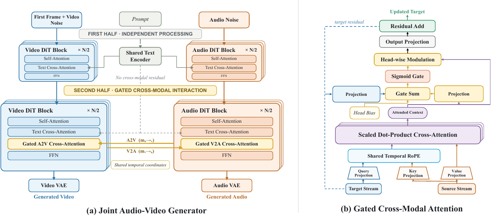
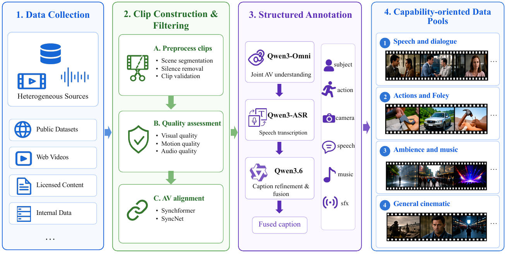
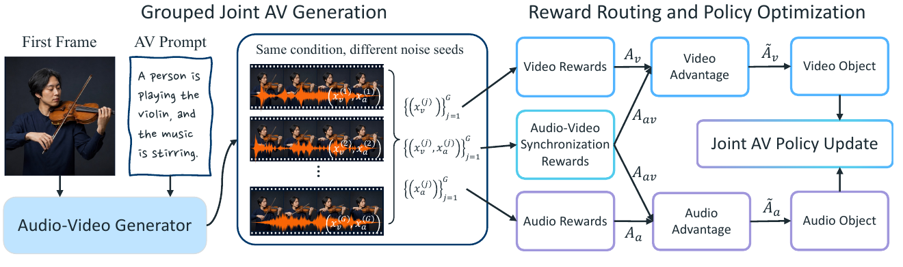
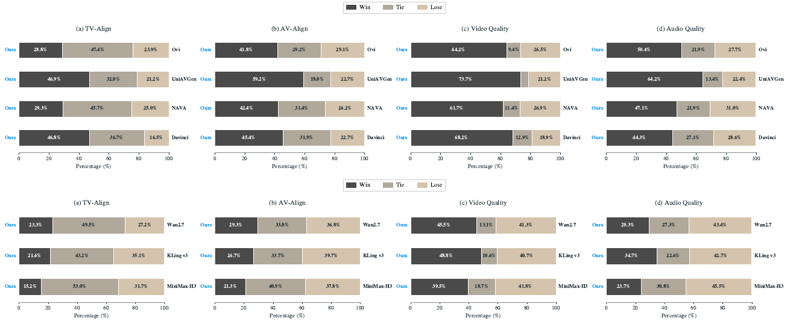

# DreamX-Creator 1.0: Democratizing Native Audio-Video Generation at 2K Resolution

> Jiashu Zhu*, Yanhao Zheng*, Ruitian Tian*, Rujing Dang*, Shen Zhang, Bingze Song, Jiachen Lei, Ruimin Lin, Jiahong Wu†, Xiangxiang Chu  
> **DreamX Team, 阿里巴巴** · 2026-08 · [arXiv:2608.31106](https://arxiv.org/abs/2608.31106) · *Equal contribution †Project Lead

---

## 1. 一句话定位

**用 7B 做原生音视频联合生成，然后开源出来——赌的是"小而全"比"大而闭"更有用。**

DreamX-Creator 1.0 是一份**技术报告**，核心是一个 7B 的联合生成器：给定首帧 + 文本，**同时**对音频和视频两条 latent 流去噪。网络**前半段两流独立、后半段通过 Gated Cross-Modal Attention 耦合**，门控是 **token 级 + head 级的 sigmoid 输出门**。外围是三块：数据系统、模态感知 RL 后训练、自回归 1 步 2K 精修。

📌 **它的定位声明写得很直白**：在 Table 1 列出的系统里，**DreamX-Creator 1.0 是同时满足"权重可下载 + 原生联合音视频 + 官方支持本地 ≥2K 输出"三条的最小模型**（7B，对比 LTX-2.3 的 22B、MOVA 的 32B、MAGI-2 的 114B、MiniMax-H3 的 33B）。

⚠️ **但这份报告有几个严重的内部矛盾**（§6 详述）：结论章说 RL 和 Refiner "**是设计而非已完成的经验主张**"，可 Table 3/4/5 里明明有 `Ours (RL)` 和 `Ours (Refiner)` 的数字；§7.3 说 refiner 是**双向全片注意力、非因果**，可 §5.2/5.3 整节在讲**自回归因果分块 + self-rollout**。**全文零消融。**

---

## 2. 要解决的问题

论文列了**四个未解决的挑战**，每一条对应后面的一个模块：

| 挑战 | 具体含义 | 对应模块 |
|---|---|---|
| **① 数据** | 原始音视频需要可靠的分镜切分、分模态质量过滤、同步性评估、联合多模态标注。**镜头切换和无关背景音会引入虚假的跨模态相关** | Audio-Video Data System |
| **② 跨模态交互的强度** | 交互不能压垮模态特有表示。**所需强度在层、head、token、样本之间都不同**，不同内容的音视频依赖方向也不同 | Gated Cross-Modal Attention |
| **③ 训练目标与感知脱节** | flow matching 不直接优化感知质量、prompt 遵循、跨模态语义一致、细粒度音画同步 | Audio-Video RL |
| **④ 分辨率与算力错配** | 联合 latent 生成适合中等分辨率，2K 精修则要在**保住内容/运动/音画时序**的前提下恢复空间细节 | 2K Refiner |

另外还有一条**非技术**的动机：**模型规模与可获得性是研究门槛**。很多系统几十上百亿参数、只提供托管访问、或难以复现。

---

## 3. 核心方法

### 3.1 联合生成器：前半独立、后半门控耦合

> **Fig 5 逐面板解读**：
>
> **(a) Joint Audio-Video Generator**——分上下两段：
> - **上段 `FIRST HALF · INDEPENDENT PROCESSING`**：左边蓝色 `Video DiT Block × N/2`（Self-Attention → Text Cross-Attention → FFN），右边橙色 `Audio DiT Block × N/2`（结构相同）。中间灰色 `Shared Text Encoder` 分别喂给两侧的 Text Cross-Attention。**中间明确标注 `No cross-modal residual`——前半段两流零交互。**
> - **下段 `SECOND HALF · GATED CROSS-MODAL INTERACTION`**：两侧 block 各多出一层黄色高亮的 **`Gated A2V Cross-Attention`** / **`Gated V2A Cross-Attention`**，中间两条橙色箭头标着 **`A2V (m_{a→v})`** 和 **`V2A (m_{v→a})`**，下方一个小框写 **`Shared temporal coordinates`**。
> - 最后分别接 `Video VAE` / `Audio VAE` 出 `Generated Video` / `Generated Audio`。
>
> 📌 **注意 FFN 的位置**：`Gated Cross-Attention` 插在 `Text Cross-Attention` 之后、`FFN` 之前。
>
> **(b) Gated Cross-Modal Attention**——从下往上读：
> - 底部 `Target Stream`（蓝）和 `Source Stream`（橙）分别出 **`Query Projection`** / **`Key Projection` + `Value Projection`**
> - 都过 **`Shared Temporal RoPE`**（关键：两流 token rate 不同，靠共享时间坐标系对齐）
> - 进 **`Scaled Dot-Product Cross-Attention`**（紫色大框）→ 出 **`Attended Context`**
> - 右边 `Head Bias`（黄）与 target 侧的 `Projection`、source 侧的 `Projection` 一起进 **`Gate Sum`** → **`Sigmoid Gate`** → **`Head-wise Modulation`**
> - 最后 `Output Projection` → `Residual Add` → `Updated Target`，左侧一条蓝色虚线标 **`target residual`**
>
> 📌 **门的输入来自两边**：既有 target token 自身（`W_x LN(x_i)`），也有 cross-modal attention 的输出（`w_c^T LN(C_{i,h})`）。**这是它与"query-only gate"的区别**——门知道"对面说了什么"才决定听多少。

**跨模态注意力的计算**（每个 head `h`）：

$$
\bar{X} = \mathrm{LN}_x(X),\quad \bar{Y} = \mathrm{LN}_y(Y)
$$

$$
Q = \mathrm{RMSNorm}(W_Q\bar{X}),\quad K = \mathrm{RMSNorm}(W_K\bar{Y}),\quad V = W_V\bar{Y}
$$

$$
\tilde{Q}_h = \mathrm{RoPE}_t(Q_h, \tau_x),\quad \tilde{K}_h = \mathrm{RoPE}_t(K_h, \tau_y)
$$

$$
A_h = \mathrm{softmax}\!\left(\frac{\tilde{Q}_h \tilde{K}_h^\top}{\sqrt{d_h}} + M_y\right),\quad C_h = A_h V_h
$$

**门控输出**（token `i`、head `h`）：

$$
g_{i,h} = \mathrm{sigmoid}\!\left(\big[W_x \mathrm{LN}(x_i)\big]_h + w_c^\top \mathrm{LN}(C_{i,h}) + b_h\right)
$$

$$
\Delta x_i = W_o\Big(\mathrm{Concat}_h\big[g_{i,h}\odot C_{i,h}\big]\Big), \qquad x_i' = x_i + \Delta x_i
$$

📌 **论文特意区分了门和方向掩码的层级**：**门缩放的是每个激活 head 的输出**（输出调制），**方向掩码决定的是整条 A2V 或 V2A 残差加不加**（路径选择）。**门不是 token routing。**

### 3.2 三种训练模式：用噪声水平的高低表达"谁条件谁"

每个样本被指派 A2V / V2A / Joint 之一。**模式同时决定三件事：激活哪条跨模态路径、两流的相对腐蚀顺序、以及 stop-gradient 规则。**

$$
\text{A2V}: \sigma_v > \sigma_a,\quad (m_{a\to v}, m_{v\to a}) = (1, 0)
$$

$$
\text{V2A}: \sigma_a > \sigma_v,\quad (m_{a\to v}, m_{v\to a}) = (0, 1)
$$

$$
\text{Joint}: \sigma_v = \sigma_a,\quad (m_{a\to v}, m_{v\to a}) = (1, 1)
$$

> **`σ` 越大腐蚀越强**，所以 A2V / V2A 用的是**更噪的目标流 + 更干净的条件流**——这就是"条件"的表达方式，**不需要额外的条件分支**。

$$
\Delta h_v = m_{a\to v}\,\mathrm{Attn}\big(Q(h_v), K(\hat{h}_a), V(\hat{h}_a)\big)
$$

$$
\Delta h_a = m_{v\to a}\,\mathrm{Attn}\big(Q(h_a), K(\hat{h}_v), V(\hat{h}_v)\big)
$$

A2V 时 `ĥ_a = sg(h_a)`，V2A 时 `ĥ_v = sg(h_v)`，Joint 模式两边都用原始 hidden state。

📌 **stop-gradient 加在 K/V 投影之前**：**阻止目标流的损失通过跨模态注意力去更新条件流骨干，但注意力参数本身仍可训**；条件流骨干仍由它自己的 flow-matching loss 训练。

⚠️ **重要澄清**：A2V / V2A 是**内部的跨模态条件配置，不是独立的推理任务**。推理时只有一个接口——首帧 + prompt → 联合音视频。

### 3.3 训练目标与三阶段

$$
z_{\sigma_m}^m = (1-\sigma_m) z_0^m + \sigma_m \epsilon_m, \qquad u_m^* = \epsilon_m - z_0^m
$$

$$
\mathcal{L}^m_{\mathrm{FM}} = \frac{1}{N_m d_m}\sum_{j=1}^{N_m}\big\lVert \hat{u}_{\theta,j}^m - u^*_{m,j}\big\rVert_2^2, \qquad \mathcal{L}_{\mathrm{AV}} = \lambda_v \mathcal{L}^v_{\mathrm{FM}} + \lambda_a \mathcal{L}^a_{\mathrm{FM}}
$$

**token 数和特征维都做了归一化**——这一步很实际，因为音频和视频的 token 数量差一个数量级。两流用**独立采样**的高斯噪声；基础 timestep 从 1000 步离散 flow schedule 抽取，**shift factor 5.0**。

| 阶段 | 做法 | 关键超参 |
|---|---|---|
| **Stage 1: LoRA-Based AV Pre-training** | 从各自的视频/音频骨干初始化。**前半段全冻结**，后半段挂 **rank-256 LoRA**，跨模态注意力和输出门**直接训** | LoRA lr **1e-4**，跨模态+门 lr **2e-5**；LoRA scaling 128、dropout 0 |
| **Stage 2: Full-Parameter AV Pre-training** | Stage 1 的 LoRA 合并回骨干，两个 DiT 骨干 + 所有跨模态模块**联合全参训练** | 骨干 lr **1e-5**，跨模态 **2e-5** |
| **Stage 3: High-Quality Finetuning** | 用同步指标、分模态美学分、分辨率、时长过滤出精选子集；再用 **OmniShotCut** 做细粒度分镜检测，**丢掉包含或跨越转场的片段**；全参微调 | 继承 Stage 2 的分组学习率并逐轮递减 |

**模态权重**：两个预训练阶段 `λ_v = λ_a = 0.5`；**High-Quality Finetuning 改成 `λ_v = 0.5, λ_a = 0.1`**——📌 **精修阶段把音频损失压到视频的 1/5**，这个选择论文没有解释，但与后面"音频指标落后"的结果可能有关（见 §6）。

AdamW `(β1, β2) = (0.9, 0.99)`，`ε = 1e-10`，bf16，梯度裁剪 1.0，200 步线性 warm-up。**训练总量只说 "a comparatively modest GPU-day budget"，没有给数。**

### 3.4 数据系统

> **Fig 3 逐栏解读**：四栏从左到右。
>
> **1. Data Collection**——`Heterogeneous Sources`：Public Datasets / Web Videos / Licensed Content / Internal Data。公开集包括 **Koala-36M、VGGSound、AudioSet、OpenHumanVid、SpeakerVid-5M、Action-100M、Talker-T2AV**。
>
> **2. Clip Construction & Filtering**——三小块：**A. Preprocess clips**（Scene segmentation / Silence removal / Clip validation）、**B. Quality assessment**（Visual / Motion / Audio quality）、**C. AV alignment**（Synchformer / SyncNet）。
>
> **3. Structured Annotation**——三级串联：**Qwen3-Omni**（Joint AV understanding）→ **Qwen3-ASR**（Speech transcription）→ **Qwen3.6**（Caption refinement & fusion）→ `Fused caption`。右侧竖列图标标出标注覆盖的维度：subject / action / camera / speech / music / sfx。
>
> **4. Capability-oriented Data Pools**——四个池子各配缩略图：① Speech and dialogue ② Actions and Foley ③ Ambience and music ④ General cinematic。

**具体工具链**（这部分是全报告最可复用的内容）：

| 环节 | 工具 |
|---|---|
| 分镜切分 | **PySceneDetect**，并**从每段两端各裁掉 3 帧**减少边界伪影与跨镜头污染 |
| 静音剔除 | 音频 **RMS 能量** |
| 视觉感知质量 | **Q-Align** |
| 运动幅度 | **UniMatch** 光流 |
| 音频质量 | **Audiobox Aesthetics** |
| 通用音画同步 | **Synchformer** |
| 唇音同步（仅可见说话片段） | **SyncNet** |
| 联合音视频理解 | **Qwen3-Omni-30B-A3B-Instruct** |
| 语音转写 | **Qwen3-ASR-1.7B** |
| caption 融合 | **Qwen3.6-27B** |
| 精细转场检测（Stage 3） | **OmniShotCut** |

📌 **标注这里有个明确的设计主张**：**用 Qwen3-Omni 联合分析音视频，而不是分别 caption 再合并**——理由是**联合感知让视觉与声学证据相互约束，减少幻觉和跨模态不一致**。标注还要求区分**画面内发声**与**画外音**。

**四个能力池**（Table 2）按**主导的跨模态监督信号**划分，由 Qwen3.6-27B 从结构化标注里推断归属：

| 池 | 主要内容 | 监督信号 | 训练角色 |
|---|---|---|---|
| Speech and dialogue | 可见的说话、对话、说话人互动 | 音频为面部与发音动态提供细粒度线索 | **A2V** + joint |
| Actions and Foley | 人体动作、物体交互、撞击、工具、车辆 | 可见事件为时序对齐的声音生成提供强线索 | **V2A** + joint |
| Ambience and music | 环境音、人群、天气、背景音乐 | 视觉上下文提供场景级线索 | **V2A** + joint |
| General cinematic | 无单一主导音视关系的混合场景 | 混合依赖，提供广谱监督 | A2V + V2A + joint |

**数据分布（Fig 4，未裁图）**：**Speech 45.0%、Event Sounds 33.4%**，其余为 Music 5.5% / Natural 5.4% / Mixed 10.7%。

### 3.5 模态感知 RL

> **Fig 6 逐区域解读**：左半 `Grouped Joint AV Generation`——首帧（小提琴手照片）+ AV Prompt（*"A person is playing the violin, and the music is stirring."*）喂进 `Audio-Video Generator`，在 `Same condition, different noise seeds` 下产出 G 个候选 `{(x_v^(j), x_a^(j))}_{j=1}^G`。
>
> 右半 `Reward Routing and Policy Optimization`——三个 reward 源：`Video Rewards` → `A_v`、`Audio-Video Synchronization Rewards` → `A_av`、`Audio Rewards` → `A_a`。`A_v` 与 `A_av` 汇入 `Video Advantage` 出 `Ã_v` → `Video Object`；`A_a` 与 `A_av` 汇入 `Audio Advantage` 出 `Ã_a` → `Audio Object`；两者共同进入中间的 **`Joint AV Policy Update`**。
>
> 📌 **图上 `A_av` 有两条箭头分别指向上下两个 Advantage 框**——这就是"共享跨模态项"的可视化。

**核心是反馈的分解与路由**：

$$
\tilde{A}_v = A_v + A_{av}, \qquad \tilde{A}_a = A_a + A_{av}
$$

> 论文的理由：**单一全局 reward 无法归因**。一个候选可能视频强音频弱，或两个模态都貌似合理但事件时序错位。**分开才能防止一个模态的改善掩盖另一个模态的退化，同时把同步性保留为共享目标。**

论文明确说这是沿用 **OmniNFT** 的模态感知优化原则，适配到自己的双向架构上。

**两个额外的稳定性设计**：

**① 同步相关区域的 token 加权。** 音画同步主要由少数区域决定（可见的嘴、发声物体）。用**选定交互 block 的 V2A 响应**估计每个视频 token 的相关度，**在每帧内归一化**后转成权重：

$$
w_i^{(e)} = 1 + \alpha_e\,\mathrm{sigmoid}\!\left(\frac{s_i - \mu_{f(i)}}{\sigma_{f(i)} + \epsilon}\right)
$$

`f(i)` 是 token `i` 所在的帧。**`α_e` 在 warmup 期间从 0 逐渐升到预设上限**——训练从近似均匀权重开始，逐步聚焦到贡献同步性更大的区域。

**② 深度相关的梯度缩放。** 进入音频流的梯度**在浅层 block 衰减更强、在更深的交互 block 逐步恢复**——保护预训练学到的模态特有表示。

**总目标**：

$$
\mathcal{L}_{\mathrm{RL}} = \lambda_v \mathcal{L}_v\big(A_v + \lambda^v_{av}A_{av}\big) + \lambda_a \mathcal{L}_a\big(A_a + \lambda^a_{av}A_{av}\big) + \lambda_{\mathrm{reg}}\mathcal{L}_{\mathrm{reg}}(\pi_\theta, \pi_{\mathrm{base}})
$$

**训练集只有 1,000 对 首帧–prompt。** 训练在"分组候选生成 → 多模态 reward 评估 → 策略更新"之间交替，**周期性用更新后的策略刷新 rollout 模型**。

### 3.6 自回归 1 步 2K 精修

三阶段流水线：**双向多步 teacher → 自回归多步 refiner → 自回归 1 步 student（DMD 蒸馏）**。

**① 双向 refiner（teacher）**——latent 空间、以 LR 视频为条件、双向时空注意力。**退化课程**从轻微退化起步逐步引入更强的模糊、噪声、压缩伪影、重采样伪影、几何畸变、以及**时序相关的腐蚀**。

> 📌 **最后一类是关键**：**2K Refiner 的输入是生成视频而非真实拍摄**，生成视频常有**闪烁纹理、局部运动抖动、不稳定的细结构**。训练时包含这类腐蚀，才能让 teacher 学会**时序修复**而不只是空间锐化。

**② 自回归 refiner**——用 **teacher forcing** 把双向 teacher 转成按时间 chunk 因果分解的版本：当前 chunk 以 LR 视频 + **真实的**过去 HR chunk 为条件去噪。

**③ DMD 蒸馏成 1 步 student**——按 **DMD2** 形式。

> ⚠️ **exposure bias 的处理**：推理时 student 用**自己的**输出当时序上下文，若训练只用真实过去 chunk 会产生曝光偏差，误差跨 chunk 累积成闪烁、过锐、时序漂移。**所以训练用 self-rollout**——蒸馏时由 student 自己生成完整视频，DMD 目标施加在这些自生成 rollout 上。
>
> 📌 **这与 [Self-Forcing / Causal Forcing](../longlive2/analysis.md) 那条线是同一个思路**，只是搬到了超分精修上。

**损失组合**：real-score 与 fake-score 之差提供分布匹配信号；另用冻结 VAE decoder 解码后对 HR GT 施加**感知损失（DISTS）+ ℓ2 重建损失**，**两个权重在所有实验里都设为 1**。

推理时**每个时间 chunk 只做一次去噪评估**，**音频流完全不改**。

---

## 4. 实验结果

**评测基准**：**Verse-Bench**（三个子集：Set 1/2 为通用音视事件，Set 3 为有可见说话人的语音场景）。因为 Verse-Bench 分别提供视频和音频描述，**用 Qwen3.6-27B 合并成统一 prompt**。

**指标四类**：
- **视频质量 VQ**——Aesthetic Predictor + MUSIQ + MANIQA（感知）+ DINOv3（身份一致性）的聚合
- **音频质量**——Audiobox Aesthetics 的四维：CE / CU / **PC（越低越好）** / PQ
- **语音**——WER、SyncNet 的 LSE-C
- **音画对齐**——ImageBind 相似度 IB（语义）、Synchformer 的 DeSync（时序，越低越好）

### 4.1 与研究型 baseline 对比（Table 3）

| 模型 | 参数 | VQ↑ | CE↑ | CU↑ | PC↓ | PQ↑ | WER↓ | LSE-C↑ | IB↑ | DeSync↓ |
|---|---|---|---|---|---|---|---|---|---|---|
| NAVA | 6.3B | 0.6116 | 4.7695 | 6.0053 | 2.3027 | 6.3779 | 0.1574 | 7.7261 | **0.2853** | 0.2342 |
| UniAVGen | 7.1B | 0.6644 | 4.5938 | 5.8605 | **2.1534** | **6.7643** | 0.1661 | 4.9556 | 0.1556 | 0.5371 |
| Ovi | 10B | 0.6542 | 4.7756 | 5.9832 | 2.1280 | 6.1427 | **0.1053** | 7.3095 | 0.1846 | 0.4730 |
| DaVinci-MagiHuman-256p | 15B | 0.6067 | 4.9288 | 6.0619 | 2.4117 | 6.2781 | 0.1311 | 5.7972 | 0.2565 | 0.4150 |
| DaVinci-MagiHuman-512p | 15B | 0.6013 | **4.9361** | 6.0720 | 2.4156 | 6.2836 | 0.1228 | 6.8997 | 0.2653 | 0.4010 |
| **Ours** | 7B | 0.6568 | 4.7210 | 6.0818 | 2.1739 | 6.3519 | 0.1112 | 7.8018 | 0.2608 | 0.1902 |
| **Ours (RL)** | 7B | 0.6573 | 4.7463 | **6.0929** | 2.4072 | 6.4094 | 0.1232 | **7.8361** | 0.2677 | **0.1351** |
| **Ours (Refiner)** | 7B | **0.6930** | 4.7463 | 6.0929 | 2.4072 | 6.4094 | 0.1232 | 7.6979 | 0.2675 | 0.1731 |

**优势集中在 DeSync（0.1351，第二名 0.2342，领先 42%）和 VQ（Refiner 后 0.6930）。** 音频美学（CE/PQ）不占优。

### 4.2 与更大的开源系统对比（Table 4）——论文自己承认落后

| 模型 | 参数 | VQ↑ | CE↑ | CU↑ | PC↓ | PQ↑ | WER↓ | LSE-C↑ | IB↑ | DeSync↓ |
|---|---|---|---|---|---|---|---|---|---|---|
| LTX-2.3 | 22B | 0.6285 | 5.1876 | 6.4033 | 2.6585 | 6.7169 | 0.1113 | 7.6768 | 0.3081 | 0.2412 |
| MiniMax-H3(开源版) | 33B | 0.6429 | **5.2776** | **6.5847** | 2.4428 | **7.0140** | 0.1619 | **8.7354** | **0.3119** | 0.2708 |
| **Ours (RL)** | 7B | 0.6573 | 4.7463 | 6.0929 | **2.4072** | 6.4094 | **0.1232** | 7.8361 | 0.2677 | **0.1351** |
| **Ours (Refiner)** | 7B | **0.6930** | 4.7463 | 6.0929 | 2.4072 | 6.4094 | 0.1232 | 7.6979 | 0.2675 | 0.1731 |

📌 **论文自己把话说死了**（原文）：

> *"These gaps show that the current 7B model has **not reached across-the-board parity** with the two larger open-weight baselines, particularly in audio aesthetics and cross-modal semantics, and it also remains behind MiniMax-H3 in lip synchronization. The favorable VQ and DeSync results therefore represent **a trade-off rather than overall superiority**."*

**这段自我限定写得很到位**，值得单独记一笔——同类技术报告里少见。

### 4.3 Refiner 对比（Table 5）

以 `Ours (RL)` 为 Baseline（0.4444 / 0.5895 / 0.3006 / 7.8361 / 0.2677 / 0.1351）：

| 方法 | Aesthetic↑ | MUSIQ↑ | MANIQA↑ | LSE-C↑ | IB↑ | DeSync↓ |
|---|---|---|---|---|---|---|
| FlashVSR | **0.4940** (+.0496) | 0.7000 (+.1105) | 0.4180 (+.1174) | **7.6772** (−.1589) | 0.2627 (−.0050) | **0.1604** (+.0253) |
| SeedVR | 0.4672 (+.0228) | 0.6710 (+.0815) | 0.3586 (+.0580) | 7.3456 (−.4905) | 0.2640 (−.0037) | 0.1851 (+.0500) |
| LTX-2.5 Refiner | 0.4824 (+.0380) | 0.6200 (+.0305) | 0.3377 (+.0371) | 7.6489 (−.1872) | 0.2670 (−.0007) | 0.2166 (+.0815) |
| **Ours Refiner** | 0.4911 (+.0467) | **0.7073** (+.1178) | **0.4382** (+.1376) | **7.6979** (−.1382) | **0.2675** (−.0002) | 0.1731 (+.0380) |

⚠️ **注意括号里的红色项**：**所有精修方法都让 LSE-C 和 IB 下降、DeSync 上升**。也就是说**任何精修都在损害音画同步**——Ours 的损害最小（LSE-C −.1382、IB −.0002、DeSync +.0380），但**方向是一致的**。论文只强调"我们最平衡"，**没有讨论为什么精修会伤同步**。

### 4.4 用户研究（Fig 8）

> **Fig 8 逐组解读**：盲测、左右随机、四个维度（TV-Align / AV-Align / Video Quality / Audio Quality），全部从 DreamX-Creator 视角报告 Win/Tie/Lose。
>
> **上半（对研究型 baseline）——每一格都是赢多于输**：
>
> | 对手 | TV-Align | AV-Align | **Video Quality** | Audio Quality |
> |---|---|---|---|---|
> | Ovi | 28.8/47.4/23.9 | 41.8/29.2/29.1 | **64.2**/9.4/26.5 | 50.4/21.9/27.7 |
> | UniAVGen | 46.9/32.0/21.2 | 59.2/18.0/22.7 | **73.7**/—/21.2 | 64.2/13.4/22.4 |
> | NAVA | 29.3/45.7/25.0 | 42.4/31.4/26.2 | **61.7**/11.4/26.9 | 47.1/21.9/31.0 |
> | DaVinci | 46.8/36.7/16.5 | 45.4/31.9/22.7 | **68.2**/12.9/18.9 | 44.3/27.1/28.6 |
>
> **下半（对工业级系统）——除 Video Quality 外普遍输多于赢**：
>
> | 对手 | TV-Align | AV-Align | Video Quality | Audio Quality |
> |---|---|---|---|---|
> | Wan2.7 | 23.3/49.5/**27.2** | 29.3/33.8/**36.8** | 45.5/13.1/41.3 | 29.3/27.3/**43.4** |
> | Kling v3 | 21.6/43.2/**35.1** | 26.7/33.7/**39.7** | 48.8/10.6/40.7 | 34.7/22.6/**42.7** |
> | MiniMax-H3 | 15.2/53.0/**31.7** | 21.3/40.9/**37.8** | 39.5/18.7/**41.8** | 23.7/30.8/**45.5** |
>
> 📌 **论文对下半的解读同样克制**：明确指出"**highly dynamic and compositionally complex scenes are under-represented**（高动态和构图复杂的场景在采样子集里代表性不足），所以本研究并未充分探查这些工业系统的能力"，并总结为"**在本研究覆盖的相对不那么困难的样例上保持竞争力，而非全面对等**"。

---

## 5. 争议与权衡

**① 报告内部有三处硬矛盾，且都在关键处。**

- **矛盾 A（最严重）**：结论章原文说 *"In this initial report these stages are stated as **designs with explicit validation requirements, not as completed empirical claims**"*——指的正是 RL 和 Refiner 两个阶段。**但 Table 3/4/5 里 `Ours (RL)` 和 `Ours (Refiner)` 的数字明明白白摆着，而且是全文最主要的卖点（DeSync 0.1351、VQ 0.6930）。** 究竟这些数字算不算"经验主张"，报告自己没说清。
- **矛盾 B**：§7.3 说 *"Our refiner operates under a different contract: the full low-resolution clip is available before refinement, **enabling bidirectional full-clip attention for both teacher and few-step student**. We therefore distill under the offline refinement setting **rather than imposing a causal constraint**."* ——**这与 §5.2/§5.3 整节描述的"自回归因果分块 + teacher forcing + self-rollout"直接冲突**，也与标题里的 "Autoregressive 1-Step" 冲突。
- **矛盾 C**：结论章称其为 *"a **bidirectional** few-step Refiner"*，而标题、摘要、§5 全部称 **autoregressive**。

**② 全文零消融。** 22 页里**没有任何 ablation**：
- **Gated Cross-Modal Attention 的门到底有没有用**？没有"去掉门"的对照。这是报告命名的头号架构贡献。
- **"前半独立、后半耦合"的切分点选在 N/2** 是拍的还是调的？没有对照。
- **门依赖 `x_i` 和 `C_{i,h}` 两者**，论文强调这是与 query-only gate 的区别——**但没有和 query-only gate 比过**。
- **模态感知路由（`Ã_v = A_v + A_av`）vs 单一全局 reward**：没有对照。
- **同步区域 token 加权、深度相关梯度缩放**：两个都是具名设计，都没有隔离验证。
- **三阶段 refiner 流水线**里，"自回归化"和"self-rollout"各贡献多少：没有拆。

> 📌 对一份主张架构创新的技术报告，**这是最实质的缺陷**。所有设计都只有动机叙述，读者无法判断哪一条真正起作用。

**③ 关键训练成本被含糊带过。** 只有一句 "a comparatively modest GPU-day budget"，**没有 GPU 型号、卡数、天数、数据总量（小时数）**。而"低成本、可复现"恰恰是这份报告的核心卖点之一。相比之下 Table 1 那种参数量对比反倒给得很细。

**④ 音频是明确的短板，且训练配置可能是原因之一。** Table 4 显示音频美学（CE 4.75 vs H3 的 5.28、PQ 6.41 vs 7.01）和 LSE-C（7.84 vs 8.74）都明显落后；用户研究里 Audio Quality 对三个工业系统**全输**（43.4% / 42.7% / 45.5% lose）。**而 High-Quality Finetuning 阶段把 `λ_a` 从 0.5 压到 0.1**——音频损失只有视频的 1/5。报告没有把这两件事联系起来，也没有做 `λ_a` 的对照。

**⑤ RL 训练集只有 1,000 对首帧–prompt。** 相比 [Flow-GRPO](../../image_generation/flow_grpo/analysis.md) 那条线动辄数千 prompt 的规模，这个数量很小。而且**没有报告 RL 用了多少步、多少 GPU-h**。从 Table 3 看，RL 带来的改善也确实有限：VQ 0.6568→0.6573（+0.0005）、CU +0.011、IB +0.007，**唯一显著的是 DeSync 0.1902→0.1351**。⚠️ **同时 PC 从 2.1739 恶化到 2.4072**（PC 越低越好）、**WER 从 0.1112 恶化到 0.1232**——RL 是有代价的，报告没提。

**⑥ 精修普遍伤害音画同步，无人解释。** Table 5 里四个精修方法**无一例外**让 LSE-C 降、DeSync 升。这是个有意思的普遍现象（精修改变了口型/发声物体的像素细节？），**但报告只用来衬托"我们伤得最少"**，没有分析。

**⑦ 评测只在 Verse-Bench 一个基准上。** 而且 prompt 还是**用 Qwen3.6-27B 二次合并**过的——这个合并步骤本身会引入变数，且各 baseline 是否用了同样的合并 prompt，报告没有明说。

**⑧ 正面：自我限定的表述质量很高。** §6.2 和 §6.4 两处对自己不利的结论都写得清楚直接，甚至主动指出用户研究的采样子集"高动态和构图复杂场景代表性不足，因此并未充分探查工业系统的能力"。**这种态度在国内大厂技术报告里不多见，值得肯定。**

**⑨ 正面：数据系统那一节是全报告最可复用的部分。** 从 PySceneDetect 切分、两端各裁 3 帧、RMS 静音剔除，到 Q-Align / UniMatch / Audiobox / Synchformer / SyncNet 五件套过滤，再到 Qwen3-Omni → Qwen3-ASR → Qwen3.6 三级标注链——**这是一份可以直接照搬的工程清单**，比架构部分实用得多。**"联合感知优于分别 caption 再合并"这个主张也提得有道理。**

**⑩ 正面：三种训练模式用噪声水平表达条件方向，设计干净。** `σ_v > σ_a` 就是 A2V、反之 V2A、相等就是 Joint——**不需要额外的条件分支或 mode embedding**，配合 stop-gradient 规则形成一个自洽的小系统。

---

## 6. 一句话总结

DreamX-Creator 1.0 是一份**工程完整度高、验证严重不足**的技术报告：7B 联合音视频生成器（前半两流独立、后半用 token+head 级 sigmoid 输出门做跨模态耦合，三种模式靠噪声水平高低表达条件方向）+ 一套可直接照搬的数据流水线 + 模态感知 RL（`Ã_v = A_v + A_av`）+ 自回归 1 步 2K 精修（双向 teacher → teacher-forcing 自回归化 → self-rollout DMD 蒸馏）；结果是 **DeSync 0.1351 领先第二名 42%、VQ 0.6930 最高**，但**音频美学和跨模态语义明显落后 22B/33B 的开源对手（报告自己承认）**；⚠️ **全文零消融，且结论章说 RL/Refiner"是设计而非已完成的经验主张"、§7.3 说 refiner 是双向非因果——都与正文和表格直接矛盾。**

---

## Q&A

**Q: Gated Cross-Modal Attention 里的"门"到底在解决什么？**

A: **解决"跨模态交互该多强"这个问题——而答案在层、head、token、样本四个维度上都不同。**

论文在 §1 就把这条列为四大挑战之二：*"Its required strength varies across layers, attention heads, tokens, and samples, while different content exhibits different directional dependencies between audio and video."*

想想具体场景就明白了：
- **一段说话镜头**：嘴部区域的视频 token **极度**需要音频信息，背景墙的 token 几乎不需要 → **token 维度**的差异
- **撞击音效**：撞击瞬间那几帧强相关，前后帧弱相关 → **token（时间）维度**
- **纯环境音的空镜**：整体弱耦合 → **样本维度**
- 不同 head 学的东西不同 → **head 维度**

门的形式是：

$$
g_{i,h} = \mathrm{sigmoid}\!\left(\big[W_x \mathrm{LN}(x_i)\big]_h + w_c^\top \mathrm{LN}(C_{i,h}) + b_h\right)
$$

📌 **两个输入项各有分工**：`W_x LN(x_i)` 让门看**"我是什么 token"**（是嘴还是背景墙）；`w_c^T LN(C_{i,h})` 让门看**"对面这一 head 给我送来了什么"**。论文强调这是与 **query-only gate** 的区别——只看 query 的门不知道跨模态信息的内容，只能靠 token 身份猜。

**层级上要区分清楚**：门缩放的是**每个激活 head 的输出**（`g_{i,h} ⊙ C_{i,h}`，在 concat 和 output projection 之前），而**方向掩码 `m_{a→v}` / `m_{v→a}` 决定整条残差加不加**。论文原话：**"The gate is therefore an output modulation mechanism rather than token routing or path selection."**

⚠️ **但这个机制没有任何消融支撑**——去掉门会怎样、换成 query-only gate 会怎样，报告都没测。

---

**Q: 为什么用噪声水平的高低来表达 A2V / V2A，而不是加个条件分支？**

A: **因为在 flow matching 框架里，"更干净的流"天然就是条件。**

$$
\text{A2V}: \sigma_v > \sigma_a \qquad \text{V2A}: \sigma_a > \sigma_v \qquad \text{Joint}: \sigma_v = \sigma_a
$$

`σ` 越大腐蚀越强。**A2V 意味着"用音频指导视频"，那就把视频腐蚀得更狠、音频留得更干净**——模型要重建视频时，自然会去读那条相对干净的音频流。**不需要任何额外的 mode embedding 或条件分支。**

配套的是 **stop-gradient 规则**：

$$
\Delta h_v = m_{a\to v}\,\mathrm{Attn}\big(Q(h_v), K(\hat{h}_a), V(\hat{h}_a)\big), \qquad \hat{h}_a = \mathrm{sg}(h_a)
$$

（上式是 A2V 模式；V2A 模式对称地取 `ĥ_v = sg(h_v)`。）

📌 **sg 加在 K/V 投影之前，作用是防止"目标流的损失去改造条件流骨干"**。但注意**注意力参数本身仍然可训**，条件流骨干也仍由自己的 flow-matching loss 训练。**这个划分很干净**：跨模态模块学"怎么读"，各流骨干学"怎么生成"。

⚠️ **一个容易误读的点**：A2V / V2A **不是推理任务**。报告反复强调它们是**内部的条件配置**——推理时只有一个接口：首帧 + prompt → 联合音视频。所以别把它当成"这个模型支持 V2A"来用。

---

**Q: 2K Refiner 那三个阶段，哪一步是关键？**

A: **self-rollout 蒸馏是关键，因为它解决的是唯一会随时间累积的错误。**

三阶段各自的作用：

| 阶段 | 解决什么 |
|---|---|
| **双向多步 teacher** | 建立高质量精修先验（双向注意力可用未来帧） |
| **自回归多步 refiner** | 把双向结构改成因果分块，**匹配最终 student 的时序结构** |
| **1 步 student（DMD + self-rollout）** | 压到每 chunk 一次评估，**并消除 exposure bias** |

**exposure bias 为什么在这里特别致命**：推理时 student 用**自己的**输出当时序上下文。如果训练只喂真实过去 chunk，小的精修误差会**跨 chunk 累积**，表现为**闪烁、过锐、时序漂移**。self-rollout 让训练分布对齐推理分布，**并鼓励 student 学会修正自己上一步造成的误差**。

📌 **另一个容易忽略但很实际的点是退化课程里的"时序相关腐蚀"**。常规 VSR 的退化课程针对真实拍摄（模糊、噪声、压缩）；**但 2K Refiner 的输入是生成视频**，典型缺陷是**闪烁纹理、局部运动抖动、不稳定细结构**。报告明确说加入这类腐蚀是为了让 teacher 学**时序修复而非空间锐化**——这个观察对任何"给生成视频做超分"的任务都适用。

⚠️ **但 §7.3 声称 refiner 是"双向全片注意力、非因果"，与上面整套自回归描述矛盾。** 在报告澄清之前，**不要把这一节的实现细节当作可靠依据**。

---

**Q: 这份报告对我（游戏资产/视频生成）实际有多大用？**

A: **数据流水线可以直接抄，架构部分要打折看，音频能力别指望。**

**可以直接用的**：

1. **数据过滤五件套**——Q-Align（视觉质量）、UniMatch 光流（运动幅度）、Audiobox Aesthetics（音频质量）、Synchformer（通用同步）、SyncNet（唇音）。这是一套现成的、每一环都有明确工具的清单。
2. **PySceneDetect 切分后两端各裁 3 帧**——很小的细节，但直接减少边界伪影和跨镜头污染。
3. **三级标注链**：Qwen3-Omni 联合理解 → Qwen3-ASR 转写 → Qwen3.6 融合。**"联合感知优于分别 caption 再合并"这个主张站得住**：让视觉和声学证据相互约束，减少幻觉。
4. **能力池划分**（Table 2）——按主导跨模态监督信号分池，而不是均匀采样。这个思路可以平移到"按主导视觉能力分池"。
5. **给生成视频做超分时，退化课程要包含时序相关腐蚀**（闪烁、抖动、不稳定细结构），否则学到的只是空间锐化。

**要打折看的**：

- **架构部分（门控、切分点、模态感知路由）全部零消融**，只能当作"一种可行做法"，不能当作"被验证的最佳做法"。
- **训练成本完全没给**，无法评估可复制性。
- **§7.3 与 §5 的矛盾**意味着 refiner 的实际实现可能与正文描述不同。

**别指望的**：

- **音频。** CE 4.75 / PQ 6.41 明显落后 MiniMax-H3 的 5.28 / 7.01，用户研究里 Audio Quality 对三个工业系统全输。报告自己的结论就是"audio fidelity and cross-modal alignment remain the main areas for improvement"。

📌 **真正值得关注的单点是 DeSync 0.1351**——比研究型 baseline 的最好值（NAVA 0.2342）低 42%。**如果你的场景需要精确的音画时序对齐（角色说话、动作音效），这是全报告最硬的一个数字。**

---

**Q: 它和仓库里其它音视频/RL 工作是什么关系？**

A: **RL 那部分是 DiffusionNFT 那条线的多模态延伸。**

| | 关系 |
|---|---|
| [DiffusionNFT](../../image_generation/diffusion_nft/analysis.md) | 报告的 §7.2 明确引用，称其"把 reward 驱动微调重构为 negative-aware 的前向过程训练"。**而 DreamX 的 RL 直接沿用 OmniNFT 的模态感知优化原则**——OmniNFT 正是 NFT 到多模态的扩展 |
| [Flow-GRPO](../../image_generation/flow_grpo/analysis.md) | §7.2 与 DanceGRPO 一并列为"把 GRPO 适配到扩散/flow"的代表。⚠️ 但 DreamX 的批评是**它们只优化视觉模态** |
| [LingBot-Video](../lingbot_video/analysis.md) | Table 1 里的直接对照：**30B/3B、开源、但 video only、无 ≥2K** |
| [RAVEN](../raven/analysis.md) / [LongLive2](../longlive2/analysis.md) | Self-Forcing / Causal Forcing 那条线——**DreamX 的 self-rollout DMD 蒸馏是同一思路搬到超分精修上** |
| [ReWorld](../reworld/analysis.md) | ⚠️ **注意重名**：ReWorld 笔记里作为 baseline 出现的 "DreamX" 是一个**相机可控世界模型**，与本篇的 DreamX-Creator **不是同一个东西** |

📌 **一个跨篇的观察**：**MiniMax-H3 在这个仓库里出现的频率越来越高**——[H3-World](../../world_model/h3_world/analysis.md) 把它改造成交互世界模型、RAVEN 的代码库附带 `projects/minimax_h3/` 做因果加速、本篇把它当作最强的开源对照（且多数音频指标上打不过）。**它正在成为音视频联合生成这条线的事实基准。**
