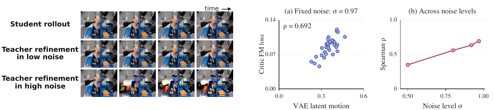
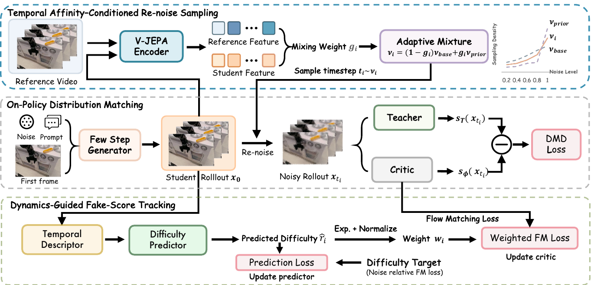
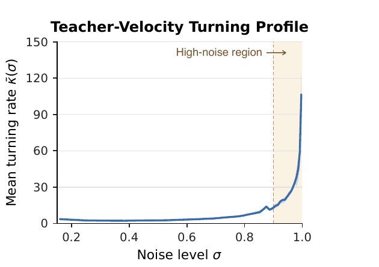
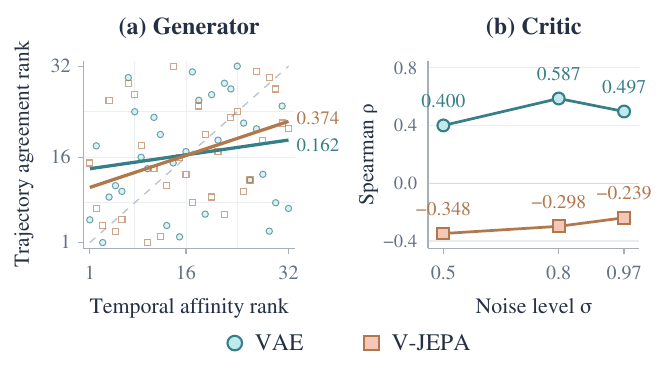

# DyMD: Preserving Interaction Dynamics through Distribution Matching Distillation in Few-Step Video World Models

**论文**: [arXiv:2609.31349v1](https://arxiv.org/abs/2609.31349) (cs.CV, 2026-09-25, 15 页：正文 8 页 + 参考文献 2 页 + 附录 5 页)
**作者**: Haojun Xu, Jie Huang‡, Xin Lu, Mingchen Zhong, Zihao Fan, Linjiang Huang†, Si Liu — **北京航空航天大学 + 京东 JD Future Academy**（‡ project leader，† 通讯作者）
**Teacher → Student**: PF-Wan 14B I2V（PhysisForcing 在机器人操作视频上微调的 Wan）→ **4 步双向 1.3B**（从 Wan2.1-Fun-V1.1-1.3B-InP 初始化）
**代码**: 论文与 arXiv 页面都没有代码或项目页链接（v1）

---

## 1. 一句话定位

**DyMD 修的是 DMD 蒸馏把机器人操作视频"蒸成静止画面"的问题。它不改 DMD 的目标函数，只改两处训练时的采样与加权：① 每条学生 rollout 的 re-noise timestep 分布，按它和配对真实视频的 V-JEPA 运动一致性，在 base schedule 与一个"teacher-velocity turning prior"之间混合；② critic 的 flow-matching loss，按预测出来的"拟合难度"给每条 rollout 加权。** 推理时不带任何额外模块。

| | PF-Wan（teacher） | Wan2.1-Fun（未蒸馏的学生初始化） | Base DMD | **DyMD** |
|---|---|---|---|---|
| 参数 / NFE | 14B / 80 | 1.3B / 100 | 1.3B / 4 | 1.3B / 4 |
| R-Bench TAC（域内，头号指标） | 75.3 | **47.3** | 34.6 | **44.2**（+9.6） |
| PAI-Bench-G Domain | 89.0 | 79.0 | 74.4 | **79.5**（+5.1） |
| EZS-Bench Domain | 83.2 | 75.5 | 73.3 | **76.2**（+2.9） |
| PAI Quality（画质） | 76.9 | 75.3 | 78.1 | 78.1 |
| WorldArena 两任务平均成功率 | — | — | 16% | **34%** |

（数字全部来自 Table 1 / Table 5，括号里是相对 Base DMD 的增量，我逐项复算过。）

🔴 **读完全文后我认为头条要打三个折扣**：
1. **9.6 分里有 5.4 分（56%）来自"把 re-noise 的 shift 从 5 调到 25"这一个超参。** 论文自己的 Table 3 放了这个对照（Shift-25：TAC 40.0）。再往上，turning prior 的形状贡献 2.5，两个命名组件——affinity 条件化和 critic 加权——**加起来只有 1.7 分**（+1.0 与 +0.7），全文单次训练、无误差棒（见 [§5.2](#52-消融把-96-分拆开)）。
2. **DyMD 的 TAC（44.2）仍低于它自己的未蒸馏初始化（47.3）**，离 teacher（75.3）差 31.1。所以它做到的主要是"把 DMD 弄丢的 12.7 分找回 9.6 分"，而不是"把 14B teacher 在机器人数据上学到的交互动力学搬进学生"。论文正文没讨论这一行（见 [§5.1](#51-主表table-1)）。
3. **WorldArena 16%→34% 几乎全部来自 Click Bell 一个任务（31→66）**，Adjust Bottle 是 100 次里成功 1 次 vs 2 次；两个 backbone 的 VPP head 是在不同训练步数上评测的（13904 vs 15010、4509 vs 5319），挑选规则没写；而且规划用的是**最高噪声那一步的一次部分前向的 DiT 特征**，不是生成的视频（见 [§5.4](#54-worldarena-动作规划table-5)）。

📌 **站得住的部分**：诊断干净——Fig 2 直接展示了"低噪 re-noise 让 teacher 修不动运动、高噪能修但出伪影"，Prop 2 把它写成两模态后验的闭式结果（我核对过推导）；Table 3 用"SNR<1 质量对齐"的 Shift-25 做对照，这类对照在同类论文里很少见（[Mask Forcing](../mask_forcing/analysis.md) 就缺）；Table 1 的加粗是诚实的，Base DMD 赢的两个 Physics 列都给了 Base DMD 加粗；turning profile 只要 32 条 teacher 轨迹就能测出来，成本很低。

---

## 2. 要解决的问题

**现象**：对机器人操作视频做 vanilla DMD，得到的学生画面锐利，但机器人—物体交互几乎不动（Fig 1 上排的标注是 *"Limited motion / Implausible deformation"*）。Table 1 把这件事量化得很清楚：**相对未蒸馏的 1.3B 初始化，Base DMD 的 PAI Quality 从 75.3 升到 78.1，TAC 却从 47.3 掉到 34.6。** 画质指标涨、任务完成度跌。

论文把原因拆成 DMD 两个信号各自的问题：

**(a) Teacher 侧的 mode locking**。DMD 把学生输出重新加噪到 `x_t` 再问 teacher，teacher 的干净视频后验是：

$$
p_T(x_0 \mid x_t, c) \propto p_T(x_0 \mid c)\,\mathcal{N}\left(x_t;\,(1-\sigma_t)x_0,\,\sigma_t^2 I\right),\qquad \mathrm{SNR}_t = \frac{(1-\sigma_t)^2}{\sigma_t^2}
$$

SNR 高（噪声弱）时，高斯似然把后验钉在学生那条"动作不足"的 rollout 附近，teacher score 由这个后验的均值决定，于是**即使 teacher score 算得完全准确，也不会把样本往"有运动"的方向推**。附录 C.2 的两模态模型把它写成闭式（teacher 只有静态模式 `x_s` 和运动模式 `x_m` 两个 Dirac，学生塌在 `x_s`，`d = x_m − x_s`）：

$$
\mathbb{E}_\varepsilon\left[\log\frac{p_T(x_m \mid x_t,c)}{p_T(x_s \mid x_t,c)}\right] = \log\frac{\pi_m}{\pi_s} - \frac{\mathrm{SNR}_t}{2}\,\|d\|_2^2
$$

我按 `x_t = (1−σ)x_s + σε` 展开两个高斯的平方距离核对过，推导正确（非期望形式还多一项 `((1−σ)/σ)⟨ε, d⟩`，期望为零）。📌 **这条式子真正有用的是 `SNR·‖d‖²` 这个乘积**：视频 latent 维度极高，两个模式之间的 `‖d‖²` 很大，所以要让运动模式拿到可观的后验权重，SNR 得压得非常低，也就是 σ 非常接近 1。这和后面 Fig 5 里 turning 率在 σ→1 处陡升对得上。它本质上是把"DMD 在低噪声处只能做局部修正、移不动 mode"这个已知性质形式化了，新意在于后面怎么用它。

**(b) Critic 滞后**。fake score `s_φ` 要跟踪一个不断变化的学生分布，更新次数有限，误差会经 `s_φ − s_T` 传给 generator。Fig 3 的证据是：在 32 条冻结 rollout 上，**VAE latent 运动幅度越大，critic 的 FM loss 越高**（σ=0.97 时 Spearman ρ=0.692），且这个相关随 σ 升高而变强（σ=0.5 约 0.35 → 0.97 约 0.69）。

> **左 · Fig 2**：同一条近乎静止的 4 步 DMD rollout，分别在低噪声和高噪声下交给冻结的 PF-Wan teacher 精修。低噪声那行几乎和原 rollout 一样静止；高噪声那行恢复了机械臂运动，但出现了明显的彩色块伪影。**这张图就是方法的动机：高噪声能恢复运动，但会损失外观，所以要按 rollout 自适应地混合。**
> **右 · Fig 3**：(a) σ=0.97 下 32 条 rollout 的 VAE latent 运动幅度 vs critic FM loss，ρ=0.692；(b) 同一批 rollout 在 σ ∈ {0.5, 0.8, 0.92, 0.97} 四档上的 Spearman ρ，随 σ 单调上升。⚠️ 我对这张图的解读和论文不同，见 [§7 ①](#7-争议与权衡)。

---

## 3. 方法

> **Fig 4**：中间一行是标准 on-policy DMD——噪声 + prompt + 首帧 → few-step generator → 学生 rollout `x_0` → re-noise 到 `x_{t_i}` → teacher 与 critic 各给一个 score，差值作 DMD loss。**上面一行（§3.3）决定 re-noise 的 `t_i` 从哪个分布采**：参考视频与学生视频过 V-JEPA，算出混合权重 `g_i`，在 `ν_base` 和 `ν_prior` 之间插值（右上角小图：`ν_prior` 把密度压在高噪声端，`ν_i` 介于两者之间）。**下面一行（§3.4）决定 critic 的 FM loss 怎么加权**：学生 latent → 时间描述子 → 难度预测器 → `r̂_i` → 指数归一化成权重 `w_i`；预测器自己用"噪声相对 FM loss"作监督。generator 与 critic 共用同一个 timestep 采样规则；所有辅助模块只在训练时存在。

### 3.1 DMD 回顾（Eq 1–3）

$$
\nabla_\theta \mathcal{L}_G \approx \mathbb{E}\left[\left(\frac{\partial x_0^S}{\partial \theta}\right)^\top \left(s_\phi - s_T\right)\right]
$$

$$
s_\phi(x_t,t,c) = -\frac{x_t + (1-\sigma_t)\,v_\phi(x_t,t,c)}{\sigma_t},\qquad \mathcal{L}_{FM} \propto \mathbb{E}\left\|v_\phi(x_t,t,c) - (\varepsilon - x_0^S)\right\|_2^2
$$

critic `v_φ` 在 detached 的学生 rollout 上做 flow matching，通过 Eq 2 换算成学生 score 的估计；generator 与 critic 交替更新，各自用独立采样的 rollout。

### 3.2 Teacher-velocity turning prior（Eq 5、6、10）

**思路**：找 teacher 去噪方向"急转弯"的噪声区间，在那里多采 re-noise timestep。

1. **中心化速度**：teacher 采样速度 `v̂_T(x_σ, σ, c)` 减去未来 block 的时间均值（算子 `C`，附录里写作 `H`，不含首个观测 block），得到 `v^c_m(σ)`，单位方向 `u_m(σ) = v^c_m / ‖v^c_m‖`。
2. **turning 率**：相邻采样步之间方向变化的角度除以噪声差：

$$
\hat\kappa_{m,k} = \frac{\arccos\left(u_m(\sigma_k)^\top u_m(\sigma_{k+1})\right)}{\left|\sigma_{k+1} - \sigma_k\right|}
$$

3. **测 profile**：PF-Wan 官方 40 步求解器、CFG 5，跑 32 条轨迹，按轨迹平均得 `κ̄(σ)`，再沿 σ 平滑得 `κ̃(σ)`（Fig 5）。
4. **变成采样密度**（`ε_κ = 0.1·median(κ̃)` 保证支撑集不为零）：

$$
h_\kappa(t) = \left(\tilde\kappa(\sigma_t) + \epsilon_\kappa\right)^2,\qquad \nu_\kappa(t) = \frac{h_\kappa(t)}{\int_{\mathcal{T}} h_\kappa(u)\,du}
$$

> **Fig 5**：σ < 0.85 时平均 turning 率只有 3–10 左右，σ → 1 时陡升到约 107（浅黄区是 σ ∈ [0.9, 1]）。**平方之后，prior 的质量绝大部分压在 σ 接近 1 的一小段上**——这就是它和"简单加大 shift"最终的区别所在，也是 §5.2 要回答的问题。

**理论支撑（Prop 1）**：在精确条件流、中心化速度有下界、投影后验协方差迹有上界的条件下，

$$
\mathbb{E}_m\left[\mathcal{I}_m(\sigma)\right] \ge C_I\,\bar\kappa(\sigma)^2,\qquad \mathcal{I}_m(\sigma) = \mathbb{E}_{\pi_{m,\sigma}}\left[\left(\frac{d}{d\sigma}\log \pi_{m,\sigma}(x_0)\right)^2\right]
$$

即 turning 大 ⇒ 干净视频后验沿 σ 变化快（后验路径的 Fisher 信息大）。我顺着附录 Eq 23–32 核对了证明链：`v = (x − μ)/σ` → 沿特征线 `μ̇ = −σ v̇` → `κ = ‖PHμ̇‖/(σ‖Hv‖)` → 对 `μ̇ = E[(x_0 − μ)ℓ]` 用 Cauchy–Schwarz 得 `‖PHμ̇‖² ≤ tr(PHΣHᵀP)·I` → 对轨迹取期望再用 Jensen。**推导正确，但适用范围要看清**：
- 它是**单向下界**：turning 大能推出后验变化大，反过来推不出，所以它不能说明"只有 turning 大的地方才值得采样"。
- 它针对**精确条件流**；实际测的是带 CFG 的数值轨迹，论文自己承认两者不一致（*"The proposition therefore motivates the empirical turning statistic without establishing the exact solution"*）。
- profile 是在 **teacher 从纯噪声出发的自身轨迹**上测的，而 DMD 是把**学生样本**重新加噪后再问 teacher，两者状态分布不同。
- 从"后验变化大"到"那里的 DMD 梯度最能恢复运动"之间，还差一步论证，论文没有给。

### 3.3 Temporal affinity 条件化的 re-noise 采样（Eq 11–13）

**思路**：rollout 的运动已经和真实视频一致的，就多给 base schedule（精修外观）；不一致的，就多给 teacher prior（高噪声，修运动）。

1. 解码学生视频 `V_i^S`，和**配对的真实训练视频** `V_i^⋆` 一起过冻结的 **V-JEPA 2.1-L**：81 帧里均匀取 16 帧 → `8×24×32×1024` token → 每个 block 在 3×3 全帧网格上池化并归一化（目标视频的特征预先缓存成 `8×9×1024` fp16）。
2. 在时间 lag `ℓ ∈ {1, 2, 4}`（权重 0.2 / 0.3 / 0.5）上取特征差 `δz`，算 **temporal affinity**：

$$
A_i = \frac{2\left\langle \left[(\delta z_i^S)^\top \delta z_i^\star\right]_+ \right\rangle}{\left\langle \|\delta z_i^S\|_2^2 + \|\delta z_i^\star\|_2^2 \right\rangle} \in [0, 1]
$$

两段视频的时间变化完全相同时为 1，方向或幅度不一致都会降低它。

3. 用 affinity 决定混合权重，得到这条 rollout 专属的 timestep 分布：

$$
g_i = \frac{\alpha}{\alpha + (1-\alpha)A_i},\qquad \nu_i(t) = (1-g_i)\,\nu_{\mathrm{base}}(t) + g_i\,\nu_\kappa(t)
$$

`α = 0.3` 是 teacher prior 的最低占比：`A_i = 1` 时 `g_i = α`，`A_i = 0` 时 `g_i = 1`。📌 **按这个式子，`α = 1` 时对任何 `A_i` 都有 `g_i ≡ 1`，即 Table 3 的 "Teacher prior" 那一行等价于 `α = 1`**——下面拼 α 扫描曲线时会用到。

⚠️ **这一步让 DMD 不再只依赖条件输入**：Base DMD 只需要首帧 + prompt，DyMD 的 affinity 需要每个训练条件对应的那条真实视频。另外每步训练都要把学生 rollout 解码成 81 帧 RGB、再过一次 V-JEPA，这部分额外开销论文没有报告。

### 3.4 Dynamics-guided fake-score tracking（Eq 14–17、33）

**思路**：预测哪些 rollout 对 critic 来说"难拟合"，在固定的 critic 更新预算内给它们更大的 loss 权重。

1. **监督目标**：把 log FM loss 减去所在噪声分箱的 EMA 基线（`ρ_b = 0.99`），得到"噪声相对拟合难度"。
2. **输入描述子**：学生 latent 在 lag {1, 2, 4, 8} 上的 RMS 差分序列，加上相对首个 block 的位移序列，每条序列取 [mean, std, max, last]，拼成 20 维再取 `log(1+x)`。
3. **预测器**：两层隐藏层 MLP，输入描述子 + Fourier 噪声嵌入，Huber loss 在线训练。
4. **加权**（`β = 0.5`，在全局 minibatch 上归一化到均值 1；`λ_pred = 1.0`）：

$$
r_i = \mathrm{sg}\left[\log \ell_i^{FM} - b_{k(t_i)}\right],\qquad \hat r_i = f\left(d_i, e(t_i)\right),\qquad w_i = \frac{\exp(\beta \hat r_i)}{B^{-1}\sum_{j=1}^{B}\exp(\beta \hat r_j)}
$$

$$
\mathcal{L}_C = \frac{1}{B}\sum_{i=1}^{B}\mathrm{sg}[w_i]\,\ell_i^{FM}(\phi) + \lambda_{pred}\,\mathcal{L}_{pred}
$$

权重是 detached 的，所以预测器只从 `L_pred` 学；critic 的更新次数不变。噪声分箱数论文没写。

---

## 4. 实验设置

**模型与训练**

| 项 | 设置 |
|---|---|
| Teacher | PF-Wan 14B I2V（PhysisForcing [36] 用交互导向的物理监督在机器人操作视频上微调）；官方 40 步、shift 5、CFG 5；NFE 80 |
| Student / critic 初始化 | Wan2.1-Fun-V1.1-1.3B-InP，**双向**（不是因果 AR）；VideoX-Fun 的 I2V 接口：输入图作首帧、后续帧补零，mask 标记首个 latent block；与 teacher 共用 16 通道 Wan2.1 VAE latent |
| Student 采样 | 4 次去噪，model time {1, 0.75, 0.5, 0.25}、shift 5（换算成 σ 为 {1, 0.9375, 0.8333, 0.625}，我按 shift 公式算的，和 [ViRDM](../virdm/analysis.md) 的学生 schedule 相同）→ 21 个 latent block → 81 帧 @16 FPS（约 5 秒） |
| DMD 细节 | teacher score 用 CFG 5；critic 是无 CFG 的条件模型；训练时随机 denoising exit（附录 D.3） |
| Re-noise 区间 | `T = [0.020, 0.999)`；base schedule 为均匀 raw time + shift 5 |
| 数据 | 从 RoVid-X（2,824,039 条）筛出 **32,897 条**：caption 去重（ViT-L/14 文本嵌入，贪心覆盖、余弦阈值 0.95）→ 448,528；首帧图文相似度取前 50% → 224,264；CoTracker3 有效轨迹 ≥ 50 且平均可见度 ≥ 0.6 → 32,897（保留 14.7%） |
| 训练预算 | 所有 DMD 变体都是 **2,500 步、有效 batch 32**（约 80k 样本、约 2.4 个 epoch，我算的） |
| 超参（Table S3） | α = 0.3，β = 0.5，λ_pred = 1.0，ρ_b = 0.99，ε_κ = 0.1·median(κ̃)，affinity lag {1,2,4} / 权重 (0.2, 0.3, 0.5)，描述子 lag {1,2,4,8}、20 维 |
| **没给** | GPU 型号 / 数量 / 训练时长；generator 与 critic 的学习率、优化器、每个 generator step 配几次 critic 更新；噪声分箱数；训练分辨率；**Table 1 用的是哪一步的 checkpoint**（定性图明确用 step-1500，附录 D.2 用 step-1500 的 critic，D.3 用 step-2000） |

**评测**

| Benchmark | 协议 |
|---|---|
| **R-Bench** embodiment split（域内） | 400 个图—prompt 对，4 种本体（双臂、人形、单臂、四足）；**GPT-5 看 6 张均匀采样帧给 1–5 分任务完成度**，归一化为 `(r−1)/4`；Overall = 先在本体内平均、再四个本体等权平均 |
| **PAI-Bench-G** 机器人子集（跨数据集） | 174 个条件、913 道二值题；采 8 帧，Qwen3-VL-235B 按官方 binary-VQA 模板判；Domain = 逐视频准确率的平均；Space / Physics / Time 在各轴内按题 micro 平均；Quality = SC、BC、MS、AQ、IQ、OC、IS、IB 八项的平均 |
| **EZS-Bench**（跨数据集） | 196 个未见任务—场景条件、2,272 道二值题；官方双模型协议（Qwen3-VL-32B-Thinking 出题和物理检查单，Qwen2.5-VL-72B-Instruct 打分）；**生成用的 prompt 按 PhysisForcing 的做法，由 GPT-5 结合首帧改写成 40–60 词的动作描述**，打分题目不变 |
| **WorldArena** 动作规划 | RoboTwin 2.0 的 Adjust Bottle、Click Bell；backbone 冻结，**取首个（最高噪声）timestep 的中间层 DiT 特征，只做一次部分前向，不跑完去噪也不解码**；VPP 头：6 层 Video Former、8 头、399 个 latent query + action-denoising head；每任务 50 条示教（aloha-agilex_clean_50），每个样本配 45 步 14 维关节动作；AdamW、lr 1e-4、wd 0.05、(β₁, β₂) = (0.9, 0.9)、8 进程 × batch 8、200 epoch；闭环 100 个 episode / 任务 |
| 随机性 | 所有模型用相同首帧、prompt、随机种子；**每个配置只训一次，全文无误差棒** |

---

## 5. 结果

### 5.1 主表（Table 1）

R-Bench TAC（按本体）：

| Method | Params | NFE | Overall | Dual | Hum. | Single | Quad. |
|---|---|---|---|---|---|---|---|
| PF-Wan | 14B | 80 | 75.3 | 72.5 | 79.8 | 71.8 | 77.2 |
| Wan2.1-Fun | 1.3B | 100 | 47.3 | 42.5 | 53.2 | 30.8 | 63.2 |
| Base DMD | 1.3B | 4 | 34.6 | 25.2 | 33.4 | 25.8 | 54.0 |
| **DyMD** | 1.3B | 4 | **44.2** | **38.8** | **48.0** | **31.2** | **58.8** |

PAI-Bench-G 与 EZS-Bench：

| Method | PAI Domain | Space | Physics | Time | Quality | EZS Domain | Space | Physics | Time |
|---|---|---|---|---|---|---|---|---|---|
| PF-Wan | 89.0 | 91.8 | 92.2 | 88.4 | 76.9 | 83.2 | 80.9 | 89.2 | 78.0 |
| Wan2.1-Fun | 79.0 | 79.7 | 82.5 | 76.4 | 75.3 | 75.5 | 71.7 | 83.9 | 68.8 |
| Base DMD | 74.4 | 77.0 | **82.8** | 64.7 | 78.1 | 73.3 | 66.9 | **86.0** | 64.8 |
| **DyMD** | **79.5** | **82.4** | 81.2 | **73.5** | **78.1** | **76.2** | **71.8** | 84.4 | **70.8** |

（加粗按原表：只在 Base DMD 与 DyMD 这一对之间比较。）

**论文的说法都核对得上**：TAC +9.6、PAI / EZS Domain +5.1 / +2.9、PAI Physics 上 Base DMD 高 1.6。论文把最后一条解释为 *"its near-static outputs preserve plausible physical states without executing the instructed interaction"*——**EZS Physics 上 Base DMD 也高 1.6（86.0 vs 84.4），正文没提，但表里照实加粗了。** 两个 benchmark 的 Physics 轴都在奖励"不动"。

**论文没讨论、但我认为最该看的一行是未蒸馏的初始化 Wan2.1-Fun**：
- **域内 TAC 上 DyMD 仍比它低 3.1**（44.2 vs 47.3）；按本体看，双臂 −3.7、人形 −5.2、四足 −4.4，只有单臂 +0.4。
- 跨数据集的 Domain 分上 DyMD 略高（PAI +0.5、EZS +0.7）；Time 轴一低一高（PAI −2.9、EZS +2.0）。
- 换个说法：**Base DMD 相对初始化丢了 12.7 分 TAC，DyMD 找回了其中 9.6 分（76%）**；teacher 与学生之间的 TAC 差距从 40.7 缩到 31.1，只缩了 24%。
- 缺的关键对照是**把 1.3B 直接在同样 32,897 条视频上微调**——那才能回答"14B teacher 的机器人交互知识到底有没有经 DMD 传给学生"。Wan2.1-Fun 本身没在机器人数据上训过，是个偏弱的参照。

📌 **Quality 这个指标本身偏爱静止画面**：近乎静止的 Base DMD（78.1）比 14B teacher（76.9）还高，差距主要来自 subject consistency（95.3 vs 90.3）和 motion smoothness（99.5 vs 98.9）（Table S4）。所以"画质不降"这句话在这里约束力很弱。反过来看，DyMD 动作更多，SC 仍是 95.3、Quality 仍是 78.1，这一点对它有利。

### 5.2 消融：把 9.6 分拆开

把 Table 2 / 3 / 4 / S5 / S6 的行放到一起（它们在重复的配置上数值完全一致，比如 "affinity-conditioned, β=0" 在 Table 2 / 3 / S5 / S6 都是 43.5 / 78.5 / 78.1 / 75.1，可以放心拼）：

| 配置 | TAC | PAI Domain | PAI Quality | EZS Domain | 出处 |
|---|---|---|---|---|---|
| Base DMD（shift 5，critic 均匀权重） | 34.6 | 74.4 | 78.1 | 73.3 | T1/T2/T3 |
| **Shift-25**（β=0） | **40.0** | 77.2 | **78.2** | 74.6 | T3 |
| Teacher prior（≡ α=1，β=0） | 42.5 | 77.9 | 78.0 | 75.0 | T3 |
| Affinity 条件化 α=0.3（V-JEPA，β=0） | 43.5 | 78.5 | 78.1 | 75.1 | T2/T3/S5/S6 |
| **+ critic 加权 β=0.5 = DyMD** | **44.2** | **79.5** | 78.1 | **76.2** | T1/T2/T4 |
| *旁支：只开 critic 加权（base schedule）* | 38.3 | 75.4 | 78.0 | 74.0 | T2 |
| *旁支：affinity 改用 DINOv2-L* | 41.8 | 76.7 | 77.8 | 75.0 | S5 |
| *旁支：α = 0.1 / 0.5* | 39.2 / 43.8 | 77.4 / 78.2 | 78.1 / 78.1 | 73.2 / 74.8 | S6 |
| *旁支：β = 0.1 / 1.0* | 43.8 / 43.6 | 79.1 / 78.4 | 78.0 / 78.1 | 75.4 / 75.1 | T4 |

**TAC 的 +9.6 按主干各行依次拆**：Shift-25 **+5.4（56%）** → turning prior 的形状 +2.5（26%）→ affinity 条件化 +1.0（10%）→ critic 加权 +0.7（7%）。PAI Domain 的 +5.1 拆出来是 +2.8（55%）/ +0.7 / +0.6 / +1.0；EZS Domain 的 +2.9 是 +1.3（45%）/ +0.4 / +0.1 / +1.1。**三个指标上，最大的一块都是"把 shift 调大"。**

我从这张表读出的几点：

1. **Shift-25 是这篇最有价值的一行。** 论文选 s = 25 是为了让 SNR<1（σ > 0.5）区域的质量和 teacher prior 对齐（附录 B.3：96.14% vs 95.69%）。我按 Eq 18 在 `T = [0.020, 0.999)` 上复算，Shift-25 的 96.14% 完全一致；同样算出来的其他数字如下：

   | re-noise 分布 | σ > 0.5（SNR<1）的质量 | σ ≥ 0.9 的质量 |
   |---|---|---|
   | shift 5（Base DMD） | 83.6% | 35.5% |
   | shift 25 | 96.1% | 72.9% |
   | teacher prior | 95.69%（论文给的） | 论文没给；从 Fig 5 的曲线形状看应明显高于 Shift-25 |

   也就是说 Base DMD 本来就有 84% 的质量在 SNR<1 区域，**Shift-25 真正改变的是 σ ≥ 0.9 这一段，从约 36% 提到约 73%。** 而"对齐 SNR<1 的质量"并没有对齐 σ ≥ 0.9 的质量——teacher prior 比 Shift-25 更集中在 σ→1。**所以 teacher prior 多出来的 +2.5，有多少来自"turning 形状"、多少只来自"更极端的高噪声"，这张表分不开**，还需要一个更大 shift（比如 50 或 100）的对照。

2. **Affinity 条件化的收益很脆。** 用 V-JEPA 时比固定 prior 高 1.0；**换成 DINOv2 反而比固定 prior 低 0.7（41.8 vs 42.5）**；α = 0.1 时比固定 prior 低 3.3，甚至不如 Shift-25（39.2 vs 40.0）。按 §3.3 的等价关系把 α 扫描拼起来：α = 0.1 / 0.3 / 0.5 / 1.0 对应 TAC 39.2 / 43.5 / 43.8 / 42.5。**TAC 最高的其实是 α = 0.5**，论文选 0.3 是因为两个 Domain 分更高（78.5 vs 78.2、75.1 vs 74.8）。

3. **Critic 加权单独开有 +3.7，叠在采样上只剩 +0.7**，两者明显不可加（单独之和 12.6 > 合并 9.6）。β 从 0 扫到 1.0，TAC 在 43.5–44.2 之间，**β = 1.0（43.6）和 β = 0（43.5）几乎一样。**

4. **这些 1 分以内的差异能不能当结论，全文没有给出判断依据。** 每个配置训一次、评一次；α 和 β 是在最终报告用的同一批 benchmark 上挑的，没有单独的验证集。给个量级参考：TAC 是 400 个 GPT-5 五档评分的均值，如果每条视频的归一化评分标准差在 0.3–0.4（这是我的假设，论文没给方差），单次评测均值的标准误约 1.5–2 分；同 prompt、同 seed 的配对设计会让差值的误差小一些，再加上 GPT-5 打分本身的随机性。在这个量级下，+0.7 和 +1.0 都不足以区分。

### 5.3 表示分析（Fig 7、附录 D）

> **Fig 7**：(a) 32 对学生—目标视频上，temporal affinity 的排名 vs CoTracker3 轨迹一致性的排名；V-JEPA 的 Spearman 0.374，VAE 0.162。(b) 用离线 MLP 从时间描述子预测 log FM loss，σ ∈ {0.5, 0.8, 0.97} 三档上的 Spearman：VAE 0.400 / 0.587 / 0.497，V-JEPA −0.348 / −0.298 / −0.239。论文据此为 generator 侧的 affinity 选 V-JEPA、为 critic 侧的难度预测选 VAE。

- **Generator 侧（D.1）**：n = 32 时，ρ = 0.374 的双侧 p ≈ 0.035，ρ = 0.162 的 p ≈ 0.38（我用 t 近似算的）；Kendall 0.246 vs 0.117；"最差 8 条"的召回 50% vs 25%（4/8 vs 2/8，后者等于随机）。V-JEPA 更好的方向是对的，但**证据只是边缘显著**，两个相关系数之差本身也没做检验。Table S5 的下游结果（V-JEPA 比 DINOv2 高 1.7 TAC）方向一致。
- **Critic 侧（D.2）**：4 折、按 rollout 分组的交叉验证，out-of-fold Spearman 在各噪声档内算再平均：**VAE 0.460 ± 0.048，V-JEPA −0.254 ± 0.125**；最难四分位召回 36.7% vs 12.5%（随机 25%）。
  - ⚠️ **"V-JEPA 一致负相关"更可能是交叉验证的伪影，而不是 V-JEPA 带着反向信息。** 特征没有信息时，模型基本只会输出训练折的均值；某一折的真实值整体偏高，其余三折的均值就偏低，于是 out-of-fold 预测和真实值天然负相关。我按 32 个样本、4 折做了模拟：纯均值预测器的平均 Spearman 约 −0.27，加一点预测噪声后在 −0.24 到 −0.13 之间——**和观测到的 −0.24 到 −0.35 同一量级**。V-JEPA 的四分位召回低于随机（12.5%）也符合这个解释。这个伪影会把所有 out-of-fold 相关往下拉，所以 VAE 的 +0.46 如果有偏，也是偏保守的。**结论"VAE 描述子更适合 critic 侧"不受影响，但"V-JEPA 负相关"不该被读成一个发现**；要确认，做一个打乱标签的置换对照就够了。
  - ⚠️ **Fig 7(b) 只画了测量的 4 档里的 3 档。** D.2 写的测量协议是 σ ∈ {0.5, 0.8, 0.92, 0.97}，图里没有 0.92。图上三档的均值是 VAE 0.495 / V-JEPA −0.295，与报告的平均值 0.460 / −0.254 不一致；**如果 0.460 是四档的简单平均，没画出的 σ = 0.92 那档 VAE 约为 0.36，是四档里最低的**（V-JEPA 约 −0.13）。
- **在线预测器（D.3）**：从 step-2000 的 checkpoint 冻结预测器，在 32 条新 rollout 上 Spearman 0.758 / 0.898 / 0.952（σ = 0.5 / 0.8 / 0.97）。这说明**它能很好地预测 FM loss**；至于 FM loss 本身是不是"critic 误差"的好代理，是另一个问题，见 §7 ①。

### 5.4 WorldArena 动作规划（Table 5）

| Model | Adjust Bottle | Click Bell | Avg. |
|---|---|---|---|
| Genie Envisioner | 10.0 | 20.0 | 15.0 |
| TesserAct | 1.0 | 35.0 | 18.0 |
| RoboMaster | 8.0 | 20.0 | 14.0 |
| Vidar | 2.0 | 19.0 | 10.5 |
| WoW | 20.0 | 21.0 | 20.5 |
| Wan2.2-TI2V-5B | 12.0 | 20.0 | 16.0 |
| Base DMD（Wan2.1-1.3B） | 1.0 | 31.0 | 16.0 |
| **DyMD**（Wan2.1-1.3B） | **2.0** | **66.0** | **34.0** |

上半区是 PhysisForcing 报告的结果，下半区是本文结果；原表只在下半区比较加粗。八行平均值我都复算过。

- **Click Bell 31% → 66% 是实打实的**：100 个 episode 下两比例 z 检验 z ≈ 4.9（我算的），episode 采样噪声解释不了。**Adjust Bottle 1 → 2 就是噪声**，而且 DyMD 的 2.0 低于上半区 6 个模型中的 4 个（WoW 20、Wan2.2-TI2V-5B 12、Genie Envisioner 10、RoboMaster 8）。所以"平均 16% → 34%"应该读成"一个任务显著提升，另一个任务两者都不会做"。
- ⚠️ **两个 backbone 的 VPP head 是在不同步数上评测的**：Adjust Bottle 用 Base DMD 第 13904 步 vs DyMD 第 15010 步，Click Bell 用 4509 vs 5319。同一任务两个 head 的数据、batch、epoch 数都相同，训练总步数应当一样，所以这两个步数不是"训练结束那一步"，而是挑出来的；**挑选规则论文没写**。如果是按闭环成功率挑的，两个数字都偏乐观，也没法判断对两边是否公平。VPP head 本身也只训了一次。
- ⚠️ **规划用的是首个（最高噪声）timestep 的 DiT 中间特征，一次部分前向，不跑完去噪、不解码 RGB**（附录 F.1）。所以这个实验衡量的是"学生第一步去噪的内部表示对动作有多大信息量"，**和"生成视频里的交互动力学更好"之间是间接关系**。它仍然是一个有意义的下游信号，只是不能直接当作视频质量的证据。
- 上半区与下半区用的 backbone、VPP 训练、checkpoint 选取未必一致，摘要里只拿下半区比（34% vs 16%），这一点措辞上是克制的。

### 5.5 定性结果（Fig 6、Fig S1）

四个 PAI-Bench-G 例子（举集装箱、递菜单、开烤箱门、捡纸团）：Base DMD 要么几乎不动，要么夹爪动了但没完成交互；DyMD 完成了指令动作。⚠️ **附录说明这些定性图用的是 step-1500 的 checkpoint**（*"with prompts, seeds, and step-1500 checkpoints matched to the main qualitative results"*），而训练预算是 2,500 步。

---

## 6. 数字核对

| 项 | 结果 |
|---|---|
| 正文增量：+9.6 / +5.1 / +2.9 / Physics 1.6 | ✅ |
| Table 3 / S5 / S6 正文里的增量（4.3 / 1.1 / 1.9；0.3 / −0.3 / −0.3；1.7 / 1.8 / 0.3 / 0.1） | ✅ |
| TAC Overall = 四个本体等权平均（附录 F 的定义） | ✅ PF-Wan 75.325→75.3、Base DMD 34.6、DyMD 44.2；⚠️ **Wan2.1-Fun：(42.5+53.2+30.8+63.2)/4 = 47.425**，各项舍入误差 ±0.05 下均值落在 [47.375, 47.475]，应为 47.4，表中是 47.3 |
| PAI Quality = 八项平均（Table S4） | ✅ 四行分别为 76.89 / 75.33 / 78.09 / 78.14 |
| Table 5 平均值 | ✅ 八行 |
| Table S1 漏斗 | ✅ 32,897 / 224,264 = 14.67%；224,264 恰为 448,528 的一半 |
| Shift-25 的 SNR<1 质量 96.14% | ✅ 按 Eq 18 在 `[0.020, 0.999)` 上复算一致 |
| Prop 2 的展开 | ✅ |
| Prop 1 的证明链（Eq 23–32） | ✅ |
| 并列加粗 | ⚠️ Table 4、S4、S6 的标题都写 *"including ties"*，但并列值只给 DyMD / 默认行加粗：Table 4 Quality（β = 1.0 也是 78.1）、S4 的 SC（95.3）和 IB（98.9）、S6 Quality（α = 0.1 / 0.5 也是 78.1）。按 S4 子项算，Quality 未舍入的差是 78.14 vs 78.09，在舍入误差之内 |
| 笔误 | ⚠️ Table S4 Base DMD 的 IB 格写成 "98.9dymd"；Eq 18 写成 `σ_t = t = f_s(u) = 1000·s(u)/(1+(s−1)(u))`，把 [0,1] 的 σ 和 1000 尺度的 model time 写成了同一个量 |
| Fig 1 | ⚠️ PAI-Bench-G 柱状图的纵轴从 70 起（另外两个从 0 起），74.4 vs 79.5 的柱高比例约为 1:2.2 |
| Fig 7(b) | ⚠️ 测了四档、画了三档（见 §5.3） |

---

## 7. 争议与权衡

**① FM loss 高不等于 critic 拟合得差——Fig 3 分不开这两件事。** 对 flow matching，`ε − x_0 = (x_σ − x_0)/σ`，所以 Bayes 最优的 critic 是

$$
v^\star(x_\sigma) = \mathbb{E}_q[\varepsilon - x_0 \mid x_\sigma] = \frac{x_\sigma - \mathbb{E}_q[x_0 \mid x_\sigma]}{\sigma}
\quad\Rightarrow\quad
\left\|v^\star(x_\sigma) - (\varepsilon - x_0)\right\|_2^2 = \frac{\left\|x_0 - \mathbb{E}_q[x_0 \mid x_\sigma]\right\|_2^2}{\sigma^2}
$$

**即使 critic 完美，单条 rollout 的 FM loss 也等于它离学生分布后验均值的距离。** 学生分布本来就以静止为主（这正是要解决的问题），运动大的 rollout 在学生分布里是"非典型"样本，离后验均值更远，loss 自然更高；σ 越大，后验均值越接近条件均值、越不受 `x_σ` 约束，这个相关就应该越强——**这正是 Fig 3(b) 的上升趋势**。噪声分箱基线 `b_k` 去掉了 σ 带来的整体尺度，但去不掉"这条样本有多非典型"这一项。所以 Fig 3 既符合论文的"critic 跟不上运动样本"，也符合"运动样本本身的不可约误差更大"。能区分两者的实验是：在冻结的学生快照上把 critic 训到收敛，看运动—loss 相关是否还在。论文没做。

**② 加权 FM 会改变 critic 的最优解，而且在理想情况下方向对恢复运动不利。** 带权重 `w(x_0, t)` 的 FM 最优解是倾斜分布的速度场：

$$
v^\star_w(x_\sigma) = \frac{x_\sigma - \mathbb{E}_{q_w}[x_0 \mid x_\sigma]}{\sigma},\qquad q_w(x_0) \propto w(x_0, t)\,q(x_0)
$$

运动大的 rollout 权重大于 1，所以 critic 以为学生分布的运动比实际多。generator 的更新方向正比于 teacher 后验均值减 fake 后验均值（附录 Eq 19），fake 一侧被往"有运动"方向偏，**往运动方向推的力就被削弱了**。σ 越大，后验越宽、覆盖的 rollout 越多、权重差异越起作用，而 DyMD 的 re-noise 质量正好集中在高 σ。按 Fig 3(a) 的 loss 范围（0.05–0.12）估，β = 0.5 时权重大约在 0.8–1.2 之间（我的估算，预测值还会更收缩），倾斜幅度不大。**这说明 critic 加权的收益只能来自"有限更新下的跟踪误差"这个非收敛区间**，和论文的叙述一致；但论文只说了 *"Detached weights ensure that f learns only from L_pred"*，没有讨论加权本身改变了 critic 的目标分布。实测收益小（+0.7），β = 1.0 与 β = 0 几乎相同，也和"两种效应部分抵消"的解释相容。

**③ Affinity 依赖"一个条件只有一个正确未来"。** 它衡量的是学生运动和**那一条**真实视频的一致性。机器人操作在首帧 + 指令下的未来比较确定，这个假设大体成立；换到开放场景（比如游戏或角色动画），同一个首帧和 prompt 下合理的未来有很多，按单条参考视频打分会惩罚合理的变体。它还让训练依赖配对视频，不再是只需首帧 + prompt 的 DMD。

**④ 基线只有 Base DMD。** 相关工作里列了 Phased DMD、RTDMD、Adaptive Video Distillation、CoDMD、Reward Forcing、Adaptive Matching Distillation，实验一个都没比；也没有"直接在同样数据上微调 1.3B"或更大 shift 的对照。

**⑤ 标题里的 "world model" 要按字面意思读窄一些。** 学生是双向的 81 帧 I2V 生成器，没有动作条件、不是自回归、不能流式交互；"world model" 的用法是"文本 + 首帧条件的机器人视频预测器"外加"VPP 策略头的特征骨干"。

**⑥ 可复现性弱。** 没有代码，没有算力信息，DMD 本身的优化超参（学习率、critic 更新比）全部缺失，主表用哪个 checkpoint 也没写。

---

## 8. 一句话总结

**DyMD 在 PF-Wan 14B → 4 步 1.3B 的机器人 I2V 蒸馏里，用"按 rollout 与配对真实视频的 V-JEPA 运动一致性，在 base schedule 与 teacher-velocity turning prior 之间混合 re-noise 分布"加"按预测拟合难度给 critic FM loss 加权"，把 R-Bench TAC 从 34.6 提到 44.2、PAI Domain 从 74.4 提到 79.5，画质持平。** 它的诊断（弱 re-noise 下 teacher 后验被钉在静止样本上）清楚且有闭式支撑。🔴 但它自己的消融显示，**最大的一块收益（TAC 9.6 分里的 5.4）来自把 re-noise shift 从 5 调到 25，两个命名组件合计只贡献 1.7 分**，全文单次训练无误差棒、超参在测试基准上挑；**蒸馏后的 TAC 仍低于未蒸馏的 1.3B 初始化（44.2 vs 47.3）**；WorldArena 的翻倍几乎全来自 Click Bell 一个任务，VPP head 的评测 checkpoint 选取规则没写，特征取自最高噪声步的一次部分前向。另外，"运动样本 FM loss 更高"用 Bayes 最优 critic 的不可约误差就能解释，"V-JEPA 负相关"符合交叉验证伪影的量级——这两条都会削弱 critic 加权那一半的论证。

---

## 9. 在仓库图谱里的位置

| | 关系 |
|---|---|
| **[五篇横向对照](../dmd_few_step_ar/analysis.md)** | 那篇 §5.3 指出 Mask Forcing 缺 `α = 1.0` 这个"纯 timestep 平移、无 mask"的对照，无法区分收益来自 mask 还是只来自噪声水平平移。**DyMD 的 Table 3 在另一个设定（双向 I2V、机器人数据）里给了这类对照，答案是纯 shift 就拿到 56% 的收益**——这让"DMD 系补丁的收益很大一部分可能只是噪声水平平移"这个怀疑更有分量。它也为那篇 §6.1 ②"DMD 用配对保真度换单帧观感"补了一个独立数据点：相对初始化，Base DMD 的 Quality 75.3→78.1，TAC 47.3→34.6 |
| **[ViRDM](../virdm/analysis.md)** | 同一个 V-JEPA 2.1-L 编码器，同一个 4 步 shift-5 学生 schedule（σ = 1 / 0.9375 / 0.8333 / 0.625），同样在治"蒸馏后动作变少"。**用法相反**：ViRDM 把 DMD 整个换成 V-JEPA 空间里的 MMD，V-JEPA 是匹配的尺子；DyMD 保留 DMD，V-JEPA 只用来决定 timestep 怎么采。ViRDM 最后靠的是一个等价于 VBench Dynamic Degree 判据的光流正则，DyMD 最后靠的主要是高噪声 re-noise |
| **[Helios](../helios/analysis.md)** | 它的 DMD 阶段用 Beta 分布做 Dynamic Re-noise，训练前期把 timestep 集中在高噪声端（学结构）、后期退回均匀（学细节）——**和 DyMD "高噪声修运动、base schedule 修外观"是同一个直觉**，只是 Helios 按训练进度调度，DyMD 按每条 rollout 调度 |
| **[OPSD-V](../opsd_v/analysis.md)** | 都在 DMD 类训练里引入真实视频：OPSD-V 用真实 chunk 作 teacher 的上下文，DyMD 用配对真实视频作 affinity 的参照。两者都因此不再只依赖 prompt |
| **[Mask Forcing](../mask_forcing/analysis.md)** | 都不改 DMD 目标函数，只动训练时的噪声：Mask Forcing 把问题归到 reverse KL 的 mode-seeking，在 rollout 上做 dual-noise masking；DyMD 把问题归到高 SNR 下 teacher 后验的 mode locking，改 re-noise 的噪声水平分布。DyMD 的 Prop 2 给了"为什么噪声水平是关键旋钮"的一个闭式解释 |
| **[GameWAM](../../world_model/gamewam/analysis.md)** / **[WorldDiT](../../world_model/worlddit/analysis.md)** | DyMD 的 WorldArena 实验是"视频模型当策略骨干"的用法（冻结 backbone + VPP 动作头），和这两篇的世界—动作模型属于同一类下游评估，但 DyMD 只取一步前向的中间特征 |

⚠️ **仓库缺口**：PhysisForcing（teacher PF-Wan 的来源）、R-Bench / RoVid-X、ABot-PhysWorld（EZS-Bench 的来源）、WorldArena、Phased DMD / RTDMD 都还没有笔记。

---

## Q&A

**Q1：DyMD 比"只把 shift 调到 25"到底好多少？**
TAC 44.2 vs 40.0（+4.2），PAI Domain 79.5 vs 77.2（+2.3），EZS Domain 76.2 vs 74.6（+1.6），PAI Quality 78.1 vs 78.2（−0.1）。其中 +2.5 TAC 来自换成 turning prior，但 Shift-25 与 teacher prior 只对齐了 SNR<1 的质量，没对齐 σ ≥ 0.9 的质量（Shift-25 是 72.9%，teacher prior 按 Fig 5 应明显更高），所以这 2.5 分里有多少是"turning 形状"、有多少只是"更极端的高噪声"，论文的实验分不开。

**Q2：为什么弱 re-noise 时 teacher 纠正不了运动？**
teacher 的 score 由它的干净视频后验均值决定。噪声弱时，高斯似然让后验集中在学生样本附近；两模态模型下运动模式的期望 log 后验比是 `log(π_m/π_s) − SNR·‖d‖²/2`。视频 latent 维度高、`‖d‖²` 大，只要 SNR 不是极低，运动模式的后验权重就接近 0，teacher 给的方向就是"把这条静止视频修得更像静止视频"。

**Q3：Teacher-velocity turning prior 怎么测，成本多大？**
用 teacher 自己的采样器（这里是 40 步、shift 5、CFG 5）跑 32 条轨迹，每一步取速度、减去未来 block 的时间均值、归一化成方向，算相邻步的夹角除以噪声差，按轨迹平均再沿 σ 平滑，平方加偏移后归一化成采样密度。成本约等于 32 次完整的 teacher 采样，只做一次；限制是它和 teacher、schedule 绑定，换 teacher 要重测（论文 Limitations 唯一一条）。

**Q4：Temporal affinity 为什么用 V-JEPA，不用 VAE 或 DINOv2？**
论文的两条证据：和 CoTracker3 轨迹一致性的 Spearman（V-JEPA 0.374 vs VAE 0.162，n = 32），以及下游 TAC（V-JEPA 比 DINOv2 高 1.7）。前者 p ≈ 0.035，只是边缘显著；后者要注意，换成 DINOv2 后 affinity 条件化反而比不条件化的固定 prior 还差 0.7。

**Q5：Critic 加权有没有副作用？**
有两个论文没讨论的点（§7 ①②）：FM loss 高不一定是 critic 没拟合好，也可能只是样本非典型；加权后 critic 的最优解是倾斜分布的 score，理想情况下会削弱往运动方向的推力。按 Fig 3(a) 的 loss 范围估，β = 0.5 时权重大约 0.8–1.2，影响温和；实测净收益 +0.7 TAC。

**Q6：推理成本？**
4 NFE（teacher 80、未蒸馏学生 100），推理时没有任何辅助模块。论文没有给 wall-clock、显存或吞吐数字。

**Q7：训练额外成本？**
每步多了：学生 rollout 解码成 81 帧 RGB、V-JEPA 2.1-L 前向（16 帧）、描述子计算、MLP 预测器训练；目标视频的 V-JEPA 特征预先缓存。论文没有给任何算力数字，这部分开销无从估计。

**Q8：能直接用到 Self-Forcing 这类因果 AR 蒸馏上吗？**
论文只做了双向学生，没有证据。按方法结构看：re-noise 分布（shift / turning prior）只依赖 teacher 与 schedule，和学生是不是因果无关，可以直接试；affinity 需要每个训练条件配一条真实视频，AR 的 data-free 设定（如 Self-Forcing 只用 prompt）下用不了；critic 加权与学生结构无关。如果要在自己的 DMD 蒸馏里试，按性价比的顺序是：先调大 re-noise shift（一行改动，本文里拿到 56% 的收益）→ 再测 teacher turning profile 换成 prior → 最后才考虑 affinity 和 critic 加权。

**Q9：为什么 DyMD 的 Physics 分比 Base DMD 低？**
PAI-Bench-G 和 EZS-Bench 的 Physics 轴都是 VLM 判"物理上是否合理"，近乎静止的视频不会出现穿模、形变之类的错误，天然得分高。Base DMD 在两个 benchmark 的 Physics 上都比 DyMD 高 1.6，也都高于未蒸馏的初始化（82.8 vs 82.5、86.0 vs 83.9）。这说明这两个 Physics 轴不惩罚"不执行指令"，不能单独拿来评价交互质量。

*(后续对话中产生的问答追加于此)*
