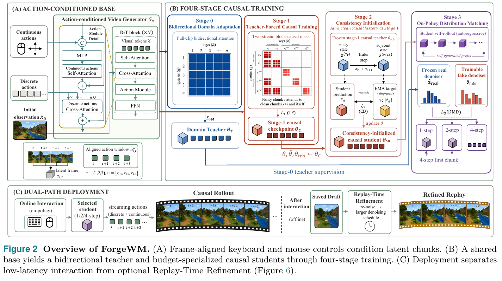
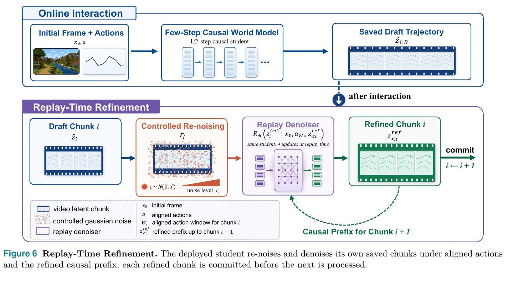
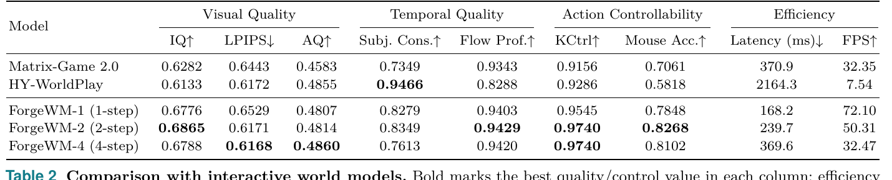
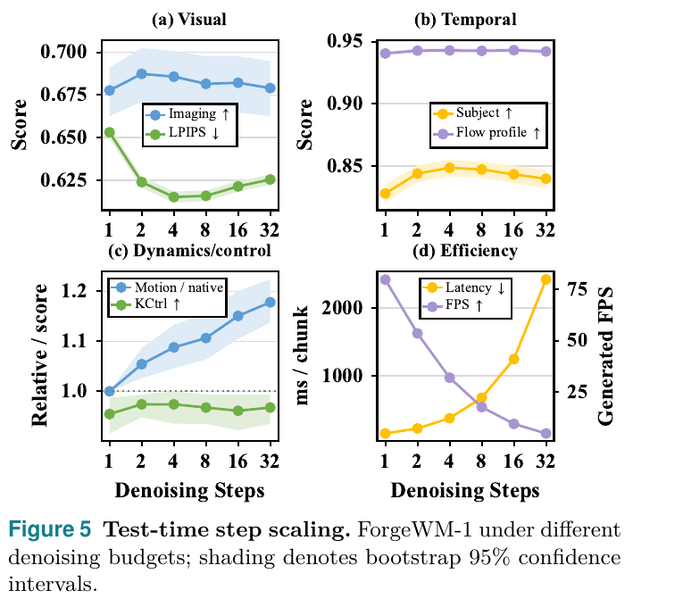

# ForgeWM: Progressive Causal Training for Few-Step Action-Conditioned Video World Models

> Xinye Li\*¹², Lingshuai Lin\*³⁴, Lei Wang², Liuzhou Zhang⁵, Jialin Cui³⁴, Qingshan Li⁴, Guanchu Wang⁴, Qingbin Liu², Xi Chen², Jiang Bian², Wai Lam†¹  
> ¹香港中文大学 ²**腾讯 PCG** ³复旦大学 ⁴上海人工智能实验室 ⁵香港科技大学  
> [arXiv:2608.14022](https://arxiv.org/abs/2608.14022)（2026-08-14）· [page](https://asdfo123.github.io/ForgeWM) · [code](https://github.com/asdfo123/ForgeWM) · [models](https://huggingface.co/ForgeWM)  
> \* 共同一作（Xinye Li、Lingshuai Lin）· † 通讯作者（Wai Lam）

---

## 1. 一句话定位

**把一个双向的动作条件视频生成器，分四阶段改造成 1/2/4 步的因果世界模型——而且全程不能把帧率级的键鼠控制搞丢。**

论文关心的不是"怎么做少步蒸馏"（那套 Self-Forcing / Causal Forcing / DMD 的组合已经有了），而是**在这套转换过程中如何保住 game-native 的控制接口**：

> *"ForgeWM studies how to preserve **frame-rate discrete and continuous game controls** through this conversion as clean context gives way to generated history."*

产出是 **ForgeWM-1 / -2 / -4** 三个预算特化的 student，加一个**同 checkpoint 的 replay 精修协议**。1 步版本 **168 ms/chunk、72 FPS**，是 Matrix-Game 2.0 的 **2.2×** 吞吐。

📌 **两个值得单独记的东西**：
1. **Table A2 的逐阶段消融揭示了一个论文自己没强调的事实**——**Stage 2（causal consistency）才是让少步采样成立的关键**（LPIPS 0.806 → **0.605**），而 **Stage 3（DMD）在 4 步预算下反而把 LPIPS 推回 0.617**。
2. **Replay-Time Refinement**：交互结束后用**同一个 student**、按 `r=0.3` 重加噪再走 4 步，**不需要第二个 checkpoint、不增加在线开销**。

⚠️ **但主表的公平性有一处硬伤**：**ForgeWM 的 Stage 0/1 就是在评测域 GF-Minecraft 上训的（共 24k 步），而两个 baseline 都没有做任何域适配**（§6.3 详述）。

---

## 2. 要解决的问题

论文的问题陈述很具体，**不是泛泛地说"少步蒸馏难"**：

> *"The difficulty arises because causal generation changes **both the input distribution and model state**. At inference, the denoiser conditions on imperfect self-generated visual history rather than clean data, while **action histories and key–value caches must remain synchronized with the generated latent chunks**. Fewer denoising steps amplify errors in these states, which then propagate autoregressively."*

**为什么游戏控制让这件事更难**：

> *"This coupling is especially pronounced for game-native controls: discrete keyboard states and continuous mouse motion arrive at **video-frame rate** and enter the denoiser through **dedicated pathways rather than solely as a camera trajectory**. A usable training framework must therefore preserve the control interface, action-to-latent alignment, and causal state-update protocol throughout adaptation and distillation."*

📌 **注意这里的立场**——论文明确**拒绝把控制退化成相机位姿或 pose-based encoding**（点名 PRoPE）：*"without reducing them to camera poses or pose-based encodings such as PRoPE."*

⚠️ **一个需要说清的事实：这篇论文几乎没有批评任何现有方法。** 相关工作段落全部是中性的定位式描述，不是批判式的：

| 被引方法 | 论文原句 | 性质 |
|---|---|---|
| Diffusion Forcing | *"assigns independent noise levels to sequence tokens"* | 纯描述，**零批评** |
| Self-Forcing | *"reduces exposure bias through autoregressive self-rollout"* | **正面**，Stage 3 直接沿用 |
| DMD | *"aligns a fast student's distribution with that of a diffusion teacher"* | 中性，Eq (7)(8) 直接沿用 |
| Causal Forcing | *"initializes the student along a causal teacher trajectory before asymmetric distribution matching"* | 中性 |
| Causal Forcing++ | *"replaces offline ODE pairs with online causal consistency distillation"* | 中性，Stage 2 建立在其上 |

**全文唯一一处尖锐批评**是针对评测指标的（见 §6.3）：GameWorld 的 Keyboard Accuracy *"whose real-frame-trained inverse-dynamics evaluator can **conflate control response with visual-domain similarity**"*。

---

## 3. 核心方法

### 3.1 基础

flow matching 的标准形式：

$$
z_\sigma = (1-\sigma)z + \sigma\epsilon, \qquad v^*(z_\sigma,\sigma) = \epsilon - z
$$

$$
\mathcal{L}_{\mathrm{FM}} = \mathbb{E}_{z,\epsilon,\sigma}\Big[w(\sigma)\,\big\lVert v_\theta(z_\sigma,\sigma;c) - v^*(z_\sigma,\sigma)\big\rVert_2^2\Big]
$$

由 velocity 反解干净预测：

$$
\hat{z}_\theta(z_\sigma,\sigma) = z_\sigma - \sigma\,v_\theta(z_\sigma,\sigma)
$$

### 3.2 "Progressive" 具体指什么

论文的定义：*"Each stage changes either the **temporal execution pattern**, **sampling objective**, or **history distribution**."*

> **Fig 2 逐面板解读**：
>
> **(A) ACTION-CONDITIONED BASE（左 1/3）**：外框 `Action-conditioned Video Generator G_θ`。左侧三个输入：`Continuous actions`（鼠标 + 十字方向）、`Discrete actions`（按键方格）、`Initial observation x₀`。
> - **橙色虚线框 `Action Module Detail`**：`C`(concat) → `MLP` → `Continuous actions Self-Attention` → `(+)` → `Discrete actions Cross-Attention`（标注 V/K/Q）→ `(+)`。
> - **绿色框 `DiT block (×N)`**：Visual tokens → Self-Attention → Cross-Attention → **Action Module** → FFN。
> - **底部是对齐关系的可视化**：4 帧时间轴 `t, t+1, t+2, t+3` 合并成 1 个 latent frame，右侧 `Aligned action window a^w_{i,r}` 对应 4 个绿方块，公式 `r ∈ {1,2,3}`、`z_i = [z_{i,1}, z_{i,2}, z_{i,3}]`。
>
> **(B) FOUR-STAGE CAUSAL TRAINING（右 2/3）**——四个彩色子框，每个都画出了对应的 attention mask：
> - **Stage 0（蓝）**：21×21 **全蓝方阵** = full-clip 双向注意力 → `L_FM` → `Domain Teacher θ_T`。
> - **Stage 1（红）**：two-stream block-causal mask，行列分 clean / noisy 两段，红色 3×3 块沿下三角 + 对角，注文 *"Noisy chunk i attends to clean chunks j<i and itself"* → `L₁(TF)` → `θ_C`。
> - **Stage 2（粉红）**：副标题斜体 **`same clean causal history as Stage 1`**。上部 frozen teacher 走一步 Euler 从 `σ_r` 到 `σ_{r+1}`；下部 student 预测与 **`EMA target (stop-grad)`** 匹配 → `L₂(CD)` → `θ_S0`。
> - **Stage 3（紫）**：`Student self-rollout (autoregressive)` 紫方块链，下标斜体 **`self-generated prefix`**；下方左蓝框 `Frozen real denoiser` / 右红框 `Trainable fake denoiser` → `L₃(DMD)` → 分出 **1-step / 2-step / 4-step** 三个输出，底部注 `4-step first chunk`。
> - 📌 **横贯底部的蓝色长箭头标 `Stage-0 teacher supervision`（Stage 0 → Stage 3）**，以及红色箭头 `θ, θ̄, θ_tch ← θ_C`（Stage 1 → Stage 2）。**这张图直接显示了 Stage 0 与 Stage 1 是两条并行分支，在 Stage 3 才汇合。**
>
> **(C) DUAL-PATH DEPLOYMENT（底部）**：`Online Interaction (on-policy)` → `Causal Rollout` → 虚线分隔 **`After interaction (offline)`** → `Saved Draft` → 橙框 **`Replay-Time Refinement: re-noise → larger denoising schedule`** → `Refined Replay`。

| | Stage 0 | Stage 1 | Stage 2 | Stage 3 |
|---|---|---|---|---|
| 名称 | Bidirectional Domain Adaptation | Teacher-Forced Causal | Causal Consistency Init | On-Policy DMD |
| 初始化 | base | **base（与 Stage 0 并行）** | Stage 1 | Stage 2 |
| Attention | 双向（全 clip） | block-causal | causal | causal |
| **训练上下文** | full-clip | **干净**因果历史 | **干净**因果历史 | **自生成**历史 |
| 目标 | `L_FM` | `L₁` | `L₂`（online CD） | `L₃`（DMD） |
| Blk.(latents) | 21 | 3 | 3 | 3 |
| 产物 | **Domain teacher `θ_T`**（= Stage 3 的 real denoiser） | `θ_C` | `θ_S0` | ForgeWM-1/-2/-4 |

📌 **一个容易被"four-stage progressive"这个名字掩盖的结构事实**：**Stage 0 与 Stage 1 是从同一 base 出发的两条并行分支**（*"In parallel to Stage 0, we initialize a second branch from the same base generator"*），**不是串行的**。真正串联的只有 `base → 1 → 2 → 3`；Stage 0 的作用是在 Stage 3 充当 frozen real denoiser。

**Stage 1 的 mask**：two-stream block-causal——把 clean 与 noisy 两条 token 流拼接，noisy chunk `i` 注意 clean chunk `j<i` **和它自己**；chunk 内部双向。**每个 chunk 抽一个噪声水平**（与 Diffusion Forcing 的逐 token 独立噪声相反）。

$$
\mathcal{L}_1 = \mathbb{E}\Big[w(\sigma_i)\,\big\lVert v_\theta\big(z_i^{(\sigma_i)},\sigma_i;c_i,z_{<i}\big) - (\epsilon_i - z_i)\big\rVert_2^2\Big]
$$

### 3.3 Stage 2：在线因果一致性蒸馏

frozen teacher 走一步 CFG-guided Euler：

$$
\tilde{z}^{(\sigma_{i+1})} = z^{(\sigma_i)} + (\sigma_{i+1}-\sigma_i)\Big[v^{\varnothing}_{\mathrm{tch}} + \omega\big(v^{c}_{\mathrm{tch}} - v^{\varnothing}_{\mathrm{tch}}\big)\Big]
$$

student 在**原噪声水平**的预测去匹配 EMA 网络在**前进后那个点**的预测：

$$
\mathcal{L}_2 = \mathbb{E}\Big[\big\lVert \hat{z}_\theta\big(z^{(\sigma_i)},\sigma_i\big) - \mathrm{sg}\big[\hat{z}_{\bar\theta}\big(\tilde{z}^{(\sigma_{i+1})},\sigma_{i+1}\big)\big]\big\rVert_2^2\Big]
$$

📌 **三个网络（student `θ`、EMA copy `θ̄`、frozen teacher `θ_tch`）全部从 Stage 1 的 checkpoint 初始化**，而且**三者都以干净因果历史为条件**——这正是 teacher 的一步 Euler 能单次前向算完、不必自回归展开的原因。

📌 **论文强调的卖点**：*"This local consistency objective initializes few-step sampling **without an offline trajectory dataset**."*（对比 Causal Forcing 的离线 ODE pair。）

### 3.4 Stage 3：on-policy 分布匹配

$$
g = \frac{\hat{z}_{\mathrm{fake}}\big(\hat{z}^{(\sigma)},\sigma\big) - \hat{z}_{\mathrm{real}}\big(\hat{z}^{(\sigma)},\sigma\big)}{\mathrm{mean}\big(\big\lvert \hat{z} - \hat{z}_{\mathrm{real}}(\hat{z}^{(\sigma)},\sigma)\big\rvert\big)}
$$

$$
\mathcal{L}_3 = \mathbb{E}\Big[\tfrac{1}{2}\big\lVert \hat{z} - \mathrm{sg}[\hat{z} - g]\big\rVert_2^2\Big]
$$

📌 **整个 target 被 stop-grad，使得 `∂L₃/∂ẑ` 恰好等于 `g`**（论文明说 *"whose gradient with respect to `ẑ` is exactly `g`"`）。

📌 **`ẑ_real` 是 frozen 的 Stage 0 第 4,000-update checkpoint**——即"真实分布"由一个在 GF-Minecraft 上适配过的模型定义。**这一点在 §6.4 讨论指标同源时很关键。**

⚠️ **分母那个自适应 normalizer 和可训练 critic 其实更接近 DMD2 而非 DMD v1，但论文只引了 DMD。**

### 3.5 动作表示与对齐

| | 表示 | 注入方式 |
|---|---|---|
| **离散** | 键盘状态，Minecraft **6 维** | 作为 **cross-attention 的 K 和 V** |
| **连续** | 鼠标位移 `(Δu, Δv)`，**2 维** | 与视觉 hidden state **拼接**后过 `mouse_mlp`，再走 temporal attention |

**对齐机制**：VAE 时间压缩 **4×** → **1 latent frame = 4 video frames**，**1 causal chunk = 3 latent = 12 video frames**。按 latent 区间对 action 分组；rollout 时维护 **visual KV cache + 独立的 keyboard cache 和 mouse cache**。

📌 **训练、蒸馏、推理三处用同一套对齐与 cache 更新协议**——这是 contribution 2 的内容。

### 3.6 Replay-Time Refinement

交互**结束后**（离线），逐 chunk 顺序处理：

$$
z_i^{(r_i)} = (1-r_i)\hat{z}_i + r_i\epsilon_i, \qquad \epsilon_i \sim \mathcal{N}(0,I)
$$

$$
z_i^{\mathrm{ref}} = \mathcal{R}_\phi^{\mathcal{S}(r_i)}\big(z_i^{(r_i)};\, x_0,\, a_{\mathcal{W}_i},\, z_{<i}^{\mathrm{ref}}\big)
$$

> **Fig 6 逐段解读**：上下两条泳道。
>
> **上（蓝，Online Interaction）**：`Initial Frame + Actions` → `Few-Step Causal World Model`（副标 *"1/2-step causal student"*）→ `Saved Draft Trajectory ẑ_{1:B}`。
>
> 中间竖箭头标 **`after interaction`**。
>
> **下（紫，Replay-Time Refinement）**：`Draft Chunk i` → **`Controlled Re-noising r_i`**（橙框，胶片上撒橙色噪点，底部橙色渐变三角标 noise level）→ **`Replay Denoiser`**（紫框，斜体注 **`same student, 4 updates at replay time`**）→ `Refined Chunk i` → 粗绿箭头 **`commit i ← i+1`**；绿色虚线从 Refined Chunk 回流，标 **`Causal Prefix for Chunk i+1`**。
>
> 📌 **两个关键点**：① **`same student`**——不需要第二个 checkpoint；② 条件里是 **`z^ref_{<i}`（已精修的前缀）而非原 draft 前缀**，所以精修是逐 chunk 累积的。

**默认配置**：`r = 0.3`，**4 次 update** 从 0.3 到 0，replay denoiser = **frozen ForgeWM-1**。

---

## 4. 训练配置

| 项 | 值 |
|---|---|
| **Backbone** | **Wan2.1-T2V-1.3B** + 自研 action module；初始化自 **Matrix-Game 2.0 lineage** |
| 数据 | **GF-Minecraft（GameFactory）40,000 clips** |
| 分辨率 / 帧率 | **640×352 / 12 fps** |
| Latent | **21 latent frames，16×44×80**；VAE 时间压缩 **4×** |
| Optimizer | AdamW，**β = (0.0, 0.999)**，bf16，gradient checkpointing + FSDP |
| GPU | **8 卡**（**型号没给**） |
| Seed | 0 |
| Flow 离散化 | **1000 步，timestep shift = 5.0** |
| CFG | **ω = 3.0**（施加于 frozen teacher，Stage 2 与 3） |
| LR schedule | 阶段内**恒定**，无 warmup/decay |

| | Stage 0 | Stage 1 | Stage 2 | Stage 3 |
|---|---|---|---|---|
| 迭代数 | 4k | **20k** | 6k | 4k（×3 个 run） |
| Gen. lr | 2e−6 | **2e−5** | 2e−6 | 2e−6 |
| Critic lr | – | – | – | 4e−7 |
| Global batch | 8 | 8 | 8 | 8 |
| EMA | – | – | **0.99 / 从 step 200** | 0.99 / 从 step 200 |

**其它数值**：Stage 2 噪声网格 **N = 48**，每步采一对相邻 `(σ_i, σ_{i+1})`；Stage 3 局部注意力窗 **6 latent = 2 chunks**；**critic 每迭代更新 1 次、generator 每 5 次迭代更新 1 次**（4k 迭代 ≈ **800 次 generator 更新**）；4 步 schedule = **[1000, 750, 500, 250]**；**1-/2-step 的第一个生成 chunk 固定用 4 步**。

⚠️ **没给的**：GPU 型号、训练时长/GPU-hours、显存、weight decay、grad clip、dropout、1-/2-step 的具体时间步、replay 4 步的中间时间步、`w(σ)` 的形式、**Stage 3 self-rollout 展开几个 chunk**、**Stage 3 是否截断反传**、数据 train/val 划分。

---

## 5. 实验结果

**协议**：Minecraft，**77 帧** rollout，共享 initial frame + control trace。baseline = **Matrix-Game 2.0** 与 **HY-WorldPlay**，两者均为**每 chunk 4 步**。reference-aligned 指标用 **1,000 paired trajectories**，no-reference 指标用 **462 constant-action videos**（77 initial states × 6 actions）。**全程无文本 prompt。**

### 5.1 主表

| Model | IQ↑ | LPIPS↓ | AQ↑ | Subj.Cons.↑ | Flow Prof.↑ | KCtrl↑ | Mouse Acc.↑ | Latency(ms)↓ | FPS↑ |
|---|---|---|---|---|---|---|---|---|---|
| Matrix-Game 2.0 | 0.6282 | 0.6443 | 0.4583 | 0.7349 | 0.9343 | 0.9156 | 0.7061 | 370.9 | 32.35 |
| HY-WorldPlay | 0.6133 | 0.6172 | 0.4855 | **0.9466** | 0.8288 | 0.9286 | 0.5818 | 2164.3 | 7.54 |
| **ForgeWM-1** | 0.6776 | 0.6529 | 0.4807 | 0.8279 | 0.9403 | 0.9545 | 0.7848 | **168.2** | **72.10** |
| **ForgeWM-2** | **0.6865** | 0.6171 | 0.4814 | 0.8349 | **0.9429** | **0.9740** | **0.8268** | 239.7 | 50.31 |
| **ForgeWM-4** | 0.6788 | **0.6168** | **0.4860** | 0.7613 | 0.9420 | **0.9740** | 0.8102 | 369.6 | 32.47 |

📌 **论文自己点出了一个重要观察**：*"**Performance is not monotone in the denoising budget**"*——**ForgeWM-2 在 7 列里有 4 列优于 ForgeWM-4**，而且更快。

⚠️ **但"最低 LPIPS"这个宣称经不起推敲**：ForgeWM-4 的 0.6168、ForgeWM-2 的 0.6171、HY-WorldPlay 的 0.6172——**三者跨度只有 0.0004**；而论文自己在 Table A2 给出的 trajectory-level bootstrap CI 半宽约 **±0.0035–0.005**，**大一个数量级**。**Table 2 完全没有 CI 或显著性检验**，却对该列加粗并写进摘要。Flow Prof. 那一列（0.9429 / 0.9420 / 0.9403）同理。

⚠️ **摘要点名的五项"最好"分属两个不同 checkpoint**：IQ / Flow / KCtrl / Mouse 归 ForgeWM-2，LPIPS / AQ 归 ForgeWM-4——**没有任何单一 checkpoint 同时做到**。摘要用"ForgeWM leads"这种集合式表述掩盖了这点。

📌 **论文主动提醒 Subject Consistency 的局限**：*"can favor conservative, low-motion videos"*——HY-WorldPlay 拿了该列最高分（0.9466）却同时是 Flow Prof. 最低（0.8288），Fig 3 里它那一行几乎静止。

### 5.2 逐阶段消融——这是全文最有信息量的一张表

统一用 4 步 schedule、1,000 paired trajectories：

| Stage | Inference regime | LPIPS↓ | IQ↑ | AQ↑ | SC↑ |
|---|---|---|---|---|---|
| 0 | bidirectional teacher（参考） | 0.814 [.809,.819] | 0.455 | 0.463 | 0.677 |
| 1 | teacher-forced causal | 0.806 [.799,.812] | 0.508 | 0.454 | 0.700 |
| **2** | **causal consistency** | **0.605** [.600,.610] | 0.659 | 0.483 | **0.760** |
| 3 | distribution matching | 0.617 [.613,.620] | **0.716** | **0.489** | **0.760** |

📌 **论文自己的结论很干脆**：

> *"**causal consistency distillation, rather than teacher-forced causalization alone, is the stage that enables effective few-step sampling.**"*

**Stage 2 把 LPIPS 从 0.806 拉到 0.605（CI 不重叠）——这是全流程最大的一跳。**

⚠️ **但这张表还揭示了三件论文没强调的事**：

1. **Stage 3 在 4 步预算下让 LPIPS 反而退化**（0.605 → 0.617），Stage 2 保持 **−0.012 的 paired 优势**（CI [−0.015, −0.008]）。论文的措辞是 *"Stage 3 shifts the trade-off toward sharper per-frame appearance rather than improving paired reconstruction fidelity"*——**换句话说，按论文自己的 paired 指标，未发布的 Stage-2 中间 checkpoint 才是最强的**，而正式产品 ForgeWM-4 是被 Stage 3 拉低后的版本。主表只报 Stage 3 的 students。
2. **Stage 1 的价值在任何数字上都没被证明。** 它占 **20k 迭代 = 全 lineage 42k 的 48%**，是最贵的阶段；但 Stage 0 → 1 的 LPIPS 只从 0.814 到 0.806，**两者 CI（[.809,.819] 与 [.799,.812]）在 [.809,.812] 区间重叠**。论文只强调 Stage 1→2 "non-overlapping"，**避而不谈 0→1 重叠**。Fig A1 的 Stage 1 loss 曲线也显示 20k 步基本水平。
3. **论文自己承认消融只在 4 步下做**：*"Its incremental effect at one- and two-step budgets is not isolated by this ablation."* 而 1/2 步恰恰是论文最主打的 latency 卖点。

⚠️ **"Progressive" 这个命名核心贡献没有真正的消融。** Table A2 是**累积式快照**（0 / 0→1 / 0→1→2 / 0→1→2→3），**不是 leave-one-out**。**没有任何"跳过某阶段"的对照**——没有 base→Stage 2（跳过 Stage 1）、没有 Stage 1→Stage 3（跳过 Stage 2）、没有 base→Stage 3。**因此"渐进顺序是必要的"这个论点没有实验支撑。**

### 5.3 Replay-Time Refinement

| Method | Replay LPIPS↓ | `D_draft`↓ |
|---|---|---|
| One-step draft（不精修） | 0.6532 | — |
| **Replay refinement（ours）** | **0.6155** | **0.1970** |
| &nbsp;&nbsp;w/ 独立 4 步 refiner | 0.6157 | 0.1960 |
| &nbsp;&nbsp;w/ 4 步 draft + refiner† | 0.6099 | 0.2361 |
| Direct ForgeWM-4（从噪声重采） | 0.6168 | 0.6187 |

📌 **核心结论成立**：replay 把 1 步 draft 的 LPIPS 从 0.6532 拉到 **0.6155**，**与 4 步从噪声生成的 0.6168 持平**，而且 `D_draft` 只有 0.1970（vs 0.6187，**3.14×**）——即**保住了实际经历过的轨迹**。

⚠️ **但两处要打折**：

1. **`D_draft` 的"3× 更接近"在定义上近乎同义反复**：replay 从 draft 出发只加 `r=0.3` 的噪声再去噪，自然离 draft 近；direct-4-step 从纯噪声重采，自然离 draft 远。**真正非平凡的只有"LPIPS 没变差"这一半。**
2. **"不需要独立 refiner"这个结论的证据太薄**：ours 0.6155 vs 独立 refiner 0.6157（差 **0.0002**），而 `D_draft` 上**独立 refiner 版反而更好**（0.1960 < 0.1970）。**Table 3 无 CI。**

### 5.4 test-time step scaling

> **Fig 5 逐面板解读**（冻结 ForgeWM-1，横轴 1/2/4/8/16/32 的 log 刻度，阴影 = bootstrap 95% CI）：
>
> **(a) Visual**：蓝线 `Imaging↑` **在 2 步见峰（0.6874）** 后缓降；绿线 `LPIPS↓` 从 0.6530 陡降到 **4 步谷底 0.6151**，8 步 0.6157，之后回升到 32 步的 0.6254——**U 形**。
>
> **(b) Temporal**：橙线 `Subject↑` **在 4 步见峰（0.8486）**；紫线 `Flow profile↑` 几乎水平（0.941–0.943）。
>
> **(c) Dynamics/control**：蓝线 `Motion / native` 从 1.000 **单调爬升到 1.178**；绿线 `KCtrl↑` 全程贴在 0.95–0.98 之间**几乎水平**。
>
> **(d) Efficiency**：橙线 `Latency↓` 指数上扬（≈149.5 → ≈2420 ms），紫线 `FPS↑` 单调塌陷（≈79.5 → ≈4.9），两线在 8 步附近交叉。
>
> 📌 **论文的结论**：*"**More steps primarily increase motion magnitude, latency, and computational cost rather than directional control.**"*
>
> ⚠️ **(c) 的蓝线是 §6.1 "motion over-response" 的直接证据**——步数越多，运动幅度越是超出参考。

⚠️ **这张图与 Table 2 的效率数字对不上**：1 步在 Table 2 是 **168.2 ms / 72.10 FPS**，在 Fig 5(d) 约 **149.5 ms / 79.5 FPS**（差 −11% / +10%）；2 步 239.7/50.31 vs ≈222/53.5。4 步吻合。而 §3.4 明说 step-scaling 分析 *"reports both generator evaluations and wall time **under one consistent inference path**"`。可能源于"4 步对比汇总 3 张 GPU 的 90 次测量"这个**异构硬件池化**。

### 5.5 用户研究与跨域

**人类偏好**（41 名学生志愿者、**盲测**、左右顺序独立随机化、**5 组 × 3 准则 = 615 次选择**，只有 **ForgeWM-4** 参赛）：

| 准则 | ForgeWM | Matrix-Game 2 | HY-WorldPlay |
|---|---|---|---|
| Visual Quality | **68.8%** | 19.0% | 12.2% |
| Action Accuracy | **57.6%** | 27.3% | 15.1% |
| Spatiotemporal Consistency | **55.6%** | 21.0% | 23.4% |
| **Overall** | **60.7%** | 22.4% | 16.9% |

⚠️ **无显著性检验、无 CI、未说明 5 组刺激是否全体共享。**

**CrossFPS（7 款 FPS 游戏 × 25 clips）**：macro-average LPIPS **0.6562**、PSNR **10.46 dB**、Flow Ratio **1.45**。

⚠️ **三个问题**：① **没有任何 baseline**，论文自述其数值 *"not directly comparable to the benchmark's partition-specific published results"* —— 所以"transfer 成功"只有绝对数字、无从判断好坏；② **Flow Ratio 全部 > 1（1.16–1.78），无一接近 1.0**，即**系统性地动得比参考多**；③ **这不是留出游戏的跨游戏泛化**——Stage 0 的训练语料就是"the merged CrossFPS corpus (65,246 clips across the **seven titles**)"，评测也是**同样这 7 款**，属 in-corpus 评测。

---

## 6. 争议与权衡

### 6.1 论文自承的三条 limitation（写得诚实）

> **Long-horizon drift**：*"the extended rollouts of Figure 9, roughly **3.5×** that horizon, show a slow loss of block structure and spreading color artifacts... we do not claim indefinite rollout stability."*
>
> **Motion over-response**：*"the generated flow magnitude exceeds the reference by a macro-average ratio of **1.45**: the model tends to **move more than the recorded control implies**."*
>
> **Budget-dependent stage value**：*"At the four-step budget, Stage 3 increases Imaging Quality but **does not improve paired LPIPS** relative to Stage 2... the stage-wise ablation does not isolate its incremental effect at one or two steps."*

### 6.2 绝对指标水平很差，排名讨论的意义有限

**所有方法的 reference LPIPS 都在 0.61–0.65**（AlexNet backbone，越低越好）；**CrossFPS 的 PSNR 只有 9.3–11.6 dB**。这意味着**所有 rollout 与参考轨迹在感知/像素层面都相去甚远**——Fig 3 也肉眼可见 ForgeWM 到 Frame 76 已与 GT 的场景布局完全不同。

📌 **在这个基线上争论 0.0004 的 LPIPS 差异，缺乏实际意义。** 相对更可信的是 IQ（no-reference）那一列：**0.6865 vs 0.6282 / 0.6133**，这是最大也最稳的优势。

### 6.3 baseline 公平性：域适配不对等是最严重的一条

⚠️ **ForgeWM 的 Stage 0（4k 步）+ Stage 1（20k 步）全部在评测域 GF-Minecraft 上训练**，而 **Matrix-Game 2.0 和 HY-WorldPlay 都没有在 GF-Minecraft 上做任何适配**。整张主表是**"在自己训练域上适配过的模型 vs 两个未适配的通用模型"**。论文的 §4.6 承认了 adapter 问题，**但从未承认这一域适配不对等**。

**其它几条**：

- ⚠️ **没有 train/test split 声明**：训练用 40,000 GF-Minecraft clips，评测用 1,000 paired trajectories / 462 clips / 77 initial states——**论文没有任何一句说明评测样本是否从训练集中排除**。存在训练集污染风险。
- ⚠️ **选择性替换指标**：论文把 GameWorld Score 的 **Keyboard Accuracy 换成自定义的 KCtrl**，理由是其 IDM evaluator *"can conflate control response with visual-domain similarity"*。**但它同时保留了同一个 IDM evaluator 驱动的 Mouse Accuracy**，并在该指标上宣称大幅领先（0.8268 vs 0.7061 / 0.5818）。**同一个批评对 Mouse Accuracy 同样成立**——而 ForgeWM 恰恰是唯一在真实 Minecraft 域数据上适配过的模型，**视觉域相似性对它有利**。这是本文最值得质疑的方法学操作。
- ⚠️ **HY-WorldPlay 被 adapter 改造**（把 per-frame 鼠标 delta 积分成角度），论文自承其运动尺度 *"depends on the deterministic adapter"*。它 Flow Prof. 最低（0.8288）+ Subj.Cons. 最高（0.9466）的组合强烈暗示**它在这套 adapter 下几乎不动**——**其 baseline 表现很可能被 adapter 削弱而非其本身能力**。
- ⚠️ **Latency 列未按帧数归一化**：ForgeWM/Matrix-Game 是 12 帧/chunk，HY-WorldPlay 是 16 帧/chunk。FPS 列做了归一化（公平），但 **Latency 的 2164.3 ms 对应的是 16 帧而非 12 帧**，直接并列有误导性（按帧归一后约 1623 ms/12 帧）。
- ⚠️ **只有 2 个 baseline**。同为 Minecraft 域的 **MineWorld**、同族更新版本的 **Matrix-Game 3.0**、最接近的同期工作 **Causal-rCM / Causal Forcing++ / minWM**——**全部只引用不对比**。
- ⚠️ **跨硬件池化**：4 步的效率数字 *"pools 90 measurements from **three GPUs**"*，其余用 30 clips，**GPU 型号一律未公开**。

### 6.4 指标与训练信号同源，且很严重

⚠️ **LPIPS / Flow Profile / Subject Consistency 全部在 GF-Minecraft 参考轨迹上计算，而 ForgeWM 的 Stage 0/1 正是在 GF-Minecraft 上做 flow matching 训练**（Stage 1 的 `L₁` 直接是对 GF-Minecraft 干净 latent 的回归）。**训练目标与评测参考同源。**

⚠️ **更进一步**：**Stage 3 的监督信号 `ẑ_real` 就是 Stage 0 的 domain teacher**——即"真实分布"由一个在 GF-Minecraft 上适配过的模型定义。于是 **DMD 在优化"像 GF-Minecraft domain teacher"，而评测在测"像 GF-Minecraft 参考"**，二者高度共线。**两个 baseline 没有这条通路。**

📌 **相对干净的是 IQ / AQ**（MUSIQ / LAION aesthetic，no-reference），与训练信号不同源——而 ForgeWM 在 IQ 上的优势恰恰是最大最稳的。

### 6.5 训练与评测长度：主表是一致的

**核算**（VAE 时间压缩 4×）：21 latent → `1 + 4×(21−1) = 81` 像素帧 @ 12 fps = **6.75 s**；1 chunk = 3 latent = 12 帧；21/3 = **7 chunks**。

| | 长度 |
|---|---|
| 训练 clip | **81 帧 = 6.75 s** |
| 主表评测 rollout | **77 帧 = 6.42 s** |
| **比值** | **0.95×——评测在训练 horizon 之内** ✅ |

📌 **这一点比仓库里好几篇同类工作都干净**（对比 [OPSD-V](../opsd_v/analysis.md) 的 44.8s 训练 / 60s 评测、[ABot-World-0](../../world_model/abot_world_0/analysis.md) 的 60 秒量化 / 24 小时宣称）。

⚠️ **但有两个真实的 train/test 错配**：

1. **注意力窗口错配**：**Stage 3 训练用 6 latent（2 chunk）的局部窗**，而评测用 **unrestricted causal attention over 21 latent（7 chunk）**——**推理时的有效上下文是训练时的 3.5×**。论文未讨论此 gap。
2. **Fig 9 的定性长 rollout 是 22.2 s ≈ 3.5× 训练 horizon**，**只有定性图、零量化指标**，且作者承认出现结构崩塌与色偏。

### 6.6 其它数值问题

- **同一指标同一 checkpoint 出现三个值**：ForgeWM-1 的 LPIPS = **0.6529**（Table 2）/ ≈0.6530（Fig 5a）/ **0.6532**（Table 3）。
- ⚠️ **Table 2 与 Table A2 的 IQ/AQ 口径不同却同名**。Stage 3 ≡ ForgeWM-4 应为同一 ckpt 同一 schedule，但 **IQ 0.716 vs 0.6788、AQ 0.489 vs 0.4860**，差距巨大；而 LPIPS 和 SC 基本一致。原因是 Table 2 的 IQ/AQ 用 **462 constant-action clips**、Table A2 用 **1,000 paired trajectories**（caption 里有写）。**但论文没有任何一句提示读者这两张表的 IQ/AQ 不可比。**
- **KCtrl 的位姿估计器完全未指定**。Eq (19) 依赖"相对位姿的平移分量"，但**全文从未说明相对位姿怎么算**（COLMAP？VGGT？）。这是论文自定义的主打可控性指标，可复现性因此受损。
- **Wan2.1 作为 backbone 却没有参考文献条目**（只有裸模型名）。**DMD2、CausVid、Self-Forcing++、LongLive、Rolling Forcing 全部未引用。**
- **引用名与文献条目不符**：正文写 "LingBot-World 2.0 ... Gao et al. (2026)"，而该条目的标题是 *"Infinite worlds with versatile interactions"*，无 "LingBot-World" 字样。

### 6.7 正面

**① Table A2 的自我披露很诚实。** 它把 "Stage 3 在 4 步下 LPIPS 反而退化" 这件对自己不利的事直接写进了表和 limitation，还明说消融没覆盖 1/2 步。

**② 训练/评测 horizon 一致**（§6.5），这在这一簇工作里不多见。

**③ 超参给得接近可复现级别**：Table A1 逐阶段列出 objective / attention / init / blk / iterations / gen-lr / critic-lr / batch / EMA，正文另给 schedule、`N`、`ω`、shift、seed、局部窗、更新比。**加上有 code 和 models 链接，这是本簇里 artifact 最完整的一篇之一。**

**④ "Performance is not monotone in the denoising budget" 是主动报告的负面观察**——它实际上削弱了自家 ForgeWM-4 的存在意义（ForgeWM-2 更快且多数指标更好），论文仍然写了出来。

**⑤ 拒绝 pose-based 动作编码的立场明确**，并把"控制接口 + 对齐 + cache 协议在三个阶段保持一致"作为显式目标。

**⑥ 用户研究规模在本簇里偏上**（41 人、盲测、顺序随机化、615 次选择）。

---

## 7. 一句话总结

ForgeWM 把一个双向动作条件视频生成器分四阶段改造成 1/2/4 步因果世界模型——**Stage 0 双向域适配（产出 Stage 3 的 frozen real denoiser）与 Stage 1 teacher-forced 因果化是两条并行分支**，Stage 2 用**在线因果一致性蒸馏**（三个网络都吃干净因果历史，因此 teacher 一步 Euler 即可、无需离线 ODE pair）初始化少步采样，Stage 3 才第一次暴露自生成历史做 DMD；全程保住 6 维键盘走 cross-attention KV、2 维鼠标走 concat+MLP 的原生接口与 4×VAE 的 latent 对齐；产出 168 ms/72 FPS 的 1 步模型与**同 checkpoint、`r=0.3` 重加噪 4 步的 replay 精修**（LPIPS 追平 4 步从噪声生成，且离 draft 近 3.14×）；**Table A2 揭示真正让少步成立的是 Stage 2（LPIPS 0.806→0.605），而 Stage 3 在 4 步下反而退回 0.617、Stage 1 占 48% 算力却与 Stage 0 的 CI 重叠**；⚠️ **但主表里 ForgeWM 的 Stage 0/1 共 24k 步都训在评测域 GF-Minecraft 上而两个 baseline 零适配、"最低 LPIPS"的 0.0004 差距比论文自己的 CI 小一个数量级且主表无 CI、把 Keyboard Accuracy 换成自定义 KCtrl 却保留同一 IDM 驱动的 Mouse Accuracy、"progressive" 这个命名贡献没有任何跳过某阶段的 leave-one-out 对照，且所有方法的绝对 LPIPS 都在 0.61–0.65、CrossFPS 的 PSNR 只有 10 dB。**

---

## Q&A

**Q: 四个阶段里哪个真的有用？**

A: **按论文自己的数据：Stage 2 决定性，Stage 3 是权衡，Stage 1 未被证明。**

| Stage | LPIPS 变化 | 判断 |
|---|---|---|
| 0 → 1 | 0.814 → 0.806 | ⚠️ **CI 重叠**（[.809,.819] vs [.799,.812]），**而它占 48% 的训练算力** |
| **1 → 2** | **0.806 → 0.605** | ✅ **CI 不重叠，全流程最大的一跳**。论文明说这才是"让少步采样成立的阶段" |
| 2 → 3 | 0.605 → **0.617**（退化） | ⚠️ 换来 IQ 0.659 → 0.716。是**权衡**而非改进 |

📌 **由此得到一个论文没明说的推论**：**按 paired 重建保真度，未发布的 Stage-2 中间 checkpoint 才是最强的**（0.605 优于主表任何一行）。正式产品 ForgeWM-4 是被 Stage 3 拉低后的版本，而主表只报 Stage 3 students。

⚠️ **而"progressive"这个命名本身没被验证**。Table A2 是**累积式快照**，不是 leave-one-out：**没有 base→Stage 2（跳过 1）、没有 Stage 1→Stage 3（跳过 2）、没有 base→Stage 3**。所以"必须按这个顺序走"这个论点目前只有叙事、没有实验。

📌 **而且 Stage 0 与 Stage 1 是并行分支**（论文原文 *"In parallel to Stage 0"*），真正串联的只有 `base → 1 → 2 → 3`。把并行的 Stage 0 算进"four-stage progressive"在叙事上有拔高的成分。

---

**Q: Replay-Time Refinement 值得抄吗？**

A: **值得，但要看清它真正证明了什么。**

**做法很简单**：交互结束后，对每个 draft chunk 按 `r = 0.3` 重加噪，用**同一个 student** 走 4 步去噪，条件是**已精修的前缀**和**录制的 action window**。

**三个实打实的好处**：
1. **不需要第二个 checkpoint**（对比 SANA-WM 的专门 refiner）
2. **不增加在线开销**——全部在交互结束后离线做
3. **保住了实际经历过的轨迹**——`D_draft` 0.1970 vs direct-4-step 的 0.6187

**质量上**：1 步 draft 的 LPIPS 从 0.6532 → **0.6155**，**与 4 步从噪声生成的 0.6168 持平**。

⚠️ **但要打两个折**：
- **`D_draft` 的 3.14× 在定义上近乎同义反复**——从 draft 加 0.3 噪声再去噪，本来就离 draft 近。真正非平凡的只有"LPIPS 没变差"。
- **"不需要独立 refiner"证据太薄**：0.6155 vs 0.6157（差 0.0002），而 `D_draft` 上**独立 refiner 反而更好**（0.1960）。Table 3 **无 CI**。

📌 **另外 `r = 0.3` 只报了一个值，没有扫描**——换场景大概率要重调。

---

**Q: 它和仓库里那几篇"给 DMD few-step AR 打补丁"的工作是什么关系？**

A: **五篇打在五个不同位置，而且互相之间几乎不引用。**

| | 改的是什么 |
|---|---|
| **ForgeWM** | **阶段结构**——四阶段渐进 + 同 checkpoint 的离线 replay 精修 |
| [Mask Forcing](../mask_forcing/analysis.md) | **学生 rollout 的输入**——re-noise 处混入低噪声 token |
| [OPSD-V](../opsd_v/analysis.md) | **teacher 的上下文**——旧 KV cache 换成真实视频 chunk |
| [ABot-World-0](../../world_model/abot_world_0/analysis.md) | **teacher 的监督时域**——LongForcing 把 DMD teacher 横跨更长 rollout |
| [SolarWM](../../world_model/solarwm/analysis.md) | **蒸馏的阶段结构**——TF-AnyFlow 一步顶掉 Causal ODE / CD 初始化 |

📌 **五篇的完整横向对照见 [dmd_few_step_ar](../dmd_few_step_ar/analysis.md)**（含流水线定位图、设定对照、三处真正的分歧、共有的方法学问题与最该补的五个实验）。

📌 **ForgeWM 与 SolarWM 是这五篇里唯一一处正面冲突**：
- **SolarWM 主张 TF-AnyFlow 可以省掉专门的少步初始化阶段**
- **ForgeWM 的 Table A2 证明"少步化"这一步是决定性的**（LPIPS 0.806 → 0.605，全流程唯一 CI 不重叠的大跳）

⚠️ **但准确的读法比"结论相反"细一层**：**ForgeWM 证明的是"少步化这个*效果*是决定性的"，不是"它必须是一个*单独的阶段*"；SolarWM 主张的恰恰是"这个效果可以在 teacher forcing 阶段里顺便拿到"。两篇其实共同指向同一件事——少步能力必须被显式训进去，不能指望 Stage 3 的 DMD 顺手解决。分歧只在它要不要占一个独立阶段。**

**SolarWM 的 Table 1 列了 ForgeWM 一行但未对比**，ForgeWM 早于 SolarWM 故未引用，**没人做过直接比较**。裁决它需要的是 "TF-AnyFlow vs (TF + Causal ODE/CD)" 的并排实验。

🔴 **补记（2026-09）：又一篇站到了对立面，但同样没给数据。** [Matrix-Game 3.5](../../world_model/matrix_game_35/analysis.md) 的 Stage 1 用 **teacher-forced 感知流匹配（PFM）**，明说 *"This single objective **simultaneously learns causal denoising and few-step generation**"* —— 与 SolarWM 同立场、不同手段（那边是 AnyFlow，这边是在冻结 InternVideo2 特征空间里约束流匹配），而且**全文 "ablat" 出现 0 次、零消融**。

**所以现在是 2:1，但按证据仍然是 1:0 —— 本篇的 Table A2 依然是唯一一份带 bootstrap CI 的对照。** 📌 而三篇合起来其实指向同一件事：**少步能力必须被显式训进去**（Matrix-Game 3.5 把它写进了 Stage 1 的目标，而不是指望 DMD 顺手解决）—— **分歧只在它要不要占一个独立阶段。**

📌 **顺带一条仓库线索**：本篇的主 baseline 是 **Matrix-Game 2.0**，而 Matrix-Game 3.0（arXiv:2604.08995）与 3.5 都已问世 —— **仓库里只有 3.5 有笔记，2.0 和 3.0 都缺，这条线是断的。**

⚠️ **ForgeWM 的引用面很窄**：**CausVid、Self-Forcing++、LongLive、Rolling Forcing、DMD2、OPSD-V（早于本文）全部未引用**；同 Minecraft 域的 MineWorld、同族的 Matrix-Game 3.0、最接近的 Causal-rCM 都只引用不对比。**连 backbone 用的 Wan2.1 都没有文献条目。**

---

**Q: SolarWM 的发布矩阵把 ForgeWM 标成 "Data ✓ 95 GB / 40k clips"，对得上吗？**

A: **"40k clips" 对得上，"95 GB" 和 "Data ✓" 在本文里都找不到依据。**

逐项核对（[SolarWM 笔记](../../world_model/solarwm/analysis.md) 的 Table 1）：

| SolarWM 的标注 | ForgeWM 论文里的实际情况 | 判定 |
|---|---|---|
| Domain = Game | Minecraft + 7 款 FPS | ✅ |
| Weights ✓ | 首页有 `Models → huggingface.co/ForgeWM` | ✅（论文层面确实宣称发布） |
| Infer ✓ / Train ✓ / Pipeline ✓ | 首页有 code 链接，但**论文正文从未枚举仓库含哪些部分** | ⚠️ 论文层面只能确认"有 code 链接" |
| **Data ✓ 95 GB / 40k clips** | **40,000 clips ✅**；但 **"95 GB" 全文不存在**；且**论文从未声明发布数据集**，首页无 dataset 链接，**GF-Minecraft 是第三方数据（GameFactory）** | ⚠️ **"95 GB" 无出处；"Data ✓"（自行发布数据）在论文中无依据** |
| Multi-BB — | 全文只有 Wan2.1-T2V-1.3B 一个 backbone | ✅ |

📌 **另外 "40k clips" 只覆盖 Minecraft 那条 lineage**——CrossFPS lineage 另用了 **65,246 clips**（来自 SCOPE 的 evaluation split）。

⚠️ **这提醒了一件事**：[SolarWM](../../world_model/solarwm/analysis.md) 的 Table 1 是**由 SolarWM 作者自己定义维度、自己评判同行**的对照表（我在那篇笔记里也标注了这点）。**逐格核对下来，至少 ForgeWM 这一行的 Data 列存在夸大。** 用那张表做 artifact 索引可以，做开放性排名要谨慎。

---

**Q: 想用它，要注意什么？**

A: **三个可以直接拿走的判断，两个坑。**

**可以拿走的**：

1. **少步能力主要来自"专门的一致性蒸馏初始化阶段"，不是 teacher forcing 本身**（Table A2：0.806 → 0.605）。如果你在做 few-step 因果化，**这一步不能省**。
2. **Stage 2 的在线 CD 设计很干净**：三个网络（student / EMA / frozen teacher）**全部从同一 causal checkpoint 初始化、且全部吃干净因果历史**——这使得 teacher 的一步 Euler 能单次前向算完，**不需要离线 ODE pair 数据集**。
3. **Replay 精修的思路**：交互时用最快的 student，交互结束后用同一个 student 离线重加噪精修。**在线零开销、不需要第二个模型。**

**两个坑**：

4. ⚠️ **"更多去噪步数"主要买到的是运动幅度和延迟，不是控制精度**（Fig 5c：KCtrl 全程水平 0.95–0.98，而 Motion 单调升到 1.178）。**别指望靠加步数改善可控性。**
5. ⚠️ **模型系统性地"动得比控制信号要求的多"**（CrossFPS Flow Ratio macro-average **1.45**，7 款游戏全部 > 1）。论文把这列为 limitation。**如果你的场景对运动幅度敏感，这是个已知偏差。**

**复现门槛**：有 code 和 models 链接、Table A1 的超参接近完整——**这是本簇里 artifact 最完整的一篇之一**。但 **GPU 型号、训练时长、Stage 3 的 self-rollout chunk 数与反传细节、KCtrl 的位姿估计器**都没给。
