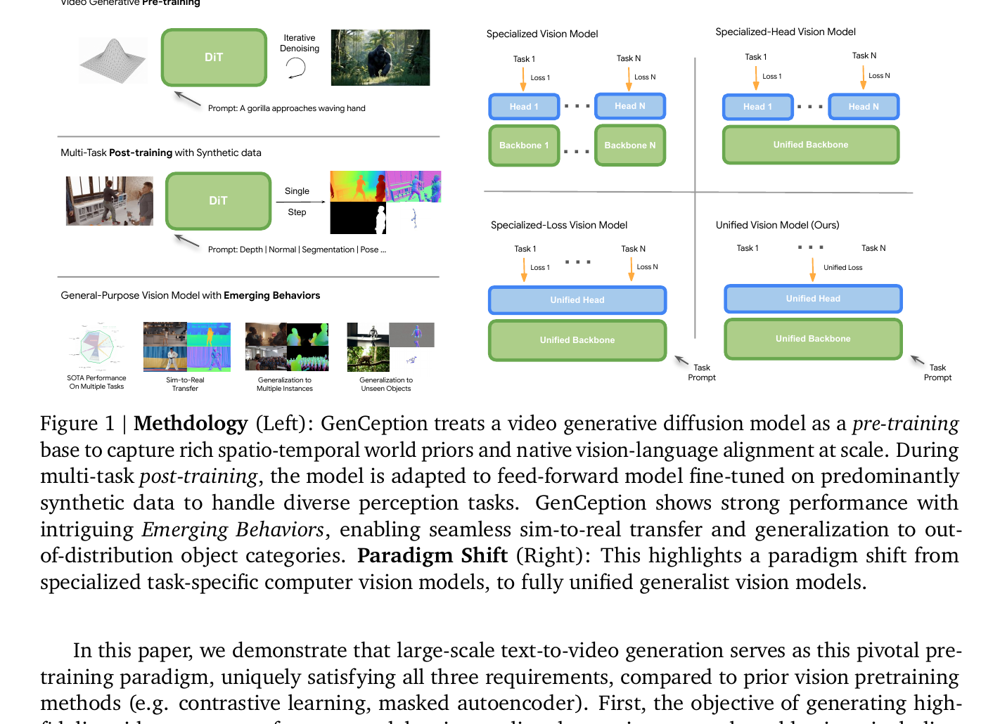
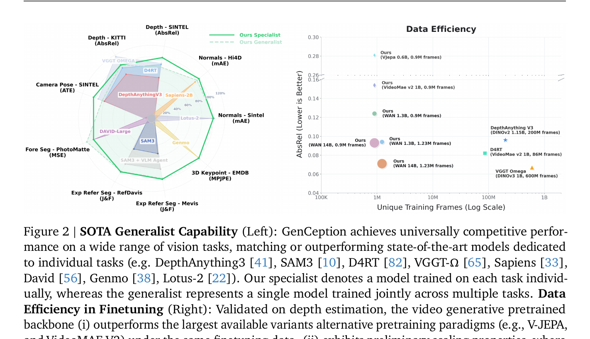
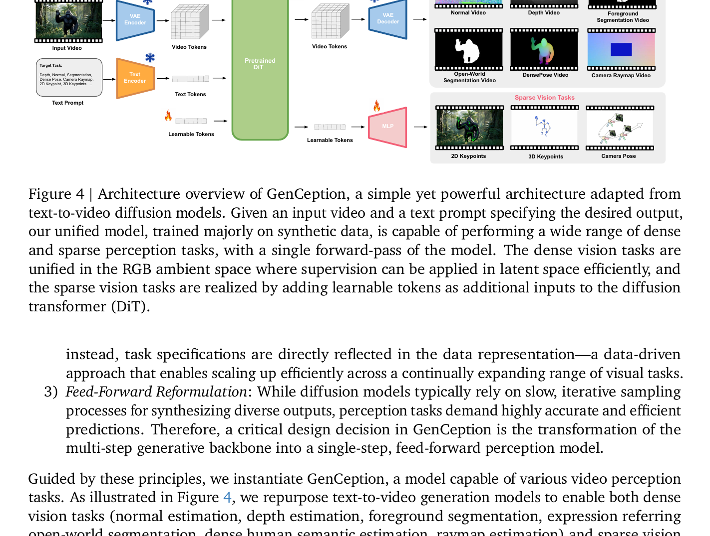
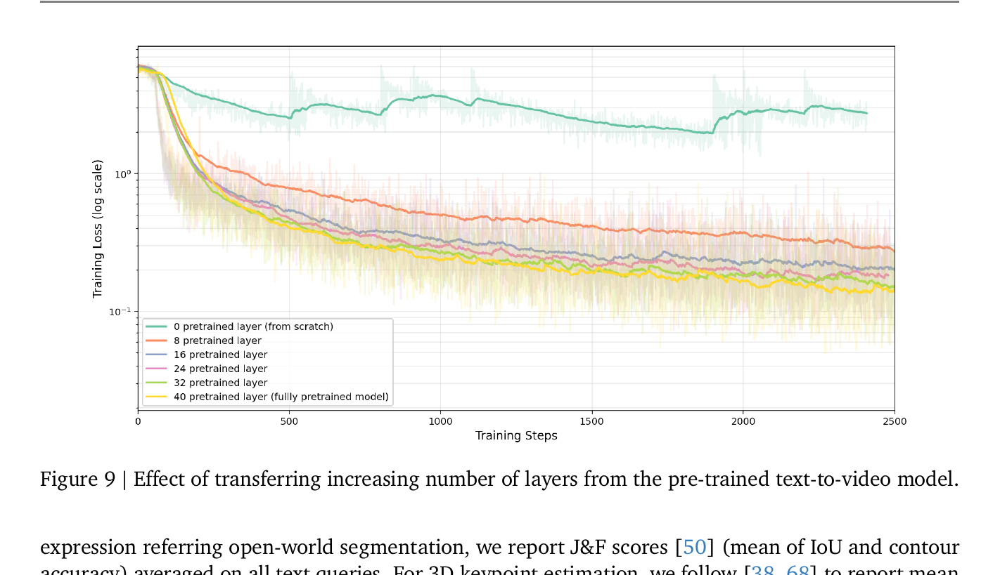
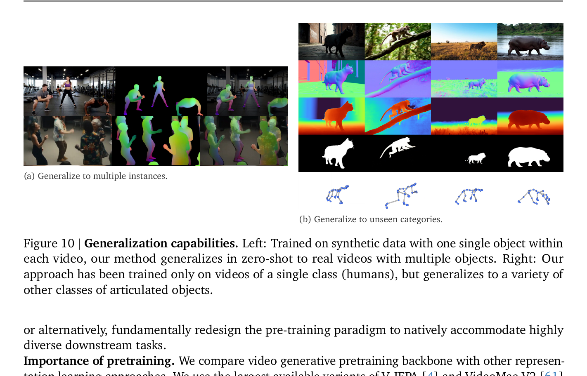

# GenCeption — Video Generation Models are General-Purpose Vision Learners

**Google DeepMind, 2026-07-13**
项目主页: [genception.github.io](https://genception.github.io)

---

## 1. 一句话定位

把预训练 T2V 扩散模型(WAN 2.1)当作通用视觉感知 backbone,用 **feed-forward 单步推理 + 统一 RGB 空间 + 纯 L2 loss** 做极简 post-training,同时处理深度/法线/分割/姿态/关键点等 7 类视觉任务,以 7×~500× 更少训练数据达到或超越各方向专用 SOTA 模型。

---

## 2. 要解决的问题(动机)

| 现状问题 | 具体表现 |
|---------|---------|
| CV 仍在"专用模型"阶段 | 每个任务需要独立的 backbone/head/loss/数据集 |
| 现有视觉预训练范式不够通用 | MAE 缺语言对齐;CLIP/DINO 缺时序先验;VideoMAE 缺语言对齐且小参数量 |
| 多任务训练工程复杂 | 需要手动平衡 N 个任务的 loss weight,架构扩展代价高 |
| 真实数据标注昂贵 | 深度/法线/DensePose 等标注成本极高,合成数据泛化往往受限 |

论文认为,NLP 从专用模型进化到 foundation model 的催化剂是 **next-token prediction 预训练目标** —— 大规模 T2V 生成是视觉领域的等效物:
1. **时空先验**: 预测高保真视频必须内化 3D 几何/物理交互/运动连贯性
2. **语言对齐**: T2V 模型天然以文本为条件,视觉语义与语言对齐
3. **可扩展**: T2V 数据便宜(无人工标注),模型从 1.3B 到 14B 可稳定扩展

---

## 3. 与前作的关系

### 谱系

```
图像扩散感知
├── Marigold (2024)         — Stable Diffusion → 单步深度估计
├── Diception (2025)        — 图像扩散多任务感知 (text prompt 区分任务)
└── GenPercept (2024)       — 系统研究特征注入/解码机制

视频扩散感知
├── DepthCrafter (2024)     — 视频扩散单任务深度
├── NormalCrafter (2025)    — 视频扩散单任务法线
└── BufferAnytime (2024)    — 图像扩散加时序层做深度/法线
                                     ↓ 本文超越
GenCeption (2026)           — 视频扩散 + 统一架构 + 7类任务 + 合成数据泛化
```

### 核心增量

| 维度 | 前作 | GenCeption |
|------|------|------------|
| 模态 | 单任务或 2-3 任务 | 统一处理 7 类感知任务 |
| 架构 | 任务特定 head/loss | 纯 L2 loss + RGB 空间统一 |
| 预训练 | 图像扩散 | **视频扩散**(时序先验更强) |
| 推理 | 多步采样 | **单步 feed-forward** |
| 数据 | 真实数据主导 | 主要合成数据,泛化到真实 |

同期工作:
- **[69] Wiedemer et al.** — 同样认为视频模型有丰富视觉先验,但用 training-free prompting(无定量评测);GenCeption 有完整 post-training 和定量基准
- **Vision Banana [18]** — 在图像空间而非视频空间操作

---

## 4. 核心算法/方法

### 4.1 Feed-Forward 推理公式

WAN 2.1 在 Rectified Flow 目标下预测 velocity `v = ε - x_0`。GenCeption 的关键改造:

**输入**: clean video latent `x_0`(不加噪),conditioning timestep 固定 `t = 0`

**输出**: 取 DiT 输出的**负值** `-v = x_0 - ε`

$$
\text{output} = -v_\theta(x_0,\, t=0,\, \text{text}) = x_0 - \varepsilon_\theta
$$

在 `t=0` 时,Rectified Flow 的 noisy input 就是 `x_0` 本身,`-v` 的期望值对齐 target `x_0`。这相当于把 DiT 当成一个以 `t=0` 特征激活的强特征提取器,而不再做迭代去噪。

📌 不修改任何架构(冻结 VAE encoder/decoder + text encoder + 大部分 DiT),只 fine-tune DiT 权重。

### 4.2 统一 Dense 任务表示(RGB 空间)

所有 dense 感知任务的 target 都表示为 `[0,1]` 范围的 3-channel RGB 视频,在 latent 空间用统一 L2 loss 监督。

| 任务 | 表示方式 |
|------|---------|
| 深度 | 每帧除以中位深度归一化,再 `d' = clip(α log(d+1), 0, 1)` |
| 法线 | 3-channel XYZ,直接 [0,1] 映射 |
| 前景分割 / DensePose | 单值/多值,扩展到 3 channels |
| Camera Raymap | "Rothko" 布局(见 Fig 5 原文),6-channel ray 数据空间分割→3 channel |

**深度归一化的精妙之处**: `α log(d+1)` 把近处的细节(小 d)映射到更大的值域差异上,让模型专注近场。中位数归一化消除场景尺度歧义,不需要 scale-invariant loss。

### 4.3 Sparse 任务:Learnable Token

2D/3D 关键点、相机位姿等稀疏结构化输出不能用 RGB 表示,GenCeption 引入额外 learnable tokens:

```
video_latents: [T', H/8, W/8, C]          ← VAE 压缩后的 latent
append T learnable tokens (每帧一个)
↓
DiT 完整处理 [video_latents + learnable_tokens]
↓
取出 learnable tokens → MLP head → K-dim 坐标/位姿输出
```

位置编码处理:
- **空间 (H,W)**: learnable spatial position(不固定)
- **时间**: 原始帧数 T 压缩到 latent 帧数 T',对额外 token 的 temporal index 用 **position interpolation** 缩放到 [0, T'-1] 内,保持与预训练一致的 RoPE 范围

📌 ablation 表明:额外 query token 比在 DiT 外加 attention 层效果更好——直接利用 pre-trained DiT 的 attention 机制而非新增。

### 4.4 统一训练目标

$$
\mathcal{L} = \lVert f_\theta(x_0,\, 0,\, \text{text}) - x_{\text{target}} \rVert_2^2
$$

- dense 任务:`x_target` 是 target modality 视频的 VAE latent,loss 在 latent 空间
- sparse 任务:`x_target` 是关键点坐标/位姿矩阵,loss 在 output 空间
- 无任何任务特定 loss weight,任务平衡完全通过 **data mixture ratio** 控制

这与 LLM 用统一 cross-entropy 统一所有语言任务的思路完全类比。

### 4.5 合成数据生成

| 资源 | 规模 | 用途 |
|------|------|------|
| RenderPeople assets | 800 个数字人 | 角色外观 |
| CMU 动捕数据库 | 200 种动作 | 动作驱动 |
| Blender 渲染 | 3D 全场景 + HDRI 背景 | 场景和背景 |
| 总计视频 | **7,500 条** | 主训练数据 |

每条视频裁剪到目标帧数,离线预处理:input RGB 视频 + target modality 视频 → VAE latent + text embedding 均预先缓存。

额外补充:TartanAir / Virtual KITTI / MVS Synth(深度);MeViS / Ref-COCO / YouTube-VOS(表达式分割)。

---

## 5. 关键代码位置

**暂无开源代码**。论文提供项目主页 [genception.github.io](https://genception.github.io),未附代码仓库。

---

## 6. 关键配置项

| 参数 | 值 |
|------|-----|
| Backbone | WAN 2.1 (1.3B 或 14B) |
| 分辨率 | 480×832, 81 frames, 24 FPS |
| VAE 压缩 | temporal 4×, spatial 8× |
| Optimizer | Adam, lr=5e-5 |
| 训练步数 | 15,000 steps (250 步线性 warmup) |
| Batch size | 64 (256 v6e TPUs) |
| 稳定技巧 | gradient clipping (norm 阈值) + gradient dropping (最大 norm 阈值) |
| 推理时间 | 1.3B: 5.92s / 13.6 FPS;14B: 10.03s / 8.0 FPS (单 v6e TPU, 81帧 480×832) |
| VRAM | 1.3B: 15.3GB;14B: 42.8GB;VAE+text encoder: 10.25GB(可 offload) |

---

## 7. 争议/权衡

### Joint Training vs Specialist

Table 1 显示,从 specialist(每任务单独训练)到 generalist(多任务联合训练)时:
- 法线估计在部分 benchmark 出现**下降**
- 3D 关键点估计**严重退化**

论文分析:sparse learnable tokens 从随机初始化开始,干扰了预训练 DiT 的 attention pattern,需要更多数据才能收敛。作者建议:post-training 应尽量减少架构修改——这是对自身方法的诚实 limitation。

### 仍是 Human-Centric

7,500 条合成视频全部是人类场景。对动物/机器人的泛化(图 10b)仅作为 qualitative demo 呈现,没有定量 benchmark。泛化机制是 T2V 预训练赋予的 emergent 行为,可控性不明。

### 推理效率

14B 模型处理 81 帧需要 10 秒,离实时还远。论文没有讨论量化/蒸馏方向。

### 与 Diception 的差异

Diception 也做多任务感知但用图像扩散;GenCeption 加了时序维度和更大规模。两者都用 text prompt 区分任务,但 GenCeption 的统一 RGB 空间方案更简洁(Diception 细节未见)。

---

## 8. 一句话总结

T2V 生成模型内化了足够的时空几何先验和语言对齐,可以作为统一视觉感知 backbone;用 `t=0` 单步前向 + RGB 空间统一表示 + 纯 L2 loss 的极简 post-training,在仅 7,500 条合成视频上以 7×~500× 更少数据达到甚至超越各方向专用 SOTA,并展现出合成→真实、单实例→多实例、人类→其他类别的 emergent 泛化。

---

## 附图



> **Fig 1 逐段解读**:
>
> **(Left) 三阶段范式**——上行:Video Generative Pre-training,大规模 T2V 生成训练(50+ 步 DiT);中行:Multi-Task Post-training with Synthetic Data,把迭代去噪改成单步前向(Single Step),以文本 prompt 区分任务(Depth|Normal|Segmentation|Pose ...);下行:General-Purpose Vision Model with Emerging Behaviors,输出性能雷达图 + sim-to-real 泛化 + 多实例泛化 + OOD 类别泛化。
>
> **(Right) 范式转变**——四种视觉模型范式对比。左上:Specialized Vision Model(N 个独立 backbone + head + loss,扩展成本最高);右上:Specialized-Head Vision Model(统一 backbone,多 head + 多 loss,工程上已简化);左下:Specialized-Loss Vision Model(统一 backbone + 统一 head,但仍然 N 个 loss);右下:Unified Vision Model(本文,统一 backbone + unified head + unified loss,任务 spec 通过 text prompt 注入,橙色箭头 "Task Prompt")。范式演进方向:向右统一架构,向下统一 loss,最终只靠数据格式和 prompt 区分任务,类比 LLM。

---



> **Fig 2 逐段解读**:
>
> **(Left) 雷达图**——9 个轴分别是不同任务/benchmark 上的相对性能(以 100% 为各方向 SOTA)。实线绿色=Ours Specialist,虚线绿色=Ours Generalist。竞品:D4RT(紫)、DepthAnythingV3(粉)、Sapiens-2B(橙)、Lotus-2(灰)、SAM3(蓝)、DAVID-Large(橄榄)、Genmo(黄)。Ours Specialist 在大多数轴达到或突破 100%(超越专用模型),Ours Generalist 略低但仍具竞争力。
>
> **(Right) 数据效率散点图**——X 轴:对数刻度的 unique training frames(100K~1B);Y 轴:AbsRel(越低越好)。四类竞品(DepthAnything V3,D4RT,VGGT-Omega,VideoMAE V2)均需 86M~600M 帧训练;Ours(WAN 1.3B 和 14B)仅用 0.9M~1.23M 帧就达到相近甚至更低的 AbsRel。两条虚线标出 D4RT 和 VGGT-Ω 的 AbsRel 基准线,Ours 的几个点都在线下方或相近,说明 7×~500× 更少数据可以匹配。

---



> **Fig 4 逐段解读**:
>
> **(Left 主干路径)**——Input Video → VAE Encoder(冻结,蓝色雪花) → Video Tokens → Pretrained DiT(绿色,火焰图标=fine-tuned) → Video Tokens → VAE Decoder(冻结,蓝色雪花) → Dense Vision Tasks 输出(右上方 6 种任务视频缩略图:Normal/Depth/Foreground/Open-World Seg/DensePose/Camera Raymap)。这条路径对 dense 感知任务完整保留 VAE encoder-decoder 对。
>
> **(Text Prompt 路径)**——Target Task 文本(Depth/Normal/Segmentation/Dense Pose/Camera Raymap/2D Keypoint/3D Keypoints ...) → Text Encoder(冻结,蓝色雪花) → Text Tokens → 注入 DiT 作为条件。text prompt 是任务切换的唯一信号,不改架构。
>
> **(Bottom 稀疏路径)**——T 个 Learnable Tokens(火焰=随机初始化后 fine-tuned)追加到 DiT 输入,经 DiT 处理后取出 → MLP(火焰) → Sparse Vision Tasks(右下:2D Keypoints/3D Keypoints/Camera Pose 三类)。MLP 是轻量解码头,K-dim 坐标输出 per frame。
>
> **(设计要点)**:dense 路径几乎 zero-modification(只 fine-tune DiT);sparse 路径也不新增 attention 层,只追加 token,最大程度保留预训练 attention pattern。

---



> **Fig 9 解读**:
>
> X 轴:training steps(0~2500);Y 轴:training loss(log scale)。6 条曲线对应从 0 到 40 层复用预训练权重的实验(40层=全量预训练模型)。
>
> - **绿色(0层,from scratch)**:loss 在 step 500 后几乎不下降,陷入平台,说明视觉感知任务从随机初始化无法有效收敛。
> - **橙色(8层)**:比从头显著更好但收敛慢,loss 仍明显高于多层组。
> - **蓝→粉→绿→黄(16/24/32/40层)**:收敛速度和最终 loss 随层数单调改善,最终全量预训练(黄线)最低。
>
> 结论:预训练层数是收敛的关键——生成先验在每一层都有贡献,不只在顶层;完整预训练模型才能让 post-training 高效收敛。

---



> **Fig 10 逐段解读**:
>
> **(a) 多实例泛化(Left)**——训练数据每条视频只有一个人;测试时输入真实健身房视频(多人),模型正确预测每个人的 DensePose/法线颜色图,未见实例混淆或缺失。说明模型习得了"对单个对象建模"的通用能力,而不是 copy-paste 单实例逻辑。
>
> **(b) OOD 类别泛化(Right)**——训练数据仅包含人类;测试时输入猫、豹、狮子、河马等动物。上行:原始帧;中行:法线估计(蓝紫色曲面);下行:深度估计(热力图);最下行:关键点预测(蓝色骨架,4 种动物)。所有模态都合理泛化到非人类关节结构。这是 T2V 预训练在大规模自然视频上习得的世界知识的直接体现。

---

## Q&A

*后续对话中的问答将追加于此。*
