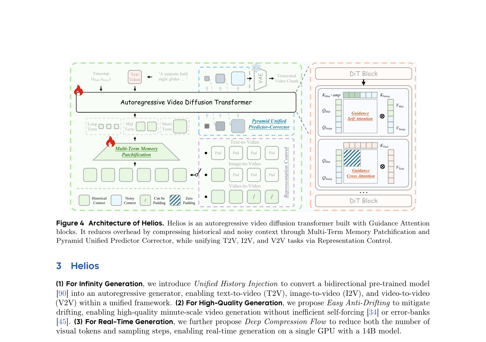
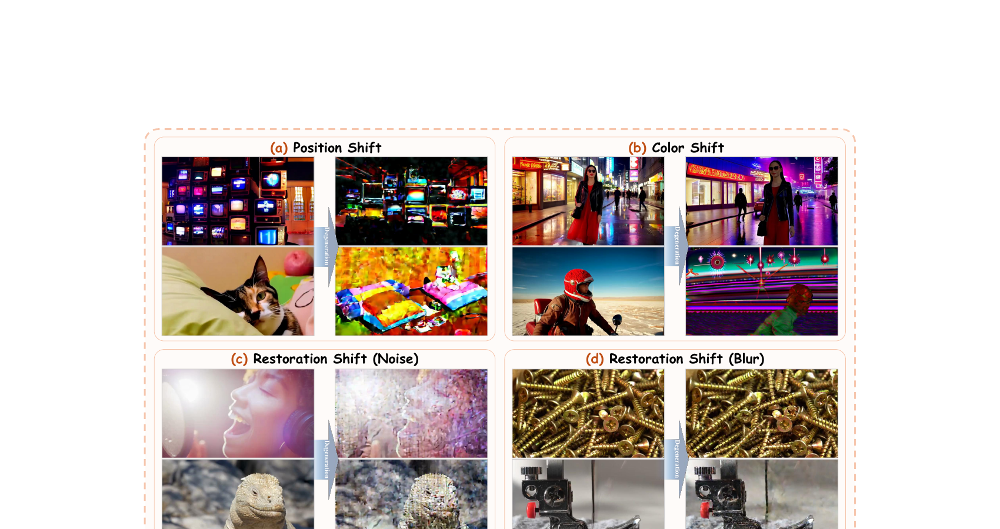
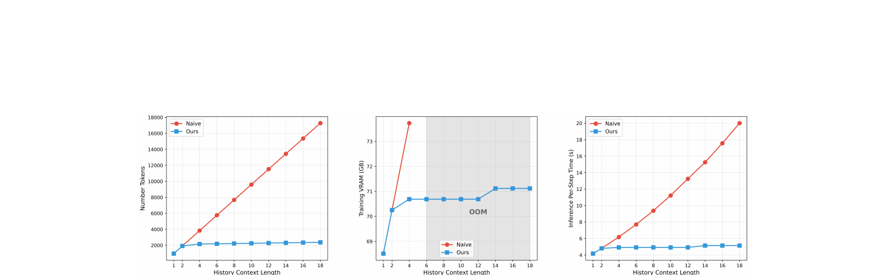
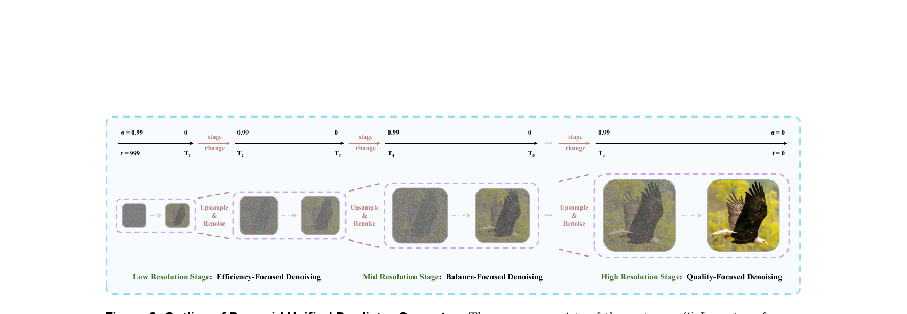
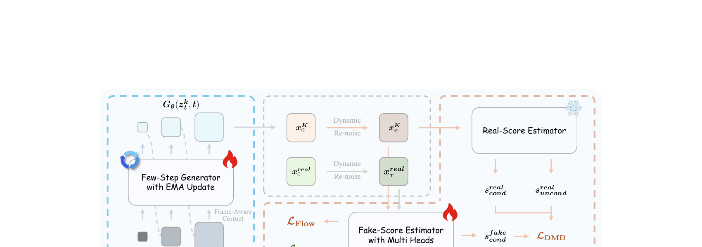

# Helios: Real Real-Time Long Video Generation Model

> arXiv:2603.04379 · ByteDance + 北京大学 · 2026-03
> 项目主页: https://pku-yuangroup.github.io/Helios-Page

---

## 1. 一句话定位

**第一个在单张 H100 上跑到 19.5 FPS 的 14B 视频生成模型**,支持分钟级长视频,**不依赖** KV-cache、稀疏/线性注意力、量化、causal masking、self-forcing 或 error-banks 中的任何一种常规加速/抗漂移手段。核心贡献是三件事同时成立:
1. **无 self-forcing 的抗漂移**(Relative RoPE + First-Frame Anchor + Frame-Aware Corrupt)
2. **不用 causal masking 的 AR 生成**(Unified History Injection + Guidance Attention)
3. **token 压缩把 14B 的算力开销压到 1.3B 级别**(Multi-Term Memory Patchification + Pyramid UPC)

---

## 2. 要解决的问题(动机)

现有实时长视频方案都是 1.3B 量级(CausVid、Self-Forcing、LongLive、Rolling Forcing 等):
- 模型太小 → 复杂运动/高频细节建模能力不足
- 抗漂移依赖 self-forcing long rollout → 训练开销巨大,限制了往 14B 扩展
- Krea-14B 把规模提上去了但 FPS 只有 6.7,且有明显漂移

根本矛盾:**大模型(14B)+ 长视频抗漂移 + 实时推理** 三角很难同时满足。Helios 的论点是:换一套算法框架,让三者都能达到。

---

## 3. 与前作的关系

```
Wan-2.1-T2V-14B (bidirectional, 50-step)
          │
          ▼
    Helios (本文,3 阶段训练)
    ├── Stage 1 (Base):     架构适配,历史注入,抗漂移
    ├── Stage 2 (Mid):      引入 Pyramid UPC,token 压缩
    └── Stage 3 (Distilled):AHD 蒸馏,50→3 步
```

**与 CausVid/Self-Forcing 系的关键差异:**

| 维度 | CausVid / Self-Forcing / LongLive | Helios |
|------|------|------|
| 因果机制 | Causal masking(块内/全序列) | **无 causal mask**,bidirectional 推理保留 |
| 抗漂移 | self-forcing rollout / error-bank / long-video training | Relative RoPE + First-Frame Anchor + Frame-Aware Corrupt |
| 加速手段 | KV-cache + 分步蒸馏(DMD/SiD) | **token 压缩**(MTMP + PyUPC) + AHD 蒸馏 |
| 长视频训练 | 短clip微调 + 推理rollout | 普通短clip(<10s),靠 Relative RoPE + Frame Anchor 外推 |
| 蒸馏 teacher | Bidirectional Wan(短视频) | **Helios-Base(长视频)** |

Helios 的核心洞见:**causal masking 并不是 AR 视频生成的必要条件**。把历史帧当 clean context 拼在 noisy 帧之前,用 Guidance Attention 管理二者的交互,双向推理完全可以生成连贯长视频。

---

## 4. 核心算法

### 4.1 Unified History Injection & Representation Control

模型输入是两段拼接:
- `XHist ∈ R^{B×C×T_hist×H×W}`:历史 clean 帧(timestep 固定为 0)
- `XNoisy ∈ R^{B×C×T_noisy×H×W}`:当前待去噪块(timestep 1000→0)

任务统一控制:
- T2V:`XHist` 全零
- I2V:仅最后一帧非零
- V2V:`XHist` 是真实历史帧

训练时随机 zero-out 一定比例历史帧,自然覆盖三种任务。



> Fig 4:左侧是 Multi-Term Memory Patchification(3 层历史:Short/Mid/Long),中间是 Pyramid Unified Predictor Corrector(多分辨率噪声→数据轨迹),右侧是 Guidance Attention(历史与噪声帧的独立自注意力 + 共享交叉注意力)。整个框架不使用 causal masking,保留双向推理能力,通过结构分离实现 T2V/I2V/V2V 统一。

### 4.2 Guidance Attention(Eq. 1-2)

历史帧和噪声帧的 KQV 分别计算,用 head-wise 可学习 `amp` 参数调制历史 key:

**Self-attention(合并 hist + noisy)**:

$$
X_{Self} = \text{Attention}([Q_{Noisy}, Q_{Hist}],\ [K_{Noisy}, K_{Hist} \cdot amp],\ [V_{Noisy}, V_{Hist}])
$$

**Cross-attention(只对 noisy)**:

$$
X_{Cross} = \text{Attention}(Q_{Noisy}, K_{Text}, V_{Text})
$$

`amp` 是 per-head 标量,允许网络自学习每个头对历史应该放大还是抑制。历史帧不做 cross-attention(已含语义)。代码见 `helios/modules/transformer_helios.py:394-408`。

---

### 4.3 Easy Anti-Drifting(三种漂移 + 三种对策)

漂移有三种典型形式:



> Fig 5:Position Shift(重复回到早期帧位置,场景突然重置),Color Shift(颜色/饱和度随时间累积偏移),Restoration Shift(Noise/Blur:历史帧的轻微噪声/模糊在推理时不断被放大为修复伪影)。这三种漂移对应三种独立的解决方案。

**① Relative RoPE(解决 Position Shift)**

不管视频多长,强制 `XHist` 的时间 RoPE 索引为 `[0, T_hist]`,`XNoisy` 的索引为 `[T_hist, T_hist + T_noisy]`。
- 消除了绝对索引超出训练分布的问题
- 避免 RoPE 周期性与多头注意力的共振导致的周期性重置运动

**② First-Frame Anchor(解决 Color Shift)**

`XHist` 中**永远保留第一帧**。第一帧作为全局视觉锚点,约束颜色/风格分布不漂移。实验表明去掉后 720 帧就开始出现明显颜色偏移。

**③ Frame-Aware Corrupt(解决 Restoration Shift)**

训练时对每个历史帧**独立**随机施加以下扰动之一:
- 概率 `pa`:加高斯噪声(`bmin~bmax` 幅度)
- 概率 `pb`:下采样再上采样(`cmin~cmax` 倍)
- 概率 `pc`:调整曝光(`amin~amax`)
- 概率 `pd`:保持干净

每帧独立采样(不是同一视频段统一操作),这是确保长视频稳定的关键。代码见 `helios/utils/utils_base.py:731-740`。

---

### 4.4 Deep Compression Flow — Token View

目标:把 14B 模型的 attention token 数压到 1.3B 同级。

**Multi-Term Memory Patchification(历史压缩,8×)**

历史 `XHist` 分三档,用不同步长的 Conv3D 压缩:

| 档位 | 时间帧数 | Conv3D kernel & stride |
|------|---------|------------------------|
| Short(近) | `T1=16` | `(1,2,2)` — 空间 2× |
| Mid(中) | `T2=2` | `(2,4,4)` — 时空 8× |
| Long(远) | `T3=2` | `(4,8,8)` — 时空 32× |

三档合计 token 数不随历史长度增加(固定约 `5/8 × HW` 个 token)。

代码:
- 三路 Conv3D 定义:`helios/modules/transformer_helios.py:1066-1068`
- 权重初始化(从预训练 patch embedding 扩展):`helios/modules/transformer_helios.py:1095-1101`
- forward 中拼接:`helios/modules/transformer_helios.py:1201-1256`



> Fig 7:三张图分别是 Token 数、训练 VRAM、推理单步时间 vs 历史帧数。Naive 方案(直接拼接)随历史长度线性增长并在 6 段时 OOM;Helios(蓝色)三项都基本平坦,历史长度可以扩展到 18 段。

**Pyramid Unified Predictor Corrector(噪声压缩,2.3×)**

把 flow matching 轨迹分 `K=3` 个分辨率 stage:

$$
x^k_t = (1 - \lambda_t) x^k + \lambda_t \, \text{Up}(x^{k-1})
$$

对应 ground-truth 速度:

$$
v^k = x^k - \text{Up}(x^{k-1})
$$



> Fig 8:低分辨率阶段(t=999→T1)专注结构/布局,中分辨率(T1→T3)兼顾质量与效率,高分辨率(T3→0)精修细节。每次 stage 切换时上采样 + 重新加噪(renoise)保持路径分布一致性。Stage 切换时 UniPC 的预测缓存清空重积累。

推理步数分配 `(N1, N2, N3)`,总 token 数 ≈ `HW + (H/2)(W/2) + (H/4)(W/4)` × `N/K`,约为全分辨率的 43%。调度器见 `helios/scheduler/scheduling_helios.py`。

---

### 4.5 Deep Compression Flow — Step View(Adversarial Hierarchical Distillation)

50 步(Base) → 50 步(Mid,PyUPC) → **3 步**(Distilled,AHD)

AHD 在 DMD 基础上做四点改进:



> Fig 9:生成器(Few-Step Generator + EMA)只看一段 section,历史完全来自真实数据(Pure Teacher Forcing)。生成的 `x0^K` 经 Dynamic Re-noise 加噪后同时喂给冻结的 Real-Score 和可学习的 Fake-Score(带多粒度 GAN Head)。Staged Backward Simulation 在 K 个分辨率 stage 上分别估 `x0^k`,只有 `x0^K` 进入 real/fake score 计算。

**① Pure Teacher Forcing(不需要 self-rollout)**

历史完全用真实数据,训练时只生成 1 段 section。对比 Self-Forcing 需要 rollout 5~20 段:
- 训练效率大幅提升 → 得以扩展到 14B
- 论文 ablation 证明抗漂移效果与 self-forcing long rollout 等效(靠 Easy Anti-Drifting 补足)

**② Staged Backward Simulation**

backward simulation 在 K 个 stage 上分别进行,产生 `{x0^k}`:

$$
x^k_0 = x^k_t - \lambda_t \cdot u^k_\theta(x^k_t, y, \lambda_t, k)
$$

**关键**:只有最终全分辨率的 `x0^K` 才送给 real/fake score(不是所有 k 层)。送中间 `x0^k` 给 pfake 会导致优化方向错误(ablation 中训练不稳定)。

**③ Coarse-to-Fine Learning**
- Staged ODE Init:在 K 个 stage 各做一轮 ODE 初始化,只需单段
- Dynamic Re-noise:Beta 分布采 timestep,参数余弦 decay,早期集中高噪(学结构),后期均匀(学细节)

**④ Adversarial Post-Training**

GAN head 布在 DiT 层 `[5, 15, 25, 35, 39]`,dim=768,对 `H/2 × W/2` crop 计算:

$$
L_D = \mathbb{E}[\log D(x^\text{real}_\tau, \tau)] + \mathbb{E}[-\log D(x^K_\tau, \tau)] + \lambda_D \cdot \|D(x^\text{real}) - D(N(x^\text{real}, \sigma_D))\|^2
$$

打破 teacher 的分布上限,让 student 直接对齐真实数据分布。

---

### 4.6 推理 Tricks

**Adaptive Sampling(自适应抗漂移)**

每段生成后,计算 latent 的均值 `μ_t` 和方差 `σ_t²`,用 EMA 跟踪全局统计:

$$
\bar{\mu}_t = \rho_\mu \bar{\mu}_{t-1} + (1-\rho_\mu)\mu_t
$$

当当前段统计偏离全局超过阈值 `δμ` 且 `δσ`,下一段历史中触发 Frame-Aware Corrupt,隐式迫使模型更依赖生成 prior 而非漂移历史。代码见 `helios/utils/utils_base.py:673-729`。

**Interactive Interpolation(交互视频)**

用户修改 prompt 时,线性插值 `e[j] = (1-λj)e(1) + λj e(2)`,M 步平滑过渡,避免 prompt 突变引起的闪烁和语义跳变。

---

## 5. 模型结构、推理与训练完整流程

### 5.1 模型结构详解

**底座:Wan-2.1-T2V-14B**

Helios 基于 Wan-2.1-14B(双向 DiT,原本是 50 步全帧去噪)改造。Wan 输入是 VAE 压缩后的视频 latent `[B, C, T, H, W]`,每个 patch 打平后送进 Transformer Block。Helios 在此基础上做三处关键改动。

---

**改动一:输入变成两段拼接**

```
原来 Wan:
  [noisy_video_latent]  →  DiT  →  predicted_clean

Helios:
  [XHist_compressed | XNoisy]  →  DiT  →  predicted_clean_chunk
```

- `XHist`:已生成好的历史帧(干净,timestep 固定为 0)
- `XNoisy`:当前要去噪的新帧块(高斯噪声,timestep 从 1000 降到 0)

任务由 XHist 内容自动决定:XHist 全零 → T2V,仅最后一帧非零 → I2V,有真实历史帧 → V2V。

---

**改动二:Multi-Term Memory Patchification**

历史帧不能全塞进 attention——帧数越多 token 越多。Helios 把历史按时间远近分三档,用不同步长的 3D 卷积压缩:

```
历史帧按时间远近划分
┌─────────────────────────────────────────────────────────┐
│ 远期(Long) :最老的 2 帧  →  Conv3D(4,8,8) stride 一致  │  时空压缩 32×
│ 中期(Mid)  :中间的 2 帧  →  Conv3D(2,4,4) stride 一致  │  时空压缩 8×
│ 近期(Short):最近的 16 帧 →  Conv3D(1,2,2) stride 一致  │  空间压缩 2×
└─────────────────────────────────────────────────────────┘
```

三档压缩后 token 总数固定,不随历史帧数增加。最终拼接顺序送入 DiT:

```
[long_tokens | mid_tokens | short_tokens | noisy_tokens]
```

三路 Conv3D 代码(`transformer_helios.py:1066-1068`):
```python
self.patch_short = nn.Conv3d(in_channels, inner_dim, kernel_size=(1, 2, 2), stride=(1, 2, 2))
self.patch_mid   = nn.Conv3d(in_channels, inner_dim, kernel_size=(2, 4, 4), stride=(2, 4, 4))
self.patch_long  = nn.Conv3d(in_channels, inner_dim, kernel_size=(4, 8, 8), stride=(4, 8, 8))
```

权重初始化:从预训练的 `patch_embedding` 权重通过 `einops.repeat` 扩展,使三档初始行为一致(`transformer_helios.py:1095-1101`)。

---

**改动三:每个 DiT Block 内的 Guidance Attention**

历史帧和噪声帧的 QKV 分开投影,通过 per-head 可学习参数 `amp` 控制历史 key 的影响强度:

```
Self-Attention:
  Q_hist, K_hist, V_hist  ← 历史 token 的线性投影
  Q_noisy, K_noisy, V_noisy ← 噪声 token 的线性投影

  K_hist_scaled = K_hist * amp    # amp: shape [num_heads],每头一个标量
  
  output = Attention(
      Q = [Q_noisy, Q_hist],
      K = [K_noisy, K_hist_scaled],
      V = [V_noisy, V_hist]
  )

Cross-Attention(只对噪声帧):
  X_cross = Attention(Q_noisy, K_text, V_text)
  # 历史帧不做 cross-attention,因为已含语义
```

`amp` 允许网络自学习"每个 head 对历史应该放大还是压制"。代码见 `transformer_helios.py:394-408`。

---

**Relative RoPE**

Wan 原版时间 RoPE 是绝对索引(第 1440 帧用 1439),推理时超出训练长度就出分布外。Helios 改成:

```
XHist 的时间索引:永远是 [0, 1, ..., T_hist-1]
XNoisy 的时间索引:永远是 [T_hist, T_hist+1, ..., T_hist+T_noisy-1]
```

无论生成第 5 秒还是第 60 秒,当前块的 RoPE 范围始终不变,不会超出训练分布。同时消除 RoPE 周期性与多头注意力共振导致的"视频内容循环重置"。

---

### 5.2 推理流程

**整体结构:逐 chunk 自回归生成**

```
初始化:
  history_short = []  # 最近 16 帧(原始 latent)
  history_mid   = []  # 次近  2 帧
  history_long  = []  # 最远  2 帧
  first_frame   = None  # First-Frame Anchor

循环生成每个 chunk:
  ① XNoisy = 高斯噪声 N(0, I)

  ② 从 history 三档取出历史帧:
       short_tokens = patch_short(history_short[-16:])
       mid_tokens   = patch_mid(history_mid[-2:])
       long_tokens  = patch_long(history_long[-2:])
       如果 first_frame 非空,确保它保留在 short 队头

  ③ 拼接 DiT 输入:
       input = [long_tokens | mid_tokens | short_tokens | noisy_tokens]

  ④ 去噪(见下方两种模式)

  ⑤ 得到干净 chunk X0

  ⑥ 更新 history:
       history_short.append(X0 frames)
       短期溢出的帧 → 降级到 mid
       中期溢出的帧 → 降级到 long

  ⑦ Adaptive Sampling 漂移检测:
       μ_t, σ_t² = latent_stats(X0)
       更新 EMA 全局统计
       if |μ_t - μ̄| > δμ AND |σ_t² - σ̄²| > δσ:
           下一步对历史帧触发 Frame-Aware Corrupt

  ⑧ VAE decode X0 → 输出帧
```

---

**Base / Mid 模型:50 步 UniPC 去噪**

```
for t in UniPC_schedule(50 steps, t=999→0):
    velocity = DiT(input_with_history, t)
    XNoisy   = scheduler.step(velocity, XNoisy, t)

X0 = XNoisy  # t=0 时即为干净帧
```

---

**Distilled 模型:3 步 Pyramid UPC(多分辨率)**

```
XNoisy = N(0,I) @ 低分辨率 (H/4 × W/4)

── Stage 1 (低分辨率, t=999→T1) ──
  跑 N1 步 UniPC 去噪
  → 得到 x0^1 (低分辨率估计)

── Stage 1→2 切换 ──
  x = Upsample(x0^1, 2×)          # 最近邻上采样到 H/2 × W/2
  x = x + noise * σ_T2             # 重新加噪到 stage2 起点
  # 同时清空 UniPC 预测缓存

── Stage 2 (中分辨率, t=T2→T3) ──
  跑 N2 步 UniPC 去噪
  → 得到 x0^2 (中分辨率估计)

── Stage 2→3 切换 ──
  x = Upsample(x0^2, 2×)          # 上采样到 H × W
  x = x + noise * σ_T4             # 重新加噪到 stage3 起点

── Stage 3 (全分辨率, t=T4→0) ──
  跑 N3 步 UniPC 去噪
  → X0 = x0^3 (最终全分辨率干净帧)

总步数 N1+N2+N3=3,token 加权平均约为全分辨率的 43%。
```

---

### 5.3 训练流程(三阶段)

#### Stage 1:Base 模型(架构适配 + 抗漂移)

**目标**:把 Wan-2.1-14B 改造成能做 AR 视频续写、且对历史漂移鲁棒的模型。

```
初始化: Wan-2.1-T2V-14B 权重,新增 patch_short/mid/long + amp 参数(LoRA rank=128)

每个训练 step:
  ① 从真实视频取 1 段作为去噪目标
     XNoisy_clean = real_chunk
     采 timestep t,加噪: XNoisy_t = XNoisy_clean + noise * σ_t

  ② 取前面的真实历史帧作为 XHist
     → Pure Teacher Forcing:历史全是真实数据,不做 rollout

  ③ 对 XHist 的每帧独立施加 Frame-Aware Corrupt:
       以 pb=0.8 下采样再上采样 (模拟生成帧的模糊)
       以 pc=0.1 调曝光
       以 pd=0.1 保持干净

  ④ 随机 zero-out 部分历史(覆盖 T2V/I2V/V2V)

  ⑤ XHist 中强制保留第一帧(First-Frame Anchor)

  ⑥ Forward:
       short_tokens = patch_short(hist_short)
       mid_tokens   = patch_mid(hist_mid)
       long_tokens  = patch_long(hist_long)
       velocity_pred = DiT([long|mid|short|noisy_t], t)

  ⑦ Flow matching loss:
       target_velocity = XNoisy_clean - noise
       L = ||velocity_pred - target_velocity||²

  ⑧ Backward + 更新 LoRA 权重
```

一个 step 只处理一段 section,**不做任何 rollout**。64 × H100,训 5.5k + 7.5k steps。

---

#### Stage 2:Mid 模型(引入 Pyramid UPC)

**目标**:让模型在多分辨率上都能预测正确的 velocity field。

```
初始化: Stage 1 权重 + 新 LoRA(rank=256)

核心变化:在三个分辨率 stage 上都计算 loss

对于每个 stage k ∈ {1, 2, 3}:
  x^k     = 当前分辨率的真实帧(已下采样到 h_k × w_k)
  x^{k-1} = 上一 stage 的结果(低分辨率)

  线性插值路径:
    x_t^k = (1 - λt) * x^k + λt * Upsample(x^{k-1})

  Ground-truth velocity:
    v^k = x^k - Upsample(x^{k-1})

  Loss_k = ||DiT(x_t^k, t, k) - v^k||²

Total Loss = mean(Loss_1 + Loss_2 + Loss_3)
Backward + 更新 LoRA
```

64 × H100,训 16k + 20k steps。

---

#### Stage 3:Distilled 模型(AHD,50 步 → 3 步)

**目标**:用 DMD + GAN 把步数从 50 压到 3,同时超越 teacher 的质量上限。

GPU 上同时存在 4 个模型:
```
Few-Step Generator Gθ    ← 可训练,LoRA rank=256
Real-Score Estimator     ← 冻结,来自 Helios-Base
Fake-Score Estimator     ← 可训练,LoRA rank=256,带多粒度 GAN head
EMA Model                ← Gθ 的指数移动平均(EMA decay=0.99)
```

训练循环 TTUR:每 5 步更新 pfake,才更新 1 步 Gθ:

```
──── 更新 pfake(每步都做) ────

[A] Flow matching loss(真实数据):
    取真实帧 x0_real,采 timestep τ 加噪 → xτ_real
    L_Flow = ||pfake(xτ_real, τ) - v_target||²

[B] GAN 判别器 loss:
    用 Gθ 生成 x0^K,加噪 → xτ_fake (H/2 × W/2 随机 crop)
    L_D = log D(xτ_real) + (-log D(xτ_fake))
        + 100 * ||D(xτ_real) - D(N(xτ_real, 0.1))||²   ← R1 正则

L_pfake = L_Flow + 0.01 * L_D
Backward + 更新 pfake(GAN head 在训练 1000 步后启动)

──── 更新 Gθ(每 5 步做一次) ────

① 取真实历史(Pure Teacher Forcing) + 高斯噪声 → Gθ 生成 x0^K

② Staged Backward Simulation:在 K=3 个 stage 上分别估 x0:
     x0^1 = x_t^1 - λt * u_θ^1(x_t^1, t, 1)  # 低分辨率
     x0^2 = x_t^2 - λt * u_θ^2(x_t^2, t, 2)  # 中分辨率
     x0^K = x_t^K - λt * u_θ^K(x_t^K, t, K)  # 全分辨率
     → 只把 x0^K 送给 real/fake score(送中间层会导致训练不稳定)

③ 加噪 x0^K → xτ^K,计算 DMD 梯度:
     s_real = CFG(preal_cond(xτ^K), preal_uncond(xτ^K))  # CFG scale=3.0
     s_fake = pfake_cond(xτ^K)
     L_DMD = (s_fake - s_real) 方向上更新 Gθ

④ GAN generator loss:
     L_G = log D(xτ^K, τ)  ← 让生成样本骗过判别器

L_Gθ = L_DMD + 0.05 * L_G
Backward + 更新 Gθ
```

**Cache Grad 内存技巧**:

```
更新 Gθ 时:
  1. Gθ forward → 生成 x0^K
  2. pfake forward(xτ^K)
     → 立刻把 ∂L/∂xτ^K 缓存下来
     → 立刻释放 pfake 的所有中间 activations
  3. 用缓存梯度做 Gθ backward
  全程显存里只需保留 Gθ 的 activations,4 个 14B 模型压到单模型开销
```

Dynamic Re-noise 采样策略:用 Beta 分布采 timestep,早期集中高噪(学结构),余弦 decay 后逐渐均匀(学细节)。128 × H100,训 3759 + 2250 steps。

---

| 功能 | 文件:行 |
|------|---------|
| 三路历史 patchification Conv3D 定义 | `helios/modules/transformer_helios.py:1066-1068` |
| patch 权重初始化(从预训练 embedding 扩展) | `helios/modules/transformer_helios.py:1095-1101` |
| forward 中 MTMP 拼接历史 token | `helios/modules/transformer_helios.py:1201-1256` |
| Guidance Attention key 放大(amp) | `helios/modules/transformer_helios.py:394-408` |
| HeliosAttnProcessor 完整 attention 逻辑 | `helios/modules/transformer_helios.py:196-445` |
| Discriminator3DHead(多粒度 GAN head) | `helios/modules/transformer_helios.py:96-126` |
| PyUPC 多阶段 scheduler | `helios/scheduler/scheduling_helios.py` |
| AdaptiveAntiDrifting(EMA 漂移检测) | `helios/utils/utils_base.py:673-745` |
| Frame-Aware Corrupt 实现 | `helios/utils/utils_base.py:731-740` |
| 流式 pipeline 推理 | `helios/pipelines/pipeline_helios.py` |
| Flash Normalization Triton kernel | `helios/modules/helios_kernels/triton_norm.py` |
| Flash RoPE Triton kernel | `helios/modules/helios_kernels/triton_rope.py` |

---

## 6. 关键配置项

**训练三阶段超参:**

| 配置项 | Stage 1(Base) | Stage 2(Mid) | Stage 3(Distilled) |
|--------|--------------|-------------|-------------------|
| GPU | 64 × H100 | 64 × H100 | 128 × H100 |
| LoRA rank | 128 | 256 | 256 |
| Global batch | 128 | 256 / 192 | 128 |
| LR (Gθ) | 5e-5 / 3e-5 | 1e-4 / 3e-5 | 2e-6 |
| Steps | 5.5k + 7.5k | 16k + 20k | 3759 + 2250 |
| 精度 | BFloat16 | BFloat16 | BFloat16 |

**Frame-Aware Corrupt 概率:**

| Stage | pa(噪声) | pb(下采样) | pc(曝光) | pd(干净) |
|-------|---------|-----------|---------|---------|
| 1/2 | 0.0 | 0.8 | 0.1 | 0.1 |
| 3 | 0.4 | 0.4 | 0.0 | 0.2 |

Stage 1/2 主要用下采样(模拟历史质量下降),Stage 3 加大噪声增强鲁棒性。

**MTMP 压缩系数:**`(pt, ph, pw)` = Short:(1,2,2),Mid:(2,4,4),Long:(4,8,8);帧数 `(T1,T2,T3)=(16,2,2)`。

**Stage 3 GAN head 位置:** DiT 层 `[5, 15, 25, 35, 39]`,hidden dim=768,训练 1000 步后启动。

**PyUPC 阶段划分:** `stage_range=[0, 1/3, 2/3, 1]`,K=3,推理用 UniPC solver。

**推理配置:**
- Stage 1/2:UniPC 50 步,CFG=5.0,v-prediction
- Stage 2:用 CFG-Zero-Star 替代标准 CFG
- Stage 3:x0-prediction,3 步,CFG=1.0

**Triton 加速效果(Table 6,50次前向+反向,H100):**

| 配置 | 推理时间(s) | 训练时间(s) |
|------|-----------|-----------|
| Wan-2.1-14B 原版 | 98.68 | 398.03 |
| + Flash Normalization | 89.91 | 360.77 |
| + Flash RoPE | 93.39 | 378.77 |
| + 两者 | **84.41** | **340.38** |

---

## 7. 争议 / 权衡

**1. Bidirectional vs Causal Masking**

Helios 不用 causal mask,历史帧会出现在 noisy 帧的 attention 里。Guidance Attention 通过拆分 QKV 来避免历史帧被噪声帧"污染"。但代价是:attention 矩阵更大(hist + noisy 全连接),而 causal 方案可以用 KV cache。Helios 选择用 MTMP 压缩 token 数来抵消这个开销。

**2. Pure Teacher Forcing vs Self-Forcing**

论文 ablation 表明 Pure Teacher Forcing(只用真实历史 + Easy Anti-Drifting)在长视频抗漂移上与 Self-Forcing long rollout 效果相当。但这个结论依赖 Frame-Aware Corrupt + First-Frame Anchor 共同起效。如果去掉任何一个,漂移就会很快出现。

**3. Staged Backward Simulation 的细节**

只把 `x0^K`(全分辨率最终结果)送给 real/fake score,而不是所有 `x0^k`。Paper 中 ablation 显示"w Staged Backward Simulation*"(送多尺度 `x0^k`)会导致训练不稳定。作者认为多尺度 x0 分布差异大,fake score 无法统一建模。

**4. 漂移未完全解决**

Ablation Table 5 中 Drifting-Naturalness 只有 5 分(10 分满分),与 CausVid(6)和 Rolling Forcing(7)比有差距。论文 limitation 也承认段边界 flickering 仍然存在。

**5. 分辨率限制**

所有实验都限于 384×640。更高分辨率的性能未探索。14B 无并行训练的内存节省主要靠了 token 压缩,更高分辨率会重新撑爆显存。

---

## 8. 一句话总结

Helios 的核心论点:**不用 causal masking 也能做 AR 视频生成**,用 Representation Control + Guidance Attention 把历史/噪声帧职责分开,配合三层分辨率历史压缩(MTMP)+ 多尺度噪声压缩(PyUPC)把 14B 模型的 token 算力压到 1.3B 量级,再用 Pure Teacher Forcing + Easy Anti-Drifting 取代昂贵的 self-rollout,从而第一次把 14B 长视频生成跑到单卡实时。
