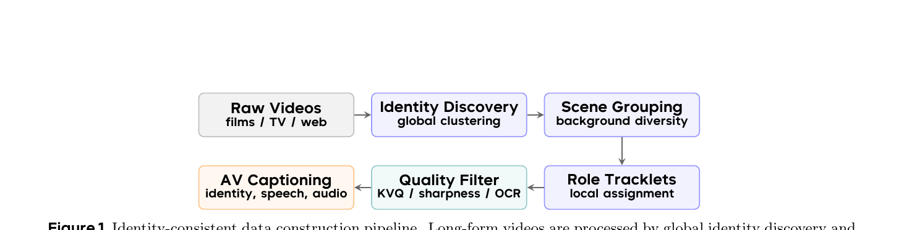
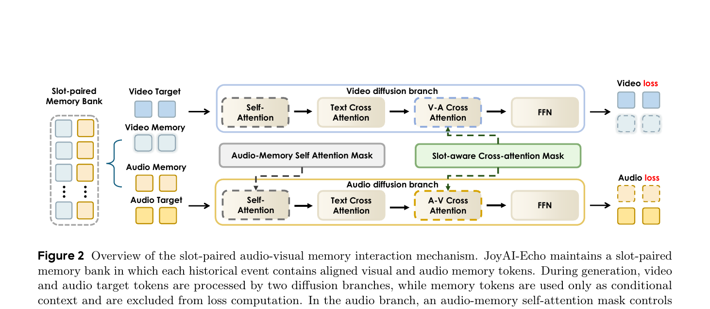
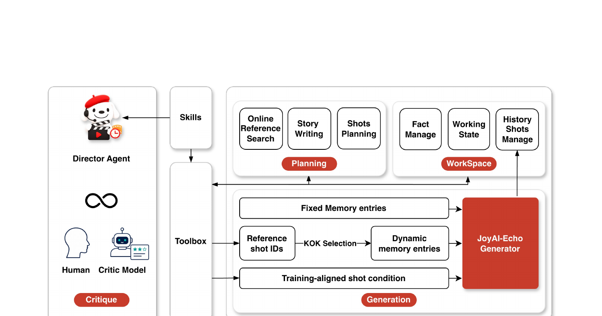
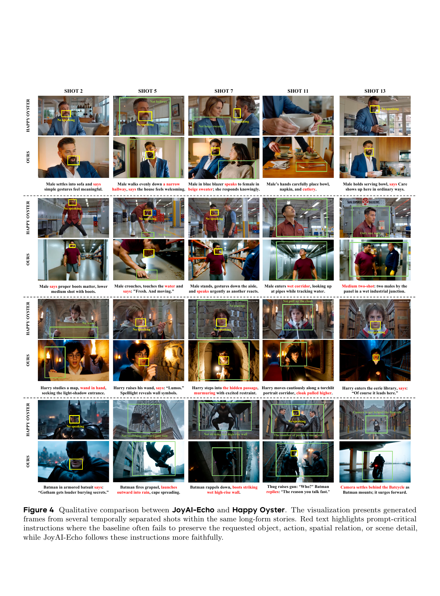

# JoyAI-Echo — Pushing the Frontier of Long Audio-Visual Generation

**京东 Joy Future Academy, 2026-06-26**
代码: [github.com/jd-opensource/JoyAI-Echo](https://github.com/jd-opensource/JoyAI-Echo)
项目主页: [echo-team-joy-future-academy-jd.github.io](https://echo-team-joy-future-academy-jd.github.io/Echo-LongVideo-Page/)

---

## 1. 一句话定位

JoyAI-Echo 以**跨模态音视频记忆库 + 记忆感知后训练流水线(SFT→RLHF→DMD)**解决长视频生成的跨镜头一致性与推理延迟问题,首次同时实现五分钟跨镜头跨模态一致性、分钟级实时推理(8步DMD 7.5× 加速)、会话级交互编辑和高清输出。

---

## 2. 要解决的问题(动机)

| 问题 | 具体表现 |
|------|---------|
| 错误累积 | 多步自回归生成中,角色外貌/声音随镜头数增加而漂移 |
| 跨模态不一致 | 视频与音频两路独立生成,面部运动与音色无法精确绑定 |
| 推理延迟高 | 多步扩散无法满足交互式场景实时需求 |
| 用户输入与模型输入的 gap | 用户给自然语言描述,模型需要结构化 shot-level conditions |

传统长视频方案(Pixverse-R1、Happy Oyster)面临相同问题。本文提出四个互补创新:记忆库、记忆后训练、Director Agent、超分模块。

---

## 3. 与前作的关系

```
音视频联合生成
├── JavisDiT++ (ICLR 2024) — hierarchical spatio-temporal prior + MoE 模块
├── LTX-2 / LTX-2.3 (2025) — DiT-based A-V 联合生成, Gemma prompt enhancement
└── MMAudio (CVPR 2025) — 视频后接音频合成(cascade)

长视频记忆
├── StoryMem (2025)       — 基于 memory 的多镜头视觉生成
└── ShotStream (2026)     — 流式多镜头生成,用于交互叙事

强化学习 + 扩散加速
├── OmniForcing (2025)    — 全局实时联合音视频生成
├── OmniNFT [26]          — 音视频联合 RLHF (本文直接使用)
└── DMD (CVPR 2024)       — one-step 扩散蒸馏 (本文扩展到音视频)
```

JoyAI-Echo 是首个把**跨模态记忆 + SFT + RLHF + DMD + Agent + SR** 集成为统一长音视频系统的工作。核心 baseline 是 LTX-2(无记忆的联合生成),以及 Happy Oyster(流式生成 world model)。

---

## 4. 核心算法/方法

### 4.1 数据:身份一致语料库



> **Fig 1 解读**: 六步流水线。①从影视/TV/网络视频中全局聚类发现 100 万+ 独特人物身份;②场景分组保证同一 clip 集合覆盖不同背景;③局部 tracklet 分配将各场景的面部检测和身体轨迹关联到具体身份;④质量过滤(KVQ 视频质量模型 + Laplacian 清晰度 + OCR 文字检测);⑤结构化音视频 captioning(外貌/声音/动作/台词/环境音);⑥输出:以身份为核心的 clip 集合,每个身份有多个视觉多样的镜头。

| 步骤 | 关键技术 |
|------|---------|
| Identity Discovery | DBSCAN 全局聚类,余弦距离 `D_ij = 1 - e_i^T e_j` |
| 聚类质量控制 | 每个 identity 计算自适应接受阈值 `t_k = max(μ_k - κσ_k, t_hard)` |
| 局部分配置信度 | `r(T) = v_{g*}(T) / Σ_k v_k(T)` 超过严格阈值才保留 |
| Clip 评分 | `Q(T) = w_v r(T) + w_s S(T) + w_m M(T)` |

### 4.2 跨模态音视频记忆库

**任务公式化**: 给定 T 个镜头条件序列 `C = {c_t}^T_{t=1}`,长视频生成分解为:

$$
p_\theta(S \mid C) = \prod_{t=1}^{T} p_\theta(S_t \mid c_t, \mathcal{M}_{t-1}), \quad \mathcal{M}_t = \mathcal{U}(\mathcal{M}_{t-1}, S_t)
$$

**Slot-paired 记忆结构**: 记忆库 `M_t = {m_i}^K_{i=1}`, `m_i = (m_i^v, m_i^a)`——每个 slot 严格绑定一个历史事件的视觉+音频记忆,防止跨事件的面声混淆。

**音频记忆提取**:

$$
\tau_i^* = \arg\max_\tau \left\| \text{Mel}(A_t)_{\tau - \frac{\Delta}{2}: \tau + \frac{\Delta}{2}} \right\|_1
$$

选取能量最大的音频窗口(最响亮/最清晰的说话时刻),通过 audio VAE 编码为 `m_i^a`。

📌 这个选窗策略捕捉**音色特征**而非语义内容 —— 响度最大的片段通常包含最纯粹的说话声,background music 等噪声干扰少。

**视觉记忆提取**: 围绕音频对齐中心帧 `φ(τ_i*)` 取 9 帧 clip,编码后只保留最后 latent 状态 `m_i^v = Last(E_v(V_t[φ(τ_i*)-4:φ(τ_i*)+4]))`,保留外貌 + 嘴型状态。

**记忆更新策略**:

$$
\mathcal{M}_t = \text{Encode}\!\left(\text{First}_3(\mathcal{H}_t) \cup \text{Recent}_4(\mathcal{H}_t)\right)
$$

前 3 个镜头作为永久 anchor(保持早期角色参考),最近 4 个镜头提供近期上下文。代码中 `max_size=7, num_fix_frames=3`(`inference.py:361-365`)。

### 4.3 记忆交互机制



> **Fig 2 逐段解读**:
>
> **(左) Slot-paired Memory Bank**——灰色虚线框内,每一行是一个历史 slot:蓝色方块=视觉记忆,橙色方块=音频记忆,行内严格配对。
>
> **(右上) Video diffusion branch**——Video Target + Video Memory → Self-Attention → Text Cross Attention → V-A Cross Attention → FFN → Video loss。关键:V-A Cross Attention 步骤(蓝色虚框)由 Slot-aware Cross-attention Mask(绿色框)约束,第 i 视觉 slot 只能 attend 第 i 音频 slot。
>
> **(右下) Audio diffusion branch**——Audio Target + Audio Memory → Self-Attention → Text Cross Attention → A-V Cross Attention → FFN → Audio loss。Audio-Memory Self Attention Mask(灰色框)控制前 70% 音频层屏蔽记忆(先建立当前局部声学结构),后 30% 层开放记忆(引入说话人音色)。
>
> **(核心设计)** 记忆 token 只作为条件输入,不参与 loss 计算(虚线方块=不监督);slot-aware mask 防止不同历史事件的面声交叉混合。

**层级音频-记忆交互**:

$$
B_l^a(q, k) = \begin{cases} -\infty, & l \le 0.7 L_a,\; q \in \mathcal{T}^a,\; k \in \mathcal{M}^a \\ 0, & \text{otherwise} \end{cases}
$$

前 70% 层封锁音频 target 对 memory token 的 attention → 先建立当前语音内容和节律结构; 后 30% 层开放 → 叠加历史说话人音色。

**Slot-aware 跨模态 mask**:

$$
B_{ij}^{av} = \begin{cases} 0, & i = j \\ -\infty, & i \ne j \end{cases}
$$

第 i 个视觉记忆 slot 只与第 i 个音频记忆 slot 交互,精确保留"某人的声音 ↔ 某人的脸"的对应关系。

**推理时温度缩放** (目标视频 self-attention scaling):

$$
\text{Attn}_v = \text{Softmax}\!\left(\frac{Q_v K_v^T}{\tau \sqrt{d}}\right) V_v
$$

调低温度 τ 增强 target 侧视频 token 的聚合,减少记忆音频 token 对视频支路的干扰。代码中 `v2a_grad_scale=2.0`(`inference.py:137`,配置`configs/inference.yaml:94`)。

### 4.4 训练目标

**基础 Rectified Flow 目标**:

$$
\mathcal{L}_\text{rf} = \mathbb{E}_{t,\sigma}\!\left[\left\| v_\theta(z_\sigma^t, \sigma, c_t, \mathcal{M}_{t-1}) - (z_1 - z_0^t) \right\|_2^2\right]
$$

**记忆长度感知重加权**:

$$
\mathcal{L}_\text{mem} = \lambda_v(K) \mathcal{L}_v + \mathcal{L}_a, \quad \lambda_v(K) = 1 + \alpha \frac{K}{K_\text{max}}
$$

记忆 slots 越多(K 越大),视频 loss 权重越高,补偿长记忆条件下唇动预测变难的问题。

**Audio-to-Video 梯度放大**: 对音视频 cross-attention 的梯度乘以 γ,强化音频对视频口型的约束,不改变前向计算。两阶段训练: 第一阶段 (λ_v 系数=2, γ=2),第二阶段 (λ_v=4, γ=6)。

### 4.5 记忆后训练流水线

```
预训练 JoyAI-Echo (480p 多镜头)
      │
      ▼
Memory-based SFT (480p→720p 渐进)
  ├── 引入高质量单镜头数据
  ├── 单镜头=零记忆的多镜头特例,统一框架
  └── 提升视觉质量,保持记忆能力
      │
      ▼
Cross-Modal RLHF via OmniNFT [26]
  ├── 问题: 视频/音频奖励不一致、视频梯度泄漏到音频浅层、均匀 credit assignment
  ├── 解法: 模态分离优势路由 + 层级梯度外科手术 + 区域 loss 重加权(V-A cross-attn 代理)
  └── 优化: 视觉质量 + 音频保真 + 音视频同步
      │
      ▼
Memory-based DMD (8步学生模型)
  ├── teacher/student/critic 共享相同 shot condition + committed AV memory
  ├── L_stage = L^v_stage + 0.5 * L^a_stage (小音频系数防止梯度不稳定)
  ├── EMA 平滑 optimizer momentum buffer,对抗噪声音频梯度
  ├── critic update frequency = 1
  └── 7.5× 加速
      │
      ▼
(可选) Causal Streaming 扩展
  ├── 从双向 teacher 初始化因果学生
  └── scheduled transition: GT prefixes → self-generated histories
```

### 4.6 Director Agent



> **Fig 3 逐段解读**:
>
> **(Left) 三类角色**——Director Agent(总控,戴贝雷帽的狗形 mascot)、Toolbox(技能与工具集)、Human + Critic Model(评审层)三方组成闭环系统。
>
> **(Right Top) Planning 阶段**——三个规划工具:Online Reference Search(联网检索补充背景知识)、Story Writing(全局故事大纲→确认→分解)、Shots Planning(每个 shot 的视觉/叙事/时序/摄像规范)。右侧 WorkSpace 管理四种持久状态:Fact Manage(角色设定/场景约束)、Working State(当前进度)、History Shots Manage(历史镜头记录)。
>
> **(Right Bottom) Generation 阶段**——三条输入路径汇入 JoyAI-Echo Generator(红色):Fixed Memory entries(角色卡/参考图/参考音,稳定整个项目)、Reference shot IDs → KOK Selection → Dynamic memory entries(语义检索历史镜头→按 Key-frame-of-Key-shot 策略提取音视频记忆条目)、Training-aligned shot condition(LLM 技能将用户描述转换为模型格式化条件)。
>
> **(Critique 闭环)**——每个 shot 生成后可接受 Human 反馈或 Critic Model 自动评审,定位到受影响的 shot condition + memory,只重生成该 shot,避免全视频重生成。

**KOK (Key-frame-of-Key-shot) 策略**: 对每个被检索到的参考历史镜头,按 Sec 3.1 的 slot-paired 构建方法提取对应的音视频记忆条目。语义检索(由 agent 决定哪些历史镜头相关)与模型级记忆格式(generator 按固定格式读取)解耦。

### 4.7 高效超分(SR)

- **任务**: LR latent (736×1280 @ 720p) + 粗糙 audio latent → HR latent (1152×1920/1472×2560) + refined audio,单步 transformer 前向
- **CondSRPatchifyProj**: 三步将 LR latent 映射到 HR token space:(1) per-frame residual conv;(2) 线性空间映射 LR→HR grid;(3) channel projection,初始化接近 0 保证训练初期稳定

$$
\mathcal{L} = \lambda_\text{rec}\mathcal{L}_\text{rec} + \lambda_\text{dmd}\mathcal{L}_\text{dmd} + \lambda_\text{lpips}\mathcal{L}_\text{lpips} + \lambda_\text{reg}\mathcal{L}_\text{reg}
$$

- **LoRA 蒸馏**: SR at 1K 分辨率 token 数是 720p 的 ~2.25×,显存是主要瓶颈;用 LoRA 旁路(冻结 base,只优化 adapter)节约 teacher/student 双份显存
- **推理**: JoyAI-Echo 先生成 720p latent → SR generator 单步精化到 1K 或 2K

---

## 5. 关键代码位置

| 功能 | 文件:行 |
|------|---------|
| `PairedAudioVideoMemoryBank` 初始化 | `inference.py:361-365` |
| 记忆视频编码 (`encode_memory_frames_batch`) | `inference.py:415-424` |
| 记忆音频 kwargs 构建 | `inference.py:426-430` |
| 有记忆的多镜头生成 (`BidirectionalMemoryAVInferencePipeline`) | `inference.py:433-440` |
| 无记忆的单镜头基线生成 | `inference.py:442-447` |
| 生成后写入记忆 slot | `inference.py:477-492` |
| 两阶段 GPU hot-swap(去噪 vs. 解码) | `inference.py:301-326` |
| 文本编码器独立 Stage-1 释放 | `inference.py:187-227` |

底层实现依赖 `ltx-distillation` 子包的:
- `BidirectionalAVInferencePipeline` — 基础双向 AV 推理流水线
- `BidirectionalMemoryAVInferencePipeline` — 带记忆的版本
- `PairedAudioVideoMemoryBank` — slot-paired 记忆库数据结构
- `build_paired_audio_memory_kwargs` — 音频记忆构建(含 max-response 窗口选取)

---

## 6. 关键配置项

| 参数 | 值 | 来源 |
|------|-----|------|
| 视频分辨率 | 736×1280 (720p 生成,SR 到 1K/2K) | `configs/inference.yaml:28-30` |
| 帧数 / FPS | 241 frames @ 25 FPS (~9.6s/shot) | `configs/inference.yaml:29,31` |
| 去噪步数 | **8步** (DMD 蒸馏后) | `configs/inference.yaml:39-56` |
| 记忆 max size | **7** (3 fixed + 4 recent) | `configs/inference.yaml:64-65` |
| 视觉记忆 clip | 9 帧,取中心帧对齐音频 | `configs/inference.yaml:72` |
| 音频记忆窗口 | 96 帧 mel,max-response 选取 | `configs/inference.yaml:79-80` |
| 音频 mel | 128 bins,hop=160,n_fft=1024 @ 16kHz | `configs/inference.yaml:81-84` |
| V-A grad scale | 2.0(推理时音频→视频梯度缩放) | `configs/inference.yaml:94` |
| Dtype | bfloat16 | `configs/inference.yaml:93` |
| SR 训练数据 | ~876K 样本(1080p–4K, 5–17s) | paper §6.1 |
| DMD 音频 loss 系数 | λ_a = 0.5 | paper eq.(15) |

---

## 7. 争议/权衡

### 短视频上对 Wan 2.6 的竞争力有限

Table 1 用户研究显示,短视频(human-centric 任务)上:
- 视觉美学: JoyAI-Echo 58.8% vs Wan 2.6 26.5%(胜出)
- **音频质量: 32.3% vs 36.8%(略输)**
- 提示遵循: 33.8% vs 29.4%(接近)

Wan 2.6 是短视频专用模型,JoyAI-Echo 长视频优化可能对短视频有些不必要的开销。

### Cascade 方案的 Speech Accuracy 天坑

Table 2 对比极为说明问题:ShotStream+MMAudio Speech Accuracy=0.0059,几乎为零 —— 后处理音频生成不保留台词语义。JoyAI-Echo 的 0.8646 显示联合生成的本质优势。这是该指标设计的精妙之处:区分"有声音"与"有对白"。

### Director Agent 开销未量化

论文没有报告 Director Agent 的 LLM 推理延迟,只描述它"能实时交互"。对于 30 个镜头的视频,每个 shot 需要 LLM 规划+检索+格式化,总 overhead 未知。

### 记忆库深度耦合 LTX-2 架构

JoyAI-Echo 底层是 LTX-2(本文未显式说明),slot-paired 记忆和 layer-specific mask 都是架构内置的,无法在其他 A-V 模型上即插即用。

---

## 8. 一句话总结

JoyAI-Echo 用 slot-paired 跨模态记忆库解决五分钟音视频长期一致性问题,再通过 SFT→OmniNFT RLHF→Bidirectional DMD(7.5×)的记忆感知后训练链提升质量和速度,配合 Director Agent 闭环和单步 SR 模块,首次同时达到跨镜头跨模态一致性、实时生成、会话交互和高清输出四个目标。

---

## 附图

| 方法 | ViCLIP | Self-CIDS | Voice | Aesthetic | Imaging | CLIP | Speech Acc |
|------|--------|-----------|-------|-----------|---------|------|------------|
| JavisDiT++ | 0.6955 | 0.5621 | 0.7933 | 0.5019 | 0.6084 | 0.2522 | 0.0073 |
| LTX-2 | 0.6718 | 0.5918 | 0.7339 | 0.5510 | 0.5242 | 0.2537 | **0.8564** |
| LTX-2.3 | 0.7047 | 0.6135 | 0.6847 | 0.5436 | 0.4751 | 0.2559 | 0.8466 |
| ShotStream+MMAudio | 0.7988 | 0.7491 | **0.7945** | 0.5255 | 0.6044 | 0.1998 | 0.0059 |
| StoryMem+MMAudio | 0.7897 | **0.7491** | 0.7643 | 0.5265 | 0.6320 | 0.2368 | 0.0066 |
| Happy Oyster (Dir.) | 0.7535 | 0.6940 | 0.7705 | 0.5606 | 0.6701 | 0.2544 | 0.0626 |
| **JoyAI-Echo** | **0.8026** | **0.7793** | **0.8129** | **0.5679** | **0.7058** | **0.2658** | **0.8646** |

*Table 2: 全指标第一。Speech Acc 对比 cascade 方法(~0.006)最具代表性,体现联合生成的本质优势。*

---



> **Fig 4 逐列对比** (4 个故事,各展示 5 个时间上分离的镜头):
>
> - **Story 1 (厨房/客厅)**: Happy Oyster 在 shot 7 换了人脸(黄框=检测到的人物)并加上"No speaking"标注显示无语音;JoyAI-Echo 保持同一男性角色外貌,完整渲染台词对话。
> - **Story 2 (仓库/工厂)**: Happy Oyster shot 11 出现"No speaking"和人物面部变化;JoyAI-Echo 男性角色身份稳定,shot 13 正确呈现两个男性的场景(red text "Medium two-shot")。
> - **Story 3 (Harry Potter)**: Happy Oyster 在哈利进入隐藏通道和走廊时多次出现"No speaking"和面容变形;JoyAI-Echo 外貌一致,且正确渲染"Lumos"台词(shot 5)。
> - **Story 4 (Batman)**: Happy Oyster shot 11 无语音、shot 13 摄像机后视 Batcycle 场景失败;JoyAI-Echo 正确完成飞爪、攀降、对白和 Batcycle 镜头全部四个 prompt-critical 细节(红色加粗提示词全部兑现)。

---

## Q&A

*后续对话中的问答将追加于此。*
