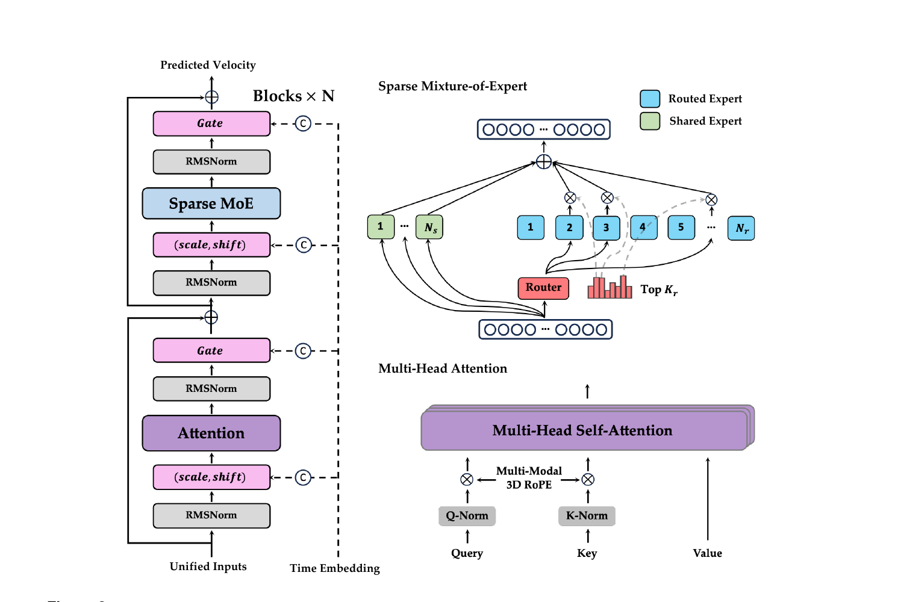
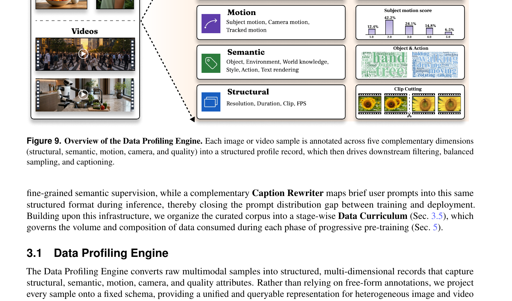
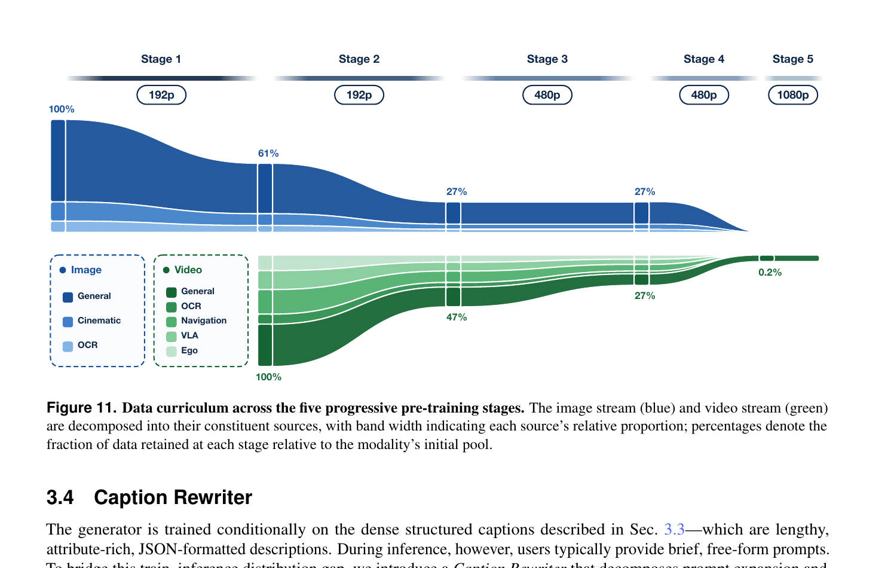
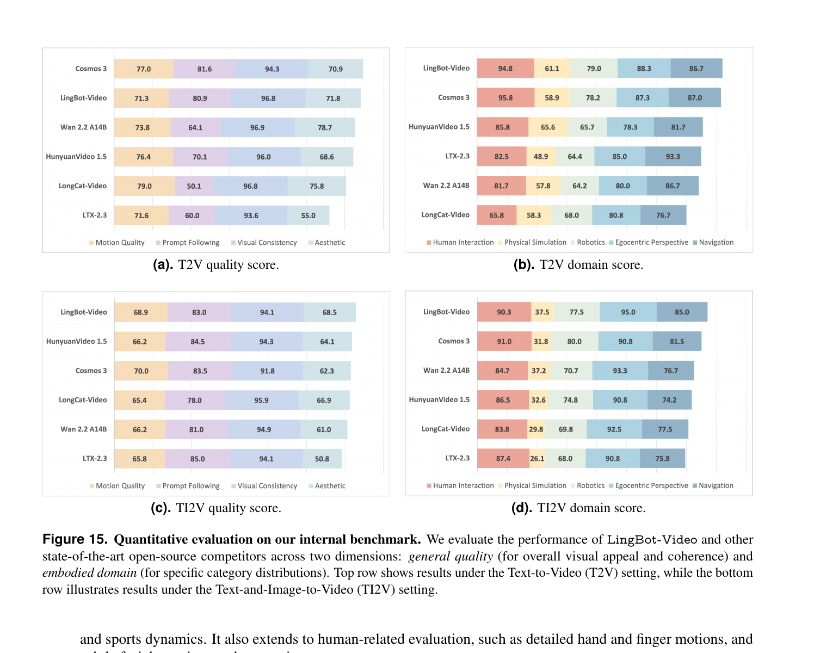
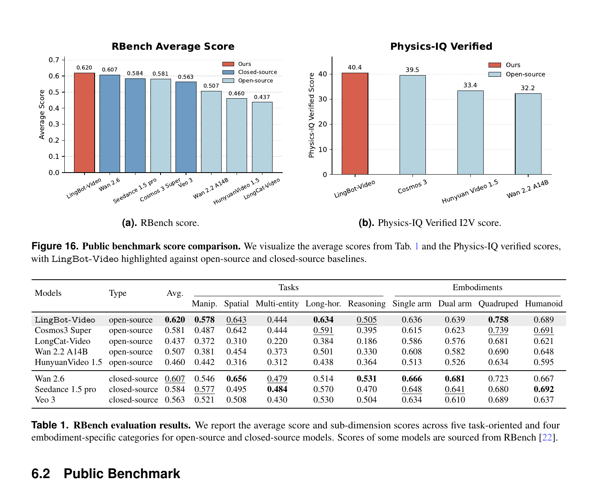

# LingBot-Video: Scaling Mixture-of-Experts Video Pretraining for Embodied Intelligence

**来源**: Ant Group (Robbyant) | **时间**: 2026 | **GitHub**: [robbyant/lingbot-video](https://github.com/robbyant/lingbot-video)

---

## 1. 一句话定位

首个大规模开源 **MoE 视频 foundation model**,专为具身智能（embodied intelligence）设计:Sparse MoE DiT 架构实现算力-容量解耦,70,000+ 小时机器人/导航/第一视角视频注入物理先验,6 维奖励 + RealNFT 后训练增强物理合理性,TI2V 开源第一、RBench 全榜第一(0.620)。

---

## 2. 要解决的问题

现有视频生成模型对具身智能的三大短板:

| 维度 | 问题 |
|------|------|
| **架构** | 密集 FFN 把所有参数对所有 token 激活,推理算力与参数量线性耦合,百亿参数 → 长视频不可行 |
| **数据** | 训练数据以互联网视频为主,缺乏接触力学、刚体运动、机器人操作的具体物理先验 |
| **训练目标** | 只优化视觉美观/文本对齐,不惩罚物体穿透、运动不一致、任务未完成等物理合理性失败 |

---

## 3. 与前作的关系

```
Dense DiT (HunyuanVideo, Wan2.2, LTX-2.3)
    └─ 单流/双流 dense FFN → 高参数时推理慢
MoE LLM (DeepSeek-V3, Mixtral)
    └─ sigmoid 路由 + 共享专家 → 容量-算力解耦
            ↓ LingBot-Video
    首次将 DeepSeek 风格 MoE 移植到视频 DiT
    + 70k 小时 VLA 注入具身先验
    + Flash-GRPO + RealNFT 物理后训练
```

核心 incremental claim:
- **架构**: 单流 DiT + Sparse MoE 替换 dense FFN;证明 MoE 13B-A1.4B > Dense 1.3B(等 FLOPs),MoE 30B 比 Dense 30B 快 3.18×(1M token 序列)
- **数据**: 首次系统注入 70k+ 小时多平台 VLA 数据到视频预训练
- **后训练**: 6 维解耦奖励 + CPS 随机步 + Negative-Aware Finetuning(RealNFT)

---

## 4. 核心算法/方法

### 4.1 单流扩散 Transformer (Single-Stream DiT)

**统一输入**: 视觉 latent patch token + 条件 token 拼接成单一序列,再全部通过相同的 N 个 transformer block。对比双流 MMDiT(JoyAI-Image),避免每 block 在 image/text 之间做 split-cat-concat 的内存/带宽开销。

```
输入: visual_patches (B, T*H*W, C) + text_embeds (B, L, C)
joint = cat([visual_patches, text_embeds], dim=1)  # (B, T*H*W+L, C)
for block in blocks:
    joint = block(joint, temb6, rotary)
output = proj_out(joint[:, :n_video])  # 只取 video 部分
```

**任务统一**: T2I 视为 T=1 的单帧视频;TI2V 通过 `cond_latent` inpainting(把第一帧写进 latent 并在每步保持不变)实现条件注入,无需单独的 encoder。

**代码**:
- Transformer forward: `transformer_lingbot_video.py:1097`
- patch embed + interleave: `transformer_lingbot_video.py:1119-1148`
- `_apply_inpainting`: `pipeline_lingbot_video.py:138`

### 4.2 Multi-Modal 3D RoPE

条件 token 与视觉 token 赋予**不重叠的时间轴坐标**:

```
条件 token t ∈ [1..L]:  位置 = (t, 0, 0)   # 仅时间轴不同
视觉 token (f, h, w):   位置 = (L+1+f, h, w)
```

三轴 RoPE 维度 `axes_dims=(32, 48, 48)`,sum=128=`head_dim`。这样条件与视觉 token 在时间轴上完全分离,spatial/temporal 信息独立编码,attention 全程 single-stream 不需要手动 mask。

**代码**: `transformer_lingbot_video.py:164-180` (`make_joint_position_ids`)

### 4.3 AdaLN-Single 调制

与每 block 独立 MLP 的传统 AdaLN 不同,时间步调制**只算一次**:

```python
# 共享: time_embedder → time_modulation → (B, S, 6D) 
temb6 = self.time_modulation(t_emb.expand(B, S, -1).reshape(B*S, -1))
# 每 block: 学可训练 scale_shift_table (1, 6*H), 零初始化
mod = temb6.view(B, S, -1) + self.scale_shift_table.unsqueeze(0)
shift_msa, scale_msa, gate_msa, shift_mlp, scale_mlp, gate_mlp = mod.chunk(6, dim=-1)
gate_*= gate_*.tanh()  # gate ∈ (-1, 1)
scale_* = 1.0 + scale_*
```

`scale_shift_table` 用小随机值初始化(per-layer,不是零),提供稳定的残差学习起点。

**代码**: `transformer_lingbot_video.py:900,939-942`

### 4.4 Sparse MoE 架构



> Fig 2:左侧为单流 transformer block(Attention + Sparse MoE 两个分支各有 AdaLN-Single 调制);右侧展示 MoE 的 shared expert + 路由 expert 结构,以及 attention 中 QK-Norm + MM-3D-RoPE。

每个 MoE block 的 FFN 输出:

$$
m(\mathbf{u}_t) = \sum_{i=1}^{N_s} E_i^{(s)}(\mathbf{u}_t) + \sum_{j \in \mathcal{R}_b(\mathbf{u}_t)} g_{t,j} E_j^{(r)}(\mathbf{u}_t)
$$

- `N_s` 个**共享专家**:所有 token 必过,捕获通用物理先验
- `N_r` 个**路由专家**:sigmoid router + group-limited top-`K_r` 选取
- 路由权重: `α_{t,j} = Sigmoid(u_t^T r_j)`
- 在线偏置校正 `b_j ← b_j - η·sign(n_j - n̄)` 防止专家负载不均衡(辅助损失-free)
- Sequence-wise auxiliary loss `L_seq`(DeepSeek-V3 风格)在序列内部做均衡

**专家规模探索**:
- E=64/128/256 固定 active=1.4B,E=128 最优(E=256 提升边际,但内存+通信开销大)
- 细粒度 E=128,K=8 > 粗粒度 E=64,K=4(相同 active 参数)

**代码**:
- Router: `transformer_lingbot_video.py:333-385`
- `LingBotVideoSparseMoeBlock.forward`: `transformer_lingbot_video.py:854-872`
- Expert backends: grouped_mm / sglang_triton / sglang_triton_fp8 三路可选 (`transformer_lingbot_video.py:671-702`)

### 4.5 级联精炼器 (Cascaded Refiner)

Base generator: 480p → Refiner: 1080p(独立训练,共享 VAE + condition encoder 权重)。

Refiner 用**有阈值的 rectified flow**:

$$
x_t = \left(1 - \frac{t}{\tau}\right)x_0 + \frac{t}{\tau}x_\tau, \quad v^*_\text{ref} = \frac{x_\tau - x_0}{\tau}
$$

其中 `τ ~ Uniform(0.85, 0.95)`,低分辨率输出经上采样+VAE编码得 `x_{1r}`;推理时加噪到 `t_inf`(如 0.85)起步去噪。Refiner 的 capacity 专注于高频细节恢复和 local artifact 修正,不改动全局语义。

### 4.6 Flow UniPC 调度器

**代码**: `scheduling_flow_unipc.py`

将 UniPC(Predictor-Corrector)适配到 flow matching 的 `flow_prediction` 模式:

$$
\hat{x}_0 = x_t - \sigma_t \cdot v_\theta(x_t, c, t)
$$

即直接从速度预测推 `x0`(等价于 `x0 = sample - sigma * model_output`)。默认 `solver_order=2`,BH2 variant,`predict_x0=True`。每步先 Predict(UniP),若不在 `disable_corrector` 列表内再 Correct(UniC)。

Sigma schedule: `σ' = shift * σ / (1 + (shift-1) * σ)`,`shift=3.0`(默认)偏移时间轴向高噪声端。

**代码**: `scheduling_flow_unipc.py:314-317` (x0 predict),`scheduling_flow_unipc.py:651-731` (step)

### 4.7 数据引擎



> Fig 9:五维标注(结构/语义/运动/摄像机/质量)驱动后续过滤、采样和字幕生成。

三层数据基础设施:

**Data Profiling Engine** — 5 维结构化记录:
- Structural: 分辨率/时长/FPS/TransNetV2 镜头切割
- Semantic: Qwen3-VL-4B 提取前背景对象/世界知识/风格/动作/文字渲染
- Motion: 摄像机运动+主体运动+LocoTrack 跟踪运动(过滤近静态)
- Camera: 色调/景别/焦距/构图/光质(7 属性)
- Quality: HPSv3 美学评分 + OmniAID 合成图像检测

**World-Knowledge Topological Graph** — 分布感知采样:
- 语义树: 50,000 叶节点 Wikipedia 概念,按 embedding 聚类 + LLM Discover-Classify-Consolidate
- 动作树: 数百规范动作节点,VLA 视频额外挂 action link
- 难度/损失反馈 → 稀有节点上权重,过饱和节点降权

**Dense Structured Captioning** — JSON 格式层次字幕:
- 图像字幕: 全局描述 + 7 摄像机标签 + 命名实体列表 + 每个元素位置/形状/颜色/关系
- 视频字幕: 在图像字幕基础上加时序动作时间戳 `[2.67s, 3.67s]`
- VLA字幕: robotic arm/gripper 当作普通 prominent element 写入
- Egocentric 字幕: 头部/手部运动+对象交互

70,000+ 小时具身视频: 真实机器人操作 + 仿真 + 开源 + 第一视角导航 + 人体手+足运动。

### 4.8 五阶段数据课程



> Fig 11:蓝色(图像)从 Stage1 100% 逐渐降到几乎消失;绿色(视频)从 Stage2 47% 的通用视频开始,VLA/Ego/Navigation 等具身数据在后期阶段显著增加。

| 阶段 | 分辨率 | 核心目标 |
|------|--------|----------|
| Stage 1 | 192p image-only | 建立视觉先验,稳定 MoE router 初始化 |
| Stage 2 | 192p T2V | 低分辨率时序建模;图像继续强化帧级先验 |
| Stage 3 | 480p T2V+TI2V | 引入 TI2V 多任务条件;学习首帧保持 |
| Stage 4 | 480p weighted | 分布归一化;稀有具身数据低过滤门槛上权重 |
| Stage 5 | 1080p refiner | 级联精炼器专用;极小高质量子集 |

### 4.9 后训练: 6 维奖励 + On-Policy GRPO

**6 个解耦奖励**:

| 维度 | 评估器 | 关注点 |
|------|--------|--------|
| Vision Quality | HPSv3 | 清晰度/美观/字幕对齐 |
| Text-Video Alignment | Qwen3.6-27B 零样本 VQA | 时序动作核查(时间切片+二叉窗策略) |
| Dynamic Degree | Qwen3.6-27B | 运动幅度 1-5 分映射连续奖励 |
| Motion Coherence | Pulse-of-Motion 估计 | 24fps 下自然运动速度,惩罚慢动作感 |
| Human-Motion Consistency | 蒸馏 VLM-MoE | 5维人体拓扑评分(手形/肢体数/透明度/面部/时序) |
| Physical Plausibility | 专用 caption-conditioned 评估器 | 运动因果性/对象永恒/材料真实性+任务完成度 |

**归一化**: 每个奖励在 group 内独立 z-score 归一化后加权融合:

$$
\hat{A}^{(i)} = \sum_r w_r \frac{R_r(\mathbf{x}_0^{(i)}, c) - \mu_r}{\sigma_r + \delta}
$$

**Flash-GRPO 单步随机探索**:
- 每 group 共享一个随机步 k(取自前半段调度),只有该步 `t_k → t_{k+1}` 用 CPS 随机采样
- CPS 随机过渡: `x_{t_{i+1}} = μ_θ + s_i ε`(保持在 marginal path 上,避免 SDE 额外噪声)
- 时间步平衡梯度重权: `λ_k = κ_k^{-1} / (1/N Σ κ_j^{-1})`

**GRPO 目标**:

$$
\mathcal{L}_\text{GRPO}(\theta) = -\mathbb{E}\left[\lambda_k \hat{A}^{(i)} \log \pi_\theta\!\left(\mathbf{x}_{t_{k+1}}^{(i)} \mid \mathbf{x}_{t_k}^{(i)}\right)\right]
$$

### 4.10 Negative-Aware Finetuning (RealNFT)

真实视频作为 chosen,生成视频作为 rejected;套用 DiffusionNFT 框架:

$$
\mathcal{L}_\text{chosen} = \lVert \hat{v}_\text{pos}^w - v^w \rVert^2, \quad
\mathcal{L}_\text{reject} = r \lVert \hat{v}_\text{pos}^l - v^l \rVert^2 + (1-r) \lVert \hat{v}_\text{neg}^l - v^l \rVert^2
$$

取 `r=0` 简化(rejected 样本不需奖励模型打分),加 KL 正则对抗漂移:

$$
\mathcal{L}_\text{KL} = \tfrac{1}{2}\!\left(\lVert \hat{v}_\theta^w - \hat{v}_\text{ref}^w \rVert^2 + \lVert \hat{v}_\theta^l - \hat{v}_\text{ref}^l \rVert^2\right)
$$

$$
\mathcal{L}_\text{RealNFT} = \mathcal{L}_\text{chosen} + \mathcal{L}_\text{reject} + \lambda_\text{KL} \mathcal{L}_\text{KL}
$$

### 4.11 Action-to-Video 后训练 (LingBot-Video-A2V)

以 LingBot-Video 为基底,追加 ActionEmbedder:

```
frame-wise actions (4T,) → Reshape [T, 4*dimA] → ActionEmbedder
    → latent-wise aligned [T+1, hidden_dim] (prepend zero for initial state)
    → 注入每个 transformer block 的时间步 embedding 分支(residual)
```

使用 Fourier GR-1 数据集,字幕重写为只描述初始状态(屏蔽未来信息)。训练 8k steps,lr=1e-5。

---

## 5. 关键代码位置

| 模块 | 文件:行号 | 说明 |
|------|-----------|------|
| Transformer 整体 | `transformer_lingbot_video.py:968` | `LingBotVideoTransformer3DModel` |
| 单个 Block | `transformer_lingbot_video.py:875` | `LingBotVideoBlock` — AdaLN + Attn + MoE/MLP |
| AdaLN modulation | `transformer_lingbot_video.py:939` | scale_shift_table + temb6 = 6 分量 |
| Sparse MoE Block | `transformer_lingbot_video.py:403` | shared + routed experts |
| Router | `transformer_lingbot_video.py:333` | sigmoid + group-limited topk + bias correction |
| Expert compute | `transformer_lingbot_video.py:671` | 三种 backend:grouped_mm/sglang_triton/fp8 |
| MM-3D-RoPE | `transformer_lingbot_video.py:123` | 动态扩容 freqs_cis 表 |
| 位置编码生成 | `transformer_lingbot_video.py:164` | `make_joint_position_ids` — video/text 不重叠时间轴 |
| Context Parallel plan | `transformer_lingbot_video.py:1081` | cp_joint/rotary/temb_input/temb6/out 的 split/gather |
| Pipeline 主推理 | `pipeline_lingbot_video.py:356` | CFG 三种模式:sequential/batch/cfg_parallel |
| encode_prompt | `pipeline_lingbot_video.py:201` | Qwen3-VL-4B → crop 系统 prompt 前缀 |
| TI2V inpainting | `pipeline_lingbot_video.py:138` | `_apply_inpainting`: cond_latent[:, :cond_t] 写入 |
| Flow UniPC step | `scheduling_flow_unipc.py:651` | P-C 两步;x0_pred = x_t - σ·v_θ |
| FP32 模块列表 | `transformer_lingbot_video.py:46` | norm/router/scale_shift_table 强制 fp32 |

---

## 6. 关键配置项

从代码中推断实际部署参数:

```python
# text encoder
text_dim = 2560          # Qwen3-VL-4B 隐藏层维度
HIDDEN_STATE_SKIP_LAYER = 0  # 取最后一层 hidden states
TOKEN_LENGTH = 37698     # 最大 token 数(含多模态视觉 token)

# VAE (Wan2.1-VAE)
vae_scale_factor_temporal = 4    # 时间压缩比 4×
vae_scale_factor_spatial = 8     # 空间压缩比 8×

# transformer
patch_size = (1, 2, 2)  # 时间方向不压,空间 2×2
in_channels = 16        # VAE latent 通道数
axes_dims = (32, 48, 48)  # RoPE: t/h/w 各占 head_dim 的分量
rope_theta = 256.0

# inference
num_frames: 4n+1 约束 (1, 5, 9, ..., 81)  # 见 pipeline:133
default shift = 3.0     # flow sigma 偏移量
default guidance_scale = 6.0
num_inference_steps = 40 (default)
```

MoE 最优配置 (论文 Sec. 2.3):
- 13B 总参,1.4B active,128 routed experts,top-8 routing,sigmoid score_func
- `n_group=8, topk_group=4` (group-limited routing)
- `routed_scaling_factor(γ)=1.0`

---

## 7. 争议/权衡

### 性能表现



> Fig 15:TI2V(下行)是 LingBot-Video 最强,运动质量/Prompt Following/视觉一致性全面第一;T2V(上行)运动质量(71.3)略低于 Cosmos 3(77.0)和 HunyuanVideo(76.4),整体第二。



> Fig 16:RBench 0.620 开源第一(超过 Cosmos 3 Super 0.581);Physics-IQ Verified I2V 40.4,远超 Cosmos 3(39.5)、Hunyuan(33.4)和 Wan(32.2)。

### MoE 的实际代价
- **推理速度**: MoE 30B-A3B 在 1M token 时约等于 Dense 3B 速度(比率 0.97×),但比 Dense 14B 快 1.50×;expert 通信开销在短序列(16K token)时反而略慢于等 active 参数的 Dense
- **内存**: 专家权重需要全部加载;即使 active=1.4B,但 13B 参数总量仍需完整装载
- **负载均衡**: sequence-wise aux loss 在 batch 内均衡良好,但跨 batch 的全局均衡依赖在线 bias correction;启动初期 router collapse 风险(靠 Stage1 image-only warm-up 缓解)

### 数据的不对称
- 70k 小时 VLA 相比数百万小时互联网视频仍属小众;Stage 4 的"低过滤门槛"可能引入低质量具身样本
- VLA 数据以 GR-1/Open-X 为主,泛化到工业机器人/人形机器人存疑

### 后训练设计取舍
- Flash-GRPO 单步随机 vs Flow-GRPO 全步随机:credit assignment 更精准但 diversity 降低
- RealNFT 中 r=0 意味着 rejected 样本完全走 negative policy,省掉奖励模型评分开销,但也放弃了 per-sample 的精细化控制
- 6 维奖励中 Physical Plausibility 评估器本身是 caption-conditioned,对无 dense caption 的推理场景可能出现评估漂移

---

## 8. 一句话总结

LingBot-Video 证明 **MoE + 大规模具身数据 + 物理感知后训练** 三者协同可以让一个开源视频模型在 embodied AI benchmark 上超越全部竞品:MoE 解决推理效率,VLA 数据注入物理先验,RealNFT/GRPO 让物理合理性变成可以显式优化的目标。
